cola Report for GDS2960
==================

**Date**: 2019-12-25 20:37:37 CET, **cola version**: 1.3.2

----------------------------------------------------------------

<style type='text/css'>

body, td, th {
   font-family: Arial,Helvetica,sans-serif;
   background-color: white;
   font-size: 13px;
  max-width: 800px;
  margin: auto;
  margin-left:210px;
  padding: 0px 10px 0px 10px;
  border-left: 1px solid #EEEEEE;
  line-height: 150%;
}

tt, code, pre {
   font-family: 'DejaVu Sans Mono', 'Droid Sans Mono', 'Lucida Console', Consolas, Monaco, 

monospace;
}

h1 {
   font-size:2.2em;
}

h2 {
   font-size:1.8em;
}

h3 {
   font-size:1.4em;
}

h4 {
   font-size:1.0em;
}

h5 {
   font-size:0.9em;
}

h6 {
   font-size:0.8em;
}

a {
  text-decoration: none;
  color: #0366d6;
}

a:hover {
  text-decoration: underline;
}

a:visited {
   color: #0366d6;
}

pre, img {
  max-width: 100%;
}
pre {
  overflow-x: auto;
}
pre code {
   display: block; padding: 0.5em;
}

code {
  font-size: 92%;
  border: 1px solid #ccc;
}

code[class] {
  background-color: #F8F8F8;
}

table, td, th {
  border: 1px solid #ccc;
}

blockquote {
   color:#666666;
   margin:0;
   padding-left: 1em;
   border-left: 0.5em #EEE solid;
}

hr {
   height: 0px;
   border-bottom: none;
   border-top-width: thin;
   border-top-style: dotted;
   border-top-color: #999999;
}

@media print {
   * {
      background: transparent !important;
      color: black !important;
      filter:none !important;
      -ms-filter: none !important;
   }

   body {
      font-size:12pt;
      max-width:100%;
   }

   a, a:visited {
      text-decoration: underline;
   }

   hr {
      visibility: hidden;
      page-break-before: always;
   }

   pre, blockquote {
      padding-right: 1em;
      page-break-inside: avoid;
   }

   tr, img {
      page-break-inside: avoid;
   }

   img {
      max-width: 100% !important;
   }

   @page :left {
      margin: 15mm 20mm 15mm 10mm;
   }

   @page :right {
      margin: 15mm 10mm 15mm 20mm;
   }

   p, h2, h3 {
      orphans: 3; widows: 3;
   }

   h2, h3 {
      page-break-after: avoid;
   }
}
</style>


## Summary


All available functions which can be applied to this `res_list` object:


```r
res_list
```

```
#> A 'ConsensusPartitionList' object with 24 methods.
#>   On a matrix with 3925 rows and 101 columns.
#>   Top rows are extracted by 'SD, CV, MAD, ATC' methods.
#>   Subgroups are detected by 'hclust, kmeans, skmeans, pam, mclust, NMF' method.
#>   Number of partitions are tried for k = 2, 3, 4, 5, 6.
#>   Performed in total 30000 partitions by row resampling.
#> 
#> Following methods can be applied to this 'ConsensusPartitionList' object:
#>  [1] "cola_report"           "collect_classes"       "collect_plots"         "collect_stats"        
#>  [5] "colnames"              "functional_enrichment" "get_anno_col"          "get_anno"             
#>  [9] "get_classes"           "get_matrix"            "get_membership"        "get_stats"            
#> [13] "is_best_k"             "is_stable_k"           "ncol"                  "nrow"                 
#> [17] "rownames"              "show"                  "suggest_best_k"        "test_to_known_factors"
#> [21] "top_rows_heatmap"      "top_rows_overlap"     
#> 
#> You can get result for a single method by, e.g. object["SD", "hclust"] or object["SD:hclust"]
#> or a subset of methods by object[c("SD", "CV")], c("hclust", "kmeans")]
```

The call of `run_all_consensus_partition_methods()` was:


```
#> run_all_consensus_partition_methods(data = mat, mc.cores = 4, anno = anno)
```

Dimension of the input matrix:


```r
mat = get_matrix(res_list)
dim(mat)
```

```
#> [1] 3925  101
```

### Density distribution

The density distribution for each sample is visualized as in one column in the
following heatmap. The clustering is based on the distance which is the
Kolmogorov-Smirnov statistic between two distributions.


```r
library(ComplexHeatmap)
densityHeatmap(mat, top_annotation = HeatmapAnnotation(df = get_anno(res_list), 
    col = get_anno_col(res_list)), ylab = "value", cluster_columns = TRUE, show_column_names = FALSE,
    mc.cores = 4)
```


### Suggest the best k


Folowing table shows the best `k` (number of partitions) for each combination
of top-value methods and partition methods. Clicking on the method name in
the table goes to the section for a single combination of methods.

[The cola vignette](http://bioconductor.org/packages/devel/bioc/vignettes/cola/inst/doc/cola.html#toc_13)
explains the definition of the metrics used for determining the best
number of partitions.


```r
suggest_best_k(res_list)
```


|                            | The best k| 1-PAC| Mean silhouette| Concordance|   |Optional k |
|:---------------------------|----------:|-----:|---------------:|-----------:|:--|:----------|
|[SD:kmeans](#SD-kmeans)     |          2| 1.000|           0.985|       0.987|** |           |
|[SD:NMF](#SD-NMF)           |          3| 1.000|           0.997|       0.998|** |2          |
|[MAD:kmeans](#MAD-kmeans)   |          2| 1.000|           0.986|       0.988|** |           |
|[MAD:NMF](#MAD-NMF)         |          3| 1.000|           0.996|       0.998|** |2          |
|[ATC:kmeans](#ATC-kmeans)   |          2| 1.000|           0.998|       0.998|** |           |
|[ATC:NMF](#ATC-NMF)         |          3| 1.000|           0.973|       0.989|** |2          |
|[CV:pam](#CV-pam)           |          5| 0.964|           0.914|       0.965|** |3,4        |
|[ATC:pam](#ATC-pam)         |          6| 0.963|           0.915|       0.962|** |4,5        |
|[MAD:hclust](#MAD-hclust)   |          3| 0.961|           0.934|       0.965|** |2          |
|[CV:hclust](#CV-hclust)     |          3| 0.952|           0.910|       0.960|** |2          |
|[MAD:pam](#MAD-pam)         |          5| 0.951|           0.928|       0.969|** |3,4        |
|[CV:mclust](#CV-mclust)     |          5| 0.943|           0.909|       0.955|*  |2,3        |
|[MAD:mclust](#MAD-mclust)   |          6| 0.941|           0.860|       0.938|*  |2,5        |
|[SD:skmeans](#SD-skmeans)   |          5| 0.939|           0.932|       0.952|*  |2,3,4      |
|[SD:pam](#SD-pam)           |          5| 0.939|           0.933|       0.970|*  |3,4        |
|[ATC:mclust](#ATC-mclust)   |          6| 0.936|           0.910|       0.922|*  |4          |
|[ATC:skmeans](#ATC-skmeans) |          6| 0.929|           0.902|       0.909|*  |2,3,4,5    |
|[MAD:skmeans](#MAD-skmeans) |          6| 0.923|           0.833|       0.889|*  |2,3,4,5    |
|[CV:skmeans](#CV-skmeans)   |          6| 0.916|           0.810|       0.890|*  |2,3,4,5    |
|[SD:hclust](#SD-hclust)     |          3| 0.914|           0.918|       0.961|*  |2          |
|[SD:mclust](#SD-mclust)     |          6| 0.912|           0.813|       0.907|*  |2,3,5      |
|[CV:NMF](#CV-NMF)           |          4| 0.905|           0.909|       0.946|*  |2,3        |
|[ATC:hclust](#ATC-hclust)   |          2| 0.853|           0.978|       0.987|   |           |
|[CV:kmeans](#CV-kmeans)     |          4| 0.846|           0.960|       0.904|   |           |

\*\*: 1-PAC > 0.95, \*: 1-PAC > 0.9


### CDF of consensus matrices

Cumulative distribution function curves of consensus matrix for all methods.


```r
collect_plots(res_list, fun = plot_ecdf)
```


### Consensus heatmap

Consensus heatmaps for all methods. ([What is a consensus heatmap?](http://bioconductor.org/packages/devel/bioc/vignettes/cola/inst/doc/cola.html#toc_9))


<style type='text/css'>


.ui-helper-hidden {
	display: none;
}
.ui-helper-hidden-accessible {
	border: 0;
	clip: rect(0 0 0 0);
	height: 1px;
	margin: -1px;
	overflow: hidden;
	padding: 0;
	position: absolute;
	width: 1px;
}
.ui-helper-reset {
	margin: 0;
	padding: 0;
	border: 0;
	outline: 0;
	line-height: 1.3;
	text-decoration: none;
	font-size: 100%;
	list-style: none;
}
.ui-helper-clearfix:before,
.ui-helper-clearfix:after {
	content: "";
	display: table;
	border-collapse: collapse;
}
.ui-helper-clearfix:after {
	clear: both;
}
.ui-helper-zfix {
	width: 100%;
	height: 100%;
	top: 0;
	left: 0;
	position: absolute;
	opacity: 0;
	filter:Alpha(Opacity=0); 
}

.ui-front {
	z-index: 100;
}


.ui-state-disabled {
	cursor: default !important;
	pointer-events: none;
}


.ui-icon {
	display: inline-block;
	vertical-align: middle;
	margin-top: -.25em;
	position: relative;
	text-indent: -99999px;
	overflow: hidden;
	background-repeat: no-repeat;
}

.ui-widget-icon-block {
	left: 50%;
	margin-left: -8px;
	display: block;
}


.ui-widget-overlay {
	position: fixed;
	top: 0;
	left: 0;
	width: 100%;
	height: 100%;
}
.ui-accordion .ui-accordion-header {
	display: block;
	cursor: pointer;
	position: relative;
	margin: 2px 0 0 0;
	padding: .5em .5em .5em .7em;
	font-size: 100%;
}
.ui-accordion .ui-accordion-content {
	padding: 1em 2.2em;
	border-top: 0;
	overflow: auto;
}
.ui-autocomplete {
	position: absolute;
	top: 0;
	left: 0;
	cursor: default;
}
.ui-menu {
	list-style: none;
	padding: 0;
	margin: 0;
	display: block;
	outline: 0;
}
.ui-menu .ui-menu {
	position: absolute;
}
.ui-menu .ui-menu-item {
	margin: 0;
	cursor: pointer;
	
	list-style-image: url("data:image/gif;base64,R0lGODlhAQABAIAAAAAAAP///yH5BAEAAAAALAAAAAABAAEAAAIBRAA7");
}
.ui-menu .ui-menu-item-wrapper {
	position: relative;
	padding: 3px 1em 3px .4em;
}
.ui-menu .ui-menu-divider {
	margin: 5px 0;
	height: 0;
	font-size: 0;
	line-height: 0;
	border-width: 1px 0 0 0;
}
.ui-menu .ui-state-focus,
.ui-menu .ui-state-active {
	margin: -1px;
}


.ui-menu-icons {
	position: relative;
}
.ui-menu-icons .ui-menu-item-wrapper {
	padding-left: 2em;
}


.ui-menu .ui-icon {
	position: absolute;
	top: 0;
	bottom: 0;
	left: .2em;
	margin: auto 0;
}


.ui-menu .ui-menu-icon {
	left: auto;
	right: 0;
}
.ui-button {
	padding: .4em 1em;
	display: inline-block;
	position: relative;
	line-height: normal;
	margin-right: .1em;
	cursor: pointer;
	vertical-align: middle;
	text-align: center;
	-webkit-user-select: none;
	-moz-user-select: none;
	-ms-user-select: none;
	user-select: none;

	
	overflow: visible;
}

.ui-button,
.ui-button:link,
.ui-button:visited,
.ui-button:hover,
.ui-button:active {
	text-decoration: none;
}


.ui-button-icon-only {
	width: 2em;
	box-sizing: border-box;
	text-indent: -9999px;
	white-space: nowrap;
}


input.ui-button.ui-button-icon-only {
	text-indent: 0;
}


.ui-button-icon-only .ui-icon {
	position: absolute;
	top: 50%;
	left: 50%;
	margin-top: -8px;
	margin-left: -8px;
}

.ui-button.ui-icon-notext .ui-icon {
	padding: 0;
	width: 2.1em;
	height: 2.1em;
	text-indent: -9999px;
	white-space: nowrap;

}

input.ui-button.ui-icon-notext .ui-icon {
	width: auto;
	height: auto;
	text-indent: 0;
	white-space: normal;
	padding: .4em 1em;
}


input.ui-button::-moz-focus-inner,
button.ui-button::-moz-focus-inner {
	border: 0;
	padding: 0;
}
.ui-controlgroup {
	vertical-align: middle;
	display: inline-block;
}
.ui-controlgroup > .ui-controlgroup-item {
	float: left;
	margin-left: 0;
	margin-right: 0;
}
.ui-controlgroup > .ui-controlgroup-item:focus,
.ui-controlgroup > .ui-controlgroup-item.ui-visual-focus {
	z-index: 9999;
}
.ui-controlgroup-vertical > .ui-controlgroup-item {
	display: block;
	float: none;
	width: 100%;
	margin-top: 0;
	margin-bottom: 0;
	text-align: left;
}
.ui-controlgroup-vertical .ui-controlgroup-item {
	box-sizing: border-box;
}
.ui-controlgroup .ui-controlgroup-label {
	padding: .4em 1em;
}
.ui-controlgroup .ui-controlgroup-label span {
	font-size: 80%;
}
.ui-controlgroup-horizontal .ui-controlgroup-label + .ui-controlgroup-item {
	border-left: none;
}
.ui-controlgroup-vertical .ui-controlgroup-label + .ui-controlgroup-item {
	border-top: none;
}
.ui-controlgroup-horizontal .ui-controlgroup-label.ui-widget-content {
	border-right: none;
}
.ui-controlgroup-vertical .ui-controlgroup-label.ui-widget-content {
	border-bottom: none;
}


.ui-controlgroup-vertical .ui-spinner-input {

	
	width: 75%;
	width: calc( 100% - 2.4em );
}
.ui-controlgroup-vertical .ui-spinner .ui-spinner-up {
	border-top-style: solid;
}

.ui-checkboxradio-label .ui-icon-background {
	box-shadow: inset 1px 1px 1px #ccc;
	border-radius: .12em;
	border: none;
}
.ui-checkboxradio-radio-label .ui-icon-background {
	width: 16px;
	height: 16px;
	border-radius: 1em;
	overflow: visible;
	border: none;
}
.ui-checkboxradio-radio-label.ui-checkboxradio-checked .ui-icon,
.ui-checkboxradio-radio-label.ui-checkboxradio-checked:hover .ui-icon {
	background-image: none;
	width: 8px;
	height: 8px;
	border-width: 4px;
	border-style: solid;
}
.ui-checkboxradio-disabled {
	pointer-events: none;
}
.ui-datepicker {
	width: 17em;
	padding: .2em .2em 0;
	display: none;
}
.ui-datepicker .ui-datepicker-header {
	position: relative;
	padding: .2em 0;
}
.ui-datepicker .ui-datepicker-prev,
.ui-datepicker .ui-datepicker-next {
	position: absolute;
	top: 2px;
	width: 1.8em;
	height: 1.8em;
}
.ui-datepicker .ui-datepicker-prev-hover,
.ui-datepicker .ui-datepicker-next-hover {
	top: 1px;
}
.ui-datepicker .ui-datepicker-prev {
	left: 2px;
}
.ui-datepicker .ui-datepicker-next {
	right: 2px;
}
.ui-datepicker .ui-datepicker-prev-hover {
	left: 1px;
}
.ui-datepicker .ui-datepicker-next-hover {
	right: 1px;
}
.ui-datepicker .ui-datepicker-prev span,
.ui-datepicker .ui-datepicker-next span {
	display: block;
	position: absolute;
	left: 50%;
	margin-left: -8px;
	top: 50%;
	margin-top: -8px;
}
.ui-datepicker .ui-datepicker-title {
	margin: 0 2.3em;
	line-height: 1.8em;
	text-align: center;
}
.ui-datepicker .ui-datepicker-title select {
	font-size: 1em;
	margin: 1px 0;
}
.ui-datepicker select.ui-datepicker-month,
.ui-datepicker select.ui-datepicker-year {
	width: 45%;
}
.ui-datepicker table {
	width: 100%;
	font-size: .9em;
	border-collapse: collapse;
	margin: 0 0 .4em;
}
.ui-datepicker th {
	padding: .7em .3em;
	text-align: center;
	font-weight: bold;
	border: 0;
}
.ui-datepicker td {
	border: 0;
	padding: 1px;
}
.ui-datepicker td span,
.ui-datepicker td a {
	display: block;
	padding: .2em;
	text-align: right;
	text-decoration: none;
}
.ui-datepicker .ui-datepicker-buttonpane {
	background-image: none;
	margin: .7em 0 0 0;
	padding: 0 .2em;
	border-left: 0;
	border-right: 0;
	border-bottom: 0;
}
.ui-datepicker .ui-datepicker-buttonpane button {
	float: right;
	margin: .5em .2em .4em;
	cursor: pointer;
	padding: .2em .6em .3em .6em;
	width: auto;
	overflow: visible;
}
.ui-datepicker .ui-datepicker-buttonpane button.ui-datepicker-current {
	float: left;
}


.ui-datepicker.ui-datepicker-multi {
	width: auto;
}
.ui-datepicker-multi .ui-datepicker-group {
	float: left;
}
.ui-datepicker-multi .ui-datepicker-group table {
	width: 95%;
	margin: 0 auto .4em;
}
.ui-datepicker-multi-2 .ui-datepicker-group {
	width: 50%;
}
.ui-datepicker-multi-3 .ui-datepicker-group {
	width: 33.3%;
}
.ui-datepicker-multi-4 .ui-datepicker-group {
	width: 25%;
}
.ui-datepicker-multi .ui-datepicker-group-last .ui-datepicker-header,
.ui-datepicker-multi .ui-datepicker-group-middle .ui-datepicker-header {
	border-left-width: 0;
}
.ui-datepicker-multi .ui-datepicker-buttonpane {
	clear: left;
}
.ui-datepicker-row-break {
	clear: both;
	width: 100%;
	font-size: 0;
}


.ui-datepicker-rtl {
	direction: rtl;
}
.ui-datepicker-rtl .ui-datepicker-prev {
	right: 2px;
	left: auto;
}
.ui-datepicker-rtl .ui-datepicker-next {
	left: 2px;
	right: auto;
}
.ui-datepicker-rtl .ui-datepicker-prev:hover {
	right: 1px;
	left: auto;
}
.ui-datepicker-rtl .ui-datepicker-next:hover {
	left: 1px;
	right: auto;
}
.ui-datepicker-rtl .ui-datepicker-buttonpane {
	clear: right;
}
.ui-datepicker-rtl .ui-datepicker-buttonpane button {
	float: left;
}
.ui-datepicker-rtl .ui-datepicker-buttonpane button.ui-datepicker-current,
.ui-datepicker-rtl .ui-datepicker-group {
	float: right;
}
.ui-datepicker-rtl .ui-datepicker-group-last .ui-datepicker-header,
.ui-datepicker-rtl .ui-datepicker-group-middle .ui-datepicker-header {
	border-right-width: 0;
	border-left-width: 1px;
}


.ui-datepicker .ui-icon {
	display: block;
	text-indent: -99999px;
	overflow: hidden;
	background-repeat: no-repeat;
	left: .5em;
	top: .3em;
}
.ui-dialog {
	position: absolute;
	top: 0;
	left: 0;
	padding: .2em;
	outline: 0;
}
.ui-dialog .ui-dialog-titlebar {
	padding: .4em 1em;
	position: relative;
}
.ui-dialog .ui-dialog-title {
	float: left;
	margin: .1em 0;
	white-space: nowrap;
	width: 90%;
	overflow: hidden;
	text-overflow: ellipsis;
}
.ui-dialog .ui-dialog-titlebar-close {
	position: absolute;
	right: .3em;
	top: 50%;
	width: 20px;
	margin: -10px 0 0 0;
	padding: 1px;
	height: 20px;
}
.ui-dialog .ui-dialog-content {
	position: relative;
	border: 0;
	padding: .5em 1em;
	background: none;
	overflow: auto;
}
.ui-dialog .ui-dialog-buttonpane {
	text-align: left;
	border-width: 1px 0 0 0;
	background-image: none;
	margin-top: .5em;
	padding: .3em 1em .5em .4em;
}
.ui-dialog .ui-dialog-buttonpane .ui-dialog-buttonset {
	float: right;
}
.ui-dialog .ui-dialog-buttonpane button {
	margin: .5em .4em .5em 0;
	cursor: pointer;
}
.ui-dialog .ui-resizable-n {
	height: 2px;
	top: 0;
}
.ui-dialog .ui-resizable-e {
	width: 2px;
	right: 0;
}
.ui-dialog .ui-resizable-s {
	height: 2px;
	bottom: 0;
}
.ui-dialog .ui-resizable-w {
	width: 2px;
	left: 0;
}
.ui-dialog .ui-resizable-se,
.ui-dialog .ui-resizable-sw,
.ui-dialog .ui-resizable-ne,
.ui-dialog .ui-resizable-nw {
	width: 7px;
	height: 7px;
}
.ui-dialog .ui-resizable-se {
	right: 0;
	bottom: 0;
}
.ui-dialog .ui-resizable-sw {
	left: 0;
	bottom: 0;
}
.ui-dialog .ui-resizable-ne {
	right: 0;
	top: 0;
}
.ui-dialog .ui-resizable-nw {
	left: 0;
	top: 0;
}
.ui-draggable .ui-dialog-titlebar {
	cursor: move;
}
.ui-draggable-handle {
	-ms-touch-action: none;
	touch-action: none;
}
.ui-resizable {
	position: relative;
}
.ui-resizable-handle {
	position: absolute;
	font-size: 0.1px;
	display: block;
	-ms-touch-action: none;
	touch-action: none;
}
.ui-resizable-disabled .ui-resizable-handle,
.ui-resizable-autohide .ui-resizable-handle {
	display: none;
}
.ui-resizable-n {
	cursor: n-resize;
	height: 7px;
	width: 100%;
	top: -5px;
	left: 0;
}
.ui-resizable-s {
	cursor: s-resize;
	height: 7px;
	width: 100%;
	bottom: -5px;
	left: 0;
}
.ui-resizable-e {
	cursor: e-resize;
	width: 7px;
	right: -5px;
	top: 0;
	height: 100%;
}
.ui-resizable-w {
	cursor: w-resize;
	width: 7px;
	left: -5px;
	top: 0;
	height: 100%;
}
.ui-resizable-se {
	cursor: se-resize;
	width: 12px;
	height: 12px;
	right: 1px;
	bottom: 1px;
}
.ui-resizable-sw {
	cursor: sw-resize;
	width: 9px;
	height: 9px;
	left: -5px;
	bottom: -5px;
}
.ui-resizable-nw {
	cursor: nw-resize;
	width: 9px;
	height: 9px;
	left: -5px;
	top: -5px;
}
.ui-resizable-ne {
	cursor: ne-resize;
	width: 9px;
	height: 9px;
	right: -5px;
	top: -5px;
}
.ui-progressbar {
	height: 2em;
	text-align: left;
	overflow: hidden;
}
.ui-progressbar .ui-progressbar-value {
	margin: -1px;
	height: 100%;
}
.ui-progressbar .ui-progressbar-overlay {
	background: url("data:image/gif;base64,R0lGODlhKAAoAIABAAAAAP///yH/C05FVFNDQVBFMi4wAwEAAAAh+QQJAQABACwAAAAAKAAoAAACkYwNqXrdC52DS06a7MFZI+4FHBCKoDeWKXqymPqGqxvJrXZbMx7Ttc+w9XgU2FB3lOyQRWET2IFGiU9m1frDVpxZZc6bfHwv4c1YXP6k1Vdy292Fb6UkuvFtXpvWSzA+HycXJHUXiGYIiMg2R6W459gnWGfHNdjIqDWVqemH2ekpObkpOlppWUqZiqr6edqqWQAAIfkECQEAAQAsAAAAACgAKAAAApSMgZnGfaqcg1E2uuzDmmHUBR8Qil95hiPKqWn3aqtLsS18y7G1SzNeowWBENtQd+T1JktP05nzPTdJZlR6vUxNWWjV+vUWhWNkWFwxl9VpZRedYcflIOLafaa28XdsH/ynlcc1uPVDZxQIR0K25+cICCmoqCe5mGhZOfeYSUh5yJcJyrkZWWpaR8doJ2o4NYq62lAAACH5BAkBAAEALAAAAAAoACgAAAKVDI4Yy22ZnINRNqosw0Bv7i1gyHUkFj7oSaWlu3ovC8GxNso5fluz3qLVhBVeT/Lz7ZTHyxL5dDalQWPVOsQWtRnuwXaFTj9jVVh8pma9JjZ4zYSj5ZOyma7uuolffh+IR5aW97cHuBUXKGKXlKjn+DiHWMcYJah4N0lYCMlJOXipGRr5qdgoSTrqWSq6WFl2ypoaUAAAIfkECQEAAQAsAAAAACgAKAAAApaEb6HLgd/iO7FNWtcFWe+ufODGjRfoiJ2akShbueb0wtI50zm02pbvwfWEMWBQ1zKGlLIhskiEPm9R6vRXxV4ZzWT2yHOGpWMyorblKlNp8HmHEb/lCXjcW7bmtXP8Xt229OVWR1fod2eWqNfHuMjXCPkIGNileOiImVmCOEmoSfn3yXlJWmoHGhqp6ilYuWYpmTqKUgAAIfkECQEAAQAsAAAAACgAKAAAApiEH6kb58biQ3FNWtMFWW3eNVcojuFGfqnZqSebuS06w5V80/X02pKe8zFwP6EFWOT1lDFk8rGERh1TTNOocQ61Hm4Xm2VexUHpzjymViHrFbiELsefVrn6XKfnt2Q9G/+Xdie499XHd2g4h7ioOGhXGJboGAnXSBnoBwKYyfioubZJ2Hn0RuRZaflZOil56Zp6iioKSXpUAAAh+QQJAQABACwAAAAAKAAoAAACkoQRqRvnxuI7kU1a1UU5bd5tnSeOZXhmn5lWK3qNTWvRdQxP8qvaC+/yaYQzXO7BMvaUEmJRd3TsiMAgswmNYrSgZdYrTX6tSHGZO73ezuAw2uxuQ+BbeZfMxsexY35+/Qe4J1inV0g4x3WHuMhIl2jXOKT2Q+VU5fgoSUI52VfZyfkJGkha6jmY+aaYdirq+lQAACH5BAkBAAEALAAAAAAoACgAAAKWBIKpYe0L3YNKToqswUlvznigd4wiR4KhZrKt9Upqip61i9E3vMvxRdHlbEFiEXfk9YARYxOZZD6VQ2pUunBmtRXo1Lf8hMVVcNl8JafV38aM2/Fu5V16Bn63r6xt97j09+MXSFi4BniGFae3hzbH9+hYBzkpuUh5aZmHuanZOZgIuvbGiNeomCnaxxap2upaCZsq+1kAACH5BAkBAAEALAAAAAAoACgAAAKXjI8By5zf4kOxTVrXNVlv1X0d8IGZGKLnNpYtm8Lr9cqVeuOSvfOW79D9aDHizNhDJidFZhNydEahOaDH6nomtJjp1tutKoNWkvA6JqfRVLHU/QUfau9l2x7G54d1fl995xcIGAdXqMfBNadoYrhH+Mg2KBlpVpbluCiXmMnZ2Sh4GBqJ+ckIOqqJ6LmKSllZmsoq6wpQAAAh+QQJAQABACwAAAAAKAAoAAAClYx/oLvoxuJDkU1a1YUZbJ59nSd2ZXhWqbRa2/gF8Gu2DY3iqs7yrq+xBYEkYvFSM8aSSObE+ZgRl1BHFZNr7pRCavZ5BW2142hY3AN/zWtsmf12p9XxxFl2lpLn1rseztfXZjdIWIf2s5dItwjYKBgo9yg5pHgzJXTEeGlZuenpyPmpGQoKOWkYmSpaSnqKileI2FAAACH5BAkBAAEALAAAAAAoACgAAAKVjB+gu+jG4kORTVrVhRlsnn2dJ3ZleFaptFrb+CXmO9OozeL5VfP99HvAWhpiUdcwkpBH3825AwYdU8xTqlLGhtCosArKMpvfa1mMRae9VvWZfeB2XfPkeLmm18lUcBj+p5dnN8jXZ3YIGEhYuOUn45aoCDkp16hl5IjYJvjWKcnoGQpqyPlpOhr3aElaqrq56Bq7VAAAOw==");
	height: 100%;
	filter: alpha(opacity=25); 
	opacity: 0.25;
}
.ui-progressbar-indeterminate .ui-progressbar-value {
	background-image: none;
}
.ui-selectable {
	-ms-touch-action: none;
	touch-action: none;
}
.ui-selectable-helper {
	position: absolute;
	z-index: 100;
	border: 1px dotted black;
}
.ui-selectmenu-menu {
	padding: 0;
	margin: 0;
	position: absolute;
	top: 0;
	left: 0;
	display: none;
}
.ui-selectmenu-menu .ui-menu {
	overflow: auto;
	overflow-x: hidden;
	padding-bottom: 1px;
}
.ui-selectmenu-menu .ui-menu .ui-selectmenu-optgroup {
	font-size: 1em;
	font-weight: bold;
	line-height: 1.5;
	padding: 2px 0.4em;
	margin: 0.5em 0 0 0;
	height: auto;
	border: 0;
}
.ui-selectmenu-open {
	display: block;
}
.ui-selectmenu-text {
	display: block;
	margin-right: 20px;
	overflow: hidden;
	text-overflow: ellipsis;
}
.ui-selectmenu-button.ui-button {
	text-align: left;
	white-space: nowrap;
	width: 14em;
}
.ui-selectmenu-icon.ui-icon {
	float: right;
	margin-top: 0;
}
.ui-slider {
	position: relative;
	text-align: left;
}
.ui-slider .ui-slider-handle {
	position: absolute;
	z-index: 2;
	width: 1.2em;
	height: 1.2em;
	cursor: default;
	-ms-touch-action: none;
	touch-action: none;
}
.ui-slider .ui-slider-range {
	position: absolute;
	z-index: 1;
	font-size: .7em;
	display: block;
	border: 0;
	background-position: 0 0;
}


.ui-slider.ui-state-disabled .ui-slider-handle,
.ui-slider.ui-state-disabled .ui-slider-range {
	filter: inherit;
}

.ui-slider-horizontal {
	height: .8em;
}
.ui-slider-horizontal .ui-slider-handle {
	top: -.3em;
	margin-left: -.6em;
}
.ui-slider-horizontal .ui-slider-range {
	top: 0;
	height: 100%;
}
.ui-slider-horizontal .ui-slider-range-min {
	left: 0;
}
.ui-slider-horizontal .ui-slider-range-max {
	right: 0;
}

.ui-slider-vertical {
	width: .8em;
	height: 100px;
}
.ui-slider-vertical .ui-slider-handle {
	left: -.3em;
	margin-left: 0;
	margin-bottom: -.6em;
}
.ui-slider-vertical .ui-slider-range {
	left: 0;
	width: 100%;
}
.ui-slider-vertical .ui-slider-range-min {
	bottom: 0;
}
.ui-slider-vertical .ui-slider-range-max {
	top: 0;
}
.ui-sortable-handle {
	-ms-touch-action: none;
	touch-action: none;
}
.ui-spinner {
	position: relative;
	display: inline-block;
	overflow: hidden;
	padding: 0;
	vertical-align: middle;
}
.ui-spinner-input {
	border: none;
	background: none;
	color: inherit;
	padding: .222em 0;
	margin: .2em 0;
	vertical-align: middle;
	margin-left: .4em;
	margin-right: 2em;
}
.ui-spinner-button {
	width: 1.6em;
	height: 50%;
	font-size: .5em;
	padding: 0;
	margin: 0;
	text-align: center;
	position: absolute;
	cursor: default;
	display: block;
	overflow: hidden;
	right: 0;
}

.ui-spinner a.ui-spinner-button {
	border-top-style: none;
	border-bottom-style: none;
	border-right-style: none;
}
.ui-spinner-up {
	top: 0;
}
.ui-spinner-down {
	bottom: 0;
}
.ui-tabs {
	position: relative;
	padding: .2em;
}
.ui-tabs .ui-tabs-nav {
	margin: 0;
	padding: .2em .2em 0;
}
.ui-tabs .ui-tabs-nav li {
	list-style: none;
	float: left;
	position: relative;
	top: 0;
	margin: 1px .2em 0 0;
	border-bottom-width: 0;
	padding: 0;
	white-space: nowrap;
}
.ui-tabs .ui-tabs-nav .ui-tabs-anchor {
	float: left;
	padding: .5em 1em;
	text-decoration: none;
}
.ui-tabs .ui-tabs-nav li.ui-tabs-active {
	margin-bottom: -1px;
	padding-bottom: 1px;
}
.ui-tabs .ui-tabs-nav li.ui-tabs-active .ui-tabs-anchor,
.ui-tabs .ui-tabs-nav li.ui-state-disabled .ui-tabs-anchor,
.ui-tabs .ui-tabs-nav li.ui-tabs-loading .ui-tabs-anchor {
	cursor: text;
}
.ui-tabs-collapsible .ui-tabs-nav li.ui-tabs-active .ui-tabs-anchor {
	cursor: pointer;
}
.ui-tabs .ui-tabs-panel {
	display: block;
	border-width: 0;
	padding: 1em 1.4em;
	background: none;
}
.ui-tooltip {
	padding: 8px;
	position: absolute;
	z-index: 9999;
	max-width: 300px;
}
body .ui-tooltip {
	border-width: 2px;
}

.ui-widget {
	font-family: Arial,Helvetica,sans-serif;
	font-size: 1em;
}
.ui-widget .ui-widget {
	font-size: 1em;
}
.ui-widget input,
.ui-widget select,
.ui-widget textarea,
.ui-widget button {
	font-family: Arial,Helvetica,sans-serif;
	font-size: 1em;
}
.ui-widget.ui-widget-content {
	border: 1px solid #c5c5c5;
}
.ui-widget-content {
	border: 1px solid #dddddd;
	background: #ffffff;
	color: #333333;
}
.ui-widget-content a {
	color: #333333;
}
.ui-widget-header {
	border: 1px solid #dddddd;
	background: #e9e9e9;
	color: #333333;
	font-weight: bold;
}
.ui-widget-header a {
	color: #333333;
}


.ui-state-default,
.ui-widget-content .ui-state-default,
.ui-widget-header .ui-state-default,
.ui-button,


html .ui-button.ui-state-disabled:hover,
html .ui-button.ui-state-disabled:active {
	border: 1px solid #c5c5c5;
	background: #f6f6f6;
	font-weight: normal;
	color: #454545;
}
.ui-state-default a,
.ui-state-default a:link,
.ui-state-default a:visited,
a.ui-button,
a:link.ui-button,
a:visited.ui-button,
.ui-button {
	color: #454545;
	text-decoration: none;
}
.ui-state-hover,
.ui-widget-content .ui-state-hover,
.ui-widget-header .ui-state-hover,
.ui-state-focus,
.ui-widget-content .ui-state-focus,
.ui-widget-header .ui-state-focus,
.ui-button:hover,
.ui-button:focus {
	border: 1px solid #cccccc;
	background: #ededed;
	font-weight: normal;
	color: #2b2b2b;
}
.ui-state-hover a,
.ui-state-hover a:hover,
.ui-state-hover a:link,
.ui-state-hover a:visited,
.ui-state-focus a,
.ui-state-focus a:hover,
.ui-state-focus a:link,
.ui-state-focus a:visited,
a.ui-button:hover,
a.ui-button:focus {
	color: #2b2b2b;
	text-decoration: none;
}

.ui-visual-focus {
	box-shadow: 0 0 3px 1px rgb(94, 158, 214);
}
.ui-state-active,
.ui-widget-content .ui-state-active,
.ui-widget-header .ui-state-active,
a.ui-button:active,
.ui-button:active,
.ui-button.ui-state-active:hover {
	border: 1px solid #003eff;
	background: #007fff;
	font-weight: normal;
	color: #ffffff;
}
.ui-icon-background,
.ui-state-active .ui-icon-background {
	border: #003eff;
	background-color: #ffffff;
}
.ui-state-active a,
.ui-state-active a:link,
.ui-state-active a:visited {
	color: #ffffff;
	text-decoration: none;
}


.ui-state-highlight,
.ui-widget-content .ui-state-highlight,
.ui-widget-header .ui-state-highlight {
	border: 1px solid #dad55e;
	background: #fffa90;
	color: #777620;
}
.ui-state-checked {
	border: 1px solid #dad55e;
	background: #fffa90;
}
.ui-state-highlight a,
.ui-widget-content .ui-state-highlight a,
.ui-widget-header .ui-state-highlight a {
	color: #777620;
}
.ui-state-error,
.ui-widget-content .ui-state-error,
.ui-widget-header .ui-state-error {
	border: 1px solid #f1a899;
	background: #fddfdf;
	color: #5f3f3f;
}
.ui-state-error a,
.ui-widget-content .ui-state-error a,
.ui-widget-header .ui-state-error a {
	color: #5f3f3f;
}
.ui-state-error-text,
.ui-widget-content .ui-state-error-text,
.ui-widget-header .ui-state-error-text {
	color: #5f3f3f;
}
.ui-priority-primary,
.ui-widget-content .ui-priority-primary,
.ui-widget-header .ui-priority-primary {
	font-weight: bold;
}
.ui-priority-secondary,
.ui-widget-content .ui-priority-secondary,
.ui-widget-header .ui-priority-secondary {
	opacity: .7;
	filter:Alpha(Opacity=70); 
	font-weight: normal;
}
.ui-state-disabled,
.ui-widget-content .ui-state-disabled,
.ui-widget-header .ui-state-disabled {
	opacity: .35;
	filter:Alpha(Opacity=35); 
	background-image: none;
}
.ui-state-disabled .ui-icon {
	filter:Alpha(Opacity=35); 
}


.ui-icon {
	width: 16px;
	height: 16px;
}
.ui-icon,
.ui-widget-content .ui-icon {
	background-image: url("images/ui-icons_444444_256x240.png");
}
.ui-widget-header .ui-icon {
	background-image: url("images/ui-icons_444444_256x240.png");
}
.ui-state-hover .ui-icon,
.ui-state-focus .ui-icon,
.ui-button:hover .ui-icon,
.ui-button:focus .ui-icon {
	background-image: url("images/ui-icons_555555_256x240.png");
}
.ui-state-active .ui-icon,
.ui-button:active .ui-icon {
	background-image: url("images/ui-icons_ffffff_256x240.png");
}
.ui-state-highlight .ui-icon,
.ui-button .ui-state-highlight.ui-icon {
	background-image: url("images/ui-icons_777620_256x240.png");
}
.ui-state-error .ui-icon,
.ui-state-error-text .ui-icon {
	background-image: url("images/ui-icons_cc0000_256x240.png");
}
.ui-button .ui-icon {
	background-image: url("images/ui-icons_777777_256x240.png");
}


.ui-icon-blank { background-position: 16px 16px; }
.ui-icon-caret-1-n { background-position: 0 0; }
.ui-icon-caret-1-ne { background-position: -16px 0; }
.ui-icon-caret-1-e { background-position: -32px 0; }
.ui-icon-caret-1-se { background-position: -48px 0; }
.ui-icon-caret-1-s { background-position: -65px 0; }
.ui-icon-caret-1-sw { background-position: -80px 0; }
.ui-icon-caret-1-w { background-position: -96px 0; }
.ui-icon-caret-1-nw { background-position: -112px 0; }
.ui-icon-caret-2-n-s { background-position: -128px 0; }
.ui-icon-caret-2-e-w { background-position: -144px 0; }
.ui-icon-triangle-1-n { background-position: 0 -16px; }
.ui-icon-triangle-1-ne { background-position: -16px -16px; }
.ui-icon-triangle-1-e { background-position: -32px -16px; }
.ui-icon-triangle-1-se { background-position: -48px -16px; }
.ui-icon-triangle-1-s { background-position: -65px -16px; }
.ui-icon-triangle-1-sw { background-position: -80px -16px; }
.ui-icon-triangle-1-w { background-position: -96px -16px; }
.ui-icon-triangle-1-nw { background-position: -112px -16px; }
.ui-icon-triangle-2-n-s { background-position: -128px -16px; }
.ui-icon-triangle-2-e-w { background-position: -144px -16px; }
.ui-icon-arrow-1-n { background-position: 0 -32px; }
.ui-icon-arrow-1-ne { background-position: -16px -32px; }
.ui-icon-arrow-1-e { background-position: -32px -32px; }
.ui-icon-arrow-1-se { background-position: -48px -32px; }
.ui-icon-arrow-1-s { background-position: -65px -32px; }
.ui-icon-arrow-1-sw { background-position: -80px -32px; }
.ui-icon-arrow-1-w { background-position: -96px -32px; }
.ui-icon-arrow-1-nw { background-position: -112px -32px; }
.ui-icon-arrow-2-n-s { background-position: -128px -32px; }
.ui-icon-arrow-2-ne-sw { background-position: -144px -32px; }
.ui-icon-arrow-2-e-w { background-position: -160px -32px; }
.ui-icon-arrow-2-se-nw { background-position: -176px -32px; }
.ui-icon-arrowstop-1-n { background-position: -192px -32px; }
.ui-icon-arrowstop-1-e { background-position: -208px -32px; }
.ui-icon-arrowstop-1-s { background-position: -224px -32px; }
.ui-icon-arrowstop-1-w { background-position: -240px -32px; }
.ui-icon-arrowthick-1-n { background-position: 1px -48px; }
.ui-icon-arrowthick-1-ne { background-position: -16px -48px; }
.ui-icon-arrowthick-1-e { background-position: -32px -48px; }
.ui-icon-arrowthick-1-se { background-position: -48px -48px; }
.ui-icon-arrowthick-1-s { background-position: -64px -48px; }
.ui-icon-arrowthick-1-sw { background-position: -80px -48px; }
.ui-icon-arrowthick-1-w { background-position: -96px -48px; }
.ui-icon-arrowthick-1-nw { background-position: -112px -48px; }
.ui-icon-arrowthick-2-n-s { background-position: -128px -48px; }
.ui-icon-arrowthick-2-ne-sw { background-position: -144px -48px; }
.ui-icon-arrowthick-2-e-w { background-position: -160px -48px; }
.ui-icon-arrowthick-2-se-nw { background-position: -176px -48px; }
.ui-icon-arrowthickstop-1-n { background-position: -192px -48px; }
.ui-icon-arrowthickstop-1-e { background-position: -208px -48px; }
.ui-icon-arrowthickstop-1-s { background-position: -224px -48px; }
.ui-icon-arrowthickstop-1-w { background-position: -240px -48px; }
.ui-icon-arrowreturnthick-1-w { background-position: 0 -64px; }
.ui-icon-arrowreturnthick-1-n { background-position: -16px -64px; }
.ui-icon-arrowreturnthick-1-e { background-position: -32px -64px; }
.ui-icon-arrowreturnthick-1-s { background-position: -48px -64px; }
.ui-icon-arrowreturn-1-w { background-position: -64px -64px; }
.ui-icon-arrowreturn-1-n { background-position: -80px -64px; }
.ui-icon-arrowreturn-1-e { background-position: -96px -64px; }
.ui-icon-arrowreturn-1-s { background-position: -112px -64px; }
.ui-icon-arrowrefresh-1-w { background-position: -128px -64px; }
.ui-icon-arrowrefresh-1-n { background-position: -144px -64px; }
.ui-icon-arrowrefresh-1-e { background-position: -160px -64px; }
.ui-icon-arrowrefresh-1-s { background-position: -176px -64px; }
.ui-icon-arrow-4 { background-position: 0 -80px; }
.ui-icon-arrow-4-diag { background-position: -16px -80px; }
.ui-icon-extlink { background-position: -32px -80px; }
.ui-icon-newwin { background-position: -48px -80px; }
.ui-icon-refresh { background-position: -64px -80px; }
.ui-icon-shuffle { background-position: -80px -80px; }
.ui-icon-transfer-e-w { background-position: -96px -80px; }
.ui-icon-transferthick-e-w { background-position: -112px -80px; }
.ui-icon-folder-collapsed { background-position: 0 -96px; }
.ui-icon-folder-open { background-position: -16px -96px; }
.ui-icon-document { background-position: -32px -96px; }
.ui-icon-document-b { background-position: -48px -96px; }
.ui-icon-note { background-position: -64px -96px; }
.ui-icon-mail-closed { background-position: -80px -96px; }
.ui-icon-mail-open { background-position: -96px -96px; }
.ui-icon-suitcase { background-position: -112px -96px; }
.ui-icon-comment { background-position: -128px -96px; }
.ui-icon-person { background-position: -144px -96px; }
.ui-icon-print { background-position: -160px -96px; }
.ui-icon-trash { background-position: -176px -96px; }
.ui-icon-locked { background-position: -192px -96px; }
.ui-icon-unlocked { background-position: -208px -96px; }
.ui-icon-bookmark { background-position: -224px -96px; }
.ui-icon-tag { background-position: -240px -96px; }
.ui-icon-home { background-position: 0 -112px; }
.ui-icon-flag { background-position: -16px -112px; }
.ui-icon-calendar { background-position: -32px -112px; }
.ui-icon-cart { background-position: -48px -112px; }
.ui-icon-pencil { background-position: -64px -112px; }
.ui-icon-clock { background-position: -80px -112px; }
.ui-icon-disk { background-position: -96px -112px; }
.ui-icon-calculator { background-position: -112px -112px; }
.ui-icon-zoomin { background-position: -128px -112px; }
.ui-icon-zoomout { background-position: -144px -112px; }
.ui-icon-search { background-position: -160px -112px; }
.ui-icon-wrench { background-position: -176px -112px; }
.ui-icon-gear { background-position: -192px -112px; }
.ui-icon-heart { background-position: -208px -112px; }
.ui-icon-star { background-position: -224px -112px; }
.ui-icon-link { background-position: -240px -112px; }
.ui-icon-cancel { background-position: 0 -128px; }
.ui-icon-plus { background-position: -16px -128px; }
.ui-icon-plusthick { background-position: -32px -128px; }
.ui-icon-minus { background-position: -48px -128px; }
.ui-icon-minusthick { background-position: -64px -128px; }
.ui-icon-close { background-position: -80px -128px; }
.ui-icon-closethick { background-position: -96px -128px; }
.ui-icon-key { background-position: -112px -128px; }
.ui-icon-lightbulb { background-position: -128px -128px; }
.ui-icon-scissors { background-position: -144px -128px; }
.ui-icon-clipboard { background-position: -160px -128px; }
.ui-icon-copy { background-position: -176px -128px; }
.ui-icon-contact { background-position: -192px -128px; }
.ui-icon-image { background-position: -208px -128px; }
.ui-icon-video { background-position: -224px -128px; }
.ui-icon-script { background-position: -240px -128px; }
.ui-icon-alert { background-position: 0 -144px; }
.ui-icon-info { background-position: -16px -144px; }
.ui-icon-notice { background-position: -32px -144px; }
.ui-icon-help { background-position: -48px -144px; }
.ui-icon-check { background-position: -64px -144px; }
.ui-icon-bullet { background-position: -80px -144px; }
.ui-icon-radio-on { background-position: -96px -144px; }
.ui-icon-radio-off { background-position: -112px -144px; }
.ui-icon-pin-w { background-position: -128px -144px; }
.ui-icon-pin-s { background-position: -144px -144px; }
.ui-icon-play { background-position: 0 -160px; }
.ui-icon-pause { background-position: -16px -160px; }
.ui-icon-seek-next { background-position: -32px -160px; }
.ui-icon-seek-prev { background-position: -48px -160px; }
.ui-icon-seek-end { background-position: -64px -160px; }
.ui-icon-seek-start { background-position: -80px -160px; }

.ui-icon-seek-first { background-position: -80px -160px; }
.ui-icon-stop { background-position: -96px -160px; }
.ui-icon-eject { background-position: -112px -160px; }
.ui-icon-volume-off { background-position: -128px -160px; }
.ui-icon-volume-on { background-position: -144px -160px; }
.ui-icon-power { background-position: 0 -176px; }
.ui-icon-signal-diag { background-position: -16px -176px; }
.ui-icon-signal { background-position: -32px -176px; }
.ui-icon-battery-0 { background-position: -48px -176px; }
.ui-icon-battery-1 { background-position: -64px -176px; }
.ui-icon-battery-2 { background-position: -80px -176px; }
.ui-icon-battery-3 { background-position: -96px -176px; }
.ui-icon-circle-plus { background-position: 0 -192px; }
.ui-icon-circle-minus { background-position: -16px -192px; }
.ui-icon-circle-close { background-position: -32px -192px; }
.ui-icon-circle-triangle-e { background-position: -48px -192px; }
.ui-icon-circle-triangle-s { background-position: -64px -192px; }
.ui-icon-circle-triangle-w { background-position: -80px -192px; }
.ui-icon-circle-triangle-n { background-position: -96px -192px; }
.ui-icon-circle-arrow-e { background-position: -112px -192px; }
.ui-icon-circle-arrow-s { background-position: -128px -192px; }
.ui-icon-circle-arrow-w { background-position: -144px -192px; }
.ui-icon-circle-arrow-n { background-position: -160px -192px; }
.ui-icon-circle-zoomin { background-position: -176px -192px; }
.ui-icon-circle-zoomout { background-position: -192px -192px; }
.ui-icon-circle-check { background-position: -208px -192px; }
.ui-icon-circlesmall-plus { background-position: 0 -208px; }
.ui-icon-circlesmall-minus { background-position: -16px -208px; }
.ui-icon-circlesmall-close { background-position: -32px -208px; }
.ui-icon-squaresmall-plus { background-position: -48px -208px; }
.ui-icon-squaresmall-minus { background-position: -64px -208px; }
.ui-icon-squaresmall-close { background-position: -80px -208px; }
.ui-icon-grip-dotted-vertical { background-position: 0 -224px; }
.ui-icon-grip-dotted-horizontal { background-position: -16px -224px; }
.ui-icon-grip-solid-vertical { background-position: -32px -224px; }
.ui-icon-grip-solid-horizontal { background-position: -48px -224px; }
.ui-icon-gripsmall-diagonal-se { background-position: -64px -224px; }
.ui-icon-grip-diagonal-se { background-position: -80px -224px; }


.ui-corner-all,
.ui-corner-top,
.ui-corner-left,
.ui-corner-tl {
	border-top-left-radius: 3px;
}
.ui-corner-all,
.ui-corner-top,
.ui-corner-right,
.ui-corner-tr {
	border-top-right-radius: 3px;
}
.ui-corner-all,
.ui-corner-bottom,
.ui-corner-left,
.ui-corner-bl {
	border-bottom-left-radius: 3px;
}
.ui-corner-all,
.ui-corner-bottom,
.ui-corner-right,
.ui-corner-br {
	border-bottom-right-radius: 3px;
}


.ui-widget-overlay {
	background: #aaaaaa;
	opacity: .3;
	filter: Alpha(Opacity=30); 
}
.ui-widget-shadow {
	-webkit-box-shadow: 0px 0px 5px #666666;
	box-shadow: 0px 0px 5px #666666;
} 
</style>
<script src='js/jquery-1.12.4.js'></script>
<script src='js/jquery-ui.js'></script>

<script>
$( function() {
	$( '#tabs-collect-consensus-heatmap' ).tabs();
} );
</script>
<div id='tabs-collect-consensus-heatmap'>
<ul>
<li><a href='#tab-collect-consensus-heatmap-1'>k = 2</a></li>
<li><a href='#tab-collect-consensus-heatmap-2'>k = 3</a></li>
<li><a href='#tab-collect-consensus-heatmap-3'>k = 4</a></li>
<li><a href='#tab-collect-consensus-heatmap-4'>k = 5</a></li>
<li><a href='#tab-collect-consensus-heatmap-5'>k = 6</a></li>
</ul>
<div id='tab-collect-consensus-heatmap-1'>
<pre><code class="r">collect_plots(res_list, k = 2, fun = consensus_heatmap, mc.cores = 4)
</code></pre>

<p></p>

</div>
<div id='tab-collect-consensus-heatmap-2'>
<pre><code class="r">collect_plots(res_list, k = 3, fun = consensus_heatmap, mc.cores = 4)
</code></pre>

<p></p>

</div>
<div id='tab-collect-consensus-heatmap-3'>
<pre><code class="r">collect_plots(res_list, k = 4, fun = consensus_heatmap, mc.cores = 4)
</code></pre>

<p></p>

</div>
<div id='tab-collect-consensus-heatmap-4'>
<pre><code class="r">collect_plots(res_list, k = 5, fun = consensus_heatmap, mc.cores = 4)
</code></pre>

<p></p>

</div>
<div id='tab-collect-consensus-heatmap-5'>
<pre><code class="r">collect_plots(res_list, k = 6, fun = consensus_heatmap, mc.cores = 4)
</code></pre>

<p></p>

</div>
</div>


### Membership heatmap

Membership heatmaps for all methods. ([What is a membership heatmap?](http://bioconductor.org/packages/devel/bioc/vignettes/cola/inst/doc/cola.html#toc_12))


<script>
$( function() {
	$( '#tabs-collect-membership-heatmap' ).tabs();
} );
</script>
<div id='tabs-collect-membership-heatmap'>
<ul>
<li><a href='#tab-collect-membership-heatmap-1'>k = 2</a></li>
<li><a href='#tab-collect-membership-heatmap-2'>k = 3</a></li>
<li><a href='#tab-collect-membership-heatmap-3'>k = 4</a></li>
<li><a href='#tab-collect-membership-heatmap-4'>k = 5</a></li>
<li><a href='#tab-collect-membership-heatmap-5'>k = 6</a></li>
</ul>
<div id='tab-collect-membership-heatmap-1'>
<pre><code class="r">collect_plots(res_list, k = 2, fun = membership_heatmap, mc.cores = 4)
</code></pre>

<p></p>

</div>
<div id='tab-collect-membership-heatmap-2'>
<pre><code class="r">collect_plots(res_list, k = 3, fun = membership_heatmap, mc.cores = 4)
</code></pre>

<p></p>

</div>
<div id='tab-collect-membership-heatmap-3'>
<pre><code class="r">collect_plots(res_list, k = 4, fun = membership_heatmap, mc.cores = 4)
</code></pre>

<p></p>

</div>
<div id='tab-collect-membership-heatmap-4'>
<pre><code class="r">collect_plots(res_list, k = 5, fun = membership_heatmap, mc.cores = 4)
</code></pre>

<p></p>

</div>
<div id='tab-collect-membership-heatmap-5'>
<pre><code class="r">collect_plots(res_list, k = 6, fun = membership_heatmap, mc.cores = 4)
</code></pre>

<p></p>

</div>
</div>


### Signature heatmap

Signature heatmaps for all methods. ([What is a signature heatmap?](http://bioconductor.org/packages/devel/bioc/vignettes/cola/inst/doc/cola.html#toc_22))


Note in following heatmaps, rows are scaled.


<script>
$( function() {
	$( '#tabs-collect-get-signatures' ).tabs();
} );
</script>
<div id='tabs-collect-get-signatures'>
<ul>
<li><a href='#tab-collect-get-signatures-1'>k = 2</a></li>
<li><a href='#tab-collect-get-signatures-2'>k = 3</a></li>
<li><a href='#tab-collect-get-signatures-3'>k = 4</a></li>
<li><a href='#tab-collect-get-signatures-4'>k = 5</a></li>
<li><a href='#tab-collect-get-signatures-5'>k = 6</a></li>
</ul>
<div id='tab-collect-get-signatures-1'>
<pre><code class="r">collect_plots(res_list, k = 2, fun = get_signatures, mc.cores = 4)
</code></pre>

<p></p>

</div>
<div id='tab-collect-get-signatures-2'>
<pre><code class="r">collect_plots(res_list, k = 3, fun = get_signatures, mc.cores = 4)
</code></pre>

<p></p>

</div>
<div id='tab-collect-get-signatures-3'>
<pre><code class="r">collect_plots(res_list, k = 4, fun = get_signatures, mc.cores = 4)
</code></pre>

<p></p>

</div>
<div id='tab-collect-get-signatures-4'>
<pre><code class="r">collect_plots(res_list, k = 5, fun = get_signatures, mc.cores = 4)
</code></pre>

<p></p>

</div>
<div id='tab-collect-get-signatures-5'>
<pre><code class="r">collect_plots(res_list, k = 6, fun = get_signatures, mc.cores = 4)
</code></pre>

<p></p>

</div>
</div>


### Statistics table

The statistics used for measuring the stability of consensus partitioning.
([How are they
defined?](http://bioconductor.org/packages/devel/bioc/vignettes/cola/inst/doc/cola.html#toc_13))


<script>
$( function() {
	$( '#tabs-get-stats-from-consensus-partition-list' ).tabs();
} );
</script>
<div id='tabs-get-stats-from-consensus-partition-list'>
<ul>
<li><a href='#tab-get-stats-from-consensus-partition-list-1'>k = 2</a></li>
<li><a href='#tab-get-stats-from-consensus-partition-list-2'>k = 3</a></li>
<li><a href='#tab-get-stats-from-consensus-partition-list-3'>k = 4</a></li>
<li><a href='#tab-get-stats-from-consensus-partition-list-4'>k = 5</a></li>
<li><a href='#tab-get-stats-from-consensus-partition-list-5'>k = 6</a></li>
</ul>
<div id='tab-get-stats-from-consensus-partition-list-1'>
<pre><code class="r">get_stats(res_list, k = 2)
</code></pre>

<pre><code>#&gt;             k 1-PAC mean_silhouette concordance area_increased  Rand Jaccard
#&gt; SD:NMF      2 1.000           0.999       0.999          0.505 0.495   0.495
#&gt; CV:NMF      2 1.000           1.000       1.000          0.505 0.495   0.495
#&gt; MAD:NMF     2 1.000           1.000       1.000          0.505 0.495   0.495
#&gt; ATC:NMF     2 1.000           0.989       0.996          0.505 0.495   0.495
#&gt; SD:skmeans  2 1.000           1.000       1.000          0.505 0.495   0.495
#&gt; CV:skmeans  2 1.000           1.000       1.000          0.505 0.495   0.495
#&gt; MAD:skmeans 2 1.000           1.000       1.000          0.505 0.495   0.495
#&gt; ATC:skmeans 2 1.000           1.000       1.000          0.505 0.495   0.495
#&gt; SD:mclust   2 1.000           0.989       0.987          0.500 0.495   0.495
#&gt; CV:mclust   2 1.000           0.990       0.988          0.499 0.495   0.495
#&gt; MAD:mclust  2 1.000           0.988       0.985          0.497 0.495   0.495
#&gt; ATC:mclust  2 0.558           0.842       0.874          0.447 0.495   0.495
#&gt; SD:kmeans   2 1.000           0.985       0.987          0.505 0.495   0.495
#&gt; CV:kmeans   2 0.778           0.955       0.957          0.498 0.495   0.495
#&gt; MAD:kmeans  2 1.000           0.986       0.988          0.505 0.495   0.495
#&gt; ATC:kmeans  2 1.000           0.998       0.998          0.505 0.495   0.495
#&gt; SD:pam      2 0.671           0.879       0.941          0.448 0.563   0.563
#&gt; CV:pam      2 0.661           0.890       0.946          0.428 0.578   0.578
#&gt; MAD:pam     2 0.626           0.825       0.903          0.471 0.495   0.495
#&gt; ATC:pam     2 0.681           0.797       0.921          0.476 0.526   0.526
#&gt; SD:hclust   2 1.000           0.991       0.994          0.503 0.495   0.495
#&gt; CV:hclust   2 1.000           0.993       0.994          0.503 0.495   0.495
#&gt; MAD:hclust  2 1.000           0.994       0.996          0.504 0.495   0.495
#&gt; ATC:hclust  2 0.853           0.978       0.987          0.502 0.495   0.495
</code></pre>

</div>
<div id='tab-get-stats-from-consensus-partition-list-2'>
<pre><code class="r">get_stats(res_list, k = 3)
</code></pre>

<pre><code>#&gt;             k 1-PAC mean_silhouette concordance area_increased  Rand Jaccard
#&gt; SD:NMF      3 1.000           0.997       0.998          0.252 0.873   0.744
#&gt; CV:NMF      3 1.000           0.996       0.998          0.252 0.873   0.744
#&gt; MAD:NMF     3 1.000           0.996       0.998          0.252 0.873   0.744
#&gt; ATC:NMF     3 1.000           0.973       0.989          0.251 0.871   0.740
#&gt; SD:skmeans  3 1.000           0.999       0.998          0.251 0.873   0.744
#&gt; CV:skmeans  3 1.000           0.999       0.998          0.251 0.873   0.744
#&gt; MAD:skmeans 3 1.000           1.000       1.000          0.251 0.873   0.744
#&gt; ATC:skmeans 3 1.000           0.978       0.985          0.255 0.871   0.740
#&gt; SD:mclust   3 1.000           0.981       0.987          0.264 0.873   0.744
#&gt; CV:mclust   3 1.000           0.989       0.993          0.266 0.873   0.744
#&gt; MAD:mclust  3 0.818           0.957       0.968          0.267 0.873   0.744
#&gt; ATC:mclust  3 0.715           0.857       0.900          0.365 0.598   0.381
#&gt; SD:kmeans   3 0.750           0.913       0.837          0.246 0.873   0.744
#&gt; CV:kmeans   3 0.750           0.935       0.876          0.263 0.873   0.744
#&gt; MAD:kmeans  3 0.746           0.929       0.863          0.245 0.873   0.744
#&gt; ATC:kmeans  3 0.744           0.871       0.772          0.243 0.873   0.744
#&gt; SD:pam      3 1.000           0.986       0.994          0.412 0.711   0.526
#&gt; CV:pam      3 1.000           0.983       0.993          0.478 0.703   0.523
#&gt; MAD:pam     3 1.000           0.982       0.993          0.344 0.873   0.744
#&gt; ATC:pam     3 0.761           0.953       0.939          0.324 0.743   0.554
#&gt; SD:hclust   3 0.914           0.918       0.961          0.263 0.869   0.736
#&gt; CV:hclust   3 0.952           0.910       0.960          0.263 0.869   0.736
#&gt; MAD:hclust  3 0.961           0.934       0.965          0.260 0.873   0.744
#&gt; ATC:hclust  3 0.741           0.502       0.769          0.266 0.886   0.770
</code></pre>

</div>
<div id='tab-get-stats-from-consensus-partition-list-3'>
<pre><code class="r">get_stats(res_list, k = 4)
</code></pre>

<pre><code>#&gt;             k 1-PAC mean_silhouette concordance area_increased  Rand Jaccard
#&gt; SD:NMF      4 0.880           0.904       0.941         0.1084 0.909   0.759
#&gt; CV:NMF      4 0.905           0.909       0.946         0.1074 0.909   0.759
#&gt; MAD:NMF     4 0.886           0.910       0.947         0.1086 0.909   0.759
#&gt; ATC:NMF     4 0.809           0.831       0.907         0.1032 0.939   0.835
#&gt; SD:skmeans  4 1.000           0.983       0.988         0.1858 0.881   0.678
#&gt; CV:skmeans  4 1.000           0.996       0.996         0.1871 0.881   0.678
#&gt; MAD:skmeans 4 1.000           0.986       0.986         0.1848 0.881   0.678
#&gt; ATC:skmeans 4 0.990           0.969       0.971         0.1787 0.881   0.676
#&gt; SD:mclust   4 0.807           0.844       0.874         0.0843 0.974   0.931
#&gt; CV:mclust   4 0.831           0.853       0.901         0.0799 0.983   0.954
#&gt; MAD:mclust  4 0.809           0.825       0.887         0.0917 0.983   0.954
#&gt; ATC:mclust  4 0.970           0.933       0.954         0.2225 0.846   0.616
#&gt; SD:kmeans   4 0.843           0.945       0.880         0.1407 0.882   0.679
#&gt; CV:kmeans   4 0.846           0.960       0.904         0.1503 0.882   0.679
#&gt; MAD:kmeans  4 0.770           0.935       0.878         0.1393 0.882   0.679
#&gt; ATC:kmeans  4 0.664           0.885       0.816         0.1288 0.870   0.653
#&gt; SD:pam      4 0.949           0.928       0.968         0.1875 0.881   0.678
#&gt; CV:pam      4 0.987           0.938       0.975         0.1885 0.859   0.629
#&gt; MAD:pam     4 0.974           0.943       0.974         0.1869 0.870   0.652
#&gt; ATC:pam     4 0.978           0.951       0.975         0.1928 0.870   0.652
#&gt; SD:hclust   4 0.964           0.936       0.962         0.0391 0.992   0.978
#&gt; CV:hclust   4 0.826           0.862       0.921         0.0673 0.986   0.961
#&gt; MAD:hclust  4 0.828           0.865       0.922         0.0694 0.983   0.953
#&gt; ATC:hclust  4 0.867           0.886       0.932         0.0497 0.877   0.711
</code></pre>

</div>
<div id='tab-get-stats-from-consensus-partition-list-4'>
<pre><code class="r">get_stats(res_list, k = 5)
</code></pre>

<pre><code>#&gt;             k 1-PAC mean_silhouette concordance area_increased  Rand Jaccard
#&gt; SD:NMF      5 0.812           0.711       0.834         0.0672 0.891   0.651
#&gt; CV:NMF      5 0.816           0.744       0.826         0.0710 0.887   0.638
#&gt; MAD:NMF     5 0.814           0.487       0.799         0.0646 0.960   0.866
#&gt; ATC:NMF     5 0.783           0.425       0.775         0.0646 0.966   0.894
#&gt; SD:skmeans  5 0.939           0.932       0.952         0.0594 0.954   0.817
#&gt; CV:skmeans  5 0.945           0.960       0.960         0.0584 0.952   0.810
#&gt; MAD:skmeans 5 0.934           0.931       0.947         0.0606 0.943   0.776
#&gt; ATC:skmeans 5 0.947           0.923       0.956         0.0423 0.979   0.915
#&gt; SD:mclust   5 0.978           0.963       0.975         0.1653 0.811   0.486
#&gt; CV:mclust   5 0.943           0.909       0.955         0.1651 0.827   0.529
#&gt; MAD:mclust  5 0.988           0.955       0.973         0.1614 0.821   0.510
#&gt; ATC:mclust  5 0.931           0.861       0.937         0.0426 0.990   0.962
#&gt; SD:kmeans   5 0.803           0.866       0.855         0.0735 1.000   1.000
#&gt; CV:kmeans   5 0.786           0.869       0.859         0.0577 1.000   1.000
#&gt; MAD:kmeans  5 0.773           0.864       0.852         0.0661 1.000   1.000
#&gt; ATC:kmeans  5 0.771           0.802       0.832         0.0735 0.970   0.886
#&gt; SD:pam      5 0.939           0.933       0.970         0.0516 0.962   0.848
#&gt; CV:pam      5 0.964           0.914       0.965         0.0487 0.946   0.791
#&gt; MAD:pam     5 0.951           0.928       0.969         0.0536 0.954   0.819
#&gt; ATC:pam     5 0.976           0.935       0.972         0.0512 0.961   0.842
#&gt; SD:hclust   5 0.756           0.688       0.841         0.1328 0.892   0.698
#&gt; CV:hclust   5 0.768           0.714       0.800         0.1066 0.881   0.662
#&gt; MAD:hclust  5 0.786           0.723       0.865         0.1139 0.882   0.665
#&gt; ATC:hclust  5 0.767           0.668       0.768         0.1009 0.954   0.871
</code></pre>

</div>
<div id='tab-get-stats-from-consensus-partition-list-5'>
<pre><code class="r">get_stats(res_list, k = 6)
</code></pre>

<pre><code>#&gt;             k 1-PAC mean_silhouette concordance area_increased  Rand Jaccard
#&gt; SD:NMF      6 0.736           0.724       0.812         0.0428 0.924   0.695
#&gt; CV:NMF      6 0.756           0.811       0.825         0.0404 0.928   0.700
#&gt; MAD:NMF     6 0.738           0.782       0.814         0.0399 0.872   0.580
#&gt; ATC:NMF     6 0.744           0.498       0.759         0.0283 0.916   0.725
#&gt; SD:skmeans  6 0.907           0.824       0.910         0.0287 0.992   0.962
#&gt; CV:skmeans  6 0.916           0.810       0.890         0.0288 0.985   0.926
#&gt; MAD:skmeans 6 0.923           0.833       0.889         0.0303 0.983   0.918
#&gt; ATC:skmeans 6 0.929           0.902       0.909         0.0320 0.968   0.861
#&gt; SD:mclust   6 0.912           0.813       0.907         0.0101 0.967   0.849
#&gt; CV:mclust   6 0.911           0.870       0.930         0.0118 0.992   0.960
#&gt; MAD:mclust  6 0.941           0.860       0.938         0.0109 0.987   0.937
#&gt; ATC:mclust  6 0.936           0.910       0.922         0.0327 0.954   0.808
#&gt; SD:kmeans   6 0.760           0.829       0.841         0.0386 0.936   0.744
#&gt; CV:kmeans   6 0.845           0.810       0.819         0.0467 0.957   0.830
#&gt; MAD:kmeans  6 0.737           0.779       0.818         0.0430 0.943   0.773
#&gt; ATC:kmeans  6 0.853           0.787       0.818         0.0485 0.960   0.832
#&gt; SD:pam      6 0.864           0.758       0.880         0.0347 0.995   0.979
#&gt; CV:pam      6 0.856           0.811       0.890         0.0364 0.978   0.899
#&gt; MAD:pam     6 0.873           0.776       0.883         0.0335 0.985   0.928
#&gt; ATC:pam     6 0.963           0.915       0.962         0.0264 0.980   0.905
#&gt; SD:hclust   6 0.750           0.659       0.794         0.0515 0.856   0.514
#&gt; CV:hclust   6 0.747           0.738       0.853         0.0487 0.957   0.820
#&gt; MAD:hclust  6 0.766           0.711       0.854         0.0386 0.967   0.858
#&gt; ATC:hclust  6 0.803           0.817       0.872         0.0715 0.840   0.531
</code></pre>

</div>
</div>

Following heatmap plots the partition for each combination of methods and the
lightness correspond to the silhouette scores for samples in each method. On
top the consensus subgroup is inferred from all methods by taking the mean
silhouette scores as weight.


<script>
$( function() {
	$( '#tabs-collect-stats-from-consensus-partition-list' ).tabs();
} );
</script>
<div id='tabs-collect-stats-from-consensus-partition-list'>
<ul>
<li><a href='#tab-collect-stats-from-consensus-partition-list-1'>k = 2</a></li>
<li><a href='#tab-collect-stats-from-consensus-partition-list-2'>k = 3</a></li>
<li><a href='#tab-collect-stats-from-consensus-partition-list-3'>k = 4</a></li>
<li><a href='#tab-collect-stats-from-consensus-partition-list-4'>k = 5</a></li>
<li><a href='#tab-collect-stats-from-consensus-partition-list-5'>k = 6</a></li>
</ul>
<div id='tab-collect-stats-from-consensus-partition-list-1'>
<pre><code class="r">collect_stats(res_list, k = 2)
</code></pre>

<p></p>

</div>
<div id='tab-collect-stats-from-consensus-partition-list-2'>
<pre><code class="r">collect_stats(res_list, k = 3)
</code></pre>

<p></p>

</div>
<div id='tab-collect-stats-from-consensus-partition-list-3'>
<pre><code class="r">collect_stats(res_list, k = 4)
</code></pre>

<p></p>

</div>
<div id='tab-collect-stats-from-consensus-partition-list-4'>
<pre><code class="r">collect_stats(res_list, k = 5)
</code></pre>

<p></p>

</div>
<div id='tab-collect-stats-from-consensus-partition-list-5'>
<pre><code class="r">collect_stats(res_list, k = 6)
</code></pre>

<p></p>

</div>
</div>

### Partition from all methods


Collect partitions from all methods:


<script>
$( function() {
	$( '#tabs-collect-classes-from-consensus-partition-list' ).tabs();
} );
</script>
<div id='tabs-collect-classes-from-consensus-partition-list'>
<ul>
<li><a href='#tab-collect-classes-from-consensus-partition-list-1'>k = 2</a></li>
<li><a href='#tab-collect-classes-from-consensus-partition-list-2'>k = 3</a></li>
<li><a href='#tab-collect-classes-from-consensus-partition-list-3'>k = 4</a></li>
<li><a href='#tab-collect-classes-from-consensus-partition-list-4'>k = 5</a></li>
<li><a href='#tab-collect-classes-from-consensus-partition-list-5'>k = 6</a></li>
</ul>
<div id='tab-collect-classes-from-consensus-partition-list-1'>
<pre><code class="r">collect_classes(res_list, k = 2)
</code></pre>

<p></p>

</div>
<div id='tab-collect-classes-from-consensus-partition-list-2'>
<pre><code class="r">collect_classes(res_list, k = 3)
</code></pre>

<p></p>

</div>
<div id='tab-collect-classes-from-consensus-partition-list-3'>
<pre><code class="r">collect_classes(res_list, k = 4)
</code></pre>

<p></p>

</div>
<div id='tab-collect-classes-from-consensus-partition-list-4'>
<pre><code class="r">collect_classes(res_list, k = 5)
</code></pre>

<p></p>

</div>
<div id='tab-collect-classes-from-consensus-partition-list-5'>
<pre><code class="r">collect_classes(res_list, k = 6)
</code></pre>

<p></p>

</div>
</div>


### Top rows overlap


Overlap of top rows from different top-row methods:


<script>
$( function() {
	$( '#tabs-top-rows-overlap-by-euler' ).tabs();
} );
</script>
<div id='tabs-top-rows-overlap-by-euler'>
<ul>
<li><a href='#tab-top-rows-overlap-by-euler-1'>top_n = 392</a></li>
<li><a href='#tab-top-rows-overlap-by-euler-2'>top_n = 784</a></li>
<li><a href='#tab-top-rows-overlap-by-euler-3'>top_n = 1177</a></li>
<li><a href='#tab-top-rows-overlap-by-euler-4'>top_n = 1570</a></li>
<li><a href='#tab-top-rows-overlap-by-euler-5'>top_n = 1962</a></li>
</ul>
<div id='tab-top-rows-overlap-by-euler-1'>
<pre><code class="r">top_rows_overlap(res_list, top_n = 392, method = &quot;euler&quot;)
</code></pre>

<p></p>

</div>
<div id='tab-top-rows-overlap-by-euler-2'>
<pre><code class="r">top_rows_overlap(res_list, top_n = 784, method = &quot;euler&quot;)
</code></pre>

<p></p>

</div>
<div id='tab-top-rows-overlap-by-euler-3'>
<pre><code class="r">top_rows_overlap(res_list, top_n = 1177, method = &quot;euler&quot;)
</code></pre>

<p></p>

</div>
<div id='tab-top-rows-overlap-by-euler-4'>
<pre><code class="r">top_rows_overlap(res_list, top_n = 1570, method = &quot;euler&quot;)
</code></pre>

<p></p>

</div>
<div id='tab-top-rows-overlap-by-euler-5'>
<pre><code class="r">top_rows_overlap(res_list, top_n = 1962, method = &quot;euler&quot;)
</code></pre>

<p></p>

</div>
</div>

Also visualize the correspondance of rankings between different top-row methods:


<script>
$( function() {
	$( '#tabs-top-rows-overlap-by-correspondance' ).tabs();
} );
</script>
<div id='tabs-top-rows-overlap-by-correspondance'>
<ul>
<li><a href='#tab-top-rows-overlap-by-correspondance-1'>top_n = 392</a></li>
<li><a href='#tab-top-rows-overlap-by-correspondance-2'>top_n = 784</a></li>
<li><a href='#tab-top-rows-overlap-by-correspondance-3'>top_n = 1177</a></li>
<li><a href='#tab-top-rows-overlap-by-correspondance-4'>top_n = 1570</a></li>
<li><a href='#tab-top-rows-overlap-by-correspondance-5'>top_n = 1962</a></li>
</ul>
<div id='tab-top-rows-overlap-by-correspondance-1'>
<pre><code class="r">top_rows_overlap(res_list, top_n = 392, method = &quot;correspondance&quot;)
</code></pre>

<p></p>

</div>
<div id='tab-top-rows-overlap-by-correspondance-2'>
<pre><code class="r">top_rows_overlap(res_list, top_n = 784, method = &quot;correspondance&quot;)
</code></pre>

<p></p>

</div>
<div id='tab-top-rows-overlap-by-correspondance-3'>
<pre><code class="r">top_rows_overlap(res_list, top_n = 1177, method = &quot;correspondance&quot;)
</code></pre>

<p></p>

</div>
<div id='tab-top-rows-overlap-by-correspondance-4'>
<pre><code class="r">top_rows_overlap(res_list, top_n = 1570, method = &quot;correspondance&quot;)
</code></pre>

<p></p>

</div>
<div id='tab-top-rows-overlap-by-correspondance-5'>
<pre><code class="r">top_rows_overlap(res_list, top_n = 1962, method = &quot;correspondance&quot;)
</code></pre>

<p></p>

</div>
</div>


Heatmaps of the top rows:


<script>
$( function() {
	$( '#tabs-top-rows-heatmap' ).tabs();
} );
</script>
<div id='tabs-top-rows-heatmap'>
<ul>
<li><a href='#tab-top-rows-heatmap-1'>top_n = 392</a></li>
<li><a href='#tab-top-rows-heatmap-2'>top_n = 784</a></li>
<li><a href='#tab-top-rows-heatmap-3'>top_n = 1177</a></li>
<li><a href='#tab-top-rows-heatmap-4'>top_n = 1570</a></li>
<li><a href='#tab-top-rows-heatmap-5'>top_n = 1962</a></li>
</ul>
<div id='tab-top-rows-heatmap-1'>
<pre><code class="r">top_rows_heatmap(res_list, top_n = 392)
</code></pre>

<p></p>

</div>
<div id='tab-top-rows-heatmap-2'>
<pre><code class="r">top_rows_heatmap(res_list, top_n = 784)
</code></pre>

<p></p>

</div>
<div id='tab-top-rows-heatmap-3'>
<pre><code class="r">top_rows_heatmap(res_list, top_n = 1177)
</code></pre>

<p></p>

</div>
<div id='tab-top-rows-heatmap-4'>
<pre><code class="r">top_rows_heatmap(res_list, top_n = 1570)
</code></pre>

<p></p>

</div>
<div id='tab-top-rows-heatmap-5'>
<pre><code class="r">top_rows_heatmap(res_list, top_n = 1962)
</code></pre>

<p></p>

</div>
</div>


### Test to known annotations


Test correlation between subgroups and known annotations. If the known
annotation is numeric, one-way ANOVA test is applied, and if the known
annotation is discrete, chi-squared contingency table test is applied.


<script>
$( function() {
	$( '#tabs-test-to-known-factors-from-consensus-partition-list' ).tabs();
} );
</script>
<div id='tabs-test-to-known-factors-from-consensus-partition-list'>
<ul>
<li><a href='#tab-test-to-known-factors-from-consensus-partition-list-1'>k = 2</a></li>
<li><a href='#tab-test-to-known-factors-from-consensus-partition-list-2'>k = 3</a></li>
<li><a href='#tab-test-to-known-factors-from-consensus-partition-list-3'>k = 4</a></li>
<li><a href='#tab-test-to-known-factors-from-consensus-partition-list-4'>k = 5</a></li>
<li><a href='#tab-test-to-known-factors-from-consensus-partition-list-5'>k = 6</a></li>
</ul>
<div id='tab-test-to-known-factors-from-consensus-partition-list-1'>
<pre><code class="r">test_to_known_factors(res_list, k = 2)
</code></pre>

<pre><code>#&gt;               n disease.state(p) k
#&gt; SD:NMF      101         3.32e-01 2
#&gt; CV:NMF      101         3.32e-01 2
#&gt; MAD:NMF     101         3.32e-01 2
#&gt; ATC:NMF     100         3.91e-01 2
#&gt; SD:skmeans  101         3.32e-01 2
#&gt; CV:skmeans  101         3.32e-01 2
#&gt; MAD:skmeans 101         3.32e-01 2
#&gt; ATC:skmeans 101         3.32e-01 2
#&gt; SD:mclust   101         3.32e-01 2
#&gt; CV:mclust   101         3.32e-01 2
#&gt; MAD:mclust  101         3.32e-01 2
#&gt; ATC:mclust   99         4.58e-01 2
#&gt; SD:kmeans   101         3.32e-01 2
#&gt; CV:kmeans   101         3.32e-01 2
#&gt; MAD:kmeans  101         3.32e-01 2
#&gt; ATC:kmeans  101         3.32e-01 2
#&gt; SD:pam       98         1.46e-04 2
#&gt; CV:pam       97         2.91e-06 2
#&gt; MAD:pam      85         3.14e-01 2
#&gt; ATC:pam      85         3.14e-01 2
#&gt; SD:hclust   101         3.32e-01 2
#&gt; CV:hclust   101         3.32e-01 2
#&gt; MAD:hclust  101         3.32e-01 2
#&gt; ATC:hclust  101         3.32e-01 2
</code></pre>

</div>
<div id='tab-test-to-known-factors-from-consensus-partition-list-2'>
<pre><code class="r">test_to_known_factors(res_list, k = 3)
</code></pre>

<pre><code>#&gt;               n disease.state(p) k
#&gt; SD:NMF      101         2.94e-07 3
#&gt; CV:NMF      101         2.94e-07 3
#&gt; MAD:NMF     101         2.94e-07 3
#&gt; ATC:NMF     100         5.02e-07 3
#&gt; SD:skmeans  101         2.94e-07 3
#&gt; CV:skmeans  101         2.94e-07 3
#&gt; MAD:skmeans 101         2.94e-07 3
#&gt; ATC:skmeans 101         1.85e-06 3
#&gt; SD:mclust   101         2.94e-07 3
#&gt; CV:mclust   101         2.94e-07 3
#&gt; MAD:mclust  101         2.94e-07 3
#&gt; ATC:mclust  101         8.56e-05 3
#&gt; SD:kmeans   101         2.94e-07 3
#&gt; CV:kmeans   101         2.94e-07 3
#&gt; MAD:kmeans  101         2.94e-07 3
#&gt; ATC:kmeans  100         5.02e-07 3
#&gt; SD:pam      101         2.94e-07 3
#&gt; CV:pam      100         2.32e-07 3
#&gt; MAD:pam     100         2.32e-07 3
#&gt; ATC:pam     101         2.94e-07 3
#&gt; SD:hclust    98         1.49e-06 3
#&gt; CV:hclust    96         4.53e-06 3
#&gt; MAD:hclust   99         8.62e-07 3
#&gt; ATC:hclust   49               NA 3
</code></pre>

</div>
<div id='tab-test-to-known-factors-from-consensus-partition-list-3'>
<pre><code class="r">test_to_known_factors(res_list, k = 4)
</code></pre>

<pre><code>#&gt;               n disease.state(p) k
#&gt; SD:NMF       98         1.73e-07 4
#&gt; CV:NMF       98         1.73e-07 4
#&gt; MAD:NMF      99         2.97e-07 4
#&gt; ATC:NMF      93         2.63e-07 4
#&gt; SD:skmeans  100         5.38e-07 4
#&gt; CV:skmeans  101         8.38e-07 4
#&gt; MAD:skmeans 100         5.38e-07 4
#&gt; ATC:skmeans 101         4.97e-06 4
#&gt; SD:mclust    92         6.09e-06 4
#&gt; CV:mclust    98         2.58e-06 4
#&gt; MAD:mclust   94         2.16e-05 4
#&gt; ATC:mclust   97         4.86e-06 4
#&gt; SD:kmeans   100         4.21e-07 4
#&gt; CV:kmeans   101         6.77e-07 4
#&gt; MAD:kmeans  100         4.21e-07 4
#&gt; ATC:kmeans   98         9.13e-07 4
#&gt; SD:pam       98         1.21e-06 4
#&gt; CV:pam       97         5.49e-06 4
#&gt; MAD:pam      98         5.17e-07 4
#&gt; ATC:pam     100         1.13e-06 4
#&gt; SD:hclust    99         2.76e-06 4
#&gt; CV:hclust    96         1.26e-05 4
#&gt; MAD:hclust   97         7.59e-06 4
#&gt; ATC:hclust   98         4.58e-06 4
</code></pre>

</div>
<div id='tab-test-to-known-factors-from-consensus-partition-list-4'>
<pre><code class="r">test_to_known_factors(res_list, k = 5)
</code></pre>

<pre><code>#&gt;               n disease.state(p) k
#&gt; SD:NMF       91         2.50e-07 5
#&gt; CV:NMF       91         4.47e-07 5
#&gt; MAD:NMF      77         8.86e-07 5
#&gt; ATC:NMF      69         7.61e-07 5
#&gt; SD:skmeans   99         1.86e-09 5
#&gt; CV:skmeans  100         2.98e-09 5
#&gt; MAD:skmeans  99         4.93e-09 5
#&gt; ATC:skmeans  99         4.30e-07 5
#&gt; SD:mclust   101         5.97e-08 5
#&gt; CV:mclust    94         1.01e-08 5
#&gt; MAD:mclust   99         2.07e-07 5
#&gt; ATC:mclust   97         3.79e-06 5
#&gt; SD:kmeans   101         6.77e-07 5
#&gt; CV:kmeans   100         8.52e-07 5
#&gt; MAD:kmeans  100         4.21e-07 5
#&gt; ATC:kmeans   96         7.76e-06 5
#&gt; SD:pam      100         1.39e-11 5
#&gt; CV:pam       95         2.12e-10 5
#&gt; MAD:pam      98         1.36e-11 5
#&gt; ATC:pam      98         1.01e-10 5
#&gt; SD:hclust    82         1.39e-07 5
#&gt; CV:hclust    87         1.44e-08 5
#&gt; MAD:hclust   83         1.23e-07 5
#&gt; ATC:hclust   77         1.96e-03 5
</code></pre>

</div>
<div id='tab-test-to-known-factors-from-consensus-partition-list-5'>
<pre><code class="r">test_to_known_factors(res_list, k = 6)
</code></pre>

<pre><code>#&gt;              n disease.state(p) k
#&gt; SD:NMF      86         7.64e-10 6
#&gt; CV:NMF      89         2.34e-09 6
#&gt; MAD:NMF     94         1.92e-08 6
#&gt; ATC:NMF     80         1.32e-10 6
#&gt; SD:skmeans  95         2.72e-10 6
#&gt; CV:skmeans  97         2.06e-08 6
#&gt; MAD:skmeans 96         1.70e-08 6
#&gt; ATC:skmeans 99         1.38e-10 6
#&gt; SD:mclust   89         2.44e-07 6
#&gt; CV:mclust   97         9.11e-10 6
#&gt; MAD:mclust  94         1.46e-06 6
#&gt; ATC:mclust  99         1.92e-10 6
#&gt; SD:kmeans   93         1.35e-10 6
#&gt; CV:kmeans   97         1.30e-10 6
#&gt; MAD:kmeans  91         1.26e-10 6
#&gt; ATC:kmeans  93         6.78e-10 6
#&gt; SD:pam      93         2.92e-10 6
#&gt; CV:pam      95         4.10e-10 6
#&gt; MAD:pam     90         2.53e-10 6
#&gt; ATC:pam     98         1.78e-10 6
#&gt; SD:hclust   82         3.88e-11 6
#&gt; CV:hclust   91         8.21e-13 6
#&gt; MAD:hclust  84         4.22e-12 6
#&gt; ATC:hclust  97         2.43e-11 6
</code></pre>

</div>
</div>


 
## Results for each method


---------------------------------------------------


### SD:hclust*


The object with results only for a single top-value method and a single partition method 
can be extracted as:

```r
res = res_list["SD", "hclust"]
# you can also extract it by
# res = res_list["SD:hclust"]
```

A summary of `res` and all the functions that can be applied to it:

```r
res
```

```
#> A 'ConsensusPartition' object with k = 2, 3, 4, 5, 6.
#>   On a matrix with 3925 rows and 101 columns.
#>   Top rows (392, 784, 1177, 1570, 1962) are extracted by 'SD' method.
#>   Subgroups are detected by 'hclust' method.
#>   Performed in total 1250 partitions by row resampling.
#>   Best k for subgroups seems to be 3.
#> 
#> Following methods can be applied to this 'ConsensusPartition' object:
#>  [1] "cola_report"             "collect_classes"         "collect_plots"          
#>  [4] "collect_stats"           "colnames"                "compare_signatures"     
#>  [7] "consensus_heatmap"       "dimension_reduction"     "functional_enrichment"  
#> [10] "get_anno_col"            "get_anno"                "get_classes"            
#> [13] "get_consensus"           "get_matrix"              "get_membership"         
#> [16] "get_param"               "get_signatures"          "get_stats"              
#> [19] "is_best_k"               "is_stable_k"             "membership_heatmap"     
#> [22] "ncol"                    "nrow"                    "plot_ecdf"              
#> [25] "rownames"                "select_partition_number" "show"                   
#> [28] "suggest_best_k"          "test_to_known_factors"
```

`collect_plots()` function collects all the plots made from `res` for all `k` (number of partitions)
into one single page to provide an easy and fast comparison between different `k`.

```r
collect_plots(res)
```


The plots are:

- The first row: a plot of the ECDF (empirical cumulative distribution
  function) curves of the consensus matrix for each `k` and the heatmap of
  predicted classes for each `k`.
- The second row: heatmaps of the consensus matrix for each `k`.
- The third row: heatmaps of the membership matrix for each `k`.
- The fouth row: heatmaps of the signatures for each `k`.

All the plots in panels can be made by individual functions and they are
plotted later in this section.

`select_partition_number()` produces several plots showing different
statistics for choosing "optimized" `k`. There are following statistics:

- ECDF curves of the consensus matrix for each `k`;
- 1-PAC. [The PAC
  score](https://en.wikipedia.org/wiki/Consensus_clustering#Over-interpretation_potential_of_consensus_clustering)
  measures the proportion of the ambiguous subgrouping.
- Mean silhouette score.
- Concordance. The mean probability of fiting the consensus class ids in all
  partitions.
- Area increased. Denote $A_k$ as the area under the ECDF curve for current
  `k`, the area increased is defined as $A_k - A_{k-1}$.
- Rand index. The percent of pairs of samples that are both in a same cluster
  or both are not in a same cluster in the partition of k and k-1.
- Jaccard index. The ratio of pairs of samples are both in a same cluster in
  the partition of k and k-1 and the pairs of samples are both in a same
  cluster in the partition k or k-1.

The detailed explanations of these statistics can be found in [the _cola_
vignette](http://bioconductor.org/packages/devel/bioc/vignettes/cola/inst/doc/cola.html#toc_13).

Generally speaking, lower PAC score, higher mean silhouette score or higher
concordance corresponds to better partition. Rand index and Jaccard index
measure how similar the current partition is compared to partition with `k-1`.
If they are too similar, we won't accept `k` is better than `k-1`.

```r
select_partition_number(res)
```


The numeric values for all these statistics can be obtained by `get_stats()`.

```r
get_stats(res)
```

```
#>   k 1-PAC mean_silhouette concordance area_increased  Rand Jaccard
#> 2 2 1.000           0.991       0.994         0.5030 0.495   0.495
#> 3 3 0.914           0.918       0.961         0.2627 0.869   0.736
#> 4 4 0.964           0.936       0.962         0.0391 0.992   0.978
#> 5 5 0.756           0.688       0.841         0.1328 0.892   0.698
#> 6 6 0.750           0.659       0.794         0.0515 0.856   0.514
```

`suggest_best_k()` suggests the best $k$ based on these statistics. The rules are as follows:

- All $k$ with Jaccard index larger than 0.95 are removed because increasing
  $k$ does not provide enough extra information. If all $k$ are removed, it is
  marked as no subgroup is detected.
- For all $k$ with 1-PAC score larger than 0.9, the maximal $k$ is taken as
  the best $k$, and other $k$ are marked as optional $k$.
- If it does not fit the second rule. The $k$ with the maximal vote of the
  highest 1-PAC score, highest mean silhouette, and highest concordance is
  taken as the best $k$.

```r
suggest_best_k(res)
```

```
#> [1] 3
#> attr(,"optional")
#> [1] 2
```

There is also optional best $k$ = 2 that is worth to check.

Following shows the table of the partitions (You need to click the **show/hide
code output** link to see it). The membership matrix (columns with name `p*`)
is inferred by
[`clue::cl_consensus()`](https://www.rdocumentation.org/link/cl_consensus?package=clue)
function with the `SE` method. Basically the value in the membership matrix
represents the probability to belong to a certain group. The finall class
label for an item is determined with the group with highest probability it
belongs to.

In `get_classes()` function, the entropy is calculated from the membership
matrix and the silhouette score is calculated from the consensus matrix.


<script>
$( function() {
	$( '#tabs-SD-hclust-get-classes' ).tabs();
} );
</script>
<div id='tabs-SD-hclust-get-classes'>
<ul>
<li><a href='#tab-SD-hclust-get-classes-1'>k = 2</a></li>
<li><a href='#tab-SD-hclust-get-classes-2'>k = 3</a></li>
<li><a href='#tab-SD-hclust-get-classes-3'>k = 4</a></li>
<li><a href='#tab-SD-hclust-get-classes-4'>k = 5</a></li>
<li><a href='#tab-SD-hclust-get-classes-5'>k = 6</a></li>
</ul>

<div id='tab-SD-hclust-get-classes-1'>
<p><a id='tab-SD-hclust-get-classes-1-a' style='color:#0366d6' href='#'>show/hide code output</a></p>
<pre><code class="r">cbind(get_classes(res, k = 2), get_membership(res, k = 2))
</code></pre>

<pre><code>#&gt;           class entropy silhouette    p1    p2
#&gt; GSM217644     2  0.0672      0.992 0.008 0.992
#&gt; GSM217645     2  0.0672      0.992 0.008 0.992
#&gt; GSM217646     2  0.0000      0.992 0.000 1.000
#&gt; GSM217647     2  0.0000      0.992 0.000 1.000
#&gt; GSM217648     2  0.0000      0.992 0.000 1.000
#&gt; GSM217649     2  0.0000      0.992 0.000 1.000
#&gt; GSM217650     2  0.0000      0.992 0.000 1.000
#&gt; GSM217651     2  0.0000      0.992 0.000 1.000
#&gt; GSM217652     2  0.0000      0.992 0.000 1.000
#&gt; GSM217653     2  0.0000      0.992 0.000 1.000
#&gt; GSM217654     2  0.0672      0.992 0.008 0.992
#&gt; GSM217655     2  0.0672      0.992 0.008 0.992
#&gt; GSM217656     2  0.1414      0.988 0.020 0.980
#&gt; GSM217657     2  0.1414      0.988 0.020 0.980
#&gt; GSM217658     2  0.0000      0.992 0.000 1.000
#&gt; GSM217659     2  0.0000      0.992 0.000 1.000
#&gt; GSM217660     2  0.0000      0.992 0.000 1.000
#&gt; GSM217661     2  0.0672      0.992 0.008 0.992
#&gt; GSM217662     2  0.0000      0.992 0.000 1.000
#&gt; GSM217663     2  0.0000      0.992 0.000 1.000
#&gt; GSM217664     2  0.0000      0.992 0.000 1.000
#&gt; GSM217665     2  0.0000      0.992 0.000 1.000
#&gt; GSM217666     2  0.0000      0.992 0.000 1.000
#&gt; GSM217667     2  0.0000      0.992 0.000 1.000
#&gt; GSM217668     1  0.0000      0.995 1.000 0.000
#&gt; GSM217669     1  0.0000      0.995 1.000 0.000
#&gt; GSM217670     1  0.0000      0.995 1.000 0.000
#&gt; GSM217671     1  0.0000      0.995 1.000 0.000
#&gt; GSM217672     1  0.0000      0.995 1.000 0.000
#&gt; GSM217673     1  0.0000      0.995 1.000 0.000
#&gt; GSM217674     1  0.0000      0.995 1.000 0.000
#&gt; GSM217675     1  0.0000      0.995 1.000 0.000
#&gt; GSM217676     1  0.1184      0.985 0.984 0.016
#&gt; GSM217677     1  0.0000      0.995 1.000 0.000
#&gt; GSM217678     1  0.0000      0.995 1.000 0.000
#&gt; GSM217679     1  0.0000      0.995 1.000 0.000
#&gt; GSM217680     1  0.0000      0.995 1.000 0.000
#&gt; GSM217681     1  0.0000      0.995 1.000 0.000
#&gt; GSM217682     1  0.0000      0.995 1.000 0.000
#&gt; GSM217683     1  0.0000      0.995 1.000 0.000
#&gt; GSM217684     1  0.0000      0.995 1.000 0.000
#&gt; GSM217685     2  0.1184      0.991 0.016 0.984
#&gt; GSM217686     2  0.1184      0.991 0.016 0.984
#&gt; GSM217687     2  0.1184      0.991 0.016 0.984
#&gt; GSM217688     2  0.1184      0.991 0.016 0.984
#&gt; GSM217689     2  0.1184      0.991 0.016 0.984
#&gt; GSM217690     2  0.1184      0.991 0.016 0.984
#&gt; GSM217691     2  0.1184      0.991 0.016 0.984
#&gt; GSM217692     2  0.1184      0.991 0.016 0.984
#&gt; GSM217693     2  0.1184      0.991 0.016 0.984
#&gt; GSM217694     2  0.1184      0.991 0.016 0.984
#&gt; GSM217695     2  0.1184      0.991 0.016 0.984
#&gt; GSM217696     2  0.1184      0.991 0.016 0.984
#&gt; GSM217697     2  0.1184      0.991 0.016 0.984
#&gt; GSM217698     2  0.1184      0.991 0.016 0.984
#&gt; GSM217699     2  0.1184      0.991 0.016 0.984
#&gt; GSM217700     2  0.1184      0.991 0.016 0.984
#&gt; GSM217701     2  0.1184      0.991 0.016 0.984
#&gt; GSM217702     2  0.1184      0.991 0.016 0.984
#&gt; GSM217703     2  0.1184      0.991 0.016 0.984
#&gt; GSM217704     2  0.1184      0.991 0.016 0.984
#&gt; GSM217705     1  0.0000      0.995 1.000 0.000
#&gt; GSM217706     1  0.0000      0.995 1.000 0.000
#&gt; GSM217707     1  0.0000      0.995 1.000 0.000
#&gt; GSM217708     1  0.1633      0.979 0.976 0.024
#&gt; GSM217709     1  0.1843      0.976 0.972 0.028
#&gt; GSM217710     1  0.1843      0.976 0.972 0.028
#&gt; GSM217711     1  0.1843      0.976 0.972 0.028
#&gt; GSM217712     1  0.0000      0.995 1.000 0.000
#&gt; GSM217713     1  0.0000      0.995 1.000 0.000
#&gt; GSM217714     1  0.0000      0.995 1.000 0.000
#&gt; GSM217715     1  0.0000      0.995 1.000 0.000
#&gt; GSM217716     1  0.0376      0.993 0.996 0.004
#&gt; GSM217717     1  0.0376      0.993 0.996 0.004
#&gt; GSM217718     1  0.0376      0.993 0.996 0.004
#&gt; GSM217719     1  0.0376      0.993 0.996 0.004
#&gt; GSM217720     1  0.0000      0.995 1.000 0.000
#&gt; GSM217721     1  0.0376      0.993 0.996 0.004
#&gt; GSM217722     1  0.0000      0.995 1.000 0.000
#&gt; GSM217723     1  0.1843      0.976 0.972 0.028
#&gt; GSM217724     1  0.1633      0.979 0.976 0.024
#&gt; GSM217725     1  0.1843      0.976 0.972 0.028
#&gt; GSM217726     1  0.0000      0.995 1.000 0.000
#&gt; GSM217727     1  0.0000      0.995 1.000 0.000
#&gt; GSM217728     1  0.1843      0.976 0.972 0.028
#&gt; GSM217729     1  0.0000      0.995 1.000 0.000
#&gt; GSM217730     1  0.0000      0.995 1.000 0.000
#&gt; GSM217731     1  0.0000      0.995 1.000 0.000
#&gt; GSM217732     1  0.0000      0.995 1.000 0.000
#&gt; GSM217733     1  0.0000      0.995 1.000 0.000
#&gt; GSM217734     1  0.0000      0.995 1.000 0.000
#&gt; GSM217735     1  0.0000      0.995 1.000 0.000
#&gt; GSM217736     1  0.0000      0.995 1.000 0.000
#&gt; GSM217737     2  0.0000      0.992 0.000 1.000
#&gt; GSM217738     2  0.0000      0.992 0.000 1.000
#&gt; GSM217739     2  0.0000      0.992 0.000 1.000
#&gt; GSM217740     2  0.0000      0.992 0.000 1.000
#&gt; GSM217741     2  0.0000      0.992 0.000 1.000
#&gt; GSM217742     2  0.0000      0.992 0.000 1.000
#&gt; GSM217743     2  0.0000      0.992 0.000 1.000
#&gt; GSM217744     2  0.0000      0.992 0.000 1.000
</code></pre>

<script>
$('#tab-SD-hclust-get-classes-1-a').parent().next().next().hide();
$('#tab-SD-hclust-get-classes-1-a').click(function(){
  $('#tab-SD-hclust-get-classes-1-a').parent().next().next().toggle();
  return(false);
});
</script>
</div>

<div id='tab-SD-hclust-get-classes-2'>
<p><a id='tab-SD-hclust-get-classes-2-a' style='color:#0366d6' href='#'>show/hide code output</a></p>
<pre><code class="r">cbind(get_classes(res, k = 3), get_membership(res, k = 3))
</code></pre>

<pre><code>#&gt;           class entropy silhouette    p1    p2    p3
#&gt; GSM217644     2  0.5690     0.6767 0.004 0.708 0.288
#&gt; GSM217645     2  0.5158     0.7524 0.004 0.764 0.232
#&gt; GSM217646     2  0.0000     0.8995 0.000 1.000 0.000
#&gt; GSM217647     2  0.0000     0.8995 0.000 1.000 0.000
#&gt; GSM217648     2  0.0000     0.8995 0.000 1.000 0.000
#&gt; GSM217649     2  0.0000     0.8995 0.000 1.000 0.000
#&gt; GSM217650     2  0.3482     0.8541 0.000 0.872 0.128
#&gt; GSM217651     2  0.3482     0.8541 0.000 0.872 0.128
#&gt; GSM217652     2  0.1289     0.8940 0.000 0.968 0.032
#&gt; GSM217653     2  0.3116     0.8669 0.000 0.892 0.108
#&gt; GSM217654     2  0.6330     0.4780 0.004 0.600 0.396
#&gt; GSM217655     2  0.6282     0.5060 0.004 0.612 0.384
#&gt; GSM217656     3  0.6410     0.0897 0.004 0.420 0.576
#&gt; GSM217657     3  0.6410     0.0897 0.004 0.420 0.576
#&gt; GSM217658     2  0.1289     0.8940 0.000 0.968 0.032
#&gt; GSM217659     2  0.0000     0.8995 0.000 1.000 0.000
#&gt; GSM217660     2  0.5397     0.6872 0.000 0.720 0.280
#&gt; GSM217661     2  0.4883     0.7816 0.004 0.788 0.208
#&gt; GSM217662     2  0.3551     0.8517 0.000 0.868 0.132
#&gt; GSM217663     2  0.3116     0.8669 0.000 0.892 0.108
#&gt; GSM217664     2  0.0000     0.8995 0.000 1.000 0.000
#&gt; GSM217665     2  0.0000     0.8995 0.000 1.000 0.000
#&gt; GSM217666     2  0.0000     0.8995 0.000 1.000 0.000
#&gt; GSM217667     2  0.0000     0.8995 0.000 1.000 0.000
#&gt; GSM217668     1  0.0000     0.9921 1.000 0.000 0.000
#&gt; GSM217669     1  0.0237     0.9901 0.996 0.000 0.004
#&gt; GSM217670     1  0.0000     0.9921 1.000 0.000 0.000
#&gt; GSM217671     1  0.0000     0.9921 1.000 0.000 0.000
#&gt; GSM217672     1  0.0000     0.9921 1.000 0.000 0.000
#&gt; GSM217673     1  0.0000     0.9921 1.000 0.000 0.000
#&gt; GSM217674     1  0.0000     0.9921 1.000 0.000 0.000
#&gt; GSM217675     1  0.0000     0.9921 1.000 0.000 0.000
#&gt; GSM217676     1  0.1031     0.9771 0.976 0.000 0.024
#&gt; GSM217677     1  0.0000     0.9921 1.000 0.000 0.000
#&gt; GSM217678     1  0.0000     0.9921 1.000 0.000 0.000
#&gt; GSM217679     1  0.0000     0.9921 1.000 0.000 0.000
#&gt; GSM217680     1  0.0000     0.9921 1.000 0.000 0.000
#&gt; GSM217681     1  0.0000     0.9921 1.000 0.000 0.000
#&gt; GSM217682     1  0.0000     0.9921 1.000 0.000 0.000
#&gt; GSM217683     1  0.0000     0.9921 1.000 0.000 0.000
#&gt; GSM217684     1  0.0000     0.9921 1.000 0.000 0.000
#&gt; GSM217685     3  0.0000     0.9516 0.000 0.000 1.000
#&gt; GSM217686     3  0.0000     0.9516 0.000 0.000 1.000
#&gt; GSM217687     3  0.0000     0.9516 0.000 0.000 1.000
#&gt; GSM217688     3  0.0000     0.9516 0.000 0.000 1.000
#&gt; GSM217689     3  0.0000     0.9516 0.000 0.000 1.000
#&gt; GSM217690     3  0.0000     0.9516 0.000 0.000 1.000
#&gt; GSM217691     3  0.0000     0.9516 0.000 0.000 1.000
#&gt; GSM217692     3  0.0000     0.9516 0.000 0.000 1.000
#&gt; GSM217693     3  0.0000     0.9516 0.000 0.000 1.000
#&gt; GSM217694     3  0.0000     0.9516 0.000 0.000 1.000
#&gt; GSM217695     3  0.0000     0.9516 0.000 0.000 1.000
#&gt; GSM217696     3  0.0000     0.9516 0.000 0.000 1.000
#&gt; GSM217697     3  0.0000     0.9516 0.000 0.000 1.000
#&gt; GSM217698     3  0.0000     0.9516 0.000 0.000 1.000
#&gt; GSM217699     3  0.0000     0.9516 0.000 0.000 1.000
#&gt; GSM217700     3  0.0000     0.9516 0.000 0.000 1.000
#&gt; GSM217701     3  0.0000     0.9516 0.000 0.000 1.000
#&gt; GSM217702     3  0.0000     0.9516 0.000 0.000 1.000
#&gt; GSM217703     3  0.0000     0.9516 0.000 0.000 1.000
#&gt; GSM217704     3  0.0000     0.9516 0.000 0.000 1.000
#&gt; GSM217705     1  0.0000     0.9921 1.000 0.000 0.000
#&gt; GSM217706     1  0.0000     0.9921 1.000 0.000 0.000
#&gt; GSM217707     1  0.0000     0.9921 1.000 0.000 0.000
#&gt; GSM217708     1  0.1411     0.9684 0.964 0.000 0.036
#&gt; GSM217709     1  0.1643     0.9621 0.956 0.000 0.044
#&gt; GSM217710     1  0.1643     0.9621 0.956 0.000 0.044
#&gt; GSM217711     1  0.1643     0.9621 0.956 0.000 0.044
#&gt; GSM217712     1  0.0000     0.9921 1.000 0.000 0.000
#&gt; GSM217713     1  0.0000     0.9921 1.000 0.000 0.000
#&gt; GSM217714     1  0.0000     0.9921 1.000 0.000 0.000
#&gt; GSM217715     1  0.0000     0.9921 1.000 0.000 0.000
#&gt; GSM217716     1  0.0237     0.9903 0.996 0.000 0.004
#&gt; GSM217717     1  0.0237     0.9903 0.996 0.000 0.004
#&gt; GSM217718     1  0.0237     0.9903 0.996 0.000 0.004
#&gt; GSM217719     1  0.0237     0.9903 0.996 0.000 0.004
#&gt; GSM217720     1  0.0000     0.9921 1.000 0.000 0.000
#&gt; GSM217721     1  0.0237     0.9903 0.996 0.000 0.004
#&gt; GSM217722     1  0.0000     0.9921 1.000 0.000 0.000
#&gt; GSM217723     1  0.1643     0.9621 0.956 0.000 0.044
#&gt; GSM217724     1  0.1411     0.9684 0.964 0.000 0.036
#&gt; GSM217725     1  0.1643     0.9621 0.956 0.000 0.044
#&gt; GSM217726     1  0.0000     0.9921 1.000 0.000 0.000
#&gt; GSM217727     1  0.0000     0.9921 1.000 0.000 0.000
#&gt; GSM217728     1  0.1643     0.9621 0.956 0.000 0.044
#&gt; GSM217729     1  0.0000     0.9921 1.000 0.000 0.000
#&gt; GSM217730     1  0.0000     0.9921 1.000 0.000 0.000
#&gt; GSM217731     1  0.0000     0.9921 1.000 0.000 0.000
#&gt; GSM217732     1  0.0000     0.9921 1.000 0.000 0.000
#&gt; GSM217733     1  0.0000     0.9921 1.000 0.000 0.000
#&gt; GSM217734     1  0.0000     0.9921 1.000 0.000 0.000
#&gt; GSM217735     1  0.0000     0.9921 1.000 0.000 0.000
#&gt; GSM217736     1  0.0000     0.9921 1.000 0.000 0.000
#&gt; GSM217737     2  0.3412     0.8357 0.000 0.876 0.124
#&gt; GSM217738     2  0.3412     0.8357 0.000 0.876 0.124
#&gt; GSM217739     2  0.0000     0.8995 0.000 1.000 0.000
#&gt; GSM217740     2  0.0000     0.8995 0.000 1.000 0.000
#&gt; GSM217741     2  0.0000     0.8995 0.000 1.000 0.000
#&gt; GSM217742     2  0.0000     0.8995 0.000 1.000 0.000
#&gt; GSM217743     2  0.0000     0.8995 0.000 1.000 0.000
#&gt; GSM217744     2  0.0000     0.8995 0.000 1.000 0.000
</code></pre>

<script>
$('#tab-SD-hclust-get-classes-2-a').parent().next().next().hide();
$('#tab-SD-hclust-get-classes-2-a').click(function(){
  $('#tab-SD-hclust-get-classes-2-a').parent().next().next().toggle();
  return(false);
});
</script>
</div>

<div id='tab-SD-hclust-get-classes-3'>
<p><a id='tab-SD-hclust-get-classes-3-a' style='color:#0366d6' href='#'>show/hide code output</a></p>
<pre><code class="r">cbind(get_classes(res, k = 4), get_membership(res, k = 4))
</code></pre>

<pre><code>#&gt;           class entropy silhouette    p1    p2 p3    p4
#&gt; GSM217644     2  0.4605      0.633 0.000 0.664  0 0.336
#&gt; GSM217645     2  0.4250      0.711 0.000 0.724  0 0.276
#&gt; GSM217646     2  0.0000      0.886 0.000 1.000  0 0.000
#&gt; GSM217647     2  0.0000      0.886 0.000 1.000  0 0.000
#&gt; GSM217648     2  0.0000      0.886 0.000 1.000  0 0.000
#&gt; GSM217649     2  0.0000      0.886 0.000 1.000  0 0.000
#&gt; GSM217650     2  0.2973      0.833 0.000 0.856  0 0.144
#&gt; GSM217651     2  0.2973      0.833 0.000 0.856  0 0.144
#&gt; GSM217652     2  0.1557      0.873 0.000 0.944  0 0.056
#&gt; GSM217653     2  0.2814      0.842 0.000 0.868  0 0.132
#&gt; GSM217654     2  0.4996      0.351 0.000 0.516  0 0.484
#&gt; GSM217655     2  0.4961      0.442 0.000 0.552  0 0.448
#&gt; GSM217656     4  0.0336      1.000 0.000 0.008  0 0.992
#&gt; GSM217657     4  0.0336      1.000 0.000 0.008  0 0.992
#&gt; GSM217658     2  0.1118      0.878 0.000 0.964  0 0.036
#&gt; GSM217659     2  0.0000      0.886 0.000 1.000  0 0.000
#&gt; GSM217660     2  0.4543      0.644 0.000 0.676  0 0.324
#&gt; GSM217661     2  0.3942      0.759 0.000 0.764  0 0.236
#&gt; GSM217662     2  0.3123      0.826 0.000 0.844  0 0.156
#&gt; GSM217663     2  0.2814      0.842 0.000 0.868  0 0.132
#&gt; GSM217664     2  0.0000      0.886 0.000 1.000  0 0.000
#&gt; GSM217665     2  0.0000      0.886 0.000 1.000  0 0.000
#&gt; GSM217666     2  0.0000      0.886 0.000 1.000  0 0.000
#&gt; GSM217667     2  0.0000      0.886 0.000 1.000  0 0.000
#&gt; GSM217668     1  0.0000      0.988 1.000 0.000  0 0.000
#&gt; GSM217669     1  0.0188      0.987 0.996 0.000  0 0.004
#&gt; GSM217670     1  0.0188      0.987 0.996 0.000  0 0.004
#&gt; GSM217671     1  0.0000      0.988 1.000 0.000  0 0.000
#&gt; GSM217672     1  0.0000      0.988 1.000 0.000  0 0.000
#&gt; GSM217673     1  0.0000      0.988 1.000 0.000  0 0.000
#&gt; GSM217674     1  0.0336      0.988 0.992 0.000  0 0.008
#&gt; GSM217675     1  0.0336      0.988 0.992 0.000  0 0.008
#&gt; GSM217676     1  0.1118      0.975 0.964 0.000  0 0.036
#&gt; GSM217677     1  0.0336      0.988 0.992 0.000  0 0.008
#&gt; GSM217678     1  0.0336      0.988 0.992 0.000  0 0.008
#&gt; GSM217679     1  0.0336      0.988 0.992 0.000  0 0.008
#&gt; GSM217680     1  0.0336      0.988 0.992 0.000  0 0.008
#&gt; GSM217681     1  0.0336      0.988 0.992 0.000  0 0.008
#&gt; GSM217682     1  0.0336      0.988 0.992 0.000  0 0.008
#&gt; GSM217683     1  0.0336      0.988 0.992 0.000  0 0.008
#&gt; GSM217684     1  0.0000      0.988 1.000 0.000  0 0.000
#&gt; GSM217685     3  0.0000      1.000 0.000 0.000  1 0.000
#&gt; GSM217686     3  0.0000      1.000 0.000 0.000  1 0.000
#&gt; GSM217687     3  0.0000      1.000 0.000 0.000  1 0.000
#&gt; GSM217688     3  0.0000      1.000 0.000 0.000  1 0.000
#&gt; GSM217689     3  0.0000      1.000 0.000 0.000  1 0.000
#&gt; GSM217690     3  0.0000      1.000 0.000 0.000  1 0.000
#&gt; GSM217691     3  0.0000      1.000 0.000 0.000  1 0.000
#&gt; GSM217692     3  0.0000      1.000 0.000 0.000  1 0.000
#&gt; GSM217693     3  0.0000      1.000 0.000 0.000  1 0.000
#&gt; GSM217694     3  0.0000      1.000 0.000 0.000  1 0.000
#&gt; GSM217695     3  0.0000      1.000 0.000 0.000  1 0.000
#&gt; GSM217696     3  0.0000      1.000 0.000 0.000  1 0.000
#&gt; GSM217697     3  0.0000      1.000 0.000 0.000  1 0.000
#&gt; GSM217698     3  0.0000      1.000 0.000 0.000  1 0.000
#&gt; GSM217699     3  0.0000      1.000 0.000 0.000  1 0.000
#&gt; GSM217700     3  0.0000      1.000 0.000 0.000  1 0.000
#&gt; GSM217701     3  0.0000      1.000 0.000 0.000  1 0.000
#&gt; GSM217702     3  0.0000      1.000 0.000 0.000  1 0.000
#&gt; GSM217703     3  0.0000      1.000 0.000 0.000  1 0.000
#&gt; GSM217704     3  0.0000      1.000 0.000 0.000  1 0.000
#&gt; GSM217705     1  0.0188      0.987 0.996 0.000  0 0.004
#&gt; GSM217706     1  0.0000      0.988 1.000 0.000  0 0.000
#&gt; GSM217707     1  0.0000      0.988 1.000 0.000  0 0.000
#&gt; GSM217708     1  0.1211      0.966 0.960 0.000  0 0.040
#&gt; GSM217709     1  0.1389      0.960 0.952 0.000  0 0.048
#&gt; GSM217710     1  0.1389      0.960 0.952 0.000  0 0.048
#&gt; GSM217711     1  0.1389      0.960 0.952 0.000  0 0.048
#&gt; GSM217712     1  0.0000      0.988 1.000 0.000  0 0.000
#&gt; GSM217713     1  0.0188      0.987 0.996 0.000  0 0.004
#&gt; GSM217714     1  0.0000      0.988 1.000 0.000  0 0.000
#&gt; GSM217715     1  0.0000      0.988 1.000 0.000  0 0.000
#&gt; GSM217716     1  0.0336      0.986 0.992 0.000  0 0.008
#&gt; GSM217717     1  0.0336      0.986 0.992 0.000  0 0.008
#&gt; GSM217718     1  0.0336      0.986 0.992 0.000  0 0.008
#&gt; GSM217719     1  0.0336      0.986 0.992 0.000  0 0.008
#&gt; GSM217720     1  0.0188      0.987 0.996 0.000  0 0.004
#&gt; GSM217721     1  0.0336      0.986 0.992 0.000  0 0.008
#&gt; GSM217722     1  0.0000      0.988 1.000 0.000  0 0.000
#&gt; GSM217723     1  0.1474      0.960 0.948 0.000  0 0.052
#&gt; GSM217724     1  0.1302      0.966 0.956 0.000  0 0.044
#&gt; GSM217725     1  0.1474      0.960 0.948 0.000  0 0.052
#&gt; GSM217726     1  0.0336      0.988 0.992 0.000  0 0.008
#&gt; GSM217727     1  0.0336      0.988 0.992 0.000  0 0.008
#&gt; GSM217728     1  0.1474      0.960 0.948 0.000  0 0.052
#&gt; GSM217729     1  0.0336      0.988 0.992 0.000  0 0.008
#&gt; GSM217730     1  0.0336      0.988 0.992 0.000  0 0.008
#&gt; GSM217731     1  0.0336      0.988 0.992 0.000  0 0.008
#&gt; GSM217732     1  0.0336      0.988 0.992 0.000  0 0.008
#&gt; GSM217733     1  0.0336      0.988 0.992 0.000  0 0.008
#&gt; GSM217734     1  0.0336      0.988 0.992 0.000  0 0.008
#&gt; GSM217735     1  0.0336      0.988 0.992 0.000  0 0.008
#&gt; GSM217736     1  0.0336      0.988 0.992 0.000  0 0.008
#&gt; GSM217737     2  0.2921      0.797 0.000 0.860  0 0.140
#&gt; GSM217738     2  0.2921      0.797 0.000 0.860  0 0.140
#&gt; GSM217739     2  0.0000      0.886 0.000 1.000  0 0.000
#&gt; GSM217740     2  0.0000      0.886 0.000 1.000  0 0.000
#&gt; GSM217741     2  0.0000      0.886 0.000 1.000  0 0.000
#&gt; GSM217742     2  0.0000      0.886 0.000 1.000  0 0.000
#&gt; GSM217743     2  0.0000      0.886 0.000 1.000  0 0.000
#&gt; GSM217744     2  0.0000      0.886 0.000 1.000  0 0.000
</code></pre>

<script>
$('#tab-SD-hclust-get-classes-3-a').parent().next().next().hide();
$('#tab-SD-hclust-get-classes-3-a').click(function(){
  $('#tab-SD-hclust-get-classes-3-a').parent().next().next().toggle();
  return(false);
});
</script>
</div>

<div id='tab-SD-hclust-get-classes-4'>
<p><a id='tab-SD-hclust-get-classes-4-a' style='color:#0366d6' href='#'>show/hide code output</a></p>
<pre><code class="r">cbind(get_classes(res, k = 5), get_membership(res, k = 5))
</code></pre>

<pre><code>#&gt;           class entropy silhouette    p1    p2 p3    p4    p5
#&gt; GSM217644     2  0.4118     0.6356 0.000 0.660  0 0.004 0.336
#&gt; GSM217645     2  0.3814     0.7015 0.000 0.720  0 0.004 0.276
#&gt; GSM217646     2  0.0579     0.8306 0.000 0.984  0 0.008 0.008
#&gt; GSM217647     2  0.0693     0.8287 0.000 0.980  0 0.012 0.008
#&gt; GSM217648     2  0.0579     0.8306 0.000 0.984  0 0.008 0.008
#&gt; GSM217649     2  0.0579     0.8306 0.000 0.984  0 0.008 0.008
#&gt; GSM217650     2  0.2886     0.7978 0.000 0.844  0 0.008 0.148
#&gt; GSM217651     2  0.2886     0.7978 0.000 0.844  0 0.008 0.148
#&gt; GSM217652     2  0.1809     0.8247 0.000 0.928  0 0.012 0.060
#&gt; GSM217653     2  0.2707     0.8052 0.000 0.860  0 0.008 0.132
#&gt; GSM217654     2  0.4560     0.3662 0.000 0.508  0 0.008 0.484
#&gt; GSM217655     2  0.4533     0.4550 0.000 0.544  0 0.008 0.448
#&gt; GSM217656     5  0.0880     1.0000 0.000 0.000  0 0.032 0.968
#&gt; GSM217657     5  0.0880     1.0000 0.000 0.000  0 0.032 0.968
#&gt; GSM217658     2  0.1444     0.8282 0.000 0.948  0 0.012 0.040
#&gt; GSM217659     2  0.0579     0.8306 0.000 0.984  0 0.008 0.008
#&gt; GSM217660     2  0.5329     0.5900 0.000 0.596  0 0.068 0.336
#&gt; GSM217661     2  0.3395     0.7402 0.000 0.764  0 0.000 0.236
#&gt; GSM217662     2  0.3013     0.7911 0.000 0.832  0 0.008 0.160
#&gt; GSM217663     2  0.2707     0.8052 0.000 0.860  0 0.008 0.132
#&gt; GSM217664     2  0.0693     0.8287 0.000 0.980  0 0.012 0.008
#&gt; GSM217665     2  0.0693     0.8287 0.000 0.980  0 0.012 0.008
#&gt; GSM217666     2  0.0693     0.8287 0.000 0.980  0 0.012 0.008
#&gt; GSM217667     2  0.0693     0.8287 0.000 0.980  0 0.012 0.008
#&gt; GSM217668     1  0.3966     0.2735 0.664 0.000  0 0.336 0.000
#&gt; GSM217669     1  0.4126     0.1472 0.620 0.000  0 0.380 0.000
#&gt; GSM217670     1  0.4302    -0.2937 0.520 0.000  0 0.480 0.000
#&gt; GSM217671     1  0.4015     0.2479 0.652 0.000  0 0.348 0.000
#&gt; GSM217672     1  0.4015     0.2479 0.652 0.000  0 0.348 0.000
#&gt; GSM217673     1  0.4015     0.2479 0.652 0.000  0 0.348 0.000
#&gt; GSM217674     1  0.0000     0.7126 1.000 0.000  0 0.000 0.000
#&gt; GSM217675     1  0.0290     0.7065 0.992 0.000  0 0.008 0.000
#&gt; GSM217676     1  0.3895     0.0868 0.680 0.000  0 0.320 0.000
#&gt; GSM217677     1  0.0000     0.7126 1.000 0.000  0 0.000 0.000
#&gt; GSM217678     1  0.0609     0.7005 0.980 0.000  0 0.020 0.000
#&gt; GSM217679     1  0.0000     0.7126 1.000 0.000  0 0.000 0.000
#&gt; GSM217680     1  0.0703     0.6970 0.976 0.000  0 0.024 0.000
#&gt; GSM217681     1  0.0000     0.7126 1.000 0.000  0 0.000 0.000
#&gt; GSM217682     1  0.0000     0.7126 1.000 0.000  0 0.000 0.000
#&gt; GSM217683     1  0.0000     0.7126 1.000 0.000  0 0.000 0.000
#&gt; GSM217684     1  0.3424     0.4550 0.760 0.000  0 0.240 0.000
#&gt; GSM217685     3  0.0000     1.0000 0.000 0.000  1 0.000 0.000
#&gt; GSM217686     3  0.0000     1.0000 0.000 0.000  1 0.000 0.000
#&gt; GSM217687     3  0.0000     1.0000 0.000 0.000  1 0.000 0.000
#&gt; GSM217688     3  0.0000     1.0000 0.000 0.000  1 0.000 0.000
#&gt; GSM217689     3  0.0000     1.0000 0.000 0.000  1 0.000 0.000
#&gt; GSM217690     3  0.0000     1.0000 0.000 0.000  1 0.000 0.000
#&gt; GSM217691     3  0.0000     1.0000 0.000 0.000  1 0.000 0.000
#&gt; GSM217692     3  0.0000     1.0000 0.000 0.000  1 0.000 0.000
#&gt; GSM217693     3  0.0000     1.0000 0.000 0.000  1 0.000 0.000
#&gt; GSM217694     3  0.0000     1.0000 0.000 0.000  1 0.000 0.000
#&gt; GSM217695     3  0.0000     1.0000 0.000 0.000  1 0.000 0.000
#&gt; GSM217696     3  0.0000     1.0000 0.000 0.000  1 0.000 0.000
#&gt; GSM217697     3  0.0000     1.0000 0.000 0.000  1 0.000 0.000
#&gt; GSM217698     3  0.0000     1.0000 0.000 0.000  1 0.000 0.000
#&gt; GSM217699     3  0.0000     1.0000 0.000 0.000  1 0.000 0.000
#&gt; GSM217700     3  0.0000     1.0000 0.000 0.000  1 0.000 0.000
#&gt; GSM217701     3  0.0000     1.0000 0.000 0.000  1 0.000 0.000
#&gt; GSM217702     3  0.0000     1.0000 0.000 0.000  1 0.000 0.000
#&gt; GSM217703     3  0.0000     1.0000 0.000 0.000  1 0.000 0.000
#&gt; GSM217704     3  0.0000     1.0000 0.000 0.000  1 0.000 0.000
#&gt; GSM217705     4  0.4302     0.4671 0.480 0.000  0 0.520 0.000
#&gt; GSM217706     1  0.4227    -0.0380 0.580 0.000  0 0.420 0.000
#&gt; GSM217707     1  0.4235    -0.0524 0.576 0.000  0 0.424 0.000
#&gt; GSM217708     4  0.3177     0.7067 0.208 0.000  0 0.792 0.000
#&gt; GSM217709     4  0.3003     0.6969 0.188 0.000  0 0.812 0.000
#&gt; GSM217710     4  0.3003     0.6969 0.188 0.000  0 0.812 0.000
#&gt; GSM217711     4  0.3003     0.6969 0.188 0.000  0 0.812 0.000
#&gt; GSM217712     1  0.4294    -0.2182 0.532 0.000  0 0.468 0.000
#&gt; GSM217713     4  0.4287     0.4494 0.460 0.000  0 0.540 0.000
#&gt; GSM217714     1  0.4249    -0.0508 0.568 0.000  0 0.432 0.000
#&gt; GSM217715     1  0.4249    -0.0508 0.568 0.000  0 0.432 0.000
#&gt; GSM217716     4  0.3932     0.7155 0.328 0.000  0 0.672 0.000
#&gt; GSM217717     4  0.3932     0.7155 0.328 0.000  0 0.672 0.000
#&gt; GSM217718     4  0.3857     0.7208 0.312 0.000  0 0.688 0.000
#&gt; GSM217719     4  0.3857     0.7208 0.312 0.000  0 0.688 0.000
#&gt; GSM217720     4  0.4302     0.4671 0.480 0.000  0 0.520 0.000
#&gt; GSM217721     4  0.3949     0.7129 0.332 0.000  0 0.668 0.000
#&gt; GSM217722     4  0.4294     0.3601 0.468 0.000  0 0.532 0.000
#&gt; GSM217723     4  0.4201     0.5668 0.408 0.000  0 0.592 0.000
#&gt; GSM217724     4  0.4242     0.5594 0.428 0.000  0 0.572 0.000
#&gt; GSM217725     4  0.4219     0.5564 0.416 0.000  0 0.584 0.000
#&gt; GSM217726     1  0.0000     0.7126 1.000 0.000  0 0.000 0.000
#&gt; GSM217727     1  0.0000     0.7126 1.000 0.000  0 0.000 0.000
#&gt; GSM217728     4  0.4219     0.5564 0.416 0.000  0 0.584 0.000
#&gt; GSM217729     1  0.0703     0.6970 0.976 0.000  0 0.024 0.000
#&gt; GSM217730     1  0.0703     0.6970 0.976 0.000  0 0.024 0.000
#&gt; GSM217731     1  0.0510     0.7010 0.984 0.000  0 0.016 0.000
#&gt; GSM217732     1  0.0000     0.7126 1.000 0.000  0 0.000 0.000
#&gt; GSM217733     1  0.0000     0.7126 1.000 0.000  0 0.000 0.000
#&gt; GSM217734     1  0.0000     0.7126 1.000 0.000  0 0.000 0.000
#&gt; GSM217735     1  0.0000     0.7126 1.000 0.000  0 0.000 0.000
#&gt; GSM217736     1  0.0000     0.7126 1.000 0.000  0 0.000 0.000
#&gt; GSM217737     2  0.5236     0.6743 0.000 0.684  0 0.152 0.164
#&gt; GSM217738     2  0.5236     0.6743 0.000 0.684  0 0.152 0.164
#&gt; GSM217739     2  0.3368     0.7847 0.000 0.820  0 0.156 0.024
#&gt; GSM217740     2  0.3368     0.7847 0.000 0.820  0 0.156 0.024
#&gt; GSM217741     2  0.3368     0.7847 0.000 0.820  0 0.156 0.024
#&gt; GSM217742     2  0.3368     0.7847 0.000 0.820  0 0.156 0.024
#&gt; GSM217743     2  0.3368     0.7847 0.000 0.820  0 0.156 0.024
#&gt; GSM217744     2  0.3368     0.7847 0.000 0.820  0 0.156 0.024
</code></pre>

<script>
$('#tab-SD-hclust-get-classes-4-a').parent().next().next().hide();
$('#tab-SD-hclust-get-classes-4-a').click(function(){
  $('#tab-SD-hclust-get-classes-4-a').parent().next().next().toggle();
  return(false);
});
</script>
</div>

<div id='tab-SD-hclust-get-classes-5'>
<p><a id='tab-SD-hclust-get-classes-5-a' style='color:#0366d6' href='#'>show/hide code output</a></p>
<pre><code class="r">cbind(get_classes(res, k = 6), get_membership(res, k = 6))
</code></pre>

<pre><code>#&gt;           class entropy silhouette    p1    p2   p3    p4    p5    p6
#&gt; GSM217644     2  0.4344     0.4990 0.000 0.628 0.00 0.000 0.036 0.336
#&gt; GSM217645     2  0.3876     0.6254 0.000 0.700 0.00 0.000 0.024 0.276
#&gt; GSM217646     2  0.0547     0.8122 0.000 0.980 0.00 0.000 0.020 0.000
#&gt; GSM217647     2  0.0146     0.8135 0.000 0.996 0.00 0.000 0.004 0.000
#&gt; GSM217648     2  0.0632     0.8101 0.000 0.976 0.00 0.000 0.024 0.000
#&gt; GSM217649     2  0.0547     0.8122 0.000 0.980 0.00 0.000 0.020 0.000
#&gt; GSM217650     2  0.2653     0.7791 0.000 0.844 0.00 0.000 0.012 0.144
#&gt; GSM217651     2  0.2653     0.7791 0.000 0.844 0.00 0.000 0.012 0.144
#&gt; GSM217652     2  0.1349     0.8127 0.000 0.940 0.00 0.000 0.004 0.056
#&gt; GSM217653     2  0.2790     0.7824 0.000 0.844 0.00 0.000 0.024 0.132
#&gt; GSM217654     6  0.4651    -0.3493 0.000 0.476 0.00 0.000 0.040 0.484
#&gt; GSM217655     2  0.4639     0.1436 0.000 0.512 0.00 0.000 0.040 0.448
#&gt; GSM217656     6  0.0000     0.5920 0.000 0.000 0.00 0.000 0.000 1.000
#&gt; GSM217657     6  0.0000     0.5920 0.000 0.000 0.00 0.000 0.000 1.000
#&gt; GSM217658     2  0.1010     0.8150 0.000 0.960 0.00 0.000 0.004 0.036
#&gt; GSM217659     2  0.0547     0.8122 0.000 0.980 0.00 0.000 0.020 0.000
#&gt; GSM217660     2  0.6058    -0.0657 0.000 0.404 0.00 0.000 0.272 0.324
#&gt; GSM217661     2  0.3791     0.6809 0.000 0.732 0.00 0.000 0.032 0.236
#&gt; GSM217662     2  0.2945     0.7674 0.000 0.824 0.00 0.000 0.020 0.156
#&gt; GSM217663     2  0.2790     0.7824 0.000 0.844 0.00 0.000 0.024 0.132
#&gt; GSM217664     2  0.0000     0.8120 0.000 1.000 0.00 0.000 0.000 0.000
#&gt; GSM217665     2  0.0146     0.8135 0.000 0.996 0.00 0.000 0.004 0.000
#&gt; GSM217666     2  0.0000     0.8120 0.000 1.000 0.00 0.000 0.000 0.000
#&gt; GSM217667     2  0.0000     0.8120 0.000 1.000 0.00 0.000 0.000 0.000
#&gt; GSM217668     4  0.2854     0.2655 0.208 0.000 0.00 0.792 0.000 0.000
#&gt; GSM217669     4  0.2340     0.4393 0.148 0.000 0.00 0.852 0.000 0.000
#&gt; GSM217670     4  0.1814     0.5673 0.100 0.000 0.00 0.900 0.000 0.000
#&gt; GSM217671     4  0.2730     0.3091 0.192 0.000 0.00 0.808 0.000 0.000
#&gt; GSM217672     4  0.2730     0.3091 0.192 0.000 0.00 0.808 0.000 0.000
#&gt; GSM217673     4  0.2730     0.3091 0.192 0.000 0.00 0.808 0.000 0.000
#&gt; GSM217674     1  0.3823     0.7554 0.564 0.000 0.00 0.436 0.000 0.000
#&gt; GSM217675     1  0.3833     0.7444 0.556 0.000 0.00 0.444 0.000 0.000
#&gt; GSM217676     1  0.3198     0.0536 0.740 0.000 0.00 0.260 0.000 0.000
#&gt; GSM217677     1  0.3823     0.7554 0.564 0.000 0.00 0.436 0.000 0.000
#&gt; GSM217678     1  0.3817     0.7424 0.568 0.000 0.00 0.432 0.000 0.000
#&gt; GSM217679     1  0.3823     0.7554 0.564 0.000 0.00 0.436 0.000 0.000
#&gt; GSM217680     1  0.3810     0.7390 0.572 0.000 0.00 0.428 0.000 0.000
#&gt; GSM217681     1  0.3823     0.7554 0.564 0.000 0.00 0.436 0.000 0.000
#&gt; GSM217682     1  0.3823     0.7554 0.564 0.000 0.00 0.436 0.000 0.000
#&gt; GSM217683     1  0.3823     0.7554 0.564 0.000 0.00 0.436 0.000 0.000
#&gt; GSM217684     4  0.3499    -0.1869 0.320 0.000 0.00 0.680 0.000 0.000
#&gt; GSM217685     3  0.1814     0.9294 0.000 0.000 0.90 0.000 0.100 0.000
#&gt; GSM217686     3  0.1814     0.9294 0.000 0.000 0.90 0.000 0.100 0.000
#&gt; GSM217687     3  0.1814     0.9294 0.000 0.000 0.90 0.000 0.100 0.000
#&gt; GSM217688     3  0.1814     0.9294 0.000 0.000 0.90 0.000 0.100 0.000
#&gt; GSM217689     3  0.2260     0.9072 0.000 0.000 0.86 0.000 0.140 0.000
#&gt; GSM217690     3  0.2260     0.9072 0.000 0.000 0.86 0.000 0.140 0.000
#&gt; GSM217691     3  0.0000     0.9620 0.000 0.000 1.00 0.000 0.000 0.000
#&gt; GSM217692     3  0.0000     0.9620 0.000 0.000 1.00 0.000 0.000 0.000
#&gt; GSM217693     3  0.0000     0.9620 0.000 0.000 1.00 0.000 0.000 0.000
#&gt; GSM217694     3  0.0000     0.9620 0.000 0.000 1.00 0.000 0.000 0.000
#&gt; GSM217695     3  0.0000     0.9620 0.000 0.000 1.00 0.000 0.000 0.000
#&gt; GSM217696     3  0.0000     0.9620 0.000 0.000 1.00 0.000 0.000 0.000
#&gt; GSM217697     3  0.0000     0.9620 0.000 0.000 1.00 0.000 0.000 0.000
#&gt; GSM217698     3  0.0000     0.9620 0.000 0.000 1.00 0.000 0.000 0.000
#&gt; GSM217699     3  0.0000     0.9620 0.000 0.000 1.00 0.000 0.000 0.000
#&gt; GSM217700     3  0.0000     0.9620 0.000 0.000 1.00 0.000 0.000 0.000
#&gt; GSM217701     3  0.0000     0.9620 0.000 0.000 1.00 0.000 0.000 0.000
#&gt; GSM217702     3  0.0000     0.9620 0.000 0.000 1.00 0.000 0.000 0.000
#&gt; GSM217703     3  0.2260     0.9072 0.000 0.000 0.86 0.000 0.140 0.000
#&gt; GSM217704     3  0.0000     0.9620 0.000 0.000 1.00 0.000 0.000 0.000
#&gt; GSM217705     4  0.2941     0.5789 0.220 0.000 0.00 0.780 0.000 0.000
#&gt; GSM217706     4  0.1663     0.5086 0.088 0.000 0.00 0.912 0.000 0.000
#&gt; GSM217707     4  0.1610     0.5137 0.084 0.000 0.00 0.916 0.000 0.000
#&gt; GSM217708     4  0.3833     0.4840 0.444 0.000 0.00 0.556 0.000 0.000
#&gt; GSM217709     4  0.3982     0.4733 0.460 0.000 0.00 0.536 0.000 0.004
#&gt; GSM217710     4  0.3982     0.4733 0.460 0.000 0.00 0.536 0.000 0.004
#&gt; GSM217711     4  0.3982     0.4733 0.460 0.000 0.00 0.536 0.000 0.004
#&gt; GSM217712     4  0.0713     0.5642 0.028 0.000 0.00 0.972 0.000 0.000
#&gt; GSM217713     4  0.2300     0.5944 0.144 0.000 0.00 0.856 0.000 0.000
#&gt; GSM217714     4  0.1387     0.5240 0.068 0.000 0.00 0.932 0.000 0.000
#&gt; GSM217715     4  0.1387     0.5240 0.068 0.000 0.00 0.932 0.000 0.000
#&gt; GSM217716     4  0.3330     0.5788 0.284 0.000 0.00 0.716 0.000 0.000
#&gt; GSM217717     4  0.3330     0.5788 0.284 0.000 0.00 0.716 0.000 0.000
#&gt; GSM217718     4  0.3428     0.5717 0.304 0.000 0.00 0.696 0.000 0.000
#&gt; GSM217719     4  0.3428     0.5717 0.304 0.000 0.00 0.696 0.000 0.000
#&gt; GSM217720     4  0.2941     0.5789 0.220 0.000 0.00 0.780 0.000 0.000
#&gt; GSM217721     4  0.3351     0.5792 0.288 0.000 0.00 0.712 0.000 0.000
#&gt; GSM217722     4  0.1765     0.5736 0.096 0.000 0.00 0.904 0.000 0.000
#&gt; GSM217723     1  0.3899    -0.3470 0.592 0.000 0.00 0.404 0.000 0.004
#&gt; GSM217724     1  0.3804    -0.3573 0.576 0.000 0.00 0.424 0.000 0.000
#&gt; GSM217725     1  0.3872    -0.3341 0.604 0.000 0.00 0.392 0.000 0.004
#&gt; GSM217726     1  0.3823     0.7554 0.564 0.000 0.00 0.436 0.000 0.000
#&gt; GSM217727     1  0.3823     0.7554 0.564 0.000 0.00 0.436 0.000 0.000
#&gt; GSM217728     1  0.3872    -0.3341 0.604 0.000 0.00 0.392 0.000 0.004
#&gt; GSM217729     1  0.3810     0.7390 0.572 0.000 0.00 0.428 0.000 0.000
#&gt; GSM217730     1  0.3810     0.7390 0.572 0.000 0.00 0.428 0.000 0.000
#&gt; GSM217731     1  0.3797     0.7447 0.580 0.000 0.00 0.420 0.000 0.000
#&gt; GSM217732     1  0.3823     0.7554 0.564 0.000 0.00 0.436 0.000 0.000
#&gt; GSM217733     1  0.3823     0.7554 0.564 0.000 0.00 0.436 0.000 0.000
#&gt; GSM217734     1  0.3823     0.7554 0.564 0.000 0.00 0.436 0.000 0.000
#&gt; GSM217735     1  0.3823     0.7554 0.564 0.000 0.00 0.436 0.000 0.000
#&gt; GSM217736     1  0.3823     0.7554 0.564 0.000 0.00 0.436 0.000 0.000
#&gt; GSM217737     5  0.4429     0.8442 0.000 0.144 0.00 0.000 0.716 0.140
#&gt; GSM217738     5  0.4429     0.8442 0.000 0.144 0.00 0.000 0.716 0.140
#&gt; GSM217739     5  0.2260     0.9530 0.000 0.140 0.00 0.000 0.860 0.000
#&gt; GSM217740     5  0.2260     0.9530 0.000 0.140 0.00 0.000 0.860 0.000
#&gt; GSM217741     5  0.2260     0.9530 0.000 0.140 0.00 0.000 0.860 0.000
#&gt; GSM217742     5  0.2260     0.9530 0.000 0.140 0.00 0.000 0.860 0.000
#&gt; GSM217743     5  0.2260     0.9530 0.000 0.140 0.00 0.000 0.860 0.000
#&gt; GSM217744     5  0.2260     0.9530 0.000 0.140 0.00 0.000 0.860 0.000
</code></pre>

<script>
$('#tab-SD-hclust-get-classes-5-a').parent().next().next().hide();
$('#tab-SD-hclust-get-classes-5-a').click(function(){
  $('#tab-SD-hclust-get-classes-5-a').parent().next().next().toggle();
  return(false);
});
</script>
</div>
</div>

Heatmaps for the consensus matrix. It visualizes the probability of two
samples to be in a same group.


<script>
$( function() {
	$( '#tabs-SD-hclust-consensus-heatmap' ).tabs();
} );
</script>
<div id='tabs-SD-hclust-consensus-heatmap'>
<ul>
<li><a href='#tab-SD-hclust-consensus-heatmap-1'>k = 2</a></li>
<li><a href='#tab-SD-hclust-consensus-heatmap-2'>k = 3</a></li>
<li><a href='#tab-SD-hclust-consensus-heatmap-3'>k = 4</a></li>
<li><a href='#tab-SD-hclust-consensus-heatmap-4'>k = 5</a></li>
<li><a href='#tab-SD-hclust-consensus-heatmap-5'>k = 6</a></li>
</ul>
<div id='tab-SD-hclust-consensus-heatmap-1'>
<pre><code class="r">consensus_heatmap(res, k = 2)
</code></pre>

<p></p>

</div>
<div id='tab-SD-hclust-consensus-heatmap-2'>
<pre><code class="r">consensus_heatmap(res, k = 3)
</code></pre>

<p></p>

</div>
<div id='tab-SD-hclust-consensus-heatmap-3'>
<pre><code class="r">consensus_heatmap(res, k = 4)
</code></pre>

<p></p>

</div>
<div id='tab-SD-hclust-consensus-heatmap-4'>
<pre><code class="r">consensus_heatmap(res, k = 5)
</code></pre>

<p></p>

</div>
<div id='tab-SD-hclust-consensus-heatmap-5'>
<pre><code class="r">consensus_heatmap(res, k = 6)
</code></pre>

<p></p>

</div>
</div>

Heatmaps for the membership of samples in all partitions to see how consistent they are:


<script>
$( function() {
	$( '#tabs-SD-hclust-membership-heatmap' ).tabs();
} );
</script>
<div id='tabs-SD-hclust-membership-heatmap'>
<ul>
<li><a href='#tab-SD-hclust-membership-heatmap-1'>k = 2</a></li>
<li><a href='#tab-SD-hclust-membership-heatmap-2'>k = 3</a></li>
<li><a href='#tab-SD-hclust-membership-heatmap-3'>k = 4</a></li>
<li><a href='#tab-SD-hclust-membership-heatmap-4'>k = 5</a></li>
<li><a href='#tab-SD-hclust-membership-heatmap-5'>k = 6</a></li>
</ul>
<div id='tab-SD-hclust-membership-heatmap-1'>
<pre><code class="r">membership_heatmap(res, k = 2)
</code></pre>

<p></p>

</div>
<div id='tab-SD-hclust-membership-heatmap-2'>
<pre><code class="r">membership_heatmap(res, k = 3)
</code></pre>

<p></p>

</div>
<div id='tab-SD-hclust-membership-heatmap-3'>
<pre><code class="r">membership_heatmap(res, k = 4)
</code></pre>

<p></p>

</div>
<div id='tab-SD-hclust-membership-heatmap-4'>
<pre><code class="r">membership_heatmap(res, k = 5)
</code></pre>

<p></p>

</div>
<div id='tab-SD-hclust-membership-heatmap-5'>
<pre><code class="r">membership_heatmap(res, k = 6)
</code></pre>

<p></p>

</div>
</div>

As soon as we have had the classes for columns, we can look for signatures
which are significantly different between classes which can be candidate marks
for certain classes. Following are the heatmaps for signatures.


Signature heatmaps where rows are scaled:


<script>
$( function() {
	$( '#tabs-SD-hclust-get-signatures' ).tabs();
} );
</script>
<div id='tabs-SD-hclust-get-signatures'>
<ul>
<li><a href='#tab-SD-hclust-get-signatures-1'>k = 2</a></li>
<li><a href='#tab-SD-hclust-get-signatures-2'>k = 3</a></li>
<li><a href='#tab-SD-hclust-get-signatures-3'>k = 4</a></li>
<li><a href='#tab-SD-hclust-get-signatures-4'>k = 5</a></li>
<li><a href='#tab-SD-hclust-get-signatures-5'>k = 6</a></li>
</ul>
<div id='tab-SD-hclust-get-signatures-1'>
<pre><code class="r">get_signatures(res, k = 2)
</code></pre>

<p></p>

</div>
<div id='tab-SD-hclust-get-signatures-2'>
<pre><code class="r">get_signatures(res, k = 3)
</code></pre>

<p></p>

</div>
<div id='tab-SD-hclust-get-signatures-3'>
<pre><code class="r">get_signatures(res, k = 4)
</code></pre>

<p></p>

</div>
<div id='tab-SD-hclust-get-signatures-4'>
<pre><code class="r">get_signatures(res, k = 5)
</code></pre>

<p></p>

</div>
<div id='tab-SD-hclust-get-signatures-5'>
<pre><code class="r">get_signatures(res, k = 6)
</code></pre>

<p>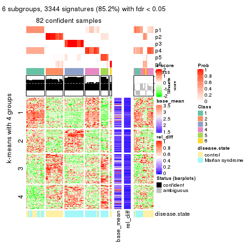</p>

</div>
</div>


Signature heatmaps where rows are not scaled:


<script>
$( function() {
	$( '#tabs-SD-hclust-get-signatures-no-scale' ).tabs();
} );
</script>
<div id='tabs-SD-hclust-get-signatures-no-scale'>
<ul>
<li><a href='#tab-SD-hclust-get-signatures-no-scale-1'>k = 2</a></li>
<li><a href='#tab-SD-hclust-get-signatures-no-scale-2'>k = 3</a></li>
<li><a href='#tab-SD-hclust-get-signatures-no-scale-3'>k = 4</a></li>
<li><a href='#tab-SD-hclust-get-signatures-no-scale-4'>k = 5</a></li>
<li><a href='#tab-SD-hclust-get-signatures-no-scale-5'>k = 6</a></li>
</ul>
<div id='tab-SD-hclust-get-signatures-no-scale-1'>
<pre><code class="r">get_signatures(res, k = 2, scale_rows = FALSE)
</code></pre>

<p></p>

</div>
<div id='tab-SD-hclust-get-signatures-no-scale-2'>
<pre><code class="r">get_signatures(res, k = 3, scale_rows = FALSE)
</code></pre>

<p></p>

</div>
<div id='tab-SD-hclust-get-signatures-no-scale-3'>
<pre><code class="r">get_signatures(res, k = 4, scale_rows = FALSE)
</code></pre>

<p></p>

</div>
<div id='tab-SD-hclust-get-signatures-no-scale-4'>
<pre><code class="r">get_signatures(res, k = 5, scale_rows = FALSE)
</code></pre>

<p></p>

</div>
<div id='tab-SD-hclust-get-signatures-no-scale-5'>
<pre><code class="r">get_signatures(res, k = 6, scale_rows = FALSE)
</code></pre>

<p></p>

</div>
</div>


Compare the overlap of signatures from different k:

```r
compare_signatures(res)
```


`get_signature()` returns a data frame invisibly. TO get the list of signatures, the function
call should be assigned to a variable explicitly. In following code, if `plot` argument is set
to `FALSE`, no heatmap is plotted while only the differential analysis is performed.

```r
# code only for demonstration
tb = get_signature(res, k = ..., plot = FALSE)
```

An example of the output of `tb` is:

```
#>   which_row         fdr    mean_1    mean_2 scaled_mean_1 scaled_mean_2 km
#> 1        38 0.042760348  8.373488  9.131774    -0.5533452     0.5164555  1
#> 2        40 0.018707592  7.106213  8.469186    -0.6173731     0.5762149  1
#> 3        55 0.019134737 10.221463 11.207825    -0.6159697     0.5749050  1
#> 4        59 0.006059896  5.921854  7.869574    -0.6899429     0.6439467  1
#> 5        60 0.018055526  8.928898 10.211722    -0.6204761     0.5791110  1
#> 6        98 0.009384629 15.714769 14.887706     0.6635654    -0.6193277  2
...
```

The columns in `tb` are:

1. `which_row`: row indices corresponding to the input matrix.
2. `fdr`: FDR for the differential test. 
3. `mean_x`: The mean value in group x.
4. `scaled_mean_x`: The mean value in group x after rows are scaled.
5. `km`: Row groups if k-means clustering is applied to rows.


UMAP plot which shows how samples are separated.


<script>
$( function() {
	$( '#tabs-SD-hclust-dimension-reduction' ).tabs();
} );
</script>
<div id='tabs-SD-hclust-dimension-reduction'>
<ul>
<li><a href='#tab-SD-hclust-dimension-reduction-1'>k = 2</a></li>
<li><a href='#tab-SD-hclust-dimension-reduction-2'>k = 3</a></li>
<li><a href='#tab-SD-hclust-dimension-reduction-3'>k = 4</a></li>
<li><a href='#tab-SD-hclust-dimension-reduction-4'>k = 5</a></li>
<li><a href='#tab-SD-hclust-dimension-reduction-5'>k = 6</a></li>
</ul>
<div id='tab-SD-hclust-dimension-reduction-1'>
<pre><code class="r">dimension_reduction(res, k = 2, method = &quot;UMAP&quot;)
</code></pre>

<p></p>

</div>
<div id='tab-SD-hclust-dimension-reduction-2'>
<pre><code class="r">dimension_reduction(res, k = 3, method = &quot;UMAP&quot;)
</code></pre>

<p></p>

</div>
<div id='tab-SD-hclust-dimension-reduction-3'>
<pre><code class="r">dimension_reduction(res, k = 4, method = &quot;UMAP&quot;)
</code></pre>

<p></p>

</div>
<div id='tab-SD-hclust-dimension-reduction-4'>
<pre><code class="r">dimension_reduction(res, k = 5, method = &quot;UMAP&quot;)
</code></pre>

<p></p>

</div>
<div id='tab-SD-hclust-dimension-reduction-5'>
<pre><code class="r">dimension_reduction(res, k = 6, method = &quot;UMAP&quot;)
</code></pre>

<p></p>

</div>
</div>


Following heatmap shows how subgroups are split when increasing `k`:

```r
collect_classes(res)
```


Test correlation between subgroups and known annotations. If the known
annotation is numeric, one-way ANOVA test is applied, and if the known
annotation is discrete, chi-squared contingency table test is applied.

```r
test_to_known_factors(res)
```

```
#>             n disease.state(p) k
#> SD:hclust 101         3.32e-01 2
#> SD:hclust  98         1.49e-06 3
#> SD:hclust  99         2.76e-06 4
#> SD:hclust  82         1.39e-07 5
#> SD:hclust  82         3.88e-11 6
```


If matrix rows can be associated to genes, consider to use `functional_enrichment(res,
...)` to perform function enrichment for the signature genes. See [this vignette](http://bioconductor.org/packages/devel/bioc/vignettes/cola/inst/doc/functional_enrichment.html) for more detailed explanations.


 

---------------------------------------------------


### SD:kmeans**


The object with results only for a single top-value method and a single partition method 
can be extracted as:

```r
res = res_list["SD", "kmeans"]
# you can also extract it by
# res = res_list["SD:kmeans"]
```

A summary of `res` and all the functions that can be applied to it:

```r
res
```

```
#> A 'ConsensusPartition' object with k = 2, 3, 4, 5, 6.
#>   On a matrix with 3925 rows and 101 columns.
#>   Top rows (392, 784, 1177, 1570, 1962) are extracted by 'SD' method.
#>   Subgroups are detected by 'kmeans' method.
#>   Performed in total 1250 partitions by row resampling.
#>   Best k for subgroups seems to be 2.
#> 
#> Following methods can be applied to this 'ConsensusPartition' object:
#>  [1] "cola_report"             "collect_classes"         "collect_plots"          
#>  [4] "collect_stats"           "colnames"                "compare_signatures"     
#>  [7] "consensus_heatmap"       "dimension_reduction"     "functional_enrichment"  
#> [10] "get_anno_col"            "get_anno"                "get_classes"            
#> [13] "get_consensus"           "get_matrix"              "get_membership"         
#> [16] "get_param"               "get_signatures"          "get_stats"              
#> [19] "is_best_k"               "is_stable_k"             "membership_heatmap"     
#> [22] "ncol"                    "nrow"                    "plot_ecdf"              
#> [25] "rownames"                "select_partition_number" "show"                   
#> [28] "suggest_best_k"          "test_to_known_factors"
```

`collect_plots()` function collects all the plots made from `res` for all `k` (number of partitions)
into one single page to provide an easy and fast comparison between different `k`.

```r
collect_plots(res)
```


The plots are:

- The first row: a plot of the ECDF (empirical cumulative distribution
  function) curves of the consensus matrix for each `k` and the heatmap of
  predicted classes for each `k`.
- The second row: heatmaps of the consensus matrix for each `k`.
- The third row: heatmaps of the membership matrix for each `k`.
- The fouth row: heatmaps of the signatures for each `k`.

All the plots in panels can be made by individual functions and they are
plotted later in this section.

`select_partition_number()` produces several plots showing different
statistics for choosing "optimized" `k`. There are following statistics:

- ECDF curves of the consensus matrix for each `k`;
- 1-PAC. [The PAC
  score](https://en.wikipedia.org/wiki/Consensus_clustering#Over-interpretation_potential_of_consensus_clustering)
  measures the proportion of the ambiguous subgrouping.
- Mean silhouette score.
- Concordance. The mean probability of fiting the consensus class ids in all
  partitions.
- Area increased. Denote $A_k$ as the area under the ECDF curve for current
  `k`, the area increased is defined as $A_k - A_{k-1}$.
- Rand index. The percent of pairs of samples that are both in a same cluster
  or both are not in a same cluster in the partition of k and k-1.
- Jaccard index. The ratio of pairs of samples are both in a same cluster in
  the partition of k and k-1 and the pairs of samples are both in a same
  cluster in the partition k or k-1.

The detailed explanations of these statistics can be found in [the _cola_
vignette](http://bioconductor.org/packages/devel/bioc/vignettes/cola/inst/doc/cola.html#toc_13).

Generally speaking, lower PAC score, higher mean silhouette score or higher
concordance corresponds to better partition. Rand index and Jaccard index
measure how similar the current partition is compared to partition with `k-1`.
If they are too similar, we won't accept `k` is better than `k-1`.

```r
select_partition_number(res)
```


The numeric values for all these statistics can be obtained by `get_stats()`.

```r
get_stats(res)
```

```
#>   k 1-PAC mean_silhouette concordance area_increased  Rand Jaccard
#> 2 2 1.000           0.985       0.987         0.5047 0.495   0.495
#> 3 3 0.750           0.913       0.837         0.2456 0.873   0.744
#> 4 4 0.843           0.945       0.880         0.1407 0.882   0.679
#> 5 5 0.803           0.866       0.855         0.0735 1.000   1.000
#> 6 6 0.760           0.829       0.841         0.0386 0.936   0.744
```

`suggest_best_k()` suggests the best $k$ based on these statistics. The rules are as follows:

- All $k$ with Jaccard index larger than 0.95 are removed because increasing
  $k$ does not provide enough extra information. If all $k$ are removed, it is
  marked as no subgroup is detected.
- For all $k$ with 1-PAC score larger than 0.9, the maximal $k$ is taken as
  the best $k$, and other $k$ are marked as optional $k$.
- If it does not fit the second rule. The $k$ with the maximal vote of the
  highest 1-PAC score, highest mean silhouette, and highest concordance is
  taken as the best $k$.

```r
suggest_best_k(res)
```

```
#> [1] 2
```


Following shows the table of the partitions (You need to click the **show/hide
code output** link to see it). The membership matrix (columns with name `p*`)
is inferred by
[`clue::cl_consensus()`](https://www.rdocumentation.org/link/cl_consensus?package=clue)
function with the `SE` method. Basically the value in the membership matrix
represents the probability to belong to a certain group. The finall class
label for an item is determined with the group with highest probability it
belongs to.

In `get_classes()` function, the entropy is calculated from the membership
matrix and the silhouette score is calculated from the consensus matrix.


<script>
$( function() {
	$( '#tabs-SD-kmeans-get-classes' ).tabs();
} );
</script>
<div id='tabs-SD-kmeans-get-classes'>
<ul>
<li><a href='#tab-SD-kmeans-get-classes-1'>k = 2</a></li>
<li><a href='#tab-SD-kmeans-get-classes-2'>k = 3</a></li>
<li><a href='#tab-SD-kmeans-get-classes-3'>k = 4</a></li>
<li><a href='#tab-SD-kmeans-get-classes-4'>k = 5</a></li>
<li><a href='#tab-SD-kmeans-get-classes-5'>k = 6</a></li>
</ul>

<div id='tab-SD-kmeans-get-classes-1'>
<p><a id='tab-SD-kmeans-get-classes-1-a' style='color:#0366d6' href='#'>show/hide code output</a></p>
<pre><code class="r">cbind(get_classes(res, k = 2), get_membership(res, k = 2))
</code></pre>

<pre><code>#&gt;           class entropy silhouette    p1    p2
#&gt; GSM217644     2  0.0000      0.988 0.000 1.000
#&gt; GSM217645     2  0.0000      0.988 0.000 1.000
#&gt; GSM217646     2  0.0000      0.988 0.000 1.000
#&gt; GSM217647     2  0.0000      0.988 0.000 1.000
#&gt; GSM217648     2  0.0000      0.988 0.000 1.000
#&gt; GSM217649     2  0.0000      0.988 0.000 1.000
#&gt; GSM217650     2  0.0000      0.988 0.000 1.000
#&gt; GSM217651     2  0.0000      0.988 0.000 1.000
#&gt; GSM217652     2  0.0000      0.988 0.000 1.000
#&gt; GSM217653     2  0.0000      0.988 0.000 1.000
#&gt; GSM217654     2  0.0000      0.988 0.000 1.000
#&gt; GSM217655     2  0.0000      0.988 0.000 1.000
#&gt; GSM217656     2  0.0376      0.986 0.004 0.996
#&gt; GSM217657     2  0.0000      0.988 0.000 1.000
#&gt; GSM217658     2  0.0000      0.988 0.000 1.000
#&gt; GSM217659     2  0.0000      0.988 0.000 1.000
#&gt; GSM217660     2  0.0000      0.988 0.000 1.000
#&gt; GSM217661     2  0.0000      0.988 0.000 1.000
#&gt; GSM217662     2  0.0000      0.988 0.000 1.000
#&gt; GSM217663     2  0.0000      0.988 0.000 1.000
#&gt; GSM217664     2  0.0000      0.988 0.000 1.000
#&gt; GSM217665     2  0.0000      0.988 0.000 1.000
#&gt; GSM217666     2  0.0000      0.988 0.000 1.000
#&gt; GSM217667     2  0.0000      0.988 0.000 1.000
#&gt; GSM217668     1  0.1843      0.985 0.972 0.028
#&gt; GSM217669     1  0.1843      0.985 0.972 0.028
#&gt; GSM217670     1  0.1843      0.985 0.972 0.028
#&gt; GSM217671     1  0.1843      0.985 0.972 0.028
#&gt; GSM217672     1  0.1843      0.985 0.972 0.028
#&gt; GSM217673     1  0.1843      0.985 0.972 0.028
#&gt; GSM217674     1  0.0000      0.985 1.000 0.000
#&gt; GSM217675     1  0.0000      0.985 1.000 0.000
#&gt; GSM217676     1  0.0000      0.985 1.000 0.000
#&gt; GSM217677     1  0.0000      0.985 1.000 0.000
#&gt; GSM217678     1  0.0000      0.985 1.000 0.000
#&gt; GSM217679     1  0.0000      0.985 1.000 0.000
#&gt; GSM217680     1  0.0000      0.985 1.000 0.000
#&gt; GSM217681     1  0.0000      0.985 1.000 0.000
#&gt; GSM217682     1  0.0000      0.985 1.000 0.000
#&gt; GSM217683     1  0.0000      0.985 1.000 0.000
#&gt; GSM217684     1  0.1843      0.985 0.972 0.028
#&gt; GSM217685     2  0.2043      0.981 0.032 0.968
#&gt; GSM217686     2  0.2043      0.981 0.032 0.968
#&gt; GSM217687     2  0.2043      0.981 0.032 0.968
#&gt; GSM217688     2  0.2043      0.981 0.032 0.968
#&gt; GSM217689     2  0.2043      0.981 0.032 0.968
#&gt; GSM217690     2  0.2043      0.981 0.032 0.968
#&gt; GSM217691     2  0.2043      0.981 0.032 0.968
#&gt; GSM217692     2  0.2043      0.981 0.032 0.968
#&gt; GSM217693     2  0.2043      0.981 0.032 0.968
#&gt; GSM217694     2  0.2043      0.981 0.032 0.968
#&gt; GSM217695     2  0.2043      0.981 0.032 0.968
#&gt; GSM217696     2  0.2043      0.981 0.032 0.968
#&gt; GSM217697     2  0.2043      0.981 0.032 0.968
#&gt; GSM217698     2  0.2043      0.981 0.032 0.968
#&gt; GSM217699     2  0.2043      0.981 0.032 0.968
#&gt; GSM217700     2  0.2043      0.981 0.032 0.968
#&gt; GSM217701     2  0.2043      0.981 0.032 0.968
#&gt; GSM217702     2  0.2043      0.981 0.032 0.968
#&gt; GSM217703     2  0.2043      0.981 0.032 0.968
#&gt; GSM217704     2  0.2043      0.981 0.032 0.968
#&gt; GSM217705     1  0.1843      0.985 0.972 0.028
#&gt; GSM217706     1  0.1843      0.985 0.972 0.028
#&gt; GSM217707     1  0.1843      0.985 0.972 0.028
#&gt; GSM217708     1  0.1414      0.986 0.980 0.020
#&gt; GSM217709     1  0.1843      0.985 0.972 0.028
#&gt; GSM217710     1  0.1843      0.985 0.972 0.028
#&gt; GSM217711     1  0.1843      0.985 0.972 0.028
#&gt; GSM217712     1  0.1843      0.985 0.972 0.028
#&gt; GSM217713     1  0.1843      0.985 0.972 0.028
#&gt; GSM217714     1  0.1843      0.985 0.972 0.028
#&gt; GSM217715     1  0.1843      0.985 0.972 0.028
#&gt; GSM217716     1  0.1843      0.985 0.972 0.028
#&gt; GSM217717     1  0.1843      0.985 0.972 0.028
#&gt; GSM217718     1  0.1843      0.985 0.972 0.028
#&gt; GSM217719     1  0.1843      0.985 0.972 0.028
#&gt; GSM217720     1  0.1843      0.985 0.972 0.028
#&gt; GSM217721     1  0.1843      0.985 0.972 0.028
#&gt; GSM217722     1  0.1633      0.986 0.976 0.024
#&gt; GSM217723     1  0.0000      0.985 1.000 0.000
#&gt; GSM217724     1  0.0000      0.985 1.000 0.000
#&gt; GSM217725     1  0.0000      0.985 1.000 0.000
#&gt; GSM217726     1  0.0000      0.985 1.000 0.000
#&gt; GSM217727     1  0.0000      0.985 1.000 0.000
#&gt; GSM217728     1  0.0000      0.985 1.000 0.000
#&gt; GSM217729     1  0.0000      0.985 1.000 0.000
#&gt; GSM217730     1  0.0000      0.985 1.000 0.000
#&gt; GSM217731     1  0.0000      0.985 1.000 0.000
#&gt; GSM217732     1  0.0000      0.985 1.000 0.000
#&gt; GSM217733     1  0.0000      0.985 1.000 0.000
#&gt; GSM217734     1  0.0000      0.985 1.000 0.000
#&gt; GSM217735     1  0.0000      0.985 1.000 0.000
#&gt; GSM217736     1  0.0000      0.985 1.000 0.000
#&gt; GSM217737     2  0.0000      0.988 0.000 1.000
#&gt; GSM217738     2  0.0000      0.988 0.000 1.000
#&gt; GSM217739     2  0.0000      0.988 0.000 1.000
#&gt; GSM217740     2  0.0000      0.988 0.000 1.000
#&gt; GSM217741     2  0.0000      0.988 0.000 1.000
#&gt; GSM217742     2  0.0000      0.988 0.000 1.000
#&gt; GSM217743     2  0.0000      0.988 0.000 1.000
#&gt; GSM217744     2  0.0000      0.988 0.000 1.000
</code></pre>

<script>
$('#tab-SD-kmeans-get-classes-1-a').parent().next().next().hide();
$('#tab-SD-kmeans-get-classes-1-a').click(function(){
  $('#tab-SD-kmeans-get-classes-1-a').parent().next().next().toggle();
  return(false);
});
</script>
</div>

<div id='tab-SD-kmeans-get-classes-2'>
<p><a id='tab-SD-kmeans-get-classes-2-a' style='color:#0366d6' href='#'>show/hide code output</a></p>
<pre><code class="r">cbind(get_classes(res, k = 3), get_membership(res, k = 3))
</code></pre>

<pre><code>#&gt;           class entropy silhouette    p1    p2    p3
#&gt; GSM217644     2  0.6026      0.990 0.000 0.624 0.376
#&gt; GSM217645     2  0.6026      0.990 0.000 0.624 0.376
#&gt; GSM217646     2  0.6026      0.990 0.000 0.624 0.376
#&gt; GSM217647     2  0.6062      0.992 0.000 0.616 0.384
#&gt; GSM217648     2  0.6062      0.992 0.000 0.616 0.384
#&gt; GSM217649     2  0.6026      0.990 0.000 0.624 0.376
#&gt; GSM217650     2  0.6026      0.990 0.000 0.624 0.376
#&gt; GSM217651     2  0.6062      0.992 0.000 0.616 0.384
#&gt; GSM217652     2  0.6026      0.990 0.000 0.624 0.376
#&gt; GSM217653     2  0.6062      0.992 0.000 0.616 0.384
#&gt; GSM217654     2  0.5988      0.981 0.000 0.632 0.368
#&gt; GSM217655     2  0.6008      0.986 0.000 0.628 0.372
#&gt; GSM217656     2  0.5988      0.981 0.000 0.632 0.368
#&gt; GSM217657     2  0.5988      0.981 0.000 0.632 0.368
#&gt; GSM217658     2  0.6026      0.990 0.000 0.624 0.376
#&gt; GSM217659     2  0.6026      0.990 0.000 0.624 0.376
#&gt; GSM217660     2  0.6062      0.992 0.000 0.616 0.384
#&gt; GSM217661     2  0.6026      0.990 0.000 0.624 0.376
#&gt; GSM217662     2  0.6062      0.992 0.000 0.616 0.384
#&gt; GSM217663     2  0.6062      0.992 0.000 0.616 0.384
#&gt; GSM217664     2  0.6026      0.990 0.000 0.624 0.376
#&gt; GSM217665     2  0.6062      0.992 0.000 0.616 0.384
#&gt; GSM217666     2  0.6062      0.992 0.000 0.616 0.384
#&gt; GSM217667     2  0.6062      0.992 0.000 0.616 0.384
#&gt; GSM217668     1  0.0424      0.836 0.992 0.008 0.000
#&gt; GSM217669     1  0.0237      0.837 0.996 0.004 0.000
#&gt; GSM217670     1  0.0424      0.836 0.992 0.008 0.000
#&gt; GSM217671     1  0.0424      0.836 0.992 0.008 0.000
#&gt; GSM217672     1  0.0237      0.837 0.996 0.004 0.000
#&gt; GSM217673     1  0.0237      0.837 0.996 0.004 0.000
#&gt; GSM217674     1  0.5988      0.819 0.632 0.368 0.000
#&gt; GSM217675     1  0.5988      0.819 0.632 0.368 0.000
#&gt; GSM217676     1  0.5988      0.819 0.632 0.368 0.000
#&gt; GSM217677     1  0.5988      0.819 0.632 0.368 0.000
#&gt; GSM217678     1  0.5988      0.819 0.632 0.368 0.000
#&gt; GSM217679     1  0.5988      0.819 0.632 0.368 0.000
#&gt; GSM217680     1  0.5988      0.819 0.632 0.368 0.000
#&gt; GSM217681     1  0.5988      0.819 0.632 0.368 0.000
#&gt; GSM217682     1  0.5988      0.819 0.632 0.368 0.000
#&gt; GSM217683     1  0.5988      0.819 0.632 0.368 0.000
#&gt; GSM217684     1  0.3686      0.832 0.860 0.140 0.000
#&gt; GSM217685     3  0.0000      0.999 0.000 0.000 1.000
#&gt; GSM217686     3  0.0000      0.999 0.000 0.000 1.000
#&gt; GSM217687     3  0.0000      0.999 0.000 0.000 1.000
#&gt; GSM217688     3  0.0000      0.999 0.000 0.000 1.000
#&gt; GSM217689     3  0.0000      0.999 0.000 0.000 1.000
#&gt; GSM217690     3  0.0000      0.999 0.000 0.000 1.000
#&gt; GSM217691     3  0.0000      0.999 0.000 0.000 1.000
#&gt; GSM217692     3  0.0000      0.999 0.000 0.000 1.000
#&gt; GSM217693     3  0.0000      0.999 0.000 0.000 1.000
#&gt; GSM217694     3  0.0000      0.999 0.000 0.000 1.000
#&gt; GSM217695     3  0.0000      0.999 0.000 0.000 1.000
#&gt; GSM217696     3  0.0000      0.999 0.000 0.000 1.000
#&gt; GSM217697     3  0.0000      0.999 0.000 0.000 1.000
#&gt; GSM217698     3  0.0000      0.999 0.000 0.000 1.000
#&gt; GSM217699     3  0.0000      0.999 0.000 0.000 1.000
#&gt; GSM217700     3  0.0000      0.999 0.000 0.000 1.000
#&gt; GSM217701     3  0.0000      0.999 0.000 0.000 1.000
#&gt; GSM217702     3  0.0000      0.999 0.000 0.000 1.000
#&gt; GSM217703     3  0.0424      0.986 0.000 0.008 0.992
#&gt; GSM217704     3  0.0000      0.999 0.000 0.000 1.000
#&gt; GSM217705     1  0.0000      0.837 1.000 0.000 0.000
#&gt; GSM217706     1  0.0424      0.836 0.992 0.008 0.000
#&gt; GSM217707     1  0.0424      0.836 0.992 0.008 0.000
#&gt; GSM217708     1  0.0592      0.835 0.988 0.012 0.000
#&gt; GSM217709     1  0.0747      0.833 0.984 0.016 0.000
#&gt; GSM217710     1  0.0747      0.833 0.984 0.016 0.000
#&gt; GSM217711     1  0.0747      0.833 0.984 0.016 0.000
#&gt; GSM217712     1  0.0424      0.836 0.992 0.008 0.000
#&gt; GSM217713     1  0.0424      0.836 0.992 0.008 0.000
#&gt; GSM217714     1  0.0424      0.836 0.992 0.008 0.000
#&gt; GSM217715     1  0.0424      0.836 0.992 0.008 0.000
#&gt; GSM217716     1  0.0424      0.836 0.992 0.008 0.000
#&gt; GSM217717     1  0.0424      0.836 0.992 0.008 0.000
#&gt; GSM217718     1  0.0424      0.836 0.992 0.008 0.000
#&gt; GSM217719     1  0.0424      0.836 0.992 0.008 0.000
#&gt; GSM217720     1  0.0000      0.837 1.000 0.000 0.000
#&gt; GSM217721     1  0.0424      0.836 0.992 0.008 0.000
#&gt; GSM217722     1  0.0000      0.837 1.000 0.000 0.000
#&gt; GSM217723     1  0.1163      0.837 0.972 0.028 0.000
#&gt; GSM217724     1  0.5560      0.824 0.700 0.300 0.000
#&gt; GSM217725     1  0.6026      0.815 0.624 0.376 0.000
#&gt; GSM217726     1  0.5988      0.819 0.632 0.368 0.000
#&gt; GSM217727     1  0.5988      0.819 0.632 0.368 0.000
#&gt; GSM217728     1  0.6008      0.817 0.628 0.372 0.000
#&gt; GSM217729     1  0.5988      0.819 0.632 0.368 0.000
#&gt; GSM217730     1  0.5988      0.819 0.632 0.368 0.000
#&gt; GSM217731     1  0.5988      0.819 0.632 0.368 0.000
#&gt; GSM217732     1  0.5988      0.819 0.632 0.368 0.000
#&gt; GSM217733     1  0.5988      0.819 0.632 0.368 0.000
#&gt; GSM217734     1  0.5988      0.819 0.632 0.368 0.000
#&gt; GSM217735     1  0.5988      0.819 0.632 0.368 0.000
#&gt; GSM217736     1  0.5988      0.819 0.632 0.368 0.000
#&gt; GSM217737     2  0.6062      0.992 0.000 0.616 0.384
#&gt; GSM217738     2  0.6062      0.992 0.000 0.616 0.384
#&gt; GSM217739     2  0.6062      0.992 0.000 0.616 0.384
#&gt; GSM217740     2  0.6062      0.992 0.000 0.616 0.384
#&gt; GSM217741     2  0.6062      0.992 0.000 0.616 0.384
#&gt; GSM217742     2  0.6062      0.992 0.000 0.616 0.384
#&gt; GSM217743     2  0.6062      0.992 0.000 0.616 0.384
#&gt; GSM217744     2  0.6062      0.992 0.000 0.616 0.384
</code></pre>

<script>
$('#tab-SD-kmeans-get-classes-2-a').parent().next().next().hide();
$('#tab-SD-kmeans-get-classes-2-a').click(function(){
  $('#tab-SD-kmeans-get-classes-2-a').parent().next().next().toggle();
  return(false);
});
</script>
</div>

<div id='tab-SD-kmeans-get-classes-3'>
<p><a id='tab-SD-kmeans-get-classes-3-a' style='color:#0366d6' href='#'>show/hide code output</a></p>
<pre><code class="r">cbind(get_classes(res, k = 4), get_membership(res, k = 4))
</code></pre>

<pre><code>#&gt;           class entropy silhouette    p1    p2    p3    p4
#&gt; GSM217644     2  0.0000      0.952 0.000 1.000 0.000 0.000
#&gt; GSM217645     2  0.0188      0.950 0.004 0.996 0.000 0.000
#&gt; GSM217646     2  0.0000      0.952 0.000 1.000 0.000 0.000
#&gt; GSM217647     2  0.0188      0.951 0.004 0.996 0.000 0.000
#&gt; GSM217648     2  0.0188      0.951 0.004 0.996 0.000 0.000
#&gt; GSM217649     2  0.0000      0.952 0.000 1.000 0.000 0.000
#&gt; GSM217650     2  0.0000      0.952 0.000 1.000 0.000 0.000
#&gt; GSM217651     2  0.0000      0.952 0.000 1.000 0.000 0.000
#&gt; GSM217652     2  0.0000      0.952 0.000 1.000 0.000 0.000
#&gt; GSM217653     2  0.0188      0.951 0.004 0.996 0.000 0.000
#&gt; GSM217654     2  0.0779      0.944 0.016 0.980 0.004 0.000
#&gt; GSM217655     2  0.0524      0.948 0.008 0.988 0.004 0.000
#&gt; GSM217656     2  0.3777      0.861 0.052 0.868 0.020 0.060
#&gt; GSM217657     2  0.1722      0.925 0.048 0.944 0.008 0.000
#&gt; GSM217658     2  0.0000      0.952 0.000 1.000 0.000 0.000
#&gt; GSM217659     2  0.0000      0.952 0.000 1.000 0.000 0.000
#&gt; GSM217660     2  0.0000      0.952 0.000 1.000 0.000 0.000
#&gt; GSM217661     2  0.0000      0.952 0.000 1.000 0.000 0.000
#&gt; GSM217662     2  0.0188      0.951 0.004 0.996 0.000 0.000
#&gt; GSM217663     2  0.0000      0.952 0.000 1.000 0.000 0.000
#&gt; GSM217664     2  0.0000      0.952 0.000 1.000 0.000 0.000
#&gt; GSM217665     2  0.0188      0.951 0.004 0.996 0.000 0.000
#&gt; GSM217666     2  0.0188      0.951 0.004 0.996 0.000 0.000
#&gt; GSM217667     2  0.0188      0.951 0.004 0.996 0.000 0.000
#&gt; GSM217668     4  0.0469      0.965 0.000 0.000 0.012 0.988
#&gt; GSM217669     4  0.0188      0.966 0.000 0.000 0.004 0.996
#&gt; GSM217670     4  0.0469      0.965 0.000 0.000 0.012 0.988
#&gt; GSM217671     4  0.0469      0.965 0.000 0.000 0.012 0.988
#&gt; GSM217672     4  0.0469      0.965 0.000 0.000 0.012 0.988
#&gt; GSM217673     4  0.0469      0.965 0.000 0.000 0.012 0.988
#&gt; GSM217674     1  0.4814      0.978 0.676 0.000 0.008 0.316
#&gt; GSM217675     1  0.4814      0.978 0.676 0.000 0.008 0.316
#&gt; GSM217676     1  0.4655      0.979 0.684 0.000 0.004 0.312
#&gt; GSM217677     1  0.4792      0.979 0.680 0.000 0.008 0.312
#&gt; GSM217678     1  0.5130      0.973 0.668 0.000 0.020 0.312
#&gt; GSM217679     1  0.4792      0.979 0.680 0.000 0.008 0.312
#&gt; GSM217680     1  0.5130      0.973 0.668 0.000 0.020 0.312
#&gt; GSM217681     1  0.4792      0.979 0.680 0.000 0.008 0.312
#&gt; GSM217682     1  0.4814      0.978 0.676 0.000 0.008 0.316
#&gt; GSM217683     1  0.4814      0.978 0.676 0.000 0.008 0.316
#&gt; GSM217684     4  0.4988      0.221 0.288 0.000 0.020 0.692
#&gt; GSM217685     3  0.2983      0.963 0.040 0.068 0.892 0.000
#&gt; GSM217686     3  0.2983      0.963 0.040 0.068 0.892 0.000
#&gt; GSM217687     3  0.2983      0.963 0.040 0.068 0.892 0.000
#&gt; GSM217688     3  0.2983      0.963 0.040 0.068 0.892 0.000
#&gt; GSM217689     3  0.3474      0.951 0.068 0.064 0.868 0.000
#&gt; GSM217690     3  0.3474      0.951 0.068 0.064 0.868 0.000
#&gt; GSM217691     3  0.3156      0.971 0.048 0.068 0.884 0.000
#&gt; GSM217692     3  0.3156      0.971 0.048 0.068 0.884 0.000
#&gt; GSM217693     3  0.3156      0.971 0.048 0.068 0.884 0.000
#&gt; GSM217694     3  0.3156      0.971 0.048 0.068 0.884 0.000
#&gt; GSM217695     3  0.3156      0.971 0.048 0.068 0.884 0.000
#&gt; GSM217696     3  0.3156      0.971 0.048 0.068 0.884 0.000
#&gt; GSM217697     3  0.3156      0.971 0.048 0.068 0.884 0.000
#&gt; GSM217698     3  0.3156      0.971 0.048 0.068 0.884 0.000
#&gt; GSM217699     3  0.1792      0.970 0.000 0.068 0.932 0.000
#&gt; GSM217700     3  0.2489      0.971 0.020 0.068 0.912 0.000
#&gt; GSM217701     3  0.1792      0.970 0.000 0.068 0.932 0.000
#&gt; GSM217702     3  0.1792      0.970 0.000 0.068 0.932 0.000
#&gt; GSM217703     3  0.3547      0.949 0.072 0.064 0.864 0.000
#&gt; GSM217704     3  0.3156      0.971 0.048 0.068 0.884 0.000
#&gt; GSM217705     4  0.0336      0.966 0.000 0.000 0.008 0.992
#&gt; GSM217706     4  0.0000      0.966 0.000 0.000 0.000 1.000
#&gt; GSM217707     4  0.0000      0.966 0.000 0.000 0.000 1.000
#&gt; GSM217708     4  0.0927      0.954 0.008 0.000 0.016 0.976
#&gt; GSM217709     4  0.1059      0.952 0.012 0.000 0.016 0.972
#&gt; GSM217710     4  0.1406      0.940 0.024 0.000 0.016 0.960
#&gt; GSM217711     4  0.1406      0.940 0.024 0.000 0.016 0.960
#&gt; GSM217712     4  0.0336      0.964 0.008 0.000 0.000 0.992
#&gt; GSM217713     4  0.0188      0.965 0.004 0.000 0.000 0.996
#&gt; GSM217714     4  0.0336      0.966 0.000 0.000 0.008 0.992
#&gt; GSM217715     4  0.0336      0.966 0.000 0.000 0.008 0.992
#&gt; GSM217716     4  0.0376      0.966 0.004 0.000 0.004 0.992
#&gt; GSM217717     4  0.0188      0.965 0.004 0.000 0.000 0.996
#&gt; GSM217718     4  0.0524      0.965 0.008 0.000 0.004 0.988
#&gt; GSM217719     4  0.0376      0.966 0.004 0.000 0.004 0.992
#&gt; GSM217720     4  0.0469      0.965 0.000 0.000 0.012 0.988
#&gt; GSM217721     4  0.0188      0.965 0.004 0.000 0.000 0.996
#&gt; GSM217722     4  0.0000      0.966 0.000 0.000 0.000 1.000
#&gt; GSM217723     4  0.2565      0.880 0.056 0.000 0.032 0.912
#&gt; GSM217724     1  0.5756      0.826 0.568 0.000 0.032 0.400
#&gt; GSM217725     1  0.5496      0.956 0.652 0.000 0.036 0.312
#&gt; GSM217726     1  0.4677      0.978 0.680 0.000 0.004 0.316
#&gt; GSM217727     1  0.4677      0.978 0.680 0.000 0.004 0.316
#&gt; GSM217728     1  0.5496      0.956 0.652 0.000 0.036 0.312
#&gt; GSM217729     1  0.5130      0.973 0.668 0.000 0.020 0.312
#&gt; GSM217730     1  0.5130      0.973 0.668 0.000 0.020 0.312
#&gt; GSM217731     1  0.5130      0.973 0.668 0.000 0.020 0.312
#&gt; GSM217732     1  0.4914      0.978 0.676 0.000 0.012 0.312
#&gt; GSM217733     1  0.4792      0.978 0.680 0.000 0.008 0.312
#&gt; GSM217734     1  0.4655      0.979 0.684 0.000 0.004 0.312
#&gt; GSM217735     1  0.4914      0.978 0.676 0.000 0.012 0.312
#&gt; GSM217736     1  0.4814      0.978 0.676 0.000 0.008 0.316
#&gt; GSM217737     2  0.3725      0.868 0.180 0.812 0.008 0.000
#&gt; GSM217738     2  0.3725      0.868 0.180 0.812 0.008 0.000
#&gt; GSM217739     2  0.3681      0.869 0.176 0.816 0.008 0.000
#&gt; GSM217740     2  0.3681      0.869 0.176 0.816 0.008 0.000
#&gt; GSM217741     2  0.3539      0.871 0.176 0.820 0.004 0.000
#&gt; GSM217742     2  0.3539      0.871 0.176 0.820 0.004 0.000
#&gt; GSM217743     2  0.3539      0.871 0.176 0.820 0.004 0.000
#&gt; GSM217744     2  0.3539      0.871 0.176 0.820 0.004 0.000
</code></pre>

<script>
$('#tab-SD-kmeans-get-classes-3-a').parent().next().next().hide();
$('#tab-SD-kmeans-get-classes-3-a').click(function(){
  $('#tab-SD-kmeans-get-classes-3-a').parent().next().next().toggle();
  return(false);
});
</script>
</div>

<div id='tab-SD-kmeans-get-classes-4'>
<p><a id='tab-SD-kmeans-get-classes-4-a' style='color:#0366d6' href='#'>show/hide code output</a></p>
<pre><code class="r">cbind(get_classes(res, k = 5), get_membership(res, k = 5))
</code></pre>

<pre><code>#&gt;           class entropy silhouette    p1    p2    p3    p4 p5
#&gt; GSM217644     2  0.0865      0.865 0.000 0.972 0.000 0.004 NA
#&gt; GSM217645     2  0.0865      0.865 0.000 0.972 0.000 0.004 NA
#&gt; GSM217646     2  0.0000      0.874 0.000 1.000 0.000 0.000 NA
#&gt; GSM217647     2  0.0290      0.874 0.000 0.992 0.000 0.000 NA
#&gt; GSM217648     2  0.0290      0.874 0.000 0.992 0.000 0.000 NA
#&gt; GSM217649     2  0.0000      0.874 0.000 1.000 0.000 0.000 NA
#&gt; GSM217650     2  0.0162      0.873 0.000 0.996 0.000 0.004 NA
#&gt; GSM217651     2  0.0162      0.873 0.000 0.996 0.000 0.004 NA
#&gt; GSM217652     2  0.0000      0.874 0.000 1.000 0.000 0.000 NA
#&gt; GSM217653     2  0.0290      0.874 0.000 0.992 0.000 0.000 NA
#&gt; GSM217654     2  0.2450      0.836 0.000 0.900 0.000 0.048 NA
#&gt; GSM217655     2  0.1893      0.847 0.000 0.928 0.000 0.024 NA
#&gt; GSM217656     2  0.5820      0.538 0.000 0.572 0.000 0.120 NA
#&gt; GSM217657     2  0.4605      0.710 0.000 0.732 0.000 0.076 NA
#&gt; GSM217658     2  0.0000      0.874 0.000 1.000 0.000 0.000 NA
#&gt; GSM217659     2  0.0000      0.874 0.000 1.000 0.000 0.000 NA
#&gt; GSM217660     2  0.0324      0.874 0.000 0.992 0.000 0.004 NA
#&gt; GSM217661     2  0.0162      0.873 0.000 0.996 0.000 0.004 NA
#&gt; GSM217662     2  0.0451      0.874 0.000 0.988 0.000 0.004 NA
#&gt; GSM217663     2  0.0000      0.874 0.000 1.000 0.000 0.000 NA
#&gt; GSM217664     2  0.0000      0.874 0.000 1.000 0.000 0.000 NA
#&gt; GSM217665     2  0.0290      0.874 0.000 0.992 0.000 0.000 NA
#&gt; GSM217666     2  0.0290      0.874 0.000 0.992 0.000 0.000 NA
#&gt; GSM217667     2  0.0290      0.874 0.000 0.992 0.000 0.000 NA
#&gt; GSM217668     4  0.3740      0.908 0.128 0.000 0.008 0.820 NA
#&gt; GSM217669     4  0.3826      0.908 0.128 0.000 0.004 0.812 NA
#&gt; GSM217670     4  0.3590      0.910 0.128 0.000 0.008 0.828 NA
#&gt; GSM217671     4  0.3666      0.909 0.128 0.000 0.008 0.824 NA
#&gt; GSM217672     4  0.3666      0.909 0.128 0.000 0.008 0.824 NA
#&gt; GSM217673     4  0.3666      0.909 0.128 0.000 0.008 0.824 NA
#&gt; GSM217674     1  0.0451      0.932 0.988 0.000 0.004 0.000 NA
#&gt; GSM217675     1  0.0566      0.932 0.984 0.000 0.004 0.000 NA
#&gt; GSM217676     1  0.1357      0.929 0.948 0.000 0.004 0.000 NA
#&gt; GSM217677     1  0.0162      0.933 0.996 0.000 0.004 0.000 NA
#&gt; GSM217678     1  0.1768      0.918 0.924 0.000 0.004 0.000 NA
#&gt; GSM217679     1  0.0324      0.933 0.992 0.000 0.004 0.000 NA
#&gt; GSM217680     1  0.1768      0.918 0.924 0.000 0.004 0.000 NA
#&gt; GSM217681     1  0.0609      0.932 0.980 0.000 0.000 0.000 NA
#&gt; GSM217682     1  0.0566      0.932 0.984 0.000 0.004 0.000 NA
#&gt; GSM217683     1  0.0451      0.932 0.988 0.000 0.004 0.000 NA
#&gt; GSM217684     4  0.5880      0.517 0.364 0.000 0.012 0.548 NA
#&gt; GSM217685     3  0.2400      0.939 0.000 0.020 0.912 0.020 NA
#&gt; GSM217686     3  0.2400      0.939 0.000 0.020 0.912 0.020 NA
#&gt; GSM217687     3  0.2400      0.939 0.000 0.020 0.912 0.020 NA
#&gt; GSM217688     3  0.2400      0.939 0.000 0.020 0.912 0.020 NA
#&gt; GSM217689     3  0.2857      0.930 0.000 0.020 0.888 0.028 NA
#&gt; GSM217690     3  0.2857      0.930 0.000 0.020 0.888 0.028 NA
#&gt; GSM217691     3  0.2673      0.950 0.000 0.020 0.900 0.036 NA
#&gt; GSM217692     3  0.2673      0.950 0.000 0.020 0.900 0.036 NA
#&gt; GSM217693     3  0.2673      0.950 0.000 0.020 0.900 0.036 NA
#&gt; GSM217694     3  0.2673      0.950 0.000 0.020 0.900 0.036 NA
#&gt; GSM217695     3  0.2673      0.950 0.000 0.020 0.900 0.036 NA
#&gt; GSM217696     3  0.2673      0.950 0.000 0.020 0.900 0.036 NA
#&gt; GSM217697     3  0.2673      0.950 0.000 0.020 0.900 0.036 NA
#&gt; GSM217698     3  0.2673      0.950 0.000 0.020 0.900 0.036 NA
#&gt; GSM217699     3  0.0898      0.950 0.000 0.020 0.972 0.008 NA
#&gt; GSM217700     3  0.1710      0.951 0.000 0.020 0.944 0.024 NA
#&gt; GSM217701     3  0.0898      0.950 0.000 0.020 0.972 0.008 NA
#&gt; GSM217702     3  0.0898      0.950 0.000 0.020 0.972 0.008 NA
#&gt; GSM217703     3  0.3022      0.927 0.000 0.020 0.880 0.036 NA
#&gt; GSM217704     3  0.2673      0.950 0.000 0.020 0.900 0.036 NA
#&gt; GSM217705     4  0.3666      0.909 0.128 0.000 0.008 0.824 NA
#&gt; GSM217706     4  0.2377      0.913 0.128 0.000 0.000 0.872 NA
#&gt; GSM217707     4  0.2660      0.913 0.128 0.000 0.000 0.864 NA
#&gt; GSM217708     4  0.5434      0.764 0.120 0.000 0.000 0.648 NA
#&gt; GSM217709     4  0.5284      0.753 0.104 0.000 0.000 0.660 NA
#&gt; GSM217710     4  0.5240      0.732 0.092 0.000 0.000 0.656 NA
#&gt; GSM217711     4  0.5240      0.732 0.092 0.000 0.000 0.656 NA
#&gt; GSM217712     4  0.2439      0.911 0.120 0.000 0.000 0.876 NA
#&gt; GSM217713     4  0.2536      0.913 0.128 0.000 0.000 0.868 NA
#&gt; GSM217714     4  0.3146      0.911 0.128 0.000 0.000 0.844 NA
#&gt; GSM217715     4  0.3229      0.911 0.128 0.000 0.000 0.840 NA
#&gt; GSM217716     4  0.2536      0.913 0.128 0.000 0.000 0.868 NA
#&gt; GSM217717     4  0.2536      0.913 0.128 0.000 0.000 0.868 NA
#&gt; GSM217718     4  0.2563      0.910 0.120 0.000 0.000 0.872 NA
#&gt; GSM217719     4  0.2660      0.913 0.128 0.000 0.000 0.864 NA
#&gt; GSM217720     4  0.3666      0.909 0.128 0.000 0.008 0.824 NA
#&gt; GSM217721     4  0.2536      0.913 0.128 0.000 0.000 0.868 NA
#&gt; GSM217722     4  0.2660      0.913 0.128 0.000 0.000 0.864 NA
#&gt; GSM217723     4  0.6424      0.591 0.168 0.000 0.004 0.500 NA
#&gt; GSM217724     1  0.5509      0.604 0.612 0.000 0.004 0.080 NA
#&gt; GSM217725     1  0.4536      0.688 0.656 0.000 0.004 0.016 NA
#&gt; GSM217726     1  0.0671      0.933 0.980 0.000 0.004 0.000 NA
#&gt; GSM217727     1  0.0671      0.933 0.980 0.000 0.004 0.000 NA
#&gt; GSM217728     1  0.4607      0.687 0.656 0.000 0.004 0.020 NA
#&gt; GSM217729     1  0.1952      0.913 0.912 0.000 0.004 0.000 NA
#&gt; GSM217730     1  0.1952      0.913 0.912 0.000 0.004 0.000 NA
#&gt; GSM217731     1  0.1768      0.918 0.924 0.000 0.004 0.000 NA
#&gt; GSM217732     1  0.1041      0.928 0.964 0.000 0.004 0.000 NA
#&gt; GSM217733     1  0.0880      0.932 0.968 0.000 0.000 0.000 NA
#&gt; GSM217734     1  0.0404      0.932 0.988 0.000 0.000 0.000 NA
#&gt; GSM217735     1  0.1041      0.928 0.964 0.000 0.004 0.000 NA
#&gt; GSM217736     1  0.0324      0.933 0.992 0.000 0.004 0.000 NA
#&gt; GSM217737     2  0.4262      0.663 0.000 0.560 0.000 0.000 NA
#&gt; GSM217738     2  0.4262      0.663 0.000 0.560 0.000 0.000 NA
#&gt; GSM217739     2  0.4262      0.663 0.000 0.560 0.000 0.000 NA
#&gt; GSM217740     2  0.4262      0.663 0.000 0.560 0.000 0.000 NA
#&gt; GSM217741     2  0.4262      0.663 0.000 0.560 0.000 0.000 NA
#&gt; GSM217742     2  0.4262      0.663 0.000 0.560 0.000 0.000 NA
#&gt; GSM217743     2  0.4262      0.663 0.000 0.560 0.000 0.000 NA
#&gt; GSM217744     2  0.4262      0.663 0.000 0.560 0.000 0.000 NA
</code></pre>

<script>
$('#tab-SD-kmeans-get-classes-4-a').parent().next().next().hide();
$('#tab-SD-kmeans-get-classes-4-a').click(function(){
  $('#tab-SD-kmeans-get-classes-4-a').parent().next().next().toggle();
  return(false);
});
</script>
</div>

<div id='tab-SD-kmeans-get-classes-5'>
<p><a id='tab-SD-kmeans-get-classes-5-a' style='color:#0366d6' href='#'>show/hide code output</a></p>
<pre><code class="r">cbind(get_classes(res, k = 6), get_membership(res, k = 6))
</code></pre>

<pre><code>#&gt;           class entropy silhouette    p1    p2    p3    p4    p5    p6
#&gt; GSM217644     2  0.1625     0.8957 0.000 0.928 0.000 0.012 0.000 0.060
#&gt; GSM217645     2  0.1225     0.9060 0.000 0.952 0.000 0.012 0.000 0.036
#&gt; GSM217646     2  0.1196     0.9084 0.000 0.952 0.000 0.008 0.000 0.040
#&gt; GSM217647     2  0.0820     0.9068 0.000 0.972 0.000 0.000 0.016 0.012
#&gt; GSM217648     2  0.1442     0.9097 0.000 0.944 0.000 0.004 0.012 0.040
#&gt; GSM217649     2  0.1196     0.9084 0.000 0.952 0.000 0.008 0.000 0.040
#&gt; GSM217650     2  0.0665     0.9130 0.000 0.980 0.000 0.008 0.004 0.008
#&gt; GSM217651     2  0.1196     0.9080 0.000 0.952 0.000 0.008 0.000 0.040
#&gt; GSM217652     2  0.0291     0.9134 0.000 0.992 0.000 0.004 0.004 0.000
#&gt; GSM217653     2  0.0862     0.9079 0.000 0.972 0.000 0.004 0.016 0.008
#&gt; GSM217654     2  0.3349     0.6816 0.000 0.748 0.000 0.000 0.008 0.244
#&gt; GSM217655     2  0.3323     0.7311 0.000 0.780 0.000 0.008 0.008 0.204
#&gt; GSM217656     6  0.3788     0.0409 0.000 0.280 0.000 0.004 0.012 0.704
#&gt; GSM217657     2  0.4095     0.2720 0.000 0.512 0.000 0.000 0.008 0.480
#&gt; GSM217658     2  0.0291     0.9131 0.000 0.992 0.000 0.000 0.004 0.004
#&gt; GSM217659     2  0.1196     0.9084 0.000 0.952 0.000 0.008 0.000 0.040
#&gt; GSM217660     2  0.1453     0.9091 0.000 0.944 0.000 0.008 0.008 0.040
#&gt; GSM217661     2  0.1367     0.9046 0.000 0.944 0.000 0.012 0.000 0.044
#&gt; GSM217662     2  0.1059     0.9088 0.000 0.964 0.000 0.004 0.016 0.016
#&gt; GSM217663     2  0.0551     0.9121 0.000 0.984 0.000 0.004 0.004 0.008
#&gt; GSM217664     2  0.0508     0.9112 0.000 0.984 0.000 0.000 0.004 0.012
#&gt; GSM217665     2  0.0820     0.9068 0.000 0.972 0.000 0.000 0.016 0.012
#&gt; GSM217666     2  0.0820     0.9068 0.000 0.972 0.000 0.000 0.016 0.012
#&gt; GSM217667     2  0.0820     0.9068 0.000 0.972 0.000 0.000 0.016 0.012
#&gt; GSM217668     4  0.2432     0.8136 0.100 0.000 0.000 0.876 0.024 0.000
#&gt; GSM217669     4  0.2959     0.8086 0.104 0.000 0.000 0.852 0.008 0.036
#&gt; GSM217670     4  0.2454     0.8274 0.104 0.000 0.000 0.876 0.016 0.004
#&gt; GSM217671     4  0.2118     0.8231 0.104 0.000 0.000 0.888 0.008 0.000
#&gt; GSM217672     4  0.2118     0.8231 0.104 0.000 0.000 0.888 0.008 0.000
#&gt; GSM217673     4  0.2118     0.8231 0.104 0.000 0.000 0.888 0.008 0.000
#&gt; GSM217674     1  0.0935     0.8929 0.964 0.000 0.000 0.000 0.032 0.004
#&gt; GSM217675     1  0.1219     0.8884 0.948 0.000 0.000 0.000 0.048 0.004
#&gt; GSM217676     1  0.1845     0.8897 0.920 0.000 0.000 0.000 0.052 0.028
#&gt; GSM217677     1  0.0458     0.8962 0.984 0.000 0.000 0.000 0.016 0.000
#&gt; GSM217678     1  0.1934     0.8786 0.916 0.000 0.000 0.000 0.044 0.040
#&gt; GSM217679     1  0.0603     0.8952 0.980 0.000 0.000 0.000 0.016 0.004
#&gt; GSM217680     1  0.2190     0.8768 0.900 0.000 0.000 0.000 0.060 0.040
#&gt; GSM217681     1  0.1074     0.8941 0.960 0.000 0.000 0.000 0.028 0.012
#&gt; GSM217682     1  0.1010     0.8926 0.960 0.000 0.000 0.000 0.036 0.004
#&gt; GSM217683     1  0.1010     0.8926 0.960 0.000 0.000 0.000 0.036 0.004
#&gt; GSM217684     4  0.4750     0.3924 0.264 0.000 0.000 0.664 0.056 0.016
#&gt; GSM217685     3  0.4466     0.8646 0.000 0.000 0.736 0.028 0.060 0.176
#&gt; GSM217686     3  0.4466     0.8646 0.000 0.000 0.736 0.028 0.060 0.176
#&gt; GSM217687     3  0.4466     0.8646 0.000 0.000 0.736 0.028 0.060 0.176
#&gt; GSM217688     3  0.4466     0.8646 0.000 0.000 0.736 0.028 0.060 0.176
#&gt; GSM217689     3  0.4848     0.8486 0.000 0.000 0.704 0.040 0.064 0.192
#&gt; GSM217690     3  0.4848     0.8486 0.000 0.000 0.704 0.040 0.064 0.192
#&gt; GSM217691     3  0.0405     0.8981 0.000 0.000 0.988 0.008 0.004 0.000
#&gt; GSM217692     3  0.0405     0.8981 0.000 0.000 0.988 0.008 0.004 0.000
#&gt; GSM217693     3  0.0405     0.8981 0.000 0.000 0.988 0.008 0.004 0.000
#&gt; GSM217694     3  0.0405     0.8981 0.000 0.000 0.988 0.008 0.004 0.000
#&gt; GSM217695     3  0.0000     0.8986 0.000 0.000 1.000 0.000 0.000 0.000
#&gt; GSM217696     3  0.0000     0.8986 0.000 0.000 1.000 0.000 0.000 0.000
#&gt; GSM217697     3  0.0000     0.8986 0.000 0.000 1.000 0.000 0.000 0.000
#&gt; GSM217698     3  0.0000     0.8986 0.000 0.000 1.000 0.000 0.000 0.000
#&gt; GSM217699     3  0.2785     0.8980 0.000 0.000 0.876 0.028 0.028 0.068
#&gt; GSM217700     3  0.2186     0.8999 0.000 0.000 0.908 0.024 0.012 0.056
#&gt; GSM217701     3  0.2785     0.8980 0.000 0.000 0.876 0.028 0.028 0.068
#&gt; GSM217702     3  0.2785     0.8980 0.000 0.000 0.876 0.028 0.028 0.068
#&gt; GSM217703     3  0.4959     0.8390 0.000 0.000 0.688 0.040 0.064 0.208
#&gt; GSM217704     3  0.0146     0.8985 0.000 0.000 0.996 0.000 0.004 0.000
#&gt; GSM217705     4  0.3164     0.8188 0.104 0.000 0.000 0.844 0.032 0.020
#&gt; GSM217706     4  0.4361     0.8179 0.104 0.000 0.000 0.764 0.032 0.100
#&gt; GSM217707     4  0.4650     0.8082 0.104 0.000 0.000 0.744 0.044 0.108
#&gt; GSM217708     6  0.5710     0.4917 0.104 0.000 0.000 0.420 0.016 0.460
#&gt; GSM217709     6  0.5335     0.5503 0.092 0.000 0.000 0.412 0.004 0.492
#&gt; GSM217710     6  0.5093     0.5973 0.084 0.000 0.000 0.388 0.000 0.528
#&gt; GSM217711     6  0.5093     0.5973 0.084 0.000 0.000 0.388 0.000 0.528
#&gt; GSM217712     4  0.4645     0.8073 0.104 0.000 0.000 0.740 0.036 0.120
#&gt; GSM217713     4  0.4752     0.7992 0.104 0.000 0.000 0.732 0.040 0.124
#&gt; GSM217714     4  0.2540     0.8301 0.104 0.000 0.000 0.872 0.020 0.004
#&gt; GSM217715     4  0.2149     0.8275 0.104 0.000 0.000 0.888 0.004 0.004
#&gt; GSM217716     4  0.4542     0.8142 0.104 0.000 0.000 0.752 0.040 0.104
#&gt; GSM217717     4  0.4671     0.8062 0.104 0.000 0.000 0.740 0.040 0.116
#&gt; GSM217718     4  0.4838     0.7796 0.104 0.000 0.000 0.720 0.036 0.140
#&gt; GSM217719     4  0.4838     0.7796 0.104 0.000 0.000 0.720 0.036 0.140
#&gt; GSM217720     4  0.2887     0.8126 0.104 0.000 0.000 0.856 0.032 0.008
#&gt; GSM217721     4  0.4791     0.7959 0.104 0.000 0.000 0.728 0.040 0.128
#&gt; GSM217722     4  0.4623     0.7918 0.104 0.000 0.000 0.736 0.028 0.132
#&gt; GSM217723     6  0.6636     0.4997 0.156 0.000 0.000 0.304 0.068 0.472
#&gt; GSM217724     1  0.5784     0.3565 0.532 0.000 0.000 0.044 0.076 0.348
#&gt; GSM217725     1  0.4851     0.3867 0.536 0.000 0.000 0.000 0.060 0.404
#&gt; GSM217726     1  0.0891     0.8946 0.968 0.000 0.000 0.000 0.024 0.008
#&gt; GSM217727     1  0.0891     0.8946 0.968 0.000 0.000 0.000 0.024 0.008
#&gt; GSM217728     1  0.4823     0.4172 0.552 0.000 0.000 0.000 0.060 0.388
#&gt; GSM217729     1  0.2197     0.8741 0.900 0.000 0.000 0.000 0.056 0.044
#&gt; GSM217730     1  0.2384     0.8716 0.888 0.000 0.000 0.000 0.064 0.048
#&gt; GSM217731     1  0.2258     0.8754 0.896 0.000 0.000 0.000 0.060 0.044
#&gt; GSM217732     1  0.1434     0.8892 0.940 0.000 0.000 0.000 0.048 0.012
#&gt; GSM217733     1  0.1225     0.8934 0.952 0.000 0.000 0.000 0.036 0.012
#&gt; GSM217734     1  0.0858     0.8945 0.968 0.000 0.000 0.000 0.028 0.004
#&gt; GSM217735     1  0.1434     0.8892 0.940 0.000 0.000 0.000 0.048 0.012
#&gt; GSM217736     1  0.0458     0.8965 0.984 0.000 0.000 0.000 0.016 0.000
#&gt; GSM217737     5  0.3710     0.9830 0.000 0.292 0.000 0.012 0.696 0.000
#&gt; GSM217738     5  0.3710     0.9830 0.000 0.292 0.000 0.012 0.696 0.000
#&gt; GSM217739     5  0.3489     0.9877 0.000 0.288 0.000 0.000 0.708 0.004
#&gt; GSM217740     5  0.3489     0.9877 0.000 0.288 0.000 0.000 0.708 0.004
#&gt; GSM217741     5  0.3778     0.9894 0.000 0.288 0.000 0.016 0.696 0.000
#&gt; GSM217742     5  0.3778     0.9894 0.000 0.288 0.000 0.016 0.696 0.000
#&gt; GSM217743     5  0.3778     0.9894 0.000 0.288 0.000 0.016 0.696 0.000
#&gt; GSM217744     5  0.3778     0.9894 0.000 0.288 0.000 0.016 0.696 0.000
</code></pre>

<script>
$('#tab-SD-kmeans-get-classes-5-a').parent().next().next().hide();
$('#tab-SD-kmeans-get-classes-5-a').click(function(){
  $('#tab-SD-kmeans-get-classes-5-a').parent().next().next().toggle();
  return(false);
});
</script>
</div>
</div>

Heatmaps for the consensus matrix. It visualizes the probability of two
samples to be in a same group.


<script>
$( function() {
	$( '#tabs-SD-kmeans-consensus-heatmap' ).tabs();
} );
</script>
<div id='tabs-SD-kmeans-consensus-heatmap'>
<ul>
<li><a href='#tab-SD-kmeans-consensus-heatmap-1'>k = 2</a></li>
<li><a href='#tab-SD-kmeans-consensus-heatmap-2'>k = 3</a></li>
<li><a href='#tab-SD-kmeans-consensus-heatmap-3'>k = 4</a></li>
<li><a href='#tab-SD-kmeans-consensus-heatmap-4'>k = 5</a></li>
<li><a href='#tab-SD-kmeans-consensus-heatmap-5'>k = 6</a></li>
</ul>
<div id='tab-SD-kmeans-consensus-heatmap-1'>
<pre><code class="r">consensus_heatmap(res, k = 2)
</code></pre>

<p></p>

</div>
<div id='tab-SD-kmeans-consensus-heatmap-2'>
<pre><code class="r">consensus_heatmap(res, k = 3)
</code></pre>

<p></p>

</div>
<div id='tab-SD-kmeans-consensus-heatmap-3'>
<pre><code class="r">consensus_heatmap(res, k = 4)
</code></pre>

<p></p>

</div>
<div id='tab-SD-kmeans-consensus-heatmap-4'>
<pre><code class="r">consensus_heatmap(res, k = 5)
</code></pre>

<p></p>

</div>
<div id='tab-SD-kmeans-consensus-heatmap-5'>
<pre><code class="r">consensus_heatmap(res, k = 6)
</code></pre>

<p></p>

</div>
</div>

Heatmaps for the membership of samples in all partitions to see how consistent they are:


<script>
$( function() {
	$( '#tabs-SD-kmeans-membership-heatmap' ).tabs();
} );
</script>
<div id='tabs-SD-kmeans-membership-heatmap'>
<ul>
<li><a href='#tab-SD-kmeans-membership-heatmap-1'>k = 2</a></li>
<li><a href='#tab-SD-kmeans-membership-heatmap-2'>k = 3</a></li>
<li><a href='#tab-SD-kmeans-membership-heatmap-3'>k = 4</a></li>
<li><a href='#tab-SD-kmeans-membership-heatmap-4'>k = 5</a></li>
<li><a href='#tab-SD-kmeans-membership-heatmap-5'>k = 6</a></li>
</ul>
<div id='tab-SD-kmeans-membership-heatmap-1'>
<pre><code class="r">membership_heatmap(res, k = 2)
</code></pre>

<p></p>

</div>
<div id='tab-SD-kmeans-membership-heatmap-2'>
<pre><code class="r">membership_heatmap(res, k = 3)
</code></pre>

<p></p>

</div>
<div id='tab-SD-kmeans-membership-heatmap-3'>
<pre><code class="r">membership_heatmap(res, k = 4)
</code></pre>

<p></p>

</div>
<div id='tab-SD-kmeans-membership-heatmap-4'>
<pre><code class="r">membership_heatmap(res, k = 5)
</code></pre>

<p></p>

</div>
<div id='tab-SD-kmeans-membership-heatmap-5'>
<pre><code class="r">membership_heatmap(res, k = 6)
</code></pre>

<p></p>

</div>
</div>

As soon as we have had the classes for columns, we can look for signatures
which are significantly different between classes which can be candidate marks
for certain classes. Following are the heatmaps for signatures.


Signature heatmaps where rows are scaled:


<script>
$( function() {
	$( '#tabs-SD-kmeans-get-signatures' ).tabs();
} );
</script>
<div id='tabs-SD-kmeans-get-signatures'>
<ul>
<li><a href='#tab-SD-kmeans-get-signatures-1'>k = 2</a></li>
<li><a href='#tab-SD-kmeans-get-signatures-2'>k = 3</a></li>
<li><a href='#tab-SD-kmeans-get-signatures-3'>k = 4</a></li>
<li><a href='#tab-SD-kmeans-get-signatures-4'>k = 5</a></li>
<li><a href='#tab-SD-kmeans-get-signatures-5'>k = 6</a></li>
</ul>
<div id='tab-SD-kmeans-get-signatures-1'>
<pre><code class="r">get_signatures(res, k = 2)
</code></pre>

<p></p>

</div>
<div id='tab-SD-kmeans-get-signatures-2'>
<pre><code class="r">get_signatures(res, k = 3)
</code></pre>

<p></p>

</div>
<div id='tab-SD-kmeans-get-signatures-3'>
<pre><code class="r">get_signatures(res, k = 4)
</code></pre>

<p></p>

</div>
<div id='tab-SD-kmeans-get-signatures-4'>
<pre><code class="r">get_signatures(res, k = 5)
</code></pre>

<p></p>

</div>
<div id='tab-SD-kmeans-get-signatures-5'>
<pre><code class="r">get_signatures(res, k = 6)
</code></pre>

<p></p>

</div>
</div>


Signature heatmaps where rows are not scaled:


<script>
$( function() {
	$( '#tabs-SD-kmeans-get-signatures-no-scale' ).tabs();
} );
</script>
<div id='tabs-SD-kmeans-get-signatures-no-scale'>
<ul>
<li><a href='#tab-SD-kmeans-get-signatures-no-scale-1'>k = 2</a></li>
<li><a href='#tab-SD-kmeans-get-signatures-no-scale-2'>k = 3</a></li>
<li><a href='#tab-SD-kmeans-get-signatures-no-scale-3'>k = 4</a></li>
<li><a href='#tab-SD-kmeans-get-signatures-no-scale-4'>k = 5</a></li>
<li><a href='#tab-SD-kmeans-get-signatures-no-scale-5'>k = 6</a></li>
</ul>
<div id='tab-SD-kmeans-get-signatures-no-scale-1'>
<pre><code class="r">get_signatures(res, k = 2, scale_rows = FALSE)
</code></pre>

<p></p>

</div>
<div id='tab-SD-kmeans-get-signatures-no-scale-2'>
<pre><code class="r">get_signatures(res, k = 3, scale_rows = FALSE)
</code></pre>

<p></p>

</div>
<div id='tab-SD-kmeans-get-signatures-no-scale-3'>
<pre><code class="r">get_signatures(res, k = 4, scale_rows = FALSE)
</code></pre>

<p></p>

</div>
<div id='tab-SD-kmeans-get-signatures-no-scale-4'>
<pre><code class="r">get_signatures(res, k = 5, scale_rows = FALSE)
</code></pre>

<p></p>

</div>
<div id='tab-SD-kmeans-get-signatures-no-scale-5'>
<pre><code class="r">get_signatures(res, k = 6, scale_rows = FALSE)
</code></pre>

<p></p>

</div>
</div>


Compare the overlap of signatures from different k:

```r
compare_signatures(res)
```


`get_signature()` returns a data frame invisibly. TO get the list of signatures, the function
call should be assigned to a variable explicitly. In following code, if `plot` argument is set
to `FALSE`, no heatmap is plotted while only the differential analysis is performed.

```r
# code only for demonstration
tb = get_signature(res, k = ..., plot = FALSE)
```

An example of the output of `tb` is:

```
#>   which_row         fdr    mean_1    mean_2 scaled_mean_1 scaled_mean_2 km
#> 1        38 0.042760348  8.373488  9.131774    -0.5533452     0.5164555  1
#> 2        40 0.018707592  7.106213  8.469186    -0.6173731     0.5762149  1
#> 3        55 0.019134737 10.221463 11.207825    -0.6159697     0.5749050  1
#> 4        59 0.006059896  5.921854  7.869574    -0.6899429     0.6439467  1
#> 5        60 0.018055526  8.928898 10.211722    -0.6204761     0.5791110  1
#> 6        98 0.009384629 15.714769 14.887706     0.6635654    -0.6193277  2
...
```

The columns in `tb` are:

1. `which_row`: row indices corresponding to the input matrix.
2. `fdr`: FDR for the differential test. 
3. `mean_x`: The mean value in group x.
4. `scaled_mean_x`: The mean value in group x after rows are scaled.
5. `km`: Row groups if k-means clustering is applied to rows.


UMAP plot which shows how samples are separated.


<script>
$( function() {
	$( '#tabs-SD-kmeans-dimension-reduction' ).tabs();
} );
</script>
<div id='tabs-SD-kmeans-dimension-reduction'>
<ul>
<li><a href='#tab-SD-kmeans-dimension-reduction-1'>k = 2</a></li>
<li><a href='#tab-SD-kmeans-dimension-reduction-2'>k = 3</a></li>
<li><a href='#tab-SD-kmeans-dimension-reduction-3'>k = 4</a></li>
<li><a href='#tab-SD-kmeans-dimension-reduction-4'>k = 5</a></li>
<li><a href='#tab-SD-kmeans-dimension-reduction-5'>k = 6</a></li>
</ul>
<div id='tab-SD-kmeans-dimension-reduction-1'>
<pre><code class="r">dimension_reduction(res, k = 2, method = &quot;UMAP&quot;)
</code></pre>

<p></p>

</div>
<div id='tab-SD-kmeans-dimension-reduction-2'>
<pre><code class="r">dimension_reduction(res, k = 3, method = &quot;UMAP&quot;)
</code></pre>

<p></p>

</div>
<div id='tab-SD-kmeans-dimension-reduction-3'>
<pre><code class="r">dimension_reduction(res, k = 4, method = &quot;UMAP&quot;)
</code></pre>

<p></p>

</div>
<div id='tab-SD-kmeans-dimension-reduction-4'>
<pre><code class="r">dimension_reduction(res, k = 5, method = &quot;UMAP&quot;)
</code></pre>

<p></p>

</div>
<div id='tab-SD-kmeans-dimension-reduction-5'>
<pre><code class="r">dimension_reduction(res, k = 6, method = &quot;UMAP&quot;)
</code></pre>

<p></p>

</div>
</div>


Following heatmap shows how subgroups are split when increasing `k`:

```r
collect_classes(res)
```


Test correlation between subgroups and known annotations. If the known
annotation is numeric, one-way ANOVA test is applied, and if the known
annotation is discrete, chi-squared contingency table test is applied.

```r
test_to_known_factors(res)
```

```
#>             n disease.state(p) k
#> SD:kmeans 101         3.32e-01 2
#> SD:kmeans 101         2.94e-07 3
#> SD:kmeans 100         4.21e-07 4
#> SD:kmeans 101         6.77e-07 5
#> SD:kmeans  93         1.35e-10 6
```


If matrix rows can be associated to genes, consider to use `functional_enrichment(res,
...)` to perform function enrichment for the signature genes. See [this vignette](http://bioconductor.org/packages/devel/bioc/vignettes/cola/inst/doc/functional_enrichment.html) for more detailed explanations.


 

---------------------------------------------------


### SD:skmeans*


The object with results only for a single top-value method and a single partition method 
can be extracted as:

```r
res = res_list["SD", "skmeans"]
# you can also extract it by
# res = res_list["SD:skmeans"]
```

A summary of `res` and all the functions that can be applied to it:

```r
res
```

```
#> A 'ConsensusPartition' object with k = 2, 3, 4, 5, 6.
#>   On a matrix with 3925 rows and 101 columns.
#>   Top rows (392, 784, 1177, 1570, 1962) are extracted by 'SD' method.
#>   Subgroups are detected by 'skmeans' method.
#>   Performed in total 1250 partitions by row resampling.
#>   Best k for subgroups seems to be 5.
#> 
#> Following methods can be applied to this 'ConsensusPartition' object:
#>  [1] "cola_report"             "collect_classes"         "collect_plots"          
#>  [4] "collect_stats"           "colnames"                "compare_signatures"     
#>  [7] "consensus_heatmap"       "dimension_reduction"     "functional_enrichment"  
#> [10] "get_anno_col"            "get_anno"                "get_classes"            
#> [13] "get_consensus"           "get_matrix"              "get_membership"         
#> [16] "get_param"               "get_signatures"          "get_stats"              
#> [19] "is_best_k"               "is_stable_k"             "membership_heatmap"     
#> [22] "ncol"                    "nrow"                    "plot_ecdf"              
#> [25] "rownames"                "select_partition_number" "show"                   
#> [28] "suggest_best_k"          "test_to_known_factors"
```

`collect_plots()` function collects all the plots made from `res` for all `k` (number of partitions)
into one single page to provide an easy and fast comparison between different `k`.

```r
collect_plots(res)
```


The plots are:

- The first row: a plot of the ECDF (empirical cumulative distribution
  function) curves of the consensus matrix for each `k` and the heatmap of
  predicted classes for each `k`.
- The second row: heatmaps of the consensus matrix for each `k`.
- The third row: heatmaps of the membership matrix for each `k`.
- The fouth row: heatmaps of the signatures for each `k`.

All the plots in panels can be made by individual functions and they are
plotted later in this section.

`select_partition_number()` produces several plots showing different
statistics for choosing "optimized" `k`. There are following statistics:

- ECDF curves of the consensus matrix for each `k`;
- 1-PAC. [The PAC
  score](https://en.wikipedia.org/wiki/Consensus_clustering#Over-interpretation_potential_of_consensus_clustering)
  measures the proportion of the ambiguous subgrouping.
- Mean silhouette score.
- Concordance. The mean probability of fiting the consensus class ids in all
  partitions.
- Area increased. Denote $A_k$ as the area under the ECDF curve for current
  `k`, the area increased is defined as $A_k - A_{k-1}$.
- Rand index. The percent of pairs of samples that are both in a same cluster
  or both are not in a same cluster in the partition of k and k-1.
- Jaccard index. The ratio of pairs of samples are both in a same cluster in
  the partition of k and k-1 and the pairs of samples are both in a same
  cluster in the partition k or k-1.

The detailed explanations of these statistics can be found in [the _cola_
vignette](http://bioconductor.org/packages/devel/bioc/vignettes/cola/inst/doc/cola.html#toc_13).

Generally speaking, lower PAC score, higher mean silhouette score or higher
concordance corresponds to better partition. Rand index and Jaccard index
measure how similar the current partition is compared to partition with `k-1`.
If they are too similar, we won't accept `k` is better than `k-1`.

```r
select_partition_number(res)
```


The numeric values for all these statistics can be obtained by `get_stats()`.

```r
get_stats(res)
```

```
#>   k 1-PAC mean_silhouette concordance area_increased  Rand Jaccard
#> 2 2 1.000           1.000       1.000         0.5051 0.495   0.495
#> 3 3 1.000           0.999       0.998         0.2506 0.873   0.744
#> 4 4 1.000           0.983       0.988         0.1858 0.881   0.678
#> 5 5 0.939           0.932       0.952         0.0594 0.954   0.817
#> 6 6 0.907           0.824       0.910         0.0287 0.992   0.962
```

`suggest_best_k()` suggests the best $k$ based on these statistics. The rules are as follows:

- All $k$ with Jaccard index larger than 0.95 are removed because increasing
  $k$ does not provide enough extra information. If all $k$ are removed, it is
  marked as no subgroup is detected.
- For all $k$ with 1-PAC score larger than 0.9, the maximal $k$ is taken as
  the best $k$, and other $k$ are marked as optional $k$.
- If it does not fit the second rule. The $k$ with the maximal vote of the
  highest 1-PAC score, highest mean silhouette, and highest concordance is
  taken as the best $k$.

```r
suggest_best_k(res)
```

```
#> [1] 5
#> attr(,"optional")
#> [1] 2 3 4
```

There is also optional best $k$ = 2 3 4 that is worth to check.

Following shows the table of the partitions (You need to click the **show/hide
code output** link to see it). The membership matrix (columns with name `p*`)
is inferred by
[`clue::cl_consensus()`](https://www.rdocumentation.org/link/cl_consensus?package=clue)
function with the `SE` method. Basically the value in the membership matrix
represents the probability to belong to a certain group. The finall class
label for an item is determined with the group with highest probability it
belongs to.

In `get_classes()` function, the entropy is calculated from the membership
matrix and the silhouette score is calculated from the consensus matrix.


<script>
$( function() {
	$( '#tabs-SD-skmeans-get-classes' ).tabs();
} );
</script>
<div id='tabs-SD-skmeans-get-classes'>
<ul>
<li><a href='#tab-SD-skmeans-get-classes-1'>k = 2</a></li>
<li><a href='#tab-SD-skmeans-get-classes-2'>k = 3</a></li>
<li><a href='#tab-SD-skmeans-get-classes-3'>k = 4</a></li>
<li><a href='#tab-SD-skmeans-get-classes-4'>k = 5</a></li>
<li><a href='#tab-SD-skmeans-get-classes-5'>k = 6</a></li>
</ul>

<div id='tab-SD-skmeans-get-classes-1'>
<p><a id='tab-SD-skmeans-get-classes-1-a' style='color:#0366d6' href='#'>show/hide code output</a></p>
<pre><code class="r">cbind(get_classes(res, k = 2), get_membership(res, k = 2))
</code></pre>

<pre><code>#&gt;           class entropy silhouette p1 p2
#&gt; GSM217644     2       0          1  0  1
#&gt; GSM217645     2       0          1  0  1
#&gt; GSM217646     2       0          1  0  1
#&gt; GSM217647     2       0          1  0  1
#&gt; GSM217648     2       0          1  0  1
#&gt; GSM217649     2       0          1  0  1
#&gt; GSM217650     2       0          1  0  1
#&gt; GSM217651     2       0          1  0  1
#&gt; GSM217652     2       0          1  0  1
#&gt; GSM217653     2       0          1  0  1
#&gt; GSM217654     2       0          1  0  1
#&gt; GSM217655     2       0          1  0  1
#&gt; GSM217656     2       0          1  0  1
#&gt; GSM217657     2       0          1  0  1
#&gt; GSM217658     2       0          1  0  1
#&gt; GSM217659     2       0          1  0  1
#&gt; GSM217660     2       0          1  0  1
#&gt; GSM217661     2       0          1  0  1
#&gt; GSM217662     2       0          1  0  1
#&gt; GSM217663     2       0          1  0  1
#&gt; GSM217664     2       0          1  0  1
#&gt; GSM217665     2       0          1  0  1
#&gt; GSM217666     2       0          1  0  1
#&gt; GSM217667     2       0          1  0  1
#&gt; GSM217668     1       0          1  1  0
#&gt; GSM217669     1       0          1  1  0
#&gt; GSM217670     1       0          1  1  0
#&gt; GSM217671     1       0          1  1  0
#&gt; GSM217672     1       0          1  1  0
#&gt; GSM217673     1       0          1  1  0
#&gt; GSM217674     1       0          1  1  0
#&gt; GSM217675     1       0          1  1  0
#&gt; GSM217676     1       0          1  1  0
#&gt; GSM217677     1       0          1  1  0
#&gt; GSM217678     1       0          1  1  0
#&gt; GSM217679     1       0          1  1  0
#&gt; GSM217680     1       0          1  1  0
#&gt; GSM217681     1       0          1  1  0
#&gt; GSM217682     1       0          1  1  0
#&gt; GSM217683     1       0          1  1  0
#&gt; GSM217684     1       0          1  1  0
#&gt; GSM217685     2       0          1  0  1
#&gt; GSM217686     2       0          1  0  1
#&gt; GSM217687     2       0          1  0  1
#&gt; GSM217688     2       0          1  0  1
#&gt; GSM217689     2       0          1  0  1
#&gt; GSM217690     2       0          1  0  1
#&gt; GSM217691     2       0          1  0  1
#&gt; GSM217692     2       0          1  0  1
#&gt; GSM217693     2       0          1  0  1
#&gt; GSM217694     2       0          1  0  1
#&gt; GSM217695     2       0          1  0  1
#&gt; GSM217696     2       0          1  0  1
#&gt; GSM217697     2       0          1  0  1
#&gt; GSM217698     2       0          1  0  1
#&gt; GSM217699     2       0          1  0  1
#&gt; GSM217700     2       0          1  0  1
#&gt; GSM217701     2       0          1  0  1
#&gt; GSM217702     2       0          1  0  1
#&gt; GSM217703     2       0          1  0  1
#&gt; GSM217704     2       0          1  0  1
#&gt; GSM217705     1       0          1  1  0
#&gt; GSM217706     1       0          1  1  0
#&gt; GSM217707     1       0          1  1  0
#&gt; GSM217708     1       0          1  1  0
#&gt; GSM217709     1       0          1  1  0
#&gt; GSM217710     1       0          1  1  0
#&gt; GSM217711     1       0          1  1  0
#&gt; GSM217712     1       0          1  1  0
#&gt; GSM217713     1       0          1  1  0
#&gt; GSM217714     1       0          1  1  0
#&gt; GSM217715     1       0          1  1  0
#&gt; GSM217716     1       0          1  1  0
#&gt; GSM217717     1       0          1  1  0
#&gt; GSM217718     1       0          1  1  0
#&gt; GSM217719     1       0          1  1  0
#&gt; GSM217720     1       0          1  1  0
#&gt; GSM217721     1       0          1  1  0
#&gt; GSM217722     1       0          1  1  0
#&gt; GSM217723     1       0          1  1  0
#&gt; GSM217724     1       0          1  1  0
#&gt; GSM217725     1       0          1  1  0
#&gt; GSM217726     1       0          1  1  0
#&gt; GSM217727     1       0          1  1  0
#&gt; GSM217728     1       0          1  1  0
#&gt; GSM217729     1       0          1  1  0
#&gt; GSM217730     1       0          1  1  0
#&gt; GSM217731     1       0          1  1  0
#&gt; GSM217732     1       0          1  1  0
#&gt; GSM217733     1       0          1  1  0
#&gt; GSM217734     1       0          1  1  0
#&gt; GSM217735     1       0          1  1  0
#&gt; GSM217736     1       0          1  1  0
#&gt; GSM217737     2       0          1  0  1
#&gt; GSM217738     2       0          1  0  1
#&gt; GSM217739     2       0          1  0  1
#&gt; GSM217740     2       0          1  0  1
#&gt; GSM217741     2       0          1  0  1
#&gt; GSM217742     2       0          1  0  1
#&gt; GSM217743     2       0          1  0  1
#&gt; GSM217744     2       0          1  0  1
</code></pre>

<script>
$('#tab-SD-skmeans-get-classes-1-a').parent().next().next().hide();
$('#tab-SD-skmeans-get-classes-1-a').click(function(){
  $('#tab-SD-skmeans-get-classes-1-a').parent().next().next().toggle();
  return(false);
});
</script>
</div>

<div id='tab-SD-skmeans-get-classes-2'>
<p><a id='tab-SD-skmeans-get-classes-2-a' style='color:#0366d6' href='#'>show/hide code output</a></p>
<pre><code class="r">cbind(get_classes(res, k = 3), get_membership(res, k = 3))
</code></pre>

<pre><code>#&gt;           class entropy silhouette    p1    p2    p3
#&gt; GSM217644     2  0.0000      1.000 0.000 1.000 0.000
#&gt; GSM217645     2  0.0000      1.000 0.000 1.000 0.000
#&gt; GSM217646     2  0.0000      1.000 0.000 1.000 0.000
#&gt; GSM217647     2  0.0000      1.000 0.000 1.000 0.000
#&gt; GSM217648     2  0.0000      1.000 0.000 1.000 0.000
#&gt; GSM217649     2  0.0000      1.000 0.000 1.000 0.000
#&gt; GSM217650     2  0.0000      1.000 0.000 1.000 0.000
#&gt; GSM217651     2  0.0000      1.000 0.000 1.000 0.000
#&gt; GSM217652     2  0.0000      1.000 0.000 1.000 0.000
#&gt; GSM217653     2  0.0000      1.000 0.000 1.000 0.000
#&gt; GSM217654     2  0.0000      1.000 0.000 1.000 0.000
#&gt; GSM217655     2  0.0000      1.000 0.000 1.000 0.000
#&gt; GSM217656     2  0.0000      1.000 0.000 1.000 0.000
#&gt; GSM217657     2  0.0000      1.000 0.000 1.000 0.000
#&gt; GSM217658     2  0.0000      1.000 0.000 1.000 0.000
#&gt; GSM217659     2  0.0000      1.000 0.000 1.000 0.000
#&gt; GSM217660     2  0.0000      1.000 0.000 1.000 0.000
#&gt; GSM217661     2  0.0000      1.000 0.000 1.000 0.000
#&gt; GSM217662     2  0.0000      1.000 0.000 1.000 0.000
#&gt; GSM217663     2  0.0000      1.000 0.000 1.000 0.000
#&gt; GSM217664     2  0.0000      1.000 0.000 1.000 0.000
#&gt; GSM217665     2  0.0000      1.000 0.000 1.000 0.000
#&gt; GSM217666     2  0.0000      1.000 0.000 1.000 0.000
#&gt; GSM217667     2  0.0000      1.000 0.000 1.000 0.000
#&gt; GSM217668     1  0.0237      0.998 0.996 0.000 0.004
#&gt; GSM217669     1  0.0237      0.998 0.996 0.000 0.004
#&gt; GSM217670     1  0.0237      0.998 0.996 0.000 0.004
#&gt; GSM217671     1  0.0237      0.998 0.996 0.000 0.004
#&gt; GSM217672     1  0.0237      0.998 0.996 0.000 0.004
#&gt; GSM217673     1  0.0237      0.998 0.996 0.000 0.004
#&gt; GSM217674     1  0.0000      0.998 1.000 0.000 0.000
#&gt; GSM217675     1  0.0000      0.998 1.000 0.000 0.000
#&gt; GSM217676     1  0.0000      0.998 1.000 0.000 0.000
#&gt; GSM217677     1  0.0000      0.998 1.000 0.000 0.000
#&gt; GSM217678     1  0.0000      0.998 1.000 0.000 0.000
#&gt; GSM217679     1  0.0000      0.998 1.000 0.000 0.000
#&gt; GSM217680     1  0.0000      0.998 1.000 0.000 0.000
#&gt; GSM217681     1  0.0000      0.998 1.000 0.000 0.000
#&gt; GSM217682     1  0.0000      0.998 1.000 0.000 0.000
#&gt; GSM217683     1  0.0000      0.998 1.000 0.000 0.000
#&gt; GSM217684     1  0.0000      0.998 1.000 0.000 0.000
#&gt; GSM217685     3  0.0237      1.000 0.000 0.004 0.996
#&gt; GSM217686     3  0.0237      1.000 0.000 0.004 0.996
#&gt; GSM217687     3  0.0237      1.000 0.000 0.004 0.996
#&gt; GSM217688     3  0.0237      1.000 0.000 0.004 0.996
#&gt; GSM217689     3  0.0237      1.000 0.000 0.004 0.996
#&gt; GSM217690     3  0.0237      1.000 0.000 0.004 0.996
#&gt; GSM217691     3  0.0237      1.000 0.000 0.004 0.996
#&gt; GSM217692     3  0.0237      1.000 0.000 0.004 0.996
#&gt; GSM217693     3  0.0237      1.000 0.000 0.004 0.996
#&gt; GSM217694     3  0.0237      1.000 0.000 0.004 0.996
#&gt; GSM217695     3  0.0237      1.000 0.000 0.004 0.996
#&gt; GSM217696     3  0.0237      1.000 0.000 0.004 0.996
#&gt; GSM217697     3  0.0237      1.000 0.000 0.004 0.996
#&gt; GSM217698     3  0.0237      1.000 0.000 0.004 0.996
#&gt; GSM217699     3  0.0237      1.000 0.000 0.004 0.996
#&gt; GSM217700     3  0.0237      1.000 0.000 0.004 0.996
#&gt; GSM217701     3  0.0237      1.000 0.000 0.004 0.996
#&gt; GSM217702     3  0.0237      1.000 0.000 0.004 0.996
#&gt; GSM217703     3  0.0237      1.000 0.000 0.004 0.996
#&gt; GSM217704     3  0.0237      1.000 0.000 0.004 0.996
#&gt; GSM217705     1  0.0237      0.998 0.996 0.000 0.004
#&gt; GSM217706     1  0.0237      0.998 0.996 0.000 0.004
#&gt; GSM217707     1  0.0237      0.998 0.996 0.000 0.004
#&gt; GSM217708     1  0.0237      0.998 0.996 0.000 0.004
#&gt; GSM217709     1  0.0237      0.998 0.996 0.000 0.004
#&gt; GSM217710     1  0.0237      0.998 0.996 0.000 0.004
#&gt; GSM217711     1  0.0237      0.998 0.996 0.000 0.004
#&gt; GSM217712     1  0.0237      0.998 0.996 0.000 0.004
#&gt; GSM217713     1  0.0237      0.998 0.996 0.000 0.004
#&gt; GSM217714     1  0.0237      0.998 0.996 0.000 0.004
#&gt; GSM217715     1  0.0237      0.998 0.996 0.000 0.004
#&gt; GSM217716     1  0.0237      0.998 0.996 0.000 0.004
#&gt; GSM217717     1  0.0237      0.998 0.996 0.000 0.004
#&gt; GSM217718     1  0.0237      0.998 0.996 0.000 0.004
#&gt; GSM217719     1  0.0237      0.998 0.996 0.000 0.004
#&gt; GSM217720     1  0.0237      0.998 0.996 0.000 0.004
#&gt; GSM217721     1  0.0237      0.998 0.996 0.000 0.004
#&gt; GSM217722     1  0.0237      0.998 0.996 0.000 0.004
#&gt; GSM217723     1  0.0000      0.998 1.000 0.000 0.000
#&gt; GSM217724     1  0.0000      0.998 1.000 0.000 0.000
#&gt; GSM217725     1  0.0000      0.998 1.000 0.000 0.000
#&gt; GSM217726     1  0.0000      0.998 1.000 0.000 0.000
#&gt; GSM217727     1  0.0000      0.998 1.000 0.000 0.000
#&gt; GSM217728     1  0.0000      0.998 1.000 0.000 0.000
#&gt; GSM217729     1  0.0000      0.998 1.000 0.000 0.000
#&gt; GSM217730     1  0.0000      0.998 1.000 0.000 0.000
#&gt; GSM217731     1  0.0000      0.998 1.000 0.000 0.000
#&gt; GSM217732     1  0.0000      0.998 1.000 0.000 0.000
#&gt; GSM217733     1  0.0000      0.998 1.000 0.000 0.000
#&gt; GSM217734     1  0.0000      0.998 1.000 0.000 0.000
#&gt; GSM217735     1  0.0000      0.998 1.000 0.000 0.000
#&gt; GSM217736     1  0.0000      0.998 1.000 0.000 0.000
#&gt; GSM217737     2  0.0000      1.000 0.000 1.000 0.000
#&gt; GSM217738     2  0.0000      1.000 0.000 1.000 0.000
#&gt; GSM217739     2  0.0000      1.000 0.000 1.000 0.000
#&gt; GSM217740     2  0.0000      1.000 0.000 1.000 0.000
#&gt; GSM217741     2  0.0000      1.000 0.000 1.000 0.000
#&gt; GSM217742     2  0.0000      1.000 0.000 1.000 0.000
#&gt; GSM217743     2  0.0000      1.000 0.000 1.000 0.000
#&gt; GSM217744     2  0.0000      1.000 0.000 1.000 0.000
</code></pre>

<script>
$('#tab-SD-skmeans-get-classes-2-a').parent().next().next().hide();
$('#tab-SD-skmeans-get-classes-2-a').click(function(){
  $('#tab-SD-skmeans-get-classes-2-a').parent().next().next().toggle();
  return(false);
});
</script>
</div>

<div id='tab-SD-skmeans-get-classes-3'>
<p><a id='tab-SD-skmeans-get-classes-3-a' style='color:#0366d6' href='#'>show/hide code output</a></p>
<pre><code class="r">cbind(get_classes(res, k = 4), get_membership(res, k = 4))
</code></pre>

<pre><code>#&gt;           class entropy silhouette   p1   p2 p3   p4
#&gt; GSM217644     2  0.0000      0.994 0.00 1.00  0 0.00
#&gt; GSM217645     2  0.0000      0.994 0.00 1.00  0 0.00
#&gt; GSM217646     2  0.0000      0.994 0.00 1.00  0 0.00
#&gt; GSM217647     2  0.0000      0.994 0.00 1.00  0 0.00
#&gt; GSM217648     2  0.0000      0.994 0.00 1.00  0 0.00
#&gt; GSM217649     2  0.0000      0.994 0.00 1.00  0 0.00
#&gt; GSM217650     2  0.0000      0.994 0.00 1.00  0 0.00
#&gt; GSM217651     2  0.0000      0.994 0.00 1.00  0 0.00
#&gt; GSM217652     2  0.0000      0.994 0.00 1.00  0 0.00
#&gt; GSM217653     2  0.0000      0.994 0.00 1.00  0 0.00
#&gt; GSM217654     2  0.0707      0.990 0.00 0.98  0 0.02
#&gt; GSM217655     2  0.0000      0.994 0.00 1.00  0 0.00
#&gt; GSM217656     2  0.0707      0.990 0.00 0.98  0 0.02
#&gt; GSM217657     2  0.0707      0.990 0.00 0.98  0 0.02
#&gt; GSM217658     2  0.0000      0.994 0.00 1.00  0 0.00
#&gt; GSM217659     2  0.0000      0.994 0.00 1.00  0 0.00
#&gt; GSM217660     2  0.0707      0.990 0.00 0.98  0 0.02
#&gt; GSM217661     2  0.0000      0.994 0.00 1.00  0 0.00
#&gt; GSM217662     2  0.0000      0.994 0.00 1.00  0 0.00
#&gt; GSM217663     2  0.0000      0.994 0.00 1.00  0 0.00
#&gt; GSM217664     2  0.0000      0.994 0.00 1.00  0 0.00
#&gt; GSM217665     2  0.0000      0.994 0.00 1.00  0 0.00
#&gt; GSM217666     2  0.0000      0.994 0.00 1.00  0 0.00
#&gt; GSM217667     2  0.0000      0.994 0.00 1.00  0 0.00
#&gt; GSM217668     4  0.0707      0.979 0.02 0.00  0 0.98
#&gt; GSM217669     4  0.0707      0.979 0.02 0.00  0 0.98
#&gt; GSM217670     4  0.0707      0.979 0.02 0.00  0 0.98
#&gt; GSM217671     4  0.0707      0.979 0.02 0.00  0 0.98
#&gt; GSM217672     4  0.0707      0.979 0.02 0.00  0 0.98
#&gt; GSM217673     4  0.0707      0.979 0.02 0.00  0 0.98
#&gt; GSM217674     1  0.0000      1.000 1.00 0.00  0 0.00
#&gt; GSM217675     1  0.0000      1.000 1.00 0.00  0 0.00
#&gt; GSM217676     1  0.0000      1.000 1.00 0.00  0 0.00
#&gt; GSM217677     1  0.0000      1.000 1.00 0.00  0 0.00
#&gt; GSM217678     1  0.0000      1.000 1.00 0.00  0 0.00
#&gt; GSM217679     1  0.0000      1.000 1.00 0.00  0 0.00
#&gt; GSM217680     1  0.0000      1.000 1.00 0.00  0 0.00
#&gt; GSM217681     1  0.0000      1.000 1.00 0.00  0 0.00
#&gt; GSM217682     1  0.0000      1.000 1.00 0.00  0 0.00
#&gt; GSM217683     1  0.0000      1.000 1.00 0.00  0 0.00
#&gt; GSM217684     4  0.5000      0.040 0.50 0.00  0 0.50
#&gt; GSM217685     3  0.0000      1.000 0.00 0.00  1 0.00
#&gt; GSM217686     3  0.0000      1.000 0.00 0.00  1 0.00
#&gt; GSM217687     3  0.0000      1.000 0.00 0.00  1 0.00
#&gt; GSM217688     3  0.0000      1.000 0.00 0.00  1 0.00
#&gt; GSM217689     3  0.0000      1.000 0.00 0.00  1 0.00
#&gt; GSM217690     3  0.0000      1.000 0.00 0.00  1 0.00
#&gt; GSM217691     3  0.0000      1.000 0.00 0.00  1 0.00
#&gt; GSM217692     3  0.0000      1.000 0.00 0.00  1 0.00
#&gt; GSM217693     3  0.0000      1.000 0.00 0.00  1 0.00
#&gt; GSM217694     3  0.0000      1.000 0.00 0.00  1 0.00
#&gt; GSM217695     3  0.0000      1.000 0.00 0.00  1 0.00
#&gt; GSM217696     3  0.0000      1.000 0.00 0.00  1 0.00
#&gt; GSM217697     3  0.0000      1.000 0.00 0.00  1 0.00
#&gt; GSM217698     3  0.0000      1.000 0.00 0.00  1 0.00
#&gt; GSM217699     3  0.0000      1.000 0.00 0.00  1 0.00
#&gt; GSM217700     3  0.0000      1.000 0.00 0.00  1 0.00
#&gt; GSM217701     3  0.0000      1.000 0.00 0.00  1 0.00
#&gt; GSM217702     3  0.0000      1.000 0.00 0.00  1 0.00
#&gt; GSM217703     3  0.0000      1.000 0.00 0.00  1 0.00
#&gt; GSM217704     3  0.0000      1.000 0.00 0.00  1 0.00
#&gt; GSM217705     4  0.0707      0.979 0.02 0.00  0 0.98
#&gt; GSM217706     4  0.0707      0.979 0.02 0.00  0 0.98
#&gt; GSM217707     4  0.0707      0.979 0.02 0.00  0 0.98
#&gt; GSM217708     4  0.0707      0.979 0.02 0.00  0 0.98
#&gt; GSM217709     4  0.0707      0.979 0.02 0.00  0 0.98
#&gt; GSM217710     4  0.0707      0.979 0.02 0.00  0 0.98
#&gt; GSM217711     4  0.0707      0.979 0.02 0.00  0 0.98
#&gt; GSM217712     4  0.0707      0.979 0.02 0.00  0 0.98
#&gt; GSM217713     4  0.0707      0.979 0.02 0.00  0 0.98
#&gt; GSM217714     4  0.0707      0.979 0.02 0.00  0 0.98
#&gt; GSM217715     4  0.0707      0.979 0.02 0.00  0 0.98
#&gt; GSM217716     4  0.0707      0.979 0.02 0.00  0 0.98
#&gt; GSM217717     4  0.0707      0.979 0.02 0.00  0 0.98
#&gt; GSM217718     4  0.0707      0.979 0.02 0.00  0 0.98
#&gt; GSM217719     4  0.0707      0.979 0.02 0.00  0 0.98
#&gt; GSM217720     4  0.0707      0.979 0.02 0.00  0 0.98
#&gt; GSM217721     4  0.0707      0.979 0.02 0.00  0 0.98
#&gt; GSM217722     4  0.0707      0.979 0.02 0.00  0 0.98
#&gt; GSM217723     1  0.0000      1.000 1.00 0.00  0 0.00
#&gt; GSM217724     1  0.0000      1.000 1.00 0.00  0 0.00
#&gt; GSM217725     1  0.0000      1.000 1.00 0.00  0 0.00
#&gt; GSM217726     1  0.0000      1.000 1.00 0.00  0 0.00
#&gt; GSM217727     1  0.0000      1.000 1.00 0.00  0 0.00
#&gt; GSM217728     1  0.0000      1.000 1.00 0.00  0 0.00
#&gt; GSM217729     1  0.0000      1.000 1.00 0.00  0 0.00
#&gt; GSM217730     1  0.0000      1.000 1.00 0.00  0 0.00
#&gt; GSM217731     1  0.0000      1.000 1.00 0.00  0 0.00
#&gt; GSM217732     1  0.0000      1.000 1.00 0.00  0 0.00
#&gt; GSM217733     1  0.0000      1.000 1.00 0.00  0 0.00
#&gt; GSM217734     1  0.0000      1.000 1.00 0.00  0 0.00
#&gt; GSM217735     1  0.0000      1.000 1.00 0.00  0 0.00
#&gt; GSM217736     1  0.0000      1.000 1.00 0.00  0 0.00
#&gt; GSM217737     2  0.0707      0.990 0.00 0.98  0 0.02
#&gt; GSM217738     2  0.0707      0.990 0.00 0.98  0 0.02
#&gt; GSM217739     2  0.0707      0.990 0.00 0.98  0 0.02
#&gt; GSM217740     2  0.0707      0.990 0.00 0.98  0 0.02
#&gt; GSM217741     2  0.0707      0.990 0.00 0.98  0 0.02
#&gt; GSM217742     2  0.0707      0.990 0.00 0.98  0 0.02
#&gt; GSM217743     2  0.0707      0.990 0.00 0.98  0 0.02
#&gt; GSM217744     2  0.0707      0.990 0.00 0.98  0 0.02
</code></pre>

<script>
$('#tab-SD-skmeans-get-classes-3-a').parent().next().next().hide();
$('#tab-SD-skmeans-get-classes-3-a').click(function(){
  $('#tab-SD-skmeans-get-classes-3-a').parent().next().next().toggle();
  return(false);
});
</script>
</div>

<div id='tab-SD-skmeans-get-classes-4'>
<p><a id='tab-SD-skmeans-get-classes-4-a' style='color:#0366d6' href='#'>show/hide code output</a></p>
<pre><code class="r">cbind(get_classes(res, k = 5), get_membership(res, k = 5))
</code></pre>

<pre><code>#&gt;           class entropy silhouette    p1    p2    p3    p4    p5
#&gt; GSM217644     2  0.0404      0.942 0.000 0.988 0.000 0.000 0.012
#&gt; GSM217645     2  0.0510      0.938 0.000 0.984 0.000 0.000 0.016
#&gt; GSM217646     2  0.0000      0.952 0.000 1.000 0.000 0.000 0.000
#&gt; GSM217647     2  0.0000      0.952 0.000 1.000 0.000 0.000 0.000
#&gt; GSM217648     2  0.0162      0.951 0.000 0.996 0.000 0.000 0.004
#&gt; GSM217649     2  0.0000      0.952 0.000 1.000 0.000 0.000 0.000
#&gt; GSM217650     2  0.0000      0.952 0.000 1.000 0.000 0.000 0.000
#&gt; GSM217651     2  0.0510      0.941 0.000 0.984 0.000 0.000 0.016
#&gt; GSM217652     2  0.0000      0.952 0.000 1.000 0.000 0.000 0.000
#&gt; GSM217653     2  0.0162      0.951 0.000 0.996 0.000 0.000 0.004
#&gt; GSM217654     5  0.2813      0.885 0.000 0.168 0.000 0.000 0.832
#&gt; GSM217655     2  0.2891      0.740 0.000 0.824 0.000 0.000 0.176
#&gt; GSM217656     5  0.1430      0.790 0.000 0.052 0.004 0.000 0.944
#&gt; GSM217657     5  0.1965      0.840 0.000 0.096 0.000 0.000 0.904
#&gt; GSM217658     2  0.0000      0.952 0.000 1.000 0.000 0.000 0.000
#&gt; GSM217659     2  0.0000      0.952 0.000 1.000 0.000 0.000 0.000
#&gt; GSM217660     2  0.4302     -0.377 0.000 0.520 0.000 0.000 0.480
#&gt; GSM217661     2  0.0000      0.952 0.000 1.000 0.000 0.000 0.000
#&gt; GSM217662     2  0.0880      0.924 0.000 0.968 0.000 0.000 0.032
#&gt; GSM217663     2  0.0162      0.951 0.000 0.996 0.000 0.000 0.004
#&gt; GSM217664     2  0.0000      0.952 0.000 1.000 0.000 0.000 0.000
#&gt; GSM217665     2  0.0000      0.952 0.000 1.000 0.000 0.000 0.000
#&gt; GSM217666     2  0.0162      0.951 0.000 0.996 0.000 0.000 0.004
#&gt; GSM217667     2  0.0162      0.951 0.000 0.996 0.000 0.000 0.004
#&gt; GSM217668     4  0.0880      0.942 0.000 0.000 0.000 0.968 0.032
#&gt; GSM217669     4  0.1608      0.932 0.000 0.000 0.000 0.928 0.072
#&gt; GSM217670     4  0.0880      0.942 0.000 0.000 0.000 0.968 0.032
#&gt; GSM217671     4  0.0880      0.942 0.000 0.000 0.000 0.968 0.032
#&gt; GSM217672     4  0.0880      0.942 0.000 0.000 0.000 0.968 0.032
#&gt; GSM217673     4  0.0880      0.942 0.000 0.000 0.000 0.968 0.032
#&gt; GSM217674     1  0.0000      0.986 1.000 0.000 0.000 0.000 0.000
#&gt; GSM217675     1  0.0000      0.986 1.000 0.000 0.000 0.000 0.000
#&gt; GSM217676     1  0.0000      0.986 1.000 0.000 0.000 0.000 0.000
#&gt; GSM217677     1  0.0000      0.986 1.000 0.000 0.000 0.000 0.000
#&gt; GSM217678     1  0.0000      0.986 1.000 0.000 0.000 0.000 0.000
#&gt; GSM217679     1  0.0000      0.986 1.000 0.000 0.000 0.000 0.000
#&gt; GSM217680     1  0.0000      0.986 1.000 0.000 0.000 0.000 0.000
#&gt; GSM217681     1  0.0000      0.986 1.000 0.000 0.000 0.000 0.000
#&gt; GSM217682     1  0.0000      0.986 1.000 0.000 0.000 0.000 0.000
#&gt; GSM217683     1  0.0000      0.986 1.000 0.000 0.000 0.000 0.000
#&gt; GSM217684     4  0.5009      0.219 0.428 0.000 0.000 0.540 0.032
#&gt; GSM217685     3  0.0000      0.998 0.000 0.000 1.000 0.000 0.000
#&gt; GSM217686     3  0.0000      0.998 0.000 0.000 1.000 0.000 0.000
#&gt; GSM217687     3  0.0000      0.998 0.000 0.000 1.000 0.000 0.000
#&gt; GSM217688     3  0.0000      0.998 0.000 0.000 1.000 0.000 0.000
#&gt; GSM217689     3  0.0000      0.998 0.000 0.000 1.000 0.000 0.000
#&gt; GSM217690     3  0.0000      0.998 0.000 0.000 1.000 0.000 0.000
#&gt; GSM217691     3  0.0162      0.998 0.000 0.000 0.996 0.000 0.004
#&gt; GSM217692     3  0.0162      0.998 0.000 0.000 0.996 0.000 0.004
#&gt; GSM217693     3  0.0162      0.998 0.000 0.000 0.996 0.000 0.004
#&gt; GSM217694     3  0.0162      0.998 0.000 0.000 0.996 0.000 0.004
#&gt; GSM217695     3  0.0162      0.998 0.000 0.000 0.996 0.000 0.004
#&gt; GSM217696     3  0.0162      0.998 0.000 0.000 0.996 0.000 0.004
#&gt; GSM217697     3  0.0162      0.998 0.000 0.000 0.996 0.000 0.004
#&gt; GSM217698     3  0.0162      0.998 0.000 0.000 0.996 0.000 0.004
#&gt; GSM217699     3  0.0000      0.998 0.000 0.000 1.000 0.000 0.000
#&gt; GSM217700     3  0.0000      0.998 0.000 0.000 1.000 0.000 0.000
#&gt; GSM217701     3  0.0000      0.998 0.000 0.000 1.000 0.000 0.000
#&gt; GSM217702     3  0.0000      0.998 0.000 0.000 1.000 0.000 0.000
#&gt; GSM217703     3  0.0000      0.998 0.000 0.000 1.000 0.000 0.000
#&gt; GSM217704     3  0.0162      0.998 0.000 0.000 0.996 0.000 0.004
#&gt; GSM217705     4  0.0404      0.945 0.000 0.000 0.000 0.988 0.012
#&gt; GSM217706     4  0.0290      0.946 0.000 0.000 0.000 0.992 0.008
#&gt; GSM217707     4  0.0290      0.946 0.000 0.000 0.000 0.992 0.008
#&gt; GSM217708     4  0.2230      0.892 0.000 0.000 0.000 0.884 0.116
#&gt; GSM217709     4  0.2230      0.892 0.000 0.000 0.000 0.884 0.116
#&gt; GSM217710     4  0.2561      0.873 0.000 0.000 0.000 0.856 0.144
#&gt; GSM217711     4  0.2561      0.873 0.000 0.000 0.000 0.856 0.144
#&gt; GSM217712     4  0.0404      0.945 0.000 0.000 0.000 0.988 0.012
#&gt; GSM217713     4  0.0510      0.944 0.000 0.000 0.000 0.984 0.016
#&gt; GSM217714     4  0.0794      0.943 0.000 0.000 0.000 0.972 0.028
#&gt; GSM217715     4  0.0880      0.942 0.000 0.000 0.000 0.968 0.032
#&gt; GSM217716     4  0.0510      0.945 0.000 0.000 0.000 0.984 0.016
#&gt; GSM217717     4  0.0404      0.945 0.000 0.000 0.000 0.988 0.012
#&gt; GSM217718     4  0.0703      0.942 0.000 0.000 0.000 0.976 0.024
#&gt; GSM217719     4  0.0510      0.944 0.000 0.000 0.000 0.984 0.016
#&gt; GSM217720     4  0.0794      0.943 0.000 0.000 0.000 0.972 0.028
#&gt; GSM217721     4  0.0510      0.944 0.000 0.000 0.000 0.984 0.016
#&gt; GSM217722     4  0.0510      0.945 0.000 0.000 0.000 0.984 0.016
#&gt; GSM217723     1  0.2074      0.911 0.896 0.000 0.000 0.000 0.104
#&gt; GSM217724     1  0.1478      0.943 0.936 0.000 0.000 0.000 0.064
#&gt; GSM217725     1  0.1965      0.918 0.904 0.000 0.000 0.000 0.096
#&gt; GSM217726     1  0.0000      0.986 1.000 0.000 0.000 0.000 0.000
#&gt; GSM217727     1  0.0000      0.986 1.000 0.000 0.000 0.000 0.000
#&gt; GSM217728     1  0.1792      0.928 0.916 0.000 0.000 0.000 0.084
#&gt; GSM217729     1  0.0000      0.986 1.000 0.000 0.000 0.000 0.000
#&gt; GSM217730     1  0.0000      0.986 1.000 0.000 0.000 0.000 0.000
#&gt; GSM217731     1  0.0000      0.986 1.000 0.000 0.000 0.000 0.000
#&gt; GSM217732     1  0.0000      0.986 1.000 0.000 0.000 0.000 0.000
#&gt; GSM217733     1  0.0000      0.986 1.000 0.000 0.000 0.000 0.000
#&gt; GSM217734     1  0.0000      0.986 1.000 0.000 0.000 0.000 0.000
#&gt; GSM217735     1  0.0000      0.986 1.000 0.000 0.000 0.000 0.000
#&gt; GSM217736     1  0.0000      0.986 1.000 0.000 0.000 0.000 0.000
#&gt; GSM217737     5  0.3143      0.912 0.000 0.204 0.000 0.000 0.796
#&gt; GSM217738     5  0.3143      0.912 0.000 0.204 0.000 0.000 0.796
#&gt; GSM217739     5  0.3305      0.914 0.000 0.224 0.000 0.000 0.776
#&gt; GSM217740     5  0.3305      0.914 0.000 0.224 0.000 0.000 0.776
#&gt; GSM217741     5  0.3684      0.883 0.000 0.280 0.000 0.000 0.720
#&gt; GSM217742     5  0.3534      0.901 0.000 0.256 0.000 0.000 0.744
#&gt; GSM217743     5  0.3707      0.879 0.000 0.284 0.000 0.000 0.716
#&gt; GSM217744     5  0.3730      0.874 0.000 0.288 0.000 0.000 0.712
</code></pre>

<script>
$('#tab-SD-skmeans-get-classes-4-a').parent().next().next().hide();
$('#tab-SD-skmeans-get-classes-4-a').click(function(){
  $('#tab-SD-skmeans-get-classes-4-a').parent().next().next().toggle();
  return(false);
});
</script>
</div>

<div id='tab-SD-skmeans-get-classes-5'>
<p><a id='tab-SD-skmeans-get-classes-5-a' style='color:#0366d6' href='#'>show/hide code output</a></p>
<pre><code class="r">cbind(get_classes(res, k = 6), get_membership(res, k = 6))
</code></pre>

<pre><code>#&gt;           class entropy silhouette    p1    p2    p3    p4    p5    p6
#&gt; GSM217644     2  0.0260      0.968 0.000 0.992 0.000 0.000 0.000 0.008
#&gt; GSM217645     2  0.0260      0.968 0.000 0.992 0.000 0.000 0.000 0.008
#&gt; GSM217646     2  0.0146      0.970 0.000 0.996 0.000 0.000 0.000 0.004
#&gt; GSM217647     2  0.0000      0.971 0.000 1.000 0.000 0.000 0.000 0.000
#&gt; GSM217648     2  0.0508      0.962 0.000 0.984 0.000 0.000 0.012 0.004
#&gt; GSM217649     2  0.0146      0.970 0.000 0.996 0.000 0.000 0.000 0.004
#&gt; GSM217650     2  0.0146      0.970 0.000 0.996 0.000 0.000 0.000 0.004
#&gt; GSM217651     2  0.0458      0.960 0.000 0.984 0.000 0.000 0.016 0.000
#&gt; GSM217652     2  0.0000      0.971 0.000 1.000 0.000 0.000 0.000 0.000
#&gt; GSM217653     2  0.0146      0.969 0.000 0.996 0.000 0.000 0.004 0.000
#&gt; GSM217654     5  0.5270     -0.613 0.000 0.100 0.000 0.000 0.496 0.404
#&gt; GSM217655     2  0.5121      0.285 0.000 0.568 0.000 0.000 0.100 0.332
#&gt; GSM217656     6  0.4089      0.000 0.000 0.000 0.008 0.000 0.468 0.524
#&gt; GSM217657     5  0.4165     -0.790 0.000 0.012 0.000 0.000 0.536 0.452
#&gt; GSM217658     2  0.0000      0.971 0.000 1.000 0.000 0.000 0.000 0.000
#&gt; GSM217659     2  0.0146      0.970 0.000 0.996 0.000 0.000 0.000 0.004
#&gt; GSM217660     5  0.3737      0.177 0.000 0.392 0.000 0.000 0.608 0.000
#&gt; GSM217661     2  0.0146      0.970 0.000 0.996 0.000 0.000 0.000 0.004
#&gt; GSM217662     2  0.1152      0.929 0.000 0.952 0.000 0.000 0.044 0.004
#&gt; GSM217663     2  0.0000      0.971 0.000 1.000 0.000 0.000 0.000 0.000
#&gt; GSM217664     2  0.0000      0.971 0.000 1.000 0.000 0.000 0.000 0.000
#&gt; GSM217665     2  0.0000      0.971 0.000 1.000 0.000 0.000 0.000 0.000
#&gt; GSM217666     2  0.0000      0.971 0.000 1.000 0.000 0.000 0.000 0.000
#&gt; GSM217667     2  0.0000      0.971 0.000 1.000 0.000 0.000 0.000 0.000
#&gt; GSM217668     4  0.1082      0.829 0.000 0.000 0.000 0.956 0.004 0.040
#&gt; GSM217669     4  0.1753      0.825 0.000 0.000 0.000 0.912 0.004 0.084
#&gt; GSM217670     4  0.1010      0.835 0.000 0.000 0.000 0.960 0.004 0.036
#&gt; GSM217671     4  0.0935      0.830 0.000 0.000 0.000 0.964 0.004 0.032
#&gt; GSM217672     4  0.0935      0.832 0.000 0.000 0.000 0.964 0.004 0.032
#&gt; GSM217673     4  0.0777      0.835 0.000 0.000 0.000 0.972 0.004 0.024
#&gt; GSM217674     1  0.0291      0.952 0.992 0.000 0.000 0.000 0.004 0.004
#&gt; GSM217675     1  0.0508      0.947 0.984 0.000 0.000 0.000 0.004 0.012
#&gt; GSM217676     1  0.0291      0.952 0.992 0.000 0.000 0.000 0.004 0.004
#&gt; GSM217677     1  0.0000      0.954 1.000 0.000 0.000 0.000 0.000 0.000
#&gt; GSM217678     1  0.0000      0.954 1.000 0.000 0.000 0.000 0.000 0.000
#&gt; GSM217679     1  0.0146      0.953 0.996 0.000 0.000 0.000 0.000 0.004
#&gt; GSM217680     1  0.0000      0.954 1.000 0.000 0.000 0.000 0.000 0.000
#&gt; GSM217681     1  0.0000      0.954 1.000 0.000 0.000 0.000 0.000 0.000
#&gt; GSM217682     1  0.0291      0.952 0.992 0.000 0.000 0.000 0.004 0.004
#&gt; GSM217683     1  0.0291      0.952 0.992 0.000 0.000 0.000 0.004 0.004
#&gt; GSM217684     4  0.4609      0.348 0.344 0.000 0.000 0.612 0.008 0.036
#&gt; GSM217685     3  0.0865      0.935 0.000 0.000 0.964 0.000 0.000 0.036
#&gt; GSM217686     3  0.0865      0.935 0.000 0.000 0.964 0.000 0.000 0.036
#&gt; GSM217687     3  0.0865      0.935 0.000 0.000 0.964 0.000 0.000 0.036
#&gt; GSM217688     3  0.0865      0.935 0.000 0.000 0.964 0.000 0.000 0.036
#&gt; GSM217689     3  0.0937      0.933 0.000 0.000 0.960 0.000 0.000 0.040
#&gt; GSM217690     3  0.0937      0.933 0.000 0.000 0.960 0.000 0.000 0.040
#&gt; GSM217691     3  0.2019      0.937 0.000 0.000 0.900 0.000 0.012 0.088
#&gt; GSM217692     3  0.2019      0.937 0.000 0.000 0.900 0.000 0.012 0.088
#&gt; GSM217693     3  0.2019      0.937 0.000 0.000 0.900 0.000 0.012 0.088
#&gt; GSM217694     3  0.2019      0.937 0.000 0.000 0.900 0.000 0.012 0.088
#&gt; GSM217695     3  0.2019      0.937 0.000 0.000 0.900 0.000 0.012 0.088
#&gt; GSM217696     3  0.2019      0.937 0.000 0.000 0.900 0.000 0.012 0.088
#&gt; GSM217697     3  0.2019      0.937 0.000 0.000 0.900 0.000 0.012 0.088
#&gt; GSM217698     3  0.1967      0.938 0.000 0.000 0.904 0.000 0.012 0.084
#&gt; GSM217699     3  0.0000      0.942 0.000 0.000 1.000 0.000 0.000 0.000
#&gt; GSM217700     3  0.0622      0.943 0.000 0.000 0.980 0.000 0.008 0.012
#&gt; GSM217701     3  0.0000      0.942 0.000 0.000 1.000 0.000 0.000 0.000
#&gt; GSM217702     3  0.0000      0.942 0.000 0.000 1.000 0.000 0.000 0.000
#&gt; GSM217703     3  0.0937      0.933 0.000 0.000 0.960 0.000 0.000 0.040
#&gt; GSM217704     3  0.2019      0.937 0.000 0.000 0.900 0.000 0.012 0.088
#&gt; GSM217705     4  0.1644      0.851 0.000 0.000 0.000 0.920 0.004 0.076
#&gt; GSM217706     4  0.2135      0.852 0.000 0.000 0.000 0.872 0.000 0.128
#&gt; GSM217707     4  0.2454      0.850 0.000 0.000 0.000 0.840 0.000 0.160
#&gt; GSM217708     4  0.3774      0.666 0.000 0.000 0.000 0.592 0.000 0.408
#&gt; GSM217709     4  0.3817      0.654 0.000 0.000 0.000 0.568 0.000 0.432
#&gt; GSM217710     4  0.3999      0.569 0.000 0.000 0.000 0.500 0.004 0.496
#&gt; GSM217711     4  0.3999      0.569 0.000 0.000 0.000 0.500 0.004 0.496
#&gt; GSM217712     4  0.2491      0.847 0.000 0.000 0.000 0.836 0.000 0.164
#&gt; GSM217713     4  0.2178      0.850 0.000 0.000 0.000 0.868 0.000 0.132
#&gt; GSM217714     4  0.0547      0.845 0.000 0.000 0.000 0.980 0.000 0.020
#&gt; GSM217715     4  0.0603      0.836 0.000 0.000 0.000 0.980 0.004 0.016
#&gt; GSM217716     4  0.2003      0.852 0.000 0.000 0.000 0.884 0.000 0.116
#&gt; GSM217717     4  0.2340      0.847 0.000 0.000 0.000 0.852 0.000 0.148
#&gt; GSM217718     4  0.2793      0.835 0.000 0.000 0.000 0.800 0.000 0.200
#&gt; GSM217719     4  0.2793      0.835 0.000 0.000 0.000 0.800 0.000 0.200
#&gt; GSM217720     4  0.1285      0.841 0.000 0.000 0.000 0.944 0.004 0.052
#&gt; GSM217721     4  0.2597      0.842 0.000 0.000 0.000 0.824 0.000 0.176
#&gt; GSM217722     4  0.2527      0.845 0.000 0.000 0.000 0.832 0.000 0.168
#&gt; GSM217723     1  0.3595      0.668 0.704 0.000 0.000 0.008 0.000 0.288
#&gt; GSM217724     1  0.2854      0.777 0.792 0.000 0.000 0.000 0.000 0.208
#&gt; GSM217725     1  0.3076      0.741 0.760 0.000 0.000 0.000 0.000 0.240
#&gt; GSM217726     1  0.0291      0.952 0.992 0.000 0.000 0.000 0.004 0.004
#&gt; GSM217727     1  0.0291      0.952 0.992 0.000 0.000 0.000 0.004 0.004
#&gt; GSM217728     1  0.2996      0.754 0.772 0.000 0.000 0.000 0.000 0.228
#&gt; GSM217729     1  0.0000      0.954 1.000 0.000 0.000 0.000 0.000 0.000
#&gt; GSM217730     1  0.0000      0.954 1.000 0.000 0.000 0.000 0.000 0.000
#&gt; GSM217731     1  0.0000      0.954 1.000 0.000 0.000 0.000 0.000 0.000
#&gt; GSM217732     1  0.0000      0.954 1.000 0.000 0.000 0.000 0.000 0.000
#&gt; GSM217733     1  0.0000      0.954 1.000 0.000 0.000 0.000 0.000 0.000
#&gt; GSM217734     1  0.0000      0.954 1.000 0.000 0.000 0.000 0.000 0.000
#&gt; GSM217735     1  0.0000      0.954 1.000 0.000 0.000 0.000 0.000 0.000
#&gt; GSM217736     1  0.0000      0.954 1.000 0.000 0.000 0.000 0.000 0.000
#&gt; GSM217737     5  0.0790      0.667 0.000 0.032 0.000 0.000 0.968 0.000
#&gt; GSM217738     5  0.0790      0.667 0.000 0.032 0.000 0.000 0.968 0.000
#&gt; GSM217739     5  0.1007      0.686 0.000 0.044 0.000 0.000 0.956 0.000
#&gt; GSM217740     5  0.1007      0.686 0.000 0.044 0.000 0.000 0.956 0.000
#&gt; GSM217741     5  0.1387      0.690 0.000 0.068 0.000 0.000 0.932 0.000
#&gt; GSM217742     5  0.1267      0.691 0.000 0.060 0.000 0.000 0.940 0.000
#&gt; GSM217743     5  0.1387      0.690 0.000 0.068 0.000 0.000 0.932 0.000
#&gt; GSM217744     5  0.1444      0.684 0.000 0.072 0.000 0.000 0.928 0.000
</code></pre>

<script>
$('#tab-SD-skmeans-get-classes-5-a').parent().next().next().hide();
$('#tab-SD-skmeans-get-classes-5-a').click(function(){
  $('#tab-SD-skmeans-get-classes-5-a').parent().next().next().toggle();
  return(false);
});
</script>
</div>
</div>

Heatmaps for the consensus matrix. It visualizes the probability of two
samples to be in a same group.


<script>
$( function() {
	$( '#tabs-SD-skmeans-consensus-heatmap' ).tabs();
} );
</script>
<div id='tabs-SD-skmeans-consensus-heatmap'>
<ul>
<li><a href='#tab-SD-skmeans-consensus-heatmap-1'>k = 2</a></li>
<li><a href='#tab-SD-skmeans-consensus-heatmap-2'>k = 3</a></li>
<li><a href='#tab-SD-skmeans-consensus-heatmap-3'>k = 4</a></li>
<li><a href='#tab-SD-skmeans-consensus-heatmap-4'>k = 5</a></li>
<li><a href='#tab-SD-skmeans-consensus-heatmap-5'>k = 6</a></li>
</ul>
<div id='tab-SD-skmeans-consensus-heatmap-1'>
<pre><code class="r">consensus_heatmap(res, k = 2)
</code></pre>

<p></p>

</div>
<div id='tab-SD-skmeans-consensus-heatmap-2'>
<pre><code class="r">consensus_heatmap(res, k = 3)
</code></pre>

<p></p>

</div>
<div id='tab-SD-skmeans-consensus-heatmap-3'>
<pre><code class="r">consensus_heatmap(res, k = 4)
</code></pre>

<p></p>

</div>
<div id='tab-SD-skmeans-consensus-heatmap-4'>
<pre><code class="r">consensus_heatmap(res, k = 5)
</code></pre>

<p></p>

</div>
<div id='tab-SD-skmeans-consensus-heatmap-5'>
<pre><code class="r">consensus_heatmap(res, k = 6)
</code></pre>

<p></p>

</div>
</div>

Heatmaps for the membership of samples in all partitions to see how consistent they are:


<script>
$( function() {
	$( '#tabs-SD-skmeans-membership-heatmap' ).tabs();
} );
</script>
<div id='tabs-SD-skmeans-membership-heatmap'>
<ul>
<li><a href='#tab-SD-skmeans-membership-heatmap-1'>k = 2</a></li>
<li><a href='#tab-SD-skmeans-membership-heatmap-2'>k = 3</a></li>
<li><a href='#tab-SD-skmeans-membership-heatmap-3'>k = 4</a></li>
<li><a href='#tab-SD-skmeans-membership-heatmap-4'>k = 5</a></li>
<li><a href='#tab-SD-skmeans-membership-heatmap-5'>k = 6</a></li>
</ul>
<div id='tab-SD-skmeans-membership-heatmap-1'>
<pre><code class="r">membership_heatmap(res, k = 2)
</code></pre>

<p></p>

</div>
<div id='tab-SD-skmeans-membership-heatmap-2'>
<pre><code class="r">membership_heatmap(res, k = 3)
</code></pre>

<p></p>

</div>
<div id='tab-SD-skmeans-membership-heatmap-3'>
<pre><code class="r">membership_heatmap(res, k = 4)
</code></pre>

<p></p>

</div>
<div id='tab-SD-skmeans-membership-heatmap-4'>
<pre><code class="r">membership_heatmap(res, k = 5)
</code></pre>

<p></p>

</div>
<div id='tab-SD-skmeans-membership-heatmap-5'>
<pre><code class="r">membership_heatmap(res, k = 6)
</code></pre>

<p></p>

</div>
</div>

As soon as we have had the classes for columns, we can look for signatures
which are significantly different between classes which can be candidate marks
for certain classes. Following are the heatmaps for signatures.


Signature heatmaps where rows are scaled:


<script>
$( function() {
	$( '#tabs-SD-skmeans-get-signatures' ).tabs();
} );
</script>
<div id='tabs-SD-skmeans-get-signatures'>
<ul>
<li><a href='#tab-SD-skmeans-get-signatures-1'>k = 2</a></li>
<li><a href='#tab-SD-skmeans-get-signatures-2'>k = 3</a></li>
<li><a href='#tab-SD-skmeans-get-signatures-3'>k = 4</a></li>
<li><a href='#tab-SD-skmeans-get-signatures-4'>k = 5</a></li>
<li><a href='#tab-SD-skmeans-get-signatures-5'>k = 6</a></li>
</ul>
<div id='tab-SD-skmeans-get-signatures-1'>
<pre><code class="r">get_signatures(res, k = 2)
</code></pre>

<p></p>

</div>
<div id='tab-SD-skmeans-get-signatures-2'>
<pre><code class="r">get_signatures(res, k = 3)
</code></pre>

<p></p>

</div>
<div id='tab-SD-skmeans-get-signatures-3'>
<pre><code class="r">get_signatures(res, k = 4)
</code></pre>

<p></p>

</div>
<div id='tab-SD-skmeans-get-signatures-4'>
<pre><code class="r">get_signatures(res, k = 5)
</code></pre>

<p></p>

</div>
<div id='tab-SD-skmeans-get-signatures-5'>
<pre><code class="r">get_signatures(res, k = 6)
</code></pre>

<p></p>

</div>
</div>


Signature heatmaps where rows are not scaled:


<script>
$( function() {
	$( '#tabs-SD-skmeans-get-signatures-no-scale' ).tabs();
} );
</script>
<div id='tabs-SD-skmeans-get-signatures-no-scale'>
<ul>
<li><a href='#tab-SD-skmeans-get-signatures-no-scale-1'>k = 2</a></li>
<li><a href='#tab-SD-skmeans-get-signatures-no-scale-2'>k = 3</a></li>
<li><a href='#tab-SD-skmeans-get-signatures-no-scale-3'>k = 4</a></li>
<li><a href='#tab-SD-skmeans-get-signatures-no-scale-4'>k = 5</a></li>
<li><a href='#tab-SD-skmeans-get-signatures-no-scale-5'>k = 6</a></li>
</ul>
<div id='tab-SD-skmeans-get-signatures-no-scale-1'>
<pre><code class="r">get_signatures(res, k = 2, scale_rows = FALSE)
</code></pre>

<p></p>

</div>
<div id='tab-SD-skmeans-get-signatures-no-scale-2'>
<pre><code class="r">get_signatures(res, k = 3, scale_rows = FALSE)
</code></pre>

<p></p>

</div>
<div id='tab-SD-skmeans-get-signatures-no-scale-3'>
<pre><code class="r">get_signatures(res, k = 4, scale_rows = FALSE)
</code></pre>

<p></p>

</div>
<div id='tab-SD-skmeans-get-signatures-no-scale-4'>
<pre><code class="r">get_signatures(res, k = 5, scale_rows = FALSE)
</code></pre>

<p></p>

</div>
<div id='tab-SD-skmeans-get-signatures-no-scale-5'>
<pre><code class="r">get_signatures(res, k = 6, scale_rows = FALSE)
</code></pre>

<p></p>

</div>
</div>


Compare the overlap of signatures from different k:

```r
compare_signatures(res)
```


`get_signature()` returns a data frame invisibly. TO get the list of signatures, the function
call should be assigned to a variable explicitly. In following code, if `plot` argument is set
to `FALSE`, no heatmap is plotted while only the differential analysis is performed.

```r
# code only for demonstration
tb = get_signature(res, k = ..., plot = FALSE)
```

An example of the output of `tb` is:

```
#>   which_row         fdr    mean_1    mean_2 scaled_mean_1 scaled_mean_2 km
#> 1        38 0.042760348  8.373488  9.131774    -0.5533452     0.5164555  1
#> 2        40 0.018707592  7.106213  8.469186    -0.6173731     0.5762149  1
#> 3        55 0.019134737 10.221463 11.207825    -0.6159697     0.5749050  1
#> 4        59 0.006059896  5.921854  7.869574    -0.6899429     0.6439467  1
#> 5        60 0.018055526  8.928898 10.211722    -0.6204761     0.5791110  1
#> 6        98 0.009384629 15.714769 14.887706     0.6635654    -0.6193277  2
...
```

The columns in `tb` are:

1. `which_row`: row indices corresponding to the input matrix.
2. `fdr`: FDR for the differential test. 
3. `mean_x`: The mean value in group x.
4. `scaled_mean_x`: The mean value in group x after rows are scaled.
5. `km`: Row groups if k-means clustering is applied to rows.


UMAP plot which shows how samples are separated.


<script>
$( function() {
	$( '#tabs-SD-skmeans-dimension-reduction' ).tabs();
} );
</script>
<div id='tabs-SD-skmeans-dimension-reduction'>
<ul>
<li><a href='#tab-SD-skmeans-dimension-reduction-1'>k = 2</a></li>
<li><a href='#tab-SD-skmeans-dimension-reduction-2'>k = 3</a></li>
<li><a href='#tab-SD-skmeans-dimension-reduction-3'>k = 4</a></li>
<li><a href='#tab-SD-skmeans-dimension-reduction-4'>k = 5</a></li>
<li><a href='#tab-SD-skmeans-dimension-reduction-5'>k = 6</a></li>
</ul>
<div id='tab-SD-skmeans-dimension-reduction-1'>
<pre><code class="r">dimension_reduction(res, k = 2, method = &quot;UMAP&quot;)
</code></pre>

<p></p>

</div>
<div id='tab-SD-skmeans-dimension-reduction-2'>
<pre><code class="r">dimension_reduction(res, k = 3, method = &quot;UMAP&quot;)
</code></pre>

<p></p>

</div>
<div id='tab-SD-skmeans-dimension-reduction-3'>
<pre><code class="r">dimension_reduction(res, k = 4, method = &quot;UMAP&quot;)
</code></pre>

<p></p>

</div>
<div id='tab-SD-skmeans-dimension-reduction-4'>
<pre><code class="r">dimension_reduction(res, k = 5, method = &quot;UMAP&quot;)
</code></pre>

<p></p>

</div>
<div id='tab-SD-skmeans-dimension-reduction-5'>
<pre><code class="r">dimension_reduction(res, k = 6, method = &quot;UMAP&quot;)
</code></pre>

<p></p>

</div>
</div>


Following heatmap shows how subgroups are split when increasing `k`:

```r
collect_classes(res)
```


Test correlation between subgroups and known annotations. If the known
annotation is numeric, one-way ANOVA test is applied, and if the known
annotation is discrete, chi-squared contingency table test is applied.

```r
test_to_known_factors(res)
```

```
#>              n disease.state(p) k
#> SD:skmeans 101         3.32e-01 2
#> SD:skmeans 101         2.94e-07 3
#> SD:skmeans 100         5.38e-07 4
#> SD:skmeans  99         1.86e-09 5
#> SD:skmeans  95         2.72e-10 6
```


If matrix rows can be associated to genes, consider to use `functional_enrichment(res,
...)` to perform function enrichment for the signature genes. See [this vignette](http://bioconductor.org/packages/devel/bioc/vignettes/cola/inst/doc/functional_enrichment.html) for more detailed explanations.


 

---------------------------------------------------


### SD:pam*


The object with results only for a single top-value method and a single partition method 
can be extracted as:

```r
res = res_list["SD", "pam"]
# you can also extract it by
# res = res_list["SD:pam"]
```

A summary of `res` and all the functions that can be applied to it:

```r
res
```

```
#> A 'ConsensusPartition' object with k = 2, 3, 4, 5, 6.
#>   On a matrix with 3925 rows and 101 columns.
#>   Top rows (392, 784, 1177, 1570, 1962) are extracted by 'SD' method.
#>   Subgroups are detected by 'pam' method.
#>   Performed in total 1250 partitions by row resampling.
#>   Best k for subgroups seems to be 5.
#> 
#> Following methods can be applied to this 'ConsensusPartition' object:
#>  [1] "cola_report"             "collect_classes"         "collect_plots"          
#>  [4] "collect_stats"           "colnames"                "compare_signatures"     
#>  [7] "consensus_heatmap"       "dimension_reduction"     "functional_enrichment"  
#> [10] "get_anno_col"            "get_anno"                "get_classes"            
#> [13] "get_consensus"           "get_matrix"              "get_membership"         
#> [16] "get_param"               "get_signatures"          "get_stats"              
#> [19] "is_best_k"               "is_stable_k"             "membership_heatmap"     
#> [22] "ncol"                    "nrow"                    "plot_ecdf"              
#> [25] "rownames"                "select_partition_number" "show"                   
#> [28] "suggest_best_k"          "test_to_known_factors"
```

`collect_plots()` function collects all the plots made from `res` for all `k` (number of partitions)
into one single page to provide an easy and fast comparison between different `k`.

```r
collect_plots(res)
```


The plots are:

- The first row: a plot of the ECDF (empirical cumulative distribution
  function) curves of the consensus matrix for each `k` and the heatmap of
  predicted classes for each `k`.
- The second row: heatmaps of the consensus matrix for each `k`.
- The third row: heatmaps of the membership matrix for each `k`.
- The fouth row: heatmaps of the signatures for each `k`.

All the plots in panels can be made by individual functions and they are
plotted later in this section.

`select_partition_number()` produces several plots showing different
statistics for choosing "optimized" `k`. There are following statistics:

- ECDF curves of the consensus matrix for each `k`;
- 1-PAC. [The PAC
  score](https://en.wikipedia.org/wiki/Consensus_clustering#Over-interpretation_potential_of_consensus_clustering)
  measures the proportion of the ambiguous subgrouping.
- Mean silhouette score.
- Concordance. The mean probability of fiting the consensus class ids in all
  partitions.
- Area increased. Denote $A_k$ as the area under the ECDF curve for current
  `k`, the area increased is defined as $A_k - A_{k-1}$.
- Rand index. The percent of pairs of samples that are both in a same cluster
  or both are not in a same cluster in the partition of k and k-1.
- Jaccard index. The ratio of pairs of samples are both in a same cluster in
  the partition of k and k-1 and the pairs of samples are both in a same
  cluster in the partition k or k-1.

The detailed explanations of these statistics can be found in [the _cola_
vignette](http://bioconductor.org/packages/devel/bioc/vignettes/cola/inst/doc/cola.html#toc_13).

Generally speaking, lower PAC score, higher mean silhouette score or higher
concordance corresponds to better partition. Rand index and Jaccard index
measure how similar the current partition is compared to partition with `k-1`.
If they are too similar, we won't accept `k` is better than `k-1`.

```r
select_partition_number(res)
```


The numeric values for all these statistics can be obtained by `get_stats()`.

```r
get_stats(res)
```

```
#>   k 1-PAC mean_silhouette concordance area_increased  Rand Jaccard
#> 2 2 0.671           0.879       0.941         0.4476 0.563   0.563
#> 3 3 1.000           0.986       0.994         0.4123 0.711   0.526
#> 4 4 0.949           0.928       0.968         0.1875 0.881   0.678
#> 5 5 0.939           0.933       0.970         0.0516 0.962   0.848
#> 6 6 0.864           0.758       0.880         0.0347 0.995   0.979
```

`suggest_best_k()` suggests the best $k$ based on these statistics. The rules are as follows:

- All $k$ with Jaccard index larger than 0.95 are removed because increasing
  $k$ does not provide enough extra information. If all $k$ are removed, it is
  marked as no subgroup is detected.
- For all $k$ with 1-PAC score larger than 0.9, the maximal $k$ is taken as
  the best $k$, and other $k$ are marked as optional $k$.
- If it does not fit the second rule. The $k$ with the maximal vote of the
  highest 1-PAC score, highest mean silhouette, and highest concordance is
  taken as the best $k$.

```r
suggest_best_k(res)
```

```
#> [1] 5
#> attr(,"optional")
#> [1] 3 4
```

There is also optional best $k$ = 3 4 that is worth to check.

Following shows the table of the partitions (You need to click the **show/hide
code output** link to see it). The membership matrix (columns with name `p*`)
is inferred by
[`clue::cl_consensus()`](https://www.rdocumentation.org/link/cl_consensus?package=clue)
function with the `SE` method. Basically the value in the membership matrix
represents the probability to belong to a certain group. The finall class
label for an item is determined with the group with highest probability it
belongs to.

In `get_classes()` function, the entropy is calculated from the membership
matrix and the silhouette score is calculated from the consensus matrix.


<script>
$( function() {
	$( '#tabs-SD-pam-get-classes' ).tabs();
} );
</script>
<div id='tabs-SD-pam-get-classes'>
<ul>
<li><a href='#tab-SD-pam-get-classes-1'>k = 2</a></li>
<li><a href='#tab-SD-pam-get-classes-2'>k = 3</a></li>
<li><a href='#tab-SD-pam-get-classes-3'>k = 4</a></li>
<li><a href='#tab-SD-pam-get-classes-4'>k = 5</a></li>
<li><a href='#tab-SD-pam-get-classes-5'>k = 6</a></li>
</ul>

<div id='tab-SD-pam-get-classes-1'>
<p><a id='tab-SD-pam-get-classes-1-a' style='color:#0366d6' href='#'>show/hide code output</a></p>
<pre><code class="r">cbind(get_classes(res, k = 2), get_membership(res, k = 2))
</code></pre>

<pre><code>#&gt;           class entropy silhouette    p1    p2
#&gt; GSM217644     1  0.7453      0.780 0.788 0.212
#&gt; GSM217645     1  0.7299      0.787 0.796 0.204
#&gt; GSM217646     1  0.7453      0.780 0.788 0.212
#&gt; GSM217647     1  0.9393      0.543 0.644 0.356
#&gt; GSM217648     2  0.8763      0.539 0.296 0.704
#&gt; GSM217649     1  0.7453      0.780 0.788 0.212
#&gt; GSM217650     1  0.7453      0.780 0.788 0.212
#&gt; GSM217651     2  0.8327      0.607 0.264 0.736
#&gt; GSM217652     1  0.7453      0.780 0.788 0.212
#&gt; GSM217653     2  0.9393      0.384 0.356 0.644
#&gt; GSM217654     1  0.7219      0.791 0.800 0.200
#&gt; GSM217655     1  0.7219      0.791 0.800 0.200
#&gt; GSM217656     1  0.6712      0.809 0.824 0.176
#&gt; GSM217657     1  0.7219      0.791 0.800 0.200
#&gt; GSM217658     1  0.7453      0.780 0.788 0.212
#&gt; GSM217659     1  0.7453      0.780 0.788 0.212
#&gt; GSM217660     1  0.7883      0.750 0.764 0.236
#&gt; GSM217661     1  0.7453      0.780 0.788 0.212
#&gt; GSM217662     2  0.2043      0.931 0.032 0.968
#&gt; GSM217663     1  0.7453      0.780 0.788 0.212
#&gt; GSM217664     1  0.7453      0.780 0.788 0.212
#&gt; GSM217665     1  0.7453      0.780 0.788 0.212
#&gt; GSM217666     1  0.9710      0.442 0.600 0.400
#&gt; GSM217667     1  0.9983      0.212 0.524 0.476
#&gt; GSM217668     1  0.0672      0.918 0.992 0.008
#&gt; GSM217669     1  0.0000      0.923 1.000 0.000
#&gt; GSM217670     1  0.0000      0.923 1.000 0.000
#&gt; GSM217671     1  0.0000      0.923 1.000 0.000
#&gt; GSM217672     1  0.0000      0.923 1.000 0.000
#&gt; GSM217673     1  0.0000      0.923 1.000 0.000
#&gt; GSM217674     1  0.0000      0.923 1.000 0.000
#&gt; GSM217675     1  0.0000      0.923 1.000 0.000
#&gt; GSM217676     1  0.0000      0.923 1.000 0.000
#&gt; GSM217677     1  0.0000      0.923 1.000 0.000
#&gt; GSM217678     1  0.0000      0.923 1.000 0.000
#&gt; GSM217679     1  0.0000      0.923 1.000 0.000
#&gt; GSM217680     1  0.0000      0.923 1.000 0.000
#&gt; GSM217681     1  0.0000      0.923 1.000 0.000
#&gt; GSM217682     1  0.0000      0.923 1.000 0.000
#&gt; GSM217683     1  0.0000      0.923 1.000 0.000
#&gt; GSM217684     1  0.0000      0.923 1.000 0.000
#&gt; GSM217685     2  0.0000      0.957 0.000 1.000
#&gt; GSM217686     2  0.0000      0.957 0.000 1.000
#&gt; GSM217687     2  0.0000      0.957 0.000 1.000
#&gt; GSM217688     2  0.0000      0.957 0.000 1.000
#&gt; GSM217689     2  0.1843      0.934 0.028 0.972
#&gt; GSM217690     2  0.2603      0.919 0.044 0.956
#&gt; GSM217691     2  0.0000      0.957 0.000 1.000
#&gt; GSM217692     2  0.0000      0.957 0.000 1.000
#&gt; GSM217693     2  0.0000      0.957 0.000 1.000
#&gt; GSM217694     2  0.0000      0.957 0.000 1.000
#&gt; GSM217695     2  0.0000      0.957 0.000 1.000
#&gt; GSM217696     2  0.0000      0.957 0.000 1.000
#&gt; GSM217697     2  0.0000      0.957 0.000 1.000
#&gt; GSM217698     2  0.0000      0.957 0.000 1.000
#&gt; GSM217699     2  0.0000      0.957 0.000 1.000
#&gt; GSM217700     2  0.0000      0.957 0.000 1.000
#&gt; GSM217701     2  0.0376      0.954 0.004 0.996
#&gt; GSM217702     2  0.0000      0.957 0.000 1.000
#&gt; GSM217703     2  0.0376      0.954 0.004 0.996
#&gt; GSM217704     2  0.0000      0.957 0.000 1.000
#&gt; GSM217705     1  0.0000      0.923 1.000 0.000
#&gt; GSM217706     1  0.0000      0.923 1.000 0.000
#&gt; GSM217707     1  0.0000      0.923 1.000 0.000
#&gt; GSM217708     1  0.0000      0.923 1.000 0.000
#&gt; GSM217709     1  0.0000      0.923 1.000 0.000
#&gt; GSM217710     1  0.0000      0.923 1.000 0.000
#&gt; GSM217711     1  0.0000      0.923 1.000 0.000
#&gt; GSM217712     1  0.0000      0.923 1.000 0.000
#&gt; GSM217713     1  0.0000      0.923 1.000 0.000
#&gt; GSM217714     1  0.0000      0.923 1.000 0.000
#&gt; GSM217715     1  0.0000      0.923 1.000 0.000
#&gt; GSM217716     1  0.0000      0.923 1.000 0.000
#&gt; GSM217717     1  0.0000      0.923 1.000 0.000
#&gt; GSM217718     1  0.0000      0.923 1.000 0.000
#&gt; GSM217719     1  0.0000      0.923 1.000 0.000
#&gt; GSM217720     1  0.0000      0.923 1.000 0.000
#&gt; GSM217721     1  0.0000      0.923 1.000 0.000
#&gt; GSM217722     1  0.0000      0.923 1.000 0.000
#&gt; GSM217723     1  0.0000      0.923 1.000 0.000
#&gt; GSM217724     1  0.0000      0.923 1.000 0.000
#&gt; GSM217725     1  0.0000      0.923 1.000 0.000
#&gt; GSM217726     1  0.0000      0.923 1.000 0.000
#&gt; GSM217727     1  0.0000      0.923 1.000 0.000
#&gt; GSM217728     1  0.0000      0.923 1.000 0.000
#&gt; GSM217729     1  0.0000      0.923 1.000 0.000
#&gt; GSM217730     1  0.0000      0.923 1.000 0.000
#&gt; GSM217731     1  0.0000      0.923 1.000 0.000
#&gt; GSM217732     1  0.0000      0.923 1.000 0.000
#&gt; GSM217733     1  0.0000      0.923 1.000 0.000
#&gt; GSM217734     1  0.0000      0.923 1.000 0.000
#&gt; GSM217735     1  0.0000      0.923 1.000 0.000
#&gt; GSM217736     1  0.0000      0.923 1.000 0.000
#&gt; GSM217737     2  0.5842      0.809 0.140 0.860
#&gt; GSM217738     2  0.0000      0.957 0.000 1.000
#&gt; GSM217739     2  0.0000      0.957 0.000 1.000
#&gt; GSM217740     2  0.0000      0.957 0.000 1.000
#&gt; GSM217741     2  0.0000      0.957 0.000 1.000
#&gt; GSM217742     2  0.0000      0.957 0.000 1.000
#&gt; GSM217743     2  0.0000      0.957 0.000 1.000
#&gt; GSM217744     2  0.0000      0.957 0.000 1.000
</code></pre>

<script>
$('#tab-SD-pam-get-classes-1-a').parent().next().next().hide();
$('#tab-SD-pam-get-classes-1-a').click(function(){
  $('#tab-SD-pam-get-classes-1-a').parent().next().next().toggle();
  return(false);
});
</script>
</div>

<div id='tab-SD-pam-get-classes-2'>
<p><a id='tab-SD-pam-get-classes-2-a' style='color:#0366d6' href='#'>show/hide code output</a></p>
<pre><code class="r">cbind(get_classes(res, k = 3), get_membership(res, k = 3))
</code></pre>

<pre><code>#&gt;           class entropy silhouette    p1    p2    p3
#&gt; GSM217644     2  0.0000      0.988 0.000 1.000 0.000
#&gt; GSM217645     2  0.0000      0.988 0.000 1.000 0.000
#&gt; GSM217646     2  0.0000      0.988 0.000 1.000 0.000
#&gt; GSM217647     2  0.0000      0.988 0.000 1.000 0.000
#&gt; GSM217648     2  0.0000      0.988 0.000 1.000 0.000
#&gt; GSM217649     2  0.0000      0.988 0.000 1.000 0.000
#&gt; GSM217650     2  0.0000      0.988 0.000 1.000 0.000
#&gt; GSM217651     2  0.0000      0.988 0.000 1.000 0.000
#&gt; GSM217652     2  0.0000      0.988 0.000 1.000 0.000
#&gt; GSM217653     2  0.0000      0.988 0.000 1.000 0.000
#&gt; GSM217654     2  0.0000      0.988 0.000 1.000 0.000
#&gt; GSM217655     2  0.0000      0.988 0.000 1.000 0.000
#&gt; GSM217656     2  0.7828      0.584 0.168 0.672 0.160
#&gt; GSM217657     2  0.1267      0.959 0.024 0.972 0.004
#&gt; GSM217658     2  0.0000      0.988 0.000 1.000 0.000
#&gt; GSM217659     2  0.0000      0.988 0.000 1.000 0.000
#&gt; GSM217660     2  0.0000      0.988 0.000 1.000 0.000
#&gt; GSM217661     2  0.0000      0.988 0.000 1.000 0.000
#&gt; GSM217662     2  0.0000      0.988 0.000 1.000 0.000
#&gt; GSM217663     2  0.0000      0.988 0.000 1.000 0.000
#&gt; GSM217664     2  0.0000      0.988 0.000 1.000 0.000
#&gt; GSM217665     2  0.0000      0.988 0.000 1.000 0.000
#&gt; GSM217666     2  0.0000      0.988 0.000 1.000 0.000
#&gt; GSM217667     2  0.0000      0.988 0.000 1.000 0.000
#&gt; GSM217668     1  0.5216      0.643 0.740 0.260 0.000
#&gt; GSM217669     1  0.0000      0.994 1.000 0.000 0.000
#&gt; GSM217670     1  0.0000      0.994 1.000 0.000 0.000
#&gt; GSM217671     1  0.0000      0.994 1.000 0.000 0.000
#&gt; GSM217672     1  0.0000      0.994 1.000 0.000 0.000
#&gt; GSM217673     1  0.0000      0.994 1.000 0.000 0.000
#&gt; GSM217674     1  0.0000      0.994 1.000 0.000 0.000
#&gt; GSM217675     1  0.0000      0.994 1.000 0.000 0.000
#&gt; GSM217676     1  0.0000      0.994 1.000 0.000 0.000
#&gt; GSM217677     1  0.0000      0.994 1.000 0.000 0.000
#&gt; GSM217678     1  0.0000      0.994 1.000 0.000 0.000
#&gt; GSM217679     1  0.0000      0.994 1.000 0.000 0.000
#&gt; GSM217680     1  0.0000      0.994 1.000 0.000 0.000
#&gt; GSM217681     1  0.0000      0.994 1.000 0.000 0.000
#&gt; GSM217682     1  0.0000      0.994 1.000 0.000 0.000
#&gt; GSM217683     1  0.0000      0.994 1.000 0.000 0.000
#&gt; GSM217684     1  0.0000      0.994 1.000 0.000 0.000
#&gt; GSM217685     3  0.0000      1.000 0.000 0.000 1.000
#&gt; GSM217686     3  0.0000      1.000 0.000 0.000 1.000
#&gt; GSM217687     3  0.0000      1.000 0.000 0.000 1.000
#&gt; GSM217688     3  0.0000      1.000 0.000 0.000 1.000
#&gt; GSM217689     3  0.0000      1.000 0.000 0.000 1.000
#&gt; GSM217690     3  0.0000      1.000 0.000 0.000 1.000
#&gt; GSM217691     3  0.0000      1.000 0.000 0.000 1.000
#&gt; GSM217692     3  0.0000      1.000 0.000 0.000 1.000
#&gt; GSM217693     3  0.0000      1.000 0.000 0.000 1.000
#&gt; GSM217694     3  0.0000      1.000 0.000 0.000 1.000
#&gt; GSM217695     3  0.0000      1.000 0.000 0.000 1.000
#&gt; GSM217696     3  0.0000      1.000 0.000 0.000 1.000
#&gt; GSM217697     3  0.0000      1.000 0.000 0.000 1.000
#&gt; GSM217698     3  0.0000      1.000 0.000 0.000 1.000
#&gt; GSM217699     3  0.0000      1.000 0.000 0.000 1.000
#&gt; GSM217700     3  0.0000      1.000 0.000 0.000 1.000
#&gt; GSM217701     3  0.0000      1.000 0.000 0.000 1.000
#&gt; GSM217702     3  0.0000      1.000 0.000 0.000 1.000
#&gt; GSM217703     3  0.0000      1.000 0.000 0.000 1.000
#&gt; GSM217704     3  0.0000      1.000 0.000 0.000 1.000
#&gt; GSM217705     1  0.0000      0.994 1.000 0.000 0.000
#&gt; GSM217706     1  0.0000      0.994 1.000 0.000 0.000
#&gt; GSM217707     1  0.0000      0.994 1.000 0.000 0.000
#&gt; GSM217708     1  0.0000      0.994 1.000 0.000 0.000
#&gt; GSM217709     1  0.0000      0.994 1.000 0.000 0.000
#&gt; GSM217710     1  0.0000      0.994 1.000 0.000 0.000
#&gt; GSM217711     1  0.0000      0.994 1.000 0.000 0.000
#&gt; GSM217712     1  0.0000      0.994 1.000 0.000 0.000
#&gt; GSM217713     1  0.0000      0.994 1.000 0.000 0.000
#&gt; GSM217714     1  0.0000      0.994 1.000 0.000 0.000
#&gt; GSM217715     1  0.0000      0.994 1.000 0.000 0.000
#&gt; GSM217716     1  0.0000      0.994 1.000 0.000 0.000
#&gt; GSM217717     1  0.0000      0.994 1.000 0.000 0.000
#&gt; GSM217718     1  0.0000      0.994 1.000 0.000 0.000
#&gt; GSM217719     1  0.0000      0.994 1.000 0.000 0.000
#&gt; GSM217720     1  0.0000      0.994 1.000 0.000 0.000
#&gt; GSM217721     1  0.0000      0.994 1.000 0.000 0.000
#&gt; GSM217722     1  0.0000      0.994 1.000 0.000 0.000
#&gt; GSM217723     1  0.0000      0.994 1.000 0.000 0.000
#&gt; GSM217724     1  0.0000      0.994 1.000 0.000 0.000
#&gt; GSM217725     1  0.0000      0.994 1.000 0.000 0.000
#&gt; GSM217726     1  0.0000      0.994 1.000 0.000 0.000
#&gt; GSM217727     1  0.0000      0.994 1.000 0.000 0.000
#&gt; GSM217728     1  0.0000      0.994 1.000 0.000 0.000
#&gt; GSM217729     1  0.0000      0.994 1.000 0.000 0.000
#&gt; GSM217730     1  0.0000      0.994 1.000 0.000 0.000
#&gt; GSM217731     1  0.0000      0.994 1.000 0.000 0.000
#&gt; GSM217732     1  0.0000      0.994 1.000 0.000 0.000
#&gt; GSM217733     1  0.0000      0.994 1.000 0.000 0.000
#&gt; GSM217734     1  0.0000      0.994 1.000 0.000 0.000
#&gt; GSM217735     1  0.0000      0.994 1.000 0.000 0.000
#&gt; GSM217736     1  0.0000      0.994 1.000 0.000 0.000
#&gt; GSM217737     2  0.0000      0.988 0.000 1.000 0.000
#&gt; GSM217738     2  0.0237      0.985 0.000 0.996 0.004
#&gt; GSM217739     2  0.0000      0.988 0.000 1.000 0.000
#&gt; GSM217740     2  0.0000      0.988 0.000 1.000 0.000
#&gt; GSM217741     2  0.0000      0.988 0.000 1.000 0.000
#&gt; GSM217742     2  0.0000      0.988 0.000 1.000 0.000
#&gt; GSM217743     2  0.0000      0.988 0.000 1.000 0.000
#&gt; GSM217744     2  0.0000      0.988 0.000 1.000 0.000
</code></pre>

<script>
$('#tab-SD-pam-get-classes-2-a').parent().next().next().hide();
$('#tab-SD-pam-get-classes-2-a').click(function(){
  $('#tab-SD-pam-get-classes-2-a').parent().next().next().toggle();
  return(false);
});
</script>
</div>

<div id='tab-SD-pam-get-classes-3'>
<p><a id='tab-SD-pam-get-classes-3-a' style='color:#0366d6' href='#'>show/hide code output</a></p>
<pre><code class="r">cbind(get_classes(res, k = 4), get_membership(res, k = 4))
</code></pre>

<pre><code>#&gt;           class entropy silhouette    p1    p2    p3    p4
#&gt; GSM217644     2  0.0000     0.9556 0.000 1.000 0.000 0.000
#&gt; GSM217645     2  0.0000     0.9556 0.000 1.000 0.000 0.000
#&gt; GSM217646     2  0.0000     0.9556 0.000 1.000 0.000 0.000
#&gt; GSM217647     2  0.0000     0.9556 0.000 1.000 0.000 0.000
#&gt; GSM217648     2  0.0188     0.9548 0.000 0.996 0.000 0.004
#&gt; GSM217649     2  0.0000     0.9556 0.000 1.000 0.000 0.000
#&gt; GSM217650     2  0.0000     0.9556 0.000 1.000 0.000 0.000
#&gt; GSM217651     2  0.0000     0.9556 0.000 1.000 0.000 0.000
#&gt; GSM217652     2  0.0000     0.9556 0.000 1.000 0.000 0.000
#&gt; GSM217653     2  0.0000     0.9556 0.000 1.000 0.000 0.000
#&gt; GSM217654     2  0.3074     0.8046 0.000 0.848 0.000 0.152
#&gt; GSM217655     2  0.2973     0.8145 0.000 0.856 0.000 0.144
#&gt; GSM217656     2  0.6503     0.0466 0.004 0.472 0.060 0.464
#&gt; GSM217657     2  0.4972     0.2062 0.000 0.544 0.000 0.456
#&gt; GSM217658     2  0.0000     0.9556 0.000 1.000 0.000 0.000
#&gt; GSM217659     2  0.0000     0.9556 0.000 1.000 0.000 0.000
#&gt; GSM217660     2  0.0188     0.9548 0.000 0.996 0.000 0.004
#&gt; GSM217661     2  0.0000     0.9556 0.000 1.000 0.000 0.000
#&gt; GSM217662     2  0.0000     0.9556 0.000 1.000 0.000 0.000
#&gt; GSM217663     2  0.0000     0.9556 0.000 1.000 0.000 0.000
#&gt; GSM217664     2  0.0000     0.9556 0.000 1.000 0.000 0.000
#&gt; GSM217665     2  0.0000     0.9556 0.000 1.000 0.000 0.000
#&gt; GSM217666     2  0.0000     0.9556 0.000 1.000 0.000 0.000
#&gt; GSM217667     2  0.0188     0.9548 0.000 0.996 0.000 0.004
#&gt; GSM217668     4  0.0657     0.9480 0.012 0.004 0.000 0.984
#&gt; GSM217669     4  0.2469     0.8772 0.108 0.000 0.000 0.892
#&gt; GSM217670     4  0.4522     0.5488 0.320 0.000 0.000 0.680
#&gt; GSM217671     4  0.3764     0.7409 0.216 0.000 0.000 0.784
#&gt; GSM217672     4  0.1867     0.9071 0.072 0.000 0.000 0.928
#&gt; GSM217673     4  0.1022     0.9407 0.032 0.000 0.000 0.968
#&gt; GSM217674     1  0.0000     0.9727 1.000 0.000 0.000 0.000
#&gt; GSM217675     1  0.0000     0.9727 1.000 0.000 0.000 0.000
#&gt; GSM217676     1  0.0000     0.9727 1.000 0.000 0.000 0.000
#&gt; GSM217677     1  0.0000     0.9727 1.000 0.000 0.000 0.000
#&gt; GSM217678     1  0.0000     0.9727 1.000 0.000 0.000 0.000
#&gt; GSM217679     1  0.0000     0.9727 1.000 0.000 0.000 0.000
#&gt; GSM217680     1  0.0000     0.9727 1.000 0.000 0.000 0.000
#&gt; GSM217681     1  0.0000     0.9727 1.000 0.000 0.000 0.000
#&gt; GSM217682     1  0.0000     0.9727 1.000 0.000 0.000 0.000
#&gt; GSM217683     1  0.0000     0.9727 1.000 0.000 0.000 0.000
#&gt; GSM217684     1  0.4522     0.4900 0.680 0.000 0.000 0.320
#&gt; GSM217685     3  0.0000     1.0000 0.000 0.000 1.000 0.000
#&gt; GSM217686     3  0.0000     1.0000 0.000 0.000 1.000 0.000
#&gt; GSM217687     3  0.0000     1.0000 0.000 0.000 1.000 0.000
#&gt; GSM217688     3  0.0000     1.0000 0.000 0.000 1.000 0.000
#&gt; GSM217689     3  0.0000     1.0000 0.000 0.000 1.000 0.000
#&gt; GSM217690     3  0.0000     1.0000 0.000 0.000 1.000 0.000
#&gt; GSM217691     3  0.0000     1.0000 0.000 0.000 1.000 0.000
#&gt; GSM217692     3  0.0000     1.0000 0.000 0.000 1.000 0.000
#&gt; GSM217693     3  0.0000     1.0000 0.000 0.000 1.000 0.000
#&gt; GSM217694     3  0.0000     1.0000 0.000 0.000 1.000 0.000
#&gt; GSM217695     3  0.0000     1.0000 0.000 0.000 1.000 0.000
#&gt; GSM217696     3  0.0000     1.0000 0.000 0.000 1.000 0.000
#&gt; GSM217697     3  0.0000     1.0000 0.000 0.000 1.000 0.000
#&gt; GSM217698     3  0.0000     1.0000 0.000 0.000 1.000 0.000
#&gt; GSM217699     3  0.0000     1.0000 0.000 0.000 1.000 0.000
#&gt; GSM217700     3  0.0000     1.0000 0.000 0.000 1.000 0.000
#&gt; GSM217701     3  0.0000     1.0000 0.000 0.000 1.000 0.000
#&gt; GSM217702     3  0.0000     1.0000 0.000 0.000 1.000 0.000
#&gt; GSM217703     3  0.0000     1.0000 0.000 0.000 1.000 0.000
#&gt; GSM217704     3  0.0000     1.0000 0.000 0.000 1.000 0.000
#&gt; GSM217705     4  0.0469     0.9506 0.012 0.000 0.000 0.988
#&gt; GSM217706     4  0.0336     0.9516 0.008 0.000 0.000 0.992
#&gt; GSM217707     4  0.1022     0.9401 0.032 0.000 0.000 0.968
#&gt; GSM217708     4  0.0336     0.9516 0.008 0.000 0.000 0.992
#&gt; GSM217709     4  0.0336     0.9516 0.008 0.000 0.000 0.992
#&gt; GSM217710     4  0.0336     0.9516 0.008 0.000 0.000 0.992
#&gt; GSM217711     4  0.0336     0.9516 0.008 0.000 0.000 0.992
#&gt; GSM217712     4  0.0336     0.9516 0.008 0.000 0.000 0.992
#&gt; GSM217713     4  0.0469     0.9507 0.012 0.000 0.000 0.988
#&gt; GSM217714     4  0.0336     0.9516 0.008 0.000 0.000 0.992
#&gt; GSM217715     4  0.0336     0.9516 0.008 0.000 0.000 0.992
#&gt; GSM217716     4  0.0336     0.9516 0.008 0.000 0.000 0.992
#&gt; GSM217717     4  0.0336     0.9516 0.008 0.000 0.000 0.992
#&gt; GSM217718     4  0.0336     0.9516 0.008 0.000 0.000 0.992
#&gt; GSM217719     4  0.0336     0.9516 0.008 0.000 0.000 0.992
#&gt; GSM217720     4  0.0592     0.9492 0.016 0.000 0.000 0.984
#&gt; GSM217721     4  0.0336     0.9516 0.008 0.000 0.000 0.992
#&gt; GSM217722     4  0.0707     0.9472 0.020 0.000 0.000 0.980
#&gt; GSM217723     4  0.4624     0.5121 0.340 0.000 0.000 0.660
#&gt; GSM217724     1  0.3528     0.7491 0.808 0.000 0.000 0.192
#&gt; GSM217725     1  0.0336     0.9669 0.992 0.000 0.000 0.008
#&gt; GSM217726     1  0.0000     0.9727 1.000 0.000 0.000 0.000
#&gt; GSM217727     1  0.0000     0.9727 1.000 0.000 0.000 0.000
#&gt; GSM217728     1  0.0921     0.9501 0.972 0.000 0.000 0.028
#&gt; GSM217729     1  0.0000     0.9727 1.000 0.000 0.000 0.000
#&gt; GSM217730     1  0.0000     0.9727 1.000 0.000 0.000 0.000
#&gt; GSM217731     1  0.1022     0.9466 0.968 0.000 0.000 0.032
#&gt; GSM217732     1  0.0000     0.9727 1.000 0.000 0.000 0.000
#&gt; GSM217733     1  0.0000     0.9727 1.000 0.000 0.000 0.000
#&gt; GSM217734     1  0.0000     0.9727 1.000 0.000 0.000 0.000
#&gt; GSM217735     1  0.0000     0.9727 1.000 0.000 0.000 0.000
#&gt; GSM217736     1  0.0000     0.9727 1.000 0.000 0.000 0.000
#&gt; GSM217737     2  0.0336     0.9537 0.000 0.992 0.000 0.008
#&gt; GSM217738     2  0.0895     0.9446 0.000 0.976 0.004 0.020
#&gt; GSM217739     2  0.0336     0.9537 0.000 0.992 0.000 0.008
#&gt; GSM217740     2  0.0336     0.9537 0.000 0.992 0.000 0.008
#&gt; GSM217741     2  0.0336     0.9537 0.000 0.992 0.000 0.008
#&gt; GSM217742     2  0.0336     0.9537 0.000 0.992 0.000 0.008
#&gt; GSM217743     2  0.0336     0.9537 0.000 0.992 0.000 0.008
#&gt; GSM217744     2  0.0336     0.9537 0.000 0.992 0.000 0.008
</code></pre>

<script>
$('#tab-SD-pam-get-classes-3-a').parent().next().next().hide();
$('#tab-SD-pam-get-classes-3-a').click(function(){
  $('#tab-SD-pam-get-classes-3-a').parent().next().next().toggle();
  return(false);
});
</script>
</div>

<div id='tab-SD-pam-get-classes-4'>
<p><a id='tab-SD-pam-get-classes-4-a' style='color:#0366d6' href='#'>show/hide code output</a></p>
<pre><code class="r">cbind(get_classes(res, k = 5), get_membership(res, k = 5))
</code></pre>

<pre><code>#&gt;           class entropy silhouette    p1    p2    p3    p4    p5
#&gt; GSM217644     2  0.0000      0.933 0.000 1.000 0.000 0.000 0.000
#&gt; GSM217645     2  0.0000      0.933 0.000 1.000 0.000 0.000 0.000
#&gt; GSM217646     2  0.0000      0.933 0.000 1.000 0.000 0.000 0.000
#&gt; GSM217647     2  0.0000      0.933 0.000 1.000 0.000 0.000 0.000
#&gt; GSM217648     2  0.0963      0.911 0.000 0.964 0.000 0.000 0.036
#&gt; GSM217649     2  0.0000      0.933 0.000 1.000 0.000 0.000 0.000
#&gt; GSM217650     2  0.0000      0.933 0.000 1.000 0.000 0.000 0.000
#&gt; GSM217651     2  0.0000      0.933 0.000 1.000 0.000 0.000 0.000
#&gt; GSM217652     2  0.0000      0.933 0.000 1.000 0.000 0.000 0.000
#&gt; GSM217653     2  0.0000      0.933 0.000 1.000 0.000 0.000 0.000
#&gt; GSM217654     2  0.2516      0.819 0.000 0.860 0.000 0.140 0.000
#&gt; GSM217655     2  0.2516      0.819 0.000 0.860 0.000 0.140 0.000
#&gt; GSM217656     2  0.3266      0.748 0.000 0.796 0.004 0.200 0.000
#&gt; GSM217657     2  0.4049      0.754 0.000 0.780 0.000 0.164 0.056
#&gt; GSM217658     2  0.0000      0.933 0.000 1.000 0.000 0.000 0.000
#&gt; GSM217659     2  0.0000      0.933 0.000 1.000 0.000 0.000 0.000
#&gt; GSM217660     2  0.3752      0.631 0.000 0.708 0.000 0.000 0.292
#&gt; GSM217661     2  0.0000      0.933 0.000 1.000 0.000 0.000 0.000
#&gt; GSM217662     2  0.3210      0.725 0.000 0.788 0.000 0.000 0.212
#&gt; GSM217663     2  0.0000      0.933 0.000 1.000 0.000 0.000 0.000
#&gt; GSM217664     2  0.0000      0.933 0.000 1.000 0.000 0.000 0.000
#&gt; GSM217665     2  0.0000      0.933 0.000 1.000 0.000 0.000 0.000
#&gt; GSM217666     2  0.0000      0.933 0.000 1.000 0.000 0.000 0.000
#&gt; GSM217667     2  0.2329      0.839 0.000 0.876 0.000 0.000 0.124
#&gt; GSM217668     4  0.1168      0.920 0.008 0.032 0.000 0.960 0.000
#&gt; GSM217669     4  0.1410      0.907 0.060 0.000 0.000 0.940 0.000
#&gt; GSM217670     4  0.3796      0.573 0.300 0.000 0.000 0.700 0.000
#&gt; GSM217671     4  0.2605      0.808 0.148 0.000 0.000 0.852 0.000
#&gt; GSM217672     4  0.1043      0.921 0.040 0.000 0.000 0.960 0.000
#&gt; GSM217673     4  0.0794      0.932 0.028 0.000 0.000 0.972 0.000
#&gt; GSM217674     1  0.0000      0.973 1.000 0.000 0.000 0.000 0.000
#&gt; GSM217675     1  0.0000      0.973 1.000 0.000 0.000 0.000 0.000
#&gt; GSM217676     1  0.0000      0.973 1.000 0.000 0.000 0.000 0.000
#&gt; GSM217677     1  0.0000      0.973 1.000 0.000 0.000 0.000 0.000
#&gt; GSM217678     1  0.0000      0.973 1.000 0.000 0.000 0.000 0.000
#&gt; GSM217679     1  0.0000      0.973 1.000 0.000 0.000 0.000 0.000
#&gt; GSM217680     1  0.0000      0.973 1.000 0.000 0.000 0.000 0.000
#&gt; GSM217681     1  0.0000      0.973 1.000 0.000 0.000 0.000 0.000
#&gt; GSM217682     1  0.0000      0.973 1.000 0.000 0.000 0.000 0.000
#&gt; GSM217683     1  0.0000      0.973 1.000 0.000 0.000 0.000 0.000
#&gt; GSM217684     1  0.3796      0.541 0.700 0.000 0.000 0.300 0.000
#&gt; GSM217685     3  0.0000      1.000 0.000 0.000 1.000 0.000 0.000
#&gt; GSM217686     3  0.0000      1.000 0.000 0.000 1.000 0.000 0.000
#&gt; GSM217687     3  0.0000      1.000 0.000 0.000 1.000 0.000 0.000
#&gt; GSM217688     3  0.0000      1.000 0.000 0.000 1.000 0.000 0.000
#&gt; GSM217689     3  0.0000      1.000 0.000 0.000 1.000 0.000 0.000
#&gt; GSM217690     3  0.0000      1.000 0.000 0.000 1.000 0.000 0.000
#&gt; GSM217691     3  0.0000      1.000 0.000 0.000 1.000 0.000 0.000
#&gt; GSM217692     3  0.0000      1.000 0.000 0.000 1.000 0.000 0.000
#&gt; GSM217693     3  0.0000      1.000 0.000 0.000 1.000 0.000 0.000
#&gt; GSM217694     3  0.0000      1.000 0.000 0.000 1.000 0.000 0.000
#&gt; GSM217695     3  0.0000      1.000 0.000 0.000 1.000 0.000 0.000
#&gt; GSM217696     3  0.0000      1.000 0.000 0.000 1.000 0.000 0.000
#&gt; GSM217697     3  0.0000      1.000 0.000 0.000 1.000 0.000 0.000
#&gt; GSM217698     3  0.0000      1.000 0.000 0.000 1.000 0.000 0.000
#&gt; GSM217699     3  0.0000      1.000 0.000 0.000 1.000 0.000 0.000
#&gt; GSM217700     3  0.0000      1.000 0.000 0.000 1.000 0.000 0.000
#&gt; GSM217701     3  0.0000      1.000 0.000 0.000 1.000 0.000 0.000
#&gt; GSM217702     3  0.0000      1.000 0.000 0.000 1.000 0.000 0.000
#&gt; GSM217703     3  0.0000      1.000 0.000 0.000 1.000 0.000 0.000
#&gt; GSM217704     3  0.0000      1.000 0.000 0.000 1.000 0.000 0.000
#&gt; GSM217705     4  0.0162      0.943 0.004 0.000 0.000 0.996 0.000
#&gt; GSM217706     4  0.0000      0.944 0.000 0.000 0.000 1.000 0.000
#&gt; GSM217707     4  0.1121      0.919 0.044 0.000 0.000 0.956 0.000
#&gt; GSM217708     4  0.0000      0.944 0.000 0.000 0.000 1.000 0.000
#&gt; GSM217709     4  0.0000      0.944 0.000 0.000 0.000 1.000 0.000
#&gt; GSM217710     4  0.0290      0.942 0.008 0.000 0.000 0.992 0.000
#&gt; GSM217711     4  0.0000      0.944 0.000 0.000 0.000 1.000 0.000
#&gt; GSM217712     4  0.0000      0.944 0.000 0.000 0.000 1.000 0.000
#&gt; GSM217713     4  0.0290      0.942 0.008 0.000 0.000 0.992 0.000
#&gt; GSM217714     4  0.0000      0.944 0.000 0.000 0.000 1.000 0.000
#&gt; GSM217715     4  0.0000      0.944 0.000 0.000 0.000 1.000 0.000
#&gt; GSM217716     4  0.0000      0.944 0.000 0.000 0.000 1.000 0.000
#&gt; GSM217717     4  0.0000      0.944 0.000 0.000 0.000 1.000 0.000
#&gt; GSM217718     4  0.0000      0.944 0.000 0.000 0.000 1.000 0.000
#&gt; GSM217719     4  0.0000      0.944 0.000 0.000 0.000 1.000 0.000
#&gt; GSM217720     4  0.0404      0.941 0.012 0.000 0.000 0.988 0.000
#&gt; GSM217721     4  0.0000      0.944 0.000 0.000 0.000 1.000 0.000
#&gt; GSM217722     4  0.0404      0.941 0.012 0.000 0.000 0.988 0.000
#&gt; GSM217723     4  0.4210      0.310 0.412 0.000 0.000 0.588 0.000
#&gt; GSM217724     1  0.2471      0.824 0.864 0.000 0.000 0.136 0.000
#&gt; GSM217725     1  0.0290      0.967 0.992 0.000 0.000 0.008 0.000
#&gt; GSM217726     1  0.0000      0.973 1.000 0.000 0.000 0.000 0.000
#&gt; GSM217727     1  0.0000      0.973 1.000 0.000 0.000 0.000 0.000
#&gt; GSM217728     1  0.0794      0.949 0.972 0.000 0.000 0.028 0.000
#&gt; GSM217729     1  0.0000      0.973 1.000 0.000 0.000 0.000 0.000
#&gt; GSM217730     1  0.0000      0.973 1.000 0.000 0.000 0.000 0.000
#&gt; GSM217731     1  0.0880      0.945 0.968 0.000 0.000 0.032 0.000
#&gt; GSM217732     1  0.0000      0.973 1.000 0.000 0.000 0.000 0.000
#&gt; GSM217733     1  0.0000      0.973 1.000 0.000 0.000 0.000 0.000
#&gt; GSM217734     1  0.0000      0.973 1.000 0.000 0.000 0.000 0.000
#&gt; GSM217735     1  0.0000      0.973 1.000 0.000 0.000 0.000 0.000
#&gt; GSM217736     1  0.0000      0.973 1.000 0.000 0.000 0.000 0.000
#&gt; GSM217737     5  0.0000      1.000 0.000 0.000 0.000 0.000 1.000
#&gt; GSM217738     5  0.0000      1.000 0.000 0.000 0.000 0.000 1.000
#&gt; GSM217739     5  0.0000      1.000 0.000 0.000 0.000 0.000 1.000
#&gt; GSM217740     5  0.0000      1.000 0.000 0.000 0.000 0.000 1.000
#&gt; GSM217741     5  0.0000      1.000 0.000 0.000 0.000 0.000 1.000
#&gt; GSM217742     5  0.0000      1.000 0.000 0.000 0.000 0.000 1.000
#&gt; GSM217743     5  0.0000      1.000 0.000 0.000 0.000 0.000 1.000
#&gt; GSM217744     5  0.0000      1.000 0.000 0.000 0.000 0.000 1.000
</code></pre>

<script>
$('#tab-SD-pam-get-classes-4-a').parent().next().next().hide();
$('#tab-SD-pam-get-classes-4-a').click(function(){
  $('#tab-SD-pam-get-classes-4-a').parent().next().next().toggle();
  return(false);
});
</script>
</div>

<div id='tab-SD-pam-get-classes-5'>
<p><a id='tab-SD-pam-get-classes-5-a' style='color:#0366d6' href='#'>show/hide code output</a></p>
<pre><code class="r">cbind(get_classes(res, k = 6), get_membership(res, k = 6))
</code></pre>

<pre><code>#&gt;           class entropy silhouette    p1    p2    p3    p4    p5    p6
#&gt; GSM217644     2  0.2969      0.503 0.000 0.776 0.000 0.000 0.000 0.224
#&gt; GSM217645     2  0.2562      0.599 0.000 0.828 0.000 0.000 0.000 0.172
#&gt; GSM217646     2  0.0000      0.802 0.000 1.000 0.000 0.000 0.000 0.000
#&gt; GSM217647     2  0.0000      0.802 0.000 1.000 0.000 0.000 0.000 0.000
#&gt; GSM217648     2  0.0713      0.777 0.000 0.972 0.000 0.000 0.028 0.000
#&gt; GSM217649     2  0.0000      0.802 0.000 1.000 0.000 0.000 0.000 0.000
#&gt; GSM217650     2  0.0000      0.802 0.000 1.000 0.000 0.000 0.000 0.000
#&gt; GSM217651     2  0.1387      0.744 0.000 0.932 0.000 0.000 0.000 0.068
#&gt; GSM217652     2  0.0000      0.802 0.000 1.000 0.000 0.000 0.000 0.000
#&gt; GSM217653     2  0.0000      0.802 0.000 1.000 0.000 0.000 0.000 0.000
#&gt; GSM217654     2  0.5166     -0.614 0.000 0.524 0.000 0.092 0.000 0.384
#&gt; GSM217655     2  0.4727      0.111 0.000 0.676 0.000 0.096 0.004 0.224
#&gt; GSM217656     6  0.6184      0.000 0.000 0.380 0.040 0.120 0.000 0.460
#&gt; GSM217657     2  0.5782     -0.797 0.000 0.456 0.000 0.104 0.020 0.420
#&gt; GSM217658     2  0.0000      0.802 0.000 1.000 0.000 0.000 0.000 0.000
#&gt; GSM217659     2  0.0000      0.802 0.000 1.000 0.000 0.000 0.000 0.000
#&gt; GSM217660     2  0.5758     -0.160 0.000 0.496 0.000 0.000 0.304 0.200
#&gt; GSM217661     2  0.0363      0.794 0.000 0.988 0.000 0.000 0.000 0.012
#&gt; GSM217662     2  0.3043      0.498 0.000 0.792 0.000 0.000 0.200 0.008
#&gt; GSM217663     2  0.0000      0.802 0.000 1.000 0.000 0.000 0.000 0.000
#&gt; GSM217664     2  0.0000      0.802 0.000 1.000 0.000 0.000 0.000 0.000
#&gt; GSM217665     2  0.0000      0.802 0.000 1.000 0.000 0.000 0.000 0.000
#&gt; GSM217666     2  0.0000      0.802 0.000 1.000 0.000 0.000 0.000 0.000
#&gt; GSM217667     2  0.1556      0.715 0.000 0.920 0.000 0.000 0.080 0.000
#&gt; GSM217668     4  0.1710      0.804 0.016 0.020 0.000 0.936 0.000 0.028
#&gt; GSM217669     4  0.2679      0.793 0.040 0.000 0.000 0.864 0.000 0.096
#&gt; GSM217670     4  0.3405      0.491 0.272 0.000 0.000 0.724 0.000 0.004
#&gt; GSM217671     4  0.1757      0.770 0.076 0.000 0.000 0.916 0.000 0.008
#&gt; GSM217672     4  0.0891      0.805 0.024 0.000 0.000 0.968 0.000 0.008
#&gt; GSM217673     4  0.0993      0.809 0.024 0.000 0.000 0.964 0.000 0.012
#&gt; GSM217674     1  0.0000      0.941 1.000 0.000 0.000 0.000 0.000 0.000
#&gt; GSM217675     1  0.0000      0.941 1.000 0.000 0.000 0.000 0.000 0.000
#&gt; GSM217676     1  0.2260      0.845 0.860 0.000 0.000 0.000 0.000 0.140
#&gt; GSM217677     1  0.0000      0.941 1.000 0.000 0.000 0.000 0.000 0.000
#&gt; GSM217678     1  0.1556      0.891 0.920 0.000 0.000 0.000 0.000 0.080
#&gt; GSM217679     1  0.0000      0.941 1.000 0.000 0.000 0.000 0.000 0.000
#&gt; GSM217680     1  0.0000      0.941 1.000 0.000 0.000 0.000 0.000 0.000
#&gt; GSM217681     1  0.0000      0.941 1.000 0.000 0.000 0.000 0.000 0.000
#&gt; GSM217682     1  0.0000      0.941 1.000 0.000 0.000 0.000 0.000 0.000
#&gt; GSM217683     1  0.0000      0.941 1.000 0.000 0.000 0.000 0.000 0.000
#&gt; GSM217684     1  0.3405      0.627 0.724 0.000 0.000 0.272 0.000 0.004
#&gt; GSM217685     3  0.0000      0.817 0.000 0.000 1.000 0.000 0.000 0.000
#&gt; GSM217686     3  0.0000      0.817 0.000 0.000 1.000 0.000 0.000 0.000
#&gt; GSM217687     3  0.0000      0.817 0.000 0.000 1.000 0.000 0.000 0.000
#&gt; GSM217688     3  0.0000      0.817 0.000 0.000 1.000 0.000 0.000 0.000
#&gt; GSM217689     3  0.0000      0.817 0.000 0.000 1.000 0.000 0.000 0.000
#&gt; GSM217690     3  0.0000      0.817 0.000 0.000 1.000 0.000 0.000 0.000
#&gt; GSM217691     3  0.3747      0.797 0.000 0.000 0.604 0.000 0.000 0.396
#&gt; GSM217692     3  0.3747      0.797 0.000 0.000 0.604 0.000 0.000 0.396
#&gt; GSM217693     3  0.3747      0.797 0.000 0.000 0.604 0.000 0.000 0.396
#&gt; GSM217694     3  0.3747      0.797 0.000 0.000 0.604 0.000 0.000 0.396
#&gt; GSM217695     3  0.3747      0.797 0.000 0.000 0.604 0.000 0.000 0.396
#&gt; GSM217696     3  0.3747      0.797 0.000 0.000 0.604 0.000 0.000 0.396
#&gt; GSM217697     3  0.3747      0.797 0.000 0.000 0.604 0.000 0.000 0.396
#&gt; GSM217698     3  0.3244      0.816 0.000 0.000 0.732 0.000 0.000 0.268
#&gt; GSM217699     3  0.1007      0.823 0.000 0.000 0.956 0.000 0.000 0.044
#&gt; GSM217700     3  0.3050      0.818 0.000 0.000 0.764 0.000 0.000 0.236
#&gt; GSM217701     3  0.0458      0.820 0.000 0.000 0.984 0.000 0.000 0.016
#&gt; GSM217702     3  0.1007      0.823 0.000 0.000 0.956 0.000 0.000 0.044
#&gt; GSM217703     3  0.0000      0.817 0.000 0.000 1.000 0.000 0.000 0.000
#&gt; GSM217704     3  0.3747      0.797 0.000 0.000 0.604 0.000 0.000 0.396
#&gt; GSM217705     4  0.2595      0.776 0.004 0.000 0.000 0.836 0.000 0.160
#&gt; GSM217706     4  0.0260      0.810 0.000 0.000 0.000 0.992 0.000 0.008
#&gt; GSM217707     4  0.2384      0.804 0.032 0.000 0.000 0.884 0.000 0.084
#&gt; GSM217708     4  0.3695      0.634 0.000 0.000 0.000 0.624 0.000 0.376
#&gt; GSM217709     4  0.3684      0.630 0.000 0.000 0.000 0.628 0.000 0.372
#&gt; GSM217710     4  0.3961      0.534 0.004 0.000 0.000 0.556 0.000 0.440
#&gt; GSM217711     4  0.3659      0.637 0.000 0.000 0.000 0.636 0.000 0.364
#&gt; GSM217712     4  0.0146      0.811 0.000 0.000 0.000 0.996 0.000 0.004
#&gt; GSM217713     4  0.2805      0.745 0.004 0.000 0.000 0.812 0.000 0.184
#&gt; GSM217714     4  0.0000      0.810 0.000 0.000 0.000 1.000 0.000 0.000
#&gt; GSM217715     4  0.0260      0.809 0.000 0.000 0.000 0.992 0.000 0.008
#&gt; GSM217716     4  0.0000      0.810 0.000 0.000 0.000 1.000 0.000 0.000
#&gt; GSM217717     4  0.0146      0.810 0.000 0.000 0.000 0.996 0.000 0.004
#&gt; GSM217718     4  0.2912      0.722 0.000 0.000 0.000 0.784 0.000 0.216
#&gt; GSM217719     4  0.2762      0.737 0.000 0.000 0.000 0.804 0.000 0.196
#&gt; GSM217720     4  0.2669      0.776 0.008 0.000 0.000 0.836 0.000 0.156
#&gt; GSM217721     4  0.0000      0.810 0.000 0.000 0.000 1.000 0.000 0.000
#&gt; GSM217722     4  0.2946      0.767 0.012 0.000 0.000 0.812 0.000 0.176
#&gt; GSM217723     4  0.5954      0.296 0.220 0.000 0.000 0.408 0.000 0.372
#&gt; GSM217724     1  0.3739      0.754 0.768 0.000 0.000 0.056 0.000 0.176
#&gt; GSM217725     1  0.3620      0.585 0.648 0.000 0.000 0.000 0.000 0.352
#&gt; GSM217726     1  0.0000      0.941 1.000 0.000 0.000 0.000 0.000 0.000
#&gt; GSM217727     1  0.0000      0.941 1.000 0.000 0.000 0.000 0.000 0.000
#&gt; GSM217728     1  0.2854      0.785 0.792 0.000 0.000 0.000 0.000 0.208
#&gt; GSM217729     1  0.0146      0.939 0.996 0.000 0.000 0.000 0.000 0.004
#&gt; GSM217730     1  0.0000      0.941 1.000 0.000 0.000 0.000 0.000 0.000
#&gt; GSM217731     1  0.0790      0.916 0.968 0.000 0.000 0.032 0.000 0.000
#&gt; GSM217732     1  0.0000      0.941 1.000 0.000 0.000 0.000 0.000 0.000
#&gt; GSM217733     1  0.0000      0.941 1.000 0.000 0.000 0.000 0.000 0.000
#&gt; GSM217734     1  0.0000      0.941 1.000 0.000 0.000 0.000 0.000 0.000
#&gt; GSM217735     1  0.0000      0.941 1.000 0.000 0.000 0.000 0.000 0.000
#&gt; GSM217736     1  0.0000      0.941 1.000 0.000 0.000 0.000 0.000 0.000
#&gt; GSM217737     5  0.0000      1.000 0.000 0.000 0.000 0.000 1.000 0.000
#&gt; GSM217738     5  0.0000      1.000 0.000 0.000 0.000 0.000 1.000 0.000
#&gt; GSM217739     5  0.0000      1.000 0.000 0.000 0.000 0.000 1.000 0.000
#&gt; GSM217740     5  0.0000      1.000 0.000 0.000 0.000 0.000 1.000 0.000
#&gt; GSM217741     5  0.0000      1.000 0.000 0.000 0.000 0.000 1.000 0.000
#&gt; GSM217742     5  0.0000      1.000 0.000 0.000 0.000 0.000 1.000 0.000
#&gt; GSM217743     5  0.0000      1.000 0.000 0.000 0.000 0.000 1.000 0.000
#&gt; GSM217744     5  0.0000      1.000 0.000 0.000 0.000 0.000 1.000 0.000
</code></pre>

<script>
$('#tab-SD-pam-get-classes-5-a').parent().next().next().hide();
$('#tab-SD-pam-get-classes-5-a').click(function(){
  $('#tab-SD-pam-get-classes-5-a').parent().next().next().toggle();
  return(false);
});
</script>
</div>
</div>

Heatmaps for the consensus matrix. It visualizes the probability of two
samples to be in a same group.


<script>
$( function() {
	$( '#tabs-SD-pam-consensus-heatmap' ).tabs();
} );
</script>
<div id='tabs-SD-pam-consensus-heatmap'>
<ul>
<li><a href='#tab-SD-pam-consensus-heatmap-1'>k = 2</a></li>
<li><a href='#tab-SD-pam-consensus-heatmap-2'>k = 3</a></li>
<li><a href='#tab-SD-pam-consensus-heatmap-3'>k = 4</a></li>
<li><a href='#tab-SD-pam-consensus-heatmap-4'>k = 5</a></li>
<li><a href='#tab-SD-pam-consensus-heatmap-5'>k = 6</a></li>
</ul>
<div id='tab-SD-pam-consensus-heatmap-1'>
<pre><code class="r">consensus_heatmap(res, k = 2)
</code></pre>

<p>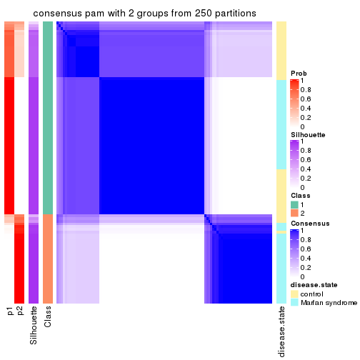</p>

</div>
<div id='tab-SD-pam-consensus-heatmap-2'>
<pre><code class="r">consensus_heatmap(res, k = 3)
</code></pre>

<p></p>

</div>
<div id='tab-SD-pam-consensus-heatmap-3'>
<pre><code class="r">consensus_heatmap(res, k = 4)
</code></pre>

<p></p>

</div>
<div id='tab-SD-pam-consensus-heatmap-4'>
<pre><code class="r">consensus_heatmap(res, k = 5)
</code></pre>

<p></p>

</div>
<div id='tab-SD-pam-consensus-heatmap-5'>
<pre><code class="r">consensus_heatmap(res, k = 6)
</code></pre>

<p></p>

</div>
</div>

Heatmaps for the membership of samples in all partitions to see how consistent they are:


<script>
$( function() {
	$( '#tabs-SD-pam-membership-heatmap' ).tabs();
} );
</script>
<div id='tabs-SD-pam-membership-heatmap'>
<ul>
<li><a href='#tab-SD-pam-membership-heatmap-1'>k = 2</a></li>
<li><a href='#tab-SD-pam-membership-heatmap-2'>k = 3</a></li>
<li><a href='#tab-SD-pam-membership-heatmap-3'>k = 4</a></li>
<li><a href='#tab-SD-pam-membership-heatmap-4'>k = 5</a></li>
<li><a href='#tab-SD-pam-membership-heatmap-5'>k = 6</a></li>
</ul>
<div id='tab-SD-pam-membership-heatmap-1'>
<pre><code class="r">membership_heatmap(res, k = 2)
</code></pre>

<p></p>

</div>
<div id='tab-SD-pam-membership-heatmap-2'>
<pre><code class="r">membership_heatmap(res, k = 3)
</code></pre>

<p></p>

</div>
<div id='tab-SD-pam-membership-heatmap-3'>
<pre><code class="r">membership_heatmap(res, k = 4)
</code></pre>

<p></p>

</div>
<div id='tab-SD-pam-membership-heatmap-4'>
<pre><code class="r">membership_heatmap(res, k = 5)
</code></pre>

<p></p>

</div>
<div id='tab-SD-pam-membership-heatmap-5'>
<pre><code class="r">membership_heatmap(res, k = 6)
</code></pre>

<p></p>

</div>
</div>

As soon as we have had the classes for columns, we can look for signatures
which are significantly different between classes which can be candidate marks
for certain classes. Following are the heatmaps for signatures.


Signature heatmaps where rows are scaled:


<script>
$( function() {
	$( '#tabs-SD-pam-get-signatures' ).tabs();
} );
</script>
<div id='tabs-SD-pam-get-signatures'>
<ul>
<li><a href='#tab-SD-pam-get-signatures-1'>k = 2</a></li>
<li><a href='#tab-SD-pam-get-signatures-2'>k = 3</a></li>
<li><a href='#tab-SD-pam-get-signatures-3'>k = 4</a></li>
<li><a href='#tab-SD-pam-get-signatures-4'>k = 5</a></li>
<li><a href='#tab-SD-pam-get-signatures-5'>k = 6</a></li>
</ul>
<div id='tab-SD-pam-get-signatures-1'>
<pre><code class="r">get_signatures(res, k = 2)
</code></pre>

<p></p>

</div>
<div id='tab-SD-pam-get-signatures-2'>
<pre><code class="r">get_signatures(res, k = 3)
</code></pre>

<p></p>

</div>
<div id='tab-SD-pam-get-signatures-3'>
<pre><code class="r">get_signatures(res, k = 4)
</code></pre>

<p></p>

</div>
<div id='tab-SD-pam-get-signatures-4'>
<pre><code class="r">get_signatures(res, k = 5)
</code></pre>

<p>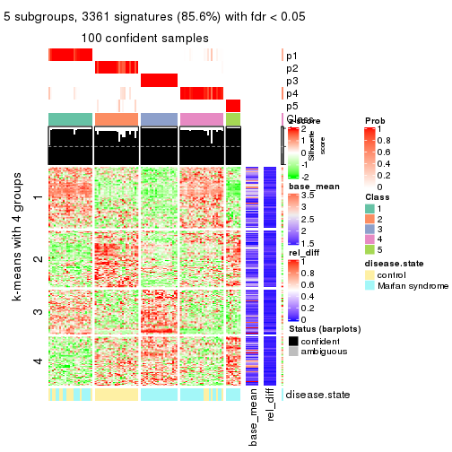</p>

</div>
<div id='tab-SD-pam-get-signatures-5'>
<pre><code class="r">get_signatures(res, k = 6)
</code></pre>

<p></p>

</div>
</div>


Signature heatmaps where rows are not scaled:


<script>
$( function() {
	$( '#tabs-SD-pam-get-signatures-no-scale' ).tabs();
} );
</script>
<div id='tabs-SD-pam-get-signatures-no-scale'>
<ul>
<li><a href='#tab-SD-pam-get-signatures-no-scale-1'>k = 2</a></li>
<li><a href='#tab-SD-pam-get-signatures-no-scale-2'>k = 3</a></li>
<li><a href='#tab-SD-pam-get-signatures-no-scale-3'>k = 4</a></li>
<li><a href='#tab-SD-pam-get-signatures-no-scale-4'>k = 5</a></li>
<li><a href='#tab-SD-pam-get-signatures-no-scale-5'>k = 6</a></li>
</ul>
<div id='tab-SD-pam-get-signatures-no-scale-1'>
<pre><code class="r">get_signatures(res, k = 2, scale_rows = FALSE)
</code></pre>

<p></p>

</div>
<div id='tab-SD-pam-get-signatures-no-scale-2'>
<pre><code class="r">get_signatures(res, k = 3, scale_rows = FALSE)
</code></pre>

<p></p>

</div>
<div id='tab-SD-pam-get-signatures-no-scale-3'>
<pre><code class="r">get_signatures(res, k = 4, scale_rows = FALSE)
</code></pre>

<p></p>

</div>
<div id='tab-SD-pam-get-signatures-no-scale-4'>
<pre><code class="r">get_signatures(res, k = 5, scale_rows = FALSE)
</code></pre>

<p></p>

</div>
<div id='tab-SD-pam-get-signatures-no-scale-5'>
<pre><code class="r">get_signatures(res, k = 6, scale_rows = FALSE)
</code></pre>

<p></p>

</div>
</div>


Compare the overlap of signatures from different k:

```r
compare_signatures(res)
```


`get_signature()` returns a data frame invisibly. TO get the list of signatures, the function
call should be assigned to a variable explicitly. In following code, if `plot` argument is set
to `FALSE`, no heatmap is plotted while only the differential analysis is performed.

```r
# code only for demonstration
tb = get_signature(res, k = ..., plot = FALSE)
```

An example of the output of `tb` is:

```
#>   which_row         fdr    mean_1    mean_2 scaled_mean_1 scaled_mean_2 km
#> 1        38 0.042760348  8.373488  9.131774    -0.5533452     0.5164555  1
#> 2        40 0.018707592  7.106213  8.469186    -0.6173731     0.5762149  1
#> 3        55 0.019134737 10.221463 11.207825    -0.6159697     0.5749050  1
#> 4        59 0.006059896  5.921854  7.869574    -0.6899429     0.6439467  1
#> 5        60 0.018055526  8.928898 10.211722    -0.6204761     0.5791110  1
#> 6        98 0.009384629 15.714769 14.887706     0.6635654    -0.6193277  2
...
```

The columns in `tb` are:

1. `which_row`: row indices corresponding to the input matrix.
2. `fdr`: FDR for the differential test. 
3. `mean_x`: The mean value in group x.
4. `scaled_mean_x`: The mean value in group x after rows are scaled.
5. `km`: Row groups if k-means clustering is applied to rows.


UMAP plot which shows how samples are separated.


<script>
$( function() {
	$( '#tabs-SD-pam-dimension-reduction' ).tabs();
} );
</script>
<div id='tabs-SD-pam-dimension-reduction'>
<ul>
<li><a href='#tab-SD-pam-dimension-reduction-1'>k = 2</a></li>
<li><a href='#tab-SD-pam-dimension-reduction-2'>k = 3</a></li>
<li><a href='#tab-SD-pam-dimension-reduction-3'>k = 4</a></li>
<li><a href='#tab-SD-pam-dimension-reduction-4'>k = 5</a></li>
<li><a href='#tab-SD-pam-dimension-reduction-5'>k = 6</a></li>
</ul>
<div id='tab-SD-pam-dimension-reduction-1'>
<pre><code class="r">dimension_reduction(res, k = 2, method = &quot;UMAP&quot;)
</code></pre>

<p></p>

</div>
<div id='tab-SD-pam-dimension-reduction-2'>
<pre><code class="r">dimension_reduction(res, k = 3, method = &quot;UMAP&quot;)
</code></pre>

<p></p>

</div>
<div id='tab-SD-pam-dimension-reduction-3'>
<pre><code class="r">dimension_reduction(res, k = 4, method = &quot;UMAP&quot;)
</code></pre>

<p></p>

</div>
<div id='tab-SD-pam-dimension-reduction-4'>
<pre><code class="r">dimension_reduction(res, k = 5, method = &quot;UMAP&quot;)
</code></pre>

<p></p>

</div>
<div id='tab-SD-pam-dimension-reduction-5'>
<pre><code class="r">dimension_reduction(res, k = 6, method = &quot;UMAP&quot;)
</code></pre>

<p></p>

</div>
</div>


Following heatmap shows how subgroups are split when increasing `k`:

```r
collect_classes(res)
```


Test correlation between subgroups and known annotations. If the known
annotation is numeric, one-way ANOVA test is applied, and if the known
annotation is discrete, chi-squared contingency table test is applied.

```r
test_to_known_factors(res)
```

```
#>          n disease.state(p) k
#> SD:pam  98         1.46e-04 2
#> SD:pam 101         2.94e-07 3
#> SD:pam  98         1.21e-06 4
#> SD:pam 100         1.39e-11 5
#> SD:pam  93         2.92e-10 6
```


If matrix rows can be associated to genes, consider to use `functional_enrichment(res,
...)` to perform function enrichment for the signature genes. See [this vignette](http://bioconductor.org/packages/devel/bioc/vignettes/cola/inst/doc/functional_enrichment.html) for more detailed explanations.


 

---------------------------------------------------


### SD:mclust*


The object with results only for a single top-value method and a single partition method 
can be extracted as:

```r
res = res_list["SD", "mclust"]
# you can also extract it by
# res = res_list["SD:mclust"]
```

A summary of `res` and all the functions that can be applied to it:

```r
res
```

```
#> A 'ConsensusPartition' object with k = 2, 3, 4, 5, 6.
#>   On a matrix with 3925 rows and 101 columns.
#>   Top rows (392, 784, 1177, 1570, 1962) are extracted by 'SD' method.
#>   Subgroups are detected by 'mclust' method.
#>   Performed in total 1250 partitions by row resampling.
#>   Best k for subgroups seems to be 6.
#> 
#> Following methods can be applied to this 'ConsensusPartition' object:
#>  [1] "cola_report"             "collect_classes"         "collect_plots"          
#>  [4] "collect_stats"           "colnames"                "compare_signatures"     
#>  [7] "consensus_heatmap"       "dimension_reduction"     "functional_enrichment"  
#> [10] "get_anno_col"            "get_anno"                "get_classes"            
#> [13] "get_consensus"           "get_matrix"              "get_membership"         
#> [16] "get_param"               "get_signatures"          "get_stats"              
#> [19] "is_best_k"               "is_stable_k"             "membership_heatmap"     
#> [22] "ncol"                    "nrow"                    "plot_ecdf"              
#> [25] "rownames"                "select_partition_number" "show"                   
#> [28] "suggest_best_k"          "test_to_known_factors"
```

`collect_plots()` function collects all the plots made from `res` for all `k` (number of partitions)
into one single page to provide an easy and fast comparison between different `k`.

```r
collect_plots(res)
```


The plots are:

- The first row: a plot of the ECDF (empirical cumulative distribution
  function) curves of the consensus matrix for each `k` and the heatmap of
  predicted classes for each `k`.
- The second row: heatmaps of the consensus matrix for each `k`.
- The third row: heatmaps of the membership matrix for each `k`.
- The fouth row: heatmaps of the signatures for each `k`.

All the plots in panels can be made by individual functions and they are
plotted later in this section.

`select_partition_number()` produces several plots showing different
statistics for choosing "optimized" `k`. There are following statistics:

- ECDF curves of the consensus matrix for each `k`;
- 1-PAC. [The PAC
  score](https://en.wikipedia.org/wiki/Consensus_clustering#Over-interpretation_potential_of_consensus_clustering)
  measures the proportion of the ambiguous subgrouping.
- Mean silhouette score.
- Concordance. The mean probability of fiting the consensus class ids in all
  partitions.
- Area increased. Denote $A_k$ as the area under the ECDF curve for current
  `k`, the area increased is defined as $A_k - A_{k-1}$.
- Rand index. The percent of pairs of samples that are both in a same cluster
  or both are not in a same cluster in the partition of k and k-1.
- Jaccard index. The ratio of pairs of samples are both in a same cluster in
  the partition of k and k-1 and the pairs of samples are both in a same
  cluster in the partition k or k-1.

The detailed explanations of these statistics can be found in [the _cola_
vignette](http://bioconductor.org/packages/devel/bioc/vignettes/cola/inst/doc/cola.html#toc_13).

Generally speaking, lower PAC score, higher mean silhouette score or higher
concordance corresponds to better partition. Rand index and Jaccard index
measure how similar the current partition is compared to partition with `k-1`.
If they are too similar, we won't accept `k` is better than `k-1`.

```r
select_partition_number(res)
```


The numeric values for all these statistics can be obtained by `get_stats()`.

```r
get_stats(res)
```

```
#>   k 1-PAC mean_silhouette concordance area_increased  Rand Jaccard
#> 2 2 1.000           0.989       0.987         0.5000 0.495   0.495
#> 3 3 1.000           0.981       0.987         0.2637 0.873   0.744
#> 4 4 0.807           0.844       0.874         0.0843 0.974   0.931
#> 5 5 0.978           0.963       0.975         0.1653 0.811   0.486
#> 6 6 0.912           0.813       0.907         0.0101 0.967   0.849
```

`suggest_best_k()` suggests the best $k$ based on these statistics. The rules are as follows:

- All $k$ with Jaccard index larger than 0.95 are removed because increasing
  $k$ does not provide enough extra information. If all $k$ are removed, it is
  marked as no subgroup is detected.
- For all $k$ with 1-PAC score larger than 0.9, the maximal $k$ is taken as
  the best $k$, and other $k$ are marked as optional $k$.
- If it does not fit the second rule. The $k$ with the maximal vote of the
  highest 1-PAC score, highest mean silhouette, and highest concordance is
  taken as the best $k$.

```r
suggest_best_k(res)
```

```
#> [1] 6
#> attr(,"optional")
#> [1] 2 3 5
```

There is also optional best $k$ = 2 3 5 that is worth to check.

Following shows the table of the partitions (You need to click the **show/hide
code output** link to see it). The membership matrix (columns with name `p*`)
is inferred by
[`clue::cl_consensus()`](https://www.rdocumentation.org/link/cl_consensus?package=clue)
function with the `SE` method. Basically the value in the membership matrix
represents the probability to belong to a certain group. The finall class
label for an item is determined with the group with highest probability it
belongs to.

In `get_classes()` function, the entropy is calculated from the membership
matrix and the silhouette score is calculated from the consensus matrix.


<script>
$( function() {
	$( '#tabs-SD-mclust-get-classes' ).tabs();
} );
</script>
<div id='tabs-SD-mclust-get-classes'>
<ul>
<li><a href='#tab-SD-mclust-get-classes-1'>k = 2</a></li>
<li><a href='#tab-SD-mclust-get-classes-2'>k = 3</a></li>
<li><a href='#tab-SD-mclust-get-classes-3'>k = 4</a></li>
<li><a href='#tab-SD-mclust-get-classes-4'>k = 5</a></li>
<li><a href='#tab-SD-mclust-get-classes-5'>k = 6</a></li>
</ul>

<div id='tab-SD-mclust-get-classes-1'>
<p><a id='tab-SD-mclust-get-classes-1-a' style='color:#0366d6' href='#'>show/hide code output</a></p>
<pre><code class="r">cbind(get_classes(res, k = 2), get_membership(res, k = 2))
</code></pre>

<pre><code>#&gt;           class entropy silhouette    p1    p2
#&gt; GSM217644     2  0.1843      0.986 0.028 0.972
#&gt; GSM217645     2  0.1843      0.986 0.028 0.972
#&gt; GSM217646     2  0.1843      0.986 0.028 0.972
#&gt; GSM217647     2  0.1843      0.986 0.028 0.972
#&gt; GSM217648     2  0.1843      0.986 0.028 0.972
#&gt; GSM217649     2  0.1843      0.986 0.028 0.972
#&gt; GSM217650     2  0.1843      0.986 0.028 0.972
#&gt; GSM217651     2  0.1843      0.986 0.028 0.972
#&gt; GSM217652     2  0.1843      0.986 0.028 0.972
#&gt; GSM217653     2  0.1843      0.986 0.028 0.972
#&gt; GSM217654     2  0.1843      0.986 0.028 0.972
#&gt; GSM217655     2  0.1843      0.986 0.028 0.972
#&gt; GSM217656     2  0.3733      0.944 0.072 0.928
#&gt; GSM217657     2  0.1843      0.986 0.028 0.972
#&gt; GSM217658     2  0.1843      0.986 0.028 0.972
#&gt; GSM217659     2  0.1843      0.986 0.028 0.972
#&gt; GSM217660     2  0.1843      0.986 0.028 0.972
#&gt; GSM217661     2  0.1843      0.986 0.028 0.972
#&gt; GSM217662     2  0.1843      0.986 0.028 0.972
#&gt; GSM217663     2  0.1843      0.986 0.028 0.972
#&gt; GSM217664     2  0.1843      0.986 0.028 0.972
#&gt; GSM217665     2  0.1843      0.986 0.028 0.972
#&gt; GSM217666     2  0.1843      0.986 0.028 0.972
#&gt; GSM217667     2  0.1843      0.986 0.028 0.972
#&gt; GSM217668     1  0.0672      0.996 0.992 0.008
#&gt; GSM217669     1  0.0672      0.996 0.992 0.008
#&gt; GSM217670     1  0.0672      0.996 0.992 0.008
#&gt; GSM217671     1  0.0672      0.996 0.992 0.008
#&gt; GSM217672     1  0.0672      0.996 0.992 0.008
#&gt; GSM217673     1  0.0672      0.996 0.992 0.008
#&gt; GSM217674     1  0.0000      0.996 1.000 0.000
#&gt; GSM217675     1  0.0000      0.996 1.000 0.000
#&gt; GSM217676     1  0.0000      0.996 1.000 0.000
#&gt; GSM217677     1  0.0000      0.996 1.000 0.000
#&gt; GSM217678     1  0.0000      0.996 1.000 0.000
#&gt; GSM217679     1  0.0000      0.996 1.000 0.000
#&gt; GSM217680     1  0.0000      0.996 1.000 0.000
#&gt; GSM217681     1  0.0000      0.996 1.000 0.000
#&gt; GSM217682     1  0.0000      0.996 1.000 0.000
#&gt; GSM217683     1  0.0000      0.996 1.000 0.000
#&gt; GSM217684     1  0.0672      0.996 0.992 0.008
#&gt; GSM217685     2  0.0672      0.978 0.008 0.992
#&gt; GSM217686     2  0.0672      0.978 0.008 0.992
#&gt; GSM217687     2  0.0672      0.978 0.008 0.992
#&gt; GSM217688     2  0.0672      0.978 0.008 0.992
#&gt; GSM217689     2  0.0672      0.978 0.008 0.992
#&gt; GSM217690     2  0.0672      0.978 0.008 0.992
#&gt; GSM217691     2  0.0672      0.978 0.008 0.992
#&gt; GSM217692     2  0.0672      0.978 0.008 0.992
#&gt; GSM217693     2  0.0672      0.978 0.008 0.992
#&gt; GSM217694     2  0.0672      0.978 0.008 0.992
#&gt; GSM217695     2  0.0672      0.978 0.008 0.992
#&gt; GSM217696     2  0.0672      0.978 0.008 0.992
#&gt; GSM217697     2  0.0672      0.978 0.008 0.992
#&gt; GSM217698     2  0.0672      0.978 0.008 0.992
#&gt; GSM217699     2  0.0672      0.978 0.008 0.992
#&gt; GSM217700     2  0.0672      0.978 0.008 0.992
#&gt; GSM217701     2  0.0672      0.978 0.008 0.992
#&gt; GSM217702     2  0.0672      0.978 0.008 0.992
#&gt; GSM217703     2  0.0672      0.978 0.008 0.992
#&gt; GSM217704     2  0.0672      0.978 0.008 0.992
#&gt; GSM217705     1  0.0672      0.996 0.992 0.008
#&gt; GSM217706     1  0.0672      0.996 0.992 0.008
#&gt; GSM217707     1  0.0672      0.996 0.992 0.008
#&gt; GSM217708     1  0.0672      0.996 0.992 0.008
#&gt; GSM217709     1  0.0672      0.996 0.992 0.008
#&gt; GSM217710     1  0.0672      0.996 0.992 0.008
#&gt; GSM217711     1  0.0672      0.996 0.992 0.008
#&gt; GSM217712     1  0.0672      0.996 0.992 0.008
#&gt; GSM217713     1  0.0672      0.996 0.992 0.008
#&gt; GSM217714     1  0.0672      0.996 0.992 0.008
#&gt; GSM217715     1  0.0672      0.996 0.992 0.008
#&gt; GSM217716     1  0.0672      0.996 0.992 0.008
#&gt; GSM217717     1  0.0672      0.996 0.992 0.008
#&gt; GSM217718     1  0.0672      0.996 0.992 0.008
#&gt; GSM217719     1  0.0672      0.996 0.992 0.008
#&gt; GSM217720     1  0.0672      0.996 0.992 0.008
#&gt; GSM217721     1  0.0672      0.996 0.992 0.008
#&gt; GSM217722     1  0.0672      0.996 0.992 0.008
#&gt; GSM217723     1  0.0000      0.996 1.000 0.000
#&gt; GSM217724     1  0.0000      0.996 1.000 0.000
#&gt; GSM217725     1  0.0000      0.996 1.000 0.000
#&gt; GSM217726     1  0.0000      0.996 1.000 0.000
#&gt; GSM217727     1  0.0000      0.996 1.000 0.000
#&gt; GSM217728     1  0.0000      0.996 1.000 0.000
#&gt; GSM217729     1  0.0000      0.996 1.000 0.000
#&gt; GSM217730     1  0.0000      0.996 1.000 0.000
#&gt; GSM217731     1  0.0000      0.996 1.000 0.000
#&gt; GSM217732     1  0.0000      0.996 1.000 0.000
#&gt; GSM217733     1  0.0000      0.996 1.000 0.000
#&gt; GSM217734     1  0.0000      0.996 1.000 0.000
#&gt; GSM217735     1  0.0000      0.996 1.000 0.000
#&gt; GSM217736     1  0.0000      0.996 1.000 0.000
#&gt; GSM217737     2  0.1843      0.986 0.028 0.972
#&gt; GSM217738     2  0.1843      0.986 0.028 0.972
#&gt; GSM217739     2  0.1843      0.986 0.028 0.972
#&gt; GSM217740     2  0.1843      0.986 0.028 0.972
#&gt; GSM217741     2  0.1843      0.986 0.028 0.972
#&gt; GSM217742     2  0.1843      0.986 0.028 0.972
#&gt; GSM217743     2  0.1843      0.986 0.028 0.972
#&gt; GSM217744     2  0.1843      0.986 0.028 0.972
</code></pre>

<script>
$('#tab-SD-mclust-get-classes-1-a').parent().next().next().hide();
$('#tab-SD-mclust-get-classes-1-a').click(function(){
  $('#tab-SD-mclust-get-classes-1-a').parent().next().next().toggle();
  return(false);
});
</script>
</div>

<div id='tab-SD-mclust-get-classes-2'>
<p><a id='tab-SD-mclust-get-classes-2-a' style='color:#0366d6' href='#'>show/hide code output</a></p>
<pre><code class="r">cbind(get_classes(res, k = 3), get_membership(res, k = 3))
</code></pre>

<pre><code>#&gt;           class entropy silhouette    p1    p2   p3
#&gt; GSM217644     2  0.0000      0.999 0.000 1.000 0.00
#&gt; GSM217645     2  0.0000      0.999 0.000 1.000 0.00
#&gt; GSM217646     2  0.0000      0.999 0.000 1.000 0.00
#&gt; GSM217647     2  0.0000      0.999 0.000 1.000 0.00
#&gt; GSM217648     2  0.0000      0.999 0.000 1.000 0.00
#&gt; GSM217649     2  0.0000      0.999 0.000 1.000 0.00
#&gt; GSM217650     2  0.0000      0.999 0.000 1.000 0.00
#&gt; GSM217651     2  0.0000      0.999 0.000 1.000 0.00
#&gt; GSM217652     2  0.0000      0.999 0.000 1.000 0.00
#&gt; GSM217653     2  0.0000      0.999 0.000 1.000 0.00
#&gt; GSM217654     2  0.0000      0.999 0.000 1.000 0.00
#&gt; GSM217655     2  0.0000      0.999 0.000 1.000 0.00
#&gt; GSM217656     2  0.0892      0.980 0.000 0.980 0.02
#&gt; GSM217657     2  0.0000      0.999 0.000 1.000 0.00
#&gt; GSM217658     2  0.0000      0.999 0.000 1.000 0.00
#&gt; GSM217659     2  0.0000      0.999 0.000 1.000 0.00
#&gt; GSM217660     2  0.0000      0.999 0.000 1.000 0.00
#&gt; GSM217661     2  0.0000      0.999 0.000 1.000 0.00
#&gt; GSM217662     2  0.0000      0.999 0.000 1.000 0.00
#&gt; GSM217663     2  0.0000      0.999 0.000 1.000 0.00
#&gt; GSM217664     2  0.0000      0.999 0.000 1.000 0.00
#&gt; GSM217665     2  0.0000      0.999 0.000 1.000 0.00
#&gt; GSM217666     2  0.0000      0.999 0.000 1.000 0.00
#&gt; GSM217667     2  0.0000      0.999 0.000 1.000 0.00
#&gt; GSM217668     1  0.4178      0.836 0.828 0.172 0.00
#&gt; GSM217669     1  0.0892      0.968 0.980 0.020 0.00
#&gt; GSM217670     1  0.2356      0.945 0.928 0.072 0.00
#&gt; GSM217671     1  0.2066      0.953 0.940 0.060 0.00
#&gt; GSM217672     1  0.2066      0.953 0.940 0.060 0.00
#&gt; GSM217673     1  0.2066      0.953 0.940 0.060 0.00
#&gt; GSM217674     1  0.0000      0.971 1.000 0.000 0.00
#&gt; GSM217675     1  0.0000      0.971 1.000 0.000 0.00
#&gt; GSM217676     1  0.0000      0.971 1.000 0.000 0.00
#&gt; GSM217677     1  0.0000      0.971 1.000 0.000 0.00
#&gt; GSM217678     1  0.0000      0.971 1.000 0.000 0.00
#&gt; GSM217679     1  0.0000      0.971 1.000 0.000 0.00
#&gt; GSM217680     1  0.0000      0.971 1.000 0.000 0.00
#&gt; GSM217681     1  0.0000      0.971 1.000 0.000 0.00
#&gt; GSM217682     1  0.0000      0.971 1.000 0.000 0.00
#&gt; GSM217683     1  0.0000      0.971 1.000 0.000 0.00
#&gt; GSM217684     1  0.2625      0.936 0.916 0.084 0.00
#&gt; GSM217685     3  0.0000      1.000 0.000 0.000 1.00
#&gt; GSM217686     3  0.0000      1.000 0.000 0.000 1.00
#&gt; GSM217687     3  0.0000      1.000 0.000 0.000 1.00
#&gt; GSM217688     3  0.0000      1.000 0.000 0.000 1.00
#&gt; GSM217689     3  0.0000      1.000 0.000 0.000 1.00
#&gt; GSM217690     3  0.0000      1.000 0.000 0.000 1.00
#&gt; GSM217691     3  0.0000      1.000 0.000 0.000 1.00
#&gt; GSM217692     3  0.0000      1.000 0.000 0.000 1.00
#&gt; GSM217693     3  0.0000      1.000 0.000 0.000 1.00
#&gt; GSM217694     3  0.0000      1.000 0.000 0.000 1.00
#&gt; GSM217695     3  0.0000      1.000 0.000 0.000 1.00
#&gt; GSM217696     3  0.0000      1.000 0.000 0.000 1.00
#&gt; GSM217697     3  0.0000      1.000 0.000 0.000 1.00
#&gt; GSM217698     3  0.0000      1.000 0.000 0.000 1.00
#&gt; GSM217699     3  0.0000      1.000 0.000 0.000 1.00
#&gt; GSM217700     3  0.0000      1.000 0.000 0.000 1.00
#&gt; GSM217701     3  0.0000      1.000 0.000 0.000 1.00
#&gt; GSM217702     3  0.0000      1.000 0.000 0.000 1.00
#&gt; GSM217703     3  0.0000      1.000 0.000 0.000 1.00
#&gt; GSM217704     3  0.0000      1.000 0.000 0.000 1.00
#&gt; GSM217705     1  0.2537      0.939 0.920 0.080 0.00
#&gt; GSM217706     1  0.2066      0.953 0.940 0.060 0.00
#&gt; GSM217707     1  0.0424      0.971 0.992 0.008 0.00
#&gt; GSM217708     1  0.1411      0.963 0.964 0.036 0.00
#&gt; GSM217709     1  0.0424      0.971 0.992 0.008 0.00
#&gt; GSM217710     1  0.0424      0.971 0.992 0.008 0.00
#&gt; GSM217711     1  0.0424      0.971 0.992 0.008 0.00
#&gt; GSM217712     1  0.2066      0.953 0.940 0.060 0.00
#&gt; GSM217713     1  0.2537      0.939 0.920 0.080 0.00
#&gt; GSM217714     1  0.2066      0.953 0.940 0.060 0.00
#&gt; GSM217715     1  0.2066      0.953 0.940 0.060 0.00
#&gt; GSM217716     1  0.2066      0.953 0.940 0.060 0.00
#&gt; GSM217717     1  0.2165      0.951 0.936 0.064 0.00
#&gt; GSM217718     1  0.0747      0.969 0.984 0.016 0.00
#&gt; GSM217719     1  0.0424      0.971 0.992 0.008 0.00
#&gt; GSM217720     1  0.2625      0.936 0.916 0.084 0.00
#&gt; GSM217721     1  0.2356      0.945 0.928 0.072 0.00
#&gt; GSM217722     1  0.1163      0.966 0.972 0.028 0.00
#&gt; GSM217723     1  0.0000      0.971 1.000 0.000 0.00
#&gt; GSM217724     1  0.0000      0.971 1.000 0.000 0.00
#&gt; GSM217725     1  0.0000      0.971 1.000 0.000 0.00
#&gt; GSM217726     1  0.0000      0.971 1.000 0.000 0.00
#&gt; GSM217727     1  0.0000      0.971 1.000 0.000 0.00
#&gt; GSM217728     1  0.0000      0.971 1.000 0.000 0.00
#&gt; GSM217729     1  0.0000      0.971 1.000 0.000 0.00
#&gt; GSM217730     1  0.0000      0.971 1.000 0.000 0.00
#&gt; GSM217731     1  0.0000      0.971 1.000 0.000 0.00
#&gt; GSM217732     1  0.0000      0.971 1.000 0.000 0.00
#&gt; GSM217733     1  0.0000      0.971 1.000 0.000 0.00
#&gt; GSM217734     1  0.0000      0.971 1.000 0.000 0.00
#&gt; GSM217735     1  0.0000      0.971 1.000 0.000 0.00
#&gt; GSM217736     1  0.0000      0.971 1.000 0.000 0.00
#&gt; GSM217737     2  0.0000      0.999 0.000 1.000 0.00
#&gt; GSM217738     2  0.0000      0.999 0.000 1.000 0.00
#&gt; GSM217739     2  0.0000      0.999 0.000 1.000 0.00
#&gt; GSM217740     2  0.0000      0.999 0.000 1.000 0.00
#&gt; GSM217741     2  0.0000      0.999 0.000 1.000 0.00
#&gt; GSM217742     2  0.0000      0.999 0.000 1.000 0.00
#&gt; GSM217743     2  0.0000      0.999 0.000 1.000 0.00
#&gt; GSM217744     2  0.0000      0.999 0.000 1.000 0.00
</code></pre>

<script>
$('#tab-SD-mclust-get-classes-2-a').parent().next().next().hide();
$('#tab-SD-mclust-get-classes-2-a').click(function(){
  $('#tab-SD-mclust-get-classes-2-a').parent().next().next().toggle();
  return(false);
});
</script>
</div>

<div id='tab-SD-mclust-get-classes-3'>
<p><a id='tab-SD-mclust-get-classes-3-a' style='color:#0366d6' href='#'>show/hide code output</a></p>
<pre><code class="r">cbind(get_classes(res, k = 4), get_membership(res, k = 4))
</code></pre>

<pre><code>#&gt;           class entropy silhouette    p1    p2    p3    p4
#&gt; GSM217644     2  0.0336      0.959 0.000 0.992 0.000 0.008
#&gt; GSM217645     2  0.0336      0.959 0.000 0.992 0.000 0.008
#&gt; GSM217646     2  0.0336      0.959 0.000 0.992 0.000 0.008
#&gt; GSM217647     2  0.0188      0.958 0.000 0.996 0.000 0.004
#&gt; GSM217648     2  0.0188      0.958 0.000 0.996 0.000 0.004
#&gt; GSM217649     2  0.0336      0.959 0.000 0.992 0.000 0.008
#&gt; GSM217650     2  0.0336      0.959 0.000 0.992 0.000 0.008
#&gt; GSM217651     2  0.0000      0.958 0.000 1.000 0.000 0.000
#&gt; GSM217652     2  0.0336      0.959 0.000 0.992 0.000 0.008
#&gt; GSM217653     2  0.0188      0.958 0.000 0.996 0.000 0.004
#&gt; GSM217654     2  0.0592      0.956 0.000 0.984 0.000 0.016
#&gt; GSM217655     2  0.0336      0.959 0.000 0.992 0.000 0.008
#&gt; GSM217656     4  0.5200      0.275 0.000 0.036 0.264 0.700
#&gt; GSM217657     2  0.4978      0.665 0.000 0.664 0.012 0.324
#&gt; GSM217658     2  0.0336      0.959 0.000 0.992 0.000 0.008
#&gt; GSM217659     2  0.0336      0.959 0.000 0.992 0.000 0.008
#&gt; GSM217660     2  0.0336      0.959 0.000 0.992 0.000 0.008
#&gt; GSM217661     2  0.0336      0.959 0.000 0.992 0.000 0.008
#&gt; GSM217662     2  0.0336      0.957 0.000 0.992 0.000 0.008
#&gt; GSM217663     2  0.0336      0.959 0.000 0.992 0.000 0.008
#&gt; GSM217664     2  0.0336      0.959 0.000 0.992 0.000 0.008
#&gt; GSM217665     2  0.0188      0.958 0.000 0.996 0.000 0.004
#&gt; GSM217666     2  0.0188      0.958 0.000 0.996 0.000 0.004
#&gt; GSM217667     2  0.0188      0.958 0.000 0.996 0.000 0.004
#&gt; GSM217668     1  0.7688      0.494 0.456 0.260 0.284 0.000
#&gt; GSM217669     1  0.4277      0.838 0.720 0.000 0.280 0.000
#&gt; GSM217670     1  0.4304      0.837 0.716 0.000 0.284 0.000
#&gt; GSM217671     1  0.4304      0.837 0.716 0.000 0.284 0.000
#&gt; GSM217672     1  0.4304      0.837 0.716 0.000 0.284 0.000
#&gt; GSM217673     1  0.4304      0.837 0.716 0.000 0.284 0.000
#&gt; GSM217674     1  0.0188      0.851 0.996 0.000 0.000 0.004
#&gt; GSM217675     1  0.0188      0.851 0.996 0.000 0.000 0.004
#&gt; GSM217676     1  0.0188      0.851 0.996 0.000 0.000 0.004
#&gt; GSM217677     1  0.0188      0.851 0.996 0.000 0.000 0.004
#&gt; GSM217678     1  0.0000      0.851 1.000 0.000 0.000 0.000
#&gt; GSM217679     1  0.0188      0.851 0.996 0.000 0.000 0.004
#&gt; GSM217680     1  0.0188      0.851 0.996 0.000 0.000 0.004
#&gt; GSM217681     1  0.0188      0.851 0.996 0.000 0.000 0.004
#&gt; GSM217682     1  0.0188      0.851 0.996 0.000 0.000 0.004
#&gt; GSM217683     1  0.0188      0.851 0.996 0.000 0.000 0.004
#&gt; GSM217684     1  0.4304      0.837 0.716 0.000 0.284 0.000
#&gt; GSM217685     4  0.4877      0.293 0.000 0.000 0.408 0.592
#&gt; GSM217686     4  0.4877      0.293 0.000 0.000 0.408 0.592
#&gt; GSM217687     4  0.4877      0.293 0.000 0.000 0.408 0.592
#&gt; GSM217688     4  0.4877      0.293 0.000 0.000 0.408 0.592
#&gt; GSM217689     4  0.3907      0.487 0.000 0.000 0.232 0.768
#&gt; GSM217690     4  0.3907      0.487 0.000 0.000 0.232 0.768
#&gt; GSM217691     3  0.4304      0.984 0.000 0.000 0.716 0.284
#&gt; GSM217692     3  0.4304      0.984 0.000 0.000 0.716 0.284
#&gt; GSM217693     3  0.4304      0.984 0.000 0.000 0.716 0.284
#&gt; GSM217694     3  0.4304      0.984 0.000 0.000 0.716 0.284
#&gt; GSM217695     3  0.4304      0.984 0.000 0.000 0.716 0.284
#&gt; GSM217696     3  0.4304      0.984 0.000 0.000 0.716 0.284
#&gt; GSM217697     3  0.4382      0.962 0.000 0.000 0.704 0.296
#&gt; GSM217698     3  0.4713      0.806 0.000 0.000 0.640 0.360
#&gt; GSM217699     3  0.4304      0.984 0.000 0.000 0.716 0.284
#&gt; GSM217700     3  0.4304      0.984 0.000 0.000 0.716 0.284
#&gt; GSM217701     3  0.4304      0.984 0.000 0.000 0.716 0.284
#&gt; GSM217702     3  0.4304      0.984 0.000 0.000 0.716 0.284
#&gt; GSM217703     4  0.0707      0.416 0.000 0.000 0.020 0.980
#&gt; GSM217704     3  0.4304      0.984 0.000 0.000 0.716 0.284
#&gt; GSM217705     1  0.4304      0.837 0.716 0.000 0.284 0.000
#&gt; GSM217706     1  0.4304      0.837 0.716 0.000 0.284 0.000
#&gt; GSM217707     1  0.3024      0.849 0.852 0.000 0.148 0.000
#&gt; GSM217708     1  0.4072      0.841 0.748 0.000 0.252 0.000
#&gt; GSM217709     1  0.4250      0.839 0.724 0.000 0.276 0.000
#&gt; GSM217710     1  0.4277      0.838 0.720 0.000 0.280 0.000
#&gt; GSM217711     1  0.4277      0.838 0.720 0.000 0.280 0.000
#&gt; GSM217712     1  0.4304      0.837 0.716 0.000 0.284 0.000
#&gt; GSM217713     1  0.4304      0.837 0.716 0.000 0.284 0.000
#&gt; GSM217714     1  0.4304      0.837 0.716 0.000 0.284 0.000
#&gt; GSM217715     1  0.4304      0.837 0.716 0.000 0.284 0.000
#&gt; GSM217716     1  0.4304      0.837 0.716 0.000 0.284 0.000
#&gt; GSM217717     1  0.4304      0.837 0.716 0.000 0.284 0.000
#&gt; GSM217718     1  0.4277      0.838 0.720 0.000 0.280 0.000
#&gt; GSM217719     1  0.4250      0.839 0.724 0.000 0.276 0.000
#&gt; GSM217720     1  0.4304      0.837 0.716 0.000 0.284 0.000
#&gt; GSM217721     1  0.4304      0.837 0.716 0.000 0.284 0.000
#&gt; GSM217722     1  0.2921      0.849 0.860 0.000 0.140 0.000
#&gt; GSM217723     1  0.0188      0.851 0.996 0.000 0.004 0.000
#&gt; GSM217724     1  0.0000      0.851 1.000 0.000 0.000 0.000
#&gt; GSM217725     1  0.0000      0.851 1.000 0.000 0.000 0.000
#&gt; GSM217726     1  0.0188      0.851 0.996 0.000 0.000 0.004
#&gt; GSM217727     1  0.0188      0.851 0.996 0.000 0.000 0.004
#&gt; GSM217728     1  0.0000      0.851 1.000 0.000 0.000 0.000
#&gt; GSM217729     1  0.0336      0.851 0.992 0.000 0.008 0.000
#&gt; GSM217730     1  0.0188      0.851 0.996 0.000 0.000 0.004
#&gt; GSM217731     1  0.0188      0.851 0.996 0.000 0.000 0.004
#&gt; GSM217732     1  0.0188      0.851 0.996 0.000 0.000 0.004
#&gt; GSM217733     1  0.0188      0.851 0.996 0.000 0.000 0.004
#&gt; GSM217734     1  0.0188      0.851 0.996 0.000 0.000 0.004
#&gt; GSM217735     1  0.0188      0.851 0.996 0.000 0.000 0.004
#&gt; GSM217736     1  0.0188      0.851 0.996 0.000 0.000 0.004
#&gt; GSM217737     2  0.3726      0.810 0.000 0.788 0.000 0.212
#&gt; GSM217738     2  0.3873      0.794 0.000 0.772 0.000 0.228
#&gt; GSM217739     2  0.3486      0.831 0.000 0.812 0.000 0.188
#&gt; GSM217740     2  0.3569      0.824 0.000 0.804 0.000 0.196
#&gt; GSM217741     2  0.0921      0.949 0.000 0.972 0.000 0.028
#&gt; GSM217742     2  0.0921      0.949 0.000 0.972 0.000 0.028
#&gt; GSM217743     2  0.0921      0.949 0.000 0.972 0.000 0.028
#&gt; GSM217744     2  0.0921      0.949 0.000 0.972 0.000 0.028
</code></pre>

<script>
$('#tab-SD-mclust-get-classes-3-a').parent().next().next().hide();
$('#tab-SD-mclust-get-classes-3-a').click(function(){
  $('#tab-SD-mclust-get-classes-3-a').parent().next().next().toggle();
  return(false);
});
</script>
</div>

<div id='tab-SD-mclust-get-classes-4'>
<p><a id='tab-SD-mclust-get-classes-4-a' style='color:#0366d6' href='#'>show/hide code output</a></p>
<pre><code class="r">cbind(get_classes(res, k = 5), get_membership(res, k = 5))
</code></pre>

<pre><code>#&gt;           class entropy silhouette    p1    p2    p3    p4    p5
#&gt; GSM217644     2  0.0162      0.951 0.000 0.996 0.000 0.000 0.004
#&gt; GSM217645     2  0.0162      0.951 0.000 0.996 0.000 0.000 0.004
#&gt; GSM217646     2  0.0162      0.951 0.000 0.996 0.000 0.000 0.004
#&gt; GSM217647     5  0.2424      0.919 0.000 0.132 0.000 0.000 0.868
#&gt; GSM217648     5  0.2424      0.919 0.000 0.132 0.000 0.000 0.868
#&gt; GSM217649     2  0.0162      0.951 0.000 0.996 0.000 0.000 0.004
#&gt; GSM217650     2  0.0162      0.951 0.000 0.996 0.000 0.000 0.004
#&gt; GSM217651     5  0.3857      0.668 0.000 0.312 0.000 0.000 0.688
#&gt; GSM217652     2  0.0162      0.951 0.000 0.996 0.000 0.000 0.004
#&gt; GSM217653     5  0.2424      0.919 0.000 0.132 0.000 0.000 0.868
#&gt; GSM217654     2  0.0162      0.951 0.000 0.996 0.000 0.000 0.004
#&gt; GSM217655     2  0.0162      0.951 0.000 0.996 0.000 0.000 0.004
#&gt; GSM217656     2  0.3612      0.733 0.000 0.800 0.000 0.172 0.028
#&gt; GSM217657     2  0.0703      0.929 0.000 0.976 0.000 0.000 0.024
#&gt; GSM217658     2  0.0162      0.951 0.000 0.996 0.000 0.000 0.004
#&gt; GSM217659     2  0.0162      0.951 0.000 0.996 0.000 0.000 0.004
#&gt; GSM217660     2  0.3561      0.589 0.000 0.740 0.000 0.000 0.260
#&gt; GSM217661     2  0.0162      0.951 0.000 0.996 0.000 0.000 0.004
#&gt; GSM217662     5  0.1341      0.935 0.000 0.056 0.000 0.000 0.944
#&gt; GSM217663     2  0.2424      0.817 0.000 0.868 0.000 0.000 0.132
#&gt; GSM217664     2  0.0162      0.951 0.000 0.996 0.000 0.000 0.004
#&gt; GSM217665     5  0.2424      0.919 0.000 0.132 0.000 0.000 0.868
#&gt; GSM217666     5  0.2424      0.919 0.000 0.132 0.000 0.000 0.868
#&gt; GSM217667     5  0.2424      0.919 0.000 0.132 0.000 0.000 0.868
#&gt; GSM217668     4  0.0000      0.988 0.000 0.000 0.000 1.000 0.000
#&gt; GSM217669     4  0.0000      0.988 0.000 0.000 0.000 1.000 0.000
#&gt; GSM217670     4  0.0000      0.988 0.000 0.000 0.000 1.000 0.000
#&gt; GSM217671     4  0.0000      0.988 0.000 0.000 0.000 1.000 0.000
#&gt; GSM217672     4  0.0000      0.988 0.000 0.000 0.000 1.000 0.000
#&gt; GSM217673     4  0.0000      0.988 0.000 0.000 0.000 1.000 0.000
#&gt; GSM217674     1  0.0000      0.997 1.000 0.000 0.000 0.000 0.000
#&gt; GSM217675     1  0.0000      0.997 1.000 0.000 0.000 0.000 0.000
#&gt; GSM217676     1  0.0162      0.996 0.996 0.000 0.000 0.000 0.004
#&gt; GSM217677     1  0.0000      0.997 1.000 0.000 0.000 0.000 0.000
#&gt; GSM217678     1  0.0324      0.995 0.992 0.000 0.000 0.004 0.004
#&gt; GSM217679     1  0.0000      0.997 1.000 0.000 0.000 0.000 0.000
#&gt; GSM217680     1  0.0324      0.995 0.992 0.000 0.000 0.004 0.004
#&gt; GSM217681     1  0.0000      0.997 1.000 0.000 0.000 0.000 0.000
#&gt; GSM217682     1  0.0000      0.997 1.000 0.000 0.000 0.000 0.000
#&gt; GSM217683     1  0.0000      0.997 1.000 0.000 0.000 0.000 0.000
#&gt; GSM217684     4  0.0000      0.988 0.000 0.000 0.000 1.000 0.000
#&gt; GSM217685     3  0.0290      0.994 0.000 0.000 0.992 0.000 0.008
#&gt; GSM217686     3  0.0290      0.994 0.000 0.000 0.992 0.000 0.008
#&gt; GSM217687     3  0.0290      0.994 0.000 0.000 0.992 0.000 0.008
#&gt; GSM217688     3  0.0290      0.994 0.000 0.000 0.992 0.000 0.008
#&gt; GSM217689     3  0.0771      0.986 0.000 0.004 0.976 0.000 0.020
#&gt; GSM217690     3  0.0771      0.986 0.000 0.004 0.976 0.000 0.020
#&gt; GSM217691     3  0.0000      0.996 0.000 0.000 1.000 0.000 0.000
#&gt; GSM217692     3  0.0000      0.996 0.000 0.000 1.000 0.000 0.000
#&gt; GSM217693     3  0.0000      0.996 0.000 0.000 1.000 0.000 0.000
#&gt; GSM217694     3  0.0000      0.996 0.000 0.000 1.000 0.000 0.000
#&gt; GSM217695     3  0.0000      0.996 0.000 0.000 1.000 0.000 0.000
#&gt; GSM217696     3  0.0000      0.996 0.000 0.000 1.000 0.000 0.000
#&gt; GSM217697     3  0.0000      0.996 0.000 0.000 1.000 0.000 0.000
#&gt; GSM217698     3  0.0000      0.996 0.000 0.000 1.000 0.000 0.000
#&gt; GSM217699     3  0.0162      0.995 0.000 0.000 0.996 0.000 0.004
#&gt; GSM217700     3  0.0000      0.996 0.000 0.000 1.000 0.000 0.000
#&gt; GSM217701     3  0.0162      0.995 0.000 0.000 0.996 0.000 0.004
#&gt; GSM217702     3  0.0162      0.995 0.000 0.000 0.996 0.000 0.004
#&gt; GSM217703     3  0.0865      0.984 0.000 0.004 0.972 0.000 0.024
#&gt; GSM217704     3  0.0000      0.996 0.000 0.000 1.000 0.000 0.000
#&gt; GSM217705     4  0.0000      0.988 0.000 0.000 0.000 1.000 0.000
#&gt; GSM217706     4  0.0000      0.988 0.000 0.000 0.000 1.000 0.000
#&gt; GSM217707     4  0.0510      0.974 0.016 0.000 0.000 0.984 0.000
#&gt; GSM217708     4  0.2813      0.795 0.168 0.000 0.000 0.832 0.000
#&gt; GSM217709     4  0.0000      0.988 0.000 0.000 0.000 1.000 0.000
#&gt; GSM217710     4  0.0000      0.988 0.000 0.000 0.000 1.000 0.000
#&gt; GSM217711     4  0.0290      0.982 0.000 0.000 0.000 0.992 0.008
#&gt; GSM217712     4  0.0000      0.988 0.000 0.000 0.000 1.000 0.000
#&gt; GSM217713     4  0.0000      0.988 0.000 0.000 0.000 1.000 0.000
#&gt; GSM217714     4  0.0000      0.988 0.000 0.000 0.000 1.000 0.000
#&gt; GSM217715     4  0.0000      0.988 0.000 0.000 0.000 1.000 0.000
#&gt; GSM217716     4  0.0000      0.988 0.000 0.000 0.000 1.000 0.000
#&gt; GSM217717     4  0.0000      0.988 0.000 0.000 0.000 1.000 0.000
#&gt; GSM217718     4  0.0000      0.988 0.000 0.000 0.000 1.000 0.000
#&gt; GSM217719     4  0.0000      0.988 0.000 0.000 0.000 1.000 0.000
#&gt; GSM217720     4  0.0000      0.988 0.000 0.000 0.000 1.000 0.000
#&gt; GSM217721     4  0.0000      0.988 0.000 0.000 0.000 1.000 0.000
#&gt; GSM217722     4  0.1478      0.924 0.064 0.000 0.000 0.936 0.000
#&gt; GSM217723     1  0.0451      0.992 0.988 0.000 0.000 0.008 0.004
#&gt; GSM217724     1  0.0324      0.995 0.992 0.000 0.000 0.004 0.004
#&gt; GSM217725     1  0.0324      0.995 0.992 0.000 0.000 0.004 0.004
#&gt; GSM217726     1  0.0000      0.997 1.000 0.000 0.000 0.000 0.000
#&gt; GSM217727     1  0.0000      0.997 1.000 0.000 0.000 0.000 0.000
#&gt; GSM217728     1  0.0324      0.995 0.992 0.000 0.000 0.004 0.004
#&gt; GSM217729     1  0.0451      0.992 0.988 0.000 0.000 0.008 0.004
#&gt; GSM217730     1  0.0324      0.995 0.992 0.000 0.000 0.004 0.004
#&gt; GSM217731     1  0.0162      0.996 0.996 0.000 0.000 0.000 0.004
#&gt; GSM217732     1  0.0000      0.997 1.000 0.000 0.000 0.000 0.000
#&gt; GSM217733     1  0.0000      0.997 1.000 0.000 0.000 0.000 0.000
#&gt; GSM217734     1  0.0000      0.997 1.000 0.000 0.000 0.000 0.000
#&gt; GSM217735     1  0.0000      0.997 1.000 0.000 0.000 0.000 0.000
#&gt; GSM217736     1  0.0000      0.997 1.000 0.000 0.000 0.000 0.000
#&gt; GSM217737     5  0.0703      0.925 0.000 0.024 0.000 0.000 0.976
#&gt; GSM217738     5  0.0703      0.925 0.000 0.024 0.000 0.000 0.976
#&gt; GSM217739     5  0.0703      0.925 0.000 0.024 0.000 0.000 0.976
#&gt; GSM217740     5  0.0703      0.925 0.000 0.024 0.000 0.000 0.976
#&gt; GSM217741     5  0.1197      0.935 0.000 0.048 0.000 0.000 0.952
#&gt; GSM217742     5  0.1197      0.935 0.000 0.048 0.000 0.000 0.952
#&gt; GSM217743     5  0.1197      0.935 0.000 0.048 0.000 0.000 0.952
#&gt; GSM217744     5  0.1197      0.935 0.000 0.048 0.000 0.000 0.952
</code></pre>

<script>
$('#tab-SD-mclust-get-classes-4-a').parent().next().next().hide();
$('#tab-SD-mclust-get-classes-4-a').click(function(){
  $('#tab-SD-mclust-get-classes-4-a').parent().next().next().toggle();
  return(false);
});
</script>
</div>

<div id='tab-SD-mclust-get-classes-5'>
<p><a id='tab-SD-mclust-get-classes-5-a' style='color:#0366d6' href='#'>show/hide code output</a></p>
<pre><code class="r">cbind(get_classes(res, k = 6), get_membership(res, k = 6))
</code></pre>

<pre><code>#&gt;           class entropy silhouette    p1    p2    p3    p4    p5    p6
#&gt; GSM217644     2  0.0748      0.625 0.000 0.976 0.000 0.004 0.016 0.004
#&gt; GSM217645     2  0.0508      0.597 0.000 0.984 0.000 0.004 0.000 0.012
#&gt; GSM217646     2  0.0458      0.631 0.000 0.984 0.000 0.000 0.016 0.000
#&gt; GSM217647     2  0.4406      0.194 0.000 0.500 0.000 0.000 0.476 0.024
#&gt; GSM217648     2  0.4406      0.194 0.000 0.500 0.000 0.000 0.476 0.024
#&gt; GSM217649     2  0.0458      0.631 0.000 0.984 0.000 0.000 0.016 0.000
#&gt; GSM217650     2  0.0458      0.631 0.000 0.984 0.000 0.000 0.016 0.000
#&gt; GSM217651     2  0.4361      0.303 0.000 0.552 0.000 0.000 0.424 0.024
#&gt; GSM217652     2  0.0458      0.631 0.000 0.984 0.000 0.000 0.016 0.000
#&gt; GSM217653     5  0.4401     -0.200 0.000 0.464 0.000 0.000 0.512 0.024
#&gt; GSM217654     2  0.2673      0.380 0.000 0.852 0.000 0.004 0.012 0.132
#&gt; GSM217655     2  0.2573      0.390 0.000 0.856 0.000 0.004 0.008 0.132
#&gt; GSM217656     6  0.5620      0.000 0.000 0.404 0.000 0.068 0.032 0.496
#&gt; GSM217657     2  0.3083      0.315 0.000 0.828 0.000 0.000 0.040 0.132
#&gt; GSM217658     2  0.0458      0.631 0.000 0.984 0.000 0.000 0.016 0.000
#&gt; GSM217659     2  0.0458      0.631 0.000 0.984 0.000 0.000 0.016 0.000
#&gt; GSM217660     2  0.3593      0.526 0.000 0.748 0.000 0.000 0.228 0.024
#&gt; GSM217661     2  0.0146      0.610 0.000 0.996 0.000 0.000 0.000 0.004
#&gt; GSM217662     5  0.2060      0.835 0.000 0.084 0.000 0.000 0.900 0.016
#&gt; GSM217663     2  0.2122      0.605 0.000 0.900 0.000 0.000 0.076 0.024
#&gt; GSM217664     2  0.1003      0.628 0.000 0.964 0.000 0.000 0.020 0.016
#&gt; GSM217665     2  0.4406      0.194 0.000 0.500 0.000 0.000 0.476 0.024
#&gt; GSM217666     2  0.4406      0.194 0.000 0.500 0.000 0.000 0.476 0.024
#&gt; GSM217667     2  0.4406      0.194 0.000 0.500 0.000 0.000 0.476 0.024
#&gt; GSM217668     4  0.0000      0.945 0.000 0.000 0.000 1.000 0.000 0.000
#&gt; GSM217669     4  0.0146      0.943 0.004 0.000 0.000 0.996 0.000 0.000
#&gt; GSM217670     4  0.0000      0.945 0.000 0.000 0.000 1.000 0.000 0.000
#&gt; GSM217671     4  0.0000      0.945 0.000 0.000 0.000 1.000 0.000 0.000
#&gt; GSM217672     4  0.0000      0.945 0.000 0.000 0.000 1.000 0.000 0.000
#&gt; GSM217673     4  0.0000      0.945 0.000 0.000 0.000 1.000 0.000 0.000
#&gt; GSM217674     1  0.0000      0.999 1.000 0.000 0.000 0.000 0.000 0.000
#&gt; GSM217675     1  0.0000      0.999 1.000 0.000 0.000 0.000 0.000 0.000
#&gt; GSM217676     1  0.0000      0.999 1.000 0.000 0.000 0.000 0.000 0.000
#&gt; GSM217677     1  0.0000      0.999 1.000 0.000 0.000 0.000 0.000 0.000
#&gt; GSM217678     1  0.0000      0.999 1.000 0.000 0.000 0.000 0.000 0.000
#&gt; GSM217679     1  0.0000      0.999 1.000 0.000 0.000 0.000 0.000 0.000
#&gt; GSM217680     1  0.0000      0.999 1.000 0.000 0.000 0.000 0.000 0.000
#&gt; GSM217681     1  0.0000      0.999 1.000 0.000 0.000 0.000 0.000 0.000
#&gt; GSM217682     1  0.0000      0.999 1.000 0.000 0.000 0.000 0.000 0.000
#&gt; GSM217683     1  0.0000      0.999 1.000 0.000 0.000 0.000 0.000 0.000
#&gt; GSM217684     4  0.0000      0.945 0.000 0.000 0.000 1.000 0.000 0.000
#&gt; GSM217685     3  0.1007      0.932 0.000 0.000 0.956 0.000 0.000 0.044
#&gt; GSM217686     3  0.0865      0.935 0.000 0.000 0.964 0.000 0.000 0.036
#&gt; GSM217687     3  0.0865      0.935 0.000 0.000 0.964 0.000 0.000 0.036
#&gt; GSM217688     3  0.0865      0.935 0.000 0.000 0.964 0.000 0.000 0.036
#&gt; GSM217689     3  0.3309      0.731 0.000 0.000 0.720 0.000 0.000 0.280
#&gt; GSM217690     3  0.3244      0.741 0.000 0.000 0.732 0.000 0.000 0.268
#&gt; GSM217691     3  0.0000      0.943 0.000 0.000 1.000 0.000 0.000 0.000
#&gt; GSM217692     3  0.0000      0.943 0.000 0.000 1.000 0.000 0.000 0.000
#&gt; GSM217693     3  0.0000      0.943 0.000 0.000 1.000 0.000 0.000 0.000
#&gt; GSM217694     3  0.0000      0.943 0.000 0.000 1.000 0.000 0.000 0.000
#&gt; GSM217695     3  0.0000      0.943 0.000 0.000 1.000 0.000 0.000 0.000
#&gt; GSM217696     3  0.0000      0.943 0.000 0.000 1.000 0.000 0.000 0.000
#&gt; GSM217697     3  0.0000      0.943 0.000 0.000 1.000 0.000 0.000 0.000
#&gt; GSM217698     3  0.0000      0.943 0.000 0.000 1.000 0.000 0.000 0.000
#&gt; GSM217699     3  0.0632      0.939 0.000 0.000 0.976 0.000 0.000 0.024
#&gt; GSM217700     3  0.0000      0.943 0.000 0.000 1.000 0.000 0.000 0.000
#&gt; GSM217701     3  0.0458      0.941 0.000 0.000 0.984 0.000 0.000 0.016
#&gt; GSM217702     3  0.0458      0.941 0.000 0.000 0.984 0.000 0.000 0.016
#&gt; GSM217703     3  0.3862      0.450 0.000 0.000 0.524 0.000 0.000 0.476
#&gt; GSM217704     3  0.0000      0.943 0.000 0.000 1.000 0.000 0.000 0.000
#&gt; GSM217705     4  0.0000      0.945 0.000 0.000 0.000 1.000 0.000 0.000
#&gt; GSM217706     4  0.0000      0.945 0.000 0.000 0.000 1.000 0.000 0.000
#&gt; GSM217707     4  0.0914      0.933 0.016 0.000 0.000 0.968 0.000 0.016
#&gt; GSM217708     4  0.4643      0.627 0.128 0.000 0.000 0.688 0.000 0.184
#&gt; GSM217709     4  0.2442      0.863 0.004 0.000 0.000 0.852 0.000 0.144
#&gt; GSM217710     4  0.2624      0.857 0.004 0.000 0.000 0.844 0.004 0.148
#&gt; GSM217711     4  0.2662      0.854 0.004 0.000 0.000 0.840 0.004 0.152
#&gt; GSM217712     4  0.0000      0.945 0.000 0.000 0.000 1.000 0.000 0.000
#&gt; GSM217713     4  0.0692      0.937 0.004 0.000 0.000 0.976 0.000 0.020
#&gt; GSM217714     4  0.0000      0.945 0.000 0.000 0.000 1.000 0.000 0.000
#&gt; GSM217715     4  0.0000      0.945 0.000 0.000 0.000 1.000 0.000 0.000
#&gt; GSM217716     4  0.0000      0.945 0.000 0.000 0.000 1.000 0.000 0.000
#&gt; GSM217717     4  0.0000      0.945 0.000 0.000 0.000 1.000 0.000 0.000
#&gt; GSM217718     4  0.1588      0.913 0.004 0.000 0.000 0.924 0.000 0.072
#&gt; GSM217719     4  0.2278      0.876 0.004 0.000 0.000 0.868 0.000 0.128
#&gt; GSM217720     4  0.0000      0.945 0.000 0.000 0.000 1.000 0.000 0.000
#&gt; GSM217721     4  0.2006      0.893 0.004 0.000 0.000 0.892 0.000 0.104
#&gt; GSM217722     4  0.2121      0.846 0.096 0.000 0.000 0.892 0.000 0.012
#&gt; GSM217723     1  0.0363      0.984 0.988 0.000 0.000 0.012 0.000 0.000
#&gt; GSM217724     1  0.0000      0.999 1.000 0.000 0.000 0.000 0.000 0.000
#&gt; GSM217725     1  0.0000      0.999 1.000 0.000 0.000 0.000 0.000 0.000
#&gt; GSM217726     1  0.0000      0.999 1.000 0.000 0.000 0.000 0.000 0.000
#&gt; GSM217727     1  0.0000      0.999 1.000 0.000 0.000 0.000 0.000 0.000
#&gt; GSM217728     1  0.0000      0.999 1.000 0.000 0.000 0.000 0.000 0.000
#&gt; GSM217729     1  0.0146      0.994 0.996 0.000 0.000 0.004 0.000 0.000
#&gt; GSM217730     1  0.0000      0.999 1.000 0.000 0.000 0.000 0.000 0.000
#&gt; GSM217731     1  0.0000      0.999 1.000 0.000 0.000 0.000 0.000 0.000
#&gt; GSM217732     1  0.0000      0.999 1.000 0.000 0.000 0.000 0.000 0.000
#&gt; GSM217733     1  0.0000      0.999 1.000 0.000 0.000 0.000 0.000 0.000
#&gt; GSM217734     1  0.0000      0.999 1.000 0.000 0.000 0.000 0.000 0.000
#&gt; GSM217735     1  0.0000      0.999 1.000 0.000 0.000 0.000 0.000 0.000
#&gt; GSM217736     1  0.0000      0.999 1.000 0.000 0.000 0.000 0.000 0.000
#&gt; GSM217737     5  0.0146      0.885 0.000 0.004 0.000 0.000 0.996 0.000
#&gt; GSM217738     5  0.0146      0.885 0.000 0.004 0.000 0.000 0.996 0.000
#&gt; GSM217739     5  0.0000      0.886 0.000 0.000 0.000 0.000 1.000 0.000
#&gt; GSM217740     5  0.0000      0.886 0.000 0.000 0.000 0.000 1.000 0.000
#&gt; GSM217741     5  0.0937      0.889 0.000 0.040 0.000 0.000 0.960 0.000
#&gt; GSM217742     5  0.0790      0.894 0.000 0.032 0.000 0.000 0.968 0.000
#&gt; GSM217743     5  0.0790      0.894 0.000 0.032 0.000 0.000 0.968 0.000
#&gt; GSM217744     5  0.0790      0.894 0.000 0.032 0.000 0.000 0.968 0.000
</code></pre>

<script>
$('#tab-SD-mclust-get-classes-5-a').parent().next().next().hide();
$('#tab-SD-mclust-get-classes-5-a').click(function(){
  $('#tab-SD-mclust-get-classes-5-a').parent().next().next().toggle();
  return(false);
});
</script>
</div>
</div>

Heatmaps for the consensus matrix. It visualizes the probability of two
samples to be in a same group.


<script>
$( function() {
	$( '#tabs-SD-mclust-consensus-heatmap' ).tabs();
} );
</script>
<div id='tabs-SD-mclust-consensus-heatmap'>
<ul>
<li><a href='#tab-SD-mclust-consensus-heatmap-1'>k = 2</a></li>
<li><a href='#tab-SD-mclust-consensus-heatmap-2'>k = 3</a></li>
<li><a href='#tab-SD-mclust-consensus-heatmap-3'>k = 4</a></li>
<li><a href='#tab-SD-mclust-consensus-heatmap-4'>k = 5</a></li>
<li><a href='#tab-SD-mclust-consensus-heatmap-5'>k = 6</a></li>
</ul>
<div id='tab-SD-mclust-consensus-heatmap-1'>
<pre><code class="r">consensus_heatmap(res, k = 2)
</code></pre>

<p></p>

</div>
<div id='tab-SD-mclust-consensus-heatmap-2'>
<pre><code class="r">consensus_heatmap(res, k = 3)
</code></pre>

<p></p>

</div>
<div id='tab-SD-mclust-consensus-heatmap-3'>
<pre><code class="r">consensus_heatmap(res, k = 4)
</code></pre>

<p></p>

</div>
<div id='tab-SD-mclust-consensus-heatmap-4'>
<pre><code class="r">consensus_heatmap(res, k = 5)
</code></pre>

<p></p>

</div>
<div id='tab-SD-mclust-consensus-heatmap-5'>
<pre><code class="r">consensus_heatmap(res, k = 6)
</code></pre>

<p></p>

</div>
</div>

Heatmaps for the membership of samples in all partitions to see how consistent they are:


<script>
$( function() {
	$( '#tabs-SD-mclust-membership-heatmap' ).tabs();
} );
</script>
<div id='tabs-SD-mclust-membership-heatmap'>
<ul>
<li><a href='#tab-SD-mclust-membership-heatmap-1'>k = 2</a></li>
<li><a href='#tab-SD-mclust-membership-heatmap-2'>k = 3</a></li>
<li><a href='#tab-SD-mclust-membership-heatmap-3'>k = 4</a></li>
<li><a href='#tab-SD-mclust-membership-heatmap-4'>k = 5</a></li>
<li><a href='#tab-SD-mclust-membership-heatmap-5'>k = 6</a></li>
</ul>
<div id='tab-SD-mclust-membership-heatmap-1'>
<pre><code class="r">membership_heatmap(res, k = 2)
</code></pre>

<p></p>

</div>
<div id='tab-SD-mclust-membership-heatmap-2'>
<pre><code class="r">membership_heatmap(res, k = 3)
</code></pre>

<p></p>

</div>
<div id='tab-SD-mclust-membership-heatmap-3'>
<pre><code class="r">membership_heatmap(res, k = 4)
</code></pre>

<p>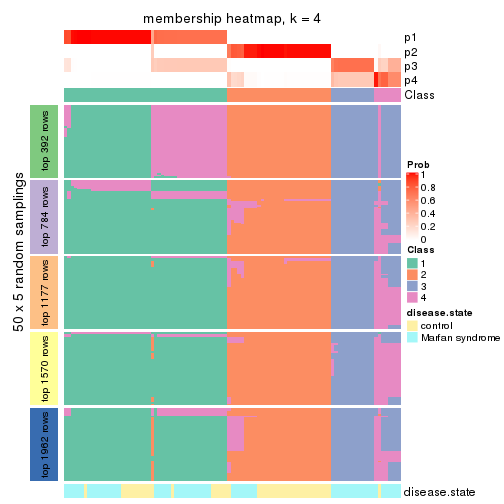</p>

</div>
<div id='tab-SD-mclust-membership-heatmap-4'>
<pre><code class="r">membership_heatmap(res, k = 5)
</code></pre>

<p></p>

</div>
<div id='tab-SD-mclust-membership-heatmap-5'>
<pre><code class="r">membership_heatmap(res, k = 6)
</code></pre>

<p></p>

</div>
</div>

As soon as we have had the classes for columns, we can look for signatures
which are significantly different between classes which can be candidate marks
for certain classes. Following are the heatmaps for signatures.


Signature heatmaps where rows are scaled:


<script>
$( function() {
	$( '#tabs-SD-mclust-get-signatures' ).tabs();
} );
</script>
<div id='tabs-SD-mclust-get-signatures'>
<ul>
<li><a href='#tab-SD-mclust-get-signatures-1'>k = 2</a></li>
<li><a href='#tab-SD-mclust-get-signatures-2'>k = 3</a></li>
<li><a href='#tab-SD-mclust-get-signatures-3'>k = 4</a></li>
<li><a href='#tab-SD-mclust-get-signatures-4'>k = 5</a></li>
<li><a href='#tab-SD-mclust-get-signatures-5'>k = 6</a></li>
</ul>
<div id='tab-SD-mclust-get-signatures-1'>
<pre><code class="r">get_signatures(res, k = 2)
</code></pre>

<p></p>

</div>
<div id='tab-SD-mclust-get-signatures-2'>
<pre><code class="r">get_signatures(res, k = 3)
</code></pre>

<p></p>

</div>
<div id='tab-SD-mclust-get-signatures-3'>
<pre><code class="r">get_signatures(res, k = 4)
</code></pre>

<p></p>

</div>
<div id='tab-SD-mclust-get-signatures-4'>
<pre><code class="r">get_signatures(res, k = 5)
</code></pre>

<p></p>

</div>
<div id='tab-SD-mclust-get-signatures-5'>
<pre><code class="r">get_signatures(res, k = 6)
</code></pre>

<p></p>

</div>
</div>


Signature heatmaps where rows are not scaled:


<script>
$( function() {
	$( '#tabs-SD-mclust-get-signatures-no-scale' ).tabs();
} );
</script>
<div id='tabs-SD-mclust-get-signatures-no-scale'>
<ul>
<li><a href='#tab-SD-mclust-get-signatures-no-scale-1'>k = 2</a></li>
<li><a href='#tab-SD-mclust-get-signatures-no-scale-2'>k = 3</a></li>
<li><a href='#tab-SD-mclust-get-signatures-no-scale-3'>k = 4</a></li>
<li><a href='#tab-SD-mclust-get-signatures-no-scale-4'>k = 5</a></li>
<li><a href='#tab-SD-mclust-get-signatures-no-scale-5'>k = 6</a></li>
</ul>
<div id='tab-SD-mclust-get-signatures-no-scale-1'>
<pre><code class="r">get_signatures(res, k = 2, scale_rows = FALSE)
</code></pre>

<p></p>

</div>
<div id='tab-SD-mclust-get-signatures-no-scale-2'>
<pre><code class="r">get_signatures(res, k = 3, scale_rows = FALSE)
</code></pre>

<p></p>

</div>
<div id='tab-SD-mclust-get-signatures-no-scale-3'>
<pre><code class="r">get_signatures(res, k = 4, scale_rows = FALSE)
</code></pre>

<p></p>

</div>
<div id='tab-SD-mclust-get-signatures-no-scale-4'>
<pre><code class="r">get_signatures(res, k = 5, scale_rows = FALSE)
</code></pre>

<p></p>

</div>
<div id='tab-SD-mclust-get-signatures-no-scale-5'>
<pre><code class="r">get_signatures(res, k = 6, scale_rows = FALSE)
</code></pre>

<p></p>

</div>
</div>


Compare the overlap of signatures from different k:

```r
compare_signatures(res)
```


`get_signature()` returns a data frame invisibly. TO get the list of signatures, the function
call should be assigned to a variable explicitly. In following code, if `plot` argument is set
to `FALSE`, no heatmap is plotted while only the differential analysis is performed.

```r
# code only for demonstration
tb = get_signature(res, k = ..., plot = FALSE)
```

An example of the output of `tb` is:

```
#>   which_row         fdr    mean_1    mean_2 scaled_mean_1 scaled_mean_2 km
#> 1        38 0.042760348  8.373488  9.131774    -0.5533452     0.5164555  1
#> 2        40 0.018707592  7.106213  8.469186    -0.6173731     0.5762149  1
#> 3        55 0.019134737 10.221463 11.207825    -0.6159697     0.5749050  1
#> 4        59 0.006059896  5.921854  7.869574    -0.6899429     0.6439467  1
#> 5        60 0.018055526  8.928898 10.211722    -0.6204761     0.5791110  1
#> 6        98 0.009384629 15.714769 14.887706     0.6635654    -0.6193277  2
...
```

The columns in `tb` are:

1. `which_row`: row indices corresponding to the input matrix.
2. `fdr`: FDR for the differential test. 
3. `mean_x`: The mean value in group x.
4. `scaled_mean_x`: The mean value in group x after rows are scaled.
5. `km`: Row groups if k-means clustering is applied to rows.


UMAP plot which shows how samples are separated.


<script>
$( function() {
	$( '#tabs-SD-mclust-dimension-reduction' ).tabs();
} );
</script>
<div id='tabs-SD-mclust-dimension-reduction'>
<ul>
<li><a href='#tab-SD-mclust-dimension-reduction-1'>k = 2</a></li>
<li><a href='#tab-SD-mclust-dimension-reduction-2'>k = 3</a></li>
<li><a href='#tab-SD-mclust-dimension-reduction-3'>k = 4</a></li>
<li><a href='#tab-SD-mclust-dimension-reduction-4'>k = 5</a></li>
<li><a href='#tab-SD-mclust-dimension-reduction-5'>k = 6</a></li>
</ul>
<div id='tab-SD-mclust-dimension-reduction-1'>
<pre><code class="r">dimension_reduction(res, k = 2, method = &quot;UMAP&quot;)
</code></pre>

<p></p>

</div>
<div id='tab-SD-mclust-dimension-reduction-2'>
<pre><code class="r">dimension_reduction(res, k = 3, method = &quot;UMAP&quot;)
</code></pre>

<p></p>

</div>
<div id='tab-SD-mclust-dimension-reduction-3'>
<pre><code class="r">dimension_reduction(res, k = 4, method = &quot;UMAP&quot;)
</code></pre>

<p></p>

</div>
<div id='tab-SD-mclust-dimension-reduction-4'>
<pre><code class="r">dimension_reduction(res, k = 5, method = &quot;UMAP&quot;)
</code></pre>

<p></p>

</div>
<div id='tab-SD-mclust-dimension-reduction-5'>
<pre><code class="r">dimension_reduction(res, k = 6, method = &quot;UMAP&quot;)
</code></pre>

<p></p>

</div>
</div>


Following heatmap shows how subgroups are split when increasing `k`:

```r
collect_classes(res)
```


Test correlation between subgroups and known annotations. If the known
annotation is numeric, one-way ANOVA test is applied, and if the known
annotation is discrete, chi-squared contingency table test is applied.

```r
test_to_known_factors(res)
```

```
#>             n disease.state(p) k
#> SD:mclust 101         3.32e-01 2
#> SD:mclust 101         2.94e-07 3
#> SD:mclust  92         6.09e-06 4
#> SD:mclust 101         5.97e-08 5
#> SD:mclust  89         2.44e-07 6
```


If matrix rows can be associated to genes, consider to use `functional_enrichment(res,
...)` to perform function enrichment for the signature genes. See [this vignette](http://bioconductor.org/packages/devel/bioc/vignettes/cola/inst/doc/functional_enrichment.html) for more detailed explanations.


 

---------------------------------------------------


### SD:NMF**


The object with results only for a single top-value method and a single partition method 
can be extracted as:

```r
res = res_list["SD", "NMF"]
# you can also extract it by
# res = res_list["SD:NMF"]
```

A summary of `res` and all the functions that can be applied to it:

```r
res
```

```
#> A 'ConsensusPartition' object with k = 2, 3, 4, 5, 6.
#>   On a matrix with 3925 rows and 101 columns.
#>   Top rows (392, 784, 1177, 1570, 1962) are extracted by 'SD' method.
#>   Subgroups are detected by 'NMF' method.
#>   Performed in total 1250 partitions by row resampling.
#>   Best k for subgroups seems to be 3.
#> 
#> Following methods can be applied to this 'ConsensusPartition' object:
#>  [1] "cola_report"             "collect_classes"         "collect_plots"          
#>  [4] "collect_stats"           "colnames"                "compare_signatures"     
#>  [7] "consensus_heatmap"       "dimension_reduction"     "functional_enrichment"  
#> [10] "get_anno_col"            "get_anno"                "get_classes"            
#> [13] "get_consensus"           "get_matrix"              "get_membership"         
#> [16] "get_param"               "get_signatures"          "get_stats"              
#> [19] "is_best_k"               "is_stable_k"             "membership_heatmap"     
#> [22] "ncol"                    "nrow"                    "plot_ecdf"              
#> [25] "rownames"                "select_partition_number" "show"                   
#> [28] "suggest_best_k"          "test_to_known_factors"
```

`collect_plots()` function collects all the plots made from `res` for all `k` (number of partitions)
into one single page to provide an easy and fast comparison between different `k`.

```r
collect_plots(res)
```


The plots are:

- The first row: a plot of the ECDF (empirical cumulative distribution
  function) curves of the consensus matrix for each `k` and the heatmap of
  predicted classes for each `k`.
- The second row: heatmaps of the consensus matrix for each `k`.
- The third row: heatmaps of the membership matrix for each `k`.
- The fouth row: heatmaps of the signatures for each `k`.

All the plots in panels can be made by individual functions and they are
plotted later in this section.

`select_partition_number()` produces several plots showing different
statistics for choosing "optimized" `k`. There are following statistics:

- ECDF curves of the consensus matrix for each `k`;
- 1-PAC. [The PAC
  score](https://en.wikipedia.org/wiki/Consensus_clustering#Over-interpretation_potential_of_consensus_clustering)
  measures the proportion of the ambiguous subgrouping.
- Mean silhouette score.
- Concordance. The mean probability of fiting the consensus class ids in all
  partitions.
- Area increased. Denote $A_k$ as the area under the ECDF curve for current
  `k`, the area increased is defined as $A_k - A_{k-1}$.
- Rand index. The percent of pairs of samples that are both in a same cluster
  or both are not in a same cluster in the partition of k and k-1.
- Jaccard index. The ratio of pairs of samples are both in a same cluster in
  the partition of k and k-1 and the pairs of samples are both in a same
  cluster in the partition k or k-1.

The detailed explanations of these statistics can be found in [the _cola_
vignette](http://bioconductor.org/packages/devel/bioc/vignettes/cola/inst/doc/cola.html#toc_13).

Generally speaking, lower PAC score, higher mean silhouette score or higher
concordance corresponds to better partition. Rand index and Jaccard index
measure how similar the current partition is compared to partition with `k-1`.
If they are too similar, we won't accept `k` is better than `k-1`.

```r
select_partition_number(res)
```


The numeric values for all these statistics can be obtained by `get_stats()`.

```r
get_stats(res)
```

```
#>   k 1-PAC mean_silhouette concordance area_increased  Rand Jaccard
#> 2 2 1.000           0.999       0.999         0.5051 0.495   0.495
#> 3 3 1.000           0.997       0.998         0.2515 0.873   0.744
#> 4 4 0.880           0.904       0.941         0.1084 0.909   0.759
#> 5 5 0.812           0.711       0.834         0.0672 0.891   0.651
#> 6 6 0.736           0.724       0.812         0.0428 0.924   0.695
```

`suggest_best_k()` suggests the best $k$ based on these statistics. The rules are as follows:

- All $k$ with Jaccard index larger than 0.95 are removed because increasing
  $k$ does not provide enough extra information. If all $k$ are removed, it is
  marked as no subgroup is detected.
- For all $k$ with 1-PAC score larger than 0.9, the maximal $k$ is taken as
  the best $k$, and other $k$ are marked as optional $k$.
- If it does not fit the second rule. The $k$ with the maximal vote of the
  highest 1-PAC score, highest mean silhouette, and highest concordance is
  taken as the best $k$.

```r
suggest_best_k(res)
```

```
#> [1] 3
#> attr(,"optional")
#> [1] 2
```

There is also optional best $k$ = 2 that is worth to check.

Following shows the table of the partitions (You need to click the **show/hide
code output** link to see it). The membership matrix (columns with name `p*`)
is inferred by
[`clue::cl_consensus()`](https://www.rdocumentation.org/link/cl_consensus?package=clue)
function with the `SE` method. Basically the value in the membership matrix
represents the probability to belong to a certain group. The finall class
label for an item is determined with the group with highest probability it
belongs to.

In `get_classes()` function, the entropy is calculated from the membership
matrix and the silhouette score is calculated from the consensus matrix.


<script>
$( function() {
	$( '#tabs-SD-NMF-get-classes' ).tabs();
} );
</script>
<div id='tabs-SD-NMF-get-classes'>
<ul>
<li><a href='#tab-SD-NMF-get-classes-1'>k = 2</a></li>
<li><a href='#tab-SD-NMF-get-classes-2'>k = 3</a></li>
<li><a href='#tab-SD-NMF-get-classes-3'>k = 4</a></li>
<li><a href='#tab-SD-NMF-get-classes-4'>k = 5</a></li>
<li><a href='#tab-SD-NMF-get-classes-5'>k = 6</a></li>
</ul>

<div id='tab-SD-NMF-get-classes-1'>
<p><a id='tab-SD-NMF-get-classes-1-a' style='color:#0366d6' href='#'>show/hide code output</a></p>
<pre><code class="r">cbind(get_classes(res, k = 2), get_membership(res, k = 2))
</code></pre>

<pre><code>#&gt;           class entropy silhouette    p1    p2
#&gt; GSM217644     2   0.000      0.999 0.000 1.000
#&gt; GSM217645     2   0.000      0.999 0.000 1.000
#&gt; GSM217646     2   0.000      0.999 0.000 1.000
#&gt; GSM217647     2   0.000      0.999 0.000 1.000
#&gt; GSM217648     2   0.000      0.999 0.000 1.000
#&gt; GSM217649     2   0.000      0.999 0.000 1.000
#&gt; GSM217650     2   0.000      0.999 0.000 1.000
#&gt; GSM217651     2   0.000      0.999 0.000 1.000
#&gt; GSM217652     2   0.000      0.999 0.000 1.000
#&gt; GSM217653     2   0.000      0.999 0.000 1.000
#&gt; GSM217654     2   0.000      0.999 0.000 1.000
#&gt; GSM217655     2   0.000      0.999 0.000 1.000
#&gt; GSM217656     2   0.343      0.932 0.064 0.936
#&gt; GSM217657     2   0.000      0.999 0.000 1.000
#&gt; GSM217658     2   0.000      0.999 0.000 1.000
#&gt; GSM217659     2   0.000      0.999 0.000 1.000
#&gt; GSM217660     2   0.000      0.999 0.000 1.000
#&gt; GSM217661     2   0.000      0.999 0.000 1.000
#&gt; GSM217662     2   0.000      0.999 0.000 1.000
#&gt; GSM217663     2   0.000      0.999 0.000 1.000
#&gt; GSM217664     2   0.000      0.999 0.000 1.000
#&gt; GSM217665     2   0.000      0.999 0.000 1.000
#&gt; GSM217666     2   0.000      0.999 0.000 1.000
#&gt; GSM217667     2   0.000      0.999 0.000 1.000
#&gt; GSM217668     1   0.000      1.000 1.000 0.000
#&gt; GSM217669     1   0.000      1.000 1.000 0.000
#&gt; GSM217670     1   0.000      1.000 1.000 0.000
#&gt; GSM217671     1   0.000      1.000 1.000 0.000
#&gt; GSM217672     1   0.000      1.000 1.000 0.000
#&gt; GSM217673     1   0.000      1.000 1.000 0.000
#&gt; GSM217674     1   0.000      1.000 1.000 0.000
#&gt; GSM217675     1   0.000      1.000 1.000 0.000
#&gt; GSM217676     1   0.000      1.000 1.000 0.000
#&gt; GSM217677     1   0.000      1.000 1.000 0.000
#&gt; GSM217678     1   0.000      1.000 1.000 0.000
#&gt; GSM217679     1   0.000      1.000 1.000 0.000
#&gt; GSM217680     1   0.000      1.000 1.000 0.000
#&gt; GSM217681     1   0.000      1.000 1.000 0.000
#&gt; GSM217682     1   0.000      1.000 1.000 0.000
#&gt; GSM217683     1   0.000      1.000 1.000 0.000
#&gt; GSM217684     1   0.000      1.000 1.000 0.000
#&gt; GSM217685     2   0.000      0.999 0.000 1.000
#&gt; GSM217686     2   0.000      0.999 0.000 1.000
#&gt; GSM217687     2   0.000      0.999 0.000 1.000
#&gt; GSM217688     2   0.000      0.999 0.000 1.000
#&gt; GSM217689     2   0.000      0.999 0.000 1.000
#&gt; GSM217690     2   0.000      0.999 0.000 1.000
#&gt; GSM217691     2   0.000      0.999 0.000 1.000
#&gt; GSM217692     2   0.000      0.999 0.000 1.000
#&gt; GSM217693     2   0.000      0.999 0.000 1.000
#&gt; GSM217694     2   0.000      0.999 0.000 1.000
#&gt; GSM217695     2   0.000      0.999 0.000 1.000
#&gt; GSM217696     2   0.000      0.999 0.000 1.000
#&gt; GSM217697     2   0.000      0.999 0.000 1.000
#&gt; GSM217698     2   0.000      0.999 0.000 1.000
#&gt; GSM217699     2   0.000      0.999 0.000 1.000
#&gt; GSM217700     2   0.000      0.999 0.000 1.000
#&gt; GSM217701     2   0.000      0.999 0.000 1.000
#&gt; GSM217702     2   0.000      0.999 0.000 1.000
#&gt; GSM217703     2   0.000      0.999 0.000 1.000
#&gt; GSM217704     2   0.000      0.999 0.000 1.000
#&gt; GSM217705     1   0.000      1.000 1.000 0.000
#&gt; GSM217706     1   0.000      1.000 1.000 0.000
#&gt; GSM217707     1   0.000      1.000 1.000 0.000
#&gt; GSM217708     1   0.000      1.000 1.000 0.000
#&gt; GSM217709     1   0.000      1.000 1.000 0.000
#&gt; GSM217710     1   0.000      1.000 1.000 0.000
#&gt; GSM217711     1   0.000      1.000 1.000 0.000
#&gt; GSM217712     1   0.000      1.000 1.000 0.000
#&gt; GSM217713     1   0.000      1.000 1.000 0.000
#&gt; GSM217714     1   0.000      1.000 1.000 0.000
#&gt; GSM217715     1   0.000      1.000 1.000 0.000
#&gt; GSM217716     1   0.000      1.000 1.000 0.000
#&gt; GSM217717     1   0.000      1.000 1.000 0.000
#&gt; GSM217718     1   0.000      1.000 1.000 0.000
#&gt; GSM217719     1   0.000      1.000 1.000 0.000
#&gt; GSM217720     1   0.000      1.000 1.000 0.000
#&gt; GSM217721     1   0.000      1.000 1.000 0.000
#&gt; GSM217722     1   0.000      1.000 1.000 0.000
#&gt; GSM217723     1   0.000      1.000 1.000 0.000
#&gt; GSM217724     1   0.000      1.000 1.000 0.000
#&gt; GSM217725     1   0.000      1.000 1.000 0.000
#&gt; GSM217726     1   0.000      1.000 1.000 0.000
#&gt; GSM217727     1   0.000      1.000 1.000 0.000
#&gt; GSM217728     1   0.000      1.000 1.000 0.000
#&gt; GSM217729     1   0.000      1.000 1.000 0.000
#&gt; GSM217730     1   0.000      1.000 1.000 0.000
#&gt; GSM217731     1   0.000      1.000 1.000 0.000
#&gt; GSM217732     1   0.000      1.000 1.000 0.000
#&gt; GSM217733     1   0.000      1.000 1.000 0.000
#&gt; GSM217734     1   0.000      1.000 1.000 0.000
#&gt; GSM217735     1   0.000      1.000 1.000 0.000
#&gt; GSM217736     1   0.000      1.000 1.000 0.000
#&gt; GSM217737     2   0.000      0.999 0.000 1.000
#&gt; GSM217738     2   0.000      0.999 0.000 1.000
#&gt; GSM217739     2   0.000      0.999 0.000 1.000
#&gt; GSM217740     2   0.000      0.999 0.000 1.000
#&gt; GSM217741     2   0.000      0.999 0.000 1.000
#&gt; GSM217742     2   0.000      0.999 0.000 1.000
#&gt; GSM217743     2   0.000      0.999 0.000 1.000
#&gt; GSM217744     2   0.000      0.999 0.000 1.000
</code></pre>

<script>
$('#tab-SD-NMF-get-classes-1-a').parent().next().next().hide();
$('#tab-SD-NMF-get-classes-1-a').click(function(){
  $('#tab-SD-NMF-get-classes-1-a').parent().next().next().toggle();
  return(false);
});
</script>
</div>

<div id='tab-SD-NMF-get-classes-2'>
<p><a id='tab-SD-NMF-get-classes-2-a' style='color:#0366d6' href='#'>show/hide code output</a></p>
<pre><code class="r">cbind(get_classes(res, k = 3), get_membership(res, k = 3))
</code></pre>

<pre><code>#&gt;           class entropy silhouette    p1    p2    p3
#&gt; GSM217644     2  0.0000      1.000 0.000 1.000 0.000
#&gt; GSM217645     2  0.0000      1.000 0.000 1.000 0.000
#&gt; GSM217646     2  0.0000      1.000 0.000 1.000 0.000
#&gt; GSM217647     2  0.0000      1.000 0.000 1.000 0.000
#&gt; GSM217648     2  0.0000      1.000 0.000 1.000 0.000
#&gt; GSM217649     2  0.0000      1.000 0.000 1.000 0.000
#&gt; GSM217650     2  0.0000      1.000 0.000 1.000 0.000
#&gt; GSM217651     2  0.0000      1.000 0.000 1.000 0.000
#&gt; GSM217652     2  0.0000      1.000 0.000 1.000 0.000
#&gt; GSM217653     2  0.0000      1.000 0.000 1.000 0.000
#&gt; GSM217654     2  0.0000      1.000 0.000 1.000 0.000
#&gt; GSM217655     2  0.0000      1.000 0.000 1.000 0.000
#&gt; GSM217656     2  0.0661      0.989 0.004 0.988 0.008
#&gt; GSM217657     2  0.0000      1.000 0.000 1.000 0.000
#&gt; GSM217658     2  0.0000      1.000 0.000 1.000 0.000
#&gt; GSM217659     2  0.0000      1.000 0.000 1.000 0.000
#&gt; GSM217660     2  0.0000      1.000 0.000 1.000 0.000
#&gt; GSM217661     2  0.0000      1.000 0.000 1.000 0.000
#&gt; GSM217662     2  0.0000      1.000 0.000 1.000 0.000
#&gt; GSM217663     2  0.0000      1.000 0.000 1.000 0.000
#&gt; GSM217664     2  0.0000      1.000 0.000 1.000 0.000
#&gt; GSM217665     2  0.0000      1.000 0.000 1.000 0.000
#&gt; GSM217666     2  0.0000      1.000 0.000 1.000 0.000
#&gt; GSM217667     2  0.0000      1.000 0.000 1.000 0.000
#&gt; GSM217668     1  0.3686      0.833 0.860 0.140 0.000
#&gt; GSM217669     1  0.0000      0.997 1.000 0.000 0.000
#&gt; GSM217670     1  0.0000      0.997 1.000 0.000 0.000
#&gt; GSM217671     1  0.0000      0.997 1.000 0.000 0.000
#&gt; GSM217672     1  0.0000      0.997 1.000 0.000 0.000
#&gt; GSM217673     1  0.0000      0.997 1.000 0.000 0.000
#&gt; GSM217674     1  0.0000      0.997 1.000 0.000 0.000
#&gt; GSM217675     1  0.0000      0.997 1.000 0.000 0.000
#&gt; GSM217676     1  0.0000      0.997 1.000 0.000 0.000
#&gt; GSM217677     1  0.0000      0.997 1.000 0.000 0.000
#&gt; GSM217678     1  0.0000      0.997 1.000 0.000 0.000
#&gt; GSM217679     1  0.0000      0.997 1.000 0.000 0.000
#&gt; GSM217680     1  0.0000      0.997 1.000 0.000 0.000
#&gt; GSM217681     1  0.0000      0.997 1.000 0.000 0.000
#&gt; GSM217682     1  0.0000      0.997 1.000 0.000 0.000
#&gt; GSM217683     1  0.0000      0.997 1.000 0.000 0.000
#&gt; GSM217684     1  0.0000      0.997 1.000 0.000 0.000
#&gt; GSM217685     3  0.0000      1.000 0.000 0.000 1.000
#&gt; GSM217686     3  0.0000      1.000 0.000 0.000 1.000
#&gt; GSM217687     3  0.0000      1.000 0.000 0.000 1.000
#&gt; GSM217688     3  0.0000      1.000 0.000 0.000 1.000
#&gt; GSM217689     3  0.0000      1.000 0.000 0.000 1.000
#&gt; GSM217690     3  0.0000      1.000 0.000 0.000 1.000
#&gt; GSM217691     3  0.0000      1.000 0.000 0.000 1.000
#&gt; GSM217692     3  0.0000      1.000 0.000 0.000 1.000
#&gt; GSM217693     3  0.0000      1.000 0.000 0.000 1.000
#&gt; GSM217694     3  0.0000      1.000 0.000 0.000 1.000
#&gt; GSM217695     3  0.0000      1.000 0.000 0.000 1.000
#&gt; GSM217696     3  0.0000      1.000 0.000 0.000 1.000
#&gt; GSM217697     3  0.0000      1.000 0.000 0.000 1.000
#&gt; GSM217698     3  0.0000      1.000 0.000 0.000 1.000
#&gt; GSM217699     3  0.0000      1.000 0.000 0.000 1.000
#&gt; GSM217700     3  0.0000      1.000 0.000 0.000 1.000
#&gt; GSM217701     3  0.0000      1.000 0.000 0.000 1.000
#&gt; GSM217702     3  0.0000      1.000 0.000 0.000 1.000
#&gt; GSM217703     3  0.0000      1.000 0.000 0.000 1.000
#&gt; GSM217704     3  0.0000      1.000 0.000 0.000 1.000
#&gt; GSM217705     1  0.0000      0.997 1.000 0.000 0.000
#&gt; GSM217706     1  0.0000      0.997 1.000 0.000 0.000
#&gt; GSM217707     1  0.0000      0.997 1.000 0.000 0.000
#&gt; GSM217708     1  0.0000      0.997 1.000 0.000 0.000
#&gt; GSM217709     1  0.0000      0.997 1.000 0.000 0.000
#&gt; GSM217710     1  0.0000      0.997 1.000 0.000 0.000
#&gt; GSM217711     1  0.0000      0.997 1.000 0.000 0.000
#&gt; GSM217712     1  0.0000      0.997 1.000 0.000 0.000
#&gt; GSM217713     1  0.0000      0.997 1.000 0.000 0.000
#&gt; GSM217714     1  0.0000      0.997 1.000 0.000 0.000
#&gt; GSM217715     1  0.0000      0.997 1.000 0.000 0.000
#&gt; GSM217716     1  0.0000      0.997 1.000 0.000 0.000
#&gt; GSM217717     1  0.0000      0.997 1.000 0.000 0.000
#&gt; GSM217718     1  0.0000      0.997 1.000 0.000 0.000
#&gt; GSM217719     1  0.0000      0.997 1.000 0.000 0.000
#&gt; GSM217720     1  0.0000      0.997 1.000 0.000 0.000
#&gt; GSM217721     1  0.0000      0.997 1.000 0.000 0.000
#&gt; GSM217722     1  0.0000      0.997 1.000 0.000 0.000
#&gt; GSM217723     1  0.0000      0.997 1.000 0.000 0.000
#&gt; GSM217724     1  0.0000      0.997 1.000 0.000 0.000
#&gt; GSM217725     1  0.0000      0.997 1.000 0.000 0.000
#&gt; GSM217726     1  0.0000      0.997 1.000 0.000 0.000
#&gt; GSM217727     1  0.0000      0.997 1.000 0.000 0.000
#&gt; GSM217728     1  0.0000      0.997 1.000 0.000 0.000
#&gt; GSM217729     1  0.0000      0.997 1.000 0.000 0.000
#&gt; GSM217730     1  0.0000      0.997 1.000 0.000 0.000
#&gt; GSM217731     1  0.0000      0.997 1.000 0.000 0.000
#&gt; GSM217732     1  0.0000      0.997 1.000 0.000 0.000
#&gt; GSM217733     1  0.0000      0.997 1.000 0.000 0.000
#&gt; GSM217734     1  0.0000      0.997 1.000 0.000 0.000
#&gt; GSM217735     1  0.0000      0.997 1.000 0.000 0.000
#&gt; GSM217736     1  0.0000      0.997 1.000 0.000 0.000
#&gt; GSM217737     2  0.0000      1.000 0.000 1.000 0.000
#&gt; GSM217738     2  0.0000      1.000 0.000 1.000 0.000
#&gt; GSM217739     2  0.0000      1.000 0.000 1.000 0.000
#&gt; GSM217740     2  0.0000      1.000 0.000 1.000 0.000
#&gt; GSM217741     2  0.0000      1.000 0.000 1.000 0.000
#&gt; GSM217742     2  0.0000      1.000 0.000 1.000 0.000
#&gt; GSM217743     2  0.0000      1.000 0.000 1.000 0.000
#&gt; GSM217744     2  0.0000      1.000 0.000 1.000 0.000
</code></pre>

<script>
$('#tab-SD-NMF-get-classes-2-a').parent().next().next().hide();
$('#tab-SD-NMF-get-classes-2-a').click(function(){
  $('#tab-SD-NMF-get-classes-2-a').parent().next().next().toggle();
  return(false);
});
</script>
</div>

<div id='tab-SD-NMF-get-classes-3'>
<p><a id='tab-SD-NMF-get-classes-3-a' style='color:#0366d6' href='#'>show/hide code output</a></p>
<pre><code class="r">cbind(get_classes(res, k = 4), get_membership(res, k = 4))
</code></pre>

<pre><code>#&gt;           class entropy silhouette    p1    p2    p3    p4
#&gt; GSM217644     2  0.0707     0.9680 0.000 0.980 0.000 0.020
#&gt; GSM217645     2  0.0188     0.9703 0.000 0.996 0.000 0.004
#&gt; GSM217646     2  0.0000     0.9701 0.000 1.000 0.000 0.000
#&gt; GSM217647     2  0.0000     0.9701 0.000 1.000 0.000 0.000
#&gt; GSM217648     2  0.0707     0.9680 0.000 0.980 0.000 0.020
#&gt; GSM217649     2  0.0000     0.9701 0.000 1.000 0.000 0.000
#&gt; GSM217650     2  0.0000     0.9701 0.000 1.000 0.000 0.000
#&gt; GSM217651     2  0.0707     0.9680 0.000 0.980 0.000 0.020
#&gt; GSM217652     2  0.0188     0.9703 0.000 0.996 0.000 0.004
#&gt; GSM217653     2  0.0707     0.9680 0.000 0.980 0.000 0.020
#&gt; GSM217654     4  0.4697     0.4522 0.000 0.356 0.000 0.644
#&gt; GSM217655     2  0.2814     0.8583 0.000 0.868 0.000 0.132
#&gt; GSM217656     4  0.2189     0.7324 0.044 0.004 0.020 0.932
#&gt; GSM217657     4  0.3074     0.7216 0.000 0.152 0.000 0.848
#&gt; GSM217658     2  0.0000     0.9701 0.000 1.000 0.000 0.000
#&gt; GSM217659     2  0.0000     0.9701 0.000 1.000 0.000 0.000
#&gt; GSM217660     2  0.1557     0.9446 0.000 0.944 0.000 0.056
#&gt; GSM217661     2  0.0592     0.9689 0.000 0.984 0.000 0.016
#&gt; GSM217662     2  0.0707     0.9680 0.000 0.980 0.000 0.020
#&gt; GSM217663     2  0.0336     0.9701 0.000 0.992 0.000 0.008
#&gt; GSM217664     2  0.0000     0.9701 0.000 1.000 0.000 0.000
#&gt; GSM217665     2  0.0000     0.9701 0.000 1.000 0.000 0.000
#&gt; GSM217666     2  0.0000     0.9701 0.000 1.000 0.000 0.000
#&gt; GSM217667     2  0.0000     0.9701 0.000 1.000 0.000 0.000
#&gt; GSM217668     1  0.3948     0.7885 0.828 0.136 0.000 0.036
#&gt; GSM217669     1  0.1940     0.9400 0.924 0.000 0.000 0.076
#&gt; GSM217670     1  0.1022     0.9471 0.968 0.000 0.000 0.032
#&gt; GSM217671     1  0.0817     0.9475 0.976 0.000 0.000 0.024
#&gt; GSM217672     1  0.0592     0.9474 0.984 0.000 0.000 0.016
#&gt; GSM217673     1  0.1302     0.9460 0.956 0.000 0.000 0.044
#&gt; GSM217674     1  0.1211     0.9271 0.960 0.000 0.000 0.040
#&gt; GSM217675     1  0.1302     0.9242 0.956 0.000 0.000 0.044
#&gt; GSM217676     1  0.0000     0.9463 1.000 0.000 0.000 0.000
#&gt; GSM217677     1  0.0336     0.9442 0.992 0.000 0.000 0.008
#&gt; GSM217678     1  0.0000     0.9463 1.000 0.000 0.000 0.000
#&gt; GSM217679     1  0.0817     0.9371 0.976 0.000 0.000 0.024
#&gt; GSM217680     1  0.0000     0.9463 1.000 0.000 0.000 0.000
#&gt; GSM217681     1  0.0188     0.9455 0.996 0.000 0.000 0.004
#&gt; GSM217682     1  0.0921     0.9349 0.972 0.000 0.000 0.028
#&gt; GSM217683     1  0.0921     0.9349 0.972 0.000 0.000 0.028
#&gt; GSM217684     1  0.1474     0.9450 0.948 0.000 0.000 0.052
#&gt; GSM217685     3  0.0817     0.9770 0.000 0.000 0.976 0.024
#&gt; GSM217686     3  0.0921     0.9744 0.000 0.000 0.972 0.028
#&gt; GSM217687     3  0.0592     0.9811 0.000 0.000 0.984 0.016
#&gt; GSM217688     3  0.0592     0.9811 0.000 0.000 0.984 0.016
#&gt; GSM217689     3  0.3074     0.8488 0.000 0.000 0.848 0.152
#&gt; GSM217690     3  0.0817     0.9770 0.000 0.000 0.976 0.024
#&gt; GSM217691     3  0.0188     0.9852 0.000 0.000 0.996 0.004
#&gt; GSM217692     3  0.0000     0.9866 0.000 0.000 1.000 0.000
#&gt; GSM217693     3  0.0000     0.9866 0.000 0.000 1.000 0.000
#&gt; GSM217694     3  0.0000     0.9866 0.000 0.000 1.000 0.000
#&gt; GSM217695     3  0.0000     0.9866 0.000 0.000 1.000 0.000
#&gt; GSM217696     3  0.0000     0.9866 0.000 0.000 1.000 0.000
#&gt; GSM217697     3  0.0000     0.9866 0.000 0.000 1.000 0.000
#&gt; GSM217698     3  0.0000     0.9866 0.000 0.000 1.000 0.000
#&gt; GSM217699     3  0.0000     0.9866 0.000 0.000 1.000 0.000
#&gt; GSM217700     3  0.0188     0.9852 0.000 0.000 0.996 0.004
#&gt; GSM217701     3  0.0000     0.9866 0.000 0.000 1.000 0.000
#&gt; GSM217702     3  0.0000     0.9866 0.000 0.000 1.000 0.000
#&gt; GSM217703     4  0.3444     0.5852 0.000 0.000 0.184 0.816
#&gt; GSM217704     3  0.0188     0.9852 0.000 0.000 0.996 0.004
#&gt; GSM217705     1  0.1940     0.9400 0.924 0.000 0.000 0.076
#&gt; GSM217706     1  0.1940     0.9400 0.924 0.000 0.000 0.076
#&gt; GSM217707     1  0.1867     0.9411 0.928 0.000 0.000 0.072
#&gt; GSM217708     4  0.4643     0.4610 0.344 0.000 0.000 0.656
#&gt; GSM217709     4  0.3942     0.6471 0.236 0.000 0.000 0.764
#&gt; GSM217710     4  0.2921     0.7223 0.140 0.000 0.000 0.860
#&gt; GSM217711     4  0.2281     0.7353 0.096 0.000 0.000 0.904
#&gt; GSM217712     1  0.2216     0.9310 0.908 0.000 0.000 0.092
#&gt; GSM217713     1  0.2011     0.9383 0.920 0.000 0.000 0.080
#&gt; GSM217714     1  0.1940     0.9400 0.924 0.000 0.000 0.076
#&gt; GSM217715     1  0.1867     0.9411 0.928 0.000 0.000 0.072
#&gt; GSM217716     1  0.2011     0.9383 0.920 0.000 0.000 0.080
#&gt; GSM217717     1  0.2081     0.9360 0.916 0.000 0.000 0.084
#&gt; GSM217718     4  0.4996     0.0291 0.484 0.000 0.000 0.516
#&gt; GSM217719     1  0.2921     0.8871 0.860 0.000 0.000 0.140
#&gt; GSM217720     1  0.1940     0.9400 0.924 0.000 0.000 0.076
#&gt; GSM217721     1  0.2814     0.8964 0.868 0.000 0.000 0.132
#&gt; GSM217722     1  0.2011     0.9383 0.920 0.000 0.000 0.080
#&gt; GSM217723     1  0.2011     0.9383 0.920 0.000 0.000 0.080
#&gt; GSM217724     1  0.1940     0.9400 0.924 0.000 0.000 0.076
#&gt; GSM217725     1  0.2921     0.8874 0.860 0.000 0.000 0.140
#&gt; GSM217726     1  0.0707     0.9392 0.980 0.000 0.000 0.020
#&gt; GSM217727     1  0.0817     0.9377 0.976 0.000 0.000 0.024
#&gt; GSM217728     1  0.2011     0.9383 0.920 0.000 0.000 0.080
#&gt; GSM217729     1  0.0188     0.9455 0.996 0.000 0.000 0.004
#&gt; GSM217730     1  0.0188     0.9455 0.996 0.000 0.000 0.004
#&gt; GSM217731     1  0.0188     0.9455 0.996 0.000 0.000 0.004
#&gt; GSM217732     1  0.0336     0.9442 0.992 0.000 0.000 0.008
#&gt; GSM217733     1  0.0000     0.9463 1.000 0.000 0.000 0.000
#&gt; GSM217734     1  0.0921     0.9349 0.972 0.000 0.000 0.028
#&gt; GSM217735     1  0.0336     0.9442 0.992 0.000 0.000 0.008
#&gt; GSM217736     1  0.0188     0.9455 0.996 0.000 0.000 0.004
#&gt; GSM217737     4  0.3837     0.6548 0.000 0.224 0.000 0.776
#&gt; GSM217738     4  0.3257     0.7154 0.000 0.152 0.004 0.844
#&gt; GSM217739     4  0.3219     0.7100 0.000 0.164 0.000 0.836
#&gt; GSM217740     4  0.3123     0.7143 0.000 0.156 0.000 0.844
#&gt; GSM217741     2  0.1302     0.9545 0.000 0.956 0.000 0.044
#&gt; GSM217742     2  0.3764     0.7408 0.000 0.784 0.000 0.216
#&gt; GSM217743     2  0.2149     0.9167 0.000 0.912 0.000 0.088
#&gt; GSM217744     2  0.1211     0.9581 0.000 0.960 0.000 0.040
</code></pre>

<script>
$('#tab-SD-NMF-get-classes-3-a').parent().next().next().hide();
$('#tab-SD-NMF-get-classes-3-a').click(function(){
  $('#tab-SD-NMF-get-classes-3-a').parent().next().next().toggle();
  return(false);
});
</script>
</div>

<div id='tab-SD-NMF-get-classes-4'>
<p><a id='tab-SD-NMF-get-classes-4-a' style='color:#0366d6' href='#'>show/hide code output</a></p>
<pre><code class="r">cbind(get_classes(res, k = 5), get_membership(res, k = 5))
</code></pre>

<pre><code>#&gt;           class entropy silhouette    p1    p2    p3    p4    p5
#&gt; GSM217644     2  0.0898      0.919 0.008 0.972 0.000 0.000 0.020
#&gt; GSM217645     2  0.0703      0.919 0.024 0.976 0.000 0.000 0.000
#&gt; GSM217646     2  0.0162      0.922 0.004 0.996 0.000 0.000 0.000
#&gt; GSM217647     2  0.0671      0.920 0.016 0.980 0.000 0.000 0.004
#&gt; GSM217648     2  0.0898      0.921 0.008 0.972 0.000 0.000 0.020
#&gt; GSM217649     2  0.0566      0.922 0.012 0.984 0.000 0.000 0.004
#&gt; GSM217650     2  0.1282      0.912 0.044 0.952 0.000 0.000 0.004
#&gt; GSM217651     2  0.1741      0.909 0.040 0.936 0.000 0.000 0.024
#&gt; GSM217652     2  0.0566      0.922 0.012 0.984 0.000 0.000 0.004
#&gt; GSM217653     2  0.0404      0.921 0.012 0.988 0.000 0.000 0.000
#&gt; GSM217654     5  0.3689      0.616 0.004 0.256 0.000 0.000 0.740
#&gt; GSM217655     2  0.3039      0.804 0.012 0.836 0.000 0.000 0.152
#&gt; GSM217656     5  0.0807      0.778 0.000 0.012 0.000 0.012 0.976
#&gt; GSM217657     5  0.0963      0.782 0.000 0.036 0.000 0.000 0.964
#&gt; GSM217658     2  0.1205      0.914 0.040 0.956 0.000 0.000 0.004
#&gt; GSM217659     2  0.1124      0.916 0.036 0.960 0.000 0.000 0.004
#&gt; GSM217660     2  0.2411      0.860 0.008 0.884 0.000 0.000 0.108
#&gt; GSM217661     2  0.1074      0.920 0.016 0.968 0.000 0.004 0.012
#&gt; GSM217662     2  0.0807      0.921 0.012 0.976 0.000 0.000 0.012
#&gt; GSM217663     2  0.0771      0.920 0.020 0.976 0.000 0.000 0.004
#&gt; GSM217664     2  0.0992      0.918 0.024 0.968 0.000 0.000 0.008
#&gt; GSM217665     2  0.0566      0.921 0.004 0.984 0.000 0.000 0.012
#&gt; GSM217666     2  0.0771      0.920 0.020 0.976 0.000 0.000 0.004
#&gt; GSM217667     2  0.0798      0.919 0.016 0.976 0.000 0.000 0.008
#&gt; GSM217668     4  0.1059      0.718 0.008 0.020 0.000 0.968 0.004
#&gt; GSM217669     4  0.0451      0.736 0.004 0.000 0.000 0.988 0.008
#&gt; GSM217670     4  0.0609      0.727 0.020 0.000 0.000 0.980 0.000
#&gt; GSM217671     4  0.0404      0.735 0.012 0.000 0.000 0.988 0.000
#&gt; GSM217672     4  0.0404      0.735 0.012 0.000 0.000 0.988 0.000
#&gt; GSM217673     4  0.0290      0.736 0.008 0.000 0.000 0.992 0.000
#&gt; GSM217674     1  0.4582      0.837 0.572 0.012 0.000 0.416 0.000
#&gt; GSM217675     1  0.4278      0.890 0.548 0.000 0.000 0.452 0.000
#&gt; GSM217676     1  0.4300      0.909 0.524 0.000 0.000 0.476 0.000
#&gt; GSM217677     1  0.4278      0.902 0.548 0.000 0.000 0.452 0.000
#&gt; GSM217678     1  0.4305      0.907 0.512 0.000 0.000 0.488 0.000
#&gt; GSM217679     1  0.4297      0.913 0.528 0.000 0.000 0.472 0.000
#&gt; GSM217680     1  0.4307      0.884 0.500 0.000 0.000 0.500 0.000
#&gt; GSM217681     4  0.4306     -0.878 0.492 0.000 0.000 0.508 0.000
#&gt; GSM217682     1  0.4287      0.908 0.540 0.000 0.000 0.460 0.000
#&gt; GSM217683     1  0.4283      0.898 0.544 0.000 0.000 0.456 0.000
#&gt; GSM217684     4  0.2561      0.499 0.144 0.000 0.000 0.856 0.000
#&gt; GSM217685     3  0.0290      0.984 0.000 0.000 0.992 0.000 0.008
#&gt; GSM217686     3  0.1168      0.971 0.032 0.000 0.960 0.000 0.008
#&gt; GSM217687     3  0.0162      0.985 0.000 0.000 0.996 0.000 0.004
#&gt; GSM217688     3  0.0000      0.985 0.000 0.000 1.000 0.000 0.000
#&gt; GSM217689     3  0.2136      0.910 0.008 0.000 0.904 0.000 0.088
#&gt; GSM217690     3  0.0693      0.980 0.008 0.000 0.980 0.000 0.012
#&gt; GSM217691     3  0.0404      0.984 0.012 0.000 0.988 0.000 0.000
#&gt; GSM217692     3  0.0162      0.985 0.004 0.000 0.996 0.000 0.000
#&gt; GSM217693     3  0.0880      0.974 0.032 0.000 0.968 0.000 0.000
#&gt; GSM217694     3  0.0162      0.985 0.004 0.000 0.996 0.000 0.000
#&gt; GSM217695     3  0.0162      0.985 0.004 0.000 0.996 0.000 0.000
#&gt; GSM217696     3  0.0404      0.984 0.012 0.000 0.988 0.000 0.000
#&gt; GSM217697     3  0.1270      0.962 0.052 0.000 0.948 0.000 0.000
#&gt; GSM217698     3  0.0000      0.985 0.000 0.000 1.000 0.000 0.000
#&gt; GSM217699     3  0.0162      0.985 0.004 0.000 0.996 0.000 0.000
#&gt; GSM217700     3  0.0290      0.985 0.008 0.000 0.992 0.000 0.000
#&gt; GSM217701     3  0.0290      0.985 0.008 0.000 0.992 0.000 0.000
#&gt; GSM217702     3  0.0162      0.985 0.004 0.000 0.996 0.000 0.000
#&gt; GSM217703     5  0.3662      0.553 0.004 0.000 0.252 0.000 0.744
#&gt; GSM217704     3  0.0290      0.985 0.008 0.000 0.992 0.000 0.000
#&gt; GSM217705     4  0.0451      0.737 0.008 0.000 0.000 0.988 0.004
#&gt; GSM217706     4  0.0451      0.736 0.004 0.000 0.000 0.988 0.008
#&gt; GSM217707     4  0.0162      0.737 0.000 0.000 0.000 0.996 0.004
#&gt; GSM217708     4  0.0451      0.736 0.004 0.000 0.000 0.988 0.008
#&gt; GSM217709     4  0.3766      0.375 0.004 0.000 0.000 0.728 0.268
#&gt; GSM217710     5  0.4443      0.331 0.004 0.000 0.000 0.472 0.524
#&gt; GSM217711     5  0.4211      0.527 0.004 0.000 0.000 0.360 0.636
#&gt; GSM217712     4  0.0451      0.736 0.004 0.000 0.000 0.988 0.008
#&gt; GSM217713     4  0.0162      0.737 0.000 0.000 0.000 0.996 0.004
#&gt; GSM217714     4  0.0324      0.737 0.004 0.000 0.000 0.992 0.004
#&gt; GSM217715     4  0.0290      0.738 0.008 0.000 0.000 0.992 0.000
#&gt; GSM217716     4  0.0609      0.735 0.020 0.000 0.000 0.980 0.000
#&gt; GSM217717     4  0.0794      0.725 0.028 0.000 0.000 0.972 0.000
#&gt; GSM217718     4  0.0898      0.733 0.020 0.000 0.000 0.972 0.008
#&gt; GSM217719     4  0.0794      0.728 0.028 0.000 0.000 0.972 0.000
#&gt; GSM217720     4  0.0404      0.735 0.012 0.000 0.000 0.988 0.000
#&gt; GSM217721     4  0.1124      0.711 0.036 0.000 0.000 0.960 0.004
#&gt; GSM217722     4  0.0290      0.736 0.000 0.000 0.000 0.992 0.008
#&gt; GSM217723     4  0.2110      0.640 0.072 0.000 0.000 0.912 0.016
#&gt; GSM217724     4  0.1430      0.682 0.052 0.000 0.000 0.944 0.004
#&gt; GSM217725     1  0.6491      0.551 0.464 0.000 0.000 0.336 0.200
#&gt; GSM217726     1  0.4307      0.902 0.504 0.000 0.000 0.496 0.000
#&gt; GSM217727     1  0.4305      0.906 0.512 0.000 0.000 0.488 0.000
#&gt; GSM217728     4  0.4897     -0.836 0.460 0.000 0.000 0.516 0.024
#&gt; GSM217729     4  0.4302     -0.859 0.480 0.000 0.000 0.520 0.000
#&gt; GSM217730     4  0.4302     -0.852 0.480 0.000 0.000 0.520 0.000
#&gt; GSM217731     4  0.4291     -0.815 0.464 0.000 0.000 0.536 0.000
#&gt; GSM217732     4  0.4306     -0.872 0.492 0.000 0.000 0.508 0.000
#&gt; GSM217733     4  0.4262     -0.753 0.440 0.000 0.000 0.560 0.000
#&gt; GSM217734     1  0.4306      0.897 0.508 0.000 0.000 0.492 0.000
#&gt; GSM217735     1  0.4307      0.882 0.500 0.000 0.000 0.500 0.000
#&gt; GSM217736     1  0.4300      0.911 0.524 0.000 0.000 0.476 0.000
#&gt; GSM217737     5  0.3123      0.736 0.012 0.160 0.000 0.000 0.828
#&gt; GSM217738     5  0.2740      0.781 0.028 0.096 0.000 0.000 0.876
#&gt; GSM217739     5  0.3479      0.775 0.080 0.084 0.000 0.000 0.836
#&gt; GSM217740     5  0.2962      0.783 0.048 0.084 0.000 0.000 0.868
#&gt; GSM217741     2  0.3970      0.755 0.224 0.752 0.000 0.000 0.024
#&gt; GSM217742     2  0.5414      0.632 0.200 0.660 0.000 0.000 0.140
#&gt; GSM217743     2  0.4570      0.613 0.348 0.632 0.000 0.000 0.020
#&gt; GSM217744     2  0.4232      0.667 0.312 0.676 0.000 0.000 0.012
</code></pre>

<script>
$('#tab-SD-NMF-get-classes-4-a').parent().next().next().hide();
$('#tab-SD-NMF-get-classes-4-a').click(function(){
  $('#tab-SD-NMF-get-classes-4-a').parent().next().next().toggle();
  return(false);
});
</script>
</div>

<div id='tab-SD-NMF-get-classes-5'>
<p><a id='tab-SD-NMF-get-classes-5-a' style='color:#0366d6' href='#'>show/hide code output</a></p>
<pre><code class="r">cbind(get_classes(res, k = 6), get_membership(res, k = 6))
</code></pre>

<pre><code>#&gt;           class entropy silhouette    p1    p2    p3    p4    p5    p6
#&gt; GSM217644     2  0.1461    0.82875 0.000 0.940 0.000 0.000 0.016 0.044
#&gt; GSM217645     2  0.2563    0.80479 0.000 0.892 0.000 0.036 0.044 0.028
#&gt; GSM217646     2  0.1152    0.83065 0.000 0.952 0.000 0.000 0.044 0.004
#&gt; GSM217647     2  0.0713    0.83000 0.000 0.972 0.000 0.000 0.028 0.000
#&gt; GSM217648     2  0.1575    0.82063 0.000 0.936 0.000 0.000 0.032 0.032
#&gt; GSM217649     2  0.1349    0.82760 0.000 0.940 0.000 0.000 0.056 0.004
#&gt; GSM217650     2  0.2674    0.79222 0.004 0.880 0.000 0.008 0.076 0.032
#&gt; GSM217651     2  0.2585    0.80577 0.000 0.880 0.000 0.004 0.048 0.068
#&gt; GSM217652     2  0.2421    0.80537 0.000 0.900 0.000 0.040 0.032 0.028
#&gt; GSM217653     2  0.0291    0.83201 0.000 0.992 0.000 0.000 0.004 0.004
#&gt; GSM217654     6  0.4138   -0.00846 0.000 0.320 0.000 0.004 0.020 0.656
#&gt; GSM217655     2  0.4857    0.58937 0.000 0.712 0.000 0.032 0.096 0.160
#&gt; GSM217656     6  0.2351    0.31743 0.000 0.036 0.000 0.052 0.012 0.900
#&gt; GSM217657     6  0.1850    0.29893 0.000 0.052 0.000 0.016 0.008 0.924
#&gt; GSM217658     2  0.2113    0.81233 0.000 0.908 0.000 0.004 0.060 0.028
#&gt; GSM217659     2  0.1088    0.83304 0.000 0.960 0.000 0.000 0.024 0.016
#&gt; GSM217660     2  0.3658    0.67573 0.000 0.792 0.000 0.000 0.104 0.104
#&gt; GSM217661     2  0.2703    0.77281 0.000 0.860 0.000 0.016 0.116 0.008
#&gt; GSM217662     2  0.1382    0.82922 0.000 0.948 0.000 0.008 0.008 0.036
#&gt; GSM217663     2  0.0935    0.83281 0.000 0.964 0.000 0.000 0.032 0.004
#&gt; GSM217664     2  0.2295    0.81348 0.000 0.904 0.000 0.016 0.052 0.028
#&gt; GSM217665     2  0.0972    0.83087 0.000 0.964 0.000 0.008 0.028 0.000
#&gt; GSM217666     2  0.1296    0.82366 0.000 0.948 0.000 0.004 0.044 0.004
#&gt; GSM217667     2  0.1152    0.82635 0.000 0.952 0.000 0.004 0.044 0.000
#&gt; GSM217668     4  0.3731    0.78989 0.212 0.024 0.000 0.756 0.008 0.000
#&gt; GSM217669     4  0.3693    0.84197 0.280 0.000 0.000 0.708 0.004 0.008
#&gt; GSM217670     4  0.3727    0.82448 0.388 0.000 0.000 0.612 0.000 0.000
#&gt; GSM217671     4  0.4205    0.73505 0.420 0.000 0.000 0.564 0.016 0.000
#&gt; GSM217672     4  0.3706    0.83296 0.380 0.000 0.000 0.620 0.000 0.000
#&gt; GSM217673     4  0.3647    0.84891 0.360 0.000 0.000 0.640 0.000 0.000
#&gt; GSM217674     1  0.3053    0.83311 0.852 0.004 0.000 0.036 0.100 0.008
#&gt; GSM217675     1  0.3626    0.80509 0.808 0.000 0.000 0.088 0.096 0.008
#&gt; GSM217676     1  0.3314    0.81688 0.828 0.000 0.000 0.092 0.076 0.004
#&gt; GSM217677     1  0.1219    0.87108 0.948 0.000 0.000 0.004 0.048 0.000
#&gt; GSM217678     1  0.1168    0.87538 0.956 0.000 0.000 0.028 0.016 0.000
#&gt; GSM217679     1  0.0603    0.87837 0.980 0.000 0.000 0.004 0.016 0.000
#&gt; GSM217680     1  0.0993    0.87311 0.964 0.000 0.000 0.024 0.012 0.000
#&gt; GSM217681     1  0.0713    0.87379 0.972 0.000 0.000 0.028 0.000 0.000
#&gt; GSM217682     1  0.1945    0.86511 0.920 0.000 0.004 0.016 0.056 0.004
#&gt; GSM217683     1  0.2600    0.84632 0.876 0.000 0.000 0.036 0.084 0.004
#&gt; GSM217684     1  0.4089   -0.51111 0.524 0.000 0.000 0.468 0.008 0.000
#&gt; GSM217685     3  0.0405    0.97548 0.000 0.000 0.988 0.004 0.000 0.008
#&gt; GSM217686     3  0.0405    0.97665 0.000 0.000 0.988 0.000 0.004 0.008
#&gt; GSM217687     3  0.0146    0.97605 0.000 0.000 0.996 0.000 0.000 0.004
#&gt; GSM217688     3  0.0146    0.97605 0.000 0.000 0.996 0.000 0.000 0.004
#&gt; GSM217689     3  0.2939    0.86311 0.000 0.000 0.856 0.032 0.012 0.100
#&gt; GSM217690     3  0.1518    0.94976 0.000 0.000 0.944 0.024 0.008 0.024
#&gt; GSM217691     3  0.1390    0.95494 0.016 0.000 0.948 0.004 0.032 0.000
#&gt; GSM217692     3  0.0508    0.97451 0.000 0.000 0.984 0.004 0.012 0.000
#&gt; GSM217693     3  0.1147    0.96454 0.004 0.000 0.960 0.004 0.028 0.004
#&gt; GSM217694     3  0.0551    0.97436 0.004 0.000 0.984 0.004 0.008 0.000
#&gt; GSM217695     3  0.0405    0.97629 0.000 0.000 0.988 0.008 0.004 0.000
#&gt; GSM217696     3  0.0260    0.97644 0.000 0.000 0.992 0.000 0.008 0.000
#&gt; GSM217697     3  0.1370    0.96001 0.000 0.000 0.948 0.012 0.036 0.004
#&gt; GSM217698     3  0.0146    0.97621 0.000 0.000 0.996 0.004 0.000 0.000
#&gt; GSM217699     3  0.0291    0.97616 0.000 0.000 0.992 0.004 0.000 0.004
#&gt; GSM217700     3  0.0260    0.97652 0.000 0.000 0.992 0.008 0.000 0.000
#&gt; GSM217701     3  0.0717    0.97278 0.000 0.000 0.976 0.016 0.000 0.008
#&gt; GSM217702     3  0.0405    0.97572 0.000 0.000 0.988 0.008 0.000 0.004
#&gt; GSM217703     6  0.4328    0.19375 0.000 0.000 0.352 0.024 0.004 0.620
#&gt; GSM217704     3  0.0837    0.96990 0.000 0.000 0.972 0.020 0.004 0.004
#&gt; GSM217705     4  0.3547    0.85799 0.332 0.000 0.000 0.668 0.000 0.000
#&gt; GSM217706     4  0.3595    0.85138 0.288 0.000 0.000 0.704 0.008 0.000
#&gt; GSM217707     4  0.3175    0.83589 0.256 0.000 0.000 0.744 0.000 0.000
#&gt; GSM217708     4  0.3731    0.80670 0.212 0.000 0.000 0.756 0.008 0.024
#&gt; GSM217709     4  0.4624    0.60401 0.096 0.000 0.000 0.712 0.012 0.180
#&gt; GSM217710     4  0.4416    0.15948 0.020 0.000 0.000 0.600 0.008 0.372
#&gt; GSM217711     6  0.4310    0.08928 0.004 0.000 0.000 0.472 0.012 0.512
#&gt; GSM217712     4  0.3653    0.85568 0.300 0.000 0.000 0.692 0.008 0.000
#&gt; GSM217713     4  0.3756    0.85067 0.352 0.000 0.000 0.644 0.004 0.000
#&gt; GSM217714     4  0.3515    0.85621 0.324 0.000 0.000 0.676 0.000 0.000
#&gt; GSM217715     4  0.3531    0.85555 0.328 0.000 0.000 0.672 0.000 0.000
#&gt; GSM217716     4  0.4475    0.77856 0.412 0.000 0.000 0.556 0.032 0.000
#&gt; GSM217717     4  0.4493    0.84614 0.344 0.000 0.000 0.612 0.044 0.000
#&gt; GSM217718     4  0.4321    0.82384 0.296 0.000 0.000 0.668 0.016 0.020
#&gt; GSM217719     4  0.4109    0.77659 0.328 0.000 0.000 0.648 0.024 0.000
#&gt; GSM217720     4  0.3911    0.82550 0.368 0.000 0.000 0.624 0.008 0.000
#&gt; GSM217721     4  0.4045    0.86004 0.312 0.000 0.000 0.664 0.024 0.000
#&gt; GSM217722     4  0.3508    0.85678 0.292 0.000 0.000 0.704 0.004 0.000
#&gt; GSM217723     4  0.4879    0.75301 0.356 0.000 0.000 0.584 0.008 0.052
#&gt; GSM217724     4  0.4486    0.80708 0.384 0.000 0.000 0.584 0.004 0.028
#&gt; GSM217725     1  0.3604    0.73881 0.788 0.000 0.000 0.036 0.008 0.168
#&gt; GSM217726     1  0.2070    0.86548 0.908 0.000 0.000 0.044 0.048 0.000
#&gt; GSM217727     1  0.2272    0.86288 0.900 0.000 0.000 0.040 0.056 0.004
#&gt; GSM217728     1  0.1873    0.86485 0.924 0.000 0.000 0.048 0.008 0.020
#&gt; GSM217729     1  0.0937    0.86878 0.960 0.000 0.000 0.040 0.000 0.000
#&gt; GSM217730     1  0.1334    0.86848 0.948 0.000 0.000 0.032 0.020 0.000
#&gt; GSM217731     1  0.1970    0.84671 0.912 0.000 0.000 0.060 0.028 0.000
#&gt; GSM217732     1  0.2230    0.82927 0.892 0.000 0.000 0.084 0.024 0.000
#&gt; GSM217733     1  0.2088    0.83906 0.904 0.000 0.000 0.068 0.028 0.000
#&gt; GSM217734     1  0.1003    0.87282 0.964 0.000 0.000 0.016 0.020 0.000
#&gt; GSM217735     1  0.1913    0.83935 0.908 0.000 0.000 0.080 0.012 0.000
#&gt; GSM217736     1  0.0909    0.87794 0.968 0.000 0.000 0.020 0.012 0.000
#&gt; GSM217737     5  0.6123    0.30108 0.000 0.168 0.000 0.016 0.420 0.396
#&gt; GSM217738     6  0.5805   -0.50190 0.000 0.116 0.000 0.016 0.420 0.448
#&gt; GSM217739     5  0.5316    0.24265 0.000 0.104 0.000 0.000 0.480 0.416
#&gt; GSM217740     6  0.5326   -0.50950 0.000 0.104 0.000 0.000 0.432 0.464
#&gt; GSM217741     2  0.4615   -0.07560 0.000 0.536 0.000 0.000 0.424 0.040
#&gt; GSM217742     2  0.5723   -0.32760 0.000 0.460 0.000 0.004 0.392 0.144
#&gt; GSM217743     5  0.4731    0.10448 0.000 0.428 0.000 0.008 0.532 0.032
#&gt; GSM217744     2  0.4328   -0.11087 0.000 0.520 0.000 0.020 0.460 0.000
</code></pre>

<script>
$('#tab-SD-NMF-get-classes-5-a').parent().next().next().hide();
$('#tab-SD-NMF-get-classes-5-a').click(function(){
  $('#tab-SD-NMF-get-classes-5-a').parent().next().next().toggle();
  return(false);
});
</script>
</div>
</div>

Heatmaps for the consensus matrix. It visualizes the probability of two
samples to be in a same group.


<script>
$( function() {
	$( '#tabs-SD-NMF-consensus-heatmap' ).tabs();
} );
</script>
<div id='tabs-SD-NMF-consensus-heatmap'>
<ul>
<li><a href='#tab-SD-NMF-consensus-heatmap-1'>k = 2</a></li>
<li><a href='#tab-SD-NMF-consensus-heatmap-2'>k = 3</a></li>
<li><a href='#tab-SD-NMF-consensus-heatmap-3'>k = 4</a></li>
<li><a href='#tab-SD-NMF-consensus-heatmap-4'>k = 5</a></li>
<li><a href='#tab-SD-NMF-consensus-heatmap-5'>k = 6</a></li>
</ul>
<div id='tab-SD-NMF-consensus-heatmap-1'>
<pre><code class="r">consensus_heatmap(res, k = 2)
</code></pre>

<p></p>

</div>
<div id='tab-SD-NMF-consensus-heatmap-2'>
<pre><code class="r">consensus_heatmap(res, k = 3)
</code></pre>

<p></p>

</div>
<div id='tab-SD-NMF-consensus-heatmap-3'>
<pre><code class="r">consensus_heatmap(res, k = 4)
</code></pre>

<p></p>

</div>
<div id='tab-SD-NMF-consensus-heatmap-4'>
<pre><code class="r">consensus_heatmap(res, k = 5)
</code></pre>

<p></p>

</div>
<div id='tab-SD-NMF-consensus-heatmap-5'>
<pre><code class="r">consensus_heatmap(res, k = 6)
</code></pre>

<p></p>

</div>
</div>

Heatmaps for the membership of samples in all partitions to see how consistent they are:


<script>
$( function() {
	$( '#tabs-SD-NMF-membership-heatmap' ).tabs();
} );
</script>
<div id='tabs-SD-NMF-membership-heatmap'>
<ul>
<li><a href='#tab-SD-NMF-membership-heatmap-1'>k = 2</a></li>
<li><a href='#tab-SD-NMF-membership-heatmap-2'>k = 3</a></li>
<li><a href='#tab-SD-NMF-membership-heatmap-3'>k = 4</a></li>
<li><a href='#tab-SD-NMF-membership-heatmap-4'>k = 5</a></li>
<li><a href='#tab-SD-NMF-membership-heatmap-5'>k = 6</a></li>
</ul>
<div id='tab-SD-NMF-membership-heatmap-1'>
<pre><code class="r">membership_heatmap(res, k = 2)
</code></pre>

<p></p>

</div>
<div id='tab-SD-NMF-membership-heatmap-2'>
<pre><code class="r">membership_heatmap(res, k = 3)
</code></pre>

<p></p>

</div>
<div id='tab-SD-NMF-membership-heatmap-3'>
<pre><code class="r">membership_heatmap(res, k = 4)
</code></pre>

<p></p>

</div>
<div id='tab-SD-NMF-membership-heatmap-4'>
<pre><code class="r">membership_heatmap(res, k = 5)
</code></pre>

<p></p>

</div>
<div id='tab-SD-NMF-membership-heatmap-5'>
<pre><code class="r">membership_heatmap(res, k = 6)
</code></pre>

<p></p>

</div>
</div>

As soon as we have had the classes for columns, we can look for signatures
which are significantly different between classes which can be candidate marks
for certain classes. Following are the heatmaps for signatures.


Signature heatmaps where rows are scaled:


<script>
$( function() {
	$( '#tabs-SD-NMF-get-signatures' ).tabs();
} );
</script>
<div id='tabs-SD-NMF-get-signatures'>
<ul>
<li><a href='#tab-SD-NMF-get-signatures-1'>k = 2</a></li>
<li><a href='#tab-SD-NMF-get-signatures-2'>k = 3</a></li>
<li><a href='#tab-SD-NMF-get-signatures-3'>k = 4</a></li>
<li><a href='#tab-SD-NMF-get-signatures-4'>k = 5</a></li>
<li><a href='#tab-SD-NMF-get-signatures-5'>k = 6</a></li>
</ul>
<div id='tab-SD-NMF-get-signatures-1'>
<pre><code class="r">get_signatures(res, k = 2)
</code></pre>

<p></p>

</div>
<div id='tab-SD-NMF-get-signatures-2'>
<pre><code class="r">get_signatures(res, k = 3)
</code></pre>

<p></p>

</div>
<div id='tab-SD-NMF-get-signatures-3'>
<pre><code class="r">get_signatures(res, k = 4)
</code></pre>

<p></p>

</div>
<div id='tab-SD-NMF-get-signatures-4'>
<pre><code class="r">get_signatures(res, k = 5)
</code></pre>

<p></p>

</div>
<div id='tab-SD-NMF-get-signatures-5'>
<pre><code class="r">get_signatures(res, k = 6)
</code></pre>

<p></p>

</div>
</div>


Signature heatmaps where rows are not scaled:


<script>
$( function() {
	$( '#tabs-SD-NMF-get-signatures-no-scale' ).tabs();
} );
</script>
<div id='tabs-SD-NMF-get-signatures-no-scale'>
<ul>
<li><a href='#tab-SD-NMF-get-signatures-no-scale-1'>k = 2</a></li>
<li><a href='#tab-SD-NMF-get-signatures-no-scale-2'>k = 3</a></li>
<li><a href='#tab-SD-NMF-get-signatures-no-scale-3'>k = 4</a></li>
<li><a href='#tab-SD-NMF-get-signatures-no-scale-4'>k = 5</a></li>
<li><a href='#tab-SD-NMF-get-signatures-no-scale-5'>k = 6</a></li>
</ul>
<div id='tab-SD-NMF-get-signatures-no-scale-1'>
<pre><code class="r">get_signatures(res, k = 2, scale_rows = FALSE)
</code></pre>

<p></p>

</div>
<div id='tab-SD-NMF-get-signatures-no-scale-2'>
<pre><code class="r">get_signatures(res, k = 3, scale_rows = FALSE)
</code></pre>

<p></p>

</div>
<div id='tab-SD-NMF-get-signatures-no-scale-3'>
<pre><code class="r">get_signatures(res, k = 4, scale_rows = FALSE)
</code></pre>

<p></p>

</div>
<div id='tab-SD-NMF-get-signatures-no-scale-4'>
<pre><code class="r">get_signatures(res, k = 5, scale_rows = FALSE)
</code></pre>

<p></p>

</div>
<div id='tab-SD-NMF-get-signatures-no-scale-5'>
<pre><code class="r">get_signatures(res, k = 6, scale_rows = FALSE)
</code></pre>

<p></p>

</div>
</div>


Compare the overlap of signatures from different k:

```r
compare_signatures(res)
```


`get_signature()` returns a data frame invisibly. TO get the list of signatures, the function
call should be assigned to a variable explicitly. In following code, if `plot` argument is set
to `FALSE`, no heatmap is plotted while only the differential analysis is performed.

```r
# code only for demonstration
tb = get_signature(res, k = ..., plot = FALSE)
```

An example of the output of `tb` is:

```
#>   which_row         fdr    mean_1    mean_2 scaled_mean_1 scaled_mean_2 km
#> 1        38 0.042760348  8.373488  9.131774    -0.5533452     0.5164555  1
#> 2        40 0.018707592  7.106213  8.469186    -0.6173731     0.5762149  1
#> 3        55 0.019134737 10.221463 11.207825    -0.6159697     0.5749050  1
#> 4        59 0.006059896  5.921854  7.869574    -0.6899429     0.6439467  1
#> 5        60 0.018055526  8.928898 10.211722    -0.6204761     0.5791110  1
#> 6        98 0.009384629 15.714769 14.887706     0.6635654    -0.6193277  2
...
```

The columns in `tb` are:

1. `which_row`: row indices corresponding to the input matrix.
2. `fdr`: FDR for the differential test. 
3. `mean_x`: The mean value in group x.
4. `scaled_mean_x`: The mean value in group x after rows are scaled.
5. `km`: Row groups if k-means clustering is applied to rows.


UMAP plot which shows how samples are separated.


<script>
$( function() {
	$( '#tabs-SD-NMF-dimension-reduction' ).tabs();
} );
</script>
<div id='tabs-SD-NMF-dimension-reduction'>
<ul>
<li><a href='#tab-SD-NMF-dimension-reduction-1'>k = 2</a></li>
<li><a href='#tab-SD-NMF-dimension-reduction-2'>k = 3</a></li>
<li><a href='#tab-SD-NMF-dimension-reduction-3'>k = 4</a></li>
<li><a href='#tab-SD-NMF-dimension-reduction-4'>k = 5</a></li>
<li><a href='#tab-SD-NMF-dimension-reduction-5'>k = 6</a></li>
</ul>
<div id='tab-SD-NMF-dimension-reduction-1'>
<pre><code class="r">dimension_reduction(res, k = 2, method = &quot;UMAP&quot;)
</code></pre>

<p></p>

</div>
<div id='tab-SD-NMF-dimension-reduction-2'>
<pre><code class="r">dimension_reduction(res, k = 3, method = &quot;UMAP&quot;)
</code></pre>

<p></p>

</div>
<div id='tab-SD-NMF-dimension-reduction-3'>
<pre><code class="r">dimension_reduction(res, k = 4, method = &quot;UMAP&quot;)
</code></pre>

<p></p>

</div>
<div id='tab-SD-NMF-dimension-reduction-4'>
<pre><code class="r">dimension_reduction(res, k = 5, method = &quot;UMAP&quot;)
</code></pre>

<p></p>

</div>
<div id='tab-SD-NMF-dimension-reduction-5'>
<pre><code class="r">dimension_reduction(res, k = 6, method = &quot;UMAP&quot;)
</code></pre>

<p>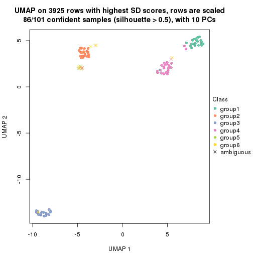</p>

</div>
</div>


Following heatmap shows how subgroups are split when increasing `k`:

```r
collect_classes(res)
```


Test correlation between subgroups and known annotations. If the known
annotation is numeric, one-way ANOVA test is applied, and if the known
annotation is discrete, chi-squared contingency table test is applied.

```r
test_to_known_factors(res)
```

```
#>          n disease.state(p) k
#> SD:NMF 101         3.32e-01 2
#> SD:NMF 101         2.94e-07 3
#> SD:NMF  98         1.73e-07 4
#> SD:NMF  91         2.50e-07 5
#> SD:NMF  86         7.64e-10 6
```


If matrix rows can be associated to genes, consider to use `functional_enrichment(res,
...)` to perform function enrichment for the signature genes. See [this vignette](http://bioconductor.org/packages/devel/bioc/vignettes/cola/inst/doc/functional_enrichment.html) for more detailed explanations.


 

---------------------------------------------------


### CV:hclust**


The object with results only for a single top-value method and a single partition method 
can be extracted as:

```r
res = res_list["CV", "hclust"]
# you can also extract it by
# res = res_list["CV:hclust"]
```

A summary of `res` and all the functions that can be applied to it:

```r
res
```

```
#> A 'ConsensusPartition' object with k = 2, 3, 4, 5, 6.
#>   On a matrix with 3925 rows and 101 columns.
#>   Top rows (392, 784, 1177, 1570, 1962) are extracted by 'CV' method.
#>   Subgroups are detected by 'hclust' method.
#>   Performed in total 1250 partitions by row resampling.
#>   Best k for subgroups seems to be 3.
#> 
#> Following methods can be applied to this 'ConsensusPartition' object:
#>  [1] "cola_report"             "collect_classes"         "collect_plots"          
#>  [4] "collect_stats"           "colnames"                "compare_signatures"     
#>  [7] "consensus_heatmap"       "dimension_reduction"     "functional_enrichment"  
#> [10] "get_anno_col"            "get_anno"                "get_classes"            
#> [13] "get_consensus"           "get_matrix"              "get_membership"         
#> [16] "get_param"               "get_signatures"          "get_stats"              
#> [19] "is_best_k"               "is_stable_k"             "membership_heatmap"     
#> [22] "ncol"                    "nrow"                    "plot_ecdf"              
#> [25] "rownames"                "select_partition_number" "show"                   
#> [28] "suggest_best_k"          "test_to_known_factors"
```

`collect_plots()` function collects all the plots made from `res` for all `k` (number of partitions)
into one single page to provide an easy and fast comparison between different `k`.

```r
collect_plots(res)
```


The plots are:

- The first row: a plot of the ECDF (empirical cumulative distribution
  function) curves of the consensus matrix for each `k` and the heatmap of
  predicted classes for each `k`.
- The second row: heatmaps of the consensus matrix for each `k`.
- The third row: heatmaps of the membership matrix for each `k`.
- The fouth row: heatmaps of the signatures for each `k`.

All the plots in panels can be made by individual functions and they are
plotted later in this section.

`select_partition_number()` produces several plots showing different
statistics for choosing "optimized" `k`. There are following statistics:

- ECDF curves of the consensus matrix for each `k`;
- 1-PAC. [The PAC
  score](https://en.wikipedia.org/wiki/Consensus_clustering#Over-interpretation_potential_of_consensus_clustering)
  measures the proportion of the ambiguous subgrouping.
- Mean silhouette score.
- Concordance. The mean probability of fiting the consensus class ids in all
  partitions.
- Area increased. Denote $A_k$ as the area under the ECDF curve for current
  `k`, the area increased is defined as $A_k - A_{k-1}$.
- Rand index. The percent of pairs of samples that are both in a same cluster
  or both are not in a same cluster in the partition of k and k-1.
- Jaccard index. The ratio of pairs of samples are both in a same cluster in
  the partition of k and k-1 and the pairs of samples are both in a same
  cluster in the partition k or k-1.

The detailed explanations of these statistics can be found in [the _cola_
vignette](http://bioconductor.org/packages/devel/bioc/vignettes/cola/inst/doc/cola.html#toc_13).

Generally speaking, lower PAC score, higher mean silhouette score or higher
concordance corresponds to better partition. Rand index and Jaccard index
measure how similar the current partition is compared to partition with `k-1`.
If they are too similar, we won't accept `k` is better than `k-1`.

```r
select_partition_number(res)
```


The numeric values for all these statistics can be obtained by `get_stats()`.

```r
get_stats(res)
```

```
#>   k 1-PAC mean_silhouette concordance area_increased  Rand Jaccard
#> 2 2 1.000           0.993       0.994         0.5029 0.495   0.495
#> 3 3 0.952           0.910       0.960         0.2632 0.869   0.736
#> 4 4 0.826           0.862       0.921         0.0673 0.986   0.961
#> 5 5 0.768           0.714       0.800         0.1066 0.881   0.662
#> 6 6 0.747           0.738       0.853         0.0487 0.957   0.820
```

`suggest_best_k()` suggests the best $k$ based on these statistics. The rules are as follows:

- All $k$ with Jaccard index larger than 0.95 are removed because increasing
  $k$ does not provide enough extra information. If all $k$ are removed, it is
  marked as no subgroup is detected.
- For all $k$ with 1-PAC score larger than 0.9, the maximal $k$ is taken as
  the best $k$, and other $k$ are marked as optional $k$.
- If it does not fit the second rule. The $k$ with the maximal vote of the
  highest 1-PAC score, highest mean silhouette, and highest concordance is
  taken as the best $k$.

```r
suggest_best_k(res)
```

```
#> [1] 3
#> attr(,"optional")
#> [1] 2
```

There is also optional best $k$ = 2 that is worth to check.

Following shows the table of the partitions (You need to click the **show/hide
code output** link to see it). The membership matrix (columns with name `p*`)
is inferred by
[`clue::cl_consensus()`](https://www.rdocumentation.org/link/cl_consensus?package=clue)
function with the `SE` method. Basically the value in the membership matrix
represents the probability to belong to a certain group. The finall class
label for an item is determined with the group with highest probability it
belongs to.

In `get_classes()` function, the entropy is calculated from the membership
matrix and the silhouette score is calculated from the consensus matrix.


<script>
$( function() {
	$( '#tabs-CV-hclust-get-classes' ).tabs();
} );
</script>
<div id='tabs-CV-hclust-get-classes'>
<ul>
<li><a href='#tab-CV-hclust-get-classes-1'>k = 2</a></li>
<li><a href='#tab-CV-hclust-get-classes-2'>k = 3</a></li>
<li><a href='#tab-CV-hclust-get-classes-3'>k = 4</a></li>
<li><a href='#tab-CV-hclust-get-classes-4'>k = 5</a></li>
<li><a href='#tab-CV-hclust-get-classes-5'>k = 6</a></li>
</ul>

<div id='tab-CV-hclust-get-classes-1'>
<p><a id='tab-CV-hclust-get-classes-1-a' style='color:#0366d6' href='#'>show/hide code output</a></p>
<pre><code class="r">cbind(get_classes(res, k = 2), get_membership(res, k = 2))
</code></pre>

<pre><code>#&gt;           class entropy silhouette    p1    p2
#&gt; GSM217644     2  0.0000      0.989 0.000 1.000
#&gt; GSM217645     2  0.0000      0.989 0.000 1.000
#&gt; GSM217646     2  0.0000      0.989 0.000 1.000
#&gt; GSM217647     2  0.0000      0.989 0.000 1.000
#&gt; GSM217648     2  0.0000      0.989 0.000 1.000
#&gt; GSM217649     2  0.0000      0.989 0.000 1.000
#&gt; GSM217650     2  0.0000      0.989 0.000 1.000
#&gt; GSM217651     2  0.0000      0.989 0.000 1.000
#&gt; GSM217652     2  0.0000      0.989 0.000 1.000
#&gt; GSM217653     2  0.0000      0.989 0.000 1.000
#&gt; GSM217654     2  0.0376      0.989 0.004 0.996
#&gt; GSM217655     2  0.0000      0.989 0.000 1.000
#&gt; GSM217656     2  0.1843      0.982 0.028 0.972
#&gt; GSM217657     2  0.1843      0.982 0.028 0.972
#&gt; GSM217658     2  0.0000      0.989 0.000 1.000
#&gt; GSM217659     2  0.0000      0.989 0.000 1.000
#&gt; GSM217660     2  0.0000      0.989 0.000 1.000
#&gt; GSM217661     2  0.0000      0.989 0.000 1.000
#&gt; GSM217662     2  0.0000      0.989 0.000 1.000
#&gt; GSM217663     2  0.0000      0.989 0.000 1.000
#&gt; GSM217664     2  0.0000      0.989 0.000 1.000
#&gt; GSM217665     2  0.0000      0.989 0.000 1.000
#&gt; GSM217666     2  0.0000      0.989 0.000 1.000
#&gt; GSM217667     2  0.0000      0.989 0.000 1.000
#&gt; GSM217668     1  0.0000      0.999 1.000 0.000
#&gt; GSM217669     1  0.0000      0.999 1.000 0.000
#&gt; GSM217670     1  0.0000      0.999 1.000 0.000
#&gt; GSM217671     1  0.0000      0.999 1.000 0.000
#&gt; GSM217672     1  0.0000      0.999 1.000 0.000
#&gt; GSM217673     1  0.0000      0.999 1.000 0.000
#&gt; GSM217674     1  0.0000      0.999 1.000 0.000
#&gt; GSM217675     1  0.0000      0.999 1.000 0.000
#&gt; GSM217676     1  0.0376      0.996 0.996 0.004
#&gt; GSM217677     1  0.0000      0.999 1.000 0.000
#&gt; GSM217678     1  0.0000      0.999 1.000 0.000
#&gt; GSM217679     1  0.0000      0.999 1.000 0.000
#&gt; GSM217680     1  0.0000      0.999 1.000 0.000
#&gt; GSM217681     1  0.0000      0.999 1.000 0.000
#&gt; GSM217682     1  0.0000      0.999 1.000 0.000
#&gt; GSM217683     1  0.0000      0.999 1.000 0.000
#&gt; GSM217684     1  0.0000      0.999 1.000 0.000
#&gt; GSM217685     2  0.1633      0.985 0.024 0.976
#&gt; GSM217686     2  0.1633      0.985 0.024 0.976
#&gt; GSM217687     2  0.1633      0.985 0.024 0.976
#&gt; GSM217688     2  0.1633      0.985 0.024 0.976
#&gt; GSM217689     2  0.1633      0.985 0.024 0.976
#&gt; GSM217690     2  0.1633      0.985 0.024 0.976
#&gt; GSM217691     2  0.1633      0.985 0.024 0.976
#&gt; GSM217692     2  0.1633      0.985 0.024 0.976
#&gt; GSM217693     2  0.1633      0.985 0.024 0.976
#&gt; GSM217694     2  0.1633      0.985 0.024 0.976
#&gt; GSM217695     2  0.1633      0.985 0.024 0.976
#&gt; GSM217696     2  0.1633      0.985 0.024 0.976
#&gt; GSM217697     2  0.1633      0.985 0.024 0.976
#&gt; GSM217698     2  0.1633      0.985 0.024 0.976
#&gt; GSM217699     2  0.1633      0.985 0.024 0.976
#&gt; GSM217700     2  0.1633      0.985 0.024 0.976
#&gt; GSM217701     2  0.1633      0.985 0.024 0.976
#&gt; GSM217702     2  0.1633      0.985 0.024 0.976
#&gt; GSM217703     2  0.1633      0.985 0.024 0.976
#&gt; GSM217704     2  0.1633      0.985 0.024 0.976
#&gt; GSM217705     1  0.0000      0.999 1.000 0.000
#&gt; GSM217706     1  0.0000      0.999 1.000 0.000
#&gt; GSM217707     1  0.0000      0.999 1.000 0.000
#&gt; GSM217708     1  0.0376      0.996 0.996 0.004
#&gt; GSM217709     1  0.0672      0.993 0.992 0.008
#&gt; GSM217710     1  0.0672      0.993 0.992 0.008
#&gt; GSM217711     1  0.0672      0.993 0.992 0.008
#&gt; GSM217712     1  0.0000      0.999 1.000 0.000
#&gt; GSM217713     1  0.0000      0.999 1.000 0.000
#&gt; GSM217714     1  0.0000      0.999 1.000 0.000
#&gt; GSM217715     1  0.0000      0.999 1.000 0.000
#&gt; GSM217716     1  0.0000      0.999 1.000 0.000
#&gt; GSM217717     1  0.0000      0.999 1.000 0.000
#&gt; GSM217718     1  0.0000      0.999 1.000 0.000
#&gt; GSM217719     1  0.0000      0.999 1.000 0.000
#&gt; GSM217720     1  0.0000      0.999 1.000 0.000
#&gt; GSM217721     1  0.0000      0.999 1.000 0.000
#&gt; GSM217722     1  0.0000      0.999 1.000 0.000
#&gt; GSM217723     1  0.0672      0.993 0.992 0.008
#&gt; GSM217724     1  0.0672      0.993 0.992 0.008
#&gt; GSM217725     1  0.0672      0.993 0.992 0.008
#&gt; GSM217726     1  0.0000      0.999 1.000 0.000
#&gt; GSM217727     1  0.0000      0.999 1.000 0.000
#&gt; GSM217728     1  0.0672      0.993 0.992 0.008
#&gt; GSM217729     1  0.0000      0.999 1.000 0.000
#&gt; GSM217730     1  0.0000      0.999 1.000 0.000
#&gt; GSM217731     1  0.0000      0.999 1.000 0.000
#&gt; GSM217732     1  0.0000      0.999 1.000 0.000
#&gt; GSM217733     1  0.0000      0.999 1.000 0.000
#&gt; GSM217734     1  0.0000      0.999 1.000 0.000
#&gt; GSM217735     1  0.0000      0.999 1.000 0.000
#&gt; GSM217736     1  0.0000      0.999 1.000 0.000
#&gt; GSM217737     2  0.0000      0.989 0.000 1.000
#&gt; GSM217738     2  0.0000      0.989 0.000 1.000
#&gt; GSM217739     2  0.0000      0.989 0.000 1.000
#&gt; GSM217740     2  0.0000      0.989 0.000 1.000
#&gt; GSM217741     2  0.0000      0.989 0.000 1.000
#&gt; GSM217742     2  0.0000      0.989 0.000 1.000
#&gt; GSM217743     2  0.0000      0.989 0.000 1.000
#&gt; GSM217744     2  0.0000      0.989 0.000 1.000
</code></pre>

<script>
$('#tab-CV-hclust-get-classes-1-a').parent().next().next().hide();
$('#tab-CV-hclust-get-classes-1-a').click(function(){
  $('#tab-CV-hclust-get-classes-1-a').parent().next().next().toggle();
  return(false);
});
</script>
</div>

<div id='tab-CV-hclust-get-classes-2'>
<p><a id='tab-CV-hclust-get-classes-2-a' style='color:#0366d6' href='#'>show/hide code output</a></p>
<pre><code class="r">cbind(get_classes(res, k = 3), get_membership(res, k = 3))
</code></pre>

<pre><code>#&gt;           class entropy silhouette    p1    p2    p3
#&gt; GSM217644     2  0.5678      0.614 0.000 0.684 0.316
#&gt; GSM217645     2  0.5254      0.688 0.000 0.736 0.264
#&gt; GSM217646     2  0.1031      0.890 0.000 0.976 0.024
#&gt; GSM217647     2  0.0000      0.890 0.000 1.000 0.000
#&gt; GSM217648     2  0.1031      0.890 0.000 0.976 0.024
#&gt; GSM217649     2  0.1031      0.890 0.000 0.976 0.024
#&gt; GSM217650     2  0.1964      0.879 0.000 0.944 0.056
#&gt; GSM217651     2  0.1964      0.879 0.000 0.944 0.056
#&gt; GSM217652     2  0.1163      0.889 0.000 0.972 0.028
#&gt; GSM217653     2  0.1529      0.886 0.000 0.960 0.040
#&gt; GSM217654     2  0.6305      0.224 0.000 0.516 0.484
#&gt; GSM217655     2  0.6291      0.276 0.000 0.532 0.468
#&gt; GSM217656     3  0.6386      0.115 0.004 0.412 0.584
#&gt; GSM217657     3  0.6386      0.115 0.004 0.412 0.584
#&gt; GSM217658     2  0.1163      0.889 0.000 0.972 0.028
#&gt; GSM217659     2  0.1031      0.890 0.000 0.976 0.024
#&gt; GSM217660     2  0.6062      0.482 0.000 0.616 0.384
#&gt; GSM217661     2  0.4654      0.760 0.000 0.792 0.208
#&gt; GSM217662     2  0.2261      0.872 0.000 0.932 0.068
#&gt; GSM217663     2  0.1529      0.886 0.000 0.960 0.040
#&gt; GSM217664     2  0.0000      0.890 0.000 1.000 0.000
#&gt; GSM217665     2  0.0000      0.890 0.000 1.000 0.000
#&gt; GSM217666     2  0.0000      0.890 0.000 1.000 0.000
#&gt; GSM217667     2  0.0000      0.890 0.000 1.000 0.000
#&gt; GSM217668     1  0.0000      0.995 1.000 0.000 0.000
#&gt; GSM217669     1  0.0000      0.995 1.000 0.000 0.000
#&gt; GSM217670     1  0.0000      0.995 1.000 0.000 0.000
#&gt; GSM217671     1  0.0000      0.995 1.000 0.000 0.000
#&gt; GSM217672     1  0.0000      0.995 1.000 0.000 0.000
#&gt; GSM217673     1  0.0000      0.995 1.000 0.000 0.000
#&gt; GSM217674     1  0.0000      0.995 1.000 0.000 0.000
#&gt; GSM217675     1  0.0000      0.995 1.000 0.000 0.000
#&gt; GSM217676     1  0.0424      0.990 0.992 0.000 0.008
#&gt; GSM217677     1  0.0000      0.995 1.000 0.000 0.000
#&gt; GSM217678     1  0.0000      0.995 1.000 0.000 0.000
#&gt; GSM217679     1  0.0000      0.995 1.000 0.000 0.000
#&gt; GSM217680     1  0.0000      0.995 1.000 0.000 0.000
#&gt; GSM217681     1  0.0000      0.995 1.000 0.000 0.000
#&gt; GSM217682     1  0.0000      0.995 1.000 0.000 0.000
#&gt; GSM217683     1  0.0000      0.995 1.000 0.000 0.000
#&gt; GSM217684     1  0.0000      0.995 1.000 0.000 0.000
#&gt; GSM217685     3  0.0000      0.952 0.000 0.000 1.000
#&gt; GSM217686     3  0.0000      0.952 0.000 0.000 1.000
#&gt; GSM217687     3  0.0000      0.952 0.000 0.000 1.000
#&gt; GSM217688     3  0.0000      0.952 0.000 0.000 1.000
#&gt; GSM217689     3  0.0000      0.952 0.000 0.000 1.000
#&gt; GSM217690     3  0.0000      0.952 0.000 0.000 1.000
#&gt; GSM217691     3  0.0000      0.952 0.000 0.000 1.000
#&gt; GSM217692     3  0.0000      0.952 0.000 0.000 1.000
#&gt; GSM217693     3  0.0000      0.952 0.000 0.000 1.000
#&gt; GSM217694     3  0.0000      0.952 0.000 0.000 1.000
#&gt; GSM217695     3  0.0000      0.952 0.000 0.000 1.000
#&gt; GSM217696     3  0.0000      0.952 0.000 0.000 1.000
#&gt; GSM217697     3  0.0000      0.952 0.000 0.000 1.000
#&gt; GSM217698     3  0.0000      0.952 0.000 0.000 1.000
#&gt; GSM217699     3  0.0000      0.952 0.000 0.000 1.000
#&gt; GSM217700     3  0.0000      0.952 0.000 0.000 1.000
#&gt; GSM217701     3  0.0000      0.952 0.000 0.000 1.000
#&gt; GSM217702     3  0.0000      0.952 0.000 0.000 1.000
#&gt; GSM217703     3  0.0000      0.952 0.000 0.000 1.000
#&gt; GSM217704     3  0.0000      0.952 0.000 0.000 1.000
#&gt; GSM217705     1  0.0000      0.995 1.000 0.000 0.000
#&gt; GSM217706     1  0.0000      0.995 1.000 0.000 0.000
#&gt; GSM217707     1  0.0000      0.995 1.000 0.000 0.000
#&gt; GSM217708     1  0.0892      0.981 0.980 0.000 0.020
#&gt; GSM217709     1  0.1289      0.972 0.968 0.000 0.032
#&gt; GSM217710     1  0.1289      0.972 0.968 0.000 0.032
#&gt; GSM217711     1  0.1289      0.972 0.968 0.000 0.032
#&gt; GSM217712     1  0.0000      0.995 1.000 0.000 0.000
#&gt; GSM217713     1  0.0000      0.995 1.000 0.000 0.000
#&gt; GSM217714     1  0.0000      0.995 1.000 0.000 0.000
#&gt; GSM217715     1  0.0000      0.995 1.000 0.000 0.000
#&gt; GSM217716     1  0.0000      0.995 1.000 0.000 0.000
#&gt; GSM217717     1  0.0000      0.995 1.000 0.000 0.000
#&gt; GSM217718     1  0.0000      0.995 1.000 0.000 0.000
#&gt; GSM217719     1  0.0000      0.995 1.000 0.000 0.000
#&gt; GSM217720     1  0.0000      0.995 1.000 0.000 0.000
#&gt; GSM217721     1  0.0000      0.995 1.000 0.000 0.000
#&gt; GSM217722     1  0.0000      0.995 1.000 0.000 0.000
#&gt; GSM217723     1  0.1289      0.972 0.968 0.000 0.032
#&gt; GSM217724     1  0.0892      0.981 0.980 0.000 0.020
#&gt; GSM217725     1  0.1289      0.972 0.968 0.000 0.032
#&gt; GSM217726     1  0.0000      0.995 1.000 0.000 0.000
#&gt; GSM217727     1  0.0000      0.995 1.000 0.000 0.000
#&gt; GSM217728     1  0.1289      0.972 0.968 0.000 0.032
#&gt; GSM217729     1  0.0000      0.995 1.000 0.000 0.000
#&gt; GSM217730     1  0.0000      0.995 1.000 0.000 0.000
#&gt; GSM217731     1  0.0000      0.995 1.000 0.000 0.000
#&gt; GSM217732     1  0.0000      0.995 1.000 0.000 0.000
#&gt; GSM217733     1  0.0000      0.995 1.000 0.000 0.000
#&gt; GSM217734     1  0.0000      0.995 1.000 0.000 0.000
#&gt; GSM217735     1  0.0000      0.995 1.000 0.000 0.000
#&gt; GSM217736     1  0.0000      0.995 1.000 0.000 0.000
#&gt; GSM217737     2  0.4750      0.731 0.000 0.784 0.216
#&gt; GSM217738     2  0.4750      0.731 0.000 0.784 0.216
#&gt; GSM217739     2  0.0000      0.890 0.000 1.000 0.000
#&gt; GSM217740     2  0.0000      0.890 0.000 1.000 0.000
#&gt; GSM217741     2  0.0000      0.890 0.000 1.000 0.000
#&gt; GSM217742     2  0.0000      0.890 0.000 1.000 0.000
#&gt; GSM217743     2  0.0000      0.890 0.000 1.000 0.000
#&gt; GSM217744     2  0.0000      0.890 0.000 1.000 0.000
</code></pre>

<script>
$('#tab-CV-hclust-get-classes-2-a').parent().next().next().hide();
$('#tab-CV-hclust-get-classes-2-a').click(function(){
  $('#tab-CV-hclust-get-classes-2-a').parent().next().next().toggle();
  return(false);
});
</script>
</div>

<div id='tab-CV-hclust-get-classes-3'>
<p><a id='tab-CV-hclust-get-classes-3-a' style='color:#0366d6' href='#'>show/hide code output</a></p>
<pre><code class="r">cbind(get_classes(res, k = 4), get_membership(res, k = 4))
</code></pre>

<pre><code>#&gt;           class entropy silhouette    p1    p2 p3    p4
#&gt; GSM217644     2  0.4564      0.344 0.000 0.672  0 0.328
#&gt; GSM217645     2  0.4250      0.491 0.000 0.724  0 0.276
#&gt; GSM217646     2  0.0817      0.858 0.000 0.976  0 0.024
#&gt; GSM217647     2  0.0000      0.863 0.000 1.000  0 0.000
#&gt; GSM217648     2  0.0817      0.858 0.000 0.976  0 0.024
#&gt; GSM217649     2  0.0817      0.858 0.000 0.976  0 0.024
#&gt; GSM217650     2  0.1716      0.835 0.000 0.936  0 0.064
#&gt; GSM217651     2  0.1716      0.835 0.000 0.936  0 0.064
#&gt; GSM217652     2  0.1118      0.853 0.000 0.964  0 0.036
#&gt; GSM217653     2  0.1389      0.848 0.000 0.952  0 0.048
#&gt; GSM217654     4  0.4999      0.157 0.000 0.492  0 0.508
#&gt; GSM217655     2  0.4994     -0.344 0.000 0.520  0 0.480
#&gt; GSM217656     4  0.3486      0.755 0.000 0.188  0 0.812
#&gt; GSM217657     4  0.3486      0.755 0.000 0.188  0 0.812
#&gt; GSM217658     2  0.1118      0.853 0.000 0.964  0 0.036
#&gt; GSM217659     2  0.0817      0.858 0.000 0.976  0 0.024
#&gt; GSM217660     2  0.4843      0.036 0.000 0.604  0 0.396
#&gt; GSM217661     2  0.3801      0.626 0.000 0.780  0 0.220
#&gt; GSM217662     2  0.1940      0.825 0.000 0.924  0 0.076
#&gt; GSM217663     2  0.1389      0.848 0.000 0.952  0 0.048
#&gt; GSM217664     2  0.0000      0.863 0.000 1.000  0 0.000
#&gt; GSM217665     2  0.0000      0.863 0.000 1.000  0 0.000
#&gt; GSM217666     2  0.0000      0.863 0.000 1.000  0 0.000
#&gt; GSM217667     2  0.0000      0.863 0.000 1.000  0 0.000
#&gt; GSM217668     1  0.0000      0.912 1.000 0.000  0 0.000
#&gt; GSM217669     1  0.0000      0.912 1.000 0.000  0 0.000
#&gt; GSM217670     1  0.0188      0.911 0.996 0.000  0 0.004
#&gt; GSM217671     1  0.0000      0.912 1.000 0.000  0 0.000
#&gt; GSM217672     1  0.0000      0.912 1.000 0.000  0 0.000
#&gt; GSM217673     1  0.0000      0.912 1.000 0.000  0 0.000
#&gt; GSM217674     1  0.3486      0.894 0.812 0.000  0 0.188
#&gt; GSM217675     1  0.3486      0.894 0.812 0.000  0 0.188
#&gt; GSM217676     1  0.3610      0.891 0.800 0.000  0 0.200
#&gt; GSM217677     1  0.3486      0.894 0.812 0.000  0 0.188
#&gt; GSM217678     1  0.3486      0.894 0.812 0.000  0 0.188
#&gt; GSM217679     1  0.3486      0.894 0.812 0.000  0 0.188
#&gt; GSM217680     1  0.3486      0.894 0.812 0.000  0 0.188
#&gt; GSM217681     1  0.3486      0.894 0.812 0.000  0 0.188
#&gt; GSM217682     1  0.3486      0.894 0.812 0.000  0 0.188
#&gt; GSM217683     1  0.3486      0.894 0.812 0.000  0 0.188
#&gt; GSM217684     1  0.0188      0.912 0.996 0.000  0 0.004
#&gt; GSM217685     3  0.0000      1.000 0.000 0.000  1 0.000
#&gt; GSM217686     3  0.0000      1.000 0.000 0.000  1 0.000
#&gt; GSM217687     3  0.0000      1.000 0.000 0.000  1 0.000
#&gt; GSM217688     3  0.0000      1.000 0.000 0.000  1 0.000
#&gt; GSM217689     3  0.0000      1.000 0.000 0.000  1 0.000
#&gt; GSM217690     3  0.0000      1.000 0.000 0.000  1 0.000
#&gt; GSM217691     3  0.0000      1.000 0.000 0.000  1 0.000
#&gt; GSM217692     3  0.0000      1.000 0.000 0.000  1 0.000
#&gt; GSM217693     3  0.0000      1.000 0.000 0.000  1 0.000
#&gt; GSM217694     3  0.0000      1.000 0.000 0.000  1 0.000
#&gt; GSM217695     3  0.0000      1.000 0.000 0.000  1 0.000
#&gt; GSM217696     3  0.0000      1.000 0.000 0.000  1 0.000
#&gt; GSM217697     3  0.0000      1.000 0.000 0.000  1 0.000
#&gt; GSM217698     3  0.0000      1.000 0.000 0.000  1 0.000
#&gt; GSM217699     3  0.0000      1.000 0.000 0.000  1 0.000
#&gt; GSM217700     3  0.0000      1.000 0.000 0.000  1 0.000
#&gt; GSM217701     3  0.0000      1.000 0.000 0.000  1 0.000
#&gt; GSM217702     3  0.0000      1.000 0.000 0.000  1 0.000
#&gt; GSM217703     3  0.0000      1.000 0.000 0.000  1 0.000
#&gt; GSM217704     3  0.0000      1.000 0.000 0.000  1 0.000
#&gt; GSM217705     1  0.0188      0.912 0.996 0.000  0 0.004
#&gt; GSM217706     1  0.0000      0.912 1.000 0.000  0 0.000
#&gt; GSM217707     1  0.0000      0.912 1.000 0.000  0 0.000
#&gt; GSM217708     1  0.0817      0.903 0.976 0.000  0 0.024
#&gt; GSM217709     1  0.1118      0.896 0.964 0.000  0 0.036
#&gt; GSM217710     1  0.1118      0.896 0.964 0.000  0 0.036
#&gt; GSM217711     1  0.1118      0.896 0.964 0.000  0 0.036
#&gt; GSM217712     1  0.0188      0.911 0.996 0.000  0 0.004
#&gt; GSM217713     1  0.0188      0.911 0.996 0.000  0 0.004
#&gt; GSM217714     1  0.0188      0.911 0.996 0.000  0 0.004
#&gt; GSM217715     1  0.0188      0.911 0.996 0.000  0 0.004
#&gt; GSM217716     1  0.0188      0.911 0.996 0.000  0 0.004
#&gt; GSM217717     1  0.0188      0.911 0.996 0.000  0 0.004
#&gt; GSM217718     1  0.0188      0.911 0.996 0.000  0 0.004
#&gt; GSM217719     1  0.0188      0.911 0.996 0.000  0 0.004
#&gt; GSM217720     1  0.0188      0.912 0.996 0.000  0 0.004
#&gt; GSM217721     1  0.0188      0.911 0.996 0.000  0 0.004
#&gt; GSM217722     1  0.0000      0.912 1.000 0.000  0 0.000
#&gt; GSM217723     1  0.2814      0.901 0.868 0.000  0 0.132
#&gt; GSM217724     1  0.2647      0.904 0.880 0.000  0 0.120
#&gt; GSM217725     1  0.2814      0.901 0.868 0.000  0 0.132
#&gt; GSM217726     1  0.3486      0.894 0.812 0.000  0 0.188
#&gt; GSM217727     1  0.3486      0.894 0.812 0.000  0 0.188
#&gt; GSM217728     1  0.2814      0.901 0.868 0.000  0 0.132
#&gt; GSM217729     1  0.3486      0.894 0.812 0.000  0 0.188
#&gt; GSM217730     1  0.3486      0.894 0.812 0.000  0 0.188
#&gt; GSM217731     1  0.3486      0.894 0.812 0.000  0 0.188
#&gt; GSM217732     1  0.3486      0.894 0.812 0.000  0 0.188
#&gt; GSM217733     1  0.3486      0.894 0.812 0.000  0 0.188
#&gt; GSM217734     1  0.3486      0.894 0.812 0.000  0 0.188
#&gt; GSM217735     1  0.3486      0.894 0.812 0.000  0 0.188
#&gt; GSM217736     1  0.3486      0.894 0.812 0.000  0 0.188
#&gt; GSM217737     2  0.3764      0.570 0.000 0.784  0 0.216
#&gt; GSM217738     2  0.3764      0.570 0.000 0.784  0 0.216
#&gt; GSM217739     2  0.0000      0.863 0.000 1.000  0 0.000
#&gt; GSM217740     2  0.0000      0.863 0.000 1.000  0 0.000
#&gt; GSM217741     2  0.0000      0.863 0.000 1.000  0 0.000
#&gt; GSM217742     2  0.0000      0.863 0.000 1.000  0 0.000
#&gt; GSM217743     2  0.0000      0.863 0.000 1.000  0 0.000
#&gt; GSM217744     2  0.0000      0.863 0.000 1.000  0 0.000
</code></pre>

<script>
$('#tab-CV-hclust-get-classes-3-a').parent().next().next().hide();
$('#tab-CV-hclust-get-classes-3-a').click(function(){
  $('#tab-CV-hclust-get-classes-3-a').parent().next().next().toggle();
  return(false);
});
</script>
</div>

<div id='tab-CV-hclust-get-classes-4'>
<p><a id='tab-CV-hclust-get-classes-4-a' style='color:#0366d6' href='#'>show/hide code output</a></p>
<pre><code class="r">cbind(get_classes(res, k = 5), get_membership(res, k = 5))
</code></pre>

<pre><code>#&gt;           class entropy silhouette    p1    p2    p3    p4    p5
#&gt; GSM217644     2  0.3949     0.5004 0.000 0.668 0.000 0.000 0.332
#&gt; GSM217645     2  0.3684     0.5966 0.000 0.720 0.000 0.000 0.280
#&gt; GSM217646     2  0.0794     0.8181 0.000 0.972 0.000 0.000 0.028
#&gt; GSM217647     2  0.0290     0.8169 0.008 0.992 0.000 0.000 0.000
#&gt; GSM217648     2  0.0794     0.8181 0.000 0.972 0.000 0.000 0.028
#&gt; GSM217649     2  0.0794     0.8181 0.000 0.972 0.000 0.000 0.028
#&gt; GSM217650     2  0.1764     0.8015 0.008 0.928 0.000 0.000 0.064
#&gt; GSM217651     2  0.1764     0.8015 0.008 0.928 0.000 0.000 0.064
#&gt; GSM217652     2  0.1251     0.8134 0.008 0.956 0.000 0.000 0.036
#&gt; GSM217653     2  0.1270     0.8154 0.000 0.948 0.000 0.000 0.052
#&gt; GSM217654     5  0.4430    -0.1643 0.000 0.456 0.000 0.004 0.540
#&gt; GSM217655     2  0.4305     0.0179 0.000 0.512 0.000 0.000 0.488
#&gt; GSM217656     5  0.1041     0.7042 0.000 0.004 0.000 0.032 0.964
#&gt; GSM217657     5  0.1041     0.7042 0.000 0.004 0.000 0.032 0.964
#&gt; GSM217658     2  0.1251     0.8134 0.008 0.956 0.000 0.000 0.036
#&gt; GSM217659     2  0.0794     0.8181 0.000 0.972 0.000 0.000 0.028
#&gt; GSM217660     2  0.5131     0.2446 0.040 0.540 0.000 0.000 0.420
#&gt; GSM217661     2  0.3305     0.6794 0.000 0.776 0.000 0.000 0.224
#&gt; GSM217662     2  0.1956     0.7984 0.008 0.916 0.000 0.000 0.076
#&gt; GSM217663     2  0.1270     0.8154 0.000 0.948 0.000 0.000 0.052
#&gt; GSM217664     2  0.0290     0.8169 0.008 0.992 0.000 0.000 0.000
#&gt; GSM217665     2  0.0290     0.8169 0.008 0.992 0.000 0.000 0.000
#&gt; GSM217666     2  0.0290     0.8169 0.008 0.992 0.000 0.000 0.000
#&gt; GSM217667     2  0.0290     0.8169 0.008 0.992 0.000 0.000 0.000
#&gt; GSM217668     1  0.4291    -0.0545 0.536 0.000 0.000 0.464 0.000
#&gt; GSM217669     4  0.4300     0.2205 0.476 0.000 0.000 0.524 0.000
#&gt; GSM217670     4  0.3508     0.6283 0.252 0.000 0.000 0.748 0.000
#&gt; GSM217671     1  0.4305    -0.1297 0.512 0.000 0.000 0.488 0.000
#&gt; GSM217672     1  0.4305    -0.1297 0.512 0.000 0.000 0.488 0.000
#&gt; GSM217673     1  0.4305    -0.1297 0.512 0.000 0.000 0.488 0.000
#&gt; GSM217674     1  0.3452     0.8362 0.756 0.000 0.000 0.244 0.000
#&gt; GSM217675     1  0.3424     0.8128 0.760 0.000 0.000 0.240 0.000
#&gt; GSM217676     4  0.4300    -0.2043 0.476 0.000 0.000 0.524 0.000
#&gt; GSM217677     1  0.3480     0.8388 0.752 0.000 0.000 0.248 0.000
#&gt; GSM217678     1  0.3586     0.8224 0.736 0.000 0.000 0.264 0.000
#&gt; GSM217679     1  0.3508     0.8359 0.748 0.000 0.000 0.252 0.000
#&gt; GSM217680     1  0.3586     0.8224 0.736 0.000 0.000 0.264 0.000
#&gt; GSM217681     1  0.3480     0.8388 0.752 0.000 0.000 0.248 0.000
#&gt; GSM217682     1  0.3452     0.8362 0.756 0.000 0.000 0.244 0.000
#&gt; GSM217683     1  0.3452     0.8362 0.756 0.000 0.000 0.244 0.000
#&gt; GSM217684     1  0.4114     0.2731 0.624 0.000 0.000 0.376 0.000
#&gt; GSM217685     3  0.0000     0.9994 0.000 0.000 1.000 0.000 0.000
#&gt; GSM217686     3  0.0000     0.9994 0.000 0.000 1.000 0.000 0.000
#&gt; GSM217687     3  0.0000     0.9994 0.000 0.000 1.000 0.000 0.000
#&gt; GSM217688     3  0.0000     0.9994 0.000 0.000 1.000 0.000 0.000
#&gt; GSM217689     3  0.0162     0.9968 0.000 0.000 0.996 0.000 0.004
#&gt; GSM217690     3  0.0162     0.9968 0.000 0.000 0.996 0.000 0.004
#&gt; GSM217691     3  0.0000     0.9994 0.000 0.000 1.000 0.000 0.000
#&gt; GSM217692     3  0.0000     0.9994 0.000 0.000 1.000 0.000 0.000
#&gt; GSM217693     3  0.0000     0.9994 0.000 0.000 1.000 0.000 0.000
#&gt; GSM217694     3  0.0000     0.9994 0.000 0.000 1.000 0.000 0.000
#&gt; GSM217695     3  0.0000     0.9994 0.000 0.000 1.000 0.000 0.000
#&gt; GSM217696     3  0.0000     0.9994 0.000 0.000 1.000 0.000 0.000
#&gt; GSM217697     3  0.0000     0.9994 0.000 0.000 1.000 0.000 0.000
#&gt; GSM217698     3  0.0000     0.9994 0.000 0.000 1.000 0.000 0.000
#&gt; GSM217699     3  0.0000     0.9994 0.000 0.000 1.000 0.000 0.000
#&gt; GSM217700     3  0.0000     0.9994 0.000 0.000 1.000 0.000 0.000
#&gt; GSM217701     3  0.0000     0.9994 0.000 0.000 1.000 0.000 0.000
#&gt; GSM217702     3  0.0000     0.9994 0.000 0.000 1.000 0.000 0.000
#&gt; GSM217703     3  0.0162     0.9968 0.000 0.000 0.996 0.000 0.004
#&gt; GSM217704     3  0.0000     0.9994 0.000 0.000 1.000 0.000 0.000
#&gt; GSM217705     4  0.3857     0.5628 0.312 0.000 0.000 0.688 0.000
#&gt; GSM217706     4  0.3837     0.5819 0.308 0.000 0.000 0.692 0.000
#&gt; GSM217707     4  0.3876     0.5729 0.316 0.000 0.000 0.684 0.000
#&gt; GSM217708     4  0.1197     0.7039 0.048 0.000 0.000 0.952 0.000
#&gt; GSM217709     4  0.0794     0.6919 0.028 0.000 0.000 0.972 0.000
#&gt; GSM217710     4  0.0794     0.6919 0.028 0.000 0.000 0.972 0.000
#&gt; GSM217711     4  0.0794     0.6919 0.028 0.000 0.000 0.972 0.000
#&gt; GSM217712     4  0.3424     0.6493 0.240 0.000 0.000 0.760 0.000
#&gt; GSM217713     4  0.2648     0.7087 0.152 0.000 0.000 0.848 0.000
#&gt; GSM217714     4  0.4060     0.4943 0.360 0.000 0.000 0.640 0.000
#&gt; GSM217715     4  0.4060     0.4943 0.360 0.000 0.000 0.640 0.000
#&gt; GSM217716     4  0.2329     0.7234 0.124 0.000 0.000 0.876 0.000
#&gt; GSM217717     4  0.2329     0.7234 0.124 0.000 0.000 0.876 0.000
#&gt; GSM217718     4  0.2020     0.7242 0.100 0.000 0.000 0.900 0.000
#&gt; GSM217719     4  0.2020     0.7242 0.100 0.000 0.000 0.900 0.000
#&gt; GSM217720     4  0.3857     0.5628 0.312 0.000 0.000 0.688 0.000
#&gt; GSM217721     4  0.2127     0.7249 0.108 0.000 0.000 0.892 0.000
#&gt; GSM217722     4  0.3480     0.6420 0.248 0.000 0.000 0.752 0.000
#&gt; GSM217723     4  0.2813     0.6098 0.168 0.000 0.000 0.832 0.000
#&gt; GSM217724     4  0.3074     0.6024 0.196 0.000 0.000 0.804 0.000
#&gt; GSM217725     4  0.2813     0.6098 0.168 0.000 0.000 0.832 0.000
#&gt; GSM217726     1  0.3480     0.8388 0.752 0.000 0.000 0.248 0.000
#&gt; GSM217727     1  0.3480     0.8388 0.752 0.000 0.000 0.248 0.000
#&gt; GSM217728     4  0.2813     0.6098 0.168 0.000 0.000 0.832 0.000
#&gt; GSM217729     1  0.3534     0.8323 0.744 0.000 0.000 0.256 0.000
#&gt; GSM217730     1  0.3534     0.8323 0.744 0.000 0.000 0.256 0.000
#&gt; GSM217731     1  0.3534     0.8323 0.744 0.000 0.000 0.256 0.000
#&gt; GSM217732     1  0.3480     0.8388 0.752 0.000 0.000 0.248 0.000
#&gt; GSM217733     1  0.3480     0.8388 0.752 0.000 0.000 0.248 0.000
#&gt; GSM217734     1  0.3480     0.8388 0.752 0.000 0.000 0.248 0.000
#&gt; GSM217735     1  0.3480     0.8388 0.752 0.000 0.000 0.248 0.000
#&gt; GSM217736     1  0.3480     0.8388 0.752 0.000 0.000 0.248 0.000
#&gt; GSM217737     2  0.5775     0.4642 0.136 0.600 0.000 0.000 0.264
#&gt; GSM217738     2  0.5775     0.4642 0.136 0.600 0.000 0.000 0.264
#&gt; GSM217739     2  0.3667     0.7444 0.140 0.812 0.000 0.000 0.048
#&gt; GSM217740     2  0.3667     0.7444 0.140 0.812 0.000 0.000 0.048
#&gt; GSM217741     2  0.3667     0.7444 0.140 0.812 0.000 0.000 0.048
#&gt; GSM217742     2  0.3667     0.7444 0.140 0.812 0.000 0.000 0.048
#&gt; GSM217743     2  0.3667     0.7444 0.140 0.812 0.000 0.000 0.048
#&gt; GSM217744     2  0.3667     0.7444 0.140 0.812 0.000 0.000 0.048
</code></pre>

<script>
$('#tab-CV-hclust-get-classes-4-a').parent().next().next().hide();
$('#tab-CV-hclust-get-classes-4-a').click(function(){
  $('#tab-CV-hclust-get-classes-4-a').parent().next().next().toggle();
  return(false);
});
</script>
</div>

<div id='tab-CV-hclust-get-classes-5'>
<p><a id='tab-CV-hclust-get-classes-5-a' style='color:#0366d6' href='#'>show/hide code output</a></p>
<pre><code class="r">cbind(get_classes(res, k = 6), get_membership(res, k = 6))
</code></pre>

<pre><code>#&gt;           class entropy silhouette    p1    p2    p3    p4    p5    p6
#&gt; GSM217644     2  0.3867     0.5056 0.000 0.660 0.000 0.000 0.012 0.328
#&gt; GSM217645     2  0.3629     0.6125 0.000 0.712 0.000 0.000 0.012 0.276
#&gt; GSM217646     2  0.0993     0.8510 0.000 0.964 0.000 0.000 0.012 0.024
#&gt; GSM217647     2  0.0000     0.8514 0.000 1.000 0.000 0.000 0.000 0.000
#&gt; GSM217648     2  0.0993     0.8510 0.000 0.964 0.000 0.000 0.012 0.024
#&gt; GSM217649     2  0.0993     0.8510 0.000 0.964 0.000 0.000 0.012 0.024
#&gt; GSM217650     2  0.1327     0.8456 0.000 0.936 0.000 0.000 0.000 0.064
#&gt; GSM217651     2  0.1327     0.8456 0.000 0.936 0.000 0.000 0.000 0.064
#&gt; GSM217652     2  0.0865     0.8538 0.000 0.964 0.000 0.000 0.000 0.036
#&gt; GSM217653     2  0.1434     0.8501 0.000 0.940 0.000 0.000 0.012 0.048
#&gt; GSM217654     6  0.4242    -0.1581 0.000 0.448 0.000 0.000 0.016 0.536
#&gt; GSM217655     2  0.4263    -0.0091 0.000 0.504 0.000 0.000 0.016 0.480
#&gt; GSM217656     6  0.0291     0.6122 0.000 0.000 0.000 0.004 0.004 0.992
#&gt; GSM217657     6  0.0291     0.6122 0.000 0.000 0.000 0.004 0.004 0.992
#&gt; GSM217658     2  0.0865     0.8538 0.000 0.964 0.000 0.000 0.000 0.036
#&gt; GSM217659     2  0.0993     0.8510 0.000 0.964 0.000 0.000 0.012 0.024
#&gt; GSM217660     2  0.5819    -0.1804 0.000 0.420 0.000 0.000 0.184 0.396
#&gt; GSM217661     2  0.3287     0.6919 0.000 0.768 0.000 0.000 0.012 0.220
#&gt; GSM217662     2  0.1501     0.8399 0.000 0.924 0.000 0.000 0.000 0.076
#&gt; GSM217663     2  0.1434     0.8501 0.000 0.940 0.000 0.000 0.012 0.048
#&gt; GSM217664     2  0.0000     0.8514 0.000 1.000 0.000 0.000 0.000 0.000
#&gt; GSM217665     2  0.0000     0.8514 0.000 1.000 0.000 0.000 0.000 0.000
#&gt; GSM217666     2  0.0000     0.8514 0.000 1.000 0.000 0.000 0.000 0.000
#&gt; GSM217667     2  0.0000     0.8514 0.000 1.000 0.000 0.000 0.000 0.000
#&gt; GSM217668     1  0.3810     0.1410 0.572 0.000 0.000 0.428 0.000 0.000
#&gt; GSM217669     4  0.3860     0.2082 0.472 0.000 0.000 0.528 0.000 0.000
#&gt; GSM217670     4  0.3695     0.6471 0.376 0.000 0.000 0.624 0.000 0.000
#&gt; GSM217671     1  0.3833     0.0760 0.556 0.000 0.000 0.444 0.000 0.000
#&gt; GSM217672     1  0.3833     0.0760 0.556 0.000 0.000 0.444 0.000 0.000
#&gt; GSM217673     1  0.3833     0.0760 0.556 0.000 0.000 0.444 0.000 0.000
#&gt; GSM217674     1  0.0146     0.8411 0.996 0.000 0.000 0.004 0.000 0.000
#&gt; GSM217675     1  0.0713     0.8186 0.972 0.000 0.000 0.028 0.000 0.000
#&gt; GSM217676     1  0.3647     0.0881 0.640 0.000 0.000 0.360 0.000 0.000
#&gt; GSM217677     1  0.0000     0.8433 1.000 0.000 0.000 0.000 0.000 0.000
#&gt; GSM217678     1  0.0632     0.8228 0.976 0.000 0.000 0.024 0.000 0.000
#&gt; GSM217679     1  0.0146     0.8411 0.996 0.000 0.000 0.004 0.000 0.000
#&gt; GSM217680     1  0.0632     0.8228 0.976 0.000 0.000 0.024 0.000 0.000
#&gt; GSM217681     1  0.0000     0.8433 1.000 0.000 0.000 0.000 0.000 0.000
#&gt; GSM217682     1  0.0146     0.8411 0.996 0.000 0.000 0.004 0.000 0.000
#&gt; GSM217683     1  0.0146     0.8411 0.996 0.000 0.000 0.004 0.000 0.000
#&gt; GSM217684     1  0.3547     0.4075 0.668 0.000 0.000 0.332 0.000 0.000
#&gt; GSM217685     3  0.1007     0.9631 0.000 0.000 0.956 0.000 0.044 0.000
#&gt; GSM217686     3  0.1007     0.9631 0.000 0.000 0.956 0.000 0.044 0.000
#&gt; GSM217687     3  0.1007     0.9631 0.000 0.000 0.956 0.000 0.044 0.000
#&gt; GSM217688     3  0.1007     0.9631 0.000 0.000 0.956 0.000 0.044 0.000
#&gt; GSM217689     3  0.1970     0.9296 0.000 0.000 0.900 0.000 0.092 0.008
#&gt; GSM217690     3  0.1970     0.9296 0.000 0.000 0.900 0.000 0.092 0.008
#&gt; GSM217691     3  0.0146     0.9770 0.000 0.000 0.996 0.000 0.004 0.000
#&gt; GSM217692     3  0.0146     0.9770 0.000 0.000 0.996 0.000 0.004 0.000
#&gt; GSM217693     3  0.0146     0.9770 0.000 0.000 0.996 0.000 0.004 0.000
#&gt; GSM217694     3  0.0146     0.9770 0.000 0.000 0.996 0.000 0.004 0.000
#&gt; GSM217695     3  0.0146     0.9770 0.000 0.000 0.996 0.000 0.004 0.000
#&gt; GSM217696     3  0.0146     0.9770 0.000 0.000 0.996 0.000 0.004 0.000
#&gt; GSM217697     3  0.0146     0.9770 0.000 0.000 0.996 0.000 0.004 0.000
#&gt; GSM217698     3  0.0000     0.9770 0.000 0.000 1.000 0.000 0.000 0.000
#&gt; GSM217699     3  0.0000     0.9770 0.000 0.000 1.000 0.000 0.000 0.000
#&gt; GSM217700     3  0.0000     0.9770 0.000 0.000 1.000 0.000 0.000 0.000
#&gt; GSM217701     3  0.0000     0.9770 0.000 0.000 1.000 0.000 0.000 0.000
#&gt; GSM217702     3  0.0000     0.9770 0.000 0.000 1.000 0.000 0.000 0.000
#&gt; GSM217703     3  0.1970     0.9296 0.000 0.000 0.900 0.000 0.092 0.008
#&gt; GSM217704     3  0.0146     0.9770 0.000 0.000 0.996 0.000 0.004 0.000
#&gt; GSM217705     4  0.3797     0.5511 0.420 0.000 0.000 0.580 0.000 0.000
#&gt; GSM217706     4  0.3747     0.5628 0.396 0.000 0.000 0.604 0.000 0.000
#&gt; GSM217707     4  0.3747     0.5541 0.396 0.000 0.000 0.604 0.000 0.000
#&gt; GSM217708     4  0.2378     0.7058 0.152 0.000 0.000 0.848 0.000 0.000
#&gt; GSM217709     4  0.2178     0.6950 0.132 0.000 0.000 0.868 0.000 0.000
#&gt; GSM217710     4  0.2178     0.6950 0.132 0.000 0.000 0.868 0.000 0.000
#&gt; GSM217711     4  0.2178     0.6950 0.132 0.000 0.000 0.868 0.000 0.000
#&gt; GSM217712     4  0.3620     0.6543 0.352 0.000 0.000 0.648 0.000 0.000
#&gt; GSM217713     4  0.3371     0.7181 0.292 0.000 0.000 0.708 0.000 0.000
#&gt; GSM217714     4  0.3774     0.5245 0.408 0.000 0.000 0.592 0.000 0.000
#&gt; GSM217715     4  0.3774     0.5245 0.408 0.000 0.000 0.592 0.000 0.000
#&gt; GSM217716     4  0.3198     0.7349 0.260 0.000 0.000 0.740 0.000 0.000
#&gt; GSM217717     4  0.3198     0.7349 0.260 0.000 0.000 0.740 0.000 0.000
#&gt; GSM217718     4  0.3050     0.7355 0.236 0.000 0.000 0.764 0.000 0.000
#&gt; GSM217719     4  0.3050     0.7355 0.236 0.000 0.000 0.764 0.000 0.000
#&gt; GSM217720     4  0.3797     0.5511 0.420 0.000 0.000 0.580 0.000 0.000
#&gt; GSM217721     4  0.3126     0.7367 0.248 0.000 0.000 0.752 0.000 0.000
#&gt; GSM217722     4  0.3563     0.6404 0.336 0.000 0.000 0.664 0.000 0.000
#&gt; GSM217723     4  0.3351     0.6278 0.288 0.000 0.000 0.712 0.000 0.000
#&gt; GSM217724     4  0.3515     0.6198 0.324 0.000 0.000 0.676 0.000 0.000
#&gt; GSM217725     4  0.3371     0.6248 0.292 0.000 0.000 0.708 0.000 0.000
#&gt; GSM217726     1  0.0000     0.8433 1.000 0.000 0.000 0.000 0.000 0.000
#&gt; GSM217727     1  0.0000     0.8433 1.000 0.000 0.000 0.000 0.000 0.000
#&gt; GSM217728     4  0.3371     0.6248 0.292 0.000 0.000 0.708 0.000 0.000
#&gt; GSM217729     1  0.0260     0.8384 0.992 0.000 0.000 0.008 0.000 0.000
#&gt; GSM217730     1  0.0260     0.8384 0.992 0.000 0.000 0.008 0.000 0.000
#&gt; GSM217731     1  0.0260     0.8384 0.992 0.000 0.000 0.008 0.000 0.000
#&gt; GSM217732     1  0.0000     0.8433 1.000 0.000 0.000 0.000 0.000 0.000
#&gt; GSM217733     1  0.0000     0.8433 1.000 0.000 0.000 0.000 0.000 0.000
#&gt; GSM217734     1  0.0000     0.8433 1.000 0.000 0.000 0.000 0.000 0.000
#&gt; GSM217735     1  0.0000     0.8433 1.000 0.000 0.000 0.000 0.000 0.000
#&gt; GSM217736     1  0.0000     0.8433 1.000 0.000 0.000 0.000 0.000 0.000
#&gt; GSM217737     5  0.4539     0.7410 0.000 0.096 0.000 0.000 0.688 0.216
#&gt; GSM217738     5  0.4539     0.7410 0.000 0.096 0.000 0.000 0.688 0.216
#&gt; GSM217739     5  0.1765     0.9245 0.000 0.096 0.000 0.000 0.904 0.000
#&gt; GSM217740     5  0.1765     0.9245 0.000 0.096 0.000 0.000 0.904 0.000
#&gt; GSM217741     5  0.1814     0.9257 0.000 0.100 0.000 0.000 0.900 0.000
#&gt; GSM217742     5  0.1814     0.9257 0.000 0.100 0.000 0.000 0.900 0.000
#&gt; GSM217743     5  0.1814     0.9257 0.000 0.100 0.000 0.000 0.900 0.000
#&gt; GSM217744     5  0.1814     0.9257 0.000 0.100 0.000 0.000 0.900 0.000
</code></pre>

<script>
$('#tab-CV-hclust-get-classes-5-a').parent().next().next().hide();
$('#tab-CV-hclust-get-classes-5-a').click(function(){
  $('#tab-CV-hclust-get-classes-5-a').parent().next().next().toggle();
  return(false);
});
</script>
</div>
</div>

Heatmaps for the consensus matrix. It visualizes the probability of two
samples to be in a same group.


<script>
$( function() {
	$( '#tabs-CV-hclust-consensus-heatmap' ).tabs();
} );
</script>
<div id='tabs-CV-hclust-consensus-heatmap'>
<ul>
<li><a href='#tab-CV-hclust-consensus-heatmap-1'>k = 2</a></li>
<li><a href='#tab-CV-hclust-consensus-heatmap-2'>k = 3</a></li>
<li><a href='#tab-CV-hclust-consensus-heatmap-3'>k = 4</a></li>
<li><a href='#tab-CV-hclust-consensus-heatmap-4'>k = 5</a></li>
<li><a href='#tab-CV-hclust-consensus-heatmap-5'>k = 6</a></li>
</ul>
<div id='tab-CV-hclust-consensus-heatmap-1'>
<pre><code class="r">consensus_heatmap(res, k = 2)
</code></pre>

<p></p>

</div>
<div id='tab-CV-hclust-consensus-heatmap-2'>
<pre><code class="r">consensus_heatmap(res, k = 3)
</code></pre>

<p></p>

</div>
<div id='tab-CV-hclust-consensus-heatmap-3'>
<pre><code class="r">consensus_heatmap(res, k = 4)
</code></pre>

<p></p>

</div>
<div id='tab-CV-hclust-consensus-heatmap-4'>
<pre><code class="r">consensus_heatmap(res, k = 5)
</code></pre>

<p></p>

</div>
<div id='tab-CV-hclust-consensus-heatmap-5'>
<pre><code class="r">consensus_heatmap(res, k = 6)
</code></pre>

<p></p>

</div>
</div>

Heatmaps for the membership of samples in all partitions to see how consistent they are:


<script>
$( function() {
	$( '#tabs-CV-hclust-membership-heatmap' ).tabs();
} );
</script>
<div id='tabs-CV-hclust-membership-heatmap'>
<ul>
<li><a href='#tab-CV-hclust-membership-heatmap-1'>k = 2</a></li>
<li><a href='#tab-CV-hclust-membership-heatmap-2'>k = 3</a></li>
<li><a href='#tab-CV-hclust-membership-heatmap-3'>k = 4</a></li>
<li><a href='#tab-CV-hclust-membership-heatmap-4'>k = 5</a></li>
<li><a href='#tab-CV-hclust-membership-heatmap-5'>k = 6</a></li>
</ul>
<div id='tab-CV-hclust-membership-heatmap-1'>
<pre><code class="r">membership_heatmap(res, k = 2)
</code></pre>

<p></p>

</div>
<div id='tab-CV-hclust-membership-heatmap-2'>
<pre><code class="r">membership_heatmap(res, k = 3)
</code></pre>

<p></p>

</div>
<div id='tab-CV-hclust-membership-heatmap-3'>
<pre><code class="r">membership_heatmap(res, k = 4)
</code></pre>

<p></p>

</div>
<div id='tab-CV-hclust-membership-heatmap-4'>
<pre><code class="r">membership_heatmap(res, k = 5)
</code></pre>

<p></p>

</div>
<div id='tab-CV-hclust-membership-heatmap-5'>
<pre><code class="r">membership_heatmap(res, k = 6)
</code></pre>

<p></p>

</div>
</div>

As soon as we have had the classes for columns, we can look for signatures
which are significantly different between classes which can be candidate marks
for certain classes. Following are the heatmaps for signatures.


Signature heatmaps where rows are scaled:


<script>
$( function() {
	$( '#tabs-CV-hclust-get-signatures' ).tabs();
} );
</script>
<div id='tabs-CV-hclust-get-signatures'>
<ul>
<li><a href='#tab-CV-hclust-get-signatures-1'>k = 2</a></li>
<li><a href='#tab-CV-hclust-get-signatures-2'>k = 3</a></li>
<li><a href='#tab-CV-hclust-get-signatures-3'>k = 4</a></li>
<li><a href='#tab-CV-hclust-get-signatures-4'>k = 5</a></li>
<li><a href='#tab-CV-hclust-get-signatures-5'>k = 6</a></li>
</ul>
<div id='tab-CV-hclust-get-signatures-1'>
<pre><code class="r">get_signatures(res, k = 2)
</code></pre>

<p></p>

</div>
<div id='tab-CV-hclust-get-signatures-2'>
<pre><code class="r">get_signatures(res, k = 3)
</code></pre>

<p></p>

</div>
<div id='tab-CV-hclust-get-signatures-3'>
<pre><code class="r">get_signatures(res, k = 4)
</code></pre>

<p></p>

</div>
<div id='tab-CV-hclust-get-signatures-4'>
<pre><code class="r">get_signatures(res, k = 5)
</code></pre>

<p></p>

</div>
<div id='tab-CV-hclust-get-signatures-5'>
<pre><code class="r">get_signatures(res, k = 6)
</code></pre>

<p></p>

</div>
</div>


Signature heatmaps where rows are not scaled:


<script>
$( function() {
	$( '#tabs-CV-hclust-get-signatures-no-scale' ).tabs();
} );
</script>
<div id='tabs-CV-hclust-get-signatures-no-scale'>
<ul>
<li><a href='#tab-CV-hclust-get-signatures-no-scale-1'>k = 2</a></li>
<li><a href='#tab-CV-hclust-get-signatures-no-scale-2'>k = 3</a></li>
<li><a href='#tab-CV-hclust-get-signatures-no-scale-3'>k = 4</a></li>
<li><a href='#tab-CV-hclust-get-signatures-no-scale-4'>k = 5</a></li>
<li><a href='#tab-CV-hclust-get-signatures-no-scale-5'>k = 6</a></li>
</ul>
<div id='tab-CV-hclust-get-signatures-no-scale-1'>
<pre><code class="r">get_signatures(res, k = 2, scale_rows = FALSE)
</code></pre>

<p></p>

</div>
<div id='tab-CV-hclust-get-signatures-no-scale-2'>
<pre><code class="r">get_signatures(res, k = 3, scale_rows = FALSE)
</code></pre>

<p></p>

</div>
<div id='tab-CV-hclust-get-signatures-no-scale-3'>
<pre><code class="r">get_signatures(res, k = 4, scale_rows = FALSE)
</code></pre>

<p></p>

</div>
<div id='tab-CV-hclust-get-signatures-no-scale-4'>
<pre><code class="r">get_signatures(res, k = 5, scale_rows = FALSE)
</code></pre>

<p></p>

</div>
<div id='tab-CV-hclust-get-signatures-no-scale-5'>
<pre><code class="r">get_signatures(res, k = 6, scale_rows = FALSE)
</code></pre>

<p></p>

</div>
</div>


Compare the overlap of signatures from different k:

```r
compare_signatures(res)
```


`get_signature()` returns a data frame invisibly. TO get the list of signatures, the function
call should be assigned to a variable explicitly. In following code, if `plot` argument is set
to `FALSE`, no heatmap is plotted while only the differential analysis is performed.

```r
# code only for demonstration
tb = get_signature(res, k = ..., plot = FALSE)
```

An example of the output of `tb` is:

```
#>   which_row         fdr    mean_1    mean_2 scaled_mean_1 scaled_mean_2 km
#> 1        38 0.042760348  8.373488  9.131774    -0.5533452     0.5164555  1
#> 2        40 0.018707592  7.106213  8.469186    -0.6173731     0.5762149  1
#> 3        55 0.019134737 10.221463 11.207825    -0.6159697     0.5749050  1
#> 4        59 0.006059896  5.921854  7.869574    -0.6899429     0.6439467  1
#> 5        60 0.018055526  8.928898 10.211722    -0.6204761     0.5791110  1
#> 6        98 0.009384629 15.714769 14.887706     0.6635654    -0.6193277  2
...
```

The columns in `tb` are:

1. `which_row`: row indices corresponding to the input matrix.
2. `fdr`: FDR for the differential test. 
3. `mean_x`: The mean value in group x.
4. `scaled_mean_x`: The mean value in group x after rows are scaled.
5. `km`: Row groups if k-means clustering is applied to rows.


UMAP plot which shows how samples are separated.


<script>
$( function() {
	$( '#tabs-CV-hclust-dimension-reduction' ).tabs();
} );
</script>
<div id='tabs-CV-hclust-dimension-reduction'>
<ul>
<li><a href='#tab-CV-hclust-dimension-reduction-1'>k = 2</a></li>
<li><a href='#tab-CV-hclust-dimension-reduction-2'>k = 3</a></li>
<li><a href='#tab-CV-hclust-dimension-reduction-3'>k = 4</a></li>
<li><a href='#tab-CV-hclust-dimension-reduction-4'>k = 5</a></li>
<li><a href='#tab-CV-hclust-dimension-reduction-5'>k = 6</a></li>
</ul>
<div id='tab-CV-hclust-dimension-reduction-1'>
<pre><code class="r">dimension_reduction(res, k = 2, method = &quot;UMAP&quot;)
</code></pre>

<p></p>

</div>
<div id='tab-CV-hclust-dimension-reduction-2'>
<pre><code class="r">dimension_reduction(res, k = 3, method = &quot;UMAP&quot;)
</code></pre>

<p></p>

</div>
<div id='tab-CV-hclust-dimension-reduction-3'>
<pre><code class="r">dimension_reduction(res, k = 4, method = &quot;UMAP&quot;)
</code></pre>

<p></p>

</div>
<div id='tab-CV-hclust-dimension-reduction-4'>
<pre><code class="r">dimension_reduction(res, k = 5, method = &quot;UMAP&quot;)
</code></pre>

<p></p>

</div>
<div id='tab-CV-hclust-dimension-reduction-5'>
<pre><code class="r">dimension_reduction(res, k = 6, method = &quot;UMAP&quot;)
</code></pre>

<p></p>

</div>
</div>


Following heatmap shows how subgroups are split when increasing `k`:

```r
collect_classes(res)
```

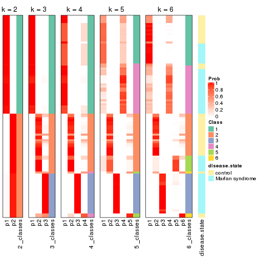


Test correlation between subgroups and known annotations. If the known
annotation is numeric, one-way ANOVA test is applied, and if the known
annotation is discrete, chi-squared contingency table test is applied.

```r
test_to_known_factors(res)
```

```
#>             n disease.state(p) k
#> CV:hclust 101         3.32e-01 2
#> CV:hclust  96         4.53e-06 3
#> CV:hclust  96         1.26e-05 4
#> CV:hclust  87         1.44e-08 5
#> CV:hclust  91         8.21e-13 6
```


If matrix rows can be associated to genes, consider to use `functional_enrichment(res,
...)` to perform function enrichment for the signature genes. See [this vignette](http://bioconductor.org/packages/devel/bioc/vignettes/cola/inst/doc/functional_enrichment.html) for more detailed explanations.


 

---------------------------------------------------


### CV:kmeans


The object with results only for a single top-value method and a single partition method 
can be extracted as:

```r
res = res_list["CV", "kmeans"]
# you can also extract it by
# res = res_list["CV:kmeans"]
```

A summary of `res` and all the functions that can be applied to it:

```r
res
```

```
#> A 'ConsensusPartition' object with k = 2, 3, 4, 5, 6.
#>   On a matrix with 3925 rows and 101 columns.
#>   Top rows (392, 784, 1177, 1570, 1962) are extracted by 'CV' method.
#>   Subgroups are detected by 'kmeans' method.
#>   Performed in total 1250 partitions by row resampling.
#>   Best k for subgroups seems to be 4.
#> 
#> Following methods can be applied to this 'ConsensusPartition' object:
#>  [1] "cola_report"             "collect_classes"         "collect_plots"          
#>  [4] "collect_stats"           "colnames"                "compare_signatures"     
#>  [7] "consensus_heatmap"       "dimension_reduction"     "functional_enrichment"  
#> [10] "get_anno_col"            "get_anno"                "get_classes"            
#> [13] "get_consensus"           "get_matrix"              "get_membership"         
#> [16] "get_param"               "get_signatures"          "get_stats"              
#> [19] "is_best_k"               "is_stable_k"             "membership_heatmap"     
#> [22] "ncol"                    "nrow"                    "plot_ecdf"              
#> [25] "rownames"                "select_partition_number" "show"                   
#> [28] "suggest_best_k"          "test_to_known_factors"
```

`collect_plots()` function collects all the plots made from `res` for all `k` (number of partitions)
into one single page to provide an easy and fast comparison between different `k`.

```r
collect_plots(res)
```


The plots are:

- The first row: a plot of the ECDF (empirical cumulative distribution
  function) curves of the consensus matrix for each `k` and the heatmap of
  predicted classes for each `k`.
- The second row: heatmaps of the consensus matrix for each `k`.
- The third row: heatmaps of the membership matrix for each `k`.
- The fouth row: heatmaps of the signatures for each `k`.

All the plots in panels can be made by individual functions and they are
plotted later in this section.

`select_partition_number()` produces several plots showing different
statistics for choosing "optimized" `k`. There are following statistics:

- ECDF curves of the consensus matrix for each `k`;
- 1-PAC. [The PAC
  score](https://en.wikipedia.org/wiki/Consensus_clustering#Over-interpretation_potential_of_consensus_clustering)
  measures the proportion of the ambiguous subgrouping.
- Mean silhouette score.
- Concordance. The mean probability of fiting the consensus class ids in all
  partitions.
- Area increased. Denote $A_k$ as the area under the ECDF curve for current
  `k`, the area increased is defined as $A_k - A_{k-1}$.
- Rand index. The percent of pairs of samples that are both in a same cluster
  or both are not in a same cluster in the partition of k and k-1.
- Jaccard index. The ratio of pairs of samples are both in a same cluster in
  the partition of k and k-1 and the pairs of samples are both in a same
  cluster in the partition k or k-1.

The detailed explanations of these statistics can be found in [the _cola_
vignette](http://bioconductor.org/packages/devel/bioc/vignettes/cola/inst/doc/cola.html#toc_13).

Generally speaking, lower PAC score, higher mean silhouette score or higher
concordance corresponds to better partition. Rand index and Jaccard index
measure how similar the current partition is compared to partition with `k-1`.
If they are too similar, we won't accept `k` is better than `k-1`.

```r
select_partition_number(res)
```


The numeric values for all these statistics can be obtained by `get_stats()`.

```r
get_stats(res)
```

```
#>   k 1-PAC mean_silhouette concordance area_increased  Rand Jaccard
#> 2 2 0.778           0.955       0.957         0.4979 0.495   0.495
#> 3 3 0.750           0.935       0.876         0.2629 0.873   0.744
#> 4 4 0.846           0.960       0.904         0.1503 0.882   0.679
#> 5 5 0.786           0.869       0.859         0.0577 1.000   1.000
#> 6 6 0.845           0.810       0.819         0.0467 0.957   0.830
```

`suggest_best_k()` suggests the best $k$ based on these statistics. The rules are as follows:

- All $k$ with Jaccard index larger than 0.95 are removed because increasing
  $k$ does not provide enough extra information. If all $k$ are removed, it is
  marked as no subgroup is detected.
- For all $k$ with 1-PAC score larger than 0.9, the maximal $k$ is taken as
  the best $k$, and other $k$ are marked as optional $k$.
- If it does not fit the second rule. The $k$ with the maximal vote of the
  highest 1-PAC score, highest mean silhouette, and highest concordance is
  taken as the best $k$.

```r
suggest_best_k(res)
```

```
#> [1] 4
```


Following shows the table of the partitions (You need to click the **show/hide
code output** link to see it). The membership matrix (columns with name `p*`)
is inferred by
[`clue::cl_consensus()`](https://www.rdocumentation.org/link/cl_consensus?package=clue)
function with the `SE` method. Basically the value in the membership matrix
represents the probability to belong to a certain group. The finall class
label for an item is determined with the group with highest probability it
belongs to.

In `get_classes()` function, the entropy is calculated from the membership
matrix and the silhouette score is calculated from the consensus matrix.


<script>
$( function() {
	$( '#tabs-CV-kmeans-get-classes' ).tabs();
} );
</script>
<div id='tabs-CV-kmeans-get-classes'>
<ul>
<li><a href='#tab-CV-kmeans-get-classes-1'>k = 2</a></li>
<li><a href='#tab-CV-kmeans-get-classes-2'>k = 3</a></li>
<li><a href='#tab-CV-kmeans-get-classes-3'>k = 4</a></li>
<li><a href='#tab-CV-kmeans-get-classes-4'>k = 5</a></li>
<li><a href='#tab-CV-kmeans-get-classes-5'>k = 6</a></li>
</ul>

<div id='tab-CV-kmeans-get-classes-1'>
<p><a id='tab-CV-kmeans-get-classes-1-a' style='color:#0366d6' href='#'>show/hide code output</a></p>
<pre><code class="r">cbind(get_classes(res, k = 2), get_membership(res, k = 2))
</code></pre>

<pre><code>#&gt;           class entropy silhouette    p1    p2
#&gt; GSM217644     2   0.163      0.956 0.024 0.976
#&gt; GSM217645     2   0.163      0.956 0.024 0.976
#&gt; GSM217646     2   0.163      0.956 0.024 0.976
#&gt; GSM217647     2   0.163      0.956 0.024 0.976
#&gt; GSM217648     2   0.163      0.956 0.024 0.976
#&gt; GSM217649     2   0.163      0.956 0.024 0.976
#&gt; GSM217650     2   0.163      0.956 0.024 0.976
#&gt; GSM217651     2   0.163      0.956 0.024 0.976
#&gt; GSM217652     2   0.163      0.956 0.024 0.976
#&gt; GSM217653     2   0.163      0.956 0.024 0.976
#&gt; GSM217654     2   0.163      0.956 0.024 0.976
#&gt; GSM217655     2   0.163      0.956 0.024 0.976
#&gt; GSM217656     2   0.295      0.944 0.052 0.948
#&gt; GSM217657     2   0.163      0.956 0.024 0.976
#&gt; GSM217658     2   0.163      0.956 0.024 0.976
#&gt; GSM217659     2   0.163      0.956 0.024 0.976
#&gt; GSM217660     2   0.163      0.956 0.024 0.976
#&gt; GSM217661     2   0.163      0.956 0.024 0.976
#&gt; GSM217662     2   0.163      0.956 0.024 0.976
#&gt; GSM217663     2   0.163      0.956 0.024 0.976
#&gt; GSM217664     2   0.163      0.956 0.024 0.976
#&gt; GSM217665     2   0.163      0.956 0.024 0.976
#&gt; GSM217666     2   0.163      0.956 0.024 0.976
#&gt; GSM217667     2   0.163      0.956 0.024 0.976
#&gt; GSM217668     1   0.343      0.963 0.936 0.064
#&gt; GSM217669     1   0.343      0.963 0.936 0.064
#&gt; GSM217670     1   0.343      0.963 0.936 0.064
#&gt; GSM217671     1   0.343      0.963 0.936 0.064
#&gt; GSM217672     1   0.343      0.963 0.936 0.064
#&gt; GSM217673     1   0.343      0.963 0.936 0.064
#&gt; GSM217674     1   0.000      0.965 1.000 0.000
#&gt; GSM217675     1   0.000      0.965 1.000 0.000
#&gt; GSM217676     1   0.000      0.965 1.000 0.000
#&gt; GSM217677     1   0.000      0.965 1.000 0.000
#&gt; GSM217678     1   0.000      0.965 1.000 0.000
#&gt; GSM217679     1   0.000      0.965 1.000 0.000
#&gt; GSM217680     1   0.000      0.965 1.000 0.000
#&gt; GSM217681     1   0.000      0.965 1.000 0.000
#&gt; GSM217682     1   0.000      0.965 1.000 0.000
#&gt; GSM217683     1   0.000      0.965 1.000 0.000
#&gt; GSM217684     1   0.343      0.963 0.936 0.064
#&gt; GSM217685     2   0.469      0.930 0.100 0.900
#&gt; GSM217686     2   0.469      0.930 0.100 0.900
#&gt; GSM217687     2   0.469      0.930 0.100 0.900
#&gt; GSM217688     2   0.469      0.930 0.100 0.900
#&gt; GSM217689     2   0.469      0.930 0.100 0.900
#&gt; GSM217690     2   0.469      0.930 0.100 0.900
#&gt; GSM217691     2   0.469      0.930 0.100 0.900
#&gt; GSM217692     2   0.469      0.930 0.100 0.900
#&gt; GSM217693     2   0.469      0.930 0.100 0.900
#&gt; GSM217694     2   0.469      0.930 0.100 0.900
#&gt; GSM217695     2   0.469      0.930 0.100 0.900
#&gt; GSM217696     2   0.469      0.930 0.100 0.900
#&gt; GSM217697     2   0.469      0.930 0.100 0.900
#&gt; GSM217698     2   0.469      0.930 0.100 0.900
#&gt; GSM217699     2   0.469      0.930 0.100 0.900
#&gt; GSM217700     2   0.469      0.930 0.100 0.900
#&gt; GSM217701     2   0.469      0.930 0.100 0.900
#&gt; GSM217702     2   0.469      0.930 0.100 0.900
#&gt; GSM217703     2   0.469      0.930 0.100 0.900
#&gt; GSM217704     2   0.469      0.930 0.100 0.900
#&gt; GSM217705     1   0.343      0.963 0.936 0.064
#&gt; GSM217706     1   0.343      0.963 0.936 0.064
#&gt; GSM217707     1   0.327      0.964 0.940 0.060
#&gt; GSM217708     1   0.224      0.965 0.964 0.036
#&gt; GSM217709     1   0.343      0.963 0.936 0.064
#&gt; GSM217710     1   0.343      0.963 0.936 0.064
#&gt; GSM217711     1   0.343      0.963 0.936 0.064
#&gt; GSM217712     1   0.343      0.963 0.936 0.064
#&gt; GSM217713     1   0.343      0.963 0.936 0.064
#&gt; GSM217714     1   0.343      0.963 0.936 0.064
#&gt; GSM217715     1   0.343      0.963 0.936 0.064
#&gt; GSM217716     1   0.343      0.963 0.936 0.064
#&gt; GSM217717     1   0.343      0.963 0.936 0.064
#&gt; GSM217718     1   0.343      0.963 0.936 0.064
#&gt; GSM217719     1   0.343      0.963 0.936 0.064
#&gt; GSM217720     1   0.343      0.963 0.936 0.064
#&gt; GSM217721     1   0.343      0.963 0.936 0.064
#&gt; GSM217722     1   0.260      0.965 0.956 0.044
#&gt; GSM217723     1   0.000      0.965 1.000 0.000
#&gt; GSM217724     1   0.000      0.965 1.000 0.000
#&gt; GSM217725     1   0.000      0.965 1.000 0.000
#&gt; GSM217726     1   0.000      0.965 1.000 0.000
#&gt; GSM217727     1   0.000      0.965 1.000 0.000
#&gt; GSM217728     1   0.000      0.965 1.000 0.000
#&gt; GSM217729     1   0.000      0.965 1.000 0.000
#&gt; GSM217730     1   0.000      0.965 1.000 0.000
#&gt; GSM217731     1   0.000      0.965 1.000 0.000
#&gt; GSM217732     1   0.000      0.965 1.000 0.000
#&gt; GSM217733     1   0.000      0.965 1.000 0.000
#&gt; GSM217734     1   0.000      0.965 1.000 0.000
#&gt; GSM217735     1   0.000      0.965 1.000 0.000
#&gt; GSM217736     1   0.000      0.965 1.000 0.000
#&gt; GSM217737     2   0.163      0.956 0.024 0.976
#&gt; GSM217738     2   0.163      0.956 0.024 0.976
#&gt; GSM217739     2   0.163      0.956 0.024 0.976
#&gt; GSM217740     2   0.163      0.956 0.024 0.976
#&gt; GSM217741     2   0.163      0.956 0.024 0.976
#&gt; GSM217742     2   0.163      0.956 0.024 0.976
#&gt; GSM217743     2   0.163      0.956 0.024 0.976
#&gt; GSM217744     2   0.163      0.956 0.024 0.976
</code></pre>

<script>
$('#tab-CV-kmeans-get-classes-1-a').parent().next().next().hide();
$('#tab-CV-kmeans-get-classes-1-a').click(function(){
  $('#tab-CV-kmeans-get-classes-1-a').parent().next().next().toggle();
  return(false);
});
</script>
</div>

<div id='tab-CV-kmeans-get-classes-2'>
<p><a id='tab-CV-kmeans-get-classes-2-a' style='color:#0366d6' href='#'>show/hide code output</a></p>
<pre><code class="r">cbind(get_classes(res, k = 3), get_membership(res, k = 3))
</code></pre>

<pre><code>#&gt;           class entropy silhouette    p1    p2    p3
#&gt; GSM217644     2  0.0000      0.996 0.000 1.000 0.000
#&gt; GSM217645     2  0.0000      0.996 0.000 1.000 0.000
#&gt; GSM217646     2  0.0000      0.996 0.000 1.000 0.000
#&gt; GSM217647     2  0.0000      0.996 0.000 1.000 0.000
#&gt; GSM217648     2  0.0000      0.996 0.000 1.000 0.000
#&gt; GSM217649     2  0.0000      0.996 0.000 1.000 0.000
#&gt; GSM217650     2  0.0000      0.996 0.000 1.000 0.000
#&gt; GSM217651     2  0.0000      0.996 0.000 1.000 0.000
#&gt; GSM217652     2  0.0000      0.996 0.000 1.000 0.000
#&gt; GSM217653     2  0.0000      0.996 0.000 1.000 0.000
#&gt; GSM217654     2  0.0000      0.996 0.000 1.000 0.000
#&gt; GSM217655     2  0.0000      0.996 0.000 1.000 0.000
#&gt; GSM217656     2  0.1031      0.957 0.024 0.976 0.000
#&gt; GSM217657     2  0.0000      0.996 0.000 1.000 0.000
#&gt; GSM217658     2  0.0000      0.996 0.000 1.000 0.000
#&gt; GSM217659     2  0.0000      0.996 0.000 1.000 0.000
#&gt; GSM217660     2  0.0000      0.996 0.000 1.000 0.000
#&gt; GSM217661     2  0.0000      0.996 0.000 1.000 0.000
#&gt; GSM217662     2  0.0000      0.996 0.000 1.000 0.000
#&gt; GSM217663     2  0.0000      0.996 0.000 1.000 0.000
#&gt; GSM217664     2  0.0000      0.996 0.000 1.000 0.000
#&gt; GSM217665     2  0.0000      0.996 0.000 1.000 0.000
#&gt; GSM217666     2  0.0000      0.996 0.000 1.000 0.000
#&gt; GSM217667     2  0.0000      0.996 0.000 1.000 0.000
#&gt; GSM217668     1  0.0000      0.877 1.000 0.000 0.000
#&gt; GSM217669     1  0.0000      0.877 1.000 0.000 0.000
#&gt; GSM217670     1  0.0000      0.877 1.000 0.000 0.000
#&gt; GSM217671     1  0.0000      0.877 1.000 0.000 0.000
#&gt; GSM217672     1  0.0000      0.877 1.000 0.000 0.000
#&gt; GSM217673     1  0.0000      0.877 1.000 0.000 0.000
#&gt; GSM217674     1  0.5431      0.863 0.716 0.000 0.284
#&gt; GSM217675     1  0.5431      0.863 0.716 0.000 0.284
#&gt; GSM217676     1  0.5431      0.863 0.716 0.000 0.284
#&gt; GSM217677     1  0.5431      0.863 0.716 0.000 0.284
#&gt; GSM217678     1  0.5431      0.863 0.716 0.000 0.284
#&gt; GSM217679     1  0.5431      0.863 0.716 0.000 0.284
#&gt; GSM217680     1  0.5431      0.863 0.716 0.000 0.284
#&gt; GSM217681     1  0.5431      0.863 0.716 0.000 0.284
#&gt; GSM217682     1  0.5431      0.863 0.716 0.000 0.284
#&gt; GSM217683     1  0.5431      0.863 0.716 0.000 0.284
#&gt; GSM217684     1  0.0237      0.877 0.996 0.000 0.004
#&gt; GSM217685     3  0.5497      1.000 0.000 0.292 0.708
#&gt; GSM217686     3  0.5497      1.000 0.000 0.292 0.708
#&gt; GSM217687     3  0.5497      1.000 0.000 0.292 0.708
#&gt; GSM217688     3  0.5497      1.000 0.000 0.292 0.708
#&gt; GSM217689     3  0.5497      1.000 0.000 0.292 0.708
#&gt; GSM217690     3  0.5497      1.000 0.000 0.292 0.708
#&gt; GSM217691     3  0.5497      1.000 0.000 0.292 0.708
#&gt; GSM217692     3  0.5497      1.000 0.000 0.292 0.708
#&gt; GSM217693     3  0.5497      1.000 0.000 0.292 0.708
#&gt; GSM217694     3  0.5497      1.000 0.000 0.292 0.708
#&gt; GSM217695     3  0.5497      1.000 0.000 0.292 0.708
#&gt; GSM217696     3  0.5497      1.000 0.000 0.292 0.708
#&gt; GSM217697     3  0.5497      1.000 0.000 0.292 0.708
#&gt; GSM217698     3  0.5497      1.000 0.000 0.292 0.708
#&gt; GSM217699     3  0.5497      1.000 0.000 0.292 0.708
#&gt; GSM217700     3  0.5497      1.000 0.000 0.292 0.708
#&gt; GSM217701     3  0.5497      1.000 0.000 0.292 0.708
#&gt; GSM217702     3  0.5497      1.000 0.000 0.292 0.708
#&gt; GSM217703     3  0.5497      1.000 0.000 0.292 0.708
#&gt; GSM217704     3  0.5497      1.000 0.000 0.292 0.708
#&gt; GSM217705     1  0.0000      0.877 1.000 0.000 0.000
#&gt; GSM217706     1  0.0000      0.877 1.000 0.000 0.000
#&gt; GSM217707     1  0.0000      0.877 1.000 0.000 0.000
#&gt; GSM217708     1  0.0000      0.877 1.000 0.000 0.000
#&gt; GSM217709     1  0.0000      0.877 1.000 0.000 0.000
#&gt; GSM217710     1  0.0000      0.877 1.000 0.000 0.000
#&gt; GSM217711     1  0.0000      0.877 1.000 0.000 0.000
#&gt; GSM217712     1  0.0000      0.877 1.000 0.000 0.000
#&gt; GSM217713     1  0.0000      0.877 1.000 0.000 0.000
#&gt; GSM217714     1  0.0000      0.877 1.000 0.000 0.000
#&gt; GSM217715     1  0.0000      0.877 1.000 0.000 0.000
#&gt; GSM217716     1  0.0000      0.877 1.000 0.000 0.000
#&gt; GSM217717     1  0.0000      0.877 1.000 0.000 0.000
#&gt; GSM217718     1  0.0000      0.877 1.000 0.000 0.000
#&gt; GSM217719     1  0.0000      0.877 1.000 0.000 0.000
#&gt; GSM217720     1  0.0000      0.877 1.000 0.000 0.000
#&gt; GSM217721     1  0.0000      0.877 1.000 0.000 0.000
#&gt; GSM217722     1  0.0000      0.877 1.000 0.000 0.000
#&gt; GSM217723     1  0.3038      0.873 0.896 0.000 0.104
#&gt; GSM217724     1  0.5363      0.864 0.724 0.000 0.276
#&gt; GSM217725     1  0.5397      0.864 0.720 0.000 0.280
#&gt; GSM217726     1  0.5431      0.863 0.716 0.000 0.284
#&gt; GSM217727     1  0.5431      0.863 0.716 0.000 0.284
#&gt; GSM217728     1  0.5397      0.864 0.720 0.000 0.280
#&gt; GSM217729     1  0.5431      0.863 0.716 0.000 0.284
#&gt; GSM217730     1  0.5431      0.863 0.716 0.000 0.284
#&gt; GSM217731     1  0.5431      0.863 0.716 0.000 0.284
#&gt; GSM217732     1  0.5431      0.863 0.716 0.000 0.284
#&gt; GSM217733     1  0.5431      0.863 0.716 0.000 0.284
#&gt; GSM217734     1  0.5431      0.863 0.716 0.000 0.284
#&gt; GSM217735     1  0.5431      0.863 0.716 0.000 0.284
#&gt; GSM217736     1  0.5431      0.863 0.716 0.000 0.284
#&gt; GSM217737     2  0.0424      0.990 0.000 0.992 0.008
#&gt; GSM217738     2  0.0424      0.990 0.000 0.992 0.008
#&gt; GSM217739     2  0.0424      0.990 0.000 0.992 0.008
#&gt; GSM217740     2  0.0424      0.990 0.000 0.992 0.008
#&gt; GSM217741     2  0.0424      0.990 0.000 0.992 0.008
#&gt; GSM217742     2  0.0424      0.990 0.000 0.992 0.008
#&gt; GSM217743     2  0.0424      0.990 0.000 0.992 0.008
#&gt; GSM217744     2  0.0424      0.990 0.000 0.992 0.008
</code></pre>

<script>
$('#tab-CV-kmeans-get-classes-2-a').parent().next().next().hide();
$('#tab-CV-kmeans-get-classes-2-a').click(function(){
  $('#tab-CV-kmeans-get-classes-2-a').parent().next().next().toggle();
  return(false);
});
</script>
</div>

<div id='tab-CV-kmeans-get-classes-3'>
<p><a id='tab-CV-kmeans-get-classes-3-a' style='color:#0366d6' href='#'>show/hide code output</a></p>
<pre><code class="r">cbind(get_classes(res, k = 4), get_membership(res, k = 4))
</code></pre>

<pre><code>#&gt;           class entropy silhouette    p1    p2    p3    p4
#&gt; GSM217644     2  0.0672      0.960 0.000 0.984 0.008 0.008
#&gt; GSM217645     2  0.0672      0.960 0.000 0.984 0.008 0.008
#&gt; GSM217646     2  0.0336      0.962 0.000 0.992 0.008 0.000
#&gt; GSM217647     2  0.0336      0.962 0.000 0.992 0.008 0.000
#&gt; GSM217648     2  0.0336      0.962 0.000 0.992 0.008 0.000
#&gt; GSM217649     2  0.0336      0.962 0.000 0.992 0.008 0.000
#&gt; GSM217650     2  0.0336      0.962 0.000 0.992 0.008 0.000
#&gt; GSM217651     2  0.0336      0.962 0.000 0.992 0.008 0.000
#&gt; GSM217652     2  0.0336      0.962 0.000 0.992 0.008 0.000
#&gt; GSM217653     2  0.0336      0.962 0.000 0.992 0.008 0.000
#&gt; GSM217654     2  0.1305      0.947 0.000 0.960 0.004 0.036
#&gt; GSM217655     2  0.1004      0.953 0.000 0.972 0.004 0.024
#&gt; GSM217656     2  0.2860      0.892 0.004 0.888 0.008 0.100
#&gt; GSM217657     2  0.1970      0.931 0.000 0.932 0.008 0.060
#&gt; GSM217658     2  0.0336      0.962 0.000 0.992 0.008 0.000
#&gt; GSM217659     2  0.0336      0.962 0.000 0.992 0.008 0.000
#&gt; GSM217660     2  0.0336      0.962 0.000 0.992 0.008 0.000
#&gt; GSM217661     2  0.0336      0.962 0.000 0.992 0.008 0.000
#&gt; GSM217662     2  0.0336      0.962 0.000 0.992 0.008 0.000
#&gt; GSM217663     2  0.0336      0.962 0.000 0.992 0.008 0.000
#&gt; GSM217664     2  0.0336      0.962 0.000 0.992 0.008 0.000
#&gt; GSM217665     2  0.0336      0.962 0.000 0.992 0.008 0.000
#&gt; GSM217666     2  0.0336      0.962 0.000 0.992 0.008 0.000
#&gt; GSM217667     2  0.0336      0.962 0.000 0.992 0.008 0.000
#&gt; GSM217668     4  0.4964      0.963 0.244 0.000 0.032 0.724
#&gt; GSM217669     4  0.4872      0.964 0.244 0.000 0.028 0.728
#&gt; GSM217670     4  0.4964      0.963 0.244 0.000 0.032 0.724
#&gt; GSM217671     4  0.4964      0.963 0.244 0.000 0.032 0.724
#&gt; GSM217672     4  0.4964      0.963 0.244 0.000 0.032 0.724
#&gt; GSM217673     4  0.4964      0.963 0.244 0.000 0.032 0.724
#&gt; GSM217674     1  0.0469      0.988 0.988 0.000 0.012 0.000
#&gt; GSM217675     1  0.0469      0.988 0.988 0.000 0.012 0.000
#&gt; GSM217676     1  0.0469      0.988 0.988 0.000 0.012 0.000
#&gt; GSM217677     1  0.0469      0.988 0.988 0.000 0.012 0.000
#&gt; GSM217678     1  0.0000      0.989 1.000 0.000 0.000 0.000
#&gt; GSM217679     1  0.0469      0.988 0.988 0.000 0.012 0.000
#&gt; GSM217680     1  0.0000      0.989 1.000 0.000 0.000 0.000
#&gt; GSM217681     1  0.0000      0.989 1.000 0.000 0.000 0.000
#&gt; GSM217682     1  0.0469      0.988 0.988 0.000 0.012 0.000
#&gt; GSM217683     1  0.0469      0.988 0.988 0.000 0.012 0.000
#&gt; GSM217684     4  0.5358      0.948 0.252 0.000 0.048 0.700
#&gt; GSM217685     3  0.2816      0.979 0.000 0.064 0.900 0.036
#&gt; GSM217686     3  0.2816      0.979 0.000 0.064 0.900 0.036
#&gt; GSM217687     3  0.2816      0.979 0.000 0.064 0.900 0.036
#&gt; GSM217688     3  0.2816      0.979 0.000 0.064 0.900 0.036
#&gt; GSM217689     3  0.3245      0.971 0.000 0.064 0.880 0.056
#&gt; GSM217690     3  0.3245      0.971 0.000 0.064 0.880 0.056
#&gt; GSM217691     3  0.2300      0.982 0.000 0.064 0.920 0.016
#&gt; GSM217692     3  0.2300      0.982 0.000 0.064 0.920 0.016
#&gt; GSM217693     3  0.2300      0.982 0.000 0.064 0.920 0.016
#&gt; GSM217694     3  0.2300      0.982 0.000 0.064 0.920 0.016
#&gt; GSM217695     3  0.2300      0.982 0.000 0.064 0.920 0.016
#&gt; GSM217696     3  0.2300      0.982 0.000 0.064 0.920 0.016
#&gt; GSM217697     3  0.2300      0.982 0.000 0.064 0.920 0.016
#&gt; GSM217698     3  0.2300      0.982 0.000 0.064 0.920 0.016
#&gt; GSM217699     3  0.2300      0.982 0.000 0.064 0.920 0.016
#&gt; GSM217700     3  0.1716      0.983 0.000 0.064 0.936 0.000
#&gt; GSM217701     3  0.2300      0.982 0.000 0.064 0.920 0.016
#&gt; GSM217702     3  0.2300      0.982 0.000 0.064 0.920 0.016
#&gt; GSM217703     3  0.3245      0.971 0.000 0.064 0.880 0.056
#&gt; GSM217704     3  0.2300      0.982 0.000 0.064 0.920 0.016
#&gt; GSM217705     4  0.5052      0.961 0.244 0.000 0.036 0.720
#&gt; GSM217706     4  0.4008      0.965 0.244 0.000 0.000 0.756
#&gt; GSM217707     4  0.4008      0.965 0.244 0.000 0.000 0.756
#&gt; GSM217708     4  0.4353      0.953 0.232 0.000 0.012 0.756
#&gt; GSM217709     4  0.4248      0.945 0.220 0.000 0.012 0.768
#&gt; GSM217710     4  0.4098      0.930 0.204 0.000 0.012 0.784
#&gt; GSM217711     4  0.4098      0.930 0.204 0.000 0.012 0.784
#&gt; GSM217712     4  0.3942      0.962 0.236 0.000 0.000 0.764
#&gt; GSM217713     4  0.4008      0.965 0.244 0.000 0.000 0.756
#&gt; GSM217714     4  0.4872      0.964 0.244 0.000 0.028 0.728
#&gt; GSM217715     4  0.4872      0.964 0.244 0.000 0.028 0.728
#&gt; GSM217716     4  0.4008      0.965 0.244 0.000 0.000 0.756
#&gt; GSM217717     4  0.4008      0.965 0.244 0.000 0.000 0.756
#&gt; GSM217718     4  0.3942      0.962 0.236 0.000 0.000 0.764
#&gt; GSM217719     4  0.4008      0.965 0.244 0.000 0.000 0.756
#&gt; GSM217720     4  0.5052      0.961 0.244 0.000 0.036 0.720
#&gt; GSM217721     4  0.4008      0.965 0.244 0.000 0.000 0.756
#&gt; GSM217722     4  0.4008      0.965 0.244 0.000 0.000 0.756
#&gt; GSM217723     4  0.5396      0.540 0.464 0.000 0.012 0.524
#&gt; GSM217724     1  0.1356      0.951 0.960 0.000 0.008 0.032
#&gt; GSM217725     1  0.1284      0.962 0.964 0.000 0.012 0.024
#&gt; GSM217726     1  0.0469      0.988 0.988 0.000 0.012 0.000
#&gt; GSM217727     1  0.0469      0.988 0.988 0.000 0.012 0.000
#&gt; GSM217728     1  0.1174      0.966 0.968 0.000 0.012 0.020
#&gt; GSM217729     1  0.0000      0.989 1.000 0.000 0.000 0.000
#&gt; GSM217730     1  0.0000      0.989 1.000 0.000 0.000 0.000
#&gt; GSM217731     1  0.0000      0.989 1.000 0.000 0.000 0.000
#&gt; GSM217732     1  0.0336      0.986 0.992 0.000 0.008 0.000
#&gt; GSM217733     1  0.0000      0.989 1.000 0.000 0.000 0.000
#&gt; GSM217734     1  0.0000      0.989 1.000 0.000 0.000 0.000
#&gt; GSM217735     1  0.0336      0.986 0.992 0.000 0.008 0.000
#&gt; GSM217736     1  0.0000      0.989 1.000 0.000 0.000 0.000
#&gt; GSM217737     2  0.2814      0.903 0.000 0.868 0.000 0.132
#&gt; GSM217738     2  0.2814      0.903 0.000 0.868 0.000 0.132
#&gt; GSM217739     2  0.2760      0.904 0.000 0.872 0.000 0.128
#&gt; GSM217740     2  0.2760      0.904 0.000 0.872 0.000 0.128
#&gt; GSM217741     2  0.2760      0.904 0.000 0.872 0.000 0.128
#&gt; GSM217742     2  0.2760      0.904 0.000 0.872 0.000 0.128
#&gt; GSM217743     2  0.2760      0.904 0.000 0.872 0.000 0.128
#&gt; GSM217744     2  0.2760      0.904 0.000 0.872 0.000 0.128
</code></pre>

<script>
$('#tab-CV-kmeans-get-classes-3-a').parent().next().next().hide();
$('#tab-CV-kmeans-get-classes-3-a').click(function(){
  $('#tab-CV-kmeans-get-classes-3-a').parent().next().next().toggle();
  return(false);
});
</script>
</div>

<div id='tab-CV-kmeans-get-classes-4'>
<p><a id='tab-CV-kmeans-get-classes-4-a' style='color:#0366d6' href='#'>show/hide code output</a></p>
<pre><code class="r">cbind(get_classes(res, k = 5), get_membership(res, k = 5))
</code></pre>

<pre><code>#&gt;           class entropy silhouette    p1    p2    p3    p4 p5
#&gt; GSM217644     2  0.0671      0.871 0.016 0.980 0.000 0.000 NA
#&gt; GSM217645     2  0.0451      0.872 0.008 0.988 0.000 0.000 NA
#&gt; GSM217646     2  0.0404      0.873 0.012 0.988 0.000 0.000 NA
#&gt; GSM217647     2  0.0404      0.873 0.012 0.988 0.000 0.000 NA
#&gt; GSM217648     2  0.0404      0.873 0.012 0.988 0.000 0.000 NA
#&gt; GSM217649     2  0.0404      0.873 0.012 0.988 0.000 0.000 NA
#&gt; GSM217650     2  0.0290      0.874 0.008 0.992 0.000 0.000 NA
#&gt; GSM217651     2  0.0404      0.873 0.012 0.988 0.000 0.000 NA
#&gt; GSM217652     2  0.0162      0.874 0.004 0.996 0.000 0.000 NA
#&gt; GSM217653     2  0.0162      0.874 0.004 0.996 0.000 0.000 NA
#&gt; GSM217654     2  0.2331      0.843 0.080 0.900 0.000 0.000 NA
#&gt; GSM217655     2  0.2079      0.849 0.064 0.916 0.000 0.000 NA
#&gt; GSM217656     2  0.6311      0.590 0.100 0.600 0.000 0.040 NA
#&gt; GSM217657     2  0.4951      0.698 0.100 0.704 0.000 0.000 NA
#&gt; GSM217658     2  0.0404      0.873 0.012 0.988 0.000 0.000 NA
#&gt; GSM217659     2  0.0404      0.873 0.012 0.988 0.000 0.000 NA
#&gt; GSM217660     2  0.0404      0.873 0.012 0.988 0.000 0.000 NA
#&gt; GSM217661     2  0.0290      0.873 0.008 0.992 0.000 0.000 NA
#&gt; GSM217662     2  0.0290      0.874 0.008 0.992 0.000 0.000 NA
#&gt; GSM217663     2  0.0162      0.874 0.004 0.996 0.000 0.000 NA
#&gt; GSM217664     2  0.0404      0.873 0.012 0.988 0.000 0.000 NA
#&gt; GSM217665     2  0.0404      0.873 0.012 0.988 0.000 0.000 NA
#&gt; GSM217666     2  0.0404      0.873 0.012 0.988 0.000 0.000 NA
#&gt; GSM217667     2  0.0404      0.873 0.012 0.988 0.000 0.000 NA
#&gt; GSM217668     4  0.1608      0.903 0.000 0.000 0.000 0.928 NA
#&gt; GSM217669     4  0.1197      0.909 0.000 0.000 0.000 0.952 NA
#&gt; GSM217670     4  0.1478      0.904 0.000 0.000 0.000 0.936 NA
#&gt; GSM217671     4  0.1608      0.903 0.000 0.000 0.000 0.928 NA
#&gt; GSM217672     4  0.1608      0.903 0.000 0.000 0.000 0.928 NA
#&gt; GSM217673     4  0.1608      0.903 0.000 0.000 0.000 0.928 NA
#&gt; GSM217674     1  0.3475      0.937 0.804 0.000 0.004 0.180 NA
#&gt; GSM217675     1  0.3475      0.937 0.804 0.000 0.004 0.180 NA
#&gt; GSM217676     1  0.3925      0.937 0.784 0.000 0.004 0.180 NA
#&gt; GSM217677     1  0.3243      0.938 0.812 0.000 0.004 0.180 NA
#&gt; GSM217678     1  0.4540      0.923 0.748 0.000 0.004 0.180 NA
#&gt; GSM217679     1  0.3475      0.937 0.804 0.000 0.004 0.180 NA
#&gt; GSM217680     1  0.4540      0.923 0.748 0.000 0.004 0.180 NA
#&gt; GSM217681     1  0.3419      0.938 0.804 0.000 0.000 0.180 NA
#&gt; GSM217682     1  0.3575      0.937 0.800 0.000 0.004 0.180 NA
#&gt; GSM217683     1  0.3475      0.937 0.804 0.000 0.004 0.180 NA
#&gt; GSM217684     4  0.2669      0.871 0.020 0.000 0.000 0.876 NA
#&gt; GSM217685     3  0.2291      0.937 0.024 0.012 0.916 0.000 NA
#&gt; GSM217686     3  0.2291      0.937 0.024 0.012 0.916 0.000 NA
#&gt; GSM217687     3  0.2291      0.937 0.024 0.012 0.916 0.000 NA
#&gt; GSM217688     3  0.2291      0.937 0.024 0.012 0.916 0.000 NA
#&gt; GSM217689     3  0.3011      0.922 0.036 0.012 0.876 0.000 NA
#&gt; GSM217690     3  0.3011      0.922 0.036 0.012 0.876 0.000 NA
#&gt; GSM217691     3  0.2464      0.950 0.032 0.012 0.908 0.000 NA
#&gt; GSM217692     3  0.2464      0.950 0.032 0.012 0.908 0.000 NA
#&gt; GSM217693     3  0.2464      0.950 0.032 0.012 0.908 0.000 NA
#&gt; GSM217694     3  0.2464      0.950 0.032 0.012 0.908 0.000 NA
#&gt; GSM217695     3  0.2379      0.950 0.028 0.012 0.912 0.000 NA
#&gt; GSM217696     3  0.2379      0.950 0.028 0.012 0.912 0.000 NA
#&gt; GSM217697     3  0.2379      0.950 0.028 0.012 0.912 0.000 NA
#&gt; GSM217698     3  0.2379      0.950 0.028 0.012 0.912 0.000 NA
#&gt; GSM217699     3  0.0693      0.949 0.008 0.012 0.980 0.000 NA
#&gt; GSM217700     3  0.1869      0.951 0.016 0.012 0.936 0.000 NA
#&gt; GSM217701     3  0.0854      0.949 0.008 0.012 0.976 0.000 NA
#&gt; GSM217702     3  0.0854      0.949 0.008 0.012 0.976 0.000 NA
#&gt; GSM217703     3  0.3011      0.922 0.036 0.012 0.876 0.000 NA
#&gt; GSM217704     3  0.2452      0.949 0.028 0.012 0.908 0.000 NA
#&gt; GSM217705     4  0.1608      0.903 0.000 0.000 0.000 0.928 NA
#&gt; GSM217706     4  0.0000      0.911 0.000 0.000 0.000 1.000 NA
#&gt; GSM217707     4  0.0566      0.910 0.000 0.000 0.004 0.984 NA
#&gt; GSM217708     4  0.3596      0.766 0.012 0.000 0.000 0.776 NA
#&gt; GSM217709     4  0.3821      0.758 0.020 0.000 0.000 0.764 NA
#&gt; GSM217710     4  0.3882      0.752 0.020 0.000 0.000 0.756 NA
#&gt; GSM217711     4  0.3882      0.752 0.020 0.000 0.000 0.756 NA
#&gt; GSM217712     4  0.0613      0.909 0.008 0.000 0.004 0.984 NA
#&gt; GSM217713     4  0.0451      0.910 0.000 0.000 0.004 0.988 NA
#&gt; GSM217714     4  0.0880      0.909 0.000 0.000 0.000 0.968 NA
#&gt; GSM217715     4  0.0880      0.909 0.000 0.000 0.000 0.968 NA
#&gt; GSM217716     4  0.0566      0.911 0.000 0.000 0.004 0.984 NA
#&gt; GSM217717     4  0.0451      0.910 0.000 0.000 0.004 0.988 NA
#&gt; GSM217718     4  0.1492      0.908 0.008 0.000 0.004 0.948 NA
#&gt; GSM217719     4  0.1205      0.910 0.000 0.000 0.004 0.956 NA
#&gt; GSM217720     4  0.1608      0.903 0.000 0.000 0.000 0.928 NA
#&gt; GSM217721     4  0.0566      0.909 0.000 0.000 0.004 0.984 NA
#&gt; GSM217722     4  0.0566      0.910 0.000 0.000 0.004 0.984 NA
#&gt; GSM217723     4  0.6407      0.229 0.204 0.000 0.000 0.500 NA
#&gt; GSM217724     1  0.5836      0.808 0.608 0.000 0.000 0.216 NA
#&gt; GSM217725     1  0.6258      0.687 0.528 0.000 0.000 0.184 NA
#&gt; GSM217726     1  0.3475      0.937 0.804 0.000 0.004 0.180 NA
#&gt; GSM217727     1  0.3475      0.937 0.804 0.000 0.004 0.180 NA
#&gt; GSM217728     1  0.6258      0.687 0.528 0.000 0.000 0.184 NA
#&gt; GSM217729     1  0.4656      0.920 0.740 0.000 0.004 0.180 NA
#&gt; GSM217730     1  0.4656      0.920 0.740 0.000 0.004 0.180 NA
#&gt; GSM217731     1  0.4599      0.922 0.744 0.000 0.004 0.180 NA
#&gt; GSM217732     1  0.3922      0.933 0.780 0.000 0.000 0.180 NA
#&gt; GSM217733     1  0.4078      0.934 0.776 0.000 0.004 0.180 NA
#&gt; GSM217734     1  0.3209      0.938 0.812 0.000 0.000 0.180 NA
#&gt; GSM217735     1  0.3922      0.933 0.780 0.000 0.000 0.180 NA
#&gt; GSM217736     1  0.2929      0.939 0.820 0.000 0.000 0.180 NA
#&gt; GSM217737     2  0.4273      0.664 0.000 0.552 0.000 0.000 NA
#&gt; GSM217738     2  0.4273      0.664 0.000 0.552 0.000 0.000 NA
#&gt; GSM217739     2  0.4273      0.664 0.000 0.552 0.000 0.000 NA
#&gt; GSM217740     2  0.4273      0.664 0.000 0.552 0.000 0.000 NA
#&gt; GSM217741     2  0.4273      0.664 0.000 0.552 0.000 0.000 NA
#&gt; GSM217742     2  0.4273      0.664 0.000 0.552 0.000 0.000 NA
#&gt; GSM217743     2  0.4273      0.664 0.000 0.552 0.000 0.000 NA
#&gt; GSM217744     2  0.4273      0.664 0.000 0.552 0.000 0.000 NA
</code></pre>

<script>
$('#tab-CV-kmeans-get-classes-4-a').parent().next().next().hide();
$('#tab-CV-kmeans-get-classes-4-a').click(function(){
  $('#tab-CV-kmeans-get-classes-4-a').parent().next().next().toggle();
  return(false);
});
</script>
</div>

<div id='tab-CV-kmeans-get-classes-5'>
<p><a id='tab-CV-kmeans-get-classes-5-a' style='color:#0366d6' href='#'>show/hide code output</a></p>
<pre><code class="r">cbind(get_classes(res, k = 6), get_membership(res, k = 6))
</code></pre>

<pre><code>#&gt;           class entropy silhouette    p1    p2    p3    p4    p5    p6
#&gt; GSM217644     2  0.2112     0.8212 0.000 0.896 0.000 0.000 0.016 0.088
#&gt; GSM217645     2  0.1779     0.8349 0.000 0.920 0.000 0.000 0.016 0.064
#&gt; GSM217646     2  0.1075     0.8866 0.000 0.952 0.000 0.000 0.000 0.048
#&gt; GSM217647     2  0.0436     0.8930 0.004 0.988 0.000 0.000 0.004 0.004
#&gt; GSM217648     2  0.0937     0.8895 0.000 0.960 0.000 0.000 0.000 0.040
#&gt; GSM217649     2  0.1075     0.8866 0.000 0.952 0.000 0.000 0.000 0.048
#&gt; GSM217650     2  0.0291     0.8942 0.000 0.992 0.000 0.000 0.004 0.004
#&gt; GSM217651     2  0.0865     0.8903 0.000 0.964 0.000 0.000 0.000 0.036
#&gt; GSM217652     2  0.0291     0.8942 0.000 0.992 0.000 0.000 0.004 0.004
#&gt; GSM217653     2  0.0146     0.8941 0.000 0.996 0.000 0.000 0.004 0.000
#&gt; GSM217654     2  0.3834     0.4916 0.000 0.728 0.000 0.004 0.024 0.244
#&gt; GSM217655     2  0.3511     0.5769 0.000 0.760 0.000 0.000 0.024 0.216
#&gt; GSM217656     6  0.6757     0.0000 0.000 0.340 0.000 0.128 0.092 0.440
#&gt; GSM217657     2  0.5663    -0.5882 0.000 0.492 0.000 0.032 0.072 0.404
#&gt; GSM217658     2  0.0436     0.8930 0.004 0.988 0.000 0.000 0.004 0.004
#&gt; GSM217659     2  0.1075     0.8866 0.000 0.952 0.000 0.000 0.000 0.048
#&gt; GSM217660     2  0.0937     0.8889 0.000 0.960 0.000 0.000 0.000 0.040
#&gt; GSM217661     2  0.1007     0.8858 0.000 0.956 0.000 0.000 0.000 0.044
#&gt; GSM217662     2  0.0291     0.8942 0.000 0.992 0.000 0.000 0.004 0.004
#&gt; GSM217663     2  0.0291     0.8942 0.000 0.992 0.000 0.000 0.004 0.004
#&gt; GSM217664     2  0.0436     0.8930 0.004 0.988 0.000 0.000 0.004 0.004
#&gt; GSM217665     2  0.0436     0.8930 0.004 0.988 0.000 0.000 0.004 0.004
#&gt; GSM217666     2  0.0436     0.8930 0.004 0.988 0.000 0.000 0.004 0.004
#&gt; GSM217667     2  0.0436     0.8930 0.004 0.988 0.000 0.000 0.004 0.004
#&gt; GSM217668     4  0.3852     0.7744 0.016 0.000 0.000 0.720 0.008 0.256
#&gt; GSM217669     4  0.3775     0.7842 0.016 0.000 0.000 0.744 0.012 0.228
#&gt; GSM217670     4  0.3582     0.7770 0.016 0.000 0.000 0.732 0.000 0.252
#&gt; GSM217671     4  0.3652     0.7744 0.016 0.000 0.000 0.720 0.000 0.264
#&gt; GSM217672     4  0.3652     0.7744 0.016 0.000 0.000 0.720 0.000 0.264
#&gt; GSM217673     4  0.3652     0.7744 0.016 0.000 0.000 0.720 0.000 0.264
#&gt; GSM217674     1  0.2680     0.8853 0.880 0.000 0.000 0.060 0.048 0.012
#&gt; GSM217675     1  0.2898     0.8841 0.868 0.000 0.000 0.060 0.056 0.016
#&gt; GSM217676     1  0.3391     0.8878 0.836 0.000 0.004 0.060 0.088 0.012
#&gt; GSM217677     1  0.2189     0.8919 0.904 0.000 0.000 0.060 0.032 0.004
#&gt; GSM217678     1  0.3580     0.8673 0.824 0.000 0.004 0.060 0.096 0.016
#&gt; GSM217679     1  0.2614     0.8887 0.884 0.000 0.000 0.060 0.044 0.012
#&gt; GSM217680     1  0.3794     0.8666 0.812 0.000 0.004 0.060 0.100 0.024
#&gt; GSM217681     1  0.1976     0.8906 0.916 0.000 0.000 0.060 0.008 0.016
#&gt; GSM217682     1  0.2836     0.8849 0.872 0.000 0.000 0.060 0.052 0.016
#&gt; GSM217683     1  0.2744     0.8849 0.876 0.000 0.000 0.060 0.052 0.012
#&gt; GSM217684     4  0.5160     0.7058 0.048 0.000 0.000 0.604 0.032 0.316
#&gt; GSM217685     3  0.3295     0.8678 0.020 0.004 0.832 0.000 0.020 0.124
#&gt; GSM217686     3  0.3295     0.8678 0.020 0.004 0.832 0.000 0.020 0.124
#&gt; GSM217687     3  0.3295     0.8678 0.020 0.004 0.832 0.000 0.020 0.124
#&gt; GSM217688     3  0.3295     0.8678 0.020 0.004 0.832 0.000 0.020 0.124
#&gt; GSM217689     3  0.4411     0.8210 0.040 0.004 0.752 0.000 0.040 0.164
#&gt; GSM217690     3  0.4411     0.8210 0.040 0.004 0.752 0.000 0.040 0.164
#&gt; GSM217691     3  0.1780     0.9006 0.004 0.004 0.932 0.000 0.024 0.036
#&gt; GSM217692     3  0.1780     0.9006 0.004 0.004 0.932 0.000 0.024 0.036
#&gt; GSM217693     3  0.1780     0.9006 0.004 0.004 0.932 0.000 0.024 0.036
#&gt; GSM217694     3  0.1780     0.9006 0.004 0.004 0.932 0.000 0.024 0.036
#&gt; GSM217695     3  0.1706     0.9007 0.004 0.004 0.936 0.000 0.024 0.032
#&gt; GSM217696     3  0.1706     0.9007 0.004 0.004 0.936 0.000 0.024 0.032
#&gt; GSM217697     3  0.1706     0.9007 0.004 0.004 0.936 0.000 0.024 0.032
#&gt; GSM217698     3  0.1921     0.9006 0.012 0.004 0.928 0.000 0.024 0.032
#&gt; GSM217699     3  0.1854     0.8979 0.016 0.004 0.932 0.000 0.028 0.020
#&gt; GSM217700     3  0.1053     0.9002 0.012 0.004 0.964 0.000 0.020 0.000
#&gt; GSM217701     3  0.1854     0.8979 0.016 0.004 0.932 0.000 0.028 0.020
#&gt; GSM217702     3  0.1854     0.8979 0.016 0.004 0.932 0.000 0.028 0.020
#&gt; GSM217703     3  0.4478     0.8148 0.040 0.004 0.744 0.000 0.040 0.172
#&gt; GSM217704     3  0.1706     0.9007 0.004 0.004 0.936 0.000 0.024 0.032
#&gt; GSM217705     4  0.4056     0.7670 0.016 0.000 0.000 0.696 0.012 0.276
#&gt; GSM217706     4  0.1173     0.7950 0.016 0.000 0.000 0.960 0.008 0.016
#&gt; GSM217707     4  0.1630     0.7883 0.016 0.000 0.000 0.940 0.024 0.020
#&gt; GSM217708     4  0.4185     0.6038 0.004 0.000 0.000 0.744 0.084 0.168
#&gt; GSM217709     4  0.4030     0.5969 0.000 0.000 0.000 0.748 0.080 0.172
#&gt; GSM217710     4  0.4494     0.5316 0.000 0.000 0.000 0.692 0.092 0.216
#&gt; GSM217711     4  0.4494     0.5316 0.000 0.000 0.000 0.692 0.092 0.216
#&gt; GSM217712     4  0.0767     0.7905 0.012 0.000 0.000 0.976 0.004 0.008
#&gt; GSM217713     4  0.0748     0.7927 0.016 0.000 0.000 0.976 0.004 0.004
#&gt; GSM217714     4  0.3261     0.7874 0.016 0.000 0.000 0.780 0.000 0.204
#&gt; GSM217715     4  0.3376     0.7845 0.016 0.000 0.000 0.764 0.000 0.220
#&gt; GSM217716     4  0.1168     0.7963 0.016 0.000 0.000 0.956 0.000 0.028
#&gt; GSM217717     4  0.0603     0.7929 0.016 0.000 0.000 0.980 0.000 0.004
#&gt; GSM217718     4  0.2071     0.7840 0.012 0.000 0.000 0.916 0.028 0.044
#&gt; GSM217719     4  0.2164     0.7856 0.016 0.000 0.000 0.912 0.028 0.044
#&gt; GSM217720     4  0.4077     0.7648 0.016 0.000 0.000 0.692 0.012 0.280
#&gt; GSM217721     4  0.1059     0.7910 0.016 0.000 0.000 0.964 0.016 0.004
#&gt; GSM217722     4  0.1794     0.7852 0.016 0.000 0.000 0.932 0.028 0.024
#&gt; GSM217723     4  0.7533     0.0729 0.176 0.000 0.004 0.400 0.208 0.212
#&gt; GSM217724     1  0.6288     0.6658 0.596 0.000 0.004 0.100 0.172 0.128
#&gt; GSM217725     1  0.6929     0.5133 0.492 0.000 0.004 0.092 0.204 0.208
#&gt; GSM217726     1  0.2866     0.8888 0.868 0.000 0.000 0.060 0.060 0.012
#&gt; GSM217727     1  0.2866     0.8888 0.868 0.000 0.000 0.060 0.060 0.012
#&gt; GSM217728     1  0.6869     0.5307 0.504 0.000 0.004 0.092 0.200 0.200
#&gt; GSM217729     1  0.4006     0.8537 0.796 0.000 0.004 0.060 0.112 0.028
#&gt; GSM217730     1  0.4235     0.8516 0.780 0.000 0.004 0.060 0.120 0.036
#&gt; GSM217731     1  0.3794     0.8666 0.812 0.000 0.004 0.060 0.100 0.024
#&gt; GSM217732     1  0.2793     0.8828 0.876 0.000 0.000 0.060 0.020 0.044
#&gt; GSM217733     1  0.2655     0.8884 0.884 0.000 0.000 0.060 0.036 0.020
#&gt; GSM217734     1  0.1983     0.8909 0.916 0.000 0.000 0.060 0.012 0.012
#&gt; GSM217735     1  0.2793     0.8828 0.876 0.000 0.000 0.060 0.020 0.044
#&gt; GSM217736     1  0.1668     0.8933 0.928 0.000 0.000 0.060 0.008 0.004
#&gt; GSM217737     5  0.3923     0.9855 0.000 0.416 0.000 0.000 0.580 0.004
#&gt; GSM217738     5  0.3923     0.9855 0.000 0.416 0.000 0.000 0.580 0.004
#&gt; GSM217739     5  0.3789     0.9932 0.000 0.416 0.000 0.000 0.584 0.000
#&gt; GSM217740     5  0.3789     0.9932 0.000 0.416 0.000 0.000 0.584 0.000
#&gt; GSM217741     5  0.3923     0.9939 0.000 0.416 0.000 0.000 0.580 0.004
#&gt; GSM217742     5  0.3923     0.9939 0.000 0.416 0.000 0.000 0.580 0.004
#&gt; GSM217743     5  0.3923     0.9939 0.000 0.416 0.000 0.000 0.580 0.004
#&gt; GSM217744     5  0.3923     0.9939 0.000 0.416 0.000 0.000 0.580 0.004
</code></pre>

<script>
$('#tab-CV-kmeans-get-classes-5-a').parent().next().next().hide();
$('#tab-CV-kmeans-get-classes-5-a').click(function(){
  $('#tab-CV-kmeans-get-classes-5-a').parent().next().next().toggle();
  return(false);
});
</script>
</div>
</div>

Heatmaps for the consensus matrix. It visualizes the probability of two
samples to be in a same group.


<script>
$( function() {
	$( '#tabs-CV-kmeans-consensus-heatmap' ).tabs();
} );
</script>
<div id='tabs-CV-kmeans-consensus-heatmap'>
<ul>
<li><a href='#tab-CV-kmeans-consensus-heatmap-1'>k = 2</a></li>
<li><a href='#tab-CV-kmeans-consensus-heatmap-2'>k = 3</a></li>
<li><a href='#tab-CV-kmeans-consensus-heatmap-3'>k = 4</a></li>
<li><a href='#tab-CV-kmeans-consensus-heatmap-4'>k = 5</a></li>
<li><a href='#tab-CV-kmeans-consensus-heatmap-5'>k = 6</a></li>
</ul>
<div id='tab-CV-kmeans-consensus-heatmap-1'>
<pre><code class="r">consensus_heatmap(res, k = 2)
</code></pre>

<p></p>

</div>
<div id='tab-CV-kmeans-consensus-heatmap-2'>
<pre><code class="r">consensus_heatmap(res, k = 3)
</code></pre>

<p></p>

</div>
<div id='tab-CV-kmeans-consensus-heatmap-3'>
<pre><code class="r">consensus_heatmap(res, k = 4)
</code></pre>

<p></p>

</div>
<div id='tab-CV-kmeans-consensus-heatmap-4'>
<pre><code class="r">consensus_heatmap(res, k = 5)
</code></pre>

<p></p>

</div>
<div id='tab-CV-kmeans-consensus-heatmap-5'>
<pre><code class="r">consensus_heatmap(res, k = 6)
</code></pre>

<p></p>

</div>
</div>

Heatmaps for the membership of samples in all partitions to see how consistent they are:


<script>
$( function() {
	$( '#tabs-CV-kmeans-membership-heatmap' ).tabs();
} );
</script>
<div id='tabs-CV-kmeans-membership-heatmap'>
<ul>
<li><a href='#tab-CV-kmeans-membership-heatmap-1'>k = 2</a></li>
<li><a href='#tab-CV-kmeans-membership-heatmap-2'>k = 3</a></li>
<li><a href='#tab-CV-kmeans-membership-heatmap-3'>k = 4</a></li>
<li><a href='#tab-CV-kmeans-membership-heatmap-4'>k = 5</a></li>
<li><a href='#tab-CV-kmeans-membership-heatmap-5'>k = 6</a></li>
</ul>
<div id='tab-CV-kmeans-membership-heatmap-1'>
<pre><code class="r">membership_heatmap(res, k = 2)
</code></pre>

<p></p>

</div>
<div id='tab-CV-kmeans-membership-heatmap-2'>
<pre><code class="r">membership_heatmap(res, k = 3)
</code></pre>

<p></p>

</div>
<div id='tab-CV-kmeans-membership-heatmap-3'>
<pre><code class="r">membership_heatmap(res, k = 4)
</code></pre>

<p></p>

</div>
<div id='tab-CV-kmeans-membership-heatmap-4'>
<pre><code class="r">membership_heatmap(res, k = 5)
</code></pre>

<p></p>

</div>
<div id='tab-CV-kmeans-membership-heatmap-5'>
<pre><code class="r">membership_heatmap(res, k = 6)
</code></pre>

<p></p>

</div>
</div>

As soon as we have had the classes for columns, we can look for signatures
which are significantly different between classes which can be candidate marks
for certain classes. Following are the heatmaps for signatures.


Signature heatmaps where rows are scaled:


<script>
$( function() {
	$( '#tabs-CV-kmeans-get-signatures' ).tabs();
} );
</script>
<div id='tabs-CV-kmeans-get-signatures'>
<ul>
<li><a href='#tab-CV-kmeans-get-signatures-1'>k = 2</a></li>
<li><a href='#tab-CV-kmeans-get-signatures-2'>k = 3</a></li>
<li><a href='#tab-CV-kmeans-get-signatures-3'>k = 4</a></li>
<li><a href='#tab-CV-kmeans-get-signatures-4'>k = 5</a></li>
<li><a href='#tab-CV-kmeans-get-signatures-5'>k = 6</a></li>
</ul>
<div id='tab-CV-kmeans-get-signatures-1'>
<pre><code class="r">get_signatures(res, k = 2)
</code></pre>

<p></p>

</div>
<div id='tab-CV-kmeans-get-signatures-2'>
<pre><code class="r">get_signatures(res, k = 3)
</code></pre>

<p></p>

</div>
<div id='tab-CV-kmeans-get-signatures-3'>
<pre><code class="r">get_signatures(res, k = 4)
</code></pre>

<p></p>

</div>
<div id='tab-CV-kmeans-get-signatures-4'>
<pre><code class="r">get_signatures(res, k = 5)
</code></pre>

<p></p>

</div>
<div id='tab-CV-kmeans-get-signatures-5'>
<pre><code class="r">get_signatures(res, k = 6)
</code></pre>

<p></p>

</div>
</div>


Signature heatmaps where rows are not scaled:


<script>
$( function() {
	$( '#tabs-CV-kmeans-get-signatures-no-scale' ).tabs();
} );
</script>
<div id='tabs-CV-kmeans-get-signatures-no-scale'>
<ul>
<li><a href='#tab-CV-kmeans-get-signatures-no-scale-1'>k = 2</a></li>
<li><a href='#tab-CV-kmeans-get-signatures-no-scale-2'>k = 3</a></li>
<li><a href='#tab-CV-kmeans-get-signatures-no-scale-3'>k = 4</a></li>
<li><a href='#tab-CV-kmeans-get-signatures-no-scale-4'>k = 5</a></li>
<li><a href='#tab-CV-kmeans-get-signatures-no-scale-5'>k = 6</a></li>
</ul>
<div id='tab-CV-kmeans-get-signatures-no-scale-1'>
<pre><code class="r">get_signatures(res, k = 2, scale_rows = FALSE)
</code></pre>

<p></p>

</div>
<div id='tab-CV-kmeans-get-signatures-no-scale-2'>
<pre><code class="r">get_signatures(res, k = 3, scale_rows = FALSE)
</code></pre>

<p></p>

</div>
<div id='tab-CV-kmeans-get-signatures-no-scale-3'>
<pre><code class="r">get_signatures(res, k = 4, scale_rows = FALSE)
</code></pre>

<p></p>

</div>
<div id='tab-CV-kmeans-get-signatures-no-scale-4'>
<pre><code class="r">get_signatures(res, k = 5, scale_rows = FALSE)
</code></pre>

<p></p>

</div>
<div id='tab-CV-kmeans-get-signatures-no-scale-5'>
<pre><code class="r">get_signatures(res, k = 6, scale_rows = FALSE)
</code></pre>

<p></p>

</div>
</div>


Compare the overlap of signatures from different k:

```r
compare_signatures(res)
```


`get_signature()` returns a data frame invisibly. TO get the list of signatures, the function
call should be assigned to a variable explicitly. In following code, if `plot` argument is set
to `FALSE`, no heatmap is plotted while only the differential analysis is performed.

```r
# code only for demonstration
tb = get_signature(res, k = ..., plot = FALSE)
```

An example of the output of `tb` is:

```
#>   which_row         fdr    mean_1    mean_2 scaled_mean_1 scaled_mean_2 km
#> 1        38 0.042760348  8.373488  9.131774    -0.5533452     0.5164555  1
#> 2        40 0.018707592  7.106213  8.469186    -0.6173731     0.5762149  1
#> 3        55 0.019134737 10.221463 11.207825    -0.6159697     0.5749050  1
#> 4        59 0.006059896  5.921854  7.869574    -0.6899429     0.6439467  1
#> 5        60 0.018055526  8.928898 10.211722    -0.6204761     0.5791110  1
#> 6        98 0.009384629 15.714769 14.887706     0.6635654    -0.6193277  2
...
```

The columns in `tb` are:

1. `which_row`: row indices corresponding to the input matrix.
2. `fdr`: FDR for the differential test. 
3. `mean_x`: The mean value in group x.
4. `scaled_mean_x`: The mean value in group x after rows are scaled.
5. `km`: Row groups if k-means clustering is applied to rows.


UMAP plot which shows how samples are separated.


<script>
$( function() {
	$( '#tabs-CV-kmeans-dimension-reduction' ).tabs();
} );
</script>
<div id='tabs-CV-kmeans-dimension-reduction'>
<ul>
<li><a href='#tab-CV-kmeans-dimension-reduction-1'>k = 2</a></li>
<li><a href='#tab-CV-kmeans-dimension-reduction-2'>k = 3</a></li>
<li><a href='#tab-CV-kmeans-dimension-reduction-3'>k = 4</a></li>
<li><a href='#tab-CV-kmeans-dimension-reduction-4'>k = 5</a></li>
<li><a href='#tab-CV-kmeans-dimension-reduction-5'>k = 6</a></li>
</ul>
<div id='tab-CV-kmeans-dimension-reduction-1'>
<pre><code class="r">dimension_reduction(res, k = 2, method = &quot;UMAP&quot;)
</code></pre>

<p></p>

</div>
<div id='tab-CV-kmeans-dimension-reduction-2'>
<pre><code class="r">dimension_reduction(res, k = 3, method = &quot;UMAP&quot;)
</code></pre>

<p></p>

</div>
<div id='tab-CV-kmeans-dimension-reduction-3'>
<pre><code class="r">dimension_reduction(res, k = 4, method = &quot;UMAP&quot;)
</code></pre>

<p></p>

</div>
<div id='tab-CV-kmeans-dimension-reduction-4'>
<pre><code class="r">dimension_reduction(res, k = 5, method = &quot;UMAP&quot;)
</code></pre>

<p></p>

</div>
<div id='tab-CV-kmeans-dimension-reduction-5'>
<pre><code class="r">dimension_reduction(res, k = 6, method = &quot;UMAP&quot;)
</code></pre>

<p></p>

</div>
</div>


Following heatmap shows how subgroups are split when increasing `k`:

```r
collect_classes(res)
```


Test correlation between subgroups and known annotations. If the known
annotation is numeric, one-way ANOVA test is applied, and if the known
annotation is discrete, chi-squared contingency table test is applied.

```r
test_to_known_factors(res)
```

```
#>             n disease.state(p) k
#> CV:kmeans 101         3.32e-01 2
#> CV:kmeans 101         2.94e-07 3
#> CV:kmeans 101         6.77e-07 4
#> CV:kmeans 100         8.52e-07 5
#> CV:kmeans  97         1.30e-10 6
```


If matrix rows can be associated to genes, consider to use `functional_enrichment(res,
...)` to perform function enrichment for the signature genes. See [this vignette](http://bioconductor.org/packages/devel/bioc/vignettes/cola/inst/doc/functional_enrichment.html) for more detailed explanations.


 

---------------------------------------------------


### CV:skmeans*


The object with results only for a single top-value method and a single partition method 
can be extracted as:

```r
res = res_list["CV", "skmeans"]
# you can also extract it by
# res = res_list["CV:skmeans"]
```

A summary of `res` and all the functions that can be applied to it:

```r
res
```

```
#> A 'ConsensusPartition' object with k = 2, 3, 4, 5, 6.
#>   On a matrix with 3925 rows and 101 columns.
#>   Top rows (392, 784, 1177, 1570, 1962) are extracted by 'CV' method.
#>   Subgroups are detected by 'skmeans' method.
#>   Performed in total 1250 partitions by row resampling.
#>   Best k for subgroups seems to be 6.
#> 
#> Following methods can be applied to this 'ConsensusPartition' object:
#>  [1] "cola_report"             "collect_classes"         "collect_plots"          
#>  [4] "collect_stats"           "colnames"                "compare_signatures"     
#>  [7] "consensus_heatmap"       "dimension_reduction"     "functional_enrichment"  
#> [10] "get_anno_col"            "get_anno"                "get_classes"            
#> [13] "get_consensus"           "get_matrix"              "get_membership"         
#> [16] "get_param"               "get_signatures"          "get_stats"              
#> [19] "is_best_k"               "is_stable_k"             "membership_heatmap"     
#> [22] "ncol"                    "nrow"                    "plot_ecdf"              
#> [25] "rownames"                "select_partition_number" "show"                   
#> [28] "suggest_best_k"          "test_to_known_factors"
```

`collect_plots()` function collects all the plots made from `res` for all `k` (number of partitions)
into one single page to provide an easy and fast comparison between different `k`.

```r
collect_plots(res)
```

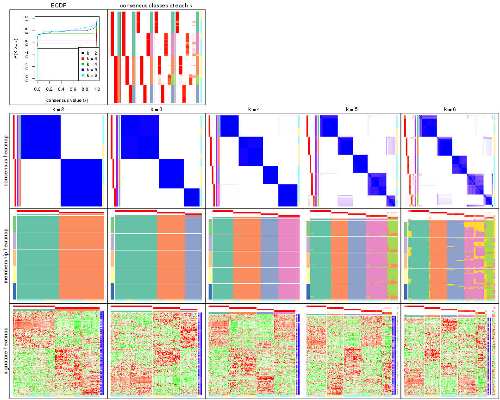

The plots are:

- The first row: a plot of the ECDF (empirical cumulative distribution
  function) curves of the consensus matrix for each `k` and the heatmap of
  predicted classes for each `k`.
- The second row: heatmaps of the consensus matrix for each `k`.
- The third row: heatmaps of the membership matrix for each `k`.
- The fouth row: heatmaps of the signatures for each `k`.

All the plots in panels can be made by individual functions and they are
plotted later in this section.

`select_partition_number()` produces several plots showing different
statistics for choosing "optimized" `k`. There are following statistics:

- ECDF curves of the consensus matrix for each `k`;
- 1-PAC. [The PAC
  score](https://en.wikipedia.org/wiki/Consensus_clustering#Over-interpretation_potential_of_consensus_clustering)
  measures the proportion of the ambiguous subgrouping.
- Mean silhouette score.
- Concordance. The mean probability of fiting the consensus class ids in all
  partitions.
- Area increased. Denote $A_k$ as the area under the ECDF curve for current
  `k`, the area increased is defined as $A_k - A_{k-1}$.
- Rand index. The percent of pairs of samples that are both in a same cluster
  or both are not in a same cluster in the partition of k and k-1.
- Jaccard index. The ratio of pairs of samples are both in a same cluster in
  the partition of k and k-1 and the pairs of samples are both in a same
  cluster in the partition k or k-1.

The detailed explanations of these statistics can be found in [the _cola_
vignette](http://bioconductor.org/packages/devel/bioc/vignettes/cola/inst/doc/cola.html#toc_13).

Generally speaking, lower PAC score, higher mean silhouette score or higher
concordance corresponds to better partition. Rand index and Jaccard index
measure how similar the current partition is compared to partition with `k-1`.
If they are too similar, we won't accept `k` is better than `k-1`.

```r
select_partition_number(res)
```


The numeric values for all these statistics can be obtained by `get_stats()`.

```r
get_stats(res)
```

```
#>   k 1-PAC mean_silhouette concordance area_increased  Rand Jaccard
#> 2 2 1.000           1.000       1.000         0.5051 0.495   0.495
#> 3 3 1.000           0.999       0.998         0.2506 0.873   0.744
#> 4 4 1.000           0.996       0.996         0.1871 0.881   0.678
#> 5 5 0.945           0.960       0.960         0.0584 0.952   0.810
#> 6 6 0.916           0.810       0.890         0.0288 0.985   0.926
```

`suggest_best_k()` suggests the best $k$ based on these statistics. The rules are as follows:

- All $k$ with Jaccard index larger than 0.95 are removed because increasing
  $k$ does not provide enough extra information. If all $k$ are removed, it is
  marked as no subgroup is detected.
- For all $k$ with 1-PAC score larger than 0.9, the maximal $k$ is taken as
  the best $k$, and other $k$ are marked as optional $k$.
- If it does not fit the second rule. The $k$ with the maximal vote of the
  highest 1-PAC score, highest mean silhouette, and highest concordance is
  taken as the best $k$.

```r
suggest_best_k(res)
```

```
#> [1] 6
#> attr(,"optional")
#> [1] 2 3 4 5
```

There is also optional best $k$ = 2 3 4 5 that is worth to check.

Following shows the table of the partitions (You need to click the **show/hide
code output** link to see it). The membership matrix (columns with name `p*`)
is inferred by
[`clue::cl_consensus()`](https://www.rdocumentation.org/link/cl_consensus?package=clue)
function with the `SE` method. Basically the value in the membership matrix
represents the probability to belong to a certain group. The finall class
label for an item is determined with the group with highest probability it
belongs to.

In `get_classes()` function, the entropy is calculated from the membership
matrix and the silhouette score is calculated from the consensus matrix.


<script>
$( function() {
	$( '#tabs-CV-skmeans-get-classes' ).tabs();
} );
</script>
<div id='tabs-CV-skmeans-get-classes'>
<ul>
<li><a href='#tab-CV-skmeans-get-classes-1'>k = 2</a></li>
<li><a href='#tab-CV-skmeans-get-classes-2'>k = 3</a></li>
<li><a href='#tab-CV-skmeans-get-classes-3'>k = 4</a></li>
<li><a href='#tab-CV-skmeans-get-classes-4'>k = 5</a></li>
<li><a href='#tab-CV-skmeans-get-classes-5'>k = 6</a></li>
</ul>

<div id='tab-CV-skmeans-get-classes-1'>
<p><a id='tab-CV-skmeans-get-classes-1-a' style='color:#0366d6' href='#'>show/hide code output</a></p>
<pre><code class="r">cbind(get_classes(res, k = 2), get_membership(res, k = 2))
</code></pre>

<pre><code>#&gt;           class entropy silhouette p1 p2
#&gt; GSM217644     2       0          1  0  1
#&gt; GSM217645     2       0          1  0  1
#&gt; GSM217646     2       0          1  0  1
#&gt; GSM217647     2       0          1  0  1
#&gt; GSM217648     2       0          1  0  1
#&gt; GSM217649     2       0          1  0  1
#&gt; GSM217650     2       0          1  0  1
#&gt; GSM217651     2       0          1  0  1
#&gt; GSM217652     2       0          1  0  1
#&gt; GSM217653     2       0          1  0  1
#&gt; GSM217654     2       0          1  0  1
#&gt; GSM217655     2       0          1  0  1
#&gt; GSM217656     2       0          1  0  1
#&gt; GSM217657     2       0          1  0  1
#&gt; GSM217658     2       0          1  0  1
#&gt; GSM217659     2       0          1  0  1
#&gt; GSM217660     2       0          1  0  1
#&gt; GSM217661     2       0          1  0  1
#&gt; GSM217662     2       0          1  0  1
#&gt; GSM217663     2       0          1  0  1
#&gt; GSM217664     2       0          1  0  1
#&gt; GSM217665     2       0          1  0  1
#&gt; GSM217666     2       0          1  0  1
#&gt; GSM217667     2       0          1  0  1
#&gt; GSM217668     1       0          1  1  0
#&gt; GSM217669     1       0          1  1  0
#&gt; GSM217670     1       0          1  1  0
#&gt; GSM217671     1       0          1  1  0
#&gt; GSM217672     1       0          1  1  0
#&gt; GSM217673     1       0          1  1  0
#&gt; GSM217674     1       0          1  1  0
#&gt; GSM217675     1       0          1  1  0
#&gt; GSM217676     1       0          1  1  0
#&gt; GSM217677     1       0          1  1  0
#&gt; GSM217678     1       0          1  1  0
#&gt; GSM217679     1       0          1  1  0
#&gt; GSM217680     1       0          1  1  0
#&gt; GSM217681     1       0          1  1  0
#&gt; GSM217682     1       0          1  1  0
#&gt; GSM217683     1       0          1  1  0
#&gt; GSM217684     1       0          1  1  0
#&gt; GSM217685     2       0          1  0  1
#&gt; GSM217686     2       0          1  0  1
#&gt; GSM217687     2       0          1  0  1
#&gt; GSM217688     2       0          1  0  1
#&gt; GSM217689     2       0          1  0  1
#&gt; GSM217690     2       0          1  0  1
#&gt; GSM217691     2       0          1  0  1
#&gt; GSM217692     2       0          1  0  1
#&gt; GSM217693     2       0          1  0  1
#&gt; GSM217694     2       0          1  0  1
#&gt; GSM217695     2       0          1  0  1
#&gt; GSM217696     2       0          1  0  1
#&gt; GSM217697     2       0          1  0  1
#&gt; GSM217698     2       0          1  0  1
#&gt; GSM217699     2       0          1  0  1
#&gt; GSM217700     2       0          1  0  1
#&gt; GSM217701     2       0          1  0  1
#&gt; GSM217702     2       0          1  0  1
#&gt; GSM217703     2       0          1  0  1
#&gt; GSM217704     2       0          1  0  1
#&gt; GSM217705     1       0          1  1  0
#&gt; GSM217706     1       0          1  1  0
#&gt; GSM217707     1       0          1  1  0
#&gt; GSM217708     1       0          1  1  0
#&gt; GSM217709     1       0          1  1  0
#&gt; GSM217710     1       0          1  1  0
#&gt; GSM217711     1       0          1  1  0
#&gt; GSM217712     1       0          1  1  0
#&gt; GSM217713     1       0          1  1  0
#&gt; GSM217714     1       0          1  1  0
#&gt; GSM217715     1       0          1  1  0
#&gt; GSM217716     1       0          1  1  0
#&gt; GSM217717     1       0          1  1  0
#&gt; GSM217718     1       0          1  1  0
#&gt; GSM217719     1       0          1  1  0
#&gt; GSM217720     1       0          1  1  0
#&gt; GSM217721     1       0          1  1  0
#&gt; GSM217722     1       0          1  1  0
#&gt; GSM217723     1       0          1  1  0
#&gt; GSM217724     1       0          1  1  0
#&gt; GSM217725     1       0          1  1  0
#&gt; GSM217726     1       0          1  1  0
#&gt; GSM217727     1       0          1  1  0
#&gt; GSM217728     1       0          1  1  0
#&gt; GSM217729     1       0          1  1  0
#&gt; GSM217730     1       0          1  1  0
#&gt; GSM217731     1       0          1  1  0
#&gt; GSM217732     1       0          1  1  0
#&gt; GSM217733     1       0          1  1  0
#&gt; GSM217734     1       0          1  1  0
#&gt; GSM217735     1       0          1  1  0
#&gt; GSM217736     1       0          1  1  0
#&gt; GSM217737     2       0          1  0  1
#&gt; GSM217738     2       0          1  0  1
#&gt; GSM217739     2       0          1  0  1
#&gt; GSM217740     2       0          1  0  1
#&gt; GSM217741     2       0          1  0  1
#&gt; GSM217742     2       0          1  0  1
#&gt; GSM217743     2       0          1  0  1
#&gt; GSM217744     2       0          1  0  1
</code></pre>

<script>
$('#tab-CV-skmeans-get-classes-1-a').parent().next().next().hide();
$('#tab-CV-skmeans-get-classes-1-a').click(function(){
  $('#tab-CV-skmeans-get-classes-1-a').parent().next().next().toggle();
  return(false);
});
</script>
</div>

<div id='tab-CV-skmeans-get-classes-2'>
<p><a id='tab-CV-skmeans-get-classes-2-a' style='color:#0366d6' href='#'>show/hide code output</a></p>
<pre><code class="r">cbind(get_classes(res, k = 3), get_membership(res, k = 3))
</code></pre>

<pre><code>#&gt;           class entropy silhouette    p1    p2    p3
#&gt; GSM217644     2  0.0000      1.000 0.000 1.000 0.000
#&gt; GSM217645     2  0.0000      1.000 0.000 1.000 0.000
#&gt; GSM217646     2  0.0000      1.000 0.000 1.000 0.000
#&gt; GSM217647     2  0.0000      1.000 0.000 1.000 0.000
#&gt; GSM217648     2  0.0000      1.000 0.000 1.000 0.000
#&gt; GSM217649     2  0.0000      1.000 0.000 1.000 0.000
#&gt; GSM217650     2  0.0000      1.000 0.000 1.000 0.000
#&gt; GSM217651     2  0.0000      1.000 0.000 1.000 0.000
#&gt; GSM217652     2  0.0000      1.000 0.000 1.000 0.000
#&gt; GSM217653     2  0.0000      1.000 0.000 1.000 0.000
#&gt; GSM217654     2  0.0000      1.000 0.000 1.000 0.000
#&gt; GSM217655     2  0.0000      1.000 0.000 1.000 0.000
#&gt; GSM217656     2  0.0000      1.000 0.000 1.000 0.000
#&gt; GSM217657     2  0.0000      1.000 0.000 1.000 0.000
#&gt; GSM217658     2  0.0000      1.000 0.000 1.000 0.000
#&gt; GSM217659     2  0.0000      1.000 0.000 1.000 0.000
#&gt; GSM217660     2  0.0000      1.000 0.000 1.000 0.000
#&gt; GSM217661     2  0.0000      1.000 0.000 1.000 0.000
#&gt; GSM217662     2  0.0000      1.000 0.000 1.000 0.000
#&gt; GSM217663     2  0.0000      1.000 0.000 1.000 0.000
#&gt; GSM217664     2  0.0000      1.000 0.000 1.000 0.000
#&gt; GSM217665     2  0.0000      1.000 0.000 1.000 0.000
#&gt; GSM217666     2  0.0000      1.000 0.000 1.000 0.000
#&gt; GSM217667     2  0.0000      1.000 0.000 1.000 0.000
#&gt; GSM217668     1  0.0000      0.998 1.000 0.000 0.000
#&gt; GSM217669     1  0.0000      0.998 1.000 0.000 0.000
#&gt; GSM217670     1  0.0000      0.998 1.000 0.000 0.000
#&gt; GSM217671     1  0.0000      0.998 1.000 0.000 0.000
#&gt; GSM217672     1  0.0000      0.998 1.000 0.000 0.000
#&gt; GSM217673     1  0.0000      0.998 1.000 0.000 0.000
#&gt; GSM217674     1  0.0237      0.998 0.996 0.000 0.004
#&gt; GSM217675     1  0.0237      0.998 0.996 0.000 0.004
#&gt; GSM217676     1  0.0237      0.998 0.996 0.000 0.004
#&gt; GSM217677     1  0.0237      0.998 0.996 0.000 0.004
#&gt; GSM217678     1  0.0237      0.998 0.996 0.000 0.004
#&gt; GSM217679     1  0.0237      0.998 0.996 0.000 0.004
#&gt; GSM217680     1  0.0237      0.998 0.996 0.000 0.004
#&gt; GSM217681     1  0.0237      0.998 0.996 0.000 0.004
#&gt; GSM217682     1  0.0237      0.998 0.996 0.000 0.004
#&gt; GSM217683     1  0.0237      0.998 0.996 0.000 0.004
#&gt; GSM217684     1  0.0000      0.998 1.000 0.000 0.000
#&gt; GSM217685     3  0.0237      1.000 0.000 0.004 0.996
#&gt; GSM217686     3  0.0237      1.000 0.000 0.004 0.996
#&gt; GSM217687     3  0.0237      1.000 0.000 0.004 0.996
#&gt; GSM217688     3  0.0237      1.000 0.000 0.004 0.996
#&gt; GSM217689     3  0.0237      1.000 0.000 0.004 0.996
#&gt; GSM217690     3  0.0237      1.000 0.000 0.004 0.996
#&gt; GSM217691     3  0.0237      1.000 0.000 0.004 0.996
#&gt; GSM217692     3  0.0237      1.000 0.000 0.004 0.996
#&gt; GSM217693     3  0.0237      1.000 0.000 0.004 0.996
#&gt; GSM217694     3  0.0237      1.000 0.000 0.004 0.996
#&gt; GSM217695     3  0.0237      1.000 0.000 0.004 0.996
#&gt; GSM217696     3  0.0237      1.000 0.000 0.004 0.996
#&gt; GSM217697     3  0.0237      1.000 0.000 0.004 0.996
#&gt; GSM217698     3  0.0237      1.000 0.000 0.004 0.996
#&gt; GSM217699     3  0.0237      1.000 0.000 0.004 0.996
#&gt; GSM217700     3  0.0237      1.000 0.000 0.004 0.996
#&gt; GSM217701     3  0.0237      1.000 0.000 0.004 0.996
#&gt; GSM217702     3  0.0237      1.000 0.000 0.004 0.996
#&gt; GSM217703     3  0.0237      1.000 0.000 0.004 0.996
#&gt; GSM217704     3  0.0237      1.000 0.000 0.004 0.996
#&gt; GSM217705     1  0.0000      0.998 1.000 0.000 0.000
#&gt; GSM217706     1  0.0000      0.998 1.000 0.000 0.000
#&gt; GSM217707     1  0.0000      0.998 1.000 0.000 0.000
#&gt; GSM217708     1  0.0000      0.998 1.000 0.000 0.000
#&gt; GSM217709     1  0.0000      0.998 1.000 0.000 0.000
#&gt; GSM217710     1  0.0000      0.998 1.000 0.000 0.000
#&gt; GSM217711     1  0.0000      0.998 1.000 0.000 0.000
#&gt; GSM217712     1  0.0000      0.998 1.000 0.000 0.000
#&gt; GSM217713     1  0.0000      0.998 1.000 0.000 0.000
#&gt; GSM217714     1  0.0000      0.998 1.000 0.000 0.000
#&gt; GSM217715     1  0.0000      0.998 1.000 0.000 0.000
#&gt; GSM217716     1  0.0000      0.998 1.000 0.000 0.000
#&gt; GSM217717     1  0.0000      0.998 1.000 0.000 0.000
#&gt; GSM217718     1  0.0000      0.998 1.000 0.000 0.000
#&gt; GSM217719     1  0.0000      0.998 1.000 0.000 0.000
#&gt; GSM217720     1  0.0000      0.998 1.000 0.000 0.000
#&gt; GSM217721     1  0.0000      0.998 1.000 0.000 0.000
#&gt; GSM217722     1  0.0000      0.998 1.000 0.000 0.000
#&gt; GSM217723     1  0.0000      0.998 1.000 0.000 0.000
#&gt; GSM217724     1  0.0237      0.998 0.996 0.000 0.004
#&gt; GSM217725     1  0.0237      0.998 0.996 0.000 0.004
#&gt; GSM217726     1  0.0237      0.998 0.996 0.000 0.004
#&gt; GSM217727     1  0.0237      0.998 0.996 0.000 0.004
#&gt; GSM217728     1  0.0237      0.998 0.996 0.000 0.004
#&gt; GSM217729     1  0.0237      0.998 0.996 0.000 0.004
#&gt; GSM217730     1  0.0237      0.998 0.996 0.000 0.004
#&gt; GSM217731     1  0.0237      0.998 0.996 0.000 0.004
#&gt; GSM217732     1  0.0237      0.998 0.996 0.000 0.004
#&gt; GSM217733     1  0.0237      0.998 0.996 0.000 0.004
#&gt; GSM217734     1  0.0237      0.998 0.996 0.000 0.004
#&gt; GSM217735     1  0.0237      0.998 0.996 0.000 0.004
#&gt; GSM217736     1  0.0237      0.998 0.996 0.000 0.004
#&gt; GSM217737     2  0.0000      1.000 0.000 1.000 0.000
#&gt; GSM217738     2  0.0000      1.000 0.000 1.000 0.000
#&gt; GSM217739     2  0.0000      1.000 0.000 1.000 0.000
#&gt; GSM217740     2  0.0000      1.000 0.000 1.000 0.000
#&gt; GSM217741     2  0.0000      1.000 0.000 1.000 0.000
#&gt; GSM217742     2  0.0000      1.000 0.000 1.000 0.000
#&gt; GSM217743     2  0.0000      1.000 0.000 1.000 0.000
#&gt; GSM217744     2  0.0000      1.000 0.000 1.000 0.000
</code></pre>

<script>
$('#tab-CV-skmeans-get-classes-2-a').parent().next().next().hide();
$('#tab-CV-skmeans-get-classes-2-a').click(function(){
  $('#tab-CV-skmeans-get-classes-2-a').parent().next().next().toggle();
  return(false);
});
</script>
</div>

<div id='tab-CV-skmeans-get-classes-3'>
<p><a id='tab-CV-skmeans-get-classes-3-a' style='color:#0366d6' href='#'>show/hide code output</a></p>
<pre><code class="r">cbind(get_classes(res, k = 4), get_membership(res, k = 4))
</code></pre>

<pre><code>#&gt;           class entropy silhouette    p1    p2 p3    p4
#&gt; GSM217644     2  0.0000      0.998 0.000 1.000  0 0.000
#&gt; GSM217645     2  0.0000      0.998 0.000 1.000  0 0.000
#&gt; GSM217646     2  0.0000      0.998 0.000 1.000  0 0.000
#&gt; GSM217647     2  0.0000      0.998 0.000 1.000  0 0.000
#&gt; GSM217648     2  0.0000      0.998 0.000 1.000  0 0.000
#&gt; GSM217649     2  0.0000      0.998 0.000 1.000  0 0.000
#&gt; GSM217650     2  0.0000      0.998 0.000 1.000  0 0.000
#&gt; GSM217651     2  0.0000      0.998 0.000 1.000  0 0.000
#&gt; GSM217652     2  0.0000      0.998 0.000 1.000  0 0.000
#&gt; GSM217653     2  0.0000      0.998 0.000 1.000  0 0.000
#&gt; GSM217654     2  0.0336      0.996 0.008 0.992  0 0.000
#&gt; GSM217655     2  0.0000      0.998 0.000 1.000  0 0.000
#&gt; GSM217656     2  0.0336      0.996 0.008 0.992  0 0.000
#&gt; GSM217657     2  0.0336      0.996 0.008 0.992  0 0.000
#&gt; GSM217658     2  0.0000      0.998 0.000 1.000  0 0.000
#&gt; GSM217659     2  0.0000      0.998 0.000 1.000  0 0.000
#&gt; GSM217660     2  0.0336      0.996 0.008 0.992  0 0.000
#&gt; GSM217661     2  0.0000      0.998 0.000 1.000  0 0.000
#&gt; GSM217662     2  0.0000      0.998 0.000 1.000  0 0.000
#&gt; GSM217663     2  0.0000      0.998 0.000 1.000  0 0.000
#&gt; GSM217664     2  0.0000      0.998 0.000 1.000  0 0.000
#&gt; GSM217665     2  0.0000      0.998 0.000 1.000  0 0.000
#&gt; GSM217666     2  0.0000      0.998 0.000 1.000  0 0.000
#&gt; GSM217667     2  0.0000      0.998 0.000 1.000  0 0.000
#&gt; GSM217668     4  0.0000      0.997 0.000 0.000  0 1.000
#&gt; GSM217669     4  0.0000      0.997 0.000 0.000  0 1.000
#&gt; GSM217670     4  0.0000      0.997 0.000 0.000  0 1.000
#&gt; GSM217671     4  0.0000      0.997 0.000 0.000  0 1.000
#&gt; GSM217672     4  0.0000      0.997 0.000 0.000  0 1.000
#&gt; GSM217673     4  0.0000      0.997 0.000 0.000  0 1.000
#&gt; GSM217674     1  0.0336      0.997 0.992 0.000  0 0.008
#&gt; GSM217675     1  0.0336      0.997 0.992 0.000  0 0.008
#&gt; GSM217676     1  0.0336      0.997 0.992 0.000  0 0.008
#&gt; GSM217677     1  0.0336      0.997 0.992 0.000  0 0.008
#&gt; GSM217678     1  0.0336      0.997 0.992 0.000  0 0.008
#&gt; GSM217679     1  0.0336      0.997 0.992 0.000  0 0.008
#&gt; GSM217680     1  0.0336      0.997 0.992 0.000  0 0.008
#&gt; GSM217681     1  0.0336      0.997 0.992 0.000  0 0.008
#&gt; GSM217682     1  0.0336      0.997 0.992 0.000  0 0.008
#&gt; GSM217683     1  0.0336      0.997 0.992 0.000  0 0.008
#&gt; GSM217684     4  0.1716      0.931 0.064 0.000  0 0.936
#&gt; GSM217685     3  0.0000      1.000 0.000 0.000  1 0.000
#&gt; GSM217686     3  0.0000      1.000 0.000 0.000  1 0.000
#&gt; GSM217687     3  0.0000      1.000 0.000 0.000  1 0.000
#&gt; GSM217688     3  0.0000      1.000 0.000 0.000  1 0.000
#&gt; GSM217689     3  0.0000      1.000 0.000 0.000  1 0.000
#&gt; GSM217690     3  0.0000      1.000 0.000 0.000  1 0.000
#&gt; GSM217691     3  0.0000      1.000 0.000 0.000  1 0.000
#&gt; GSM217692     3  0.0000      1.000 0.000 0.000  1 0.000
#&gt; GSM217693     3  0.0000      1.000 0.000 0.000  1 0.000
#&gt; GSM217694     3  0.0000      1.000 0.000 0.000  1 0.000
#&gt; GSM217695     3  0.0000      1.000 0.000 0.000  1 0.000
#&gt; GSM217696     3  0.0000      1.000 0.000 0.000  1 0.000
#&gt; GSM217697     3  0.0000      1.000 0.000 0.000  1 0.000
#&gt; GSM217698     3  0.0000      1.000 0.000 0.000  1 0.000
#&gt; GSM217699     3  0.0000      1.000 0.000 0.000  1 0.000
#&gt; GSM217700     3  0.0000      1.000 0.000 0.000  1 0.000
#&gt; GSM217701     3  0.0000      1.000 0.000 0.000  1 0.000
#&gt; GSM217702     3  0.0000      1.000 0.000 0.000  1 0.000
#&gt; GSM217703     3  0.0000      1.000 0.000 0.000  1 0.000
#&gt; GSM217704     3  0.0000      1.000 0.000 0.000  1 0.000
#&gt; GSM217705     4  0.0000      0.997 0.000 0.000  0 1.000
#&gt; GSM217706     4  0.0000      0.997 0.000 0.000  0 1.000
#&gt; GSM217707     4  0.0000      0.997 0.000 0.000  0 1.000
#&gt; GSM217708     4  0.0000      0.997 0.000 0.000  0 1.000
#&gt; GSM217709     4  0.0000      0.997 0.000 0.000  0 1.000
#&gt; GSM217710     4  0.0000      0.997 0.000 0.000  0 1.000
#&gt; GSM217711     4  0.0000      0.997 0.000 0.000  0 1.000
#&gt; GSM217712     4  0.0000      0.997 0.000 0.000  0 1.000
#&gt; GSM217713     4  0.0000      0.997 0.000 0.000  0 1.000
#&gt; GSM217714     4  0.0000      0.997 0.000 0.000  0 1.000
#&gt; GSM217715     4  0.0000      0.997 0.000 0.000  0 1.000
#&gt; GSM217716     4  0.0000      0.997 0.000 0.000  0 1.000
#&gt; GSM217717     4  0.0000      0.997 0.000 0.000  0 1.000
#&gt; GSM217718     4  0.0000      0.997 0.000 0.000  0 1.000
#&gt; GSM217719     4  0.0000      0.997 0.000 0.000  0 1.000
#&gt; GSM217720     4  0.0000      0.997 0.000 0.000  0 1.000
#&gt; GSM217721     4  0.0000      0.997 0.000 0.000  0 1.000
#&gt; GSM217722     4  0.0000      0.997 0.000 0.000  0 1.000
#&gt; GSM217723     1  0.1716      0.939 0.936 0.000  0 0.064
#&gt; GSM217724     1  0.0336      0.997 0.992 0.000  0 0.008
#&gt; GSM217725     1  0.0336      0.997 0.992 0.000  0 0.008
#&gt; GSM217726     1  0.0336      0.997 0.992 0.000  0 0.008
#&gt; GSM217727     1  0.0336      0.997 0.992 0.000  0 0.008
#&gt; GSM217728     1  0.0336      0.997 0.992 0.000  0 0.008
#&gt; GSM217729     1  0.0336      0.997 0.992 0.000  0 0.008
#&gt; GSM217730     1  0.0336      0.997 0.992 0.000  0 0.008
#&gt; GSM217731     1  0.0336      0.997 0.992 0.000  0 0.008
#&gt; GSM217732     1  0.0336      0.997 0.992 0.000  0 0.008
#&gt; GSM217733     1  0.0336      0.997 0.992 0.000  0 0.008
#&gt; GSM217734     1  0.0336      0.997 0.992 0.000  0 0.008
#&gt; GSM217735     1  0.0336      0.997 0.992 0.000  0 0.008
#&gt; GSM217736     1  0.0336      0.997 0.992 0.000  0 0.008
#&gt; GSM217737     2  0.0336      0.996 0.008 0.992  0 0.000
#&gt; GSM217738     2  0.0336      0.996 0.008 0.992  0 0.000
#&gt; GSM217739     2  0.0336      0.996 0.008 0.992  0 0.000
#&gt; GSM217740     2  0.0336      0.996 0.008 0.992  0 0.000
#&gt; GSM217741     2  0.0336      0.996 0.008 0.992  0 0.000
#&gt; GSM217742     2  0.0336      0.996 0.008 0.992  0 0.000
#&gt; GSM217743     2  0.0336      0.996 0.008 0.992  0 0.000
#&gt; GSM217744     2  0.0336      0.996 0.008 0.992  0 0.000
</code></pre>

<script>
$('#tab-CV-skmeans-get-classes-3-a').parent().next().next().hide();
$('#tab-CV-skmeans-get-classes-3-a').click(function(){
  $('#tab-CV-skmeans-get-classes-3-a').parent().next().next().toggle();
  return(false);
});
</script>
</div>

<div id='tab-CV-skmeans-get-classes-4'>
<p><a id='tab-CV-skmeans-get-classes-4-a' style='color:#0366d6' href='#'>show/hide code output</a></p>
<pre><code class="r">cbind(get_classes(res, k = 5), get_membership(res, k = 5))
</code></pre>

<pre><code>#&gt;           class entropy silhouette    p1    p2    p3    p4    p5
#&gt; GSM217644     2  0.0609      0.965 0.000 0.980 0.000 0.000 0.020
#&gt; GSM217645     2  0.0609      0.965 0.000 0.980 0.000 0.000 0.020
#&gt; GSM217646     2  0.0000      0.985 0.000 1.000 0.000 0.000 0.000
#&gt; GSM217647     2  0.0000      0.985 0.000 1.000 0.000 0.000 0.000
#&gt; GSM217648     2  0.0000      0.985 0.000 1.000 0.000 0.000 0.000
#&gt; GSM217649     2  0.0000      0.985 0.000 1.000 0.000 0.000 0.000
#&gt; GSM217650     2  0.0000      0.985 0.000 1.000 0.000 0.000 0.000
#&gt; GSM217651     2  0.0162      0.981 0.000 0.996 0.000 0.000 0.004
#&gt; GSM217652     2  0.0000      0.985 0.000 1.000 0.000 0.000 0.000
#&gt; GSM217653     2  0.0000      0.985 0.000 1.000 0.000 0.000 0.000
#&gt; GSM217654     5  0.3039      0.858 0.000 0.192 0.000 0.000 0.808
#&gt; GSM217655     2  0.3039      0.737 0.000 0.808 0.000 0.000 0.192
#&gt; GSM217656     5  0.1270      0.812 0.000 0.052 0.000 0.000 0.948
#&gt; GSM217657     5  0.1851      0.844 0.000 0.088 0.000 0.000 0.912
#&gt; GSM217658     2  0.0000      0.985 0.000 1.000 0.000 0.000 0.000
#&gt; GSM217659     2  0.0000      0.985 0.000 1.000 0.000 0.000 0.000
#&gt; GSM217660     5  0.4297      0.488 0.000 0.472 0.000 0.000 0.528
#&gt; GSM217661     2  0.0000      0.985 0.000 1.000 0.000 0.000 0.000
#&gt; GSM217662     2  0.0290      0.977 0.000 0.992 0.000 0.000 0.008
#&gt; GSM217663     2  0.0000      0.985 0.000 1.000 0.000 0.000 0.000
#&gt; GSM217664     2  0.0000      0.985 0.000 1.000 0.000 0.000 0.000
#&gt; GSM217665     2  0.0000      0.985 0.000 1.000 0.000 0.000 0.000
#&gt; GSM217666     2  0.0000      0.985 0.000 1.000 0.000 0.000 0.000
#&gt; GSM217667     2  0.0000      0.985 0.000 1.000 0.000 0.000 0.000
#&gt; GSM217668     4  0.1043      0.962 0.000 0.000 0.000 0.960 0.040
#&gt; GSM217669     4  0.1121      0.962 0.000 0.000 0.000 0.956 0.044
#&gt; GSM217670     4  0.1043      0.962 0.000 0.000 0.000 0.960 0.040
#&gt; GSM217671     4  0.1043      0.962 0.000 0.000 0.000 0.960 0.040
#&gt; GSM217672     4  0.1043      0.962 0.000 0.000 0.000 0.960 0.040
#&gt; GSM217673     4  0.1043      0.962 0.000 0.000 0.000 0.960 0.040
#&gt; GSM217674     1  0.0000      0.990 1.000 0.000 0.000 0.000 0.000
#&gt; GSM217675     1  0.0000      0.990 1.000 0.000 0.000 0.000 0.000
#&gt; GSM217676     1  0.0000      0.990 1.000 0.000 0.000 0.000 0.000
#&gt; GSM217677     1  0.0000      0.990 1.000 0.000 0.000 0.000 0.000
#&gt; GSM217678     1  0.0000      0.990 1.000 0.000 0.000 0.000 0.000
#&gt; GSM217679     1  0.0000      0.990 1.000 0.000 0.000 0.000 0.000
#&gt; GSM217680     1  0.0000      0.990 1.000 0.000 0.000 0.000 0.000
#&gt; GSM217681     1  0.0000      0.990 1.000 0.000 0.000 0.000 0.000
#&gt; GSM217682     1  0.0000      0.990 1.000 0.000 0.000 0.000 0.000
#&gt; GSM217683     1  0.0000      0.990 1.000 0.000 0.000 0.000 0.000
#&gt; GSM217684     4  0.3242      0.845 0.116 0.000 0.000 0.844 0.040
#&gt; GSM217685     3  0.0162      0.998 0.000 0.000 0.996 0.000 0.004
#&gt; GSM217686     3  0.0162      0.998 0.000 0.000 0.996 0.000 0.004
#&gt; GSM217687     3  0.0162      0.998 0.000 0.000 0.996 0.000 0.004
#&gt; GSM217688     3  0.0162      0.998 0.000 0.000 0.996 0.000 0.004
#&gt; GSM217689     3  0.0162      0.998 0.000 0.000 0.996 0.000 0.004
#&gt; GSM217690     3  0.0162      0.998 0.000 0.000 0.996 0.000 0.004
#&gt; GSM217691     3  0.0000      0.999 0.000 0.000 1.000 0.000 0.000
#&gt; GSM217692     3  0.0000      0.999 0.000 0.000 1.000 0.000 0.000
#&gt; GSM217693     3  0.0000      0.999 0.000 0.000 1.000 0.000 0.000
#&gt; GSM217694     3  0.0000      0.999 0.000 0.000 1.000 0.000 0.000
#&gt; GSM217695     3  0.0000      0.999 0.000 0.000 1.000 0.000 0.000
#&gt; GSM217696     3  0.0000      0.999 0.000 0.000 1.000 0.000 0.000
#&gt; GSM217697     3  0.0000      0.999 0.000 0.000 1.000 0.000 0.000
#&gt; GSM217698     3  0.0000      0.999 0.000 0.000 1.000 0.000 0.000
#&gt; GSM217699     3  0.0000      0.999 0.000 0.000 1.000 0.000 0.000
#&gt; GSM217700     3  0.0000      0.999 0.000 0.000 1.000 0.000 0.000
#&gt; GSM217701     3  0.0000      0.999 0.000 0.000 1.000 0.000 0.000
#&gt; GSM217702     3  0.0000      0.999 0.000 0.000 1.000 0.000 0.000
#&gt; GSM217703     3  0.0162      0.998 0.000 0.000 0.996 0.000 0.004
#&gt; GSM217704     3  0.0000      0.999 0.000 0.000 1.000 0.000 0.000
#&gt; GSM217705     4  0.0963      0.963 0.000 0.000 0.000 0.964 0.036
#&gt; GSM217706     4  0.0000      0.965 0.000 0.000 0.000 1.000 0.000
#&gt; GSM217707     4  0.0000      0.965 0.000 0.000 0.000 1.000 0.000
#&gt; GSM217708     4  0.1671      0.931 0.000 0.000 0.000 0.924 0.076
#&gt; GSM217709     4  0.1732      0.929 0.000 0.000 0.000 0.920 0.080
#&gt; GSM217710     4  0.2127      0.910 0.000 0.000 0.000 0.892 0.108
#&gt; GSM217711     4  0.2127      0.910 0.000 0.000 0.000 0.892 0.108
#&gt; GSM217712     4  0.0162      0.965 0.000 0.000 0.000 0.996 0.004
#&gt; GSM217713     4  0.0404      0.964 0.000 0.000 0.000 0.988 0.012
#&gt; GSM217714     4  0.0794      0.964 0.000 0.000 0.000 0.972 0.028
#&gt; GSM217715     4  0.0880      0.964 0.000 0.000 0.000 0.968 0.032
#&gt; GSM217716     4  0.0510      0.965 0.000 0.000 0.000 0.984 0.016
#&gt; GSM217717     4  0.0404      0.964 0.000 0.000 0.000 0.988 0.012
#&gt; GSM217718     4  0.0404      0.964 0.000 0.000 0.000 0.988 0.012
#&gt; GSM217719     4  0.0404      0.964 0.000 0.000 0.000 0.988 0.012
#&gt; GSM217720     4  0.1043      0.962 0.000 0.000 0.000 0.960 0.040
#&gt; GSM217721     4  0.0404      0.964 0.000 0.000 0.000 0.988 0.012
#&gt; GSM217722     4  0.0162      0.965 0.000 0.000 0.000 0.996 0.004
#&gt; GSM217723     1  0.2580      0.898 0.892 0.000 0.000 0.044 0.064
#&gt; GSM217724     1  0.0609      0.977 0.980 0.000 0.000 0.000 0.020
#&gt; GSM217725     1  0.1478      0.943 0.936 0.000 0.000 0.000 0.064
#&gt; GSM217726     1  0.0000      0.990 1.000 0.000 0.000 0.000 0.000
#&gt; GSM217727     1  0.0000      0.990 1.000 0.000 0.000 0.000 0.000
#&gt; GSM217728     1  0.1197      0.957 0.952 0.000 0.000 0.000 0.048
#&gt; GSM217729     1  0.0000      0.990 1.000 0.000 0.000 0.000 0.000
#&gt; GSM217730     1  0.0000      0.990 1.000 0.000 0.000 0.000 0.000
#&gt; GSM217731     1  0.0000      0.990 1.000 0.000 0.000 0.000 0.000
#&gt; GSM217732     1  0.0000      0.990 1.000 0.000 0.000 0.000 0.000
#&gt; GSM217733     1  0.0000      0.990 1.000 0.000 0.000 0.000 0.000
#&gt; GSM217734     1  0.0000      0.990 1.000 0.000 0.000 0.000 0.000
#&gt; GSM217735     1  0.0000      0.990 1.000 0.000 0.000 0.000 0.000
#&gt; GSM217736     1  0.0000      0.990 1.000 0.000 0.000 0.000 0.000
#&gt; GSM217737     5  0.2929      0.903 0.000 0.180 0.000 0.000 0.820
#&gt; GSM217738     5  0.2966      0.905 0.000 0.184 0.000 0.000 0.816
#&gt; GSM217739     5  0.3074      0.907 0.000 0.196 0.000 0.000 0.804
#&gt; GSM217740     5  0.3074      0.907 0.000 0.196 0.000 0.000 0.804
#&gt; GSM217741     5  0.3424      0.895 0.000 0.240 0.000 0.000 0.760
#&gt; GSM217742     5  0.3336      0.900 0.000 0.228 0.000 0.000 0.772
#&gt; GSM217743     5  0.3452      0.892 0.000 0.244 0.000 0.000 0.756
#&gt; GSM217744     5  0.3452      0.892 0.000 0.244 0.000 0.000 0.756
</code></pre>

<script>
$('#tab-CV-skmeans-get-classes-4-a').parent().next().next().hide();
$('#tab-CV-skmeans-get-classes-4-a').click(function(){
  $('#tab-CV-skmeans-get-classes-4-a').parent().next().next().toggle();
  return(false);
});
</script>
</div>

<div id='tab-CV-skmeans-get-classes-5'>
<p><a id='tab-CV-skmeans-get-classes-5-a' style='color:#0366d6' href='#'>show/hide code output</a></p>
<pre><code class="r">cbind(get_classes(res, k = 6), get_membership(res, k = 6))
</code></pre>

<pre><code>#&gt;           class entropy silhouette    p1    p2    p3    p4    p5    p6
#&gt; GSM217644     2  0.0603     0.9351 0.000 0.980 0.000 0.000 0.004 0.016
#&gt; GSM217645     2  0.0717     0.9316 0.000 0.976 0.000 0.000 0.008 0.016
#&gt; GSM217646     2  0.0000     0.9494 0.000 1.000 0.000 0.000 0.000 0.000
#&gt; GSM217647     2  0.0000     0.9494 0.000 1.000 0.000 0.000 0.000 0.000
#&gt; GSM217648     2  0.0000     0.9494 0.000 1.000 0.000 0.000 0.000 0.000
#&gt; GSM217649     2  0.0000     0.9494 0.000 1.000 0.000 0.000 0.000 0.000
#&gt; GSM217650     2  0.0000     0.9494 0.000 1.000 0.000 0.000 0.000 0.000
#&gt; GSM217651     2  0.0146     0.9465 0.000 0.996 0.000 0.000 0.004 0.000
#&gt; GSM217652     2  0.0000     0.9494 0.000 1.000 0.000 0.000 0.000 0.000
#&gt; GSM217653     2  0.0000     0.9494 0.000 1.000 0.000 0.000 0.000 0.000
#&gt; GSM217654     5  0.5451     0.5941 0.000 0.136 0.000 0.000 0.524 0.340
#&gt; GSM217655     2  0.5396     0.3526 0.000 0.564 0.000 0.000 0.152 0.284
#&gt; GSM217656     5  0.3986     0.5593 0.000 0.004 0.000 0.000 0.532 0.464
#&gt; GSM217657     5  0.4047     0.6323 0.000 0.012 0.000 0.000 0.604 0.384
#&gt; GSM217658     2  0.0000     0.9494 0.000 1.000 0.000 0.000 0.000 0.000
#&gt; GSM217659     2  0.0000     0.9494 0.000 1.000 0.000 0.000 0.000 0.000
#&gt; GSM217660     2  0.3961     0.0578 0.000 0.556 0.000 0.000 0.440 0.004
#&gt; GSM217661     2  0.0000     0.9494 0.000 1.000 0.000 0.000 0.000 0.000
#&gt; GSM217662     2  0.0260     0.9432 0.000 0.992 0.000 0.000 0.008 0.000
#&gt; GSM217663     2  0.0000     0.9494 0.000 1.000 0.000 0.000 0.000 0.000
#&gt; GSM217664     2  0.0000     0.9494 0.000 1.000 0.000 0.000 0.000 0.000
#&gt; GSM217665     2  0.0000     0.9494 0.000 1.000 0.000 0.000 0.000 0.000
#&gt; GSM217666     2  0.0000     0.9494 0.000 1.000 0.000 0.000 0.000 0.000
#&gt; GSM217667     2  0.0000     0.9494 0.000 1.000 0.000 0.000 0.000 0.000
#&gt; GSM217668     4  0.1643     0.6643 0.000 0.000 0.000 0.924 0.008 0.068
#&gt; GSM217669     4  0.2389     0.5963 0.000 0.000 0.000 0.864 0.008 0.128
#&gt; GSM217670     4  0.1701     0.6670 0.000 0.000 0.000 0.920 0.008 0.072
#&gt; GSM217671     4  0.1812     0.6645 0.000 0.000 0.000 0.912 0.008 0.080
#&gt; GSM217672     4  0.1643     0.6643 0.000 0.000 0.000 0.924 0.008 0.068
#&gt; GSM217673     4  0.1584     0.6661 0.000 0.000 0.000 0.928 0.008 0.064
#&gt; GSM217674     1  0.0291     0.9519 0.992 0.000 0.000 0.000 0.004 0.004
#&gt; GSM217675     1  0.0291     0.9519 0.992 0.000 0.000 0.000 0.004 0.004
#&gt; GSM217676     1  0.0291     0.9519 0.992 0.000 0.000 0.000 0.004 0.004
#&gt; GSM217677     1  0.0000     0.9532 1.000 0.000 0.000 0.000 0.000 0.000
#&gt; GSM217678     1  0.0000     0.9532 1.000 0.000 0.000 0.000 0.000 0.000
#&gt; GSM217679     1  0.0000     0.9532 1.000 0.000 0.000 0.000 0.000 0.000
#&gt; GSM217680     1  0.0000     0.9532 1.000 0.000 0.000 0.000 0.000 0.000
#&gt; GSM217681     1  0.0000     0.9532 1.000 0.000 0.000 0.000 0.000 0.000
#&gt; GSM217682     1  0.0291     0.9519 0.992 0.000 0.000 0.000 0.004 0.004
#&gt; GSM217683     1  0.0291     0.9519 0.992 0.000 0.000 0.000 0.004 0.004
#&gt; GSM217684     4  0.3272     0.5315 0.076 0.000 0.000 0.836 0.008 0.080
#&gt; GSM217685     3  0.0790     0.9622 0.000 0.000 0.968 0.000 0.000 0.032
#&gt; GSM217686     3  0.0790     0.9622 0.000 0.000 0.968 0.000 0.000 0.032
#&gt; GSM217687     3  0.0790     0.9622 0.000 0.000 0.968 0.000 0.000 0.032
#&gt; GSM217688     3  0.0790     0.9622 0.000 0.000 0.968 0.000 0.000 0.032
#&gt; GSM217689     3  0.0865     0.9608 0.000 0.000 0.964 0.000 0.000 0.036
#&gt; GSM217690     3  0.0865     0.9608 0.000 0.000 0.964 0.000 0.000 0.036
#&gt; GSM217691     3  0.1141     0.9660 0.000 0.000 0.948 0.000 0.000 0.052
#&gt; GSM217692     3  0.1141     0.9660 0.000 0.000 0.948 0.000 0.000 0.052
#&gt; GSM217693     3  0.1141     0.9660 0.000 0.000 0.948 0.000 0.000 0.052
#&gt; GSM217694     3  0.1141     0.9660 0.000 0.000 0.948 0.000 0.000 0.052
#&gt; GSM217695     3  0.1141     0.9660 0.000 0.000 0.948 0.000 0.000 0.052
#&gt; GSM217696     3  0.1141     0.9660 0.000 0.000 0.948 0.000 0.000 0.052
#&gt; GSM217697     3  0.1141     0.9660 0.000 0.000 0.948 0.000 0.000 0.052
#&gt; GSM217698     3  0.1141     0.9660 0.000 0.000 0.948 0.000 0.000 0.052
#&gt; GSM217699     3  0.0000     0.9677 0.000 0.000 1.000 0.000 0.000 0.000
#&gt; GSM217700     3  0.0260     0.9680 0.000 0.000 0.992 0.000 0.000 0.008
#&gt; GSM217701     3  0.0146     0.9674 0.000 0.000 0.996 0.000 0.000 0.004
#&gt; GSM217702     3  0.0146     0.9674 0.000 0.000 0.996 0.000 0.000 0.004
#&gt; GSM217703     3  0.0865     0.9608 0.000 0.000 0.964 0.000 0.000 0.036
#&gt; GSM217704     3  0.1141     0.9660 0.000 0.000 0.948 0.000 0.000 0.052
#&gt; GSM217705     4  0.1643     0.6811 0.000 0.000 0.000 0.924 0.008 0.068
#&gt; GSM217706     4  0.2219     0.6409 0.000 0.000 0.000 0.864 0.000 0.136
#&gt; GSM217707     4  0.2442     0.6338 0.000 0.000 0.000 0.852 0.004 0.144
#&gt; GSM217708     4  0.3857    -0.7430 0.000 0.000 0.000 0.532 0.000 0.468
#&gt; GSM217709     4  0.3860    -0.7482 0.000 0.000 0.000 0.528 0.000 0.472
#&gt; GSM217710     6  0.3971     0.9768 0.000 0.000 0.000 0.448 0.004 0.548
#&gt; GSM217711     6  0.3961     0.9772 0.000 0.000 0.000 0.440 0.004 0.556
#&gt; GSM217712     4  0.2562     0.6119 0.000 0.000 0.000 0.828 0.000 0.172
#&gt; GSM217713     4  0.2814     0.6105 0.000 0.000 0.000 0.820 0.008 0.172
#&gt; GSM217714     4  0.1007     0.6837 0.000 0.000 0.000 0.956 0.000 0.044
#&gt; GSM217715     4  0.0865     0.6832 0.000 0.000 0.000 0.964 0.000 0.036
#&gt; GSM217716     4  0.2593     0.6319 0.000 0.000 0.000 0.844 0.008 0.148
#&gt; GSM217717     4  0.2915     0.5933 0.000 0.000 0.000 0.808 0.008 0.184
#&gt; GSM217718     4  0.3217     0.5248 0.000 0.000 0.000 0.768 0.008 0.224
#&gt; GSM217719     4  0.3190     0.5451 0.000 0.000 0.000 0.772 0.008 0.220
#&gt; GSM217720     4  0.1524     0.6786 0.000 0.000 0.000 0.932 0.008 0.060
#&gt; GSM217721     4  0.2933     0.5717 0.000 0.000 0.000 0.796 0.004 0.200
#&gt; GSM217722     4  0.2838     0.5808 0.000 0.000 0.000 0.808 0.004 0.188
#&gt; GSM217723     1  0.4330     0.5705 0.632 0.000 0.000 0.036 0.000 0.332
#&gt; GSM217724     1  0.2738     0.8191 0.820 0.000 0.000 0.000 0.004 0.176
#&gt; GSM217725     1  0.3351     0.6963 0.712 0.000 0.000 0.000 0.000 0.288
#&gt; GSM217726     1  0.0291     0.9519 0.992 0.000 0.000 0.000 0.004 0.004
#&gt; GSM217727     1  0.0291     0.9519 0.992 0.000 0.000 0.000 0.004 0.004
#&gt; GSM217728     1  0.3175     0.7337 0.744 0.000 0.000 0.000 0.000 0.256
#&gt; GSM217729     1  0.0146     0.9522 0.996 0.000 0.000 0.000 0.000 0.004
#&gt; GSM217730     1  0.0146     0.9522 0.996 0.000 0.000 0.000 0.000 0.004
#&gt; GSM217731     1  0.0146     0.9522 0.996 0.000 0.000 0.000 0.000 0.004
#&gt; GSM217732     1  0.0000     0.9532 1.000 0.000 0.000 0.000 0.000 0.000
#&gt; GSM217733     1  0.0000     0.9532 1.000 0.000 0.000 0.000 0.000 0.000
#&gt; GSM217734     1  0.0000     0.9532 1.000 0.000 0.000 0.000 0.000 0.000
#&gt; GSM217735     1  0.0000     0.9532 1.000 0.000 0.000 0.000 0.000 0.000
#&gt; GSM217736     1  0.0000     0.9532 1.000 0.000 0.000 0.000 0.000 0.000
#&gt; GSM217737     5  0.1387     0.8591 0.000 0.068 0.000 0.000 0.932 0.000
#&gt; GSM217738     5  0.1387     0.8591 0.000 0.068 0.000 0.000 0.932 0.000
#&gt; GSM217739     5  0.1610     0.8646 0.000 0.084 0.000 0.000 0.916 0.000
#&gt; GSM217740     5  0.1610     0.8646 0.000 0.084 0.000 0.000 0.916 0.000
#&gt; GSM217741     5  0.1957     0.8590 0.000 0.112 0.000 0.000 0.888 0.000
#&gt; GSM217742     5  0.1814     0.8630 0.000 0.100 0.000 0.000 0.900 0.000
#&gt; GSM217743     5  0.1957     0.8590 0.000 0.112 0.000 0.000 0.888 0.000
#&gt; GSM217744     5  0.1957     0.8590 0.000 0.112 0.000 0.000 0.888 0.000
</code></pre>

<script>
$('#tab-CV-skmeans-get-classes-5-a').parent().next().next().hide();
$('#tab-CV-skmeans-get-classes-5-a').click(function(){
  $('#tab-CV-skmeans-get-classes-5-a').parent().next().next().toggle();
  return(false);
});
</script>
</div>
</div>

Heatmaps for the consensus matrix. It visualizes the probability of two
samples to be in a same group.


<script>
$( function() {
	$( '#tabs-CV-skmeans-consensus-heatmap' ).tabs();
} );
</script>
<div id='tabs-CV-skmeans-consensus-heatmap'>
<ul>
<li><a href='#tab-CV-skmeans-consensus-heatmap-1'>k = 2</a></li>
<li><a href='#tab-CV-skmeans-consensus-heatmap-2'>k = 3</a></li>
<li><a href='#tab-CV-skmeans-consensus-heatmap-3'>k = 4</a></li>
<li><a href='#tab-CV-skmeans-consensus-heatmap-4'>k = 5</a></li>
<li><a href='#tab-CV-skmeans-consensus-heatmap-5'>k = 6</a></li>
</ul>
<div id='tab-CV-skmeans-consensus-heatmap-1'>
<pre><code class="r">consensus_heatmap(res, k = 2)
</code></pre>

<p></p>

</div>
<div id='tab-CV-skmeans-consensus-heatmap-2'>
<pre><code class="r">consensus_heatmap(res, k = 3)
</code></pre>

<p></p>

</div>
<div id='tab-CV-skmeans-consensus-heatmap-3'>
<pre><code class="r">consensus_heatmap(res, k = 4)
</code></pre>

<p></p>

</div>
<div id='tab-CV-skmeans-consensus-heatmap-4'>
<pre><code class="r">consensus_heatmap(res, k = 5)
</code></pre>

<p></p>

</div>
<div id='tab-CV-skmeans-consensus-heatmap-5'>
<pre><code class="r">consensus_heatmap(res, k = 6)
</code></pre>

<p></p>

</div>
</div>

Heatmaps for the membership of samples in all partitions to see how consistent they are:


<script>
$( function() {
	$( '#tabs-CV-skmeans-membership-heatmap' ).tabs();
} );
</script>
<div id='tabs-CV-skmeans-membership-heatmap'>
<ul>
<li><a href='#tab-CV-skmeans-membership-heatmap-1'>k = 2</a></li>
<li><a href='#tab-CV-skmeans-membership-heatmap-2'>k = 3</a></li>
<li><a href='#tab-CV-skmeans-membership-heatmap-3'>k = 4</a></li>
<li><a href='#tab-CV-skmeans-membership-heatmap-4'>k = 5</a></li>
<li><a href='#tab-CV-skmeans-membership-heatmap-5'>k = 6</a></li>
</ul>
<div id='tab-CV-skmeans-membership-heatmap-1'>
<pre><code class="r">membership_heatmap(res, k = 2)
</code></pre>

<p></p>

</div>
<div id='tab-CV-skmeans-membership-heatmap-2'>
<pre><code class="r">membership_heatmap(res, k = 3)
</code></pre>

<p></p>

</div>
<div id='tab-CV-skmeans-membership-heatmap-3'>
<pre><code class="r">membership_heatmap(res, k = 4)
</code></pre>

<p></p>

</div>
<div id='tab-CV-skmeans-membership-heatmap-4'>
<pre><code class="r">membership_heatmap(res, k = 5)
</code></pre>

<p></p>

</div>
<div id='tab-CV-skmeans-membership-heatmap-5'>
<pre><code class="r">membership_heatmap(res, k = 6)
</code></pre>

<p></p>

</div>
</div>

As soon as we have had the classes for columns, we can look for signatures
which are significantly different between classes which can be candidate marks
for certain classes. Following are the heatmaps for signatures.


Signature heatmaps where rows are scaled:


<script>
$( function() {
	$( '#tabs-CV-skmeans-get-signatures' ).tabs();
} );
</script>
<div id='tabs-CV-skmeans-get-signatures'>
<ul>
<li><a href='#tab-CV-skmeans-get-signatures-1'>k = 2</a></li>
<li><a href='#tab-CV-skmeans-get-signatures-2'>k = 3</a></li>
<li><a href='#tab-CV-skmeans-get-signatures-3'>k = 4</a></li>
<li><a href='#tab-CV-skmeans-get-signatures-4'>k = 5</a></li>
<li><a href='#tab-CV-skmeans-get-signatures-5'>k = 6</a></li>
</ul>
<div id='tab-CV-skmeans-get-signatures-1'>
<pre><code class="r">get_signatures(res, k = 2)
</code></pre>

<p></p>

</div>
<div id='tab-CV-skmeans-get-signatures-2'>
<pre><code class="r">get_signatures(res, k = 3)
</code></pre>

<p></p>

</div>
<div id='tab-CV-skmeans-get-signatures-3'>
<pre><code class="r">get_signatures(res, k = 4)
</code></pre>

<p></p>

</div>
<div id='tab-CV-skmeans-get-signatures-4'>
<pre><code class="r">get_signatures(res, k = 5)
</code></pre>

<p></p>

</div>
<div id='tab-CV-skmeans-get-signatures-5'>
<pre><code class="r">get_signatures(res, k = 6)
</code></pre>

<p></p>

</div>
</div>


Signature heatmaps where rows are not scaled:


<script>
$( function() {
	$( '#tabs-CV-skmeans-get-signatures-no-scale' ).tabs();
} );
</script>
<div id='tabs-CV-skmeans-get-signatures-no-scale'>
<ul>
<li><a href='#tab-CV-skmeans-get-signatures-no-scale-1'>k = 2</a></li>
<li><a href='#tab-CV-skmeans-get-signatures-no-scale-2'>k = 3</a></li>
<li><a href='#tab-CV-skmeans-get-signatures-no-scale-3'>k = 4</a></li>
<li><a href='#tab-CV-skmeans-get-signatures-no-scale-4'>k = 5</a></li>
<li><a href='#tab-CV-skmeans-get-signatures-no-scale-5'>k = 6</a></li>
</ul>
<div id='tab-CV-skmeans-get-signatures-no-scale-1'>
<pre><code class="r">get_signatures(res, k = 2, scale_rows = FALSE)
</code></pre>

<p></p>

</div>
<div id='tab-CV-skmeans-get-signatures-no-scale-2'>
<pre><code class="r">get_signatures(res, k = 3, scale_rows = FALSE)
</code></pre>

<p></p>

</div>
<div id='tab-CV-skmeans-get-signatures-no-scale-3'>
<pre><code class="r">get_signatures(res, k = 4, scale_rows = FALSE)
</code></pre>

<p></p>

</div>
<div id='tab-CV-skmeans-get-signatures-no-scale-4'>
<pre><code class="r">get_signatures(res, k = 5, scale_rows = FALSE)
</code></pre>

<p></p>

</div>
<div id='tab-CV-skmeans-get-signatures-no-scale-5'>
<pre><code class="r">get_signatures(res, k = 6, scale_rows = FALSE)
</code></pre>

<p></p>

</div>
</div>


Compare the overlap of signatures from different k:

```r
compare_signatures(res)
```


`get_signature()` returns a data frame invisibly. TO get the list of signatures, the function
call should be assigned to a variable explicitly. In following code, if `plot` argument is set
to `FALSE`, no heatmap is plotted while only the differential analysis is performed.

```r
# code only for demonstration
tb = get_signature(res, k = ..., plot = FALSE)
```

An example of the output of `tb` is:

```
#>   which_row         fdr    mean_1    mean_2 scaled_mean_1 scaled_mean_2 km
#> 1        38 0.042760348  8.373488  9.131774    -0.5533452     0.5164555  1
#> 2        40 0.018707592  7.106213  8.469186    -0.6173731     0.5762149  1
#> 3        55 0.019134737 10.221463 11.207825    -0.6159697     0.5749050  1
#> 4        59 0.006059896  5.921854  7.869574    -0.6899429     0.6439467  1
#> 5        60 0.018055526  8.928898 10.211722    -0.6204761     0.5791110  1
#> 6        98 0.009384629 15.714769 14.887706     0.6635654    -0.6193277  2
...
```

The columns in `tb` are:

1. `which_row`: row indices corresponding to the input matrix.
2. `fdr`: FDR for the differential test. 
3. `mean_x`: The mean value in group x.
4. `scaled_mean_x`: The mean value in group x after rows are scaled.
5. `km`: Row groups if k-means clustering is applied to rows.


UMAP plot which shows how samples are separated.


<script>
$( function() {
	$( '#tabs-CV-skmeans-dimension-reduction' ).tabs();
} );
</script>
<div id='tabs-CV-skmeans-dimension-reduction'>
<ul>
<li><a href='#tab-CV-skmeans-dimension-reduction-1'>k = 2</a></li>
<li><a href='#tab-CV-skmeans-dimension-reduction-2'>k = 3</a></li>
<li><a href='#tab-CV-skmeans-dimension-reduction-3'>k = 4</a></li>
<li><a href='#tab-CV-skmeans-dimension-reduction-4'>k = 5</a></li>
<li><a href='#tab-CV-skmeans-dimension-reduction-5'>k = 6</a></li>
</ul>
<div id='tab-CV-skmeans-dimension-reduction-1'>
<pre><code class="r">dimension_reduction(res, k = 2, method = &quot;UMAP&quot;)
</code></pre>

<p></p>

</div>
<div id='tab-CV-skmeans-dimension-reduction-2'>
<pre><code class="r">dimension_reduction(res, k = 3, method = &quot;UMAP&quot;)
</code></pre>

<p></p>

</div>
<div id='tab-CV-skmeans-dimension-reduction-3'>
<pre><code class="r">dimension_reduction(res, k = 4, method = &quot;UMAP&quot;)
</code></pre>

<p></p>

</div>
<div id='tab-CV-skmeans-dimension-reduction-4'>
<pre><code class="r">dimension_reduction(res, k = 5, method = &quot;UMAP&quot;)
</code></pre>

<p></p>

</div>
<div id='tab-CV-skmeans-dimension-reduction-5'>
<pre><code class="r">dimension_reduction(res, k = 6, method = &quot;UMAP&quot;)
</code></pre>

<p></p>

</div>
</div>


Following heatmap shows how subgroups are split when increasing `k`:

```r
collect_classes(res)
```


Test correlation between subgroups and known annotations. If the known
annotation is numeric, one-way ANOVA test is applied, and if the known
annotation is discrete, chi-squared contingency table test is applied.

```r
test_to_known_factors(res)
```

```
#>              n disease.state(p) k
#> CV:skmeans 101         3.32e-01 2
#> CV:skmeans 101         2.94e-07 3
#> CV:skmeans 101         8.38e-07 4
#> CV:skmeans 100         2.98e-09 5
#> CV:skmeans  97         2.06e-08 6
```


If matrix rows can be associated to genes, consider to use `functional_enrichment(res,
...)` to perform function enrichment for the signature genes. See [this vignette](http://bioconductor.org/packages/devel/bioc/vignettes/cola/inst/doc/functional_enrichment.html) for more detailed explanations.


 

---------------------------------------------------


### CV:pam**


The object with results only for a single top-value method and a single partition method 
can be extracted as:

```r
res = res_list["CV", "pam"]
# you can also extract it by
# res = res_list["CV:pam"]
```

A summary of `res` and all the functions that can be applied to it:

```r
res
```

```
#> A 'ConsensusPartition' object with k = 2, 3, 4, 5, 6.
#>   On a matrix with 3925 rows and 101 columns.
#>   Top rows (392, 784, 1177, 1570, 1962) are extracted by 'CV' method.
#>   Subgroups are detected by 'pam' method.
#>   Performed in total 1250 partitions by row resampling.
#>   Best k for subgroups seems to be 5.
#> 
#> Following methods can be applied to this 'ConsensusPartition' object:
#>  [1] "cola_report"             "collect_classes"         "collect_plots"          
#>  [4] "collect_stats"           "colnames"                "compare_signatures"     
#>  [7] "consensus_heatmap"       "dimension_reduction"     "functional_enrichment"  
#> [10] "get_anno_col"            "get_anno"                "get_classes"            
#> [13] "get_consensus"           "get_matrix"              "get_membership"         
#> [16] "get_param"               "get_signatures"          "get_stats"              
#> [19] "is_best_k"               "is_stable_k"             "membership_heatmap"     
#> [22] "ncol"                    "nrow"                    "plot_ecdf"              
#> [25] "rownames"                "select_partition_number" "show"                   
#> [28] "suggest_best_k"          "test_to_known_factors"
```

`collect_plots()` function collects all the plots made from `res` for all `k` (number of partitions)
into one single page to provide an easy and fast comparison between different `k`.

```r
collect_plots(res)
```


The plots are:

- The first row: a plot of the ECDF (empirical cumulative distribution
  function) curves of the consensus matrix for each `k` and the heatmap of
  predicted classes for each `k`.
- The second row: heatmaps of the consensus matrix for each `k`.
- The third row: heatmaps of the membership matrix for each `k`.
- The fouth row: heatmaps of the signatures for each `k`.

All the plots in panels can be made by individual functions and they are
plotted later in this section.

`select_partition_number()` produces several plots showing different
statistics for choosing "optimized" `k`. There are following statistics:

- ECDF curves of the consensus matrix for each `k`;
- 1-PAC. [The PAC
  score](https://en.wikipedia.org/wiki/Consensus_clustering#Over-interpretation_potential_of_consensus_clustering)
  measures the proportion of the ambiguous subgrouping.
- Mean silhouette score.
- Concordance. The mean probability of fiting the consensus class ids in all
  partitions.
- Area increased. Denote $A_k$ as the area under the ECDF curve for current
  `k`, the area increased is defined as $A_k - A_{k-1}$.
- Rand index. The percent of pairs of samples that are both in a same cluster
  or both are not in a same cluster in the partition of k and k-1.
- Jaccard index. The ratio of pairs of samples are both in a same cluster in
  the partition of k and k-1 and the pairs of samples are both in a same
  cluster in the partition k or k-1.

The detailed explanations of these statistics can be found in [the _cola_
vignette](http://bioconductor.org/packages/devel/bioc/vignettes/cola/inst/doc/cola.html#toc_13).

Generally speaking, lower PAC score, higher mean silhouette score or higher
concordance corresponds to better partition. Rand index and Jaccard index
measure how similar the current partition is compared to partition with `k-1`.
If they are too similar, we won't accept `k` is better than `k-1`.

```r
select_partition_number(res)
```


The numeric values for all these statistics can be obtained by `get_stats()`.

```r
get_stats(res)
```

```
#>   k 1-PAC mean_silhouette concordance area_increased  Rand Jaccard
#> 2 2 0.661           0.890       0.946         0.4277 0.578   0.578
#> 3 3 1.000           0.983       0.993         0.4781 0.703   0.523
#> 4 4 0.987           0.938       0.975         0.1885 0.859   0.629
#> 5 5 0.964           0.914       0.965         0.0487 0.946   0.791
#> 6 6 0.856           0.811       0.890         0.0364 0.978   0.899
```

`suggest_best_k()` suggests the best $k$ based on these statistics. The rules are as follows:

- All $k$ with Jaccard index larger than 0.95 are removed because increasing
  $k$ does not provide enough extra information. If all $k$ are removed, it is
  marked as no subgroup is detected.
- For all $k$ with 1-PAC score larger than 0.9, the maximal $k$ is taken as
  the best $k$, and other $k$ are marked as optional $k$.
- If it does not fit the second rule. The $k$ with the maximal vote of the
  highest 1-PAC score, highest mean silhouette, and highest concordance is
  taken as the best $k$.

```r
suggest_best_k(res)
```

```
#> [1] 5
#> attr(,"optional")
#> [1] 3 4
```

There is also optional best $k$ = 3 4 that is worth to check.

Following shows the table of the partitions (You need to click the **show/hide
code output** link to see it). The membership matrix (columns with name `p*`)
is inferred by
[`clue::cl_consensus()`](https://www.rdocumentation.org/link/cl_consensus?package=clue)
function with the `SE` method. Basically the value in the membership matrix
represents the probability to belong to a certain group. The finall class
label for an item is determined with the group with highest probability it
belongs to.

In `get_classes()` function, the entropy is calculated from the membership
matrix and the silhouette score is calculated from the consensus matrix.


<script>
$( function() {
	$( '#tabs-CV-pam-get-classes' ).tabs();
} );
</script>
<div id='tabs-CV-pam-get-classes'>
<ul>
<li><a href='#tab-CV-pam-get-classes-1'>k = 2</a></li>
<li><a href='#tab-CV-pam-get-classes-2'>k = 3</a></li>
<li><a href='#tab-CV-pam-get-classes-3'>k = 4</a></li>
<li><a href='#tab-CV-pam-get-classes-4'>k = 5</a></li>
<li><a href='#tab-CV-pam-get-classes-5'>k = 6</a></li>
</ul>

<div id='tab-CV-pam-get-classes-1'>
<p><a id='tab-CV-pam-get-classes-1-a' style='color:#0366d6' href='#'>show/hide code output</a></p>
<pre><code class="r">cbind(get_classes(res, k = 2), get_membership(res, k = 2))
</code></pre>

<pre><code>#&gt;           class entropy silhouette    p1    p2
#&gt; GSM217644     1  0.6048      0.857 0.852 0.148
#&gt; GSM217645     1  0.5946      0.860 0.856 0.144
#&gt; GSM217646     1  0.6048      0.857 0.852 0.148
#&gt; GSM217647     1  0.6148      0.853 0.848 0.152
#&gt; GSM217648     1  0.9988      0.150 0.520 0.480
#&gt; GSM217649     1  0.6048      0.857 0.852 0.148
#&gt; GSM217650     1  0.6048      0.857 0.852 0.148
#&gt; GSM217651     2  0.9896      0.138 0.440 0.560
#&gt; GSM217652     1  0.6048      0.857 0.852 0.148
#&gt; GSM217653     1  0.8499      0.684 0.724 0.276
#&gt; GSM217654     1  0.5946      0.860 0.856 0.144
#&gt; GSM217655     1  0.5946      0.860 0.856 0.144
#&gt; GSM217656     1  0.5842      0.862 0.860 0.140
#&gt; GSM217657     1  0.5946      0.860 0.856 0.144
#&gt; GSM217658     1  0.6048      0.857 0.852 0.148
#&gt; GSM217659     1  0.6048      0.857 0.852 0.148
#&gt; GSM217660     1  0.6048      0.857 0.852 0.148
#&gt; GSM217661     1  0.6048      0.857 0.852 0.148
#&gt; GSM217662     2  0.9323      0.431 0.348 0.652
#&gt; GSM217663     1  0.6048      0.857 0.852 0.148
#&gt; GSM217664     1  0.6048      0.857 0.852 0.148
#&gt; GSM217665     1  0.6048      0.857 0.852 0.148
#&gt; GSM217666     1  0.7950      0.742 0.760 0.240
#&gt; GSM217667     1  0.8499      0.684 0.724 0.276
#&gt; GSM217668     1  0.0938      0.933 0.988 0.012
#&gt; GSM217669     1  0.0000      0.938 1.000 0.000
#&gt; GSM217670     1  0.0000      0.938 1.000 0.000
#&gt; GSM217671     1  0.0000      0.938 1.000 0.000
#&gt; GSM217672     1  0.0000      0.938 1.000 0.000
#&gt; GSM217673     1  0.0000      0.938 1.000 0.000
#&gt; GSM217674     1  0.0000      0.938 1.000 0.000
#&gt; GSM217675     1  0.0000      0.938 1.000 0.000
#&gt; GSM217676     1  0.0000      0.938 1.000 0.000
#&gt; GSM217677     1  0.0000      0.938 1.000 0.000
#&gt; GSM217678     1  0.0000      0.938 1.000 0.000
#&gt; GSM217679     1  0.0000      0.938 1.000 0.000
#&gt; GSM217680     1  0.0000      0.938 1.000 0.000
#&gt; GSM217681     1  0.0000      0.938 1.000 0.000
#&gt; GSM217682     1  0.0000      0.938 1.000 0.000
#&gt; GSM217683     1  0.0000      0.938 1.000 0.000
#&gt; GSM217684     1  0.0000      0.938 1.000 0.000
#&gt; GSM217685     2  0.0000      0.943 0.000 1.000
#&gt; GSM217686     2  0.0000      0.943 0.000 1.000
#&gt; GSM217687     2  0.0000      0.943 0.000 1.000
#&gt; GSM217688     2  0.0000      0.943 0.000 1.000
#&gt; GSM217689     2  0.2043      0.922 0.032 0.968
#&gt; GSM217690     2  0.2603      0.912 0.044 0.956
#&gt; GSM217691     2  0.0000      0.943 0.000 1.000
#&gt; GSM217692     2  0.0000      0.943 0.000 1.000
#&gt; GSM217693     2  0.0000      0.943 0.000 1.000
#&gt; GSM217694     2  0.0000      0.943 0.000 1.000
#&gt; GSM217695     2  0.0000      0.943 0.000 1.000
#&gt; GSM217696     2  0.0000      0.943 0.000 1.000
#&gt; GSM217697     2  0.0000      0.943 0.000 1.000
#&gt; GSM217698     2  0.0000      0.943 0.000 1.000
#&gt; GSM217699     2  0.0000      0.943 0.000 1.000
#&gt; GSM217700     2  0.0000      0.943 0.000 1.000
#&gt; GSM217701     2  0.1414      0.931 0.020 0.980
#&gt; GSM217702     2  0.0000      0.943 0.000 1.000
#&gt; GSM217703     2  0.0938      0.937 0.012 0.988
#&gt; GSM217704     2  0.0000      0.943 0.000 1.000
#&gt; GSM217705     1  0.0000      0.938 1.000 0.000
#&gt; GSM217706     1  0.0000      0.938 1.000 0.000
#&gt; GSM217707     1  0.0000      0.938 1.000 0.000
#&gt; GSM217708     1  0.0000      0.938 1.000 0.000
#&gt; GSM217709     1  0.0000      0.938 1.000 0.000
#&gt; GSM217710     1  0.0000      0.938 1.000 0.000
#&gt; GSM217711     1  0.0000      0.938 1.000 0.000
#&gt; GSM217712     1  0.0000      0.938 1.000 0.000
#&gt; GSM217713     1  0.0000      0.938 1.000 0.000
#&gt; GSM217714     1  0.0000      0.938 1.000 0.000
#&gt; GSM217715     1  0.0000      0.938 1.000 0.000
#&gt; GSM217716     1  0.0000      0.938 1.000 0.000
#&gt; GSM217717     1  0.0000      0.938 1.000 0.000
#&gt; GSM217718     1  0.0000      0.938 1.000 0.000
#&gt; GSM217719     1  0.0000      0.938 1.000 0.000
#&gt; GSM217720     1  0.0000      0.938 1.000 0.000
#&gt; GSM217721     1  0.0000      0.938 1.000 0.000
#&gt; GSM217722     1  0.0000      0.938 1.000 0.000
#&gt; GSM217723     1  0.0000      0.938 1.000 0.000
#&gt; GSM217724     1  0.0000      0.938 1.000 0.000
#&gt; GSM217725     1  0.0000      0.938 1.000 0.000
#&gt; GSM217726     1  0.0000      0.938 1.000 0.000
#&gt; GSM217727     1  0.0000      0.938 1.000 0.000
#&gt; GSM217728     1  0.0000      0.938 1.000 0.000
#&gt; GSM217729     1  0.0000      0.938 1.000 0.000
#&gt; GSM217730     1  0.0000      0.938 1.000 0.000
#&gt; GSM217731     1  0.0000      0.938 1.000 0.000
#&gt; GSM217732     1  0.0000      0.938 1.000 0.000
#&gt; GSM217733     1  0.0000      0.938 1.000 0.000
#&gt; GSM217734     1  0.0000      0.938 1.000 0.000
#&gt; GSM217735     1  0.0000      0.938 1.000 0.000
#&gt; GSM217736     1  0.0000      0.938 1.000 0.000
#&gt; GSM217737     2  0.9323      0.429 0.348 0.652
#&gt; GSM217738     2  0.2236      0.921 0.036 0.964
#&gt; GSM217739     2  0.4562      0.863 0.096 0.904
#&gt; GSM217740     2  0.3114      0.905 0.056 0.944
#&gt; GSM217741     2  0.2778      0.912 0.048 0.952
#&gt; GSM217742     2  0.0000      0.943 0.000 1.000
#&gt; GSM217743     2  0.0000      0.943 0.000 1.000
#&gt; GSM217744     2  0.0000      0.943 0.000 1.000
</code></pre>

<script>
$('#tab-CV-pam-get-classes-1-a').parent().next().next().hide();
$('#tab-CV-pam-get-classes-1-a').click(function(){
  $('#tab-CV-pam-get-classes-1-a').parent().next().next().toggle();
  return(false);
});
</script>
</div>

<div id='tab-CV-pam-get-classes-2'>
<p><a id='tab-CV-pam-get-classes-2-a' style='color:#0366d6' href='#'>show/hide code output</a></p>
<pre><code class="r">cbind(get_classes(res, k = 3), get_membership(res, k = 3))
</code></pre>

<pre><code>#&gt;           class entropy silhouette    p1    p2    p3
#&gt; GSM217644     2   0.000      0.989 0.000 1.000 0.000
#&gt; GSM217645     2   0.000      0.989 0.000 1.000 0.000
#&gt; GSM217646     2   0.000      0.989 0.000 1.000 0.000
#&gt; GSM217647     2   0.000      0.989 0.000 1.000 0.000
#&gt; GSM217648     2   0.000      0.989 0.000 1.000 0.000
#&gt; GSM217649     2   0.000      0.989 0.000 1.000 0.000
#&gt; GSM217650     2   0.000      0.989 0.000 1.000 0.000
#&gt; GSM217651     2   0.000      0.989 0.000 1.000 0.000
#&gt; GSM217652     2   0.000      0.989 0.000 1.000 0.000
#&gt; GSM217653     2   0.000      0.989 0.000 1.000 0.000
#&gt; GSM217654     2   0.000      0.989 0.000 1.000 0.000
#&gt; GSM217655     2   0.000      0.989 0.000 1.000 0.000
#&gt; GSM217656     2   0.722      0.643 0.176 0.712 0.112
#&gt; GSM217657     2   0.164      0.938 0.044 0.956 0.000
#&gt; GSM217658     2   0.000      0.989 0.000 1.000 0.000
#&gt; GSM217659     2   0.000      0.989 0.000 1.000 0.000
#&gt; GSM217660     2   0.000      0.989 0.000 1.000 0.000
#&gt; GSM217661     2   0.000      0.989 0.000 1.000 0.000
#&gt; GSM217662     2   0.000      0.989 0.000 1.000 0.000
#&gt; GSM217663     2   0.000      0.989 0.000 1.000 0.000
#&gt; GSM217664     2   0.000      0.989 0.000 1.000 0.000
#&gt; GSM217665     2   0.000      0.989 0.000 1.000 0.000
#&gt; GSM217666     2   0.000      0.989 0.000 1.000 0.000
#&gt; GSM217667     2   0.000      0.989 0.000 1.000 0.000
#&gt; GSM217668     1   0.588      0.457 0.652 0.348 0.000
#&gt; GSM217669     1   0.000      0.992 1.000 0.000 0.000
#&gt; GSM217670     1   0.000      0.992 1.000 0.000 0.000
#&gt; GSM217671     1   0.000      0.992 1.000 0.000 0.000
#&gt; GSM217672     1   0.000      0.992 1.000 0.000 0.000
#&gt; GSM217673     1   0.000      0.992 1.000 0.000 0.000
#&gt; GSM217674     1   0.000      0.992 1.000 0.000 0.000
#&gt; GSM217675     1   0.000      0.992 1.000 0.000 0.000
#&gt; GSM217676     1   0.000      0.992 1.000 0.000 0.000
#&gt; GSM217677     1   0.000      0.992 1.000 0.000 0.000
#&gt; GSM217678     1   0.000      0.992 1.000 0.000 0.000
#&gt; GSM217679     1   0.000      0.992 1.000 0.000 0.000
#&gt; GSM217680     1   0.000      0.992 1.000 0.000 0.000
#&gt; GSM217681     1   0.000      0.992 1.000 0.000 0.000
#&gt; GSM217682     1   0.000      0.992 1.000 0.000 0.000
#&gt; GSM217683     1   0.000      0.992 1.000 0.000 0.000
#&gt; GSM217684     1   0.000      0.992 1.000 0.000 0.000
#&gt; GSM217685     3   0.000      1.000 0.000 0.000 1.000
#&gt; GSM217686     3   0.000      1.000 0.000 0.000 1.000
#&gt; GSM217687     3   0.000      1.000 0.000 0.000 1.000
#&gt; GSM217688     3   0.000      1.000 0.000 0.000 1.000
#&gt; GSM217689     3   0.000      1.000 0.000 0.000 1.000
#&gt; GSM217690     3   0.000      1.000 0.000 0.000 1.000
#&gt; GSM217691     3   0.000      1.000 0.000 0.000 1.000
#&gt; GSM217692     3   0.000      1.000 0.000 0.000 1.000
#&gt; GSM217693     3   0.000      1.000 0.000 0.000 1.000
#&gt; GSM217694     3   0.000      1.000 0.000 0.000 1.000
#&gt; GSM217695     3   0.000      1.000 0.000 0.000 1.000
#&gt; GSM217696     3   0.000      1.000 0.000 0.000 1.000
#&gt; GSM217697     3   0.000      1.000 0.000 0.000 1.000
#&gt; GSM217698     3   0.000      1.000 0.000 0.000 1.000
#&gt; GSM217699     3   0.000      1.000 0.000 0.000 1.000
#&gt; GSM217700     3   0.000      1.000 0.000 0.000 1.000
#&gt; GSM217701     3   0.000      1.000 0.000 0.000 1.000
#&gt; GSM217702     3   0.000      1.000 0.000 0.000 1.000
#&gt; GSM217703     3   0.000      1.000 0.000 0.000 1.000
#&gt; GSM217704     3   0.000      1.000 0.000 0.000 1.000
#&gt; GSM217705     1   0.000      0.992 1.000 0.000 0.000
#&gt; GSM217706     1   0.000      0.992 1.000 0.000 0.000
#&gt; GSM217707     1   0.000      0.992 1.000 0.000 0.000
#&gt; GSM217708     1   0.000      0.992 1.000 0.000 0.000
#&gt; GSM217709     1   0.000      0.992 1.000 0.000 0.000
#&gt; GSM217710     1   0.000      0.992 1.000 0.000 0.000
#&gt; GSM217711     1   0.000      0.992 1.000 0.000 0.000
#&gt; GSM217712     1   0.000      0.992 1.000 0.000 0.000
#&gt; GSM217713     1   0.000      0.992 1.000 0.000 0.000
#&gt; GSM217714     1   0.000      0.992 1.000 0.000 0.000
#&gt; GSM217715     1   0.000      0.992 1.000 0.000 0.000
#&gt; GSM217716     1   0.000      0.992 1.000 0.000 0.000
#&gt; GSM217717     1   0.000      0.992 1.000 0.000 0.000
#&gt; GSM217718     1   0.000      0.992 1.000 0.000 0.000
#&gt; GSM217719     1   0.000      0.992 1.000 0.000 0.000
#&gt; GSM217720     1   0.000      0.992 1.000 0.000 0.000
#&gt; GSM217721     1   0.000      0.992 1.000 0.000 0.000
#&gt; GSM217722     1   0.000      0.992 1.000 0.000 0.000
#&gt; GSM217723     1   0.000      0.992 1.000 0.000 0.000
#&gt; GSM217724     1   0.000      0.992 1.000 0.000 0.000
#&gt; GSM217725     1   0.000      0.992 1.000 0.000 0.000
#&gt; GSM217726     1   0.000      0.992 1.000 0.000 0.000
#&gt; GSM217727     1   0.000      0.992 1.000 0.000 0.000
#&gt; GSM217728     1   0.000      0.992 1.000 0.000 0.000
#&gt; GSM217729     1   0.000      0.992 1.000 0.000 0.000
#&gt; GSM217730     1   0.000      0.992 1.000 0.000 0.000
#&gt; GSM217731     1   0.000      0.992 1.000 0.000 0.000
#&gt; GSM217732     1   0.000      0.992 1.000 0.000 0.000
#&gt; GSM217733     1   0.000      0.992 1.000 0.000 0.000
#&gt; GSM217734     1   0.000      0.992 1.000 0.000 0.000
#&gt; GSM217735     1   0.000      0.992 1.000 0.000 0.000
#&gt; GSM217736     1   0.000      0.992 1.000 0.000 0.000
#&gt; GSM217737     2   0.000      0.989 0.000 1.000 0.000
#&gt; GSM217738     2   0.000      0.989 0.000 1.000 0.000
#&gt; GSM217739     2   0.000      0.989 0.000 1.000 0.000
#&gt; GSM217740     2   0.000      0.989 0.000 1.000 0.000
#&gt; GSM217741     2   0.000      0.989 0.000 1.000 0.000
#&gt; GSM217742     2   0.000      0.989 0.000 1.000 0.000
#&gt; GSM217743     2   0.000      0.989 0.000 1.000 0.000
#&gt; GSM217744     2   0.000      0.989 0.000 1.000 0.000
</code></pre>

<script>
$('#tab-CV-pam-get-classes-2-a').parent().next().next().hide();
$('#tab-CV-pam-get-classes-2-a').click(function(){
  $('#tab-CV-pam-get-classes-2-a').parent().next().next().toggle();
  return(false);
});
</script>
</div>

<div id='tab-CV-pam-get-classes-3'>
<p><a id='tab-CV-pam-get-classes-3-a' style='color:#0366d6' href='#'>show/hide code output</a></p>
<pre><code class="r">cbind(get_classes(res, k = 4), get_membership(res, k = 4))
</code></pre>

<pre><code>#&gt;           class entropy silhouette    p1    p2    p3    p4
#&gt; GSM217644     2  0.0000      0.966 0.000 1.000 0.000 0.000
#&gt; GSM217645     2  0.0000      0.966 0.000 1.000 0.000 0.000
#&gt; GSM217646     2  0.0000      0.966 0.000 1.000 0.000 0.000
#&gt; GSM217647     2  0.0000      0.966 0.000 1.000 0.000 0.000
#&gt; GSM217648     2  0.0000      0.966 0.000 1.000 0.000 0.000
#&gt; GSM217649     2  0.0000      0.966 0.000 1.000 0.000 0.000
#&gt; GSM217650     2  0.0000      0.966 0.000 1.000 0.000 0.000
#&gt; GSM217651     2  0.0000      0.966 0.000 1.000 0.000 0.000
#&gt; GSM217652     2  0.0000      0.966 0.000 1.000 0.000 0.000
#&gt; GSM217653     2  0.0000      0.966 0.000 1.000 0.000 0.000
#&gt; GSM217654     2  0.4955      0.157 0.000 0.556 0.000 0.444
#&gt; GSM217655     2  0.4955      0.157 0.000 0.556 0.000 0.444
#&gt; GSM217656     4  0.5140      0.579 0.020 0.284 0.004 0.692
#&gt; GSM217657     4  0.4605      0.488 0.000 0.336 0.000 0.664
#&gt; GSM217658     2  0.0000      0.966 0.000 1.000 0.000 0.000
#&gt; GSM217659     2  0.0000      0.966 0.000 1.000 0.000 0.000
#&gt; GSM217660     2  0.0000      0.966 0.000 1.000 0.000 0.000
#&gt; GSM217661     2  0.0000      0.966 0.000 1.000 0.000 0.000
#&gt; GSM217662     2  0.0000      0.966 0.000 1.000 0.000 0.000
#&gt; GSM217663     2  0.0000      0.966 0.000 1.000 0.000 0.000
#&gt; GSM217664     2  0.0000      0.966 0.000 1.000 0.000 0.000
#&gt; GSM217665     2  0.0000      0.966 0.000 1.000 0.000 0.000
#&gt; GSM217666     2  0.0000      0.966 0.000 1.000 0.000 0.000
#&gt; GSM217667     2  0.0000      0.966 0.000 1.000 0.000 0.000
#&gt; GSM217668     4  0.0188      0.939 0.004 0.000 0.000 0.996
#&gt; GSM217669     4  0.1118      0.924 0.036 0.000 0.000 0.964
#&gt; GSM217670     4  0.2281      0.872 0.096 0.000 0.000 0.904
#&gt; GSM217671     4  0.1792      0.898 0.068 0.000 0.000 0.932
#&gt; GSM217672     4  0.1022      0.926 0.032 0.000 0.000 0.968
#&gt; GSM217673     4  0.0707      0.934 0.020 0.000 0.000 0.980
#&gt; GSM217674     1  0.0000      0.996 1.000 0.000 0.000 0.000
#&gt; GSM217675     1  0.0000      0.996 1.000 0.000 0.000 0.000
#&gt; GSM217676     1  0.0000      0.996 1.000 0.000 0.000 0.000
#&gt; GSM217677     1  0.0000      0.996 1.000 0.000 0.000 0.000
#&gt; GSM217678     1  0.0000      0.996 1.000 0.000 0.000 0.000
#&gt; GSM217679     1  0.0000      0.996 1.000 0.000 0.000 0.000
#&gt; GSM217680     1  0.0000      0.996 1.000 0.000 0.000 0.000
#&gt; GSM217681     1  0.0000      0.996 1.000 0.000 0.000 0.000
#&gt; GSM217682     1  0.0000      0.996 1.000 0.000 0.000 0.000
#&gt; GSM217683     1  0.0000      0.996 1.000 0.000 0.000 0.000
#&gt; GSM217684     4  0.4790      0.435 0.380 0.000 0.000 0.620
#&gt; GSM217685     3  0.0000      1.000 0.000 0.000 1.000 0.000
#&gt; GSM217686     3  0.0000      1.000 0.000 0.000 1.000 0.000
#&gt; GSM217687     3  0.0000      1.000 0.000 0.000 1.000 0.000
#&gt; GSM217688     3  0.0000      1.000 0.000 0.000 1.000 0.000
#&gt; GSM217689     3  0.0000      1.000 0.000 0.000 1.000 0.000
#&gt; GSM217690     3  0.0000      1.000 0.000 0.000 1.000 0.000
#&gt; GSM217691     3  0.0000      1.000 0.000 0.000 1.000 0.000
#&gt; GSM217692     3  0.0000      1.000 0.000 0.000 1.000 0.000
#&gt; GSM217693     3  0.0000      1.000 0.000 0.000 1.000 0.000
#&gt; GSM217694     3  0.0000      1.000 0.000 0.000 1.000 0.000
#&gt; GSM217695     3  0.0000      1.000 0.000 0.000 1.000 0.000
#&gt; GSM217696     3  0.0000      1.000 0.000 0.000 1.000 0.000
#&gt; GSM217697     3  0.0000      1.000 0.000 0.000 1.000 0.000
#&gt; GSM217698     3  0.0000      1.000 0.000 0.000 1.000 0.000
#&gt; GSM217699     3  0.0000      1.000 0.000 0.000 1.000 0.000
#&gt; GSM217700     3  0.0000      1.000 0.000 0.000 1.000 0.000
#&gt; GSM217701     3  0.0000      1.000 0.000 0.000 1.000 0.000
#&gt; GSM217702     3  0.0000      1.000 0.000 0.000 1.000 0.000
#&gt; GSM217703     3  0.0000      1.000 0.000 0.000 1.000 0.000
#&gt; GSM217704     3  0.0000      1.000 0.000 0.000 1.000 0.000
#&gt; GSM217705     4  0.0817      0.931 0.024 0.000 0.000 0.976
#&gt; GSM217706     4  0.0000      0.939 0.000 0.000 0.000 1.000
#&gt; GSM217707     4  0.0336      0.938 0.008 0.000 0.000 0.992
#&gt; GSM217708     4  0.0000      0.939 0.000 0.000 0.000 1.000
#&gt; GSM217709     4  0.0000      0.939 0.000 0.000 0.000 1.000
#&gt; GSM217710     4  0.0188      0.939 0.004 0.000 0.000 0.996
#&gt; GSM217711     4  0.0000      0.939 0.000 0.000 0.000 1.000
#&gt; GSM217712     4  0.0000      0.939 0.000 0.000 0.000 1.000
#&gt; GSM217713     4  0.0469      0.937 0.012 0.000 0.000 0.988
#&gt; GSM217714     4  0.0000      0.939 0.000 0.000 0.000 1.000
#&gt; GSM217715     4  0.0000      0.939 0.000 0.000 0.000 1.000
#&gt; GSM217716     4  0.0000      0.939 0.000 0.000 0.000 1.000
#&gt; GSM217717     4  0.0000      0.939 0.000 0.000 0.000 1.000
#&gt; GSM217718     4  0.0000      0.939 0.000 0.000 0.000 1.000
#&gt; GSM217719     4  0.0000      0.939 0.000 0.000 0.000 1.000
#&gt; GSM217720     4  0.0188      0.939 0.004 0.000 0.000 0.996
#&gt; GSM217721     4  0.0000      0.939 0.000 0.000 0.000 1.000
#&gt; GSM217722     4  0.0188      0.939 0.004 0.000 0.000 0.996
#&gt; GSM217723     4  0.4008      0.697 0.244 0.000 0.000 0.756
#&gt; GSM217724     1  0.1637      0.935 0.940 0.000 0.000 0.060
#&gt; GSM217725     1  0.0188      0.993 0.996 0.000 0.000 0.004
#&gt; GSM217726     1  0.0000      0.996 1.000 0.000 0.000 0.000
#&gt; GSM217727     1  0.0000      0.996 1.000 0.000 0.000 0.000
#&gt; GSM217728     1  0.0000      0.996 1.000 0.000 0.000 0.000
#&gt; GSM217729     1  0.0000      0.996 1.000 0.000 0.000 0.000
#&gt; GSM217730     1  0.0000      0.996 1.000 0.000 0.000 0.000
#&gt; GSM217731     1  0.0707      0.978 0.980 0.000 0.000 0.020
#&gt; GSM217732     1  0.0000      0.996 1.000 0.000 0.000 0.000
#&gt; GSM217733     1  0.0000      0.996 1.000 0.000 0.000 0.000
#&gt; GSM217734     1  0.0000      0.996 1.000 0.000 0.000 0.000
#&gt; GSM217735     1  0.0000      0.996 1.000 0.000 0.000 0.000
#&gt; GSM217736     1  0.0000      0.996 1.000 0.000 0.000 0.000
#&gt; GSM217737     2  0.0469      0.955 0.000 0.988 0.000 0.012
#&gt; GSM217738     2  0.0336      0.959 0.000 0.992 0.000 0.008
#&gt; GSM217739     2  0.0000      0.966 0.000 1.000 0.000 0.000
#&gt; GSM217740     2  0.0000      0.966 0.000 1.000 0.000 0.000
#&gt; GSM217741     2  0.0000      0.966 0.000 1.000 0.000 0.000
#&gt; GSM217742     2  0.0000      0.966 0.000 1.000 0.000 0.000
#&gt; GSM217743     2  0.0000      0.966 0.000 1.000 0.000 0.000
#&gt; GSM217744     2  0.0000      0.966 0.000 1.000 0.000 0.000
</code></pre>

<script>
$('#tab-CV-pam-get-classes-3-a').parent().next().next().hide();
$('#tab-CV-pam-get-classes-3-a').click(function(){
  $('#tab-CV-pam-get-classes-3-a').parent().next().next().toggle();
  return(false);
});
</script>
</div>

<div id='tab-CV-pam-get-classes-4'>
<p><a id='tab-CV-pam-get-classes-4-a' style='color:#0366d6' href='#'>show/hide code output</a></p>
<pre><code class="r">cbind(get_classes(res, k = 5), get_membership(res, k = 5))
</code></pre>

<pre><code>#&gt;           class entropy silhouette    p1    p2 p3    p4    p5
#&gt; GSM217644     2  0.0000      0.872 0.000 1.000  0 0.000 0.000
#&gt; GSM217645     2  0.0000      0.872 0.000 1.000  0 0.000 0.000
#&gt; GSM217646     2  0.0000      0.872 0.000 1.000  0 0.000 0.000
#&gt; GSM217647     2  0.0000      0.872 0.000 1.000  0 0.000 0.000
#&gt; GSM217648     2  0.0162      0.870 0.000 0.996  0 0.000 0.004
#&gt; GSM217649     2  0.0000      0.872 0.000 1.000  0 0.000 0.000
#&gt; GSM217650     2  0.0000      0.872 0.000 1.000  0 0.000 0.000
#&gt; GSM217651     2  0.0000      0.872 0.000 1.000  0 0.000 0.000
#&gt; GSM217652     2  0.0000      0.872 0.000 1.000  0 0.000 0.000
#&gt; GSM217653     2  0.0000      0.872 0.000 1.000  0 0.000 0.000
#&gt; GSM217654     2  0.4192      0.376 0.000 0.596  0 0.404 0.000
#&gt; GSM217655     2  0.4182      0.386 0.000 0.600  0 0.400 0.000
#&gt; GSM217656     2  0.4294      0.208 0.000 0.532  0 0.468 0.000
#&gt; GSM217657     2  0.5529      0.264 0.000 0.512  0 0.420 0.068
#&gt; GSM217658     2  0.0000      0.872 0.000 1.000  0 0.000 0.000
#&gt; GSM217659     2  0.0000      0.872 0.000 1.000  0 0.000 0.000
#&gt; GSM217660     2  0.4210      0.308 0.000 0.588  0 0.000 0.412
#&gt; GSM217661     2  0.0000      0.872 0.000 1.000  0 0.000 0.000
#&gt; GSM217662     2  0.3143      0.660 0.000 0.796  0 0.000 0.204
#&gt; GSM217663     2  0.0000      0.872 0.000 1.000  0 0.000 0.000
#&gt; GSM217664     2  0.0000      0.872 0.000 1.000  0 0.000 0.000
#&gt; GSM217665     2  0.0000      0.872 0.000 1.000  0 0.000 0.000
#&gt; GSM217666     2  0.0000      0.872 0.000 1.000  0 0.000 0.000
#&gt; GSM217667     2  0.0703      0.855 0.000 0.976  0 0.000 0.024
#&gt; GSM217668     4  0.0451      0.948 0.004 0.008  0 0.988 0.000
#&gt; GSM217669     4  0.1043      0.929 0.040 0.000  0 0.960 0.000
#&gt; GSM217670     4  0.2230      0.848 0.116 0.000  0 0.884 0.000
#&gt; GSM217671     4  0.1478      0.906 0.064 0.000  0 0.936 0.000
#&gt; GSM217672     4  0.0703      0.941 0.024 0.000  0 0.976 0.000
#&gt; GSM217673     4  0.0794      0.939 0.028 0.000  0 0.972 0.000
#&gt; GSM217674     1  0.0000      0.995 1.000 0.000  0 0.000 0.000
#&gt; GSM217675     1  0.0000      0.995 1.000 0.000  0 0.000 0.000
#&gt; GSM217676     1  0.0000      0.995 1.000 0.000  0 0.000 0.000
#&gt; GSM217677     1  0.0000      0.995 1.000 0.000  0 0.000 0.000
#&gt; GSM217678     1  0.0000      0.995 1.000 0.000  0 0.000 0.000
#&gt; GSM217679     1  0.0000      0.995 1.000 0.000  0 0.000 0.000
#&gt; GSM217680     1  0.0000      0.995 1.000 0.000  0 0.000 0.000
#&gt; GSM217681     1  0.0000      0.995 1.000 0.000  0 0.000 0.000
#&gt; GSM217682     1  0.0000      0.995 1.000 0.000  0 0.000 0.000
#&gt; GSM217683     1  0.0000      0.995 1.000 0.000  0 0.000 0.000
#&gt; GSM217684     4  0.4219      0.351 0.416 0.000  0 0.584 0.000
#&gt; GSM217685     3  0.0000      1.000 0.000 0.000  1 0.000 0.000
#&gt; GSM217686     3  0.0000      1.000 0.000 0.000  1 0.000 0.000
#&gt; GSM217687     3  0.0000      1.000 0.000 0.000  1 0.000 0.000
#&gt; GSM217688     3  0.0000      1.000 0.000 0.000  1 0.000 0.000
#&gt; GSM217689     3  0.0000      1.000 0.000 0.000  1 0.000 0.000
#&gt; GSM217690     3  0.0000      1.000 0.000 0.000  1 0.000 0.000
#&gt; GSM217691     3  0.0000      1.000 0.000 0.000  1 0.000 0.000
#&gt; GSM217692     3  0.0000      1.000 0.000 0.000  1 0.000 0.000
#&gt; GSM217693     3  0.0000      1.000 0.000 0.000  1 0.000 0.000
#&gt; GSM217694     3  0.0000      1.000 0.000 0.000  1 0.000 0.000
#&gt; GSM217695     3  0.0000      1.000 0.000 0.000  1 0.000 0.000
#&gt; GSM217696     3  0.0000      1.000 0.000 0.000  1 0.000 0.000
#&gt; GSM217697     3  0.0000      1.000 0.000 0.000  1 0.000 0.000
#&gt; GSM217698     3  0.0000      1.000 0.000 0.000  1 0.000 0.000
#&gt; GSM217699     3  0.0000      1.000 0.000 0.000  1 0.000 0.000
#&gt; GSM217700     3  0.0000      1.000 0.000 0.000  1 0.000 0.000
#&gt; GSM217701     3  0.0000      1.000 0.000 0.000  1 0.000 0.000
#&gt; GSM217702     3  0.0000      1.000 0.000 0.000  1 0.000 0.000
#&gt; GSM217703     3  0.0000      1.000 0.000 0.000  1 0.000 0.000
#&gt; GSM217704     3  0.0000      1.000 0.000 0.000  1 0.000 0.000
#&gt; GSM217705     4  0.0703      0.940 0.024 0.000  0 0.976 0.000
#&gt; GSM217706     4  0.0000      0.952 0.000 0.000  0 1.000 0.000
#&gt; GSM217707     4  0.0162      0.951 0.004 0.000  0 0.996 0.000
#&gt; GSM217708     4  0.0000      0.952 0.000 0.000  0 1.000 0.000
#&gt; GSM217709     4  0.0000      0.952 0.000 0.000  0 1.000 0.000
#&gt; GSM217710     4  0.0162      0.951 0.004 0.000  0 0.996 0.000
#&gt; GSM217711     4  0.0000      0.952 0.000 0.000  0 1.000 0.000
#&gt; GSM217712     4  0.0000      0.952 0.000 0.000  0 1.000 0.000
#&gt; GSM217713     4  0.0404      0.948 0.012 0.000  0 0.988 0.000
#&gt; GSM217714     4  0.0000      0.952 0.000 0.000  0 1.000 0.000
#&gt; GSM217715     4  0.0000      0.952 0.000 0.000  0 1.000 0.000
#&gt; GSM217716     4  0.0000      0.952 0.000 0.000  0 1.000 0.000
#&gt; GSM217717     4  0.0000      0.952 0.000 0.000  0 1.000 0.000
#&gt; GSM217718     4  0.0000      0.952 0.000 0.000  0 1.000 0.000
#&gt; GSM217719     4  0.0000      0.952 0.000 0.000  0 1.000 0.000
#&gt; GSM217720     4  0.0162      0.951 0.004 0.000  0 0.996 0.000
#&gt; GSM217721     4  0.0000      0.952 0.000 0.000  0 1.000 0.000
#&gt; GSM217722     4  0.0000      0.952 0.000 0.000  0 1.000 0.000
#&gt; GSM217723     4  0.3636      0.653 0.272 0.000  0 0.728 0.000
#&gt; GSM217724     1  0.1410      0.926 0.940 0.000  0 0.060 0.000
#&gt; GSM217725     1  0.0162      0.991 0.996 0.000  0 0.004 0.000
#&gt; GSM217726     1  0.0000      0.995 1.000 0.000  0 0.000 0.000
#&gt; GSM217727     1  0.0000      0.995 1.000 0.000  0 0.000 0.000
#&gt; GSM217728     1  0.0000      0.995 1.000 0.000  0 0.000 0.000
#&gt; GSM217729     1  0.0000      0.995 1.000 0.000  0 0.000 0.000
#&gt; GSM217730     1  0.0000      0.995 1.000 0.000  0 0.000 0.000
#&gt; GSM217731     1  0.0880      0.960 0.968 0.000  0 0.032 0.000
#&gt; GSM217732     1  0.0000      0.995 1.000 0.000  0 0.000 0.000
#&gt; GSM217733     1  0.0000      0.995 1.000 0.000  0 0.000 0.000
#&gt; GSM217734     1  0.0000      0.995 1.000 0.000  0 0.000 0.000
#&gt; GSM217735     1  0.0000      0.995 1.000 0.000  0 0.000 0.000
#&gt; GSM217736     1  0.0000      0.995 1.000 0.000  0 0.000 0.000
#&gt; GSM217737     5  0.0000      1.000 0.000 0.000  0 0.000 1.000
#&gt; GSM217738     5  0.0000      1.000 0.000 0.000  0 0.000 1.000
#&gt; GSM217739     5  0.0000      1.000 0.000 0.000  0 0.000 1.000
#&gt; GSM217740     5  0.0000      1.000 0.000 0.000  0 0.000 1.000
#&gt; GSM217741     5  0.0000      1.000 0.000 0.000  0 0.000 1.000
#&gt; GSM217742     5  0.0000      1.000 0.000 0.000  0 0.000 1.000
#&gt; GSM217743     5  0.0000      1.000 0.000 0.000  0 0.000 1.000
#&gt; GSM217744     5  0.0000      1.000 0.000 0.000  0 0.000 1.000
</code></pre>

<script>
$('#tab-CV-pam-get-classes-4-a').parent().next().next().hide();
$('#tab-CV-pam-get-classes-4-a').click(function(){
  $('#tab-CV-pam-get-classes-4-a').parent().next().next().toggle();
  return(false);
});
</script>
</div>

<div id='tab-CV-pam-get-classes-5'>
<p><a id='tab-CV-pam-get-classes-5-a' style='color:#0366d6' href='#'>show/hide code output</a></p>
<pre><code class="r">cbind(get_classes(res, k = 6), get_membership(res, k = 6))
</code></pre>

<pre><code>#&gt;           class entropy silhouette    p1    p2    p3    p4    p5    p6
#&gt; GSM217644     2  0.3695     0.0783 0.000 0.624 0.000 0.000 0.000 0.376
#&gt; GSM217645     2  0.2883     0.5551 0.000 0.788 0.000 0.000 0.000 0.212
#&gt; GSM217646     2  0.0000     0.8476 0.000 1.000 0.000 0.000 0.000 0.000
#&gt; GSM217647     2  0.0000     0.8476 0.000 1.000 0.000 0.000 0.000 0.000
#&gt; GSM217648     2  0.0000     0.8476 0.000 1.000 0.000 0.000 0.000 0.000
#&gt; GSM217649     2  0.0000     0.8476 0.000 1.000 0.000 0.000 0.000 0.000
#&gt; GSM217650     2  0.0000     0.8476 0.000 1.000 0.000 0.000 0.000 0.000
#&gt; GSM217651     2  0.1910     0.7337 0.000 0.892 0.000 0.000 0.000 0.108
#&gt; GSM217652     2  0.0000     0.8476 0.000 1.000 0.000 0.000 0.000 0.000
#&gt; GSM217653     2  0.0000     0.8476 0.000 1.000 0.000 0.000 0.000 0.000
#&gt; GSM217654     6  0.5515     0.8032 0.000 0.372 0.000 0.136 0.000 0.492
#&gt; GSM217655     2  0.5688    -0.6116 0.000 0.472 0.000 0.140 0.004 0.384
#&gt; GSM217656     6  0.5392     0.8231 0.000 0.252 0.004 0.152 0.000 0.592
#&gt; GSM217657     6  0.6301     0.8561 0.000 0.300 0.000 0.136 0.052 0.512
#&gt; GSM217658     2  0.0000     0.8476 0.000 1.000 0.000 0.000 0.000 0.000
#&gt; GSM217659     2  0.0000     0.8476 0.000 1.000 0.000 0.000 0.000 0.000
#&gt; GSM217660     2  0.6012    -0.4323 0.000 0.396 0.000 0.000 0.240 0.364
#&gt; GSM217661     2  0.0865     0.8165 0.000 0.964 0.000 0.000 0.000 0.036
#&gt; GSM217662     2  0.2697     0.5803 0.000 0.812 0.000 0.000 0.188 0.000
#&gt; GSM217663     2  0.0000     0.8476 0.000 1.000 0.000 0.000 0.000 0.000
#&gt; GSM217664     2  0.0000     0.8476 0.000 1.000 0.000 0.000 0.000 0.000
#&gt; GSM217665     2  0.0000     0.8476 0.000 1.000 0.000 0.000 0.000 0.000
#&gt; GSM217666     2  0.0000     0.8476 0.000 1.000 0.000 0.000 0.000 0.000
#&gt; GSM217667     2  0.0363     0.8364 0.000 0.988 0.000 0.000 0.012 0.000
#&gt; GSM217668     4  0.1398     0.8097 0.000 0.008 0.000 0.940 0.000 0.052
#&gt; GSM217669     4  0.3139     0.7949 0.032 0.000 0.000 0.816 0.000 0.152
#&gt; GSM217670     4  0.3911     0.5056 0.256 0.000 0.000 0.712 0.000 0.032
#&gt; GSM217671     4  0.2001     0.7996 0.040 0.000 0.000 0.912 0.000 0.048
#&gt; GSM217672     4  0.1616     0.8099 0.020 0.000 0.000 0.932 0.000 0.048
#&gt; GSM217673     4  0.1780     0.8075 0.028 0.000 0.000 0.924 0.000 0.048
#&gt; GSM217674     1  0.0000     0.9438 1.000 0.000 0.000 0.000 0.000 0.000
#&gt; GSM217675     1  0.0363     0.9385 0.988 0.000 0.000 0.000 0.000 0.012
#&gt; GSM217676     1  0.2048     0.8627 0.880 0.000 0.000 0.000 0.000 0.120
#&gt; GSM217677     1  0.0000     0.9438 1.000 0.000 0.000 0.000 0.000 0.000
#&gt; GSM217678     1  0.0865     0.9244 0.964 0.000 0.000 0.000 0.000 0.036
#&gt; GSM217679     1  0.0000     0.9438 1.000 0.000 0.000 0.000 0.000 0.000
#&gt; GSM217680     1  0.0000     0.9438 1.000 0.000 0.000 0.000 0.000 0.000
#&gt; GSM217681     1  0.0000     0.9438 1.000 0.000 0.000 0.000 0.000 0.000
#&gt; GSM217682     1  0.0000     0.9438 1.000 0.000 0.000 0.000 0.000 0.000
#&gt; GSM217683     1  0.0000     0.9438 1.000 0.000 0.000 0.000 0.000 0.000
#&gt; GSM217684     1  0.4378     0.3660 0.600 0.000 0.000 0.368 0.000 0.032
#&gt; GSM217685     3  0.1075     0.8937 0.000 0.000 0.952 0.000 0.000 0.048
#&gt; GSM217686     3  0.1075     0.8937 0.000 0.000 0.952 0.000 0.000 0.048
#&gt; GSM217687     3  0.1075     0.8937 0.000 0.000 0.952 0.000 0.000 0.048
#&gt; GSM217688     3  0.1075     0.8937 0.000 0.000 0.952 0.000 0.000 0.048
#&gt; GSM217689     3  0.1075     0.8937 0.000 0.000 0.952 0.000 0.000 0.048
#&gt; GSM217690     3  0.1075     0.8937 0.000 0.000 0.952 0.000 0.000 0.048
#&gt; GSM217691     3  0.2697     0.8902 0.000 0.000 0.812 0.000 0.000 0.188
#&gt; GSM217692     3  0.2697     0.8902 0.000 0.000 0.812 0.000 0.000 0.188
#&gt; GSM217693     3  0.2697     0.8902 0.000 0.000 0.812 0.000 0.000 0.188
#&gt; GSM217694     3  0.2697     0.8902 0.000 0.000 0.812 0.000 0.000 0.188
#&gt; GSM217695     3  0.2697     0.8902 0.000 0.000 0.812 0.000 0.000 0.188
#&gt; GSM217696     3  0.2697     0.8902 0.000 0.000 0.812 0.000 0.000 0.188
#&gt; GSM217697     3  0.2697     0.8902 0.000 0.000 0.812 0.000 0.000 0.188
#&gt; GSM217698     3  0.2416     0.8946 0.000 0.000 0.844 0.000 0.000 0.156
#&gt; GSM217699     3  0.0000     0.8998 0.000 0.000 1.000 0.000 0.000 0.000
#&gt; GSM217700     3  0.1663     0.8997 0.000 0.000 0.912 0.000 0.000 0.088
#&gt; GSM217701     3  0.0937     0.8951 0.000 0.000 0.960 0.000 0.000 0.040
#&gt; GSM217702     3  0.0000     0.8998 0.000 0.000 1.000 0.000 0.000 0.000
#&gt; GSM217703     3  0.1075     0.8937 0.000 0.000 0.952 0.000 0.000 0.048
#&gt; GSM217704     3  0.2697     0.8902 0.000 0.000 0.812 0.000 0.000 0.188
#&gt; GSM217705     4  0.3104     0.7856 0.016 0.000 0.000 0.800 0.000 0.184
#&gt; GSM217706     4  0.1141     0.8144 0.000 0.000 0.000 0.948 0.000 0.052
#&gt; GSM217707     4  0.2703     0.7946 0.004 0.000 0.000 0.824 0.000 0.172
#&gt; GSM217708     4  0.3647     0.6849 0.000 0.000 0.000 0.640 0.000 0.360
#&gt; GSM217709     4  0.3547     0.6944 0.000 0.000 0.000 0.668 0.000 0.332
#&gt; GSM217710     4  0.3975     0.4794 0.004 0.000 0.000 0.544 0.000 0.452
#&gt; GSM217711     4  0.3531     0.6833 0.000 0.000 0.000 0.672 0.000 0.328
#&gt; GSM217712     4  0.1204     0.8199 0.000 0.000 0.000 0.944 0.000 0.056
#&gt; GSM217713     4  0.2536     0.7907 0.020 0.000 0.000 0.864 0.000 0.116
#&gt; GSM217714     4  0.0260     0.8150 0.000 0.000 0.000 0.992 0.000 0.008
#&gt; GSM217715     4  0.0865     0.8133 0.000 0.000 0.000 0.964 0.000 0.036
#&gt; GSM217716     4  0.0260     0.8150 0.000 0.000 0.000 0.992 0.000 0.008
#&gt; GSM217717     4  0.0260     0.8150 0.000 0.000 0.000 0.992 0.000 0.008
#&gt; GSM217718     4  0.2340     0.7830 0.000 0.000 0.000 0.852 0.000 0.148
#&gt; GSM217719     4  0.2135     0.7943 0.000 0.000 0.000 0.872 0.000 0.128
#&gt; GSM217720     4  0.2668     0.7947 0.004 0.000 0.000 0.828 0.000 0.168
#&gt; GSM217721     4  0.1267     0.8182 0.000 0.000 0.000 0.940 0.000 0.060
#&gt; GSM217722     4  0.2793     0.7750 0.000 0.000 0.000 0.800 0.000 0.200
#&gt; GSM217723     4  0.6009     0.3204 0.244 0.000 0.000 0.412 0.000 0.344
#&gt; GSM217724     1  0.2664     0.8377 0.848 0.000 0.000 0.016 0.000 0.136
#&gt; GSM217725     1  0.3371     0.6731 0.708 0.000 0.000 0.000 0.000 0.292
#&gt; GSM217726     1  0.0000     0.9438 1.000 0.000 0.000 0.000 0.000 0.000
#&gt; GSM217727     1  0.0000     0.9438 1.000 0.000 0.000 0.000 0.000 0.000
#&gt; GSM217728     1  0.2762     0.7946 0.804 0.000 0.000 0.000 0.000 0.196
#&gt; GSM217729     1  0.0146     0.9421 0.996 0.000 0.000 0.000 0.000 0.004
#&gt; GSM217730     1  0.0000     0.9438 1.000 0.000 0.000 0.000 0.000 0.000
#&gt; GSM217731     1  0.0790     0.9188 0.968 0.000 0.000 0.032 0.000 0.000
#&gt; GSM217732     1  0.0000     0.9438 1.000 0.000 0.000 0.000 0.000 0.000
#&gt; GSM217733     1  0.0000     0.9438 1.000 0.000 0.000 0.000 0.000 0.000
#&gt; GSM217734     1  0.0000     0.9438 1.000 0.000 0.000 0.000 0.000 0.000
#&gt; GSM217735     1  0.0000     0.9438 1.000 0.000 0.000 0.000 0.000 0.000
#&gt; GSM217736     1  0.0000     0.9438 1.000 0.000 0.000 0.000 0.000 0.000
#&gt; GSM217737     5  0.0000     1.0000 0.000 0.000 0.000 0.000 1.000 0.000
#&gt; GSM217738     5  0.0000     1.0000 0.000 0.000 0.000 0.000 1.000 0.000
#&gt; GSM217739     5  0.0000     1.0000 0.000 0.000 0.000 0.000 1.000 0.000
#&gt; GSM217740     5  0.0000     1.0000 0.000 0.000 0.000 0.000 1.000 0.000
#&gt; GSM217741     5  0.0000     1.0000 0.000 0.000 0.000 0.000 1.000 0.000
#&gt; GSM217742     5  0.0000     1.0000 0.000 0.000 0.000 0.000 1.000 0.000
#&gt; GSM217743     5  0.0000     1.0000 0.000 0.000 0.000 0.000 1.000 0.000
#&gt; GSM217744     5  0.0000     1.0000 0.000 0.000 0.000 0.000 1.000 0.000
</code></pre>

<script>
$('#tab-CV-pam-get-classes-5-a').parent().next().next().hide();
$('#tab-CV-pam-get-classes-5-a').click(function(){
  $('#tab-CV-pam-get-classes-5-a').parent().next().next().toggle();
  return(false);
});
</script>
</div>
</div>

Heatmaps for the consensus matrix. It visualizes the probability of two
samples to be in a same group.


<script>
$( function() {
	$( '#tabs-CV-pam-consensus-heatmap' ).tabs();
} );
</script>
<div id='tabs-CV-pam-consensus-heatmap'>
<ul>
<li><a href='#tab-CV-pam-consensus-heatmap-1'>k = 2</a></li>
<li><a href='#tab-CV-pam-consensus-heatmap-2'>k = 3</a></li>
<li><a href='#tab-CV-pam-consensus-heatmap-3'>k = 4</a></li>
<li><a href='#tab-CV-pam-consensus-heatmap-4'>k = 5</a></li>
<li><a href='#tab-CV-pam-consensus-heatmap-5'>k = 6</a></li>
</ul>
<div id='tab-CV-pam-consensus-heatmap-1'>
<pre><code class="r">consensus_heatmap(res, k = 2)
</code></pre>

<p></p>

</div>
<div id='tab-CV-pam-consensus-heatmap-2'>
<pre><code class="r">consensus_heatmap(res, k = 3)
</code></pre>

<p></p>

</div>
<div id='tab-CV-pam-consensus-heatmap-3'>
<pre><code class="r">consensus_heatmap(res, k = 4)
</code></pre>

<p></p>

</div>
<div id='tab-CV-pam-consensus-heatmap-4'>
<pre><code class="r">consensus_heatmap(res, k = 5)
</code></pre>

<p></p>

</div>
<div id='tab-CV-pam-consensus-heatmap-5'>
<pre><code class="r">consensus_heatmap(res, k = 6)
</code></pre>

<p></p>

</div>
</div>

Heatmaps for the membership of samples in all partitions to see how consistent they are:


<script>
$( function() {
	$( '#tabs-CV-pam-membership-heatmap' ).tabs();
} );
</script>
<div id='tabs-CV-pam-membership-heatmap'>
<ul>
<li><a href='#tab-CV-pam-membership-heatmap-1'>k = 2</a></li>
<li><a href='#tab-CV-pam-membership-heatmap-2'>k = 3</a></li>
<li><a href='#tab-CV-pam-membership-heatmap-3'>k = 4</a></li>
<li><a href='#tab-CV-pam-membership-heatmap-4'>k = 5</a></li>
<li><a href='#tab-CV-pam-membership-heatmap-5'>k = 6</a></li>
</ul>
<div id='tab-CV-pam-membership-heatmap-1'>
<pre><code class="r">membership_heatmap(res, k = 2)
</code></pre>

<p></p>

</div>
<div id='tab-CV-pam-membership-heatmap-2'>
<pre><code class="r">membership_heatmap(res, k = 3)
</code></pre>

<p></p>

</div>
<div id='tab-CV-pam-membership-heatmap-3'>
<pre><code class="r">membership_heatmap(res, k = 4)
</code></pre>

<p></p>

</div>
<div id='tab-CV-pam-membership-heatmap-4'>
<pre><code class="r">membership_heatmap(res, k = 5)
</code></pre>

<p>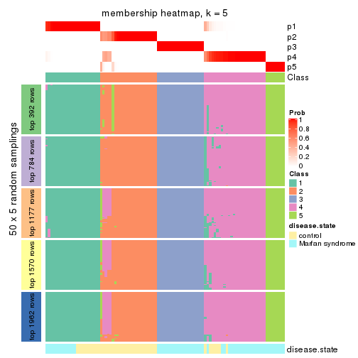</p>

</div>
<div id='tab-CV-pam-membership-heatmap-5'>
<pre><code class="r">membership_heatmap(res, k = 6)
</code></pre>

<p></p>

</div>
</div>

As soon as we have had the classes for columns, we can look for signatures
which are significantly different between classes which can be candidate marks
for certain classes. Following are the heatmaps for signatures.


Signature heatmaps where rows are scaled:


<script>
$( function() {
	$( '#tabs-CV-pam-get-signatures' ).tabs();
} );
</script>
<div id='tabs-CV-pam-get-signatures'>
<ul>
<li><a href='#tab-CV-pam-get-signatures-1'>k = 2</a></li>
<li><a href='#tab-CV-pam-get-signatures-2'>k = 3</a></li>
<li><a href='#tab-CV-pam-get-signatures-3'>k = 4</a></li>
<li><a href='#tab-CV-pam-get-signatures-4'>k = 5</a></li>
<li><a href='#tab-CV-pam-get-signatures-5'>k = 6</a></li>
</ul>
<div id='tab-CV-pam-get-signatures-1'>
<pre><code class="r">get_signatures(res, k = 2)
</code></pre>

<p></p>

</div>
<div id='tab-CV-pam-get-signatures-2'>
<pre><code class="r">get_signatures(res, k = 3)
</code></pre>

<p></p>

</div>
<div id='tab-CV-pam-get-signatures-3'>
<pre><code class="r">get_signatures(res, k = 4)
</code></pre>

<p></p>

</div>
<div id='tab-CV-pam-get-signatures-4'>
<pre><code class="r">get_signatures(res, k = 5)
</code></pre>

<p></p>

</div>
<div id='tab-CV-pam-get-signatures-5'>
<pre><code class="r">get_signatures(res, k = 6)
</code></pre>

<p></p>

</div>
</div>


Signature heatmaps where rows are not scaled:


<script>
$( function() {
	$( '#tabs-CV-pam-get-signatures-no-scale' ).tabs();
} );
</script>
<div id='tabs-CV-pam-get-signatures-no-scale'>
<ul>
<li><a href='#tab-CV-pam-get-signatures-no-scale-1'>k = 2</a></li>
<li><a href='#tab-CV-pam-get-signatures-no-scale-2'>k = 3</a></li>
<li><a href='#tab-CV-pam-get-signatures-no-scale-3'>k = 4</a></li>
<li><a href='#tab-CV-pam-get-signatures-no-scale-4'>k = 5</a></li>
<li><a href='#tab-CV-pam-get-signatures-no-scale-5'>k = 6</a></li>
</ul>
<div id='tab-CV-pam-get-signatures-no-scale-1'>
<pre><code class="r">get_signatures(res, k = 2, scale_rows = FALSE)
</code></pre>

<p></p>

</div>
<div id='tab-CV-pam-get-signatures-no-scale-2'>
<pre><code class="r">get_signatures(res, k = 3, scale_rows = FALSE)
</code></pre>

<p></p>

</div>
<div id='tab-CV-pam-get-signatures-no-scale-3'>
<pre><code class="r">get_signatures(res, k = 4, scale_rows = FALSE)
</code></pre>

<p></p>

</div>
<div id='tab-CV-pam-get-signatures-no-scale-4'>
<pre><code class="r">get_signatures(res, k = 5, scale_rows = FALSE)
</code></pre>

<p></p>

</div>
<div id='tab-CV-pam-get-signatures-no-scale-5'>
<pre><code class="r">get_signatures(res, k = 6, scale_rows = FALSE)
</code></pre>

<p></p>

</div>
</div>


Compare the overlap of signatures from different k:

```r
compare_signatures(res)
```


`get_signature()` returns a data frame invisibly. TO get the list of signatures, the function
call should be assigned to a variable explicitly. In following code, if `plot` argument is set
to `FALSE`, no heatmap is plotted while only the differential analysis is performed.

```r
# code only for demonstration
tb = get_signature(res, k = ..., plot = FALSE)
```

An example of the output of `tb` is:

```
#>   which_row         fdr    mean_1    mean_2 scaled_mean_1 scaled_mean_2 km
#> 1        38 0.042760348  8.373488  9.131774    -0.5533452     0.5164555  1
#> 2        40 0.018707592  7.106213  8.469186    -0.6173731     0.5762149  1
#> 3        55 0.019134737 10.221463 11.207825    -0.6159697     0.5749050  1
#> 4        59 0.006059896  5.921854  7.869574    -0.6899429     0.6439467  1
#> 5        60 0.018055526  8.928898 10.211722    -0.6204761     0.5791110  1
#> 6        98 0.009384629 15.714769 14.887706     0.6635654    -0.6193277  2
...
```

The columns in `tb` are:

1. `which_row`: row indices corresponding to the input matrix.
2. `fdr`: FDR for the differential test. 
3. `mean_x`: The mean value in group x.
4. `scaled_mean_x`: The mean value in group x after rows are scaled.
5. `km`: Row groups if k-means clustering is applied to rows.


UMAP plot which shows how samples are separated.


<script>
$( function() {
	$( '#tabs-CV-pam-dimension-reduction' ).tabs();
} );
</script>
<div id='tabs-CV-pam-dimension-reduction'>
<ul>
<li><a href='#tab-CV-pam-dimension-reduction-1'>k = 2</a></li>
<li><a href='#tab-CV-pam-dimension-reduction-2'>k = 3</a></li>
<li><a href='#tab-CV-pam-dimension-reduction-3'>k = 4</a></li>
<li><a href='#tab-CV-pam-dimension-reduction-4'>k = 5</a></li>
<li><a href='#tab-CV-pam-dimension-reduction-5'>k = 6</a></li>
</ul>
<div id='tab-CV-pam-dimension-reduction-1'>
<pre><code class="r">dimension_reduction(res, k = 2, method = &quot;UMAP&quot;)
</code></pre>

<p>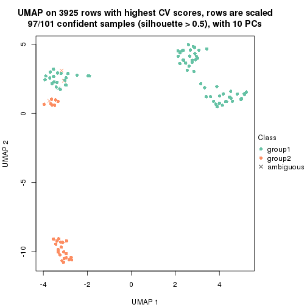</p>

</div>
<div id='tab-CV-pam-dimension-reduction-2'>
<pre><code class="r">dimension_reduction(res, k = 3, method = &quot;UMAP&quot;)
</code></pre>

<p></p>

</div>
<div id='tab-CV-pam-dimension-reduction-3'>
<pre><code class="r">dimension_reduction(res, k = 4, method = &quot;UMAP&quot;)
</code></pre>

<p></p>

</div>
<div id='tab-CV-pam-dimension-reduction-4'>
<pre><code class="r">dimension_reduction(res, k = 5, method = &quot;UMAP&quot;)
</code></pre>

<p></p>

</div>
<div id='tab-CV-pam-dimension-reduction-5'>
<pre><code class="r">dimension_reduction(res, k = 6, method = &quot;UMAP&quot;)
</code></pre>

<p></p>

</div>
</div>


Following heatmap shows how subgroups are split when increasing `k`:

```r
collect_classes(res)
```


Test correlation between subgroups and known annotations. If the known
annotation is numeric, one-way ANOVA test is applied, and if the known
annotation is discrete, chi-squared contingency table test is applied.

```r
test_to_known_factors(res)
```

```
#>          n disease.state(p) k
#> CV:pam  97         2.91e-06 2
#> CV:pam 100         2.32e-07 3
#> CV:pam  97         5.49e-06 4
#> CV:pam  95         2.12e-10 5
#> CV:pam  95         4.10e-10 6
```


If matrix rows can be associated to genes, consider to use `functional_enrichment(res,
...)` to perform function enrichment for the signature genes. See [this vignette](http://bioconductor.org/packages/devel/bioc/vignettes/cola/inst/doc/functional_enrichment.html) for more detailed explanations.


 

---------------------------------------------------


### CV:mclust*


The object with results only for a single top-value method and a single partition method 
can be extracted as:

```r
res = res_list["CV", "mclust"]
# you can also extract it by
# res = res_list["CV:mclust"]
```

A summary of `res` and all the functions that can be applied to it:

```r
res
```

```
#> A 'ConsensusPartition' object with k = 2, 3, 4, 5, 6.
#>   On a matrix with 3925 rows and 101 columns.
#>   Top rows (392, 784, 1177, 1570, 1962) are extracted by 'CV' method.
#>   Subgroups are detected by 'mclust' method.
#>   Performed in total 1250 partitions by row resampling.
#>   Best k for subgroups seems to be 5.
#> 
#> Following methods can be applied to this 'ConsensusPartition' object:
#>  [1] "cola_report"             "collect_classes"         "collect_plots"          
#>  [4] "collect_stats"           "colnames"                "compare_signatures"     
#>  [7] "consensus_heatmap"       "dimension_reduction"     "functional_enrichment"  
#> [10] "get_anno_col"            "get_anno"                "get_classes"            
#> [13] "get_consensus"           "get_matrix"              "get_membership"         
#> [16] "get_param"               "get_signatures"          "get_stats"              
#> [19] "is_best_k"               "is_stable_k"             "membership_heatmap"     
#> [22] "ncol"                    "nrow"                    "plot_ecdf"              
#> [25] "rownames"                "select_partition_number" "show"                   
#> [28] "suggest_best_k"          "test_to_known_factors"
```

`collect_plots()` function collects all the plots made from `res` for all `k` (number of partitions)
into one single page to provide an easy and fast comparison between different `k`.

```r
collect_plots(res)
```

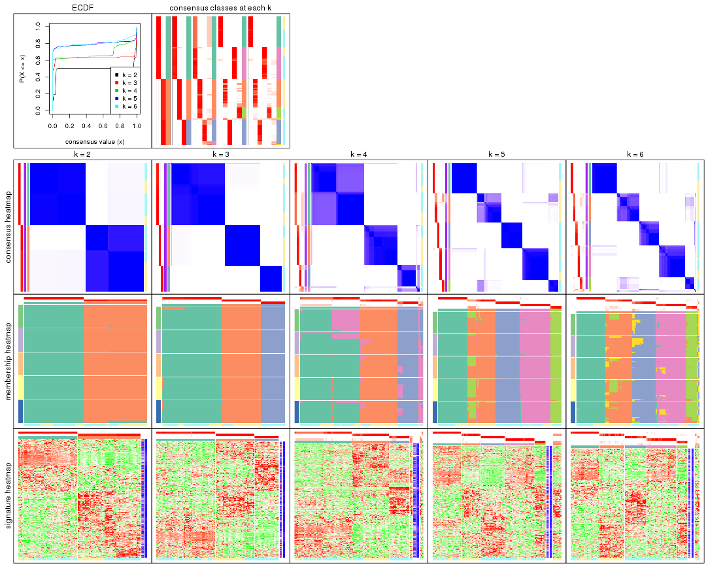

The plots are:

- The first row: a plot of the ECDF (empirical cumulative distribution
  function) curves of the consensus matrix for each `k` and the heatmap of
  predicted classes for each `k`.
- The second row: heatmaps of the consensus matrix for each `k`.
- The third row: heatmaps of the membership matrix for each `k`.
- The fouth row: heatmaps of the signatures for each `k`.

All the plots in panels can be made by individual functions and they are
plotted later in this section.

`select_partition_number()` produces several plots showing different
statistics for choosing "optimized" `k`. There are following statistics:

- ECDF curves of the consensus matrix for each `k`;
- 1-PAC. [The PAC
  score](https://en.wikipedia.org/wiki/Consensus_clustering#Over-interpretation_potential_of_consensus_clustering)
  measures the proportion of the ambiguous subgrouping.
- Mean silhouette score.
- Concordance. The mean probability of fiting the consensus class ids in all
  partitions.
- Area increased. Denote $A_k$ as the area under the ECDF curve for current
  `k`, the area increased is defined as $A_k - A_{k-1}$.
- Rand index. The percent of pairs of samples that are both in a same cluster
  or both are not in a same cluster in the partition of k and k-1.
- Jaccard index. The ratio of pairs of samples are both in a same cluster in
  the partition of k and k-1 and the pairs of samples are both in a same
  cluster in the partition k or k-1.

The detailed explanations of these statistics can be found in [the _cola_
vignette](http://bioconductor.org/packages/devel/bioc/vignettes/cola/inst/doc/cola.html#toc_13).

Generally speaking, lower PAC score, higher mean silhouette score or higher
concordance corresponds to better partition. Rand index and Jaccard index
measure how similar the current partition is compared to partition with `k-1`.
If they are too similar, we won't accept `k` is better than `k-1`.

```r
select_partition_number(res)
```


The numeric values for all these statistics can be obtained by `get_stats()`.

```r
get_stats(res)
```

```
#>   k 1-PAC mean_silhouette concordance area_increased  Rand Jaccard
#> 2 2 1.000           0.990       0.988         0.4992 0.495   0.495
#> 3 3 1.000           0.989       0.993         0.2660 0.873   0.744
#> 4 4 0.831           0.853       0.901         0.0799 0.983   0.954
#> 5 5 0.943           0.909       0.955         0.1651 0.827   0.529
#> 6 6 0.911           0.870       0.930         0.0118 0.992   0.960
```

`suggest_best_k()` suggests the best $k$ based on these statistics. The rules are as follows:

- All $k$ with Jaccard index larger than 0.95 are removed because increasing
  $k$ does not provide enough extra information. If all $k$ are removed, it is
  marked as no subgroup is detected.
- For all $k$ with 1-PAC score larger than 0.9, the maximal $k$ is taken as
  the best $k$, and other $k$ are marked as optional $k$.
- If it does not fit the second rule. The $k$ with the maximal vote of the
  highest 1-PAC score, highest mean silhouette, and highest concordance is
  taken as the best $k$.

```r
suggest_best_k(res)
```

```
#> [1] 5
#> attr(,"optional")
#> [1] 2 3
```

There is also optional best $k$ = 2 3 that is worth to check.

Following shows the table of the partitions (You need to click the **show/hide
code output** link to see it). The membership matrix (columns with name `p*`)
is inferred by
[`clue::cl_consensus()`](https://www.rdocumentation.org/link/cl_consensus?package=clue)
function with the `SE` method. Basically the value in the membership matrix
represents the probability to belong to a certain group. The finall class
label for an item is determined with the group with highest probability it
belongs to.

In `get_classes()` function, the entropy is calculated from the membership
matrix and the silhouette score is calculated from the consensus matrix.


<script>
$( function() {
	$( '#tabs-CV-mclust-get-classes' ).tabs();
} );
</script>
<div id='tabs-CV-mclust-get-classes'>
<ul>
<li><a href='#tab-CV-mclust-get-classes-1'>k = 2</a></li>
<li><a href='#tab-CV-mclust-get-classes-2'>k = 3</a></li>
<li><a href='#tab-CV-mclust-get-classes-3'>k = 4</a></li>
<li><a href='#tab-CV-mclust-get-classes-4'>k = 5</a></li>
<li><a href='#tab-CV-mclust-get-classes-5'>k = 6</a></li>
</ul>

<div id='tab-CV-mclust-get-classes-1'>
<p><a id='tab-CV-mclust-get-classes-1-a' style='color:#0366d6' href='#'>show/hide code output</a></p>
<pre><code class="r">cbind(get_classes(res, k = 2), get_membership(res, k = 2))
</code></pre>

<pre><code>#&gt;           class entropy silhouette    p1    p2
#&gt; GSM217644     2  0.2043      0.986 0.032 0.968
#&gt; GSM217645     2  0.2043      0.986 0.032 0.968
#&gt; GSM217646     2  0.2043      0.986 0.032 0.968
#&gt; GSM217647     2  0.2043      0.986 0.032 0.968
#&gt; GSM217648     2  0.2043      0.986 0.032 0.968
#&gt; GSM217649     2  0.2043      0.986 0.032 0.968
#&gt; GSM217650     2  0.2043      0.986 0.032 0.968
#&gt; GSM217651     2  0.2043      0.986 0.032 0.968
#&gt; GSM217652     2  0.2043      0.986 0.032 0.968
#&gt; GSM217653     2  0.2043      0.986 0.032 0.968
#&gt; GSM217654     2  0.2043      0.986 0.032 0.968
#&gt; GSM217655     2  0.2043      0.986 0.032 0.968
#&gt; GSM217656     2  0.2778      0.972 0.048 0.952
#&gt; GSM217657     2  0.2043      0.986 0.032 0.968
#&gt; GSM217658     2  0.2043      0.986 0.032 0.968
#&gt; GSM217659     2  0.2043      0.986 0.032 0.968
#&gt; GSM217660     2  0.2043      0.986 0.032 0.968
#&gt; GSM217661     2  0.2043      0.986 0.032 0.968
#&gt; GSM217662     2  0.2043      0.986 0.032 0.968
#&gt; GSM217663     2  0.2043      0.986 0.032 0.968
#&gt; GSM217664     2  0.2043      0.986 0.032 0.968
#&gt; GSM217665     2  0.2043      0.986 0.032 0.968
#&gt; GSM217666     2  0.2043      0.986 0.032 0.968
#&gt; GSM217667     2  0.2043      0.986 0.032 0.968
#&gt; GSM217668     1  0.0376      0.998 0.996 0.004
#&gt; GSM217669     1  0.0376      0.998 0.996 0.004
#&gt; GSM217670     1  0.0376      0.998 0.996 0.004
#&gt; GSM217671     1  0.0376      0.998 0.996 0.004
#&gt; GSM217672     1  0.0376      0.998 0.996 0.004
#&gt; GSM217673     1  0.0376      0.998 0.996 0.004
#&gt; GSM217674     1  0.0000      0.998 1.000 0.000
#&gt; GSM217675     1  0.0000      0.998 1.000 0.000
#&gt; GSM217676     1  0.0000      0.998 1.000 0.000
#&gt; GSM217677     1  0.0000      0.998 1.000 0.000
#&gt; GSM217678     1  0.0000      0.998 1.000 0.000
#&gt; GSM217679     1  0.0000      0.998 1.000 0.000
#&gt; GSM217680     1  0.0000      0.998 1.000 0.000
#&gt; GSM217681     1  0.0000      0.998 1.000 0.000
#&gt; GSM217682     1  0.0000      0.998 1.000 0.000
#&gt; GSM217683     1  0.0000      0.998 1.000 0.000
#&gt; GSM217684     1  0.0376      0.998 0.996 0.004
#&gt; GSM217685     2  0.0376      0.978 0.004 0.996
#&gt; GSM217686     2  0.0376      0.978 0.004 0.996
#&gt; GSM217687     2  0.0376      0.978 0.004 0.996
#&gt; GSM217688     2  0.0376      0.978 0.004 0.996
#&gt; GSM217689     2  0.0376      0.978 0.004 0.996
#&gt; GSM217690     2  0.0376      0.978 0.004 0.996
#&gt; GSM217691     2  0.0376      0.978 0.004 0.996
#&gt; GSM217692     2  0.0376      0.978 0.004 0.996
#&gt; GSM217693     2  0.0376      0.978 0.004 0.996
#&gt; GSM217694     2  0.0376      0.978 0.004 0.996
#&gt; GSM217695     2  0.0376      0.978 0.004 0.996
#&gt; GSM217696     2  0.0376      0.978 0.004 0.996
#&gt; GSM217697     2  0.0376      0.978 0.004 0.996
#&gt; GSM217698     2  0.0376      0.978 0.004 0.996
#&gt; GSM217699     2  0.0376      0.978 0.004 0.996
#&gt; GSM217700     2  0.0376      0.978 0.004 0.996
#&gt; GSM217701     2  0.0376      0.978 0.004 0.996
#&gt; GSM217702     2  0.0376      0.978 0.004 0.996
#&gt; GSM217703     2  0.0938      0.980 0.012 0.988
#&gt; GSM217704     2  0.0376      0.978 0.004 0.996
#&gt; GSM217705     1  0.0376      0.998 0.996 0.004
#&gt; GSM217706     1  0.0376      0.998 0.996 0.004
#&gt; GSM217707     1  0.0376      0.998 0.996 0.004
#&gt; GSM217708     1  0.0376      0.998 0.996 0.004
#&gt; GSM217709     1  0.0376      0.998 0.996 0.004
#&gt; GSM217710     1  0.0376      0.998 0.996 0.004
#&gt; GSM217711     1  0.0376      0.998 0.996 0.004
#&gt; GSM217712     1  0.0376      0.998 0.996 0.004
#&gt; GSM217713     1  0.0376      0.998 0.996 0.004
#&gt; GSM217714     1  0.0376      0.998 0.996 0.004
#&gt; GSM217715     1  0.0376      0.998 0.996 0.004
#&gt; GSM217716     1  0.0376      0.998 0.996 0.004
#&gt; GSM217717     1  0.0376      0.998 0.996 0.004
#&gt; GSM217718     1  0.0376      0.998 0.996 0.004
#&gt; GSM217719     1  0.0376      0.998 0.996 0.004
#&gt; GSM217720     1  0.0376      0.998 0.996 0.004
#&gt; GSM217721     1  0.0376      0.998 0.996 0.004
#&gt; GSM217722     1  0.0376      0.998 0.996 0.004
#&gt; GSM217723     1  0.0000      0.998 1.000 0.000
#&gt; GSM217724     1  0.0000      0.998 1.000 0.000
#&gt; GSM217725     1  0.0000      0.998 1.000 0.000
#&gt; GSM217726     1  0.0000      0.998 1.000 0.000
#&gt; GSM217727     1  0.0000      0.998 1.000 0.000
#&gt; GSM217728     1  0.0000      0.998 1.000 0.000
#&gt; GSM217729     1  0.0000      0.998 1.000 0.000
#&gt; GSM217730     1  0.0000      0.998 1.000 0.000
#&gt; GSM217731     1  0.0000      0.998 1.000 0.000
#&gt; GSM217732     1  0.0000      0.998 1.000 0.000
#&gt; GSM217733     1  0.0000      0.998 1.000 0.000
#&gt; GSM217734     1  0.0000      0.998 1.000 0.000
#&gt; GSM217735     1  0.0000      0.998 1.000 0.000
#&gt; GSM217736     1  0.0000      0.998 1.000 0.000
#&gt; GSM217737     2  0.2043      0.986 0.032 0.968
#&gt; GSM217738     2  0.2043      0.986 0.032 0.968
#&gt; GSM217739     2  0.2043      0.986 0.032 0.968
#&gt; GSM217740     2  0.2043      0.986 0.032 0.968
#&gt; GSM217741     2  0.2043      0.986 0.032 0.968
#&gt; GSM217742     2  0.2043      0.986 0.032 0.968
#&gt; GSM217743     2  0.2043      0.986 0.032 0.968
#&gt; GSM217744     2  0.2043      0.986 0.032 0.968
</code></pre>

<script>
$('#tab-CV-mclust-get-classes-1-a').parent().next().next().hide();
$('#tab-CV-mclust-get-classes-1-a').click(function(){
  $('#tab-CV-mclust-get-classes-1-a').parent().next().next().toggle();
  return(false);
});
</script>
</div>

<div id='tab-CV-mclust-get-classes-2'>
<p><a id='tab-CV-mclust-get-classes-2-a' style='color:#0366d6' href='#'>show/hide code output</a></p>
<pre><code class="r">cbind(get_classes(res, k = 3), get_membership(res, k = 3))
</code></pre>

<pre><code>#&gt;           class entropy silhouette    p1    p2    p3
#&gt; GSM217644     2  0.0000      1.000 0.000 1.000 0.000
#&gt; GSM217645     2  0.0000      1.000 0.000 1.000 0.000
#&gt; GSM217646     2  0.0000      1.000 0.000 1.000 0.000
#&gt; GSM217647     2  0.0000      1.000 0.000 1.000 0.000
#&gt; GSM217648     2  0.0000      1.000 0.000 1.000 0.000
#&gt; GSM217649     2  0.0000      1.000 0.000 1.000 0.000
#&gt; GSM217650     2  0.0000      1.000 0.000 1.000 0.000
#&gt; GSM217651     2  0.0000      1.000 0.000 1.000 0.000
#&gt; GSM217652     2  0.0000      1.000 0.000 1.000 0.000
#&gt; GSM217653     2  0.0000      1.000 0.000 1.000 0.000
#&gt; GSM217654     2  0.0000      1.000 0.000 1.000 0.000
#&gt; GSM217655     2  0.0000      1.000 0.000 1.000 0.000
#&gt; GSM217656     2  0.0424      0.992 0.000 0.992 0.008
#&gt; GSM217657     2  0.0000      1.000 0.000 1.000 0.000
#&gt; GSM217658     2  0.0000      1.000 0.000 1.000 0.000
#&gt; GSM217659     2  0.0000      1.000 0.000 1.000 0.000
#&gt; GSM217660     2  0.0000      1.000 0.000 1.000 0.000
#&gt; GSM217661     2  0.0000      1.000 0.000 1.000 0.000
#&gt; GSM217662     2  0.0000      1.000 0.000 1.000 0.000
#&gt; GSM217663     2  0.0000      1.000 0.000 1.000 0.000
#&gt; GSM217664     2  0.0000      1.000 0.000 1.000 0.000
#&gt; GSM217665     2  0.0000      1.000 0.000 1.000 0.000
#&gt; GSM217666     2  0.0000      1.000 0.000 1.000 0.000
#&gt; GSM217667     2  0.0000      1.000 0.000 1.000 0.000
#&gt; GSM217668     1  0.4974      0.712 0.764 0.236 0.000
#&gt; GSM217669     1  0.0892      0.981 0.980 0.020 0.000
#&gt; GSM217670     1  0.1031      0.980 0.976 0.024 0.000
#&gt; GSM217671     1  0.1031      0.980 0.976 0.024 0.000
#&gt; GSM217672     1  0.1031      0.980 0.976 0.024 0.000
#&gt; GSM217673     1  0.1031      0.980 0.976 0.024 0.000
#&gt; GSM217674     1  0.0000      0.985 1.000 0.000 0.000
#&gt; GSM217675     1  0.0000      0.985 1.000 0.000 0.000
#&gt; GSM217676     1  0.0000      0.985 1.000 0.000 0.000
#&gt; GSM217677     1  0.0000      0.985 1.000 0.000 0.000
#&gt; GSM217678     1  0.0000      0.985 1.000 0.000 0.000
#&gt; GSM217679     1  0.0000      0.985 1.000 0.000 0.000
#&gt; GSM217680     1  0.0000      0.985 1.000 0.000 0.000
#&gt; GSM217681     1  0.0000      0.985 1.000 0.000 0.000
#&gt; GSM217682     1  0.0000      0.985 1.000 0.000 0.000
#&gt; GSM217683     1  0.0000      0.985 1.000 0.000 0.000
#&gt; GSM217684     1  0.1031      0.980 0.976 0.024 0.000
#&gt; GSM217685     3  0.0000      1.000 0.000 0.000 1.000
#&gt; GSM217686     3  0.0000      1.000 0.000 0.000 1.000
#&gt; GSM217687     3  0.0000      1.000 0.000 0.000 1.000
#&gt; GSM217688     3  0.0000      1.000 0.000 0.000 1.000
#&gt; GSM217689     3  0.0000      1.000 0.000 0.000 1.000
#&gt; GSM217690     3  0.0000      1.000 0.000 0.000 1.000
#&gt; GSM217691     3  0.0000      1.000 0.000 0.000 1.000
#&gt; GSM217692     3  0.0000      1.000 0.000 0.000 1.000
#&gt; GSM217693     3  0.0000      1.000 0.000 0.000 1.000
#&gt; GSM217694     3  0.0000      1.000 0.000 0.000 1.000
#&gt; GSM217695     3  0.0000      1.000 0.000 0.000 1.000
#&gt; GSM217696     3  0.0000      1.000 0.000 0.000 1.000
#&gt; GSM217697     3  0.0000      1.000 0.000 0.000 1.000
#&gt; GSM217698     3  0.0000      1.000 0.000 0.000 1.000
#&gt; GSM217699     3  0.0000      1.000 0.000 0.000 1.000
#&gt; GSM217700     3  0.0000      1.000 0.000 0.000 1.000
#&gt; GSM217701     3  0.0000      1.000 0.000 0.000 1.000
#&gt; GSM217702     3  0.0000      1.000 0.000 0.000 1.000
#&gt; GSM217703     3  0.0000      1.000 0.000 0.000 1.000
#&gt; GSM217704     3  0.0000      1.000 0.000 0.000 1.000
#&gt; GSM217705     1  0.1031      0.980 0.976 0.024 0.000
#&gt; GSM217706     1  0.1031      0.980 0.976 0.024 0.000
#&gt; GSM217707     1  0.0424      0.985 0.992 0.008 0.000
#&gt; GSM217708     1  0.0747      0.983 0.984 0.016 0.000
#&gt; GSM217709     1  0.0424      0.985 0.992 0.008 0.000
#&gt; GSM217710     1  0.0424      0.985 0.992 0.008 0.000
#&gt; GSM217711     1  0.0424      0.985 0.992 0.008 0.000
#&gt; GSM217712     1  0.1031      0.980 0.976 0.024 0.000
#&gt; GSM217713     1  0.1031      0.980 0.976 0.024 0.000
#&gt; GSM217714     1  0.1031      0.980 0.976 0.024 0.000
#&gt; GSM217715     1  0.1031      0.980 0.976 0.024 0.000
#&gt; GSM217716     1  0.1031      0.980 0.976 0.024 0.000
#&gt; GSM217717     1  0.1031      0.980 0.976 0.024 0.000
#&gt; GSM217718     1  0.0424      0.985 0.992 0.008 0.000
#&gt; GSM217719     1  0.0424      0.985 0.992 0.008 0.000
#&gt; GSM217720     1  0.1031      0.980 0.976 0.024 0.000
#&gt; GSM217721     1  0.1031      0.980 0.976 0.024 0.000
#&gt; GSM217722     1  0.0592      0.984 0.988 0.012 0.000
#&gt; GSM217723     1  0.0000      0.985 1.000 0.000 0.000
#&gt; GSM217724     1  0.0000      0.985 1.000 0.000 0.000
#&gt; GSM217725     1  0.0000      0.985 1.000 0.000 0.000
#&gt; GSM217726     1  0.0000      0.985 1.000 0.000 0.000
#&gt; GSM217727     1  0.0000      0.985 1.000 0.000 0.000
#&gt; GSM217728     1  0.0000      0.985 1.000 0.000 0.000
#&gt; GSM217729     1  0.0000      0.985 1.000 0.000 0.000
#&gt; GSM217730     1  0.0000      0.985 1.000 0.000 0.000
#&gt; GSM217731     1  0.0000      0.985 1.000 0.000 0.000
#&gt; GSM217732     1  0.0000      0.985 1.000 0.000 0.000
#&gt; GSM217733     1  0.0000      0.985 1.000 0.000 0.000
#&gt; GSM217734     1  0.0000      0.985 1.000 0.000 0.000
#&gt; GSM217735     1  0.0000      0.985 1.000 0.000 0.000
#&gt; GSM217736     1  0.0000      0.985 1.000 0.000 0.000
#&gt; GSM217737     2  0.0000      1.000 0.000 1.000 0.000
#&gt; GSM217738     2  0.0000      1.000 0.000 1.000 0.000
#&gt; GSM217739     2  0.0000      1.000 0.000 1.000 0.000
#&gt; GSM217740     2  0.0000      1.000 0.000 1.000 0.000
#&gt; GSM217741     2  0.0000      1.000 0.000 1.000 0.000
#&gt; GSM217742     2  0.0000      1.000 0.000 1.000 0.000
#&gt; GSM217743     2  0.0000      1.000 0.000 1.000 0.000
#&gt; GSM217744     2  0.0000      1.000 0.000 1.000 0.000
</code></pre>

<script>
$('#tab-CV-mclust-get-classes-2-a').parent().next().next().hide();
$('#tab-CV-mclust-get-classes-2-a').click(function(){
  $('#tab-CV-mclust-get-classes-2-a').parent().next().next().toggle();
  return(false);
});
</script>
</div>

<div id='tab-CV-mclust-get-classes-3'>
<p><a id='tab-CV-mclust-get-classes-3-a' style='color:#0366d6' href='#'>show/hide code output</a></p>
<pre><code class="r">cbind(get_classes(res, k = 4), get_membership(res, k = 4))
</code></pre>

<pre><code>#&gt;           class entropy silhouette    p1    p2    p3    p4
#&gt; GSM217644     2  0.0336      0.965 0.000 0.992 0.000 0.008
#&gt; GSM217645     2  0.0336      0.965 0.000 0.992 0.000 0.008
#&gt; GSM217646     2  0.0336      0.965 0.000 0.992 0.000 0.008
#&gt; GSM217647     2  0.0000      0.965 0.000 1.000 0.000 0.000
#&gt; GSM217648     2  0.0000      0.965 0.000 1.000 0.000 0.000
#&gt; GSM217649     2  0.0336      0.965 0.000 0.992 0.000 0.008
#&gt; GSM217650     2  0.0336      0.965 0.000 0.992 0.000 0.008
#&gt; GSM217651     2  0.0188      0.964 0.000 0.996 0.000 0.004
#&gt; GSM217652     2  0.0336      0.965 0.000 0.992 0.000 0.008
#&gt; GSM217653     2  0.0000      0.965 0.000 1.000 0.000 0.000
#&gt; GSM217654     2  0.0592      0.964 0.000 0.984 0.000 0.016
#&gt; GSM217655     2  0.0336      0.965 0.000 0.992 0.000 0.008
#&gt; GSM217656     4  0.5939      0.433 0.248 0.084 0.000 0.668
#&gt; GSM217657     2  0.4857      0.605 0.008 0.668 0.000 0.324
#&gt; GSM217658     2  0.0336      0.965 0.000 0.992 0.000 0.008
#&gt; GSM217659     2  0.0336      0.965 0.000 0.992 0.000 0.008
#&gt; GSM217660     2  0.0469      0.965 0.000 0.988 0.000 0.012
#&gt; GSM217661     2  0.0336      0.965 0.000 0.992 0.000 0.008
#&gt; GSM217662     2  0.0188      0.964 0.000 0.996 0.000 0.004
#&gt; GSM217663     2  0.0188      0.965 0.000 0.996 0.000 0.004
#&gt; GSM217664     2  0.0336      0.965 0.000 0.992 0.000 0.008
#&gt; GSM217665     2  0.0000      0.965 0.000 1.000 0.000 0.000
#&gt; GSM217666     2  0.0000      0.965 0.000 1.000 0.000 0.000
#&gt; GSM217667     2  0.0000      0.965 0.000 1.000 0.000 0.000
#&gt; GSM217668     1  0.4831      0.386 0.704 0.280 0.000 0.016
#&gt; GSM217669     1  0.0469      0.826 0.988 0.000 0.000 0.012
#&gt; GSM217670     1  0.0592      0.825 0.984 0.000 0.000 0.016
#&gt; GSM217671     1  0.0592      0.825 0.984 0.000 0.000 0.016
#&gt; GSM217672     1  0.0592      0.825 0.984 0.000 0.000 0.016
#&gt; GSM217673     1  0.0592      0.825 0.984 0.000 0.000 0.016
#&gt; GSM217674     1  0.4164      0.853 0.736 0.000 0.000 0.264
#&gt; GSM217675     1  0.4164      0.853 0.736 0.000 0.000 0.264
#&gt; GSM217676     1  0.4164      0.853 0.736 0.000 0.000 0.264
#&gt; GSM217677     1  0.4164      0.853 0.736 0.000 0.000 0.264
#&gt; GSM217678     1  0.4164      0.853 0.736 0.000 0.000 0.264
#&gt; GSM217679     1  0.4164      0.853 0.736 0.000 0.000 0.264
#&gt; GSM217680     1  0.4164      0.853 0.736 0.000 0.000 0.264
#&gt; GSM217681     1  0.4164      0.853 0.736 0.000 0.000 0.264
#&gt; GSM217682     1  0.4164      0.853 0.736 0.000 0.000 0.264
#&gt; GSM217683     1  0.4164      0.853 0.736 0.000 0.000 0.264
#&gt; GSM217684     1  0.0592      0.825 0.984 0.000 0.000 0.016
#&gt; GSM217685     3  0.3975      0.596 0.000 0.000 0.760 0.240
#&gt; GSM217686     3  0.3942      0.605 0.000 0.000 0.764 0.236
#&gt; GSM217687     3  0.3801      0.637 0.000 0.000 0.780 0.220
#&gt; GSM217688     3  0.3801      0.637 0.000 0.000 0.780 0.220
#&gt; GSM217689     4  0.4941      0.504 0.000 0.000 0.436 0.564
#&gt; GSM217690     4  0.4948      0.496 0.000 0.000 0.440 0.560
#&gt; GSM217691     3  0.0000      0.911 0.000 0.000 1.000 0.000
#&gt; GSM217692     3  0.0000      0.911 0.000 0.000 1.000 0.000
#&gt; GSM217693     3  0.0000      0.911 0.000 0.000 1.000 0.000
#&gt; GSM217694     3  0.0000      0.911 0.000 0.000 1.000 0.000
#&gt; GSM217695     3  0.0000      0.911 0.000 0.000 1.000 0.000
#&gt; GSM217696     3  0.0000      0.911 0.000 0.000 1.000 0.000
#&gt; GSM217697     3  0.0000      0.911 0.000 0.000 1.000 0.000
#&gt; GSM217698     3  0.0592      0.898 0.000 0.000 0.984 0.016
#&gt; GSM217699     3  0.0000      0.911 0.000 0.000 1.000 0.000
#&gt; GSM217700     3  0.0000      0.911 0.000 0.000 1.000 0.000
#&gt; GSM217701     3  0.0000      0.911 0.000 0.000 1.000 0.000
#&gt; GSM217702     3  0.0000      0.911 0.000 0.000 1.000 0.000
#&gt; GSM217703     4  0.4356      0.582 0.000 0.000 0.292 0.708
#&gt; GSM217704     3  0.0000      0.911 0.000 0.000 1.000 0.000
#&gt; GSM217705     1  0.0592      0.825 0.984 0.000 0.000 0.016
#&gt; GSM217706     1  0.0592      0.825 0.984 0.000 0.000 0.016
#&gt; GSM217707     1  0.3219      0.847 0.836 0.000 0.000 0.164
#&gt; GSM217708     1  0.0707      0.832 0.980 0.000 0.000 0.020
#&gt; GSM217709     1  0.0000      0.829 1.000 0.000 0.000 0.000
#&gt; GSM217710     1  0.0000      0.829 1.000 0.000 0.000 0.000
#&gt; GSM217711     1  0.0000      0.829 1.000 0.000 0.000 0.000
#&gt; GSM217712     1  0.0592      0.825 0.984 0.000 0.000 0.016
#&gt; GSM217713     1  0.0592      0.825 0.984 0.000 0.000 0.016
#&gt; GSM217714     1  0.0592      0.825 0.984 0.000 0.000 0.016
#&gt; GSM217715     1  0.0592      0.825 0.984 0.000 0.000 0.016
#&gt; GSM217716     1  0.0592      0.825 0.984 0.000 0.000 0.016
#&gt; GSM217717     1  0.0592      0.825 0.984 0.000 0.000 0.016
#&gt; GSM217718     1  0.0000      0.829 1.000 0.000 0.000 0.000
#&gt; GSM217719     1  0.0921      0.834 0.972 0.000 0.000 0.028
#&gt; GSM217720     1  0.0592      0.825 0.984 0.000 0.000 0.016
#&gt; GSM217721     1  0.0592      0.825 0.984 0.000 0.000 0.016
#&gt; GSM217722     1  0.3801      0.851 0.780 0.000 0.000 0.220
#&gt; GSM217723     1  0.4164      0.853 0.736 0.000 0.000 0.264
#&gt; GSM217724     1  0.4164      0.853 0.736 0.000 0.000 0.264
#&gt; GSM217725     1  0.4164      0.853 0.736 0.000 0.000 0.264
#&gt; GSM217726     1  0.4164      0.853 0.736 0.000 0.000 0.264
#&gt; GSM217727     1  0.4164      0.853 0.736 0.000 0.000 0.264
#&gt; GSM217728     1  0.4164      0.853 0.736 0.000 0.000 0.264
#&gt; GSM217729     1  0.4164      0.853 0.736 0.000 0.000 0.264
#&gt; GSM217730     1  0.4164      0.853 0.736 0.000 0.000 0.264
#&gt; GSM217731     1  0.4164      0.853 0.736 0.000 0.000 0.264
#&gt; GSM217732     1  0.4164      0.853 0.736 0.000 0.000 0.264
#&gt; GSM217733     1  0.4164      0.853 0.736 0.000 0.000 0.264
#&gt; GSM217734     1  0.4164      0.853 0.736 0.000 0.000 0.264
#&gt; GSM217735     1  0.4164      0.853 0.736 0.000 0.000 0.264
#&gt; GSM217736     1  0.4164      0.853 0.736 0.000 0.000 0.264
#&gt; GSM217737     2  0.2868      0.876 0.000 0.864 0.000 0.136
#&gt; GSM217738     2  0.3024      0.865 0.000 0.852 0.000 0.148
#&gt; GSM217739     2  0.2647      0.890 0.000 0.880 0.000 0.120
#&gt; GSM217740     2  0.2647      0.890 0.000 0.880 0.000 0.120
#&gt; GSM217741     2  0.1211      0.948 0.000 0.960 0.000 0.040
#&gt; GSM217742     2  0.1211      0.948 0.000 0.960 0.000 0.040
#&gt; GSM217743     2  0.1211      0.948 0.000 0.960 0.000 0.040
#&gt; GSM217744     2  0.1211      0.948 0.000 0.960 0.000 0.040
</code></pre>

<script>
$('#tab-CV-mclust-get-classes-3-a').parent().next().next().hide();
$('#tab-CV-mclust-get-classes-3-a').click(function(){
  $('#tab-CV-mclust-get-classes-3-a').parent().next().next().toggle();
  return(false);
});
</script>
</div>

<div id='tab-CV-mclust-get-classes-4'>
<p><a id='tab-CV-mclust-get-classes-4-a' style='color:#0366d6' href='#'>show/hide code output</a></p>
<pre><code class="r">cbind(get_classes(res, k = 5), get_membership(res, k = 5))
</code></pre>

<pre><code>#&gt;           class entropy silhouette    p1    p2    p3    p4    p5
#&gt; GSM217644     2  0.0404      0.800 0.000 0.988 0.000 0.000 0.012
#&gt; GSM217645     2  0.0290      0.799 0.000 0.992 0.000 0.000 0.008
#&gt; GSM217646     2  0.0404      0.800 0.000 0.988 0.000 0.000 0.012
#&gt; GSM217647     2  0.4302      0.339 0.000 0.520 0.000 0.000 0.480
#&gt; GSM217648     2  0.4302      0.339 0.000 0.520 0.000 0.000 0.480
#&gt; GSM217649     2  0.0404      0.800 0.000 0.988 0.000 0.000 0.012
#&gt; GSM217650     2  0.0404      0.800 0.000 0.988 0.000 0.000 0.012
#&gt; GSM217651     2  0.4161      0.475 0.000 0.608 0.000 0.000 0.392
#&gt; GSM217652     2  0.0404      0.800 0.000 0.988 0.000 0.000 0.012
#&gt; GSM217653     2  0.4302      0.339 0.000 0.520 0.000 0.000 0.480
#&gt; GSM217654     2  0.0000      0.795 0.000 1.000 0.000 0.000 0.000
#&gt; GSM217655     2  0.0000      0.795 0.000 1.000 0.000 0.000 0.000
#&gt; GSM217656     2  0.4337      0.554 0.000 0.744 0.000 0.204 0.052
#&gt; GSM217657     2  0.1270      0.767 0.000 0.948 0.000 0.000 0.052
#&gt; GSM217658     2  0.0404      0.800 0.000 0.988 0.000 0.000 0.012
#&gt; GSM217659     2  0.0404      0.800 0.000 0.988 0.000 0.000 0.012
#&gt; GSM217660     2  0.1608      0.776 0.000 0.928 0.000 0.000 0.072
#&gt; GSM217661     2  0.0162      0.797 0.000 0.996 0.000 0.000 0.004
#&gt; GSM217662     5  0.1410      0.935 0.000 0.060 0.000 0.000 0.940
#&gt; GSM217663     2  0.2690      0.723 0.000 0.844 0.000 0.000 0.156
#&gt; GSM217664     2  0.0404      0.800 0.000 0.988 0.000 0.000 0.012
#&gt; GSM217665     2  0.4302      0.339 0.000 0.520 0.000 0.000 0.480
#&gt; GSM217666     2  0.4302      0.339 0.000 0.520 0.000 0.000 0.480
#&gt; GSM217667     2  0.4302      0.339 0.000 0.520 0.000 0.000 0.480
#&gt; GSM217668     4  0.0162      0.980 0.000 0.004 0.000 0.996 0.000
#&gt; GSM217669     4  0.0000      0.983 0.000 0.000 0.000 1.000 0.000
#&gt; GSM217670     4  0.0000      0.983 0.000 0.000 0.000 1.000 0.000
#&gt; GSM217671     4  0.0000      0.983 0.000 0.000 0.000 1.000 0.000
#&gt; GSM217672     4  0.0000      0.983 0.000 0.000 0.000 1.000 0.000
#&gt; GSM217673     4  0.0000      0.983 0.000 0.000 0.000 1.000 0.000
#&gt; GSM217674     1  0.0000      0.999 1.000 0.000 0.000 0.000 0.000
#&gt; GSM217675     1  0.0000      0.999 1.000 0.000 0.000 0.000 0.000
#&gt; GSM217676     1  0.0000      0.999 1.000 0.000 0.000 0.000 0.000
#&gt; GSM217677     1  0.0000      0.999 1.000 0.000 0.000 0.000 0.000
#&gt; GSM217678     1  0.0000      0.999 1.000 0.000 0.000 0.000 0.000
#&gt; GSM217679     1  0.0000      0.999 1.000 0.000 0.000 0.000 0.000
#&gt; GSM217680     1  0.0000      0.999 1.000 0.000 0.000 0.000 0.000
#&gt; GSM217681     1  0.0000      0.999 1.000 0.000 0.000 0.000 0.000
#&gt; GSM217682     1  0.0000      0.999 1.000 0.000 0.000 0.000 0.000
#&gt; GSM217683     1  0.0000      0.999 1.000 0.000 0.000 0.000 0.000
#&gt; GSM217684     4  0.0000      0.983 0.000 0.000 0.000 1.000 0.000
#&gt; GSM217685     3  0.0162      0.997 0.000 0.000 0.996 0.000 0.004
#&gt; GSM217686     3  0.0162      0.997 0.000 0.000 0.996 0.000 0.004
#&gt; GSM217687     3  0.0162      0.997 0.000 0.000 0.996 0.000 0.004
#&gt; GSM217688     3  0.0162      0.997 0.000 0.000 0.996 0.000 0.004
#&gt; GSM217689     3  0.0162      0.997 0.000 0.000 0.996 0.000 0.004
#&gt; GSM217690     3  0.0162      0.997 0.000 0.000 0.996 0.000 0.004
#&gt; GSM217691     3  0.0000      0.998 0.000 0.000 1.000 0.000 0.000
#&gt; GSM217692     3  0.0000      0.998 0.000 0.000 1.000 0.000 0.000
#&gt; GSM217693     3  0.0000      0.998 0.000 0.000 1.000 0.000 0.000
#&gt; GSM217694     3  0.0000      0.998 0.000 0.000 1.000 0.000 0.000
#&gt; GSM217695     3  0.0000      0.998 0.000 0.000 1.000 0.000 0.000
#&gt; GSM217696     3  0.0000      0.998 0.000 0.000 1.000 0.000 0.000
#&gt; GSM217697     3  0.0000      0.998 0.000 0.000 1.000 0.000 0.000
#&gt; GSM217698     3  0.0000      0.998 0.000 0.000 1.000 0.000 0.000
#&gt; GSM217699     3  0.0000      0.998 0.000 0.000 1.000 0.000 0.000
#&gt; GSM217700     3  0.0000      0.998 0.000 0.000 1.000 0.000 0.000
#&gt; GSM217701     3  0.0000      0.998 0.000 0.000 1.000 0.000 0.000
#&gt; GSM217702     3  0.0000      0.998 0.000 0.000 1.000 0.000 0.000
#&gt; GSM217703     3  0.0510      0.987 0.000 0.000 0.984 0.000 0.016
#&gt; GSM217704     3  0.0000      0.998 0.000 0.000 1.000 0.000 0.000
#&gt; GSM217705     4  0.0000      0.983 0.000 0.000 0.000 1.000 0.000
#&gt; GSM217706     4  0.0000      0.983 0.000 0.000 0.000 1.000 0.000
#&gt; GSM217707     4  0.1197      0.940 0.048 0.000 0.000 0.952 0.000
#&gt; GSM217708     4  0.3242      0.718 0.216 0.000 0.000 0.784 0.000
#&gt; GSM217709     4  0.0290      0.978 0.008 0.000 0.000 0.992 0.000
#&gt; GSM217710     4  0.0324      0.979 0.004 0.000 0.000 0.992 0.004
#&gt; GSM217711     4  0.0162      0.981 0.000 0.000 0.000 0.996 0.004
#&gt; GSM217712     4  0.0000      0.983 0.000 0.000 0.000 1.000 0.000
#&gt; GSM217713     4  0.0000      0.983 0.000 0.000 0.000 1.000 0.000
#&gt; GSM217714     4  0.0000      0.983 0.000 0.000 0.000 1.000 0.000
#&gt; GSM217715     4  0.0000      0.983 0.000 0.000 0.000 1.000 0.000
#&gt; GSM217716     4  0.0000      0.983 0.000 0.000 0.000 1.000 0.000
#&gt; GSM217717     4  0.0000      0.983 0.000 0.000 0.000 1.000 0.000
#&gt; GSM217718     4  0.0000      0.983 0.000 0.000 0.000 1.000 0.000
#&gt; GSM217719     4  0.0404      0.974 0.012 0.000 0.000 0.988 0.000
#&gt; GSM217720     4  0.0000      0.983 0.000 0.000 0.000 1.000 0.000
#&gt; GSM217721     4  0.0000      0.983 0.000 0.000 0.000 1.000 0.000
#&gt; GSM217722     4  0.1270      0.936 0.052 0.000 0.000 0.948 0.000
#&gt; GSM217723     1  0.0703      0.971 0.976 0.000 0.000 0.024 0.000
#&gt; GSM217724     1  0.0000      0.999 1.000 0.000 0.000 0.000 0.000
#&gt; GSM217725     1  0.0000      0.999 1.000 0.000 0.000 0.000 0.000
#&gt; GSM217726     1  0.0000      0.999 1.000 0.000 0.000 0.000 0.000
#&gt; GSM217727     1  0.0000      0.999 1.000 0.000 0.000 0.000 0.000
#&gt; GSM217728     1  0.0000      0.999 1.000 0.000 0.000 0.000 0.000
#&gt; GSM217729     1  0.0000      0.999 1.000 0.000 0.000 0.000 0.000
#&gt; GSM217730     1  0.0000      0.999 1.000 0.000 0.000 0.000 0.000
#&gt; GSM217731     1  0.0000      0.999 1.000 0.000 0.000 0.000 0.000
#&gt; GSM217732     1  0.0000      0.999 1.000 0.000 0.000 0.000 0.000
#&gt; GSM217733     1  0.0000      0.999 1.000 0.000 0.000 0.000 0.000
#&gt; GSM217734     1  0.0000      0.999 1.000 0.000 0.000 0.000 0.000
#&gt; GSM217735     1  0.0000      0.999 1.000 0.000 0.000 0.000 0.000
#&gt; GSM217736     1  0.0000      0.999 1.000 0.000 0.000 0.000 0.000
#&gt; GSM217737     5  0.0162      0.979 0.000 0.004 0.000 0.000 0.996
#&gt; GSM217738     5  0.0162      0.979 0.000 0.004 0.000 0.000 0.996
#&gt; GSM217739     5  0.0162      0.979 0.000 0.004 0.000 0.000 0.996
#&gt; GSM217740     5  0.0162      0.979 0.000 0.004 0.000 0.000 0.996
#&gt; GSM217741     5  0.0703      0.978 0.000 0.024 0.000 0.000 0.976
#&gt; GSM217742     5  0.0609      0.981 0.000 0.020 0.000 0.000 0.980
#&gt; GSM217743     5  0.0609      0.981 0.000 0.020 0.000 0.000 0.980
#&gt; GSM217744     5  0.0609      0.981 0.000 0.020 0.000 0.000 0.980
</code></pre>

<script>
$('#tab-CV-mclust-get-classes-4-a').parent().next().next().hide();
$('#tab-CV-mclust-get-classes-4-a').click(function(){
  $('#tab-CV-mclust-get-classes-4-a').parent().next().next().toggle();
  return(false);
});
</script>
</div>

<div id='tab-CV-mclust-get-classes-5'>
<p><a id='tab-CV-mclust-get-classes-5-a' style='color:#0366d6' href='#'>show/hide code output</a></p>
<pre><code class="r">cbind(get_classes(res, k = 6), get_membership(res, k = 6))
</code></pre>

<pre><code>#&gt;           class entropy silhouette    p1    p2    p3    p4    p5    p6
#&gt; GSM217644     2  0.0000     0.8531 0.000 1.000 0.000 0.000 0.000 0.000
#&gt; GSM217645     2  0.0146     0.8509 0.000 0.996 0.000 0.000 0.004 0.000
#&gt; GSM217646     2  0.0000     0.8531 0.000 1.000 0.000 0.000 0.000 0.000
#&gt; GSM217647     2  0.3543     0.7709 0.000 0.768 0.000 0.000 0.200 0.032
#&gt; GSM217648     2  0.3602     0.7626 0.000 0.760 0.000 0.000 0.208 0.032
#&gt; GSM217649     2  0.0000     0.8531 0.000 1.000 0.000 0.000 0.000 0.000
#&gt; GSM217650     2  0.0000     0.8531 0.000 1.000 0.000 0.000 0.000 0.000
#&gt; GSM217651     2  0.3418     0.7820 0.000 0.784 0.000 0.000 0.184 0.032
#&gt; GSM217652     2  0.0000     0.8531 0.000 1.000 0.000 0.000 0.000 0.000
#&gt; GSM217653     2  0.3658     0.7538 0.000 0.752 0.000 0.000 0.216 0.032
#&gt; GSM217654     2  0.3172     0.7073 0.000 0.816 0.000 0.000 0.036 0.148
#&gt; GSM217655     2  0.3134     0.7101 0.000 0.820 0.000 0.000 0.036 0.144
#&gt; GSM217656     6  0.7037    -0.0552 0.000 0.296 0.000 0.132 0.136 0.436
#&gt; GSM217657     2  0.4801     0.4944 0.000 0.668 0.000 0.000 0.136 0.196
#&gt; GSM217658     2  0.0146     0.8531 0.000 0.996 0.000 0.000 0.000 0.004
#&gt; GSM217659     2  0.0000     0.8531 0.000 1.000 0.000 0.000 0.000 0.000
#&gt; GSM217660     2  0.2106     0.8400 0.000 0.904 0.000 0.000 0.064 0.032
#&gt; GSM217661     2  0.0291     0.8493 0.000 0.992 0.000 0.000 0.004 0.004
#&gt; GSM217662     5  0.3088     0.8070 0.000 0.172 0.000 0.000 0.808 0.020
#&gt; GSM217663     2  0.1921     0.8423 0.000 0.916 0.000 0.000 0.052 0.032
#&gt; GSM217664     2  0.0713     0.8503 0.000 0.972 0.000 0.000 0.000 0.028
#&gt; GSM217665     2  0.3543     0.7709 0.000 0.768 0.000 0.000 0.200 0.032
#&gt; GSM217666     2  0.3543     0.7709 0.000 0.768 0.000 0.000 0.200 0.032
#&gt; GSM217667     2  0.3543     0.7709 0.000 0.768 0.000 0.000 0.200 0.032
#&gt; GSM217668     4  0.0260     0.9417 0.000 0.008 0.000 0.992 0.000 0.000
#&gt; GSM217669     4  0.0000     0.9469 0.000 0.000 0.000 1.000 0.000 0.000
#&gt; GSM217670     4  0.0000     0.9469 0.000 0.000 0.000 1.000 0.000 0.000
#&gt; GSM217671     4  0.0000     0.9469 0.000 0.000 0.000 1.000 0.000 0.000
#&gt; GSM217672     4  0.0000     0.9469 0.000 0.000 0.000 1.000 0.000 0.000
#&gt; GSM217673     4  0.0000     0.9469 0.000 0.000 0.000 1.000 0.000 0.000
#&gt; GSM217674     1  0.0000     0.9980 1.000 0.000 0.000 0.000 0.000 0.000
#&gt; GSM217675     1  0.0000     0.9980 1.000 0.000 0.000 0.000 0.000 0.000
#&gt; GSM217676     1  0.0000     0.9980 1.000 0.000 0.000 0.000 0.000 0.000
#&gt; GSM217677     1  0.0000     0.9980 1.000 0.000 0.000 0.000 0.000 0.000
#&gt; GSM217678     1  0.0000     0.9980 1.000 0.000 0.000 0.000 0.000 0.000
#&gt; GSM217679     1  0.0000     0.9980 1.000 0.000 0.000 0.000 0.000 0.000
#&gt; GSM217680     1  0.0000     0.9980 1.000 0.000 0.000 0.000 0.000 0.000
#&gt; GSM217681     1  0.0000     0.9980 1.000 0.000 0.000 0.000 0.000 0.000
#&gt; GSM217682     1  0.0000     0.9980 1.000 0.000 0.000 0.000 0.000 0.000
#&gt; GSM217683     1  0.0000     0.9980 1.000 0.000 0.000 0.000 0.000 0.000
#&gt; GSM217684     4  0.0000     0.9469 0.000 0.000 0.000 1.000 0.000 0.000
#&gt; GSM217685     3  0.2527     0.8116 0.000 0.000 0.832 0.000 0.000 0.168
#&gt; GSM217686     3  0.2048     0.8561 0.000 0.000 0.880 0.000 0.000 0.120
#&gt; GSM217687     3  0.2135     0.8504 0.000 0.000 0.872 0.000 0.000 0.128
#&gt; GSM217688     3  0.2135     0.8504 0.000 0.000 0.872 0.000 0.000 0.128
#&gt; GSM217689     3  0.3695     0.4407 0.000 0.000 0.624 0.000 0.000 0.376
#&gt; GSM217690     3  0.3563     0.5352 0.000 0.000 0.664 0.000 0.000 0.336
#&gt; GSM217691     3  0.0000     0.9027 0.000 0.000 1.000 0.000 0.000 0.000
#&gt; GSM217692     3  0.0000     0.9027 0.000 0.000 1.000 0.000 0.000 0.000
#&gt; GSM217693     3  0.0000     0.9027 0.000 0.000 1.000 0.000 0.000 0.000
#&gt; GSM217694     3  0.0000     0.9027 0.000 0.000 1.000 0.000 0.000 0.000
#&gt; GSM217695     3  0.0000     0.9027 0.000 0.000 1.000 0.000 0.000 0.000
#&gt; GSM217696     3  0.0000     0.9027 0.000 0.000 1.000 0.000 0.000 0.000
#&gt; GSM217697     3  0.0000     0.9027 0.000 0.000 1.000 0.000 0.000 0.000
#&gt; GSM217698     3  0.0000     0.9027 0.000 0.000 1.000 0.000 0.000 0.000
#&gt; GSM217699     3  0.1501     0.8818 0.000 0.000 0.924 0.000 0.000 0.076
#&gt; GSM217700     3  0.0000     0.9027 0.000 0.000 1.000 0.000 0.000 0.000
#&gt; GSM217701     3  0.1204     0.8895 0.000 0.000 0.944 0.000 0.000 0.056
#&gt; GSM217702     3  0.1267     0.8882 0.000 0.000 0.940 0.000 0.000 0.060
#&gt; GSM217703     6  0.3868    -0.4649 0.000 0.000 0.496 0.000 0.000 0.504
#&gt; GSM217704     3  0.0000     0.9027 0.000 0.000 1.000 0.000 0.000 0.000
#&gt; GSM217705     4  0.0000     0.9469 0.000 0.000 0.000 1.000 0.000 0.000
#&gt; GSM217706     4  0.0000     0.9469 0.000 0.000 0.000 1.000 0.000 0.000
#&gt; GSM217707     4  0.1866     0.8707 0.084 0.000 0.000 0.908 0.000 0.008
#&gt; GSM217708     4  0.4459     0.6167 0.204 0.000 0.000 0.700 0.000 0.096
#&gt; GSM217709     4  0.2501     0.8757 0.004 0.000 0.000 0.872 0.016 0.108
#&gt; GSM217710     4  0.3153     0.8427 0.008 0.000 0.000 0.832 0.032 0.128
#&gt; GSM217711     4  0.3108     0.8352 0.000 0.000 0.000 0.828 0.044 0.128
#&gt; GSM217712     4  0.0000     0.9469 0.000 0.000 0.000 1.000 0.000 0.000
#&gt; GSM217713     4  0.0363     0.9431 0.000 0.000 0.000 0.988 0.000 0.012
#&gt; GSM217714     4  0.0000     0.9469 0.000 0.000 0.000 1.000 0.000 0.000
#&gt; GSM217715     4  0.0000     0.9469 0.000 0.000 0.000 1.000 0.000 0.000
#&gt; GSM217716     4  0.0000     0.9469 0.000 0.000 0.000 1.000 0.000 0.000
#&gt; GSM217717     4  0.0000     0.9469 0.000 0.000 0.000 1.000 0.000 0.000
#&gt; GSM217718     4  0.0653     0.9404 0.004 0.000 0.000 0.980 0.004 0.012
#&gt; GSM217719     4  0.2474     0.8878 0.032 0.000 0.000 0.884 0.004 0.080
#&gt; GSM217720     4  0.0000     0.9469 0.000 0.000 0.000 1.000 0.000 0.000
#&gt; GSM217721     4  0.1753     0.9014 0.000 0.000 0.000 0.912 0.004 0.084
#&gt; GSM217722     4  0.1908     0.8576 0.096 0.000 0.000 0.900 0.000 0.004
#&gt; GSM217723     1  0.0806     0.9688 0.972 0.000 0.000 0.020 0.000 0.008
#&gt; GSM217724     1  0.0000     0.9980 1.000 0.000 0.000 0.000 0.000 0.000
#&gt; GSM217725     1  0.0260     0.9921 0.992 0.000 0.000 0.000 0.000 0.008
#&gt; GSM217726     1  0.0000     0.9980 1.000 0.000 0.000 0.000 0.000 0.000
#&gt; GSM217727     1  0.0000     0.9980 1.000 0.000 0.000 0.000 0.000 0.000
#&gt; GSM217728     1  0.0260     0.9921 0.992 0.000 0.000 0.000 0.000 0.008
#&gt; GSM217729     1  0.0000     0.9980 1.000 0.000 0.000 0.000 0.000 0.000
#&gt; GSM217730     1  0.0000     0.9980 1.000 0.000 0.000 0.000 0.000 0.000
#&gt; GSM217731     1  0.0000     0.9980 1.000 0.000 0.000 0.000 0.000 0.000
#&gt; GSM217732     1  0.0000     0.9980 1.000 0.000 0.000 0.000 0.000 0.000
#&gt; GSM217733     1  0.0000     0.9980 1.000 0.000 0.000 0.000 0.000 0.000
#&gt; GSM217734     1  0.0000     0.9980 1.000 0.000 0.000 0.000 0.000 0.000
#&gt; GSM217735     1  0.0000     0.9980 1.000 0.000 0.000 0.000 0.000 0.000
#&gt; GSM217736     1  0.0000     0.9980 1.000 0.000 0.000 0.000 0.000 0.000
#&gt; GSM217737     5  0.0632     0.9180 0.000 0.024 0.000 0.000 0.976 0.000
#&gt; GSM217738     5  0.0632     0.9180 0.000 0.024 0.000 0.000 0.976 0.000
#&gt; GSM217739     5  0.0632     0.9180 0.000 0.024 0.000 0.000 0.976 0.000
#&gt; GSM217740     5  0.0632     0.9180 0.000 0.024 0.000 0.000 0.976 0.000
#&gt; GSM217741     5  0.1714     0.9292 0.000 0.092 0.000 0.000 0.908 0.000
#&gt; GSM217742     5  0.1714     0.9292 0.000 0.092 0.000 0.000 0.908 0.000
#&gt; GSM217743     5  0.1714     0.9292 0.000 0.092 0.000 0.000 0.908 0.000
#&gt; GSM217744     5  0.1714     0.9292 0.000 0.092 0.000 0.000 0.908 0.000
</code></pre>

<script>
$('#tab-CV-mclust-get-classes-5-a').parent().next().next().hide();
$('#tab-CV-mclust-get-classes-5-a').click(function(){
  $('#tab-CV-mclust-get-classes-5-a').parent().next().next().toggle();
  return(false);
});
</script>
</div>
</div>

Heatmaps for the consensus matrix. It visualizes the probability of two
samples to be in a same group.


<script>
$( function() {
	$( '#tabs-CV-mclust-consensus-heatmap' ).tabs();
} );
</script>
<div id='tabs-CV-mclust-consensus-heatmap'>
<ul>
<li><a href='#tab-CV-mclust-consensus-heatmap-1'>k = 2</a></li>
<li><a href='#tab-CV-mclust-consensus-heatmap-2'>k = 3</a></li>
<li><a href='#tab-CV-mclust-consensus-heatmap-3'>k = 4</a></li>
<li><a href='#tab-CV-mclust-consensus-heatmap-4'>k = 5</a></li>
<li><a href='#tab-CV-mclust-consensus-heatmap-5'>k = 6</a></li>
</ul>
<div id='tab-CV-mclust-consensus-heatmap-1'>
<pre><code class="r">consensus_heatmap(res, k = 2)
</code></pre>

<p></p>

</div>
<div id='tab-CV-mclust-consensus-heatmap-2'>
<pre><code class="r">consensus_heatmap(res, k = 3)
</code></pre>

<p></p>

</div>
<div id='tab-CV-mclust-consensus-heatmap-3'>
<pre><code class="r">consensus_heatmap(res, k = 4)
</code></pre>

<p></p>

</div>
<div id='tab-CV-mclust-consensus-heatmap-4'>
<pre><code class="r">consensus_heatmap(res, k = 5)
</code></pre>

<p></p>

</div>
<div id='tab-CV-mclust-consensus-heatmap-5'>
<pre><code class="r">consensus_heatmap(res, k = 6)
</code></pre>

<p>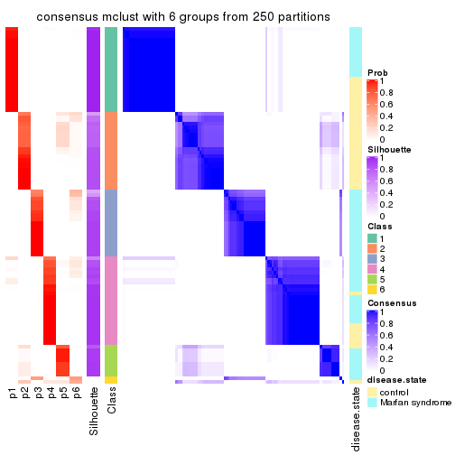</p>

</div>
</div>

Heatmaps for the membership of samples in all partitions to see how consistent they are:


<script>
$( function() {
	$( '#tabs-CV-mclust-membership-heatmap' ).tabs();
} );
</script>
<div id='tabs-CV-mclust-membership-heatmap'>
<ul>
<li><a href='#tab-CV-mclust-membership-heatmap-1'>k = 2</a></li>
<li><a href='#tab-CV-mclust-membership-heatmap-2'>k = 3</a></li>
<li><a href='#tab-CV-mclust-membership-heatmap-3'>k = 4</a></li>
<li><a href='#tab-CV-mclust-membership-heatmap-4'>k = 5</a></li>
<li><a href='#tab-CV-mclust-membership-heatmap-5'>k = 6</a></li>
</ul>
<div id='tab-CV-mclust-membership-heatmap-1'>
<pre><code class="r">membership_heatmap(res, k = 2)
</code></pre>

<p></p>

</div>
<div id='tab-CV-mclust-membership-heatmap-2'>
<pre><code class="r">membership_heatmap(res, k = 3)
</code></pre>

<p></p>

</div>
<div id='tab-CV-mclust-membership-heatmap-3'>
<pre><code class="r">membership_heatmap(res, k = 4)
</code></pre>

<p></p>

</div>
<div id='tab-CV-mclust-membership-heatmap-4'>
<pre><code class="r">membership_heatmap(res, k = 5)
</code></pre>

<p></p>

</div>
<div id='tab-CV-mclust-membership-heatmap-5'>
<pre><code class="r">membership_heatmap(res, k = 6)
</code></pre>

<p></p>

</div>
</div>

As soon as we have had the classes for columns, we can look for signatures
which are significantly different between classes which can be candidate marks
for certain classes. Following are the heatmaps for signatures.


Signature heatmaps where rows are scaled:


<script>
$( function() {
	$( '#tabs-CV-mclust-get-signatures' ).tabs();
} );
</script>
<div id='tabs-CV-mclust-get-signatures'>
<ul>
<li><a href='#tab-CV-mclust-get-signatures-1'>k = 2</a></li>
<li><a href='#tab-CV-mclust-get-signatures-2'>k = 3</a></li>
<li><a href='#tab-CV-mclust-get-signatures-3'>k = 4</a></li>
<li><a href='#tab-CV-mclust-get-signatures-4'>k = 5</a></li>
<li><a href='#tab-CV-mclust-get-signatures-5'>k = 6</a></li>
</ul>
<div id='tab-CV-mclust-get-signatures-1'>
<pre><code class="r">get_signatures(res, k = 2)
</code></pre>

<p></p>

</div>
<div id='tab-CV-mclust-get-signatures-2'>
<pre><code class="r">get_signatures(res, k = 3)
</code></pre>

<p></p>

</div>
<div id='tab-CV-mclust-get-signatures-3'>
<pre><code class="r">get_signatures(res, k = 4)
</code></pre>

<p></p>

</div>
<div id='tab-CV-mclust-get-signatures-4'>
<pre><code class="r">get_signatures(res, k = 5)
</code></pre>

<p></p>

</div>
<div id='tab-CV-mclust-get-signatures-5'>
<pre><code class="r">get_signatures(res, k = 6)
</code></pre>

<p>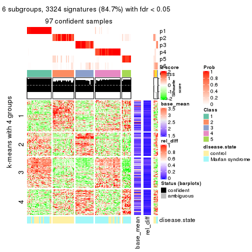</p>

</div>
</div>


Signature heatmaps where rows are not scaled:


<script>
$( function() {
	$( '#tabs-CV-mclust-get-signatures-no-scale' ).tabs();
} );
</script>
<div id='tabs-CV-mclust-get-signatures-no-scale'>
<ul>
<li><a href='#tab-CV-mclust-get-signatures-no-scale-1'>k = 2</a></li>
<li><a href='#tab-CV-mclust-get-signatures-no-scale-2'>k = 3</a></li>
<li><a href='#tab-CV-mclust-get-signatures-no-scale-3'>k = 4</a></li>
<li><a href='#tab-CV-mclust-get-signatures-no-scale-4'>k = 5</a></li>
<li><a href='#tab-CV-mclust-get-signatures-no-scale-5'>k = 6</a></li>
</ul>
<div id='tab-CV-mclust-get-signatures-no-scale-1'>
<pre><code class="r">get_signatures(res, k = 2, scale_rows = FALSE)
</code></pre>

<p></p>

</div>
<div id='tab-CV-mclust-get-signatures-no-scale-2'>
<pre><code class="r">get_signatures(res, k = 3, scale_rows = FALSE)
</code></pre>

<p></p>

</div>
<div id='tab-CV-mclust-get-signatures-no-scale-3'>
<pre><code class="r">get_signatures(res, k = 4, scale_rows = FALSE)
</code></pre>

<p></p>

</div>
<div id='tab-CV-mclust-get-signatures-no-scale-4'>
<pre><code class="r">get_signatures(res, k = 5, scale_rows = FALSE)
</code></pre>

<p>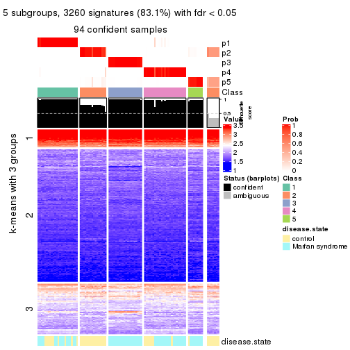</p>

</div>
<div id='tab-CV-mclust-get-signatures-no-scale-5'>
<pre><code class="r">get_signatures(res, k = 6, scale_rows = FALSE)
</code></pre>

<p></p>

</div>
</div>


Compare the overlap of signatures from different k:

```r
compare_signatures(res)
```


`get_signature()` returns a data frame invisibly. TO get the list of signatures, the function
call should be assigned to a variable explicitly. In following code, if `plot` argument is set
to `FALSE`, no heatmap is plotted while only the differential analysis is performed.

```r
# code only for demonstration
tb = get_signature(res, k = ..., plot = FALSE)
```

An example of the output of `tb` is:

```
#>   which_row         fdr    mean_1    mean_2 scaled_mean_1 scaled_mean_2 km
#> 1        38 0.042760348  8.373488  9.131774    -0.5533452     0.5164555  1
#> 2        40 0.018707592  7.106213  8.469186    -0.6173731     0.5762149  1
#> 3        55 0.019134737 10.221463 11.207825    -0.6159697     0.5749050  1
#> 4        59 0.006059896  5.921854  7.869574    -0.6899429     0.6439467  1
#> 5        60 0.018055526  8.928898 10.211722    -0.6204761     0.5791110  1
#> 6        98 0.009384629 15.714769 14.887706     0.6635654    -0.6193277  2
...
```

The columns in `tb` are:

1. `which_row`: row indices corresponding to the input matrix.
2. `fdr`: FDR for the differential test. 
3. `mean_x`: The mean value in group x.
4. `scaled_mean_x`: The mean value in group x after rows are scaled.
5. `km`: Row groups if k-means clustering is applied to rows.


UMAP plot which shows how samples are separated.


<script>
$( function() {
	$( '#tabs-CV-mclust-dimension-reduction' ).tabs();
} );
</script>
<div id='tabs-CV-mclust-dimension-reduction'>
<ul>
<li><a href='#tab-CV-mclust-dimension-reduction-1'>k = 2</a></li>
<li><a href='#tab-CV-mclust-dimension-reduction-2'>k = 3</a></li>
<li><a href='#tab-CV-mclust-dimension-reduction-3'>k = 4</a></li>
<li><a href='#tab-CV-mclust-dimension-reduction-4'>k = 5</a></li>
<li><a href='#tab-CV-mclust-dimension-reduction-5'>k = 6</a></li>
</ul>
<div id='tab-CV-mclust-dimension-reduction-1'>
<pre><code class="r">dimension_reduction(res, k = 2, method = &quot;UMAP&quot;)
</code></pre>

<p></p>

</div>
<div id='tab-CV-mclust-dimension-reduction-2'>
<pre><code class="r">dimension_reduction(res, k = 3, method = &quot;UMAP&quot;)
</code></pre>

<p></p>

</div>
<div id='tab-CV-mclust-dimension-reduction-3'>
<pre><code class="r">dimension_reduction(res, k = 4, method = &quot;UMAP&quot;)
</code></pre>

<p></p>

</div>
<div id='tab-CV-mclust-dimension-reduction-4'>
<pre><code class="r">dimension_reduction(res, k = 5, method = &quot;UMAP&quot;)
</code></pre>

<p>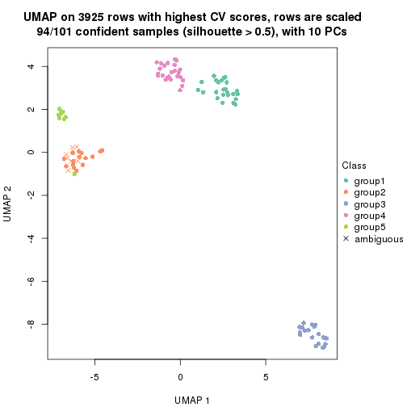</p>

</div>
<div id='tab-CV-mclust-dimension-reduction-5'>
<pre><code class="r">dimension_reduction(res, k = 6, method = &quot;UMAP&quot;)
</code></pre>

<p></p>

</div>
</div>


Following heatmap shows how subgroups are split when increasing `k`:

```r
collect_classes(res)
```


Test correlation between subgroups and known annotations. If the known
annotation is numeric, one-way ANOVA test is applied, and if the known
annotation is discrete, chi-squared contingency table test is applied.

```r
test_to_known_factors(res)
```

```
#>             n disease.state(p) k
#> CV:mclust 101         3.32e-01 2
#> CV:mclust 101         2.94e-07 3
#> CV:mclust  98         2.58e-06 4
#> CV:mclust  94         1.01e-08 5
#> CV:mclust  97         9.11e-10 6
```


If matrix rows can be associated to genes, consider to use `functional_enrichment(res,
...)` to perform function enrichment for the signature genes. See [this vignette](http://bioconductor.org/packages/devel/bioc/vignettes/cola/inst/doc/functional_enrichment.html) for more detailed explanations.


 

---------------------------------------------------


### CV:NMF*


The object with results only for a single top-value method and a single partition method 
can be extracted as:

```r
res = res_list["CV", "NMF"]
# you can also extract it by
# res = res_list["CV:NMF"]
```

A summary of `res` and all the functions that can be applied to it:

```r
res
```

```
#> A 'ConsensusPartition' object with k = 2, 3, 4, 5, 6.
#>   On a matrix with 3925 rows and 101 columns.
#>   Top rows (392, 784, 1177, 1570, 1962) are extracted by 'CV' method.
#>   Subgroups are detected by 'NMF' method.
#>   Performed in total 1250 partitions by row resampling.
#>   Best k for subgroups seems to be 4.
#> 
#> Following methods can be applied to this 'ConsensusPartition' object:
#>  [1] "cola_report"             "collect_classes"         "collect_plots"          
#>  [4] "collect_stats"           "colnames"                "compare_signatures"     
#>  [7] "consensus_heatmap"       "dimension_reduction"     "functional_enrichment"  
#> [10] "get_anno_col"            "get_anno"                "get_classes"            
#> [13] "get_consensus"           "get_matrix"              "get_membership"         
#> [16] "get_param"               "get_signatures"          "get_stats"              
#> [19] "is_best_k"               "is_stable_k"             "membership_heatmap"     
#> [22] "ncol"                    "nrow"                    "plot_ecdf"              
#> [25] "rownames"                "select_partition_number" "show"                   
#> [28] "suggest_best_k"          "test_to_known_factors"
```

`collect_plots()` function collects all the plots made from `res` for all `k` (number of partitions)
into one single page to provide an easy and fast comparison between different `k`.

```r
collect_plots(res)
```


The plots are:

- The first row: a plot of the ECDF (empirical cumulative distribution
  function) curves of the consensus matrix for each `k` and the heatmap of
  predicted classes for each `k`.
- The second row: heatmaps of the consensus matrix for each `k`.
- The third row: heatmaps of the membership matrix for each `k`.
- The fouth row: heatmaps of the signatures for each `k`.

All the plots in panels can be made by individual functions and they are
plotted later in this section.

`select_partition_number()` produces several plots showing different
statistics for choosing "optimized" `k`. There are following statistics:

- ECDF curves of the consensus matrix for each `k`;
- 1-PAC. [The PAC
  score](https://en.wikipedia.org/wiki/Consensus_clustering#Over-interpretation_potential_of_consensus_clustering)
  measures the proportion of the ambiguous subgrouping.
- Mean silhouette score.
- Concordance. The mean probability of fiting the consensus class ids in all
  partitions.
- Area increased. Denote $A_k$ as the area under the ECDF curve for current
  `k`, the area increased is defined as $A_k - A_{k-1}$.
- Rand index. The percent of pairs of samples that are both in a same cluster
  or both are not in a same cluster in the partition of k and k-1.
- Jaccard index. The ratio of pairs of samples are both in a same cluster in
  the partition of k and k-1 and the pairs of samples are both in a same
  cluster in the partition k or k-1.

The detailed explanations of these statistics can be found in [the _cola_
vignette](http://bioconductor.org/packages/devel/bioc/vignettes/cola/inst/doc/cola.html#toc_13).

Generally speaking, lower PAC score, higher mean silhouette score or higher
concordance corresponds to better partition. Rand index and Jaccard index
measure how similar the current partition is compared to partition with `k-1`.
If they are too similar, we won't accept `k` is better than `k-1`.

```r
select_partition_number(res)
```


The numeric values for all these statistics can be obtained by `get_stats()`.

```r
get_stats(res)
```

```
#>   k 1-PAC mean_silhouette concordance area_increased  Rand Jaccard
#> 2 2 1.000           1.000       1.000         0.5051 0.495   0.495
#> 3 3 1.000           0.996       0.998         0.2516 0.873   0.744
#> 4 4 0.905           0.909       0.946         0.1074 0.909   0.759
#> 5 5 0.816           0.744       0.826         0.0710 0.887   0.638
#> 6 6 0.756           0.811       0.825         0.0404 0.928   0.700
```

`suggest_best_k()` suggests the best $k$ based on these statistics. The rules are as follows:

- All $k$ with Jaccard index larger than 0.95 are removed because increasing
  $k$ does not provide enough extra information. If all $k$ are removed, it is
  marked as no subgroup is detected.
- For all $k$ with 1-PAC score larger than 0.9, the maximal $k$ is taken as
  the best $k$, and other $k$ are marked as optional $k$.
- If it does not fit the second rule. The $k$ with the maximal vote of the
  highest 1-PAC score, highest mean silhouette, and highest concordance is
  taken as the best $k$.

```r
suggest_best_k(res)
```

```
#> [1] 4
#> attr(,"optional")
#> [1] 2 3
```

There is also optional best $k$ = 2 3 that is worth to check.

Following shows the table of the partitions (You need to click the **show/hide
code output** link to see it). The membership matrix (columns with name `p*`)
is inferred by
[`clue::cl_consensus()`](https://www.rdocumentation.org/link/cl_consensus?package=clue)
function with the `SE` method. Basically the value in the membership matrix
represents the probability to belong to a certain group. The finall class
label for an item is determined with the group with highest probability it
belongs to.

In `get_classes()` function, the entropy is calculated from the membership
matrix and the silhouette score is calculated from the consensus matrix.


<script>
$( function() {
	$( '#tabs-CV-NMF-get-classes' ).tabs();
} );
</script>
<div id='tabs-CV-NMF-get-classes'>
<ul>
<li><a href='#tab-CV-NMF-get-classes-1'>k = 2</a></li>
<li><a href='#tab-CV-NMF-get-classes-2'>k = 3</a></li>
<li><a href='#tab-CV-NMF-get-classes-3'>k = 4</a></li>
<li><a href='#tab-CV-NMF-get-classes-4'>k = 5</a></li>
<li><a href='#tab-CV-NMF-get-classes-5'>k = 6</a></li>
</ul>

<div id='tab-CV-NMF-get-classes-1'>
<p><a id='tab-CV-NMF-get-classes-1-a' style='color:#0366d6' href='#'>show/hide code output</a></p>
<pre><code class="r">cbind(get_classes(res, k = 2), get_membership(res, k = 2))
</code></pre>

<pre><code>#&gt;           class entropy silhouette    p1    p2
#&gt; GSM217644     2  0.0000      1.000 0.000 1.000
#&gt; GSM217645     2  0.0000      1.000 0.000 1.000
#&gt; GSM217646     2  0.0000      1.000 0.000 1.000
#&gt; GSM217647     2  0.0000      1.000 0.000 1.000
#&gt; GSM217648     2  0.0000      1.000 0.000 1.000
#&gt; GSM217649     2  0.0000      1.000 0.000 1.000
#&gt; GSM217650     2  0.0000      1.000 0.000 1.000
#&gt; GSM217651     2  0.0000      1.000 0.000 1.000
#&gt; GSM217652     2  0.0000      1.000 0.000 1.000
#&gt; GSM217653     2  0.0000      1.000 0.000 1.000
#&gt; GSM217654     2  0.0000      1.000 0.000 1.000
#&gt; GSM217655     2  0.0000      1.000 0.000 1.000
#&gt; GSM217656     2  0.0376      0.996 0.004 0.996
#&gt; GSM217657     2  0.0000      1.000 0.000 1.000
#&gt; GSM217658     2  0.0000      1.000 0.000 1.000
#&gt; GSM217659     2  0.0000      1.000 0.000 1.000
#&gt; GSM217660     2  0.0000      1.000 0.000 1.000
#&gt; GSM217661     2  0.0000      1.000 0.000 1.000
#&gt; GSM217662     2  0.0000      1.000 0.000 1.000
#&gt; GSM217663     2  0.0000      1.000 0.000 1.000
#&gt; GSM217664     2  0.0000      1.000 0.000 1.000
#&gt; GSM217665     2  0.0000      1.000 0.000 1.000
#&gt; GSM217666     2  0.0000      1.000 0.000 1.000
#&gt; GSM217667     2  0.0000      1.000 0.000 1.000
#&gt; GSM217668     1  0.0000      1.000 1.000 0.000
#&gt; GSM217669     1  0.0000      1.000 1.000 0.000
#&gt; GSM217670     1  0.0000      1.000 1.000 0.000
#&gt; GSM217671     1  0.0000      1.000 1.000 0.000
#&gt; GSM217672     1  0.0000      1.000 1.000 0.000
#&gt; GSM217673     1  0.0000      1.000 1.000 0.000
#&gt; GSM217674     1  0.0000      1.000 1.000 0.000
#&gt; GSM217675     1  0.0000      1.000 1.000 0.000
#&gt; GSM217676     1  0.0000      1.000 1.000 0.000
#&gt; GSM217677     1  0.0000      1.000 1.000 0.000
#&gt; GSM217678     1  0.0000      1.000 1.000 0.000
#&gt; GSM217679     1  0.0000      1.000 1.000 0.000
#&gt; GSM217680     1  0.0000      1.000 1.000 0.000
#&gt; GSM217681     1  0.0000      1.000 1.000 0.000
#&gt; GSM217682     1  0.0000      1.000 1.000 0.000
#&gt; GSM217683     1  0.0000      1.000 1.000 0.000
#&gt; GSM217684     1  0.0000      1.000 1.000 0.000
#&gt; GSM217685     2  0.0000      1.000 0.000 1.000
#&gt; GSM217686     2  0.0000      1.000 0.000 1.000
#&gt; GSM217687     2  0.0000      1.000 0.000 1.000
#&gt; GSM217688     2  0.0000      1.000 0.000 1.000
#&gt; GSM217689     2  0.0000      1.000 0.000 1.000
#&gt; GSM217690     2  0.0000      1.000 0.000 1.000
#&gt; GSM217691     2  0.0000      1.000 0.000 1.000
#&gt; GSM217692     2  0.0000      1.000 0.000 1.000
#&gt; GSM217693     2  0.0000      1.000 0.000 1.000
#&gt; GSM217694     2  0.0000      1.000 0.000 1.000
#&gt; GSM217695     2  0.0000      1.000 0.000 1.000
#&gt; GSM217696     2  0.0000      1.000 0.000 1.000
#&gt; GSM217697     2  0.0000      1.000 0.000 1.000
#&gt; GSM217698     2  0.0000      1.000 0.000 1.000
#&gt; GSM217699     2  0.0000      1.000 0.000 1.000
#&gt; GSM217700     2  0.0000      1.000 0.000 1.000
#&gt; GSM217701     2  0.0000      1.000 0.000 1.000
#&gt; GSM217702     2  0.0000      1.000 0.000 1.000
#&gt; GSM217703     2  0.0000      1.000 0.000 1.000
#&gt; GSM217704     2  0.0000      1.000 0.000 1.000
#&gt; GSM217705     1  0.0000      1.000 1.000 0.000
#&gt; GSM217706     1  0.0000      1.000 1.000 0.000
#&gt; GSM217707     1  0.0000      1.000 1.000 0.000
#&gt; GSM217708     1  0.0000      1.000 1.000 0.000
#&gt; GSM217709     1  0.0000      1.000 1.000 0.000
#&gt; GSM217710     1  0.0000      1.000 1.000 0.000
#&gt; GSM217711     1  0.0000      1.000 1.000 0.000
#&gt; GSM217712     1  0.0000      1.000 1.000 0.000
#&gt; GSM217713     1  0.0000      1.000 1.000 0.000
#&gt; GSM217714     1  0.0000      1.000 1.000 0.000
#&gt; GSM217715     1  0.0000      1.000 1.000 0.000
#&gt; GSM217716     1  0.0000      1.000 1.000 0.000
#&gt; GSM217717     1  0.0000      1.000 1.000 0.000
#&gt; GSM217718     1  0.0000      1.000 1.000 0.000
#&gt; GSM217719     1  0.0000      1.000 1.000 0.000
#&gt; GSM217720     1  0.0000      1.000 1.000 0.000
#&gt; GSM217721     1  0.0000      1.000 1.000 0.000
#&gt; GSM217722     1  0.0000      1.000 1.000 0.000
#&gt; GSM217723     1  0.0000      1.000 1.000 0.000
#&gt; GSM217724     1  0.0000      1.000 1.000 0.000
#&gt; GSM217725     1  0.0000      1.000 1.000 0.000
#&gt; GSM217726     1  0.0000      1.000 1.000 0.000
#&gt; GSM217727     1  0.0000      1.000 1.000 0.000
#&gt; GSM217728     1  0.0000      1.000 1.000 0.000
#&gt; GSM217729     1  0.0000      1.000 1.000 0.000
#&gt; GSM217730     1  0.0000      1.000 1.000 0.000
#&gt; GSM217731     1  0.0000      1.000 1.000 0.000
#&gt; GSM217732     1  0.0000      1.000 1.000 0.000
#&gt; GSM217733     1  0.0000      1.000 1.000 0.000
#&gt; GSM217734     1  0.0000      1.000 1.000 0.000
#&gt; GSM217735     1  0.0000      1.000 1.000 0.000
#&gt; GSM217736     1  0.0000      1.000 1.000 0.000
#&gt; GSM217737     2  0.0000      1.000 0.000 1.000
#&gt; GSM217738     2  0.0000      1.000 0.000 1.000
#&gt; GSM217739     2  0.0000      1.000 0.000 1.000
#&gt; GSM217740     2  0.0000      1.000 0.000 1.000
#&gt; GSM217741     2  0.0000      1.000 0.000 1.000
#&gt; GSM217742     2  0.0000      1.000 0.000 1.000
#&gt; GSM217743     2  0.0000      1.000 0.000 1.000
#&gt; GSM217744     2  0.0000      1.000 0.000 1.000
</code></pre>

<script>
$('#tab-CV-NMF-get-classes-1-a').parent().next().next().hide();
$('#tab-CV-NMF-get-classes-1-a').click(function(){
  $('#tab-CV-NMF-get-classes-1-a').parent().next().next().toggle();
  return(false);
});
</script>
</div>

<div id='tab-CV-NMF-get-classes-2'>
<p><a id='tab-CV-NMF-get-classes-2-a' style='color:#0366d6' href='#'>show/hide code output</a></p>
<pre><code class="r">cbind(get_classes(res, k = 3), get_membership(res, k = 3))
</code></pre>

<pre><code>#&gt;           class entropy silhouette    p1    p2    p3
#&gt; GSM217644     2  0.0000      1.000 0.000 1.000 0.000
#&gt; GSM217645     2  0.0000      1.000 0.000 1.000 0.000
#&gt; GSM217646     2  0.0000      1.000 0.000 1.000 0.000
#&gt; GSM217647     2  0.0000      1.000 0.000 1.000 0.000
#&gt; GSM217648     2  0.0000      1.000 0.000 1.000 0.000
#&gt; GSM217649     2  0.0000      1.000 0.000 1.000 0.000
#&gt; GSM217650     2  0.0000      1.000 0.000 1.000 0.000
#&gt; GSM217651     2  0.0000      1.000 0.000 1.000 0.000
#&gt; GSM217652     2  0.0000      1.000 0.000 1.000 0.000
#&gt; GSM217653     2  0.0000      1.000 0.000 1.000 0.000
#&gt; GSM217654     2  0.0000      1.000 0.000 1.000 0.000
#&gt; GSM217655     2  0.0000      1.000 0.000 1.000 0.000
#&gt; GSM217656     2  0.0661      0.987 0.008 0.988 0.004
#&gt; GSM217657     2  0.0000      1.000 0.000 1.000 0.000
#&gt; GSM217658     2  0.0000      1.000 0.000 1.000 0.000
#&gt; GSM217659     2  0.0000      1.000 0.000 1.000 0.000
#&gt; GSM217660     2  0.0000      1.000 0.000 1.000 0.000
#&gt; GSM217661     2  0.0000      1.000 0.000 1.000 0.000
#&gt; GSM217662     2  0.0000      1.000 0.000 1.000 0.000
#&gt; GSM217663     2  0.0000      1.000 0.000 1.000 0.000
#&gt; GSM217664     2  0.0000      1.000 0.000 1.000 0.000
#&gt; GSM217665     2  0.0000      1.000 0.000 1.000 0.000
#&gt; GSM217666     2  0.0000      1.000 0.000 1.000 0.000
#&gt; GSM217667     2  0.0000      1.000 0.000 1.000 0.000
#&gt; GSM217668     1  0.3941      0.812 0.844 0.156 0.000
#&gt; GSM217669     1  0.0000      0.996 1.000 0.000 0.000
#&gt; GSM217670     1  0.0000      0.996 1.000 0.000 0.000
#&gt; GSM217671     1  0.0000      0.996 1.000 0.000 0.000
#&gt; GSM217672     1  0.0000      0.996 1.000 0.000 0.000
#&gt; GSM217673     1  0.0000      0.996 1.000 0.000 0.000
#&gt; GSM217674     1  0.0000      0.996 1.000 0.000 0.000
#&gt; GSM217675     1  0.0000      0.996 1.000 0.000 0.000
#&gt; GSM217676     1  0.0000      0.996 1.000 0.000 0.000
#&gt; GSM217677     1  0.0000      0.996 1.000 0.000 0.000
#&gt; GSM217678     1  0.0000      0.996 1.000 0.000 0.000
#&gt; GSM217679     1  0.0000      0.996 1.000 0.000 0.000
#&gt; GSM217680     1  0.0000      0.996 1.000 0.000 0.000
#&gt; GSM217681     1  0.0000      0.996 1.000 0.000 0.000
#&gt; GSM217682     1  0.0000      0.996 1.000 0.000 0.000
#&gt; GSM217683     1  0.0000      0.996 1.000 0.000 0.000
#&gt; GSM217684     1  0.0000      0.996 1.000 0.000 0.000
#&gt; GSM217685     3  0.0000      1.000 0.000 0.000 1.000
#&gt; GSM217686     3  0.0000      1.000 0.000 0.000 1.000
#&gt; GSM217687     3  0.0000      1.000 0.000 0.000 1.000
#&gt; GSM217688     3  0.0000      1.000 0.000 0.000 1.000
#&gt; GSM217689     3  0.0000      1.000 0.000 0.000 1.000
#&gt; GSM217690     3  0.0000      1.000 0.000 0.000 1.000
#&gt; GSM217691     3  0.0000      1.000 0.000 0.000 1.000
#&gt; GSM217692     3  0.0000      1.000 0.000 0.000 1.000
#&gt; GSM217693     3  0.0000      1.000 0.000 0.000 1.000
#&gt; GSM217694     3  0.0000      1.000 0.000 0.000 1.000
#&gt; GSM217695     3  0.0000      1.000 0.000 0.000 1.000
#&gt; GSM217696     3  0.0000      1.000 0.000 0.000 1.000
#&gt; GSM217697     3  0.0000      1.000 0.000 0.000 1.000
#&gt; GSM217698     3  0.0000      1.000 0.000 0.000 1.000
#&gt; GSM217699     3  0.0000      1.000 0.000 0.000 1.000
#&gt; GSM217700     3  0.0000      1.000 0.000 0.000 1.000
#&gt; GSM217701     3  0.0000      1.000 0.000 0.000 1.000
#&gt; GSM217702     3  0.0000      1.000 0.000 0.000 1.000
#&gt; GSM217703     3  0.0000      1.000 0.000 0.000 1.000
#&gt; GSM217704     3  0.0000      1.000 0.000 0.000 1.000
#&gt; GSM217705     1  0.0000      0.996 1.000 0.000 0.000
#&gt; GSM217706     1  0.0000      0.996 1.000 0.000 0.000
#&gt; GSM217707     1  0.0000      0.996 1.000 0.000 0.000
#&gt; GSM217708     1  0.0000      0.996 1.000 0.000 0.000
#&gt; GSM217709     1  0.0000      0.996 1.000 0.000 0.000
#&gt; GSM217710     1  0.0000      0.996 1.000 0.000 0.000
#&gt; GSM217711     1  0.0000      0.996 1.000 0.000 0.000
#&gt; GSM217712     1  0.0000      0.996 1.000 0.000 0.000
#&gt; GSM217713     1  0.0000      0.996 1.000 0.000 0.000
#&gt; GSM217714     1  0.0000      0.996 1.000 0.000 0.000
#&gt; GSM217715     1  0.0000      0.996 1.000 0.000 0.000
#&gt; GSM217716     1  0.0000      0.996 1.000 0.000 0.000
#&gt; GSM217717     1  0.0000      0.996 1.000 0.000 0.000
#&gt; GSM217718     1  0.0000      0.996 1.000 0.000 0.000
#&gt; GSM217719     1  0.0000      0.996 1.000 0.000 0.000
#&gt; GSM217720     1  0.0000      0.996 1.000 0.000 0.000
#&gt; GSM217721     1  0.0000      0.996 1.000 0.000 0.000
#&gt; GSM217722     1  0.0000      0.996 1.000 0.000 0.000
#&gt; GSM217723     1  0.0000      0.996 1.000 0.000 0.000
#&gt; GSM217724     1  0.0000      0.996 1.000 0.000 0.000
#&gt; GSM217725     1  0.0000      0.996 1.000 0.000 0.000
#&gt; GSM217726     1  0.0000      0.996 1.000 0.000 0.000
#&gt; GSM217727     1  0.0000      0.996 1.000 0.000 0.000
#&gt; GSM217728     1  0.0000      0.996 1.000 0.000 0.000
#&gt; GSM217729     1  0.0000      0.996 1.000 0.000 0.000
#&gt; GSM217730     1  0.0000      0.996 1.000 0.000 0.000
#&gt; GSM217731     1  0.0000      0.996 1.000 0.000 0.000
#&gt; GSM217732     1  0.0000      0.996 1.000 0.000 0.000
#&gt; GSM217733     1  0.0000      0.996 1.000 0.000 0.000
#&gt; GSM217734     1  0.0000      0.996 1.000 0.000 0.000
#&gt; GSM217735     1  0.0000      0.996 1.000 0.000 0.000
#&gt; GSM217736     1  0.0000      0.996 1.000 0.000 0.000
#&gt; GSM217737     2  0.0000      1.000 0.000 1.000 0.000
#&gt; GSM217738     2  0.0000      1.000 0.000 1.000 0.000
#&gt; GSM217739     2  0.0000      1.000 0.000 1.000 0.000
#&gt; GSM217740     2  0.0000      1.000 0.000 1.000 0.000
#&gt; GSM217741     2  0.0000      1.000 0.000 1.000 0.000
#&gt; GSM217742     2  0.0000      1.000 0.000 1.000 0.000
#&gt; GSM217743     2  0.0000      1.000 0.000 1.000 0.000
#&gt; GSM217744     2  0.0000      1.000 0.000 1.000 0.000
</code></pre>

<script>
$('#tab-CV-NMF-get-classes-2-a').parent().next().next().hide();
$('#tab-CV-NMF-get-classes-2-a').click(function(){
  $('#tab-CV-NMF-get-classes-2-a').parent().next().next().toggle();
  return(false);
});
</script>
</div>

<div id='tab-CV-NMF-get-classes-3'>
<p><a id='tab-CV-NMF-get-classes-3-a' style='color:#0366d6' href='#'>show/hide code output</a></p>
<pre><code class="r">cbind(get_classes(res, k = 4), get_membership(res, k = 4))
</code></pre>

<pre><code>#&gt;           class entropy silhouette    p1    p2    p3    p4
#&gt; GSM217644     2  0.0188    0.97500 0.000 0.996 0.000 0.004
#&gt; GSM217645     2  0.0000    0.97589 0.000 1.000 0.000 0.000
#&gt; GSM217646     2  0.0188    0.97518 0.000 0.996 0.000 0.004
#&gt; GSM217647     2  0.0000    0.97589 0.000 1.000 0.000 0.000
#&gt; GSM217648     2  0.0000    0.97589 0.000 1.000 0.000 0.000
#&gt; GSM217649     2  0.0188    0.97518 0.000 0.996 0.000 0.004
#&gt; GSM217650     2  0.0000    0.97589 0.000 1.000 0.000 0.000
#&gt; GSM217651     2  0.0188    0.97500 0.000 0.996 0.000 0.004
#&gt; GSM217652     2  0.0000    0.97589 0.000 1.000 0.000 0.000
#&gt; GSM217653     2  0.0188    0.97500 0.000 0.996 0.000 0.004
#&gt; GSM217654     4  0.4730    0.44767 0.000 0.364 0.000 0.636
#&gt; GSM217655     2  0.2216    0.89689 0.000 0.908 0.000 0.092
#&gt; GSM217656     4  0.2094    0.74870 0.024 0.024 0.012 0.940
#&gt; GSM217657     4  0.3726    0.68165 0.000 0.212 0.000 0.788
#&gt; GSM217658     2  0.0336    0.97374 0.000 0.992 0.000 0.008
#&gt; GSM217659     2  0.0336    0.97374 0.000 0.992 0.000 0.008
#&gt; GSM217660     2  0.2081    0.90767 0.000 0.916 0.000 0.084
#&gt; GSM217661     2  0.0000    0.97589 0.000 1.000 0.000 0.000
#&gt; GSM217662     2  0.0188    0.97500 0.000 0.996 0.000 0.004
#&gt; GSM217663     2  0.0000    0.97589 0.000 1.000 0.000 0.000
#&gt; GSM217664     2  0.0336    0.97374 0.000 0.992 0.000 0.008
#&gt; GSM217665     2  0.0336    0.97374 0.000 0.992 0.000 0.008
#&gt; GSM217666     2  0.0188    0.97516 0.000 0.996 0.000 0.004
#&gt; GSM217667     2  0.0336    0.97374 0.000 0.992 0.000 0.008
#&gt; GSM217668     1  0.4307    0.69677 0.784 0.192 0.000 0.024
#&gt; GSM217669     1  0.1792    0.94407 0.932 0.000 0.000 0.068
#&gt; GSM217670     1  0.0817    0.95227 0.976 0.000 0.000 0.024
#&gt; GSM217671     1  0.0817    0.95246 0.976 0.000 0.000 0.024
#&gt; GSM217672     1  0.0921    0.95240 0.972 0.000 0.000 0.028
#&gt; GSM217673     1  0.0817    0.95227 0.976 0.000 0.000 0.024
#&gt; GSM217674     1  0.0921    0.93795 0.972 0.000 0.000 0.028
#&gt; GSM217675     1  0.0921    0.93795 0.972 0.000 0.000 0.028
#&gt; GSM217676     1  0.0188    0.95234 0.996 0.000 0.000 0.004
#&gt; GSM217677     1  0.0188    0.95073 0.996 0.000 0.000 0.004
#&gt; GSM217678     1  0.0188    0.95234 0.996 0.000 0.000 0.004
#&gt; GSM217679     1  0.0336    0.94949 0.992 0.000 0.000 0.008
#&gt; GSM217680     1  0.0000    0.95174 1.000 0.000 0.000 0.000
#&gt; GSM217681     1  0.0188    0.95073 0.996 0.000 0.000 0.004
#&gt; GSM217682     1  0.0707    0.94310 0.980 0.000 0.000 0.020
#&gt; GSM217683     1  0.0592    0.94543 0.984 0.000 0.000 0.016
#&gt; GSM217684     1  0.1211    0.95154 0.960 0.000 0.000 0.040
#&gt; GSM217685     3  0.0707    0.98247 0.000 0.000 0.980 0.020
#&gt; GSM217686     3  0.0707    0.98247 0.000 0.000 0.980 0.020
#&gt; GSM217687     3  0.0469    0.98690 0.000 0.000 0.988 0.012
#&gt; GSM217688     3  0.0336    0.98862 0.000 0.000 0.992 0.008
#&gt; GSM217689     3  0.2149    0.92058 0.000 0.000 0.912 0.088
#&gt; GSM217690     3  0.0707    0.98247 0.000 0.000 0.980 0.020
#&gt; GSM217691     3  0.0188    0.98962 0.000 0.000 0.996 0.004
#&gt; GSM217692     3  0.0000    0.99096 0.000 0.000 1.000 0.000
#&gt; GSM217693     3  0.0000    0.99096 0.000 0.000 1.000 0.000
#&gt; GSM217694     3  0.0000    0.99096 0.000 0.000 1.000 0.000
#&gt; GSM217695     3  0.0000    0.99096 0.000 0.000 1.000 0.000
#&gt; GSM217696     3  0.0000    0.99096 0.000 0.000 1.000 0.000
#&gt; GSM217697     3  0.0000    0.99096 0.000 0.000 1.000 0.000
#&gt; GSM217698     3  0.0188    0.98999 0.000 0.000 0.996 0.004
#&gt; GSM217699     3  0.0000    0.99096 0.000 0.000 1.000 0.000
#&gt; GSM217700     3  0.0188    0.98962 0.000 0.000 0.996 0.004
#&gt; GSM217701     3  0.0000    0.99096 0.000 0.000 1.000 0.000
#&gt; GSM217702     3  0.0000    0.99096 0.000 0.000 1.000 0.000
#&gt; GSM217703     4  0.3172    0.62981 0.000 0.000 0.160 0.840
#&gt; GSM217704     3  0.0188    0.98962 0.000 0.000 0.996 0.004
#&gt; GSM217705     1  0.1792    0.94407 0.932 0.000 0.000 0.068
#&gt; GSM217706     1  0.1792    0.94407 0.932 0.000 0.000 0.068
#&gt; GSM217707     1  0.1792    0.94407 0.932 0.000 0.000 0.068
#&gt; GSM217708     4  0.4877    0.29727 0.408 0.000 0.000 0.592
#&gt; GSM217709     4  0.3356    0.70586 0.176 0.000 0.000 0.824
#&gt; GSM217710     4  0.2973    0.72373 0.144 0.000 0.000 0.856
#&gt; GSM217711     4  0.1792    0.74440 0.068 0.000 0.000 0.932
#&gt; GSM217712     1  0.2216    0.93023 0.908 0.000 0.000 0.092
#&gt; GSM217713     1  0.1940    0.94023 0.924 0.000 0.000 0.076
#&gt; GSM217714     1  0.1792    0.94407 0.932 0.000 0.000 0.068
#&gt; GSM217715     1  0.1792    0.94407 0.932 0.000 0.000 0.068
#&gt; GSM217716     1  0.1867    0.94235 0.928 0.000 0.000 0.072
#&gt; GSM217717     1  0.2011    0.93786 0.920 0.000 0.000 0.080
#&gt; GSM217718     4  0.4999   -0.00356 0.492 0.000 0.000 0.508
#&gt; GSM217719     1  0.2760    0.89617 0.872 0.000 0.000 0.128
#&gt; GSM217720     1  0.1792    0.94407 0.932 0.000 0.000 0.068
#&gt; GSM217721     1  0.2345    0.92428 0.900 0.000 0.000 0.100
#&gt; GSM217722     1  0.1792    0.94407 0.932 0.000 0.000 0.068
#&gt; GSM217723     1  0.2081    0.93549 0.916 0.000 0.000 0.084
#&gt; GSM217724     1  0.1792    0.94407 0.932 0.000 0.000 0.068
#&gt; GSM217725     1  0.3219    0.85157 0.836 0.000 0.000 0.164
#&gt; GSM217726     1  0.0188    0.95073 0.996 0.000 0.000 0.004
#&gt; GSM217727     1  0.0336    0.94949 0.992 0.000 0.000 0.008
#&gt; GSM217728     1  0.2216    0.93032 0.908 0.000 0.000 0.092
#&gt; GSM217729     1  0.0000    0.95174 1.000 0.000 0.000 0.000
#&gt; GSM217730     1  0.0000    0.95174 1.000 0.000 0.000 0.000
#&gt; GSM217731     1  0.0000    0.95174 1.000 0.000 0.000 0.000
#&gt; GSM217732     1  0.0188    0.95073 0.996 0.000 0.000 0.004
#&gt; GSM217733     1  0.0188    0.95073 0.996 0.000 0.000 0.004
#&gt; GSM217734     1  0.0469    0.94750 0.988 0.000 0.000 0.012
#&gt; GSM217735     1  0.0188    0.95073 0.996 0.000 0.000 0.004
#&gt; GSM217736     1  0.0188    0.95073 0.996 0.000 0.000 0.004
#&gt; GSM217737     4  0.3610    0.68930 0.000 0.200 0.000 0.800
#&gt; GSM217738     4  0.2704    0.73871 0.000 0.124 0.000 0.876
#&gt; GSM217739     4  0.2647    0.74039 0.000 0.120 0.000 0.880
#&gt; GSM217740     4  0.2647    0.74039 0.000 0.120 0.000 0.880
#&gt; GSM217741     2  0.0707    0.96615 0.000 0.980 0.000 0.020
#&gt; GSM217742     2  0.3444    0.77841 0.000 0.816 0.000 0.184
#&gt; GSM217743     2  0.1792    0.92710 0.000 0.932 0.000 0.068
#&gt; GSM217744     2  0.0921    0.96131 0.000 0.972 0.000 0.028
</code></pre>

<script>
$('#tab-CV-NMF-get-classes-3-a').parent().next().next().hide();
$('#tab-CV-NMF-get-classes-3-a').click(function(){
  $('#tab-CV-NMF-get-classes-3-a').parent().next().next().toggle();
  return(false);
});
</script>
</div>

<div id='tab-CV-NMF-get-classes-4'>
<p><a id='tab-CV-NMF-get-classes-4-a' style='color:#0366d6' href='#'>show/hide code output</a></p>
<pre><code class="r">cbind(get_classes(res, k = 5), get_membership(res, k = 5))
</code></pre>

<pre><code>#&gt;           class entropy silhouette    p1    p2    p3    p4    p5
#&gt; GSM217644     2  0.1195     0.9132 0.028 0.960 0.000 0.000 0.012
#&gt; GSM217645     2  0.0703     0.9145 0.024 0.976 0.000 0.000 0.000
#&gt; GSM217646     2  0.0798     0.9158 0.016 0.976 0.000 0.000 0.008
#&gt; GSM217647     2  0.0609     0.9121 0.020 0.980 0.000 0.000 0.000
#&gt; GSM217648     2  0.1117     0.9150 0.020 0.964 0.000 0.000 0.016
#&gt; GSM217649     2  0.0771     0.9156 0.020 0.976 0.000 0.000 0.004
#&gt; GSM217650     2  0.1205     0.9109 0.040 0.956 0.000 0.000 0.004
#&gt; GSM217651     2  0.1668     0.9063 0.032 0.940 0.000 0.000 0.028
#&gt; GSM217652     2  0.0510     0.9159 0.016 0.984 0.000 0.000 0.000
#&gt; GSM217653     2  0.0912     0.9141 0.016 0.972 0.000 0.000 0.012
#&gt; GSM217654     5  0.4108     0.4719 0.008 0.308 0.000 0.000 0.684
#&gt; GSM217655     2  0.3291     0.8248 0.040 0.840 0.000 0.000 0.120
#&gt; GSM217656     5  0.0807     0.7888 0.012 0.000 0.000 0.012 0.976
#&gt; GSM217657     5  0.1106     0.7908 0.012 0.024 0.000 0.000 0.964
#&gt; GSM217658     2  0.1041     0.9126 0.032 0.964 0.000 0.000 0.004
#&gt; GSM217659     2  0.1205     0.9108 0.040 0.956 0.000 0.000 0.004
#&gt; GSM217660     2  0.2843     0.8275 0.008 0.848 0.000 0.000 0.144
#&gt; GSM217661     2  0.0807     0.9160 0.012 0.976 0.000 0.000 0.012
#&gt; GSM217662     2  0.1012     0.9146 0.020 0.968 0.000 0.000 0.012
#&gt; GSM217663     2  0.0963     0.9081 0.036 0.964 0.000 0.000 0.000
#&gt; GSM217664     2  0.0703     0.9144 0.024 0.976 0.000 0.000 0.000
#&gt; GSM217665     2  0.0609     0.9130 0.020 0.980 0.000 0.000 0.000
#&gt; GSM217666     2  0.1043     0.9069 0.040 0.960 0.000 0.000 0.000
#&gt; GSM217667     2  0.0963     0.9081 0.036 0.964 0.000 0.000 0.000
#&gt; GSM217668     4  0.1493     0.7151 0.024 0.028 0.000 0.948 0.000
#&gt; GSM217669     4  0.0000     0.7685 0.000 0.000 0.000 1.000 0.000
#&gt; GSM217670     4  0.0703     0.7463 0.024 0.000 0.000 0.976 0.000
#&gt; GSM217671     4  0.0703     0.7602 0.024 0.000 0.000 0.976 0.000
#&gt; GSM217672     4  0.0404     0.7659 0.012 0.000 0.000 0.988 0.000
#&gt; GSM217673     4  0.0404     0.7659 0.012 0.000 0.000 0.988 0.000
#&gt; GSM217674     1  0.4696     0.8549 0.556 0.016 0.000 0.428 0.000
#&gt; GSM217675     1  0.4297     0.9300 0.528 0.000 0.000 0.472 0.000
#&gt; GSM217676     1  0.4300     0.9313 0.524 0.000 0.000 0.476 0.000
#&gt; GSM217677     1  0.4287     0.9256 0.540 0.000 0.000 0.460 0.000
#&gt; GSM217678     1  0.4305     0.9261 0.512 0.000 0.000 0.488 0.000
#&gt; GSM217679     1  0.4300     0.9314 0.524 0.000 0.000 0.476 0.000
#&gt; GSM217680     1  0.4307     0.9098 0.504 0.000 0.000 0.496 0.000
#&gt; GSM217681     1  0.4306     0.9035 0.508 0.000 0.000 0.492 0.000
#&gt; GSM217682     1  0.4287     0.9256 0.540 0.000 0.000 0.460 0.000
#&gt; GSM217683     1  0.4294     0.9274 0.532 0.000 0.000 0.468 0.000
#&gt; GSM217684     4  0.1544     0.7051 0.068 0.000 0.000 0.932 0.000
#&gt; GSM217685     3  0.0671     0.9805 0.004 0.000 0.980 0.000 0.016
#&gt; GSM217686     3  0.1310     0.9698 0.024 0.000 0.956 0.000 0.020
#&gt; GSM217687     3  0.0693     0.9811 0.008 0.000 0.980 0.000 0.012
#&gt; GSM217688     3  0.0807     0.9800 0.012 0.000 0.976 0.000 0.012
#&gt; GSM217689     3  0.2189     0.9147 0.012 0.000 0.904 0.000 0.084
#&gt; GSM217690     3  0.1211     0.9722 0.016 0.000 0.960 0.000 0.024
#&gt; GSM217691     3  0.0000     0.9855 0.000 0.000 1.000 0.000 0.000
#&gt; GSM217692     3  0.0000     0.9855 0.000 0.000 1.000 0.000 0.000
#&gt; GSM217693     3  0.0510     0.9820 0.016 0.000 0.984 0.000 0.000
#&gt; GSM217694     3  0.0290     0.9852 0.008 0.000 0.992 0.000 0.000
#&gt; GSM217695     3  0.0162     0.9856 0.004 0.000 0.996 0.000 0.000
#&gt; GSM217696     3  0.0162     0.9852 0.004 0.000 0.996 0.000 0.000
#&gt; GSM217697     3  0.0609     0.9809 0.020 0.000 0.980 0.000 0.000
#&gt; GSM217698     3  0.0000     0.9855 0.000 0.000 1.000 0.000 0.000
#&gt; GSM217699     3  0.0162     0.9856 0.004 0.000 0.996 0.000 0.000
#&gt; GSM217700     3  0.0162     0.9856 0.004 0.000 0.996 0.000 0.000
#&gt; GSM217701     3  0.0162     0.9856 0.004 0.000 0.996 0.000 0.000
#&gt; GSM217702     3  0.0162     0.9856 0.004 0.000 0.996 0.000 0.000
#&gt; GSM217703     5  0.4108     0.4572 0.008 0.000 0.308 0.000 0.684
#&gt; GSM217704     3  0.0162     0.9852 0.004 0.000 0.996 0.000 0.000
#&gt; GSM217705     4  0.0290     0.7675 0.008 0.000 0.000 0.992 0.000
#&gt; GSM217706     4  0.0000     0.7685 0.000 0.000 0.000 1.000 0.000
#&gt; GSM217707     4  0.0000     0.7685 0.000 0.000 0.000 1.000 0.000
#&gt; GSM217708     4  0.0566     0.7615 0.004 0.000 0.000 0.984 0.012
#&gt; GSM217709     4  0.3957     0.3352 0.008 0.000 0.000 0.712 0.280
#&gt; GSM217710     5  0.4452     0.2525 0.004 0.000 0.000 0.496 0.500
#&gt; GSM217711     5  0.4047     0.5770 0.004 0.000 0.000 0.320 0.676
#&gt; GSM217712     4  0.0324     0.7659 0.004 0.000 0.000 0.992 0.004
#&gt; GSM217713     4  0.0000     0.7685 0.000 0.000 0.000 1.000 0.000
#&gt; GSM217714     4  0.0000     0.7685 0.000 0.000 0.000 1.000 0.000
#&gt; GSM217715     4  0.0000     0.7685 0.000 0.000 0.000 1.000 0.000
#&gt; GSM217716     4  0.0000     0.7685 0.000 0.000 0.000 1.000 0.000
#&gt; GSM217717     4  0.0451     0.7645 0.008 0.000 0.000 0.988 0.004
#&gt; GSM217718     4  0.0898     0.7580 0.020 0.000 0.000 0.972 0.008
#&gt; GSM217719     4  0.1041     0.7512 0.032 0.000 0.000 0.964 0.004
#&gt; GSM217720     4  0.0609     0.7614 0.020 0.000 0.000 0.980 0.000
#&gt; GSM217721     4  0.0566     0.7622 0.012 0.000 0.000 0.984 0.004
#&gt; GSM217722     4  0.0000     0.7685 0.000 0.000 0.000 1.000 0.000
#&gt; GSM217723     4  0.2677     0.5806 0.112 0.000 0.000 0.872 0.016
#&gt; GSM217724     4  0.3508     0.0511 0.252 0.000 0.000 0.748 0.000
#&gt; GSM217725     1  0.6416     0.5922 0.480 0.000 0.000 0.332 0.188
#&gt; GSM217726     1  0.4304     0.9290 0.516 0.000 0.000 0.484 0.000
#&gt; GSM217727     1  0.4297     0.9300 0.528 0.000 0.000 0.472 0.000
#&gt; GSM217728     4  0.4979    -0.8860 0.480 0.000 0.000 0.492 0.028
#&gt; GSM217729     4  0.4305    -0.8981 0.488 0.000 0.000 0.512 0.000
#&gt; GSM217730     4  0.4307    -0.9054 0.500 0.000 0.000 0.500 0.000
#&gt; GSM217731     4  0.4304    -0.8907 0.484 0.000 0.000 0.516 0.000
#&gt; GSM217732     1  0.4302     0.9121 0.520 0.000 0.000 0.480 0.000
#&gt; GSM217733     4  0.4300    -0.8550 0.476 0.000 0.000 0.524 0.000
#&gt; GSM217734     1  0.4304     0.9158 0.516 0.000 0.000 0.484 0.000
#&gt; GSM217735     1  0.4300     0.9155 0.524 0.000 0.000 0.476 0.000
#&gt; GSM217736     1  0.4305     0.9248 0.512 0.000 0.000 0.488 0.000
#&gt; GSM217737     5  0.2561     0.7571 0.020 0.096 0.000 0.000 0.884
#&gt; GSM217738     5  0.2304     0.7856 0.044 0.048 0.000 0.000 0.908
#&gt; GSM217739     5  0.2300     0.7825 0.072 0.024 0.000 0.000 0.904
#&gt; GSM217740     5  0.1661     0.7906 0.036 0.024 0.000 0.000 0.940
#&gt; GSM217741     2  0.4167     0.7314 0.252 0.724 0.000 0.000 0.024
#&gt; GSM217742     2  0.5725     0.5810 0.224 0.620 0.000 0.000 0.156
#&gt; GSM217743     2  0.4935     0.5958 0.344 0.616 0.000 0.000 0.040
#&gt; GSM217744     2  0.4491     0.6438 0.328 0.652 0.000 0.000 0.020
</code></pre>

<script>
$('#tab-CV-NMF-get-classes-4-a').parent().next().next().hide();
$('#tab-CV-NMF-get-classes-4-a').click(function(){
  $('#tab-CV-NMF-get-classes-4-a').parent().next().next().toggle();
  return(false);
});
</script>
</div>

<div id='tab-CV-NMF-get-classes-5'>
<p><a id='tab-CV-NMF-get-classes-5-a' style='color:#0366d6' href='#'>show/hide code output</a></p>
<pre><code class="r">cbind(get_classes(res, k = 6), get_membership(res, k = 6))
</code></pre>

<pre><code>#&gt;           class entropy silhouette    p1    p2    p3    p4    p5    p6
#&gt; GSM217644     2  0.0692     0.9230 0.004 0.976 0.000 0.000 0.000 0.020
#&gt; GSM217645     2  0.2222     0.8964 0.024 0.916 0.000 0.008 0.028 0.024
#&gt; GSM217646     2  0.0858     0.9223 0.000 0.968 0.000 0.000 0.028 0.004
#&gt; GSM217647     2  0.0790     0.9248 0.000 0.968 0.000 0.000 0.032 0.000
#&gt; GSM217648     2  0.1049     0.9183 0.000 0.960 0.000 0.000 0.032 0.008
#&gt; GSM217649     2  0.1285     0.9100 0.000 0.944 0.000 0.000 0.052 0.004
#&gt; GSM217650     2  0.1871     0.9017 0.032 0.928 0.000 0.000 0.016 0.024
#&gt; GSM217651     2  0.1861     0.9099 0.020 0.928 0.000 0.000 0.016 0.036
#&gt; GSM217652     2  0.2215     0.9033 0.024 0.916 0.000 0.008 0.032 0.020
#&gt; GSM217653     2  0.0692     0.9262 0.000 0.976 0.000 0.000 0.020 0.004
#&gt; GSM217654     6  0.3996     0.0741 0.004 0.352 0.000 0.000 0.008 0.636
#&gt; GSM217655     2  0.4391     0.6943 0.068 0.772 0.000 0.000 0.080 0.080
#&gt; GSM217656     6  0.1773     0.4617 0.000 0.036 0.000 0.016 0.016 0.932
#&gt; GSM217657     6  0.1951     0.4301 0.004 0.060 0.000 0.000 0.020 0.916
#&gt; GSM217658     2  0.1798     0.9050 0.028 0.932 0.000 0.000 0.020 0.020
#&gt; GSM217659     2  0.0405     0.9255 0.000 0.988 0.000 0.000 0.008 0.004
#&gt; GSM217660     2  0.3047     0.7978 0.004 0.848 0.000 0.000 0.084 0.064
#&gt; GSM217661     2  0.2062     0.8677 0.008 0.900 0.000 0.000 0.088 0.004
#&gt; GSM217662     2  0.1620     0.9223 0.012 0.940 0.000 0.000 0.024 0.024
#&gt; GSM217663     2  0.1010     0.9244 0.000 0.960 0.000 0.000 0.036 0.004
#&gt; GSM217664     2  0.1630     0.9110 0.024 0.940 0.000 0.000 0.016 0.020
#&gt; GSM217665     2  0.0713     0.9261 0.000 0.972 0.000 0.000 0.028 0.000
#&gt; GSM217666     2  0.1075     0.9176 0.000 0.952 0.000 0.000 0.048 0.000
#&gt; GSM217667     2  0.1152     0.9224 0.000 0.952 0.000 0.000 0.044 0.004
#&gt; GSM217668     4  0.2604     0.8039 0.064 0.004 0.000 0.884 0.044 0.004
#&gt; GSM217669     4  0.1218     0.8556 0.028 0.000 0.000 0.956 0.004 0.012
#&gt; GSM217670     4  0.1387     0.8361 0.068 0.000 0.000 0.932 0.000 0.000
#&gt; GSM217671     4  0.3141     0.7402 0.200 0.000 0.000 0.788 0.012 0.000
#&gt; GSM217672     4  0.1714     0.8342 0.092 0.000 0.000 0.908 0.000 0.000
#&gt; GSM217673     4  0.1141     0.8539 0.052 0.000 0.000 0.948 0.000 0.000
#&gt; GSM217674     1  0.4483     0.8686 0.664 0.004 0.004 0.288 0.040 0.000
#&gt; GSM217675     1  0.4865     0.8315 0.572 0.008 0.000 0.372 0.048 0.000
#&gt; GSM217676     1  0.4743     0.8510 0.600 0.000 0.000 0.348 0.044 0.008
#&gt; GSM217677     1  0.3758     0.9039 0.700 0.000 0.000 0.284 0.016 0.000
#&gt; GSM217678     1  0.3954     0.8986 0.636 0.000 0.000 0.352 0.012 0.000
#&gt; GSM217679     1  0.3809     0.9091 0.684 0.000 0.004 0.304 0.008 0.000
#&gt; GSM217680     1  0.3428     0.9043 0.696 0.000 0.000 0.304 0.000 0.000
#&gt; GSM217681     1  0.3619     0.9026 0.680 0.000 0.000 0.316 0.004 0.000
#&gt; GSM217682     1  0.4308     0.8975 0.664 0.000 0.008 0.300 0.028 0.000
#&gt; GSM217683     1  0.4452     0.8817 0.644 0.000 0.004 0.312 0.040 0.000
#&gt; GSM217684     4  0.2882     0.7600 0.180 0.000 0.000 0.812 0.008 0.000
#&gt; GSM217685     3  0.0692     0.9719 0.000 0.000 0.976 0.000 0.004 0.020
#&gt; GSM217686     3  0.0692     0.9719 0.000 0.000 0.976 0.000 0.004 0.020
#&gt; GSM217687     3  0.0508     0.9755 0.004 0.000 0.984 0.000 0.000 0.012
#&gt; GSM217688     3  0.0458     0.9748 0.000 0.000 0.984 0.000 0.000 0.016
#&gt; GSM217689     3  0.2915     0.8514 0.008 0.000 0.848 0.000 0.024 0.120
#&gt; GSM217690     3  0.1737     0.9446 0.008 0.000 0.932 0.000 0.020 0.040
#&gt; GSM217691     3  0.1151     0.9586 0.032 0.000 0.956 0.000 0.012 0.000
#&gt; GSM217692     3  0.0622     0.9740 0.012 0.000 0.980 0.000 0.008 0.000
#&gt; GSM217693     3  0.0858     0.9719 0.004 0.000 0.968 0.000 0.028 0.000
#&gt; GSM217694     3  0.0820     0.9733 0.012 0.000 0.972 0.000 0.016 0.000
#&gt; GSM217695     3  0.0725     0.9742 0.012 0.000 0.976 0.000 0.012 0.000
#&gt; GSM217696     3  0.0260     0.9767 0.000 0.000 0.992 0.000 0.008 0.000
#&gt; GSM217697     3  0.0748     0.9743 0.004 0.000 0.976 0.000 0.016 0.004
#&gt; GSM217698     3  0.0260     0.9764 0.008 0.000 0.992 0.000 0.000 0.000
#&gt; GSM217699     3  0.0146     0.9764 0.000 0.000 0.996 0.000 0.000 0.004
#&gt; GSM217700     3  0.0000     0.9766 0.000 0.000 1.000 0.000 0.000 0.000
#&gt; GSM217701     3  0.0000     0.9766 0.000 0.000 1.000 0.000 0.000 0.000
#&gt; GSM217702     3  0.0000     0.9766 0.000 0.000 1.000 0.000 0.000 0.000
#&gt; GSM217703     6  0.3797     0.3223 0.000 0.000 0.292 0.000 0.016 0.692
#&gt; GSM217704     3  0.0405     0.9758 0.008 0.000 0.988 0.000 0.004 0.000
#&gt; GSM217705     4  0.1327     0.8549 0.064 0.000 0.000 0.936 0.000 0.000
#&gt; GSM217706     4  0.1078     0.8535 0.016 0.000 0.000 0.964 0.012 0.008
#&gt; GSM217707     4  0.1269     0.8482 0.020 0.000 0.000 0.956 0.012 0.012
#&gt; GSM217708     4  0.1398     0.8353 0.000 0.000 0.000 0.940 0.008 0.052
#&gt; GSM217709     4  0.3245     0.5829 0.000 0.000 0.000 0.764 0.008 0.228
#&gt; GSM217710     4  0.4067     0.0422 0.000 0.000 0.000 0.548 0.008 0.444
#&gt; GSM217711     6  0.4234     0.2910 0.004 0.000 0.000 0.372 0.016 0.608
#&gt; GSM217712     4  0.1078     0.8558 0.016 0.000 0.000 0.964 0.008 0.012
#&gt; GSM217713     4  0.0713     0.8548 0.028 0.000 0.000 0.972 0.000 0.000
#&gt; GSM217714     4  0.0748     0.8580 0.016 0.000 0.000 0.976 0.004 0.004
#&gt; GSM217715     4  0.0508     0.8577 0.012 0.000 0.000 0.984 0.000 0.004
#&gt; GSM217716     4  0.2790     0.7819 0.132 0.000 0.000 0.844 0.024 0.000
#&gt; GSM217717     4  0.1563     0.8497 0.056 0.000 0.000 0.932 0.012 0.000
#&gt; GSM217718     4  0.2794     0.8055 0.144 0.000 0.000 0.840 0.012 0.004
#&gt; GSM217719     4  0.3236     0.7716 0.180 0.000 0.000 0.796 0.024 0.000
#&gt; GSM217720     4  0.2473     0.8217 0.136 0.000 0.000 0.856 0.008 0.000
#&gt; GSM217721     4  0.1138     0.8616 0.012 0.000 0.000 0.960 0.024 0.004
#&gt; GSM217722     4  0.0508     0.8600 0.012 0.000 0.000 0.984 0.004 0.000
#&gt; GSM217723     4  0.3127     0.7885 0.056 0.000 0.000 0.840 0.004 0.100
#&gt; GSM217724     4  0.3352     0.6309 0.172 0.000 0.000 0.800 0.012 0.016
#&gt; GSM217725     1  0.5754     0.6993 0.536 0.000 0.000 0.248 0.004 0.212
#&gt; GSM217726     1  0.4210     0.8905 0.636 0.000 0.000 0.336 0.028 0.000
#&gt; GSM217727     1  0.4278     0.8928 0.632 0.000 0.000 0.336 0.032 0.000
#&gt; GSM217728     1  0.4238     0.8982 0.628 0.000 0.000 0.344 0.000 0.028
#&gt; GSM217729     1  0.3634     0.8972 0.644 0.000 0.000 0.356 0.000 0.000
#&gt; GSM217730     1  0.3741     0.8968 0.672 0.000 0.000 0.320 0.008 0.000
#&gt; GSM217731     1  0.3804     0.8984 0.656 0.000 0.000 0.336 0.008 0.000
#&gt; GSM217732     1  0.3494     0.8340 0.736 0.000 0.000 0.252 0.012 0.000
#&gt; GSM217733     1  0.3833     0.8804 0.648 0.000 0.000 0.344 0.008 0.000
#&gt; GSM217734     1  0.3547     0.9010 0.696 0.000 0.000 0.300 0.004 0.000
#&gt; GSM217735     1  0.3490     0.8523 0.724 0.000 0.000 0.268 0.008 0.000
#&gt; GSM217736     1  0.3619     0.9093 0.680 0.000 0.000 0.316 0.004 0.000
#&gt; GSM217737     5  0.5873     0.4386 0.028 0.104 0.000 0.000 0.492 0.376
#&gt; GSM217738     5  0.5593     0.4191 0.020 0.084 0.000 0.000 0.488 0.408
#&gt; GSM217739     5  0.5185     0.4101 0.016 0.056 0.000 0.000 0.536 0.392
#&gt; GSM217740     5  0.4948     0.3778 0.000 0.064 0.000 0.000 0.472 0.464
#&gt; GSM217741     5  0.4494     0.3798 0.012 0.464 0.000 0.000 0.512 0.012
#&gt; GSM217742     5  0.5752     0.5347 0.004 0.396 0.000 0.000 0.452 0.148
#&gt; GSM217743     5  0.4397     0.5529 0.012 0.336 0.000 0.000 0.632 0.020
#&gt; GSM217744     5  0.4446     0.4326 0.016 0.424 0.000 0.000 0.552 0.008
</code></pre>

<script>
$('#tab-CV-NMF-get-classes-5-a').parent().next().next().hide();
$('#tab-CV-NMF-get-classes-5-a').click(function(){
  $('#tab-CV-NMF-get-classes-5-a').parent().next().next().toggle();
  return(false);
});
</script>
</div>
</div>

Heatmaps for the consensus matrix. It visualizes the probability of two
samples to be in a same group.


<script>
$( function() {
	$( '#tabs-CV-NMF-consensus-heatmap' ).tabs();
} );
</script>
<div id='tabs-CV-NMF-consensus-heatmap'>
<ul>
<li><a href='#tab-CV-NMF-consensus-heatmap-1'>k = 2</a></li>
<li><a href='#tab-CV-NMF-consensus-heatmap-2'>k = 3</a></li>
<li><a href='#tab-CV-NMF-consensus-heatmap-3'>k = 4</a></li>
<li><a href='#tab-CV-NMF-consensus-heatmap-4'>k = 5</a></li>
<li><a href='#tab-CV-NMF-consensus-heatmap-5'>k = 6</a></li>
</ul>
<div id='tab-CV-NMF-consensus-heatmap-1'>
<pre><code class="r">consensus_heatmap(res, k = 2)
</code></pre>

<p></p>

</div>
<div id='tab-CV-NMF-consensus-heatmap-2'>
<pre><code class="r">consensus_heatmap(res, k = 3)
</code></pre>

<p></p>

</div>
<div id='tab-CV-NMF-consensus-heatmap-3'>
<pre><code class="r">consensus_heatmap(res, k = 4)
</code></pre>

<p></p>

</div>
<div id='tab-CV-NMF-consensus-heatmap-4'>
<pre><code class="r">consensus_heatmap(res, k = 5)
</code></pre>

<p></p>

</div>
<div id='tab-CV-NMF-consensus-heatmap-5'>
<pre><code class="r">consensus_heatmap(res, k = 6)
</code></pre>

<p></p>

</div>
</div>

Heatmaps for the membership of samples in all partitions to see how consistent they are:


<script>
$( function() {
	$( '#tabs-CV-NMF-membership-heatmap' ).tabs();
} );
</script>
<div id='tabs-CV-NMF-membership-heatmap'>
<ul>
<li><a href='#tab-CV-NMF-membership-heatmap-1'>k = 2</a></li>
<li><a href='#tab-CV-NMF-membership-heatmap-2'>k = 3</a></li>
<li><a href='#tab-CV-NMF-membership-heatmap-3'>k = 4</a></li>
<li><a href='#tab-CV-NMF-membership-heatmap-4'>k = 5</a></li>
<li><a href='#tab-CV-NMF-membership-heatmap-5'>k = 6</a></li>
</ul>
<div id='tab-CV-NMF-membership-heatmap-1'>
<pre><code class="r">membership_heatmap(res, k = 2)
</code></pre>

<p></p>

</div>
<div id='tab-CV-NMF-membership-heatmap-2'>
<pre><code class="r">membership_heatmap(res, k = 3)
</code></pre>

<p></p>

</div>
<div id='tab-CV-NMF-membership-heatmap-3'>
<pre><code class="r">membership_heatmap(res, k = 4)
</code></pre>

<p></p>

</div>
<div id='tab-CV-NMF-membership-heatmap-4'>
<pre><code class="r">membership_heatmap(res, k = 5)
</code></pre>

<p></p>

</div>
<div id='tab-CV-NMF-membership-heatmap-5'>
<pre><code class="r">membership_heatmap(res, k = 6)
</code></pre>

<p></p>

</div>
</div>

As soon as we have had the classes for columns, we can look for signatures
which are significantly different between classes which can be candidate marks
for certain classes. Following are the heatmaps for signatures.


Signature heatmaps where rows are scaled:


<script>
$( function() {
	$( '#tabs-CV-NMF-get-signatures' ).tabs();
} );
</script>
<div id='tabs-CV-NMF-get-signatures'>
<ul>
<li><a href='#tab-CV-NMF-get-signatures-1'>k = 2</a></li>
<li><a href='#tab-CV-NMF-get-signatures-2'>k = 3</a></li>
<li><a href='#tab-CV-NMF-get-signatures-3'>k = 4</a></li>
<li><a href='#tab-CV-NMF-get-signatures-4'>k = 5</a></li>
<li><a href='#tab-CV-NMF-get-signatures-5'>k = 6</a></li>
</ul>
<div id='tab-CV-NMF-get-signatures-1'>
<pre><code class="r">get_signatures(res, k = 2)
</code></pre>

<p></p>

</div>
<div id='tab-CV-NMF-get-signatures-2'>
<pre><code class="r">get_signatures(res, k = 3)
</code></pre>

<p></p>

</div>
<div id='tab-CV-NMF-get-signatures-3'>
<pre><code class="r">get_signatures(res, k = 4)
</code></pre>

<p></p>

</div>
<div id='tab-CV-NMF-get-signatures-4'>
<pre><code class="r">get_signatures(res, k = 5)
</code></pre>

<p></p>

</div>
<div id='tab-CV-NMF-get-signatures-5'>
<pre><code class="r">get_signatures(res, k = 6)
</code></pre>

<p></p>

</div>
</div>


Signature heatmaps where rows are not scaled:


<script>
$( function() {
	$( '#tabs-CV-NMF-get-signatures-no-scale' ).tabs();
} );
</script>
<div id='tabs-CV-NMF-get-signatures-no-scale'>
<ul>
<li><a href='#tab-CV-NMF-get-signatures-no-scale-1'>k = 2</a></li>
<li><a href='#tab-CV-NMF-get-signatures-no-scale-2'>k = 3</a></li>
<li><a href='#tab-CV-NMF-get-signatures-no-scale-3'>k = 4</a></li>
<li><a href='#tab-CV-NMF-get-signatures-no-scale-4'>k = 5</a></li>
<li><a href='#tab-CV-NMF-get-signatures-no-scale-5'>k = 6</a></li>
</ul>
<div id='tab-CV-NMF-get-signatures-no-scale-1'>
<pre><code class="r">get_signatures(res, k = 2, scale_rows = FALSE)
</code></pre>

<p></p>

</div>
<div id='tab-CV-NMF-get-signatures-no-scale-2'>
<pre><code class="r">get_signatures(res, k = 3, scale_rows = FALSE)
</code></pre>

<p></p>

</div>
<div id='tab-CV-NMF-get-signatures-no-scale-3'>
<pre><code class="r">get_signatures(res, k = 4, scale_rows = FALSE)
</code></pre>

<p></p>

</div>
<div id='tab-CV-NMF-get-signatures-no-scale-4'>
<pre><code class="r">get_signatures(res, k = 5, scale_rows = FALSE)
</code></pre>

<p></p>

</div>
<div id='tab-CV-NMF-get-signatures-no-scale-5'>
<pre><code class="r">get_signatures(res, k = 6, scale_rows = FALSE)
</code></pre>

<p></p>

</div>
</div>


Compare the overlap of signatures from different k:

```r
compare_signatures(res)
```


`get_signature()` returns a data frame invisibly. TO get the list of signatures, the function
call should be assigned to a variable explicitly. In following code, if `plot` argument is set
to `FALSE`, no heatmap is plotted while only the differential analysis is performed.

```r
# code only for demonstration
tb = get_signature(res, k = ..., plot = FALSE)
```

An example of the output of `tb` is:

```
#>   which_row         fdr    mean_1    mean_2 scaled_mean_1 scaled_mean_2 km
#> 1        38 0.042760348  8.373488  9.131774    -0.5533452     0.5164555  1
#> 2        40 0.018707592  7.106213  8.469186    -0.6173731     0.5762149  1
#> 3        55 0.019134737 10.221463 11.207825    -0.6159697     0.5749050  1
#> 4        59 0.006059896  5.921854  7.869574    -0.6899429     0.6439467  1
#> 5        60 0.018055526  8.928898 10.211722    -0.6204761     0.5791110  1
#> 6        98 0.009384629 15.714769 14.887706     0.6635654    -0.6193277  2
...
```

The columns in `tb` are:

1. `which_row`: row indices corresponding to the input matrix.
2. `fdr`: FDR for the differential test. 
3. `mean_x`: The mean value in group x.
4. `scaled_mean_x`: The mean value in group x after rows are scaled.
5. `km`: Row groups if k-means clustering is applied to rows.


UMAP plot which shows how samples are separated.


<script>
$( function() {
	$( '#tabs-CV-NMF-dimension-reduction' ).tabs();
} );
</script>
<div id='tabs-CV-NMF-dimension-reduction'>
<ul>
<li><a href='#tab-CV-NMF-dimension-reduction-1'>k = 2</a></li>
<li><a href='#tab-CV-NMF-dimension-reduction-2'>k = 3</a></li>
<li><a href='#tab-CV-NMF-dimension-reduction-3'>k = 4</a></li>
<li><a href='#tab-CV-NMF-dimension-reduction-4'>k = 5</a></li>
<li><a href='#tab-CV-NMF-dimension-reduction-5'>k = 6</a></li>
</ul>
<div id='tab-CV-NMF-dimension-reduction-1'>
<pre><code class="r">dimension_reduction(res, k = 2, method = &quot;UMAP&quot;)
</code></pre>

<p></p>

</div>
<div id='tab-CV-NMF-dimension-reduction-2'>
<pre><code class="r">dimension_reduction(res, k = 3, method = &quot;UMAP&quot;)
</code></pre>

<p></p>

</div>
<div id='tab-CV-NMF-dimension-reduction-3'>
<pre><code class="r">dimension_reduction(res, k = 4, method = &quot;UMAP&quot;)
</code></pre>

<p></p>

</div>
<div id='tab-CV-NMF-dimension-reduction-4'>
<pre><code class="r">dimension_reduction(res, k = 5, method = &quot;UMAP&quot;)
</code></pre>

<p></p>

</div>
<div id='tab-CV-NMF-dimension-reduction-5'>
<pre><code class="r">dimension_reduction(res, k = 6, method = &quot;UMAP&quot;)
</code></pre>

<p></p>

</div>
</div>


Following heatmap shows how subgroups are split when increasing `k`:

```r
collect_classes(res)
```


Test correlation between subgroups and known annotations. If the known
annotation is numeric, one-way ANOVA test is applied, and if the known
annotation is discrete, chi-squared contingency table test is applied.

```r
test_to_known_factors(res)
```

```
#>          n disease.state(p) k
#> CV:NMF 101         3.32e-01 2
#> CV:NMF 101         2.94e-07 3
#> CV:NMF  98         1.73e-07 4
#> CV:NMF  91         4.47e-07 5
#> CV:NMF  89         2.34e-09 6
```


If matrix rows can be associated to genes, consider to use `functional_enrichment(res,
...)` to perform function enrichment for the signature genes. See [this vignette](http://bioconductor.org/packages/devel/bioc/vignettes/cola/inst/doc/functional_enrichment.html) for more detailed explanations.


 

---------------------------------------------------


### MAD:hclust**


The object with results only for a single top-value method and a single partition method 
can be extracted as:

```r
res = res_list["MAD", "hclust"]
# you can also extract it by
# res = res_list["MAD:hclust"]
```

A summary of `res` and all the functions that can be applied to it:

```r
res
```

```
#> A 'ConsensusPartition' object with k = 2, 3, 4, 5, 6.
#>   On a matrix with 3925 rows and 101 columns.
#>   Top rows (392, 784, 1177, 1570, 1962) are extracted by 'MAD' method.
#>   Subgroups are detected by 'hclust' method.
#>   Performed in total 1250 partitions by row resampling.
#>   Best k for subgroups seems to be 3.
#> 
#> Following methods can be applied to this 'ConsensusPartition' object:
#>  [1] "cola_report"             "collect_classes"         "collect_plots"          
#>  [4] "collect_stats"           "colnames"                "compare_signatures"     
#>  [7] "consensus_heatmap"       "dimension_reduction"     "functional_enrichment"  
#> [10] "get_anno_col"            "get_anno"                "get_classes"            
#> [13] "get_consensus"           "get_matrix"              "get_membership"         
#> [16] "get_param"               "get_signatures"          "get_stats"              
#> [19] "is_best_k"               "is_stable_k"             "membership_heatmap"     
#> [22] "ncol"                    "nrow"                    "plot_ecdf"              
#> [25] "rownames"                "select_partition_number" "show"                   
#> [28] "suggest_best_k"          "test_to_known_factors"
```

`collect_plots()` function collects all the plots made from `res` for all `k` (number of partitions)
into one single page to provide an easy and fast comparison between different `k`.

```r
collect_plots(res)
```


The plots are:

- The first row: a plot of the ECDF (empirical cumulative distribution
  function) curves of the consensus matrix for each `k` and the heatmap of
  predicted classes for each `k`.
- The second row: heatmaps of the consensus matrix for each `k`.
- The third row: heatmaps of the membership matrix for each `k`.
- The fouth row: heatmaps of the signatures for each `k`.

All the plots in panels can be made by individual functions and they are
plotted later in this section.

`select_partition_number()` produces several plots showing different
statistics for choosing "optimized" `k`. There are following statistics:

- ECDF curves of the consensus matrix for each `k`;
- 1-PAC. [The PAC
  score](https://en.wikipedia.org/wiki/Consensus_clustering#Over-interpretation_potential_of_consensus_clustering)
  measures the proportion of the ambiguous subgrouping.
- Mean silhouette score.
- Concordance. The mean probability of fiting the consensus class ids in all
  partitions.
- Area increased. Denote $A_k$ as the area under the ECDF curve for current
  `k`, the area increased is defined as $A_k - A_{k-1}$.
- Rand index. The percent of pairs of samples that are both in a same cluster
  or both are not in a same cluster in the partition of k and k-1.
- Jaccard index. The ratio of pairs of samples are both in a same cluster in
  the partition of k and k-1 and the pairs of samples are both in a same
  cluster in the partition k or k-1.

The detailed explanations of these statistics can be found in [the _cola_
vignette](http://bioconductor.org/packages/devel/bioc/vignettes/cola/inst/doc/cola.html#toc_13).

Generally speaking, lower PAC score, higher mean silhouette score or higher
concordance corresponds to better partition. Rand index and Jaccard index
measure how similar the current partition is compared to partition with `k-1`.
If they are too similar, we won't accept `k` is better than `k-1`.

```r
select_partition_number(res)
```


The numeric values for all these statistics can be obtained by `get_stats()`.

```r
get_stats(res)
```

```
#>   k 1-PAC mean_silhouette concordance area_increased  Rand Jaccard
#> 2 2 1.000           0.994       0.996         0.5041 0.495   0.495
#> 3 3 0.961           0.934       0.965         0.2597 0.873   0.744
#> 4 4 0.828           0.865       0.922         0.0694 0.983   0.953
#> 5 5 0.786           0.723       0.865         0.1139 0.882   0.665
#> 6 6 0.766           0.711       0.854         0.0386 0.967   0.858
```

`suggest_best_k()` suggests the best $k$ based on these statistics. The rules are as follows:

- All $k$ with Jaccard index larger than 0.95 are removed because increasing
  $k$ does not provide enough extra information. If all $k$ are removed, it is
  marked as no subgroup is detected.
- For all $k$ with 1-PAC score larger than 0.9, the maximal $k$ is taken as
  the best $k$, and other $k$ are marked as optional $k$.
- If it does not fit the second rule. The $k$ with the maximal vote of the
  highest 1-PAC score, highest mean silhouette, and highest concordance is
  taken as the best $k$.

```r
suggest_best_k(res)
```

```
#> [1] 3
#> attr(,"optional")
#> [1] 2
```

There is also optional best $k$ = 2 that is worth to check.

Following shows the table of the partitions (You need to click the **show/hide
code output** link to see it). The membership matrix (columns with name `p*`)
is inferred by
[`clue::cl_consensus()`](https://www.rdocumentation.org/link/cl_consensus?package=clue)
function with the `SE` method. Basically the value in the membership matrix
represents the probability to belong to a certain group. The finall class
label for an item is determined with the group with highest probability it
belongs to.

In `get_classes()` function, the entropy is calculated from the membership
matrix and the silhouette score is calculated from the consensus matrix.


<script>
$( function() {
	$( '#tabs-MAD-hclust-get-classes' ).tabs();
} );
</script>
<div id='tabs-MAD-hclust-get-classes'>
<ul>
<li><a href='#tab-MAD-hclust-get-classes-1'>k = 2</a></li>
<li><a href='#tab-MAD-hclust-get-classes-2'>k = 3</a></li>
<li><a href='#tab-MAD-hclust-get-classes-3'>k = 4</a></li>
<li><a href='#tab-MAD-hclust-get-classes-4'>k = 5</a></li>
<li><a href='#tab-MAD-hclust-get-classes-5'>k = 6</a></li>
</ul>

<div id='tab-MAD-hclust-get-classes-1'>
<p><a id='tab-MAD-hclust-get-classes-1-a' style='color:#0366d6' href='#'>show/hide code output</a></p>
<pre><code class="r">cbind(get_classes(res, k = 2), get_membership(res, k = 2))
</code></pre>

<pre><code>#&gt;           class entropy silhouette    p1    p2
#&gt; GSM217644     2  0.0000      0.998 0.000 1.000
#&gt; GSM217645     2  0.0000      0.998 0.000 1.000
#&gt; GSM217646     2  0.0000      0.998 0.000 1.000
#&gt; GSM217647     2  0.0000      0.998 0.000 1.000
#&gt; GSM217648     2  0.0000      0.998 0.000 1.000
#&gt; GSM217649     2  0.0000      0.998 0.000 1.000
#&gt; GSM217650     2  0.0000      0.998 0.000 1.000
#&gt; GSM217651     2  0.0000      0.998 0.000 1.000
#&gt; GSM217652     2  0.0000      0.998 0.000 1.000
#&gt; GSM217653     2  0.0000      0.998 0.000 1.000
#&gt; GSM217654     2  0.0000      0.998 0.000 1.000
#&gt; GSM217655     2  0.0000      0.998 0.000 1.000
#&gt; GSM217656     2  0.0376      0.998 0.004 0.996
#&gt; GSM217657     2  0.0376      0.998 0.004 0.996
#&gt; GSM217658     2  0.0000      0.998 0.000 1.000
#&gt; GSM217659     2  0.0000      0.998 0.000 1.000
#&gt; GSM217660     2  0.0000      0.998 0.000 1.000
#&gt; GSM217661     2  0.0000      0.998 0.000 1.000
#&gt; GSM217662     2  0.0000      0.998 0.000 1.000
#&gt; GSM217663     2  0.0000      0.998 0.000 1.000
#&gt; GSM217664     2  0.0000      0.998 0.000 1.000
#&gt; GSM217665     2  0.0000      0.998 0.000 1.000
#&gt; GSM217666     2  0.0000      0.998 0.000 1.000
#&gt; GSM217667     2  0.0000      0.998 0.000 1.000
#&gt; GSM217668     1  0.0000      0.994 1.000 0.000
#&gt; GSM217669     1  0.0376      0.992 0.996 0.004
#&gt; GSM217670     1  0.0000      0.994 1.000 0.000
#&gt; GSM217671     1  0.0000      0.994 1.000 0.000
#&gt; GSM217672     1  0.0000      0.994 1.000 0.000
#&gt; GSM217673     1  0.0000      0.994 1.000 0.000
#&gt; GSM217674     1  0.0000      0.994 1.000 0.000
#&gt; GSM217675     1  0.0000      0.994 1.000 0.000
#&gt; GSM217676     1  0.1184      0.985 0.984 0.016
#&gt; GSM217677     1  0.0000      0.994 1.000 0.000
#&gt; GSM217678     1  0.0000      0.994 1.000 0.000
#&gt; GSM217679     1  0.0000      0.994 1.000 0.000
#&gt; GSM217680     1  0.0000      0.994 1.000 0.000
#&gt; GSM217681     1  0.0000      0.994 1.000 0.000
#&gt; GSM217682     1  0.0000      0.994 1.000 0.000
#&gt; GSM217683     1  0.0000      0.994 1.000 0.000
#&gt; GSM217684     1  0.0000      0.994 1.000 0.000
#&gt; GSM217685     2  0.0376      0.998 0.004 0.996
#&gt; GSM217686     2  0.0376      0.998 0.004 0.996
#&gt; GSM217687     2  0.0376      0.998 0.004 0.996
#&gt; GSM217688     2  0.0376      0.998 0.004 0.996
#&gt; GSM217689     2  0.0376      0.998 0.004 0.996
#&gt; GSM217690     2  0.0376      0.998 0.004 0.996
#&gt; GSM217691     2  0.0376      0.998 0.004 0.996
#&gt; GSM217692     2  0.0376      0.998 0.004 0.996
#&gt; GSM217693     2  0.0376      0.998 0.004 0.996
#&gt; GSM217694     2  0.0376      0.998 0.004 0.996
#&gt; GSM217695     2  0.0376      0.998 0.004 0.996
#&gt; GSM217696     2  0.0376      0.998 0.004 0.996
#&gt; GSM217697     2  0.0376      0.998 0.004 0.996
#&gt; GSM217698     2  0.0376      0.998 0.004 0.996
#&gt; GSM217699     2  0.0376      0.998 0.004 0.996
#&gt; GSM217700     2  0.0376      0.998 0.004 0.996
#&gt; GSM217701     2  0.0376      0.998 0.004 0.996
#&gt; GSM217702     2  0.0376      0.998 0.004 0.996
#&gt; GSM217703     2  0.0376      0.998 0.004 0.996
#&gt; GSM217704     2  0.0376      0.998 0.004 0.996
#&gt; GSM217705     1  0.0000      0.994 1.000 0.000
#&gt; GSM217706     1  0.0000      0.994 1.000 0.000
#&gt; GSM217707     1  0.0000      0.994 1.000 0.000
#&gt; GSM217708     1  0.1633      0.979 0.976 0.024
#&gt; GSM217709     1  0.2043      0.973 0.968 0.032
#&gt; GSM217710     1  0.2043      0.973 0.968 0.032
#&gt; GSM217711     1  0.2043      0.973 0.968 0.032
#&gt; GSM217712     1  0.0000      0.994 1.000 0.000
#&gt; GSM217713     1  0.0000      0.994 1.000 0.000
#&gt; GSM217714     1  0.0000      0.994 1.000 0.000
#&gt; GSM217715     1  0.0000      0.994 1.000 0.000
#&gt; GSM217716     1  0.0376      0.993 0.996 0.004
#&gt; GSM217717     1  0.0376      0.993 0.996 0.004
#&gt; GSM217718     1  0.0376      0.993 0.996 0.004
#&gt; GSM217719     1  0.0376      0.993 0.996 0.004
#&gt; GSM217720     1  0.0000      0.994 1.000 0.000
#&gt; GSM217721     1  0.0376      0.993 0.996 0.004
#&gt; GSM217722     1  0.0000      0.994 1.000 0.000
#&gt; GSM217723     1  0.2043      0.973 0.968 0.032
#&gt; GSM217724     1  0.1633      0.979 0.976 0.024
#&gt; GSM217725     1  0.2043      0.973 0.968 0.032
#&gt; GSM217726     1  0.0000      0.994 1.000 0.000
#&gt; GSM217727     1  0.0000      0.994 1.000 0.000
#&gt; GSM217728     1  0.2043      0.973 0.968 0.032
#&gt; GSM217729     1  0.0000      0.994 1.000 0.000
#&gt; GSM217730     1  0.0000      0.994 1.000 0.000
#&gt; GSM217731     1  0.0000      0.994 1.000 0.000
#&gt; GSM217732     1  0.0000      0.994 1.000 0.000
#&gt; GSM217733     1  0.0000      0.994 1.000 0.000
#&gt; GSM217734     1  0.0000      0.994 1.000 0.000
#&gt; GSM217735     1  0.0000      0.994 1.000 0.000
#&gt; GSM217736     1  0.0000      0.994 1.000 0.000
#&gt; GSM217737     2  0.0000      0.998 0.000 1.000
#&gt; GSM217738     2  0.0000      0.998 0.000 1.000
#&gt; GSM217739     2  0.0000      0.998 0.000 1.000
#&gt; GSM217740     2  0.0000      0.998 0.000 1.000
#&gt; GSM217741     2  0.0000      0.998 0.000 1.000
#&gt; GSM217742     2  0.0000      0.998 0.000 1.000
#&gt; GSM217743     2  0.0000      0.998 0.000 1.000
#&gt; GSM217744     2  0.0000      0.998 0.000 1.000
</code></pre>

<script>
$('#tab-MAD-hclust-get-classes-1-a').parent().next().next().hide();
$('#tab-MAD-hclust-get-classes-1-a').click(function(){
  $('#tab-MAD-hclust-get-classes-1-a').parent().next().next().toggle();
  return(false);
});
</script>
</div>

<div id='tab-MAD-hclust-get-classes-2'>
<p><a id='tab-MAD-hclust-get-classes-2-a' style='color:#0366d6' href='#'>show/hide code output</a></p>
<pre><code class="r">cbind(get_classes(res, k = 3), get_membership(res, k = 3))
</code></pre>

<pre><code>#&gt;           class entropy silhouette    p1    p2    p3
#&gt; GSM217644     2  0.5431      0.686 0.000 0.716 0.284
#&gt; GSM217645     2  0.2537      0.871 0.000 0.920 0.080
#&gt; GSM217646     2  0.0000      0.894 0.000 1.000 0.000
#&gt; GSM217647     2  0.0000      0.894 0.000 1.000 0.000
#&gt; GSM217648     2  0.0000      0.894 0.000 1.000 0.000
#&gt; GSM217649     2  0.0000      0.894 0.000 1.000 0.000
#&gt; GSM217650     2  0.1860      0.886 0.000 0.948 0.052
#&gt; GSM217651     2  0.1860      0.886 0.000 0.948 0.052
#&gt; GSM217652     2  0.1529      0.889 0.000 0.960 0.040
#&gt; GSM217653     2  0.1753      0.887 0.000 0.952 0.048
#&gt; GSM217654     2  0.6008      0.556 0.000 0.628 0.372
#&gt; GSM217655     2  0.6008      0.556 0.000 0.628 0.372
#&gt; GSM217656     2  0.6307      0.281 0.000 0.512 0.488
#&gt; GSM217657     2  0.6307      0.281 0.000 0.512 0.488
#&gt; GSM217658     2  0.1163      0.891 0.000 0.972 0.028
#&gt; GSM217659     2  0.0000      0.894 0.000 1.000 0.000
#&gt; GSM217660     2  0.5733      0.624 0.000 0.676 0.324
#&gt; GSM217661     2  0.4178      0.805 0.000 0.828 0.172
#&gt; GSM217662     2  0.1860      0.886 0.000 0.948 0.052
#&gt; GSM217663     2  0.1753      0.887 0.000 0.952 0.048
#&gt; GSM217664     2  0.0000      0.894 0.000 1.000 0.000
#&gt; GSM217665     2  0.0000      0.894 0.000 1.000 0.000
#&gt; GSM217666     2  0.0000      0.894 0.000 1.000 0.000
#&gt; GSM217667     2  0.0000      0.894 0.000 1.000 0.000
#&gt; GSM217668     1  0.0000      0.994 1.000 0.000 0.000
#&gt; GSM217669     1  0.0237      0.992 0.996 0.000 0.004
#&gt; GSM217670     1  0.0000      0.994 1.000 0.000 0.000
#&gt; GSM217671     1  0.0000      0.994 1.000 0.000 0.000
#&gt; GSM217672     1  0.0000      0.994 1.000 0.000 0.000
#&gt; GSM217673     1  0.0000      0.994 1.000 0.000 0.000
#&gt; GSM217674     1  0.0000      0.994 1.000 0.000 0.000
#&gt; GSM217675     1  0.0000      0.994 1.000 0.000 0.000
#&gt; GSM217676     1  0.0892      0.981 0.980 0.000 0.020
#&gt; GSM217677     1  0.0000      0.994 1.000 0.000 0.000
#&gt; GSM217678     1  0.0000      0.994 1.000 0.000 0.000
#&gt; GSM217679     1  0.0000      0.994 1.000 0.000 0.000
#&gt; GSM217680     1  0.0000      0.994 1.000 0.000 0.000
#&gt; GSM217681     1  0.0000      0.994 1.000 0.000 0.000
#&gt; GSM217682     1  0.0000      0.994 1.000 0.000 0.000
#&gt; GSM217683     1  0.0000      0.994 1.000 0.000 0.000
#&gt; GSM217684     1  0.0000      0.994 1.000 0.000 0.000
#&gt; GSM217685     3  0.0000      1.000 0.000 0.000 1.000
#&gt; GSM217686     3  0.0000      1.000 0.000 0.000 1.000
#&gt; GSM217687     3  0.0000      1.000 0.000 0.000 1.000
#&gt; GSM217688     3  0.0000      1.000 0.000 0.000 1.000
#&gt; GSM217689     3  0.0000      1.000 0.000 0.000 1.000
#&gt; GSM217690     3  0.0000      1.000 0.000 0.000 1.000
#&gt; GSM217691     3  0.0000      1.000 0.000 0.000 1.000
#&gt; GSM217692     3  0.0000      1.000 0.000 0.000 1.000
#&gt; GSM217693     3  0.0000      1.000 0.000 0.000 1.000
#&gt; GSM217694     3  0.0000      1.000 0.000 0.000 1.000
#&gt; GSM217695     3  0.0000      1.000 0.000 0.000 1.000
#&gt; GSM217696     3  0.0000      1.000 0.000 0.000 1.000
#&gt; GSM217697     3  0.0000      1.000 0.000 0.000 1.000
#&gt; GSM217698     3  0.0000      1.000 0.000 0.000 1.000
#&gt; GSM217699     3  0.0000      1.000 0.000 0.000 1.000
#&gt; GSM217700     3  0.0000      1.000 0.000 0.000 1.000
#&gt; GSM217701     3  0.0000      1.000 0.000 0.000 1.000
#&gt; GSM217702     3  0.0000      1.000 0.000 0.000 1.000
#&gt; GSM217703     3  0.0000      1.000 0.000 0.000 1.000
#&gt; GSM217704     3  0.0000      1.000 0.000 0.000 1.000
#&gt; GSM217705     1  0.0000      0.994 1.000 0.000 0.000
#&gt; GSM217706     1  0.0000      0.994 1.000 0.000 0.000
#&gt; GSM217707     1  0.0000      0.994 1.000 0.000 0.000
#&gt; GSM217708     1  0.1163      0.976 0.972 0.000 0.028
#&gt; GSM217709     1  0.1411      0.969 0.964 0.000 0.036
#&gt; GSM217710     1  0.1411      0.969 0.964 0.000 0.036
#&gt; GSM217711     1  0.1411      0.969 0.964 0.000 0.036
#&gt; GSM217712     1  0.0000      0.994 1.000 0.000 0.000
#&gt; GSM217713     1  0.0000      0.994 1.000 0.000 0.000
#&gt; GSM217714     1  0.0000      0.994 1.000 0.000 0.000
#&gt; GSM217715     1  0.0000      0.994 1.000 0.000 0.000
#&gt; GSM217716     1  0.0237      0.992 0.996 0.000 0.004
#&gt; GSM217717     1  0.0237      0.992 0.996 0.000 0.004
#&gt; GSM217718     1  0.0237      0.992 0.996 0.000 0.004
#&gt; GSM217719     1  0.0237      0.992 0.996 0.000 0.004
#&gt; GSM217720     1  0.0000      0.994 1.000 0.000 0.000
#&gt; GSM217721     1  0.0237      0.992 0.996 0.000 0.004
#&gt; GSM217722     1  0.0000      0.994 1.000 0.000 0.000
#&gt; GSM217723     1  0.1411      0.969 0.964 0.000 0.036
#&gt; GSM217724     1  0.1163      0.976 0.972 0.000 0.028
#&gt; GSM217725     1  0.1411      0.969 0.964 0.000 0.036
#&gt; GSM217726     1  0.0000      0.994 1.000 0.000 0.000
#&gt; GSM217727     1  0.0000      0.994 1.000 0.000 0.000
#&gt; GSM217728     1  0.1411      0.969 0.964 0.000 0.036
#&gt; GSM217729     1  0.0000      0.994 1.000 0.000 0.000
#&gt; GSM217730     1  0.0000      0.994 1.000 0.000 0.000
#&gt; GSM217731     1  0.0000      0.994 1.000 0.000 0.000
#&gt; GSM217732     1  0.0000      0.994 1.000 0.000 0.000
#&gt; GSM217733     1  0.0000      0.994 1.000 0.000 0.000
#&gt; GSM217734     1  0.0000      0.994 1.000 0.000 0.000
#&gt; GSM217735     1  0.0000      0.994 1.000 0.000 0.000
#&gt; GSM217736     1  0.0000      0.994 1.000 0.000 0.000
#&gt; GSM217737     2  0.4002      0.803 0.000 0.840 0.160
#&gt; GSM217738     2  0.4002      0.803 0.000 0.840 0.160
#&gt; GSM217739     2  0.0000      0.894 0.000 1.000 0.000
#&gt; GSM217740     2  0.0000      0.894 0.000 1.000 0.000
#&gt; GSM217741     2  0.0000      0.894 0.000 1.000 0.000
#&gt; GSM217742     2  0.0000      0.894 0.000 1.000 0.000
#&gt; GSM217743     2  0.0000      0.894 0.000 1.000 0.000
#&gt; GSM217744     2  0.0000      0.894 0.000 1.000 0.000
</code></pre>

<script>
$('#tab-MAD-hclust-get-classes-2-a').parent().next().next().hide();
$('#tab-MAD-hclust-get-classes-2-a').click(function(){
  $('#tab-MAD-hclust-get-classes-2-a').parent().next().next().toggle();
  return(false);
});
</script>
</div>

<div id='tab-MAD-hclust-get-classes-3'>
<p><a id='tab-MAD-hclust-get-classes-3-a' style='color:#0366d6' href='#'>show/hide code output</a></p>
<pre><code class="r">cbind(get_classes(res, k = 4), get_membership(res, k = 4))
</code></pre>

<pre><code>#&gt;           class entropy silhouette    p1    p2 p3    p4
#&gt; GSM217644     2  0.4817     0.0825 0.000 0.612  0 0.388
#&gt; GSM217645     2  0.2647     0.7867 0.000 0.880  0 0.120
#&gt; GSM217646     2  0.0000     0.8750 0.000 1.000  0 0.000
#&gt; GSM217647     2  0.0000     0.8750 0.000 1.000  0 0.000
#&gt; GSM217648     2  0.0000     0.8750 0.000 1.000  0 0.000
#&gt; GSM217649     2  0.0000     0.8750 0.000 1.000  0 0.000
#&gt; GSM217650     2  0.1637     0.8502 0.000 0.940  0 0.060
#&gt; GSM217651     2  0.1637     0.8502 0.000 0.940  0 0.060
#&gt; GSM217652     2  0.1474     0.8551 0.000 0.948  0 0.052
#&gt; GSM217653     2  0.1637     0.8502 0.000 0.940  0 0.060
#&gt; GSM217654     4  0.4907     0.4953 0.000 0.420  0 0.580
#&gt; GSM217655     2  0.4996    -0.3491 0.000 0.516  0 0.484
#&gt; GSM217656     4  0.3610     0.8243 0.000 0.200  0 0.800
#&gt; GSM217657     4  0.3610     0.8243 0.000 0.200  0 0.800
#&gt; GSM217658     2  0.1211     0.8607 0.000 0.960  0 0.040
#&gt; GSM217659     2  0.0000     0.8750 0.000 1.000  0 0.000
#&gt; GSM217660     2  0.4888    -0.0850 0.000 0.588  0 0.412
#&gt; GSM217661     2  0.3569     0.6691 0.000 0.804  0 0.196
#&gt; GSM217662     2  0.1716     0.8469 0.000 0.936  0 0.064
#&gt; GSM217663     2  0.1637     0.8502 0.000 0.940  0 0.060
#&gt; GSM217664     2  0.0000     0.8750 0.000 1.000  0 0.000
#&gt; GSM217665     2  0.0000     0.8750 0.000 1.000  0 0.000
#&gt; GSM217666     2  0.0000     0.8750 0.000 1.000  0 0.000
#&gt; GSM217667     2  0.0000     0.8750 0.000 1.000  0 0.000
#&gt; GSM217668     1  0.0000     0.9086 1.000 0.000  0 0.000
#&gt; GSM217669     1  0.0188     0.9081 0.996 0.000  0 0.004
#&gt; GSM217670     1  0.0000     0.9086 1.000 0.000  0 0.000
#&gt; GSM217671     1  0.0000     0.9086 1.000 0.000  0 0.000
#&gt; GSM217672     1  0.0000     0.9086 1.000 0.000  0 0.000
#&gt; GSM217673     1  0.0000     0.9086 1.000 0.000  0 0.000
#&gt; GSM217674     1  0.3569     0.8851 0.804 0.000  0 0.196
#&gt; GSM217675     1  0.3569     0.8851 0.804 0.000  0 0.196
#&gt; GSM217676     1  0.3764     0.8773 0.784 0.000  0 0.216
#&gt; GSM217677     1  0.3569     0.8851 0.804 0.000  0 0.196
#&gt; GSM217678     1  0.3569     0.8851 0.804 0.000  0 0.196
#&gt; GSM217679     1  0.3569     0.8851 0.804 0.000  0 0.196
#&gt; GSM217680     1  0.3569     0.8851 0.804 0.000  0 0.196
#&gt; GSM217681     1  0.3569     0.8851 0.804 0.000  0 0.196
#&gt; GSM217682     1  0.3569     0.8851 0.804 0.000  0 0.196
#&gt; GSM217683     1  0.3569     0.8851 0.804 0.000  0 0.196
#&gt; GSM217684     1  0.0188     0.9090 0.996 0.000  0 0.004
#&gt; GSM217685     3  0.0000     1.0000 0.000 0.000  1 0.000
#&gt; GSM217686     3  0.0000     1.0000 0.000 0.000  1 0.000
#&gt; GSM217687     3  0.0000     1.0000 0.000 0.000  1 0.000
#&gt; GSM217688     3  0.0000     1.0000 0.000 0.000  1 0.000
#&gt; GSM217689     3  0.0000     1.0000 0.000 0.000  1 0.000
#&gt; GSM217690     3  0.0000     1.0000 0.000 0.000  1 0.000
#&gt; GSM217691     3  0.0000     1.0000 0.000 0.000  1 0.000
#&gt; GSM217692     3  0.0000     1.0000 0.000 0.000  1 0.000
#&gt; GSM217693     3  0.0000     1.0000 0.000 0.000  1 0.000
#&gt; GSM217694     3  0.0000     1.0000 0.000 0.000  1 0.000
#&gt; GSM217695     3  0.0000     1.0000 0.000 0.000  1 0.000
#&gt; GSM217696     3  0.0000     1.0000 0.000 0.000  1 0.000
#&gt; GSM217697     3  0.0000     1.0000 0.000 0.000  1 0.000
#&gt; GSM217698     3  0.0000     1.0000 0.000 0.000  1 0.000
#&gt; GSM217699     3  0.0000     1.0000 0.000 0.000  1 0.000
#&gt; GSM217700     3  0.0000     1.0000 0.000 0.000  1 0.000
#&gt; GSM217701     3  0.0000     1.0000 0.000 0.000  1 0.000
#&gt; GSM217702     3  0.0000     1.0000 0.000 0.000  1 0.000
#&gt; GSM217703     3  0.0000     1.0000 0.000 0.000  1 0.000
#&gt; GSM217704     3  0.0000     1.0000 0.000 0.000  1 0.000
#&gt; GSM217705     1  0.0000     0.9086 1.000 0.000  0 0.000
#&gt; GSM217706     1  0.0188     0.9077 0.996 0.000  0 0.004
#&gt; GSM217707     1  0.0188     0.9077 0.996 0.000  0 0.004
#&gt; GSM217708     1  0.1022     0.8959 0.968 0.000  0 0.032
#&gt; GSM217709     1  0.1211     0.8917 0.960 0.000  0 0.040
#&gt; GSM217710     1  0.1211     0.8917 0.960 0.000  0 0.040
#&gt; GSM217711     1  0.1211     0.8917 0.960 0.000  0 0.040
#&gt; GSM217712     1  0.0188     0.9077 0.996 0.000  0 0.004
#&gt; GSM217713     1  0.0188     0.9077 0.996 0.000  0 0.004
#&gt; GSM217714     1  0.0188     0.9077 0.996 0.000  0 0.004
#&gt; GSM217715     1  0.0188     0.9077 0.996 0.000  0 0.004
#&gt; GSM217716     1  0.0336     0.9068 0.992 0.000  0 0.008
#&gt; GSM217717     1  0.0336     0.9068 0.992 0.000  0 0.008
#&gt; GSM217718     1  0.0336     0.9068 0.992 0.000  0 0.008
#&gt; GSM217719     1  0.0336     0.9068 0.992 0.000  0 0.008
#&gt; GSM217720     1  0.0000     0.9086 1.000 0.000  0 0.000
#&gt; GSM217721     1  0.0336     0.9068 0.992 0.000  0 0.008
#&gt; GSM217722     1  0.0188     0.9077 0.996 0.000  0 0.004
#&gt; GSM217723     1  0.2530     0.8977 0.888 0.000  0 0.112
#&gt; GSM217724     1  0.2408     0.9002 0.896 0.000  0 0.104
#&gt; GSM217725     1  0.2530     0.8977 0.888 0.000  0 0.112
#&gt; GSM217726     1  0.3569     0.8851 0.804 0.000  0 0.196
#&gt; GSM217727     1  0.3569     0.8851 0.804 0.000  0 0.196
#&gt; GSM217728     1  0.2530     0.8977 0.888 0.000  0 0.112
#&gt; GSM217729     1  0.3569     0.8851 0.804 0.000  0 0.196
#&gt; GSM217730     1  0.3569     0.8851 0.804 0.000  0 0.196
#&gt; GSM217731     1  0.3569     0.8851 0.804 0.000  0 0.196
#&gt; GSM217732     1  0.3569     0.8851 0.804 0.000  0 0.196
#&gt; GSM217733     1  0.3569     0.8851 0.804 0.000  0 0.196
#&gt; GSM217734     1  0.3569     0.8851 0.804 0.000  0 0.196
#&gt; GSM217735     1  0.3569     0.8851 0.804 0.000  0 0.196
#&gt; GSM217736     1  0.3569     0.8851 0.804 0.000  0 0.196
#&gt; GSM217737     2  0.3726     0.5722 0.000 0.788  0 0.212
#&gt; GSM217738     2  0.3726     0.5722 0.000 0.788  0 0.212
#&gt; GSM217739     2  0.0000     0.8750 0.000 1.000  0 0.000
#&gt; GSM217740     2  0.0000     0.8750 0.000 1.000  0 0.000
#&gt; GSM217741     2  0.0000     0.8750 0.000 1.000  0 0.000
#&gt; GSM217742     2  0.0000     0.8750 0.000 1.000  0 0.000
#&gt; GSM217743     2  0.0000     0.8750 0.000 1.000  0 0.000
#&gt; GSM217744     2  0.0000     0.8750 0.000 1.000  0 0.000
</code></pre>

<script>
$('#tab-MAD-hclust-get-classes-3-a').parent().next().next().hide();
$('#tab-MAD-hclust-get-classes-3-a').click(function(){
  $('#tab-MAD-hclust-get-classes-3-a').parent().next().next().toggle();
  return(false);
});
</script>
</div>

<div id='tab-MAD-hclust-get-classes-4'>
<p><a id='tab-MAD-hclust-get-classes-4-a' style='color:#0366d6' href='#'>show/hide code output</a></p>
<pre><code class="r">cbind(get_classes(res, k = 5), get_membership(res, k = 5))
</code></pre>

<pre><code>#&gt;           class entropy silhouette    p1    p2 p3    p4    p5
#&gt; GSM217644     2  0.4161     0.3560 0.000 0.608  0 0.000 0.392
#&gt; GSM217645     2  0.2329     0.8227 0.000 0.876  0 0.000 0.124
#&gt; GSM217646     2  0.0162     0.8802 0.000 0.996  0 0.004 0.000
#&gt; GSM217647     2  0.0000     0.8803 0.000 1.000  0 0.000 0.000
#&gt; GSM217648     2  0.0162     0.8802 0.000 0.996  0 0.004 0.000
#&gt; GSM217649     2  0.0162     0.8802 0.000 0.996  0 0.004 0.000
#&gt; GSM217650     2  0.1410     0.8688 0.000 0.940  0 0.000 0.060
#&gt; GSM217651     2  0.1410     0.8688 0.000 0.940  0 0.000 0.060
#&gt; GSM217652     2  0.1430     0.8716 0.000 0.944  0 0.004 0.052
#&gt; GSM217653     2  0.1478     0.8685 0.000 0.936  0 0.000 0.064
#&gt; GSM217654     5  0.4210     0.0580 0.000 0.412  0 0.000 0.588
#&gt; GSM217655     2  0.4305     0.0164 0.000 0.512  0 0.000 0.488
#&gt; GSM217656     5  0.0510     0.7434 0.000 0.000  0 0.016 0.984
#&gt; GSM217657     5  0.0510     0.7434 0.000 0.000  0 0.016 0.984
#&gt; GSM217658     2  0.1205     0.8749 0.000 0.956  0 0.004 0.040
#&gt; GSM217659     2  0.0162     0.8802 0.000 0.996  0 0.004 0.000
#&gt; GSM217660     2  0.4481     0.2396 0.000 0.576  0 0.008 0.416
#&gt; GSM217661     2  0.3109     0.7367 0.000 0.800  0 0.000 0.200
#&gt; GSM217662     2  0.1478     0.8666 0.000 0.936  0 0.000 0.064
#&gt; GSM217663     2  0.1478     0.8685 0.000 0.936  0 0.000 0.064
#&gt; GSM217664     2  0.0162     0.8802 0.000 0.996  0 0.004 0.000
#&gt; GSM217665     2  0.0000     0.8803 0.000 1.000  0 0.000 0.000
#&gt; GSM217666     2  0.0162     0.8802 0.000 0.996  0 0.004 0.000
#&gt; GSM217667     2  0.0162     0.8802 0.000 0.996  0 0.004 0.000
#&gt; GSM217668     1  0.4045     0.2617 0.644 0.000  0 0.356 0.000
#&gt; GSM217669     1  0.4235     0.0268 0.576 0.000  0 0.424 0.000
#&gt; GSM217670     1  0.4300    -0.2757 0.524 0.000  0 0.476 0.000
#&gt; GSM217671     1  0.4088     0.2285 0.632 0.000  0 0.368 0.000
#&gt; GSM217672     1  0.4088     0.2285 0.632 0.000  0 0.368 0.000
#&gt; GSM217673     1  0.4088     0.2285 0.632 0.000  0 0.368 0.000
#&gt; GSM217674     1  0.0000     0.8032 1.000 0.000  0 0.000 0.000
#&gt; GSM217675     1  0.0794     0.7783 0.972 0.000  0 0.028 0.000
#&gt; GSM217676     1  0.4256    -0.0826 0.564 0.000  0 0.436 0.000
#&gt; GSM217677     1  0.0000     0.8032 1.000 0.000  0 0.000 0.000
#&gt; GSM217678     1  0.1121     0.7694 0.956 0.000  0 0.044 0.000
#&gt; GSM217679     1  0.0000     0.8032 1.000 0.000  0 0.000 0.000
#&gt; GSM217680     1  0.1121     0.7694 0.956 0.000  0 0.044 0.000
#&gt; GSM217681     1  0.0000     0.8032 1.000 0.000  0 0.000 0.000
#&gt; GSM217682     1  0.0000     0.8032 1.000 0.000  0 0.000 0.000
#&gt; GSM217683     1  0.0000     0.8032 1.000 0.000  0 0.000 0.000
#&gt; GSM217684     1  0.3561     0.4908 0.740 0.000  0 0.260 0.000
#&gt; GSM217685     3  0.0000     1.0000 0.000 0.000  1 0.000 0.000
#&gt; GSM217686     3  0.0000     1.0000 0.000 0.000  1 0.000 0.000
#&gt; GSM217687     3  0.0000     1.0000 0.000 0.000  1 0.000 0.000
#&gt; GSM217688     3  0.0000     1.0000 0.000 0.000  1 0.000 0.000
#&gt; GSM217689     3  0.0000     1.0000 0.000 0.000  1 0.000 0.000
#&gt; GSM217690     3  0.0000     1.0000 0.000 0.000  1 0.000 0.000
#&gt; GSM217691     3  0.0000     1.0000 0.000 0.000  1 0.000 0.000
#&gt; GSM217692     3  0.0000     1.0000 0.000 0.000  1 0.000 0.000
#&gt; GSM217693     3  0.0000     1.0000 0.000 0.000  1 0.000 0.000
#&gt; GSM217694     3  0.0000     1.0000 0.000 0.000  1 0.000 0.000
#&gt; GSM217695     3  0.0000     1.0000 0.000 0.000  1 0.000 0.000
#&gt; GSM217696     3  0.0000     1.0000 0.000 0.000  1 0.000 0.000
#&gt; GSM217697     3  0.0000     1.0000 0.000 0.000  1 0.000 0.000
#&gt; GSM217698     3  0.0000     1.0000 0.000 0.000  1 0.000 0.000
#&gt; GSM217699     3  0.0000     1.0000 0.000 0.000  1 0.000 0.000
#&gt; GSM217700     3  0.0000     1.0000 0.000 0.000  1 0.000 0.000
#&gt; GSM217701     3  0.0000     1.0000 0.000 0.000  1 0.000 0.000
#&gt; GSM217702     3  0.0000     1.0000 0.000 0.000  1 0.000 0.000
#&gt; GSM217703     3  0.0000     1.0000 0.000 0.000  1 0.000 0.000
#&gt; GSM217704     3  0.0000     1.0000 0.000 0.000  1 0.000 0.000
#&gt; GSM217705     4  0.4074     0.6427 0.364 0.000  0 0.636 0.000
#&gt; GSM217706     4  0.4297     0.3888 0.472 0.000  0 0.528 0.000
#&gt; GSM217707     4  0.4297     0.3888 0.472 0.000  0 0.528 0.000
#&gt; GSM217708     4  0.2424     0.6685 0.132 0.000  0 0.868 0.000
#&gt; GSM217709     4  0.2127     0.6566 0.108 0.000  0 0.892 0.000
#&gt; GSM217710     4  0.2127     0.6566 0.108 0.000  0 0.892 0.000
#&gt; GSM217711     4  0.2127     0.6566 0.108 0.000  0 0.892 0.000
#&gt; GSM217712     4  0.4235     0.4784 0.424 0.000  0 0.576 0.000
#&gt; GSM217713     4  0.4291     0.4200 0.464 0.000  0 0.536 0.000
#&gt; GSM217714     4  0.4305     0.2825 0.488 0.000  0 0.512 0.000
#&gt; GSM217715     4  0.4306     0.2685 0.492 0.000  0 0.508 0.000
#&gt; GSM217716     4  0.3707     0.6978 0.284 0.000  0 0.716 0.000
#&gt; GSM217717     4  0.3707     0.6978 0.284 0.000  0 0.716 0.000
#&gt; GSM217718     4  0.3561     0.7011 0.260 0.000  0 0.740 0.000
#&gt; GSM217719     4  0.3561     0.7011 0.260 0.000  0 0.740 0.000
#&gt; GSM217720     4  0.4074     0.6427 0.364 0.000  0 0.636 0.000
#&gt; GSM217721     4  0.3707     0.6978 0.284 0.000  0 0.716 0.000
#&gt; GSM217722     4  0.4161     0.5224 0.392 0.000  0 0.608 0.000
#&gt; GSM217723     4  0.3561     0.6028 0.260 0.000  0 0.740 0.000
#&gt; GSM217724     4  0.3730     0.6011 0.288 0.000  0 0.712 0.000
#&gt; GSM217725     4  0.3586     0.5991 0.264 0.000  0 0.736 0.000
#&gt; GSM217726     1  0.0000     0.8032 1.000 0.000  0 0.000 0.000
#&gt; GSM217727     1  0.0000     0.8032 1.000 0.000  0 0.000 0.000
#&gt; GSM217728     4  0.3586     0.5991 0.264 0.000  0 0.736 0.000
#&gt; GSM217729     1  0.0963     0.7777 0.964 0.000  0 0.036 0.000
#&gt; GSM217730     1  0.0963     0.7777 0.964 0.000  0 0.036 0.000
#&gt; GSM217731     1  0.0609     0.7899 0.980 0.000  0 0.020 0.000
#&gt; GSM217732     1  0.0000     0.8032 1.000 0.000  0 0.000 0.000
#&gt; GSM217733     1  0.0000     0.8032 1.000 0.000  0 0.000 0.000
#&gt; GSM217734     1  0.0000     0.8032 1.000 0.000  0 0.000 0.000
#&gt; GSM217735     1  0.0000     0.8032 1.000 0.000  0 0.000 0.000
#&gt; GSM217736     1  0.0000     0.8032 1.000 0.000  0 0.000 0.000
#&gt; GSM217737     2  0.4240     0.6305 0.000 0.736  0 0.036 0.228
#&gt; GSM217738     2  0.4240     0.6305 0.000 0.736  0 0.036 0.228
#&gt; GSM217739     2  0.1469     0.8695 0.000 0.948  0 0.036 0.016
#&gt; GSM217740     2  0.1469     0.8695 0.000 0.948  0 0.036 0.016
#&gt; GSM217741     2  0.1469     0.8695 0.000 0.948  0 0.036 0.016
#&gt; GSM217742     2  0.1469     0.8695 0.000 0.948  0 0.036 0.016
#&gt; GSM217743     2  0.1469     0.8695 0.000 0.948  0 0.036 0.016
#&gt; GSM217744     2  0.1469     0.8695 0.000 0.948  0 0.036 0.016
</code></pre>

<script>
$('#tab-MAD-hclust-get-classes-4-a').parent().next().next().hide();
$('#tab-MAD-hclust-get-classes-4-a').click(function(){
  $('#tab-MAD-hclust-get-classes-4-a').parent().next().next().toggle();
  return(false);
});
</script>
</div>

<div id='tab-MAD-hclust-get-classes-5'>
<p><a id='tab-MAD-hclust-get-classes-5-a' style='color:#0366d6' href='#'>show/hide code output</a></p>
<pre><code class="r">cbind(get_classes(res, k = 6), get_membership(res, k = 6))
</code></pre>

<pre><code>#&gt;           class entropy silhouette    p1    p2    p3    p4    p5    p6
#&gt; GSM217644     2  0.4292     0.3014 0.000 0.588 0.000 0.000 0.024 0.388
#&gt; GSM217645     2  0.2402     0.8132 0.000 0.868 0.000 0.000 0.012 0.120
#&gt; GSM217646     2  0.0000     0.8606 0.000 1.000 0.000 0.000 0.000 0.000
#&gt; GSM217647     2  0.0458     0.8605 0.000 0.984 0.000 0.000 0.016 0.000
#&gt; GSM217648     2  0.0632     0.8505 0.000 0.976 0.000 0.000 0.024 0.000
#&gt; GSM217649     2  0.0000     0.8606 0.000 1.000 0.000 0.000 0.000 0.000
#&gt; GSM217650     2  0.1625     0.8559 0.000 0.928 0.000 0.000 0.012 0.060
#&gt; GSM217651     2  0.1625     0.8559 0.000 0.928 0.000 0.000 0.012 0.060
#&gt; GSM217652     2  0.1285     0.8593 0.000 0.944 0.000 0.000 0.004 0.052
#&gt; GSM217653     2  0.1890     0.8526 0.000 0.916 0.000 0.000 0.024 0.060
#&gt; GSM217654     6  0.4301     0.0819 0.000 0.392 0.000 0.000 0.024 0.584
#&gt; GSM217655     2  0.4407    -0.0560 0.000 0.492 0.000 0.000 0.024 0.484
#&gt; GSM217656     6  0.0000     0.6572 0.000 0.000 0.000 0.000 0.000 1.000
#&gt; GSM217657     6  0.0000     0.6572 0.000 0.000 0.000 0.000 0.000 1.000
#&gt; GSM217658     2  0.1082     0.8613 0.000 0.956 0.000 0.000 0.004 0.040
#&gt; GSM217659     2  0.0000     0.8606 0.000 1.000 0.000 0.000 0.000 0.000
#&gt; GSM217660     2  0.5765    -0.2228 0.000 0.416 0.000 0.000 0.172 0.412
#&gt; GSM217661     2  0.3200     0.7156 0.000 0.788 0.000 0.000 0.016 0.196
#&gt; GSM217662     2  0.1867     0.8529 0.000 0.916 0.000 0.000 0.020 0.064
#&gt; GSM217663     2  0.1719     0.8543 0.000 0.924 0.000 0.000 0.016 0.060
#&gt; GSM217664     2  0.0146     0.8589 0.000 0.996 0.000 0.000 0.004 0.000
#&gt; GSM217665     2  0.0260     0.8605 0.000 0.992 0.000 0.000 0.008 0.000
#&gt; GSM217666     2  0.0146     0.8589 0.000 0.996 0.000 0.000 0.004 0.000
#&gt; GSM217667     2  0.0146     0.8589 0.000 0.996 0.000 0.000 0.004 0.000
#&gt; GSM217668     1  0.3672     0.2901 0.632 0.000 0.000 0.368 0.000 0.000
#&gt; GSM217669     1  0.3833     0.0413 0.556 0.000 0.000 0.444 0.000 0.000
#&gt; GSM217670     1  0.3868    -0.2649 0.504 0.000 0.000 0.496 0.000 0.000
#&gt; GSM217671     1  0.3706     0.2598 0.620 0.000 0.000 0.380 0.000 0.000
#&gt; GSM217672     1  0.3706     0.2598 0.620 0.000 0.000 0.380 0.000 0.000
#&gt; GSM217673     1  0.3706     0.2598 0.620 0.000 0.000 0.380 0.000 0.000
#&gt; GSM217674     1  0.0000     0.8053 1.000 0.000 0.000 0.000 0.000 0.000
#&gt; GSM217675     1  0.0790     0.7779 0.968 0.000 0.000 0.032 0.000 0.000
#&gt; GSM217676     1  0.3860    -0.1410 0.528 0.000 0.000 0.472 0.000 0.000
#&gt; GSM217677     1  0.0000     0.8053 1.000 0.000 0.000 0.000 0.000 0.000
#&gt; GSM217678     1  0.1007     0.7729 0.956 0.000 0.000 0.044 0.000 0.000
#&gt; GSM217679     1  0.0000     0.8053 1.000 0.000 0.000 0.000 0.000 0.000
#&gt; GSM217680     1  0.1007     0.7729 0.956 0.000 0.000 0.044 0.000 0.000
#&gt; GSM217681     1  0.0000     0.8053 1.000 0.000 0.000 0.000 0.000 0.000
#&gt; GSM217682     1  0.0000     0.8053 1.000 0.000 0.000 0.000 0.000 0.000
#&gt; GSM217683     1  0.0000     0.8053 1.000 0.000 0.000 0.000 0.000 0.000
#&gt; GSM217684     1  0.3244     0.5077 0.732 0.000 0.000 0.268 0.000 0.000
#&gt; GSM217685     3  0.0632     0.9666 0.000 0.000 0.976 0.000 0.024 0.000
#&gt; GSM217686     3  0.0632     0.9666 0.000 0.000 0.976 0.000 0.024 0.000
#&gt; GSM217687     3  0.0632     0.9666 0.000 0.000 0.976 0.000 0.024 0.000
#&gt; GSM217688     3  0.0632     0.9666 0.000 0.000 0.976 0.000 0.024 0.000
#&gt; GSM217689     3  0.2340     0.8784 0.000 0.000 0.852 0.000 0.148 0.000
#&gt; GSM217690     3  0.2340     0.8784 0.000 0.000 0.852 0.000 0.148 0.000
#&gt; GSM217691     3  0.0000     0.9750 0.000 0.000 1.000 0.000 0.000 0.000
#&gt; GSM217692     3  0.0000     0.9750 0.000 0.000 1.000 0.000 0.000 0.000
#&gt; GSM217693     3  0.0000     0.9750 0.000 0.000 1.000 0.000 0.000 0.000
#&gt; GSM217694     3  0.0000     0.9750 0.000 0.000 1.000 0.000 0.000 0.000
#&gt; GSM217695     3  0.0000     0.9750 0.000 0.000 1.000 0.000 0.000 0.000
#&gt; GSM217696     3  0.0000     0.9750 0.000 0.000 1.000 0.000 0.000 0.000
#&gt; GSM217697     3  0.0000     0.9750 0.000 0.000 1.000 0.000 0.000 0.000
#&gt; GSM217698     3  0.0000     0.9750 0.000 0.000 1.000 0.000 0.000 0.000
#&gt; GSM217699     3  0.0000     0.9750 0.000 0.000 1.000 0.000 0.000 0.000
#&gt; GSM217700     3  0.0000     0.9750 0.000 0.000 1.000 0.000 0.000 0.000
#&gt; GSM217701     3  0.0000     0.9750 0.000 0.000 1.000 0.000 0.000 0.000
#&gt; GSM217702     3  0.0000     0.9750 0.000 0.000 1.000 0.000 0.000 0.000
#&gt; GSM217703     3  0.2340     0.8784 0.000 0.000 0.852 0.000 0.148 0.000
#&gt; GSM217704     3  0.0000     0.9750 0.000 0.000 1.000 0.000 0.000 0.000
#&gt; GSM217705     4  0.3547     0.6462 0.332 0.000 0.000 0.668 0.000 0.000
#&gt; GSM217706     4  0.3843     0.3733 0.452 0.000 0.000 0.548 0.000 0.000
#&gt; GSM217707     4  0.3843     0.3733 0.452 0.000 0.000 0.548 0.000 0.000
#&gt; GSM217708     4  0.1765     0.6728 0.096 0.000 0.000 0.904 0.000 0.000
#&gt; GSM217709     4  0.1644     0.6606 0.076 0.000 0.000 0.920 0.000 0.004
#&gt; GSM217710     4  0.1644     0.6606 0.076 0.000 0.000 0.920 0.000 0.004
#&gt; GSM217711     4  0.1644     0.6606 0.076 0.000 0.000 0.920 0.000 0.004
#&gt; GSM217712     4  0.3756     0.4699 0.400 0.000 0.000 0.600 0.000 0.000
#&gt; GSM217713     4  0.3833     0.4030 0.444 0.000 0.000 0.556 0.000 0.000
#&gt; GSM217714     4  0.3854     0.2688 0.464 0.000 0.000 0.536 0.000 0.000
#&gt; GSM217715     4  0.3857     0.2553 0.468 0.000 0.000 0.532 0.000 0.000
#&gt; GSM217716     4  0.3126     0.7009 0.248 0.000 0.000 0.752 0.000 0.000
#&gt; GSM217717     4  0.3126     0.7009 0.248 0.000 0.000 0.752 0.000 0.000
#&gt; GSM217718     4  0.2969     0.7040 0.224 0.000 0.000 0.776 0.000 0.000
#&gt; GSM217719     4  0.2969     0.7040 0.224 0.000 0.000 0.776 0.000 0.000
#&gt; GSM217720     4  0.3547     0.6462 0.332 0.000 0.000 0.668 0.000 0.000
#&gt; GSM217721     4  0.3126     0.7009 0.248 0.000 0.000 0.752 0.000 0.000
#&gt; GSM217722     4  0.3684     0.5066 0.372 0.000 0.000 0.628 0.000 0.000
#&gt; GSM217723     4  0.3136     0.6118 0.228 0.000 0.000 0.768 0.000 0.004
#&gt; GSM217724     4  0.3151     0.6121 0.252 0.000 0.000 0.748 0.000 0.000
#&gt; GSM217725     4  0.3163     0.6083 0.232 0.000 0.000 0.764 0.000 0.004
#&gt; GSM217726     1  0.0000     0.8053 1.000 0.000 0.000 0.000 0.000 0.000
#&gt; GSM217727     1  0.0000     0.8053 1.000 0.000 0.000 0.000 0.000 0.000
#&gt; GSM217728     4  0.3163     0.6083 0.232 0.000 0.000 0.764 0.000 0.004
#&gt; GSM217729     1  0.0865     0.7809 0.964 0.000 0.000 0.036 0.000 0.000
#&gt; GSM217730     1  0.0865     0.7809 0.964 0.000 0.000 0.036 0.000 0.000
#&gt; GSM217731     1  0.0547     0.7925 0.980 0.000 0.000 0.020 0.000 0.000
#&gt; GSM217732     1  0.0000     0.8053 1.000 0.000 0.000 0.000 0.000 0.000
#&gt; GSM217733     1  0.0000     0.8053 1.000 0.000 0.000 0.000 0.000 0.000
#&gt; GSM217734     1  0.0000     0.8053 1.000 0.000 0.000 0.000 0.000 0.000
#&gt; GSM217735     1  0.0000     0.8053 1.000 0.000 0.000 0.000 0.000 0.000
#&gt; GSM217736     1  0.0000     0.8053 1.000 0.000 0.000 0.000 0.000 0.000
#&gt; GSM217737     5  0.5040     0.7345 0.000 0.152 0.000 0.000 0.636 0.212
#&gt; GSM217738     5  0.5040     0.7345 0.000 0.152 0.000 0.000 0.636 0.212
#&gt; GSM217739     5  0.2378     0.9219 0.000 0.152 0.000 0.000 0.848 0.000
#&gt; GSM217740     5  0.2378     0.9219 0.000 0.152 0.000 0.000 0.848 0.000
#&gt; GSM217741     5  0.2416     0.9239 0.000 0.156 0.000 0.000 0.844 0.000
#&gt; GSM217742     5  0.2416     0.9239 0.000 0.156 0.000 0.000 0.844 0.000
#&gt; GSM217743     5  0.2416     0.9239 0.000 0.156 0.000 0.000 0.844 0.000
#&gt; GSM217744     5  0.2416     0.9239 0.000 0.156 0.000 0.000 0.844 0.000
</code></pre>

<script>
$('#tab-MAD-hclust-get-classes-5-a').parent().next().next().hide();
$('#tab-MAD-hclust-get-classes-5-a').click(function(){
  $('#tab-MAD-hclust-get-classes-5-a').parent().next().next().toggle();
  return(false);
});
</script>
</div>
</div>

Heatmaps for the consensus matrix. It visualizes the probability of two
samples to be in a same group.


<script>
$( function() {
	$( '#tabs-MAD-hclust-consensus-heatmap' ).tabs();
} );
</script>
<div id='tabs-MAD-hclust-consensus-heatmap'>
<ul>
<li><a href='#tab-MAD-hclust-consensus-heatmap-1'>k = 2</a></li>
<li><a href='#tab-MAD-hclust-consensus-heatmap-2'>k = 3</a></li>
<li><a href='#tab-MAD-hclust-consensus-heatmap-3'>k = 4</a></li>
<li><a href='#tab-MAD-hclust-consensus-heatmap-4'>k = 5</a></li>
<li><a href='#tab-MAD-hclust-consensus-heatmap-5'>k = 6</a></li>
</ul>
<div id='tab-MAD-hclust-consensus-heatmap-1'>
<pre><code class="r">consensus_heatmap(res, k = 2)
</code></pre>

<p></p>

</div>
<div id='tab-MAD-hclust-consensus-heatmap-2'>
<pre><code class="r">consensus_heatmap(res, k = 3)
</code></pre>

<p></p>

</div>
<div id='tab-MAD-hclust-consensus-heatmap-3'>
<pre><code class="r">consensus_heatmap(res, k = 4)
</code></pre>

<p></p>

</div>
<div id='tab-MAD-hclust-consensus-heatmap-4'>
<pre><code class="r">consensus_heatmap(res, k = 5)
</code></pre>

<p></p>

</div>
<div id='tab-MAD-hclust-consensus-heatmap-5'>
<pre><code class="r">consensus_heatmap(res, k = 6)
</code></pre>

<p></p>

</div>
</div>

Heatmaps for the membership of samples in all partitions to see how consistent they are:


<script>
$( function() {
	$( '#tabs-MAD-hclust-membership-heatmap' ).tabs();
} );
</script>
<div id='tabs-MAD-hclust-membership-heatmap'>
<ul>
<li><a href='#tab-MAD-hclust-membership-heatmap-1'>k = 2</a></li>
<li><a href='#tab-MAD-hclust-membership-heatmap-2'>k = 3</a></li>
<li><a href='#tab-MAD-hclust-membership-heatmap-3'>k = 4</a></li>
<li><a href='#tab-MAD-hclust-membership-heatmap-4'>k = 5</a></li>
<li><a href='#tab-MAD-hclust-membership-heatmap-5'>k = 6</a></li>
</ul>
<div id='tab-MAD-hclust-membership-heatmap-1'>
<pre><code class="r">membership_heatmap(res, k = 2)
</code></pre>

<p></p>

</div>
<div id='tab-MAD-hclust-membership-heatmap-2'>
<pre><code class="r">membership_heatmap(res, k = 3)
</code></pre>

<p></p>

</div>
<div id='tab-MAD-hclust-membership-heatmap-3'>
<pre><code class="r">membership_heatmap(res, k = 4)
</code></pre>

<p></p>

</div>
<div id='tab-MAD-hclust-membership-heatmap-4'>
<pre><code class="r">membership_heatmap(res, k = 5)
</code></pre>

<p></p>

</div>
<div id='tab-MAD-hclust-membership-heatmap-5'>
<pre><code class="r">membership_heatmap(res, k = 6)
</code></pre>

<p></p>

</div>
</div>

As soon as we have had the classes for columns, we can look for signatures
which are significantly different between classes which can be candidate marks
for certain classes. Following are the heatmaps for signatures.


Signature heatmaps where rows are scaled:


<script>
$( function() {
	$( '#tabs-MAD-hclust-get-signatures' ).tabs();
} );
</script>
<div id='tabs-MAD-hclust-get-signatures'>
<ul>
<li><a href='#tab-MAD-hclust-get-signatures-1'>k = 2</a></li>
<li><a href='#tab-MAD-hclust-get-signatures-2'>k = 3</a></li>
<li><a href='#tab-MAD-hclust-get-signatures-3'>k = 4</a></li>
<li><a href='#tab-MAD-hclust-get-signatures-4'>k = 5</a></li>
<li><a href='#tab-MAD-hclust-get-signatures-5'>k = 6</a></li>
</ul>
<div id='tab-MAD-hclust-get-signatures-1'>
<pre><code class="r">get_signatures(res, k = 2)
</code></pre>

<p></p>

</div>
<div id='tab-MAD-hclust-get-signatures-2'>
<pre><code class="r">get_signatures(res, k = 3)
</code></pre>

<p></p>

</div>
<div id='tab-MAD-hclust-get-signatures-3'>
<pre><code class="r">get_signatures(res, k = 4)
</code></pre>

<p></p>

</div>
<div id='tab-MAD-hclust-get-signatures-4'>
<pre><code class="r">get_signatures(res, k = 5)
</code></pre>

<p></p>

</div>
<div id='tab-MAD-hclust-get-signatures-5'>
<pre><code class="r">get_signatures(res, k = 6)
</code></pre>

<p></p>

</div>
</div>


Signature heatmaps where rows are not scaled:


<script>
$( function() {
	$( '#tabs-MAD-hclust-get-signatures-no-scale' ).tabs();
} );
</script>
<div id='tabs-MAD-hclust-get-signatures-no-scale'>
<ul>
<li><a href='#tab-MAD-hclust-get-signatures-no-scale-1'>k = 2</a></li>
<li><a href='#tab-MAD-hclust-get-signatures-no-scale-2'>k = 3</a></li>
<li><a href='#tab-MAD-hclust-get-signatures-no-scale-3'>k = 4</a></li>
<li><a href='#tab-MAD-hclust-get-signatures-no-scale-4'>k = 5</a></li>
<li><a href='#tab-MAD-hclust-get-signatures-no-scale-5'>k = 6</a></li>
</ul>
<div id='tab-MAD-hclust-get-signatures-no-scale-1'>
<pre><code class="r">get_signatures(res, k = 2, scale_rows = FALSE)
</code></pre>

<p></p>

</div>
<div id='tab-MAD-hclust-get-signatures-no-scale-2'>
<pre><code class="r">get_signatures(res, k = 3, scale_rows = FALSE)
</code></pre>

<p></p>

</div>
<div id='tab-MAD-hclust-get-signatures-no-scale-3'>
<pre><code class="r">get_signatures(res, k = 4, scale_rows = FALSE)
</code></pre>

<p></p>

</div>
<div id='tab-MAD-hclust-get-signatures-no-scale-4'>
<pre><code class="r">get_signatures(res, k = 5, scale_rows = FALSE)
</code></pre>

<p></p>

</div>
<div id='tab-MAD-hclust-get-signatures-no-scale-5'>
<pre><code class="r">get_signatures(res, k = 6, scale_rows = FALSE)
</code></pre>

<p></p>

</div>
</div>


Compare the overlap of signatures from different k:

```r
compare_signatures(res)
```


`get_signature()` returns a data frame invisibly. TO get the list of signatures, the function
call should be assigned to a variable explicitly. In following code, if `plot` argument is set
to `FALSE`, no heatmap is plotted while only the differential analysis is performed.

```r
# code only for demonstration
tb = get_signature(res, k = ..., plot = FALSE)
```

An example of the output of `tb` is:

```
#>   which_row         fdr    mean_1    mean_2 scaled_mean_1 scaled_mean_2 km
#> 1        38 0.042760348  8.373488  9.131774    -0.5533452     0.5164555  1
#> 2        40 0.018707592  7.106213  8.469186    -0.6173731     0.5762149  1
#> 3        55 0.019134737 10.221463 11.207825    -0.6159697     0.5749050  1
#> 4        59 0.006059896  5.921854  7.869574    -0.6899429     0.6439467  1
#> 5        60 0.018055526  8.928898 10.211722    -0.6204761     0.5791110  1
#> 6        98 0.009384629 15.714769 14.887706     0.6635654    -0.6193277  2
...
```

The columns in `tb` are:

1. `which_row`: row indices corresponding to the input matrix.
2. `fdr`: FDR for the differential test. 
3. `mean_x`: The mean value in group x.
4. `scaled_mean_x`: The mean value in group x after rows are scaled.
5. `km`: Row groups if k-means clustering is applied to rows.


UMAP plot which shows how samples are separated.


<script>
$( function() {
	$( '#tabs-MAD-hclust-dimension-reduction' ).tabs();
} );
</script>
<div id='tabs-MAD-hclust-dimension-reduction'>
<ul>
<li><a href='#tab-MAD-hclust-dimension-reduction-1'>k = 2</a></li>
<li><a href='#tab-MAD-hclust-dimension-reduction-2'>k = 3</a></li>
<li><a href='#tab-MAD-hclust-dimension-reduction-3'>k = 4</a></li>
<li><a href='#tab-MAD-hclust-dimension-reduction-4'>k = 5</a></li>
<li><a href='#tab-MAD-hclust-dimension-reduction-5'>k = 6</a></li>
</ul>
<div id='tab-MAD-hclust-dimension-reduction-1'>
<pre><code class="r">dimension_reduction(res, k = 2, method = &quot;UMAP&quot;)
</code></pre>

<p></p>

</div>
<div id='tab-MAD-hclust-dimension-reduction-2'>
<pre><code class="r">dimension_reduction(res, k = 3, method = &quot;UMAP&quot;)
</code></pre>

<p></p>

</div>
<div id='tab-MAD-hclust-dimension-reduction-3'>
<pre><code class="r">dimension_reduction(res, k = 4, method = &quot;UMAP&quot;)
</code></pre>

<p></p>

</div>
<div id='tab-MAD-hclust-dimension-reduction-4'>
<pre><code class="r">dimension_reduction(res, k = 5, method = &quot;UMAP&quot;)
</code></pre>

<p></p>

</div>
<div id='tab-MAD-hclust-dimension-reduction-5'>
<pre><code class="r">dimension_reduction(res, k = 6, method = &quot;UMAP&quot;)
</code></pre>

<p></p>

</div>
</div>


Following heatmap shows how subgroups are split when increasing `k`:

```r
collect_classes(res)
```


Test correlation between subgroups and known annotations. If the known
annotation is numeric, one-way ANOVA test is applied, and if the known
annotation is discrete, chi-squared contingency table test is applied.

```r
test_to_known_factors(res)
```

```
#>              n disease.state(p) k
#> MAD:hclust 101         3.32e-01 2
#> MAD:hclust  99         8.62e-07 3
#> MAD:hclust  97         7.59e-06 4
#> MAD:hclust  83         1.23e-07 5
#> MAD:hclust  84         4.22e-12 6
```


If matrix rows can be associated to genes, consider to use `functional_enrichment(res,
...)` to perform function enrichment for the signature genes. See [this vignette](http://bioconductor.org/packages/devel/bioc/vignettes/cola/inst/doc/functional_enrichment.html) for more detailed explanations.


 

---------------------------------------------------


### MAD:kmeans**


The object with results only for a single top-value method and a single partition method 
can be extracted as:

```r
res = res_list["MAD", "kmeans"]
# you can also extract it by
# res = res_list["MAD:kmeans"]
```

A summary of `res` and all the functions that can be applied to it:

```r
res
```

```
#> A 'ConsensusPartition' object with k = 2, 3, 4, 5, 6.
#>   On a matrix with 3925 rows and 101 columns.
#>   Top rows (392, 784, 1177, 1570, 1962) are extracted by 'MAD' method.
#>   Subgroups are detected by 'kmeans' method.
#>   Performed in total 1250 partitions by row resampling.
#>   Best k for subgroups seems to be 2.
#> 
#> Following methods can be applied to this 'ConsensusPartition' object:
#>  [1] "cola_report"             "collect_classes"         "collect_plots"          
#>  [4] "collect_stats"           "colnames"                "compare_signatures"     
#>  [7] "consensus_heatmap"       "dimension_reduction"     "functional_enrichment"  
#> [10] "get_anno_col"            "get_anno"                "get_classes"            
#> [13] "get_consensus"           "get_matrix"              "get_membership"         
#> [16] "get_param"               "get_signatures"          "get_stats"              
#> [19] "is_best_k"               "is_stable_k"             "membership_heatmap"     
#> [22] "ncol"                    "nrow"                    "plot_ecdf"              
#> [25] "rownames"                "select_partition_number" "show"                   
#> [28] "suggest_best_k"          "test_to_known_factors"
```

`collect_plots()` function collects all the plots made from `res` for all `k` (number of partitions)
into one single page to provide an easy and fast comparison between different `k`.

```r
collect_plots(res)
```


The plots are:

- The first row: a plot of the ECDF (empirical cumulative distribution
  function) curves of the consensus matrix for each `k` and the heatmap of
  predicted classes for each `k`.
- The second row: heatmaps of the consensus matrix for each `k`.
- The third row: heatmaps of the membership matrix for each `k`.
- The fouth row: heatmaps of the signatures for each `k`.

All the plots in panels can be made by individual functions and they are
plotted later in this section.

`select_partition_number()` produces several plots showing different
statistics for choosing "optimized" `k`. There are following statistics:

- ECDF curves of the consensus matrix for each `k`;
- 1-PAC. [The PAC
  score](https://en.wikipedia.org/wiki/Consensus_clustering#Over-interpretation_potential_of_consensus_clustering)
  measures the proportion of the ambiguous subgrouping.
- Mean silhouette score.
- Concordance. The mean probability of fiting the consensus class ids in all
  partitions.
- Area increased. Denote $A_k$ as the area under the ECDF curve for current
  `k`, the area increased is defined as $A_k - A_{k-1}$.
- Rand index. The percent of pairs of samples that are both in a same cluster
  or both are not in a same cluster in the partition of k and k-1.
- Jaccard index. The ratio of pairs of samples are both in a same cluster in
  the partition of k and k-1 and the pairs of samples are both in a same
  cluster in the partition k or k-1.

The detailed explanations of these statistics can be found in [the _cola_
vignette](http://bioconductor.org/packages/devel/bioc/vignettes/cola/inst/doc/cola.html#toc_13).

Generally speaking, lower PAC score, higher mean silhouette score or higher
concordance corresponds to better partition. Rand index and Jaccard index
measure how similar the current partition is compared to partition with `k-1`.
If they are too similar, we won't accept `k` is better than `k-1`.

```r
select_partition_number(res)
```


The numeric values for all these statistics can be obtained by `get_stats()`.

```r
get_stats(res)
```

```
#>   k 1-PAC mean_silhouette concordance area_increased  Rand Jaccard
#> 2 2 1.000           0.986       0.988         0.5049 0.495   0.495
#> 3 3 0.746           0.929       0.863         0.2447 0.873   0.744
#> 4 4 0.770           0.935       0.878         0.1393 0.882   0.679
#> 5 5 0.773           0.864       0.852         0.0661 1.000   1.000
#> 6 6 0.737           0.779       0.818         0.0430 0.943   0.773
```

`suggest_best_k()` suggests the best $k$ based on these statistics. The rules are as follows:

- All $k$ with Jaccard index larger than 0.95 are removed because increasing
  $k$ does not provide enough extra information. If all $k$ are removed, it is
  marked as no subgroup is detected.
- For all $k$ with 1-PAC score larger than 0.9, the maximal $k$ is taken as
  the best $k$, and other $k$ are marked as optional $k$.
- If it does not fit the second rule. The $k$ with the maximal vote of the
  highest 1-PAC score, highest mean silhouette, and highest concordance is
  taken as the best $k$.

```r
suggest_best_k(res)
```

```
#> [1] 2
```


Following shows the table of the partitions (You need to click the **show/hide
code output** link to see it). The membership matrix (columns with name `p*`)
is inferred by
[`clue::cl_consensus()`](https://www.rdocumentation.org/link/cl_consensus?package=clue)
function with the `SE` method. Basically the value in the membership matrix
represents the probability to belong to a certain group. The finall class
label for an item is determined with the group with highest probability it
belongs to.

In `get_classes()` function, the entropy is calculated from the membership
matrix and the silhouette score is calculated from the consensus matrix.


<script>
$( function() {
	$( '#tabs-MAD-kmeans-get-classes' ).tabs();
} );
</script>
<div id='tabs-MAD-kmeans-get-classes'>
<ul>
<li><a href='#tab-MAD-kmeans-get-classes-1'>k = 2</a></li>
<li><a href='#tab-MAD-kmeans-get-classes-2'>k = 3</a></li>
<li><a href='#tab-MAD-kmeans-get-classes-3'>k = 4</a></li>
<li><a href='#tab-MAD-kmeans-get-classes-4'>k = 5</a></li>
<li><a href='#tab-MAD-kmeans-get-classes-5'>k = 6</a></li>
</ul>

<div id='tab-MAD-kmeans-get-classes-1'>
<p><a id='tab-MAD-kmeans-get-classes-1-a' style='color:#0366d6' href='#'>show/hide code output</a></p>
<pre><code class="r">cbind(get_classes(res, k = 2), get_membership(res, k = 2))
</code></pre>

<pre><code>#&gt;           class entropy silhouette    p1    p2
#&gt; GSM217644     2  0.0000      0.989 0.000 1.000
#&gt; GSM217645     2  0.0000      0.989 0.000 1.000
#&gt; GSM217646     2  0.0000      0.989 0.000 1.000
#&gt; GSM217647     2  0.0000      0.989 0.000 1.000
#&gt; GSM217648     2  0.0000      0.989 0.000 1.000
#&gt; GSM217649     2  0.0000      0.989 0.000 1.000
#&gt; GSM217650     2  0.0000      0.989 0.000 1.000
#&gt; GSM217651     2  0.0000      0.989 0.000 1.000
#&gt; GSM217652     2  0.0000      0.989 0.000 1.000
#&gt; GSM217653     2  0.0000      0.989 0.000 1.000
#&gt; GSM217654     2  0.0000      0.989 0.000 1.000
#&gt; GSM217655     2  0.0000      0.989 0.000 1.000
#&gt; GSM217656     2  0.0000      0.989 0.000 1.000
#&gt; GSM217657     2  0.0000      0.989 0.000 1.000
#&gt; GSM217658     2  0.0000      0.989 0.000 1.000
#&gt; GSM217659     2  0.0000      0.989 0.000 1.000
#&gt; GSM217660     2  0.0000      0.989 0.000 1.000
#&gt; GSM217661     2  0.0000      0.989 0.000 1.000
#&gt; GSM217662     2  0.0000      0.989 0.000 1.000
#&gt; GSM217663     2  0.0000      0.989 0.000 1.000
#&gt; GSM217664     2  0.0000      0.989 0.000 1.000
#&gt; GSM217665     2  0.0000      0.989 0.000 1.000
#&gt; GSM217666     2  0.0000      0.989 0.000 1.000
#&gt; GSM217667     2  0.0000      0.989 0.000 1.000
#&gt; GSM217668     1  0.1843      0.985 0.972 0.028
#&gt; GSM217669     1  0.1843      0.985 0.972 0.028
#&gt; GSM217670     1  0.1843      0.985 0.972 0.028
#&gt; GSM217671     1  0.1843      0.985 0.972 0.028
#&gt; GSM217672     1  0.1843      0.985 0.972 0.028
#&gt; GSM217673     1  0.1843      0.985 0.972 0.028
#&gt; GSM217674     1  0.0000      0.986 1.000 0.000
#&gt; GSM217675     1  0.0000      0.986 1.000 0.000
#&gt; GSM217676     1  0.0000      0.986 1.000 0.000
#&gt; GSM217677     1  0.0000      0.986 1.000 0.000
#&gt; GSM217678     1  0.0000      0.986 1.000 0.000
#&gt; GSM217679     1  0.0000      0.986 1.000 0.000
#&gt; GSM217680     1  0.0000      0.986 1.000 0.000
#&gt; GSM217681     1  0.0000      0.986 1.000 0.000
#&gt; GSM217682     1  0.0000      0.986 1.000 0.000
#&gt; GSM217683     1  0.0000      0.986 1.000 0.000
#&gt; GSM217684     1  0.1843      0.985 0.972 0.028
#&gt; GSM217685     2  0.1843      0.982 0.028 0.972
#&gt; GSM217686     2  0.1843      0.982 0.028 0.972
#&gt; GSM217687     2  0.1843      0.982 0.028 0.972
#&gt; GSM217688     2  0.1843      0.982 0.028 0.972
#&gt; GSM217689     2  0.1843      0.982 0.028 0.972
#&gt; GSM217690     2  0.1843      0.982 0.028 0.972
#&gt; GSM217691     2  0.1843      0.982 0.028 0.972
#&gt; GSM217692     2  0.1843      0.982 0.028 0.972
#&gt; GSM217693     2  0.1843      0.982 0.028 0.972
#&gt; GSM217694     2  0.1843      0.982 0.028 0.972
#&gt; GSM217695     2  0.1843      0.982 0.028 0.972
#&gt; GSM217696     2  0.1843      0.982 0.028 0.972
#&gt; GSM217697     2  0.1843      0.982 0.028 0.972
#&gt; GSM217698     2  0.1843      0.982 0.028 0.972
#&gt; GSM217699     2  0.1843      0.982 0.028 0.972
#&gt; GSM217700     2  0.1843      0.982 0.028 0.972
#&gt; GSM217701     2  0.1843      0.982 0.028 0.972
#&gt; GSM217702     2  0.1843      0.982 0.028 0.972
#&gt; GSM217703     2  0.1843      0.982 0.028 0.972
#&gt; GSM217704     2  0.1843      0.982 0.028 0.972
#&gt; GSM217705     1  0.1843      0.985 0.972 0.028
#&gt; GSM217706     1  0.1843      0.985 0.972 0.028
#&gt; GSM217707     1  0.1843      0.985 0.972 0.028
#&gt; GSM217708     1  0.0376      0.986 0.996 0.004
#&gt; GSM217709     1  0.1843      0.985 0.972 0.028
#&gt; GSM217710     1  0.1843      0.985 0.972 0.028
#&gt; GSM217711     1  0.1843      0.985 0.972 0.028
#&gt; GSM217712     1  0.1843      0.985 0.972 0.028
#&gt; GSM217713     1  0.1843      0.985 0.972 0.028
#&gt; GSM217714     1  0.1843      0.985 0.972 0.028
#&gt; GSM217715     1  0.1843      0.985 0.972 0.028
#&gt; GSM217716     1  0.1843      0.985 0.972 0.028
#&gt; GSM217717     1  0.1843      0.985 0.972 0.028
#&gt; GSM217718     1  0.1843      0.985 0.972 0.028
#&gt; GSM217719     1  0.1843      0.985 0.972 0.028
#&gt; GSM217720     1  0.1843      0.985 0.972 0.028
#&gt; GSM217721     1  0.1843      0.985 0.972 0.028
#&gt; GSM217722     1  0.1414      0.985 0.980 0.020
#&gt; GSM217723     1  0.0000      0.986 1.000 0.000
#&gt; GSM217724     1  0.0000      0.986 1.000 0.000
#&gt; GSM217725     1  0.0000      0.986 1.000 0.000
#&gt; GSM217726     1  0.0000      0.986 1.000 0.000
#&gt; GSM217727     1  0.0000      0.986 1.000 0.000
#&gt; GSM217728     1  0.0000      0.986 1.000 0.000
#&gt; GSM217729     1  0.0000      0.986 1.000 0.000
#&gt; GSM217730     1  0.0000      0.986 1.000 0.000
#&gt; GSM217731     1  0.0000      0.986 1.000 0.000
#&gt; GSM217732     1  0.0000      0.986 1.000 0.000
#&gt; GSM217733     1  0.0000      0.986 1.000 0.000
#&gt; GSM217734     1  0.0000      0.986 1.000 0.000
#&gt; GSM217735     1  0.0000      0.986 1.000 0.000
#&gt; GSM217736     1  0.0000      0.986 1.000 0.000
#&gt; GSM217737     2  0.0000      0.989 0.000 1.000
#&gt; GSM217738     2  0.0000      0.989 0.000 1.000
#&gt; GSM217739     2  0.0000      0.989 0.000 1.000
#&gt; GSM217740     2  0.0000      0.989 0.000 1.000
#&gt; GSM217741     2  0.0000      0.989 0.000 1.000
#&gt; GSM217742     2  0.0000      0.989 0.000 1.000
#&gt; GSM217743     2  0.0000      0.989 0.000 1.000
#&gt; GSM217744     2  0.0000      0.989 0.000 1.000
</code></pre>

<script>
$('#tab-MAD-kmeans-get-classes-1-a').parent().next().next().hide();
$('#tab-MAD-kmeans-get-classes-1-a').click(function(){
  $('#tab-MAD-kmeans-get-classes-1-a').parent().next().next().toggle();
  return(false);
});
</script>
</div>

<div id='tab-MAD-kmeans-get-classes-2'>
<p><a id='tab-MAD-kmeans-get-classes-2-a' style='color:#0366d6' href='#'>show/hide code output</a></p>
<pre><code class="r">cbind(get_classes(res, k = 3), get_membership(res, k = 3))
</code></pre>

<pre><code>#&gt;           class entropy silhouette    p1    p2    p3
#&gt; GSM217644     2  0.5733      0.998 0.000 0.676 0.324
#&gt; GSM217645     2  0.5733      0.998 0.000 0.676 0.324
#&gt; GSM217646     2  0.5733      0.998 0.000 0.676 0.324
#&gt; GSM217647     2  0.5733      0.998 0.000 0.676 0.324
#&gt; GSM217648     2  0.5733      0.998 0.000 0.676 0.324
#&gt; GSM217649     2  0.5733      0.998 0.000 0.676 0.324
#&gt; GSM217650     2  0.5733      0.998 0.000 0.676 0.324
#&gt; GSM217651     2  0.5733      0.998 0.000 0.676 0.324
#&gt; GSM217652     2  0.5733      0.998 0.000 0.676 0.324
#&gt; GSM217653     2  0.5733      0.998 0.000 0.676 0.324
#&gt; GSM217654     2  0.5706      0.994 0.000 0.680 0.320
#&gt; GSM217655     2  0.5706      0.994 0.000 0.680 0.320
#&gt; GSM217656     2  0.5706      0.994 0.000 0.680 0.320
#&gt; GSM217657     2  0.5706      0.994 0.000 0.680 0.320
#&gt; GSM217658     2  0.5733      0.998 0.000 0.676 0.324
#&gt; GSM217659     2  0.5733      0.998 0.000 0.676 0.324
#&gt; GSM217660     2  0.5733      0.998 0.000 0.676 0.324
#&gt; GSM217661     2  0.5733      0.998 0.000 0.676 0.324
#&gt; GSM217662     2  0.5733      0.998 0.000 0.676 0.324
#&gt; GSM217663     2  0.5733      0.998 0.000 0.676 0.324
#&gt; GSM217664     2  0.5733      0.998 0.000 0.676 0.324
#&gt; GSM217665     2  0.5733      0.998 0.000 0.676 0.324
#&gt; GSM217666     2  0.5733      0.998 0.000 0.676 0.324
#&gt; GSM217667     2  0.5733      0.998 0.000 0.676 0.324
#&gt; GSM217668     1  0.0000      0.865 1.000 0.000 0.000
#&gt; GSM217669     1  0.0000      0.865 1.000 0.000 0.000
#&gt; GSM217670     1  0.0000      0.865 1.000 0.000 0.000
#&gt; GSM217671     1  0.0000      0.865 1.000 0.000 0.000
#&gt; GSM217672     1  0.0000      0.865 1.000 0.000 0.000
#&gt; GSM217673     1  0.0000      0.865 1.000 0.000 0.000
#&gt; GSM217674     1  0.5678      0.849 0.684 0.316 0.000
#&gt; GSM217675     1  0.5678      0.849 0.684 0.316 0.000
#&gt; GSM217676     1  0.5678      0.849 0.684 0.316 0.000
#&gt; GSM217677     1  0.5678      0.849 0.684 0.316 0.000
#&gt; GSM217678     1  0.5678      0.849 0.684 0.316 0.000
#&gt; GSM217679     1  0.5678      0.849 0.684 0.316 0.000
#&gt; GSM217680     1  0.5678      0.849 0.684 0.316 0.000
#&gt; GSM217681     1  0.5678      0.849 0.684 0.316 0.000
#&gt; GSM217682     1  0.5678      0.849 0.684 0.316 0.000
#&gt; GSM217683     1  0.5678      0.849 0.684 0.316 0.000
#&gt; GSM217684     1  0.4002      0.860 0.840 0.160 0.000
#&gt; GSM217685     3  0.0000      0.999 0.000 0.000 1.000
#&gt; GSM217686     3  0.0000      0.999 0.000 0.000 1.000
#&gt; GSM217687     3  0.0000      0.999 0.000 0.000 1.000
#&gt; GSM217688     3  0.0000      0.999 0.000 0.000 1.000
#&gt; GSM217689     3  0.0237      0.995 0.000 0.004 0.996
#&gt; GSM217690     3  0.0237      0.995 0.000 0.004 0.996
#&gt; GSM217691     3  0.0000      0.999 0.000 0.000 1.000
#&gt; GSM217692     3  0.0000      0.999 0.000 0.000 1.000
#&gt; GSM217693     3  0.0000      0.999 0.000 0.000 1.000
#&gt; GSM217694     3  0.0000      0.999 0.000 0.000 1.000
#&gt; GSM217695     3  0.0000      0.999 0.000 0.000 1.000
#&gt; GSM217696     3  0.0000      0.999 0.000 0.000 1.000
#&gt; GSM217697     3  0.0000      0.999 0.000 0.000 1.000
#&gt; GSM217698     3  0.0000      0.999 0.000 0.000 1.000
#&gt; GSM217699     3  0.0000      0.999 0.000 0.000 1.000
#&gt; GSM217700     3  0.0000      0.999 0.000 0.000 1.000
#&gt; GSM217701     3  0.0000      0.999 0.000 0.000 1.000
#&gt; GSM217702     3  0.0000      0.999 0.000 0.000 1.000
#&gt; GSM217703     3  0.0237      0.995 0.000 0.004 0.996
#&gt; GSM217704     3  0.0000      0.999 0.000 0.000 1.000
#&gt; GSM217705     1  0.0000      0.865 1.000 0.000 0.000
#&gt; GSM217706     1  0.0000      0.865 1.000 0.000 0.000
#&gt; GSM217707     1  0.0000      0.865 1.000 0.000 0.000
#&gt; GSM217708     1  0.0000      0.865 1.000 0.000 0.000
#&gt; GSM217709     1  0.0000      0.865 1.000 0.000 0.000
#&gt; GSM217710     1  0.0237      0.863 0.996 0.004 0.000
#&gt; GSM217711     1  0.0237      0.863 0.996 0.004 0.000
#&gt; GSM217712     1  0.0000      0.865 1.000 0.000 0.000
#&gt; GSM217713     1  0.0000      0.865 1.000 0.000 0.000
#&gt; GSM217714     1  0.0000      0.865 1.000 0.000 0.000
#&gt; GSM217715     1  0.0000      0.865 1.000 0.000 0.000
#&gt; GSM217716     1  0.0000      0.865 1.000 0.000 0.000
#&gt; GSM217717     1  0.0000      0.865 1.000 0.000 0.000
#&gt; GSM217718     1  0.0000      0.865 1.000 0.000 0.000
#&gt; GSM217719     1  0.0000      0.865 1.000 0.000 0.000
#&gt; GSM217720     1  0.0000      0.865 1.000 0.000 0.000
#&gt; GSM217721     1  0.0000      0.865 1.000 0.000 0.000
#&gt; GSM217722     1  0.0000      0.865 1.000 0.000 0.000
#&gt; GSM217723     1  0.1411      0.865 0.964 0.036 0.000
#&gt; GSM217724     1  0.4654      0.857 0.792 0.208 0.000
#&gt; GSM217725     1  0.5621      0.850 0.692 0.308 0.000
#&gt; GSM217726     1  0.5678      0.849 0.684 0.316 0.000
#&gt; GSM217727     1  0.5678      0.849 0.684 0.316 0.000
#&gt; GSM217728     1  0.5591      0.850 0.696 0.304 0.000
#&gt; GSM217729     1  0.5678      0.849 0.684 0.316 0.000
#&gt; GSM217730     1  0.5678      0.849 0.684 0.316 0.000
#&gt; GSM217731     1  0.5678      0.849 0.684 0.316 0.000
#&gt; GSM217732     1  0.5678      0.849 0.684 0.316 0.000
#&gt; GSM217733     1  0.5678      0.849 0.684 0.316 0.000
#&gt; GSM217734     1  0.5678      0.849 0.684 0.316 0.000
#&gt; GSM217735     1  0.5678      0.849 0.684 0.316 0.000
#&gt; GSM217736     1  0.5678      0.849 0.684 0.316 0.000
#&gt; GSM217737     2  0.5706      0.995 0.000 0.680 0.320
#&gt; GSM217738     2  0.5706      0.995 0.000 0.680 0.320
#&gt; GSM217739     2  0.5706      0.995 0.000 0.680 0.320
#&gt; GSM217740     2  0.5706      0.995 0.000 0.680 0.320
#&gt; GSM217741     2  0.5706      0.995 0.000 0.680 0.320
#&gt; GSM217742     2  0.5706      0.995 0.000 0.680 0.320
#&gt; GSM217743     2  0.5706      0.995 0.000 0.680 0.320
#&gt; GSM217744     2  0.5706      0.995 0.000 0.680 0.320
</code></pre>

<script>
$('#tab-MAD-kmeans-get-classes-2-a').parent().next().next().hide();
$('#tab-MAD-kmeans-get-classes-2-a').click(function(){
  $('#tab-MAD-kmeans-get-classes-2-a').parent().next().next().toggle();
  return(false);
});
</script>
</div>

<div id='tab-MAD-kmeans-get-classes-3'>
<p><a id='tab-MAD-kmeans-get-classes-3-a' style='color:#0366d6' href='#'>show/hide code output</a></p>
<pre><code class="r">cbind(get_classes(res, k = 4), get_membership(res, k = 4))
</code></pre>

<pre><code>#&gt;           class entropy silhouette    p1    p2    p3    p4
#&gt; GSM217644     2  0.0188      0.954 0.004 0.996 0.000 0.000
#&gt; GSM217645     2  0.0188      0.954 0.004 0.996 0.000 0.000
#&gt; GSM217646     2  0.0000      0.955 0.000 1.000 0.000 0.000
#&gt; GSM217647     2  0.0188      0.955 0.004 0.996 0.000 0.000
#&gt; GSM217648     2  0.0188      0.955 0.004 0.996 0.000 0.000
#&gt; GSM217649     2  0.0000      0.955 0.000 1.000 0.000 0.000
#&gt; GSM217650     2  0.0000      0.955 0.000 1.000 0.000 0.000
#&gt; GSM217651     2  0.0000      0.955 0.000 1.000 0.000 0.000
#&gt; GSM217652     2  0.0000      0.955 0.000 1.000 0.000 0.000
#&gt; GSM217653     2  0.0188      0.955 0.004 0.996 0.000 0.000
#&gt; GSM217654     2  0.0657      0.949 0.012 0.984 0.004 0.000
#&gt; GSM217655     2  0.0524      0.951 0.008 0.988 0.004 0.000
#&gt; GSM217656     2  0.1488      0.933 0.032 0.956 0.012 0.000
#&gt; GSM217657     2  0.1256      0.938 0.028 0.964 0.008 0.000
#&gt; GSM217658     2  0.0000      0.955 0.000 1.000 0.000 0.000
#&gt; GSM217659     2  0.0000      0.955 0.000 1.000 0.000 0.000
#&gt; GSM217660     2  0.0000      0.955 0.000 1.000 0.000 0.000
#&gt; GSM217661     2  0.0000      0.955 0.000 1.000 0.000 0.000
#&gt; GSM217662     2  0.0188      0.955 0.004 0.996 0.000 0.000
#&gt; GSM217663     2  0.0000      0.955 0.000 1.000 0.000 0.000
#&gt; GSM217664     2  0.0000      0.955 0.000 1.000 0.000 0.000
#&gt; GSM217665     2  0.0188      0.955 0.004 0.996 0.000 0.000
#&gt; GSM217666     2  0.0188      0.955 0.004 0.996 0.000 0.000
#&gt; GSM217667     2  0.0188      0.955 0.004 0.996 0.000 0.000
#&gt; GSM217668     4  0.0707      0.951 0.000 0.000 0.020 0.980
#&gt; GSM217669     4  0.0921      0.950 0.000 0.000 0.028 0.972
#&gt; GSM217670     4  0.0707      0.951 0.000 0.000 0.020 0.980
#&gt; GSM217671     4  0.0817      0.950 0.000 0.000 0.024 0.976
#&gt; GSM217672     4  0.0707      0.951 0.000 0.000 0.020 0.980
#&gt; GSM217673     4  0.0707      0.951 0.000 0.000 0.020 0.980
#&gt; GSM217674     1  0.4621      0.971 0.708 0.000 0.008 0.284
#&gt; GSM217675     1  0.4621      0.971 0.708 0.000 0.008 0.284
#&gt; GSM217676     1  0.4857      0.970 0.700 0.000 0.016 0.284
#&gt; GSM217677     1  0.4621      0.971 0.708 0.000 0.008 0.284
#&gt; GSM217678     1  0.4963      0.964 0.696 0.000 0.020 0.284
#&gt; GSM217679     1  0.4621      0.971 0.708 0.000 0.008 0.284
#&gt; GSM217680     1  0.5062      0.964 0.692 0.000 0.024 0.284
#&gt; GSM217681     1  0.4483      0.970 0.712 0.000 0.004 0.284
#&gt; GSM217682     1  0.4621      0.971 0.708 0.000 0.008 0.284
#&gt; GSM217683     1  0.4621      0.971 0.708 0.000 0.008 0.284
#&gt; GSM217684     4  0.5816     -0.279 0.392 0.000 0.036 0.572
#&gt; GSM217685     3  0.4010      0.963 0.064 0.100 0.836 0.000
#&gt; GSM217686     3  0.4010      0.963 0.064 0.100 0.836 0.000
#&gt; GSM217687     3  0.4010      0.963 0.064 0.100 0.836 0.000
#&gt; GSM217688     3  0.4010      0.963 0.064 0.100 0.836 0.000
#&gt; GSM217689     3  0.4426      0.950 0.092 0.096 0.812 0.000
#&gt; GSM217690     3  0.4426      0.950 0.092 0.096 0.812 0.000
#&gt; GSM217691     3  0.2675      0.977 0.008 0.100 0.892 0.000
#&gt; GSM217692     3  0.2675      0.977 0.008 0.100 0.892 0.000
#&gt; GSM217693     3  0.2675      0.977 0.008 0.100 0.892 0.000
#&gt; GSM217694     3  0.2675      0.977 0.008 0.100 0.892 0.000
#&gt; GSM217695     3  0.2675      0.977 0.008 0.100 0.892 0.000
#&gt; GSM217696     3  0.2675      0.977 0.008 0.100 0.892 0.000
#&gt; GSM217697     3  0.2675      0.977 0.008 0.100 0.892 0.000
#&gt; GSM217698     3  0.2675      0.977 0.008 0.100 0.892 0.000
#&gt; GSM217699     3  0.2530      0.977 0.004 0.100 0.896 0.000
#&gt; GSM217700     3  0.2345      0.977 0.000 0.100 0.900 0.000
#&gt; GSM217701     3  0.2530      0.977 0.004 0.100 0.896 0.000
#&gt; GSM217702     3  0.2530      0.977 0.004 0.100 0.896 0.000
#&gt; GSM217703     3  0.4426      0.950 0.092 0.096 0.812 0.000
#&gt; GSM217704     3  0.2675      0.977 0.008 0.100 0.892 0.000
#&gt; GSM217705     4  0.0469      0.952 0.000 0.000 0.012 0.988
#&gt; GSM217706     4  0.0000      0.953 0.000 0.000 0.000 1.000
#&gt; GSM217707     4  0.0188      0.953 0.000 0.000 0.004 0.996
#&gt; GSM217708     4  0.0921      0.942 0.000 0.000 0.028 0.972
#&gt; GSM217709     4  0.1109      0.940 0.004 0.000 0.028 0.968
#&gt; GSM217710     4  0.1356      0.934 0.008 0.000 0.032 0.960
#&gt; GSM217711     4  0.1356      0.934 0.008 0.000 0.032 0.960
#&gt; GSM217712     4  0.0000      0.953 0.000 0.000 0.000 1.000
#&gt; GSM217713     4  0.0336      0.952 0.000 0.000 0.008 0.992
#&gt; GSM217714     4  0.0707      0.951 0.000 0.000 0.020 0.980
#&gt; GSM217715     4  0.0707      0.951 0.000 0.000 0.020 0.980
#&gt; GSM217716     4  0.0188      0.953 0.000 0.000 0.004 0.996
#&gt; GSM217717     4  0.0188      0.953 0.000 0.000 0.004 0.996
#&gt; GSM217718     4  0.0592      0.950 0.000 0.000 0.016 0.984
#&gt; GSM217719     4  0.0592      0.950 0.000 0.000 0.016 0.984
#&gt; GSM217720     4  0.0921      0.950 0.000 0.000 0.028 0.972
#&gt; GSM217721     4  0.0188      0.953 0.000 0.000 0.004 0.996
#&gt; GSM217722     4  0.0469      0.951 0.000 0.000 0.012 0.988
#&gt; GSM217723     4  0.3634      0.782 0.096 0.000 0.048 0.856
#&gt; GSM217724     1  0.6108      0.703 0.528 0.000 0.048 0.424
#&gt; GSM217725     1  0.5754      0.907 0.636 0.000 0.048 0.316
#&gt; GSM217726     1  0.4621      0.971 0.708 0.000 0.008 0.284
#&gt; GSM217727     1  0.4621      0.971 0.708 0.000 0.008 0.284
#&gt; GSM217728     1  0.5773      0.902 0.632 0.000 0.048 0.320
#&gt; GSM217729     1  0.4963      0.964 0.696 0.000 0.020 0.284
#&gt; GSM217730     1  0.5062      0.964 0.692 0.000 0.024 0.284
#&gt; GSM217731     1  0.5062      0.964 0.692 0.000 0.024 0.284
#&gt; GSM217732     1  0.4621      0.970 0.708 0.000 0.008 0.284
#&gt; GSM217733     1  0.4483      0.970 0.712 0.000 0.004 0.284
#&gt; GSM217734     1  0.4621      0.971 0.708 0.000 0.008 0.284
#&gt; GSM217735     1  0.4621      0.970 0.708 0.000 0.008 0.284
#&gt; GSM217736     1  0.4621      0.971 0.708 0.000 0.008 0.284
#&gt; GSM217737     2  0.3539      0.870 0.176 0.820 0.004 0.000
#&gt; GSM217738     2  0.3539      0.870 0.176 0.820 0.004 0.000
#&gt; GSM217739     2  0.3494      0.871 0.172 0.824 0.004 0.000
#&gt; GSM217740     2  0.3494      0.871 0.172 0.824 0.004 0.000
#&gt; GSM217741     2  0.3494      0.871 0.172 0.824 0.004 0.000
#&gt; GSM217742     2  0.3494      0.871 0.172 0.824 0.004 0.000
#&gt; GSM217743     2  0.3494      0.871 0.172 0.824 0.004 0.000
#&gt; GSM217744     2  0.3494      0.871 0.172 0.824 0.004 0.000
</code></pre>

<script>
$('#tab-MAD-kmeans-get-classes-3-a').parent().next().next().hide();
$('#tab-MAD-kmeans-get-classes-3-a').click(function(){
  $('#tab-MAD-kmeans-get-classes-3-a').parent().next().next().toggle();
  return(false);
});
</script>
</div>

<div id='tab-MAD-kmeans-get-classes-4'>
<p><a id='tab-MAD-kmeans-get-classes-4-a' style='color:#0366d6' href='#'>show/hide code output</a></p>
<pre><code class="r">cbind(get_classes(res, k = 5), get_membership(res, k = 5))
</code></pre>

<pre><code>#&gt;           class entropy silhouette    p1    p2    p3    p4 p5
#&gt; GSM217644     2  0.0693      0.879 0.012 0.980 0.000 0.000 NA
#&gt; GSM217645     2  0.0451      0.881 0.004 0.988 0.000 0.000 NA
#&gt; GSM217646     2  0.0510      0.882 0.016 0.984 0.000 0.000 NA
#&gt; GSM217647     2  0.0898      0.880 0.008 0.972 0.000 0.000 NA
#&gt; GSM217648     2  0.0693      0.883 0.012 0.980 0.000 0.000 NA
#&gt; GSM217649     2  0.0510      0.882 0.016 0.984 0.000 0.000 NA
#&gt; GSM217650     2  0.0000      0.882 0.000 1.000 0.000 0.000 NA
#&gt; GSM217651     2  0.0290      0.882 0.008 0.992 0.000 0.000 NA
#&gt; GSM217652     2  0.0000      0.882 0.000 1.000 0.000 0.000 NA
#&gt; GSM217653     2  0.0771      0.881 0.004 0.976 0.000 0.000 NA
#&gt; GSM217654     2  0.2158      0.861 0.052 0.920 0.008 0.000 NA
#&gt; GSM217655     2  0.2060      0.863 0.052 0.924 0.008 0.000 NA
#&gt; GSM217656     2  0.5493      0.697 0.072 0.708 0.008 0.028 NA
#&gt; GSM217657     2  0.4139      0.780 0.068 0.796 0.008 0.000 NA
#&gt; GSM217658     2  0.0162      0.882 0.004 0.996 0.000 0.000 NA
#&gt; GSM217659     2  0.0510      0.882 0.016 0.984 0.000 0.000 NA
#&gt; GSM217660     2  0.0451      0.882 0.008 0.988 0.004 0.000 NA
#&gt; GSM217661     2  0.0404      0.881 0.012 0.988 0.000 0.000 NA
#&gt; GSM217662     2  0.0771      0.881 0.004 0.976 0.000 0.000 NA
#&gt; GSM217663     2  0.0162      0.882 0.004 0.996 0.000 0.000 NA
#&gt; GSM217664     2  0.0290      0.882 0.008 0.992 0.000 0.000 NA
#&gt; GSM217665     2  0.0898      0.880 0.008 0.972 0.000 0.000 NA
#&gt; GSM217666     2  0.0898      0.880 0.008 0.972 0.000 0.000 NA
#&gt; GSM217667     2  0.0898      0.880 0.008 0.972 0.000 0.000 NA
#&gt; GSM217668     4  0.1671      0.892 0.000 0.000 0.000 0.924 NA
#&gt; GSM217669     4  0.1671      0.892 0.000 0.000 0.000 0.924 NA
#&gt; GSM217670     4  0.1671      0.892 0.000 0.000 0.000 0.924 NA
#&gt; GSM217671     4  0.1671      0.892 0.000 0.000 0.000 0.924 NA
#&gt; GSM217672     4  0.1671      0.892 0.000 0.000 0.000 0.924 NA
#&gt; GSM217673     4  0.1671      0.892 0.000 0.000 0.000 0.924 NA
#&gt; GSM217674     1  0.4125      0.922 0.772 0.000 0.000 0.172 NA
#&gt; GSM217675     1  0.4059      0.923 0.776 0.000 0.000 0.172 NA
#&gt; GSM217676     1  0.4252      0.925 0.764 0.000 0.000 0.172 NA
#&gt; GSM217677     1  0.3848      0.926 0.788 0.000 0.000 0.172 NA
#&gt; GSM217678     1  0.4059      0.916 0.776 0.000 0.000 0.172 NA
#&gt; GSM217679     1  0.4059      0.923 0.776 0.000 0.000 0.172 NA
#&gt; GSM217680     1  0.4125      0.915 0.772 0.000 0.000 0.172 NA
#&gt; GSM217681     1  0.3132      0.927 0.820 0.000 0.000 0.172 NA
#&gt; GSM217682     1  0.4125      0.922 0.772 0.000 0.000 0.172 NA
#&gt; GSM217683     1  0.4125      0.922 0.772 0.000 0.000 0.172 NA
#&gt; GSM217684     4  0.5906      0.321 0.268 0.000 0.008 0.604 NA
#&gt; GSM217685     3  0.3857      0.919 0.052 0.028 0.832 0.000 NA
#&gt; GSM217686     3  0.3869      0.919 0.056 0.028 0.832 0.000 NA
#&gt; GSM217687     3  0.3857      0.919 0.052 0.028 0.832 0.000 NA
#&gt; GSM217688     3  0.3857      0.919 0.052 0.028 0.832 0.000 NA
#&gt; GSM217689     3  0.4193      0.902 0.064 0.020 0.804 0.000 NA
#&gt; GSM217690     3  0.4193      0.902 0.064 0.020 0.804 0.000 NA
#&gt; GSM217691     3  0.2450      0.938 0.032 0.028 0.912 0.000 NA
#&gt; GSM217692     3  0.2450      0.938 0.032 0.028 0.912 0.000 NA
#&gt; GSM217693     3  0.2532      0.938 0.036 0.028 0.908 0.000 NA
#&gt; GSM217694     3  0.2450      0.938 0.032 0.028 0.912 0.000 NA
#&gt; GSM217695     3  0.2277      0.938 0.024 0.028 0.920 0.000 NA
#&gt; GSM217696     3  0.2277      0.938 0.024 0.028 0.920 0.000 NA
#&gt; GSM217697     3  0.2277      0.938 0.024 0.028 0.920 0.000 NA
#&gt; GSM217698     3  0.2277      0.938 0.024 0.028 0.920 0.000 NA
#&gt; GSM217699     3  0.1893      0.938 0.012 0.028 0.936 0.000 NA
#&gt; GSM217700     3  0.1082      0.940 0.008 0.028 0.964 0.000 NA
#&gt; GSM217701     3  0.1997      0.938 0.016 0.028 0.932 0.000 NA
#&gt; GSM217702     3  0.1997      0.938 0.016 0.028 0.932 0.000 NA
#&gt; GSM217703     3  0.4193      0.902 0.064 0.020 0.804 0.000 NA
#&gt; GSM217704     3  0.2184      0.938 0.020 0.028 0.924 0.000 NA
#&gt; GSM217705     4  0.2233      0.894 0.000 0.000 0.016 0.904 NA
#&gt; GSM217706     4  0.0162      0.898 0.000 0.000 0.000 0.996 NA
#&gt; GSM217707     4  0.0404      0.897 0.000 0.000 0.000 0.988 NA
#&gt; GSM217708     4  0.3422      0.786 0.004 0.000 0.004 0.792 NA
#&gt; GSM217709     4  0.3489      0.781 0.004 0.000 0.004 0.784 NA
#&gt; GSM217710     4  0.3522      0.779 0.004 0.000 0.004 0.780 NA
#&gt; GSM217711     4  0.3522      0.779 0.004 0.000 0.004 0.780 NA
#&gt; GSM217712     4  0.1026      0.894 0.004 0.000 0.004 0.968 NA
#&gt; GSM217713     4  0.0404      0.897 0.000 0.000 0.000 0.988 NA
#&gt; GSM217714     4  0.1671      0.892 0.000 0.000 0.000 0.924 NA
#&gt; GSM217715     4  0.1671      0.892 0.000 0.000 0.000 0.924 NA
#&gt; GSM217716     4  0.0609      0.898 0.000 0.000 0.000 0.980 NA
#&gt; GSM217717     4  0.0000      0.898 0.000 0.000 0.000 1.000 NA
#&gt; GSM217718     4  0.1202      0.892 0.004 0.000 0.004 0.960 NA
#&gt; GSM217719     4  0.1041      0.893 0.000 0.000 0.004 0.964 NA
#&gt; GSM217720     4  0.2408      0.891 0.000 0.000 0.016 0.892 NA
#&gt; GSM217721     4  0.0566      0.897 0.000 0.000 0.004 0.984 NA
#&gt; GSM217722     4  0.1041      0.893 0.000 0.000 0.004 0.964 NA
#&gt; GSM217723     4  0.5325      0.584 0.088 0.000 0.000 0.636 NA
#&gt; GSM217724     1  0.6507      0.576 0.488 0.000 0.000 0.268 NA
#&gt; GSM217725     1  0.6144      0.699 0.548 0.000 0.000 0.172 NA
#&gt; GSM217726     1  0.3991      0.925 0.780 0.000 0.000 0.172 NA
#&gt; GSM217727     1  0.3991      0.925 0.780 0.000 0.000 0.172 NA
#&gt; GSM217728     1  0.6148      0.706 0.552 0.000 0.000 0.180 NA
#&gt; GSM217729     1  0.4059      0.916 0.776 0.000 0.000 0.172 NA
#&gt; GSM217730     1  0.4125      0.915 0.772 0.000 0.000 0.172 NA
#&gt; GSM217731     1  0.4125      0.915 0.772 0.000 0.000 0.172 NA
#&gt; GSM217732     1  0.3806      0.926 0.796 0.000 0.008 0.172 NA
#&gt; GSM217733     1  0.3438      0.925 0.808 0.000 0.000 0.172 NA
#&gt; GSM217734     1  0.3438      0.927 0.808 0.000 0.000 0.172 NA
#&gt; GSM217735     1  0.3806      0.926 0.796 0.000 0.008 0.172 NA
#&gt; GSM217736     1  0.3527      0.928 0.804 0.000 0.000 0.172 NA
#&gt; GSM217737     2  0.4489      0.683 0.000 0.572 0.008 0.000 NA
#&gt; GSM217738     2  0.4489      0.683 0.000 0.572 0.008 0.000 NA
#&gt; GSM217739     2  0.4489      0.683 0.000 0.572 0.008 0.000 NA
#&gt; GSM217740     2  0.4489      0.683 0.000 0.572 0.008 0.000 NA
#&gt; GSM217741     2  0.4227      0.686 0.000 0.580 0.000 0.000 NA
#&gt; GSM217742     2  0.4227      0.686 0.000 0.580 0.000 0.000 NA
#&gt; GSM217743     2  0.4227      0.686 0.000 0.580 0.000 0.000 NA
#&gt; GSM217744     2  0.4227      0.686 0.000 0.580 0.000 0.000 NA
</code></pre>

<script>
$('#tab-MAD-kmeans-get-classes-4-a').parent().next().next().hide();
$('#tab-MAD-kmeans-get-classes-4-a').click(function(){
  $('#tab-MAD-kmeans-get-classes-4-a').parent().next().next().toggle();
  return(false);
});
</script>
</div>

<div id='tab-MAD-kmeans-get-classes-5'>
<p><a id='tab-MAD-kmeans-get-classes-5-a' style='color:#0366d6' href='#'>show/hide code output</a></p>
<pre><code class="r">cbind(get_classes(res, k = 6), get_membership(res, k = 6))
</code></pre>

<pre><code>#&gt;           class entropy silhouette    p1    p2    p3    p4    p5    p6
#&gt; GSM217644     2  0.1536     0.8968 0.000 0.940 0.000 0.016 0.004 0.040
#&gt; GSM217645     2  0.0935     0.9074 0.000 0.964 0.000 0.000 0.004 0.032
#&gt; GSM217646     2  0.1313     0.9040 0.000 0.952 0.000 0.016 0.004 0.028
#&gt; GSM217647     2  0.0767     0.9066 0.000 0.976 0.000 0.008 0.012 0.004
#&gt; GSM217648     2  0.1262     0.9100 0.000 0.956 0.000 0.016 0.008 0.020
#&gt; GSM217649     2  0.1313     0.9040 0.000 0.952 0.000 0.016 0.004 0.028
#&gt; GSM217650     2  0.0000     0.9128 0.000 1.000 0.000 0.000 0.000 0.000
#&gt; GSM217651     2  0.0717     0.9113 0.000 0.976 0.000 0.008 0.000 0.016
#&gt; GSM217652     2  0.0000     0.9128 0.000 1.000 0.000 0.000 0.000 0.000
#&gt; GSM217653     2  0.0767     0.9066 0.000 0.976 0.000 0.008 0.012 0.004
#&gt; GSM217654     2  0.4028     0.6584 0.000 0.752 0.000 0.044 0.012 0.192
#&gt; GSM217655     2  0.3672     0.7043 0.000 0.780 0.000 0.036 0.008 0.176
#&gt; GSM217656     6  0.5274    -0.3155 0.000 0.428 0.000 0.048 0.024 0.500
#&gt; GSM217657     2  0.5196     0.2937 0.000 0.552 0.000 0.048 0.024 0.376
#&gt; GSM217658     2  0.0000     0.9128 0.000 1.000 0.000 0.000 0.000 0.000
#&gt; GSM217659     2  0.1313     0.9040 0.000 0.952 0.000 0.016 0.004 0.028
#&gt; GSM217660     2  0.1275     0.9080 0.000 0.956 0.000 0.016 0.012 0.016
#&gt; GSM217661     2  0.1313     0.9040 0.000 0.952 0.000 0.016 0.004 0.028
#&gt; GSM217662     2  0.0862     0.9047 0.000 0.972 0.000 0.008 0.016 0.004
#&gt; GSM217663     2  0.0551     0.9095 0.000 0.984 0.000 0.008 0.004 0.004
#&gt; GSM217664     2  0.0405     0.9105 0.000 0.988 0.000 0.008 0.000 0.004
#&gt; GSM217665     2  0.0767     0.9066 0.000 0.976 0.000 0.008 0.012 0.004
#&gt; GSM217666     2  0.0767     0.9066 0.000 0.976 0.000 0.008 0.012 0.004
#&gt; GSM217667     2  0.0767     0.9066 0.000 0.976 0.000 0.008 0.012 0.004
#&gt; GSM217668     4  0.2466     0.7446 0.112 0.000 0.000 0.872 0.008 0.008
#&gt; GSM217669     4  0.2547     0.7492 0.112 0.000 0.000 0.868 0.004 0.016
#&gt; GSM217670     4  0.2312     0.7525 0.112 0.000 0.000 0.876 0.012 0.000
#&gt; GSM217671     4  0.2100     0.7516 0.112 0.000 0.000 0.884 0.004 0.000
#&gt; GSM217672     4  0.2100     0.7516 0.112 0.000 0.000 0.884 0.004 0.000
#&gt; GSM217673     4  0.2100     0.7516 0.112 0.000 0.000 0.884 0.004 0.000
#&gt; GSM217674     1  0.1390     0.8751 0.948 0.000 0.004 0.000 0.032 0.016
#&gt; GSM217675     1  0.1341     0.8745 0.948 0.000 0.000 0.000 0.028 0.024
#&gt; GSM217676     1  0.1498     0.8796 0.940 0.000 0.000 0.000 0.028 0.032
#&gt; GSM217677     1  0.0951     0.8802 0.968 0.000 0.004 0.000 0.020 0.008
#&gt; GSM217678     1  0.2389     0.8597 0.888 0.000 0.000 0.000 0.060 0.052
#&gt; GSM217679     1  0.0820     0.8793 0.972 0.000 0.000 0.000 0.012 0.016
#&gt; GSM217680     1  0.3063     0.8519 0.840 0.000 0.000 0.000 0.092 0.068
#&gt; GSM217681     1  0.2058     0.8740 0.908 0.000 0.000 0.000 0.056 0.036
#&gt; GSM217682     1  0.1390     0.8751 0.948 0.000 0.004 0.000 0.032 0.016
#&gt; GSM217683     1  0.1390     0.8751 0.948 0.000 0.004 0.000 0.032 0.016
#&gt; GSM217684     4  0.5357     0.2533 0.332 0.000 0.004 0.584 0.040 0.040
#&gt; GSM217685     3  0.4675     0.8447 0.000 0.012 0.692 0.004 0.060 0.232
#&gt; GSM217686     3  0.4675     0.8447 0.000 0.012 0.692 0.004 0.060 0.232
#&gt; GSM217687     3  0.4675     0.8447 0.000 0.012 0.692 0.004 0.060 0.232
#&gt; GSM217688     3  0.4675     0.8447 0.000 0.012 0.692 0.004 0.060 0.232
#&gt; GSM217689     3  0.5166     0.8280 0.000 0.012 0.660 0.020 0.064 0.244
#&gt; GSM217690     3  0.5166     0.8280 0.000 0.012 0.660 0.020 0.064 0.244
#&gt; GSM217691     3  0.0767     0.8885 0.000 0.012 0.976 0.008 0.004 0.000
#&gt; GSM217692     3  0.0767     0.8885 0.000 0.012 0.976 0.008 0.004 0.000
#&gt; GSM217693     3  0.0767     0.8885 0.000 0.012 0.976 0.008 0.004 0.000
#&gt; GSM217694     3  0.0767     0.8885 0.000 0.012 0.976 0.008 0.004 0.000
#&gt; GSM217695     3  0.0363     0.8888 0.000 0.012 0.988 0.000 0.000 0.000
#&gt; GSM217696     3  0.0363     0.8888 0.000 0.012 0.988 0.000 0.000 0.000
#&gt; GSM217697     3  0.0363     0.8888 0.000 0.012 0.988 0.000 0.000 0.000
#&gt; GSM217698     3  0.0622     0.8888 0.000 0.012 0.980 0.000 0.008 0.000
#&gt; GSM217699     3  0.3156     0.8860 0.000 0.012 0.852 0.004 0.048 0.084
#&gt; GSM217700     3  0.2557     0.8886 0.000 0.012 0.892 0.004 0.036 0.056
#&gt; GSM217701     3  0.3103     0.8864 0.000 0.012 0.856 0.004 0.048 0.080
#&gt; GSM217702     3  0.3103     0.8864 0.000 0.012 0.856 0.004 0.048 0.080
#&gt; GSM217703     3  0.5166     0.8280 0.000 0.012 0.660 0.020 0.064 0.244
#&gt; GSM217704     3  0.0363     0.8888 0.000 0.012 0.988 0.000 0.000 0.000
#&gt; GSM217705     4  0.3833     0.7420 0.112 0.000 0.000 0.804 0.040 0.044
#&gt; GSM217706     4  0.4890     0.7422 0.112 0.000 0.000 0.712 0.032 0.144
#&gt; GSM217707     4  0.5230     0.7376 0.112 0.000 0.004 0.692 0.040 0.152
#&gt; GSM217708     4  0.5487    -0.0325 0.108 0.000 0.000 0.456 0.004 0.432
#&gt; GSM217709     4  0.5573    -0.1133 0.088 0.000 0.000 0.468 0.016 0.428
#&gt; GSM217710     6  0.5075     0.0210 0.076 0.000 0.000 0.456 0.000 0.468
#&gt; GSM217711     6  0.5075     0.0210 0.076 0.000 0.000 0.456 0.000 0.468
#&gt; GSM217712     4  0.5274     0.7128 0.108 0.000 0.000 0.672 0.040 0.180
#&gt; GSM217713     4  0.5319     0.7323 0.112 0.000 0.004 0.688 0.048 0.148
#&gt; GSM217714     4  0.2404     0.7537 0.112 0.000 0.000 0.872 0.016 0.000
#&gt; GSM217715     4  0.2100     0.7516 0.112 0.000 0.000 0.884 0.004 0.000
#&gt; GSM217716     4  0.4711     0.7508 0.112 0.000 0.000 0.740 0.048 0.100
#&gt; GSM217717     4  0.5249     0.7372 0.112 0.000 0.004 0.696 0.048 0.140
#&gt; GSM217718     4  0.5530     0.7091 0.108 0.000 0.004 0.664 0.052 0.172
#&gt; GSM217719     4  0.5570     0.7139 0.112 0.000 0.004 0.660 0.052 0.172
#&gt; GSM217720     4  0.3263     0.7345 0.112 0.000 0.000 0.836 0.024 0.028
#&gt; GSM217721     4  0.5314     0.7247 0.112 0.000 0.000 0.676 0.048 0.164
#&gt; GSM217722     4  0.5387     0.7160 0.112 0.000 0.004 0.668 0.036 0.180
#&gt; GSM217723     6  0.6999     0.1365 0.176 0.000 0.004 0.288 0.084 0.448
#&gt; GSM217724     1  0.6246     0.4249 0.540 0.000 0.004 0.076 0.084 0.296
#&gt; GSM217725     1  0.5440     0.4906 0.560 0.000 0.004 0.012 0.084 0.340
#&gt; GSM217726     1  0.1092     0.8780 0.960 0.000 0.000 0.000 0.020 0.020
#&gt; GSM217727     1  0.1176     0.8787 0.956 0.000 0.000 0.000 0.024 0.020
#&gt; GSM217728     1  0.5405     0.5095 0.572 0.000 0.004 0.012 0.084 0.328
#&gt; GSM217729     1  0.2680     0.8561 0.868 0.000 0.000 0.000 0.076 0.056
#&gt; GSM217730     1  0.3118     0.8498 0.836 0.000 0.000 0.000 0.092 0.072
#&gt; GSM217731     1  0.3017     0.8538 0.844 0.000 0.000 0.000 0.084 0.072
#&gt; GSM217732     1  0.2288     0.8712 0.896 0.000 0.004 0.000 0.072 0.028
#&gt; GSM217733     1  0.2448     0.8698 0.884 0.000 0.000 0.000 0.064 0.052
#&gt; GSM217734     1  0.1970     0.8738 0.912 0.000 0.000 0.000 0.060 0.028
#&gt; GSM217735     1  0.2288     0.8712 0.896 0.000 0.004 0.000 0.072 0.028
#&gt; GSM217736     1  0.0692     0.8824 0.976 0.000 0.000 0.000 0.020 0.004
#&gt; GSM217737     5  0.4062     0.9879 0.000 0.344 0.000 0.012 0.640 0.004
#&gt; GSM217738     5  0.4062     0.9879 0.000 0.344 0.000 0.012 0.640 0.004
#&gt; GSM217739     5  0.4076     0.9900 0.000 0.348 0.000 0.012 0.636 0.004
#&gt; GSM217740     5  0.4076     0.9900 0.000 0.348 0.000 0.012 0.636 0.004
#&gt; GSM217741     5  0.3607     0.9909 0.000 0.348 0.000 0.000 0.652 0.000
#&gt; GSM217742     5  0.3607     0.9909 0.000 0.348 0.000 0.000 0.652 0.000
#&gt; GSM217743     5  0.3607     0.9909 0.000 0.348 0.000 0.000 0.652 0.000
#&gt; GSM217744     5  0.3607     0.9909 0.000 0.348 0.000 0.000 0.652 0.000
</code></pre>

<script>
$('#tab-MAD-kmeans-get-classes-5-a').parent().next().next().hide();
$('#tab-MAD-kmeans-get-classes-5-a').click(function(){
  $('#tab-MAD-kmeans-get-classes-5-a').parent().next().next().toggle();
  return(false);
});
</script>
</div>
</div>

Heatmaps for the consensus matrix. It visualizes the probability of two
samples to be in a same group.


<script>
$( function() {
	$( '#tabs-MAD-kmeans-consensus-heatmap' ).tabs();
} );
</script>
<div id='tabs-MAD-kmeans-consensus-heatmap'>
<ul>
<li><a href='#tab-MAD-kmeans-consensus-heatmap-1'>k = 2</a></li>
<li><a href='#tab-MAD-kmeans-consensus-heatmap-2'>k = 3</a></li>
<li><a href='#tab-MAD-kmeans-consensus-heatmap-3'>k = 4</a></li>
<li><a href='#tab-MAD-kmeans-consensus-heatmap-4'>k = 5</a></li>
<li><a href='#tab-MAD-kmeans-consensus-heatmap-5'>k = 6</a></li>
</ul>
<div id='tab-MAD-kmeans-consensus-heatmap-1'>
<pre><code class="r">consensus_heatmap(res, k = 2)
</code></pre>

<p></p>

</div>
<div id='tab-MAD-kmeans-consensus-heatmap-2'>
<pre><code class="r">consensus_heatmap(res, k = 3)
</code></pre>

<p></p>

</div>
<div id='tab-MAD-kmeans-consensus-heatmap-3'>
<pre><code class="r">consensus_heatmap(res, k = 4)
</code></pre>

<p></p>

</div>
<div id='tab-MAD-kmeans-consensus-heatmap-4'>
<pre><code class="r">consensus_heatmap(res, k = 5)
</code></pre>

<p></p>

</div>
<div id='tab-MAD-kmeans-consensus-heatmap-5'>
<pre><code class="r">consensus_heatmap(res, k = 6)
</code></pre>

<p>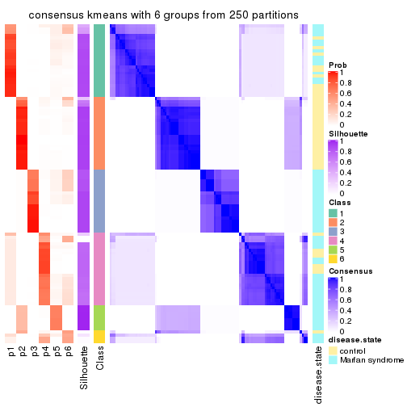</p>

</div>
</div>

Heatmaps for the membership of samples in all partitions to see how consistent they are:


<script>
$( function() {
	$( '#tabs-MAD-kmeans-membership-heatmap' ).tabs();
} );
</script>
<div id='tabs-MAD-kmeans-membership-heatmap'>
<ul>
<li><a href='#tab-MAD-kmeans-membership-heatmap-1'>k = 2</a></li>
<li><a href='#tab-MAD-kmeans-membership-heatmap-2'>k = 3</a></li>
<li><a href='#tab-MAD-kmeans-membership-heatmap-3'>k = 4</a></li>
<li><a href='#tab-MAD-kmeans-membership-heatmap-4'>k = 5</a></li>
<li><a href='#tab-MAD-kmeans-membership-heatmap-5'>k = 6</a></li>
</ul>
<div id='tab-MAD-kmeans-membership-heatmap-1'>
<pre><code class="r">membership_heatmap(res, k = 2)
</code></pre>

<p></p>

</div>
<div id='tab-MAD-kmeans-membership-heatmap-2'>
<pre><code class="r">membership_heatmap(res, k = 3)
</code></pre>

<p></p>

</div>
<div id='tab-MAD-kmeans-membership-heatmap-3'>
<pre><code class="r">membership_heatmap(res, k = 4)
</code></pre>

<p></p>

</div>
<div id='tab-MAD-kmeans-membership-heatmap-4'>
<pre><code class="r">membership_heatmap(res, k = 5)
</code></pre>

<p></p>

</div>
<div id='tab-MAD-kmeans-membership-heatmap-5'>
<pre><code class="r">membership_heatmap(res, k = 6)
</code></pre>

<p></p>

</div>
</div>

As soon as we have had the classes for columns, we can look for signatures
which are significantly different between classes which can be candidate marks
for certain classes. Following are the heatmaps for signatures.


Signature heatmaps where rows are scaled:


<script>
$( function() {
	$( '#tabs-MAD-kmeans-get-signatures' ).tabs();
} );
</script>
<div id='tabs-MAD-kmeans-get-signatures'>
<ul>
<li><a href='#tab-MAD-kmeans-get-signatures-1'>k = 2</a></li>
<li><a href='#tab-MAD-kmeans-get-signatures-2'>k = 3</a></li>
<li><a href='#tab-MAD-kmeans-get-signatures-3'>k = 4</a></li>
<li><a href='#tab-MAD-kmeans-get-signatures-4'>k = 5</a></li>
<li><a href='#tab-MAD-kmeans-get-signatures-5'>k = 6</a></li>
</ul>
<div id='tab-MAD-kmeans-get-signatures-1'>
<pre><code class="r">get_signatures(res, k = 2)
</code></pre>

<p></p>

</div>
<div id='tab-MAD-kmeans-get-signatures-2'>
<pre><code class="r">get_signatures(res, k = 3)
</code></pre>

<p></p>

</div>
<div id='tab-MAD-kmeans-get-signatures-3'>
<pre><code class="r">get_signatures(res, k = 4)
</code></pre>

<p></p>

</div>
<div id='tab-MAD-kmeans-get-signatures-4'>
<pre><code class="r">get_signatures(res, k = 5)
</code></pre>

<p></p>

</div>
<div id='tab-MAD-kmeans-get-signatures-5'>
<pre><code class="r">get_signatures(res, k = 6)
</code></pre>

<p></p>

</div>
</div>


Signature heatmaps where rows are not scaled:


<script>
$( function() {
	$( '#tabs-MAD-kmeans-get-signatures-no-scale' ).tabs();
} );
</script>
<div id='tabs-MAD-kmeans-get-signatures-no-scale'>
<ul>
<li><a href='#tab-MAD-kmeans-get-signatures-no-scale-1'>k = 2</a></li>
<li><a href='#tab-MAD-kmeans-get-signatures-no-scale-2'>k = 3</a></li>
<li><a href='#tab-MAD-kmeans-get-signatures-no-scale-3'>k = 4</a></li>
<li><a href='#tab-MAD-kmeans-get-signatures-no-scale-4'>k = 5</a></li>
<li><a href='#tab-MAD-kmeans-get-signatures-no-scale-5'>k = 6</a></li>
</ul>
<div id='tab-MAD-kmeans-get-signatures-no-scale-1'>
<pre><code class="r">get_signatures(res, k = 2, scale_rows = FALSE)
</code></pre>

<p></p>

</div>
<div id='tab-MAD-kmeans-get-signatures-no-scale-2'>
<pre><code class="r">get_signatures(res, k = 3, scale_rows = FALSE)
</code></pre>

<p></p>

</div>
<div id='tab-MAD-kmeans-get-signatures-no-scale-3'>
<pre><code class="r">get_signatures(res, k = 4, scale_rows = FALSE)
</code></pre>

<p></p>

</div>
<div id='tab-MAD-kmeans-get-signatures-no-scale-4'>
<pre><code class="r">get_signatures(res, k = 5, scale_rows = FALSE)
</code></pre>

<p></p>

</div>
<div id='tab-MAD-kmeans-get-signatures-no-scale-5'>
<pre><code class="r">get_signatures(res, k = 6, scale_rows = FALSE)
</code></pre>

<p></p>

</div>
</div>


Compare the overlap of signatures from different k:

```r
compare_signatures(res)
```


`get_signature()` returns a data frame invisibly. TO get the list of signatures, the function
call should be assigned to a variable explicitly. In following code, if `plot` argument is set
to `FALSE`, no heatmap is plotted while only the differential analysis is performed.

```r
# code only for demonstration
tb = get_signature(res, k = ..., plot = FALSE)
```

An example of the output of `tb` is:

```
#>   which_row         fdr    mean_1    mean_2 scaled_mean_1 scaled_mean_2 km
#> 1        38 0.042760348  8.373488  9.131774    -0.5533452     0.5164555  1
#> 2        40 0.018707592  7.106213  8.469186    -0.6173731     0.5762149  1
#> 3        55 0.019134737 10.221463 11.207825    -0.6159697     0.5749050  1
#> 4        59 0.006059896  5.921854  7.869574    -0.6899429     0.6439467  1
#> 5        60 0.018055526  8.928898 10.211722    -0.6204761     0.5791110  1
#> 6        98 0.009384629 15.714769 14.887706     0.6635654    -0.6193277  2
...
```

The columns in `tb` are:

1. `which_row`: row indices corresponding to the input matrix.
2. `fdr`: FDR for the differential test. 
3. `mean_x`: The mean value in group x.
4. `scaled_mean_x`: The mean value in group x after rows are scaled.
5. `km`: Row groups if k-means clustering is applied to rows.


UMAP plot which shows how samples are separated.


<script>
$( function() {
	$( '#tabs-MAD-kmeans-dimension-reduction' ).tabs();
} );
</script>
<div id='tabs-MAD-kmeans-dimension-reduction'>
<ul>
<li><a href='#tab-MAD-kmeans-dimension-reduction-1'>k = 2</a></li>
<li><a href='#tab-MAD-kmeans-dimension-reduction-2'>k = 3</a></li>
<li><a href='#tab-MAD-kmeans-dimension-reduction-3'>k = 4</a></li>
<li><a href='#tab-MAD-kmeans-dimension-reduction-4'>k = 5</a></li>
<li><a href='#tab-MAD-kmeans-dimension-reduction-5'>k = 6</a></li>
</ul>
<div id='tab-MAD-kmeans-dimension-reduction-1'>
<pre><code class="r">dimension_reduction(res, k = 2, method = &quot;UMAP&quot;)
</code></pre>

<p></p>

</div>
<div id='tab-MAD-kmeans-dimension-reduction-2'>
<pre><code class="r">dimension_reduction(res, k = 3, method = &quot;UMAP&quot;)
</code></pre>

<p></p>

</div>
<div id='tab-MAD-kmeans-dimension-reduction-3'>
<pre><code class="r">dimension_reduction(res, k = 4, method = &quot;UMAP&quot;)
</code></pre>

<p></p>

</div>
<div id='tab-MAD-kmeans-dimension-reduction-4'>
<pre><code class="r">dimension_reduction(res, k = 5, method = &quot;UMAP&quot;)
</code></pre>

<p></p>

</div>
<div id='tab-MAD-kmeans-dimension-reduction-5'>
<pre><code class="r">dimension_reduction(res, k = 6, method = &quot;UMAP&quot;)
</code></pre>

<p></p>

</div>
</div>


Following heatmap shows how subgroups are split when increasing `k`:

```r
collect_classes(res)
```


Test correlation between subgroups and known annotations. If the known
annotation is numeric, one-way ANOVA test is applied, and if the known
annotation is discrete, chi-squared contingency table test is applied.

```r
test_to_known_factors(res)
```

```
#>              n disease.state(p) k
#> MAD:kmeans 101         3.32e-01 2
#> MAD:kmeans 101         2.94e-07 3
#> MAD:kmeans 100         4.21e-07 4
#> MAD:kmeans 100         4.21e-07 5
#> MAD:kmeans  91         1.26e-10 6
```


If matrix rows can be associated to genes, consider to use `functional_enrichment(res,
...)` to perform function enrichment for the signature genes. See [this vignette](http://bioconductor.org/packages/devel/bioc/vignettes/cola/inst/doc/functional_enrichment.html) for more detailed explanations.


 

---------------------------------------------------


### MAD:skmeans*


The object with results only for a single top-value method and a single partition method 
can be extracted as:

```r
res = res_list["MAD", "skmeans"]
# you can also extract it by
# res = res_list["MAD:skmeans"]
```

A summary of `res` and all the functions that can be applied to it:

```r
res
```

```
#> A 'ConsensusPartition' object with k = 2, 3, 4, 5, 6.
#>   On a matrix with 3925 rows and 101 columns.
#>   Top rows (392, 784, 1177, 1570, 1962) are extracted by 'MAD' method.
#>   Subgroups are detected by 'skmeans' method.
#>   Performed in total 1250 partitions by row resampling.
#>   Best k for subgroups seems to be 6.
#> 
#> Following methods can be applied to this 'ConsensusPartition' object:
#>  [1] "cola_report"             "collect_classes"         "collect_plots"          
#>  [4] "collect_stats"           "colnames"                "compare_signatures"     
#>  [7] "consensus_heatmap"       "dimension_reduction"     "functional_enrichment"  
#> [10] "get_anno_col"            "get_anno"                "get_classes"            
#> [13] "get_consensus"           "get_matrix"              "get_membership"         
#> [16] "get_param"               "get_signatures"          "get_stats"              
#> [19] "is_best_k"               "is_stable_k"             "membership_heatmap"     
#> [22] "ncol"                    "nrow"                    "plot_ecdf"              
#> [25] "rownames"                "select_partition_number" "show"                   
#> [28] "suggest_best_k"          "test_to_known_factors"
```

`collect_plots()` function collects all the plots made from `res` for all `k` (number of partitions)
into one single page to provide an easy and fast comparison between different `k`.

```r
collect_plots(res)
```


The plots are:

- The first row: a plot of the ECDF (empirical cumulative distribution
  function) curves of the consensus matrix for each `k` and the heatmap of
  predicted classes for each `k`.
- The second row: heatmaps of the consensus matrix for each `k`.
- The third row: heatmaps of the membership matrix for each `k`.
- The fouth row: heatmaps of the signatures for each `k`.

All the plots in panels can be made by individual functions and they are
plotted later in this section.

`select_partition_number()` produces several plots showing different
statistics for choosing "optimized" `k`. There are following statistics:

- ECDF curves of the consensus matrix for each `k`;
- 1-PAC. [The PAC
  score](https://en.wikipedia.org/wiki/Consensus_clustering#Over-interpretation_potential_of_consensus_clustering)
  measures the proportion of the ambiguous subgrouping.
- Mean silhouette score.
- Concordance. The mean probability of fiting the consensus class ids in all
  partitions.
- Area increased. Denote $A_k$ as the area under the ECDF curve for current
  `k`, the area increased is defined as $A_k - A_{k-1}$.
- Rand index. The percent of pairs of samples that are both in a same cluster
  or both are not in a same cluster in the partition of k and k-1.
- Jaccard index. The ratio of pairs of samples are both in a same cluster in
  the partition of k and k-1 and the pairs of samples are both in a same
  cluster in the partition k or k-1.

The detailed explanations of these statistics can be found in [the _cola_
vignette](http://bioconductor.org/packages/devel/bioc/vignettes/cola/inst/doc/cola.html#toc_13).

Generally speaking, lower PAC score, higher mean silhouette score or higher
concordance corresponds to better partition. Rand index and Jaccard index
measure how similar the current partition is compared to partition with `k-1`.
If they are too similar, we won't accept `k` is better than `k-1`.

```r
select_partition_number(res)
```


The numeric values for all these statistics can be obtained by `get_stats()`.

```r
get_stats(res)
```

```
#>   k 1-PAC mean_silhouette concordance area_increased  Rand Jaccard
#> 2 2 1.000           1.000       1.000         0.5051 0.495   0.495
#> 3 3 1.000           1.000       1.000         0.2507 0.873   0.744
#> 4 4 1.000           0.986       0.986         0.1848 0.881   0.678
#> 5 5 0.934           0.931       0.947         0.0606 0.943   0.776
#> 6 6 0.923           0.833       0.889         0.0303 0.983   0.918
```

`suggest_best_k()` suggests the best $k$ based on these statistics. The rules are as follows:

- All $k$ with Jaccard index larger than 0.95 are removed because increasing
  $k$ does not provide enough extra information. If all $k$ are removed, it is
  marked as no subgroup is detected.
- For all $k$ with 1-PAC score larger than 0.9, the maximal $k$ is taken as
  the best $k$, and other $k$ are marked as optional $k$.
- If it does not fit the second rule. The $k$ with the maximal vote of the
  highest 1-PAC score, highest mean silhouette, and highest concordance is
  taken as the best $k$.

```r
suggest_best_k(res)
```

```
#> [1] 6
#> attr(,"optional")
#> [1] 2 3 4 5
```

There is also optional best $k$ = 2 3 4 5 that is worth to check.

Following shows the table of the partitions (You need to click the **show/hide
code output** link to see it). The membership matrix (columns with name `p*`)
is inferred by
[`clue::cl_consensus()`](https://www.rdocumentation.org/link/cl_consensus?package=clue)
function with the `SE` method. Basically the value in the membership matrix
represents the probability to belong to a certain group. The finall class
label for an item is determined with the group with highest probability it
belongs to.

In `get_classes()` function, the entropy is calculated from the membership
matrix and the silhouette score is calculated from the consensus matrix.


<script>
$( function() {
	$( '#tabs-MAD-skmeans-get-classes' ).tabs();
} );
</script>
<div id='tabs-MAD-skmeans-get-classes'>
<ul>
<li><a href='#tab-MAD-skmeans-get-classes-1'>k = 2</a></li>
<li><a href='#tab-MAD-skmeans-get-classes-2'>k = 3</a></li>
<li><a href='#tab-MAD-skmeans-get-classes-3'>k = 4</a></li>
<li><a href='#tab-MAD-skmeans-get-classes-4'>k = 5</a></li>
<li><a href='#tab-MAD-skmeans-get-classes-5'>k = 6</a></li>
</ul>

<div id='tab-MAD-skmeans-get-classes-1'>
<p><a id='tab-MAD-skmeans-get-classes-1-a' style='color:#0366d6' href='#'>show/hide code output</a></p>
<pre><code class="r">cbind(get_classes(res, k = 2), get_membership(res, k = 2))
</code></pre>

<pre><code>#&gt;           class entropy silhouette p1 p2
#&gt; GSM217644     2       0          1  0  1
#&gt; GSM217645     2       0          1  0  1
#&gt; GSM217646     2       0          1  0  1
#&gt; GSM217647     2       0          1  0  1
#&gt; GSM217648     2       0          1  0  1
#&gt; GSM217649     2       0          1  0  1
#&gt; GSM217650     2       0          1  0  1
#&gt; GSM217651     2       0          1  0  1
#&gt; GSM217652     2       0          1  0  1
#&gt; GSM217653     2       0          1  0  1
#&gt; GSM217654     2       0          1  0  1
#&gt; GSM217655     2       0          1  0  1
#&gt; GSM217656     2       0          1  0  1
#&gt; GSM217657     2       0          1  0  1
#&gt; GSM217658     2       0          1  0  1
#&gt; GSM217659     2       0          1  0  1
#&gt; GSM217660     2       0          1  0  1
#&gt; GSM217661     2       0          1  0  1
#&gt; GSM217662     2       0          1  0  1
#&gt; GSM217663     2       0          1  0  1
#&gt; GSM217664     2       0          1  0  1
#&gt; GSM217665     2       0          1  0  1
#&gt; GSM217666     2       0          1  0  1
#&gt; GSM217667     2       0          1  0  1
#&gt; GSM217668     1       0          1  1  0
#&gt; GSM217669     1       0          1  1  0
#&gt; GSM217670     1       0          1  1  0
#&gt; GSM217671     1       0          1  1  0
#&gt; GSM217672     1       0          1  1  0
#&gt; GSM217673     1       0          1  1  0
#&gt; GSM217674     1       0          1  1  0
#&gt; GSM217675     1       0          1  1  0
#&gt; GSM217676     1       0          1  1  0
#&gt; GSM217677     1       0          1  1  0
#&gt; GSM217678     1       0          1  1  0
#&gt; GSM217679     1       0          1  1  0
#&gt; GSM217680     1       0          1  1  0
#&gt; GSM217681     1       0          1  1  0
#&gt; GSM217682     1       0          1  1  0
#&gt; GSM217683     1       0          1  1  0
#&gt; GSM217684     1       0          1  1  0
#&gt; GSM217685     2       0          1  0  1
#&gt; GSM217686     2       0          1  0  1
#&gt; GSM217687     2       0          1  0  1
#&gt; GSM217688     2       0          1  0  1
#&gt; GSM217689     2       0          1  0  1
#&gt; GSM217690     2       0          1  0  1
#&gt; GSM217691     2       0          1  0  1
#&gt; GSM217692     2       0          1  0  1
#&gt; GSM217693     2       0          1  0  1
#&gt; GSM217694     2       0          1  0  1
#&gt; GSM217695     2       0          1  0  1
#&gt; GSM217696     2       0          1  0  1
#&gt; GSM217697     2       0          1  0  1
#&gt; GSM217698     2       0          1  0  1
#&gt; GSM217699     2       0          1  0  1
#&gt; GSM217700     2       0          1  0  1
#&gt; GSM217701     2       0          1  0  1
#&gt; GSM217702     2       0          1  0  1
#&gt; GSM217703     2       0          1  0  1
#&gt; GSM217704     2       0          1  0  1
#&gt; GSM217705     1       0          1  1  0
#&gt; GSM217706     1       0          1  1  0
#&gt; GSM217707     1       0          1  1  0
#&gt; GSM217708     1       0          1  1  0
#&gt; GSM217709     1       0          1  1  0
#&gt; GSM217710     1       0          1  1  0
#&gt; GSM217711     1       0          1  1  0
#&gt; GSM217712     1       0          1  1  0
#&gt; GSM217713     1       0          1  1  0
#&gt; GSM217714     1       0          1  1  0
#&gt; GSM217715     1       0          1  1  0
#&gt; GSM217716     1       0          1  1  0
#&gt; GSM217717     1       0          1  1  0
#&gt; GSM217718     1       0          1  1  0
#&gt; GSM217719     1       0          1  1  0
#&gt; GSM217720     1       0          1  1  0
#&gt; GSM217721     1       0          1  1  0
#&gt; GSM217722     1       0          1  1  0
#&gt; GSM217723     1       0          1  1  0
#&gt; GSM217724     1       0          1  1  0
#&gt; GSM217725     1       0          1  1  0
#&gt; GSM217726     1       0          1  1  0
#&gt; GSM217727     1       0          1  1  0
#&gt; GSM217728     1       0          1  1  0
#&gt; GSM217729     1       0          1  1  0
#&gt; GSM217730     1       0          1  1  0
#&gt; GSM217731     1       0          1  1  0
#&gt; GSM217732     1       0          1  1  0
#&gt; GSM217733     1       0          1  1  0
#&gt; GSM217734     1       0          1  1  0
#&gt; GSM217735     1       0          1  1  0
#&gt; GSM217736     1       0          1  1  0
#&gt; GSM217737     2       0          1  0  1
#&gt; GSM217738     2       0          1  0  1
#&gt; GSM217739     2       0          1  0  1
#&gt; GSM217740     2       0          1  0  1
#&gt; GSM217741     2       0          1  0  1
#&gt; GSM217742     2       0          1  0  1
#&gt; GSM217743     2       0          1  0  1
#&gt; GSM217744     2       0          1  0  1
</code></pre>

<script>
$('#tab-MAD-skmeans-get-classes-1-a').parent().next().next().hide();
$('#tab-MAD-skmeans-get-classes-1-a').click(function(){
  $('#tab-MAD-skmeans-get-classes-1-a').parent().next().next().toggle();
  return(false);
});
</script>
</div>

<div id='tab-MAD-skmeans-get-classes-2'>
<p><a id='tab-MAD-skmeans-get-classes-2-a' style='color:#0366d6' href='#'>show/hide code output</a></p>
<pre><code class="r">cbind(get_classes(res, k = 3), get_membership(res, k = 3))
</code></pre>

<pre><code>#&gt;           class entropy silhouette p1 p2 p3
#&gt; GSM217644     2       0          1  0  1  0
#&gt; GSM217645     2       0          1  0  1  0
#&gt; GSM217646     2       0          1  0  1  0
#&gt; GSM217647     2       0          1  0  1  0
#&gt; GSM217648     2       0          1  0  1  0
#&gt; GSM217649     2       0          1  0  1  0
#&gt; GSM217650     2       0          1  0  1  0
#&gt; GSM217651     2       0          1  0  1  0
#&gt; GSM217652     2       0          1  0  1  0
#&gt; GSM217653     2       0          1  0  1  0
#&gt; GSM217654     2       0          1  0  1  0
#&gt; GSM217655     2       0          1  0  1  0
#&gt; GSM217656     2       0          1  0  1  0
#&gt; GSM217657     2       0          1  0  1  0
#&gt; GSM217658     2       0          1  0  1  0
#&gt; GSM217659     2       0          1  0  1  0
#&gt; GSM217660     2       0          1  0  1  0
#&gt; GSM217661     2       0          1  0  1  0
#&gt; GSM217662     2       0          1  0  1  0
#&gt; GSM217663     2       0          1  0  1  0
#&gt; GSM217664     2       0          1  0  1  0
#&gt; GSM217665     2       0          1  0  1  0
#&gt; GSM217666     2       0          1  0  1  0
#&gt; GSM217667     2       0          1  0  1  0
#&gt; GSM217668     1       0          1  1  0  0
#&gt; GSM217669     1       0          1  1  0  0
#&gt; GSM217670     1       0          1  1  0  0
#&gt; GSM217671     1       0          1  1  0  0
#&gt; GSM217672     1       0          1  1  0  0
#&gt; GSM217673     1       0          1  1  0  0
#&gt; GSM217674     1       0          1  1  0  0
#&gt; GSM217675     1       0          1  1  0  0
#&gt; GSM217676     1       0          1  1  0  0
#&gt; GSM217677     1       0          1  1  0  0
#&gt; GSM217678     1       0          1  1  0  0
#&gt; GSM217679     1       0          1  1  0  0
#&gt; GSM217680     1       0          1  1  0  0
#&gt; GSM217681     1       0          1  1  0  0
#&gt; GSM217682     1       0          1  1  0  0
#&gt; GSM217683     1       0          1  1  0  0
#&gt; GSM217684     1       0          1  1  0  0
#&gt; GSM217685     3       0          1  0  0  1
#&gt; GSM217686     3       0          1  0  0  1
#&gt; GSM217687     3       0          1  0  0  1
#&gt; GSM217688     3       0          1  0  0  1
#&gt; GSM217689     3       0          1  0  0  1
#&gt; GSM217690     3       0          1  0  0  1
#&gt; GSM217691     3       0          1  0  0  1
#&gt; GSM217692     3       0          1  0  0  1
#&gt; GSM217693     3       0          1  0  0  1
#&gt; GSM217694     3       0          1  0  0  1
#&gt; GSM217695     3       0          1  0  0  1
#&gt; GSM217696     3       0          1  0  0  1
#&gt; GSM217697     3       0          1  0  0  1
#&gt; GSM217698     3       0          1  0  0  1
#&gt; GSM217699     3       0          1  0  0  1
#&gt; GSM217700     3       0          1  0  0  1
#&gt; GSM217701     3       0          1  0  0  1
#&gt; GSM217702     3       0          1  0  0  1
#&gt; GSM217703     3       0          1  0  0  1
#&gt; GSM217704     3       0          1  0  0  1
#&gt; GSM217705     1       0          1  1  0  0
#&gt; GSM217706     1       0          1  1  0  0
#&gt; GSM217707     1       0          1  1  0  0
#&gt; GSM217708     1       0          1  1  0  0
#&gt; GSM217709     1       0          1  1  0  0
#&gt; GSM217710     1       0          1  1  0  0
#&gt; GSM217711     1       0          1  1  0  0
#&gt; GSM217712     1       0          1  1  0  0
#&gt; GSM217713     1       0          1  1  0  0
#&gt; GSM217714     1       0          1  1  0  0
#&gt; GSM217715     1       0          1  1  0  0
#&gt; GSM217716     1       0          1  1  0  0
#&gt; GSM217717     1       0          1  1  0  0
#&gt; GSM217718     1       0          1  1  0  0
#&gt; GSM217719     1       0          1  1  0  0
#&gt; GSM217720     1       0          1  1  0  0
#&gt; GSM217721     1       0          1  1  0  0
#&gt; GSM217722     1       0          1  1  0  0
#&gt; GSM217723     1       0          1  1  0  0
#&gt; GSM217724     1       0          1  1  0  0
#&gt; GSM217725     1       0          1  1  0  0
#&gt; GSM217726     1       0          1  1  0  0
#&gt; GSM217727     1       0          1  1  0  0
#&gt; GSM217728     1       0          1  1  0  0
#&gt; GSM217729     1       0          1  1  0  0
#&gt; GSM217730     1       0          1  1  0  0
#&gt; GSM217731     1       0          1  1  0  0
#&gt; GSM217732     1       0          1  1  0  0
#&gt; GSM217733     1       0          1  1  0  0
#&gt; GSM217734     1       0          1  1  0  0
#&gt; GSM217735     1       0          1  1  0  0
#&gt; GSM217736     1       0          1  1  0  0
#&gt; GSM217737     2       0          1  0  1  0
#&gt; GSM217738     2       0          1  0  1  0
#&gt; GSM217739     2       0          1  0  1  0
#&gt; GSM217740     2       0          1  0  1  0
#&gt; GSM217741     2       0          1  0  1  0
#&gt; GSM217742     2       0          1  0  1  0
#&gt; GSM217743     2       0          1  0  1  0
#&gt; GSM217744     2       0          1  0  1  0
</code></pre>

<script>
$('#tab-MAD-skmeans-get-classes-2-a').parent().next().next().hide();
$('#tab-MAD-skmeans-get-classes-2-a').click(function(){
  $('#tab-MAD-skmeans-get-classes-2-a').parent().next().next().toggle();
  return(false);
});
</script>
</div>

<div id='tab-MAD-skmeans-get-classes-3'>
<p><a id='tab-MAD-skmeans-get-classes-3-a' style='color:#0366d6' href='#'>show/hide code output</a></p>
<pre><code class="r">cbind(get_classes(res, k = 4), get_membership(res, k = 4))
</code></pre>

<pre><code>#&gt;           class entropy silhouette    p1    p2 p3    p4
#&gt; GSM217644     2  0.0000      0.992 0.000 1.000  0 0.000
#&gt; GSM217645     2  0.0000      0.992 0.000 1.000  0 0.000
#&gt; GSM217646     2  0.0000      0.992 0.000 1.000  0 0.000
#&gt; GSM217647     2  0.0000      0.992 0.000 1.000  0 0.000
#&gt; GSM217648     2  0.0000      0.992 0.000 1.000  0 0.000
#&gt; GSM217649     2  0.0000      0.992 0.000 1.000  0 0.000
#&gt; GSM217650     2  0.0000      0.992 0.000 1.000  0 0.000
#&gt; GSM217651     2  0.0000      0.992 0.000 1.000  0 0.000
#&gt; GSM217652     2  0.0000      0.992 0.000 1.000  0 0.000
#&gt; GSM217653     2  0.0000      0.992 0.000 1.000  0 0.000
#&gt; GSM217654     2  0.0921      0.986 0.000 0.972  0 0.028
#&gt; GSM217655     2  0.0000      0.992 0.000 1.000  0 0.000
#&gt; GSM217656     2  0.0921      0.986 0.000 0.972  0 0.028
#&gt; GSM217657     2  0.0921      0.986 0.000 0.972  0 0.028
#&gt; GSM217658     2  0.0000      0.992 0.000 1.000  0 0.000
#&gt; GSM217659     2  0.0000      0.992 0.000 1.000  0 0.000
#&gt; GSM217660     2  0.0707      0.988 0.000 0.980  0 0.020
#&gt; GSM217661     2  0.0000      0.992 0.000 1.000  0 0.000
#&gt; GSM217662     2  0.0188      0.991 0.000 0.996  0 0.004
#&gt; GSM217663     2  0.0000      0.992 0.000 1.000  0 0.000
#&gt; GSM217664     2  0.0000      0.992 0.000 1.000  0 0.000
#&gt; GSM217665     2  0.0000      0.992 0.000 1.000  0 0.000
#&gt; GSM217666     2  0.0000      0.992 0.000 1.000  0 0.000
#&gt; GSM217667     2  0.0000      0.992 0.000 1.000  0 0.000
#&gt; GSM217668     4  0.0921      1.000 0.028 0.000  0 0.972
#&gt; GSM217669     4  0.0921      1.000 0.028 0.000  0 0.972
#&gt; GSM217670     4  0.0921      1.000 0.028 0.000  0 0.972
#&gt; GSM217671     4  0.0921      1.000 0.028 0.000  0 0.972
#&gt; GSM217672     4  0.0921      1.000 0.028 0.000  0 0.972
#&gt; GSM217673     4  0.0921      1.000 0.028 0.000  0 0.972
#&gt; GSM217674     1  0.0000      0.982 1.000 0.000  0 0.000
#&gt; GSM217675     1  0.0000      0.982 1.000 0.000  0 0.000
#&gt; GSM217676     1  0.0000      0.982 1.000 0.000  0 0.000
#&gt; GSM217677     1  0.0000      0.982 1.000 0.000  0 0.000
#&gt; GSM217678     1  0.0000      0.982 1.000 0.000  0 0.000
#&gt; GSM217679     1  0.0000      0.982 1.000 0.000  0 0.000
#&gt; GSM217680     1  0.0000      0.982 1.000 0.000  0 0.000
#&gt; GSM217681     1  0.0000      0.982 1.000 0.000  0 0.000
#&gt; GSM217682     1  0.0000      0.982 1.000 0.000  0 0.000
#&gt; GSM217683     1  0.0000      0.982 1.000 0.000  0 0.000
#&gt; GSM217684     1  0.4817      0.338 0.612 0.000  0 0.388
#&gt; GSM217685     3  0.0000      1.000 0.000 0.000  1 0.000
#&gt; GSM217686     3  0.0000      1.000 0.000 0.000  1 0.000
#&gt; GSM217687     3  0.0000      1.000 0.000 0.000  1 0.000
#&gt; GSM217688     3  0.0000      1.000 0.000 0.000  1 0.000
#&gt; GSM217689     3  0.0000      1.000 0.000 0.000  1 0.000
#&gt; GSM217690     3  0.0000      1.000 0.000 0.000  1 0.000
#&gt; GSM217691     3  0.0000      1.000 0.000 0.000  1 0.000
#&gt; GSM217692     3  0.0000      1.000 0.000 0.000  1 0.000
#&gt; GSM217693     3  0.0000      1.000 0.000 0.000  1 0.000
#&gt; GSM217694     3  0.0000      1.000 0.000 0.000  1 0.000
#&gt; GSM217695     3  0.0000      1.000 0.000 0.000  1 0.000
#&gt; GSM217696     3  0.0000      1.000 0.000 0.000  1 0.000
#&gt; GSM217697     3  0.0000      1.000 0.000 0.000  1 0.000
#&gt; GSM217698     3  0.0000      1.000 0.000 0.000  1 0.000
#&gt; GSM217699     3  0.0000      1.000 0.000 0.000  1 0.000
#&gt; GSM217700     3  0.0000      1.000 0.000 0.000  1 0.000
#&gt; GSM217701     3  0.0000      1.000 0.000 0.000  1 0.000
#&gt; GSM217702     3  0.0000      1.000 0.000 0.000  1 0.000
#&gt; GSM217703     3  0.0000      1.000 0.000 0.000  1 0.000
#&gt; GSM217704     3  0.0000      1.000 0.000 0.000  1 0.000
#&gt; GSM217705     4  0.0921      1.000 0.028 0.000  0 0.972
#&gt; GSM217706     4  0.0921      1.000 0.028 0.000  0 0.972
#&gt; GSM217707     4  0.0921      1.000 0.028 0.000  0 0.972
#&gt; GSM217708     4  0.0921      1.000 0.028 0.000  0 0.972
#&gt; GSM217709     4  0.0921      1.000 0.028 0.000  0 0.972
#&gt; GSM217710     4  0.0921      1.000 0.028 0.000  0 0.972
#&gt; GSM217711     4  0.0921      1.000 0.028 0.000  0 0.972
#&gt; GSM217712     4  0.0921      1.000 0.028 0.000  0 0.972
#&gt; GSM217713     4  0.0921      1.000 0.028 0.000  0 0.972
#&gt; GSM217714     4  0.0921      1.000 0.028 0.000  0 0.972
#&gt; GSM217715     4  0.0921      1.000 0.028 0.000  0 0.972
#&gt; GSM217716     4  0.0921      1.000 0.028 0.000  0 0.972
#&gt; GSM217717     4  0.0921      1.000 0.028 0.000  0 0.972
#&gt; GSM217718     4  0.0921      1.000 0.028 0.000  0 0.972
#&gt; GSM217719     4  0.0921      1.000 0.028 0.000  0 0.972
#&gt; GSM217720     4  0.0921      1.000 0.028 0.000  0 0.972
#&gt; GSM217721     4  0.0921      1.000 0.028 0.000  0 0.972
#&gt; GSM217722     4  0.0921      1.000 0.028 0.000  0 0.972
#&gt; GSM217723     1  0.0336      0.976 0.992 0.000  0 0.008
#&gt; GSM217724     1  0.0336      0.976 0.992 0.000  0 0.008
#&gt; GSM217725     1  0.0000      0.982 1.000 0.000  0 0.000
#&gt; GSM217726     1  0.0000      0.982 1.000 0.000  0 0.000
#&gt; GSM217727     1  0.0000      0.982 1.000 0.000  0 0.000
#&gt; GSM217728     1  0.0000      0.982 1.000 0.000  0 0.000
#&gt; GSM217729     1  0.0000      0.982 1.000 0.000  0 0.000
#&gt; GSM217730     1  0.0000      0.982 1.000 0.000  0 0.000
#&gt; GSM217731     1  0.0000      0.982 1.000 0.000  0 0.000
#&gt; GSM217732     1  0.0000      0.982 1.000 0.000  0 0.000
#&gt; GSM217733     1  0.0000      0.982 1.000 0.000  0 0.000
#&gt; GSM217734     1  0.0000      0.982 1.000 0.000  0 0.000
#&gt; GSM217735     1  0.0000      0.982 1.000 0.000  0 0.000
#&gt; GSM217736     1  0.0000      0.982 1.000 0.000  0 0.000
#&gt; GSM217737     2  0.0921      0.986 0.000 0.972  0 0.028
#&gt; GSM217738     2  0.0921      0.986 0.000 0.972  0 0.028
#&gt; GSM217739     2  0.0921      0.986 0.000 0.972  0 0.028
#&gt; GSM217740     2  0.0921      0.986 0.000 0.972  0 0.028
#&gt; GSM217741     2  0.0921      0.986 0.000 0.972  0 0.028
#&gt; GSM217742     2  0.0921      0.986 0.000 0.972  0 0.028
#&gt; GSM217743     2  0.0921      0.986 0.000 0.972  0 0.028
#&gt; GSM217744     2  0.0921      0.986 0.000 0.972  0 0.028
</code></pre>

<script>
$('#tab-MAD-skmeans-get-classes-3-a').parent().next().next().hide();
$('#tab-MAD-skmeans-get-classes-3-a').click(function(){
  $('#tab-MAD-skmeans-get-classes-3-a').parent().next().next().toggle();
  return(false);
});
</script>
</div>

<div id='tab-MAD-skmeans-get-classes-4'>
<p><a id='tab-MAD-skmeans-get-classes-4-a' style='color:#0366d6' href='#'>show/hide code output</a></p>
<pre><code class="r">cbind(get_classes(res, k = 5), get_membership(res, k = 5))
</code></pre>

<pre><code>#&gt;           class entropy silhouette    p1    p2    p3    p4    p5
#&gt; GSM217644     2  0.0290     0.9561 0.000 0.992 0.000 0.000 0.008
#&gt; GSM217645     2  0.0162     0.9601 0.000 0.996 0.000 0.000 0.004
#&gt; GSM217646     2  0.0000     0.9635 0.000 1.000 0.000 0.000 0.000
#&gt; GSM217647     2  0.0000     0.9635 0.000 1.000 0.000 0.000 0.000
#&gt; GSM217648     2  0.0290     0.9564 0.000 0.992 0.000 0.000 0.008
#&gt; GSM217649     2  0.0000     0.9635 0.000 1.000 0.000 0.000 0.000
#&gt; GSM217650     2  0.0000     0.9635 0.000 1.000 0.000 0.000 0.000
#&gt; GSM217651     2  0.1043     0.9213 0.000 0.960 0.000 0.000 0.040
#&gt; GSM217652     2  0.0000     0.9635 0.000 1.000 0.000 0.000 0.000
#&gt; GSM217653     2  0.0000     0.9635 0.000 1.000 0.000 0.000 0.000
#&gt; GSM217654     5  0.2966     0.8780 0.000 0.184 0.000 0.000 0.816
#&gt; GSM217655     2  0.4210    -0.0431 0.000 0.588 0.000 0.000 0.412
#&gt; GSM217656     5  0.1571     0.7691 0.000 0.060 0.004 0.000 0.936
#&gt; GSM217657     5  0.2020     0.8095 0.000 0.100 0.000 0.000 0.900
#&gt; GSM217658     2  0.0000     0.9635 0.000 1.000 0.000 0.000 0.000
#&gt; GSM217659     2  0.0000     0.9635 0.000 1.000 0.000 0.000 0.000
#&gt; GSM217660     5  0.4182     0.7131 0.000 0.400 0.000 0.000 0.600
#&gt; GSM217661     2  0.0000     0.9635 0.000 1.000 0.000 0.000 0.000
#&gt; GSM217662     2  0.1410     0.8934 0.000 0.940 0.000 0.000 0.060
#&gt; GSM217663     2  0.0000     0.9635 0.000 1.000 0.000 0.000 0.000
#&gt; GSM217664     2  0.0000     0.9635 0.000 1.000 0.000 0.000 0.000
#&gt; GSM217665     2  0.0000     0.9635 0.000 1.000 0.000 0.000 0.000
#&gt; GSM217666     2  0.0000     0.9635 0.000 1.000 0.000 0.000 0.000
#&gt; GSM217667     2  0.0000     0.9635 0.000 1.000 0.000 0.000 0.000
#&gt; GSM217668     4  0.0794     0.9406 0.000 0.000 0.000 0.972 0.028
#&gt; GSM217669     4  0.1043     0.9397 0.000 0.000 0.000 0.960 0.040
#&gt; GSM217670     4  0.0794     0.9406 0.000 0.000 0.000 0.972 0.028
#&gt; GSM217671     4  0.0794     0.9406 0.000 0.000 0.000 0.972 0.028
#&gt; GSM217672     4  0.0794     0.9406 0.000 0.000 0.000 0.972 0.028
#&gt; GSM217673     4  0.0794     0.9406 0.000 0.000 0.000 0.972 0.028
#&gt; GSM217674     1  0.0162     0.9834 0.996 0.000 0.000 0.000 0.004
#&gt; GSM217675     1  0.0162     0.9834 0.996 0.000 0.000 0.000 0.004
#&gt; GSM217676     1  0.0162     0.9834 0.996 0.000 0.000 0.000 0.004
#&gt; GSM217677     1  0.0162     0.9834 0.996 0.000 0.000 0.000 0.004
#&gt; GSM217678     1  0.0000     0.9837 1.000 0.000 0.000 0.000 0.000
#&gt; GSM217679     1  0.0162     0.9834 0.996 0.000 0.000 0.000 0.004
#&gt; GSM217680     1  0.0000     0.9837 1.000 0.000 0.000 0.000 0.000
#&gt; GSM217681     1  0.0000     0.9837 1.000 0.000 0.000 0.000 0.000
#&gt; GSM217682     1  0.0162     0.9834 0.996 0.000 0.000 0.000 0.004
#&gt; GSM217683     1  0.0162     0.9834 0.996 0.000 0.000 0.000 0.004
#&gt; GSM217684     4  0.4971     0.0985 0.460 0.000 0.000 0.512 0.028
#&gt; GSM217685     3  0.0000     0.9984 0.000 0.000 1.000 0.000 0.000
#&gt; GSM217686     3  0.0000     0.9984 0.000 0.000 1.000 0.000 0.000
#&gt; GSM217687     3  0.0000     0.9984 0.000 0.000 1.000 0.000 0.000
#&gt; GSM217688     3  0.0000     0.9984 0.000 0.000 1.000 0.000 0.000
#&gt; GSM217689     3  0.0000     0.9984 0.000 0.000 1.000 0.000 0.000
#&gt; GSM217690     3  0.0000     0.9984 0.000 0.000 1.000 0.000 0.000
#&gt; GSM217691     3  0.0162     0.9981 0.000 0.000 0.996 0.000 0.004
#&gt; GSM217692     3  0.0162     0.9981 0.000 0.000 0.996 0.000 0.004
#&gt; GSM217693     3  0.0162     0.9981 0.000 0.000 0.996 0.000 0.004
#&gt; GSM217694     3  0.0162     0.9981 0.000 0.000 0.996 0.000 0.004
#&gt; GSM217695     3  0.0162     0.9981 0.000 0.000 0.996 0.000 0.004
#&gt; GSM217696     3  0.0162     0.9981 0.000 0.000 0.996 0.000 0.004
#&gt; GSM217697     3  0.0162     0.9981 0.000 0.000 0.996 0.000 0.004
#&gt; GSM217698     3  0.0162     0.9981 0.000 0.000 0.996 0.000 0.004
#&gt; GSM217699     3  0.0000     0.9984 0.000 0.000 1.000 0.000 0.000
#&gt; GSM217700     3  0.0000     0.9984 0.000 0.000 1.000 0.000 0.000
#&gt; GSM217701     3  0.0000     0.9984 0.000 0.000 1.000 0.000 0.000
#&gt; GSM217702     3  0.0000     0.9984 0.000 0.000 1.000 0.000 0.000
#&gt; GSM217703     3  0.0000     0.9984 0.000 0.000 1.000 0.000 0.000
#&gt; GSM217704     3  0.0162     0.9981 0.000 0.000 0.996 0.000 0.004
#&gt; GSM217705     4  0.0510     0.9418 0.000 0.000 0.000 0.984 0.016
#&gt; GSM217706     4  0.0162     0.9421 0.000 0.000 0.000 0.996 0.004
#&gt; GSM217707     4  0.0290     0.9417 0.000 0.000 0.000 0.992 0.008
#&gt; GSM217708     4  0.2561     0.8675 0.000 0.000 0.000 0.856 0.144
#&gt; GSM217709     4  0.2605     0.8648 0.000 0.000 0.000 0.852 0.148
#&gt; GSM217710     4  0.2732     0.8562 0.000 0.000 0.000 0.840 0.160
#&gt; GSM217711     4  0.2732     0.8562 0.000 0.000 0.000 0.840 0.160
#&gt; GSM217712     4  0.0510     0.9407 0.000 0.000 0.000 0.984 0.016
#&gt; GSM217713     4  0.0609     0.9405 0.000 0.000 0.000 0.980 0.020
#&gt; GSM217714     4  0.0794     0.9406 0.000 0.000 0.000 0.972 0.028
#&gt; GSM217715     4  0.0794     0.9406 0.000 0.000 0.000 0.972 0.028
#&gt; GSM217716     4  0.0794     0.9422 0.000 0.000 0.000 0.972 0.028
#&gt; GSM217717     4  0.0609     0.9405 0.000 0.000 0.000 0.980 0.020
#&gt; GSM217718     4  0.0703     0.9379 0.000 0.000 0.000 0.976 0.024
#&gt; GSM217719     4  0.0510     0.9398 0.000 0.000 0.000 0.984 0.016
#&gt; GSM217720     4  0.0703     0.9409 0.000 0.000 0.000 0.976 0.024
#&gt; GSM217721     4  0.0703     0.9379 0.000 0.000 0.000 0.976 0.024
#&gt; GSM217722     4  0.0510     0.9403 0.000 0.000 0.000 0.984 0.016
#&gt; GSM217723     1  0.2873     0.8731 0.856 0.000 0.000 0.016 0.128
#&gt; GSM217724     1  0.1408     0.9508 0.948 0.000 0.000 0.008 0.044
#&gt; GSM217725     1  0.2127     0.9065 0.892 0.000 0.000 0.000 0.108
#&gt; GSM217726     1  0.0162     0.9834 0.996 0.000 0.000 0.000 0.004
#&gt; GSM217727     1  0.0162     0.9834 0.996 0.000 0.000 0.000 0.004
#&gt; GSM217728     1  0.1792     0.9266 0.916 0.000 0.000 0.000 0.084
#&gt; GSM217729     1  0.0000     0.9837 1.000 0.000 0.000 0.000 0.000
#&gt; GSM217730     1  0.0000     0.9837 1.000 0.000 0.000 0.000 0.000
#&gt; GSM217731     1  0.0000     0.9837 1.000 0.000 0.000 0.000 0.000
#&gt; GSM217732     1  0.0000     0.9837 1.000 0.000 0.000 0.000 0.000
#&gt; GSM217733     1  0.0000     0.9837 1.000 0.000 0.000 0.000 0.000
#&gt; GSM217734     1  0.0000     0.9837 1.000 0.000 0.000 0.000 0.000
#&gt; GSM217735     1  0.0000     0.9837 1.000 0.000 0.000 0.000 0.000
#&gt; GSM217736     1  0.0000     0.9837 1.000 0.000 0.000 0.000 0.000
#&gt; GSM217737     5  0.3242     0.8957 0.000 0.216 0.000 0.000 0.784
#&gt; GSM217738     5  0.3242     0.8957 0.000 0.216 0.000 0.000 0.784
#&gt; GSM217739     5  0.3424     0.8995 0.000 0.240 0.000 0.000 0.760
#&gt; GSM217740     5  0.3424     0.8995 0.000 0.240 0.000 0.000 0.760
#&gt; GSM217741     5  0.3774     0.8756 0.000 0.296 0.000 0.000 0.704
#&gt; GSM217742     5  0.3636     0.8897 0.000 0.272 0.000 0.000 0.728
#&gt; GSM217743     5  0.3796     0.8722 0.000 0.300 0.000 0.000 0.700
#&gt; GSM217744     5  0.3816     0.8681 0.000 0.304 0.000 0.000 0.696
</code></pre>

<script>
$('#tab-MAD-skmeans-get-classes-4-a').parent().next().next().hide();
$('#tab-MAD-skmeans-get-classes-4-a').click(function(){
  $('#tab-MAD-skmeans-get-classes-4-a').parent().next().next().toggle();
  return(false);
});
</script>
</div>

<div id='tab-MAD-skmeans-get-classes-5'>
<p><a id='tab-MAD-skmeans-get-classes-5-a' style='color:#0366d6' href='#'>show/hide code output</a></p>
<pre><code class="r">cbind(get_classes(res, k = 6), get_membership(res, k = 6))
</code></pre>

<pre><code>#&gt;           class entropy silhouette    p1    p2    p3    p4    p5    p6
#&gt; GSM217644     2  0.0363     0.9501 0.000 0.988 0.000 0.000 0.012 0.000
#&gt; GSM217645     2  0.0603     0.9454 0.000 0.980 0.000 0.000 0.016 0.004
#&gt; GSM217646     2  0.0000     0.9583 0.000 1.000 0.000 0.000 0.000 0.000
#&gt; GSM217647     2  0.0000     0.9583 0.000 1.000 0.000 0.000 0.000 0.000
#&gt; GSM217648     2  0.0547     0.9443 0.000 0.980 0.000 0.000 0.020 0.000
#&gt; GSM217649     2  0.0000     0.9583 0.000 1.000 0.000 0.000 0.000 0.000
#&gt; GSM217650     2  0.0146     0.9571 0.000 0.996 0.000 0.000 0.000 0.004
#&gt; GSM217651     2  0.1010     0.9279 0.000 0.960 0.000 0.000 0.036 0.004
#&gt; GSM217652     2  0.0146     0.9571 0.000 0.996 0.000 0.000 0.000 0.004
#&gt; GSM217653     2  0.0000     0.9583 0.000 1.000 0.000 0.000 0.000 0.000
#&gt; GSM217654     5  0.4993     0.6503 0.000 0.080 0.000 0.000 0.560 0.360
#&gt; GSM217655     2  0.6017    -0.0899 0.000 0.424 0.000 0.000 0.260 0.316
#&gt; GSM217656     5  0.4086     0.5823 0.000 0.000 0.008 0.000 0.528 0.464
#&gt; GSM217657     5  0.4184     0.6396 0.000 0.016 0.000 0.000 0.576 0.408
#&gt; GSM217658     2  0.0000     0.9583 0.000 1.000 0.000 0.000 0.000 0.000
#&gt; GSM217659     2  0.0000     0.9583 0.000 1.000 0.000 0.000 0.000 0.000
#&gt; GSM217660     5  0.3499     0.5921 0.000 0.320 0.000 0.000 0.680 0.000
#&gt; GSM217661     2  0.0146     0.9571 0.000 0.996 0.000 0.000 0.000 0.004
#&gt; GSM217662     2  0.1588     0.8874 0.000 0.924 0.000 0.000 0.072 0.004
#&gt; GSM217663     2  0.0000     0.9583 0.000 1.000 0.000 0.000 0.000 0.000
#&gt; GSM217664     2  0.0000     0.9583 0.000 1.000 0.000 0.000 0.000 0.000
#&gt; GSM217665     2  0.0000     0.9583 0.000 1.000 0.000 0.000 0.000 0.000
#&gt; GSM217666     2  0.0000     0.9583 0.000 1.000 0.000 0.000 0.000 0.000
#&gt; GSM217667     2  0.0000     0.9583 0.000 1.000 0.000 0.000 0.000 0.000
#&gt; GSM217668     4  0.0000     0.6942 0.000 0.000 0.000 1.000 0.000 0.000
#&gt; GSM217669     4  0.1267     0.6506 0.000 0.000 0.000 0.940 0.000 0.060
#&gt; GSM217670     4  0.0405     0.6938 0.000 0.000 0.000 0.988 0.008 0.004
#&gt; GSM217671     4  0.0000     0.6942 0.000 0.000 0.000 1.000 0.000 0.000
#&gt; GSM217672     4  0.0000     0.6942 0.000 0.000 0.000 1.000 0.000 0.000
#&gt; GSM217673     4  0.0000     0.6942 0.000 0.000 0.000 1.000 0.000 0.000
#&gt; GSM217674     1  0.0146     0.9507 0.996 0.000 0.000 0.000 0.000 0.004
#&gt; GSM217675     1  0.0146     0.9507 0.996 0.000 0.000 0.000 0.000 0.004
#&gt; GSM217676     1  0.0260     0.9503 0.992 0.000 0.000 0.000 0.000 0.008
#&gt; GSM217677     1  0.0146     0.9507 0.996 0.000 0.000 0.000 0.000 0.004
#&gt; GSM217678     1  0.0260     0.9488 0.992 0.000 0.000 0.000 0.000 0.008
#&gt; GSM217679     1  0.0146     0.9507 0.996 0.000 0.000 0.000 0.000 0.004
#&gt; GSM217680     1  0.0260     0.9488 0.992 0.000 0.000 0.000 0.000 0.008
#&gt; GSM217681     1  0.0000     0.9509 1.000 0.000 0.000 0.000 0.000 0.000
#&gt; GSM217682     1  0.0146     0.9507 0.996 0.000 0.000 0.000 0.000 0.004
#&gt; GSM217683     1  0.0146     0.9507 0.996 0.000 0.000 0.000 0.000 0.004
#&gt; GSM217684     4  0.3830     0.0119 0.376 0.000 0.000 0.620 0.000 0.004
#&gt; GSM217685     3  0.0632     0.9657 0.000 0.000 0.976 0.000 0.000 0.024
#&gt; GSM217686     3  0.0632     0.9657 0.000 0.000 0.976 0.000 0.000 0.024
#&gt; GSM217687     3  0.0632     0.9657 0.000 0.000 0.976 0.000 0.000 0.024
#&gt; GSM217688     3  0.0632     0.9657 0.000 0.000 0.976 0.000 0.000 0.024
#&gt; GSM217689     3  0.0790     0.9628 0.000 0.000 0.968 0.000 0.000 0.032
#&gt; GSM217690     3  0.0790     0.9628 0.000 0.000 0.968 0.000 0.000 0.032
#&gt; GSM217691     3  0.1219     0.9682 0.000 0.000 0.948 0.000 0.004 0.048
#&gt; GSM217692     3  0.1219     0.9682 0.000 0.000 0.948 0.000 0.004 0.048
#&gt; GSM217693     3  0.1219     0.9682 0.000 0.000 0.948 0.000 0.004 0.048
#&gt; GSM217694     3  0.1219     0.9682 0.000 0.000 0.948 0.000 0.004 0.048
#&gt; GSM217695     3  0.1219     0.9682 0.000 0.000 0.948 0.000 0.004 0.048
#&gt; GSM217696     3  0.1219     0.9682 0.000 0.000 0.948 0.000 0.004 0.048
#&gt; GSM217697     3  0.1219     0.9682 0.000 0.000 0.948 0.000 0.004 0.048
#&gt; GSM217698     3  0.1219     0.9682 0.000 0.000 0.948 0.000 0.004 0.048
#&gt; GSM217699     3  0.0000     0.9700 0.000 0.000 1.000 0.000 0.000 0.000
#&gt; GSM217700     3  0.0260     0.9703 0.000 0.000 0.992 0.000 0.000 0.008
#&gt; GSM217701     3  0.0146     0.9695 0.000 0.000 0.996 0.000 0.000 0.004
#&gt; GSM217702     3  0.0000     0.9700 0.000 0.000 1.000 0.000 0.000 0.000
#&gt; GSM217703     3  0.1010     0.9587 0.000 0.000 0.960 0.000 0.004 0.036
#&gt; GSM217704     3  0.1219     0.9682 0.000 0.000 0.948 0.000 0.004 0.048
#&gt; GSM217705     4  0.2053     0.6617 0.000 0.000 0.000 0.888 0.004 0.108
#&gt; GSM217706     4  0.2632     0.6441 0.000 0.000 0.000 0.832 0.004 0.164
#&gt; GSM217707     4  0.2805     0.6208 0.000 0.000 0.000 0.812 0.004 0.184
#&gt; GSM217708     6  0.3847     0.8349 0.000 0.000 0.000 0.456 0.000 0.544
#&gt; GSM217709     6  0.3982     0.8182 0.000 0.000 0.000 0.460 0.004 0.536
#&gt; GSM217710     6  0.3695     0.8596 0.000 0.000 0.000 0.376 0.000 0.624
#&gt; GSM217711     6  0.3684     0.8543 0.000 0.000 0.000 0.372 0.000 0.628
#&gt; GSM217712     4  0.3323     0.5449 0.000 0.000 0.000 0.752 0.008 0.240
#&gt; GSM217713     4  0.3315     0.5783 0.000 0.000 0.000 0.780 0.020 0.200
#&gt; GSM217714     4  0.0717     0.6963 0.000 0.000 0.000 0.976 0.008 0.016
#&gt; GSM217715     4  0.0291     0.6935 0.000 0.000 0.000 0.992 0.004 0.004
#&gt; GSM217716     4  0.2872     0.6429 0.000 0.000 0.000 0.836 0.024 0.140
#&gt; GSM217717     4  0.3394     0.5741 0.000 0.000 0.000 0.776 0.024 0.200
#&gt; GSM217718     4  0.3840     0.3921 0.000 0.000 0.000 0.696 0.020 0.284
#&gt; GSM217719     4  0.3799     0.4207 0.000 0.000 0.000 0.704 0.020 0.276
#&gt; GSM217720     4  0.1471     0.6678 0.000 0.000 0.000 0.932 0.004 0.064
#&gt; GSM217721     4  0.3766     0.4817 0.000 0.000 0.000 0.720 0.024 0.256
#&gt; GSM217722     4  0.3215     0.5345 0.000 0.000 0.000 0.756 0.004 0.240
#&gt; GSM217723     1  0.3742     0.6084 0.648 0.000 0.000 0.004 0.000 0.348
#&gt; GSM217724     1  0.3081     0.7715 0.776 0.000 0.000 0.004 0.000 0.220
#&gt; GSM217725     1  0.3371     0.6969 0.708 0.000 0.000 0.000 0.000 0.292
#&gt; GSM217726     1  0.0146     0.9507 0.996 0.000 0.000 0.000 0.000 0.004
#&gt; GSM217727     1  0.0146     0.9507 0.996 0.000 0.000 0.000 0.000 0.004
#&gt; GSM217728     1  0.3266     0.7208 0.728 0.000 0.000 0.000 0.000 0.272
#&gt; GSM217729     1  0.0260     0.9488 0.992 0.000 0.000 0.000 0.000 0.008
#&gt; GSM217730     1  0.0260     0.9488 0.992 0.000 0.000 0.000 0.000 0.008
#&gt; GSM217731     1  0.0146     0.9500 0.996 0.000 0.000 0.000 0.000 0.004
#&gt; GSM217732     1  0.0000     0.9509 1.000 0.000 0.000 0.000 0.000 0.000
#&gt; GSM217733     1  0.0000     0.9509 1.000 0.000 0.000 0.000 0.000 0.000
#&gt; GSM217734     1  0.0000     0.9509 1.000 0.000 0.000 0.000 0.000 0.000
#&gt; GSM217735     1  0.0000     0.9509 1.000 0.000 0.000 0.000 0.000 0.000
#&gt; GSM217736     1  0.0000     0.9509 1.000 0.000 0.000 0.000 0.000 0.000
#&gt; GSM217737     5  0.1141     0.8489 0.000 0.052 0.000 0.000 0.948 0.000
#&gt; GSM217738     5  0.1204     0.8512 0.000 0.056 0.000 0.000 0.944 0.000
#&gt; GSM217739     5  0.1501     0.8587 0.000 0.076 0.000 0.000 0.924 0.000
#&gt; GSM217740     5  0.1501     0.8587 0.000 0.076 0.000 0.000 0.924 0.000
#&gt; GSM217741     5  0.1714     0.8576 0.000 0.092 0.000 0.000 0.908 0.000
#&gt; GSM217742     5  0.1663     0.8585 0.000 0.088 0.000 0.000 0.912 0.000
#&gt; GSM217743     5  0.1714     0.8576 0.000 0.092 0.000 0.000 0.908 0.000
#&gt; GSM217744     5  0.1814     0.8532 0.000 0.100 0.000 0.000 0.900 0.000
</code></pre>

<script>
$('#tab-MAD-skmeans-get-classes-5-a').parent().next().next().hide();
$('#tab-MAD-skmeans-get-classes-5-a').click(function(){
  $('#tab-MAD-skmeans-get-classes-5-a').parent().next().next().toggle();
  return(false);
});
</script>
</div>
</div>

Heatmaps for the consensus matrix. It visualizes the probability of two
samples to be in a same group.


<script>
$( function() {
	$( '#tabs-MAD-skmeans-consensus-heatmap' ).tabs();
} );
</script>
<div id='tabs-MAD-skmeans-consensus-heatmap'>
<ul>
<li><a href='#tab-MAD-skmeans-consensus-heatmap-1'>k = 2</a></li>
<li><a href='#tab-MAD-skmeans-consensus-heatmap-2'>k = 3</a></li>
<li><a href='#tab-MAD-skmeans-consensus-heatmap-3'>k = 4</a></li>
<li><a href='#tab-MAD-skmeans-consensus-heatmap-4'>k = 5</a></li>
<li><a href='#tab-MAD-skmeans-consensus-heatmap-5'>k = 6</a></li>
</ul>
<div id='tab-MAD-skmeans-consensus-heatmap-1'>
<pre><code class="r">consensus_heatmap(res, k = 2)
</code></pre>

<p></p>

</div>
<div id='tab-MAD-skmeans-consensus-heatmap-2'>
<pre><code class="r">consensus_heatmap(res, k = 3)
</code></pre>

<p></p>

</div>
<div id='tab-MAD-skmeans-consensus-heatmap-3'>
<pre><code class="r">consensus_heatmap(res, k = 4)
</code></pre>

<p></p>

</div>
<div id='tab-MAD-skmeans-consensus-heatmap-4'>
<pre><code class="r">consensus_heatmap(res, k = 5)
</code></pre>

<p></p>

</div>
<div id='tab-MAD-skmeans-consensus-heatmap-5'>
<pre><code class="r">consensus_heatmap(res, k = 6)
</code></pre>

<p></p>

</div>
</div>

Heatmaps for the membership of samples in all partitions to see how consistent they are:


<script>
$( function() {
	$( '#tabs-MAD-skmeans-membership-heatmap' ).tabs();
} );
</script>
<div id='tabs-MAD-skmeans-membership-heatmap'>
<ul>
<li><a href='#tab-MAD-skmeans-membership-heatmap-1'>k = 2</a></li>
<li><a href='#tab-MAD-skmeans-membership-heatmap-2'>k = 3</a></li>
<li><a href='#tab-MAD-skmeans-membership-heatmap-3'>k = 4</a></li>
<li><a href='#tab-MAD-skmeans-membership-heatmap-4'>k = 5</a></li>
<li><a href='#tab-MAD-skmeans-membership-heatmap-5'>k = 6</a></li>
</ul>
<div id='tab-MAD-skmeans-membership-heatmap-1'>
<pre><code class="r">membership_heatmap(res, k = 2)
</code></pre>

<p></p>

</div>
<div id='tab-MAD-skmeans-membership-heatmap-2'>
<pre><code class="r">membership_heatmap(res, k = 3)
</code></pre>

<p></p>

</div>
<div id='tab-MAD-skmeans-membership-heatmap-3'>
<pre><code class="r">membership_heatmap(res, k = 4)
</code></pre>

<p></p>

</div>
<div id='tab-MAD-skmeans-membership-heatmap-4'>
<pre><code class="r">membership_heatmap(res, k = 5)
</code></pre>

<p></p>

</div>
<div id='tab-MAD-skmeans-membership-heatmap-5'>
<pre><code class="r">membership_heatmap(res, k = 6)
</code></pre>

<p></p>

</div>
</div>

As soon as we have had the classes for columns, we can look for signatures
which are significantly different between classes which can be candidate marks
for certain classes. Following are the heatmaps for signatures.


Signature heatmaps where rows are scaled:


<script>
$( function() {
	$( '#tabs-MAD-skmeans-get-signatures' ).tabs();
} );
</script>
<div id='tabs-MAD-skmeans-get-signatures'>
<ul>
<li><a href='#tab-MAD-skmeans-get-signatures-1'>k = 2</a></li>
<li><a href='#tab-MAD-skmeans-get-signatures-2'>k = 3</a></li>
<li><a href='#tab-MAD-skmeans-get-signatures-3'>k = 4</a></li>
<li><a href='#tab-MAD-skmeans-get-signatures-4'>k = 5</a></li>
<li><a href='#tab-MAD-skmeans-get-signatures-5'>k = 6</a></li>
</ul>
<div id='tab-MAD-skmeans-get-signatures-1'>
<pre><code class="r">get_signatures(res, k = 2)
</code></pre>

<p></p>

</div>
<div id='tab-MAD-skmeans-get-signatures-2'>
<pre><code class="r">get_signatures(res, k = 3)
</code></pre>

<p></p>

</div>
<div id='tab-MAD-skmeans-get-signatures-3'>
<pre><code class="r">get_signatures(res, k = 4)
</code></pre>

<p></p>

</div>
<div id='tab-MAD-skmeans-get-signatures-4'>
<pre><code class="r">get_signatures(res, k = 5)
</code></pre>

<p></p>

</div>
<div id='tab-MAD-skmeans-get-signatures-5'>
<pre><code class="r">get_signatures(res, k = 6)
</code></pre>

<p>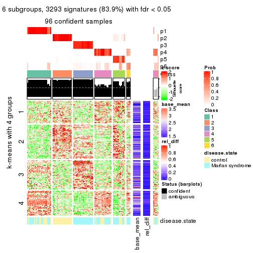</p>

</div>
</div>


Signature heatmaps where rows are not scaled:


<script>
$( function() {
	$( '#tabs-MAD-skmeans-get-signatures-no-scale' ).tabs();
} );
</script>
<div id='tabs-MAD-skmeans-get-signatures-no-scale'>
<ul>
<li><a href='#tab-MAD-skmeans-get-signatures-no-scale-1'>k = 2</a></li>
<li><a href='#tab-MAD-skmeans-get-signatures-no-scale-2'>k = 3</a></li>
<li><a href='#tab-MAD-skmeans-get-signatures-no-scale-3'>k = 4</a></li>
<li><a href='#tab-MAD-skmeans-get-signatures-no-scale-4'>k = 5</a></li>
<li><a href='#tab-MAD-skmeans-get-signatures-no-scale-5'>k = 6</a></li>
</ul>
<div id='tab-MAD-skmeans-get-signatures-no-scale-1'>
<pre><code class="r">get_signatures(res, k = 2, scale_rows = FALSE)
</code></pre>

<p></p>

</div>
<div id='tab-MAD-skmeans-get-signatures-no-scale-2'>
<pre><code class="r">get_signatures(res, k = 3, scale_rows = FALSE)
</code></pre>

<p></p>

</div>
<div id='tab-MAD-skmeans-get-signatures-no-scale-3'>
<pre><code class="r">get_signatures(res, k = 4, scale_rows = FALSE)
</code></pre>

<p></p>

</div>
<div id='tab-MAD-skmeans-get-signatures-no-scale-4'>
<pre><code class="r">get_signatures(res, k = 5, scale_rows = FALSE)
</code></pre>

<p></p>

</div>
<div id='tab-MAD-skmeans-get-signatures-no-scale-5'>
<pre><code class="r">get_signatures(res, k = 6, scale_rows = FALSE)
</code></pre>

<p></p>

</div>
</div>


Compare the overlap of signatures from different k:

```r
compare_signatures(res)
```


`get_signature()` returns a data frame invisibly. TO get the list of signatures, the function
call should be assigned to a variable explicitly. In following code, if `plot` argument is set
to `FALSE`, no heatmap is plotted while only the differential analysis is performed.

```r
# code only for demonstration
tb = get_signature(res, k = ..., plot = FALSE)
```

An example of the output of `tb` is:

```
#>   which_row         fdr    mean_1    mean_2 scaled_mean_1 scaled_mean_2 km
#> 1        38 0.042760348  8.373488  9.131774    -0.5533452     0.5164555  1
#> 2        40 0.018707592  7.106213  8.469186    -0.6173731     0.5762149  1
#> 3        55 0.019134737 10.221463 11.207825    -0.6159697     0.5749050  1
#> 4        59 0.006059896  5.921854  7.869574    -0.6899429     0.6439467  1
#> 5        60 0.018055526  8.928898 10.211722    -0.6204761     0.5791110  1
#> 6        98 0.009384629 15.714769 14.887706     0.6635654    -0.6193277  2
...
```

The columns in `tb` are:

1. `which_row`: row indices corresponding to the input matrix.
2. `fdr`: FDR for the differential test. 
3. `mean_x`: The mean value in group x.
4. `scaled_mean_x`: The mean value in group x after rows are scaled.
5. `km`: Row groups if k-means clustering is applied to rows.


UMAP plot which shows how samples are separated.


<script>
$( function() {
	$( '#tabs-MAD-skmeans-dimension-reduction' ).tabs();
} );
</script>
<div id='tabs-MAD-skmeans-dimension-reduction'>
<ul>
<li><a href='#tab-MAD-skmeans-dimension-reduction-1'>k = 2</a></li>
<li><a href='#tab-MAD-skmeans-dimension-reduction-2'>k = 3</a></li>
<li><a href='#tab-MAD-skmeans-dimension-reduction-3'>k = 4</a></li>
<li><a href='#tab-MAD-skmeans-dimension-reduction-4'>k = 5</a></li>
<li><a href='#tab-MAD-skmeans-dimension-reduction-5'>k = 6</a></li>
</ul>
<div id='tab-MAD-skmeans-dimension-reduction-1'>
<pre><code class="r">dimension_reduction(res, k = 2, method = &quot;UMAP&quot;)
</code></pre>

<p></p>

</div>
<div id='tab-MAD-skmeans-dimension-reduction-2'>
<pre><code class="r">dimension_reduction(res, k = 3, method = &quot;UMAP&quot;)
</code></pre>

<p></p>

</div>
<div id='tab-MAD-skmeans-dimension-reduction-3'>
<pre><code class="r">dimension_reduction(res, k = 4, method = &quot;UMAP&quot;)
</code></pre>

<p></p>

</div>
<div id='tab-MAD-skmeans-dimension-reduction-4'>
<pre><code class="r">dimension_reduction(res, k = 5, method = &quot;UMAP&quot;)
</code></pre>

<p></p>

</div>
<div id='tab-MAD-skmeans-dimension-reduction-5'>
<pre><code class="r">dimension_reduction(res, k = 6, method = &quot;UMAP&quot;)
</code></pre>

<p>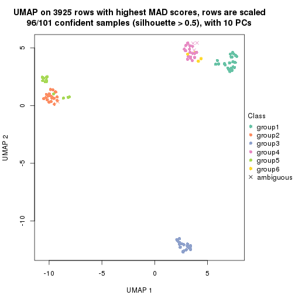</p>

</div>
</div>


Following heatmap shows how subgroups are split when increasing `k`:

```r
collect_classes(res)
```


Test correlation between subgroups and known annotations. If the known
annotation is numeric, one-way ANOVA test is applied, and if the known
annotation is discrete, chi-squared contingency table test is applied.

```r
test_to_known_factors(res)
```

```
#>               n disease.state(p) k
#> MAD:skmeans 101         3.32e-01 2
#> MAD:skmeans 101         2.94e-07 3
#> MAD:skmeans 100         5.38e-07 4
#> MAD:skmeans  99         4.93e-09 5
#> MAD:skmeans  96         1.70e-08 6
```


If matrix rows can be associated to genes, consider to use `functional_enrichment(res,
...)` to perform function enrichment for the signature genes. See [this vignette](http://bioconductor.org/packages/devel/bioc/vignettes/cola/inst/doc/functional_enrichment.html) for more detailed explanations.


 

---------------------------------------------------


### MAD:pam**


The object with results only for a single top-value method and a single partition method 
can be extracted as:

```r
res = res_list["MAD", "pam"]
# you can also extract it by
# res = res_list["MAD:pam"]
```

A summary of `res` and all the functions that can be applied to it:

```r
res
```

```
#> A 'ConsensusPartition' object with k = 2, 3, 4, 5, 6.
#>   On a matrix with 3925 rows and 101 columns.
#>   Top rows (392, 784, 1177, 1570, 1962) are extracted by 'MAD' method.
#>   Subgroups are detected by 'pam' method.
#>   Performed in total 1250 partitions by row resampling.
#>   Best k for subgroups seems to be 5.
#> 
#> Following methods can be applied to this 'ConsensusPartition' object:
#>  [1] "cola_report"             "collect_classes"         "collect_plots"          
#>  [4] "collect_stats"           "colnames"                "compare_signatures"     
#>  [7] "consensus_heatmap"       "dimension_reduction"     "functional_enrichment"  
#> [10] "get_anno_col"            "get_anno"                "get_classes"            
#> [13] "get_consensus"           "get_matrix"              "get_membership"         
#> [16] "get_param"               "get_signatures"          "get_stats"              
#> [19] "is_best_k"               "is_stable_k"             "membership_heatmap"     
#> [22] "ncol"                    "nrow"                    "plot_ecdf"              
#> [25] "rownames"                "select_partition_number" "show"                   
#> [28] "suggest_best_k"          "test_to_known_factors"
```

`collect_plots()` function collects all the plots made from `res` for all `k` (number of partitions)
into one single page to provide an easy and fast comparison between different `k`.

```r
collect_plots(res)
```


The plots are:

- The first row: a plot of the ECDF (empirical cumulative distribution
  function) curves of the consensus matrix for each `k` and the heatmap of
  predicted classes for each `k`.
- The second row: heatmaps of the consensus matrix for each `k`.
- The third row: heatmaps of the membership matrix for each `k`.
- The fouth row: heatmaps of the signatures for each `k`.

All the plots in panels can be made by individual functions and they are
plotted later in this section.

`select_partition_number()` produces several plots showing different
statistics for choosing "optimized" `k`. There are following statistics:

- ECDF curves of the consensus matrix for each `k`;
- 1-PAC. [The PAC
  score](https://en.wikipedia.org/wiki/Consensus_clustering#Over-interpretation_potential_of_consensus_clustering)
  measures the proportion of the ambiguous subgrouping.
- Mean silhouette score.
- Concordance. The mean probability of fiting the consensus class ids in all
  partitions.
- Area increased. Denote $A_k$ as the area under the ECDF curve for current
  `k`, the area increased is defined as $A_k - A_{k-1}$.
- Rand index. The percent of pairs of samples that are both in a same cluster
  or both are not in a same cluster in the partition of k and k-1.
- Jaccard index. The ratio of pairs of samples are both in a same cluster in
  the partition of k and k-1 and the pairs of samples are both in a same
  cluster in the partition k or k-1.

The detailed explanations of these statistics can be found in [the _cola_
vignette](http://bioconductor.org/packages/devel/bioc/vignettes/cola/inst/doc/cola.html#toc_13).

Generally speaking, lower PAC score, higher mean silhouette score or higher
concordance corresponds to better partition. Rand index and Jaccard index
measure how similar the current partition is compared to partition with `k-1`.
If they are too similar, we won't accept `k` is better than `k-1`.

```r
select_partition_number(res)
```


The numeric values for all these statistics can be obtained by `get_stats()`.

```r
get_stats(res)
```

```
#>   k 1-PAC mean_silhouette concordance area_increased  Rand Jaccard
#> 2 2 0.626           0.825       0.903         0.4707 0.495   0.495
#> 3 3 1.000           0.982       0.993         0.3439 0.873   0.744
#> 4 4 0.974           0.943       0.974         0.1869 0.870   0.652
#> 5 5 0.951           0.928       0.969         0.0536 0.954   0.819
#> 6 6 0.873           0.776       0.883         0.0335 0.985   0.928
```

`suggest_best_k()` suggests the best $k$ based on these statistics. The rules are as follows:

- All $k$ with Jaccard index larger than 0.95 are removed because increasing
  $k$ does not provide enough extra information. If all $k$ are removed, it is
  marked as no subgroup is detected.
- For all $k$ with 1-PAC score larger than 0.9, the maximal $k$ is taken as
  the best $k$, and other $k$ are marked as optional $k$.
- If it does not fit the second rule. The $k$ with the maximal vote of the
  highest 1-PAC score, highest mean silhouette, and highest concordance is
  taken as the best $k$.

```r
suggest_best_k(res)
```

```
#> [1] 5
#> attr(,"optional")
#> [1] 3 4
```

There is also optional best $k$ = 3 4 that is worth to check.

Following shows the table of the partitions (You need to click the **show/hide
code output** link to see it). The membership matrix (columns with name `p*`)
is inferred by
[`clue::cl_consensus()`](https://www.rdocumentation.org/link/cl_consensus?package=clue)
function with the `SE` method. Basically the value in the membership matrix
represents the probability to belong to a certain group. The finall class
label for an item is determined with the group with highest probability it
belongs to.

In `get_classes()` function, the entropy is calculated from the membership
matrix and the silhouette score is calculated from the consensus matrix.


<script>
$( function() {
	$( '#tabs-MAD-pam-get-classes' ).tabs();
} );
</script>
<div id='tabs-MAD-pam-get-classes'>
<ul>
<li><a href='#tab-MAD-pam-get-classes-1'>k = 2</a></li>
<li><a href='#tab-MAD-pam-get-classes-2'>k = 3</a></li>
<li><a href='#tab-MAD-pam-get-classes-3'>k = 4</a></li>
<li><a href='#tab-MAD-pam-get-classes-4'>k = 5</a></li>
<li><a href='#tab-MAD-pam-get-classes-5'>k = 6</a></li>
</ul>

<div id='tab-MAD-pam-get-classes-1'>
<p><a id='tab-MAD-pam-get-classes-1-a' style='color:#0366d6' href='#'>show/hide code output</a></p>
<pre><code class="r">cbind(get_classes(res, k = 2), get_membership(res, k = 2))
</code></pre>

<pre><code>#&gt;           class entropy silhouette    p1    p2
#&gt; GSM217644     2  0.9983      0.452 0.476 0.524
#&gt; GSM217645     2  0.9983      0.452 0.476 0.524
#&gt; GSM217646     2  0.9983      0.452 0.476 0.524
#&gt; GSM217647     2  0.9754      0.539 0.408 0.592
#&gt; GSM217648     2  0.6623      0.726 0.172 0.828
#&gt; GSM217649     2  0.9983      0.452 0.476 0.524
#&gt; GSM217650     2  0.9983      0.452 0.476 0.524
#&gt; GSM217651     2  0.7139      0.713 0.196 0.804
#&gt; GSM217652     2  0.9983      0.452 0.476 0.524
#&gt; GSM217653     2  0.7056      0.715 0.192 0.808
#&gt; GSM217654     2  0.9983      0.452 0.476 0.524
#&gt; GSM217655     2  0.9983      0.452 0.476 0.524
#&gt; GSM217656     2  0.9983      0.452 0.476 0.524
#&gt; GSM217657     2  0.9983      0.452 0.476 0.524
#&gt; GSM217658     2  0.9983      0.452 0.476 0.524
#&gt; GSM217659     2  0.9983      0.452 0.476 0.524
#&gt; GSM217660     2  0.9881      0.506 0.436 0.564
#&gt; GSM217661     2  0.9983      0.452 0.476 0.524
#&gt; GSM217662     2  0.2423      0.779 0.040 0.960
#&gt; GSM217663     2  0.9983      0.452 0.476 0.524
#&gt; GSM217664     2  0.9983      0.452 0.476 0.524
#&gt; GSM217665     2  0.9983      0.452 0.476 0.524
#&gt; GSM217666     2  0.9248      0.608 0.340 0.660
#&gt; GSM217667     2  0.9000      0.629 0.316 0.684
#&gt; GSM217668     1  0.3733      0.893 0.928 0.072
#&gt; GSM217669     1  0.0000      0.998 1.000 0.000
#&gt; GSM217670     1  0.0000      0.998 1.000 0.000
#&gt; GSM217671     1  0.0000      0.998 1.000 0.000
#&gt; GSM217672     1  0.0000      0.998 1.000 0.000
#&gt; GSM217673     1  0.0000      0.998 1.000 0.000
#&gt; GSM217674     1  0.0000      0.998 1.000 0.000
#&gt; GSM217675     1  0.0000      0.998 1.000 0.000
#&gt; GSM217676     1  0.0000      0.998 1.000 0.000
#&gt; GSM217677     1  0.0000      0.998 1.000 0.000
#&gt; GSM217678     1  0.0000      0.998 1.000 0.000
#&gt; GSM217679     1  0.0000      0.998 1.000 0.000
#&gt; GSM217680     1  0.0000      0.998 1.000 0.000
#&gt; GSM217681     1  0.0000      0.998 1.000 0.000
#&gt; GSM217682     1  0.0000      0.998 1.000 0.000
#&gt; GSM217683     1  0.0000      0.998 1.000 0.000
#&gt; GSM217684     1  0.0000      0.998 1.000 0.000
#&gt; GSM217685     2  0.0000      0.789 0.000 1.000
#&gt; GSM217686     2  0.0000      0.789 0.000 1.000
#&gt; GSM217687     2  0.0000      0.789 0.000 1.000
#&gt; GSM217688     2  0.0000      0.789 0.000 1.000
#&gt; GSM217689     2  0.0000      0.789 0.000 1.000
#&gt; GSM217690     2  0.0000      0.789 0.000 1.000
#&gt; GSM217691     2  0.0000      0.789 0.000 1.000
#&gt; GSM217692     2  0.0000      0.789 0.000 1.000
#&gt; GSM217693     2  0.0000      0.789 0.000 1.000
#&gt; GSM217694     2  0.0000      0.789 0.000 1.000
#&gt; GSM217695     2  0.0000      0.789 0.000 1.000
#&gt; GSM217696     2  0.0000      0.789 0.000 1.000
#&gt; GSM217697     2  0.0000      0.789 0.000 1.000
#&gt; GSM217698     2  0.0000      0.789 0.000 1.000
#&gt; GSM217699     2  0.0000      0.789 0.000 1.000
#&gt; GSM217700     2  0.0000      0.789 0.000 1.000
#&gt; GSM217701     2  0.0000      0.789 0.000 1.000
#&gt; GSM217702     2  0.0000      0.789 0.000 1.000
#&gt; GSM217703     2  0.0000      0.789 0.000 1.000
#&gt; GSM217704     2  0.0000      0.789 0.000 1.000
#&gt; GSM217705     1  0.0000      0.998 1.000 0.000
#&gt; GSM217706     1  0.0000      0.998 1.000 0.000
#&gt; GSM217707     1  0.0000      0.998 1.000 0.000
#&gt; GSM217708     1  0.0000      0.998 1.000 0.000
#&gt; GSM217709     1  0.0000      0.998 1.000 0.000
#&gt; GSM217710     1  0.0000      0.998 1.000 0.000
#&gt; GSM217711     1  0.0000      0.998 1.000 0.000
#&gt; GSM217712     1  0.0000      0.998 1.000 0.000
#&gt; GSM217713     1  0.0000      0.998 1.000 0.000
#&gt; GSM217714     1  0.0000      0.998 1.000 0.000
#&gt; GSM217715     1  0.0000      0.998 1.000 0.000
#&gt; GSM217716     1  0.0000      0.998 1.000 0.000
#&gt; GSM217717     1  0.0000      0.998 1.000 0.000
#&gt; GSM217718     1  0.0000      0.998 1.000 0.000
#&gt; GSM217719     1  0.0000      0.998 1.000 0.000
#&gt; GSM217720     1  0.0000      0.998 1.000 0.000
#&gt; GSM217721     1  0.0000      0.998 1.000 0.000
#&gt; GSM217722     1  0.0000      0.998 1.000 0.000
#&gt; GSM217723     1  0.0000      0.998 1.000 0.000
#&gt; GSM217724     1  0.0000      0.998 1.000 0.000
#&gt; GSM217725     1  0.0000      0.998 1.000 0.000
#&gt; GSM217726     1  0.0000      0.998 1.000 0.000
#&gt; GSM217727     1  0.0000      0.998 1.000 0.000
#&gt; GSM217728     1  0.0000      0.998 1.000 0.000
#&gt; GSM217729     1  0.0000      0.998 1.000 0.000
#&gt; GSM217730     1  0.0000      0.998 1.000 0.000
#&gt; GSM217731     1  0.0000      0.998 1.000 0.000
#&gt; GSM217732     1  0.0000      0.998 1.000 0.000
#&gt; GSM217733     1  0.0000      0.998 1.000 0.000
#&gt; GSM217734     1  0.0000      0.998 1.000 0.000
#&gt; GSM217735     1  0.0000      0.998 1.000 0.000
#&gt; GSM217736     1  0.0000      0.998 1.000 0.000
#&gt; GSM217737     2  0.2236      0.780 0.036 0.964
#&gt; GSM217738     2  0.0000      0.789 0.000 1.000
#&gt; GSM217739     2  0.0000      0.789 0.000 1.000
#&gt; GSM217740     2  0.0376      0.788 0.004 0.996
#&gt; GSM217741     2  0.0000      0.789 0.000 1.000
#&gt; GSM217742     2  0.0000      0.789 0.000 1.000
#&gt; GSM217743     2  0.0000      0.789 0.000 1.000
#&gt; GSM217744     2  0.0000      0.789 0.000 1.000
</code></pre>

<script>
$('#tab-MAD-pam-get-classes-1-a').parent().next().next().hide();
$('#tab-MAD-pam-get-classes-1-a').click(function(){
  $('#tab-MAD-pam-get-classes-1-a').parent().next().next().toggle();
  return(false);
});
</script>
</div>

<div id='tab-MAD-pam-get-classes-2'>
<p><a id='tab-MAD-pam-get-classes-2-a' style='color:#0366d6' href='#'>show/hide code output</a></p>
<pre><code class="r">cbind(get_classes(res, k = 3), get_membership(res, k = 3))
</code></pre>

<pre><code>#&gt;           class entropy silhouette    p1    p2    p3
#&gt; GSM217644     2  0.0000      0.987 0.000 1.000 0.000
#&gt; GSM217645     2  0.0000      0.987 0.000 1.000 0.000
#&gt; GSM217646     2  0.0000      0.987 0.000 1.000 0.000
#&gt; GSM217647     2  0.0000      0.987 0.000 1.000 0.000
#&gt; GSM217648     2  0.0000      0.987 0.000 1.000 0.000
#&gt; GSM217649     2  0.0000      0.987 0.000 1.000 0.000
#&gt; GSM217650     2  0.0000      0.987 0.000 1.000 0.000
#&gt; GSM217651     2  0.0000      0.987 0.000 1.000 0.000
#&gt; GSM217652     2  0.0000      0.987 0.000 1.000 0.000
#&gt; GSM217653     2  0.0000      0.987 0.000 1.000 0.000
#&gt; GSM217654     2  0.0000      0.987 0.000 1.000 0.000
#&gt; GSM217655     2  0.0000      0.987 0.000 1.000 0.000
#&gt; GSM217656     2  0.8309      0.516 0.188 0.632 0.180
#&gt; GSM217657     2  0.0424      0.981 0.000 0.992 0.008
#&gt; GSM217658     2  0.0000      0.987 0.000 1.000 0.000
#&gt; GSM217659     2  0.0000      0.987 0.000 1.000 0.000
#&gt; GSM217660     2  0.0000      0.987 0.000 1.000 0.000
#&gt; GSM217661     2  0.0000      0.987 0.000 1.000 0.000
#&gt; GSM217662     2  0.0000      0.987 0.000 1.000 0.000
#&gt; GSM217663     2  0.0000      0.987 0.000 1.000 0.000
#&gt; GSM217664     2  0.0000      0.987 0.000 1.000 0.000
#&gt; GSM217665     2  0.0000      0.987 0.000 1.000 0.000
#&gt; GSM217666     2  0.0000      0.987 0.000 1.000 0.000
#&gt; GSM217667     2  0.0000      0.987 0.000 1.000 0.000
#&gt; GSM217668     1  0.5810      0.486 0.664 0.336 0.000
#&gt; GSM217669     1  0.0000      0.992 1.000 0.000 0.000
#&gt; GSM217670     1  0.0000      0.992 1.000 0.000 0.000
#&gt; GSM217671     1  0.0000      0.992 1.000 0.000 0.000
#&gt; GSM217672     1  0.0000      0.992 1.000 0.000 0.000
#&gt; GSM217673     1  0.0000      0.992 1.000 0.000 0.000
#&gt; GSM217674     1  0.0000      0.992 1.000 0.000 0.000
#&gt; GSM217675     1  0.0000      0.992 1.000 0.000 0.000
#&gt; GSM217676     1  0.0000      0.992 1.000 0.000 0.000
#&gt; GSM217677     1  0.0000      0.992 1.000 0.000 0.000
#&gt; GSM217678     1  0.0000      0.992 1.000 0.000 0.000
#&gt; GSM217679     1  0.0000      0.992 1.000 0.000 0.000
#&gt; GSM217680     1  0.0000      0.992 1.000 0.000 0.000
#&gt; GSM217681     1  0.0000      0.992 1.000 0.000 0.000
#&gt; GSM217682     1  0.0000      0.992 1.000 0.000 0.000
#&gt; GSM217683     1  0.0000      0.992 1.000 0.000 0.000
#&gt; GSM217684     1  0.0000      0.992 1.000 0.000 0.000
#&gt; GSM217685     3  0.0000      1.000 0.000 0.000 1.000
#&gt; GSM217686     3  0.0000      1.000 0.000 0.000 1.000
#&gt; GSM217687     3  0.0000      1.000 0.000 0.000 1.000
#&gt; GSM217688     3  0.0000      1.000 0.000 0.000 1.000
#&gt; GSM217689     3  0.0000      1.000 0.000 0.000 1.000
#&gt; GSM217690     3  0.0000      1.000 0.000 0.000 1.000
#&gt; GSM217691     3  0.0000      1.000 0.000 0.000 1.000
#&gt; GSM217692     3  0.0000      1.000 0.000 0.000 1.000
#&gt; GSM217693     3  0.0000      1.000 0.000 0.000 1.000
#&gt; GSM217694     3  0.0000      1.000 0.000 0.000 1.000
#&gt; GSM217695     3  0.0000      1.000 0.000 0.000 1.000
#&gt; GSM217696     3  0.0000      1.000 0.000 0.000 1.000
#&gt; GSM217697     3  0.0000      1.000 0.000 0.000 1.000
#&gt; GSM217698     3  0.0000      1.000 0.000 0.000 1.000
#&gt; GSM217699     3  0.0000      1.000 0.000 0.000 1.000
#&gt; GSM217700     3  0.0000      1.000 0.000 0.000 1.000
#&gt; GSM217701     3  0.0000      1.000 0.000 0.000 1.000
#&gt; GSM217702     3  0.0000      1.000 0.000 0.000 1.000
#&gt; GSM217703     3  0.0000      1.000 0.000 0.000 1.000
#&gt; GSM217704     3  0.0000      1.000 0.000 0.000 1.000
#&gt; GSM217705     1  0.0000      0.992 1.000 0.000 0.000
#&gt; GSM217706     1  0.0000      0.992 1.000 0.000 0.000
#&gt; GSM217707     1  0.0000      0.992 1.000 0.000 0.000
#&gt; GSM217708     1  0.0000      0.992 1.000 0.000 0.000
#&gt; GSM217709     1  0.0000      0.992 1.000 0.000 0.000
#&gt; GSM217710     1  0.0000      0.992 1.000 0.000 0.000
#&gt; GSM217711     1  0.0000      0.992 1.000 0.000 0.000
#&gt; GSM217712     1  0.0000      0.992 1.000 0.000 0.000
#&gt; GSM217713     1  0.0000      0.992 1.000 0.000 0.000
#&gt; GSM217714     1  0.0000      0.992 1.000 0.000 0.000
#&gt; GSM217715     1  0.0000      0.992 1.000 0.000 0.000
#&gt; GSM217716     1  0.0000      0.992 1.000 0.000 0.000
#&gt; GSM217717     1  0.0000      0.992 1.000 0.000 0.000
#&gt; GSM217718     1  0.0000      0.992 1.000 0.000 0.000
#&gt; GSM217719     1  0.0000      0.992 1.000 0.000 0.000
#&gt; GSM217720     1  0.0000      0.992 1.000 0.000 0.000
#&gt; GSM217721     1  0.0000      0.992 1.000 0.000 0.000
#&gt; GSM217722     1  0.0000      0.992 1.000 0.000 0.000
#&gt; GSM217723     1  0.0000      0.992 1.000 0.000 0.000
#&gt; GSM217724     1  0.0000      0.992 1.000 0.000 0.000
#&gt; GSM217725     1  0.0000      0.992 1.000 0.000 0.000
#&gt; GSM217726     1  0.0000      0.992 1.000 0.000 0.000
#&gt; GSM217727     1  0.0000      0.992 1.000 0.000 0.000
#&gt; GSM217728     1  0.0000      0.992 1.000 0.000 0.000
#&gt; GSM217729     1  0.0000      0.992 1.000 0.000 0.000
#&gt; GSM217730     1  0.0000      0.992 1.000 0.000 0.000
#&gt; GSM217731     1  0.0000      0.992 1.000 0.000 0.000
#&gt; GSM217732     1  0.0000      0.992 1.000 0.000 0.000
#&gt; GSM217733     1  0.0000      0.992 1.000 0.000 0.000
#&gt; GSM217734     1  0.0000      0.992 1.000 0.000 0.000
#&gt; GSM217735     1  0.0000      0.992 1.000 0.000 0.000
#&gt; GSM217736     1  0.0000      0.992 1.000 0.000 0.000
#&gt; GSM217737     2  0.0592      0.977 0.000 0.988 0.012
#&gt; GSM217738     2  0.0424      0.981 0.000 0.992 0.008
#&gt; GSM217739     2  0.0000      0.987 0.000 1.000 0.000
#&gt; GSM217740     2  0.0000      0.987 0.000 1.000 0.000
#&gt; GSM217741     2  0.0000      0.987 0.000 1.000 0.000
#&gt; GSM217742     2  0.0000      0.987 0.000 1.000 0.000
#&gt; GSM217743     2  0.0000      0.987 0.000 1.000 0.000
#&gt; GSM217744     2  0.0000      0.987 0.000 1.000 0.000
</code></pre>

<script>
$('#tab-MAD-pam-get-classes-2-a').parent().next().next().hide();
$('#tab-MAD-pam-get-classes-2-a').click(function(){
  $('#tab-MAD-pam-get-classes-2-a').parent().next().next().toggle();
  return(false);
});
</script>
</div>

<div id='tab-MAD-pam-get-classes-3'>
<p><a id='tab-MAD-pam-get-classes-3-a' style='color:#0366d6' href='#'>show/hide code output</a></p>
<pre><code class="r">cbind(get_classes(res, k = 4), get_membership(res, k = 4))
</code></pre>

<pre><code>#&gt;           class entropy silhouette    p1    p2    p3    p4
#&gt; GSM217644     2  0.0000     0.9877 0.000 1.000 0.000 0.000
#&gt; GSM217645     2  0.0000     0.9877 0.000 1.000 0.000 0.000
#&gt; GSM217646     2  0.0000     0.9877 0.000 1.000 0.000 0.000
#&gt; GSM217647     2  0.0000     0.9877 0.000 1.000 0.000 0.000
#&gt; GSM217648     2  0.0000     0.9877 0.000 1.000 0.000 0.000
#&gt; GSM217649     2  0.0000     0.9877 0.000 1.000 0.000 0.000
#&gt; GSM217650     2  0.0000     0.9877 0.000 1.000 0.000 0.000
#&gt; GSM217651     2  0.0000     0.9877 0.000 1.000 0.000 0.000
#&gt; GSM217652     2  0.0000     0.9877 0.000 1.000 0.000 0.000
#&gt; GSM217653     2  0.0000     0.9877 0.000 1.000 0.000 0.000
#&gt; GSM217654     2  0.1474     0.9411 0.000 0.948 0.000 0.052
#&gt; GSM217655     2  0.1474     0.9401 0.000 0.948 0.000 0.052
#&gt; GSM217656     4  0.6965     0.0552 0.004 0.440 0.096 0.460
#&gt; GSM217657     2  0.3945     0.7193 0.000 0.780 0.004 0.216
#&gt; GSM217658     2  0.0000     0.9877 0.000 1.000 0.000 0.000
#&gt; GSM217659     2  0.0000     0.9877 0.000 1.000 0.000 0.000
#&gt; GSM217660     2  0.0188     0.9866 0.000 0.996 0.000 0.004
#&gt; GSM217661     2  0.0000     0.9877 0.000 1.000 0.000 0.000
#&gt; GSM217662     2  0.0000     0.9877 0.000 1.000 0.000 0.000
#&gt; GSM217663     2  0.0000     0.9877 0.000 1.000 0.000 0.000
#&gt; GSM217664     2  0.0000     0.9877 0.000 1.000 0.000 0.000
#&gt; GSM217665     2  0.0000     0.9877 0.000 1.000 0.000 0.000
#&gt; GSM217666     2  0.0000     0.9877 0.000 1.000 0.000 0.000
#&gt; GSM217667     2  0.0000     0.9877 0.000 1.000 0.000 0.000
#&gt; GSM217668     4  0.0469     0.9306 0.012 0.000 0.000 0.988
#&gt; GSM217669     4  0.2921     0.8221 0.140 0.000 0.000 0.860
#&gt; GSM217670     4  0.4624     0.4777 0.340 0.000 0.000 0.660
#&gt; GSM217671     4  0.1716     0.8971 0.064 0.000 0.000 0.936
#&gt; GSM217672     4  0.0592     0.9291 0.016 0.000 0.000 0.984
#&gt; GSM217673     4  0.1022     0.9212 0.032 0.000 0.000 0.968
#&gt; GSM217674     1  0.0000     0.9762 1.000 0.000 0.000 0.000
#&gt; GSM217675     1  0.0000     0.9762 1.000 0.000 0.000 0.000
#&gt; GSM217676     1  0.0000     0.9762 1.000 0.000 0.000 0.000
#&gt; GSM217677     1  0.0000     0.9762 1.000 0.000 0.000 0.000
#&gt; GSM217678     1  0.0000     0.9762 1.000 0.000 0.000 0.000
#&gt; GSM217679     1  0.0000     0.9762 1.000 0.000 0.000 0.000
#&gt; GSM217680     1  0.0000     0.9762 1.000 0.000 0.000 0.000
#&gt; GSM217681     1  0.0000     0.9762 1.000 0.000 0.000 0.000
#&gt; GSM217682     1  0.0000     0.9762 1.000 0.000 0.000 0.000
#&gt; GSM217683     1  0.0000     0.9762 1.000 0.000 0.000 0.000
#&gt; GSM217684     1  0.4103     0.6356 0.744 0.000 0.000 0.256
#&gt; GSM217685     3  0.0000     1.0000 0.000 0.000 1.000 0.000
#&gt; GSM217686     3  0.0000     1.0000 0.000 0.000 1.000 0.000
#&gt; GSM217687     3  0.0000     1.0000 0.000 0.000 1.000 0.000
#&gt; GSM217688     3  0.0000     1.0000 0.000 0.000 1.000 0.000
#&gt; GSM217689     3  0.0000     1.0000 0.000 0.000 1.000 0.000
#&gt; GSM217690     3  0.0000     1.0000 0.000 0.000 1.000 0.000
#&gt; GSM217691     3  0.0000     1.0000 0.000 0.000 1.000 0.000
#&gt; GSM217692     3  0.0000     1.0000 0.000 0.000 1.000 0.000
#&gt; GSM217693     3  0.0000     1.0000 0.000 0.000 1.000 0.000
#&gt; GSM217694     3  0.0000     1.0000 0.000 0.000 1.000 0.000
#&gt; GSM217695     3  0.0000     1.0000 0.000 0.000 1.000 0.000
#&gt; GSM217696     3  0.0000     1.0000 0.000 0.000 1.000 0.000
#&gt; GSM217697     3  0.0000     1.0000 0.000 0.000 1.000 0.000
#&gt; GSM217698     3  0.0000     1.0000 0.000 0.000 1.000 0.000
#&gt; GSM217699     3  0.0000     1.0000 0.000 0.000 1.000 0.000
#&gt; GSM217700     3  0.0000     1.0000 0.000 0.000 1.000 0.000
#&gt; GSM217701     3  0.0000     1.0000 0.000 0.000 1.000 0.000
#&gt; GSM217702     3  0.0000     1.0000 0.000 0.000 1.000 0.000
#&gt; GSM217703     3  0.0000     1.0000 0.000 0.000 1.000 0.000
#&gt; GSM217704     3  0.0000     1.0000 0.000 0.000 1.000 0.000
#&gt; GSM217705     4  0.0707     0.9274 0.020 0.000 0.000 0.980
#&gt; GSM217706     4  0.0336     0.9312 0.008 0.000 0.000 0.992
#&gt; GSM217707     4  0.2345     0.8659 0.100 0.000 0.000 0.900
#&gt; GSM217708     4  0.0188     0.9311 0.004 0.000 0.000 0.996
#&gt; GSM217709     4  0.0188     0.9311 0.004 0.000 0.000 0.996
#&gt; GSM217710     4  0.0592     0.9280 0.016 0.000 0.000 0.984
#&gt; GSM217711     4  0.0188     0.9311 0.004 0.000 0.000 0.996
#&gt; GSM217712     4  0.0188     0.9311 0.004 0.000 0.000 0.996
#&gt; GSM217713     4  0.0188     0.9311 0.004 0.000 0.000 0.996
#&gt; GSM217714     4  0.0336     0.9312 0.008 0.000 0.000 0.992
#&gt; GSM217715     4  0.0336     0.9312 0.008 0.000 0.000 0.992
#&gt; GSM217716     4  0.0336     0.9312 0.008 0.000 0.000 0.992
#&gt; GSM217717     4  0.0336     0.9312 0.008 0.000 0.000 0.992
#&gt; GSM217718     4  0.0188     0.9311 0.004 0.000 0.000 0.996
#&gt; GSM217719     4  0.0188     0.9311 0.004 0.000 0.000 0.996
#&gt; GSM217720     4  0.1022     0.9208 0.032 0.000 0.000 0.968
#&gt; GSM217721     4  0.0188     0.9311 0.004 0.000 0.000 0.996
#&gt; GSM217722     4  0.0188     0.9311 0.004 0.000 0.000 0.996
#&gt; GSM217723     4  0.4776     0.4168 0.376 0.000 0.000 0.624
#&gt; GSM217724     1  0.2760     0.8437 0.872 0.000 0.000 0.128
#&gt; GSM217725     1  0.0707     0.9621 0.980 0.000 0.000 0.020
#&gt; GSM217726     1  0.0000     0.9762 1.000 0.000 0.000 0.000
#&gt; GSM217727     1  0.0000     0.9762 1.000 0.000 0.000 0.000
#&gt; GSM217728     1  0.0817     0.9579 0.976 0.000 0.000 0.024
#&gt; GSM217729     1  0.0000     0.9762 1.000 0.000 0.000 0.000
#&gt; GSM217730     1  0.0000     0.9762 1.000 0.000 0.000 0.000
#&gt; GSM217731     1  0.1940     0.9065 0.924 0.000 0.000 0.076
#&gt; GSM217732     1  0.0000     0.9762 1.000 0.000 0.000 0.000
#&gt; GSM217733     1  0.0000     0.9762 1.000 0.000 0.000 0.000
#&gt; GSM217734     1  0.0000     0.9762 1.000 0.000 0.000 0.000
#&gt; GSM217735     1  0.0000     0.9762 1.000 0.000 0.000 0.000
#&gt; GSM217736     1  0.0000     0.9762 1.000 0.000 0.000 0.000
#&gt; GSM217737     2  0.0524     0.9820 0.000 0.988 0.004 0.008
#&gt; GSM217738     2  0.0188     0.9866 0.000 0.996 0.000 0.004
#&gt; GSM217739     2  0.0188     0.9866 0.000 0.996 0.000 0.004
#&gt; GSM217740     2  0.0188     0.9866 0.000 0.996 0.000 0.004
#&gt; GSM217741     2  0.0188     0.9866 0.000 0.996 0.000 0.004
#&gt; GSM217742     2  0.0188     0.9866 0.000 0.996 0.000 0.004
#&gt; GSM217743     2  0.0188     0.9866 0.000 0.996 0.000 0.004
#&gt; GSM217744     2  0.0188     0.9866 0.000 0.996 0.000 0.004
</code></pre>

<script>
$('#tab-MAD-pam-get-classes-3-a').parent().next().next().hide();
$('#tab-MAD-pam-get-classes-3-a').click(function(){
  $('#tab-MAD-pam-get-classes-3-a').parent().next().next().toggle();
  return(false);
});
</script>
</div>

<div id='tab-MAD-pam-get-classes-4'>
<p><a id='tab-MAD-pam-get-classes-4-a' style='color:#0366d6' href='#'>show/hide code output</a></p>
<pre><code class="r">cbind(get_classes(res, k = 5), get_membership(res, k = 5))
</code></pre>

<pre><code>#&gt;           class entropy silhouette    p1    p2    p3    p4    p5
#&gt; GSM217644     2  0.0162     0.9327 0.000 0.996 0.000 0.000 0.004
#&gt; GSM217645     2  0.0162     0.9327 0.000 0.996 0.000 0.000 0.004
#&gt; GSM217646     2  0.0000     0.9336 0.000 1.000 0.000 0.000 0.000
#&gt; GSM217647     2  0.0000     0.9336 0.000 1.000 0.000 0.000 0.000
#&gt; GSM217648     2  0.1197     0.9062 0.000 0.952 0.000 0.000 0.048
#&gt; GSM217649     2  0.0000     0.9336 0.000 1.000 0.000 0.000 0.000
#&gt; GSM217650     2  0.0162     0.9327 0.000 0.996 0.000 0.000 0.004
#&gt; GSM217651     2  0.0000     0.9336 0.000 1.000 0.000 0.000 0.000
#&gt; GSM217652     2  0.0000     0.9336 0.000 1.000 0.000 0.000 0.000
#&gt; GSM217653     2  0.1121     0.9093 0.000 0.956 0.000 0.000 0.044
#&gt; GSM217654     2  0.1408     0.9029 0.000 0.948 0.000 0.044 0.008
#&gt; GSM217655     2  0.1408     0.9029 0.000 0.948 0.000 0.044 0.008
#&gt; GSM217656     2  0.3099     0.8031 0.000 0.848 0.012 0.132 0.008
#&gt; GSM217657     2  0.2754     0.8525 0.000 0.880 0.000 0.080 0.040
#&gt; GSM217658     2  0.0000     0.9336 0.000 1.000 0.000 0.000 0.000
#&gt; GSM217659     2  0.0000     0.9336 0.000 1.000 0.000 0.000 0.000
#&gt; GSM217660     2  0.4307     0.0743 0.000 0.500 0.000 0.000 0.500
#&gt; GSM217661     2  0.0000     0.9336 0.000 1.000 0.000 0.000 0.000
#&gt; GSM217662     2  0.3366     0.6975 0.000 0.768 0.000 0.000 0.232
#&gt; GSM217663     2  0.0162     0.9327 0.000 0.996 0.000 0.000 0.004
#&gt; GSM217664     2  0.0000     0.9336 0.000 1.000 0.000 0.000 0.000
#&gt; GSM217665     2  0.0000     0.9336 0.000 1.000 0.000 0.000 0.000
#&gt; GSM217666     2  0.0162     0.9325 0.000 0.996 0.000 0.000 0.004
#&gt; GSM217667     2  0.3274     0.7197 0.000 0.780 0.000 0.000 0.220
#&gt; GSM217668     4  0.1124     0.9141 0.004 0.036 0.000 0.960 0.000
#&gt; GSM217669     4  0.2516     0.8197 0.140 0.000 0.000 0.860 0.000
#&gt; GSM217670     4  0.3966     0.4866 0.336 0.000 0.000 0.664 0.000
#&gt; GSM217671     4  0.1270     0.9076 0.052 0.000 0.000 0.948 0.000
#&gt; GSM217672     4  0.0162     0.9406 0.004 0.000 0.000 0.996 0.000
#&gt; GSM217673     4  0.0609     0.9329 0.020 0.000 0.000 0.980 0.000
#&gt; GSM217674     1  0.0000     0.9745 1.000 0.000 0.000 0.000 0.000
#&gt; GSM217675     1  0.0000     0.9745 1.000 0.000 0.000 0.000 0.000
#&gt; GSM217676     1  0.0000     0.9745 1.000 0.000 0.000 0.000 0.000
#&gt; GSM217677     1  0.0000     0.9745 1.000 0.000 0.000 0.000 0.000
#&gt; GSM217678     1  0.0000     0.9745 1.000 0.000 0.000 0.000 0.000
#&gt; GSM217679     1  0.0000     0.9745 1.000 0.000 0.000 0.000 0.000
#&gt; GSM217680     1  0.0000     0.9745 1.000 0.000 0.000 0.000 0.000
#&gt; GSM217681     1  0.0000     0.9745 1.000 0.000 0.000 0.000 0.000
#&gt; GSM217682     1  0.0000     0.9745 1.000 0.000 0.000 0.000 0.000
#&gt; GSM217683     1  0.0000     0.9745 1.000 0.000 0.000 0.000 0.000
#&gt; GSM217684     1  0.3366     0.6846 0.768 0.000 0.000 0.232 0.000
#&gt; GSM217685     3  0.0000     1.0000 0.000 0.000 1.000 0.000 0.000
#&gt; GSM217686     3  0.0000     1.0000 0.000 0.000 1.000 0.000 0.000
#&gt; GSM217687     3  0.0000     1.0000 0.000 0.000 1.000 0.000 0.000
#&gt; GSM217688     3  0.0000     1.0000 0.000 0.000 1.000 0.000 0.000
#&gt; GSM217689     3  0.0000     1.0000 0.000 0.000 1.000 0.000 0.000
#&gt; GSM217690     3  0.0000     1.0000 0.000 0.000 1.000 0.000 0.000
#&gt; GSM217691     3  0.0000     1.0000 0.000 0.000 1.000 0.000 0.000
#&gt; GSM217692     3  0.0000     1.0000 0.000 0.000 1.000 0.000 0.000
#&gt; GSM217693     3  0.0000     1.0000 0.000 0.000 1.000 0.000 0.000
#&gt; GSM217694     3  0.0000     1.0000 0.000 0.000 1.000 0.000 0.000
#&gt; GSM217695     3  0.0000     1.0000 0.000 0.000 1.000 0.000 0.000
#&gt; GSM217696     3  0.0000     1.0000 0.000 0.000 1.000 0.000 0.000
#&gt; GSM217697     3  0.0000     1.0000 0.000 0.000 1.000 0.000 0.000
#&gt; GSM217698     3  0.0000     1.0000 0.000 0.000 1.000 0.000 0.000
#&gt; GSM217699     3  0.0000     1.0000 0.000 0.000 1.000 0.000 0.000
#&gt; GSM217700     3  0.0000     1.0000 0.000 0.000 1.000 0.000 0.000
#&gt; GSM217701     3  0.0000     1.0000 0.000 0.000 1.000 0.000 0.000
#&gt; GSM217702     3  0.0000     1.0000 0.000 0.000 1.000 0.000 0.000
#&gt; GSM217703     3  0.0000     1.0000 0.000 0.000 1.000 0.000 0.000
#&gt; GSM217704     3  0.0000     1.0000 0.000 0.000 1.000 0.000 0.000
#&gt; GSM217705     4  0.0510     0.9355 0.016 0.000 0.000 0.984 0.000
#&gt; GSM217706     4  0.0000     0.9417 0.000 0.000 0.000 1.000 0.000
#&gt; GSM217707     4  0.2020     0.8638 0.100 0.000 0.000 0.900 0.000
#&gt; GSM217708     4  0.0000     0.9417 0.000 0.000 0.000 1.000 0.000
#&gt; GSM217709     4  0.0000     0.9417 0.000 0.000 0.000 1.000 0.000
#&gt; GSM217710     4  0.0404     0.9375 0.012 0.000 0.000 0.988 0.000
#&gt; GSM217711     4  0.0000     0.9417 0.000 0.000 0.000 1.000 0.000
#&gt; GSM217712     4  0.0000     0.9417 0.000 0.000 0.000 1.000 0.000
#&gt; GSM217713     4  0.0000     0.9417 0.000 0.000 0.000 1.000 0.000
#&gt; GSM217714     4  0.0000     0.9417 0.000 0.000 0.000 1.000 0.000
#&gt; GSM217715     4  0.0000     0.9417 0.000 0.000 0.000 1.000 0.000
#&gt; GSM217716     4  0.0000     0.9417 0.000 0.000 0.000 1.000 0.000
#&gt; GSM217717     4  0.0000     0.9417 0.000 0.000 0.000 1.000 0.000
#&gt; GSM217718     4  0.0000     0.9417 0.000 0.000 0.000 1.000 0.000
#&gt; GSM217719     4  0.0000     0.9417 0.000 0.000 0.000 1.000 0.000
#&gt; GSM217720     4  0.0794     0.9278 0.028 0.000 0.000 0.972 0.000
#&gt; GSM217721     4  0.0000     0.9417 0.000 0.000 0.000 1.000 0.000
#&gt; GSM217722     4  0.0162     0.9407 0.004 0.000 0.000 0.996 0.000
#&gt; GSM217723     4  0.4201     0.3393 0.408 0.000 0.000 0.592 0.000
#&gt; GSM217724     1  0.2377     0.8385 0.872 0.000 0.000 0.128 0.000
#&gt; GSM217725     1  0.0510     0.9618 0.984 0.000 0.000 0.016 0.000
#&gt; GSM217726     1  0.0000     0.9745 1.000 0.000 0.000 0.000 0.000
#&gt; GSM217727     1  0.0000     0.9745 1.000 0.000 0.000 0.000 0.000
#&gt; GSM217728     1  0.0703     0.9544 0.976 0.000 0.000 0.024 0.000
#&gt; GSM217729     1  0.0000     0.9745 1.000 0.000 0.000 0.000 0.000
#&gt; GSM217730     1  0.0000     0.9745 1.000 0.000 0.000 0.000 0.000
#&gt; GSM217731     1  0.1792     0.8900 0.916 0.000 0.000 0.084 0.000
#&gt; GSM217732     1  0.0000     0.9745 1.000 0.000 0.000 0.000 0.000
#&gt; GSM217733     1  0.0000     0.9745 1.000 0.000 0.000 0.000 0.000
#&gt; GSM217734     1  0.0000     0.9745 1.000 0.000 0.000 0.000 0.000
#&gt; GSM217735     1  0.0000     0.9745 1.000 0.000 0.000 0.000 0.000
#&gt; GSM217736     1  0.0000     0.9745 1.000 0.000 0.000 0.000 0.000
#&gt; GSM217737     5  0.0000     0.9969 0.000 0.000 0.000 0.000 1.000
#&gt; GSM217738     5  0.0000     0.9969 0.000 0.000 0.000 0.000 1.000
#&gt; GSM217739     5  0.0000     0.9969 0.000 0.000 0.000 0.000 1.000
#&gt; GSM217740     5  0.0000     0.9969 0.000 0.000 0.000 0.000 1.000
#&gt; GSM217741     5  0.0162     0.9968 0.000 0.004 0.000 0.000 0.996
#&gt; GSM217742     5  0.0162     0.9968 0.000 0.004 0.000 0.000 0.996
#&gt; GSM217743     5  0.0162     0.9968 0.000 0.004 0.000 0.000 0.996
#&gt; GSM217744     5  0.0290     0.9934 0.000 0.008 0.000 0.000 0.992
</code></pre>

<script>
$('#tab-MAD-pam-get-classes-4-a').parent().next().next().hide();
$('#tab-MAD-pam-get-classes-4-a').click(function(){
  $('#tab-MAD-pam-get-classes-4-a').parent().next().next().toggle();
  return(false);
});
</script>
</div>

<div id='tab-MAD-pam-get-classes-5'>
<p><a id='tab-MAD-pam-get-classes-5-a' style='color:#0366d6' href='#'>show/hide code output</a></p>
<pre><code class="r">cbind(get_classes(res, k = 6), get_membership(res, k = 6))
</code></pre>

<pre><code>#&gt;           class entropy silhouette    p1    p2    p3    p4    p5    p6
#&gt; GSM217644     2  0.2883     0.7447 0.000 0.788 0.000 0.000 0.000 0.212
#&gt; GSM217645     2  0.2260     0.8122 0.000 0.860 0.000 0.000 0.000 0.140
#&gt; GSM217646     2  0.0000     0.8989 0.000 1.000 0.000 0.000 0.000 0.000
#&gt; GSM217647     2  0.0000     0.8989 0.000 1.000 0.000 0.000 0.000 0.000
#&gt; GSM217648     2  0.0458     0.8916 0.000 0.984 0.000 0.000 0.016 0.000
#&gt; GSM217649     2  0.0000     0.8989 0.000 1.000 0.000 0.000 0.000 0.000
#&gt; GSM217650     2  0.0632     0.8913 0.000 0.976 0.000 0.000 0.000 0.024
#&gt; GSM217651     2  0.0632     0.8917 0.000 0.976 0.000 0.000 0.000 0.024
#&gt; GSM217652     2  0.0000     0.8989 0.000 1.000 0.000 0.000 0.000 0.000
#&gt; GSM217653     2  0.0790     0.8815 0.000 0.968 0.000 0.000 0.032 0.000
#&gt; GSM217654     2  0.4251     0.4597 0.000 0.624 0.000 0.028 0.000 0.348
#&gt; GSM217655     2  0.4359     0.6662 0.000 0.724 0.000 0.040 0.024 0.212
#&gt; GSM217656     6  0.5418    -0.0329 0.000 0.344 0.024 0.072 0.000 0.560
#&gt; GSM217657     2  0.4902     0.3127 0.000 0.572 0.000 0.060 0.004 0.364
#&gt; GSM217658     2  0.0000     0.8989 0.000 1.000 0.000 0.000 0.000 0.000
#&gt; GSM217659     2  0.0000     0.8989 0.000 1.000 0.000 0.000 0.000 0.000
#&gt; GSM217660     5  0.5799     0.0534 0.000 0.368 0.000 0.000 0.448 0.184
#&gt; GSM217661     2  0.0363     0.8965 0.000 0.988 0.000 0.000 0.000 0.012
#&gt; GSM217662     2  0.3037     0.7175 0.000 0.808 0.000 0.000 0.176 0.016
#&gt; GSM217663     2  0.0146     0.8980 0.000 0.996 0.000 0.000 0.004 0.000
#&gt; GSM217664     2  0.0000     0.8989 0.000 1.000 0.000 0.000 0.000 0.000
#&gt; GSM217665     2  0.0000     0.8989 0.000 1.000 0.000 0.000 0.000 0.000
#&gt; GSM217666     2  0.0000     0.8989 0.000 1.000 0.000 0.000 0.000 0.000
#&gt; GSM217667     2  0.2003     0.7988 0.000 0.884 0.000 0.000 0.116 0.000
#&gt; GSM217668     4  0.0748     0.7632 0.004 0.016 0.000 0.976 0.000 0.004
#&gt; GSM217669     4  0.2747     0.6741 0.096 0.000 0.000 0.860 0.000 0.044
#&gt; GSM217670     4  0.3446     0.2545 0.308 0.000 0.000 0.692 0.000 0.000
#&gt; GSM217671     4  0.0865     0.7520 0.036 0.000 0.000 0.964 0.000 0.000
#&gt; GSM217672     4  0.0146     0.7687 0.004 0.000 0.000 0.996 0.000 0.000
#&gt; GSM217673     4  0.0363     0.7679 0.012 0.000 0.000 0.988 0.000 0.000
#&gt; GSM217674     1  0.0000     0.9415 1.000 0.000 0.000 0.000 0.000 0.000
#&gt; GSM217675     1  0.0146     0.9396 0.996 0.000 0.000 0.000 0.000 0.004
#&gt; GSM217676     1  0.1267     0.9008 0.940 0.000 0.000 0.000 0.000 0.060
#&gt; GSM217677     1  0.0000     0.9415 1.000 0.000 0.000 0.000 0.000 0.000
#&gt; GSM217678     1  0.0146     0.9396 0.996 0.000 0.000 0.000 0.000 0.004
#&gt; GSM217679     1  0.0000     0.9415 1.000 0.000 0.000 0.000 0.000 0.000
#&gt; GSM217680     1  0.0000     0.9415 1.000 0.000 0.000 0.000 0.000 0.000
#&gt; GSM217681     1  0.0000     0.9415 1.000 0.000 0.000 0.000 0.000 0.000
#&gt; GSM217682     1  0.0000     0.9415 1.000 0.000 0.000 0.000 0.000 0.000
#&gt; GSM217683     1  0.0000     0.9415 1.000 0.000 0.000 0.000 0.000 0.000
#&gt; GSM217684     1  0.3330     0.5552 0.716 0.000 0.000 0.284 0.000 0.000
#&gt; GSM217685     3  0.0000     0.8343 0.000 0.000 1.000 0.000 0.000 0.000
#&gt; GSM217686     3  0.0000     0.8343 0.000 0.000 1.000 0.000 0.000 0.000
#&gt; GSM217687     3  0.0000     0.8343 0.000 0.000 1.000 0.000 0.000 0.000
#&gt; GSM217688     3  0.0000     0.8343 0.000 0.000 1.000 0.000 0.000 0.000
#&gt; GSM217689     3  0.0000     0.8343 0.000 0.000 1.000 0.000 0.000 0.000
#&gt; GSM217690     3  0.0000     0.8343 0.000 0.000 1.000 0.000 0.000 0.000
#&gt; GSM217691     3  0.3659     0.8137 0.000 0.000 0.636 0.000 0.000 0.364
#&gt; GSM217692     3  0.3659     0.8137 0.000 0.000 0.636 0.000 0.000 0.364
#&gt; GSM217693     3  0.3659     0.8137 0.000 0.000 0.636 0.000 0.000 0.364
#&gt; GSM217694     3  0.3659     0.8137 0.000 0.000 0.636 0.000 0.000 0.364
#&gt; GSM217695     3  0.3659     0.8137 0.000 0.000 0.636 0.000 0.000 0.364
#&gt; GSM217696     3  0.3659     0.8137 0.000 0.000 0.636 0.000 0.000 0.364
#&gt; GSM217697     3  0.3659     0.8137 0.000 0.000 0.636 0.000 0.000 0.364
#&gt; GSM217698     3  0.3023     0.8287 0.000 0.000 0.768 0.000 0.000 0.232
#&gt; GSM217699     3  0.0260     0.8351 0.000 0.000 0.992 0.000 0.000 0.008
#&gt; GSM217700     3  0.3351     0.8240 0.000 0.000 0.712 0.000 0.000 0.288
#&gt; GSM217701     3  0.0000     0.8343 0.000 0.000 1.000 0.000 0.000 0.000
#&gt; GSM217702     3  0.0260     0.8351 0.000 0.000 0.992 0.000 0.000 0.008
#&gt; GSM217703     3  0.0000     0.8343 0.000 0.000 1.000 0.000 0.000 0.000
#&gt; GSM217704     3  0.3659     0.8137 0.000 0.000 0.636 0.000 0.000 0.364
#&gt; GSM217705     4  0.2019     0.7410 0.012 0.000 0.000 0.900 0.000 0.088
#&gt; GSM217706     4  0.0000     0.7683 0.000 0.000 0.000 1.000 0.000 0.000
#&gt; GSM217707     4  0.3657     0.6490 0.108 0.000 0.000 0.792 0.000 0.100
#&gt; GSM217708     4  0.3797     0.4003 0.000 0.000 0.000 0.580 0.000 0.420
#&gt; GSM217709     4  0.3804     0.3988 0.000 0.000 0.000 0.576 0.000 0.424
#&gt; GSM217710     4  0.3833     0.3545 0.000 0.000 0.000 0.556 0.000 0.444
#&gt; GSM217711     4  0.3756     0.4351 0.000 0.000 0.000 0.600 0.000 0.400
#&gt; GSM217712     4  0.1663     0.7593 0.000 0.000 0.000 0.912 0.000 0.088
#&gt; GSM217713     4  0.2664     0.6911 0.000 0.000 0.000 0.816 0.000 0.184
#&gt; GSM217714     4  0.0146     0.7688 0.000 0.000 0.000 0.996 0.000 0.004
#&gt; GSM217715     4  0.0000     0.7683 0.000 0.000 0.000 1.000 0.000 0.000
#&gt; GSM217716     4  0.0146     0.7688 0.000 0.000 0.000 0.996 0.000 0.004
#&gt; GSM217717     4  0.0458     0.7702 0.000 0.000 0.000 0.984 0.000 0.016
#&gt; GSM217718     4  0.3446     0.5545 0.000 0.000 0.000 0.692 0.000 0.308
#&gt; GSM217719     4  0.3175     0.6193 0.000 0.000 0.000 0.744 0.000 0.256
#&gt; GSM217720     4  0.1983     0.7425 0.020 0.000 0.000 0.908 0.000 0.072
#&gt; GSM217721     4  0.1501     0.7611 0.000 0.000 0.000 0.924 0.000 0.076
#&gt; GSM217722     4  0.3265     0.6344 0.004 0.000 0.000 0.748 0.000 0.248
#&gt; GSM217723     6  0.5930    -0.2411 0.212 0.000 0.000 0.384 0.000 0.404
#&gt; GSM217724     1  0.3041     0.7953 0.832 0.000 0.000 0.040 0.000 0.128
#&gt; GSM217725     1  0.3830     0.4149 0.620 0.000 0.000 0.004 0.000 0.376
#&gt; GSM217726     1  0.0000     0.9415 1.000 0.000 0.000 0.000 0.000 0.000
#&gt; GSM217727     1  0.0000     0.9415 1.000 0.000 0.000 0.000 0.000 0.000
#&gt; GSM217728     1  0.2871     0.7594 0.804 0.000 0.000 0.004 0.000 0.192
#&gt; GSM217729     1  0.0790     0.9224 0.968 0.000 0.000 0.000 0.000 0.032
#&gt; GSM217730     1  0.0000     0.9415 1.000 0.000 0.000 0.000 0.000 0.000
#&gt; GSM217731     1  0.1204     0.8874 0.944 0.000 0.000 0.056 0.000 0.000
#&gt; GSM217732     1  0.0000     0.9415 1.000 0.000 0.000 0.000 0.000 0.000
#&gt; GSM217733     1  0.0000     0.9415 1.000 0.000 0.000 0.000 0.000 0.000
#&gt; GSM217734     1  0.0000     0.9415 1.000 0.000 0.000 0.000 0.000 0.000
#&gt; GSM217735     1  0.0000     0.9415 1.000 0.000 0.000 0.000 0.000 0.000
#&gt; GSM217736     1  0.0000     0.9415 1.000 0.000 0.000 0.000 0.000 0.000
#&gt; GSM217737     5  0.0000     0.9207 0.000 0.000 0.000 0.000 1.000 0.000
#&gt; GSM217738     5  0.0000     0.9207 0.000 0.000 0.000 0.000 1.000 0.000
#&gt; GSM217739     5  0.0000     0.9207 0.000 0.000 0.000 0.000 1.000 0.000
#&gt; GSM217740     5  0.0000     0.9207 0.000 0.000 0.000 0.000 1.000 0.000
#&gt; GSM217741     5  0.0000     0.9207 0.000 0.000 0.000 0.000 1.000 0.000
#&gt; GSM217742     5  0.0000     0.9207 0.000 0.000 0.000 0.000 1.000 0.000
#&gt; GSM217743     5  0.0000     0.9207 0.000 0.000 0.000 0.000 1.000 0.000
#&gt; GSM217744     5  0.0000     0.9207 0.000 0.000 0.000 0.000 1.000 0.000
</code></pre>

<script>
$('#tab-MAD-pam-get-classes-5-a').parent().next().next().hide();
$('#tab-MAD-pam-get-classes-5-a').click(function(){
  $('#tab-MAD-pam-get-classes-5-a').parent().next().next().toggle();
  return(false);
});
</script>
</div>
</div>

Heatmaps for the consensus matrix. It visualizes the probability of two
samples to be in a same group.


<script>
$( function() {
	$( '#tabs-MAD-pam-consensus-heatmap' ).tabs();
} );
</script>
<div id='tabs-MAD-pam-consensus-heatmap'>
<ul>
<li><a href='#tab-MAD-pam-consensus-heatmap-1'>k = 2</a></li>
<li><a href='#tab-MAD-pam-consensus-heatmap-2'>k = 3</a></li>
<li><a href='#tab-MAD-pam-consensus-heatmap-3'>k = 4</a></li>
<li><a href='#tab-MAD-pam-consensus-heatmap-4'>k = 5</a></li>
<li><a href='#tab-MAD-pam-consensus-heatmap-5'>k = 6</a></li>
</ul>
<div id='tab-MAD-pam-consensus-heatmap-1'>
<pre><code class="r">consensus_heatmap(res, k = 2)
</code></pre>

<p></p>

</div>
<div id='tab-MAD-pam-consensus-heatmap-2'>
<pre><code class="r">consensus_heatmap(res, k = 3)
</code></pre>

<p></p>

</div>
<div id='tab-MAD-pam-consensus-heatmap-3'>
<pre><code class="r">consensus_heatmap(res, k = 4)
</code></pre>

<p></p>

</div>
<div id='tab-MAD-pam-consensus-heatmap-4'>
<pre><code class="r">consensus_heatmap(res, k = 5)
</code></pre>

<p></p>

</div>
<div id='tab-MAD-pam-consensus-heatmap-5'>
<pre><code class="r">consensus_heatmap(res, k = 6)
</code></pre>

<p></p>

</div>
</div>

Heatmaps for the membership of samples in all partitions to see how consistent they are:


<script>
$( function() {
	$( '#tabs-MAD-pam-membership-heatmap' ).tabs();
} );
</script>
<div id='tabs-MAD-pam-membership-heatmap'>
<ul>
<li><a href='#tab-MAD-pam-membership-heatmap-1'>k = 2</a></li>
<li><a href='#tab-MAD-pam-membership-heatmap-2'>k = 3</a></li>
<li><a href='#tab-MAD-pam-membership-heatmap-3'>k = 4</a></li>
<li><a href='#tab-MAD-pam-membership-heatmap-4'>k = 5</a></li>
<li><a href='#tab-MAD-pam-membership-heatmap-5'>k = 6</a></li>
</ul>
<div id='tab-MAD-pam-membership-heatmap-1'>
<pre><code class="r">membership_heatmap(res, k = 2)
</code></pre>

<p></p>

</div>
<div id='tab-MAD-pam-membership-heatmap-2'>
<pre><code class="r">membership_heatmap(res, k = 3)
</code></pre>

<p></p>

</div>
<div id='tab-MAD-pam-membership-heatmap-3'>
<pre><code class="r">membership_heatmap(res, k = 4)
</code></pre>

<p></p>

</div>
<div id='tab-MAD-pam-membership-heatmap-4'>
<pre><code class="r">membership_heatmap(res, k = 5)
</code></pre>

<p></p>

</div>
<div id='tab-MAD-pam-membership-heatmap-5'>
<pre><code class="r">membership_heatmap(res, k = 6)
</code></pre>

<p></p>

</div>
</div>

As soon as we have had the classes for columns, we can look for signatures
which are significantly different between classes which can be candidate marks
for certain classes. Following are the heatmaps for signatures.


Signature heatmaps where rows are scaled:


<script>
$( function() {
	$( '#tabs-MAD-pam-get-signatures' ).tabs();
} );
</script>
<div id='tabs-MAD-pam-get-signatures'>
<ul>
<li><a href='#tab-MAD-pam-get-signatures-1'>k = 2</a></li>
<li><a href='#tab-MAD-pam-get-signatures-2'>k = 3</a></li>
<li><a href='#tab-MAD-pam-get-signatures-3'>k = 4</a></li>
<li><a href='#tab-MAD-pam-get-signatures-4'>k = 5</a></li>
<li><a href='#tab-MAD-pam-get-signatures-5'>k = 6</a></li>
</ul>
<div id='tab-MAD-pam-get-signatures-1'>
<pre><code class="r">get_signatures(res, k = 2)
</code></pre>

<p></p>

</div>
<div id='tab-MAD-pam-get-signatures-2'>
<pre><code class="r">get_signatures(res, k = 3)
</code></pre>

<p></p>

</div>
<div id='tab-MAD-pam-get-signatures-3'>
<pre><code class="r">get_signatures(res, k = 4)
</code></pre>

<p></p>

</div>
<div id='tab-MAD-pam-get-signatures-4'>
<pre><code class="r">get_signatures(res, k = 5)
</code></pre>

<p></p>

</div>
<div id='tab-MAD-pam-get-signatures-5'>
<pre><code class="r">get_signatures(res, k = 6)
</code></pre>

<p></p>

</div>
</div>


Signature heatmaps where rows are not scaled:


<script>
$( function() {
	$( '#tabs-MAD-pam-get-signatures-no-scale' ).tabs();
} );
</script>
<div id='tabs-MAD-pam-get-signatures-no-scale'>
<ul>
<li><a href='#tab-MAD-pam-get-signatures-no-scale-1'>k = 2</a></li>
<li><a href='#tab-MAD-pam-get-signatures-no-scale-2'>k = 3</a></li>
<li><a href='#tab-MAD-pam-get-signatures-no-scale-3'>k = 4</a></li>
<li><a href='#tab-MAD-pam-get-signatures-no-scale-4'>k = 5</a></li>
<li><a href='#tab-MAD-pam-get-signatures-no-scale-5'>k = 6</a></li>
</ul>
<div id='tab-MAD-pam-get-signatures-no-scale-1'>
<pre><code class="r">get_signatures(res, k = 2, scale_rows = FALSE)
</code></pre>

<p></p>

</div>
<div id='tab-MAD-pam-get-signatures-no-scale-2'>
<pre><code class="r">get_signatures(res, k = 3, scale_rows = FALSE)
</code></pre>

<p></p>

</div>
<div id='tab-MAD-pam-get-signatures-no-scale-3'>
<pre><code class="r">get_signatures(res, k = 4, scale_rows = FALSE)
</code></pre>

<p></p>

</div>
<div id='tab-MAD-pam-get-signatures-no-scale-4'>
<pre><code class="r">get_signatures(res, k = 5, scale_rows = FALSE)
</code></pre>

<p></p>

</div>
<div id='tab-MAD-pam-get-signatures-no-scale-5'>
<pre><code class="r">get_signatures(res, k = 6, scale_rows = FALSE)
</code></pre>

<p></p>

</div>
</div>


Compare the overlap of signatures from different k:

```r
compare_signatures(res)
```


`get_signature()` returns a data frame invisibly. TO get the list of signatures, the function
call should be assigned to a variable explicitly. In following code, if `plot` argument is set
to `FALSE`, no heatmap is plotted while only the differential analysis is performed.

```r
# code only for demonstration
tb = get_signature(res, k = ..., plot = FALSE)
```

An example of the output of `tb` is:

```
#>   which_row         fdr    mean_1    mean_2 scaled_mean_1 scaled_mean_2 km
#> 1        38 0.042760348  8.373488  9.131774    -0.5533452     0.5164555  1
#> 2        40 0.018707592  7.106213  8.469186    -0.6173731     0.5762149  1
#> 3        55 0.019134737 10.221463 11.207825    -0.6159697     0.5749050  1
#> 4        59 0.006059896  5.921854  7.869574    -0.6899429     0.6439467  1
#> 5        60 0.018055526  8.928898 10.211722    -0.6204761     0.5791110  1
#> 6        98 0.009384629 15.714769 14.887706     0.6635654    -0.6193277  2
...
```

The columns in `tb` are:

1. `which_row`: row indices corresponding to the input matrix.
2. `fdr`: FDR for the differential test. 
3. `mean_x`: The mean value in group x.
4. `scaled_mean_x`: The mean value in group x after rows are scaled.
5. `km`: Row groups if k-means clustering is applied to rows.


UMAP plot which shows how samples are separated.


<script>
$( function() {
	$( '#tabs-MAD-pam-dimension-reduction' ).tabs();
} );
</script>
<div id='tabs-MAD-pam-dimension-reduction'>
<ul>
<li><a href='#tab-MAD-pam-dimension-reduction-1'>k = 2</a></li>
<li><a href='#tab-MAD-pam-dimension-reduction-2'>k = 3</a></li>
<li><a href='#tab-MAD-pam-dimension-reduction-3'>k = 4</a></li>
<li><a href='#tab-MAD-pam-dimension-reduction-4'>k = 5</a></li>
<li><a href='#tab-MAD-pam-dimension-reduction-5'>k = 6</a></li>
</ul>
<div id='tab-MAD-pam-dimension-reduction-1'>
<pre><code class="r">dimension_reduction(res, k = 2, method = &quot;UMAP&quot;)
</code></pre>

<p></p>

</div>
<div id='tab-MAD-pam-dimension-reduction-2'>
<pre><code class="r">dimension_reduction(res, k = 3, method = &quot;UMAP&quot;)
</code></pre>

<p></p>

</div>
<div id='tab-MAD-pam-dimension-reduction-3'>
<pre><code class="r">dimension_reduction(res, k = 4, method = &quot;UMAP&quot;)
</code></pre>

<p></p>

</div>
<div id='tab-MAD-pam-dimension-reduction-4'>
<pre><code class="r">dimension_reduction(res, k = 5, method = &quot;UMAP&quot;)
</code></pre>

<p></p>

</div>
<div id='tab-MAD-pam-dimension-reduction-5'>
<pre><code class="r">dimension_reduction(res, k = 6, method = &quot;UMAP&quot;)
</code></pre>

<p></p>

</div>
</div>


Following heatmap shows how subgroups are split when increasing `k`:

```r
collect_classes(res)
```


Test correlation between subgroups and known annotations. If the known
annotation is numeric, one-way ANOVA test is applied, and if the known
annotation is discrete, chi-squared contingency table test is applied.

```r
test_to_known_factors(res)
```

```
#>           n disease.state(p) k
#> MAD:pam  85         3.14e-01 2
#> MAD:pam 100         2.32e-07 3
#> MAD:pam  98         5.17e-07 4
#> MAD:pam  98         1.36e-11 5
#> MAD:pam  90         2.53e-10 6
```


If matrix rows can be associated to genes, consider to use `functional_enrichment(res,
...)` to perform function enrichment for the signature genes. See [this vignette](http://bioconductor.org/packages/devel/bioc/vignettes/cola/inst/doc/functional_enrichment.html) for more detailed explanations.


 

---------------------------------------------------


### MAD:mclust*


The object with results only for a single top-value method and a single partition method 
can be extracted as:

```r
res = res_list["MAD", "mclust"]
# you can also extract it by
# res = res_list["MAD:mclust"]
```

A summary of `res` and all the functions that can be applied to it:

```r
res
```

```
#> A 'ConsensusPartition' object with k = 2, 3, 4, 5, 6.
#>   On a matrix with 3925 rows and 101 columns.
#>   Top rows (392, 784, 1177, 1570, 1962) are extracted by 'MAD' method.
#>   Subgroups are detected by 'mclust' method.
#>   Performed in total 1250 partitions by row resampling.
#>   Best k for subgroups seems to be 6.
#> 
#> Following methods can be applied to this 'ConsensusPartition' object:
#>  [1] "cola_report"             "collect_classes"         "collect_plots"          
#>  [4] "collect_stats"           "colnames"                "compare_signatures"     
#>  [7] "consensus_heatmap"       "dimension_reduction"     "functional_enrichment"  
#> [10] "get_anno_col"            "get_anno"                "get_classes"            
#> [13] "get_consensus"           "get_matrix"              "get_membership"         
#> [16] "get_param"               "get_signatures"          "get_stats"              
#> [19] "is_best_k"               "is_stable_k"             "membership_heatmap"     
#> [22] "ncol"                    "nrow"                    "plot_ecdf"              
#> [25] "rownames"                "select_partition_number" "show"                   
#> [28] "suggest_best_k"          "test_to_known_factors"
```

`collect_plots()` function collects all the plots made from `res` for all `k` (number of partitions)
into one single page to provide an easy and fast comparison between different `k`.

```r
collect_plots(res)
```


The plots are:

- The first row: a plot of the ECDF (empirical cumulative distribution
  function) curves of the consensus matrix for each `k` and the heatmap of
  predicted classes for each `k`.
- The second row: heatmaps of the consensus matrix for each `k`.
- The third row: heatmaps of the membership matrix for each `k`.
- The fouth row: heatmaps of the signatures for each `k`.

All the plots in panels can be made by individual functions and they are
plotted later in this section.

`select_partition_number()` produces several plots showing different
statistics for choosing "optimized" `k`. There are following statistics:

- ECDF curves of the consensus matrix for each `k`;
- 1-PAC. [The PAC
  score](https://en.wikipedia.org/wiki/Consensus_clustering#Over-interpretation_potential_of_consensus_clustering)
  measures the proportion of the ambiguous subgrouping.
- Mean silhouette score.
- Concordance. The mean probability of fiting the consensus class ids in all
  partitions.
- Area increased. Denote $A_k$ as the area under the ECDF curve for current
  `k`, the area increased is defined as $A_k - A_{k-1}$.
- Rand index. The percent of pairs of samples that are both in a same cluster
  or both are not in a same cluster in the partition of k and k-1.
- Jaccard index. The ratio of pairs of samples are both in a same cluster in
  the partition of k and k-1 and the pairs of samples are both in a same
  cluster in the partition k or k-1.

The detailed explanations of these statistics can be found in [the _cola_
vignette](http://bioconductor.org/packages/devel/bioc/vignettes/cola/inst/doc/cola.html#toc_13).

Generally speaking, lower PAC score, higher mean silhouette score or higher
concordance corresponds to better partition. Rand index and Jaccard index
measure how similar the current partition is compared to partition with `k-1`.
If they are too similar, we won't accept `k` is better than `k-1`.

```r
select_partition_number(res)
```


The numeric values for all these statistics can be obtained by `get_stats()`.

```r
get_stats(res)
```

```
#>   k 1-PAC mean_silhouette concordance area_increased  Rand Jaccard
#> 2 2 1.000           0.988       0.985         0.4968 0.495   0.495
#> 3 3 0.818           0.957       0.968         0.2673 0.873   0.744
#> 4 4 0.809           0.825       0.887         0.0917 0.983   0.954
#> 5 5 0.988           0.955       0.973         0.1614 0.821   0.510
#> 6 6 0.941           0.860       0.938         0.0109 0.987   0.937
```

`suggest_best_k()` suggests the best $k$ based on these statistics. The rules are as follows:

- All $k$ with Jaccard index larger than 0.95 are removed because increasing
  $k$ does not provide enough extra information. If all $k$ are removed, it is
  marked as no subgroup is detected.
- For all $k$ with 1-PAC score larger than 0.9, the maximal $k$ is taken as
  the best $k$, and other $k$ are marked as optional $k$.
- If it does not fit the second rule. The $k$ with the maximal vote of the
  highest 1-PAC score, highest mean silhouette, and highest concordance is
  taken as the best $k$.

```r
suggest_best_k(res)
```

```
#> [1] 6
#> attr(,"optional")
#> [1] 2 5
```

There is also optional best $k$ = 2 5 that is worth to check.

Following shows the table of the partitions (You need to click the **show/hide
code output** link to see it). The membership matrix (columns with name `p*`)
is inferred by
[`clue::cl_consensus()`](https://www.rdocumentation.org/link/cl_consensus?package=clue)
function with the `SE` method. Basically the value in the membership matrix
represents the probability to belong to a certain group. The finall class
label for an item is determined with the group with highest probability it
belongs to.

In `get_classes()` function, the entropy is calculated from the membership
matrix and the silhouette score is calculated from the consensus matrix.


<script>
$( function() {
	$( '#tabs-MAD-mclust-get-classes' ).tabs();
} );
</script>
<div id='tabs-MAD-mclust-get-classes'>
<ul>
<li><a href='#tab-MAD-mclust-get-classes-1'>k = 2</a></li>
<li><a href='#tab-MAD-mclust-get-classes-2'>k = 3</a></li>
<li><a href='#tab-MAD-mclust-get-classes-3'>k = 4</a></li>
<li><a href='#tab-MAD-mclust-get-classes-4'>k = 5</a></li>
<li><a href='#tab-MAD-mclust-get-classes-5'>k = 6</a></li>
</ul>

<div id='tab-MAD-mclust-get-classes-1'>
<p><a id='tab-MAD-mclust-get-classes-1-a' style='color:#0366d6' href='#'>show/hide code output</a></p>
<pre><code class="r">cbind(get_classes(res, k = 2), get_membership(res, k = 2))
</code></pre>

<pre><code>#&gt;           class entropy silhouette    p1    p2
#&gt; GSM217644     2  0.2603      0.982 0.044 0.956
#&gt; GSM217645     2  0.2603      0.982 0.044 0.956
#&gt; GSM217646     2  0.2603      0.982 0.044 0.956
#&gt; GSM217647     2  0.2603      0.982 0.044 0.956
#&gt; GSM217648     2  0.2603      0.982 0.044 0.956
#&gt; GSM217649     2  0.2603      0.982 0.044 0.956
#&gt; GSM217650     2  0.2603      0.982 0.044 0.956
#&gt; GSM217651     2  0.2603      0.982 0.044 0.956
#&gt; GSM217652     2  0.2603      0.982 0.044 0.956
#&gt; GSM217653     2  0.2603      0.982 0.044 0.956
#&gt; GSM217654     2  0.2778      0.979 0.048 0.952
#&gt; GSM217655     2  0.2778      0.979 0.048 0.952
#&gt; GSM217656     2  0.4298      0.940 0.088 0.912
#&gt; GSM217657     2  0.2778      0.979 0.048 0.952
#&gt; GSM217658     2  0.2603      0.982 0.044 0.956
#&gt; GSM217659     2  0.2603      0.982 0.044 0.956
#&gt; GSM217660     2  0.2603      0.982 0.044 0.956
#&gt; GSM217661     2  0.2603      0.982 0.044 0.956
#&gt; GSM217662     2  0.2603      0.982 0.044 0.956
#&gt; GSM217663     2  0.2603      0.982 0.044 0.956
#&gt; GSM217664     2  0.2603      0.982 0.044 0.956
#&gt; GSM217665     2  0.2603      0.982 0.044 0.956
#&gt; GSM217666     2  0.2603      0.982 0.044 0.956
#&gt; GSM217667     2  0.2603      0.982 0.044 0.956
#&gt; GSM217668     1  0.0000      1.000 1.000 0.000
#&gt; GSM217669     1  0.0000      1.000 1.000 0.000
#&gt; GSM217670     1  0.0000      1.000 1.000 0.000
#&gt; GSM217671     1  0.0000      1.000 1.000 0.000
#&gt; GSM217672     1  0.0000      1.000 1.000 0.000
#&gt; GSM217673     1  0.0000      1.000 1.000 0.000
#&gt; GSM217674     1  0.0000      1.000 1.000 0.000
#&gt; GSM217675     1  0.0000      1.000 1.000 0.000
#&gt; GSM217676     1  0.0000      1.000 1.000 0.000
#&gt; GSM217677     1  0.0000      1.000 1.000 0.000
#&gt; GSM217678     1  0.0000      1.000 1.000 0.000
#&gt; GSM217679     1  0.0000      1.000 1.000 0.000
#&gt; GSM217680     1  0.0000      1.000 1.000 0.000
#&gt; GSM217681     1  0.0000      1.000 1.000 0.000
#&gt; GSM217682     1  0.0000      1.000 1.000 0.000
#&gt; GSM217683     1  0.0000      1.000 1.000 0.000
#&gt; GSM217684     1  0.0000      1.000 1.000 0.000
#&gt; GSM217685     2  0.0000      0.971 0.000 1.000
#&gt; GSM217686     2  0.0000      0.971 0.000 1.000
#&gt; GSM217687     2  0.0000      0.971 0.000 1.000
#&gt; GSM217688     2  0.0000      0.971 0.000 1.000
#&gt; GSM217689     2  0.0672      0.973 0.008 0.992
#&gt; GSM217690     2  0.0672      0.973 0.008 0.992
#&gt; GSM217691     2  0.0000      0.971 0.000 1.000
#&gt; GSM217692     2  0.0000      0.971 0.000 1.000
#&gt; GSM217693     2  0.0000      0.971 0.000 1.000
#&gt; GSM217694     2  0.0000      0.971 0.000 1.000
#&gt; GSM217695     2  0.0000      0.971 0.000 1.000
#&gt; GSM217696     2  0.0000      0.971 0.000 1.000
#&gt; GSM217697     2  0.0000      0.971 0.000 1.000
#&gt; GSM217698     2  0.0000      0.971 0.000 1.000
#&gt; GSM217699     2  0.0000      0.971 0.000 1.000
#&gt; GSM217700     2  0.0000      0.971 0.000 1.000
#&gt; GSM217701     2  0.0000      0.971 0.000 1.000
#&gt; GSM217702     2  0.0000      0.971 0.000 1.000
#&gt; GSM217703     2  0.0938      0.974 0.012 0.988
#&gt; GSM217704     2  0.0000      0.971 0.000 1.000
#&gt; GSM217705     1  0.0000      1.000 1.000 0.000
#&gt; GSM217706     1  0.0000      1.000 1.000 0.000
#&gt; GSM217707     1  0.0000      1.000 1.000 0.000
#&gt; GSM217708     1  0.0000      1.000 1.000 0.000
#&gt; GSM217709     1  0.0000      1.000 1.000 0.000
#&gt; GSM217710     1  0.0000      1.000 1.000 0.000
#&gt; GSM217711     1  0.0000      1.000 1.000 0.000
#&gt; GSM217712     1  0.0000      1.000 1.000 0.000
#&gt; GSM217713     1  0.0000      1.000 1.000 0.000
#&gt; GSM217714     1  0.0000      1.000 1.000 0.000
#&gt; GSM217715     1  0.0000      1.000 1.000 0.000
#&gt; GSM217716     1  0.0000      1.000 1.000 0.000
#&gt; GSM217717     1  0.0000      1.000 1.000 0.000
#&gt; GSM217718     1  0.0000      1.000 1.000 0.000
#&gt; GSM217719     1  0.0000      1.000 1.000 0.000
#&gt; GSM217720     1  0.0000      1.000 1.000 0.000
#&gt; GSM217721     1  0.0000      1.000 1.000 0.000
#&gt; GSM217722     1  0.0000      1.000 1.000 0.000
#&gt; GSM217723     1  0.0000      1.000 1.000 0.000
#&gt; GSM217724     1  0.0000      1.000 1.000 0.000
#&gt; GSM217725     1  0.0000      1.000 1.000 0.000
#&gt; GSM217726     1  0.0000      1.000 1.000 0.000
#&gt; GSM217727     1  0.0000      1.000 1.000 0.000
#&gt; GSM217728     1  0.0000      1.000 1.000 0.000
#&gt; GSM217729     1  0.0000      1.000 1.000 0.000
#&gt; GSM217730     1  0.0000      1.000 1.000 0.000
#&gt; GSM217731     1  0.0000      1.000 1.000 0.000
#&gt; GSM217732     1  0.0000      1.000 1.000 0.000
#&gt; GSM217733     1  0.0000      1.000 1.000 0.000
#&gt; GSM217734     1  0.0000      1.000 1.000 0.000
#&gt; GSM217735     1  0.0000      1.000 1.000 0.000
#&gt; GSM217736     1  0.0000      1.000 1.000 0.000
#&gt; GSM217737     2  0.2603      0.982 0.044 0.956
#&gt; GSM217738     2  0.2603      0.982 0.044 0.956
#&gt; GSM217739     2  0.2603      0.982 0.044 0.956
#&gt; GSM217740     2  0.2603      0.982 0.044 0.956
#&gt; GSM217741     2  0.2603      0.982 0.044 0.956
#&gt; GSM217742     2  0.2603      0.982 0.044 0.956
#&gt; GSM217743     2  0.2603      0.982 0.044 0.956
#&gt; GSM217744     2  0.2603      0.982 0.044 0.956
</code></pre>

<script>
$('#tab-MAD-mclust-get-classes-1-a').parent().next().next().hide();
$('#tab-MAD-mclust-get-classes-1-a').click(function(){
  $('#tab-MAD-mclust-get-classes-1-a').parent().next().next().toggle();
  return(false);
});
</script>
</div>

<div id='tab-MAD-mclust-get-classes-2'>
<p><a id='tab-MAD-mclust-get-classes-2-a' style='color:#0366d6' href='#'>show/hide code output</a></p>
<pre><code class="r">cbind(get_classes(res, k = 3), get_membership(res, k = 3))
</code></pre>

<pre><code>#&gt;           class entropy silhouette    p1    p2 p3
#&gt; GSM217644     2   0.000      1.000 0.000 1.000  0
#&gt; GSM217645     2   0.000      1.000 0.000 1.000  0
#&gt; GSM217646     2   0.000      1.000 0.000 1.000  0
#&gt; GSM217647     2   0.000      1.000 0.000 1.000  0
#&gt; GSM217648     2   0.000      1.000 0.000 1.000  0
#&gt; GSM217649     2   0.000      1.000 0.000 1.000  0
#&gt; GSM217650     2   0.000      1.000 0.000 1.000  0
#&gt; GSM217651     2   0.000      1.000 0.000 1.000  0
#&gt; GSM217652     2   0.000      1.000 0.000 1.000  0
#&gt; GSM217653     2   0.000      1.000 0.000 1.000  0
#&gt; GSM217654     2   0.000      1.000 0.000 1.000  0
#&gt; GSM217655     2   0.000      1.000 0.000 1.000  0
#&gt; GSM217656     2   0.000      1.000 0.000 1.000  0
#&gt; GSM217657     2   0.000      1.000 0.000 1.000  0
#&gt; GSM217658     2   0.000      1.000 0.000 1.000  0
#&gt; GSM217659     2   0.000      1.000 0.000 1.000  0
#&gt; GSM217660     2   0.000      1.000 0.000 1.000  0
#&gt; GSM217661     2   0.000      1.000 0.000 1.000  0
#&gt; GSM217662     2   0.000      1.000 0.000 1.000  0
#&gt; GSM217663     2   0.000      1.000 0.000 1.000  0
#&gt; GSM217664     2   0.000      1.000 0.000 1.000  0
#&gt; GSM217665     2   0.000      1.000 0.000 1.000  0
#&gt; GSM217666     2   0.000      1.000 0.000 1.000  0
#&gt; GSM217667     2   0.000      1.000 0.000 1.000  0
#&gt; GSM217668     1   0.522      0.763 0.740 0.260  0
#&gt; GSM217669     1   0.341      0.905 0.876 0.124  0
#&gt; GSM217670     1   0.394      0.890 0.844 0.156  0
#&gt; GSM217671     1   0.394      0.890 0.844 0.156  0
#&gt; GSM217672     1   0.388      0.893 0.848 0.152  0
#&gt; GSM217673     1   0.375      0.898 0.856 0.144  0
#&gt; GSM217674     1   0.000      0.927 1.000 0.000  0
#&gt; GSM217675     1   0.000      0.927 1.000 0.000  0
#&gt; GSM217676     1   0.000      0.927 1.000 0.000  0
#&gt; GSM217677     1   0.000      0.927 1.000 0.000  0
#&gt; GSM217678     1   0.000      0.927 1.000 0.000  0
#&gt; GSM217679     1   0.000      0.927 1.000 0.000  0
#&gt; GSM217680     1   0.000      0.927 1.000 0.000  0
#&gt; GSM217681     1   0.000      0.927 1.000 0.000  0
#&gt; GSM217682     1   0.000      0.927 1.000 0.000  0
#&gt; GSM217683     1   0.000      0.927 1.000 0.000  0
#&gt; GSM217684     1   0.400      0.887 0.840 0.160  0
#&gt; GSM217685     3   0.000      1.000 0.000 0.000  1
#&gt; GSM217686     3   0.000      1.000 0.000 0.000  1
#&gt; GSM217687     3   0.000      1.000 0.000 0.000  1
#&gt; GSM217688     3   0.000      1.000 0.000 0.000  1
#&gt; GSM217689     3   0.000      1.000 0.000 0.000  1
#&gt; GSM217690     3   0.000      1.000 0.000 0.000  1
#&gt; GSM217691     3   0.000      1.000 0.000 0.000  1
#&gt; GSM217692     3   0.000      1.000 0.000 0.000  1
#&gt; GSM217693     3   0.000      1.000 0.000 0.000  1
#&gt; GSM217694     3   0.000      1.000 0.000 0.000  1
#&gt; GSM217695     3   0.000      1.000 0.000 0.000  1
#&gt; GSM217696     3   0.000      1.000 0.000 0.000  1
#&gt; GSM217697     3   0.000      1.000 0.000 0.000  1
#&gt; GSM217698     3   0.000      1.000 0.000 0.000  1
#&gt; GSM217699     3   0.000      1.000 0.000 0.000  1
#&gt; GSM217700     3   0.000      1.000 0.000 0.000  1
#&gt; GSM217701     3   0.000      1.000 0.000 0.000  1
#&gt; GSM217702     3   0.000      1.000 0.000 0.000  1
#&gt; GSM217703     3   0.000      1.000 0.000 0.000  1
#&gt; GSM217704     3   0.000      1.000 0.000 0.000  1
#&gt; GSM217705     1   0.400      0.887 0.840 0.160  0
#&gt; GSM217706     1   0.375      0.898 0.856 0.144  0
#&gt; GSM217707     1   0.175      0.926 0.952 0.048  0
#&gt; GSM217708     1   0.375      0.898 0.856 0.144  0
#&gt; GSM217709     1   0.175      0.926 0.952 0.048  0
#&gt; GSM217710     1   0.175      0.926 0.952 0.048  0
#&gt; GSM217711     1   0.175      0.926 0.952 0.048  0
#&gt; GSM217712     1   0.375      0.898 0.856 0.144  0
#&gt; GSM217713     1   0.400      0.887 0.840 0.160  0
#&gt; GSM217714     1   0.388      0.893 0.848 0.152  0
#&gt; GSM217715     1   0.388      0.893 0.848 0.152  0
#&gt; GSM217716     1   0.382      0.896 0.852 0.148  0
#&gt; GSM217717     1   0.388      0.893 0.848 0.152  0
#&gt; GSM217718     1   0.175      0.926 0.952 0.048  0
#&gt; GSM217719     1   0.175      0.926 0.952 0.048  0
#&gt; GSM217720     1   0.400      0.887 0.840 0.160  0
#&gt; GSM217721     1   0.394      0.890 0.844 0.156  0
#&gt; GSM217722     1   0.375      0.898 0.856 0.144  0
#&gt; GSM217723     1   0.000      0.927 1.000 0.000  0
#&gt; GSM217724     1   0.000      0.927 1.000 0.000  0
#&gt; GSM217725     1   0.000      0.927 1.000 0.000  0
#&gt; GSM217726     1   0.000      0.927 1.000 0.000  0
#&gt; GSM217727     1   0.000      0.927 1.000 0.000  0
#&gt; GSM217728     1   0.000      0.927 1.000 0.000  0
#&gt; GSM217729     1   0.000      0.927 1.000 0.000  0
#&gt; GSM217730     1   0.000      0.927 1.000 0.000  0
#&gt; GSM217731     1   0.000      0.927 1.000 0.000  0
#&gt; GSM217732     1   0.000      0.927 1.000 0.000  0
#&gt; GSM217733     1   0.000      0.927 1.000 0.000  0
#&gt; GSM217734     1   0.000      0.927 1.000 0.000  0
#&gt; GSM217735     1   0.000      0.927 1.000 0.000  0
#&gt; GSM217736     1   0.000      0.927 1.000 0.000  0
#&gt; GSM217737     2   0.000      1.000 0.000 1.000  0
#&gt; GSM217738     2   0.000      1.000 0.000 1.000  0
#&gt; GSM217739     2   0.000      1.000 0.000 1.000  0
#&gt; GSM217740     2   0.000      1.000 0.000 1.000  0
#&gt; GSM217741     2   0.000      1.000 0.000 1.000  0
#&gt; GSM217742     2   0.000      1.000 0.000 1.000  0
#&gt; GSM217743     2   0.000      1.000 0.000 1.000  0
#&gt; GSM217744     2   0.000      1.000 0.000 1.000  0
</code></pre>

<script>
$('#tab-MAD-mclust-get-classes-2-a').parent().next().next().hide();
$('#tab-MAD-mclust-get-classes-2-a').click(function(){
  $('#tab-MAD-mclust-get-classes-2-a').parent().next().next().toggle();
  return(false);
});
</script>
</div>

<div id='tab-MAD-mclust-get-classes-3'>
<p><a id='tab-MAD-mclust-get-classes-3-a' style='color:#0366d6' href='#'>show/hide code output</a></p>
<pre><code class="r">cbind(get_classes(res, k = 4), get_membership(res, k = 4))
</code></pre>

<pre><code>#&gt;           class entropy silhouette    p1    p2    p3    p4
#&gt; GSM217644     2  0.0000      0.974 0.000 1.000 0.000 0.000
#&gt; GSM217645     2  0.0000      0.974 0.000 1.000 0.000 0.000
#&gt; GSM217646     2  0.0000      0.974 0.000 1.000 0.000 0.000
#&gt; GSM217647     2  0.0000      0.974 0.000 1.000 0.000 0.000
#&gt; GSM217648     2  0.0000      0.974 0.000 1.000 0.000 0.000
#&gt; GSM217649     2  0.0000      0.974 0.000 1.000 0.000 0.000
#&gt; GSM217650     2  0.0000      0.974 0.000 1.000 0.000 0.000
#&gt; GSM217651     2  0.0000      0.974 0.000 1.000 0.000 0.000
#&gt; GSM217652     2  0.0000      0.974 0.000 1.000 0.000 0.000
#&gt; GSM217653     2  0.0000      0.974 0.000 1.000 0.000 0.000
#&gt; GSM217654     2  0.0469      0.966 0.000 0.988 0.000 0.012
#&gt; GSM217655     2  0.0000      0.974 0.000 1.000 0.000 0.000
#&gt; GSM217656     4  0.1557      0.384 0.000 0.056 0.000 0.944
#&gt; GSM217657     2  0.4103      0.730 0.000 0.744 0.000 0.256
#&gt; GSM217658     2  0.0000      0.974 0.000 1.000 0.000 0.000
#&gt; GSM217659     2  0.0000      0.974 0.000 1.000 0.000 0.000
#&gt; GSM217660     2  0.0000      0.974 0.000 1.000 0.000 0.000
#&gt; GSM217661     2  0.0000      0.974 0.000 1.000 0.000 0.000
#&gt; GSM217662     2  0.0000      0.974 0.000 1.000 0.000 0.000
#&gt; GSM217663     2  0.0000      0.974 0.000 1.000 0.000 0.000
#&gt; GSM217664     2  0.0000      0.974 0.000 1.000 0.000 0.000
#&gt; GSM217665     2  0.0000      0.974 0.000 1.000 0.000 0.000
#&gt; GSM217666     2  0.0000      0.974 0.000 1.000 0.000 0.000
#&gt; GSM217667     2  0.0000      0.974 0.000 1.000 0.000 0.000
#&gt; GSM217668     1  0.7381      0.571 0.492 0.180 0.000 0.328
#&gt; GSM217669     1  0.4564      0.803 0.672 0.000 0.000 0.328
#&gt; GSM217670     1  0.4564      0.803 0.672 0.000 0.000 0.328
#&gt; GSM217671     1  0.4564      0.803 0.672 0.000 0.000 0.328
#&gt; GSM217672     1  0.4564      0.803 0.672 0.000 0.000 0.328
#&gt; GSM217673     1  0.4564      0.803 0.672 0.000 0.000 0.328
#&gt; GSM217674     1  0.0000      0.822 1.000 0.000 0.000 0.000
#&gt; GSM217675     1  0.0000      0.822 1.000 0.000 0.000 0.000
#&gt; GSM217676     1  0.0000      0.822 1.000 0.000 0.000 0.000
#&gt; GSM217677     1  0.0000      0.822 1.000 0.000 0.000 0.000
#&gt; GSM217678     1  0.0000      0.822 1.000 0.000 0.000 0.000
#&gt; GSM217679     1  0.0000      0.822 1.000 0.000 0.000 0.000
#&gt; GSM217680     1  0.0000      0.822 1.000 0.000 0.000 0.000
#&gt; GSM217681     1  0.0000      0.822 1.000 0.000 0.000 0.000
#&gt; GSM217682     1  0.0000      0.822 1.000 0.000 0.000 0.000
#&gt; GSM217683     1  0.0000      0.822 1.000 0.000 0.000 0.000
#&gt; GSM217684     1  0.4564      0.803 0.672 0.000 0.000 0.328
#&gt; GSM217685     3  0.4500      0.318 0.000 0.000 0.684 0.316
#&gt; GSM217686     3  0.4500      0.318 0.000 0.000 0.684 0.316
#&gt; GSM217687     3  0.4500      0.318 0.000 0.000 0.684 0.316
#&gt; GSM217688     3  0.4500      0.318 0.000 0.000 0.684 0.316
#&gt; GSM217689     4  0.4992      0.410 0.000 0.000 0.476 0.524
#&gt; GSM217690     4  0.4992      0.410 0.000 0.000 0.476 0.524
#&gt; GSM217691     3  0.0000      0.867 0.000 0.000 1.000 0.000
#&gt; GSM217692     3  0.0000      0.867 0.000 0.000 1.000 0.000
#&gt; GSM217693     3  0.0000      0.867 0.000 0.000 1.000 0.000
#&gt; GSM217694     3  0.0000      0.867 0.000 0.000 1.000 0.000
#&gt; GSM217695     3  0.0000      0.867 0.000 0.000 1.000 0.000
#&gt; GSM217696     3  0.0000      0.867 0.000 0.000 1.000 0.000
#&gt; GSM217697     3  0.0000      0.867 0.000 0.000 1.000 0.000
#&gt; GSM217698     3  0.0817      0.846 0.000 0.000 0.976 0.024
#&gt; GSM217699     3  0.0188      0.865 0.000 0.000 0.996 0.004
#&gt; GSM217700     3  0.0188      0.865 0.000 0.000 0.996 0.004
#&gt; GSM217701     3  0.0000      0.867 0.000 0.000 1.000 0.000
#&gt; GSM217702     3  0.0000      0.867 0.000 0.000 1.000 0.000
#&gt; GSM217703     4  0.4564      0.514 0.000 0.000 0.328 0.672
#&gt; GSM217704     3  0.0000      0.867 0.000 0.000 1.000 0.000
#&gt; GSM217705     1  0.4564      0.803 0.672 0.000 0.000 0.328
#&gt; GSM217706     1  0.4564      0.803 0.672 0.000 0.000 0.328
#&gt; GSM217707     1  0.3569      0.816 0.804 0.000 0.000 0.196
#&gt; GSM217708     1  0.4193      0.810 0.732 0.000 0.000 0.268
#&gt; GSM217709     1  0.4564      0.803 0.672 0.000 0.000 0.328
#&gt; GSM217710     1  0.4564      0.803 0.672 0.000 0.000 0.328
#&gt; GSM217711     1  0.4564      0.803 0.672 0.000 0.000 0.328
#&gt; GSM217712     1  0.4564      0.803 0.672 0.000 0.000 0.328
#&gt; GSM217713     1  0.4564      0.803 0.672 0.000 0.000 0.328
#&gt; GSM217714     1  0.4564      0.803 0.672 0.000 0.000 0.328
#&gt; GSM217715     1  0.4564      0.803 0.672 0.000 0.000 0.328
#&gt; GSM217716     1  0.4564      0.803 0.672 0.000 0.000 0.328
#&gt; GSM217717     1  0.4564      0.803 0.672 0.000 0.000 0.328
#&gt; GSM217718     1  0.4564      0.803 0.672 0.000 0.000 0.328
#&gt; GSM217719     1  0.4431      0.806 0.696 0.000 0.000 0.304
#&gt; GSM217720     1  0.4564      0.803 0.672 0.000 0.000 0.328
#&gt; GSM217721     1  0.4564      0.803 0.672 0.000 0.000 0.328
#&gt; GSM217722     1  0.3074      0.818 0.848 0.000 0.000 0.152
#&gt; GSM217723     1  0.0000      0.822 1.000 0.000 0.000 0.000
#&gt; GSM217724     1  0.0000      0.822 1.000 0.000 0.000 0.000
#&gt; GSM217725     1  0.0000      0.822 1.000 0.000 0.000 0.000
#&gt; GSM217726     1  0.0000      0.822 1.000 0.000 0.000 0.000
#&gt; GSM217727     1  0.0000      0.822 1.000 0.000 0.000 0.000
#&gt; GSM217728     1  0.0000      0.822 1.000 0.000 0.000 0.000
#&gt; GSM217729     1  0.0000      0.822 1.000 0.000 0.000 0.000
#&gt; GSM217730     1  0.0000      0.822 1.000 0.000 0.000 0.000
#&gt; GSM217731     1  0.0000      0.822 1.000 0.000 0.000 0.000
#&gt; GSM217732     1  0.0000      0.822 1.000 0.000 0.000 0.000
#&gt; GSM217733     1  0.0000      0.822 1.000 0.000 0.000 0.000
#&gt; GSM217734     1  0.0000      0.822 1.000 0.000 0.000 0.000
#&gt; GSM217735     1  0.0000      0.822 1.000 0.000 0.000 0.000
#&gt; GSM217736     1  0.0000      0.822 1.000 0.000 0.000 0.000
#&gt; GSM217737     2  0.2814      0.873 0.000 0.868 0.000 0.132
#&gt; GSM217738     2  0.3266      0.838 0.000 0.832 0.000 0.168
#&gt; GSM217739     2  0.2760      0.877 0.000 0.872 0.000 0.128
#&gt; GSM217740     2  0.2704      0.880 0.000 0.876 0.000 0.124
#&gt; GSM217741     2  0.0000      0.974 0.000 1.000 0.000 0.000
#&gt; GSM217742     2  0.0188      0.972 0.000 0.996 0.000 0.004
#&gt; GSM217743     2  0.0188      0.972 0.000 0.996 0.000 0.004
#&gt; GSM217744     2  0.0188      0.972 0.000 0.996 0.000 0.004
</code></pre>

<script>
$('#tab-MAD-mclust-get-classes-3-a').parent().next().next().hide();
$('#tab-MAD-mclust-get-classes-3-a').click(function(){
  $('#tab-MAD-mclust-get-classes-3-a').parent().next().next().toggle();
  return(false);
});
</script>
</div>

<div id='tab-MAD-mclust-get-classes-4'>
<p><a id='tab-MAD-mclust-get-classes-4-a' style='color:#0366d6' href='#'>show/hide code output</a></p>
<pre><code class="r">cbind(get_classes(res, k = 5), get_membership(res, k = 5))
</code></pre>

<pre><code>#&gt;           class entropy silhouette    p1    p2    p3    p4    p5
#&gt; GSM217644     2  0.1478     0.9515 0.000 0.936 0.000 0.000 0.064
#&gt; GSM217645     2  0.1410     0.9506 0.000 0.940 0.000 0.000 0.060
#&gt; GSM217646     2  0.1478     0.9515 0.000 0.936 0.000 0.000 0.064
#&gt; GSM217647     5  0.1121     0.9407 0.000 0.044 0.000 0.000 0.956
#&gt; GSM217648     5  0.1121     0.9407 0.000 0.044 0.000 0.000 0.956
#&gt; GSM217649     2  0.1478     0.9515 0.000 0.936 0.000 0.000 0.064
#&gt; GSM217650     2  0.1478     0.9515 0.000 0.936 0.000 0.000 0.064
#&gt; GSM217651     5  0.2230     0.8721 0.000 0.116 0.000 0.000 0.884
#&gt; GSM217652     2  0.1478     0.9515 0.000 0.936 0.000 0.000 0.064
#&gt; GSM217653     5  0.1121     0.9407 0.000 0.044 0.000 0.000 0.956
#&gt; GSM217654     2  0.0794     0.9345 0.000 0.972 0.000 0.000 0.028
#&gt; GSM217655     2  0.0794     0.9345 0.000 0.972 0.000 0.000 0.028
#&gt; GSM217656     2  0.2149     0.8750 0.000 0.916 0.000 0.048 0.036
#&gt; GSM217657     2  0.1121     0.9199 0.000 0.956 0.000 0.000 0.044
#&gt; GSM217658     2  0.1478     0.9515 0.000 0.936 0.000 0.000 0.064
#&gt; GSM217659     2  0.1478     0.9515 0.000 0.936 0.000 0.000 0.064
#&gt; GSM217660     2  0.4192     0.3517 0.000 0.596 0.000 0.000 0.404
#&gt; GSM217661     2  0.1270     0.9476 0.000 0.948 0.000 0.000 0.052
#&gt; GSM217662     5  0.0510     0.9438 0.000 0.016 0.000 0.000 0.984
#&gt; GSM217663     5  0.4297     0.0387 0.000 0.472 0.000 0.000 0.528
#&gt; GSM217664     2  0.1544     0.9490 0.000 0.932 0.000 0.000 0.068
#&gt; GSM217665     5  0.1121     0.9407 0.000 0.044 0.000 0.000 0.956
#&gt; GSM217666     5  0.1121     0.9407 0.000 0.044 0.000 0.000 0.956
#&gt; GSM217667     5  0.1121     0.9407 0.000 0.044 0.000 0.000 0.956
#&gt; GSM217668     4  0.0000     0.9843 0.000 0.000 0.000 1.000 0.000
#&gt; GSM217669     4  0.0000     0.9843 0.000 0.000 0.000 1.000 0.000
#&gt; GSM217670     4  0.0000     0.9843 0.000 0.000 0.000 1.000 0.000
#&gt; GSM217671     4  0.0000     0.9843 0.000 0.000 0.000 1.000 0.000
#&gt; GSM217672     4  0.0000     0.9843 0.000 0.000 0.000 1.000 0.000
#&gt; GSM217673     4  0.0000     0.9843 0.000 0.000 0.000 1.000 0.000
#&gt; GSM217674     1  0.0000     0.9973 1.000 0.000 0.000 0.000 0.000
#&gt; GSM217675     1  0.0000     0.9973 1.000 0.000 0.000 0.000 0.000
#&gt; GSM217676     1  0.0000     0.9973 1.000 0.000 0.000 0.000 0.000
#&gt; GSM217677     1  0.0000     0.9973 1.000 0.000 0.000 0.000 0.000
#&gt; GSM217678     1  0.0290     0.9934 0.992 0.000 0.000 0.008 0.000
#&gt; GSM217679     1  0.0000     0.9973 1.000 0.000 0.000 0.000 0.000
#&gt; GSM217680     1  0.0162     0.9956 0.996 0.000 0.000 0.004 0.000
#&gt; GSM217681     1  0.0000     0.9973 1.000 0.000 0.000 0.000 0.000
#&gt; GSM217682     1  0.0000     0.9973 1.000 0.000 0.000 0.000 0.000
#&gt; GSM217683     1  0.0000     0.9973 1.000 0.000 0.000 0.000 0.000
#&gt; GSM217684     4  0.0000     0.9843 0.000 0.000 0.000 1.000 0.000
#&gt; GSM217685     3  0.0609     0.9903 0.000 0.020 0.980 0.000 0.000
#&gt; GSM217686     3  0.0609     0.9903 0.000 0.020 0.980 0.000 0.000
#&gt; GSM217687     3  0.0609     0.9903 0.000 0.020 0.980 0.000 0.000
#&gt; GSM217688     3  0.0609     0.9903 0.000 0.020 0.980 0.000 0.000
#&gt; GSM217689     3  0.0703     0.9888 0.000 0.024 0.976 0.000 0.000
#&gt; GSM217690     3  0.0703     0.9888 0.000 0.024 0.976 0.000 0.000
#&gt; GSM217691     3  0.0000     0.9936 0.000 0.000 1.000 0.000 0.000
#&gt; GSM217692     3  0.0000     0.9936 0.000 0.000 1.000 0.000 0.000
#&gt; GSM217693     3  0.0000     0.9936 0.000 0.000 1.000 0.000 0.000
#&gt; GSM217694     3  0.0000     0.9936 0.000 0.000 1.000 0.000 0.000
#&gt; GSM217695     3  0.0000     0.9936 0.000 0.000 1.000 0.000 0.000
#&gt; GSM217696     3  0.0000     0.9936 0.000 0.000 1.000 0.000 0.000
#&gt; GSM217697     3  0.0000     0.9936 0.000 0.000 1.000 0.000 0.000
#&gt; GSM217698     3  0.0000     0.9936 0.000 0.000 1.000 0.000 0.000
#&gt; GSM217699     3  0.0162     0.9933 0.000 0.004 0.996 0.000 0.000
#&gt; GSM217700     3  0.0000     0.9936 0.000 0.000 1.000 0.000 0.000
#&gt; GSM217701     3  0.0290     0.9929 0.000 0.008 0.992 0.000 0.000
#&gt; GSM217702     3  0.0290     0.9929 0.000 0.008 0.992 0.000 0.000
#&gt; GSM217703     3  0.0703     0.9888 0.000 0.024 0.976 0.000 0.000
#&gt; GSM217704     3  0.0000     0.9936 0.000 0.000 1.000 0.000 0.000
#&gt; GSM217705     4  0.0000     0.9843 0.000 0.000 0.000 1.000 0.000
#&gt; GSM217706     4  0.0000     0.9843 0.000 0.000 0.000 1.000 0.000
#&gt; GSM217707     4  0.0162     0.9813 0.004 0.000 0.000 0.996 0.000
#&gt; GSM217708     4  0.3730     0.5946 0.288 0.000 0.000 0.712 0.000
#&gt; GSM217709     4  0.0000     0.9843 0.000 0.000 0.000 1.000 0.000
#&gt; GSM217710     4  0.0162     0.9818 0.000 0.000 0.000 0.996 0.004
#&gt; GSM217711     4  0.0451     0.9762 0.000 0.004 0.000 0.988 0.008
#&gt; GSM217712     4  0.0000     0.9843 0.000 0.000 0.000 1.000 0.000
#&gt; GSM217713     4  0.0000     0.9843 0.000 0.000 0.000 1.000 0.000
#&gt; GSM217714     4  0.0000     0.9843 0.000 0.000 0.000 1.000 0.000
#&gt; GSM217715     4  0.0000     0.9843 0.000 0.000 0.000 1.000 0.000
#&gt; GSM217716     4  0.0000     0.9843 0.000 0.000 0.000 1.000 0.000
#&gt; GSM217717     4  0.0000     0.9843 0.000 0.000 0.000 1.000 0.000
#&gt; GSM217718     4  0.0000     0.9843 0.000 0.000 0.000 1.000 0.000
#&gt; GSM217719     4  0.0162     0.9813 0.004 0.000 0.000 0.996 0.000
#&gt; GSM217720     4  0.0000     0.9843 0.000 0.000 0.000 1.000 0.000
#&gt; GSM217721     4  0.0000     0.9843 0.000 0.000 0.000 1.000 0.000
#&gt; GSM217722     4  0.0703     0.9617 0.024 0.000 0.000 0.976 0.000
#&gt; GSM217723     1  0.0290     0.9934 0.992 0.000 0.000 0.008 0.000
#&gt; GSM217724     1  0.0290     0.9934 0.992 0.000 0.000 0.008 0.000
#&gt; GSM217725     1  0.0290     0.9934 0.992 0.000 0.000 0.008 0.000
#&gt; GSM217726     1  0.0000     0.9973 1.000 0.000 0.000 0.000 0.000
#&gt; GSM217727     1  0.0000     0.9973 1.000 0.000 0.000 0.000 0.000
#&gt; GSM217728     1  0.0290     0.9934 0.992 0.000 0.000 0.008 0.000
#&gt; GSM217729     1  0.0290     0.9934 0.992 0.000 0.000 0.008 0.000
#&gt; GSM217730     1  0.0162     0.9956 0.996 0.000 0.000 0.004 0.000
#&gt; GSM217731     1  0.0000     0.9973 1.000 0.000 0.000 0.000 0.000
#&gt; GSM217732     1  0.0000     0.9973 1.000 0.000 0.000 0.000 0.000
#&gt; GSM217733     1  0.0000     0.9973 1.000 0.000 0.000 0.000 0.000
#&gt; GSM217734     1  0.0000     0.9973 1.000 0.000 0.000 0.000 0.000
#&gt; GSM217735     1  0.0000     0.9973 1.000 0.000 0.000 0.000 0.000
#&gt; GSM217736     1  0.0000     0.9973 1.000 0.000 0.000 0.000 0.000
#&gt; GSM217737     5  0.0290     0.9357 0.000 0.008 0.000 0.000 0.992
#&gt; GSM217738     5  0.0290     0.9357 0.000 0.008 0.000 0.000 0.992
#&gt; GSM217739     5  0.0000     0.9381 0.000 0.000 0.000 0.000 1.000
#&gt; GSM217740     5  0.0000     0.9381 0.000 0.000 0.000 0.000 1.000
#&gt; GSM217741     5  0.0510     0.9438 0.000 0.016 0.000 0.000 0.984
#&gt; GSM217742     5  0.0404     0.9434 0.000 0.012 0.000 0.000 0.988
#&gt; GSM217743     5  0.0404     0.9434 0.000 0.012 0.000 0.000 0.988
#&gt; GSM217744     5  0.0404     0.9434 0.000 0.012 0.000 0.000 0.988
</code></pre>

<script>
$('#tab-MAD-mclust-get-classes-4-a').parent().next().next().hide();
$('#tab-MAD-mclust-get-classes-4-a').click(function(){
  $('#tab-MAD-mclust-get-classes-4-a').parent().next().next().toggle();
  return(false);
});
</script>
</div>

<div id='tab-MAD-mclust-get-classes-5'>
<p><a id='tab-MAD-mclust-get-classes-5-a' style='color:#0366d6' href='#'>show/hide code output</a></p>
<pre><code class="r">cbind(get_classes(res, k = 6), get_membership(res, k = 6))
</code></pre>

<pre><code>#&gt;           class entropy silhouette    p1    p2    p3    p4    p5    p6
#&gt; GSM217644     2  0.0632      0.858 0.000 0.976 0.000 0.000 0.024 0.000
#&gt; GSM217645     2  0.0000      0.847 0.000 1.000 0.000 0.000 0.000 0.000
#&gt; GSM217646     2  0.0547      0.859 0.000 0.980 0.000 0.000 0.020 0.000
#&gt; GSM217647     5  0.3390      0.728 0.000 0.296 0.000 0.000 0.704 0.000
#&gt; GSM217648     5  0.3351      0.734 0.000 0.288 0.000 0.000 0.712 0.000
#&gt; GSM217649     2  0.0547      0.859 0.000 0.980 0.000 0.000 0.020 0.000
#&gt; GSM217650     2  0.0547      0.859 0.000 0.980 0.000 0.000 0.020 0.000
#&gt; GSM217651     5  0.3607      0.648 0.000 0.348 0.000 0.000 0.652 0.000
#&gt; GSM217652     2  0.0547      0.859 0.000 0.980 0.000 0.000 0.020 0.000
#&gt; GSM217653     5  0.3151      0.756 0.000 0.252 0.000 0.000 0.748 0.000
#&gt; GSM217654     2  0.2595      0.693 0.000 0.836 0.000 0.000 0.004 0.160
#&gt; GSM217655     2  0.2595      0.693 0.000 0.836 0.000 0.000 0.004 0.160
#&gt; GSM217656     6  0.4537     -0.404 0.000 0.480 0.000 0.024 0.004 0.492
#&gt; GSM217657     2  0.2948      0.651 0.000 0.804 0.000 0.000 0.008 0.188
#&gt; GSM217658     2  0.0547      0.859 0.000 0.980 0.000 0.000 0.020 0.000
#&gt; GSM217659     2  0.0547      0.859 0.000 0.980 0.000 0.000 0.020 0.000
#&gt; GSM217660     2  0.3647      0.251 0.000 0.640 0.000 0.000 0.360 0.000
#&gt; GSM217661     2  0.0000      0.847 0.000 1.000 0.000 0.000 0.000 0.000
#&gt; GSM217662     5  0.0458      0.834 0.000 0.016 0.000 0.000 0.984 0.000
#&gt; GSM217663     2  0.3607      0.298 0.000 0.652 0.000 0.000 0.348 0.000
#&gt; GSM217664     2  0.0713      0.854 0.000 0.972 0.000 0.000 0.028 0.000
#&gt; GSM217665     5  0.3390      0.728 0.000 0.296 0.000 0.000 0.704 0.000
#&gt; GSM217666     5  0.3390      0.728 0.000 0.296 0.000 0.000 0.704 0.000
#&gt; GSM217667     5  0.3390      0.728 0.000 0.296 0.000 0.000 0.704 0.000
#&gt; GSM217668     4  0.0000      0.965 0.000 0.000 0.000 1.000 0.000 0.000
#&gt; GSM217669     4  0.0000      0.965 0.000 0.000 0.000 1.000 0.000 0.000
#&gt; GSM217670     4  0.0000      0.965 0.000 0.000 0.000 1.000 0.000 0.000
#&gt; GSM217671     4  0.0000      0.965 0.000 0.000 0.000 1.000 0.000 0.000
#&gt; GSM217672     4  0.0260      0.964 0.000 0.000 0.000 0.992 0.000 0.008
#&gt; GSM217673     4  0.0000      0.965 0.000 0.000 0.000 1.000 0.000 0.000
#&gt; GSM217674     1  0.0000      0.998 1.000 0.000 0.000 0.000 0.000 0.000
#&gt; GSM217675     1  0.0000      0.998 1.000 0.000 0.000 0.000 0.000 0.000
#&gt; GSM217676     1  0.0000      0.998 1.000 0.000 0.000 0.000 0.000 0.000
#&gt; GSM217677     1  0.0000      0.998 1.000 0.000 0.000 0.000 0.000 0.000
#&gt; GSM217678     1  0.0146      0.996 0.996 0.000 0.000 0.000 0.004 0.000
#&gt; GSM217679     1  0.0000      0.998 1.000 0.000 0.000 0.000 0.000 0.000
#&gt; GSM217680     1  0.0000      0.998 1.000 0.000 0.000 0.000 0.000 0.000
#&gt; GSM217681     1  0.0000      0.998 1.000 0.000 0.000 0.000 0.000 0.000
#&gt; GSM217682     1  0.0000      0.998 1.000 0.000 0.000 0.000 0.000 0.000
#&gt; GSM217683     1  0.0000      0.998 1.000 0.000 0.000 0.000 0.000 0.000
#&gt; GSM217684     4  0.0260      0.964 0.000 0.000 0.000 0.992 0.000 0.008
#&gt; GSM217685     3  0.0146      0.943 0.000 0.000 0.996 0.000 0.000 0.004
#&gt; GSM217686     3  0.0146      0.943 0.000 0.000 0.996 0.000 0.000 0.004
#&gt; GSM217687     3  0.0146      0.943 0.000 0.000 0.996 0.000 0.000 0.004
#&gt; GSM217688     3  0.0146      0.943 0.000 0.000 0.996 0.000 0.000 0.004
#&gt; GSM217689     3  0.3684      0.279 0.000 0.000 0.628 0.000 0.000 0.372
#&gt; GSM217690     3  0.3684      0.279 0.000 0.000 0.628 0.000 0.000 0.372
#&gt; GSM217691     3  0.0000      0.946 0.000 0.000 1.000 0.000 0.000 0.000
#&gt; GSM217692     3  0.0000      0.946 0.000 0.000 1.000 0.000 0.000 0.000
#&gt; GSM217693     3  0.0000      0.946 0.000 0.000 1.000 0.000 0.000 0.000
#&gt; GSM217694     3  0.0000      0.946 0.000 0.000 1.000 0.000 0.000 0.000
#&gt; GSM217695     3  0.0000      0.946 0.000 0.000 1.000 0.000 0.000 0.000
#&gt; GSM217696     3  0.0000      0.946 0.000 0.000 1.000 0.000 0.000 0.000
#&gt; GSM217697     3  0.0000      0.946 0.000 0.000 1.000 0.000 0.000 0.000
#&gt; GSM217698     3  0.0000      0.946 0.000 0.000 1.000 0.000 0.000 0.000
#&gt; GSM217699     3  0.0000      0.946 0.000 0.000 1.000 0.000 0.000 0.000
#&gt; GSM217700     3  0.0000      0.946 0.000 0.000 1.000 0.000 0.000 0.000
#&gt; GSM217701     3  0.0000      0.946 0.000 0.000 1.000 0.000 0.000 0.000
#&gt; GSM217702     3  0.0000      0.946 0.000 0.000 1.000 0.000 0.000 0.000
#&gt; GSM217703     6  0.3868     -0.406 0.000 0.000 0.496 0.000 0.000 0.504
#&gt; GSM217704     3  0.0000      0.946 0.000 0.000 1.000 0.000 0.000 0.000
#&gt; GSM217705     4  0.0260      0.964 0.000 0.000 0.000 0.992 0.000 0.008
#&gt; GSM217706     4  0.0146      0.965 0.000 0.000 0.000 0.996 0.000 0.004
#&gt; GSM217707     4  0.0146      0.963 0.004 0.000 0.000 0.996 0.000 0.000
#&gt; GSM217708     4  0.4972      0.477 0.272 0.000 0.000 0.620 0.000 0.108
#&gt; GSM217709     4  0.1644      0.923 0.004 0.000 0.000 0.920 0.000 0.076
#&gt; GSM217710     4  0.1897      0.914 0.004 0.000 0.000 0.908 0.004 0.084
#&gt; GSM217711     4  0.1753      0.916 0.000 0.000 0.000 0.912 0.004 0.084
#&gt; GSM217712     4  0.0146      0.965 0.000 0.000 0.000 0.996 0.000 0.004
#&gt; GSM217713     4  0.0458      0.960 0.000 0.000 0.000 0.984 0.000 0.016
#&gt; GSM217714     4  0.0146      0.965 0.000 0.000 0.000 0.996 0.000 0.004
#&gt; GSM217715     4  0.0146      0.965 0.000 0.000 0.000 0.996 0.000 0.004
#&gt; GSM217716     4  0.0146      0.965 0.000 0.000 0.000 0.996 0.000 0.004
#&gt; GSM217717     4  0.0000      0.965 0.000 0.000 0.000 1.000 0.000 0.000
#&gt; GSM217718     4  0.0405      0.962 0.004 0.000 0.000 0.988 0.000 0.008
#&gt; GSM217719     4  0.1285      0.939 0.004 0.000 0.000 0.944 0.000 0.052
#&gt; GSM217720     4  0.0260      0.964 0.000 0.000 0.000 0.992 0.000 0.008
#&gt; GSM217721     4  0.1007      0.945 0.000 0.000 0.000 0.956 0.000 0.044
#&gt; GSM217722     4  0.0777      0.947 0.024 0.000 0.000 0.972 0.000 0.004
#&gt; GSM217723     1  0.0260      0.994 0.992 0.000 0.000 0.000 0.008 0.000
#&gt; GSM217724     1  0.0405      0.991 0.988 0.000 0.000 0.004 0.008 0.000
#&gt; GSM217725     1  0.0260      0.994 0.992 0.000 0.000 0.000 0.008 0.000
#&gt; GSM217726     1  0.0000      0.998 1.000 0.000 0.000 0.000 0.000 0.000
#&gt; GSM217727     1  0.0000      0.998 1.000 0.000 0.000 0.000 0.000 0.000
#&gt; GSM217728     1  0.0405      0.991 0.988 0.000 0.000 0.004 0.008 0.000
#&gt; GSM217729     1  0.0260      0.994 0.992 0.000 0.000 0.000 0.008 0.000
#&gt; GSM217730     1  0.0000      0.998 1.000 0.000 0.000 0.000 0.000 0.000
#&gt; GSM217731     1  0.0000      0.998 1.000 0.000 0.000 0.000 0.000 0.000
#&gt; GSM217732     1  0.0000      0.998 1.000 0.000 0.000 0.000 0.000 0.000
#&gt; GSM217733     1  0.0000      0.998 1.000 0.000 0.000 0.000 0.000 0.000
#&gt; GSM217734     1  0.0000      0.998 1.000 0.000 0.000 0.000 0.000 0.000
#&gt; GSM217735     1  0.0000      0.998 1.000 0.000 0.000 0.000 0.000 0.000
#&gt; GSM217736     1  0.0000      0.998 1.000 0.000 0.000 0.000 0.000 0.000
#&gt; GSM217737     5  0.0363      0.830 0.000 0.012 0.000 0.000 0.988 0.000
#&gt; GSM217738     5  0.0363      0.830 0.000 0.012 0.000 0.000 0.988 0.000
#&gt; GSM217739     5  0.0260      0.830 0.000 0.008 0.000 0.000 0.992 0.000
#&gt; GSM217740     5  0.0260      0.830 0.000 0.008 0.000 0.000 0.992 0.000
#&gt; GSM217741     5  0.0458      0.834 0.000 0.016 0.000 0.000 0.984 0.000
#&gt; GSM217742     5  0.0458      0.834 0.000 0.016 0.000 0.000 0.984 0.000
#&gt; GSM217743     5  0.0458      0.834 0.000 0.016 0.000 0.000 0.984 0.000
#&gt; GSM217744     5  0.0458      0.834 0.000 0.016 0.000 0.000 0.984 0.000
</code></pre>

<script>
$('#tab-MAD-mclust-get-classes-5-a').parent().next().next().hide();
$('#tab-MAD-mclust-get-classes-5-a').click(function(){
  $('#tab-MAD-mclust-get-classes-5-a').parent().next().next().toggle();
  return(false);
});
</script>
</div>
</div>

Heatmaps for the consensus matrix. It visualizes the probability of two
samples to be in a same group.


<script>
$( function() {
	$( '#tabs-MAD-mclust-consensus-heatmap' ).tabs();
} );
</script>
<div id='tabs-MAD-mclust-consensus-heatmap'>
<ul>
<li><a href='#tab-MAD-mclust-consensus-heatmap-1'>k = 2</a></li>
<li><a href='#tab-MAD-mclust-consensus-heatmap-2'>k = 3</a></li>
<li><a href='#tab-MAD-mclust-consensus-heatmap-3'>k = 4</a></li>
<li><a href='#tab-MAD-mclust-consensus-heatmap-4'>k = 5</a></li>
<li><a href='#tab-MAD-mclust-consensus-heatmap-5'>k = 6</a></li>
</ul>
<div id='tab-MAD-mclust-consensus-heatmap-1'>
<pre><code class="r">consensus_heatmap(res, k = 2)
</code></pre>

<p></p>

</div>
<div id='tab-MAD-mclust-consensus-heatmap-2'>
<pre><code class="r">consensus_heatmap(res, k = 3)
</code></pre>

<p></p>

</div>
<div id='tab-MAD-mclust-consensus-heatmap-3'>
<pre><code class="r">consensus_heatmap(res, k = 4)
</code></pre>

<p></p>

</div>
<div id='tab-MAD-mclust-consensus-heatmap-4'>
<pre><code class="r">consensus_heatmap(res, k = 5)
</code></pre>

<p></p>

</div>
<div id='tab-MAD-mclust-consensus-heatmap-5'>
<pre><code class="r">consensus_heatmap(res, k = 6)
</code></pre>

<p></p>

</div>
</div>

Heatmaps for the membership of samples in all partitions to see how consistent they are:


<script>
$( function() {
	$( '#tabs-MAD-mclust-membership-heatmap' ).tabs();
} );
</script>
<div id='tabs-MAD-mclust-membership-heatmap'>
<ul>
<li><a href='#tab-MAD-mclust-membership-heatmap-1'>k = 2</a></li>
<li><a href='#tab-MAD-mclust-membership-heatmap-2'>k = 3</a></li>
<li><a href='#tab-MAD-mclust-membership-heatmap-3'>k = 4</a></li>
<li><a href='#tab-MAD-mclust-membership-heatmap-4'>k = 5</a></li>
<li><a href='#tab-MAD-mclust-membership-heatmap-5'>k = 6</a></li>
</ul>
<div id='tab-MAD-mclust-membership-heatmap-1'>
<pre><code class="r">membership_heatmap(res, k = 2)
</code></pre>

<p></p>

</div>
<div id='tab-MAD-mclust-membership-heatmap-2'>
<pre><code class="r">membership_heatmap(res, k = 3)
</code></pre>

<p></p>

</div>
<div id='tab-MAD-mclust-membership-heatmap-3'>
<pre><code class="r">membership_heatmap(res, k = 4)
</code></pre>

<p></p>

</div>
<div id='tab-MAD-mclust-membership-heatmap-4'>
<pre><code class="r">membership_heatmap(res, k = 5)
</code></pre>

<p>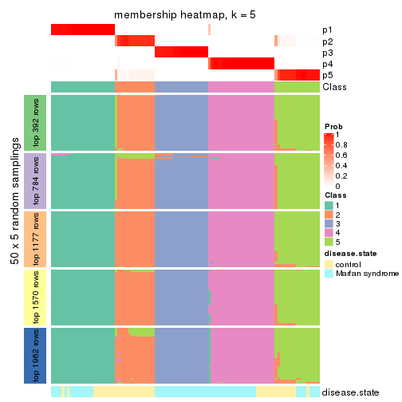</p>

</div>
<div id='tab-MAD-mclust-membership-heatmap-5'>
<pre><code class="r">membership_heatmap(res, k = 6)
</code></pre>

<p>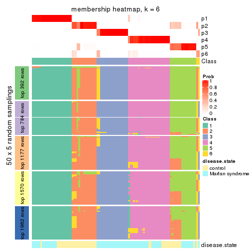</p>

</div>
</div>

As soon as we have had the classes for columns, we can look for signatures
which are significantly different between classes which can be candidate marks
for certain classes. Following are the heatmaps for signatures.


Signature heatmaps where rows are scaled:


<script>
$( function() {
	$( '#tabs-MAD-mclust-get-signatures' ).tabs();
} );
</script>
<div id='tabs-MAD-mclust-get-signatures'>
<ul>
<li><a href='#tab-MAD-mclust-get-signatures-1'>k = 2</a></li>
<li><a href='#tab-MAD-mclust-get-signatures-2'>k = 3</a></li>
<li><a href='#tab-MAD-mclust-get-signatures-3'>k = 4</a></li>
<li><a href='#tab-MAD-mclust-get-signatures-4'>k = 5</a></li>
<li><a href='#tab-MAD-mclust-get-signatures-5'>k = 6</a></li>
</ul>
<div id='tab-MAD-mclust-get-signatures-1'>
<pre><code class="r">get_signatures(res, k = 2)
</code></pre>

<p></p>

</div>
<div id='tab-MAD-mclust-get-signatures-2'>
<pre><code class="r">get_signatures(res, k = 3)
</code></pre>

<p></p>

</div>
<div id='tab-MAD-mclust-get-signatures-3'>
<pre><code class="r">get_signatures(res, k = 4)
</code></pre>

<p></p>

</div>
<div id='tab-MAD-mclust-get-signatures-4'>
<pre><code class="r">get_signatures(res, k = 5)
</code></pre>

<p></p>

</div>
<div id='tab-MAD-mclust-get-signatures-5'>
<pre><code class="r">get_signatures(res, k = 6)
</code></pre>

<p></p>

</div>
</div>


Signature heatmaps where rows are not scaled:


<script>
$( function() {
	$( '#tabs-MAD-mclust-get-signatures-no-scale' ).tabs();
} );
</script>
<div id='tabs-MAD-mclust-get-signatures-no-scale'>
<ul>
<li><a href='#tab-MAD-mclust-get-signatures-no-scale-1'>k = 2</a></li>
<li><a href='#tab-MAD-mclust-get-signatures-no-scale-2'>k = 3</a></li>
<li><a href='#tab-MAD-mclust-get-signatures-no-scale-3'>k = 4</a></li>
<li><a href='#tab-MAD-mclust-get-signatures-no-scale-4'>k = 5</a></li>
<li><a href='#tab-MAD-mclust-get-signatures-no-scale-5'>k = 6</a></li>
</ul>
<div id='tab-MAD-mclust-get-signatures-no-scale-1'>
<pre><code class="r">get_signatures(res, k = 2, scale_rows = FALSE)
</code></pre>

<p></p>

</div>
<div id='tab-MAD-mclust-get-signatures-no-scale-2'>
<pre><code class="r">get_signatures(res, k = 3, scale_rows = FALSE)
</code></pre>

<p></p>

</div>
<div id='tab-MAD-mclust-get-signatures-no-scale-3'>
<pre><code class="r">get_signatures(res, k = 4, scale_rows = FALSE)
</code></pre>

<p></p>

</div>
<div id='tab-MAD-mclust-get-signatures-no-scale-4'>
<pre><code class="r">get_signatures(res, k = 5, scale_rows = FALSE)
</code></pre>

<p></p>

</div>
<div id='tab-MAD-mclust-get-signatures-no-scale-5'>
<pre><code class="r">get_signatures(res, k = 6, scale_rows = FALSE)
</code></pre>

<p></p>

</div>
</div>


Compare the overlap of signatures from different k:

```r
compare_signatures(res)
```


`get_signature()` returns a data frame invisibly. TO get the list of signatures, the function
call should be assigned to a variable explicitly. In following code, if `plot` argument is set
to `FALSE`, no heatmap is plotted while only the differential analysis is performed.

```r
# code only for demonstration
tb = get_signature(res, k = ..., plot = FALSE)
```

An example of the output of `tb` is:

```
#>   which_row         fdr    mean_1    mean_2 scaled_mean_1 scaled_mean_2 km
#> 1        38 0.042760348  8.373488  9.131774    -0.5533452     0.5164555  1
#> 2        40 0.018707592  7.106213  8.469186    -0.6173731     0.5762149  1
#> 3        55 0.019134737 10.221463 11.207825    -0.6159697     0.5749050  1
#> 4        59 0.006059896  5.921854  7.869574    -0.6899429     0.6439467  1
#> 5        60 0.018055526  8.928898 10.211722    -0.6204761     0.5791110  1
#> 6        98 0.009384629 15.714769 14.887706     0.6635654    -0.6193277  2
...
```

The columns in `tb` are:

1. `which_row`: row indices corresponding to the input matrix.
2. `fdr`: FDR for the differential test. 
3. `mean_x`: The mean value in group x.
4. `scaled_mean_x`: The mean value in group x after rows are scaled.
5. `km`: Row groups if k-means clustering is applied to rows.


UMAP plot which shows how samples are separated.


<script>
$( function() {
	$( '#tabs-MAD-mclust-dimension-reduction' ).tabs();
} );
</script>
<div id='tabs-MAD-mclust-dimension-reduction'>
<ul>
<li><a href='#tab-MAD-mclust-dimension-reduction-1'>k = 2</a></li>
<li><a href='#tab-MAD-mclust-dimension-reduction-2'>k = 3</a></li>
<li><a href='#tab-MAD-mclust-dimension-reduction-3'>k = 4</a></li>
<li><a href='#tab-MAD-mclust-dimension-reduction-4'>k = 5</a></li>
<li><a href='#tab-MAD-mclust-dimension-reduction-5'>k = 6</a></li>
</ul>
<div id='tab-MAD-mclust-dimension-reduction-1'>
<pre><code class="r">dimension_reduction(res, k = 2, method = &quot;UMAP&quot;)
</code></pre>

<p></p>

</div>
<div id='tab-MAD-mclust-dimension-reduction-2'>
<pre><code class="r">dimension_reduction(res, k = 3, method = &quot;UMAP&quot;)
</code></pre>

<p></p>

</div>
<div id='tab-MAD-mclust-dimension-reduction-3'>
<pre><code class="r">dimension_reduction(res, k = 4, method = &quot;UMAP&quot;)
</code></pre>

<p></p>

</div>
<div id='tab-MAD-mclust-dimension-reduction-4'>
<pre><code class="r">dimension_reduction(res, k = 5, method = &quot;UMAP&quot;)
</code></pre>

<p></p>

</div>
<div id='tab-MAD-mclust-dimension-reduction-5'>
<pre><code class="r">dimension_reduction(res, k = 6, method = &quot;UMAP&quot;)
</code></pre>

<p></p>

</div>
</div>


Following heatmap shows how subgroups are split when increasing `k`:

```r
collect_classes(res)
```


Test correlation between subgroups and known annotations. If the known
annotation is numeric, one-way ANOVA test is applied, and if the known
annotation is discrete, chi-squared contingency table test is applied.

```r
test_to_known_factors(res)
```

```
#>              n disease.state(p) k
#> MAD:mclust 101         3.32e-01 2
#> MAD:mclust 101         2.94e-07 3
#> MAD:mclust  94         2.16e-05 4
#> MAD:mclust  99         2.07e-07 5
#> MAD:mclust  94         1.46e-06 6
```


If matrix rows can be associated to genes, consider to use `functional_enrichment(res,
...)` to perform function enrichment for the signature genes. See [this vignette](http://bioconductor.org/packages/devel/bioc/vignettes/cola/inst/doc/functional_enrichment.html) for more detailed explanations.


 

---------------------------------------------------


### MAD:NMF**


The object with results only for a single top-value method and a single partition method 
can be extracted as:

```r
res = res_list["MAD", "NMF"]
# you can also extract it by
# res = res_list["MAD:NMF"]
```

A summary of `res` and all the functions that can be applied to it:

```r
res
```

```
#> A 'ConsensusPartition' object with k = 2, 3, 4, 5, 6.
#>   On a matrix with 3925 rows and 101 columns.
#>   Top rows (392, 784, 1177, 1570, 1962) are extracted by 'MAD' method.
#>   Subgroups are detected by 'NMF' method.
#>   Performed in total 1250 partitions by row resampling.
#>   Best k for subgroups seems to be 3.
#> 
#> Following methods can be applied to this 'ConsensusPartition' object:
#>  [1] "cola_report"             "collect_classes"         "collect_plots"          
#>  [4] "collect_stats"           "colnames"                "compare_signatures"     
#>  [7] "consensus_heatmap"       "dimension_reduction"     "functional_enrichment"  
#> [10] "get_anno_col"            "get_anno"                "get_classes"            
#> [13] "get_consensus"           "get_matrix"              "get_membership"         
#> [16] "get_param"               "get_signatures"          "get_stats"              
#> [19] "is_best_k"               "is_stable_k"             "membership_heatmap"     
#> [22] "ncol"                    "nrow"                    "plot_ecdf"              
#> [25] "rownames"                "select_partition_number" "show"                   
#> [28] "suggest_best_k"          "test_to_known_factors"
```

`collect_plots()` function collects all the plots made from `res` for all `k` (number of partitions)
into one single page to provide an easy and fast comparison between different `k`.

```r
collect_plots(res)
```


The plots are:

- The first row: a plot of the ECDF (empirical cumulative distribution
  function) curves of the consensus matrix for each `k` and the heatmap of
  predicted classes for each `k`.
- The second row: heatmaps of the consensus matrix for each `k`.
- The third row: heatmaps of the membership matrix for each `k`.
- The fouth row: heatmaps of the signatures for each `k`.

All the plots in panels can be made by individual functions and they are
plotted later in this section.

`select_partition_number()` produces several plots showing different
statistics for choosing "optimized" `k`. There are following statistics:

- ECDF curves of the consensus matrix for each `k`;
- 1-PAC. [The PAC
  score](https://en.wikipedia.org/wiki/Consensus_clustering#Over-interpretation_potential_of_consensus_clustering)
  measures the proportion of the ambiguous subgrouping.
- Mean silhouette score.
- Concordance. The mean probability of fiting the consensus class ids in all
  partitions.
- Area increased. Denote $A_k$ as the area under the ECDF curve for current
  `k`, the area increased is defined as $A_k - A_{k-1}$.
- Rand index. The percent of pairs of samples that are both in a same cluster
  or both are not in a same cluster in the partition of k and k-1.
- Jaccard index. The ratio of pairs of samples are both in a same cluster in
  the partition of k and k-1 and the pairs of samples are both in a same
  cluster in the partition k or k-1.

The detailed explanations of these statistics can be found in [the _cola_
vignette](http://bioconductor.org/packages/devel/bioc/vignettes/cola/inst/doc/cola.html#toc_13).

Generally speaking, lower PAC score, higher mean silhouette score or higher
concordance corresponds to better partition. Rand index and Jaccard index
measure how similar the current partition is compared to partition with `k-1`.
If they are too similar, we won't accept `k` is better than `k-1`.

```r
select_partition_number(res)
```


The numeric values for all these statistics can be obtained by `get_stats()`.

```r
get_stats(res)
```

```
#>   k 1-PAC mean_silhouette concordance area_increased  Rand Jaccard
#> 2 2 1.000           1.000       1.000         0.5051 0.495   0.495
#> 3 3 1.000           0.996       0.998         0.2516 0.873   0.744
#> 4 4 0.886           0.910       0.947         0.1086 0.909   0.759
#> 5 5 0.814           0.487       0.799         0.0646 0.960   0.866
#> 6 6 0.738           0.782       0.814         0.0399 0.872   0.580
```

`suggest_best_k()` suggests the best $k$ based on these statistics. The rules are as follows:

- All $k$ with Jaccard index larger than 0.95 are removed because increasing
  $k$ does not provide enough extra information. If all $k$ are removed, it is
  marked as no subgroup is detected.
- For all $k$ with 1-PAC score larger than 0.9, the maximal $k$ is taken as
  the best $k$, and other $k$ are marked as optional $k$.
- If it does not fit the second rule. The $k$ with the maximal vote of the
  highest 1-PAC score, highest mean silhouette, and highest concordance is
  taken as the best $k$.

```r
suggest_best_k(res)
```

```
#> [1] 3
#> attr(,"optional")
#> [1] 2
```

There is also optional best $k$ = 2 that is worth to check.

Following shows the table of the partitions (You need to click the **show/hide
code output** link to see it). The membership matrix (columns with name `p*`)
is inferred by
[`clue::cl_consensus()`](https://www.rdocumentation.org/link/cl_consensus?package=clue)
function with the `SE` method. Basically the value in the membership matrix
represents the probability to belong to a certain group. The finall class
label for an item is determined with the group with highest probability it
belongs to.

In `get_classes()` function, the entropy is calculated from the membership
matrix and the silhouette score is calculated from the consensus matrix.


<script>
$( function() {
	$( '#tabs-MAD-NMF-get-classes' ).tabs();
} );
</script>
<div id='tabs-MAD-NMF-get-classes'>
<ul>
<li><a href='#tab-MAD-NMF-get-classes-1'>k = 2</a></li>
<li><a href='#tab-MAD-NMF-get-classes-2'>k = 3</a></li>
<li><a href='#tab-MAD-NMF-get-classes-3'>k = 4</a></li>
<li><a href='#tab-MAD-NMF-get-classes-4'>k = 5</a></li>
<li><a href='#tab-MAD-NMF-get-classes-5'>k = 6</a></li>
</ul>

<div id='tab-MAD-NMF-get-classes-1'>
<p><a id='tab-MAD-NMF-get-classes-1-a' style='color:#0366d6' href='#'>show/hide code output</a></p>
<pre><code class="r">cbind(get_classes(res, k = 2), get_membership(res, k = 2))
</code></pre>

<pre><code>#&gt;           class entropy silhouette    p1    p2
#&gt; GSM217644     2  0.0000      1.000 0.000 1.000
#&gt; GSM217645     2  0.0000      1.000 0.000 1.000
#&gt; GSM217646     2  0.0000      1.000 0.000 1.000
#&gt; GSM217647     2  0.0000      1.000 0.000 1.000
#&gt; GSM217648     2  0.0000      1.000 0.000 1.000
#&gt; GSM217649     2  0.0000      1.000 0.000 1.000
#&gt; GSM217650     2  0.0000      1.000 0.000 1.000
#&gt; GSM217651     2  0.0000      1.000 0.000 1.000
#&gt; GSM217652     2  0.0000      1.000 0.000 1.000
#&gt; GSM217653     2  0.0000      1.000 0.000 1.000
#&gt; GSM217654     2  0.0000      1.000 0.000 1.000
#&gt; GSM217655     2  0.0000      1.000 0.000 1.000
#&gt; GSM217656     2  0.0938      0.988 0.012 0.988
#&gt; GSM217657     2  0.0000      1.000 0.000 1.000
#&gt; GSM217658     2  0.0000      1.000 0.000 1.000
#&gt; GSM217659     2  0.0000      1.000 0.000 1.000
#&gt; GSM217660     2  0.0000      1.000 0.000 1.000
#&gt; GSM217661     2  0.0000      1.000 0.000 1.000
#&gt; GSM217662     2  0.0000      1.000 0.000 1.000
#&gt; GSM217663     2  0.0000      1.000 0.000 1.000
#&gt; GSM217664     2  0.0000      1.000 0.000 1.000
#&gt; GSM217665     2  0.0000      1.000 0.000 1.000
#&gt; GSM217666     2  0.0000      1.000 0.000 1.000
#&gt; GSM217667     2  0.0000      1.000 0.000 1.000
#&gt; GSM217668     1  0.0000      1.000 1.000 0.000
#&gt; GSM217669     1  0.0000      1.000 1.000 0.000
#&gt; GSM217670     1  0.0000      1.000 1.000 0.000
#&gt; GSM217671     1  0.0000      1.000 1.000 0.000
#&gt; GSM217672     1  0.0000      1.000 1.000 0.000
#&gt; GSM217673     1  0.0000      1.000 1.000 0.000
#&gt; GSM217674     1  0.0000      1.000 1.000 0.000
#&gt; GSM217675     1  0.0000      1.000 1.000 0.000
#&gt; GSM217676     1  0.0000      1.000 1.000 0.000
#&gt; GSM217677     1  0.0000      1.000 1.000 0.000
#&gt; GSM217678     1  0.0000      1.000 1.000 0.000
#&gt; GSM217679     1  0.0000      1.000 1.000 0.000
#&gt; GSM217680     1  0.0000      1.000 1.000 0.000
#&gt; GSM217681     1  0.0000      1.000 1.000 0.000
#&gt; GSM217682     1  0.0000      1.000 1.000 0.000
#&gt; GSM217683     1  0.0000      1.000 1.000 0.000
#&gt; GSM217684     1  0.0000      1.000 1.000 0.000
#&gt; GSM217685     2  0.0000      1.000 0.000 1.000
#&gt; GSM217686     2  0.0000      1.000 0.000 1.000
#&gt; GSM217687     2  0.0000      1.000 0.000 1.000
#&gt; GSM217688     2  0.0000      1.000 0.000 1.000
#&gt; GSM217689     2  0.0000      1.000 0.000 1.000
#&gt; GSM217690     2  0.0000      1.000 0.000 1.000
#&gt; GSM217691     2  0.0000      1.000 0.000 1.000
#&gt; GSM217692     2  0.0000      1.000 0.000 1.000
#&gt; GSM217693     2  0.0000      1.000 0.000 1.000
#&gt; GSM217694     2  0.0000      1.000 0.000 1.000
#&gt; GSM217695     2  0.0000      1.000 0.000 1.000
#&gt; GSM217696     2  0.0000      1.000 0.000 1.000
#&gt; GSM217697     2  0.0000      1.000 0.000 1.000
#&gt; GSM217698     2  0.0000      1.000 0.000 1.000
#&gt; GSM217699     2  0.0000      1.000 0.000 1.000
#&gt; GSM217700     2  0.0000      1.000 0.000 1.000
#&gt; GSM217701     2  0.0000      1.000 0.000 1.000
#&gt; GSM217702     2  0.0000      1.000 0.000 1.000
#&gt; GSM217703     2  0.0000      1.000 0.000 1.000
#&gt; GSM217704     2  0.0000      1.000 0.000 1.000
#&gt; GSM217705     1  0.0000      1.000 1.000 0.000
#&gt; GSM217706     1  0.0000      1.000 1.000 0.000
#&gt; GSM217707     1  0.0000      1.000 1.000 0.000
#&gt; GSM217708     1  0.0000      1.000 1.000 0.000
#&gt; GSM217709     1  0.0000      1.000 1.000 0.000
#&gt; GSM217710     1  0.0000      1.000 1.000 0.000
#&gt; GSM217711     1  0.0000      1.000 1.000 0.000
#&gt; GSM217712     1  0.0000      1.000 1.000 0.000
#&gt; GSM217713     1  0.0000      1.000 1.000 0.000
#&gt; GSM217714     1  0.0000      1.000 1.000 0.000
#&gt; GSM217715     1  0.0000      1.000 1.000 0.000
#&gt; GSM217716     1  0.0000      1.000 1.000 0.000
#&gt; GSM217717     1  0.0000      1.000 1.000 0.000
#&gt; GSM217718     1  0.0000      1.000 1.000 0.000
#&gt; GSM217719     1  0.0000      1.000 1.000 0.000
#&gt; GSM217720     1  0.0000      1.000 1.000 0.000
#&gt; GSM217721     1  0.0000      1.000 1.000 0.000
#&gt; GSM217722     1  0.0000      1.000 1.000 0.000
#&gt; GSM217723     1  0.0000      1.000 1.000 0.000
#&gt; GSM217724     1  0.0000      1.000 1.000 0.000
#&gt; GSM217725     1  0.0000      1.000 1.000 0.000
#&gt; GSM217726     1  0.0000      1.000 1.000 0.000
#&gt; GSM217727     1  0.0000      1.000 1.000 0.000
#&gt; GSM217728     1  0.0000      1.000 1.000 0.000
#&gt; GSM217729     1  0.0000      1.000 1.000 0.000
#&gt; GSM217730     1  0.0000      1.000 1.000 0.000
#&gt; GSM217731     1  0.0000      1.000 1.000 0.000
#&gt; GSM217732     1  0.0000      1.000 1.000 0.000
#&gt; GSM217733     1  0.0000      1.000 1.000 0.000
#&gt; GSM217734     1  0.0000      1.000 1.000 0.000
#&gt; GSM217735     1  0.0000      1.000 1.000 0.000
#&gt; GSM217736     1  0.0000      1.000 1.000 0.000
#&gt; GSM217737     2  0.0000      1.000 0.000 1.000
#&gt; GSM217738     2  0.0000      1.000 0.000 1.000
#&gt; GSM217739     2  0.0000      1.000 0.000 1.000
#&gt; GSM217740     2  0.0000      1.000 0.000 1.000
#&gt; GSM217741     2  0.0000      1.000 0.000 1.000
#&gt; GSM217742     2  0.0000      1.000 0.000 1.000
#&gt; GSM217743     2  0.0000      1.000 0.000 1.000
#&gt; GSM217744     2  0.0000      1.000 0.000 1.000
</code></pre>

<script>
$('#tab-MAD-NMF-get-classes-1-a').parent().next().next().hide();
$('#tab-MAD-NMF-get-classes-1-a').click(function(){
  $('#tab-MAD-NMF-get-classes-1-a').parent().next().next().toggle();
  return(false);
});
</script>
</div>

<div id='tab-MAD-NMF-get-classes-2'>
<p><a id='tab-MAD-NMF-get-classes-2-a' style='color:#0366d6' href='#'>show/hide code output</a></p>
<pre><code class="r">cbind(get_classes(res, k = 3), get_membership(res, k = 3))
</code></pre>

<pre><code>#&gt;           class entropy silhouette   p1   p2   p3
#&gt; GSM217644     2  0.0000      0.999 0.00 1.00 0.00
#&gt; GSM217645     2  0.0000      0.999 0.00 1.00 0.00
#&gt; GSM217646     2  0.0000      0.999 0.00 1.00 0.00
#&gt; GSM217647     2  0.0000      0.999 0.00 1.00 0.00
#&gt; GSM217648     2  0.0000      0.999 0.00 1.00 0.00
#&gt; GSM217649     2  0.0000      0.999 0.00 1.00 0.00
#&gt; GSM217650     2  0.0000      0.999 0.00 1.00 0.00
#&gt; GSM217651     2  0.0000      0.999 0.00 1.00 0.00
#&gt; GSM217652     2  0.0000      0.999 0.00 1.00 0.00
#&gt; GSM217653     2  0.0000      0.999 0.00 1.00 0.00
#&gt; GSM217654     2  0.0000      0.999 0.00 1.00 0.00
#&gt; GSM217655     2  0.0000      0.999 0.00 1.00 0.00
#&gt; GSM217656     2  0.0892      0.980 0.00 0.98 0.02
#&gt; GSM217657     2  0.0000      0.999 0.00 1.00 0.00
#&gt; GSM217658     2  0.0000      0.999 0.00 1.00 0.00
#&gt; GSM217659     2  0.0000      0.999 0.00 1.00 0.00
#&gt; GSM217660     2  0.0000      0.999 0.00 1.00 0.00
#&gt; GSM217661     2  0.0000      0.999 0.00 1.00 0.00
#&gt; GSM217662     2  0.0000      0.999 0.00 1.00 0.00
#&gt; GSM217663     2  0.0000      0.999 0.00 1.00 0.00
#&gt; GSM217664     2  0.0000      0.999 0.00 1.00 0.00
#&gt; GSM217665     2  0.0000      0.999 0.00 1.00 0.00
#&gt; GSM217666     2  0.0000      0.999 0.00 1.00 0.00
#&gt; GSM217667     2  0.0000      0.999 0.00 1.00 0.00
#&gt; GSM217668     1  0.3686      0.833 0.86 0.14 0.00
#&gt; GSM217669     1  0.0000      0.997 1.00 0.00 0.00
#&gt; GSM217670     1  0.0000      0.997 1.00 0.00 0.00
#&gt; GSM217671     1  0.0000      0.997 1.00 0.00 0.00
#&gt; GSM217672     1  0.0000      0.997 1.00 0.00 0.00
#&gt; GSM217673     1  0.0000      0.997 1.00 0.00 0.00
#&gt; GSM217674     1  0.0000      0.997 1.00 0.00 0.00
#&gt; GSM217675     1  0.0000      0.997 1.00 0.00 0.00
#&gt; GSM217676     1  0.0000      0.997 1.00 0.00 0.00
#&gt; GSM217677     1  0.0000      0.997 1.00 0.00 0.00
#&gt; GSM217678     1  0.0000      0.997 1.00 0.00 0.00
#&gt; GSM217679     1  0.0000      0.997 1.00 0.00 0.00
#&gt; GSM217680     1  0.0000      0.997 1.00 0.00 0.00
#&gt; GSM217681     1  0.0000      0.997 1.00 0.00 0.00
#&gt; GSM217682     1  0.0000      0.997 1.00 0.00 0.00
#&gt; GSM217683     1  0.0000      0.997 1.00 0.00 0.00
#&gt; GSM217684     1  0.0000      0.997 1.00 0.00 0.00
#&gt; GSM217685     3  0.0000      1.000 0.00 0.00 1.00
#&gt; GSM217686     3  0.0000      1.000 0.00 0.00 1.00
#&gt; GSM217687     3  0.0000      1.000 0.00 0.00 1.00
#&gt; GSM217688     3  0.0000      1.000 0.00 0.00 1.00
#&gt; GSM217689     3  0.0000      1.000 0.00 0.00 1.00
#&gt; GSM217690     3  0.0000      1.000 0.00 0.00 1.00
#&gt; GSM217691     3  0.0000      1.000 0.00 0.00 1.00
#&gt; GSM217692     3  0.0000      1.000 0.00 0.00 1.00
#&gt; GSM217693     3  0.0000      1.000 0.00 0.00 1.00
#&gt; GSM217694     3  0.0000      1.000 0.00 0.00 1.00
#&gt; GSM217695     3  0.0000      1.000 0.00 0.00 1.00
#&gt; GSM217696     3  0.0000      1.000 0.00 0.00 1.00
#&gt; GSM217697     3  0.0000      1.000 0.00 0.00 1.00
#&gt; GSM217698     3  0.0000      1.000 0.00 0.00 1.00
#&gt; GSM217699     3  0.0000      1.000 0.00 0.00 1.00
#&gt; GSM217700     3  0.0000      1.000 0.00 0.00 1.00
#&gt; GSM217701     3  0.0000      1.000 0.00 0.00 1.00
#&gt; GSM217702     3  0.0000      1.000 0.00 0.00 1.00
#&gt; GSM217703     3  0.0000      1.000 0.00 0.00 1.00
#&gt; GSM217704     3  0.0000      1.000 0.00 0.00 1.00
#&gt; GSM217705     1  0.0000      0.997 1.00 0.00 0.00
#&gt; GSM217706     1  0.0000      0.997 1.00 0.00 0.00
#&gt; GSM217707     1  0.0000      0.997 1.00 0.00 0.00
#&gt; GSM217708     1  0.0000      0.997 1.00 0.00 0.00
#&gt; GSM217709     1  0.0000      0.997 1.00 0.00 0.00
#&gt; GSM217710     1  0.0000      0.997 1.00 0.00 0.00
#&gt; GSM217711     1  0.0000      0.997 1.00 0.00 0.00
#&gt; GSM217712     1  0.0000      0.997 1.00 0.00 0.00
#&gt; GSM217713     1  0.0000      0.997 1.00 0.00 0.00
#&gt; GSM217714     1  0.0000      0.997 1.00 0.00 0.00
#&gt; GSM217715     1  0.0000      0.997 1.00 0.00 0.00
#&gt; GSM217716     1  0.0000      0.997 1.00 0.00 0.00
#&gt; GSM217717     1  0.0000      0.997 1.00 0.00 0.00
#&gt; GSM217718     1  0.0000      0.997 1.00 0.00 0.00
#&gt; GSM217719     1  0.0000      0.997 1.00 0.00 0.00
#&gt; GSM217720     1  0.0000      0.997 1.00 0.00 0.00
#&gt; GSM217721     1  0.0000      0.997 1.00 0.00 0.00
#&gt; GSM217722     1  0.0000      0.997 1.00 0.00 0.00
#&gt; GSM217723     1  0.0000      0.997 1.00 0.00 0.00
#&gt; GSM217724     1  0.0000      0.997 1.00 0.00 0.00
#&gt; GSM217725     1  0.0000      0.997 1.00 0.00 0.00
#&gt; GSM217726     1  0.0000      0.997 1.00 0.00 0.00
#&gt; GSM217727     1  0.0000      0.997 1.00 0.00 0.00
#&gt; GSM217728     1  0.0000      0.997 1.00 0.00 0.00
#&gt; GSM217729     1  0.0000      0.997 1.00 0.00 0.00
#&gt; GSM217730     1  0.0000      0.997 1.00 0.00 0.00
#&gt; GSM217731     1  0.0000      0.997 1.00 0.00 0.00
#&gt; GSM217732     1  0.0000      0.997 1.00 0.00 0.00
#&gt; GSM217733     1  0.0000      0.997 1.00 0.00 0.00
#&gt; GSM217734     1  0.0000      0.997 1.00 0.00 0.00
#&gt; GSM217735     1  0.0000      0.997 1.00 0.00 0.00
#&gt; GSM217736     1  0.0000      0.997 1.00 0.00 0.00
#&gt; GSM217737     2  0.0000      0.999 0.00 1.00 0.00
#&gt; GSM217738     2  0.0000      0.999 0.00 1.00 0.00
#&gt; GSM217739     2  0.0000      0.999 0.00 1.00 0.00
#&gt; GSM217740     2  0.0000      0.999 0.00 1.00 0.00
#&gt; GSM217741     2  0.0000      0.999 0.00 1.00 0.00
#&gt; GSM217742     2  0.0000      0.999 0.00 1.00 0.00
#&gt; GSM217743     2  0.0000      0.999 0.00 1.00 0.00
#&gt; GSM217744     2  0.0000      0.999 0.00 1.00 0.00
</code></pre>

<script>
$('#tab-MAD-NMF-get-classes-2-a').parent().next().next().hide();
$('#tab-MAD-NMF-get-classes-2-a').click(function(){
  $('#tab-MAD-NMF-get-classes-2-a').parent().next().next().toggle();
  return(false);
});
</script>
</div>

<div id='tab-MAD-NMF-get-classes-3'>
<p><a id='tab-MAD-NMF-get-classes-3-a' style='color:#0366d6' href='#'>show/hide code output</a></p>
<pre><code class="r">cbind(get_classes(res, k = 4), get_membership(res, k = 4))
</code></pre>

<pre><code>#&gt;           class entropy silhouette    p1    p2    p3    p4
#&gt; GSM217644     2  0.0336      0.971 0.000 0.992 0.000 0.008
#&gt; GSM217645     2  0.0000      0.975 0.000 1.000 0.000 0.000
#&gt; GSM217646     2  0.0000      0.975 0.000 1.000 0.000 0.000
#&gt; GSM217647     2  0.0000      0.975 0.000 1.000 0.000 0.000
#&gt; GSM217648     2  0.0188      0.973 0.000 0.996 0.000 0.004
#&gt; GSM217649     2  0.0000      0.975 0.000 1.000 0.000 0.000
#&gt; GSM217650     2  0.0000      0.975 0.000 1.000 0.000 0.000
#&gt; GSM217651     2  0.0000      0.975 0.000 1.000 0.000 0.000
#&gt; GSM217652     2  0.0000      0.975 0.000 1.000 0.000 0.000
#&gt; GSM217653     2  0.0000      0.975 0.000 1.000 0.000 0.000
#&gt; GSM217654     4  0.4522      0.521 0.000 0.320 0.000 0.680
#&gt; GSM217655     2  0.3528      0.761 0.000 0.808 0.000 0.192
#&gt; GSM217656     4  0.1854      0.749 0.024 0.008 0.020 0.948
#&gt; GSM217657     4  0.3402      0.729 0.000 0.164 0.004 0.832
#&gt; GSM217658     2  0.0000      0.975 0.000 1.000 0.000 0.000
#&gt; GSM217659     2  0.0000      0.975 0.000 1.000 0.000 0.000
#&gt; GSM217660     2  0.1474      0.938 0.000 0.948 0.000 0.052
#&gt; GSM217661     2  0.0000      0.975 0.000 1.000 0.000 0.000
#&gt; GSM217662     2  0.0336      0.971 0.000 0.992 0.000 0.008
#&gt; GSM217663     2  0.0000      0.975 0.000 1.000 0.000 0.000
#&gt; GSM217664     2  0.0188      0.972 0.000 0.996 0.000 0.004
#&gt; GSM217665     2  0.0000      0.975 0.000 1.000 0.000 0.000
#&gt; GSM217666     2  0.0000      0.975 0.000 1.000 0.000 0.000
#&gt; GSM217667     2  0.0000      0.975 0.000 1.000 0.000 0.000
#&gt; GSM217668     1  0.3377      0.787 0.848 0.140 0.000 0.012
#&gt; GSM217669     1  0.2011      0.939 0.920 0.000 0.000 0.080
#&gt; GSM217670     1  0.1022      0.948 0.968 0.000 0.000 0.032
#&gt; GSM217671     1  0.0469      0.949 0.988 0.000 0.000 0.012
#&gt; GSM217672     1  0.0469      0.949 0.988 0.000 0.000 0.012
#&gt; GSM217673     1  0.0592      0.950 0.984 0.000 0.000 0.016
#&gt; GSM217674     1  0.0817      0.937 0.976 0.000 0.000 0.024
#&gt; GSM217675     1  0.0817      0.938 0.976 0.000 0.000 0.024
#&gt; GSM217676     1  0.0000      0.949 1.000 0.000 0.000 0.000
#&gt; GSM217677     1  0.0469      0.944 0.988 0.000 0.000 0.012
#&gt; GSM217678     1  0.0000      0.949 1.000 0.000 0.000 0.000
#&gt; GSM217679     1  0.0336      0.946 0.992 0.000 0.000 0.008
#&gt; GSM217680     1  0.0000      0.949 1.000 0.000 0.000 0.000
#&gt; GSM217681     1  0.0000      0.949 1.000 0.000 0.000 0.000
#&gt; GSM217682     1  0.0592      0.942 0.984 0.000 0.000 0.016
#&gt; GSM217683     1  0.0592      0.942 0.984 0.000 0.000 0.016
#&gt; GSM217684     1  0.1474      0.945 0.948 0.000 0.000 0.052
#&gt; GSM217685     3  0.0469      0.985 0.000 0.000 0.988 0.012
#&gt; GSM217686     3  0.0469      0.985 0.000 0.000 0.988 0.012
#&gt; GSM217687     3  0.0188      0.989 0.000 0.000 0.996 0.004
#&gt; GSM217688     3  0.0188      0.989 0.000 0.000 0.996 0.004
#&gt; GSM217689     3  0.2530      0.892 0.000 0.000 0.888 0.112
#&gt; GSM217690     3  0.0921      0.974 0.000 0.000 0.972 0.028
#&gt; GSM217691     3  0.0469      0.984 0.000 0.000 0.988 0.012
#&gt; GSM217692     3  0.0000      0.990 0.000 0.000 1.000 0.000
#&gt; GSM217693     3  0.0000      0.990 0.000 0.000 1.000 0.000
#&gt; GSM217694     3  0.0000      0.990 0.000 0.000 1.000 0.000
#&gt; GSM217695     3  0.0000      0.990 0.000 0.000 1.000 0.000
#&gt; GSM217696     3  0.0000      0.990 0.000 0.000 1.000 0.000
#&gt; GSM217697     3  0.0188      0.989 0.000 0.000 0.996 0.004
#&gt; GSM217698     3  0.0188      0.989 0.000 0.000 0.996 0.004
#&gt; GSM217699     3  0.0000      0.990 0.000 0.000 1.000 0.000
#&gt; GSM217700     3  0.0336      0.986 0.000 0.000 0.992 0.008
#&gt; GSM217701     3  0.0000      0.990 0.000 0.000 1.000 0.000
#&gt; GSM217702     3  0.0000      0.990 0.000 0.000 1.000 0.000
#&gt; GSM217703     4  0.3219      0.632 0.000 0.000 0.164 0.836
#&gt; GSM217704     3  0.0188      0.988 0.000 0.000 0.996 0.004
#&gt; GSM217705     1  0.2011      0.939 0.920 0.000 0.000 0.080
#&gt; GSM217706     1  0.2011      0.939 0.920 0.000 0.000 0.080
#&gt; GSM217707     1  0.2011      0.939 0.920 0.000 0.000 0.080
#&gt; GSM217708     4  0.4830      0.340 0.392 0.000 0.000 0.608
#&gt; GSM217709     4  0.3486      0.706 0.188 0.000 0.000 0.812
#&gt; GSM217710     4  0.2814      0.739 0.132 0.000 0.000 0.868
#&gt; GSM217711     4  0.2408      0.748 0.104 0.000 0.000 0.896
#&gt; GSM217712     1  0.2408      0.924 0.896 0.000 0.000 0.104
#&gt; GSM217713     1  0.2081      0.937 0.916 0.000 0.000 0.084
#&gt; GSM217714     1  0.2011      0.939 0.920 0.000 0.000 0.080
#&gt; GSM217715     1  0.2011      0.939 0.920 0.000 0.000 0.080
#&gt; GSM217716     1  0.2081      0.937 0.916 0.000 0.000 0.084
#&gt; GSM217717     1  0.2149      0.935 0.912 0.000 0.000 0.088
#&gt; GSM217718     4  0.4955      0.176 0.444 0.000 0.000 0.556
#&gt; GSM217719     1  0.3219      0.860 0.836 0.000 0.000 0.164
#&gt; GSM217720     1  0.2011      0.939 0.920 0.000 0.000 0.080
#&gt; GSM217721     1  0.2760      0.903 0.872 0.000 0.000 0.128
#&gt; GSM217722     1  0.2081      0.937 0.916 0.000 0.000 0.084
#&gt; GSM217723     1  0.2149      0.935 0.912 0.000 0.000 0.088
#&gt; GSM217724     1  0.2011      0.939 0.920 0.000 0.000 0.080
#&gt; GSM217725     1  0.2647      0.911 0.880 0.000 0.000 0.120
#&gt; GSM217726     1  0.0000      0.949 1.000 0.000 0.000 0.000
#&gt; GSM217727     1  0.0000      0.949 1.000 0.000 0.000 0.000
#&gt; GSM217728     1  0.2149      0.935 0.912 0.000 0.000 0.088
#&gt; GSM217729     1  0.0000      0.949 1.000 0.000 0.000 0.000
#&gt; GSM217730     1  0.0000      0.949 1.000 0.000 0.000 0.000
#&gt; GSM217731     1  0.0000      0.949 1.000 0.000 0.000 0.000
#&gt; GSM217732     1  0.0000      0.949 1.000 0.000 0.000 0.000
#&gt; GSM217733     1  0.0000      0.949 1.000 0.000 0.000 0.000
#&gt; GSM217734     1  0.0592      0.942 0.984 0.000 0.000 0.016
#&gt; GSM217735     1  0.0188      0.948 0.996 0.000 0.000 0.004
#&gt; GSM217736     1  0.0000      0.949 1.000 0.000 0.000 0.000
#&gt; GSM217737     4  0.3448      0.723 0.000 0.168 0.004 0.828
#&gt; GSM217738     4  0.2773      0.747 0.000 0.116 0.004 0.880
#&gt; GSM217739     4  0.2921      0.739 0.000 0.140 0.000 0.860
#&gt; GSM217740     4  0.2814      0.742 0.000 0.132 0.000 0.868
#&gt; GSM217741     2  0.1022      0.955 0.000 0.968 0.000 0.032
#&gt; GSM217742     2  0.3649      0.744 0.000 0.796 0.000 0.204
#&gt; GSM217743     2  0.1389      0.943 0.000 0.952 0.000 0.048
#&gt; GSM217744     2  0.0707      0.964 0.000 0.980 0.000 0.020
</code></pre>

<script>
$('#tab-MAD-NMF-get-classes-3-a').parent().next().next().hide();
$('#tab-MAD-NMF-get-classes-3-a').click(function(){
  $('#tab-MAD-NMF-get-classes-3-a').parent().next().next().toggle();
  return(false);
});
</script>
</div>

<div id='tab-MAD-NMF-get-classes-4'>
<p><a id='tab-MAD-NMF-get-classes-4-a' style='color:#0366d6' href='#'>show/hide code output</a></p>
<pre><code class="r">cbind(get_classes(res, k = 5), get_membership(res, k = 5))
</code></pre>

<pre><code>#&gt;           class entropy silhouette    p1    p2    p3    p4    p5
#&gt; GSM217644     2  0.0912      0.912 0.000 0.972 0.000 0.012 0.016
#&gt; GSM217645     2  0.1121      0.907 0.000 0.956 0.000 0.044 0.000
#&gt; GSM217646     2  0.0451      0.913 0.000 0.988 0.000 0.008 0.004
#&gt; GSM217647     2  0.0992      0.909 0.000 0.968 0.000 0.024 0.008
#&gt; GSM217648     2  0.1211      0.911 0.000 0.960 0.000 0.016 0.024
#&gt; GSM217649     2  0.0727      0.914 0.004 0.980 0.000 0.012 0.004
#&gt; GSM217650     2  0.1628      0.901 0.000 0.936 0.000 0.056 0.008
#&gt; GSM217651     2  0.1893      0.902 0.000 0.928 0.000 0.048 0.024
#&gt; GSM217652     2  0.0955      0.912 0.000 0.968 0.000 0.028 0.004
#&gt; GSM217653     2  0.0912      0.911 0.000 0.972 0.000 0.016 0.012
#&gt; GSM217654     5  0.4014      0.574 0.000 0.256 0.000 0.016 0.728
#&gt; GSM217655     2  0.4318      0.688 0.004 0.736 0.000 0.032 0.228
#&gt; GSM217656     5  0.1153      0.799 0.004 0.024 0.000 0.008 0.964
#&gt; GSM217657     5  0.1270      0.801 0.000 0.052 0.000 0.000 0.948
#&gt; GSM217658     2  0.1282      0.906 0.000 0.952 0.000 0.044 0.004
#&gt; GSM217659     2  0.1329      0.909 0.008 0.956 0.000 0.032 0.004
#&gt; GSM217660     2  0.2971      0.815 0.000 0.836 0.000 0.008 0.156
#&gt; GSM217661     2  0.0807      0.912 0.000 0.976 0.000 0.012 0.012
#&gt; GSM217662     2  0.1082      0.909 0.000 0.964 0.000 0.008 0.028
#&gt; GSM217663     2  0.0992      0.910 0.000 0.968 0.000 0.024 0.008
#&gt; GSM217664     2  0.1444      0.907 0.000 0.948 0.000 0.040 0.012
#&gt; GSM217665     2  0.0898      0.912 0.000 0.972 0.000 0.020 0.008
#&gt; GSM217666     2  0.0992      0.910 0.000 0.968 0.000 0.024 0.008
#&gt; GSM217667     2  0.1012      0.910 0.000 0.968 0.000 0.020 0.012
#&gt; GSM217668     4  0.4562      0.822 0.492 0.008 0.000 0.500 0.000
#&gt; GSM217669     1  0.4306     -0.821 0.508 0.000 0.000 0.492 0.000
#&gt; GSM217670     1  0.4302     -0.800 0.520 0.000 0.000 0.480 0.000
#&gt; GSM217671     1  0.4307     -0.827 0.504 0.000 0.000 0.496 0.000
#&gt; GSM217672     1  0.4307     -0.826 0.504 0.000 0.000 0.496 0.000
#&gt; GSM217673     1  0.4306     -0.821 0.508 0.000 0.000 0.492 0.000
#&gt; GSM217674     1  0.1638      0.483 0.932 0.004 0.000 0.064 0.000
#&gt; GSM217675     1  0.1121      0.510 0.956 0.000 0.000 0.044 0.000
#&gt; GSM217676     1  0.0794      0.517 0.972 0.000 0.000 0.028 0.000
#&gt; GSM217677     1  0.0703      0.519 0.976 0.000 0.000 0.024 0.000
#&gt; GSM217678     1  0.0609      0.524 0.980 0.000 0.000 0.020 0.000
#&gt; GSM217679     1  0.0404      0.523 0.988 0.000 0.000 0.012 0.000
#&gt; GSM217680     1  0.0609      0.520 0.980 0.000 0.000 0.020 0.000
#&gt; GSM217681     1  0.0794      0.519 0.972 0.000 0.000 0.028 0.000
#&gt; GSM217682     1  0.0771      0.520 0.976 0.000 0.000 0.020 0.004
#&gt; GSM217683     1  0.1043      0.509 0.960 0.000 0.000 0.040 0.000
#&gt; GSM217684     1  0.4201     -0.549 0.592 0.000 0.000 0.408 0.000
#&gt; GSM217685     3  0.0451      0.982 0.000 0.000 0.988 0.008 0.004
#&gt; GSM217686     3  0.1041      0.973 0.000 0.000 0.964 0.032 0.004
#&gt; GSM217687     3  0.0290      0.983 0.000 0.000 0.992 0.008 0.000
#&gt; GSM217688     3  0.0290      0.983 0.000 0.000 0.992 0.008 0.000
#&gt; GSM217689     3  0.2304      0.893 0.000 0.000 0.892 0.008 0.100
#&gt; GSM217690     3  0.0290      0.982 0.000 0.000 0.992 0.000 0.008
#&gt; GSM217691     3  0.0451      0.982 0.000 0.000 0.988 0.004 0.008
#&gt; GSM217692     3  0.0290      0.983 0.000 0.000 0.992 0.008 0.000
#&gt; GSM217693     3  0.0510      0.981 0.000 0.000 0.984 0.016 0.000
#&gt; GSM217694     3  0.0000      0.984 0.000 0.000 1.000 0.000 0.000
#&gt; GSM217695     3  0.0000      0.984 0.000 0.000 1.000 0.000 0.000
#&gt; GSM217696     3  0.0404      0.982 0.000 0.000 0.988 0.012 0.000
#&gt; GSM217697     3  0.1671      0.944 0.000 0.000 0.924 0.076 0.000
#&gt; GSM217698     3  0.0000      0.984 0.000 0.000 1.000 0.000 0.000
#&gt; GSM217699     3  0.0000      0.984 0.000 0.000 1.000 0.000 0.000
#&gt; GSM217700     3  0.0162      0.984 0.000 0.000 0.996 0.000 0.004
#&gt; GSM217701     3  0.0000      0.984 0.000 0.000 1.000 0.000 0.000
#&gt; GSM217702     3  0.0000      0.984 0.000 0.000 1.000 0.000 0.000
#&gt; GSM217703     5  0.3715      0.553 0.000 0.000 0.260 0.004 0.736
#&gt; GSM217704     3  0.1041      0.971 0.000 0.000 0.964 0.032 0.004
#&gt; GSM217705     1  0.4307     -0.826 0.504 0.000 0.000 0.496 0.000
#&gt; GSM217706     1  0.4306     -0.821 0.508 0.000 0.000 0.492 0.000
#&gt; GSM217707     1  0.4307     -0.832 0.504 0.000 0.000 0.496 0.000
#&gt; GSM217708     4  0.4748      0.831 0.492 0.000 0.000 0.492 0.016
#&gt; GSM217709     4  0.6431      0.435 0.284 0.000 0.000 0.500 0.216
#&gt; GSM217710     5  0.5631      0.158 0.076 0.000 0.000 0.424 0.500
#&gt; GSM217711     5  0.4456      0.531 0.020 0.000 0.000 0.320 0.660
#&gt; GSM217712     1  0.4452     -0.845 0.500 0.000 0.000 0.496 0.004
#&gt; GSM217713     1  0.4306     -0.821 0.508 0.000 0.000 0.492 0.000
#&gt; GSM217714     1  0.4306     -0.821 0.508 0.000 0.000 0.492 0.000
#&gt; GSM217715     1  0.4306     -0.821 0.508 0.000 0.000 0.492 0.000
#&gt; GSM217716     1  0.4307     -0.833 0.504 0.000 0.000 0.496 0.000
#&gt; GSM217717     4  0.4307      0.815 0.500 0.000 0.000 0.500 0.000
#&gt; GSM217718     4  0.4746      0.831 0.480 0.000 0.000 0.504 0.016
#&gt; GSM217719     4  0.4561      0.832 0.488 0.000 0.000 0.504 0.008
#&gt; GSM217720     1  0.4307     -0.826 0.504 0.000 0.000 0.496 0.000
#&gt; GSM217721     4  0.4449      0.831 0.484 0.000 0.000 0.512 0.004
#&gt; GSM217722     1  0.4307     -0.832 0.504 0.000 0.000 0.496 0.000
#&gt; GSM217723     1  0.4288     -0.467 0.612 0.000 0.000 0.384 0.004
#&gt; GSM217724     1  0.4201     -0.560 0.592 0.000 0.000 0.408 0.000
#&gt; GSM217725     1  0.3476      0.359 0.804 0.000 0.000 0.020 0.176
#&gt; GSM217726     1  0.0609      0.521 0.980 0.000 0.000 0.020 0.000
#&gt; GSM217727     1  0.0703      0.522 0.976 0.000 0.000 0.024 0.000
#&gt; GSM217728     1  0.1485      0.510 0.948 0.000 0.000 0.032 0.020
#&gt; GSM217729     1  0.0963      0.512 0.964 0.000 0.000 0.036 0.000
#&gt; GSM217730     1  0.0963      0.512 0.964 0.000 0.000 0.036 0.000
#&gt; GSM217731     1  0.1410      0.491 0.940 0.000 0.000 0.060 0.000
#&gt; GSM217732     1  0.0609      0.522 0.980 0.000 0.000 0.020 0.000
#&gt; GSM217733     1  0.1478      0.491 0.936 0.000 0.000 0.064 0.000
#&gt; GSM217734     1  0.0510      0.523 0.984 0.000 0.000 0.016 0.000
#&gt; GSM217735     1  0.0510      0.523 0.984 0.000 0.000 0.016 0.000
#&gt; GSM217736     1  0.0000      0.524 1.000 0.000 0.000 0.000 0.000
#&gt; GSM217737     5  0.2416      0.779 0.000 0.100 0.000 0.012 0.888
#&gt; GSM217738     5  0.1914      0.801 0.000 0.060 0.000 0.016 0.924
#&gt; GSM217739     5  0.2719      0.789 0.000 0.068 0.000 0.048 0.884
#&gt; GSM217740     5  0.1648      0.802 0.000 0.040 0.000 0.020 0.940
#&gt; GSM217741     2  0.4113      0.756 0.000 0.740 0.000 0.232 0.028
#&gt; GSM217742     2  0.5375      0.655 0.000 0.664 0.000 0.200 0.136
#&gt; GSM217743     2  0.4654      0.636 0.000 0.628 0.000 0.348 0.024
#&gt; GSM217744     2  0.4484      0.684 0.000 0.668 0.000 0.308 0.024
</code></pre>

<script>
$('#tab-MAD-NMF-get-classes-4-a').parent().next().next().hide();
$('#tab-MAD-NMF-get-classes-4-a').click(function(){
  $('#tab-MAD-NMF-get-classes-4-a').parent().next().next().toggle();
  return(false);
});
</script>
</div>

<div id='tab-MAD-NMF-get-classes-5'>
<p><a id='tab-MAD-NMF-get-classes-5-a' style='color:#0366d6' href='#'>show/hide code output</a></p>
<pre><code class="r">cbind(get_classes(res, k = 6), get_membership(res, k = 6))
</code></pre>

<pre><code>#&gt;           class entropy silhouette    p1    p2    p3    p4    p5 p6
#&gt; GSM217644     2  0.1708     0.8298 0.000 0.932 0.000 0.004 0.024 NA
#&gt; GSM217645     2  0.2357     0.8061 0.004 0.888 0.000 0.012 0.004 NA
#&gt; GSM217646     2  0.1148     0.8306 0.000 0.960 0.000 0.004 0.020 NA
#&gt; GSM217647     2  0.1088     0.8311 0.000 0.960 0.000 0.000 0.016 NA
#&gt; GSM217648     2  0.1408     0.8288 0.000 0.944 0.000 0.000 0.036 NA
#&gt; GSM217649     2  0.1518     0.8295 0.000 0.944 0.000 0.008 0.024 NA
#&gt; GSM217650     2  0.2355     0.7987 0.008 0.876 0.000 0.004 0.000 NA
#&gt; GSM217651     2  0.2230     0.8151 0.000 0.892 0.000 0.000 0.024 NA
#&gt; GSM217652     2  0.2350     0.8099 0.004 0.896 0.000 0.016 0.008 NA
#&gt; GSM217653     2  0.1074     0.8306 0.000 0.960 0.000 0.000 0.028 NA
#&gt; GSM217654     2  0.7369    -0.4275 0.000 0.324 0.000 0.108 0.292 NA
#&gt; GSM217655     2  0.5189     0.6038 0.008 0.684 0.000 0.024 0.184 NA
#&gt; GSM217656     5  0.6773     0.6706 0.012 0.028 0.000 0.232 0.436 NA
#&gt; GSM217657     5  0.6615     0.7022 0.000 0.064 0.000 0.188 0.496 NA
#&gt; GSM217658     2  0.1806     0.8129 0.004 0.908 0.000 0.000 0.000 NA
#&gt; GSM217659     2  0.1138     0.8307 0.000 0.960 0.000 0.004 0.012 NA
#&gt; GSM217660     2  0.3242     0.7522 0.000 0.816 0.000 0.004 0.148 NA
#&gt; GSM217661     2  0.2773     0.8031 0.004 0.876 0.000 0.008 0.068 NA
#&gt; GSM217662     2  0.2272     0.8252 0.000 0.900 0.000 0.004 0.056 NA
#&gt; GSM217663     2  0.0993     0.8315 0.000 0.964 0.000 0.000 0.012 NA
#&gt; GSM217664     2  0.1858     0.8131 0.000 0.904 0.000 0.000 0.004 NA
#&gt; GSM217665     2  0.1461     0.8304 0.000 0.940 0.000 0.000 0.016 NA
#&gt; GSM217666     2  0.1480     0.8289 0.000 0.940 0.000 0.000 0.020 NA
#&gt; GSM217667     2  0.1480     0.8302 0.000 0.940 0.000 0.000 0.020 NA
#&gt; GSM217668     4  0.4625     0.7827 0.228 0.004 0.000 0.700 0.016 NA
#&gt; GSM217669     4  0.3789     0.8311 0.324 0.000 0.000 0.668 0.004 NA
#&gt; GSM217670     4  0.3717     0.8030 0.384 0.000 0.000 0.616 0.000 NA
#&gt; GSM217671     4  0.4372     0.7020 0.432 0.000 0.000 0.544 0.000 NA
#&gt; GSM217672     4  0.3672     0.8114 0.368 0.000 0.000 0.632 0.000 NA
#&gt; GSM217673     4  0.3547     0.8298 0.332 0.000 0.000 0.668 0.000 NA
#&gt; GSM217674     1  0.3364     0.8384 0.832 0.012 0.000 0.068 0.000 NA
#&gt; GSM217675     1  0.3586     0.8059 0.796 0.000 0.000 0.124 0.000 NA
#&gt; GSM217676     1  0.3637     0.8043 0.792 0.000 0.000 0.124 0.000 NA
#&gt; GSM217677     1  0.1565     0.8868 0.940 0.004 0.000 0.028 0.000 NA
#&gt; GSM217678     1  0.1625     0.8893 0.928 0.000 0.000 0.060 0.000 NA
#&gt; GSM217679     1  0.0790     0.8978 0.968 0.000 0.000 0.032 0.000 NA
#&gt; GSM217680     1  0.0935     0.8876 0.964 0.000 0.000 0.032 0.000 NA
#&gt; GSM217681     1  0.1411     0.8859 0.936 0.000 0.000 0.060 0.000 NA
#&gt; GSM217682     1  0.2328     0.8794 0.892 0.000 0.000 0.052 0.000 NA
#&gt; GSM217683     1  0.2857     0.8607 0.856 0.000 0.000 0.072 0.000 NA
#&gt; GSM217684     4  0.4183     0.5895 0.480 0.000 0.000 0.508 0.000 NA
#&gt; GSM217685     3  0.0603     0.9411 0.000 0.000 0.980 0.004 0.016 NA
#&gt; GSM217686     3  0.1261     0.9347 0.000 0.000 0.952 0.000 0.024 NA
#&gt; GSM217687     3  0.0146     0.9449 0.000 0.000 0.996 0.000 0.000 NA
#&gt; GSM217688     3  0.0436     0.9447 0.000 0.000 0.988 0.004 0.004 NA
#&gt; GSM217689     3  0.2879     0.8520 0.000 0.000 0.864 0.056 0.072 NA
#&gt; GSM217690     3  0.1409     0.9265 0.000 0.000 0.948 0.012 0.032 NA
#&gt; GSM217691     3  0.0862     0.9393 0.008 0.000 0.972 0.004 0.000 NA
#&gt; GSM217692     3  0.0260     0.9445 0.000 0.000 0.992 0.000 0.000 NA
#&gt; GSM217693     3  0.0922     0.9416 0.004 0.000 0.968 0.000 0.004 NA
#&gt; GSM217694     3  0.0291     0.9449 0.004 0.000 0.992 0.000 0.000 NA
#&gt; GSM217695     3  0.0547     0.9449 0.000 0.000 0.980 0.000 0.000 NA
#&gt; GSM217696     3  0.0632     0.9426 0.000 0.000 0.976 0.000 0.000 NA
#&gt; GSM217697     3  0.1204     0.9289 0.000 0.000 0.944 0.000 0.000 NA
#&gt; GSM217698     3  0.0146     0.9447 0.000 0.000 0.996 0.000 0.000 NA
#&gt; GSM217699     3  0.0146     0.9447 0.000 0.000 0.996 0.000 0.000 NA
#&gt; GSM217700     3  0.0260     0.9447 0.000 0.000 0.992 0.000 0.000 NA
#&gt; GSM217701     3  0.0260     0.9447 0.000 0.000 0.992 0.000 0.000 NA
#&gt; GSM217702     3  0.0260     0.9447 0.000 0.000 0.992 0.000 0.000 NA
#&gt; GSM217703     3  0.7274    -0.2534 0.000 0.000 0.368 0.184 0.324 NA
#&gt; GSM217704     3  0.1364     0.9277 0.004 0.000 0.944 0.000 0.004 NA
#&gt; GSM217705     4  0.3563     0.8307 0.336 0.000 0.000 0.664 0.000 NA
#&gt; GSM217706     4  0.3809     0.8284 0.304 0.000 0.000 0.684 0.004 NA
#&gt; GSM217707     4  0.3729     0.8276 0.296 0.000 0.000 0.692 0.000 NA
#&gt; GSM217708     4  0.3644     0.8003 0.252 0.000 0.000 0.732 0.008 NA
#&gt; GSM217709     4  0.3806     0.6350 0.112 0.000 0.000 0.796 0.080 NA
#&gt; GSM217710     4  0.4324     0.2811 0.036 0.000 0.000 0.756 0.156 NA
#&gt; GSM217711     4  0.5242    -0.0793 0.020 0.000 0.000 0.624 0.268 NA
#&gt; GSM217712     4  0.3684     0.8300 0.300 0.000 0.000 0.692 0.004 NA
#&gt; GSM217713     4  0.3620     0.8242 0.352 0.000 0.000 0.648 0.000 NA
#&gt; GSM217714     4  0.3515     0.8314 0.324 0.000 0.000 0.676 0.000 NA
#&gt; GSM217715     4  0.3499     0.8327 0.320 0.000 0.000 0.680 0.000 NA
#&gt; GSM217716     4  0.4535     0.7382 0.424 0.000 0.000 0.548 0.012 NA
#&gt; GSM217717     4  0.4634     0.8140 0.352 0.000 0.000 0.604 0.008 NA
#&gt; GSM217718     4  0.3953     0.8065 0.328 0.000 0.000 0.656 0.016 NA
#&gt; GSM217719     4  0.4479     0.7492 0.368 0.000 0.000 0.600 0.008 NA
#&gt; GSM217720     4  0.3795     0.8062 0.364 0.000 0.000 0.632 0.000 NA
#&gt; GSM217721     4  0.4330     0.8313 0.308 0.000 0.004 0.660 0.008 NA
#&gt; GSM217722     4  0.3428     0.8333 0.304 0.000 0.000 0.696 0.000 NA
#&gt; GSM217723     4  0.5259     0.6716 0.340 0.000 0.000 0.564 0.008 NA
#&gt; GSM217724     4  0.4230     0.7883 0.364 0.000 0.000 0.612 0.000 NA
#&gt; GSM217725     1  0.4121     0.7533 0.784 0.000 0.000 0.104 0.080 NA
#&gt; GSM217726     1  0.2384     0.8789 0.888 0.000 0.000 0.064 0.000 NA
#&gt; GSM217727     1  0.2106     0.8851 0.904 0.000 0.000 0.064 0.000 NA
#&gt; GSM217728     1  0.2434     0.8790 0.892 0.000 0.000 0.064 0.036 NA
#&gt; GSM217729     1  0.1501     0.8799 0.924 0.000 0.000 0.076 0.000 NA
#&gt; GSM217730     1  0.1349     0.8820 0.940 0.000 0.000 0.056 0.000 NA
#&gt; GSM217731     1  0.1779     0.8741 0.920 0.000 0.000 0.064 0.000 NA
#&gt; GSM217732     1  0.2182     0.8520 0.900 0.004 0.000 0.076 0.000 NA
#&gt; GSM217733     1  0.1838     0.8636 0.916 0.000 0.000 0.068 0.000 NA
#&gt; GSM217734     1  0.1082     0.8832 0.956 0.000 0.000 0.040 0.000 NA
#&gt; GSM217735     1  0.1829     0.8635 0.920 0.004 0.000 0.064 0.000 NA
#&gt; GSM217736     1  0.1225     0.8976 0.952 0.000 0.000 0.036 0.000 NA
#&gt; GSM217737     5  0.3019     0.7770 0.000 0.128 0.000 0.012 0.840 NA
#&gt; GSM217738     5  0.2162     0.7993 0.000 0.088 0.000 0.004 0.896 NA
#&gt; GSM217739     5  0.3003     0.7899 0.000 0.104 0.000 0.016 0.852 NA
#&gt; GSM217740     5  0.4100     0.7952 0.000 0.104 0.000 0.040 0.788 NA
#&gt; GSM217741     2  0.5148     0.5233 0.000 0.632 0.000 0.004 0.224 NA
#&gt; GSM217742     2  0.5342     0.2254 0.000 0.512 0.000 0.004 0.388 NA
#&gt; GSM217743     2  0.6104     0.2675 0.000 0.492 0.000 0.012 0.248 NA
#&gt; GSM217744     2  0.5475     0.4690 0.000 0.576 0.000 0.012 0.116 NA
</code></pre>

<script>
$('#tab-MAD-NMF-get-classes-5-a').parent().next().next().hide();
$('#tab-MAD-NMF-get-classes-5-a').click(function(){
  $('#tab-MAD-NMF-get-classes-5-a').parent().next().next().toggle();
  return(false);
});
</script>
</div>
</div>

Heatmaps for the consensus matrix. It visualizes the probability of two
samples to be in a same group.


<script>
$( function() {
	$( '#tabs-MAD-NMF-consensus-heatmap' ).tabs();
} );
</script>
<div id='tabs-MAD-NMF-consensus-heatmap'>
<ul>
<li><a href='#tab-MAD-NMF-consensus-heatmap-1'>k = 2</a></li>
<li><a href='#tab-MAD-NMF-consensus-heatmap-2'>k = 3</a></li>
<li><a href='#tab-MAD-NMF-consensus-heatmap-3'>k = 4</a></li>
<li><a href='#tab-MAD-NMF-consensus-heatmap-4'>k = 5</a></li>
<li><a href='#tab-MAD-NMF-consensus-heatmap-5'>k = 6</a></li>
</ul>
<div id='tab-MAD-NMF-consensus-heatmap-1'>
<pre><code class="r">consensus_heatmap(res, k = 2)
</code></pre>

<p></p>

</div>
<div id='tab-MAD-NMF-consensus-heatmap-2'>
<pre><code class="r">consensus_heatmap(res, k = 3)
</code></pre>

<p></p>

</div>
<div id='tab-MAD-NMF-consensus-heatmap-3'>
<pre><code class="r">consensus_heatmap(res, k = 4)
</code></pre>

<p></p>

</div>
<div id='tab-MAD-NMF-consensus-heatmap-4'>
<pre><code class="r">consensus_heatmap(res, k = 5)
</code></pre>

<p></p>

</div>
<div id='tab-MAD-NMF-consensus-heatmap-5'>
<pre><code class="r">consensus_heatmap(res, k = 6)
</code></pre>

<p></p>

</div>
</div>

Heatmaps for the membership of samples in all partitions to see how consistent they are:


<script>
$( function() {
	$( '#tabs-MAD-NMF-membership-heatmap' ).tabs();
} );
</script>
<div id='tabs-MAD-NMF-membership-heatmap'>
<ul>
<li><a href='#tab-MAD-NMF-membership-heatmap-1'>k = 2</a></li>
<li><a href='#tab-MAD-NMF-membership-heatmap-2'>k = 3</a></li>
<li><a href='#tab-MAD-NMF-membership-heatmap-3'>k = 4</a></li>
<li><a href='#tab-MAD-NMF-membership-heatmap-4'>k = 5</a></li>
<li><a href='#tab-MAD-NMF-membership-heatmap-5'>k = 6</a></li>
</ul>
<div id='tab-MAD-NMF-membership-heatmap-1'>
<pre><code class="r">membership_heatmap(res, k = 2)
</code></pre>

<p></p>

</div>
<div id='tab-MAD-NMF-membership-heatmap-2'>
<pre><code class="r">membership_heatmap(res, k = 3)
</code></pre>

<p></p>

</div>
<div id='tab-MAD-NMF-membership-heatmap-3'>
<pre><code class="r">membership_heatmap(res, k = 4)
</code></pre>

<p></p>

</div>
<div id='tab-MAD-NMF-membership-heatmap-4'>
<pre><code class="r">membership_heatmap(res, k = 5)
</code></pre>

<p></p>

</div>
<div id='tab-MAD-NMF-membership-heatmap-5'>
<pre><code class="r">membership_heatmap(res, k = 6)
</code></pre>

<p>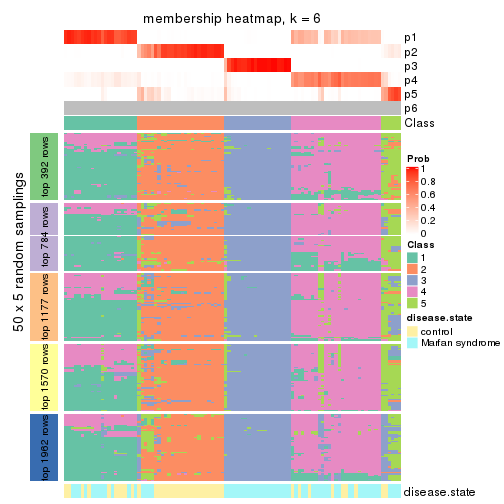</p>

</div>
</div>

As soon as we have had the classes for columns, we can look for signatures
which are significantly different between classes which can be candidate marks
for certain classes. Following are the heatmaps for signatures.


Signature heatmaps where rows are scaled:


<script>
$( function() {
	$( '#tabs-MAD-NMF-get-signatures' ).tabs();
} );
</script>
<div id='tabs-MAD-NMF-get-signatures'>
<ul>
<li><a href='#tab-MAD-NMF-get-signatures-1'>k = 2</a></li>
<li><a href='#tab-MAD-NMF-get-signatures-2'>k = 3</a></li>
<li><a href='#tab-MAD-NMF-get-signatures-3'>k = 4</a></li>
<li><a href='#tab-MAD-NMF-get-signatures-4'>k = 5</a></li>
<li><a href='#tab-MAD-NMF-get-signatures-5'>k = 6</a></li>
</ul>
<div id='tab-MAD-NMF-get-signatures-1'>
<pre><code class="r">get_signatures(res, k = 2)
</code></pre>

<p></p>

</div>
<div id='tab-MAD-NMF-get-signatures-2'>
<pre><code class="r">get_signatures(res, k = 3)
</code></pre>

<p></p>

</div>
<div id='tab-MAD-NMF-get-signatures-3'>
<pre><code class="r">get_signatures(res, k = 4)
</code></pre>

<p></p>

</div>
<div id='tab-MAD-NMF-get-signatures-4'>
<pre><code class="r">get_signatures(res, k = 5)
</code></pre>

<p></p>

</div>
<div id='tab-MAD-NMF-get-signatures-5'>
<pre><code class="r">get_signatures(res, k = 6)
</code></pre>

<p></p>

</div>
</div>


Signature heatmaps where rows are not scaled:


<script>
$( function() {
	$( '#tabs-MAD-NMF-get-signatures-no-scale' ).tabs();
} );
</script>
<div id='tabs-MAD-NMF-get-signatures-no-scale'>
<ul>
<li><a href='#tab-MAD-NMF-get-signatures-no-scale-1'>k = 2</a></li>
<li><a href='#tab-MAD-NMF-get-signatures-no-scale-2'>k = 3</a></li>
<li><a href='#tab-MAD-NMF-get-signatures-no-scale-3'>k = 4</a></li>
<li><a href='#tab-MAD-NMF-get-signatures-no-scale-4'>k = 5</a></li>
<li><a href='#tab-MAD-NMF-get-signatures-no-scale-5'>k = 6</a></li>
</ul>
<div id='tab-MAD-NMF-get-signatures-no-scale-1'>
<pre><code class="r">get_signatures(res, k = 2, scale_rows = FALSE)
</code></pre>

<p></p>

</div>
<div id='tab-MAD-NMF-get-signatures-no-scale-2'>
<pre><code class="r">get_signatures(res, k = 3, scale_rows = FALSE)
</code></pre>

<p></p>

</div>
<div id='tab-MAD-NMF-get-signatures-no-scale-3'>
<pre><code class="r">get_signatures(res, k = 4, scale_rows = FALSE)
</code></pre>

<p></p>

</div>
<div id='tab-MAD-NMF-get-signatures-no-scale-4'>
<pre><code class="r">get_signatures(res, k = 5, scale_rows = FALSE)
</code></pre>

<p></p>

</div>
<div id='tab-MAD-NMF-get-signatures-no-scale-5'>
<pre><code class="r">get_signatures(res, k = 6, scale_rows = FALSE)
</code></pre>

<p></p>

</div>
</div>


Compare the overlap of signatures from different k:

```r
compare_signatures(res)
```


`get_signature()` returns a data frame invisibly. TO get the list of signatures, the function
call should be assigned to a variable explicitly. In following code, if `plot` argument is set
to `FALSE`, no heatmap is plotted while only the differential analysis is performed.

```r
# code only for demonstration
tb = get_signature(res, k = ..., plot = FALSE)
```

An example of the output of `tb` is:

```
#>   which_row         fdr    mean_1    mean_2 scaled_mean_1 scaled_mean_2 km
#> 1        38 0.042760348  8.373488  9.131774    -0.5533452     0.5164555  1
#> 2        40 0.018707592  7.106213  8.469186    -0.6173731     0.5762149  1
#> 3        55 0.019134737 10.221463 11.207825    -0.6159697     0.5749050  1
#> 4        59 0.006059896  5.921854  7.869574    -0.6899429     0.6439467  1
#> 5        60 0.018055526  8.928898 10.211722    -0.6204761     0.5791110  1
#> 6        98 0.009384629 15.714769 14.887706     0.6635654    -0.6193277  2
...
```

The columns in `tb` are:

1. `which_row`: row indices corresponding to the input matrix.
2. `fdr`: FDR for the differential test. 
3. `mean_x`: The mean value in group x.
4. `scaled_mean_x`: The mean value in group x after rows are scaled.
5. `km`: Row groups if k-means clustering is applied to rows.


UMAP plot which shows how samples are separated.


<script>
$( function() {
	$( '#tabs-MAD-NMF-dimension-reduction' ).tabs();
} );
</script>
<div id='tabs-MAD-NMF-dimension-reduction'>
<ul>
<li><a href='#tab-MAD-NMF-dimension-reduction-1'>k = 2</a></li>
<li><a href='#tab-MAD-NMF-dimension-reduction-2'>k = 3</a></li>
<li><a href='#tab-MAD-NMF-dimension-reduction-3'>k = 4</a></li>
<li><a href='#tab-MAD-NMF-dimension-reduction-4'>k = 5</a></li>
<li><a href='#tab-MAD-NMF-dimension-reduction-5'>k = 6</a></li>
</ul>
<div id='tab-MAD-NMF-dimension-reduction-1'>
<pre><code class="r">dimension_reduction(res, k = 2, method = &quot;UMAP&quot;)
</code></pre>

<p></p>

</div>
<div id='tab-MAD-NMF-dimension-reduction-2'>
<pre><code class="r">dimension_reduction(res, k = 3, method = &quot;UMAP&quot;)
</code></pre>

<p></p>

</div>
<div id='tab-MAD-NMF-dimension-reduction-3'>
<pre><code class="r">dimension_reduction(res, k = 4, method = &quot;UMAP&quot;)
</code></pre>

<p></p>

</div>
<div id='tab-MAD-NMF-dimension-reduction-4'>
<pre><code class="r">dimension_reduction(res, k = 5, method = &quot;UMAP&quot;)
</code></pre>

<p></p>

</div>
<div id='tab-MAD-NMF-dimension-reduction-5'>
<pre><code class="r">dimension_reduction(res, k = 6, method = &quot;UMAP&quot;)
</code></pre>

<p></p>

</div>
</div>


Following heatmap shows how subgroups are split when increasing `k`:

```r
collect_classes(res)
```


Test correlation between subgroups and known annotations. If the known
annotation is numeric, one-way ANOVA test is applied, and if the known
annotation is discrete, chi-squared contingency table test is applied.

```r
test_to_known_factors(res)
```

```
#>           n disease.state(p) k
#> MAD:NMF 101         3.32e-01 2
#> MAD:NMF 101         2.94e-07 3
#> MAD:NMF  99         2.97e-07 4
#> MAD:NMF  77         8.86e-07 5
#> MAD:NMF  94         1.92e-08 6
```


If matrix rows can be associated to genes, consider to use `functional_enrichment(res,
...)` to perform function enrichment for the signature genes. See [this vignette](http://bioconductor.org/packages/devel/bioc/vignettes/cola/inst/doc/functional_enrichment.html) for more detailed explanations.


 

---------------------------------------------------


### ATC:hclust


The object with results only for a single top-value method and a single partition method 
can be extracted as:

```r
res = res_list["ATC", "hclust"]
# you can also extract it by
# res = res_list["ATC:hclust"]
```

A summary of `res` and all the functions that can be applied to it:

```r
res
```

```
#> A 'ConsensusPartition' object with k = 2, 3, 4, 5, 6.
#>   On a matrix with 3925 rows and 101 columns.
#>   Top rows (392, 784, 1177, 1570, 1962) are extracted by 'ATC' method.
#>   Subgroups are detected by 'hclust' method.
#>   Performed in total 1250 partitions by row resampling.
#>   Best k for subgroups seems to be 2.
#> 
#> Following methods can be applied to this 'ConsensusPartition' object:
#>  [1] "cola_report"             "collect_classes"         "collect_plots"          
#>  [4] "collect_stats"           "colnames"                "compare_signatures"     
#>  [7] "consensus_heatmap"       "dimension_reduction"     "functional_enrichment"  
#> [10] "get_anno_col"            "get_anno"                "get_classes"            
#> [13] "get_consensus"           "get_matrix"              "get_membership"         
#> [16] "get_param"               "get_signatures"          "get_stats"              
#> [19] "is_best_k"               "is_stable_k"             "membership_heatmap"     
#> [22] "ncol"                    "nrow"                    "plot_ecdf"              
#> [25] "rownames"                "select_partition_number" "show"                   
#> [28] "suggest_best_k"          "test_to_known_factors"
```

`collect_plots()` function collects all the plots made from `res` for all `k` (number of partitions)
into one single page to provide an easy and fast comparison between different `k`.

```r
collect_plots(res)
```


The plots are:

- The first row: a plot of the ECDF (empirical cumulative distribution
  function) curves of the consensus matrix for each `k` and the heatmap of
  predicted classes for each `k`.
- The second row: heatmaps of the consensus matrix for each `k`.
- The third row: heatmaps of the membership matrix for each `k`.
- The fouth row: heatmaps of the signatures for each `k`.

All the plots in panels can be made by individual functions and they are
plotted later in this section.

`select_partition_number()` produces several plots showing different
statistics for choosing "optimized" `k`. There are following statistics:

- ECDF curves of the consensus matrix for each `k`;
- 1-PAC. [The PAC
  score](https://en.wikipedia.org/wiki/Consensus_clustering#Over-interpretation_potential_of_consensus_clustering)
  measures the proportion of the ambiguous subgrouping.
- Mean silhouette score.
- Concordance. The mean probability of fiting the consensus class ids in all
  partitions.
- Area increased. Denote $A_k$ as the area under the ECDF curve for current
  `k`, the area increased is defined as $A_k - A_{k-1}$.
- Rand index. The percent of pairs of samples that are both in a same cluster
  or both are not in a same cluster in the partition of k and k-1.
- Jaccard index. The ratio of pairs of samples are both in a same cluster in
  the partition of k and k-1 and the pairs of samples are both in a same
  cluster in the partition k or k-1.

The detailed explanations of these statistics can be found in [the _cola_
vignette](http://bioconductor.org/packages/devel/bioc/vignettes/cola/inst/doc/cola.html#toc_13).

Generally speaking, lower PAC score, higher mean silhouette score or higher
concordance corresponds to better partition. Rand index and Jaccard index
measure how similar the current partition is compared to partition with `k-1`.
If they are too similar, we won't accept `k` is better than `k-1`.

```r
select_partition_number(res)
```


The numeric values for all these statistics can be obtained by `get_stats()`.

```r
get_stats(res)
```

```
#>   k 1-PAC mean_silhouette concordance area_increased  Rand Jaccard
#> 2 2 0.853           0.978       0.987         0.5017 0.495   0.495
#> 3 3 0.741           0.502       0.769         0.2663 0.886   0.770
#> 4 4 0.867           0.886       0.932         0.0497 0.877   0.711
#> 5 5 0.767           0.668       0.768         0.1009 0.954   0.871
#> 6 6 0.803           0.817       0.872         0.0715 0.840   0.531
```

`suggest_best_k()` suggests the best $k$ based on these statistics. The rules are as follows:

- All $k$ with Jaccard index larger than 0.95 are removed because increasing
  $k$ does not provide enough extra information. If all $k$ are removed, it is
  marked as no subgroup is detected.
- For all $k$ with 1-PAC score larger than 0.9, the maximal $k$ is taken as
  the best $k$, and other $k$ are marked as optional $k$.
- If it does not fit the second rule. The $k$ with the maximal vote of the
  highest 1-PAC score, highest mean silhouette, and highest concordance is
  taken as the best $k$.

```r
suggest_best_k(res)
```

```
#> [1] 2
```


Following shows the table of the partitions (You need to click the **show/hide
code output** link to see it). The membership matrix (columns with name `p*`)
is inferred by
[`clue::cl_consensus()`](https://www.rdocumentation.org/link/cl_consensus?package=clue)
function with the `SE` method. Basically the value in the membership matrix
represents the probability to belong to a certain group. The finall class
label for an item is determined with the group with highest probability it
belongs to.

In `get_classes()` function, the entropy is calculated from the membership
matrix and the silhouette score is calculated from the consensus matrix.


<script>
$( function() {
	$( '#tabs-ATC-hclust-get-classes' ).tabs();
} );
</script>
<div id='tabs-ATC-hclust-get-classes'>
<ul>
<li><a href='#tab-ATC-hclust-get-classes-1'>k = 2</a></li>
<li><a href='#tab-ATC-hclust-get-classes-2'>k = 3</a></li>
<li><a href='#tab-ATC-hclust-get-classes-3'>k = 4</a></li>
<li><a href='#tab-ATC-hclust-get-classes-4'>k = 5</a></li>
<li><a href='#tab-ATC-hclust-get-classes-5'>k = 6</a></li>
</ul>

<div id='tab-ATC-hclust-get-classes-1'>
<p><a id='tab-ATC-hclust-get-classes-1-a' style='color:#0366d6' href='#'>show/hide code output</a></p>
<pre><code class="r">cbind(get_classes(res, k = 2), get_membership(res, k = 2))
</code></pre>

<pre><code>#&gt;           class entropy silhouette    p1    p2
#&gt; GSM217644     2  0.0000      0.994 0.000 1.000
#&gt; GSM217645     2  0.0000      0.994 0.000 1.000
#&gt; GSM217646     2  0.0000      0.994 0.000 1.000
#&gt; GSM217647     2  0.0000      0.994 0.000 1.000
#&gt; GSM217648     2  0.0000      0.994 0.000 1.000
#&gt; GSM217649     2  0.0000      0.994 0.000 1.000
#&gt; GSM217650     2  0.0000      0.994 0.000 1.000
#&gt; GSM217651     2  0.0000      0.994 0.000 1.000
#&gt; GSM217652     2  0.0000      0.994 0.000 1.000
#&gt; GSM217653     2  0.0000      0.994 0.000 1.000
#&gt; GSM217654     2  0.0000      0.994 0.000 1.000
#&gt; GSM217655     2  0.0000      0.994 0.000 1.000
#&gt; GSM217656     2  0.1414      0.985 0.020 0.980
#&gt; GSM217657     2  0.1414      0.985 0.020 0.980
#&gt; GSM217658     2  0.0000      0.994 0.000 1.000
#&gt; GSM217659     2  0.0000      0.994 0.000 1.000
#&gt; GSM217660     2  0.0000      0.994 0.000 1.000
#&gt; GSM217661     2  0.0000      0.994 0.000 1.000
#&gt; GSM217662     2  0.0000      0.994 0.000 1.000
#&gt; GSM217663     2  0.0000      0.994 0.000 1.000
#&gt; GSM217664     2  0.0000      0.994 0.000 1.000
#&gt; GSM217665     2  0.0000      0.994 0.000 1.000
#&gt; GSM217666     2  0.0000      0.994 0.000 1.000
#&gt; GSM217667     2  0.0000      0.994 0.000 1.000
#&gt; GSM217668     1  0.0000      0.978 1.000 0.000
#&gt; GSM217669     1  0.0000      0.978 1.000 0.000
#&gt; GSM217670     1  0.0376      0.977 0.996 0.004
#&gt; GSM217671     1  0.0000      0.978 1.000 0.000
#&gt; GSM217672     1  0.0000      0.978 1.000 0.000
#&gt; GSM217673     1  0.0000      0.978 1.000 0.000
#&gt; GSM217674     1  0.0000      0.978 1.000 0.000
#&gt; GSM217675     1  0.0000      0.978 1.000 0.000
#&gt; GSM217676     1  0.0376      0.977 0.996 0.004
#&gt; GSM217677     1  0.0000      0.978 1.000 0.000
#&gt; GSM217678     1  0.0000      0.978 1.000 0.000
#&gt; GSM217679     1  0.0000      0.978 1.000 0.000
#&gt; GSM217680     1  0.0000      0.978 1.000 0.000
#&gt; GSM217681     1  0.0000      0.978 1.000 0.000
#&gt; GSM217682     1  0.0000      0.978 1.000 0.000
#&gt; GSM217683     1  0.0000      0.978 1.000 0.000
#&gt; GSM217684     1  0.0000      0.978 1.000 0.000
#&gt; GSM217685     2  0.0938      0.992 0.012 0.988
#&gt; GSM217686     2  0.0938      0.992 0.012 0.988
#&gt; GSM217687     2  0.0938      0.992 0.012 0.988
#&gt; GSM217688     2  0.0938      0.992 0.012 0.988
#&gt; GSM217689     2  0.0938      0.992 0.012 0.988
#&gt; GSM217690     2  0.0938      0.992 0.012 0.988
#&gt; GSM217691     2  0.0938      0.992 0.012 0.988
#&gt; GSM217692     2  0.0938      0.992 0.012 0.988
#&gt; GSM217693     2  0.0938      0.992 0.012 0.988
#&gt; GSM217694     2  0.0938      0.992 0.012 0.988
#&gt; GSM217695     2  0.0938      0.992 0.012 0.988
#&gt; GSM217696     2  0.0938      0.992 0.012 0.988
#&gt; GSM217697     2  0.0938      0.992 0.012 0.988
#&gt; GSM217698     2  0.0938      0.992 0.012 0.988
#&gt; GSM217699     2  0.0938      0.992 0.012 0.988
#&gt; GSM217700     2  0.0938      0.992 0.012 0.988
#&gt; GSM217701     2  0.0938      0.992 0.012 0.988
#&gt; GSM217702     2  0.0938      0.992 0.012 0.988
#&gt; GSM217703     2  0.0938      0.992 0.012 0.988
#&gt; GSM217704     2  0.0938      0.992 0.012 0.988
#&gt; GSM217705     1  0.0000      0.978 1.000 0.000
#&gt; GSM217706     1  0.0376      0.977 0.996 0.004
#&gt; GSM217707     1  0.0000      0.978 1.000 0.000
#&gt; GSM217708     1  0.5294      0.885 0.880 0.120
#&gt; GSM217709     1  0.5294      0.885 0.880 0.120
#&gt; GSM217710     1  0.5294      0.885 0.880 0.120
#&gt; GSM217711     1  0.5294      0.885 0.880 0.120
#&gt; GSM217712     1  0.0000      0.978 1.000 0.000
#&gt; GSM217713     1  0.0376      0.977 0.996 0.004
#&gt; GSM217714     1  0.0000      0.978 1.000 0.000
#&gt; GSM217715     1  0.0000      0.978 1.000 0.000
#&gt; GSM217716     1  0.0376      0.977 0.996 0.004
#&gt; GSM217717     1  0.0376      0.977 0.996 0.004
#&gt; GSM217718     1  0.1184      0.969 0.984 0.016
#&gt; GSM217719     1  0.1184      0.969 0.984 0.016
#&gt; GSM217720     1  0.0000      0.978 1.000 0.000
#&gt; GSM217721     1  0.0376      0.977 0.996 0.004
#&gt; GSM217722     1  0.0000      0.978 1.000 0.000
#&gt; GSM217723     1  0.5294      0.885 0.880 0.120
#&gt; GSM217724     1  0.5294      0.885 0.880 0.120
#&gt; GSM217725     1  0.5294      0.885 0.880 0.120
#&gt; GSM217726     1  0.0000      0.978 1.000 0.000
#&gt; GSM217727     1  0.0000      0.978 1.000 0.000
#&gt; GSM217728     1  0.5294      0.885 0.880 0.120
#&gt; GSM217729     1  0.0000      0.978 1.000 0.000
#&gt; GSM217730     1  0.0000      0.978 1.000 0.000
#&gt; GSM217731     1  0.0000      0.978 1.000 0.000
#&gt; GSM217732     1  0.0000      0.978 1.000 0.000
#&gt; GSM217733     1  0.0000      0.978 1.000 0.000
#&gt; GSM217734     1  0.0000      0.978 1.000 0.000
#&gt; GSM217735     1  0.0000      0.978 1.000 0.000
#&gt; GSM217736     1  0.0000      0.978 1.000 0.000
#&gt; GSM217737     2  0.0000      0.994 0.000 1.000
#&gt; GSM217738     2  0.0000      0.994 0.000 1.000
#&gt; GSM217739     2  0.0000      0.994 0.000 1.000
#&gt; GSM217740     2  0.0000      0.994 0.000 1.000
#&gt; GSM217741     2  0.0000      0.994 0.000 1.000
#&gt; GSM217742     2  0.0000      0.994 0.000 1.000
#&gt; GSM217743     2  0.0000      0.994 0.000 1.000
#&gt; GSM217744     2  0.0000      0.994 0.000 1.000
</code></pre>

<script>
$('#tab-ATC-hclust-get-classes-1-a').parent().next().next().hide();
$('#tab-ATC-hclust-get-classes-1-a').click(function(){
  $('#tab-ATC-hclust-get-classes-1-a').parent().next().next().toggle();
  return(false);
});
</script>
</div>

<div id='tab-ATC-hclust-get-classes-2'>
<p><a id='tab-ATC-hclust-get-classes-2-a' style='color:#0366d6' href='#'>show/hide code output</a></p>
<pre><code class="r">cbind(get_classes(res, k = 3), get_membership(res, k = 3))
</code></pre>

<pre><code>#&gt;           class entropy silhouette    p1    p2    p3
#&gt; GSM217644     2  0.5706     0.2633 0.000 0.680 0.320
#&gt; GSM217645     2  0.5497     0.2608 0.000 0.708 0.292
#&gt; GSM217646     2  0.6225     0.2225 0.000 0.568 0.432
#&gt; GSM217647     3  0.6111    -0.0127 0.000 0.396 0.604
#&gt; GSM217648     3  0.6180    -0.0363 0.000 0.416 0.584
#&gt; GSM217649     2  0.6225     0.2225 0.000 0.568 0.432
#&gt; GSM217650     2  0.6260     0.2038 0.000 0.552 0.448
#&gt; GSM217651     3  0.6225    -0.0631 0.000 0.432 0.568
#&gt; GSM217652     2  0.6260     0.2038 0.000 0.552 0.448
#&gt; GSM217653     3  0.6111    -0.0127 0.000 0.396 0.604
#&gt; GSM217654     2  0.1411     0.1876 0.000 0.964 0.036
#&gt; GSM217655     2  0.1411     0.1876 0.000 0.964 0.036
#&gt; GSM217656     2  0.6111    -0.0513 0.000 0.604 0.396
#&gt; GSM217657     2  0.6111    -0.0513 0.000 0.604 0.396
#&gt; GSM217658     2  0.6252     0.2090 0.000 0.556 0.444
#&gt; GSM217659     2  0.6225     0.2225 0.000 0.568 0.432
#&gt; GSM217660     3  0.6307    -0.1135 0.000 0.488 0.512
#&gt; GSM217661     2  0.5760     0.2616 0.000 0.672 0.328
#&gt; GSM217662     3  0.6111    -0.0127 0.000 0.396 0.604
#&gt; GSM217663     3  0.6274    -0.1069 0.000 0.456 0.544
#&gt; GSM217664     3  0.6286    -0.1285 0.000 0.464 0.536
#&gt; GSM217665     3  0.6168    -0.0366 0.000 0.412 0.588
#&gt; GSM217666     3  0.6111    -0.0127 0.000 0.396 0.604
#&gt; GSM217667     3  0.6111    -0.0127 0.000 0.396 0.604
#&gt; GSM217668     1  0.0000     0.9749 1.000 0.000 0.000
#&gt; GSM217669     1  0.0000     0.9749 1.000 0.000 0.000
#&gt; GSM217670     1  0.0237     0.9734 0.996 0.000 0.004
#&gt; GSM217671     1  0.0000     0.9749 1.000 0.000 0.000
#&gt; GSM217672     1  0.0000     0.9749 1.000 0.000 0.000
#&gt; GSM217673     1  0.0000     0.9749 1.000 0.000 0.000
#&gt; GSM217674     1  0.0000     0.9749 1.000 0.000 0.000
#&gt; GSM217675     1  0.0000     0.9749 1.000 0.000 0.000
#&gt; GSM217676     1  0.0424     0.9709 0.992 0.000 0.008
#&gt; GSM217677     1  0.0000     0.9749 1.000 0.000 0.000
#&gt; GSM217678     1  0.0000     0.9749 1.000 0.000 0.000
#&gt; GSM217679     1  0.0000     0.9749 1.000 0.000 0.000
#&gt; GSM217680     1  0.0000     0.9749 1.000 0.000 0.000
#&gt; GSM217681     1  0.0000     0.9749 1.000 0.000 0.000
#&gt; GSM217682     1  0.0000     0.9749 1.000 0.000 0.000
#&gt; GSM217683     1  0.0000     0.9749 1.000 0.000 0.000
#&gt; GSM217684     1  0.0000     0.9749 1.000 0.000 0.000
#&gt; GSM217685     3  0.6286     0.1410 0.000 0.464 0.536
#&gt; GSM217686     3  0.6286     0.1410 0.000 0.464 0.536
#&gt; GSM217687     3  0.6286     0.1410 0.000 0.464 0.536
#&gt; GSM217688     3  0.6286     0.1410 0.000 0.464 0.536
#&gt; GSM217689     2  0.6252    -0.0884 0.000 0.556 0.444
#&gt; GSM217690     2  0.6252    -0.0884 0.000 0.556 0.444
#&gt; GSM217691     3  0.6286     0.1410 0.000 0.464 0.536
#&gt; GSM217692     3  0.6286     0.1410 0.000 0.464 0.536
#&gt; GSM217693     3  0.6286     0.1410 0.000 0.464 0.536
#&gt; GSM217694     3  0.6286     0.1410 0.000 0.464 0.536
#&gt; GSM217695     3  0.6286     0.1410 0.000 0.464 0.536
#&gt; GSM217696     3  0.6286     0.1410 0.000 0.464 0.536
#&gt; GSM217697     3  0.6286     0.1410 0.000 0.464 0.536
#&gt; GSM217698     3  0.6286     0.1410 0.000 0.464 0.536
#&gt; GSM217699     3  0.6286     0.1410 0.000 0.464 0.536
#&gt; GSM217700     3  0.6286     0.1410 0.000 0.464 0.536
#&gt; GSM217701     3  0.6286     0.1410 0.000 0.464 0.536
#&gt; GSM217702     3  0.6286     0.1410 0.000 0.464 0.536
#&gt; GSM217703     2  0.6252    -0.0884 0.000 0.556 0.444
#&gt; GSM217704     3  0.6286     0.1410 0.000 0.464 0.536
#&gt; GSM217705     1  0.0000     0.9749 1.000 0.000 0.000
#&gt; GSM217706     1  0.0237     0.9734 0.996 0.000 0.004
#&gt; GSM217707     1  0.0000     0.9749 1.000 0.000 0.000
#&gt; GSM217708     1  0.4209     0.8706 0.860 0.020 0.120
#&gt; GSM217709     1  0.4209     0.8706 0.860 0.020 0.120
#&gt; GSM217710     1  0.4209     0.8706 0.860 0.020 0.120
#&gt; GSM217711     1  0.4209     0.8706 0.860 0.020 0.120
#&gt; GSM217712     1  0.0000     0.9749 1.000 0.000 0.000
#&gt; GSM217713     1  0.0237     0.9734 0.996 0.000 0.004
#&gt; GSM217714     1  0.0000     0.9749 1.000 0.000 0.000
#&gt; GSM217715     1  0.0000     0.9749 1.000 0.000 0.000
#&gt; GSM217716     1  0.0237     0.9734 0.996 0.000 0.004
#&gt; GSM217717     1  0.0237     0.9734 0.996 0.000 0.004
#&gt; GSM217718     1  0.1129     0.9616 0.976 0.004 0.020
#&gt; GSM217719     1  0.1129     0.9616 0.976 0.004 0.020
#&gt; GSM217720     1  0.0000     0.9749 1.000 0.000 0.000
#&gt; GSM217721     1  0.0237     0.9734 0.996 0.000 0.004
#&gt; GSM217722     1  0.0000     0.9749 1.000 0.000 0.000
#&gt; GSM217723     1  0.4209     0.8706 0.860 0.020 0.120
#&gt; GSM217724     1  0.4209     0.8706 0.860 0.020 0.120
#&gt; GSM217725     1  0.4209     0.8706 0.860 0.020 0.120
#&gt; GSM217726     1  0.0000     0.9749 1.000 0.000 0.000
#&gt; GSM217727     1  0.0000     0.9749 1.000 0.000 0.000
#&gt; GSM217728     1  0.4209     0.8706 0.860 0.020 0.120
#&gt; GSM217729     1  0.0000     0.9749 1.000 0.000 0.000
#&gt; GSM217730     1  0.0000     0.9749 1.000 0.000 0.000
#&gt; GSM217731     1  0.0000     0.9749 1.000 0.000 0.000
#&gt; GSM217732     1  0.0000     0.9749 1.000 0.000 0.000
#&gt; GSM217733     1  0.0000     0.9749 1.000 0.000 0.000
#&gt; GSM217734     1  0.0000     0.9749 1.000 0.000 0.000
#&gt; GSM217735     1  0.0000     0.9749 1.000 0.000 0.000
#&gt; GSM217736     1  0.0000     0.9749 1.000 0.000 0.000
#&gt; GSM217737     3  0.6168    -0.0288 0.000 0.412 0.588
#&gt; GSM217738     3  0.6168    -0.0288 0.000 0.412 0.588
#&gt; GSM217739     3  0.6111    -0.0127 0.000 0.396 0.604
#&gt; GSM217740     3  0.6111    -0.0127 0.000 0.396 0.604
#&gt; GSM217741     3  0.6111    -0.0127 0.000 0.396 0.604
#&gt; GSM217742     3  0.6111    -0.0127 0.000 0.396 0.604
#&gt; GSM217743     3  0.6111    -0.0127 0.000 0.396 0.604
#&gt; GSM217744     3  0.6111    -0.0127 0.000 0.396 0.604
</code></pre>

<script>
$('#tab-ATC-hclust-get-classes-2-a').parent().next().next().hide();
$('#tab-ATC-hclust-get-classes-2-a').click(function(){
  $('#tab-ATC-hclust-get-classes-2-a').parent().next().next().toggle();
  return(false);
});
</script>
</div>

<div id='tab-ATC-hclust-get-classes-3'>
<p><a id='tab-ATC-hclust-get-classes-3-a' style='color:#0366d6' href='#'>show/hide code output</a></p>
<pre><code class="r">cbind(get_classes(res, k = 4), get_membership(res, k = 4))
</code></pre>

<pre><code>#&gt;           class entropy silhouette    p1    p2    p3    p4
#&gt; GSM217644     2  0.4283      0.558 0.000 0.740 0.004 0.256
#&gt; GSM217645     2  0.4483      0.493 0.000 0.712 0.004 0.284
#&gt; GSM217646     2  0.3157      0.735 0.000 0.852 0.004 0.144
#&gt; GSM217647     2  0.1389      0.824 0.000 0.952 0.048 0.000
#&gt; GSM217648     2  0.1798      0.825 0.000 0.944 0.040 0.016
#&gt; GSM217649     2  0.3157      0.735 0.000 0.852 0.004 0.144
#&gt; GSM217650     2  0.2944      0.748 0.000 0.868 0.004 0.128
#&gt; GSM217651     2  0.1520      0.819 0.000 0.956 0.024 0.020
#&gt; GSM217652     2  0.2944      0.748 0.000 0.868 0.004 0.128
#&gt; GSM217653     2  0.1389      0.824 0.000 0.952 0.048 0.000
#&gt; GSM217654     4  0.5143      0.338 0.000 0.456 0.004 0.540
#&gt; GSM217655     4  0.5143      0.338 0.000 0.456 0.004 0.540
#&gt; GSM217656     4  0.2589      0.608 0.000 0.000 0.116 0.884
#&gt; GSM217657     4  0.2589      0.608 0.000 0.000 0.116 0.884
#&gt; GSM217658     2  0.2999      0.746 0.000 0.864 0.004 0.132
#&gt; GSM217659     2  0.3157      0.735 0.000 0.852 0.004 0.144
#&gt; GSM217660     2  0.3333      0.788 0.000 0.872 0.040 0.088
#&gt; GSM217661     2  0.4220      0.574 0.000 0.748 0.004 0.248
#&gt; GSM217662     2  0.1389      0.824 0.000 0.952 0.048 0.000
#&gt; GSM217663     2  0.2111      0.813 0.000 0.932 0.024 0.044
#&gt; GSM217664     2  0.1398      0.803 0.000 0.956 0.004 0.040
#&gt; GSM217665     2  0.1109      0.823 0.000 0.968 0.028 0.004
#&gt; GSM217666     2  0.1474      0.823 0.000 0.948 0.052 0.000
#&gt; GSM217667     2  0.1474      0.823 0.000 0.948 0.052 0.000
#&gt; GSM217668     1  0.0000      0.976 1.000 0.000 0.000 0.000
#&gt; GSM217669     1  0.0000      0.976 1.000 0.000 0.000 0.000
#&gt; GSM217670     1  0.0188      0.974 0.996 0.000 0.000 0.004
#&gt; GSM217671     1  0.0000      0.976 1.000 0.000 0.000 0.000
#&gt; GSM217672     1  0.0000      0.976 1.000 0.000 0.000 0.000
#&gt; GSM217673     1  0.0000      0.976 1.000 0.000 0.000 0.000
#&gt; GSM217674     1  0.0000      0.976 1.000 0.000 0.000 0.000
#&gt; GSM217675     1  0.0000      0.976 1.000 0.000 0.000 0.000
#&gt; GSM217676     1  0.0336      0.972 0.992 0.000 0.000 0.008
#&gt; GSM217677     1  0.0000      0.976 1.000 0.000 0.000 0.000
#&gt; GSM217678     1  0.0000      0.976 1.000 0.000 0.000 0.000
#&gt; GSM217679     1  0.0000      0.976 1.000 0.000 0.000 0.000
#&gt; GSM217680     1  0.0000      0.976 1.000 0.000 0.000 0.000
#&gt; GSM217681     1  0.0000      0.976 1.000 0.000 0.000 0.000
#&gt; GSM217682     1  0.0000      0.976 1.000 0.000 0.000 0.000
#&gt; GSM217683     1  0.0000      0.976 1.000 0.000 0.000 0.000
#&gt; GSM217684     1  0.0000      0.976 1.000 0.000 0.000 0.000
#&gt; GSM217685     3  0.0000      0.983 0.000 0.000 1.000 0.000
#&gt; GSM217686     3  0.0000      0.983 0.000 0.000 1.000 0.000
#&gt; GSM217687     3  0.0000      0.983 0.000 0.000 1.000 0.000
#&gt; GSM217688     3  0.0000      0.983 0.000 0.000 1.000 0.000
#&gt; GSM217689     3  0.2281      0.896 0.000 0.000 0.904 0.096
#&gt; GSM217690     3  0.2281      0.896 0.000 0.000 0.904 0.096
#&gt; GSM217691     3  0.0000      0.983 0.000 0.000 1.000 0.000
#&gt; GSM217692     3  0.0000      0.983 0.000 0.000 1.000 0.000
#&gt; GSM217693     3  0.0000      0.983 0.000 0.000 1.000 0.000
#&gt; GSM217694     3  0.0000      0.983 0.000 0.000 1.000 0.000
#&gt; GSM217695     3  0.0000      0.983 0.000 0.000 1.000 0.000
#&gt; GSM217696     3  0.0000      0.983 0.000 0.000 1.000 0.000
#&gt; GSM217697     3  0.0000      0.983 0.000 0.000 1.000 0.000
#&gt; GSM217698     3  0.0000      0.983 0.000 0.000 1.000 0.000
#&gt; GSM217699     3  0.0000      0.983 0.000 0.000 1.000 0.000
#&gt; GSM217700     3  0.0000      0.983 0.000 0.000 1.000 0.000
#&gt; GSM217701     3  0.0000      0.983 0.000 0.000 1.000 0.000
#&gt; GSM217702     3  0.0000      0.983 0.000 0.000 1.000 0.000
#&gt; GSM217703     3  0.2281      0.896 0.000 0.000 0.904 0.096
#&gt; GSM217704     3  0.0000      0.983 0.000 0.000 1.000 0.000
#&gt; GSM217705     1  0.0000      0.976 1.000 0.000 0.000 0.000
#&gt; GSM217706     1  0.0188      0.974 0.996 0.000 0.000 0.004
#&gt; GSM217707     1  0.0000      0.976 1.000 0.000 0.000 0.000
#&gt; GSM217708     1  0.2921      0.874 0.860 0.000 0.000 0.140
#&gt; GSM217709     1  0.2921      0.874 0.860 0.000 0.000 0.140
#&gt; GSM217710     1  0.2921      0.874 0.860 0.000 0.000 0.140
#&gt; GSM217711     1  0.2921      0.874 0.860 0.000 0.000 0.140
#&gt; GSM217712     1  0.0000      0.976 1.000 0.000 0.000 0.000
#&gt; GSM217713     1  0.0188      0.974 0.996 0.000 0.000 0.004
#&gt; GSM217714     1  0.0000      0.976 1.000 0.000 0.000 0.000
#&gt; GSM217715     1  0.0000      0.976 1.000 0.000 0.000 0.000
#&gt; GSM217716     1  0.0188      0.974 0.996 0.000 0.000 0.004
#&gt; GSM217717     1  0.0188      0.974 0.996 0.000 0.000 0.004
#&gt; GSM217718     1  0.0817      0.962 0.976 0.000 0.000 0.024
#&gt; GSM217719     1  0.0817      0.962 0.976 0.000 0.000 0.024
#&gt; GSM217720     1  0.0000      0.976 1.000 0.000 0.000 0.000
#&gt; GSM217721     1  0.0188      0.974 0.996 0.000 0.000 0.004
#&gt; GSM217722     1  0.0000      0.976 1.000 0.000 0.000 0.000
#&gt; GSM217723     1  0.2921      0.874 0.860 0.000 0.000 0.140
#&gt; GSM217724     1  0.2921      0.874 0.860 0.000 0.000 0.140
#&gt; GSM217725     1  0.2921      0.874 0.860 0.000 0.000 0.140
#&gt; GSM217726     1  0.0000      0.976 1.000 0.000 0.000 0.000
#&gt; GSM217727     1  0.0000      0.976 1.000 0.000 0.000 0.000
#&gt; GSM217728     1  0.2921      0.874 0.860 0.000 0.000 0.140
#&gt; GSM217729     1  0.0000      0.976 1.000 0.000 0.000 0.000
#&gt; GSM217730     1  0.0000      0.976 1.000 0.000 0.000 0.000
#&gt; GSM217731     1  0.0000      0.976 1.000 0.000 0.000 0.000
#&gt; GSM217732     1  0.0000      0.976 1.000 0.000 0.000 0.000
#&gt; GSM217733     1  0.0000      0.976 1.000 0.000 0.000 0.000
#&gt; GSM217734     1  0.0000      0.976 1.000 0.000 0.000 0.000
#&gt; GSM217735     1  0.0000      0.976 1.000 0.000 0.000 0.000
#&gt; GSM217736     1  0.0000      0.976 1.000 0.000 0.000 0.000
#&gt; GSM217737     2  0.4259      0.774 0.000 0.816 0.056 0.128
#&gt; GSM217738     2  0.4259      0.774 0.000 0.816 0.056 0.128
#&gt; GSM217739     2  0.4037      0.776 0.000 0.832 0.056 0.112
#&gt; GSM217740     2  0.4037      0.776 0.000 0.832 0.056 0.112
#&gt; GSM217741     2  0.4037      0.776 0.000 0.832 0.056 0.112
#&gt; GSM217742     2  0.4037      0.776 0.000 0.832 0.056 0.112
#&gt; GSM217743     2  0.4037      0.776 0.000 0.832 0.056 0.112
#&gt; GSM217744     2  0.4037      0.776 0.000 0.832 0.056 0.112
</code></pre>

<script>
$('#tab-ATC-hclust-get-classes-3-a').parent().next().next().hide();
$('#tab-ATC-hclust-get-classes-3-a').click(function(){
  $('#tab-ATC-hclust-get-classes-3-a').parent().next().next().toggle();
  return(false);
});
</script>
</div>

<div id='tab-ATC-hclust-get-classes-4'>
<p><a id='tab-ATC-hclust-get-classes-4-a' style='color:#0366d6' href='#'>show/hide code output</a></p>
<pre><code class="r">cbind(get_classes(res, k = 5), get_membership(res, k = 5))
</code></pre>

<pre><code>#&gt;           class entropy silhouette p1    p2    p3    p4    p5
#&gt; GSM217644     2  0.3684     0.4332 NA 0.720 0.000 0.000 0.280
#&gt; GSM217645     2  0.3508     0.4302 NA 0.748 0.000 0.000 0.252
#&gt; GSM217646     2  0.4161     0.3695 NA 0.608 0.000 0.000 0.392
#&gt; GSM217647     5  0.4920     0.3581 NA 0.384 0.032 0.000 0.584
#&gt; GSM217648     5  0.5003     0.2632 NA 0.424 0.032 0.000 0.544
#&gt; GSM217649     2  0.4161     0.3695 NA 0.608 0.000 0.000 0.392
#&gt; GSM217650     2  0.4201     0.3384 NA 0.592 0.000 0.000 0.408
#&gt; GSM217651     5  0.4735     0.1365 NA 0.460 0.016 0.000 0.524
#&gt; GSM217652     2  0.4201     0.3384 NA 0.592 0.000 0.000 0.408
#&gt; GSM217653     5  0.4920     0.3581 NA 0.384 0.032 0.000 0.584
#&gt; GSM217654     2  0.0404     0.3604 NA 0.988 0.000 0.000 0.000
#&gt; GSM217655     2  0.0404     0.3604 NA 0.988 0.000 0.000 0.000
#&gt; GSM217656     2  0.5111     0.1642 NA 0.500 0.000 0.000 0.036
#&gt; GSM217657     2  0.5111     0.1642 NA 0.500 0.000 0.000 0.036
#&gt; GSM217658     2  0.4192     0.3472 NA 0.596 0.000 0.000 0.404
#&gt; GSM217659     2  0.4161     0.3695 NA 0.608 0.000 0.000 0.392
#&gt; GSM217660     2  0.5047    -0.1933 NA 0.496 0.032 0.000 0.472
#&gt; GSM217661     2  0.3730     0.4314 NA 0.712 0.000 0.000 0.288
#&gt; GSM217662     5  0.4920     0.3581 NA 0.384 0.032 0.000 0.584
#&gt; GSM217663     5  0.4746     0.0416 NA 0.480 0.016 0.000 0.504
#&gt; GSM217664     2  0.4307    -0.0267 NA 0.504 0.000 0.000 0.496
#&gt; GSM217665     5  0.4708     0.2206 NA 0.436 0.016 0.000 0.548
#&gt; GSM217666     5  0.4980     0.3615 NA 0.380 0.036 0.000 0.584
#&gt; GSM217667     5  0.5000     0.3487 NA 0.388 0.036 0.000 0.576
#&gt; GSM217668     4  0.1908     0.7848 NA 0.000 0.000 0.908 0.000
#&gt; GSM217669     4  0.0510     0.7872 NA 0.000 0.000 0.984 0.000
#&gt; GSM217670     4  0.0162     0.7839 NA 0.000 0.000 0.996 0.000
#&gt; GSM217671     4  0.0290     0.7855 NA 0.000 0.000 0.992 0.000
#&gt; GSM217672     4  0.0290     0.7855 NA 0.000 0.000 0.992 0.000
#&gt; GSM217673     4  0.0290     0.7855 NA 0.000 0.000 0.992 0.000
#&gt; GSM217674     4  0.4150     0.7542 NA 0.000 0.000 0.612 0.000
#&gt; GSM217675     4  0.4182     0.7464 NA 0.000 0.000 0.600 0.000
#&gt; GSM217676     4  0.3857     0.7682 NA 0.000 0.000 0.688 0.000
#&gt; GSM217677     4  0.4150     0.7542 NA 0.000 0.000 0.612 0.000
#&gt; GSM217678     4  0.4101     0.7592 NA 0.000 0.000 0.628 0.000
#&gt; GSM217679     4  0.4150     0.7549 NA 0.000 0.000 0.612 0.000
#&gt; GSM217680     4  0.4101     0.7592 NA 0.000 0.000 0.628 0.000
#&gt; GSM217681     4  0.4150     0.7549 NA 0.000 0.000 0.612 0.000
#&gt; GSM217682     4  0.4171     0.7487 NA 0.000 0.000 0.604 0.000
#&gt; GSM217683     4  0.4171     0.7487 NA 0.000 0.000 0.604 0.000
#&gt; GSM217684     4  0.4088     0.7572 NA 0.000 0.000 0.632 0.000
#&gt; GSM217685     3  0.0000     0.9864 NA 0.000 1.000 0.000 0.000
#&gt; GSM217686     3  0.0000     0.9864 NA 0.000 1.000 0.000 0.000
#&gt; GSM217687     3  0.0000     0.9864 NA 0.000 1.000 0.000 0.000
#&gt; GSM217688     3  0.0000     0.9864 NA 0.000 1.000 0.000 0.000
#&gt; GSM217689     3  0.2597     0.9192 NA 0.040 0.904 0.000 0.036
#&gt; GSM217690     3  0.2597     0.9192 NA 0.040 0.904 0.000 0.036
#&gt; GSM217691     3  0.0000     0.9864 NA 0.000 1.000 0.000 0.000
#&gt; GSM217692     3  0.0000     0.9864 NA 0.000 1.000 0.000 0.000
#&gt; GSM217693     3  0.0000     0.9864 NA 0.000 1.000 0.000 0.000
#&gt; GSM217694     3  0.0000     0.9864 NA 0.000 1.000 0.000 0.000
#&gt; GSM217695     3  0.0000     0.9864 NA 0.000 1.000 0.000 0.000
#&gt; GSM217696     3  0.0000     0.9864 NA 0.000 1.000 0.000 0.000
#&gt; GSM217697     3  0.0000     0.9864 NA 0.000 1.000 0.000 0.000
#&gt; GSM217698     3  0.0000     0.9864 NA 0.000 1.000 0.000 0.000
#&gt; GSM217699     3  0.0000     0.9864 NA 0.000 1.000 0.000 0.000
#&gt; GSM217700     3  0.0000     0.9864 NA 0.000 1.000 0.000 0.000
#&gt; GSM217701     3  0.0000     0.9864 NA 0.000 1.000 0.000 0.000
#&gt; GSM217702     3  0.0000     0.9864 NA 0.000 1.000 0.000 0.000
#&gt; GSM217703     3  0.2597     0.9192 NA 0.040 0.904 0.000 0.036
#&gt; GSM217704     3  0.0000     0.9864 NA 0.000 1.000 0.000 0.000
#&gt; GSM217705     4  0.0794     0.7886 NA 0.000 0.000 0.972 0.000
#&gt; GSM217706     4  0.0510     0.7870 NA 0.000 0.000 0.984 0.000
#&gt; GSM217707     4  0.0609     0.7889 NA 0.000 0.000 0.980 0.000
#&gt; GSM217708     4  0.3586     0.6313 NA 0.000 0.000 0.736 0.000
#&gt; GSM217709     4  0.3561     0.6297 NA 0.000 0.000 0.740 0.000
#&gt; GSM217710     4  0.3561     0.6297 NA 0.000 0.000 0.740 0.000
#&gt; GSM217711     4  0.3561     0.6297 NA 0.000 0.000 0.740 0.000
#&gt; GSM217712     4  0.0162     0.7859 NA 0.000 0.000 0.996 0.000
#&gt; GSM217713     4  0.0162     0.7839 NA 0.000 0.000 0.996 0.000
#&gt; GSM217714     4  0.0290     0.7855 NA 0.000 0.000 0.992 0.000
#&gt; GSM217715     4  0.0290     0.7855 NA 0.000 0.000 0.992 0.000
#&gt; GSM217716     4  0.0162     0.7839 NA 0.000 0.000 0.996 0.000
#&gt; GSM217717     4  0.0162     0.7839 NA 0.000 0.000 0.996 0.000
#&gt; GSM217718     4  0.2127     0.7383 NA 0.000 0.000 0.892 0.000
#&gt; GSM217719     4  0.2127     0.7383 NA 0.000 0.000 0.892 0.000
#&gt; GSM217720     4  0.0794     0.7886 NA 0.000 0.000 0.972 0.000
#&gt; GSM217721     4  0.0162     0.7839 NA 0.000 0.000 0.996 0.000
#&gt; GSM217722     4  0.0162     0.7859 NA 0.000 0.000 0.996 0.000
#&gt; GSM217723     4  0.3913     0.6481 NA 0.000 0.000 0.676 0.000
#&gt; GSM217724     4  0.4015     0.6513 NA 0.000 0.000 0.652 0.000
#&gt; GSM217725     4  0.4015     0.6513 NA 0.000 0.000 0.652 0.000
#&gt; GSM217726     4  0.4161     0.7540 NA 0.000 0.000 0.608 0.000
#&gt; GSM217727     4  0.4161     0.7540 NA 0.000 0.000 0.608 0.000
#&gt; GSM217728     4  0.4015     0.6513 NA 0.000 0.000 0.652 0.000
#&gt; GSM217729     4  0.4150     0.7549 NA 0.000 0.000 0.612 0.000
#&gt; GSM217730     4  0.4150     0.7549 NA 0.000 0.000 0.612 0.000
#&gt; GSM217731     4  0.4150     0.7549 NA 0.000 0.000 0.612 0.000
#&gt; GSM217732     4  0.4150     0.7549 NA 0.000 0.000 0.612 0.000
#&gt; GSM217733     4  0.4150     0.7549 NA 0.000 0.000 0.612 0.000
#&gt; GSM217734     4  0.4150     0.7549 NA 0.000 0.000 0.612 0.000
#&gt; GSM217735     4  0.4150     0.7549 NA 0.000 0.000 0.612 0.000
#&gt; GSM217736     4  0.4150     0.7549 NA 0.000 0.000 0.612 0.000
#&gt; GSM217737     5  0.1836     0.5703 NA 0.032 0.036 0.000 0.932
#&gt; GSM217738     5  0.1836     0.5703 NA 0.032 0.036 0.000 0.932
#&gt; GSM217739     5  0.0963     0.5776 NA 0.000 0.036 0.000 0.964
#&gt; GSM217740     5  0.0963     0.5776 NA 0.000 0.036 0.000 0.964
#&gt; GSM217741     5  0.0963     0.5776 NA 0.000 0.036 0.000 0.964
#&gt; GSM217742     5  0.0963     0.5776 NA 0.000 0.036 0.000 0.964
#&gt; GSM217743     5  0.0963     0.5776 NA 0.000 0.036 0.000 0.964
#&gt; GSM217744     5  0.0963     0.5776 NA 0.000 0.036 0.000 0.964
</code></pre>

<script>
$('#tab-ATC-hclust-get-classes-4-a').parent().next().next().hide();
$('#tab-ATC-hclust-get-classes-4-a').click(function(){
  $('#tab-ATC-hclust-get-classes-4-a').parent().next().next().toggle();
  return(false);
});
</script>
</div>

<div id='tab-ATC-hclust-get-classes-5'>
<p><a id='tab-ATC-hclust-get-classes-5-a' style='color:#0366d6' href='#'>show/hide code output</a></p>
<pre><code class="r">cbind(get_classes(res, k = 6), get_membership(res, k = 6))
</code></pre>

<pre><code>#&gt;           class entropy silhouette    p1    p2    p3    p4    p5    p6
#&gt; GSM217644     2  0.1957      0.741 0.000 0.888 0.000 0.000 0.000 0.112
#&gt; GSM217645     2  0.2260      0.717 0.000 0.860 0.000 0.000 0.000 0.140
#&gt; GSM217646     2  0.0000      0.802 0.000 1.000 0.000 0.000 0.000 0.000
#&gt; GSM217647     2  0.3288      0.732 0.000 0.724 0.000 0.000 0.276 0.000
#&gt; GSM217648     2  0.3151      0.750 0.000 0.748 0.000 0.000 0.252 0.000
#&gt; GSM217649     2  0.0000      0.802 0.000 1.000 0.000 0.000 0.000 0.000
#&gt; GSM217650     2  0.0458      0.807 0.000 0.984 0.000 0.000 0.016 0.000
#&gt; GSM217651     2  0.2340      0.806 0.000 0.852 0.000 0.000 0.148 0.000
#&gt; GSM217652     2  0.0458      0.807 0.000 0.984 0.000 0.000 0.016 0.000
#&gt; GSM217653     2  0.3288      0.732 0.000 0.724 0.000 0.000 0.276 0.000
#&gt; GSM217654     2  0.3782      0.293 0.000 0.588 0.000 0.000 0.000 0.412
#&gt; GSM217655     2  0.3782      0.293 0.000 0.588 0.000 0.000 0.000 0.412
#&gt; GSM217656     6  0.0000      1.000 0.000 0.000 0.000 0.000 0.000 1.000
#&gt; GSM217657     6  0.0000      1.000 0.000 0.000 0.000 0.000 0.000 1.000
#&gt; GSM217658     2  0.0363      0.806 0.000 0.988 0.000 0.000 0.012 0.000
#&gt; GSM217659     2  0.0000      0.802 0.000 1.000 0.000 0.000 0.000 0.000
#&gt; GSM217660     2  0.4559      0.708 0.000 0.676 0.004 0.000 0.252 0.068
#&gt; GSM217661     2  0.1863      0.747 0.000 0.896 0.000 0.000 0.000 0.104
#&gt; GSM217662     2  0.3288      0.732 0.000 0.724 0.000 0.000 0.276 0.000
#&gt; GSM217663     2  0.2135      0.813 0.000 0.872 0.000 0.000 0.128 0.000
#&gt; GSM217664     2  0.1863      0.816 0.000 0.896 0.000 0.000 0.104 0.000
#&gt; GSM217665     2  0.2562      0.797 0.000 0.828 0.000 0.000 0.172 0.000
#&gt; GSM217666     2  0.3126      0.754 0.000 0.752 0.000 0.000 0.248 0.000
#&gt; GSM217667     2  0.3076      0.760 0.000 0.760 0.000 0.000 0.240 0.000
#&gt; GSM217668     1  0.3971     -0.300 0.548 0.000 0.000 0.448 0.004 0.000
#&gt; GSM217669     4  0.3684      0.749 0.372 0.000 0.000 0.628 0.000 0.000
#&gt; GSM217670     4  0.3464      0.780 0.312 0.000 0.000 0.688 0.000 0.000
#&gt; GSM217671     4  0.3634      0.762 0.356 0.000 0.000 0.644 0.000 0.000
#&gt; GSM217672     4  0.3634      0.762 0.356 0.000 0.000 0.644 0.000 0.000
#&gt; GSM217673     4  0.3634      0.762 0.356 0.000 0.000 0.644 0.000 0.000
#&gt; GSM217674     1  0.0146      0.929 0.996 0.000 0.000 0.004 0.000 0.000
#&gt; GSM217675     1  0.0858      0.909 0.968 0.000 0.000 0.028 0.004 0.000
#&gt; GSM217676     1  0.3789      0.258 0.660 0.000 0.000 0.332 0.008 0.000
#&gt; GSM217677     1  0.0146      0.929 0.996 0.000 0.000 0.004 0.000 0.000
#&gt; GSM217678     1  0.0713      0.912 0.972 0.000 0.000 0.028 0.000 0.000
#&gt; GSM217679     1  0.0146      0.932 0.996 0.000 0.000 0.004 0.000 0.000
#&gt; GSM217680     1  0.0790      0.907 0.968 0.000 0.000 0.032 0.000 0.000
#&gt; GSM217681     1  0.0146      0.932 0.996 0.000 0.000 0.004 0.000 0.000
#&gt; GSM217682     1  0.0603      0.917 0.980 0.000 0.000 0.016 0.004 0.000
#&gt; GSM217683     1  0.0603      0.917 0.980 0.000 0.000 0.016 0.004 0.000
#&gt; GSM217684     1  0.1866      0.852 0.908 0.000 0.000 0.084 0.008 0.000
#&gt; GSM217685     3  0.0000      0.985 0.000 0.000 1.000 0.000 0.000 0.000
#&gt; GSM217686     3  0.0000      0.985 0.000 0.000 1.000 0.000 0.000 0.000
#&gt; GSM217687     3  0.0000      0.985 0.000 0.000 1.000 0.000 0.000 0.000
#&gt; GSM217688     3  0.0000      0.985 0.000 0.000 1.000 0.000 0.000 0.000
#&gt; GSM217689     3  0.1765      0.906 0.000 0.000 0.904 0.000 0.000 0.096
#&gt; GSM217690     3  0.1765      0.906 0.000 0.000 0.904 0.000 0.000 0.096
#&gt; GSM217691     3  0.0000      0.985 0.000 0.000 1.000 0.000 0.000 0.000
#&gt; GSM217692     3  0.0000      0.985 0.000 0.000 1.000 0.000 0.000 0.000
#&gt; GSM217693     3  0.0000      0.985 0.000 0.000 1.000 0.000 0.000 0.000
#&gt; GSM217694     3  0.0000      0.985 0.000 0.000 1.000 0.000 0.000 0.000
#&gt; GSM217695     3  0.0000      0.985 0.000 0.000 1.000 0.000 0.000 0.000
#&gt; GSM217696     3  0.0000      0.985 0.000 0.000 1.000 0.000 0.000 0.000
#&gt; GSM217697     3  0.0000      0.985 0.000 0.000 1.000 0.000 0.000 0.000
#&gt; GSM217698     3  0.0000      0.985 0.000 0.000 1.000 0.000 0.000 0.000
#&gt; GSM217699     3  0.0000      0.985 0.000 0.000 1.000 0.000 0.000 0.000
#&gt; GSM217700     3  0.0000      0.985 0.000 0.000 1.000 0.000 0.000 0.000
#&gt; GSM217701     3  0.0000      0.985 0.000 0.000 1.000 0.000 0.000 0.000
#&gt; GSM217702     3  0.0000      0.985 0.000 0.000 1.000 0.000 0.000 0.000
#&gt; GSM217703     3  0.1765      0.906 0.000 0.000 0.904 0.000 0.000 0.096
#&gt; GSM217704     3  0.0000      0.985 0.000 0.000 1.000 0.000 0.000 0.000
#&gt; GSM217705     4  0.3782      0.699 0.412 0.000 0.000 0.588 0.000 0.000
#&gt; GSM217706     4  0.3578      0.773 0.340 0.000 0.000 0.660 0.000 0.000
#&gt; GSM217707     4  0.3647      0.759 0.360 0.000 0.000 0.640 0.000 0.000
#&gt; GSM217708     4  0.1480      0.591 0.040 0.000 0.000 0.940 0.020 0.000
#&gt; GSM217709     4  0.1257      0.591 0.028 0.000 0.000 0.952 0.020 0.000
#&gt; GSM217710     4  0.1257      0.591 0.028 0.000 0.000 0.952 0.020 0.000
#&gt; GSM217711     4  0.1257      0.591 0.028 0.000 0.000 0.952 0.020 0.000
#&gt; GSM217712     4  0.3547      0.775 0.332 0.000 0.000 0.668 0.000 0.000
#&gt; GSM217713     4  0.3464      0.780 0.312 0.000 0.000 0.688 0.000 0.000
#&gt; GSM217714     4  0.3647      0.758 0.360 0.000 0.000 0.640 0.000 0.000
#&gt; GSM217715     4  0.3647      0.758 0.360 0.000 0.000 0.640 0.000 0.000
#&gt; GSM217716     4  0.3464      0.780 0.312 0.000 0.000 0.688 0.000 0.000
#&gt; GSM217717     4  0.3464      0.780 0.312 0.000 0.000 0.688 0.000 0.000
#&gt; GSM217718     4  0.3253      0.734 0.192 0.000 0.000 0.788 0.020 0.000
#&gt; GSM217719     4  0.3253      0.734 0.192 0.000 0.000 0.788 0.020 0.000
#&gt; GSM217720     4  0.3782      0.699 0.412 0.000 0.000 0.588 0.000 0.000
#&gt; GSM217721     4  0.3464      0.780 0.312 0.000 0.000 0.688 0.000 0.000
#&gt; GSM217722     4  0.3563      0.774 0.336 0.000 0.000 0.664 0.000 0.000
#&gt; GSM217723     4  0.3156      0.539 0.180 0.000 0.000 0.800 0.020 0.000
#&gt; GSM217724     4  0.3487      0.501 0.224 0.000 0.000 0.756 0.020 0.000
#&gt; GSM217725     4  0.3487      0.501 0.224 0.000 0.000 0.756 0.020 0.000
#&gt; GSM217726     1  0.0000      0.930 1.000 0.000 0.000 0.000 0.000 0.000
#&gt; GSM217727     1  0.0000      0.930 1.000 0.000 0.000 0.000 0.000 0.000
#&gt; GSM217728     4  0.3487      0.501 0.224 0.000 0.000 0.756 0.020 0.000
#&gt; GSM217729     1  0.0146      0.932 0.996 0.000 0.000 0.004 0.000 0.000
#&gt; GSM217730     1  0.0146      0.932 0.996 0.000 0.000 0.004 0.000 0.000
#&gt; GSM217731     1  0.0146      0.932 0.996 0.000 0.000 0.004 0.000 0.000
#&gt; GSM217732     1  0.0146      0.932 0.996 0.000 0.000 0.004 0.000 0.000
#&gt; GSM217733     1  0.0146      0.932 0.996 0.000 0.000 0.004 0.000 0.000
#&gt; GSM217734     1  0.0146      0.932 0.996 0.000 0.000 0.004 0.000 0.000
#&gt; GSM217735     1  0.0146      0.932 0.996 0.000 0.000 0.004 0.000 0.000
#&gt; GSM217736     1  0.0146      0.932 0.996 0.000 0.000 0.004 0.000 0.000
#&gt; GSM217737     5  0.1398      0.964 0.000 0.052 0.000 0.000 0.940 0.008
#&gt; GSM217738     5  0.1398      0.964 0.000 0.052 0.000 0.000 0.940 0.008
#&gt; GSM217739     5  0.0713      0.988 0.000 0.028 0.000 0.000 0.972 0.000
#&gt; GSM217740     5  0.0713      0.988 0.000 0.028 0.000 0.000 0.972 0.000
#&gt; GSM217741     5  0.0713      0.988 0.000 0.028 0.000 0.000 0.972 0.000
#&gt; GSM217742     5  0.0713      0.988 0.000 0.028 0.000 0.000 0.972 0.000
#&gt; GSM217743     5  0.0713      0.988 0.000 0.028 0.000 0.000 0.972 0.000
#&gt; GSM217744     5  0.0713      0.988 0.000 0.028 0.000 0.000 0.972 0.000
</code></pre>

<script>
$('#tab-ATC-hclust-get-classes-5-a').parent().next().next().hide();
$('#tab-ATC-hclust-get-classes-5-a').click(function(){
  $('#tab-ATC-hclust-get-classes-5-a').parent().next().next().toggle();
  return(false);
});
</script>
</div>
</div>

Heatmaps for the consensus matrix. It visualizes the probability of two
samples to be in a same group.


<script>
$( function() {
	$( '#tabs-ATC-hclust-consensus-heatmap' ).tabs();
} );
</script>
<div id='tabs-ATC-hclust-consensus-heatmap'>
<ul>
<li><a href='#tab-ATC-hclust-consensus-heatmap-1'>k = 2</a></li>
<li><a href='#tab-ATC-hclust-consensus-heatmap-2'>k = 3</a></li>
<li><a href='#tab-ATC-hclust-consensus-heatmap-3'>k = 4</a></li>
<li><a href='#tab-ATC-hclust-consensus-heatmap-4'>k = 5</a></li>
<li><a href='#tab-ATC-hclust-consensus-heatmap-5'>k = 6</a></li>
</ul>
<div id='tab-ATC-hclust-consensus-heatmap-1'>
<pre><code class="r">consensus_heatmap(res, k = 2)
</code></pre>

<p></p>

</div>
<div id='tab-ATC-hclust-consensus-heatmap-2'>
<pre><code class="r">consensus_heatmap(res, k = 3)
</code></pre>

<p></p>

</div>
<div id='tab-ATC-hclust-consensus-heatmap-3'>
<pre><code class="r">consensus_heatmap(res, k = 4)
</code></pre>

<p>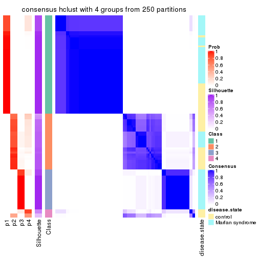</p>

</div>
<div id='tab-ATC-hclust-consensus-heatmap-4'>
<pre><code class="r">consensus_heatmap(res, k = 5)
</code></pre>

<p></p>

</div>
<div id='tab-ATC-hclust-consensus-heatmap-5'>
<pre><code class="r">consensus_heatmap(res, k = 6)
</code></pre>

<p></p>

</div>
</div>

Heatmaps for the membership of samples in all partitions to see how consistent they are:


<script>
$( function() {
	$( '#tabs-ATC-hclust-membership-heatmap' ).tabs();
} );
</script>
<div id='tabs-ATC-hclust-membership-heatmap'>
<ul>
<li><a href='#tab-ATC-hclust-membership-heatmap-1'>k = 2</a></li>
<li><a href='#tab-ATC-hclust-membership-heatmap-2'>k = 3</a></li>
<li><a href='#tab-ATC-hclust-membership-heatmap-3'>k = 4</a></li>
<li><a href='#tab-ATC-hclust-membership-heatmap-4'>k = 5</a></li>
<li><a href='#tab-ATC-hclust-membership-heatmap-5'>k = 6</a></li>
</ul>
<div id='tab-ATC-hclust-membership-heatmap-1'>
<pre><code class="r">membership_heatmap(res, k = 2)
</code></pre>

<p></p>

</div>
<div id='tab-ATC-hclust-membership-heatmap-2'>
<pre><code class="r">membership_heatmap(res, k = 3)
</code></pre>

<p></p>

</div>
<div id='tab-ATC-hclust-membership-heatmap-3'>
<pre><code class="r">membership_heatmap(res, k = 4)
</code></pre>

<p></p>

</div>
<div id='tab-ATC-hclust-membership-heatmap-4'>
<pre><code class="r">membership_heatmap(res, k = 5)
</code></pre>

<p></p>

</div>
<div id='tab-ATC-hclust-membership-heatmap-5'>
<pre><code class="r">membership_heatmap(res, k = 6)
</code></pre>

<p></p>

</div>
</div>

As soon as we have had the classes for columns, we can look for signatures
which are significantly different between classes which can be candidate marks
for certain classes. Following are the heatmaps for signatures.


Signature heatmaps where rows are scaled:


<script>
$( function() {
	$( '#tabs-ATC-hclust-get-signatures' ).tabs();
} );
</script>
<div id='tabs-ATC-hclust-get-signatures'>
<ul>
<li><a href='#tab-ATC-hclust-get-signatures-1'>k = 2</a></li>
<li><a href='#tab-ATC-hclust-get-signatures-2'>k = 3</a></li>
<li><a href='#tab-ATC-hclust-get-signatures-3'>k = 4</a></li>
<li><a href='#tab-ATC-hclust-get-signatures-4'>k = 5</a></li>
<li><a href='#tab-ATC-hclust-get-signatures-5'>k = 6</a></li>
</ul>
<div id='tab-ATC-hclust-get-signatures-1'>
<pre><code class="r">get_signatures(res, k = 2)
</code></pre>

<p></p>

</div>
<div id='tab-ATC-hclust-get-signatures-2'>
<pre><code class="r">get_signatures(res, k = 3)
</code></pre>

<p></p>

</div>
<div id='tab-ATC-hclust-get-signatures-3'>
<pre><code class="r">get_signatures(res, k = 4)
</code></pre>

<p></p>

</div>
<div id='tab-ATC-hclust-get-signatures-4'>
<pre><code class="r">get_signatures(res, k = 5)
</code></pre>

<p></p>

</div>
<div id='tab-ATC-hclust-get-signatures-5'>
<pre><code class="r">get_signatures(res, k = 6)
</code></pre>

<p></p>

</div>
</div>


Signature heatmaps where rows are not scaled:


<script>
$( function() {
	$( '#tabs-ATC-hclust-get-signatures-no-scale' ).tabs();
} );
</script>
<div id='tabs-ATC-hclust-get-signatures-no-scale'>
<ul>
<li><a href='#tab-ATC-hclust-get-signatures-no-scale-1'>k = 2</a></li>
<li><a href='#tab-ATC-hclust-get-signatures-no-scale-2'>k = 3</a></li>
<li><a href='#tab-ATC-hclust-get-signatures-no-scale-3'>k = 4</a></li>
<li><a href='#tab-ATC-hclust-get-signatures-no-scale-4'>k = 5</a></li>
<li><a href='#tab-ATC-hclust-get-signatures-no-scale-5'>k = 6</a></li>
</ul>
<div id='tab-ATC-hclust-get-signatures-no-scale-1'>
<pre><code class="r">get_signatures(res, k = 2, scale_rows = FALSE)
</code></pre>

<p></p>

</div>
<div id='tab-ATC-hclust-get-signatures-no-scale-2'>
<pre><code class="r">get_signatures(res, k = 3, scale_rows = FALSE)
</code></pre>

<p></p>

</div>
<div id='tab-ATC-hclust-get-signatures-no-scale-3'>
<pre><code class="r">get_signatures(res, k = 4, scale_rows = FALSE)
</code></pre>

<p></p>

</div>
<div id='tab-ATC-hclust-get-signatures-no-scale-4'>
<pre><code class="r">get_signatures(res, k = 5, scale_rows = FALSE)
</code></pre>

<p></p>

</div>
<div id='tab-ATC-hclust-get-signatures-no-scale-5'>
<pre><code class="r">get_signatures(res, k = 6, scale_rows = FALSE)
</code></pre>

<p></p>

</div>
</div>


Compare the overlap of signatures from different k:

```r
compare_signatures(res)
```


`get_signature()` returns a data frame invisibly. TO get the list of signatures, the function
call should be assigned to a variable explicitly. In following code, if `plot` argument is set
to `FALSE`, no heatmap is plotted while only the differential analysis is performed.

```r
# code only for demonstration
tb = get_signature(res, k = ..., plot = FALSE)
```

An example of the output of `tb` is:

```
#>   which_row         fdr    mean_1    mean_2 scaled_mean_1 scaled_mean_2 km
#> 1        38 0.042760348  8.373488  9.131774    -0.5533452     0.5164555  1
#> 2        40 0.018707592  7.106213  8.469186    -0.6173731     0.5762149  1
#> 3        55 0.019134737 10.221463 11.207825    -0.6159697     0.5749050  1
#> 4        59 0.006059896  5.921854  7.869574    -0.6899429     0.6439467  1
#> 5        60 0.018055526  8.928898 10.211722    -0.6204761     0.5791110  1
#> 6        98 0.009384629 15.714769 14.887706     0.6635654    -0.6193277  2
...
```

The columns in `tb` are:

1. `which_row`: row indices corresponding to the input matrix.
2. `fdr`: FDR for the differential test. 
3. `mean_x`: The mean value in group x.
4. `scaled_mean_x`: The mean value in group x after rows are scaled.
5. `km`: Row groups if k-means clustering is applied to rows.


UMAP plot which shows how samples are separated.


<script>
$( function() {
	$( '#tabs-ATC-hclust-dimension-reduction' ).tabs();
} );
</script>
<div id='tabs-ATC-hclust-dimension-reduction'>
<ul>
<li><a href='#tab-ATC-hclust-dimension-reduction-1'>k = 2</a></li>
<li><a href='#tab-ATC-hclust-dimension-reduction-2'>k = 3</a></li>
<li><a href='#tab-ATC-hclust-dimension-reduction-3'>k = 4</a></li>
<li><a href='#tab-ATC-hclust-dimension-reduction-4'>k = 5</a></li>
<li><a href='#tab-ATC-hclust-dimension-reduction-5'>k = 6</a></li>
</ul>
<div id='tab-ATC-hclust-dimension-reduction-1'>
<pre><code class="r">dimension_reduction(res, k = 2, method = &quot;UMAP&quot;)
</code></pre>

<p></p>

</div>
<div id='tab-ATC-hclust-dimension-reduction-2'>
<pre><code class="r">dimension_reduction(res, k = 3, method = &quot;UMAP&quot;)
</code></pre>

<p></p>

</div>
<div id='tab-ATC-hclust-dimension-reduction-3'>
<pre><code class="r">dimension_reduction(res, k = 4, method = &quot;UMAP&quot;)
</code></pre>

<p>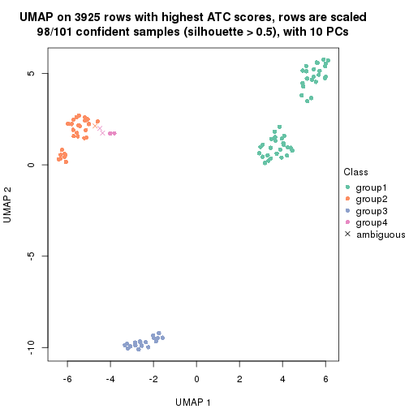</p>

</div>
<div id='tab-ATC-hclust-dimension-reduction-4'>
<pre><code class="r">dimension_reduction(res, k = 5, method = &quot;UMAP&quot;)
</code></pre>

<p></p>

</div>
<div id='tab-ATC-hclust-dimension-reduction-5'>
<pre><code class="r">dimension_reduction(res, k = 6, method = &quot;UMAP&quot;)
</code></pre>

<p></p>

</div>
</div>


Following heatmap shows how subgroups are split when increasing `k`:

```r
collect_classes(res)
```


Test correlation between subgroups and known annotations. If the known
annotation is numeric, one-way ANOVA test is applied, and if the known
annotation is discrete, chi-squared contingency table test is applied.

```r
test_to_known_factors(res)
```

```
#>              n disease.state(p) k
#> ATC:hclust 101         3.32e-01 2
#> ATC:hclust  49               NA 3
#> ATC:hclust  98         4.58e-06 4
#> ATC:hclust  77         1.96e-03 5
#> ATC:hclust  97         2.43e-11 6
```


If matrix rows can be associated to genes, consider to use `functional_enrichment(res,
...)` to perform function enrichment for the signature genes. See [this vignette](http://bioconductor.org/packages/devel/bioc/vignettes/cola/inst/doc/functional_enrichment.html) for more detailed explanations.


 

---------------------------------------------------


### ATC:kmeans**


The object with results only for a single top-value method and a single partition method 
can be extracted as:

```r
res = res_list["ATC", "kmeans"]
# you can also extract it by
# res = res_list["ATC:kmeans"]
```

A summary of `res` and all the functions that can be applied to it:

```r
res
```

```
#> A 'ConsensusPartition' object with k = 2, 3, 4, 5, 6.
#>   On a matrix with 3925 rows and 101 columns.
#>   Top rows (392, 784, 1177, 1570, 1962) are extracted by 'ATC' method.
#>   Subgroups are detected by 'kmeans' method.
#>   Performed in total 1250 partitions by row resampling.
#>   Best k for subgroups seems to be 2.
#> 
#> Following methods can be applied to this 'ConsensusPartition' object:
#>  [1] "cola_report"             "collect_classes"         "collect_plots"          
#>  [4] "collect_stats"           "colnames"                "compare_signatures"     
#>  [7] "consensus_heatmap"       "dimension_reduction"     "functional_enrichment"  
#> [10] "get_anno_col"            "get_anno"                "get_classes"            
#> [13] "get_consensus"           "get_matrix"              "get_membership"         
#> [16] "get_param"               "get_signatures"          "get_stats"              
#> [19] "is_best_k"               "is_stable_k"             "membership_heatmap"     
#> [22] "ncol"                    "nrow"                    "plot_ecdf"              
#> [25] "rownames"                "select_partition_number" "show"                   
#> [28] "suggest_best_k"          "test_to_known_factors"
```

`collect_plots()` function collects all the plots made from `res` for all `k` (number of partitions)
into one single page to provide an easy and fast comparison between different `k`.

```r
collect_plots(res)
```


The plots are:

- The first row: a plot of the ECDF (empirical cumulative distribution
  function) curves of the consensus matrix for each `k` and the heatmap of
  predicted classes for each `k`.
- The second row: heatmaps of the consensus matrix for each `k`.
- The third row: heatmaps of the membership matrix for each `k`.
- The fouth row: heatmaps of the signatures for each `k`.

All the plots in panels can be made by individual functions and they are
plotted later in this section.

`select_partition_number()` produces several plots showing different
statistics for choosing "optimized" `k`. There are following statistics:

- ECDF curves of the consensus matrix for each `k`;
- 1-PAC. [The PAC
  score](https://en.wikipedia.org/wiki/Consensus_clustering#Over-interpretation_potential_of_consensus_clustering)
  measures the proportion of the ambiguous subgrouping.
- Mean silhouette score.
- Concordance. The mean probability of fiting the consensus class ids in all
  partitions.
- Area increased. Denote $A_k$ as the area under the ECDF curve for current
  `k`, the area increased is defined as $A_k - A_{k-1}$.
- Rand index. The percent of pairs of samples that are both in a same cluster
  or both are not in a same cluster in the partition of k and k-1.
- Jaccard index. The ratio of pairs of samples are both in a same cluster in
  the partition of k and k-1 and the pairs of samples are both in a same
  cluster in the partition k or k-1.

The detailed explanations of these statistics can be found in [the _cola_
vignette](http://bioconductor.org/packages/devel/bioc/vignettes/cola/inst/doc/cola.html#toc_13).

Generally speaking, lower PAC score, higher mean silhouette score or higher
concordance corresponds to better partition. Rand index and Jaccard index
measure how similar the current partition is compared to partition with `k-1`.
If they are too similar, we won't accept `k` is better than `k-1`.

```r
select_partition_number(res)
```


The numeric values for all these statistics can be obtained by `get_stats()`.

```r
get_stats(res)
```

```
#>   k 1-PAC mean_silhouette concordance area_increased  Rand Jaccard
#> 2 2 1.000           0.998       0.998         0.5050 0.495   0.495
#> 3 3 0.744           0.871       0.772         0.2428 0.873   0.744
#> 4 4 0.664           0.885       0.816         0.1288 0.870   0.653
#> 5 5 0.771           0.802       0.832         0.0735 0.970   0.886
#> 6 6 0.853           0.787       0.818         0.0485 0.960   0.832
```

`suggest_best_k()` suggests the best $k$ based on these statistics. The rules are as follows:

- All $k$ with Jaccard index larger than 0.95 are removed because increasing
  $k$ does not provide enough extra information. If all $k$ are removed, it is
  marked as no subgroup is detected.
- For all $k$ with 1-PAC score larger than 0.9, the maximal $k$ is taken as
  the best $k$, and other $k$ are marked as optional $k$.
- If it does not fit the second rule. The $k$ with the maximal vote of the
  highest 1-PAC score, highest mean silhouette, and highest concordance is
  taken as the best $k$.

```r
suggest_best_k(res)
```

```
#> [1] 2
```


Following shows the table of the partitions (You need to click the **show/hide
code output** link to see it). The membership matrix (columns with name `p*`)
is inferred by
[`clue::cl_consensus()`](https://www.rdocumentation.org/link/cl_consensus?package=clue)
function with the `SE` method. Basically the value in the membership matrix
represents the probability to belong to a certain group. The finall class
label for an item is determined with the group with highest probability it
belongs to.

In `get_classes()` function, the entropy is calculated from the membership
matrix and the silhouette score is calculated from the consensus matrix.


<script>
$( function() {
	$( '#tabs-ATC-kmeans-get-classes' ).tabs();
} );
</script>
<div id='tabs-ATC-kmeans-get-classes'>
<ul>
<li><a href='#tab-ATC-kmeans-get-classes-1'>k = 2</a></li>
<li><a href='#tab-ATC-kmeans-get-classes-2'>k = 3</a></li>
<li><a href='#tab-ATC-kmeans-get-classes-3'>k = 4</a></li>
<li><a href='#tab-ATC-kmeans-get-classes-4'>k = 5</a></li>
<li><a href='#tab-ATC-kmeans-get-classes-5'>k = 6</a></li>
</ul>

<div id='tab-ATC-kmeans-get-classes-1'>
<p><a id='tab-ATC-kmeans-get-classes-1-a' style='color:#0366d6' href='#'>show/hide code output</a></p>
<pre><code class="r">cbind(get_classes(res, k = 2), get_membership(res, k = 2))
</code></pre>

<pre><code>#&gt;           class entropy silhouette    p1    p2
#&gt; GSM217644     2  0.0000      0.998 0.000 1.000
#&gt; GSM217645     2  0.0000      0.998 0.000 1.000
#&gt; GSM217646     2  0.0000      0.998 0.000 1.000
#&gt; GSM217647     2  0.0000      0.998 0.000 1.000
#&gt; GSM217648     2  0.0000      0.998 0.000 1.000
#&gt; GSM217649     2  0.0000      0.998 0.000 1.000
#&gt; GSM217650     2  0.0000      0.998 0.000 1.000
#&gt; GSM217651     2  0.0000      0.998 0.000 1.000
#&gt; GSM217652     2  0.0000      0.998 0.000 1.000
#&gt; GSM217653     2  0.0000      0.998 0.000 1.000
#&gt; GSM217654     2  0.0000      0.998 0.000 1.000
#&gt; GSM217655     2  0.0000      0.998 0.000 1.000
#&gt; GSM217656     2  0.0000      0.998 0.000 1.000
#&gt; GSM217657     2  0.0000      0.998 0.000 1.000
#&gt; GSM217658     2  0.0000      0.998 0.000 1.000
#&gt; GSM217659     2  0.0000      0.998 0.000 1.000
#&gt; GSM217660     2  0.0000      0.998 0.000 1.000
#&gt; GSM217661     2  0.0000      0.998 0.000 1.000
#&gt; GSM217662     2  0.0000      0.998 0.000 1.000
#&gt; GSM217663     2  0.0000      0.998 0.000 1.000
#&gt; GSM217664     2  0.0000      0.998 0.000 1.000
#&gt; GSM217665     2  0.0000      0.998 0.000 1.000
#&gt; GSM217666     2  0.0000      0.998 0.000 1.000
#&gt; GSM217667     2  0.0000      0.998 0.000 1.000
#&gt; GSM217668     1  0.0376      0.998 0.996 0.004
#&gt; GSM217669     1  0.0376      0.998 0.996 0.004
#&gt; GSM217670     1  0.0376      0.998 0.996 0.004
#&gt; GSM217671     1  0.0376      0.998 0.996 0.004
#&gt; GSM217672     1  0.0376      0.998 0.996 0.004
#&gt; GSM217673     1  0.0376      0.998 0.996 0.004
#&gt; GSM217674     1  0.0000      0.998 1.000 0.000
#&gt; GSM217675     1  0.0000      0.998 1.000 0.000
#&gt; GSM217676     1  0.0000      0.998 1.000 0.000
#&gt; GSM217677     1  0.0000      0.998 1.000 0.000
#&gt; GSM217678     1  0.0000      0.998 1.000 0.000
#&gt; GSM217679     1  0.0000      0.998 1.000 0.000
#&gt; GSM217680     1  0.0000      0.998 1.000 0.000
#&gt; GSM217681     1  0.0000      0.998 1.000 0.000
#&gt; GSM217682     1  0.0000      0.998 1.000 0.000
#&gt; GSM217683     1  0.0000      0.998 1.000 0.000
#&gt; GSM217684     1  0.0376      0.998 0.996 0.004
#&gt; GSM217685     2  0.0376      0.997 0.004 0.996
#&gt; GSM217686     2  0.0376      0.997 0.004 0.996
#&gt; GSM217687     2  0.0376      0.997 0.004 0.996
#&gt; GSM217688     2  0.0376      0.997 0.004 0.996
#&gt; GSM217689     2  0.0376      0.997 0.004 0.996
#&gt; GSM217690     2  0.0376      0.997 0.004 0.996
#&gt; GSM217691     2  0.0376      0.997 0.004 0.996
#&gt; GSM217692     2  0.0376      0.997 0.004 0.996
#&gt; GSM217693     2  0.0376      0.997 0.004 0.996
#&gt; GSM217694     2  0.0376      0.997 0.004 0.996
#&gt; GSM217695     2  0.0376      0.997 0.004 0.996
#&gt; GSM217696     2  0.0376      0.997 0.004 0.996
#&gt; GSM217697     2  0.0376      0.997 0.004 0.996
#&gt; GSM217698     2  0.0376      0.997 0.004 0.996
#&gt; GSM217699     2  0.0376      0.997 0.004 0.996
#&gt; GSM217700     2  0.0376      0.997 0.004 0.996
#&gt; GSM217701     2  0.0376      0.997 0.004 0.996
#&gt; GSM217702     2  0.0376      0.997 0.004 0.996
#&gt; GSM217703     2  0.0376      0.997 0.004 0.996
#&gt; GSM217704     2  0.0376      0.997 0.004 0.996
#&gt; GSM217705     1  0.0376      0.998 0.996 0.004
#&gt; GSM217706     1  0.0376      0.998 0.996 0.004
#&gt; GSM217707     1  0.0376      0.998 0.996 0.004
#&gt; GSM217708     1  0.0000      0.998 1.000 0.000
#&gt; GSM217709     1  0.0376      0.998 0.996 0.004
#&gt; GSM217710     1  0.0376      0.998 0.996 0.004
#&gt; GSM217711     1  0.0376      0.998 0.996 0.004
#&gt; GSM217712     1  0.0376      0.998 0.996 0.004
#&gt; GSM217713     1  0.0376      0.998 0.996 0.004
#&gt; GSM217714     1  0.0376      0.998 0.996 0.004
#&gt; GSM217715     1  0.0376      0.998 0.996 0.004
#&gt; GSM217716     1  0.0376      0.998 0.996 0.004
#&gt; GSM217717     1  0.0376      0.998 0.996 0.004
#&gt; GSM217718     1  0.0376      0.998 0.996 0.004
#&gt; GSM217719     1  0.0376      0.998 0.996 0.004
#&gt; GSM217720     1  0.0376      0.998 0.996 0.004
#&gt; GSM217721     1  0.0376      0.998 0.996 0.004
#&gt; GSM217722     1  0.0376      0.998 0.996 0.004
#&gt; GSM217723     1  0.0000      0.998 1.000 0.000
#&gt; GSM217724     1  0.0000      0.998 1.000 0.000
#&gt; GSM217725     1  0.0000      0.998 1.000 0.000
#&gt; GSM217726     1  0.0000      0.998 1.000 0.000
#&gt; GSM217727     1  0.0000      0.998 1.000 0.000
#&gt; GSM217728     1  0.0000      0.998 1.000 0.000
#&gt; GSM217729     1  0.0000      0.998 1.000 0.000
#&gt; GSM217730     1  0.0000      0.998 1.000 0.000
#&gt; GSM217731     1  0.0000      0.998 1.000 0.000
#&gt; GSM217732     1  0.0000      0.998 1.000 0.000
#&gt; GSM217733     1  0.0000      0.998 1.000 0.000
#&gt; GSM217734     1  0.0000      0.998 1.000 0.000
#&gt; GSM217735     1  0.0000      0.998 1.000 0.000
#&gt; GSM217736     1  0.0000      0.998 1.000 0.000
#&gt; GSM217737     2  0.0000      0.998 0.000 1.000
#&gt; GSM217738     2  0.0000      0.998 0.000 1.000
#&gt; GSM217739     2  0.0000      0.998 0.000 1.000
#&gt; GSM217740     2  0.0000      0.998 0.000 1.000
#&gt; GSM217741     2  0.0000      0.998 0.000 1.000
#&gt; GSM217742     2  0.0000      0.998 0.000 1.000
#&gt; GSM217743     2  0.0000      0.998 0.000 1.000
#&gt; GSM217744     2  0.0000      0.998 0.000 1.000
</code></pre>

<script>
$('#tab-ATC-kmeans-get-classes-1-a').parent().next().next().hide();
$('#tab-ATC-kmeans-get-classes-1-a').click(function(){
  $('#tab-ATC-kmeans-get-classes-1-a').parent().next().next().toggle();
  return(false);
});
</script>
</div>

<div id='tab-ATC-kmeans-get-classes-2'>
<p><a id='tab-ATC-kmeans-get-classes-2-a' style='color:#0366d6' href='#'>show/hide code output</a></p>
<pre><code class="r">cbind(get_classes(res, k = 3), get_membership(res, k = 3))
</code></pre>

<pre><code>#&gt;           class entropy silhouette    p1    p2    p3
#&gt; GSM217644     2  0.1411      0.929 0.000 0.964 0.036
#&gt; GSM217645     2  0.1411      0.929 0.000 0.964 0.036
#&gt; GSM217646     2  0.1411      0.929 0.000 0.964 0.036
#&gt; GSM217647     2  0.1031      0.926 0.000 0.976 0.024
#&gt; GSM217648     2  0.1031      0.926 0.000 0.976 0.024
#&gt; GSM217649     2  0.1411      0.929 0.000 0.964 0.036
#&gt; GSM217650     2  0.1411      0.929 0.000 0.964 0.036
#&gt; GSM217651     2  0.1289      0.930 0.000 0.968 0.032
#&gt; GSM217652     2  0.1411      0.929 0.000 0.964 0.036
#&gt; GSM217653     2  0.1031      0.926 0.000 0.976 0.024
#&gt; GSM217654     2  0.1753      0.919 0.000 0.952 0.048
#&gt; GSM217655     2  0.1753      0.919 0.000 0.952 0.048
#&gt; GSM217656     2  0.6796      0.368 0.236 0.708 0.056
#&gt; GSM217657     2  0.2261      0.900 0.000 0.932 0.068
#&gt; GSM217658     2  0.1411      0.929 0.000 0.964 0.036
#&gt; GSM217659     2  0.1411      0.929 0.000 0.964 0.036
#&gt; GSM217660     2  0.1860      0.927 0.000 0.948 0.052
#&gt; GSM217661     2  0.1411      0.929 0.000 0.964 0.036
#&gt; GSM217662     2  0.1031      0.926 0.000 0.976 0.024
#&gt; GSM217663     2  0.1411      0.929 0.000 0.964 0.036
#&gt; GSM217664     2  0.1163      0.929 0.000 0.972 0.028
#&gt; GSM217665     2  0.0424      0.924 0.000 0.992 0.008
#&gt; GSM217666     2  0.1031      0.926 0.000 0.976 0.024
#&gt; GSM217667     2  0.1031      0.926 0.000 0.976 0.024
#&gt; GSM217668     1  0.0000      0.810 1.000 0.000 0.000
#&gt; GSM217669     1  0.0000      0.810 1.000 0.000 0.000
#&gt; GSM217670     1  0.0000      0.810 1.000 0.000 0.000
#&gt; GSM217671     1  0.0000      0.810 1.000 0.000 0.000
#&gt; GSM217672     1  0.0000      0.810 1.000 0.000 0.000
#&gt; GSM217673     1  0.0000      0.810 1.000 0.000 0.000
#&gt; GSM217674     1  0.6215      0.799 0.572 0.000 0.428
#&gt; GSM217675     1  0.6215      0.799 0.572 0.000 0.428
#&gt; GSM217676     1  0.6215      0.799 0.572 0.000 0.428
#&gt; GSM217677     1  0.6215      0.799 0.572 0.000 0.428
#&gt; GSM217678     1  0.6215      0.799 0.572 0.000 0.428
#&gt; GSM217679     1  0.6215      0.799 0.572 0.000 0.428
#&gt; GSM217680     1  0.6215      0.799 0.572 0.000 0.428
#&gt; GSM217681     1  0.6215      0.799 0.572 0.000 0.428
#&gt; GSM217682     1  0.6215      0.799 0.572 0.000 0.428
#&gt; GSM217683     1  0.6215      0.799 0.572 0.000 0.428
#&gt; GSM217684     1  0.4399      0.805 0.812 0.000 0.188
#&gt; GSM217685     3  0.6215      0.984 0.000 0.428 0.572
#&gt; GSM217686     3  0.6267      0.958 0.000 0.452 0.548
#&gt; GSM217687     3  0.6215      0.984 0.000 0.428 0.572
#&gt; GSM217688     3  0.6215      0.984 0.000 0.428 0.572
#&gt; GSM217689     3  0.6215      0.984 0.000 0.428 0.572
#&gt; GSM217690     3  0.6225      0.982 0.000 0.432 0.568
#&gt; GSM217691     3  0.6225      0.982 0.000 0.432 0.568
#&gt; GSM217692     3  0.6267      0.958 0.000 0.452 0.548
#&gt; GSM217693     3  0.6244      0.973 0.000 0.440 0.560
#&gt; GSM217694     3  0.6225      0.982 0.000 0.432 0.568
#&gt; GSM217695     3  0.6215      0.984 0.000 0.428 0.572
#&gt; GSM217696     3  0.6267      0.958 0.000 0.452 0.548
#&gt; GSM217697     3  0.6267      0.958 0.000 0.452 0.548
#&gt; GSM217698     3  0.6215      0.984 0.000 0.428 0.572
#&gt; GSM217699     3  0.6215      0.984 0.000 0.428 0.572
#&gt; GSM217700     3  0.6225      0.982 0.000 0.432 0.568
#&gt; GSM217701     3  0.6260      0.956 0.000 0.448 0.552
#&gt; GSM217702     3  0.6225      0.982 0.000 0.432 0.568
#&gt; GSM217703     3  0.6215      0.984 0.000 0.428 0.572
#&gt; GSM217704     3  0.6225      0.982 0.000 0.432 0.568
#&gt; GSM217705     1  0.0000      0.810 1.000 0.000 0.000
#&gt; GSM217706     1  0.0000      0.810 1.000 0.000 0.000
#&gt; GSM217707     1  0.0000      0.810 1.000 0.000 0.000
#&gt; GSM217708     1  0.0000      0.810 1.000 0.000 0.000
#&gt; GSM217709     1  0.0000      0.810 1.000 0.000 0.000
#&gt; GSM217710     1  0.0000      0.810 1.000 0.000 0.000
#&gt; GSM217711     1  0.0000      0.810 1.000 0.000 0.000
#&gt; GSM217712     1  0.0000      0.810 1.000 0.000 0.000
#&gt; GSM217713     1  0.0000      0.810 1.000 0.000 0.000
#&gt; GSM217714     1  0.0000      0.810 1.000 0.000 0.000
#&gt; GSM217715     1  0.0000      0.810 1.000 0.000 0.000
#&gt; GSM217716     1  0.0000      0.810 1.000 0.000 0.000
#&gt; GSM217717     1  0.0000      0.810 1.000 0.000 0.000
#&gt; GSM217718     1  0.0000      0.810 1.000 0.000 0.000
#&gt; GSM217719     1  0.0000      0.810 1.000 0.000 0.000
#&gt; GSM217720     1  0.0000      0.810 1.000 0.000 0.000
#&gt; GSM217721     1  0.0000      0.810 1.000 0.000 0.000
#&gt; GSM217722     1  0.0000      0.810 1.000 0.000 0.000
#&gt; GSM217723     1  0.4605      0.804 0.796 0.000 0.204
#&gt; GSM217724     1  0.6204      0.799 0.576 0.000 0.424
#&gt; GSM217725     1  0.6215      0.799 0.572 0.000 0.428
#&gt; GSM217726     1  0.6215      0.799 0.572 0.000 0.428
#&gt; GSM217727     1  0.6215      0.799 0.572 0.000 0.428
#&gt; GSM217728     1  0.6215      0.799 0.572 0.000 0.428
#&gt; GSM217729     1  0.6215      0.799 0.572 0.000 0.428
#&gt; GSM217730     1  0.6215      0.799 0.572 0.000 0.428
#&gt; GSM217731     1  0.6215      0.799 0.572 0.000 0.428
#&gt; GSM217732     1  0.6215      0.799 0.572 0.000 0.428
#&gt; GSM217733     1  0.6215      0.799 0.572 0.000 0.428
#&gt; GSM217734     1  0.6215      0.799 0.572 0.000 0.428
#&gt; GSM217735     1  0.6215      0.799 0.572 0.000 0.428
#&gt; GSM217736     1  0.6215      0.799 0.572 0.000 0.428
#&gt; GSM217737     2  0.1529      0.918 0.000 0.960 0.040
#&gt; GSM217738     2  0.1529      0.918 0.000 0.960 0.040
#&gt; GSM217739     2  0.1411      0.921 0.000 0.964 0.036
#&gt; GSM217740     2  0.1411      0.921 0.000 0.964 0.036
#&gt; GSM217741     2  0.1411      0.921 0.000 0.964 0.036
#&gt; GSM217742     2  0.1411      0.921 0.000 0.964 0.036
#&gt; GSM217743     2  0.1411      0.921 0.000 0.964 0.036
#&gt; GSM217744     2  0.1411      0.921 0.000 0.964 0.036
</code></pre>

<script>
$('#tab-ATC-kmeans-get-classes-2-a').parent().next().next().hide();
$('#tab-ATC-kmeans-get-classes-2-a').click(function(){
  $('#tab-ATC-kmeans-get-classes-2-a').parent().next().next().toggle();
  return(false);
});
</script>
</div>

<div id='tab-ATC-kmeans-get-classes-3'>
<p><a id='tab-ATC-kmeans-get-classes-3-a' style='color:#0366d6' href='#'>show/hide code output</a></p>
<pre><code class="r">cbind(get_classes(res, k = 4), get_membership(res, k = 4))
</code></pre>

<pre><code>#&gt;           class entropy silhouette    p1    p2    p3    p4
#&gt; GSM217644     2  0.3399      0.888 0.000 0.868 0.040 0.092
#&gt; GSM217645     2  0.3399      0.888 0.000 0.868 0.040 0.092
#&gt; GSM217646     2  0.3333      0.889 0.000 0.872 0.040 0.088
#&gt; GSM217647     2  0.0000      0.884 0.000 1.000 0.000 0.000
#&gt; GSM217648     2  0.0000      0.884 0.000 1.000 0.000 0.000
#&gt; GSM217649     2  0.3333      0.889 0.000 0.872 0.040 0.088
#&gt; GSM217650     2  0.3333      0.889 0.000 0.872 0.040 0.088
#&gt; GSM217651     2  0.3243      0.890 0.000 0.876 0.036 0.088
#&gt; GSM217652     2  0.3333      0.889 0.000 0.872 0.040 0.088
#&gt; GSM217653     2  0.0000      0.884 0.000 1.000 0.000 0.000
#&gt; GSM217654     2  0.4907      0.813 0.000 0.764 0.060 0.176
#&gt; GSM217655     2  0.4907      0.813 0.000 0.764 0.060 0.176
#&gt; GSM217656     4  0.7256      0.288 0.020 0.176 0.196 0.608
#&gt; GSM217657     2  0.5714      0.750 0.000 0.716 0.128 0.156
#&gt; GSM217658     2  0.3333      0.889 0.000 0.872 0.040 0.088
#&gt; GSM217659     2  0.3333      0.889 0.000 0.872 0.040 0.088
#&gt; GSM217660     2  0.3243      0.890 0.000 0.876 0.036 0.088
#&gt; GSM217661     2  0.3399      0.888 0.000 0.868 0.040 0.092
#&gt; GSM217662     2  0.0000      0.884 0.000 1.000 0.000 0.000
#&gt; GSM217663     2  0.3333      0.889 0.000 0.872 0.040 0.088
#&gt; GSM217664     2  0.3243      0.890 0.000 0.876 0.036 0.088
#&gt; GSM217665     2  0.0000      0.884 0.000 1.000 0.000 0.000
#&gt; GSM217666     2  0.0000      0.884 0.000 1.000 0.000 0.000
#&gt; GSM217667     2  0.0000      0.884 0.000 1.000 0.000 0.000
#&gt; GSM217668     4  0.4564      0.938 0.328 0.000 0.000 0.672
#&gt; GSM217669     4  0.4564      0.938 0.328 0.000 0.000 0.672
#&gt; GSM217670     4  0.4564      0.938 0.328 0.000 0.000 0.672
#&gt; GSM217671     4  0.4564      0.938 0.328 0.000 0.000 0.672
#&gt; GSM217672     4  0.4564      0.938 0.328 0.000 0.000 0.672
#&gt; GSM217673     4  0.4564      0.938 0.328 0.000 0.000 0.672
#&gt; GSM217674     1  0.0817      0.922 0.976 0.000 0.024 0.000
#&gt; GSM217675     1  0.0817      0.922 0.976 0.000 0.024 0.000
#&gt; GSM217676     1  0.0707      0.923 0.980 0.000 0.020 0.000
#&gt; GSM217677     1  0.0336      0.926 0.992 0.000 0.008 0.000
#&gt; GSM217678     1  0.0707      0.923 0.980 0.000 0.020 0.000
#&gt; GSM217679     1  0.0817      0.922 0.976 0.000 0.024 0.000
#&gt; GSM217680     1  0.0707      0.923 0.980 0.000 0.020 0.000
#&gt; GSM217681     1  0.0469      0.925 0.988 0.000 0.012 0.000
#&gt; GSM217682     1  0.0921      0.921 0.972 0.000 0.028 0.000
#&gt; GSM217683     1  0.0921      0.921 0.972 0.000 0.028 0.000
#&gt; GSM217684     1  0.5781     -0.260 0.584 0.000 0.036 0.380
#&gt; GSM217685     3  0.3545      0.975 0.000 0.164 0.828 0.008
#&gt; GSM217686     3  0.3768      0.967 0.000 0.184 0.808 0.008
#&gt; GSM217687     3  0.3545      0.975 0.000 0.164 0.828 0.008
#&gt; GSM217688     3  0.3545      0.975 0.000 0.164 0.828 0.008
#&gt; GSM217689     3  0.4849      0.944 0.000 0.164 0.772 0.064
#&gt; GSM217690     3  0.4849      0.944 0.000 0.164 0.772 0.064
#&gt; GSM217691     3  0.3900      0.975 0.000 0.164 0.816 0.020
#&gt; GSM217692     3  0.4121      0.966 0.000 0.184 0.796 0.020
#&gt; GSM217693     3  0.4121      0.966 0.000 0.184 0.796 0.020
#&gt; GSM217694     3  0.3900      0.975 0.000 0.164 0.816 0.020
#&gt; GSM217695     3  0.3900      0.975 0.000 0.164 0.816 0.020
#&gt; GSM217696     3  0.4121      0.966 0.000 0.184 0.796 0.020
#&gt; GSM217697     3  0.4121      0.966 0.000 0.184 0.796 0.020
#&gt; GSM217698     3  0.3790      0.976 0.000 0.164 0.820 0.016
#&gt; GSM217699     3  0.3219      0.977 0.000 0.164 0.836 0.000
#&gt; GSM217700     3  0.3219      0.977 0.000 0.164 0.836 0.000
#&gt; GSM217701     3  0.3219      0.977 0.000 0.164 0.836 0.000
#&gt; GSM217702     3  0.3219      0.977 0.000 0.164 0.836 0.000
#&gt; GSM217703     3  0.4849      0.944 0.000 0.164 0.772 0.064
#&gt; GSM217704     3  0.3900      0.975 0.000 0.164 0.816 0.020
#&gt; GSM217705     4  0.4741      0.936 0.328 0.000 0.004 0.668
#&gt; GSM217706     4  0.4564      0.938 0.328 0.000 0.000 0.672
#&gt; GSM217707     4  0.4564      0.938 0.328 0.000 0.000 0.672
#&gt; GSM217708     4  0.6637      0.867 0.324 0.000 0.104 0.572
#&gt; GSM217709     4  0.6430      0.870 0.312 0.000 0.092 0.596
#&gt; GSM217710     4  0.6585      0.859 0.312 0.000 0.104 0.584
#&gt; GSM217711     4  0.6585      0.859 0.312 0.000 0.104 0.584
#&gt; GSM217712     4  0.4564      0.938 0.328 0.000 0.000 0.672
#&gt; GSM217713     4  0.4741      0.937 0.328 0.000 0.004 0.668
#&gt; GSM217714     4  0.4564      0.938 0.328 0.000 0.000 0.672
#&gt; GSM217715     4  0.4564      0.938 0.328 0.000 0.000 0.672
#&gt; GSM217716     4  0.4741      0.937 0.328 0.000 0.004 0.668
#&gt; GSM217717     4  0.4741      0.937 0.328 0.000 0.004 0.668
#&gt; GSM217718     4  0.6071      0.901 0.324 0.000 0.064 0.612
#&gt; GSM217719     4  0.5884      0.911 0.328 0.000 0.052 0.620
#&gt; GSM217720     4  0.4741      0.936 0.328 0.000 0.004 0.668
#&gt; GSM217721     4  0.5658      0.918 0.328 0.000 0.040 0.632
#&gt; GSM217722     4  0.4564      0.938 0.328 0.000 0.000 0.672
#&gt; GSM217723     1  0.6501     -0.071 0.588 0.000 0.096 0.316
#&gt; GSM217724     1  0.2412      0.869 0.908 0.000 0.084 0.008
#&gt; GSM217725     1  0.2266      0.873 0.912 0.000 0.084 0.004
#&gt; GSM217726     1  0.0817      0.922 0.976 0.000 0.024 0.000
#&gt; GSM217727     1  0.0817      0.922 0.976 0.000 0.024 0.000
#&gt; GSM217728     1  0.2125      0.880 0.920 0.000 0.076 0.004
#&gt; GSM217729     1  0.0592      0.924 0.984 0.000 0.016 0.000
#&gt; GSM217730     1  0.0592      0.924 0.984 0.000 0.016 0.000
#&gt; GSM217731     1  0.0592      0.924 0.984 0.000 0.016 0.000
#&gt; GSM217732     1  0.0336      0.926 0.992 0.000 0.008 0.000
#&gt; GSM217733     1  0.0592      0.924 0.984 0.000 0.016 0.000
#&gt; GSM217734     1  0.0336      0.926 0.992 0.000 0.008 0.000
#&gt; GSM217735     1  0.0336      0.926 0.992 0.000 0.008 0.000
#&gt; GSM217736     1  0.0000      0.926 1.000 0.000 0.000 0.000
#&gt; GSM217737     2  0.3048      0.834 0.000 0.876 0.016 0.108
#&gt; GSM217738     2  0.3048      0.834 0.000 0.876 0.016 0.108
#&gt; GSM217739     2  0.3048      0.834 0.000 0.876 0.016 0.108
#&gt; GSM217740     2  0.3048      0.834 0.000 0.876 0.016 0.108
#&gt; GSM217741     2  0.3048      0.834 0.000 0.876 0.016 0.108
#&gt; GSM217742     2  0.3048      0.834 0.000 0.876 0.016 0.108
#&gt; GSM217743     2  0.3048      0.834 0.000 0.876 0.016 0.108
#&gt; GSM217744     2  0.3048      0.834 0.000 0.876 0.016 0.108
</code></pre>

<script>
$('#tab-ATC-kmeans-get-classes-3-a').parent().next().next().hide();
$('#tab-ATC-kmeans-get-classes-3-a').click(function(){
  $('#tab-ATC-kmeans-get-classes-3-a').parent().next().next().toggle();
  return(false);
});
</script>
</div>

<div id='tab-ATC-kmeans-get-classes-4'>
<p><a id='tab-ATC-kmeans-get-classes-4-a' style='color:#0366d6' href='#'>show/hide code output</a></p>
<pre><code class="r">cbind(get_classes(res, k = 5), get_membership(res, k = 5))
</code></pre>

<pre><code>#&gt;           class entropy silhouette    p1    p2    p3    p4    p5
#&gt; GSM217644     2  0.1195      0.718 0.000 0.960 0.028 0.000 0.012
#&gt; GSM217645     2  0.1195      0.718 0.000 0.960 0.028 0.000 0.012
#&gt; GSM217646     2  0.0955      0.725 0.000 0.968 0.028 0.000 0.004
#&gt; GSM217647     2  0.3145      0.724 0.012 0.844 0.008 0.000 0.136
#&gt; GSM217648     2  0.3053      0.726 0.012 0.852 0.008 0.000 0.128
#&gt; GSM217649     2  0.0955      0.725 0.000 0.968 0.028 0.000 0.004
#&gt; GSM217650     2  0.0794      0.727 0.000 0.972 0.028 0.000 0.000
#&gt; GSM217651     2  0.1082      0.727 0.008 0.964 0.028 0.000 0.000
#&gt; GSM217652     2  0.0794      0.727 0.000 0.972 0.028 0.000 0.000
#&gt; GSM217653     2  0.3053      0.725 0.012 0.852 0.008 0.000 0.128
#&gt; GSM217654     2  0.6542     -0.158 0.104 0.592 0.056 0.000 0.248
#&gt; GSM217655     2  0.6542     -0.158 0.104 0.592 0.056 0.000 0.248
#&gt; GSM217656     5  0.8743      0.612 0.132 0.156 0.088 0.148 0.476
#&gt; GSM217657     5  0.7942      0.472 0.132 0.360 0.140 0.000 0.368
#&gt; GSM217658     2  0.0794      0.727 0.000 0.972 0.028 0.000 0.000
#&gt; GSM217659     2  0.0955      0.725 0.000 0.968 0.028 0.000 0.004
#&gt; GSM217660     2  0.1412      0.727 0.008 0.952 0.036 0.000 0.004
#&gt; GSM217661     2  0.0955      0.725 0.000 0.968 0.028 0.000 0.004
#&gt; GSM217662     2  0.3099      0.725 0.012 0.848 0.008 0.000 0.132
#&gt; GSM217663     2  0.1082      0.727 0.008 0.964 0.028 0.000 0.000
#&gt; GSM217664     2  0.0955      0.727 0.004 0.968 0.028 0.000 0.000
#&gt; GSM217665     2  0.2574      0.727 0.012 0.876 0.000 0.000 0.112
#&gt; GSM217666     2  0.3145      0.724 0.012 0.844 0.008 0.000 0.136
#&gt; GSM217667     2  0.3145      0.724 0.012 0.844 0.008 0.000 0.136
#&gt; GSM217668     4  0.0566      0.901 0.000 0.000 0.004 0.984 0.012
#&gt; GSM217669     4  0.0290      0.902 0.000 0.000 0.000 0.992 0.008
#&gt; GSM217670     4  0.0404      0.901 0.000 0.000 0.000 0.988 0.012
#&gt; GSM217671     4  0.0566      0.901 0.000 0.000 0.004 0.984 0.012
#&gt; GSM217672     4  0.0404      0.901 0.000 0.000 0.000 0.988 0.012
#&gt; GSM217673     4  0.0566      0.901 0.000 0.000 0.004 0.984 0.012
#&gt; GSM217674     1  0.4048      0.944 0.772 0.000 0.016 0.196 0.016
#&gt; GSM217675     1  0.4048      0.945 0.772 0.000 0.016 0.196 0.016
#&gt; GSM217676     1  0.4471      0.941 0.752 0.000 0.016 0.196 0.036
#&gt; GSM217677     1  0.3509      0.950 0.792 0.000 0.008 0.196 0.004
#&gt; GSM217678     1  0.4471      0.941 0.752 0.000 0.016 0.196 0.036
#&gt; GSM217679     1  0.3848      0.948 0.780 0.000 0.012 0.196 0.012
#&gt; GSM217680     1  0.4471      0.941 0.752 0.000 0.016 0.196 0.036
#&gt; GSM217681     1  0.3901      0.949 0.776 0.000 0.004 0.196 0.024
#&gt; GSM217682     1  0.4394      0.937 0.756 0.000 0.016 0.196 0.032
#&gt; GSM217683     1  0.4394      0.937 0.756 0.000 0.016 0.196 0.032
#&gt; GSM217684     4  0.5246      0.358 0.288 0.000 0.020 0.652 0.040
#&gt; GSM217685     3  0.2193      0.945 0.028 0.044 0.920 0.000 0.008
#&gt; GSM217686     3  0.2026      0.947 0.012 0.056 0.924 0.000 0.008
#&gt; GSM217687     3  0.2193      0.945 0.028 0.044 0.920 0.000 0.008
#&gt; GSM217688     3  0.2193      0.945 0.028 0.044 0.920 0.000 0.008
#&gt; GSM217689     3  0.3643      0.895 0.072 0.044 0.848 0.000 0.036
#&gt; GSM217690     3  0.3643      0.895 0.072 0.044 0.848 0.000 0.036
#&gt; GSM217691     3  0.2228      0.950 0.020 0.044 0.920 0.000 0.016
#&gt; GSM217692     3  0.2542      0.944 0.020 0.056 0.904 0.000 0.020
#&gt; GSM217693     3  0.2400      0.948 0.020 0.048 0.912 0.000 0.020
#&gt; GSM217694     3  0.2228      0.950 0.020 0.044 0.920 0.000 0.016
#&gt; GSM217695     3  0.2326      0.949 0.020 0.044 0.916 0.000 0.020
#&gt; GSM217696     3  0.2542      0.944 0.020 0.056 0.904 0.000 0.020
#&gt; GSM217697     3  0.2542      0.944 0.020 0.056 0.904 0.000 0.020
#&gt; GSM217698     3  0.2228      0.950 0.016 0.044 0.920 0.000 0.020
#&gt; GSM217699     3  0.1569      0.951 0.008 0.044 0.944 0.000 0.004
#&gt; GSM217700     3  0.1682      0.951 0.012 0.044 0.940 0.000 0.004
#&gt; GSM217701     3  0.2032      0.945 0.020 0.052 0.924 0.000 0.004
#&gt; GSM217702     3  0.1682      0.951 0.012 0.044 0.940 0.000 0.004
#&gt; GSM217703     3  0.3643      0.895 0.072 0.044 0.848 0.000 0.036
#&gt; GSM217704     3  0.2326      0.949 0.020 0.044 0.916 0.000 0.020
#&gt; GSM217705     4  0.0290      0.902 0.000 0.000 0.000 0.992 0.008
#&gt; GSM217706     4  0.0324      0.901 0.000 0.000 0.004 0.992 0.004
#&gt; GSM217707     4  0.0324      0.901 0.000 0.000 0.004 0.992 0.004
#&gt; GSM217708     4  0.3366      0.743 0.000 0.000 0.000 0.768 0.232
#&gt; GSM217709     4  0.3606      0.784 0.024 0.000 0.004 0.808 0.164
#&gt; GSM217710     4  0.4167      0.691 0.024 0.000 0.000 0.724 0.252
#&gt; GSM217711     4  0.4167      0.691 0.024 0.000 0.000 0.724 0.252
#&gt; GSM217712     4  0.0162      0.901 0.000 0.000 0.004 0.996 0.000
#&gt; GSM217713     4  0.0671      0.899 0.000 0.000 0.004 0.980 0.016
#&gt; GSM217714     4  0.0404      0.901 0.000 0.000 0.000 0.988 0.012
#&gt; GSM217715     4  0.0404      0.901 0.000 0.000 0.000 0.988 0.012
#&gt; GSM217716     4  0.0566      0.900 0.000 0.000 0.004 0.984 0.012
#&gt; GSM217717     4  0.0566      0.899 0.000 0.000 0.004 0.984 0.012
#&gt; GSM217718     4  0.2389      0.846 0.000 0.000 0.004 0.880 0.116
#&gt; GSM217719     4  0.1892      0.868 0.000 0.000 0.004 0.916 0.080
#&gt; GSM217720     4  0.0290      0.902 0.000 0.000 0.000 0.992 0.008
#&gt; GSM217721     4  0.1638      0.876 0.000 0.000 0.004 0.932 0.064
#&gt; GSM217722     4  0.0162      0.901 0.000 0.000 0.004 0.996 0.000
#&gt; GSM217723     4  0.6922     -0.124 0.308 0.000 0.016 0.464 0.212
#&gt; GSM217724     1  0.6336      0.799 0.588 0.000 0.016 0.200 0.196
#&gt; GSM217725     1  0.6309      0.804 0.592 0.000 0.016 0.196 0.196
#&gt; GSM217726     1  0.3848      0.948 0.780 0.000 0.012 0.196 0.012
#&gt; GSM217727     1  0.3848      0.948 0.780 0.000 0.012 0.196 0.012
#&gt; GSM217728     1  0.6193      0.821 0.608 0.000 0.016 0.196 0.180
#&gt; GSM217729     1  0.3840      0.950 0.780 0.000 0.008 0.196 0.016
#&gt; GSM217730     1  0.4022      0.949 0.772 0.000 0.008 0.196 0.024
#&gt; GSM217731     1  0.4295      0.945 0.760 0.000 0.012 0.196 0.032
#&gt; GSM217732     1  0.3387      0.951 0.796 0.000 0.004 0.196 0.004
#&gt; GSM217733     1  0.3933      0.950 0.776 0.000 0.008 0.196 0.020
#&gt; GSM217734     1  0.3509      0.950 0.792 0.000 0.004 0.196 0.008
#&gt; GSM217735     1  0.3387      0.951 0.796 0.000 0.004 0.196 0.004
#&gt; GSM217736     1  0.3231      0.951 0.800 0.000 0.000 0.196 0.004
#&gt; GSM217737     2  0.4658      0.565 0.000 0.576 0.016 0.000 0.408
#&gt; GSM217738     2  0.4658      0.565 0.000 0.576 0.016 0.000 0.408
#&gt; GSM217739     2  0.4658      0.565 0.000 0.576 0.016 0.000 0.408
#&gt; GSM217740     2  0.4658      0.565 0.000 0.576 0.016 0.000 0.408
#&gt; GSM217741     2  0.4658      0.565 0.000 0.576 0.016 0.000 0.408
#&gt; GSM217742     2  0.4658      0.565 0.000 0.576 0.016 0.000 0.408
#&gt; GSM217743     2  0.4658      0.565 0.000 0.576 0.016 0.000 0.408
#&gt; GSM217744     2  0.4658      0.565 0.000 0.576 0.016 0.000 0.408
</code></pre>

<script>
$('#tab-ATC-kmeans-get-classes-4-a').parent().next().next().hide();
$('#tab-ATC-kmeans-get-classes-4-a').click(function(){
  $('#tab-ATC-kmeans-get-classes-4-a').parent().next().next().toggle();
  return(false);
});
</script>
</div>

<div id='tab-ATC-kmeans-get-classes-5'>
<p><a id='tab-ATC-kmeans-get-classes-5-a' style='color:#0366d6' href='#'>show/hide code output</a></p>
<pre><code class="r">cbind(get_classes(res, k = 6), get_membership(res, k = 6))
</code></pre>

<pre><code>#&gt;           class entropy silhouette    p1    p2    p3    p4    p5    p6
#&gt; GSM217644     2  0.1210     0.7736 0.000 0.960 0.008 0.008 0.004 0.020
#&gt; GSM217645     2  0.1210     0.7736 0.000 0.960 0.008 0.008 0.004 0.020
#&gt; GSM217646     2  0.0862     0.7785 0.000 0.972 0.008 0.004 0.000 0.016
#&gt; GSM217647     2  0.3815     0.5895 0.000 0.788 0.008 0.040 0.156 0.008
#&gt; GSM217648     2  0.3527     0.5985 0.000 0.804 0.008 0.024 0.156 0.008
#&gt; GSM217649     2  0.0862     0.7785 0.000 0.972 0.008 0.004 0.000 0.016
#&gt; GSM217650     2  0.0976     0.7792 0.000 0.968 0.008 0.008 0.000 0.016
#&gt; GSM217651     2  0.1065     0.7738 0.000 0.964 0.008 0.020 0.000 0.008
#&gt; GSM217652     2  0.0976     0.7792 0.000 0.968 0.008 0.008 0.000 0.016
#&gt; GSM217653     2  0.3815     0.5895 0.000 0.788 0.008 0.040 0.156 0.008
#&gt; GSM217654     2  0.6853    -0.0281 0.000 0.476 0.016 0.040 0.240 0.228
#&gt; GSM217655     2  0.6782     0.0139 0.000 0.492 0.016 0.040 0.240 0.212
#&gt; GSM217656     6  0.6532     0.5042 0.000 0.088 0.012 0.096 0.256 0.548
#&gt; GSM217657     6  0.7632     0.3998 0.000 0.160 0.104 0.040 0.256 0.440
#&gt; GSM217658     2  0.0767     0.7792 0.000 0.976 0.008 0.004 0.000 0.012
#&gt; GSM217659     2  0.0862     0.7785 0.000 0.972 0.008 0.004 0.000 0.016
#&gt; GSM217660     2  0.1167     0.7721 0.000 0.960 0.012 0.020 0.000 0.008
#&gt; GSM217661     2  0.1210     0.7736 0.000 0.960 0.008 0.008 0.004 0.020
#&gt; GSM217662     2  0.3815     0.5895 0.000 0.788 0.008 0.040 0.156 0.008
#&gt; GSM217663     2  0.1065     0.7748 0.000 0.964 0.008 0.020 0.000 0.008
#&gt; GSM217664     2  0.0622     0.7785 0.000 0.980 0.008 0.012 0.000 0.000
#&gt; GSM217665     2  0.3497     0.6015 0.000 0.800 0.000 0.036 0.156 0.008
#&gt; GSM217666     2  0.3747     0.5895 0.000 0.792 0.008 0.036 0.156 0.008
#&gt; GSM217667     2  0.3747     0.5895 0.000 0.792 0.008 0.036 0.156 0.008
#&gt; GSM217668     4  0.2443     0.8521 0.096 0.000 0.000 0.880 0.020 0.004
#&gt; GSM217669     4  0.2163     0.8583 0.096 0.000 0.000 0.892 0.008 0.004
#&gt; GSM217670     4  0.1908     0.8583 0.096 0.000 0.000 0.900 0.004 0.000
#&gt; GSM217671     4  0.1908     0.8583 0.096 0.000 0.000 0.900 0.004 0.000
#&gt; GSM217672     4  0.1765     0.8582 0.096 0.000 0.000 0.904 0.000 0.000
#&gt; GSM217673     4  0.1908     0.8583 0.096 0.000 0.000 0.900 0.004 0.000
#&gt; GSM217674     1  0.1296     0.8966 0.952 0.000 0.004 0.000 0.032 0.012
#&gt; GSM217675     1  0.1657     0.8837 0.928 0.000 0.000 0.000 0.056 0.016
#&gt; GSM217676     1  0.2258     0.8832 0.896 0.000 0.000 0.000 0.044 0.060
#&gt; GSM217677     1  0.0653     0.9096 0.980 0.000 0.004 0.000 0.004 0.012
#&gt; GSM217678     1  0.2197     0.8820 0.900 0.000 0.000 0.000 0.044 0.056
#&gt; GSM217679     1  0.0665     0.9080 0.980 0.000 0.004 0.000 0.008 0.008
#&gt; GSM217680     1  0.2197     0.8820 0.900 0.000 0.000 0.000 0.044 0.056
#&gt; GSM217681     1  0.1168     0.9080 0.956 0.000 0.000 0.000 0.028 0.016
#&gt; GSM217682     1  0.1605     0.8921 0.936 0.000 0.004 0.000 0.044 0.016
#&gt; GSM217683     1  0.1605     0.8921 0.936 0.000 0.004 0.000 0.044 0.016
#&gt; GSM217684     4  0.5551     0.2664 0.404 0.000 0.004 0.504 0.068 0.020
#&gt; GSM217685     3  0.2948     0.8858 0.000 0.008 0.804 0.000 0.000 0.188
#&gt; GSM217686     3  0.2110     0.8978 0.000 0.012 0.900 0.004 0.000 0.084
#&gt; GSM217687     3  0.2915     0.8876 0.000 0.008 0.808 0.000 0.000 0.184
#&gt; GSM217688     3  0.2915     0.8876 0.000 0.008 0.808 0.000 0.000 0.184
#&gt; GSM217689     3  0.4039     0.8290 0.000 0.008 0.716 0.000 0.028 0.248
#&gt; GSM217690     3  0.4135     0.8275 0.000 0.012 0.712 0.000 0.028 0.248
#&gt; GSM217691     3  0.1553     0.8963 0.000 0.012 0.944 0.004 0.008 0.032
#&gt; GSM217692     3  0.0665     0.8905 0.000 0.008 0.980 0.004 0.008 0.000
#&gt; GSM217693     3  0.0810     0.8895 0.000 0.008 0.976 0.004 0.004 0.008
#&gt; GSM217694     3  0.1553     0.8963 0.000 0.012 0.944 0.004 0.008 0.032
#&gt; GSM217695     3  0.0665     0.8904 0.000 0.008 0.980 0.000 0.004 0.008
#&gt; GSM217696     3  0.0912     0.8877 0.000 0.012 0.972 0.004 0.004 0.008
#&gt; GSM217697     3  0.0912     0.8877 0.000 0.012 0.972 0.004 0.004 0.008
#&gt; GSM217698     3  0.0767     0.8916 0.000 0.008 0.976 0.000 0.004 0.012
#&gt; GSM217699     3  0.2593     0.8962 0.000 0.008 0.844 0.000 0.000 0.148
#&gt; GSM217700     3  0.2768     0.8952 0.000 0.012 0.832 0.000 0.000 0.156
#&gt; GSM217701     3  0.2932     0.8922 0.000 0.016 0.820 0.000 0.000 0.164
#&gt; GSM217702     3  0.2768     0.8952 0.000 0.012 0.832 0.000 0.000 0.156
#&gt; GSM217703     3  0.4039     0.8290 0.000 0.008 0.716 0.000 0.028 0.248
#&gt; GSM217704     3  0.0767     0.8896 0.000 0.012 0.976 0.004 0.008 0.000
#&gt; GSM217705     4  0.2568     0.8574 0.096 0.000 0.000 0.876 0.016 0.012
#&gt; GSM217706     4  0.2834     0.8590 0.096 0.000 0.000 0.864 0.020 0.020
#&gt; GSM217707     4  0.2994     0.8571 0.096 0.000 0.000 0.856 0.028 0.020
#&gt; GSM217708     4  0.5375     0.4720 0.096 0.000 0.000 0.484 0.004 0.416
#&gt; GSM217709     4  0.5180     0.6094 0.072 0.000 0.000 0.596 0.016 0.316
#&gt; GSM217710     4  0.5149     0.4248 0.072 0.000 0.000 0.496 0.004 0.428
#&gt; GSM217711     4  0.5149     0.4248 0.072 0.000 0.000 0.496 0.004 0.428
#&gt; GSM217712     4  0.3150     0.8580 0.096 0.000 0.000 0.848 0.024 0.032
#&gt; GSM217713     4  0.3277     0.8531 0.096 0.000 0.000 0.840 0.020 0.044
#&gt; GSM217714     4  0.1908     0.8581 0.096 0.000 0.000 0.900 0.004 0.000
#&gt; GSM217715     4  0.1908     0.8581 0.096 0.000 0.000 0.900 0.004 0.000
#&gt; GSM217716     4  0.3210     0.8542 0.096 0.000 0.000 0.844 0.020 0.040
#&gt; GSM217717     4  0.3277     0.8531 0.096 0.000 0.000 0.840 0.020 0.044
#&gt; GSM217718     4  0.4966     0.7525 0.096 0.000 0.000 0.680 0.020 0.204
#&gt; GSM217719     4  0.4794     0.7739 0.096 0.000 0.000 0.704 0.020 0.180
#&gt; GSM217720     4  0.2468     0.8576 0.096 0.000 0.000 0.880 0.016 0.008
#&gt; GSM217721     4  0.4419     0.8043 0.096 0.000 0.000 0.748 0.020 0.136
#&gt; GSM217722     4  0.3150     0.8580 0.096 0.000 0.000 0.848 0.024 0.032
#&gt; GSM217723     6  0.6988    -0.0833 0.308 0.000 0.000 0.248 0.064 0.380
#&gt; GSM217724     1  0.4667     0.5432 0.632 0.000 0.000 0.004 0.056 0.308
#&gt; GSM217725     1  0.4408     0.5874 0.656 0.000 0.000 0.000 0.052 0.292
#&gt; GSM217726     1  0.0665     0.9080 0.980 0.000 0.004 0.000 0.008 0.008
#&gt; GSM217727     1  0.0665     0.9080 0.980 0.000 0.004 0.000 0.008 0.008
#&gt; GSM217728     1  0.4352     0.6081 0.668 0.000 0.000 0.000 0.052 0.280
#&gt; GSM217729     1  0.1232     0.9080 0.956 0.000 0.004 0.000 0.024 0.016
#&gt; GSM217730     1  0.1401     0.9057 0.948 0.000 0.004 0.000 0.028 0.020
#&gt; GSM217731     1  0.1642     0.9010 0.936 0.000 0.004 0.000 0.032 0.028
#&gt; GSM217732     1  0.0405     0.9114 0.988 0.000 0.004 0.000 0.000 0.008
#&gt; GSM217733     1  0.1218     0.9081 0.956 0.000 0.004 0.000 0.028 0.012
#&gt; GSM217734     1  0.0146     0.9103 0.996 0.000 0.000 0.000 0.004 0.000
#&gt; GSM217735     1  0.0405     0.9114 0.988 0.000 0.004 0.000 0.000 0.008
#&gt; GSM217736     1  0.0146     0.9111 0.996 0.000 0.000 0.000 0.004 0.000
#&gt; GSM217737     5  0.4648     0.9903 0.000 0.372 0.040 0.004 0.584 0.000
#&gt; GSM217738     5  0.4658     0.9942 0.000 0.376 0.040 0.004 0.580 0.000
#&gt; GSM217739     5  0.4893     0.9911 0.000 0.376 0.040 0.004 0.572 0.008
#&gt; GSM217740     5  0.4893     0.9911 0.000 0.376 0.040 0.004 0.572 0.008
#&gt; GSM217741     5  0.4524     0.9950 0.000 0.376 0.040 0.000 0.584 0.000
#&gt; GSM217742     5  0.4524     0.9950 0.000 0.376 0.040 0.000 0.584 0.000
#&gt; GSM217743     5  0.4524     0.9950 0.000 0.376 0.040 0.000 0.584 0.000
#&gt; GSM217744     5  0.4524     0.9950 0.000 0.376 0.040 0.000 0.584 0.000
</code></pre>

<script>
$('#tab-ATC-kmeans-get-classes-5-a').parent().next().next().hide();
$('#tab-ATC-kmeans-get-classes-5-a').click(function(){
  $('#tab-ATC-kmeans-get-classes-5-a').parent().next().next().toggle();
  return(false);
});
</script>
</div>
</div>

Heatmaps for the consensus matrix. It visualizes the probability of two
samples to be in a same group.


<script>
$( function() {
	$( '#tabs-ATC-kmeans-consensus-heatmap' ).tabs();
} );
</script>
<div id='tabs-ATC-kmeans-consensus-heatmap'>
<ul>
<li><a href='#tab-ATC-kmeans-consensus-heatmap-1'>k = 2</a></li>
<li><a href='#tab-ATC-kmeans-consensus-heatmap-2'>k = 3</a></li>
<li><a href='#tab-ATC-kmeans-consensus-heatmap-3'>k = 4</a></li>
<li><a href='#tab-ATC-kmeans-consensus-heatmap-4'>k = 5</a></li>
<li><a href='#tab-ATC-kmeans-consensus-heatmap-5'>k = 6</a></li>
</ul>
<div id='tab-ATC-kmeans-consensus-heatmap-1'>
<pre><code class="r">consensus_heatmap(res, k = 2)
</code></pre>

<p></p>

</div>
<div id='tab-ATC-kmeans-consensus-heatmap-2'>
<pre><code class="r">consensus_heatmap(res, k = 3)
</code></pre>

<p></p>

</div>
<div id='tab-ATC-kmeans-consensus-heatmap-3'>
<pre><code class="r">consensus_heatmap(res, k = 4)
</code></pre>

<p></p>

</div>
<div id='tab-ATC-kmeans-consensus-heatmap-4'>
<pre><code class="r">consensus_heatmap(res, k = 5)
</code></pre>

<p></p>

</div>
<div id='tab-ATC-kmeans-consensus-heatmap-5'>
<pre><code class="r">consensus_heatmap(res, k = 6)
</code></pre>

<p></p>

</div>
</div>

Heatmaps for the membership of samples in all partitions to see how consistent they are:


<script>
$( function() {
	$( '#tabs-ATC-kmeans-membership-heatmap' ).tabs();
} );
</script>
<div id='tabs-ATC-kmeans-membership-heatmap'>
<ul>
<li><a href='#tab-ATC-kmeans-membership-heatmap-1'>k = 2</a></li>
<li><a href='#tab-ATC-kmeans-membership-heatmap-2'>k = 3</a></li>
<li><a href='#tab-ATC-kmeans-membership-heatmap-3'>k = 4</a></li>
<li><a href='#tab-ATC-kmeans-membership-heatmap-4'>k = 5</a></li>
<li><a href='#tab-ATC-kmeans-membership-heatmap-5'>k = 6</a></li>
</ul>
<div id='tab-ATC-kmeans-membership-heatmap-1'>
<pre><code class="r">membership_heatmap(res, k = 2)
</code></pre>

<p></p>

</div>
<div id='tab-ATC-kmeans-membership-heatmap-2'>
<pre><code class="r">membership_heatmap(res, k = 3)
</code></pre>

<p></p>

</div>
<div id='tab-ATC-kmeans-membership-heatmap-3'>
<pre><code class="r">membership_heatmap(res, k = 4)
</code></pre>

<p></p>

</div>
<div id='tab-ATC-kmeans-membership-heatmap-4'>
<pre><code class="r">membership_heatmap(res, k = 5)
</code></pre>

<p></p>

</div>
<div id='tab-ATC-kmeans-membership-heatmap-5'>
<pre><code class="r">membership_heatmap(res, k = 6)
</code></pre>

<p></p>

</div>
</div>

As soon as we have had the classes for columns, we can look for signatures
which are significantly different between classes which can be candidate marks
for certain classes. Following are the heatmaps for signatures.


Signature heatmaps where rows are scaled:


<script>
$( function() {
	$( '#tabs-ATC-kmeans-get-signatures' ).tabs();
} );
</script>
<div id='tabs-ATC-kmeans-get-signatures'>
<ul>
<li><a href='#tab-ATC-kmeans-get-signatures-1'>k = 2</a></li>
<li><a href='#tab-ATC-kmeans-get-signatures-2'>k = 3</a></li>
<li><a href='#tab-ATC-kmeans-get-signatures-3'>k = 4</a></li>
<li><a href='#tab-ATC-kmeans-get-signatures-4'>k = 5</a></li>
<li><a href='#tab-ATC-kmeans-get-signatures-5'>k = 6</a></li>
</ul>
<div id='tab-ATC-kmeans-get-signatures-1'>
<pre><code class="r">get_signatures(res, k = 2)
</code></pre>

<p></p>

</div>
<div id='tab-ATC-kmeans-get-signatures-2'>
<pre><code class="r">get_signatures(res, k = 3)
</code></pre>

<p></p>

</div>
<div id='tab-ATC-kmeans-get-signatures-3'>
<pre><code class="r">get_signatures(res, k = 4)
</code></pre>

<p></p>

</div>
<div id='tab-ATC-kmeans-get-signatures-4'>
<pre><code class="r">get_signatures(res, k = 5)
</code></pre>

<p></p>

</div>
<div id='tab-ATC-kmeans-get-signatures-5'>
<pre><code class="r">get_signatures(res, k = 6)
</code></pre>

<p></p>

</div>
</div>


Signature heatmaps where rows are not scaled:


<script>
$( function() {
	$( '#tabs-ATC-kmeans-get-signatures-no-scale' ).tabs();
} );
</script>
<div id='tabs-ATC-kmeans-get-signatures-no-scale'>
<ul>
<li><a href='#tab-ATC-kmeans-get-signatures-no-scale-1'>k = 2</a></li>
<li><a href='#tab-ATC-kmeans-get-signatures-no-scale-2'>k = 3</a></li>
<li><a href='#tab-ATC-kmeans-get-signatures-no-scale-3'>k = 4</a></li>
<li><a href='#tab-ATC-kmeans-get-signatures-no-scale-4'>k = 5</a></li>
<li><a href='#tab-ATC-kmeans-get-signatures-no-scale-5'>k = 6</a></li>
</ul>
<div id='tab-ATC-kmeans-get-signatures-no-scale-1'>
<pre><code class="r">get_signatures(res, k = 2, scale_rows = FALSE)
</code></pre>

<p></p>

</div>
<div id='tab-ATC-kmeans-get-signatures-no-scale-2'>
<pre><code class="r">get_signatures(res, k = 3, scale_rows = FALSE)
</code></pre>

<p></p>

</div>
<div id='tab-ATC-kmeans-get-signatures-no-scale-3'>
<pre><code class="r">get_signatures(res, k = 4, scale_rows = FALSE)
</code></pre>

<p></p>

</div>
<div id='tab-ATC-kmeans-get-signatures-no-scale-4'>
<pre><code class="r">get_signatures(res, k = 5, scale_rows = FALSE)
</code></pre>

<p></p>

</div>
<div id='tab-ATC-kmeans-get-signatures-no-scale-5'>
<pre><code class="r">get_signatures(res, k = 6, scale_rows = FALSE)
</code></pre>

<p></p>

</div>
</div>


Compare the overlap of signatures from different k:

```r
compare_signatures(res)
```


`get_signature()` returns a data frame invisibly. TO get the list of signatures, the function
call should be assigned to a variable explicitly. In following code, if `plot` argument is set
to `FALSE`, no heatmap is plotted while only the differential analysis is performed.

```r
# code only for demonstration
tb = get_signature(res, k = ..., plot = FALSE)
```

An example of the output of `tb` is:

```
#>   which_row         fdr    mean_1    mean_2 scaled_mean_1 scaled_mean_2 km
#> 1        38 0.042760348  8.373488  9.131774    -0.5533452     0.5164555  1
#> 2        40 0.018707592  7.106213  8.469186    -0.6173731     0.5762149  1
#> 3        55 0.019134737 10.221463 11.207825    -0.6159697     0.5749050  1
#> 4        59 0.006059896  5.921854  7.869574    -0.6899429     0.6439467  1
#> 5        60 0.018055526  8.928898 10.211722    -0.6204761     0.5791110  1
#> 6        98 0.009384629 15.714769 14.887706     0.6635654    -0.6193277  2
...
```

The columns in `tb` are:

1. `which_row`: row indices corresponding to the input matrix.
2. `fdr`: FDR for the differential test. 
3. `mean_x`: The mean value in group x.
4. `scaled_mean_x`: The mean value in group x after rows are scaled.
5. `km`: Row groups if k-means clustering is applied to rows.


UMAP plot which shows how samples are separated.


<script>
$( function() {
	$( '#tabs-ATC-kmeans-dimension-reduction' ).tabs();
} );
</script>
<div id='tabs-ATC-kmeans-dimension-reduction'>
<ul>
<li><a href='#tab-ATC-kmeans-dimension-reduction-1'>k = 2</a></li>
<li><a href='#tab-ATC-kmeans-dimension-reduction-2'>k = 3</a></li>
<li><a href='#tab-ATC-kmeans-dimension-reduction-3'>k = 4</a></li>
<li><a href='#tab-ATC-kmeans-dimension-reduction-4'>k = 5</a></li>
<li><a href='#tab-ATC-kmeans-dimension-reduction-5'>k = 6</a></li>
</ul>
<div id='tab-ATC-kmeans-dimension-reduction-1'>
<pre><code class="r">dimension_reduction(res, k = 2, method = &quot;UMAP&quot;)
</code></pre>

<p></p>

</div>
<div id='tab-ATC-kmeans-dimension-reduction-2'>
<pre><code class="r">dimension_reduction(res, k = 3, method = &quot;UMAP&quot;)
</code></pre>

<p></p>

</div>
<div id='tab-ATC-kmeans-dimension-reduction-3'>
<pre><code class="r">dimension_reduction(res, k = 4, method = &quot;UMAP&quot;)
</code></pre>

<p></p>

</div>
<div id='tab-ATC-kmeans-dimension-reduction-4'>
<pre><code class="r">dimension_reduction(res, k = 5, method = &quot;UMAP&quot;)
</code></pre>

<p></p>

</div>
<div id='tab-ATC-kmeans-dimension-reduction-5'>
<pre><code class="r">dimension_reduction(res, k = 6, method = &quot;UMAP&quot;)
</code></pre>

<p></p>

</div>
</div>


Following heatmap shows how subgroups are split when increasing `k`:

```r
collect_classes(res)
```

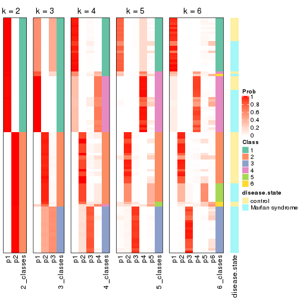


Test correlation between subgroups and known annotations. If the known
annotation is numeric, one-way ANOVA test is applied, and if the known
annotation is discrete, chi-squared contingency table test is applied.

```r
test_to_known_factors(res)
```

```
#>              n disease.state(p) k
#> ATC:kmeans 101         3.32e-01 2
#> ATC:kmeans 100         5.02e-07 3
#> ATC:kmeans  98         9.13e-07 4
#> ATC:kmeans  96         7.76e-06 5
#> ATC:kmeans  93         6.78e-10 6
```


If matrix rows can be associated to genes, consider to use `functional_enrichment(res,
...)` to perform function enrichment for the signature genes. See [this vignette](http://bioconductor.org/packages/devel/bioc/vignettes/cola/inst/doc/functional_enrichment.html) for more detailed explanations.


 

---------------------------------------------------


### ATC:skmeans*


The object with results only for a single top-value method and a single partition method 
can be extracted as:

```r
res = res_list["ATC", "skmeans"]
# you can also extract it by
# res = res_list["ATC:skmeans"]
```

A summary of `res` and all the functions that can be applied to it:

```r
res
```

```
#> A 'ConsensusPartition' object with k = 2, 3, 4, 5, 6.
#>   On a matrix with 3925 rows and 101 columns.
#>   Top rows (392, 784, 1177, 1570, 1962) are extracted by 'ATC' method.
#>   Subgroups are detected by 'skmeans' method.
#>   Performed in total 1250 partitions by row resampling.
#>   Best k for subgroups seems to be 6.
#> 
#> Following methods can be applied to this 'ConsensusPartition' object:
#>  [1] "cola_report"             "collect_classes"         "collect_plots"          
#>  [4] "collect_stats"           "colnames"                "compare_signatures"     
#>  [7] "consensus_heatmap"       "dimension_reduction"     "functional_enrichment"  
#> [10] "get_anno_col"            "get_anno"                "get_classes"            
#> [13] "get_consensus"           "get_matrix"              "get_membership"         
#> [16] "get_param"               "get_signatures"          "get_stats"              
#> [19] "is_best_k"               "is_stable_k"             "membership_heatmap"     
#> [22] "ncol"                    "nrow"                    "plot_ecdf"              
#> [25] "rownames"                "select_partition_number" "show"                   
#> [28] "suggest_best_k"          "test_to_known_factors"
```

`collect_plots()` function collects all the plots made from `res` for all `k` (number of partitions)
into one single page to provide an easy and fast comparison between different `k`.

```r
collect_plots(res)
```


The plots are:

- The first row: a plot of the ECDF (empirical cumulative distribution
  function) curves of the consensus matrix for each `k` and the heatmap of
  predicted classes for each `k`.
- The second row: heatmaps of the consensus matrix for each `k`.
- The third row: heatmaps of the membership matrix for each `k`.
- The fouth row: heatmaps of the signatures for each `k`.

All the plots in panels can be made by individual functions and they are
plotted later in this section.

`select_partition_number()` produces several plots showing different
statistics for choosing "optimized" `k`. There are following statistics:

- ECDF curves of the consensus matrix for each `k`;
- 1-PAC. [The PAC
  score](https://en.wikipedia.org/wiki/Consensus_clustering#Over-interpretation_potential_of_consensus_clustering)
  measures the proportion of the ambiguous subgrouping.
- Mean silhouette score.
- Concordance. The mean probability of fiting the consensus class ids in all
  partitions.
- Area increased. Denote $A_k$ as the area under the ECDF curve for current
  `k`, the area increased is defined as $A_k - A_{k-1}$.
- Rand index. The percent of pairs of samples that are both in a same cluster
  or both are not in a same cluster in the partition of k and k-1.
- Jaccard index. The ratio of pairs of samples are both in a same cluster in
  the partition of k and k-1 and the pairs of samples are both in a same
  cluster in the partition k or k-1.

The detailed explanations of these statistics can be found in [the _cola_
vignette](http://bioconductor.org/packages/devel/bioc/vignettes/cola/inst/doc/cola.html#toc_13).

Generally speaking, lower PAC score, higher mean silhouette score or higher
concordance corresponds to better partition. Rand index and Jaccard index
measure how similar the current partition is compared to partition with `k-1`.
If they are too similar, we won't accept `k` is better than `k-1`.

```r
select_partition_number(res)
```


The numeric values for all these statistics can be obtained by `get_stats()`.

```r
get_stats(res)
```

```
#>   k 1-PAC mean_silhouette concordance area_increased  Rand Jaccard
#> 2 2 1.000           1.000       1.000         0.5051 0.495   0.495
#> 3 3 1.000           0.978       0.985         0.2548 0.871   0.740
#> 4 4 0.990           0.969       0.971         0.1787 0.881   0.676
#> 5 5 0.947           0.923       0.956         0.0423 0.979   0.915
#> 6 6 0.929           0.902       0.909         0.0320 0.968   0.861
```

`suggest_best_k()` suggests the best $k$ based on these statistics. The rules are as follows:

- All $k$ with Jaccard index larger than 0.95 are removed because increasing
  $k$ does not provide enough extra information. If all $k$ are removed, it is
  marked as no subgroup is detected.
- For all $k$ with 1-PAC score larger than 0.9, the maximal $k$ is taken as
  the best $k$, and other $k$ are marked as optional $k$.
- If it does not fit the second rule. The $k$ with the maximal vote of the
  highest 1-PAC score, highest mean silhouette, and highest concordance is
  taken as the best $k$.

```r
suggest_best_k(res)
```

```
#> [1] 6
#> attr(,"optional")
#> [1] 2 3 4 5
```

There is also optional best $k$ = 2 3 4 5 that is worth to check.

Following shows the table of the partitions (You need to click the **show/hide
code output** link to see it). The membership matrix (columns with name `p*`)
is inferred by
[`clue::cl_consensus()`](https://www.rdocumentation.org/link/cl_consensus?package=clue)
function with the `SE` method. Basically the value in the membership matrix
represents the probability to belong to a certain group. The finall class
label for an item is determined with the group with highest probability it
belongs to.

In `get_classes()` function, the entropy is calculated from the membership
matrix and the silhouette score is calculated from the consensus matrix.


<script>
$( function() {
	$( '#tabs-ATC-skmeans-get-classes' ).tabs();
} );
</script>
<div id='tabs-ATC-skmeans-get-classes'>
<ul>
<li><a href='#tab-ATC-skmeans-get-classes-1'>k = 2</a></li>
<li><a href='#tab-ATC-skmeans-get-classes-2'>k = 3</a></li>
<li><a href='#tab-ATC-skmeans-get-classes-3'>k = 4</a></li>
<li><a href='#tab-ATC-skmeans-get-classes-4'>k = 5</a></li>
<li><a href='#tab-ATC-skmeans-get-classes-5'>k = 6</a></li>
</ul>

<div id='tab-ATC-skmeans-get-classes-1'>
<p><a id='tab-ATC-skmeans-get-classes-1-a' style='color:#0366d6' href='#'>show/hide code output</a></p>
<pre><code class="r">cbind(get_classes(res, k = 2), get_membership(res, k = 2))
</code></pre>

<pre><code>#&gt;           class entropy silhouette p1 p2
#&gt; GSM217644     2       0          1  0  1
#&gt; GSM217645     2       0          1  0  1
#&gt; GSM217646     2       0          1  0  1
#&gt; GSM217647     2       0          1  0  1
#&gt; GSM217648     2       0          1  0  1
#&gt; GSM217649     2       0          1  0  1
#&gt; GSM217650     2       0          1  0  1
#&gt; GSM217651     2       0          1  0  1
#&gt; GSM217652     2       0          1  0  1
#&gt; GSM217653     2       0          1  0  1
#&gt; GSM217654     2       0          1  0  1
#&gt; GSM217655     2       0          1  0  1
#&gt; GSM217656     2       0          1  0  1
#&gt; GSM217657     2       0          1  0  1
#&gt; GSM217658     2       0          1  0  1
#&gt; GSM217659     2       0          1  0  1
#&gt; GSM217660     2       0          1  0  1
#&gt; GSM217661     2       0          1  0  1
#&gt; GSM217662     2       0          1  0  1
#&gt; GSM217663     2       0          1  0  1
#&gt; GSM217664     2       0          1  0  1
#&gt; GSM217665     2       0          1  0  1
#&gt; GSM217666     2       0          1  0  1
#&gt; GSM217667     2       0          1  0  1
#&gt; GSM217668     1       0          1  1  0
#&gt; GSM217669     1       0          1  1  0
#&gt; GSM217670     1       0          1  1  0
#&gt; GSM217671     1       0          1  1  0
#&gt; GSM217672     1       0          1  1  0
#&gt; GSM217673     1       0          1  1  0
#&gt; GSM217674     1       0          1  1  0
#&gt; GSM217675     1       0          1  1  0
#&gt; GSM217676     1       0          1  1  0
#&gt; GSM217677     1       0          1  1  0
#&gt; GSM217678     1       0          1  1  0
#&gt; GSM217679     1       0          1  1  0
#&gt; GSM217680     1       0          1  1  0
#&gt; GSM217681     1       0          1  1  0
#&gt; GSM217682     1       0          1  1  0
#&gt; GSM217683     1       0          1  1  0
#&gt; GSM217684     1       0          1  1  0
#&gt; GSM217685     2       0          1  0  1
#&gt; GSM217686     2       0          1  0  1
#&gt; GSM217687     2       0          1  0  1
#&gt; GSM217688     2       0          1  0  1
#&gt; GSM217689     2       0          1  0  1
#&gt; GSM217690     2       0          1  0  1
#&gt; GSM217691     2       0          1  0  1
#&gt; GSM217692     2       0          1  0  1
#&gt; GSM217693     2       0          1  0  1
#&gt; GSM217694     2       0          1  0  1
#&gt; GSM217695     2       0          1  0  1
#&gt; GSM217696     2       0          1  0  1
#&gt; GSM217697     2       0          1  0  1
#&gt; GSM217698     2       0          1  0  1
#&gt; GSM217699     2       0          1  0  1
#&gt; GSM217700     2       0          1  0  1
#&gt; GSM217701     2       0          1  0  1
#&gt; GSM217702     2       0          1  0  1
#&gt; GSM217703     2       0          1  0  1
#&gt; GSM217704     2       0          1  0  1
#&gt; GSM217705     1       0          1  1  0
#&gt; GSM217706     1       0          1  1  0
#&gt; GSM217707     1       0          1  1  0
#&gt; GSM217708     1       0          1  1  0
#&gt; GSM217709     1       0          1  1  0
#&gt; GSM217710     1       0          1  1  0
#&gt; GSM217711     1       0          1  1  0
#&gt; GSM217712     1       0          1  1  0
#&gt; GSM217713     1       0          1  1  0
#&gt; GSM217714     1       0          1  1  0
#&gt; GSM217715     1       0          1  1  0
#&gt; GSM217716     1       0          1  1  0
#&gt; GSM217717     1       0          1  1  0
#&gt; GSM217718     1       0          1  1  0
#&gt; GSM217719     1       0          1  1  0
#&gt; GSM217720     1       0          1  1  0
#&gt; GSM217721     1       0          1  1  0
#&gt; GSM217722     1       0          1  1  0
#&gt; GSM217723     1       0          1  1  0
#&gt; GSM217724     1       0          1  1  0
#&gt; GSM217725     1       0          1  1  0
#&gt; GSM217726     1       0          1  1  0
#&gt; GSM217727     1       0          1  1  0
#&gt; GSM217728     1       0          1  1  0
#&gt; GSM217729     1       0          1  1  0
#&gt; GSM217730     1       0          1  1  0
#&gt; GSM217731     1       0          1  1  0
#&gt; GSM217732     1       0          1  1  0
#&gt; GSM217733     1       0          1  1  0
#&gt; GSM217734     1       0          1  1  0
#&gt; GSM217735     1       0          1  1  0
#&gt; GSM217736     1       0          1  1  0
#&gt; GSM217737     2       0          1  0  1
#&gt; GSM217738     2       0          1  0  1
#&gt; GSM217739     2       0          1  0  1
#&gt; GSM217740     2       0          1  0  1
#&gt; GSM217741     2       0          1  0  1
#&gt; GSM217742     2       0          1  0  1
#&gt; GSM217743     2       0          1  0  1
#&gt; GSM217744     2       0          1  0  1
</code></pre>

<script>
$('#tab-ATC-skmeans-get-classes-1-a').parent().next().next().hide();
$('#tab-ATC-skmeans-get-classes-1-a').click(function(){
  $('#tab-ATC-skmeans-get-classes-1-a').parent().next().next().toggle();
  return(false);
});
</script>
</div>

<div id='tab-ATC-skmeans-get-classes-2'>
<p><a id='tab-ATC-skmeans-get-classes-2-a' style='color:#0366d6' href='#'>show/hide code output</a></p>
<pre><code class="r">cbind(get_classes(res, k = 3), get_membership(res, k = 3))
</code></pre>

<pre><code>#&gt;           class entropy silhouette    p1    p2    p3
#&gt; GSM217644     2  0.0000      0.982 0.000 1.000 0.000
#&gt; GSM217645     2  0.0000      0.982 0.000 1.000 0.000
#&gt; GSM217646     2  0.0000      0.982 0.000 1.000 0.000
#&gt; GSM217647     2  0.0000      0.982 0.000 1.000 0.000
#&gt; GSM217648     2  0.0000      0.982 0.000 1.000 0.000
#&gt; GSM217649     2  0.0000      0.982 0.000 1.000 0.000
#&gt; GSM217650     2  0.0000      0.982 0.000 1.000 0.000
#&gt; GSM217651     2  0.0000      0.982 0.000 1.000 0.000
#&gt; GSM217652     2  0.0000      0.982 0.000 1.000 0.000
#&gt; GSM217653     2  0.0000      0.982 0.000 1.000 0.000
#&gt; GSM217654     2  0.0237      0.978 0.000 0.996 0.004
#&gt; GSM217655     2  0.0237      0.978 0.000 0.996 0.004
#&gt; GSM217656     3  0.5621      0.558 0.000 0.308 0.692
#&gt; GSM217657     2  0.4750      0.730 0.000 0.784 0.216
#&gt; GSM217658     2  0.0000      0.982 0.000 1.000 0.000
#&gt; GSM217659     2  0.0000      0.982 0.000 1.000 0.000
#&gt; GSM217660     2  0.0000      0.982 0.000 1.000 0.000
#&gt; GSM217661     2  0.0000      0.982 0.000 1.000 0.000
#&gt; GSM217662     2  0.0000      0.982 0.000 1.000 0.000
#&gt; GSM217663     2  0.0000      0.982 0.000 1.000 0.000
#&gt; GSM217664     2  0.0000      0.982 0.000 1.000 0.000
#&gt; GSM217665     2  0.0000      0.982 0.000 1.000 0.000
#&gt; GSM217666     2  0.0000      0.982 0.000 1.000 0.000
#&gt; GSM217667     2  0.0000      0.982 0.000 1.000 0.000
#&gt; GSM217668     1  0.0424      0.993 0.992 0.000 0.008
#&gt; GSM217669     1  0.0424      0.993 0.992 0.000 0.008
#&gt; GSM217670     1  0.0424      0.993 0.992 0.000 0.008
#&gt; GSM217671     1  0.0424      0.993 0.992 0.000 0.008
#&gt; GSM217672     1  0.0424      0.993 0.992 0.000 0.008
#&gt; GSM217673     1  0.0424      0.993 0.992 0.000 0.008
#&gt; GSM217674     1  0.0424      0.993 0.992 0.000 0.008
#&gt; GSM217675     1  0.0424      0.993 0.992 0.000 0.008
#&gt; GSM217676     1  0.0424      0.993 0.992 0.000 0.008
#&gt; GSM217677     1  0.0424      0.993 0.992 0.000 0.008
#&gt; GSM217678     1  0.0424      0.993 0.992 0.000 0.008
#&gt; GSM217679     1  0.0424      0.993 0.992 0.000 0.008
#&gt; GSM217680     1  0.0424      0.993 0.992 0.000 0.008
#&gt; GSM217681     1  0.0424      0.993 0.992 0.000 0.008
#&gt; GSM217682     1  0.0424      0.993 0.992 0.000 0.008
#&gt; GSM217683     1  0.0424      0.993 0.992 0.000 0.008
#&gt; GSM217684     1  0.0000      0.993 1.000 0.000 0.000
#&gt; GSM217685     3  0.0747      0.985 0.000 0.016 0.984
#&gt; GSM217686     3  0.0747      0.985 0.000 0.016 0.984
#&gt; GSM217687     3  0.0747      0.985 0.000 0.016 0.984
#&gt; GSM217688     3  0.0747      0.985 0.000 0.016 0.984
#&gt; GSM217689     3  0.0747      0.985 0.000 0.016 0.984
#&gt; GSM217690     3  0.0747      0.985 0.000 0.016 0.984
#&gt; GSM217691     3  0.0747      0.985 0.000 0.016 0.984
#&gt; GSM217692     3  0.0747      0.985 0.000 0.016 0.984
#&gt; GSM217693     3  0.0747      0.985 0.000 0.016 0.984
#&gt; GSM217694     3  0.0747      0.985 0.000 0.016 0.984
#&gt; GSM217695     3  0.0747      0.985 0.000 0.016 0.984
#&gt; GSM217696     3  0.0747      0.985 0.000 0.016 0.984
#&gt; GSM217697     3  0.0747      0.985 0.000 0.016 0.984
#&gt; GSM217698     3  0.0747      0.985 0.000 0.016 0.984
#&gt; GSM217699     3  0.0747      0.985 0.000 0.016 0.984
#&gt; GSM217700     3  0.0747      0.985 0.000 0.016 0.984
#&gt; GSM217701     3  0.0747      0.985 0.000 0.016 0.984
#&gt; GSM217702     3  0.0747      0.985 0.000 0.016 0.984
#&gt; GSM217703     3  0.0747      0.985 0.000 0.016 0.984
#&gt; GSM217704     3  0.0747      0.985 0.000 0.016 0.984
#&gt; GSM217705     1  0.0424      0.993 0.992 0.000 0.008
#&gt; GSM217706     1  0.0424      0.993 0.992 0.000 0.008
#&gt; GSM217707     1  0.0424      0.993 0.992 0.000 0.008
#&gt; GSM217708     1  0.0424      0.993 0.992 0.000 0.008
#&gt; GSM217709     1  0.0424      0.993 0.992 0.000 0.008
#&gt; GSM217710     1  0.0424      0.993 0.992 0.000 0.008
#&gt; GSM217711     1  0.0424      0.993 0.992 0.000 0.008
#&gt; GSM217712     1  0.0424      0.993 0.992 0.000 0.008
#&gt; GSM217713     1  0.0424      0.993 0.992 0.000 0.008
#&gt; GSM217714     1  0.0424      0.993 0.992 0.000 0.008
#&gt; GSM217715     1  0.0424      0.993 0.992 0.000 0.008
#&gt; GSM217716     1  0.0424      0.993 0.992 0.000 0.008
#&gt; GSM217717     1  0.0424      0.993 0.992 0.000 0.008
#&gt; GSM217718     1  0.0424      0.993 0.992 0.000 0.008
#&gt; GSM217719     1  0.0424      0.993 0.992 0.000 0.008
#&gt; GSM217720     1  0.0424      0.993 0.992 0.000 0.008
#&gt; GSM217721     1  0.0424      0.993 0.992 0.000 0.008
#&gt; GSM217722     1  0.0424      0.993 0.992 0.000 0.008
#&gt; GSM217723     1  0.0424      0.993 0.992 0.000 0.008
#&gt; GSM217724     1  0.0424      0.993 0.992 0.000 0.008
#&gt; GSM217725     1  0.0424      0.993 0.992 0.000 0.008
#&gt; GSM217726     1  0.0424      0.993 0.992 0.000 0.008
#&gt; GSM217727     1  0.0424      0.993 0.992 0.000 0.008
#&gt; GSM217728     1  0.0424      0.993 0.992 0.000 0.008
#&gt; GSM217729     1  0.0424      0.993 0.992 0.000 0.008
#&gt; GSM217730     1  0.0424      0.993 0.992 0.000 0.008
#&gt; GSM217731     1  0.0424      0.993 0.992 0.000 0.008
#&gt; GSM217732     1  0.0424      0.993 0.992 0.000 0.008
#&gt; GSM217733     1  0.0424      0.993 0.992 0.000 0.008
#&gt; GSM217734     1  0.0424      0.993 0.992 0.000 0.008
#&gt; GSM217735     1  0.0424      0.993 0.992 0.000 0.008
#&gt; GSM217736     1  0.0424      0.993 0.992 0.000 0.008
#&gt; GSM217737     2  0.3879      0.823 0.000 0.848 0.152
#&gt; GSM217738     2  0.3879      0.823 0.000 0.848 0.152
#&gt; GSM217739     2  0.0000      0.982 0.000 1.000 0.000
#&gt; GSM217740     2  0.0000      0.982 0.000 1.000 0.000
#&gt; GSM217741     2  0.0000      0.982 0.000 1.000 0.000
#&gt; GSM217742     2  0.0000      0.982 0.000 1.000 0.000
#&gt; GSM217743     2  0.0000      0.982 0.000 1.000 0.000
#&gt; GSM217744     2  0.0000      0.982 0.000 1.000 0.000
</code></pre>

<script>
$('#tab-ATC-skmeans-get-classes-2-a').parent().next().next().hide();
$('#tab-ATC-skmeans-get-classes-2-a').click(function(){
  $('#tab-ATC-skmeans-get-classes-2-a').parent().next().next().toggle();
  return(false);
});
</script>
</div>

<div id='tab-ATC-skmeans-get-classes-3'>
<p><a id='tab-ATC-skmeans-get-classes-3-a' style='color:#0366d6' href='#'>show/hide code output</a></p>
<pre><code class="r">cbind(get_classes(res, k = 4), get_membership(res, k = 4))
</code></pre>

<pre><code>#&gt;           class entropy silhouette    p1    p2    p3    p4
#&gt; GSM217644     2  0.0000      0.978 0.000 1.000 0.000 0.000
#&gt; GSM217645     2  0.0000      0.978 0.000 1.000 0.000 0.000
#&gt; GSM217646     2  0.0000      0.978 0.000 1.000 0.000 0.000
#&gt; GSM217647     2  0.0000      0.978 0.000 1.000 0.000 0.000
#&gt; GSM217648     2  0.0000      0.978 0.000 1.000 0.000 0.000
#&gt; GSM217649     2  0.0000      0.978 0.000 1.000 0.000 0.000
#&gt; GSM217650     2  0.0000      0.978 0.000 1.000 0.000 0.000
#&gt; GSM217651     2  0.0000      0.978 0.000 1.000 0.000 0.000
#&gt; GSM217652     2  0.0000      0.978 0.000 1.000 0.000 0.000
#&gt; GSM217653     2  0.0000      0.978 0.000 1.000 0.000 0.000
#&gt; GSM217654     2  0.1953      0.943 0.044 0.940 0.004 0.012
#&gt; GSM217655     2  0.1863      0.944 0.040 0.944 0.004 0.012
#&gt; GSM217656     3  0.6066      0.513 0.044 0.288 0.652 0.016
#&gt; GSM217657     2  0.5206      0.727 0.044 0.752 0.192 0.012
#&gt; GSM217658     2  0.0000      0.978 0.000 1.000 0.000 0.000
#&gt; GSM217659     2  0.0000      0.978 0.000 1.000 0.000 0.000
#&gt; GSM217660     2  0.0000      0.978 0.000 1.000 0.000 0.000
#&gt; GSM217661     2  0.0000      0.978 0.000 1.000 0.000 0.000
#&gt; GSM217662     2  0.0000      0.978 0.000 1.000 0.000 0.000
#&gt; GSM217663     2  0.0000      0.978 0.000 1.000 0.000 0.000
#&gt; GSM217664     2  0.0000      0.978 0.000 1.000 0.000 0.000
#&gt; GSM217665     2  0.0000      0.978 0.000 1.000 0.000 0.000
#&gt; GSM217666     2  0.0000      0.978 0.000 1.000 0.000 0.000
#&gt; GSM217667     2  0.0000      0.978 0.000 1.000 0.000 0.000
#&gt; GSM217668     4  0.1022      0.973 0.032 0.000 0.000 0.968
#&gt; GSM217669     4  0.0592      0.977 0.016 0.000 0.000 0.984
#&gt; GSM217670     4  0.1302      0.965 0.044 0.000 0.000 0.956
#&gt; GSM217671     4  0.1211      0.968 0.040 0.000 0.000 0.960
#&gt; GSM217672     4  0.1022      0.973 0.032 0.000 0.000 0.968
#&gt; GSM217673     4  0.1302      0.965 0.044 0.000 0.000 0.956
#&gt; GSM217674     1  0.1302      1.000 0.956 0.000 0.000 0.044
#&gt; GSM217675     1  0.1302      1.000 0.956 0.000 0.000 0.044
#&gt; GSM217676     1  0.1302      1.000 0.956 0.000 0.000 0.044
#&gt; GSM217677     1  0.1302      1.000 0.956 0.000 0.000 0.044
#&gt; GSM217678     1  0.1302      1.000 0.956 0.000 0.000 0.044
#&gt; GSM217679     1  0.1302      1.000 0.956 0.000 0.000 0.044
#&gt; GSM217680     1  0.1302      1.000 0.956 0.000 0.000 0.044
#&gt; GSM217681     1  0.1302      1.000 0.956 0.000 0.000 0.044
#&gt; GSM217682     1  0.1302      1.000 0.956 0.000 0.000 0.044
#&gt; GSM217683     1  0.1302      1.000 0.956 0.000 0.000 0.044
#&gt; GSM217684     4  0.3801      0.740 0.220 0.000 0.000 0.780
#&gt; GSM217685     3  0.0000      0.983 0.000 0.000 1.000 0.000
#&gt; GSM217686     3  0.0000      0.983 0.000 0.000 1.000 0.000
#&gt; GSM217687     3  0.0000      0.983 0.000 0.000 1.000 0.000
#&gt; GSM217688     3  0.0000      0.983 0.000 0.000 1.000 0.000
#&gt; GSM217689     3  0.0000      0.983 0.000 0.000 1.000 0.000
#&gt; GSM217690     3  0.0000      0.983 0.000 0.000 1.000 0.000
#&gt; GSM217691     3  0.0000      0.983 0.000 0.000 1.000 0.000
#&gt; GSM217692     3  0.0000      0.983 0.000 0.000 1.000 0.000
#&gt; GSM217693     3  0.0000      0.983 0.000 0.000 1.000 0.000
#&gt; GSM217694     3  0.0000      0.983 0.000 0.000 1.000 0.000
#&gt; GSM217695     3  0.0000      0.983 0.000 0.000 1.000 0.000
#&gt; GSM217696     3  0.0000      0.983 0.000 0.000 1.000 0.000
#&gt; GSM217697     3  0.0000      0.983 0.000 0.000 1.000 0.000
#&gt; GSM217698     3  0.0000      0.983 0.000 0.000 1.000 0.000
#&gt; GSM217699     3  0.0000      0.983 0.000 0.000 1.000 0.000
#&gt; GSM217700     3  0.0000      0.983 0.000 0.000 1.000 0.000
#&gt; GSM217701     3  0.0000      0.983 0.000 0.000 1.000 0.000
#&gt; GSM217702     3  0.0000      0.983 0.000 0.000 1.000 0.000
#&gt; GSM217703     3  0.0000      0.983 0.000 0.000 1.000 0.000
#&gt; GSM217704     3  0.0000      0.983 0.000 0.000 1.000 0.000
#&gt; GSM217705     4  0.0592      0.977 0.016 0.000 0.000 0.984
#&gt; GSM217706     4  0.0921      0.975 0.028 0.000 0.000 0.972
#&gt; GSM217707     4  0.0921      0.975 0.028 0.000 0.000 0.972
#&gt; GSM217708     4  0.2589      0.878 0.116 0.000 0.000 0.884
#&gt; GSM217709     4  0.0000      0.967 0.000 0.000 0.000 1.000
#&gt; GSM217710     4  0.0000      0.967 0.000 0.000 0.000 1.000
#&gt; GSM217711     4  0.0000      0.967 0.000 0.000 0.000 1.000
#&gt; GSM217712     4  0.0592      0.977 0.016 0.000 0.000 0.984
#&gt; GSM217713     4  0.0707      0.977 0.020 0.000 0.000 0.980
#&gt; GSM217714     4  0.0592      0.977 0.016 0.000 0.000 0.984
#&gt; GSM217715     4  0.0707      0.977 0.020 0.000 0.000 0.980
#&gt; GSM217716     4  0.0921      0.975 0.028 0.000 0.000 0.972
#&gt; GSM217717     4  0.0592      0.977 0.016 0.000 0.000 0.984
#&gt; GSM217718     4  0.0469      0.975 0.012 0.000 0.000 0.988
#&gt; GSM217719     4  0.0469      0.975 0.012 0.000 0.000 0.988
#&gt; GSM217720     4  0.0707      0.977 0.020 0.000 0.000 0.980
#&gt; GSM217721     4  0.0469      0.975 0.012 0.000 0.000 0.988
#&gt; GSM217722     4  0.0592      0.977 0.016 0.000 0.000 0.984
#&gt; GSM217723     1  0.1302      1.000 0.956 0.000 0.000 0.044
#&gt; GSM217724     1  0.1302      1.000 0.956 0.000 0.000 0.044
#&gt; GSM217725     1  0.1302      1.000 0.956 0.000 0.000 0.044
#&gt; GSM217726     1  0.1302      1.000 0.956 0.000 0.000 0.044
#&gt; GSM217727     1  0.1302      1.000 0.956 0.000 0.000 0.044
#&gt; GSM217728     1  0.1302      1.000 0.956 0.000 0.000 0.044
#&gt; GSM217729     1  0.1302      1.000 0.956 0.000 0.000 0.044
#&gt; GSM217730     1  0.1302      1.000 0.956 0.000 0.000 0.044
#&gt; GSM217731     1  0.1302      1.000 0.956 0.000 0.000 0.044
#&gt; GSM217732     1  0.1302      1.000 0.956 0.000 0.000 0.044
#&gt; GSM217733     1  0.1302      1.000 0.956 0.000 0.000 0.044
#&gt; GSM217734     1  0.1302      1.000 0.956 0.000 0.000 0.044
#&gt; GSM217735     1  0.1302      1.000 0.956 0.000 0.000 0.044
#&gt; GSM217736     1  0.1302      1.000 0.956 0.000 0.000 0.044
#&gt; GSM217737     2  0.3355      0.817 0.004 0.836 0.160 0.000
#&gt; GSM217738     2  0.3355      0.817 0.004 0.836 0.160 0.000
#&gt; GSM217739     2  0.0188      0.976 0.004 0.996 0.000 0.000
#&gt; GSM217740     2  0.0188      0.976 0.004 0.996 0.000 0.000
#&gt; GSM217741     2  0.0188      0.976 0.004 0.996 0.000 0.000
#&gt; GSM217742     2  0.0188      0.976 0.004 0.996 0.000 0.000
#&gt; GSM217743     2  0.0188      0.976 0.004 0.996 0.000 0.000
#&gt; GSM217744     2  0.0188      0.976 0.004 0.996 0.000 0.000
</code></pre>

<script>
$('#tab-ATC-skmeans-get-classes-3-a').parent().next().next().hide();
$('#tab-ATC-skmeans-get-classes-3-a').click(function(){
  $('#tab-ATC-skmeans-get-classes-3-a').parent().next().next().toggle();
  return(false);
});
</script>
</div>

<div id='tab-ATC-skmeans-get-classes-4'>
<p><a id='tab-ATC-skmeans-get-classes-4-a' style='color:#0366d6' href='#'>show/hide code output</a></p>
<pre><code class="r">cbind(get_classes(res, k = 5), get_membership(res, k = 5))
</code></pre>

<pre><code>#&gt;           class entropy silhouette    p1    p2    p3    p4    p5
#&gt; GSM217644     2  0.0451      0.887 0.000 0.988 0.000 0.004 0.008
#&gt; GSM217645     2  0.0693      0.885 0.000 0.980 0.000 0.008 0.012
#&gt; GSM217646     2  0.0693      0.885 0.000 0.980 0.000 0.008 0.012
#&gt; GSM217647     2  0.0000      0.887 0.000 1.000 0.000 0.000 0.000
#&gt; GSM217648     2  0.0162      0.887 0.000 0.996 0.000 0.000 0.004
#&gt; GSM217649     2  0.0693      0.885 0.000 0.980 0.000 0.008 0.012
#&gt; GSM217650     2  0.0693      0.885 0.000 0.980 0.000 0.008 0.012
#&gt; GSM217651     2  0.0324      0.887 0.000 0.992 0.000 0.004 0.004
#&gt; GSM217652     2  0.0693      0.885 0.000 0.980 0.000 0.008 0.012
#&gt; GSM217653     2  0.0000      0.887 0.000 1.000 0.000 0.000 0.000
#&gt; GSM217654     5  0.2690      0.808 0.000 0.156 0.000 0.000 0.844
#&gt; GSM217655     5  0.3730      0.671 0.000 0.288 0.000 0.000 0.712
#&gt; GSM217656     5  0.1282      0.833 0.000 0.004 0.044 0.000 0.952
#&gt; GSM217657     5  0.1628      0.832 0.000 0.008 0.056 0.000 0.936
#&gt; GSM217658     2  0.0693      0.885 0.000 0.980 0.000 0.008 0.012
#&gt; GSM217659     2  0.0693      0.885 0.000 0.980 0.000 0.008 0.012
#&gt; GSM217660     2  0.0794      0.876 0.000 0.972 0.000 0.000 0.028
#&gt; GSM217661     2  0.0693      0.885 0.000 0.980 0.000 0.008 0.012
#&gt; GSM217662     2  0.0000      0.887 0.000 1.000 0.000 0.000 0.000
#&gt; GSM217663     2  0.0000      0.887 0.000 1.000 0.000 0.000 0.000
#&gt; GSM217664     2  0.0693      0.885 0.000 0.980 0.000 0.008 0.012
#&gt; GSM217665     2  0.0000      0.887 0.000 1.000 0.000 0.000 0.000
#&gt; GSM217666     2  0.0162      0.887 0.000 0.996 0.000 0.000 0.004
#&gt; GSM217667     2  0.0162      0.887 0.000 0.996 0.000 0.000 0.004
#&gt; GSM217668     4  0.0671      0.957 0.016 0.000 0.000 0.980 0.004
#&gt; GSM217669     4  0.0404      0.957 0.012 0.000 0.000 0.988 0.000
#&gt; GSM217670     4  0.0794      0.951 0.028 0.000 0.000 0.972 0.000
#&gt; GSM217671     4  0.0865      0.953 0.024 0.000 0.000 0.972 0.004
#&gt; GSM217672     4  0.0671      0.957 0.016 0.000 0.000 0.980 0.004
#&gt; GSM217673     4  0.1041      0.947 0.032 0.000 0.000 0.964 0.004
#&gt; GSM217674     1  0.0000      1.000 1.000 0.000 0.000 0.000 0.000
#&gt; GSM217675     1  0.0000      1.000 1.000 0.000 0.000 0.000 0.000
#&gt; GSM217676     1  0.0000      1.000 1.000 0.000 0.000 0.000 0.000
#&gt; GSM217677     1  0.0000      1.000 1.000 0.000 0.000 0.000 0.000
#&gt; GSM217678     1  0.0000      1.000 1.000 0.000 0.000 0.000 0.000
#&gt; GSM217679     1  0.0000      1.000 1.000 0.000 0.000 0.000 0.000
#&gt; GSM217680     1  0.0000      1.000 1.000 0.000 0.000 0.000 0.000
#&gt; GSM217681     1  0.0000      1.000 1.000 0.000 0.000 0.000 0.000
#&gt; GSM217682     1  0.0000      1.000 1.000 0.000 0.000 0.000 0.000
#&gt; GSM217683     1  0.0000      1.000 1.000 0.000 0.000 0.000 0.000
#&gt; GSM217684     4  0.3579      0.668 0.240 0.000 0.000 0.756 0.004
#&gt; GSM217685     3  0.0000      0.999 0.000 0.000 1.000 0.000 0.000
#&gt; GSM217686     3  0.0000      0.999 0.000 0.000 1.000 0.000 0.000
#&gt; GSM217687     3  0.0000      0.999 0.000 0.000 1.000 0.000 0.000
#&gt; GSM217688     3  0.0000      0.999 0.000 0.000 1.000 0.000 0.000
#&gt; GSM217689     3  0.0162      0.996 0.000 0.000 0.996 0.000 0.004
#&gt; GSM217690     3  0.0162      0.996 0.000 0.000 0.996 0.000 0.004
#&gt; GSM217691     3  0.0000      0.999 0.000 0.000 1.000 0.000 0.000
#&gt; GSM217692     3  0.0000      0.999 0.000 0.000 1.000 0.000 0.000
#&gt; GSM217693     3  0.0000      0.999 0.000 0.000 1.000 0.000 0.000
#&gt; GSM217694     3  0.0000      0.999 0.000 0.000 1.000 0.000 0.000
#&gt; GSM217695     3  0.0000      0.999 0.000 0.000 1.000 0.000 0.000
#&gt; GSM217696     3  0.0000      0.999 0.000 0.000 1.000 0.000 0.000
#&gt; GSM217697     3  0.0000      0.999 0.000 0.000 1.000 0.000 0.000
#&gt; GSM217698     3  0.0000      0.999 0.000 0.000 1.000 0.000 0.000
#&gt; GSM217699     3  0.0000      0.999 0.000 0.000 1.000 0.000 0.000
#&gt; GSM217700     3  0.0000      0.999 0.000 0.000 1.000 0.000 0.000
#&gt; GSM217701     3  0.0000      0.999 0.000 0.000 1.000 0.000 0.000
#&gt; GSM217702     3  0.0000      0.999 0.000 0.000 1.000 0.000 0.000
#&gt; GSM217703     3  0.0162      0.996 0.000 0.000 0.996 0.000 0.004
#&gt; GSM217704     3  0.0000      0.999 0.000 0.000 1.000 0.000 0.000
#&gt; GSM217705     4  0.0404      0.957 0.012 0.000 0.000 0.988 0.000
#&gt; GSM217706     4  0.0510      0.957 0.016 0.000 0.000 0.984 0.000
#&gt; GSM217707     4  0.0798      0.957 0.016 0.000 0.000 0.976 0.008
#&gt; GSM217708     4  0.4159      0.752 0.156 0.000 0.000 0.776 0.068
#&gt; GSM217709     4  0.1942      0.925 0.012 0.000 0.000 0.920 0.068
#&gt; GSM217710     4  0.2660      0.875 0.008 0.000 0.000 0.864 0.128
#&gt; GSM217711     4  0.2843      0.860 0.008 0.000 0.000 0.848 0.144
#&gt; GSM217712     4  0.0566      0.957 0.012 0.000 0.000 0.984 0.004
#&gt; GSM217713     4  0.0671      0.957 0.016 0.000 0.000 0.980 0.004
#&gt; GSM217714     4  0.0404      0.957 0.012 0.000 0.000 0.988 0.000
#&gt; GSM217715     4  0.0510      0.957 0.016 0.000 0.000 0.984 0.000
#&gt; GSM217716     4  0.0771      0.957 0.020 0.000 0.000 0.976 0.004
#&gt; GSM217717     4  0.0693      0.957 0.012 0.000 0.000 0.980 0.008
#&gt; GSM217718     4  0.1364      0.945 0.012 0.000 0.000 0.952 0.036
#&gt; GSM217719     4  0.1281      0.947 0.012 0.000 0.000 0.956 0.032
#&gt; GSM217720     4  0.0404      0.957 0.012 0.000 0.000 0.988 0.000
#&gt; GSM217721     4  0.1106      0.952 0.012 0.000 0.000 0.964 0.024
#&gt; GSM217722     4  0.0566      0.957 0.012 0.000 0.000 0.984 0.004
#&gt; GSM217723     1  0.0000      1.000 1.000 0.000 0.000 0.000 0.000
#&gt; GSM217724     1  0.0000      1.000 1.000 0.000 0.000 0.000 0.000
#&gt; GSM217725     1  0.0000      1.000 1.000 0.000 0.000 0.000 0.000
#&gt; GSM217726     1  0.0000      1.000 1.000 0.000 0.000 0.000 0.000
#&gt; GSM217727     1  0.0000      1.000 1.000 0.000 0.000 0.000 0.000
#&gt; GSM217728     1  0.0000      1.000 1.000 0.000 0.000 0.000 0.000
#&gt; GSM217729     1  0.0000      1.000 1.000 0.000 0.000 0.000 0.000
#&gt; GSM217730     1  0.0000      1.000 1.000 0.000 0.000 0.000 0.000
#&gt; GSM217731     1  0.0000      1.000 1.000 0.000 0.000 0.000 0.000
#&gt; GSM217732     1  0.0000      1.000 1.000 0.000 0.000 0.000 0.000
#&gt; GSM217733     1  0.0000      1.000 1.000 0.000 0.000 0.000 0.000
#&gt; GSM217734     1  0.0000      1.000 1.000 0.000 0.000 0.000 0.000
#&gt; GSM217735     1  0.0000      1.000 1.000 0.000 0.000 0.000 0.000
#&gt; GSM217736     1  0.0000      1.000 1.000 0.000 0.000 0.000 0.000
#&gt; GSM217737     2  0.6026      0.447 0.000 0.592 0.160 0.004 0.244
#&gt; GSM217738     2  0.6026      0.447 0.000 0.592 0.160 0.004 0.244
#&gt; GSM217739     2  0.3607      0.713 0.000 0.752 0.000 0.004 0.244
#&gt; GSM217740     2  0.3607      0.713 0.000 0.752 0.000 0.004 0.244
#&gt; GSM217741     2  0.3607      0.713 0.000 0.752 0.000 0.004 0.244
#&gt; GSM217742     2  0.3607      0.713 0.000 0.752 0.000 0.004 0.244
#&gt; GSM217743     2  0.3607      0.713 0.000 0.752 0.000 0.004 0.244
#&gt; GSM217744     2  0.3607      0.713 0.000 0.752 0.000 0.004 0.244
</code></pre>

<script>
$('#tab-ATC-skmeans-get-classes-4-a').parent().next().next().hide();
$('#tab-ATC-skmeans-get-classes-4-a').click(function(){
  $('#tab-ATC-skmeans-get-classes-4-a').parent().next().next().toggle();
  return(false);
});
</script>
</div>

<div id='tab-ATC-skmeans-get-classes-5'>
<p><a id='tab-ATC-skmeans-get-classes-5-a' style='color:#0366d6' href='#'>show/hide code output</a></p>
<pre><code class="r">cbind(get_classes(res, k = 6), get_membership(res, k = 6))
</code></pre>

<pre><code>#&gt;           class entropy silhouette    p1    p2    p3    p4    p5    p6
#&gt; GSM217644     2  0.0260      0.918 0.000 0.992 0.000 0.000 0.008 0.000
#&gt; GSM217645     2  0.1196      0.911 0.000 0.952 0.000 0.000 0.040 0.008
#&gt; GSM217646     2  0.1124      0.914 0.000 0.956 0.000 0.000 0.036 0.008
#&gt; GSM217647     2  0.0632      0.914 0.000 0.976 0.000 0.000 0.024 0.000
#&gt; GSM217648     2  0.2003      0.766 0.000 0.884 0.000 0.000 0.116 0.000
#&gt; GSM217649     2  0.1049      0.916 0.000 0.960 0.000 0.000 0.032 0.008
#&gt; GSM217650     2  0.1196      0.911 0.000 0.952 0.000 0.000 0.040 0.008
#&gt; GSM217651     2  0.0458      0.917 0.000 0.984 0.000 0.000 0.016 0.000
#&gt; GSM217652     2  0.1124      0.914 0.000 0.956 0.000 0.000 0.036 0.008
#&gt; GSM217653     2  0.0632      0.914 0.000 0.976 0.000 0.000 0.024 0.000
#&gt; GSM217654     6  0.2094      0.900 0.000 0.080 0.000 0.000 0.020 0.900
#&gt; GSM217655     6  0.2234      0.864 0.000 0.124 0.000 0.000 0.004 0.872
#&gt; GSM217656     6  0.0622      0.889 0.000 0.000 0.008 0.000 0.012 0.980
#&gt; GSM217657     6  0.1584      0.887 0.000 0.000 0.008 0.000 0.064 0.928
#&gt; GSM217658     2  0.1049      0.916 0.000 0.960 0.000 0.000 0.032 0.008
#&gt; GSM217659     2  0.1049      0.916 0.000 0.960 0.000 0.000 0.032 0.008
#&gt; GSM217660     2  0.2631      0.654 0.000 0.840 0.000 0.000 0.152 0.008
#&gt; GSM217661     2  0.1196      0.911 0.000 0.952 0.000 0.000 0.040 0.008
#&gt; GSM217662     2  0.0790      0.908 0.000 0.968 0.000 0.000 0.032 0.000
#&gt; GSM217663     2  0.0632      0.914 0.000 0.976 0.000 0.000 0.024 0.000
#&gt; GSM217664     2  0.1124      0.914 0.000 0.956 0.000 0.000 0.036 0.008
#&gt; GSM217665     2  0.0632      0.914 0.000 0.976 0.000 0.000 0.024 0.000
#&gt; GSM217666     2  0.0937      0.899 0.000 0.960 0.000 0.000 0.040 0.000
#&gt; GSM217667     2  0.0865      0.904 0.000 0.964 0.000 0.000 0.036 0.000
#&gt; GSM217668     4  0.0951      0.856 0.008 0.000 0.000 0.968 0.020 0.004
#&gt; GSM217669     4  0.0551      0.860 0.004 0.000 0.000 0.984 0.008 0.004
#&gt; GSM217670     4  0.1237      0.851 0.020 0.000 0.000 0.956 0.020 0.004
#&gt; GSM217671     4  0.1148      0.852 0.016 0.000 0.000 0.960 0.020 0.004
#&gt; GSM217672     4  0.0837      0.857 0.004 0.000 0.000 0.972 0.020 0.004
#&gt; GSM217673     4  0.1321      0.847 0.024 0.000 0.000 0.952 0.020 0.004
#&gt; GSM217674     1  0.0000      0.988 1.000 0.000 0.000 0.000 0.000 0.000
#&gt; GSM217675     1  0.0000      0.988 1.000 0.000 0.000 0.000 0.000 0.000
#&gt; GSM217676     1  0.0000      0.988 1.000 0.000 0.000 0.000 0.000 0.000
#&gt; GSM217677     1  0.0000      0.988 1.000 0.000 0.000 0.000 0.000 0.000
#&gt; GSM217678     1  0.0000      0.988 1.000 0.000 0.000 0.000 0.000 0.000
#&gt; GSM217679     1  0.0000      0.988 1.000 0.000 0.000 0.000 0.000 0.000
#&gt; GSM217680     1  0.0000      0.988 1.000 0.000 0.000 0.000 0.000 0.000
#&gt; GSM217681     1  0.0000      0.988 1.000 0.000 0.000 0.000 0.000 0.000
#&gt; GSM217682     1  0.0000      0.988 1.000 0.000 0.000 0.000 0.000 0.000
#&gt; GSM217683     1  0.0000      0.988 1.000 0.000 0.000 0.000 0.000 0.000
#&gt; GSM217684     4  0.3653      0.620 0.228 0.000 0.000 0.748 0.020 0.004
#&gt; GSM217685     3  0.0260      0.983 0.000 0.000 0.992 0.000 0.008 0.000
#&gt; GSM217686     3  0.0000      0.985 0.000 0.000 1.000 0.000 0.000 0.000
#&gt; GSM217687     3  0.0260      0.983 0.000 0.000 0.992 0.000 0.008 0.000
#&gt; GSM217688     3  0.0260      0.983 0.000 0.000 0.992 0.000 0.008 0.000
#&gt; GSM217689     3  0.0622      0.976 0.000 0.000 0.980 0.000 0.008 0.012
#&gt; GSM217690     3  0.0622      0.976 0.000 0.000 0.980 0.000 0.008 0.012
#&gt; GSM217691     3  0.0692      0.983 0.000 0.000 0.976 0.000 0.020 0.004
#&gt; GSM217692     3  0.0777      0.982 0.000 0.000 0.972 0.000 0.024 0.004
#&gt; GSM217693     3  0.0777      0.982 0.000 0.000 0.972 0.000 0.024 0.004
#&gt; GSM217694     3  0.0692      0.983 0.000 0.000 0.976 0.000 0.020 0.004
#&gt; GSM217695     3  0.0777      0.982 0.000 0.000 0.972 0.000 0.024 0.004
#&gt; GSM217696     3  0.0777      0.982 0.000 0.000 0.972 0.000 0.024 0.004
#&gt; GSM217697     3  0.0777      0.982 0.000 0.000 0.972 0.000 0.024 0.004
#&gt; GSM217698     3  0.0508      0.984 0.000 0.000 0.984 0.000 0.012 0.004
#&gt; GSM217699     3  0.0000      0.985 0.000 0.000 1.000 0.000 0.000 0.000
#&gt; GSM217700     3  0.0000      0.985 0.000 0.000 1.000 0.000 0.000 0.000
#&gt; GSM217701     3  0.0146      0.984 0.000 0.000 0.996 0.000 0.004 0.000
#&gt; GSM217702     3  0.0000      0.985 0.000 0.000 1.000 0.000 0.000 0.000
#&gt; GSM217703     3  0.0717      0.974 0.000 0.000 0.976 0.000 0.008 0.016
#&gt; GSM217704     3  0.0777      0.982 0.000 0.000 0.972 0.000 0.024 0.004
#&gt; GSM217705     4  0.0603      0.860 0.000 0.000 0.000 0.980 0.016 0.004
#&gt; GSM217706     4  0.0291      0.861 0.004 0.000 0.000 0.992 0.004 0.000
#&gt; GSM217707     4  0.0405      0.861 0.004 0.000 0.000 0.988 0.008 0.000
#&gt; GSM217708     4  0.6075      0.463 0.056 0.000 0.000 0.484 0.376 0.084
#&gt; GSM217709     4  0.4835      0.589 0.000 0.000 0.000 0.580 0.352 0.068
#&gt; GSM217710     4  0.5264      0.515 0.000 0.000 0.000 0.520 0.376 0.104
#&gt; GSM217711     4  0.5368      0.498 0.000 0.000 0.000 0.508 0.376 0.116
#&gt; GSM217712     4  0.0790      0.855 0.000 0.000 0.000 0.968 0.032 0.000
#&gt; GSM217713     4  0.0748      0.860 0.004 0.000 0.000 0.976 0.016 0.004
#&gt; GSM217714     4  0.0551      0.860 0.004 0.000 0.000 0.984 0.008 0.004
#&gt; GSM217715     4  0.0653      0.859 0.004 0.000 0.000 0.980 0.012 0.004
#&gt; GSM217716     4  0.0748      0.860 0.004 0.000 0.000 0.976 0.016 0.004
#&gt; GSM217717     4  0.0508      0.860 0.000 0.000 0.000 0.984 0.012 0.004
#&gt; GSM217718     4  0.3867      0.668 0.000 0.000 0.000 0.660 0.328 0.012
#&gt; GSM217719     4  0.3547      0.698 0.000 0.000 0.000 0.696 0.300 0.004
#&gt; GSM217720     4  0.0551      0.861 0.004 0.000 0.000 0.984 0.008 0.004
#&gt; GSM217721     4  0.3163      0.747 0.000 0.000 0.000 0.764 0.232 0.004
#&gt; GSM217722     4  0.0363      0.860 0.000 0.000 0.000 0.988 0.012 0.000
#&gt; GSM217723     1  0.2461      0.891 0.888 0.000 0.000 0.004 0.064 0.044
#&gt; GSM217724     1  0.1480      0.943 0.940 0.000 0.000 0.000 0.040 0.020
#&gt; GSM217725     1  0.1391      0.947 0.944 0.000 0.000 0.000 0.040 0.016
#&gt; GSM217726     1  0.0000      0.988 1.000 0.000 0.000 0.000 0.000 0.000
#&gt; GSM217727     1  0.0000      0.988 1.000 0.000 0.000 0.000 0.000 0.000
#&gt; GSM217728     1  0.1391      0.947 0.944 0.000 0.000 0.000 0.040 0.016
#&gt; GSM217729     1  0.0000      0.988 1.000 0.000 0.000 0.000 0.000 0.000
#&gt; GSM217730     1  0.0000      0.988 1.000 0.000 0.000 0.000 0.000 0.000
#&gt; GSM217731     1  0.0000      0.988 1.000 0.000 0.000 0.000 0.000 0.000
#&gt; GSM217732     1  0.0000      0.988 1.000 0.000 0.000 0.000 0.000 0.000
#&gt; GSM217733     1  0.0000      0.988 1.000 0.000 0.000 0.000 0.000 0.000
#&gt; GSM217734     1  0.0000      0.988 1.000 0.000 0.000 0.000 0.000 0.000
#&gt; GSM217735     1  0.0000      0.988 1.000 0.000 0.000 0.000 0.000 0.000
#&gt; GSM217736     1  0.0000      0.988 1.000 0.000 0.000 0.000 0.000 0.000
#&gt; GSM217737     5  0.5633      0.806 0.000 0.344 0.108 0.000 0.532 0.016
#&gt; GSM217738     5  0.5579      0.819 0.000 0.352 0.100 0.000 0.532 0.016
#&gt; GSM217739     5  0.4471      0.931 0.000 0.444 0.008 0.000 0.532 0.016
#&gt; GSM217740     5  0.4471      0.931 0.000 0.444 0.008 0.000 0.532 0.016
#&gt; GSM217741     5  0.4471      0.931 0.000 0.444 0.008 0.000 0.532 0.016
#&gt; GSM217742     5  0.4471      0.931 0.000 0.444 0.008 0.000 0.532 0.016
#&gt; GSM217743     5  0.4471      0.931 0.000 0.444 0.008 0.000 0.532 0.016
#&gt; GSM217744     5  0.4471      0.931 0.000 0.444 0.008 0.000 0.532 0.016
</code></pre>

<script>
$('#tab-ATC-skmeans-get-classes-5-a').parent().next().next().hide();
$('#tab-ATC-skmeans-get-classes-5-a').click(function(){
  $('#tab-ATC-skmeans-get-classes-5-a').parent().next().next().toggle();
  return(false);
});
</script>
</div>
</div>

Heatmaps for the consensus matrix. It visualizes the probability of two
samples to be in a same group.


<script>
$( function() {
	$( '#tabs-ATC-skmeans-consensus-heatmap' ).tabs();
} );
</script>
<div id='tabs-ATC-skmeans-consensus-heatmap'>
<ul>
<li><a href='#tab-ATC-skmeans-consensus-heatmap-1'>k = 2</a></li>
<li><a href='#tab-ATC-skmeans-consensus-heatmap-2'>k = 3</a></li>
<li><a href='#tab-ATC-skmeans-consensus-heatmap-3'>k = 4</a></li>
<li><a href='#tab-ATC-skmeans-consensus-heatmap-4'>k = 5</a></li>
<li><a href='#tab-ATC-skmeans-consensus-heatmap-5'>k = 6</a></li>
</ul>
<div id='tab-ATC-skmeans-consensus-heatmap-1'>
<pre><code class="r">consensus_heatmap(res, k = 2)
</code></pre>

<p></p>

</div>
<div id='tab-ATC-skmeans-consensus-heatmap-2'>
<pre><code class="r">consensus_heatmap(res, k = 3)
</code></pre>

<p></p>

</div>
<div id='tab-ATC-skmeans-consensus-heatmap-3'>
<pre><code class="r">consensus_heatmap(res, k = 4)
</code></pre>

<p></p>

</div>
<div id='tab-ATC-skmeans-consensus-heatmap-4'>
<pre><code class="r">consensus_heatmap(res, k = 5)
</code></pre>

<p></p>

</div>
<div id='tab-ATC-skmeans-consensus-heatmap-5'>
<pre><code class="r">consensus_heatmap(res, k = 6)
</code></pre>

<p>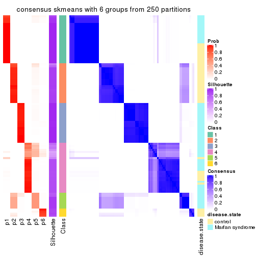</p>

</div>
</div>

Heatmaps for the membership of samples in all partitions to see how consistent they are:


<script>
$( function() {
	$( '#tabs-ATC-skmeans-membership-heatmap' ).tabs();
} );
</script>
<div id='tabs-ATC-skmeans-membership-heatmap'>
<ul>
<li><a href='#tab-ATC-skmeans-membership-heatmap-1'>k = 2</a></li>
<li><a href='#tab-ATC-skmeans-membership-heatmap-2'>k = 3</a></li>
<li><a href='#tab-ATC-skmeans-membership-heatmap-3'>k = 4</a></li>
<li><a href='#tab-ATC-skmeans-membership-heatmap-4'>k = 5</a></li>
<li><a href='#tab-ATC-skmeans-membership-heatmap-5'>k = 6</a></li>
</ul>
<div id='tab-ATC-skmeans-membership-heatmap-1'>
<pre><code class="r">membership_heatmap(res, k = 2)
</code></pre>

<p></p>

</div>
<div id='tab-ATC-skmeans-membership-heatmap-2'>
<pre><code class="r">membership_heatmap(res, k = 3)
</code></pre>

<p></p>

</div>
<div id='tab-ATC-skmeans-membership-heatmap-3'>
<pre><code class="r">membership_heatmap(res, k = 4)
</code></pre>

<p></p>

</div>
<div id='tab-ATC-skmeans-membership-heatmap-4'>
<pre><code class="r">membership_heatmap(res, k = 5)
</code></pre>

<p></p>

</div>
<div id='tab-ATC-skmeans-membership-heatmap-5'>
<pre><code class="r">membership_heatmap(res, k = 6)
</code></pre>

<p></p>

</div>
</div>

As soon as we have had the classes for columns, we can look for signatures
which are significantly different between classes which can be candidate marks
for certain classes. Following are the heatmaps for signatures.


Signature heatmaps where rows are scaled:


<script>
$( function() {
	$( '#tabs-ATC-skmeans-get-signatures' ).tabs();
} );
</script>
<div id='tabs-ATC-skmeans-get-signatures'>
<ul>
<li><a href='#tab-ATC-skmeans-get-signatures-1'>k = 2</a></li>
<li><a href='#tab-ATC-skmeans-get-signatures-2'>k = 3</a></li>
<li><a href='#tab-ATC-skmeans-get-signatures-3'>k = 4</a></li>
<li><a href='#tab-ATC-skmeans-get-signatures-4'>k = 5</a></li>
<li><a href='#tab-ATC-skmeans-get-signatures-5'>k = 6</a></li>
</ul>
<div id='tab-ATC-skmeans-get-signatures-1'>
<pre><code class="r">get_signatures(res, k = 2)
</code></pre>

<p></p>

</div>
<div id='tab-ATC-skmeans-get-signatures-2'>
<pre><code class="r">get_signatures(res, k = 3)
</code></pre>

<p></p>

</div>
<div id='tab-ATC-skmeans-get-signatures-3'>
<pre><code class="r">get_signatures(res, k = 4)
</code></pre>

<p></p>

</div>
<div id='tab-ATC-skmeans-get-signatures-4'>
<pre><code class="r">get_signatures(res, k = 5)
</code></pre>

<p></p>

</div>
<div id='tab-ATC-skmeans-get-signatures-5'>
<pre><code class="r">get_signatures(res, k = 6)
</code></pre>

<p>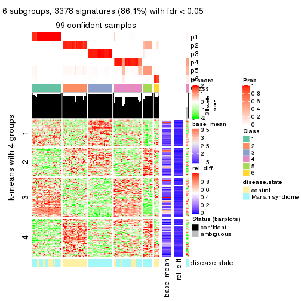</p>

</div>
</div>


Signature heatmaps where rows are not scaled:


<script>
$( function() {
	$( '#tabs-ATC-skmeans-get-signatures-no-scale' ).tabs();
} );
</script>
<div id='tabs-ATC-skmeans-get-signatures-no-scale'>
<ul>
<li><a href='#tab-ATC-skmeans-get-signatures-no-scale-1'>k = 2</a></li>
<li><a href='#tab-ATC-skmeans-get-signatures-no-scale-2'>k = 3</a></li>
<li><a href='#tab-ATC-skmeans-get-signatures-no-scale-3'>k = 4</a></li>
<li><a href='#tab-ATC-skmeans-get-signatures-no-scale-4'>k = 5</a></li>
<li><a href='#tab-ATC-skmeans-get-signatures-no-scale-5'>k = 6</a></li>
</ul>
<div id='tab-ATC-skmeans-get-signatures-no-scale-1'>
<pre><code class="r">get_signatures(res, k = 2, scale_rows = FALSE)
</code></pre>

<p></p>

</div>
<div id='tab-ATC-skmeans-get-signatures-no-scale-2'>
<pre><code class="r">get_signatures(res, k = 3, scale_rows = FALSE)
</code></pre>

<p></p>

</div>
<div id='tab-ATC-skmeans-get-signatures-no-scale-3'>
<pre><code class="r">get_signatures(res, k = 4, scale_rows = FALSE)
</code></pre>

<p></p>

</div>
<div id='tab-ATC-skmeans-get-signatures-no-scale-4'>
<pre><code class="r">get_signatures(res, k = 5, scale_rows = FALSE)
</code></pre>

<p></p>

</div>
<div id='tab-ATC-skmeans-get-signatures-no-scale-5'>
<pre><code class="r">get_signatures(res, k = 6, scale_rows = FALSE)
</code></pre>

<p></p>

</div>
</div>


Compare the overlap of signatures from different k:

```r
compare_signatures(res)
```


`get_signature()` returns a data frame invisibly. TO get the list of signatures, the function
call should be assigned to a variable explicitly. In following code, if `plot` argument is set
to `FALSE`, no heatmap is plotted while only the differential analysis is performed.

```r
# code only for demonstration
tb = get_signature(res, k = ..., plot = FALSE)
```

An example of the output of `tb` is:

```
#>   which_row         fdr    mean_1    mean_2 scaled_mean_1 scaled_mean_2 km
#> 1        38 0.042760348  8.373488  9.131774    -0.5533452     0.5164555  1
#> 2        40 0.018707592  7.106213  8.469186    -0.6173731     0.5762149  1
#> 3        55 0.019134737 10.221463 11.207825    -0.6159697     0.5749050  1
#> 4        59 0.006059896  5.921854  7.869574    -0.6899429     0.6439467  1
#> 5        60 0.018055526  8.928898 10.211722    -0.6204761     0.5791110  1
#> 6        98 0.009384629 15.714769 14.887706     0.6635654    -0.6193277  2
...
```

The columns in `tb` are:

1. `which_row`: row indices corresponding to the input matrix.
2. `fdr`: FDR for the differential test. 
3. `mean_x`: The mean value in group x.
4. `scaled_mean_x`: The mean value in group x after rows are scaled.
5. `km`: Row groups if k-means clustering is applied to rows.


UMAP plot which shows how samples are separated.


<script>
$( function() {
	$( '#tabs-ATC-skmeans-dimension-reduction' ).tabs();
} );
</script>
<div id='tabs-ATC-skmeans-dimension-reduction'>
<ul>
<li><a href='#tab-ATC-skmeans-dimension-reduction-1'>k = 2</a></li>
<li><a href='#tab-ATC-skmeans-dimension-reduction-2'>k = 3</a></li>
<li><a href='#tab-ATC-skmeans-dimension-reduction-3'>k = 4</a></li>
<li><a href='#tab-ATC-skmeans-dimension-reduction-4'>k = 5</a></li>
<li><a href='#tab-ATC-skmeans-dimension-reduction-5'>k = 6</a></li>
</ul>
<div id='tab-ATC-skmeans-dimension-reduction-1'>
<pre><code class="r">dimension_reduction(res, k = 2, method = &quot;UMAP&quot;)
</code></pre>

<p></p>

</div>
<div id='tab-ATC-skmeans-dimension-reduction-2'>
<pre><code class="r">dimension_reduction(res, k = 3, method = &quot;UMAP&quot;)
</code></pre>

<p></p>

</div>
<div id='tab-ATC-skmeans-dimension-reduction-3'>
<pre><code class="r">dimension_reduction(res, k = 4, method = &quot;UMAP&quot;)
</code></pre>

<p></p>

</div>
<div id='tab-ATC-skmeans-dimension-reduction-4'>
<pre><code class="r">dimension_reduction(res, k = 5, method = &quot;UMAP&quot;)
</code></pre>

<p></p>

</div>
<div id='tab-ATC-skmeans-dimension-reduction-5'>
<pre><code class="r">dimension_reduction(res, k = 6, method = &quot;UMAP&quot;)
</code></pre>

<p></p>

</div>
</div>


Following heatmap shows how subgroups are split when increasing `k`:

```r
collect_classes(res)
```


Test correlation between subgroups and known annotations. If the known
annotation is numeric, one-way ANOVA test is applied, and if the known
annotation is discrete, chi-squared contingency table test is applied.

```r
test_to_known_factors(res)
```

```
#>               n disease.state(p) k
#> ATC:skmeans 101         3.32e-01 2
#> ATC:skmeans 101         1.85e-06 3
#> ATC:skmeans 101         4.97e-06 4
#> ATC:skmeans  99         4.30e-07 5
#> ATC:skmeans  99         1.38e-10 6
```


If matrix rows can be associated to genes, consider to use `functional_enrichment(res,
...)` to perform function enrichment for the signature genes. See [this vignette](http://bioconductor.org/packages/devel/bioc/vignettes/cola/inst/doc/functional_enrichment.html) for more detailed explanations.


 

---------------------------------------------------


### ATC:pam**


The object with results only for a single top-value method and a single partition method 
can be extracted as:

```r
res = res_list["ATC", "pam"]
# you can also extract it by
# res = res_list["ATC:pam"]
```

A summary of `res` and all the functions that can be applied to it:

```r
res
```

```
#> A 'ConsensusPartition' object with k = 2, 3, 4, 5, 6.
#>   On a matrix with 3925 rows and 101 columns.
#>   Top rows (392, 784, 1177, 1570, 1962) are extracted by 'ATC' method.
#>   Subgroups are detected by 'pam' method.
#>   Performed in total 1250 partitions by row resampling.
#>   Best k for subgroups seems to be 6.
#> 
#> Following methods can be applied to this 'ConsensusPartition' object:
#>  [1] "cola_report"             "collect_classes"         "collect_plots"          
#>  [4] "collect_stats"           "colnames"                "compare_signatures"     
#>  [7] "consensus_heatmap"       "dimension_reduction"     "functional_enrichment"  
#> [10] "get_anno_col"            "get_anno"                "get_classes"            
#> [13] "get_consensus"           "get_matrix"              "get_membership"         
#> [16] "get_param"               "get_signatures"          "get_stats"              
#> [19] "is_best_k"               "is_stable_k"             "membership_heatmap"     
#> [22] "ncol"                    "nrow"                    "plot_ecdf"              
#> [25] "rownames"                "select_partition_number" "show"                   
#> [28] "suggest_best_k"          "test_to_known_factors"
```

`collect_plots()` function collects all the plots made from `res` for all `k` (number of partitions)
into one single page to provide an easy and fast comparison between different `k`.

```r
collect_plots(res)
```

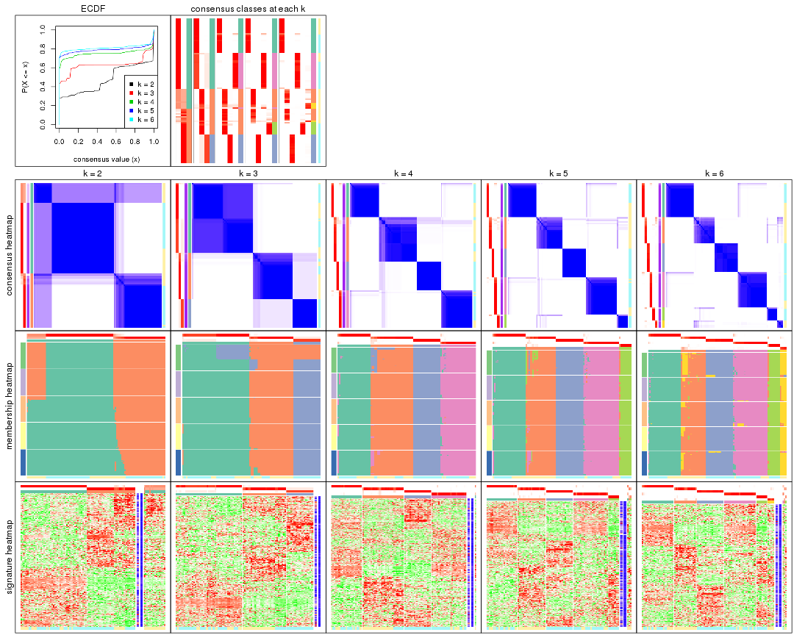

The plots are:

- The first row: a plot of the ECDF (empirical cumulative distribution
  function) curves of the consensus matrix for each `k` and the heatmap of
  predicted classes for each `k`.
- The second row: heatmaps of the consensus matrix for each `k`.
- The third row: heatmaps of the membership matrix for each `k`.
- The fouth row: heatmaps of the signatures for each `k`.

All the plots in panels can be made by individual functions and they are
plotted later in this section.

`select_partition_number()` produces several plots showing different
statistics for choosing "optimized" `k`. There are following statistics:

- ECDF curves of the consensus matrix for each `k`;
- 1-PAC. [The PAC
  score](https://en.wikipedia.org/wiki/Consensus_clustering#Over-interpretation_potential_of_consensus_clustering)
  measures the proportion of the ambiguous subgrouping.
- Mean silhouette score.
- Concordance. The mean probability of fiting the consensus class ids in all
  partitions.
- Area increased. Denote $A_k$ as the area under the ECDF curve for current
  `k`, the area increased is defined as $A_k - A_{k-1}$.
- Rand index. The percent of pairs of samples that are both in a same cluster
  or both are not in a same cluster in the partition of k and k-1.
- Jaccard index. The ratio of pairs of samples are both in a same cluster in
  the partition of k and k-1 and the pairs of samples are both in a same
  cluster in the partition k or k-1.

The detailed explanations of these statistics can be found in [the _cola_
vignette](http://bioconductor.org/packages/devel/bioc/vignettes/cola/inst/doc/cola.html#toc_13).

Generally speaking, lower PAC score, higher mean silhouette score or higher
concordance corresponds to better partition. Rand index and Jaccard index
measure how similar the current partition is compared to partition with `k-1`.
If they are too similar, we won't accept `k` is better than `k-1`.

```r
select_partition_number(res)
```


The numeric values for all these statistics can be obtained by `get_stats()`.

```r
get_stats(res)
```

```
#>   k 1-PAC mean_silhouette concordance area_increased  Rand Jaccard
#> 2 2 0.681           0.797       0.921         0.4764 0.526   0.526
#> 3 3 0.761           0.953       0.939         0.3235 0.743   0.554
#> 4 4 0.978           0.951       0.975         0.1928 0.870   0.652
#> 5 5 0.976           0.935       0.972         0.0512 0.961   0.842
#> 6 6 0.963           0.915       0.962         0.0264 0.980   0.905
```

`suggest_best_k()` suggests the best $k$ based on these statistics. The rules are as follows:

- All $k$ with Jaccard index larger than 0.95 are removed because increasing
  $k$ does not provide enough extra information. If all $k$ are removed, it is
  marked as no subgroup is detected.
- For all $k$ with 1-PAC score larger than 0.9, the maximal $k$ is taken as
  the best $k$, and other $k$ are marked as optional $k$.
- If it does not fit the second rule. The $k$ with the maximal vote of the
  highest 1-PAC score, highest mean silhouette, and highest concordance is
  taken as the best $k$.

```r
suggest_best_k(res)
```

```
#> [1] 6
#> attr(,"optional")
#> [1] 4 5
```

There is also optional best $k$ = 4 5 that is worth to check.

Following shows the table of the partitions (You need to click the **show/hide
code output** link to see it). The membership matrix (columns with name `p*`)
is inferred by
[`clue::cl_consensus()`](https://www.rdocumentation.org/link/cl_consensus?package=clue)
function with the `SE` method. Basically the value in the membership matrix
represents the probability to belong to a certain group. The finall class
label for an item is determined with the group with highest probability it
belongs to.

In `get_classes()` function, the entropy is calculated from the membership
matrix and the silhouette score is calculated from the consensus matrix.


<script>
$( function() {
	$( '#tabs-ATC-pam-get-classes' ).tabs();
} );
</script>
<div id='tabs-ATC-pam-get-classes'>
<ul>
<li><a href='#tab-ATC-pam-get-classes-1'>k = 2</a></li>
<li><a href='#tab-ATC-pam-get-classes-2'>k = 3</a></li>
<li><a href='#tab-ATC-pam-get-classes-3'>k = 4</a></li>
<li><a href='#tab-ATC-pam-get-classes-4'>k = 5</a></li>
<li><a href='#tab-ATC-pam-get-classes-5'>k = 6</a></li>
</ul>

<div id='tab-ATC-pam-get-classes-1'>
<p><a id='tab-ATC-pam-get-classes-1-a' style='color:#0366d6' href='#'>show/hide code output</a></p>
<pre><code class="r">cbind(get_classes(res, k = 2), get_membership(res, k = 2))
</code></pre>

<pre><code>#&gt;           class entropy silhouette    p1    p2
#&gt; GSM217644     1   0.987      0.316 0.568 0.432
#&gt; GSM217645     1   0.987      0.316 0.568 0.432
#&gt; GSM217646     1   0.987      0.316 0.568 0.432
#&gt; GSM217647     2   0.697      0.743 0.188 0.812
#&gt; GSM217648     2   0.456      0.856 0.096 0.904
#&gt; GSM217649     1   0.987      0.316 0.568 0.432
#&gt; GSM217650     1   0.987      0.316 0.568 0.432
#&gt; GSM217651     2   0.518      0.835 0.116 0.884
#&gt; GSM217652     1   0.987      0.316 0.568 0.432
#&gt; GSM217653     2   0.163      0.920 0.024 0.976
#&gt; GSM217654     1   0.987      0.316 0.568 0.432
#&gt; GSM217655     1   0.987      0.316 0.568 0.432
#&gt; GSM217656     1   0.983      0.333 0.576 0.424
#&gt; GSM217657     2   0.949      0.341 0.368 0.632
#&gt; GSM217658     1   0.988      0.305 0.564 0.436
#&gt; GSM217659     1   0.987      0.316 0.568 0.432
#&gt; GSM217660     2   0.827      0.618 0.260 0.740
#&gt; GSM217661     1   0.987      0.316 0.568 0.432
#&gt; GSM217662     2   0.000      0.938 0.000 1.000
#&gt; GSM217663     2   1.000     -0.113 0.496 0.504
#&gt; GSM217664     1   0.987      0.316 0.568 0.432
#&gt; GSM217665     1   0.999      0.151 0.516 0.484
#&gt; GSM217666     2   0.644      0.776 0.164 0.836
#&gt; GSM217667     2   0.753      0.699 0.216 0.784
#&gt; GSM217668     1   0.000      0.886 1.000 0.000
#&gt; GSM217669     1   0.000      0.886 1.000 0.000
#&gt; GSM217670     1   0.000      0.886 1.000 0.000
#&gt; GSM217671     1   0.000      0.886 1.000 0.000
#&gt; GSM217672     1   0.000      0.886 1.000 0.000
#&gt; GSM217673     1   0.000      0.886 1.000 0.000
#&gt; GSM217674     1   0.000      0.886 1.000 0.000
#&gt; GSM217675     1   0.000      0.886 1.000 0.000
#&gt; GSM217676     1   0.000      0.886 1.000 0.000
#&gt; GSM217677     1   0.000      0.886 1.000 0.000
#&gt; GSM217678     1   0.000      0.886 1.000 0.000
#&gt; GSM217679     1   0.000      0.886 1.000 0.000
#&gt; GSM217680     1   0.000      0.886 1.000 0.000
#&gt; GSM217681     1   0.000      0.886 1.000 0.000
#&gt; GSM217682     1   0.000      0.886 1.000 0.000
#&gt; GSM217683     1   0.000      0.886 1.000 0.000
#&gt; GSM217684     1   0.000      0.886 1.000 0.000
#&gt; GSM217685     2   0.000      0.938 0.000 1.000
#&gt; GSM217686     2   0.000      0.938 0.000 1.000
#&gt; GSM217687     2   0.000      0.938 0.000 1.000
#&gt; GSM217688     2   0.000      0.938 0.000 1.000
#&gt; GSM217689     2   0.000      0.938 0.000 1.000
#&gt; GSM217690     2   0.000      0.938 0.000 1.000
#&gt; GSM217691     2   0.000      0.938 0.000 1.000
#&gt; GSM217692     2   0.000      0.938 0.000 1.000
#&gt; GSM217693     2   0.000      0.938 0.000 1.000
#&gt; GSM217694     2   0.000      0.938 0.000 1.000
#&gt; GSM217695     2   0.000      0.938 0.000 1.000
#&gt; GSM217696     2   0.000      0.938 0.000 1.000
#&gt; GSM217697     2   0.000      0.938 0.000 1.000
#&gt; GSM217698     2   0.000      0.938 0.000 1.000
#&gt; GSM217699     2   0.000      0.938 0.000 1.000
#&gt; GSM217700     2   0.000      0.938 0.000 1.000
#&gt; GSM217701     2   0.000      0.938 0.000 1.000
#&gt; GSM217702     2   0.000      0.938 0.000 1.000
#&gt; GSM217703     2   0.000      0.938 0.000 1.000
#&gt; GSM217704     2   0.000      0.938 0.000 1.000
#&gt; GSM217705     1   0.000      0.886 1.000 0.000
#&gt; GSM217706     1   0.000      0.886 1.000 0.000
#&gt; GSM217707     1   0.000      0.886 1.000 0.000
#&gt; GSM217708     1   0.000      0.886 1.000 0.000
#&gt; GSM217709     1   0.000      0.886 1.000 0.000
#&gt; GSM217710     1   0.000      0.886 1.000 0.000
#&gt; GSM217711     1   0.000      0.886 1.000 0.000
#&gt; GSM217712     1   0.000      0.886 1.000 0.000
#&gt; GSM217713     1   0.000      0.886 1.000 0.000
#&gt; GSM217714     1   0.000      0.886 1.000 0.000
#&gt; GSM217715     1   0.000      0.886 1.000 0.000
#&gt; GSM217716     1   0.000      0.886 1.000 0.000
#&gt; GSM217717     1   0.000      0.886 1.000 0.000
#&gt; GSM217718     1   0.000      0.886 1.000 0.000
#&gt; GSM217719     1   0.000      0.886 1.000 0.000
#&gt; GSM217720     1   0.000      0.886 1.000 0.000
#&gt; GSM217721     1   0.000      0.886 1.000 0.000
#&gt; GSM217722     1   0.000      0.886 1.000 0.000
#&gt; GSM217723     1   0.000      0.886 1.000 0.000
#&gt; GSM217724     1   0.000      0.886 1.000 0.000
#&gt; GSM217725     1   0.000      0.886 1.000 0.000
#&gt; GSM217726     1   0.000      0.886 1.000 0.000
#&gt; GSM217727     1   0.000      0.886 1.000 0.000
#&gt; GSM217728     1   0.000      0.886 1.000 0.000
#&gt; GSM217729     1   0.000      0.886 1.000 0.000
#&gt; GSM217730     1   0.000      0.886 1.000 0.000
#&gt; GSM217731     1   0.000      0.886 1.000 0.000
#&gt; GSM217732     1   0.000      0.886 1.000 0.000
#&gt; GSM217733     1   0.000      0.886 1.000 0.000
#&gt; GSM217734     1   0.000      0.886 1.000 0.000
#&gt; GSM217735     1   0.000      0.886 1.000 0.000
#&gt; GSM217736     1   0.000      0.886 1.000 0.000
#&gt; GSM217737     2   0.000      0.938 0.000 1.000
#&gt; GSM217738     2   0.000      0.938 0.000 1.000
#&gt; GSM217739     2   0.000      0.938 0.000 1.000
#&gt; GSM217740     2   0.000      0.938 0.000 1.000
#&gt; GSM217741     2   0.000      0.938 0.000 1.000
#&gt; GSM217742     2   0.000      0.938 0.000 1.000
#&gt; GSM217743     2   0.000      0.938 0.000 1.000
#&gt; GSM217744     2   0.000      0.938 0.000 1.000
</code></pre>

<script>
$('#tab-ATC-pam-get-classes-1-a').parent().next().next().hide();
$('#tab-ATC-pam-get-classes-1-a').click(function(){
  $('#tab-ATC-pam-get-classes-1-a').parent().next().next().toggle();
  return(false);
});
</script>
</div>

<div id='tab-ATC-pam-get-classes-2'>
<p><a id='tab-ATC-pam-get-classes-2-a' style='color:#0366d6' href='#'>show/hide code output</a></p>
<pre><code class="r">cbind(get_classes(res, k = 3), get_membership(res, k = 3))
</code></pre>

<pre><code>#&gt;           class entropy silhouette    p1    p2    p3
#&gt; GSM217644     2  0.0892      0.949 0.020 0.980 0.000
#&gt; GSM217645     2  0.1129      0.946 0.020 0.976 0.004
#&gt; GSM217646     2  0.0000      0.966 0.000 1.000 0.000
#&gt; GSM217647     2  0.0000      0.966 0.000 1.000 0.000
#&gt; GSM217648     2  0.0000      0.966 0.000 1.000 0.000
#&gt; GSM217649     2  0.0000      0.966 0.000 1.000 0.000
#&gt; GSM217650     2  0.0000      0.966 0.000 1.000 0.000
#&gt; GSM217651     2  0.0000      0.966 0.000 1.000 0.000
#&gt; GSM217652     2  0.0000      0.966 0.000 1.000 0.000
#&gt; GSM217653     2  0.0000      0.966 0.000 1.000 0.000
#&gt; GSM217654     2  0.4660      0.842 0.072 0.856 0.072
#&gt; GSM217655     2  0.4660      0.842 0.072 0.856 0.072
#&gt; GSM217656     2  0.7043      0.682 0.136 0.728 0.136
#&gt; GSM217657     2  0.5085      0.822 0.072 0.836 0.092
#&gt; GSM217658     2  0.0000      0.966 0.000 1.000 0.000
#&gt; GSM217659     2  0.0000      0.966 0.000 1.000 0.000
#&gt; GSM217660     2  0.0000      0.966 0.000 1.000 0.000
#&gt; GSM217661     2  0.0237      0.963 0.004 0.996 0.000
#&gt; GSM217662     2  0.0000      0.966 0.000 1.000 0.000
#&gt; GSM217663     2  0.0000      0.966 0.000 1.000 0.000
#&gt; GSM217664     2  0.0000      0.966 0.000 1.000 0.000
#&gt; GSM217665     2  0.0000      0.966 0.000 1.000 0.000
#&gt; GSM217666     2  0.0000      0.966 0.000 1.000 0.000
#&gt; GSM217667     2  0.0000      0.966 0.000 1.000 0.000
#&gt; GSM217668     1  0.7412      0.729 0.696 0.192 0.112
#&gt; GSM217669     1  0.3192      0.947 0.888 0.000 0.112
#&gt; GSM217670     1  0.3192      0.947 0.888 0.000 0.112
#&gt; GSM217671     1  0.3192      0.947 0.888 0.000 0.112
#&gt; GSM217672     1  0.3192      0.947 0.888 0.000 0.112
#&gt; GSM217673     1  0.2959      0.948 0.900 0.000 0.100
#&gt; GSM217674     1  0.0000      0.948 1.000 0.000 0.000
#&gt; GSM217675     1  0.0000      0.948 1.000 0.000 0.000
#&gt; GSM217676     1  0.0000      0.948 1.000 0.000 0.000
#&gt; GSM217677     1  0.0000      0.948 1.000 0.000 0.000
#&gt; GSM217678     1  0.0000      0.948 1.000 0.000 0.000
#&gt; GSM217679     1  0.0000      0.948 1.000 0.000 0.000
#&gt; GSM217680     1  0.0000      0.948 1.000 0.000 0.000
#&gt; GSM217681     1  0.0000      0.948 1.000 0.000 0.000
#&gt; GSM217682     1  0.0000      0.948 1.000 0.000 0.000
#&gt; GSM217683     1  0.0000      0.948 1.000 0.000 0.000
#&gt; GSM217684     1  0.0000      0.948 1.000 0.000 0.000
#&gt; GSM217685     3  0.3192      1.000 0.000 0.112 0.888
#&gt; GSM217686     3  0.3192      1.000 0.000 0.112 0.888
#&gt; GSM217687     3  0.3192      1.000 0.000 0.112 0.888
#&gt; GSM217688     3  0.3192      1.000 0.000 0.112 0.888
#&gt; GSM217689     3  0.3192      1.000 0.000 0.112 0.888
#&gt; GSM217690     3  0.3192      1.000 0.000 0.112 0.888
#&gt; GSM217691     3  0.3192      1.000 0.000 0.112 0.888
#&gt; GSM217692     3  0.3192      1.000 0.000 0.112 0.888
#&gt; GSM217693     3  0.3192      1.000 0.000 0.112 0.888
#&gt; GSM217694     3  0.3192      1.000 0.000 0.112 0.888
#&gt; GSM217695     3  0.3192      1.000 0.000 0.112 0.888
#&gt; GSM217696     3  0.3192      1.000 0.000 0.112 0.888
#&gt; GSM217697     3  0.3192      1.000 0.000 0.112 0.888
#&gt; GSM217698     3  0.3192      1.000 0.000 0.112 0.888
#&gt; GSM217699     3  0.3192      1.000 0.000 0.112 0.888
#&gt; GSM217700     3  0.3192      1.000 0.000 0.112 0.888
#&gt; GSM217701     3  0.3192      1.000 0.000 0.112 0.888
#&gt; GSM217702     3  0.3192      1.000 0.000 0.112 0.888
#&gt; GSM217703     3  0.3192      1.000 0.000 0.112 0.888
#&gt; GSM217704     3  0.3267      0.995 0.000 0.116 0.884
#&gt; GSM217705     1  0.2796      0.948 0.908 0.000 0.092
#&gt; GSM217706     1  0.3192      0.947 0.888 0.000 0.112
#&gt; GSM217707     1  0.3192      0.947 0.888 0.000 0.112
#&gt; GSM217708     1  0.3192      0.947 0.888 0.000 0.112
#&gt; GSM217709     1  0.3192      0.947 0.888 0.000 0.112
#&gt; GSM217710     1  0.3192      0.947 0.888 0.000 0.112
#&gt; GSM217711     1  0.3192      0.947 0.888 0.000 0.112
#&gt; GSM217712     1  0.3192      0.947 0.888 0.000 0.112
#&gt; GSM217713     1  0.3192      0.947 0.888 0.000 0.112
#&gt; GSM217714     1  0.3192      0.947 0.888 0.000 0.112
#&gt; GSM217715     1  0.3192      0.947 0.888 0.000 0.112
#&gt; GSM217716     1  0.3192      0.947 0.888 0.000 0.112
#&gt; GSM217717     1  0.3192      0.947 0.888 0.000 0.112
#&gt; GSM217718     1  0.3192      0.947 0.888 0.000 0.112
#&gt; GSM217719     1  0.3192      0.947 0.888 0.000 0.112
#&gt; GSM217720     1  0.3116      0.947 0.892 0.000 0.108
#&gt; GSM217721     1  0.3192      0.947 0.888 0.000 0.112
#&gt; GSM217722     1  0.3192      0.947 0.888 0.000 0.112
#&gt; GSM217723     1  0.2448      0.949 0.924 0.000 0.076
#&gt; GSM217724     1  0.0000      0.948 1.000 0.000 0.000
#&gt; GSM217725     1  0.0237      0.948 0.996 0.000 0.004
#&gt; GSM217726     1  0.0000      0.948 1.000 0.000 0.000
#&gt; GSM217727     1  0.0000      0.948 1.000 0.000 0.000
#&gt; GSM217728     1  0.0592      0.949 0.988 0.000 0.012
#&gt; GSM217729     1  0.0000      0.948 1.000 0.000 0.000
#&gt; GSM217730     1  0.0000      0.948 1.000 0.000 0.000
#&gt; GSM217731     1  0.0000      0.948 1.000 0.000 0.000
#&gt; GSM217732     1  0.0000      0.948 1.000 0.000 0.000
#&gt; GSM217733     1  0.0000      0.948 1.000 0.000 0.000
#&gt; GSM217734     1  0.0000      0.948 1.000 0.000 0.000
#&gt; GSM217735     1  0.0000      0.948 1.000 0.000 0.000
#&gt; GSM217736     1  0.0000      0.948 1.000 0.000 0.000
#&gt; GSM217737     2  0.2796      0.885 0.000 0.908 0.092
#&gt; GSM217738     2  0.2711      0.890 0.000 0.912 0.088
#&gt; GSM217739     2  0.0000      0.966 0.000 1.000 0.000
#&gt; GSM217740     2  0.0000      0.966 0.000 1.000 0.000
#&gt; GSM217741     2  0.0000      0.966 0.000 1.000 0.000
#&gt; GSM217742     2  0.0000      0.966 0.000 1.000 0.000
#&gt; GSM217743     2  0.0000      0.966 0.000 1.000 0.000
#&gt; GSM217744     2  0.0000      0.966 0.000 1.000 0.000
</code></pre>

<script>
$('#tab-ATC-pam-get-classes-2-a').parent().next().next().hide();
$('#tab-ATC-pam-get-classes-2-a').click(function(){
  $('#tab-ATC-pam-get-classes-2-a').parent().next().next().toggle();
  return(false);
});
</script>
</div>

<div id='tab-ATC-pam-get-classes-3'>
<p><a id='tab-ATC-pam-get-classes-3-a' style='color:#0366d6' href='#'>show/hide code output</a></p>
<pre><code class="r">cbind(get_classes(res, k = 4), get_membership(res, k = 4))
</code></pre>

<pre><code>#&gt;           class entropy silhouette    p1    p2    p3    p4
#&gt; GSM217644     2  0.1706      0.928 0.000 0.948 0.016 0.036
#&gt; GSM217645     2  0.1706      0.928 0.000 0.948 0.016 0.036
#&gt; GSM217646     2  0.0779      0.948 0.000 0.980 0.016 0.004
#&gt; GSM217647     2  0.0000      0.949 0.000 1.000 0.000 0.000
#&gt; GSM217648     2  0.0000      0.949 0.000 1.000 0.000 0.000
#&gt; GSM217649     2  0.0592      0.949 0.000 0.984 0.016 0.000
#&gt; GSM217650     2  0.0592      0.949 0.000 0.984 0.016 0.000
#&gt; GSM217651     2  0.0469      0.949 0.000 0.988 0.012 0.000
#&gt; GSM217652     2  0.0592      0.949 0.000 0.984 0.016 0.000
#&gt; GSM217653     2  0.0000      0.949 0.000 1.000 0.000 0.000
#&gt; GSM217654     2  0.5950      0.699 0.000 0.696 0.156 0.148
#&gt; GSM217655     2  0.5950      0.699 0.000 0.696 0.156 0.148
#&gt; GSM217656     4  0.2670      0.893 0.000 0.024 0.072 0.904
#&gt; GSM217657     2  0.6449      0.628 0.000 0.644 0.204 0.152
#&gt; GSM217658     2  0.0592      0.949 0.000 0.984 0.016 0.000
#&gt; GSM217659     2  0.0592      0.949 0.000 0.984 0.016 0.000
#&gt; GSM217660     2  0.0817      0.945 0.000 0.976 0.024 0.000
#&gt; GSM217661     2  0.0927      0.946 0.000 0.976 0.016 0.008
#&gt; GSM217662     2  0.0000      0.949 0.000 1.000 0.000 0.000
#&gt; GSM217663     2  0.0592      0.949 0.000 0.984 0.016 0.000
#&gt; GSM217664     2  0.0592      0.949 0.000 0.984 0.016 0.000
#&gt; GSM217665     2  0.0000      0.949 0.000 1.000 0.000 0.000
#&gt; GSM217666     2  0.0000      0.949 0.000 1.000 0.000 0.000
#&gt; GSM217667     2  0.0000      0.949 0.000 1.000 0.000 0.000
#&gt; GSM217668     4  0.0000      0.981 0.000 0.000 0.000 1.000
#&gt; GSM217669     4  0.0000      0.981 0.000 0.000 0.000 1.000
#&gt; GSM217670     4  0.0000      0.981 0.000 0.000 0.000 1.000
#&gt; GSM217671     4  0.0000      0.981 0.000 0.000 0.000 1.000
#&gt; GSM217672     4  0.0000      0.981 0.000 0.000 0.000 1.000
#&gt; GSM217673     4  0.1637      0.929 0.060 0.000 0.000 0.940
#&gt; GSM217674     1  0.0000      0.979 1.000 0.000 0.000 0.000
#&gt; GSM217675     1  0.0000      0.979 1.000 0.000 0.000 0.000
#&gt; GSM217676     1  0.0000      0.979 1.000 0.000 0.000 0.000
#&gt; GSM217677     1  0.0000      0.979 1.000 0.000 0.000 0.000
#&gt; GSM217678     1  0.0000      0.979 1.000 0.000 0.000 0.000
#&gt; GSM217679     1  0.0000      0.979 1.000 0.000 0.000 0.000
#&gt; GSM217680     1  0.0000      0.979 1.000 0.000 0.000 0.000
#&gt; GSM217681     1  0.0000      0.979 1.000 0.000 0.000 0.000
#&gt; GSM217682     1  0.0000      0.979 1.000 0.000 0.000 0.000
#&gt; GSM217683     1  0.0000      0.979 1.000 0.000 0.000 0.000
#&gt; GSM217684     1  0.4605      0.476 0.664 0.000 0.000 0.336
#&gt; GSM217685     3  0.0000      1.000 0.000 0.000 1.000 0.000
#&gt; GSM217686     3  0.0000      1.000 0.000 0.000 1.000 0.000
#&gt; GSM217687     3  0.0000      1.000 0.000 0.000 1.000 0.000
#&gt; GSM217688     3  0.0000      1.000 0.000 0.000 1.000 0.000
#&gt; GSM217689     3  0.0000      1.000 0.000 0.000 1.000 0.000
#&gt; GSM217690     3  0.0000      1.000 0.000 0.000 1.000 0.000
#&gt; GSM217691     3  0.0000      1.000 0.000 0.000 1.000 0.000
#&gt; GSM217692     3  0.0000      1.000 0.000 0.000 1.000 0.000
#&gt; GSM217693     3  0.0000      1.000 0.000 0.000 1.000 0.000
#&gt; GSM217694     3  0.0000      1.000 0.000 0.000 1.000 0.000
#&gt; GSM217695     3  0.0000      1.000 0.000 0.000 1.000 0.000
#&gt; GSM217696     3  0.0000      1.000 0.000 0.000 1.000 0.000
#&gt; GSM217697     3  0.0000      1.000 0.000 0.000 1.000 0.000
#&gt; GSM217698     3  0.0000      1.000 0.000 0.000 1.000 0.000
#&gt; GSM217699     3  0.0000      1.000 0.000 0.000 1.000 0.000
#&gt; GSM217700     3  0.0000      1.000 0.000 0.000 1.000 0.000
#&gt; GSM217701     3  0.0000      1.000 0.000 0.000 1.000 0.000
#&gt; GSM217702     3  0.0000      1.000 0.000 0.000 1.000 0.000
#&gt; GSM217703     3  0.0000      1.000 0.000 0.000 1.000 0.000
#&gt; GSM217704     3  0.0188      0.996 0.000 0.004 0.996 0.000
#&gt; GSM217705     4  0.1118      0.953 0.036 0.000 0.000 0.964
#&gt; GSM217706     4  0.0000      0.981 0.000 0.000 0.000 1.000
#&gt; GSM217707     4  0.0000      0.981 0.000 0.000 0.000 1.000
#&gt; GSM217708     4  0.0188      0.979 0.004 0.000 0.000 0.996
#&gt; GSM217709     4  0.0000      0.981 0.000 0.000 0.000 1.000
#&gt; GSM217710     4  0.0000      0.981 0.000 0.000 0.000 1.000
#&gt; GSM217711     4  0.0000      0.981 0.000 0.000 0.000 1.000
#&gt; GSM217712     4  0.0000      0.981 0.000 0.000 0.000 1.000
#&gt; GSM217713     4  0.0000      0.981 0.000 0.000 0.000 1.000
#&gt; GSM217714     4  0.0000      0.981 0.000 0.000 0.000 1.000
#&gt; GSM217715     4  0.0000      0.981 0.000 0.000 0.000 1.000
#&gt; GSM217716     4  0.0000      0.981 0.000 0.000 0.000 1.000
#&gt; GSM217717     4  0.0000      0.981 0.000 0.000 0.000 1.000
#&gt; GSM217718     4  0.0000      0.981 0.000 0.000 0.000 1.000
#&gt; GSM217719     4  0.0000      0.981 0.000 0.000 0.000 1.000
#&gt; GSM217720     4  0.0336      0.976 0.008 0.000 0.000 0.992
#&gt; GSM217721     4  0.0000      0.981 0.000 0.000 0.000 1.000
#&gt; GSM217722     4  0.0000      0.981 0.000 0.000 0.000 1.000
#&gt; GSM217723     4  0.4072      0.662 0.252 0.000 0.000 0.748
#&gt; GSM217724     1  0.2281      0.883 0.904 0.000 0.000 0.096
#&gt; GSM217725     1  0.0336      0.973 0.992 0.000 0.000 0.008
#&gt; GSM217726     1  0.0000      0.979 1.000 0.000 0.000 0.000
#&gt; GSM217727     1  0.0000      0.979 1.000 0.000 0.000 0.000
#&gt; GSM217728     1  0.0707      0.962 0.980 0.000 0.000 0.020
#&gt; GSM217729     1  0.0000      0.979 1.000 0.000 0.000 0.000
#&gt; GSM217730     1  0.0000      0.979 1.000 0.000 0.000 0.000
#&gt; GSM217731     1  0.0000      0.979 1.000 0.000 0.000 0.000
#&gt; GSM217732     1  0.0000      0.979 1.000 0.000 0.000 0.000
#&gt; GSM217733     1  0.0000      0.979 1.000 0.000 0.000 0.000
#&gt; GSM217734     1  0.0000      0.979 1.000 0.000 0.000 0.000
#&gt; GSM217735     1  0.0000      0.979 1.000 0.000 0.000 0.000
#&gt; GSM217736     1  0.0000      0.979 1.000 0.000 0.000 0.000
#&gt; GSM217737     2  0.3444      0.789 0.000 0.816 0.184 0.000
#&gt; GSM217738     2  0.3444      0.789 0.000 0.816 0.184 0.000
#&gt; GSM217739     2  0.0000      0.949 0.000 1.000 0.000 0.000
#&gt; GSM217740     2  0.0000      0.949 0.000 1.000 0.000 0.000
#&gt; GSM217741     2  0.0000      0.949 0.000 1.000 0.000 0.000
#&gt; GSM217742     2  0.0336      0.947 0.000 0.992 0.008 0.000
#&gt; GSM217743     2  0.0000      0.949 0.000 1.000 0.000 0.000
#&gt; GSM217744     2  0.0000      0.949 0.000 1.000 0.000 0.000
</code></pre>

<script>
$('#tab-ATC-pam-get-classes-3-a').parent().next().next().hide();
$('#tab-ATC-pam-get-classes-3-a').click(function(){
  $('#tab-ATC-pam-get-classes-3-a').parent().next().next().toggle();
  return(false);
});
</script>
</div>

<div id='tab-ATC-pam-get-classes-4'>
<p><a id='tab-ATC-pam-get-classes-4-a' style='color:#0366d6' href='#'>show/hide code output</a></p>
<pre><code class="r">cbind(get_classes(res, k = 5), get_membership(res, k = 5))
</code></pre>

<pre><code>#&gt;           class entropy silhouette    p1    p2    p3    p4    p5
#&gt; GSM217644     2  0.0000      0.922 0.000 1.000 0.000 0.000 0.000
#&gt; GSM217645     2  0.0000      0.922 0.000 1.000 0.000 0.000 0.000
#&gt; GSM217646     2  0.0000      0.922 0.000 1.000 0.000 0.000 0.000
#&gt; GSM217647     2  0.1671      0.881 0.000 0.924 0.000 0.000 0.076
#&gt; GSM217648     5  0.4182      0.316 0.000 0.400 0.000 0.000 0.600
#&gt; GSM217649     2  0.0000      0.922 0.000 1.000 0.000 0.000 0.000
#&gt; GSM217650     2  0.0000      0.922 0.000 1.000 0.000 0.000 0.000
#&gt; GSM217651     2  0.0000      0.922 0.000 1.000 0.000 0.000 0.000
#&gt; GSM217652     2  0.0000      0.922 0.000 1.000 0.000 0.000 0.000
#&gt; GSM217653     2  0.1197      0.899 0.000 0.952 0.000 0.000 0.048
#&gt; GSM217654     2  0.1908      0.841 0.000 0.908 0.000 0.092 0.000
#&gt; GSM217655     2  0.3242      0.679 0.000 0.784 0.000 0.216 0.000
#&gt; GSM217656     4  0.2830      0.856 0.000 0.080 0.044 0.876 0.000
#&gt; GSM217657     2  0.5218      0.613 0.000 0.684 0.180 0.136 0.000
#&gt; GSM217658     2  0.0000      0.922 0.000 1.000 0.000 0.000 0.000
#&gt; GSM217659     2  0.0000      0.922 0.000 1.000 0.000 0.000 0.000
#&gt; GSM217660     2  0.1952      0.868 0.000 0.912 0.004 0.000 0.084
#&gt; GSM217661     2  0.0000      0.922 0.000 1.000 0.000 0.000 0.000
#&gt; GSM217662     2  0.1908      0.869 0.000 0.908 0.000 0.000 0.092
#&gt; GSM217663     2  0.0000      0.922 0.000 1.000 0.000 0.000 0.000
#&gt; GSM217664     2  0.0000      0.922 0.000 1.000 0.000 0.000 0.000
#&gt; GSM217665     2  0.0162      0.920 0.000 0.996 0.000 0.000 0.004
#&gt; GSM217666     2  0.2732      0.802 0.000 0.840 0.000 0.000 0.160
#&gt; GSM217667     2  0.4045      0.471 0.000 0.644 0.000 0.000 0.356
#&gt; GSM217668     4  0.0000      0.979 0.000 0.000 0.000 1.000 0.000
#&gt; GSM217669     4  0.0000      0.979 0.000 0.000 0.000 1.000 0.000
#&gt; GSM217670     4  0.0000      0.979 0.000 0.000 0.000 1.000 0.000
#&gt; GSM217671     4  0.0000      0.979 0.000 0.000 0.000 1.000 0.000
#&gt; GSM217672     4  0.0000      0.979 0.000 0.000 0.000 1.000 0.000
#&gt; GSM217673     4  0.1341      0.924 0.056 0.000 0.000 0.944 0.000
#&gt; GSM217674     1  0.0000      0.974 1.000 0.000 0.000 0.000 0.000
#&gt; GSM217675     1  0.0000      0.974 1.000 0.000 0.000 0.000 0.000
#&gt; GSM217676     1  0.0000      0.974 1.000 0.000 0.000 0.000 0.000
#&gt; GSM217677     1  0.0000      0.974 1.000 0.000 0.000 0.000 0.000
#&gt; GSM217678     1  0.0000      0.974 1.000 0.000 0.000 0.000 0.000
#&gt; GSM217679     1  0.0000      0.974 1.000 0.000 0.000 0.000 0.000
#&gt; GSM217680     1  0.0000      0.974 1.000 0.000 0.000 0.000 0.000
#&gt; GSM217681     1  0.0000      0.974 1.000 0.000 0.000 0.000 0.000
#&gt; GSM217682     1  0.0000      0.974 1.000 0.000 0.000 0.000 0.000
#&gt; GSM217683     1  0.0000      0.974 1.000 0.000 0.000 0.000 0.000
#&gt; GSM217684     1  0.4060      0.416 0.640 0.000 0.000 0.360 0.000
#&gt; GSM217685     3  0.0000      1.000 0.000 0.000 1.000 0.000 0.000
#&gt; GSM217686     3  0.0000      1.000 0.000 0.000 1.000 0.000 0.000
#&gt; GSM217687     3  0.0000      1.000 0.000 0.000 1.000 0.000 0.000
#&gt; GSM217688     3  0.0000      1.000 0.000 0.000 1.000 0.000 0.000
#&gt; GSM217689     3  0.0000      1.000 0.000 0.000 1.000 0.000 0.000
#&gt; GSM217690     3  0.0000      1.000 0.000 0.000 1.000 0.000 0.000
#&gt; GSM217691     3  0.0000      1.000 0.000 0.000 1.000 0.000 0.000
#&gt; GSM217692     3  0.0000      1.000 0.000 0.000 1.000 0.000 0.000
#&gt; GSM217693     3  0.0000      1.000 0.000 0.000 1.000 0.000 0.000
#&gt; GSM217694     3  0.0000      1.000 0.000 0.000 1.000 0.000 0.000
#&gt; GSM217695     3  0.0000      1.000 0.000 0.000 1.000 0.000 0.000
#&gt; GSM217696     3  0.0000      1.000 0.000 0.000 1.000 0.000 0.000
#&gt; GSM217697     3  0.0000      1.000 0.000 0.000 1.000 0.000 0.000
#&gt; GSM217698     3  0.0000      1.000 0.000 0.000 1.000 0.000 0.000
#&gt; GSM217699     3  0.0000      1.000 0.000 0.000 1.000 0.000 0.000
#&gt; GSM217700     3  0.0000      1.000 0.000 0.000 1.000 0.000 0.000
#&gt; GSM217701     3  0.0000      1.000 0.000 0.000 1.000 0.000 0.000
#&gt; GSM217702     3  0.0000      1.000 0.000 0.000 1.000 0.000 0.000
#&gt; GSM217703     3  0.0000      1.000 0.000 0.000 1.000 0.000 0.000
#&gt; GSM217704     3  0.0162      0.995 0.000 0.004 0.996 0.000 0.000
#&gt; GSM217705     4  0.0963      0.946 0.036 0.000 0.000 0.964 0.000
#&gt; GSM217706     4  0.0000      0.979 0.000 0.000 0.000 1.000 0.000
#&gt; GSM217707     4  0.0000      0.979 0.000 0.000 0.000 1.000 0.000
#&gt; GSM217708     4  0.0162      0.976 0.004 0.000 0.000 0.996 0.000
#&gt; GSM217709     4  0.0000      0.979 0.000 0.000 0.000 1.000 0.000
#&gt; GSM217710     4  0.0000      0.979 0.000 0.000 0.000 1.000 0.000
#&gt; GSM217711     4  0.0000      0.979 0.000 0.000 0.000 1.000 0.000
#&gt; GSM217712     4  0.0000      0.979 0.000 0.000 0.000 1.000 0.000
#&gt; GSM217713     4  0.0000      0.979 0.000 0.000 0.000 1.000 0.000
#&gt; GSM217714     4  0.0000      0.979 0.000 0.000 0.000 1.000 0.000
#&gt; GSM217715     4  0.0000      0.979 0.000 0.000 0.000 1.000 0.000
#&gt; GSM217716     4  0.0000      0.979 0.000 0.000 0.000 1.000 0.000
#&gt; GSM217717     4  0.0000      0.979 0.000 0.000 0.000 1.000 0.000
#&gt; GSM217718     4  0.0000      0.979 0.000 0.000 0.000 1.000 0.000
#&gt; GSM217719     4  0.0000      0.979 0.000 0.000 0.000 1.000 0.000
#&gt; GSM217720     4  0.0290      0.973 0.008 0.000 0.000 0.992 0.000
#&gt; GSM217721     4  0.0000      0.979 0.000 0.000 0.000 1.000 0.000
#&gt; GSM217722     4  0.0000      0.979 0.000 0.000 0.000 1.000 0.000
#&gt; GSM217723     4  0.3366      0.689 0.232 0.000 0.000 0.768 0.000
#&gt; GSM217724     1  0.1965      0.863 0.904 0.000 0.000 0.096 0.000
#&gt; GSM217725     1  0.0290      0.966 0.992 0.000 0.000 0.008 0.000
#&gt; GSM217726     1  0.0000      0.974 1.000 0.000 0.000 0.000 0.000
#&gt; GSM217727     1  0.0000      0.974 1.000 0.000 0.000 0.000 0.000
#&gt; GSM217728     1  0.0609      0.954 0.980 0.000 0.000 0.020 0.000
#&gt; GSM217729     1  0.0000      0.974 1.000 0.000 0.000 0.000 0.000
#&gt; GSM217730     1  0.0000      0.974 1.000 0.000 0.000 0.000 0.000
#&gt; GSM217731     1  0.0000      0.974 1.000 0.000 0.000 0.000 0.000
#&gt; GSM217732     1  0.0000      0.974 1.000 0.000 0.000 0.000 0.000
#&gt; GSM217733     1  0.0000      0.974 1.000 0.000 0.000 0.000 0.000
#&gt; GSM217734     1  0.0000      0.974 1.000 0.000 0.000 0.000 0.000
#&gt; GSM217735     1  0.0000      0.974 1.000 0.000 0.000 0.000 0.000
#&gt; GSM217736     1  0.0000      0.974 1.000 0.000 0.000 0.000 0.000
#&gt; GSM217737     5  0.0000      0.948 0.000 0.000 0.000 0.000 1.000
#&gt; GSM217738     5  0.0000      0.948 0.000 0.000 0.000 0.000 1.000
#&gt; GSM217739     5  0.0000      0.948 0.000 0.000 0.000 0.000 1.000
#&gt; GSM217740     5  0.0000      0.948 0.000 0.000 0.000 0.000 1.000
#&gt; GSM217741     5  0.0000      0.948 0.000 0.000 0.000 0.000 1.000
#&gt; GSM217742     5  0.0000      0.948 0.000 0.000 0.000 0.000 1.000
#&gt; GSM217743     5  0.0000      0.948 0.000 0.000 0.000 0.000 1.000
#&gt; GSM217744     5  0.0000      0.948 0.000 0.000 0.000 0.000 1.000
</code></pre>

<script>
$('#tab-ATC-pam-get-classes-4-a').parent().next().next().hide();
$('#tab-ATC-pam-get-classes-4-a').click(function(){
  $('#tab-ATC-pam-get-classes-4-a').parent().next().next().toggle();
  return(false);
});
</script>
</div>

<div id='tab-ATC-pam-get-classes-5'>
<p><a id='tab-ATC-pam-get-classes-5-a' style='color:#0366d6' href='#'>show/hide code output</a></p>
<pre><code class="r">cbind(get_classes(res, k = 6), get_membership(res, k = 6))
</code></pre>

<pre><code>#&gt;           class entropy silhouette    p1    p2    p3    p4    p5    p6
#&gt; GSM217644     6  0.2697      0.756 0.000 0.188 0.000 0.000 0.000 0.812
#&gt; GSM217645     2  0.3864      0.152 0.000 0.520 0.000 0.000 0.000 0.480
#&gt; GSM217646     2  0.2697      0.753 0.000 0.812 0.000 0.000 0.000 0.188
#&gt; GSM217647     2  0.0260      0.882 0.000 0.992 0.000 0.000 0.008 0.000
#&gt; GSM217648     5  0.3810      0.258 0.000 0.428 0.000 0.000 0.572 0.000
#&gt; GSM217649     2  0.2697      0.753 0.000 0.812 0.000 0.000 0.000 0.188
#&gt; GSM217650     2  0.0458      0.883 0.000 0.984 0.000 0.000 0.000 0.016
#&gt; GSM217651     2  0.0458      0.881 0.000 0.984 0.000 0.000 0.000 0.016
#&gt; GSM217652     2  0.0458      0.883 0.000 0.984 0.000 0.000 0.000 0.016
#&gt; GSM217653     2  0.0146      0.882 0.000 0.996 0.000 0.000 0.004 0.000
#&gt; GSM217654     6  0.1285      0.918 0.000 0.052 0.000 0.004 0.000 0.944
#&gt; GSM217655     6  0.1434      0.919 0.000 0.048 0.000 0.012 0.000 0.940
#&gt; GSM217656     6  0.0820      0.898 0.000 0.000 0.012 0.016 0.000 0.972
#&gt; GSM217657     6  0.0862      0.906 0.000 0.008 0.016 0.004 0.000 0.972
#&gt; GSM217658     2  0.0363      0.883 0.000 0.988 0.000 0.000 0.000 0.012
#&gt; GSM217659     2  0.1075      0.870 0.000 0.952 0.000 0.000 0.000 0.048
#&gt; GSM217660     2  0.3853      0.580 0.000 0.708 0.012 0.000 0.008 0.272
#&gt; GSM217661     2  0.3464      0.582 0.000 0.688 0.000 0.000 0.000 0.312
#&gt; GSM217662     2  0.0632      0.877 0.000 0.976 0.000 0.000 0.024 0.000
#&gt; GSM217663     2  0.0146      0.883 0.000 0.996 0.000 0.000 0.000 0.004
#&gt; GSM217664     2  0.0000      0.882 0.000 1.000 0.000 0.000 0.000 0.000
#&gt; GSM217665     2  0.0000      0.882 0.000 1.000 0.000 0.000 0.000 0.000
#&gt; GSM217666     2  0.0622      0.877 0.000 0.980 0.000 0.000 0.012 0.008
#&gt; GSM217667     2  0.2178      0.772 0.000 0.868 0.000 0.000 0.132 0.000
#&gt; GSM217668     4  0.0000      0.967 0.000 0.000 0.000 1.000 0.000 0.000
#&gt; GSM217669     4  0.0000      0.967 0.000 0.000 0.000 1.000 0.000 0.000
#&gt; GSM217670     4  0.0000      0.967 0.000 0.000 0.000 1.000 0.000 0.000
#&gt; GSM217671     4  0.0000      0.967 0.000 0.000 0.000 1.000 0.000 0.000
#&gt; GSM217672     4  0.0000      0.967 0.000 0.000 0.000 1.000 0.000 0.000
#&gt; GSM217673     4  0.1957      0.840 0.112 0.000 0.000 0.888 0.000 0.000
#&gt; GSM217674     1  0.0000      0.978 1.000 0.000 0.000 0.000 0.000 0.000
#&gt; GSM217675     1  0.0000      0.978 1.000 0.000 0.000 0.000 0.000 0.000
#&gt; GSM217676     1  0.0000      0.978 1.000 0.000 0.000 0.000 0.000 0.000
#&gt; GSM217677     1  0.0000      0.978 1.000 0.000 0.000 0.000 0.000 0.000
#&gt; GSM217678     1  0.0000      0.978 1.000 0.000 0.000 0.000 0.000 0.000
#&gt; GSM217679     1  0.0000      0.978 1.000 0.000 0.000 0.000 0.000 0.000
#&gt; GSM217680     1  0.0000      0.978 1.000 0.000 0.000 0.000 0.000 0.000
#&gt; GSM217681     1  0.0000      0.978 1.000 0.000 0.000 0.000 0.000 0.000
#&gt; GSM217682     1  0.0000      0.978 1.000 0.000 0.000 0.000 0.000 0.000
#&gt; GSM217683     1  0.0000      0.978 1.000 0.000 0.000 0.000 0.000 0.000
#&gt; GSM217684     1  0.3288      0.582 0.724 0.000 0.000 0.276 0.000 0.000
#&gt; GSM217685     3  0.0000      0.991 0.000 0.000 1.000 0.000 0.000 0.000
#&gt; GSM217686     3  0.0458      0.987 0.000 0.000 0.984 0.000 0.000 0.016
#&gt; GSM217687     3  0.0000      0.991 0.000 0.000 1.000 0.000 0.000 0.000
#&gt; GSM217688     3  0.0000      0.991 0.000 0.000 1.000 0.000 0.000 0.000
#&gt; GSM217689     3  0.0000      0.991 0.000 0.000 1.000 0.000 0.000 0.000
#&gt; GSM217690     3  0.0000      0.991 0.000 0.000 1.000 0.000 0.000 0.000
#&gt; GSM217691     3  0.0363      0.989 0.000 0.000 0.988 0.000 0.000 0.012
#&gt; GSM217692     3  0.0363      0.989 0.000 0.000 0.988 0.000 0.000 0.012
#&gt; GSM217693     3  0.0713      0.985 0.000 0.000 0.972 0.000 0.000 0.028
#&gt; GSM217694     3  0.0363      0.989 0.000 0.000 0.988 0.000 0.000 0.012
#&gt; GSM217695     3  0.0713      0.985 0.000 0.000 0.972 0.000 0.000 0.028
#&gt; GSM217696     3  0.0713      0.985 0.000 0.000 0.972 0.000 0.000 0.028
#&gt; GSM217697     3  0.0713      0.985 0.000 0.000 0.972 0.000 0.000 0.028
#&gt; GSM217698     3  0.0458      0.987 0.000 0.000 0.984 0.000 0.000 0.016
#&gt; GSM217699     3  0.0000      0.991 0.000 0.000 1.000 0.000 0.000 0.000
#&gt; GSM217700     3  0.0260      0.990 0.000 0.000 0.992 0.000 0.000 0.008
#&gt; GSM217701     3  0.0000      0.991 0.000 0.000 1.000 0.000 0.000 0.000
#&gt; GSM217702     3  0.0000      0.991 0.000 0.000 1.000 0.000 0.000 0.000
#&gt; GSM217703     3  0.0000      0.991 0.000 0.000 1.000 0.000 0.000 0.000
#&gt; GSM217704     3  0.0713      0.985 0.000 0.000 0.972 0.000 0.000 0.028
#&gt; GSM217705     4  0.0865      0.936 0.036 0.000 0.000 0.964 0.000 0.000
#&gt; GSM217706     4  0.0000      0.967 0.000 0.000 0.000 1.000 0.000 0.000
#&gt; GSM217707     4  0.0000      0.967 0.000 0.000 0.000 1.000 0.000 0.000
#&gt; GSM217708     4  0.0790      0.953 0.000 0.000 0.000 0.968 0.000 0.032
#&gt; GSM217709     4  0.0790      0.953 0.000 0.000 0.000 0.968 0.000 0.032
#&gt; GSM217710     4  0.0865      0.950 0.000 0.000 0.000 0.964 0.000 0.036
#&gt; GSM217711     4  0.0790      0.953 0.000 0.000 0.000 0.968 0.000 0.032
#&gt; GSM217712     4  0.0000      0.967 0.000 0.000 0.000 1.000 0.000 0.000
#&gt; GSM217713     4  0.0000      0.967 0.000 0.000 0.000 1.000 0.000 0.000
#&gt; GSM217714     4  0.0000      0.967 0.000 0.000 0.000 1.000 0.000 0.000
#&gt; GSM217715     4  0.0000      0.967 0.000 0.000 0.000 1.000 0.000 0.000
#&gt; GSM217716     4  0.0000      0.967 0.000 0.000 0.000 1.000 0.000 0.000
#&gt; GSM217717     4  0.0000      0.967 0.000 0.000 0.000 1.000 0.000 0.000
#&gt; GSM217718     4  0.0790      0.953 0.000 0.000 0.000 0.968 0.000 0.032
#&gt; GSM217719     4  0.0260      0.964 0.000 0.000 0.000 0.992 0.000 0.008
#&gt; GSM217720     4  0.0260      0.962 0.008 0.000 0.000 0.992 0.000 0.000
#&gt; GSM217721     4  0.0260      0.964 0.000 0.000 0.000 0.992 0.000 0.008
#&gt; GSM217722     4  0.0000      0.967 0.000 0.000 0.000 1.000 0.000 0.000
#&gt; GSM217723     4  0.4219      0.489 0.320 0.000 0.000 0.648 0.000 0.032
#&gt; GSM217724     1  0.1806      0.869 0.908 0.000 0.000 0.088 0.000 0.004
#&gt; GSM217725     1  0.0520      0.965 0.984 0.000 0.000 0.008 0.000 0.008
#&gt; GSM217726     1  0.0000      0.978 1.000 0.000 0.000 0.000 0.000 0.000
#&gt; GSM217727     1  0.0000      0.978 1.000 0.000 0.000 0.000 0.000 0.000
#&gt; GSM217728     1  0.0547      0.958 0.980 0.000 0.000 0.020 0.000 0.000
#&gt; GSM217729     1  0.0000      0.978 1.000 0.000 0.000 0.000 0.000 0.000
#&gt; GSM217730     1  0.0000      0.978 1.000 0.000 0.000 0.000 0.000 0.000
#&gt; GSM217731     1  0.0000      0.978 1.000 0.000 0.000 0.000 0.000 0.000
#&gt; GSM217732     1  0.0000      0.978 1.000 0.000 0.000 0.000 0.000 0.000
#&gt; GSM217733     1  0.0000      0.978 1.000 0.000 0.000 0.000 0.000 0.000
#&gt; GSM217734     1  0.0000      0.978 1.000 0.000 0.000 0.000 0.000 0.000
#&gt; GSM217735     1  0.0000      0.978 1.000 0.000 0.000 0.000 0.000 0.000
#&gt; GSM217736     1  0.0000      0.978 1.000 0.000 0.000 0.000 0.000 0.000
#&gt; GSM217737     5  0.0000      0.931 0.000 0.000 0.000 0.000 1.000 0.000
#&gt; GSM217738     5  0.0000      0.931 0.000 0.000 0.000 0.000 1.000 0.000
#&gt; GSM217739     5  0.0000      0.931 0.000 0.000 0.000 0.000 1.000 0.000
#&gt; GSM217740     5  0.0000      0.931 0.000 0.000 0.000 0.000 1.000 0.000
#&gt; GSM217741     5  0.0000      0.931 0.000 0.000 0.000 0.000 1.000 0.000
#&gt; GSM217742     5  0.0000      0.931 0.000 0.000 0.000 0.000 1.000 0.000
#&gt; GSM217743     5  0.0000      0.931 0.000 0.000 0.000 0.000 1.000 0.000
#&gt; GSM217744     5  0.0000      0.931 0.000 0.000 0.000 0.000 1.000 0.000
</code></pre>

<script>
$('#tab-ATC-pam-get-classes-5-a').parent().next().next().hide();
$('#tab-ATC-pam-get-classes-5-a').click(function(){
  $('#tab-ATC-pam-get-classes-5-a').parent().next().next().toggle();
  return(false);
});
</script>
</div>
</div>

Heatmaps for the consensus matrix. It visualizes the probability of two
samples to be in a same group.


<script>
$( function() {
	$( '#tabs-ATC-pam-consensus-heatmap' ).tabs();
} );
</script>
<div id='tabs-ATC-pam-consensus-heatmap'>
<ul>
<li><a href='#tab-ATC-pam-consensus-heatmap-1'>k = 2</a></li>
<li><a href='#tab-ATC-pam-consensus-heatmap-2'>k = 3</a></li>
<li><a href='#tab-ATC-pam-consensus-heatmap-3'>k = 4</a></li>
<li><a href='#tab-ATC-pam-consensus-heatmap-4'>k = 5</a></li>
<li><a href='#tab-ATC-pam-consensus-heatmap-5'>k = 6</a></li>
</ul>
<div id='tab-ATC-pam-consensus-heatmap-1'>
<pre><code class="r">consensus_heatmap(res, k = 2)
</code></pre>

<p></p>

</div>
<div id='tab-ATC-pam-consensus-heatmap-2'>
<pre><code class="r">consensus_heatmap(res, k = 3)
</code></pre>

<p></p>

</div>
<div id='tab-ATC-pam-consensus-heatmap-3'>
<pre><code class="r">consensus_heatmap(res, k = 4)
</code></pre>

<p></p>

</div>
<div id='tab-ATC-pam-consensus-heatmap-4'>
<pre><code class="r">consensus_heatmap(res, k = 5)
</code></pre>

<p></p>

</div>
<div id='tab-ATC-pam-consensus-heatmap-5'>
<pre><code class="r">consensus_heatmap(res, k = 6)
</code></pre>

<p></p>

</div>
</div>

Heatmaps for the membership of samples in all partitions to see how consistent they are:


<script>
$( function() {
	$( '#tabs-ATC-pam-membership-heatmap' ).tabs();
} );
</script>
<div id='tabs-ATC-pam-membership-heatmap'>
<ul>
<li><a href='#tab-ATC-pam-membership-heatmap-1'>k = 2</a></li>
<li><a href='#tab-ATC-pam-membership-heatmap-2'>k = 3</a></li>
<li><a href='#tab-ATC-pam-membership-heatmap-3'>k = 4</a></li>
<li><a href='#tab-ATC-pam-membership-heatmap-4'>k = 5</a></li>
<li><a href='#tab-ATC-pam-membership-heatmap-5'>k = 6</a></li>
</ul>
<div id='tab-ATC-pam-membership-heatmap-1'>
<pre><code class="r">membership_heatmap(res, k = 2)
</code></pre>

<p></p>

</div>
<div id='tab-ATC-pam-membership-heatmap-2'>
<pre><code class="r">membership_heatmap(res, k = 3)
</code></pre>

<p></p>

</div>
<div id='tab-ATC-pam-membership-heatmap-3'>
<pre><code class="r">membership_heatmap(res, k = 4)
</code></pre>

<p></p>

</div>
<div id='tab-ATC-pam-membership-heatmap-4'>
<pre><code class="r">membership_heatmap(res, k = 5)
</code></pre>

<p></p>

</div>
<div id='tab-ATC-pam-membership-heatmap-5'>
<pre><code class="r">membership_heatmap(res, k = 6)
</code></pre>

<p></p>

</div>
</div>

As soon as we have had the classes for columns, we can look for signatures
which are significantly different between classes which can be candidate marks
for certain classes. Following are the heatmaps for signatures.


Signature heatmaps where rows are scaled:


<script>
$( function() {
	$( '#tabs-ATC-pam-get-signatures' ).tabs();
} );
</script>
<div id='tabs-ATC-pam-get-signatures'>
<ul>
<li><a href='#tab-ATC-pam-get-signatures-1'>k = 2</a></li>
<li><a href='#tab-ATC-pam-get-signatures-2'>k = 3</a></li>
<li><a href='#tab-ATC-pam-get-signatures-3'>k = 4</a></li>
<li><a href='#tab-ATC-pam-get-signatures-4'>k = 5</a></li>
<li><a href='#tab-ATC-pam-get-signatures-5'>k = 6</a></li>
</ul>
<div id='tab-ATC-pam-get-signatures-1'>
<pre><code class="r">get_signatures(res, k = 2)
</code></pre>

<p></p>

</div>
<div id='tab-ATC-pam-get-signatures-2'>
<pre><code class="r">get_signatures(res, k = 3)
</code></pre>

<p></p>

</div>
<div id='tab-ATC-pam-get-signatures-3'>
<pre><code class="r">get_signatures(res, k = 4)
</code></pre>

<p></p>

</div>
<div id='tab-ATC-pam-get-signatures-4'>
<pre><code class="r">get_signatures(res, k = 5)
</code></pre>

<p></p>

</div>
<div id='tab-ATC-pam-get-signatures-5'>
<pre><code class="r">get_signatures(res, k = 6)
</code></pre>

<p></p>

</div>
</div>


Signature heatmaps where rows are not scaled:


<script>
$( function() {
	$( '#tabs-ATC-pam-get-signatures-no-scale' ).tabs();
} );
</script>
<div id='tabs-ATC-pam-get-signatures-no-scale'>
<ul>
<li><a href='#tab-ATC-pam-get-signatures-no-scale-1'>k = 2</a></li>
<li><a href='#tab-ATC-pam-get-signatures-no-scale-2'>k = 3</a></li>
<li><a href='#tab-ATC-pam-get-signatures-no-scale-3'>k = 4</a></li>
<li><a href='#tab-ATC-pam-get-signatures-no-scale-4'>k = 5</a></li>
<li><a href='#tab-ATC-pam-get-signatures-no-scale-5'>k = 6</a></li>
</ul>
<div id='tab-ATC-pam-get-signatures-no-scale-1'>
<pre><code class="r">get_signatures(res, k = 2, scale_rows = FALSE)
</code></pre>

<p></p>

</div>
<div id='tab-ATC-pam-get-signatures-no-scale-2'>
<pre><code class="r">get_signatures(res, k = 3, scale_rows = FALSE)
</code></pre>

<p></p>

</div>
<div id='tab-ATC-pam-get-signatures-no-scale-3'>
<pre><code class="r">get_signatures(res, k = 4, scale_rows = FALSE)
</code></pre>

<p></p>

</div>
<div id='tab-ATC-pam-get-signatures-no-scale-4'>
<pre><code class="r">get_signatures(res, k = 5, scale_rows = FALSE)
</code></pre>

<p></p>

</div>
<div id='tab-ATC-pam-get-signatures-no-scale-5'>
<pre><code class="r">get_signatures(res, k = 6, scale_rows = FALSE)
</code></pre>

<p></p>

</div>
</div>


Compare the overlap of signatures from different k:

```r
compare_signatures(res)
```


`get_signature()` returns a data frame invisibly. TO get the list of signatures, the function
call should be assigned to a variable explicitly. In following code, if `plot` argument is set
to `FALSE`, no heatmap is plotted while only the differential analysis is performed.

```r
# code only for demonstration
tb = get_signature(res, k = ..., plot = FALSE)
```

An example of the output of `tb` is:

```
#>   which_row         fdr    mean_1    mean_2 scaled_mean_1 scaled_mean_2 km
#> 1        38 0.042760348  8.373488  9.131774    -0.5533452     0.5164555  1
#> 2        40 0.018707592  7.106213  8.469186    -0.6173731     0.5762149  1
#> 3        55 0.019134737 10.221463 11.207825    -0.6159697     0.5749050  1
#> 4        59 0.006059896  5.921854  7.869574    -0.6899429     0.6439467  1
#> 5        60 0.018055526  8.928898 10.211722    -0.6204761     0.5791110  1
#> 6        98 0.009384629 15.714769 14.887706     0.6635654    -0.6193277  2
...
```

The columns in `tb` are:

1. `which_row`: row indices corresponding to the input matrix.
2. `fdr`: FDR for the differential test. 
3. `mean_x`: The mean value in group x.
4. `scaled_mean_x`: The mean value in group x after rows are scaled.
5. `km`: Row groups if k-means clustering is applied to rows.


UMAP plot which shows how samples are separated.


<script>
$( function() {
	$( '#tabs-ATC-pam-dimension-reduction' ).tabs();
} );
</script>
<div id='tabs-ATC-pam-dimension-reduction'>
<ul>
<li><a href='#tab-ATC-pam-dimension-reduction-1'>k = 2</a></li>
<li><a href='#tab-ATC-pam-dimension-reduction-2'>k = 3</a></li>
<li><a href='#tab-ATC-pam-dimension-reduction-3'>k = 4</a></li>
<li><a href='#tab-ATC-pam-dimension-reduction-4'>k = 5</a></li>
<li><a href='#tab-ATC-pam-dimension-reduction-5'>k = 6</a></li>
</ul>
<div id='tab-ATC-pam-dimension-reduction-1'>
<pre><code class="r">dimension_reduction(res, k = 2, method = &quot;UMAP&quot;)
</code></pre>

<p></p>

</div>
<div id='tab-ATC-pam-dimension-reduction-2'>
<pre><code class="r">dimension_reduction(res, k = 3, method = &quot;UMAP&quot;)
</code></pre>

<p></p>

</div>
<div id='tab-ATC-pam-dimension-reduction-3'>
<pre><code class="r">dimension_reduction(res, k = 4, method = &quot;UMAP&quot;)
</code></pre>

<p></p>

</div>
<div id='tab-ATC-pam-dimension-reduction-4'>
<pre><code class="r">dimension_reduction(res, k = 5, method = &quot;UMAP&quot;)
</code></pre>

<p></p>

</div>
<div id='tab-ATC-pam-dimension-reduction-5'>
<pre><code class="r">dimension_reduction(res, k = 6, method = &quot;UMAP&quot;)
</code></pre>

<p></p>

</div>
</div>


Following heatmap shows how subgroups are split when increasing `k`:

```r
collect_classes(res)
```


Test correlation between subgroups and known annotations. If the known
annotation is numeric, one-way ANOVA test is applied, and if the known
annotation is discrete, chi-squared contingency table test is applied.

```r
test_to_known_factors(res)
```

```
#>           n disease.state(p) k
#> ATC:pam  85         3.14e-01 2
#> ATC:pam 101         2.94e-07 3
#> ATC:pam 100         1.13e-06 4
#> ATC:pam  98         1.01e-10 5
#> ATC:pam  98         1.78e-10 6
```


If matrix rows can be associated to genes, consider to use `functional_enrichment(res,
...)` to perform function enrichment for the signature genes. See [this vignette](http://bioconductor.org/packages/devel/bioc/vignettes/cola/inst/doc/functional_enrichment.html) for more detailed explanations.


 

---------------------------------------------------


### ATC:mclust*


The object with results only for a single top-value method and a single partition method 
can be extracted as:

```r
res = res_list["ATC", "mclust"]
# you can also extract it by
# res = res_list["ATC:mclust"]
```

A summary of `res` and all the functions that can be applied to it:

```r
res
```

```
#> A 'ConsensusPartition' object with k = 2, 3, 4, 5, 6.
#>   On a matrix with 3925 rows and 101 columns.
#>   Top rows (392, 784, 1177, 1570, 1962) are extracted by 'ATC' method.
#>   Subgroups are detected by 'mclust' method.
#>   Performed in total 1250 partitions by row resampling.
#>   Best k for subgroups seems to be 6.
#> 
#> Following methods can be applied to this 'ConsensusPartition' object:
#>  [1] "cola_report"             "collect_classes"         "collect_plots"          
#>  [4] "collect_stats"           "colnames"                "compare_signatures"     
#>  [7] "consensus_heatmap"       "dimension_reduction"     "functional_enrichment"  
#> [10] "get_anno_col"            "get_anno"                "get_classes"            
#> [13] "get_consensus"           "get_matrix"              "get_membership"         
#> [16] "get_param"               "get_signatures"          "get_stats"              
#> [19] "is_best_k"               "is_stable_k"             "membership_heatmap"     
#> [22] "ncol"                    "nrow"                    "plot_ecdf"              
#> [25] "rownames"                "select_partition_number" "show"                   
#> [28] "suggest_best_k"          "test_to_known_factors"
```

`collect_plots()` function collects all the plots made from `res` for all `k` (number of partitions)
into one single page to provide an easy and fast comparison between different `k`.

```r
collect_plots(res)
```


The plots are:

- The first row: a plot of the ECDF (empirical cumulative distribution
  function) curves of the consensus matrix for each `k` and the heatmap of
  predicted classes for each `k`.
- The second row: heatmaps of the consensus matrix for each `k`.
- The third row: heatmaps of the membership matrix for each `k`.
- The fouth row: heatmaps of the signatures for each `k`.

All the plots in panels can be made by individual functions and they are
plotted later in this section.

`select_partition_number()` produces several plots showing different
statistics for choosing "optimized" `k`. There are following statistics:

- ECDF curves of the consensus matrix for each `k`;
- 1-PAC. [The PAC
  score](https://en.wikipedia.org/wiki/Consensus_clustering#Over-interpretation_potential_of_consensus_clustering)
  measures the proportion of the ambiguous subgrouping.
- Mean silhouette score.
- Concordance. The mean probability of fiting the consensus class ids in all
  partitions.
- Area increased. Denote $A_k$ as the area under the ECDF curve for current
  `k`, the area increased is defined as $A_k - A_{k-1}$.
- Rand index. The percent of pairs of samples that are both in a same cluster
  or both are not in a same cluster in the partition of k and k-1.
- Jaccard index. The ratio of pairs of samples are both in a same cluster in
  the partition of k and k-1 and the pairs of samples are both in a same
  cluster in the partition k or k-1.

The detailed explanations of these statistics can be found in [the _cola_
vignette](http://bioconductor.org/packages/devel/bioc/vignettes/cola/inst/doc/cola.html#toc_13).

Generally speaking, lower PAC score, higher mean silhouette score or higher
concordance corresponds to better partition. Rand index and Jaccard index
measure how similar the current partition is compared to partition with `k-1`.
If they are too similar, we won't accept `k` is better than `k-1`.

```r
select_partition_number(res)
```


The numeric values for all these statistics can be obtained by `get_stats()`.

```r
get_stats(res)
```

```
#>   k 1-PAC mean_silhouette concordance area_increased  Rand Jaccard
#> 2 2 0.558           0.842       0.874         0.4474 0.495   0.495
#> 3 3 0.715           0.857       0.900         0.3647 0.598   0.381
#> 4 4 0.970           0.933       0.954         0.2225 0.846   0.616
#> 5 5 0.931           0.861       0.937         0.0426 0.990   0.962
#> 6 6 0.936           0.910       0.922         0.0327 0.954   0.808
```

`suggest_best_k()` suggests the best $k$ based on these statistics. The rules are as follows:

- All $k$ with Jaccard index larger than 0.95 are removed because increasing
  $k$ does not provide enough extra information. If all $k$ are removed, it is
  marked as no subgroup is detected.
- For all $k$ with 1-PAC score larger than 0.9, the maximal $k$ is taken as
  the best $k$, and other $k$ are marked as optional $k$.
- If it does not fit the second rule. The $k$ with the maximal vote of the
  highest 1-PAC score, highest mean silhouette, and highest concordance is
  taken as the best $k$.

```r
suggest_best_k(res)
```

```
#> [1] 6
#> attr(,"optional")
#> [1] 4
```

There is also optional best $k$ = 4 that is worth to check.

Following shows the table of the partitions (You need to click the **show/hide
code output** link to see it). The membership matrix (columns with name `p*`)
is inferred by
[`clue::cl_consensus()`](https://www.rdocumentation.org/link/cl_consensus?package=clue)
function with the `SE` method. Basically the value in the membership matrix
represents the probability to belong to a certain group. The finall class
label for an item is determined with the group with highest probability it
belongs to.

In `get_classes()` function, the entropy is calculated from the membership
matrix and the silhouette score is calculated from the consensus matrix.


<script>
$( function() {
	$( '#tabs-ATC-mclust-get-classes' ).tabs();
} );
</script>
<div id='tabs-ATC-mclust-get-classes'>
<ul>
<li><a href='#tab-ATC-mclust-get-classes-1'>k = 2</a></li>
<li><a href='#tab-ATC-mclust-get-classes-2'>k = 3</a></li>
<li><a href='#tab-ATC-mclust-get-classes-3'>k = 4</a></li>
<li><a href='#tab-ATC-mclust-get-classes-4'>k = 5</a></li>
<li><a href='#tab-ATC-mclust-get-classes-5'>k = 6</a></li>
</ul>

<div id='tab-ATC-mclust-get-classes-1'>
<p><a id='tab-ATC-mclust-get-classes-1-a' style='color:#0366d6' href='#'>show/hide code output</a></p>
<pre><code class="r">cbind(get_classes(res, k = 2), get_membership(res, k = 2))
</code></pre>

<pre><code>#&gt;           class entropy silhouette    p1    p2
#&gt; GSM217644     2   0.939      0.796 0.356 0.644
#&gt; GSM217645     2   0.939      0.796 0.356 0.644
#&gt; GSM217646     2   0.939      0.796 0.356 0.644
#&gt; GSM217647     2   0.939      0.796 0.356 0.644
#&gt; GSM217648     2   0.939      0.796 0.356 0.644
#&gt; GSM217649     2   0.939      0.796 0.356 0.644
#&gt; GSM217650     2   0.939      0.796 0.356 0.644
#&gt; GSM217651     2   0.939      0.796 0.356 0.644
#&gt; GSM217652     2   0.939      0.796 0.356 0.644
#&gt; GSM217653     2   0.939      0.796 0.356 0.644
#&gt; GSM217654     2   0.963      0.748 0.388 0.612
#&gt; GSM217655     2   0.958      0.761 0.380 0.620
#&gt; GSM217656     1   0.795      0.483 0.760 0.240
#&gt; GSM217657     1   0.939      0.032 0.644 0.356
#&gt; GSM217658     2   0.939      0.796 0.356 0.644
#&gt; GSM217659     2   0.939      0.796 0.356 0.644
#&gt; GSM217660     2   0.939      0.796 0.356 0.644
#&gt; GSM217661     2   0.939      0.796 0.356 0.644
#&gt; GSM217662     2   0.939      0.796 0.356 0.644
#&gt; GSM217663     2   0.939      0.796 0.356 0.644
#&gt; GSM217664     2   0.939      0.796 0.356 0.644
#&gt; GSM217665     2   0.939      0.796 0.356 0.644
#&gt; GSM217666     2   0.939      0.796 0.356 0.644
#&gt; GSM217667     2   0.939      0.796 0.356 0.644
#&gt; GSM217668     1   0.000      0.939 1.000 0.000
#&gt; GSM217669     1   0.000      0.939 1.000 0.000
#&gt; GSM217670     1   0.000      0.939 1.000 0.000
#&gt; GSM217671     1   0.000      0.939 1.000 0.000
#&gt; GSM217672     1   0.000      0.939 1.000 0.000
#&gt; GSM217673     1   0.000      0.939 1.000 0.000
#&gt; GSM217674     1   0.343      0.937 0.936 0.064
#&gt; GSM217675     1   0.343      0.937 0.936 0.064
#&gt; GSM217676     1   0.343      0.937 0.936 0.064
#&gt; GSM217677     1   0.343      0.937 0.936 0.064
#&gt; GSM217678     1   0.343      0.937 0.936 0.064
#&gt; GSM217679     1   0.343      0.937 0.936 0.064
#&gt; GSM217680     1   0.343      0.937 0.936 0.064
#&gt; GSM217681     1   0.343      0.937 0.936 0.064
#&gt; GSM217682     1   0.343      0.937 0.936 0.064
#&gt; GSM217683     1   0.343      0.937 0.936 0.064
#&gt; GSM217684     1   0.000      0.939 1.000 0.000
#&gt; GSM217685     2   0.000      0.739 0.000 1.000
#&gt; GSM217686     2   0.000      0.739 0.000 1.000
#&gt; GSM217687     2   0.000      0.739 0.000 1.000
#&gt; GSM217688     2   0.000      0.739 0.000 1.000
#&gt; GSM217689     2   0.456      0.756 0.096 0.904
#&gt; GSM217690     2   0.456      0.756 0.096 0.904
#&gt; GSM217691     2   0.000      0.739 0.000 1.000
#&gt; GSM217692     2   0.000      0.739 0.000 1.000
#&gt; GSM217693     2   0.000      0.739 0.000 1.000
#&gt; GSM217694     2   0.000      0.739 0.000 1.000
#&gt; GSM217695     2   0.000      0.739 0.000 1.000
#&gt; GSM217696     2   0.000      0.739 0.000 1.000
#&gt; GSM217697     2   0.000      0.739 0.000 1.000
#&gt; GSM217698     2   0.000      0.739 0.000 1.000
#&gt; GSM217699     2   0.000      0.739 0.000 1.000
#&gt; GSM217700     2   0.000      0.739 0.000 1.000
#&gt; GSM217701     2   0.000      0.739 0.000 1.000
#&gt; GSM217702     2   0.000      0.739 0.000 1.000
#&gt; GSM217703     2   0.456      0.756 0.096 0.904
#&gt; GSM217704     2   0.000      0.739 0.000 1.000
#&gt; GSM217705     1   0.000      0.939 1.000 0.000
#&gt; GSM217706     1   0.000      0.939 1.000 0.000
#&gt; GSM217707     1   0.000      0.939 1.000 0.000
#&gt; GSM217708     1   0.000      0.939 1.000 0.000
#&gt; GSM217709     1   0.000      0.939 1.000 0.000
#&gt; GSM217710     1   0.000      0.939 1.000 0.000
#&gt; GSM217711     1   0.000      0.939 1.000 0.000
#&gt; GSM217712     1   0.000      0.939 1.000 0.000
#&gt; GSM217713     1   0.000      0.939 1.000 0.000
#&gt; GSM217714     1   0.000      0.939 1.000 0.000
#&gt; GSM217715     1   0.000      0.939 1.000 0.000
#&gt; GSM217716     1   0.000      0.939 1.000 0.000
#&gt; GSM217717     1   0.000      0.939 1.000 0.000
#&gt; GSM217718     1   0.000      0.939 1.000 0.000
#&gt; GSM217719     1   0.000      0.939 1.000 0.000
#&gt; GSM217720     1   0.000      0.939 1.000 0.000
#&gt; GSM217721     1   0.000      0.939 1.000 0.000
#&gt; GSM217722     1   0.000      0.939 1.000 0.000
#&gt; GSM217723     1   0.343      0.937 0.936 0.064
#&gt; GSM217724     1   0.343      0.937 0.936 0.064
#&gt; GSM217725     1   0.343      0.937 0.936 0.064
#&gt; GSM217726     1   0.343      0.937 0.936 0.064
#&gt; GSM217727     1   0.343      0.937 0.936 0.064
#&gt; GSM217728     1   0.343      0.937 0.936 0.064
#&gt; GSM217729     1   0.343      0.937 0.936 0.064
#&gt; GSM217730     1   0.343      0.937 0.936 0.064
#&gt; GSM217731     1   0.343      0.937 0.936 0.064
#&gt; GSM217732     1   0.343      0.937 0.936 0.064
#&gt; GSM217733     1   0.343      0.937 0.936 0.064
#&gt; GSM217734     1   0.343      0.937 0.936 0.064
#&gt; GSM217735     1   0.343      0.937 0.936 0.064
#&gt; GSM217736     1   0.343      0.937 0.936 0.064
#&gt; GSM217737     2   0.939      0.796 0.356 0.644
#&gt; GSM217738     2   0.939      0.796 0.356 0.644
#&gt; GSM217739     2   0.939      0.796 0.356 0.644
#&gt; GSM217740     2   0.939      0.796 0.356 0.644
#&gt; GSM217741     2   0.939      0.796 0.356 0.644
#&gt; GSM217742     2   0.939      0.796 0.356 0.644
#&gt; GSM217743     2   0.939      0.796 0.356 0.644
#&gt; GSM217744     2   0.939      0.796 0.356 0.644
</code></pre>

<script>
$('#tab-ATC-mclust-get-classes-1-a').parent().next().next().hide();
$('#tab-ATC-mclust-get-classes-1-a').click(function(){
  $('#tab-ATC-mclust-get-classes-1-a').parent().next().next().toggle();
  return(false);
});
</script>
</div>

<div id='tab-ATC-mclust-get-classes-2'>
<p><a id='tab-ATC-mclust-get-classes-2-a' style='color:#0366d6' href='#'>show/hide code output</a></p>
<pre><code class="r">cbind(get_classes(res, k = 3), get_membership(res, k = 3))
</code></pre>

<pre><code>#&gt;           class entropy silhouette    p1    p2    p3
#&gt; GSM217644     2  0.1031      0.810 0.000 0.976 0.024
#&gt; GSM217645     2  0.1031      0.810 0.000 0.976 0.024
#&gt; GSM217646     2  0.1031      0.810 0.000 0.976 0.024
#&gt; GSM217647     2  0.1031      0.810 0.000 0.976 0.024
#&gt; GSM217648     2  0.1031      0.810 0.000 0.976 0.024
#&gt; GSM217649     2  0.1031      0.810 0.000 0.976 0.024
#&gt; GSM217650     2  0.1031      0.810 0.000 0.976 0.024
#&gt; GSM217651     2  0.1031      0.810 0.000 0.976 0.024
#&gt; GSM217652     2  0.1031      0.810 0.000 0.976 0.024
#&gt; GSM217653     2  0.1031      0.810 0.000 0.976 0.024
#&gt; GSM217654     2  0.2356      0.791 0.000 0.928 0.072
#&gt; GSM217655     2  0.2448      0.789 0.000 0.924 0.076
#&gt; GSM217656     2  0.4555      0.709 0.000 0.800 0.200
#&gt; GSM217657     2  0.4555      0.709 0.000 0.800 0.200
#&gt; GSM217658     2  0.1031      0.810 0.000 0.976 0.024
#&gt; GSM217659     2  0.1031      0.810 0.000 0.976 0.024
#&gt; GSM217660     2  0.1163      0.809 0.000 0.972 0.028
#&gt; GSM217661     2  0.1031      0.810 0.000 0.976 0.024
#&gt; GSM217662     2  0.1031      0.810 0.000 0.976 0.024
#&gt; GSM217663     2  0.1031      0.810 0.000 0.976 0.024
#&gt; GSM217664     2  0.1031      0.810 0.000 0.976 0.024
#&gt; GSM217665     2  0.1031      0.810 0.000 0.976 0.024
#&gt; GSM217666     2  0.1031      0.810 0.000 0.976 0.024
#&gt; GSM217667     2  0.1031      0.810 0.000 0.976 0.024
#&gt; GSM217668     2  0.5560      0.700 0.300 0.700 0.000
#&gt; GSM217669     2  0.5835      0.681 0.340 0.660 0.000
#&gt; GSM217670     2  0.5835      0.681 0.340 0.660 0.000
#&gt; GSM217671     2  0.5835      0.681 0.340 0.660 0.000
#&gt; GSM217672     2  0.5835      0.681 0.340 0.660 0.000
#&gt; GSM217673     2  0.5835      0.681 0.340 0.660 0.000
#&gt; GSM217674     1  0.0000      0.991 1.000 0.000 0.000
#&gt; GSM217675     1  0.1753      0.935 0.952 0.048 0.000
#&gt; GSM217676     1  0.0000      0.991 1.000 0.000 0.000
#&gt; GSM217677     1  0.0000      0.991 1.000 0.000 0.000
#&gt; GSM217678     1  0.0000      0.991 1.000 0.000 0.000
#&gt; GSM217679     1  0.0000      0.991 1.000 0.000 0.000
#&gt; GSM217680     1  0.0000      0.991 1.000 0.000 0.000
#&gt; GSM217681     1  0.0000      0.991 1.000 0.000 0.000
#&gt; GSM217682     1  0.0000      0.991 1.000 0.000 0.000
#&gt; GSM217683     1  0.0000      0.991 1.000 0.000 0.000
#&gt; GSM217684     2  0.5968      0.665 0.364 0.636 0.000
#&gt; GSM217685     3  0.0000      1.000 0.000 0.000 1.000
#&gt; GSM217686     3  0.0000      1.000 0.000 0.000 1.000
#&gt; GSM217687     3  0.0000      1.000 0.000 0.000 1.000
#&gt; GSM217688     3  0.0000      1.000 0.000 0.000 1.000
#&gt; GSM217689     3  0.0000      1.000 0.000 0.000 1.000
#&gt; GSM217690     3  0.0000      1.000 0.000 0.000 1.000
#&gt; GSM217691     3  0.0000      1.000 0.000 0.000 1.000
#&gt; GSM217692     3  0.0000      1.000 0.000 0.000 1.000
#&gt; GSM217693     3  0.0000      1.000 0.000 0.000 1.000
#&gt; GSM217694     3  0.0000      1.000 0.000 0.000 1.000
#&gt; GSM217695     3  0.0000      1.000 0.000 0.000 1.000
#&gt; GSM217696     3  0.0000      1.000 0.000 0.000 1.000
#&gt; GSM217697     3  0.0000      1.000 0.000 0.000 1.000
#&gt; GSM217698     3  0.0000      1.000 0.000 0.000 1.000
#&gt; GSM217699     3  0.0000      1.000 0.000 0.000 1.000
#&gt; GSM217700     3  0.0000      1.000 0.000 0.000 1.000
#&gt; GSM217701     3  0.0000      1.000 0.000 0.000 1.000
#&gt; GSM217702     3  0.0000      1.000 0.000 0.000 1.000
#&gt; GSM217703     3  0.0000      1.000 0.000 0.000 1.000
#&gt; GSM217704     3  0.0000      1.000 0.000 0.000 1.000
#&gt; GSM217705     2  0.5835      0.681 0.340 0.660 0.000
#&gt; GSM217706     2  0.5835      0.681 0.340 0.660 0.000
#&gt; GSM217707     2  0.5835      0.681 0.340 0.660 0.000
#&gt; GSM217708     1  0.2537      0.902 0.920 0.080 0.000
#&gt; GSM217709     2  0.5835      0.681 0.340 0.660 0.000
#&gt; GSM217710     2  0.5835      0.681 0.340 0.660 0.000
#&gt; GSM217711     2  0.5835      0.681 0.340 0.660 0.000
#&gt; GSM217712     2  0.5835      0.681 0.340 0.660 0.000
#&gt; GSM217713     2  0.5835      0.681 0.340 0.660 0.000
#&gt; GSM217714     2  0.5835      0.681 0.340 0.660 0.000
#&gt; GSM217715     2  0.5835      0.681 0.340 0.660 0.000
#&gt; GSM217716     2  0.5835      0.681 0.340 0.660 0.000
#&gt; GSM217717     2  0.5835      0.681 0.340 0.660 0.000
#&gt; GSM217718     2  0.5835      0.681 0.340 0.660 0.000
#&gt; GSM217719     2  0.5835      0.681 0.340 0.660 0.000
#&gt; GSM217720     2  0.5835      0.681 0.340 0.660 0.000
#&gt; GSM217721     2  0.5835      0.681 0.340 0.660 0.000
#&gt; GSM217722     2  0.5835      0.681 0.340 0.660 0.000
#&gt; GSM217723     1  0.0747      0.981 0.984 0.016 0.000
#&gt; GSM217724     1  0.0747      0.981 0.984 0.016 0.000
#&gt; GSM217725     1  0.0747      0.981 0.984 0.016 0.000
#&gt; GSM217726     1  0.0000      0.991 1.000 0.000 0.000
#&gt; GSM217727     1  0.0000      0.991 1.000 0.000 0.000
#&gt; GSM217728     1  0.0747      0.981 0.984 0.016 0.000
#&gt; GSM217729     1  0.0000      0.991 1.000 0.000 0.000
#&gt; GSM217730     1  0.0000      0.991 1.000 0.000 0.000
#&gt; GSM217731     1  0.0000      0.991 1.000 0.000 0.000
#&gt; GSM217732     1  0.0000      0.991 1.000 0.000 0.000
#&gt; GSM217733     1  0.0000      0.991 1.000 0.000 0.000
#&gt; GSM217734     1  0.0000      0.991 1.000 0.000 0.000
#&gt; GSM217735     1  0.0000      0.991 1.000 0.000 0.000
#&gt; GSM217736     1  0.0000      0.991 1.000 0.000 0.000
#&gt; GSM217737     2  0.1411      0.806 0.000 0.964 0.036
#&gt; GSM217738     2  0.1411      0.806 0.000 0.964 0.036
#&gt; GSM217739     2  0.1031      0.810 0.000 0.976 0.024
#&gt; GSM217740     2  0.1031      0.810 0.000 0.976 0.024
#&gt; GSM217741     2  0.1031      0.810 0.000 0.976 0.024
#&gt; GSM217742     2  0.1031      0.810 0.000 0.976 0.024
#&gt; GSM217743     2  0.1031      0.810 0.000 0.976 0.024
#&gt; GSM217744     2  0.1031      0.810 0.000 0.976 0.024
</code></pre>

<script>
$('#tab-ATC-mclust-get-classes-2-a').parent().next().next().hide();
$('#tab-ATC-mclust-get-classes-2-a').click(function(){
  $('#tab-ATC-mclust-get-classes-2-a').parent().next().next().toggle();
  return(false);
});
</script>
</div>

<div id='tab-ATC-mclust-get-classes-3'>
<p><a id='tab-ATC-mclust-get-classes-3-a' style='color:#0366d6' href='#'>show/hide code output</a></p>
<pre><code class="r">cbind(get_classes(res, k = 4), get_membership(res, k = 4))
</code></pre>

<pre><code>#&gt;           class entropy silhouette    p1    p2    p3    p4
#&gt; GSM217644     2  0.0336      0.965 0.000 0.992 0.000 0.008
#&gt; GSM217645     2  0.0336      0.965 0.000 0.992 0.000 0.008
#&gt; GSM217646     2  0.0188      0.966 0.000 0.996 0.000 0.004
#&gt; GSM217647     2  0.0469      0.964 0.000 0.988 0.000 0.012
#&gt; GSM217648     2  0.0188      0.966 0.000 0.996 0.000 0.004
#&gt; GSM217649     2  0.0188      0.966 0.000 0.996 0.000 0.004
#&gt; GSM217650     2  0.0336      0.965 0.000 0.992 0.000 0.008
#&gt; GSM217651     2  0.0188      0.966 0.000 0.996 0.000 0.004
#&gt; GSM217652     2  0.0336      0.965 0.000 0.992 0.000 0.008
#&gt; GSM217653     2  0.0336      0.965 0.000 0.992 0.000 0.008
#&gt; GSM217654     2  0.4382      0.588 0.000 0.704 0.000 0.296
#&gt; GSM217655     2  0.4643      0.476 0.000 0.656 0.000 0.344
#&gt; GSM217656     4  0.6041      0.335 0.000 0.332 0.060 0.608
#&gt; GSM217657     4  0.5933      0.135 0.000 0.408 0.040 0.552
#&gt; GSM217658     2  0.0188      0.966 0.000 0.996 0.000 0.004
#&gt; GSM217659     2  0.0188      0.966 0.000 0.996 0.000 0.004
#&gt; GSM217660     2  0.0000      0.965 0.000 1.000 0.000 0.000
#&gt; GSM217661     2  0.0469      0.964 0.000 0.988 0.000 0.012
#&gt; GSM217662     2  0.0592      0.962 0.000 0.984 0.000 0.016
#&gt; GSM217663     2  0.0336      0.965 0.000 0.992 0.000 0.008
#&gt; GSM217664     2  0.0188      0.966 0.000 0.996 0.000 0.004
#&gt; GSM217665     2  0.0188      0.966 0.000 0.996 0.000 0.004
#&gt; GSM217666     2  0.0188      0.966 0.000 0.996 0.000 0.004
#&gt; GSM217667     2  0.0188      0.966 0.000 0.996 0.000 0.004
#&gt; GSM217668     4  0.2021      0.937 0.056 0.012 0.000 0.932
#&gt; GSM217669     4  0.1792      0.949 0.068 0.000 0.000 0.932
#&gt; GSM217670     4  0.1792      0.949 0.068 0.000 0.000 0.932
#&gt; GSM217671     4  0.1792      0.949 0.068 0.000 0.000 0.932
#&gt; GSM217672     4  0.1792      0.949 0.068 0.000 0.000 0.932
#&gt; GSM217673     4  0.1792      0.949 0.068 0.000 0.000 0.932
#&gt; GSM217674     1  0.0000      0.973 1.000 0.000 0.000 0.000
#&gt; GSM217675     1  0.2868      0.828 0.864 0.000 0.000 0.136
#&gt; GSM217676     1  0.0000      0.973 1.000 0.000 0.000 0.000
#&gt; GSM217677     1  0.0000      0.973 1.000 0.000 0.000 0.000
#&gt; GSM217678     1  0.0000      0.973 1.000 0.000 0.000 0.000
#&gt; GSM217679     1  0.0000      0.973 1.000 0.000 0.000 0.000
#&gt; GSM217680     1  0.0000      0.973 1.000 0.000 0.000 0.000
#&gt; GSM217681     1  0.0000      0.973 1.000 0.000 0.000 0.000
#&gt; GSM217682     1  0.0000      0.973 1.000 0.000 0.000 0.000
#&gt; GSM217683     1  0.0000      0.973 1.000 0.000 0.000 0.000
#&gt; GSM217684     4  0.4103      0.722 0.256 0.000 0.000 0.744
#&gt; GSM217685     3  0.1211      0.974 0.000 0.000 0.960 0.040
#&gt; GSM217686     3  0.1211      0.974 0.000 0.000 0.960 0.040
#&gt; GSM217687     3  0.0000      0.991 0.000 0.000 1.000 0.000
#&gt; GSM217688     3  0.0000      0.991 0.000 0.000 1.000 0.000
#&gt; GSM217689     3  0.1389      0.970 0.000 0.000 0.952 0.048
#&gt; GSM217690     3  0.1389      0.970 0.000 0.000 0.952 0.048
#&gt; GSM217691     3  0.0000      0.991 0.000 0.000 1.000 0.000
#&gt; GSM217692     3  0.0000      0.991 0.000 0.000 1.000 0.000
#&gt; GSM217693     3  0.0000      0.991 0.000 0.000 1.000 0.000
#&gt; GSM217694     3  0.0000      0.991 0.000 0.000 1.000 0.000
#&gt; GSM217695     3  0.0000      0.991 0.000 0.000 1.000 0.000
#&gt; GSM217696     3  0.0000      0.991 0.000 0.000 1.000 0.000
#&gt; GSM217697     3  0.0000      0.991 0.000 0.000 1.000 0.000
#&gt; GSM217698     3  0.0000      0.991 0.000 0.000 1.000 0.000
#&gt; GSM217699     3  0.0000      0.991 0.000 0.000 1.000 0.000
#&gt; GSM217700     3  0.0000      0.991 0.000 0.000 1.000 0.000
#&gt; GSM217701     3  0.0000      0.991 0.000 0.000 1.000 0.000
#&gt; GSM217702     3  0.0000      0.991 0.000 0.000 1.000 0.000
#&gt; GSM217703     3  0.1389      0.970 0.000 0.000 0.952 0.048
#&gt; GSM217704     3  0.0000      0.991 0.000 0.000 1.000 0.000
#&gt; GSM217705     4  0.1792      0.949 0.068 0.000 0.000 0.932
#&gt; GSM217706     4  0.1792      0.949 0.068 0.000 0.000 0.932
#&gt; GSM217707     4  0.1792      0.949 0.068 0.000 0.000 0.932
#&gt; GSM217708     1  0.4661      0.428 0.652 0.000 0.000 0.348
#&gt; GSM217709     4  0.1867      0.947 0.072 0.000 0.000 0.928
#&gt; GSM217710     4  0.1867      0.947 0.072 0.000 0.000 0.928
#&gt; GSM217711     4  0.1867      0.947 0.072 0.000 0.000 0.928
#&gt; GSM217712     4  0.1792      0.949 0.068 0.000 0.000 0.932
#&gt; GSM217713     4  0.1792      0.949 0.068 0.000 0.000 0.932
#&gt; GSM217714     4  0.1792      0.949 0.068 0.000 0.000 0.932
#&gt; GSM217715     4  0.1792      0.949 0.068 0.000 0.000 0.932
#&gt; GSM217716     4  0.1792      0.949 0.068 0.000 0.000 0.932
#&gt; GSM217717     4  0.1792      0.949 0.068 0.000 0.000 0.932
#&gt; GSM217718     4  0.1867      0.947 0.072 0.000 0.000 0.928
#&gt; GSM217719     4  0.1867      0.947 0.072 0.000 0.000 0.928
#&gt; GSM217720     4  0.1792      0.949 0.068 0.000 0.000 0.932
#&gt; GSM217721     4  0.1792      0.949 0.068 0.000 0.000 0.932
#&gt; GSM217722     4  0.1792      0.949 0.068 0.000 0.000 0.932
#&gt; GSM217723     1  0.0188      0.970 0.996 0.000 0.000 0.004
#&gt; GSM217724     1  0.1474      0.929 0.948 0.000 0.000 0.052
#&gt; GSM217725     1  0.0000      0.973 1.000 0.000 0.000 0.000
#&gt; GSM217726     1  0.0000      0.973 1.000 0.000 0.000 0.000
#&gt; GSM217727     1  0.0000      0.973 1.000 0.000 0.000 0.000
#&gt; GSM217728     1  0.0000      0.973 1.000 0.000 0.000 0.000
#&gt; GSM217729     1  0.1557      0.925 0.944 0.000 0.000 0.056
#&gt; GSM217730     1  0.0000      0.973 1.000 0.000 0.000 0.000
#&gt; GSM217731     1  0.0000      0.973 1.000 0.000 0.000 0.000
#&gt; GSM217732     1  0.0000      0.973 1.000 0.000 0.000 0.000
#&gt; GSM217733     1  0.0000      0.973 1.000 0.000 0.000 0.000
#&gt; GSM217734     1  0.0000      0.973 1.000 0.000 0.000 0.000
#&gt; GSM217735     1  0.0000      0.973 1.000 0.000 0.000 0.000
#&gt; GSM217736     1  0.0000      0.973 1.000 0.000 0.000 0.000
#&gt; GSM217737     2  0.1854      0.940 0.000 0.940 0.012 0.048
#&gt; GSM217738     2  0.1389      0.948 0.000 0.952 0.000 0.048
#&gt; GSM217739     2  0.1302      0.949 0.000 0.956 0.000 0.044
#&gt; GSM217740     2  0.1302      0.949 0.000 0.956 0.000 0.044
#&gt; GSM217741     2  0.1022      0.954 0.000 0.968 0.000 0.032
#&gt; GSM217742     2  0.1022      0.954 0.000 0.968 0.000 0.032
#&gt; GSM217743     2  0.1022      0.954 0.000 0.968 0.000 0.032
#&gt; GSM217744     2  0.1022      0.954 0.000 0.968 0.000 0.032
</code></pre>

<script>
$('#tab-ATC-mclust-get-classes-3-a').parent().next().next().hide();
$('#tab-ATC-mclust-get-classes-3-a').click(function(){
  $('#tab-ATC-mclust-get-classes-3-a').parent().next().next().toggle();
  return(false);
});
</script>
</div>

<div id='tab-ATC-mclust-get-classes-4'>
<p><a id='tab-ATC-mclust-get-classes-4-a' style='color:#0366d6' href='#'>show/hide code output</a></p>
<pre><code class="r">cbind(get_classes(res, k = 5), get_membership(res, k = 5))
</code></pre>

<pre><code>#&gt;           class entropy silhouette    p1    p2    p3    p4    p5
#&gt; GSM217644     2  0.0000    0.81281 0.000 1.000 0.000 0.000 0.000
#&gt; GSM217645     2  0.0000    0.81281 0.000 1.000 0.000 0.000 0.000
#&gt; GSM217646     2  0.0000    0.81281 0.000 1.000 0.000 0.000 0.000
#&gt; GSM217647     2  0.1043    0.81001 0.000 0.960 0.000 0.000 0.040
#&gt; GSM217648     2  0.1043    0.81001 0.000 0.960 0.000 0.000 0.040
#&gt; GSM217649     2  0.0000    0.81281 0.000 1.000 0.000 0.000 0.000
#&gt; GSM217650     2  0.0000    0.81281 0.000 1.000 0.000 0.000 0.000
#&gt; GSM217651     2  0.0162    0.81298 0.000 0.996 0.000 0.000 0.004
#&gt; GSM217652     2  0.0000    0.81281 0.000 1.000 0.000 0.000 0.000
#&gt; GSM217653     2  0.1043    0.81001 0.000 0.960 0.000 0.000 0.040
#&gt; GSM217654     2  0.4256   -0.23696 0.000 0.564 0.000 0.000 0.436
#&gt; GSM217655     2  0.4074    0.00513 0.000 0.636 0.000 0.000 0.364
#&gt; GSM217656     5  0.6012    0.61937 0.000 0.144 0.012 0.228 0.616
#&gt; GSM217657     5  0.4594    0.50714 0.000 0.364 0.012 0.004 0.620
#&gt; GSM217658     2  0.0000    0.81281 0.000 1.000 0.000 0.000 0.000
#&gt; GSM217659     2  0.0000    0.81281 0.000 1.000 0.000 0.000 0.000
#&gt; GSM217660     2  0.0693    0.80806 0.000 0.980 0.008 0.000 0.012
#&gt; GSM217661     2  0.0000    0.81281 0.000 1.000 0.000 0.000 0.000
#&gt; GSM217662     2  0.3452    0.68980 0.000 0.756 0.000 0.000 0.244
#&gt; GSM217663     2  0.0000    0.81281 0.000 1.000 0.000 0.000 0.000
#&gt; GSM217664     2  0.0000    0.81281 0.000 1.000 0.000 0.000 0.000
#&gt; GSM217665     2  0.1043    0.81001 0.000 0.960 0.000 0.000 0.040
#&gt; GSM217666     2  0.1410    0.80399 0.000 0.940 0.000 0.000 0.060
#&gt; GSM217667     2  0.1410    0.80399 0.000 0.940 0.000 0.000 0.060
#&gt; GSM217668     4  0.0000    0.98690 0.000 0.000 0.000 1.000 0.000
#&gt; GSM217669     4  0.0000    0.98690 0.000 0.000 0.000 1.000 0.000
#&gt; GSM217670     4  0.0000    0.98690 0.000 0.000 0.000 1.000 0.000
#&gt; GSM217671     4  0.0000    0.98690 0.000 0.000 0.000 1.000 0.000
#&gt; GSM217672     4  0.0000    0.98690 0.000 0.000 0.000 1.000 0.000
#&gt; GSM217673     4  0.0000    0.98690 0.000 0.000 0.000 1.000 0.000
#&gt; GSM217674     1  0.0000    0.97187 1.000 0.000 0.000 0.000 0.000
#&gt; GSM217675     1  0.0703    0.94857 0.976 0.000 0.000 0.024 0.000
#&gt; GSM217676     1  0.0000    0.97187 1.000 0.000 0.000 0.000 0.000
#&gt; GSM217677     1  0.0000    0.97187 1.000 0.000 0.000 0.000 0.000
#&gt; GSM217678     1  0.0000    0.97187 1.000 0.000 0.000 0.000 0.000
#&gt; GSM217679     1  0.0000    0.97187 1.000 0.000 0.000 0.000 0.000
#&gt; GSM217680     1  0.0000    0.97187 1.000 0.000 0.000 0.000 0.000
#&gt; GSM217681     1  0.0000    0.97187 1.000 0.000 0.000 0.000 0.000
#&gt; GSM217682     1  0.0000    0.97187 1.000 0.000 0.000 0.000 0.000
#&gt; GSM217683     1  0.0000    0.97187 1.000 0.000 0.000 0.000 0.000
#&gt; GSM217684     4  0.3109    0.65804 0.200 0.000 0.000 0.800 0.000
#&gt; GSM217685     3  0.0703    0.94535 0.000 0.000 0.976 0.000 0.024
#&gt; GSM217686     3  0.0794    0.94283 0.000 0.000 0.972 0.000 0.028
#&gt; GSM217687     3  0.0000    0.95939 0.000 0.000 1.000 0.000 0.000
#&gt; GSM217688     3  0.0000    0.95939 0.000 0.000 1.000 0.000 0.000
#&gt; GSM217689     3  0.3534    0.74241 0.000 0.000 0.744 0.000 0.256
#&gt; GSM217690     3  0.3480    0.75127 0.000 0.000 0.752 0.000 0.248
#&gt; GSM217691     3  0.0000    0.95939 0.000 0.000 1.000 0.000 0.000
#&gt; GSM217692     3  0.0000    0.95939 0.000 0.000 1.000 0.000 0.000
#&gt; GSM217693     3  0.0000    0.95939 0.000 0.000 1.000 0.000 0.000
#&gt; GSM217694     3  0.0000    0.95939 0.000 0.000 1.000 0.000 0.000
#&gt; GSM217695     3  0.0000    0.95939 0.000 0.000 1.000 0.000 0.000
#&gt; GSM217696     3  0.0000    0.95939 0.000 0.000 1.000 0.000 0.000
#&gt; GSM217697     3  0.0000    0.95939 0.000 0.000 1.000 0.000 0.000
#&gt; GSM217698     3  0.0000    0.95939 0.000 0.000 1.000 0.000 0.000
#&gt; GSM217699     3  0.0000    0.95939 0.000 0.000 1.000 0.000 0.000
#&gt; GSM217700     3  0.0000    0.95939 0.000 0.000 1.000 0.000 0.000
#&gt; GSM217701     3  0.0000    0.95939 0.000 0.000 1.000 0.000 0.000
#&gt; GSM217702     3  0.0000    0.95939 0.000 0.000 1.000 0.000 0.000
#&gt; GSM217703     3  0.3534    0.74241 0.000 0.000 0.744 0.000 0.256
#&gt; GSM217704     3  0.0000    0.95939 0.000 0.000 1.000 0.000 0.000
#&gt; GSM217705     4  0.0000    0.98690 0.000 0.000 0.000 1.000 0.000
#&gt; GSM217706     4  0.0000    0.98690 0.000 0.000 0.000 1.000 0.000
#&gt; GSM217707     4  0.0000    0.98690 0.000 0.000 0.000 1.000 0.000
#&gt; GSM217708     1  0.4283    0.17002 0.544 0.000 0.000 0.456 0.000
#&gt; GSM217709     4  0.0000    0.98690 0.000 0.000 0.000 1.000 0.000
#&gt; GSM217710     4  0.0162    0.98310 0.000 0.000 0.000 0.996 0.004
#&gt; GSM217711     4  0.0162    0.98310 0.000 0.000 0.000 0.996 0.004
#&gt; GSM217712     4  0.0000    0.98690 0.000 0.000 0.000 1.000 0.000
#&gt; GSM217713     4  0.0000    0.98690 0.000 0.000 0.000 1.000 0.000
#&gt; GSM217714     4  0.0000    0.98690 0.000 0.000 0.000 1.000 0.000
#&gt; GSM217715     4  0.0000    0.98690 0.000 0.000 0.000 1.000 0.000
#&gt; GSM217716     4  0.0000    0.98690 0.000 0.000 0.000 1.000 0.000
#&gt; GSM217717     4  0.0000    0.98690 0.000 0.000 0.000 1.000 0.000
#&gt; GSM217718     4  0.0000    0.98690 0.000 0.000 0.000 1.000 0.000
#&gt; GSM217719     4  0.0000    0.98690 0.000 0.000 0.000 1.000 0.000
#&gt; GSM217720     4  0.0000    0.98690 0.000 0.000 0.000 1.000 0.000
#&gt; GSM217721     4  0.0000    0.98690 0.000 0.000 0.000 1.000 0.000
#&gt; GSM217722     4  0.0000    0.98690 0.000 0.000 0.000 1.000 0.000
#&gt; GSM217723     1  0.0000    0.97187 1.000 0.000 0.000 0.000 0.000
#&gt; GSM217724     1  0.0794    0.94388 0.972 0.000 0.000 0.028 0.000
#&gt; GSM217725     1  0.0000    0.97187 1.000 0.000 0.000 0.000 0.000
#&gt; GSM217726     1  0.0000    0.97187 1.000 0.000 0.000 0.000 0.000
#&gt; GSM217727     1  0.0000    0.97187 1.000 0.000 0.000 0.000 0.000
#&gt; GSM217728     1  0.0000    0.97187 1.000 0.000 0.000 0.000 0.000
#&gt; GSM217729     1  0.0609    0.95287 0.980 0.000 0.000 0.020 0.000
#&gt; GSM217730     1  0.0000    0.97187 1.000 0.000 0.000 0.000 0.000
#&gt; GSM217731     1  0.0000    0.97187 1.000 0.000 0.000 0.000 0.000
#&gt; GSM217732     1  0.0000    0.97187 1.000 0.000 0.000 0.000 0.000
#&gt; GSM217733     1  0.0000    0.97187 1.000 0.000 0.000 0.000 0.000
#&gt; GSM217734     1  0.0000    0.97187 1.000 0.000 0.000 0.000 0.000
#&gt; GSM217735     1  0.0000    0.97187 1.000 0.000 0.000 0.000 0.000
#&gt; GSM217736     1  0.0000    0.97187 1.000 0.000 0.000 0.000 0.000
#&gt; GSM217737     2  0.4533    0.38754 0.000 0.544 0.008 0.000 0.448
#&gt; GSM217738     2  0.4455    0.50592 0.000 0.588 0.008 0.000 0.404
#&gt; GSM217739     2  0.4101    0.56638 0.000 0.628 0.000 0.000 0.372
#&gt; GSM217740     2  0.4101    0.56638 0.000 0.628 0.000 0.000 0.372
#&gt; GSM217741     2  0.3730    0.65931 0.000 0.712 0.000 0.000 0.288
#&gt; GSM217742     2  0.3730    0.65931 0.000 0.712 0.000 0.000 0.288
#&gt; GSM217743     2  0.3730    0.65931 0.000 0.712 0.000 0.000 0.288
#&gt; GSM217744     2  0.3730    0.65931 0.000 0.712 0.000 0.000 0.288
</code></pre>

<script>
$('#tab-ATC-mclust-get-classes-4-a').parent().next().next().hide();
$('#tab-ATC-mclust-get-classes-4-a').click(function(){
  $('#tab-ATC-mclust-get-classes-4-a').parent().next().next().toggle();
  return(false);
});
</script>
</div>

<div id='tab-ATC-mclust-get-classes-5'>
<p><a id='tab-ATC-mclust-get-classes-5-a' style='color:#0366d6' href='#'>show/hide code output</a></p>
<pre><code class="r">cbind(get_classes(res, k = 6), get_membership(res, k = 6))
</code></pre>

<pre><code>#&gt;           class entropy silhouette    p1    p2    p3    p4    p5    p6
#&gt; GSM217644     2  0.0146     0.9023 0.000 0.996 0.000 0.000 0.000 0.004
#&gt; GSM217645     2  0.0146     0.9023 0.000 0.996 0.000 0.000 0.000 0.004
#&gt; GSM217646     2  0.0000     0.9038 0.000 1.000 0.000 0.000 0.000 0.000
#&gt; GSM217647     2  0.2340     0.8235 0.000 0.852 0.000 0.000 0.148 0.000
#&gt; GSM217648     2  0.2941     0.7472 0.000 0.780 0.000 0.000 0.220 0.000
#&gt; GSM217649     2  0.0000     0.9038 0.000 1.000 0.000 0.000 0.000 0.000
#&gt; GSM217650     2  0.0000     0.9038 0.000 1.000 0.000 0.000 0.000 0.000
#&gt; GSM217651     2  0.0260     0.9027 0.000 0.992 0.000 0.000 0.008 0.000
#&gt; GSM217652     2  0.0000     0.9038 0.000 1.000 0.000 0.000 0.000 0.000
#&gt; GSM217653     2  0.2340     0.8235 0.000 0.852 0.000 0.000 0.148 0.000
#&gt; GSM217654     6  0.3912     0.7140 0.000 0.340 0.000 0.000 0.012 0.648
#&gt; GSM217655     6  0.3847     0.7071 0.000 0.348 0.000 0.000 0.008 0.644
#&gt; GSM217656     6  0.1692     0.7211 0.000 0.048 0.000 0.008 0.012 0.932
#&gt; GSM217657     6  0.1563     0.7279 0.000 0.056 0.000 0.000 0.012 0.932
#&gt; GSM217658     2  0.0000     0.9038 0.000 1.000 0.000 0.000 0.000 0.000
#&gt; GSM217659     2  0.0000     0.9038 0.000 1.000 0.000 0.000 0.000 0.000
#&gt; GSM217660     2  0.2163     0.8382 0.000 0.892 0.016 0.000 0.092 0.000
#&gt; GSM217661     2  0.0146     0.9023 0.000 0.996 0.000 0.000 0.000 0.004
#&gt; GSM217662     5  0.3838     0.3351 0.000 0.448 0.000 0.000 0.552 0.000
#&gt; GSM217663     2  0.0146     0.9036 0.000 0.996 0.000 0.000 0.004 0.000
#&gt; GSM217664     2  0.0146     0.9032 0.000 0.996 0.000 0.000 0.004 0.000
#&gt; GSM217665     2  0.2340     0.8235 0.000 0.852 0.000 0.000 0.148 0.000
#&gt; GSM217666     2  0.2969     0.7437 0.000 0.776 0.000 0.000 0.224 0.000
#&gt; GSM217667     2  0.2969     0.7437 0.000 0.776 0.000 0.000 0.224 0.000
#&gt; GSM217668     4  0.0000     0.9845 0.000 0.000 0.000 1.000 0.000 0.000
#&gt; GSM217669     4  0.0000     0.9845 0.000 0.000 0.000 1.000 0.000 0.000
#&gt; GSM217670     4  0.0000     0.9845 0.000 0.000 0.000 1.000 0.000 0.000
#&gt; GSM217671     4  0.0000     0.9845 0.000 0.000 0.000 1.000 0.000 0.000
#&gt; GSM217672     4  0.0000     0.9845 0.000 0.000 0.000 1.000 0.000 0.000
#&gt; GSM217673     4  0.0146     0.9817 0.000 0.000 0.000 0.996 0.004 0.000
#&gt; GSM217674     1  0.0000     0.9544 1.000 0.000 0.000 0.000 0.000 0.000
#&gt; GSM217675     1  0.0622     0.9465 0.980 0.000 0.000 0.008 0.012 0.000
#&gt; GSM217676     1  0.0000     0.9544 1.000 0.000 0.000 0.000 0.000 0.000
#&gt; GSM217677     1  0.0000     0.9544 1.000 0.000 0.000 0.000 0.000 0.000
#&gt; GSM217678     1  0.1141     0.9333 0.948 0.000 0.000 0.000 0.052 0.000
#&gt; GSM217679     1  0.0000     0.9544 1.000 0.000 0.000 0.000 0.000 0.000
#&gt; GSM217680     1  0.0000     0.9544 1.000 0.000 0.000 0.000 0.000 0.000
#&gt; GSM217681     1  0.0000     0.9544 1.000 0.000 0.000 0.000 0.000 0.000
#&gt; GSM217682     1  0.0000     0.9544 1.000 0.000 0.000 0.000 0.000 0.000
#&gt; GSM217683     1  0.0000     0.9544 1.000 0.000 0.000 0.000 0.000 0.000
#&gt; GSM217684     4  0.2793     0.6997 0.200 0.000 0.000 0.800 0.000 0.000
#&gt; GSM217685     3  0.0508     0.9640 0.000 0.000 0.984 0.000 0.004 0.012
#&gt; GSM217686     3  0.0508     0.9640 0.000 0.000 0.984 0.000 0.004 0.012
#&gt; GSM217687     3  0.0000     0.9727 0.000 0.000 1.000 0.000 0.000 0.000
#&gt; GSM217688     3  0.0000     0.9727 0.000 0.000 1.000 0.000 0.000 0.000
#&gt; GSM217689     3  0.3123     0.8372 0.000 0.000 0.824 0.000 0.040 0.136
#&gt; GSM217690     3  0.3083     0.8410 0.000 0.000 0.828 0.000 0.040 0.132
#&gt; GSM217691     3  0.0000     0.9727 0.000 0.000 1.000 0.000 0.000 0.000
#&gt; GSM217692     3  0.0000     0.9727 0.000 0.000 1.000 0.000 0.000 0.000
#&gt; GSM217693     3  0.0000     0.9727 0.000 0.000 1.000 0.000 0.000 0.000
#&gt; GSM217694     3  0.0000     0.9727 0.000 0.000 1.000 0.000 0.000 0.000
#&gt; GSM217695     3  0.0000     0.9727 0.000 0.000 1.000 0.000 0.000 0.000
#&gt; GSM217696     3  0.0000     0.9727 0.000 0.000 1.000 0.000 0.000 0.000
#&gt; GSM217697     3  0.0000     0.9727 0.000 0.000 1.000 0.000 0.000 0.000
#&gt; GSM217698     3  0.0000     0.9727 0.000 0.000 1.000 0.000 0.000 0.000
#&gt; GSM217699     3  0.0000     0.9727 0.000 0.000 1.000 0.000 0.000 0.000
#&gt; GSM217700     3  0.0000     0.9727 0.000 0.000 1.000 0.000 0.000 0.000
#&gt; GSM217701     3  0.0000     0.9727 0.000 0.000 1.000 0.000 0.000 0.000
#&gt; GSM217702     3  0.0000     0.9727 0.000 0.000 1.000 0.000 0.000 0.000
#&gt; GSM217703     3  0.3163     0.8333 0.000 0.000 0.820 0.000 0.040 0.140
#&gt; GSM217704     3  0.0000     0.9727 0.000 0.000 1.000 0.000 0.000 0.000
#&gt; GSM217705     4  0.0000     0.9845 0.000 0.000 0.000 1.000 0.000 0.000
#&gt; GSM217706     4  0.0000     0.9845 0.000 0.000 0.000 1.000 0.000 0.000
#&gt; GSM217707     4  0.0000     0.9845 0.000 0.000 0.000 1.000 0.000 0.000
#&gt; GSM217708     1  0.5423     0.0553 0.456 0.000 0.000 0.440 0.004 0.100
#&gt; GSM217709     4  0.0725     0.9686 0.000 0.000 0.000 0.976 0.012 0.012
#&gt; GSM217710     4  0.0993     0.9594 0.000 0.000 0.000 0.964 0.012 0.024
#&gt; GSM217711     4  0.0993     0.9594 0.000 0.000 0.000 0.964 0.012 0.024
#&gt; GSM217712     4  0.0000     0.9845 0.000 0.000 0.000 1.000 0.000 0.000
#&gt; GSM217713     4  0.0000     0.9845 0.000 0.000 0.000 1.000 0.000 0.000
#&gt; GSM217714     4  0.0000     0.9845 0.000 0.000 0.000 1.000 0.000 0.000
#&gt; GSM217715     4  0.0000     0.9845 0.000 0.000 0.000 1.000 0.000 0.000
#&gt; GSM217716     4  0.0000     0.9845 0.000 0.000 0.000 1.000 0.000 0.000
#&gt; GSM217717     4  0.0000     0.9845 0.000 0.000 0.000 1.000 0.000 0.000
#&gt; GSM217718     4  0.0146     0.9820 0.000 0.000 0.000 0.996 0.004 0.000
#&gt; GSM217719     4  0.0000     0.9845 0.000 0.000 0.000 1.000 0.000 0.000
#&gt; GSM217720     4  0.0000     0.9845 0.000 0.000 0.000 1.000 0.000 0.000
#&gt; GSM217721     4  0.0000     0.9845 0.000 0.000 0.000 1.000 0.000 0.000
#&gt; GSM217722     4  0.0000     0.9845 0.000 0.000 0.000 1.000 0.000 0.000
#&gt; GSM217723     1  0.1788     0.9161 0.916 0.000 0.000 0.004 0.076 0.004
#&gt; GSM217724     1  0.1901     0.9135 0.912 0.000 0.000 0.008 0.076 0.004
#&gt; GSM217725     1  0.1732     0.9185 0.920 0.000 0.000 0.004 0.072 0.004
#&gt; GSM217726     1  0.0000     0.9544 1.000 0.000 0.000 0.000 0.000 0.000
#&gt; GSM217727     1  0.0000     0.9544 1.000 0.000 0.000 0.000 0.000 0.000
#&gt; GSM217728     1  0.1788     0.9161 0.916 0.000 0.000 0.004 0.076 0.004
#&gt; GSM217729     1  0.1462     0.9285 0.936 0.000 0.000 0.008 0.056 0.000
#&gt; GSM217730     1  0.0937     0.9389 0.960 0.000 0.000 0.000 0.040 0.000
#&gt; GSM217731     1  0.0000     0.9544 1.000 0.000 0.000 0.000 0.000 0.000
#&gt; GSM217732     1  0.0000     0.9544 1.000 0.000 0.000 0.000 0.000 0.000
#&gt; GSM217733     1  0.0000     0.9544 1.000 0.000 0.000 0.000 0.000 0.000
#&gt; GSM217734     1  0.0000     0.9544 1.000 0.000 0.000 0.000 0.000 0.000
#&gt; GSM217735     1  0.0000     0.9544 1.000 0.000 0.000 0.000 0.000 0.000
#&gt; GSM217736     1  0.0000     0.9544 1.000 0.000 0.000 0.000 0.000 0.000
#&gt; GSM217737     5  0.3022     0.8851 0.000 0.112 0.020 0.000 0.848 0.020
#&gt; GSM217738     5  0.2844     0.8936 0.000 0.112 0.012 0.000 0.856 0.020
#&gt; GSM217739     5  0.2135     0.9227 0.000 0.128 0.000 0.000 0.872 0.000
#&gt; GSM217740     5  0.2135     0.9227 0.000 0.128 0.000 0.000 0.872 0.000
#&gt; GSM217741     5  0.2135     0.9227 0.000 0.128 0.000 0.000 0.872 0.000
#&gt; GSM217742     5  0.2135     0.9227 0.000 0.128 0.000 0.000 0.872 0.000
#&gt; GSM217743     5  0.2135     0.9227 0.000 0.128 0.000 0.000 0.872 0.000
#&gt; GSM217744     5  0.2135     0.9227 0.000 0.128 0.000 0.000 0.872 0.000
</code></pre>

<script>
$('#tab-ATC-mclust-get-classes-5-a').parent().next().next().hide();
$('#tab-ATC-mclust-get-classes-5-a').click(function(){
  $('#tab-ATC-mclust-get-classes-5-a').parent().next().next().toggle();
  return(false);
});
</script>
</div>
</div>

Heatmaps for the consensus matrix. It visualizes the probability of two
samples to be in a same group.


<script>
$( function() {
	$( '#tabs-ATC-mclust-consensus-heatmap' ).tabs();
} );
</script>
<div id='tabs-ATC-mclust-consensus-heatmap'>
<ul>
<li><a href='#tab-ATC-mclust-consensus-heatmap-1'>k = 2</a></li>
<li><a href='#tab-ATC-mclust-consensus-heatmap-2'>k = 3</a></li>
<li><a href='#tab-ATC-mclust-consensus-heatmap-3'>k = 4</a></li>
<li><a href='#tab-ATC-mclust-consensus-heatmap-4'>k = 5</a></li>
<li><a href='#tab-ATC-mclust-consensus-heatmap-5'>k = 6</a></li>
</ul>
<div id='tab-ATC-mclust-consensus-heatmap-1'>
<pre><code class="r">consensus_heatmap(res, k = 2)
</code></pre>

<p></p>

</div>
<div id='tab-ATC-mclust-consensus-heatmap-2'>
<pre><code class="r">consensus_heatmap(res, k = 3)
</code></pre>

<p></p>

</div>
<div id='tab-ATC-mclust-consensus-heatmap-3'>
<pre><code class="r">consensus_heatmap(res, k = 4)
</code></pre>

<p></p>

</div>
<div id='tab-ATC-mclust-consensus-heatmap-4'>
<pre><code class="r">consensus_heatmap(res, k = 5)
</code></pre>

<p></p>

</div>
<div id='tab-ATC-mclust-consensus-heatmap-5'>
<pre><code class="r">consensus_heatmap(res, k = 6)
</code></pre>

<p></p>

</div>
</div>

Heatmaps for the membership of samples in all partitions to see how consistent they are:


<script>
$( function() {
	$( '#tabs-ATC-mclust-membership-heatmap' ).tabs();
} );
</script>
<div id='tabs-ATC-mclust-membership-heatmap'>
<ul>
<li><a href='#tab-ATC-mclust-membership-heatmap-1'>k = 2</a></li>
<li><a href='#tab-ATC-mclust-membership-heatmap-2'>k = 3</a></li>
<li><a href='#tab-ATC-mclust-membership-heatmap-3'>k = 4</a></li>
<li><a href='#tab-ATC-mclust-membership-heatmap-4'>k = 5</a></li>
<li><a href='#tab-ATC-mclust-membership-heatmap-5'>k = 6</a></li>
</ul>
<div id='tab-ATC-mclust-membership-heatmap-1'>
<pre><code class="r">membership_heatmap(res, k = 2)
</code></pre>

<p></p>

</div>
<div id='tab-ATC-mclust-membership-heatmap-2'>
<pre><code class="r">membership_heatmap(res, k = 3)
</code></pre>

<p>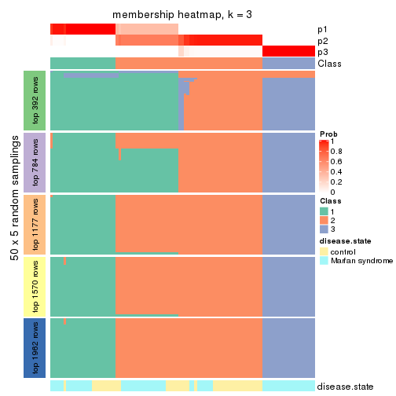</p>

</div>
<div id='tab-ATC-mclust-membership-heatmap-3'>
<pre><code class="r">membership_heatmap(res, k = 4)
</code></pre>

<p></p>

</div>
<div id='tab-ATC-mclust-membership-heatmap-4'>
<pre><code class="r">membership_heatmap(res, k = 5)
</code></pre>

<p></p>

</div>
<div id='tab-ATC-mclust-membership-heatmap-5'>
<pre><code class="r">membership_heatmap(res, k = 6)
</code></pre>

<p></p>

</div>
</div>

As soon as we have had the classes for columns, we can look for signatures
which are significantly different between classes which can be candidate marks
for certain classes. Following are the heatmaps for signatures.


Signature heatmaps where rows are scaled:


<script>
$( function() {
	$( '#tabs-ATC-mclust-get-signatures' ).tabs();
} );
</script>
<div id='tabs-ATC-mclust-get-signatures'>
<ul>
<li><a href='#tab-ATC-mclust-get-signatures-1'>k = 2</a></li>
<li><a href='#tab-ATC-mclust-get-signatures-2'>k = 3</a></li>
<li><a href='#tab-ATC-mclust-get-signatures-3'>k = 4</a></li>
<li><a href='#tab-ATC-mclust-get-signatures-4'>k = 5</a></li>
<li><a href='#tab-ATC-mclust-get-signatures-5'>k = 6</a></li>
</ul>
<div id='tab-ATC-mclust-get-signatures-1'>
<pre><code class="r">get_signatures(res, k = 2)
</code></pre>

<p></p>

</div>
<div id='tab-ATC-mclust-get-signatures-2'>
<pre><code class="r">get_signatures(res, k = 3)
</code></pre>

<p></p>

</div>
<div id='tab-ATC-mclust-get-signatures-3'>
<pre><code class="r">get_signatures(res, k = 4)
</code></pre>

<p></p>

</div>
<div id='tab-ATC-mclust-get-signatures-4'>
<pre><code class="r">get_signatures(res, k = 5)
</code></pre>

<p></p>

</div>
<div id='tab-ATC-mclust-get-signatures-5'>
<pre><code class="r">get_signatures(res, k = 6)
</code></pre>

<p></p>

</div>
</div>


Signature heatmaps where rows are not scaled:


<script>
$( function() {
	$( '#tabs-ATC-mclust-get-signatures-no-scale' ).tabs();
} );
</script>
<div id='tabs-ATC-mclust-get-signatures-no-scale'>
<ul>
<li><a href='#tab-ATC-mclust-get-signatures-no-scale-1'>k = 2</a></li>
<li><a href='#tab-ATC-mclust-get-signatures-no-scale-2'>k = 3</a></li>
<li><a href='#tab-ATC-mclust-get-signatures-no-scale-3'>k = 4</a></li>
<li><a href='#tab-ATC-mclust-get-signatures-no-scale-4'>k = 5</a></li>
<li><a href='#tab-ATC-mclust-get-signatures-no-scale-5'>k = 6</a></li>
</ul>
<div id='tab-ATC-mclust-get-signatures-no-scale-1'>
<pre><code class="r">get_signatures(res, k = 2, scale_rows = FALSE)
</code></pre>

<p></p>

</div>
<div id='tab-ATC-mclust-get-signatures-no-scale-2'>
<pre><code class="r">get_signatures(res, k = 3, scale_rows = FALSE)
</code></pre>

<p></p>

</div>
<div id='tab-ATC-mclust-get-signatures-no-scale-3'>
<pre><code class="r">get_signatures(res, k = 4, scale_rows = FALSE)
</code></pre>

<p></p>

</div>
<div id='tab-ATC-mclust-get-signatures-no-scale-4'>
<pre><code class="r">get_signatures(res, k = 5, scale_rows = FALSE)
</code></pre>

<p></p>

</div>
<div id='tab-ATC-mclust-get-signatures-no-scale-5'>
<pre><code class="r">get_signatures(res, k = 6, scale_rows = FALSE)
</code></pre>

<p></p>

</div>
</div>


Compare the overlap of signatures from different k:

```r
compare_signatures(res)
```


`get_signature()` returns a data frame invisibly. TO get the list of signatures, the function
call should be assigned to a variable explicitly. In following code, if `plot` argument is set
to `FALSE`, no heatmap is plotted while only the differential analysis is performed.

```r
# code only for demonstration
tb = get_signature(res, k = ..., plot = FALSE)
```

An example of the output of `tb` is:

```
#>   which_row         fdr    mean_1    mean_2 scaled_mean_1 scaled_mean_2 km
#> 1        38 0.042760348  8.373488  9.131774    -0.5533452     0.5164555  1
#> 2        40 0.018707592  7.106213  8.469186    -0.6173731     0.5762149  1
#> 3        55 0.019134737 10.221463 11.207825    -0.6159697     0.5749050  1
#> 4        59 0.006059896  5.921854  7.869574    -0.6899429     0.6439467  1
#> 5        60 0.018055526  8.928898 10.211722    -0.6204761     0.5791110  1
#> 6        98 0.009384629 15.714769 14.887706     0.6635654    -0.6193277  2
...
```

The columns in `tb` are:

1. `which_row`: row indices corresponding to the input matrix.
2. `fdr`: FDR for the differential test. 
3. `mean_x`: The mean value in group x.
4. `scaled_mean_x`: The mean value in group x after rows are scaled.
5. `km`: Row groups if k-means clustering is applied to rows.


UMAP plot which shows how samples are separated.


<script>
$( function() {
	$( '#tabs-ATC-mclust-dimension-reduction' ).tabs();
} );
</script>
<div id='tabs-ATC-mclust-dimension-reduction'>
<ul>
<li><a href='#tab-ATC-mclust-dimension-reduction-1'>k = 2</a></li>
<li><a href='#tab-ATC-mclust-dimension-reduction-2'>k = 3</a></li>
<li><a href='#tab-ATC-mclust-dimension-reduction-3'>k = 4</a></li>
<li><a href='#tab-ATC-mclust-dimension-reduction-4'>k = 5</a></li>
<li><a href='#tab-ATC-mclust-dimension-reduction-5'>k = 6</a></li>
</ul>
<div id='tab-ATC-mclust-dimension-reduction-1'>
<pre><code class="r">dimension_reduction(res, k = 2, method = &quot;UMAP&quot;)
</code></pre>

<p></p>

</div>
<div id='tab-ATC-mclust-dimension-reduction-2'>
<pre><code class="r">dimension_reduction(res, k = 3, method = &quot;UMAP&quot;)
</code></pre>

<p></p>

</div>
<div id='tab-ATC-mclust-dimension-reduction-3'>
<pre><code class="r">dimension_reduction(res, k = 4, method = &quot;UMAP&quot;)
</code></pre>

<p></p>

</div>
<div id='tab-ATC-mclust-dimension-reduction-4'>
<pre><code class="r">dimension_reduction(res, k = 5, method = &quot;UMAP&quot;)
</code></pre>

<p></p>

</div>
<div id='tab-ATC-mclust-dimension-reduction-5'>
<pre><code class="r">dimension_reduction(res, k = 6, method = &quot;UMAP&quot;)
</code></pre>

<p></p>

</div>
</div>


Following heatmap shows how subgroups are split when increasing `k`:

```r
collect_classes(res)
```


Test correlation between subgroups and known annotations. If the known
annotation is numeric, one-way ANOVA test is applied, and if the known
annotation is discrete, chi-squared contingency table test is applied.

```r
test_to_known_factors(res)
```

```
#>              n disease.state(p) k
#> ATC:mclust  99         4.58e-01 2
#> ATC:mclust 101         8.56e-05 3
#> ATC:mclust  97         4.86e-06 4
#> ATC:mclust  97         3.79e-06 5
#> ATC:mclust  99         1.92e-10 6
```


If matrix rows can be associated to genes, consider to use `functional_enrichment(res,
...)` to perform function enrichment for the signature genes. See [this vignette](http://bioconductor.org/packages/devel/bioc/vignettes/cola/inst/doc/functional_enrichment.html) for more detailed explanations.


 

---------------------------------------------------


### ATC:NMF**


The object with results only for a single top-value method and a single partition method 
can be extracted as:

```r
res = res_list["ATC", "NMF"]
# you can also extract it by
# res = res_list["ATC:NMF"]
```

A summary of `res` and all the functions that can be applied to it:

```r
res
```

```
#> A 'ConsensusPartition' object with k = 2, 3, 4, 5, 6.
#>   On a matrix with 3925 rows and 101 columns.
#>   Top rows (392, 784, 1177, 1570, 1962) are extracted by 'ATC' method.
#>   Subgroups are detected by 'NMF' method.
#>   Performed in total 1250 partitions by row resampling.
#>   Best k for subgroups seems to be 3.
#> 
#> Following methods can be applied to this 'ConsensusPartition' object:
#>  [1] "cola_report"             "collect_classes"         "collect_plots"          
#>  [4] "collect_stats"           "colnames"                "compare_signatures"     
#>  [7] "consensus_heatmap"       "dimension_reduction"     "functional_enrichment"  
#> [10] "get_anno_col"            "get_anno"                "get_classes"            
#> [13] "get_consensus"           "get_matrix"              "get_membership"         
#> [16] "get_param"               "get_signatures"          "get_stats"              
#> [19] "is_best_k"               "is_stable_k"             "membership_heatmap"     
#> [22] "ncol"                    "nrow"                    "plot_ecdf"              
#> [25] "rownames"                "select_partition_number" "show"                   
#> [28] "suggest_best_k"          "test_to_known_factors"
```

`collect_plots()` function collects all the plots made from `res` for all `k` (number of partitions)
into one single page to provide an easy and fast comparison between different `k`.

```r
collect_plots(res)
```


The plots are:

- The first row: a plot of the ECDF (empirical cumulative distribution
  function) curves of the consensus matrix for each `k` and the heatmap of
  predicted classes for each `k`.
- The second row: heatmaps of the consensus matrix for each `k`.
- The third row: heatmaps of the membership matrix for each `k`.
- The fouth row: heatmaps of the signatures for each `k`.

All the plots in panels can be made by individual functions and they are
plotted later in this section.

`select_partition_number()` produces several plots showing different
statistics for choosing "optimized" `k`. There are following statistics:

- ECDF curves of the consensus matrix for each `k`;
- 1-PAC. [The PAC
  score](https://en.wikipedia.org/wiki/Consensus_clustering#Over-interpretation_potential_of_consensus_clustering)
  measures the proportion of the ambiguous subgrouping.
- Mean silhouette score.
- Concordance. The mean probability of fiting the consensus class ids in all
  partitions.
- Area increased. Denote $A_k$ as the area under the ECDF curve for current
  `k`, the area increased is defined as $A_k - A_{k-1}$.
- Rand index. The percent of pairs of samples that are both in a same cluster
  or both are not in a same cluster in the partition of k and k-1.
- Jaccard index. The ratio of pairs of samples are both in a same cluster in
  the partition of k and k-1 and the pairs of samples are both in a same
  cluster in the partition k or k-1.

The detailed explanations of these statistics can be found in [the _cola_
vignette](http://bioconductor.org/packages/devel/bioc/vignettes/cola/inst/doc/cola.html#toc_13).

Generally speaking, lower PAC score, higher mean silhouette score or higher
concordance corresponds to better partition. Rand index and Jaccard index
measure how similar the current partition is compared to partition with `k-1`.
If they are too similar, we won't accept `k` is better than `k-1`.

```r
select_partition_number(res)
```


The numeric values for all these statistics can be obtained by `get_stats()`.

```r
get_stats(res)
```

```
#>   k 1-PAC mean_silhouette concordance area_increased  Rand Jaccard
#> 2 2 1.000           0.989       0.996         0.5052 0.495   0.495
#> 3 3 1.000           0.973       0.989         0.2507 0.871   0.740
#> 4 4 0.809           0.831       0.907         0.1032 0.939   0.835
#> 5 5 0.783           0.425       0.775         0.0646 0.966   0.894
#> 6 6 0.744           0.498       0.759         0.0283 0.916   0.725
```

`suggest_best_k()` suggests the best $k$ based on these statistics. The rules are as follows:

- All $k$ with Jaccard index larger than 0.95 are removed because increasing
  $k$ does not provide enough extra information. If all $k$ are removed, it is
  marked as no subgroup is detected.
- For all $k$ with 1-PAC score larger than 0.9, the maximal $k$ is taken as
  the best $k$, and other $k$ are marked as optional $k$.
- If it does not fit the second rule. The $k$ with the maximal vote of the
  highest 1-PAC score, highest mean silhouette, and highest concordance is
  taken as the best $k$.

```r
suggest_best_k(res)
```

```
#> [1] 3
#> attr(,"optional")
#> [1] 2
```

There is also optional best $k$ = 2 that is worth to check.

Following shows the table of the partitions (You need to click the **show/hide
code output** link to see it). The membership matrix (columns with name `p*`)
is inferred by
[`clue::cl_consensus()`](https://www.rdocumentation.org/link/cl_consensus?package=clue)
function with the `SE` method. Basically the value in the membership matrix
represents the probability to belong to a certain group. The finall class
label for an item is determined with the group with highest probability it
belongs to.

In `get_classes()` function, the entropy is calculated from the membership
matrix and the silhouette score is calculated from the consensus matrix.


<script>
$( function() {
	$( '#tabs-ATC-NMF-get-classes' ).tabs();
} );
</script>
<div id='tabs-ATC-NMF-get-classes'>
<ul>
<li><a href='#tab-ATC-NMF-get-classes-1'>k = 2</a></li>
<li><a href='#tab-ATC-NMF-get-classes-2'>k = 3</a></li>
<li><a href='#tab-ATC-NMF-get-classes-3'>k = 4</a></li>
<li><a href='#tab-ATC-NMF-get-classes-4'>k = 5</a></li>
<li><a href='#tab-ATC-NMF-get-classes-5'>k = 6</a></li>
</ul>

<div id='tab-ATC-NMF-get-classes-1'>
<p><a id='tab-ATC-NMF-get-classes-1-a' style='color:#0366d6' href='#'>show/hide code output</a></p>
<pre><code class="r">cbind(get_classes(res, k = 2), get_membership(res, k = 2))
</code></pre>

<pre><code>#&gt;           class entropy silhouette    p1    p2
#&gt; GSM217644     2  0.0000      0.992 0.000 1.000
#&gt; GSM217645     2  0.0000      0.992 0.000 1.000
#&gt; GSM217646     2  0.0000      0.992 0.000 1.000
#&gt; GSM217647     2  0.0000      0.992 0.000 1.000
#&gt; GSM217648     2  0.0000      0.992 0.000 1.000
#&gt; GSM217649     2  0.0000      0.992 0.000 1.000
#&gt; GSM217650     2  0.0000      0.992 0.000 1.000
#&gt; GSM217651     2  0.0000      0.992 0.000 1.000
#&gt; GSM217652     2  0.0000      0.992 0.000 1.000
#&gt; GSM217653     2  0.0000      0.992 0.000 1.000
#&gt; GSM217654     2  0.0000      0.992 0.000 1.000
#&gt; GSM217655     2  0.0000      0.992 0.000 1.000
#&gt; GSM217656     2  0.9686      0.345 0.396 0.604
#&gt; GSM217657     2  0.0376      0.988 0.004 0.996
#&gt; GSM217658     2  0.0000      0.992 0.000 1.000
#&gt; GSM217659     2  0.0000      0.992 0.000 1.000
#&gt; GSM217660     2  0.0000      0.992 0.000 1.000
#&gt; GSM217661     2  0.0000      0.992 0.000 1.000
#&gt; GSM217662     2  0.0000      0.992 0.000 1.000
#&gt; GSM217663     2  0.0000      0.992 0.000 1.000
#&gt; GSM217664     2  0.0000      0.992 0.000 1.000
#&gt; GSM217665     2  0.0000      0.992 0.000 1.000
#&gt; GSM217666     2  0.0000      0.992 0.000 1.000
#&gt; GSM217667     2  0.0000      0.992 0.000 1.000
#&gt; GSM217668     1  0.0000      1.000 1.000 0.000
#&gt; GSM217669     1  0.0000      1.000 1.000 0.000
#&gt; GSM217670     1  0.0000      1.000 1.000 0.000
#&gt; GSM217671     1  0.0000      1.000 1.000 0.000
#&gt; GSM217672     1  0.0000      1.000 1.000 0.000
#&gt; GSM217673     1  0.0000      1.000 1.000 0.000
#&gt; GSM217674     1  0.0000      1.000 1.000 0.000
#&gt; GSM217675     1  0.0000      1.000 1.000 0.000
#&gt; GSM217676     1  0.0000      1.000 1.000 0.000
#&gt; GSM217677     1  0.0000      1.000 1.000 0.000
#&gt; GSM217678     1  0.0000      1.000 1.000 0.000
#&gt; GSM217679     1  0.0000      1.000 1.000 0.000
#&gt; GSM217680     1  0.0000      1.000 1.000 0.000
#&gt; GSM217681     1  0.0000      1.000 1.000 0.000
#&gt; GSM217682     1  0.0000      1.000 1.000 0.000
#&gt; GSM217683     1  0.0000      1.000 1.000 0.000
#&gt; GSM217684     1  0.0000      1.000 1.000 0.000
#&gt; GSM217685     2  0.0000      0.992 0.000 1.000
#&gt; GSM217686     2  0.0000      0.992 0.000 1.000
#&gt; GSM217687     2  0.0000      0.992 0.000 1.000
#&gt; GSM217688     2  0.0000      0.992 0.000 1.000
#&gt; GSM217689     2  0.0000      0.992 0.000 1.000
#&gt; GSM217690     2  0.0000      0.992 0.000 1.000
#&gt; GSM217691     2  0.0000      0.992 0.000 1.000
#&gt; GSM217692     2  0.0000      0.992 0.000 1.000
#&gt; GSM217693     2  0.0000      0.992 0.000 1.000
#&gt; GSM217694     2  0.0000      0.992 0.000 1.000
#&gt; GSM217695     2  0.0000      0.992 0.000 1.000
#&gt; GSM217696     2  0.0000      0.992 0.000 1.000
#&gt; GSM217697     2  0.0000      0.992 0.000 1.000
#&gt; GSM217698     2  0.0000      0.992 0.000 1.000
#&gt; GSM217699     2  0.0000      0.992 0.000 1.000
#&gt; GSM217700     2  0.0000      0.992 0.000 1.000
#&gt; GSM217701     2  0.0000      0.992 0.000 1.000
#&gt; GSM217702     2  0.0000      0.992 0.000 1.000
#&gt; GSM217703     2  0.0000      0.992 0.000 1.000
#&gt; GSM217704     2  0.0000      0.992 0.000 1.000
#&gt; GSM217705     1  0.0000      1.000 1.000 0.000
#&gt; GSM217706     1  0.0000      1.000 1.000 0.000
#&gt; GSM217707     1  0.0000      1.000 1.000 0.000
#&gt; GSM217708     1  0.0000      1.000 1.000 0.000
#&gt; GSM217709     1  0.0000      1.000 1.000 0.000
#&gt; GSM217710     1  0.0000      1.000 1.000 0.000
#&gt; GSM217711     1  0.0000      1.000 1.000 0.000
#&gt; GSM217712     1  0.0000      1.000 1.000 0.000
#&gt; GSM217713     1  0.0000      1.000 1.000 0.000
#&gt; GSM217714     1  0.0000      1.000 1.000 0.000
#&gt; GSM217715     1  0.0000      1.000 1.000 0.000
#&gt; GSM217716     1  0.0000      1.000 1.000 0.000
#&gt; GSM217717     1  0.0000      1.000 1.000 0.000
#&gt; GSM217718     1  0.0000      1.000 1.000 0.000
#&gt; GSM217719     1  0.0000      1.000 1.000 0.000
#&gt; GSM217720     1  0.0000      1.000 1.000 0.000
#&gt; GSM217721     1  0.0000      1.000 1.000 0.000
#&gt; GSM217722     1  0.0000      1.000 1.000 0.000
#&gt; GSM217723     1  0.0000      1.000 1.000 0.000
#&gt; GSM217724     1  0.0000      1.000 1.000 0.000
#&gt; GSM217725     1  0.0000      1.000 1.000 0.000
#&gt; GSM217726     1  0.0000      1.000 1.000 0.000
#&gt; GSM217727     1  0.0000      1.000 1.000 0.000
#&gt; GSM217728     1  0.0000      1.000 1.000 0.000
#&gt; GSM217729     1  0.0000      1.000 1.000 0.000
#&gt; GSM217730     1  0.0000      1.000 1.000 0.000
#&gt; GSM217731     1  0.0000      1.000 1.000 0.000
#&gt; GSM217732     1  0.0000      1.000 1.000 0.000
#&gt; GSM217733     1  0.0000      1.000 1.000 0.000
#&gt; GSM217734     1  0.0000      1.000 1.000 0.000
#&gt; GSM217735     1  0.0000      1.000 1.000 0.000
#&gt; GSM217736     1  0.0000      1.000 1.000 0.000
#&gt; GSM217737     2  0.0000      0.992 0.000 1.000
#&gt; GSM217738     2  0.0000      0.992 0.000 1.000
#&gt; GSM217739     2  0.0000      0.992 0.000 1.000
#&gt; GSM217740     2  0.0000      0.992 0.000 1.000
#&gt; GSM217741     2  0.0000      0.992 0.000 1.000
#&gt; GSM217742     2  0.0000      0.992 0.000 1.000
#&gt; GSM217743     2  0.0000      0.992 0.000 1.000
#&gt; GSM217744     2  0.0000      0.992 0.000 1.000
</code></pre>

<script>
$('#tab-ATC-NMF-get-classes-1-a').parent().next().next().hide();
$('#tab-ATC-NMF-get-classes-1-a').click(function(){
  $('#tab-ATC-NMF-get-classes-1-a').parent().next().next().toggle();
  return(false);
});
</script>
</div>

<div id='tab-ATC-NMF-get-classes-2'>
<p><a id='tab-ATC-NMF-get-classes-2-a' style='color:#0366d6' href='#'>show/hide code output</a></p>
<pre><code class="r">cbind(get_classes(res, k = 3), get_membership(res, k = 3))
</code></pre>

<pre><code>#&gt;           class entropy silhouette    p1    p2    p3
#&gt; GSM217644     2  0.0000      0.988 0.000 1.000 0.000
#&gt; GSM217645     2  0.0424      0.981 0.008 0.992 0.000
#&gt; GSM217646     2  0.0000      0.988 0.000 1.000 0.000
#&gt; GSM217647     2  0.0000      0.988 0.000 1.000 0.000
#&gt; GSM217648     2  0.0000      0.988 0.000 1.000 0.000
#&gt; GSM217649     2  0.0237      0.985 0.004 0.996 0.000
#&gt; GSM217650     2  0.0000      0.988 0.000 1.000 0.000
#&gt; GSM217651     2  0.0000      0.988 0.000 1.000 0.000
#&gt; GSM217652     2  0.0000      0.988 0.000 1.000 0.000
#&gt; GSM217653     2  0.0000      0.988 0.000 1.000 0.000
#&gt; GSM217654     2  0.1832      0.946 0.036 0.956 0.008
#&gt; GSM217655     2  0.2703      0.917 0.056 0.928 0.016
#&gt; GSM217656     3  0.9226      0.143 0.412 0.152 0.436
#&gt; GSM217657     2  0.4968      0.761 0.012 0.800 0.188
#&gt; GSM217658     2  0.0000      0.988 0.000 1.000 0.000
#&gt; GSM217659     2  0.0000      0.988 0.000 1.000 0.000
#&gt; GSM217660     2  0.0000      0.988 0.000 1.000 0.000
#&gt; GSM217661     2  0.0000      0.988 0.000 1.000 0.000
#&gt; GSM217662     2  0.0000      0.988 0.000 1.000 0.000
#&gt; GSM217663     2  0.0000      0.988 0.000 1.000 0.000
#&gt; GSM217664     2  0.0000      0.988 0.000 1.000 0.000
#&gt; GSM217665     2  0.0000      0.988 0.000 1.000 0.000
#&gt; GSM217666     2  0.0000      0.988 0.000 1.000 0.000
#&gt; GSM217667     2  0.0000      0.988 0.000 1.000 0.000
#&gt; GSM217668     1  0.4605      0.741 0.796 0.204 0.000
#&gt; GSM217669     1  0.0000      0.995 1.000 0.000 0.000
#&gt; GSM217670     1  0.0000      0.995 1.000 0.000 0.000
#&gt; GSM217671     1  0.0000      0.995 1.000 0.000 0.000
#&gt; GSM217672     1  0.0000      0.995 1.000 0.000 0.000
#&gt; GSM217673     1  0.0000      0.995 1.000 0.000 0.000
#&gt; GSM217674     1  0.0000      0.995 1.000 0.000 0.000
#&gt; GSM217675     1  0.0000      0.995 1.000 0.000 0.000
#&gt; GSM217676     1  0.0000      0.995 1.000 0.000 0.000
#&gt; GSM217677     1  0.0000      0.995 1.000 0.000 0.000
#&gt; GSM217678     1  0.0000      0.995 1.000 0.000 0.000
#&gt; GSM217679     1  0.0000      0.995 1.000 0.000 0.000
#&gt; GSM217680     1  0.0000      0.995 1.000 0.000 0.000
#&gt; GSM217681     1  0.0000      0.995 1.000 0.000 0.000
#&gt; GSM217682     1  0.0000      0.995 1.000 0.000 0.000
#&gt; GSM217683     1  0.0000      0.995 1.000 0.000 0.000
#&gt; GSM217684     1  0.0000      0.995 1.000 0.000 0.000
#&gt; GSM217685     3  0.0237      0.968 0.000 0.004 0.996
#&gt; GSM217686     3  0.0000      0.971 0.000 0.000 1.000
#&gt; GSM217687     3  0.0000      0.971 0.000 0.000 1.000
#&gt; GSM217688     3  0.0000      0.971 0.000 0.000 1.000
#&gt; GSM217689     3  0.0000      0.971 0.000 0.000 1.000
#&gt; GSM217690     3  0.0000      0.971 0.000 0.000 1.000
#&gt; GSM217691     3  0.0000      0.971 0.000 0.000 1.000
#&gt; GSM217692     3  0.0424      0.965 0.000 0.008 0.992
#&gt; GSM217693     3  0.0000      0.971 0.000 0.000 1.000
#&gt; GSM217694     3  0.0000      0.971 0.000 0.000 1.000
#&gt; GSM217695     3  0.0000      0.971 0.000 0.000 1.000
#&gt; GSM217696     3  0.0000      0.971 0.000 0.000 1.000
#&gt; GSM217697     3  0.0000      0.971 0.000 0.000 1.000
#&gt; GSM217698     3  0.0000      0.971 0.000 0.000 1.000
#&gt; GSM217699     3  0.0000      0.971 0.000 0.000 1.000
#&gt; GSM217700     3  0.0237      0.968 0.000 0.004 0.996
#&gt; GSM217701     3  0.0237      0.968 0.000 0.004 0.996
#&gt; GSM217702     3  0.0000      0.971 0.000 0.000 1.000
#&gt; GSM217703     3  0.0000      0.971 0.000 0.000 1.000
#&gt; GSM217704     3  0.0000      0.971 0.000 0.000 1.000
#&gt; GSM217705     1  0.0000      0.995 1.000 0.000 0.000
#&gt; GSM217706     1  0.0000      0.995 1.000 0.000 0.000
#&gt; GSM217707     1  0.0000      0.995 1.000 0.000 0.000
#&gt; GSM217708     1  0.0000      0.995 1.000 0.000 0.000
#&gt; GSM217709     1  0.0000      0.995 1.000 0.000 0.000
#&gt; GSM217710     1  0.0000      0.995 1.000 0.000 0.000
#&gt; GSM217711     1  0.0000      0.995 1.000 0.000 0.000
#&gt; GSM217712     1  0.0000      0.995 1.000 0.000 0.000
#&gt; GSM217713     1  0.0000      0.995 1.000 0.000 0.000
#&gt; GSM217714     1  0.0000      0.995 1.000 0.000 0.000
#&gt; GSM217715     1  0.0000      0.995 1.000 0.000 0.000
#&gt; GSM217716     1  0.0000      0.995 1.000 0.000 0.000
#&gt; GSM217717     1  0.0000      0.995 1.000 0.000 0.000
#&gt; GSM217718     1  0.0000      0.995 1.000 0.000 0.000
#&gt; GSM217719     1  0.0000      0.995 1.000 0.000 0.000
#&gt; GSM217720     1  0.0000      0.995 1.000 0.000 0.000
#&gt; GSM217721     1  0.0000      0.995 1.000 0.000 0.000
#&gt; GSM217722     1  0.0000      0.995 1.000 0.000 0.000
#&gt; GSM217723     1  0.0000      0.995 1.000 0.000 0.000
#&gt; GSM217724     1  0.0000      0.995 1.000 0.000 0.000
#&gt; GSM217725     1  0.1031      0.971 0.976 0.000 0.024
#&gt; GSM217726     1  0.0000      0.995 1.000 0.000 0.000
#&gt; GSM217727     1  0.0000      0.995 1.000 0.000 0.000
#&gt; GSM217728     1  0.0000      0.995 1.000 0.000 0.000
#&gt; GSM217729     1  0.0000      0.995 1.000 0.000 0.000
#&gt; GSM217730     1  0.0000      0.995 1.000 0.000 0.000
#&gt; GSM217731     1  0.0000      0.995 1.000 0.000 0.000
#&gt; GSM217732     1  0.0000      0.995 1.000 0.000 0.000
#&gt; GSM217733     1  0.0000      0.995 1.000 0.000 0.000
#&gt; GSM217734     1  0.0000      0.995 1.000 0.000 0.000
#&gt; GSM217735     1  0.0000      0.995 1.000 0.000 0.000
#&gt; GSM217736     1  0.0000      0.995 1.000 0.000 0.000
#&gt; GSM217737     2  0.0237      0.985 0.000 0.996 0.004
#&gt; GSM217738     2  0.0424      0.982 0.000 0.992 0.008
#&gt; GSM217739     2  0.0000      0.988 0.000 1.000 0.000
#&gt; GSM217740     2  0.0000      0.988 0.000 1.000 0.000
#&gt; GSM217741     2  0.0000      0.988 0.000 1.000 0.000
#&gt; GSM217742     2  0.0000      0.988 0.000 1.000 0.000
#&gt; GSM217743     2  0.0000      0.988 0.000 1.000 0.000
#&gt; GSM217744     2  0.0000      0.988 0.000 1.000 0.000
</code></pre>

<script>
$('#tab-ATC-NMF-get-classes-2-a').parent().next().next().hide();
$('#tab-ATC-NMF-get-classes-2-a').click(function(){
  $('#tab-ATC-NMF-get-classes-2-a').parent().next().next().toggle();
  return(false);
});
</script>
</div>

<div id='tab-ATC-NMF-get-classes-3'>
<p><a id='tab-ATC-NMF-get-classes-3-a' style='color:#0366d6' href='#'>show/hide code output</a></p>
<pre><code class="r">cbind(get_classes(res, k = 4), get_membership(res, k = 4))
</code></pre>

<pre><code>#&gt;           class entropy silhouette    p1    p2    p3    p4
#&gt; GSM217644     2  0.0336     0.9330 0.000 0.992 0.000 0.008
#&gt; GSM217645     2  0.2469     0.8531 0.000 0.892 0.000 0.108
#&gt; GSM217646     2  0.0469     0.9329 0.000 0.988 0.000 0.012
#&gt; GSM217647     2  0.0188     0.9336 0.000 0.996 0.000 0.004
#&gt; GSM217648     2  0.0000     0.9333 0.000 1.000 0.000 0.000
#&gt; GSM217649     2  0.0336     0.9335 0.000 0.992 0.000 0.008
#&gt; GSM217650     2  0.0707     0.9309 0.000 0.980 0.000 0.020
#&gt; GSM217651     2  0.0188     0.9338 0.000 0.996 0.000 0.004
#&gt; GSM217652     2  0.0707     0.9294 0.000 0.980 0.000 0.020
#&gt; GSM217653     2  0.0188     0.9335 0.000 0.996 0.000 0.004
#&gt; GSM217654     4  0.3569     0.5170 0.000 0.196 0.000 0.804
#&gt; GSM217655     2  0.3837     0.7263 0.000 0.776 0.000 0.224
#&gt; GSM217656     4  0.1909     0.6015 0.008 0.004 0.048 0.940
#&gt; GSM217657     4  0.1902     0.5895 0.000 0.004 0.064 0.932
#&gt; GSM217658     2  0.0336     0.9335 0.000 0.992 0.000 0.008
#&gt; GSM217659     2  0.0469     0.9329 0.000 0.988 0.000 0.012
#&gt; GSM217660     2  0.0469     0.9333 0.000 0.988 0.000 0.012
#&gt; GSM217661     2  0.3486     0.7616 0.000 0.812 0.000 0.188
#&gt; GSM217662     2  0.1302     0.9151 0.000 0.956 0.000 0.044
#&gt; GSM217663     2  0.0000     0.9333 0.000 1.000 0.000 0.000
#&gt; GSM217664     2  0.0336     0.9335 0.000 0.992 0.000 0.008
#&gt; GSM217665     2  0.0188     0.9336 0.000 0.996 0.000 0.004
#&gt; GSM217666     2  0.0188     0.9336 0.000 0.996 0.000 0.004
#&gt; GSM217667     2  0.0188     0.9336 0.000 0.996 0.000 0.004
#&gt; GSM217668     1  0.4171     0.8300 0.828 0.084 0.000 0.088
#&gt; GSM217669     1  0.3311     0.8727 0.828 0.000 0.000 0.172
#&gt; GSM217670     1  0.2081     0.8897 0.916 0.000 0.000 0.084
#&gt; GSM217671     1  0.1716     0.8901 0.936 0.000 0.000 0.064
#&gt; GSM217672     1  0.2216     0.8889 0.908 0.000 0.000 0.092
#&gt; GSM217673     1  0.2081     0.8895 0.916 0.000 0.000 0.084
#&gt; GSM217674     1  0.0592     0.8772 0.984 0.000 0.000 0.016
#&gt; GSM217675     1  0.0188     0.8842 0.996 0.000 0.000 0.004
#&gt; GSM217676     1  0.0000     0.8860 1.000 0.000 0.000 0.000
#&gt; GSM217677     1  0.0000     0.8860 1.000 0.000 0.000 0.000
#&gt; GSM217678     1  0.0000     0.8860 1.000 0.000 0.000 0.000
#&gt; GSM217679     1  0.0707     0.8744 0.980 0.000 0.000 0.020
#&gt; GSM217680     1  0.0000     0.8860 1.000 0.000 0.000 0.000
#&gt; GSM217681     1  0.0000     0.8860 1.000 0.000 0.000 0.000
#&gt; GSM217682     1  0.0188     0.8842 0.996 0.000 0.000 0.004
#&gt; GSM217683     1  0.0000     0.8860 1.000 0.000 0.000 0.000
#&gt; GSM217684     1  0.1867     0.8900 0.928 0.000 0.000 0.072
#&gt; GSM217685     3  0.2011     0.9158 0.000 0.000 0.920 0.080
#&gt; GSM217686     3  0.1211     0.9430 0.000 0.000 0.960 0.040
#&gt; GSM217687     3  0.0592     0.9562 0.000 0.000 0.984 0.016
#&gt; GSM217688     3  0.0592     0.9562 0.000 0.000 0.984 0.016
#&gt; GSM217689     3  0.4585     0.5689 0.000 0.000 0.668 0.332
#&gt; GSM217690     3  0.2647     0.8756 0.000 0.000 0.880 0.120
#&gt; GSM217691     3  0.0707     0.9522 0.000 0.000 0.980 0.020
#&gt; GSM217692     3  0.0000     0.9600 0.000 0.000 1.000 0.000
#&gt; GSM217693     3  0.0000     0.9600 0.000 0.000 1.000 0.000
#&gt; GSM217694     3  0.0188     0.9593 0.000 0.000 0.996 0.004
#&gt; GSM217695     3  0.0336     0.9583 0.000 0.000 0.992 0.008
#&gt; GSM217696     3  0.0000     0.9600 0.000 0.000 1.000 0.000
#&gt; GSM217697     3  0.0188     0.9596 0.000 0.000 0.996 0.004
#&gt; GSM217698     3  0.0188     0.9596 0.000 0.000 0.996 0.004
#&gt; GSM217699     3  0.0188     0.9593 0.000 0.000 0.996 0.004
#&gt; GSM217700     3  0.0592     0.9548 0.000 0.000 0.984 0.016
#&gt; GSM217701     3  0.1716     0.9233 0.000 0.000 0.936 0.064
#&gt; GSM217702     3  0.0336     0.9594 0.000 0.000 0.992 0.008
#&gt; GSM217703     4  0.4985    -0.1753 0.000 0.000 0.468 0.532
#&gt; GSM217704     3  0.0188     0.9593 0.000 0.000 0.996 0.004
#&gt; GSM217705     1  0.3356     0.8707 0.824 0.000 0.000 0.176
#&gt; GSM217706     1  0.3311     0.8727 0.828 0.000 0.000 0.172
#&gt; GSM217707     1  0.3311     0.8727 0.828 0.000 0.000 0.172
#&gt; GSM217708     1  0.4877     0.4900 0.592 0.000 0.000 0.408
#&gt; GSM217709     4  0.4888     0.0167 0.412 0.000 0.000 0.588
#&gt; GSM217710     4  0.4193     0.4377 0.268 0.000 0.000 0.732
#&gt; GSM217711     4  0.3356     0.5796 0.176 0.000 0.000 0.824
#&gt; GSM217712     1  0.3486     0.8626 0.812 0.000 0.000 0.188
#&gt; GSM217713     1  0.3356     0.8707 0.824 0.000 0.000 0.176
#&gt; GSM217714     1  0.3311     0.8736 0.828 0.000 0.000 0.172
#&gt; GSM217715     1  0.3266     0.8743 0.832 0.000 0.000 0.168
#&gt; GSM217716     1  0.3311     0.8727 0.828 0.000 0.000 0.172
#&gt; GSM217717     1  0.3400     0.8684 0.820 0.000 0.000 0.180
#&gt; GSM217718     1  0.4855     0.5259 0.600 0.000 0.000 0.400
#&gt; GSM217719     1  0.3649     0.8487 0.796 0.000 0.000 0.204
#&gt; GSM217720     1  0.3311     0.8727 0.828 0.000 0.000 0.172
#&gt; GSM217721     1  0.3486     0.8626 0.812 0.000 0.000 0.188
#&gt; GSM217722     1  0.3400     0.8683 0.820 0.000 0.000 0.180
#&gt; GSM217723     1  0.3356     0.8710 0.824 0.000 0.000 0.176
#&gt; GSM217724     1  0.3356     0.8707 0.824 0.000 0.000 0.176
#&gt; GSM217725     1  0.3074     0.8793 0.848 0.000 0.000 0.152
#&gt; GSM217726     1  0.0469     0.8797 0.988 0.000 0.000 0.012
#&gt; GSM217727     1  0.0336     0.8821 0.992 0.000 0.000 0.008
#&gt; GSM217728     1  0.3074     0.8792 0.848 0.000 0.000 0.152
#&gt; GSM217729     1  0.0188     0.8865 0.996 0.000 0.000 0.004
#&gt; GSM217730     1  0.0000     0.8860 1.000 0.000 0.000 0.000
#&gt; GSM217731     1  0.0000     0.8860 1.000 0.000 0.000 0.000
#&gt; GSM217732     1  0.0000     0.8860 1.000 0.000 0.000 0.000
#&gt; GSM217733     1  0.0000     0.8860 1.000 0.000 0.000 0.000
#&gt; GSM217734     1  0.0188     0.8842 0.996 0.000 0.000 0.004
#&gt; GSM217735     1  0.0000     0.8860 1.000 0.000 0.000 0.000
#&gt; GSM217736     1  0.0000     0.8860 1.000 0.000 0.000 0.000
#&gt; GSM217737     4  0.5600     0.2672 0.000 0.376 0.028 0.596
#&gt; GSM217738     4  0.5193     0.1831 0.000 0.412 0.008 0.580
#&gt; GSM217739     2  0.4837     0.4291 0.000 0.648 0.004 0.348
#&gt; GSM217740     2  0.4920     0.3818 0.000 0.628 0.004 0.368
#&gt; GSM217741     2  0.0895     0.9247 0.000 0.976 0.004 0.020
#&gt; GSM217742     2  0.1661     0.9021 0.000 0.944 0.004 0.052
#&gt; GSM217743     2  0.1398     0.9116 0.000 0.956 0.004 0.040
#&gt; GSM217744     2  0.0779     0.9267 0.000 0.980 0.004 0.016
</code></pre>

<script>
$('#tab-ATC-NMF-get-classes-3-a').parent().next().next().hide();
$('#tab-ATC-NMF-get-classes-3-a').click(function(){
  $('#tab-ATC-NMF-get-classes-3-a').parent().next().next().toggle();
  return(false);
});
</script>
</div>

<div id='tab-ATC-NMF-get-classes-4'>
<p><a id='tab-ATC-NMF-get-classes-4-a' style='color:#0366d6' href='#'>show/hide code output</a></p>
<pre><code class="r">cbind(get_classes(res, k = 5), get_membership(res, k = 5))
</code></pre>

<pre><code>#&gt;           class entropy silhouette    p1    p2    p3    p4    p5
#&gt; GSM217644     2  0.0992     0.8629 0.008 0.968 0.000 0.000 0.024
#&gt; GSM217645     2  0.3841     0.7560 0.032 0.808 0.000 0.012 0.148
#&gt; GSM217646     2  0.2411     0.8410 0.108 0.884 0.000 0.000 0.008
#&gt; GSM217647     2  0.0566     0.8628 0.012 0.984 0.000 0.000 0.004
#&gt; GSM217648     2  0.0912     0.8587 0.012 0.972 0.000 0.000 0.016
#&gt; GSM217649     2  0.1410     0.8591 0.060 0.940 0.000 0.000 0.000
#&gt; GSM217650     2  0.2659     0.8390 0.060 0.888 0.000 0.000 0.052
#&gt; GSM217651     2  0.1818     0.8627 0.044 0.932 0.000 0.000 0.024
#&gt; GSM217652     2  0.2300     0.8502 0.052 0.908 0.000 0.000 0.040
#&gt; GSM217653     2  0.0912     0.8637 0.012 0.972 0.000 0.000 0.016
#&gt; GSM217654     5  0.1883     0.6416 0.008 0.048 0.000 0.012 0.932
#&gt; GSM217655     5  0.6024     0.2038 0.132 0.336 0.000 0.000 0.532
#&gt; GSM217656     5  0.1280     0.6541 0.000 0.008 0.008 0.024 0.960
#&gt; GSM217657     5  0.1334     0.6528 0.004 0.012 0.004 0.020 0.960
#&gt; GSM217658     2  0.1197     0.8606 0.048 0.952 0.000 0.000 0.000
#&gt; GSM217659     2  0.1851     0.8513 0.088 0.912 0.000 0.000 0.000
#&gt; GSM217660     2  0.2423     0.8543 0.080 0.896 0.000 0.000 0.024
#&gt; GSM217661     2  0.4394     0.6871 0.036 0.744 0.000 0.008 0.212
#&gt; GSM217662     2  0.2969     0.8022 0.020 0.852 0.000 0.000 0.128
#&gt; GSM217663     2  0.0671     0.8643 0.016 0.980 0.000 0.000 0.004
#&gt; GSM217664     2  0.1965     0.8570 0.052 0.924 0.000 0.000 0.024
#&gt; GSM217665     2  0.0566     0.8628 0.004 0.984 0.000 0.000 0.012
#&gt; GSM217666     2  0.0566     0.8633 0.004 0.984 0.000 0.000 0.012
#&gt; GSM217667     2  0.0451     0.8637 0.004 0.988 0.000 0.000 0.008
#&gt; GSM217668     4  0.1074     0.5116 0.016 0.004 0.000 0.968 0.012
#&gt; GSM217669     4  0.0162     0.5183 0.004 0.000 0.000 0.996 0.000
#&gt; GSM217670     4  0.1124     0.5022 0.036 0.000 0.000 0.960 0.004
#&gt; GSM217671     4  0.0703     0.5095 0.024 0.000 0.000 0.976 0.000
#&gt; GSM217672     4  0.0609     0.5119 0.020 0.000 0.000 0.980 0.000
#&gt; GSM217673     4  0.0566     0.5149 0.012 0.000 0.000 0.984 0.004
#&gt; GSM217674     4  0.4307    -0.6826 0.500 0.000 0.000 0.500 0.000
#&gt; GSM217675     4  0.4304    -0.6287 0.484 0.000 0.000 0.516 0.000
#&gt; GSM217676     4  0.4287    -0.5619 0.460 0.000 0.000 0.540 0.000
#&gt; GSM217677     1  0.4307     0.3508 0.500 0.000 0.000 0.500 0.000
#&gt; GSM217678     4  0.4300    -0.6021 0.476 0.000 0.000 0.524 0.000
#&gt; GSM217679     4  0.4305    -0.6400 0.488 0.000 0.000 0.512 0.000
#&gt; GSM217680     4  0.4302    -0.6140 0.480 0.000 0.000 0.520 0.000
#&gt; GSM217681     4  0.4278    -0.5468 0.452 0.000 0.000 0.548 0.000
#&gt; GSM217682     4  0.4305    -0.6395 0.488 0.000 0.000 0.512 0.000
#&gt; GSM217683     4  0.4306    -0.6537 0.492 0.000 0.000 0.508 0.000
#&gt; GSM217684     4  0.0880     0.5038 0.032 0.000 0.000 0.968 0.000
#&gt; GSM217685     3  0.1124     0.9517 0.004 0.000 0.960 0.000 0.036
#&gt; GSM217686     3  0.1357     0.9411 0.048 0.000 0.948 0.000 0.004
#&gt; GSM217687     3  0.0324     0.9618 0.004 0.000 0.992 0.000 0.004
#&gt; GSM217688     3  0.0671     0.9595 0.004 0.000 0.980 0.000 0.016
#&gt; GSM217689     3  0.3790     0.6526 0.004 0.000 0.724 0.000 0.272
#&gt; GSM217690     3  0.1608     0.9261 0.000 0.000 0.928 0.000 0.072
#&gt; GSM217691     3  0.0162     0.9613 0.004 0.000 0.996 0.000 0.000
#&gt; GSM217692     3  0.0510     0.9599 0.016 0.000 0.984 0.000 0.000
#&gt; GSM217693     3  0.0290     0.9613 0.008 0.000 0.992 0.000 0.000
#&gt; GSM217694     3  0.0451     0.9621 0.008 0.000 0.988 0.000 0.004
#&gt; GSM217695     3  0.0162     0.9613 0.004 0.000 0.996 0.000 0.000
#&gt; GSM217696     3  0.0404     0.9611 0.012 0.000 0.988 0.000 0.000
#&gt; GSM217697     3  0.1671     0.9233 0.076 0.000 0.924 0.000 0.000
#&gt; GSM217698     3  0.0000     0.9616 0.000 0.000 1.000 0.000 0.000
#&gt; GSM217699     3  0.0324     0.9617 0.004 0.000 0.992 0.000 0.004
#&gt; GSM217700     3  0.2095     0.9175 0.060 0.008 0.920 0.000 0.012
#&gt; GSM217701     3  0.1251     0.9499 0.008 0.000 0.956 0.000 0.036
#&gt; GSM217702     3  0.0000     0.9616 0.000 0.000 1.000 0.000 0.000
#&gt; GSM217703     5  0.4443    -0.1337 0.004 0.000 0.472 0.000 0.524
#&gt; GSM217704     3  0.0510     0.9607 0.016 0.000 0.984 0.000 0.000
#&gt; GSM217705     4  0.0000     0.5187 0.000 0.000 0.000 1.000 0.000
#&gt; GSM217706     4  0.0451     0.5185 0.008 0.000 0.000 0.988 0.004
#&gt; GSM217707     4  0.0693     0.5154 0.012 0.000 0.000 0.980 0.008
#&gt; GSM217708     4  0.1628     0.4652 0.008 0.000 0.000 0.936 0.056
#&gt; GSM217709     4  0.2358     0.3942 0.008 0.000 0.000 0.888 0.104
#&gt; GSM217710     5  0.4300     0.2888 0.000 0.000 0.000 0.476 0.524
#&gt; GSM217711     5  0.4015     0.4738 0.000 0.000 0.000 0.348 0.652
#&gt; GSM217712     4  0.0451     0.5161 0.008 0.000 0.000 0.988 0.004
#&gt; GSM217713     4  0.0162     0.5185 0.000 0.000 0.000 0.996 0.004
#&gt; GSM217714     4  0.0451     0.5185 0.008 0.000 0.000 0.988 0.004
#&gt; GSM217715     4  0.0451     0.5185 0.008 0.000 0.000 0.988 0.004
#&gt; GSM217716     4  0.0324     0.5185 0.004 0.000 0.000 0.992 0.004
#&gt; GSM217717     4  0.0290     0.5182 0.008 0.000 0.000 0.992 0.000
#&gt; GSM217718     4  0.0579     0.5128 0.008 0.000 0.000 0.984 0.008
#&gt; GSM217719     4  0.0451     0.5161 0.008 0.000 0.000 0.988 0.004
#&gt; GSM217720     4  0.0000     0.5187 0.000 0.000 0.000 1.000 0.000
#&gt; GSM217721     4  0.0290     0.5182 0.008 0.000 0.000 0.992 0.000
#&gt; GSM217722     4  0.0451     0.5185 0.008 0.000 0.000 0.988 0.004
#&gt; GSM217723     4  0.2540     0.4123 0.088 0.000 0.000 0.888 0.024
#&gt; GSM217724     4  0.3730    -0.0747 0.288 0.000 0.000 0.712 0.000
#&gt; GSM217725     1  0.6459     0.4854 0.420 0.000 0.000 0.400 0.180
#&gt; GSM217726     4  0.4294    -0.5819 0.468 0.000 0.000 0.532 0.000
#&gt; GSM217727     4  0.4302    -0.6140 0.480 0.000 0.000 0.520 0.000
#&gt; GSM217728     4  0.5501    -0.6648 0.444 0.000 0.000 0.492 0.064
#&gt; GSM217729     4  0.4287    -0.5619 0.460 0.000 0.000 0.540 0.000
#&gt; GSM217730     4  0.4291    -0.5705 0.464 0.000 0.000 0.536 0.000
#&gt; GSM217731     4  0.4268    -0.5304 0.444 0.000 0.000 0.556 0.000
#&gt; GSM217732     4  0.4294    -0.5807 0.468 0.000 0.000 0.532 0.000
#&gt; GSM217733     4  0.4235    -0.4864 0.424 0.000 0.000 0.576 0.000
#&gt; GSM217734     4  0.4297    -0.5915 0.472 0.000 0.000 0.528 0.000
#&gt; GSM217735     4  0.4300    -0.6021 0.476 0.000 0.000 0.524 0.000
#&gt; GSM217736     4  0.4294    -0.5810 0.468 0.000 0.000 0.532 0.000
#&gt; GSM217737     5  0.5091     0.4902 0.088 0.236 0.000 0.000 0.676
#&gt; GSM217738     5  0.6644     0.3112 0.236 0.276 0.004 0.000 0.484
#&gt; GSM217739     2  0.5620     0.5361 0.272 0.612 0.000 0.000 0.116
#&gt; GSM217740     2  0.5738     0.5193 0.264 0.604 0.000 0.000 0.132
#&gt; GSM217741     2  0.3779     0.7367 0.200 0.776 0.000 0.000 0.024
#&gt; GSM217742     2  0.4250     0.6848 0.252 0.720 0.000 0.000 0.028
#&gt; GSM217743     2  0.4206     0.6721 0.272 0.708 0.000 0.000 0.020
#&gt; GSM217744     2  0.3861     0.6891 0.264 0.728 0.000 0.000 0.008
</code></pre>

<script>
$('#tab-ATC-NMF-get-classes-4-a').parent().next().next().hide();
$('#tab-ATC-NMF-get-classes-4-a').click(function(){
  $('#tab-ATC-NMF-get-classes-4-a').parent().next().next().toggle();
  return(false);
});
</script>
</div>

<div id='tab-ATC-NMF-get-classes-5'>
<p><a id='tab-ATC-NMF-get-classes-5-a' style='color:#0366d6' href='#'>show/hide code output</a></p>
<pre><code class="r">cbind(get_classes(res, k = 6), get_membership(res, k = 6))
</code></pre>

<pre><code>#&gt;           class entropy silhouette    p1    p2    p3    p4    p5    p6
#&gt; GSM217644     2  0.2737     0.8308 0.004 0.876 0.000 0.004 0.056 0.060
#&gt; GSM217645     2  0.4878     0.6728 0.020 0.712 0.000 0.012 0.072 0.184
#&gt; GSM217646     2  0.2403     0.8173 0.040 0.900 0.000 0.000 0.040 0.020
#&gt; GSM217647     2  0.1967     0.8173 0.012 0.904 0.000 0.000 0.084 0.000
#&gt; GSM217648     2  0.3050     0.5594 0.000 0.764 0.000 0.000 0.236 0.000
#&gt; GSM217649     2  0.1265     0.8282 0.008 0.948 0.000 0.000 0.044 0.000
#&gt; GSM217650     2  0.3817     0.7556 0.020 0.792 0.000 0.000 0.048 0.140
#&gt; GSM217651     2  0.2094     0.8386 0.004 0.908 0.000 0.000 0.064 0.024
#&gt; GSM217652     2  0.2872     0.8022 0.008 0.864 0.000 0.000 0.052 0.076
#&gt; GSM217653     2  0.2639     0.8288 0.008 0.880 0.000 0.000 0.064 0.048
#&gt; GSM217654     6  0.2078     0.5150 0.004 0.044 0.000 0.000 0.040 0.912
#&gt; GSM217655     6  0.5441    -0.0158 0.028 0.388 0.000 0.000 0.060 0.524
#&gt; GSM217656     6  0.2952     0.5264 0.016 0.008 0.032 0.004 0.064 0.876
#&gt; GSM217657     6  0.2271     0.5273 0.008 0.012 0.016 0.000 0.056 0.908
#&gt; GSM217658     2  0.0858     0.8315 0.004 0.968 0.000 0.000 0.028 0.000
#&gt; GSM217659     2  0.1401     0.8316 0.020 0.948 0.000 0.000 0.028 0.004
#&gt; GSM217660     2  0.2993     0.7582 0.028 0.844 0.000 0.000 0.120 0.008
#&gt; GSM217661     2  0.4577     0.6503 0.012 0.684 0.000 0.000 0.056 0.248
#&gt; GSM217662     2  0.5493     0.6508 0.060 0.660 0.000 0.000 0.104 0.176
#&gt; GSM217663     2  0.1167     0.8402 0.008 0.960 0.000 0.000 0.020 0.012
#&gt; GSM217664     2  0.1649     0.8340 0.008 0.936 0.000 0.000 0.040 0.016
#&gt; GSM217665     2  0.1787     0.8269 0.008 0.920 0.000 0.000 0.068 0.004
#&gt; GSM217666     2  0.2053     0.8094 0.004 0.888 0.000 0.000 0.108 0.000
#&gt; GSM217667     2  0.2020     0.7977 0.000 0.896 0.000 0.000 0.096 0.008
#&gt; GSM217668     4  0.2516     0.5225 0.084 0.004 0.000 0.884 0.024 0.004
#&gt; GSM217669     4  0.0405     0.5803 0.008 0.000 0.000 0.988 0.004 0.000
#&gt; GSM217670     4  0.1082     0.5707 0.040 0.000 0.000 0.956 0.004 0.000
#&gt; GSM217671     4  0.1010     0.5633 0.036 0.000 0.000 0.960 0.004 0.000
#&gt; GSM217672     4  0.0603     0.5775 0.016 0.000 0.000 0.980 0.004 0.000
#&gt; GSM217673     4  0.0858     0.5736 0.028 0.000 0.000 0.968 0.004 0.000
#&gt; GSM217674     1  0.3851     0.8692 0.540 0.000 0.000 0.460 0.000 0.000
#&gt; GSM217675     1  0.4535     0.8089 0.500 0.000 0.000 0.472 0.024 0.004
#&gt; GSM217676     4  0.3866    -0.8382 0.484 0.000 0.000 0.516 0.000 0.000
#&gt; GSM217677     1  0.3857     0.8775 0.532 0.000 0.000 0.468 0.000 0.000
#&gt; GSM217678     4  0.3867    -0.8471 0.488 0.000 0.000 0.512 0.000 0.000
#&gt; GSM217679     1  0.3993     0.8815 0.520 0.000 0.000 0.476 0.004 0.000
#&gt; GSM217680     1  0.4097     0.8678 0.500 0.000 0.000 0.492 0.008 0.000
#&gt; GSM217681     4  0.3866    -0.8382 0.484 0.000 0.000 0.516 0.000 0.000
#&gt; GSM217682     1  0.3868     0.8640 0.504 0.000 0.000 0.496 0.000 0.000
#&gt; GSM217683     1  0.3866     0.8776 0.516 0.000 0.000 0.484 0.000 0.000
#&gt; GSM217684     4  0.1010     0.5596 0.036 0.000 0.000 0.960 0.004 0.000
#&gt; GSM217685     3  0.1693     0.9286 0.012 0.000 0.936 0.000 0.032 0.020
#&gt; GSM217686     3  0.1745     0.9262 0.020 0.000 0.924 0.000 0.056 0.000
#&gt; GSM217687     3  0.0976     0.9361 0.008 0.000 0.968 0.000 0.016 0.008
#&gt; GSM217688     3  0.1434     0.9329 0.012 0.000 0.948 0.000 0.028 0.012
#&gt; GSM217689     3  0.4762     0.6441 0.024 0.000 0.692 0.000 0.064 0.220
#&gt; GSM217690     3  0.2308     0.8945 0.012 0.000 0.896 0.000 0.016 0.076
#&gt; GSM217691     3  0.1332     0.9362 0.028 0.008 0.952 0.000 0.012 0.000
#&gt; GSM217692     3  0.1036     0.9387 0.008 0.000 0.964 0.000 0.024 0.004
#&gt; GSM217693     3  0.1779     0.9234 0.064 0.000 0.920 0.000 0.016 0.000
#&gt; GSM217694     3  0.1026     0.9394 0.008 0.004 0.968 0.000 0.012 0.008
#&gt; GSM217695     3  0.1225     0.9335 0.036 0.000 0.952 0.000 0.012 0.000
#&gt; GSM217696     3  0.1863     0.9224 0.044 0.000 0.920 0.000 0.036 0.000
#&gt; GSM217697     3  0.2688     0.8926 0.068 0.000 0.868 0.000 0.064 0.000
#&gt; GSM217698     3  0.0508     0.9382 0.012 0.000 0.984 0.000 0.004 0.000
#&gt; GSM217699     3  0.0779     0.9361 0.008 0.000 0.976 0.000 0.008 0.008
#&gt; GSM217700     3  0.2201     0.9221 0.016 0.024 0.916 0.000 0.036 0.008
#&gt; GSM217701     3  0.1901     0.9289 0.012 0.016 0.932 0.000 0.024 0.016
#&gt; GSM217702     3  0.0870     0.9393 0.012 0.000 0.972 0.000 0.012 0.004
#&gt; GSM217703     6  0.4872    -0.1002 0.008 0.000 0.452 0.000 0.040 0.500
#&gt; GSM217704     3  0.1480     0.9321 0.040 0.000 0.940 0.000 0.020 0.000
#&gt; GSM217705     4  0.0551     0.5806 0.008 0.000 0.000 0.984 0.004 0.004
#&gt; GSM217706     4  0.0291     0.5809 0.004 0.000 0.000 0.992 0.004 0.000
#&gt; GSM217707     4  0.2724     0.5088 0.076 0.000 0.000 0.876 0.032 0.016
#&gt; GSM217708     4  0.2809     0.4687 0.020 0.000 0.000 0.848 0.004 0.128
#&gt; GSM217709     4  0.3196     0.4547 0.020 0.000 0.000 0.832 0.020 0.128
#&gt; GSM217710     6  0.4574     0.2333 0.012 0.000 0.000 0.464 0.016 0.508
#&gt; GSM217711     6  0.4317     0.4483 0.012 0.000 0.000 0.336 0.016 0.636
#&gt; GSM217712     4  0.1577     0.5559 0.036 0.000 0.000 0.940 0.016 0.008
#&gt; GSM217713     4  0.0458     0.5796 0.016 0.000 0.000 0.984 0.000 0.000
#&gt; GSM217714     4  0.1065     0.5751 0.020 0.000 0.000 0.964 0.008 0.008
#&gt; GSM217715     4  0.0000     0.5801 0.000 0.000 0.000 1.000 0.000 0.000
#&gt; GSM217716     4  0.0935     0.5753 0.032 0.000 0.000 0.964 0.004 0.000
#&gt; GSM217717     4  0.0405     0.5797 0.008 0.000 0.000 0.988 0.000 0.004
#&gt; GSM217718     4  0.1053     0.5721 0.012 0.000 0.000 0.964 0.004 0.020
#&gt; GSM217719     4  0.0665     0.5797 0.008 0.000 0.000 0.980 0.004 0.008
#&gt; GSM217720     4  0.0291     0.5798 0.004 0.000 0.000 0.992 0.004 0.000
#&gt; GSM217721     4  0.0870     0.5772 0.012 0.000 0.000 0.972 0.004 0.012
#&gt; GSM217722     4  0.1296     0.5656 0.032 0.000 0.000 0.952 0.012 0.004
#&gt; GSM217723     4  0.3418     0.4018 0.084 0.000 0.000 0.820 0.004 0.092
#&gt; GSM217724     4  0.4531    -0.5099 0.352 0.000 0.000 0.608 0.004 0.036
#&gt; GSM217725     1  0.6129     0.5547 0.452 0.000 0.000 0.368 0.020 0.160
#&gt; GSM217726     4  0.3868    -0.8486 0.492 0.000 0.000 0.508 0.000 0.000
#&gt; GSM217727     4  0.3868    -0.8644 0.496 0.000 0.000 0.504 0.000 0.000
#&gt; GSM217728     4  0.4902    -0.8177 0.452 0.000 0.000 0.500 0.012 0.036
#&gt; GSM217729     4  0.3993    -0.8343 0.476 0.000 0.000 0.520 0.004 0.000
#&gt; GSM217730     4  0.4093    -0.8385 0.476 0.000 0.000 0.516 0.008 0.000
#&gt; GSM217731     4  0.4542    -0.7818 0.440 0.000 0.000 0.532 0.020 0.008
#&gt; GSM217732     4  0.3867    -0.8480 0.488 0.000 0.000 0.512 0.000 0.000
#&gt; GSM217733     4  0.4310    -0.7691 0.440 0.000 0.000 0.540 0.020 0.000
#&gt; GSM217734     4  0.3997    -0.8482 0.488 0.000 0.000 0.508 0.004 0.000
#&gt; GSM217735     1  0.3868     0.8573 0.504 0.000 0.000 0.496 0.000 0.000
#&gt; GSM217736     4  0.3998    -0.8648 0.492 0.000 0.000 0.504 0.004 0.000
#&gt; GSM217737     5  0.5359     0.5859 0.008 0.116 0.016 0.000 0.652 0.208
#&gt; GSM217738     5  0.4525     0.6686 0.000 0.128 0.008 0.000 0.724 0.140
#&gt; GSM217739     5  0.4040     0.8038 0.000 0.280 0.000 0.000 0.688 0.032
#&gt; GSM217740     5  0.4089     0.7998 0.000 0.264 0.000 0.000 0.696 0.040
#&gt; GSM217741     5  0.3810     0.6979 0.000 0.428 0.000 0.000 0.572 0.000
#&gt; GSM217742     5  0.3684     0.7814 0.000 0.372 0.000 0.000 0.628 0.000
#&gt; GSM217743     5  0.3819     0.7826 0.004 0.372 0.000 0.000 0.624 0.000
#&gt; GSM217744     5  0.4218     0.7468 0.012 0.400 0.000 0.000 0.584 0.004
</code></pre>

<script>
$('#tab-ATC-NMF-get-classes-5-a').parent().next().next().hide();
$('#tab-ATC-NMF-get-classes-5-a').click(function(){
  $('#tab-ATC-NMF-get-classes-5-a').parent().next().next().toggle();
  return(false);
});
</script>
</div>
</div>

Heatmaps for the consensus matrix. It visualizes the probability of two
samples to be in a same group.


<script>
$( function() {
	$( '#tabs-ATC-NMF-consensus-heatmap' ).tabs();
} );
</script>
<div id='tabs-ATC-NMF-consensus-heatmap'>
<ul>
<li><a href='#tab-ATC-NMF-consensus-heatmap-1'>k = 2</a></li>
<li><a href='#tab-ATC-NMF-consensus-heatmap-2'>k = 3</a></li>
<li><a href='#tab-ATC-NMF-consensus-heatmap-3'>k = 4</a></li>
<li><a href='#tab-ATC-NMF-consensus-heatmap-4'>k = 5</a></li>
<li><a href='#tab-ATC-NMF-consensus-heatmap-5'>k = 6</a></li>
</ul>
<div id='tab-ATC-NMF-consensus-heatmap-1'>
<pre><code class="r">consensus_heatmap(res, k = 2)
</code></pre>

<p></p>

</div>
<div id='tab-ATC-NMF-consensus-heatmap-2'>
<pre><code class="r">consensus_heatmap(res, k = 3)
</code></pre>

<p></p>

</div>
<div id='tab-ATC-NMF-consensus-heatmap-3'>
<pre><code class="r">consensus_heatmap(res, k = 4)
</code></pre>

<p>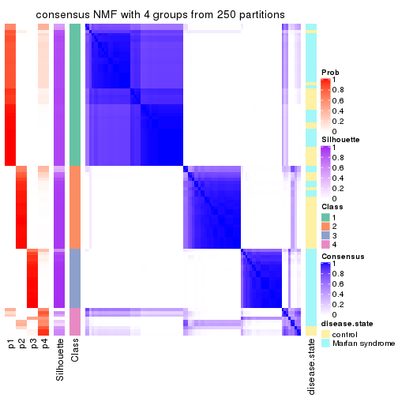</p>

</div>
<div id='tab-ATC-NMF-consensus-heatmap-4'>
<pre><code class="r">consensus_heatmap(res, k = 5)
</code></pre>

<p></p>

</div>
<div id='tab-ATC-NMF-consensus-heatmap-5'>
<pre><code class="r">consensus_heatmap(res, k = 6)
</code></pre>

<p></p>

</div>
</div>

Heatmaps for the membership of samples in all partitions to see how consistent they are:


<script>
$( function() {
	$( '#tabs-ATC-NMF-membership-heatmap' ).tabs();
} );
</script>
<div id='tabs-ATC-NMF-membership-heatmap'>
<ul>
<li><a href='#tab-ATC-NMF-membership-heatmap-1'>k = 2</a></li>
<li><a href='#tab-ATC-NMF-membership-heatmap-2'>k = 3</a></li>
<li><a href='#tab-ATC-NMF-membership-heatmap-3'>k = 4</a></li>
<li><a href='#tab-ATC-NMF-membership-heatmap-4'>k = 5</a></li>
<li><a href='#tab-ATC-NMF-membership-heatmap-5'>k = 6</a></li>
</ul>
<div id='tab-ATC-NMF-membership-heatmap-1'>
<pre><code class="r">membership_heatmap(res, k = 2)
</code></pre>

<p></p>

</div>
<div id='tab-ATC-NMF-membership-heatmap-2'>
<pre><code class="r">membership_heatmap(res, k = 3)
</code></pre>

<p></p>

</div>
<div id='tab-ATC-NMF-membership-heatmap-3'>
<pre><code class="r">membership_heatmap(res, k = 4)
</code></pre>

<p></p>

</div>
<div id='tab-ATC-NMF-membership-heatmap-4'>
<pre><code class="r">membership_heatmap(res, k = 5)
</code></pre>

<p></p>

</div>
<div id='tab-ATC-NMF-membership-heatmap-5'>
<pre><code class="r">membership_heatmap(res, k = 6)
</code></pre>

<p></p>

</div>
</div>

As soon as we have had the classes for columns, we can look for signatures
which are significantly different between classes which can be candidate marks
for certain classes. Following are the heatmaps for signatures.


Signature heatmaps where rows are scaled:


<script>
$( function() {
	$( '#tabs-ATC-NMF-get-signatures' ).tabs();
} );
</script>
<div id='tabs-ATC-NMF-get-signatures'>
<ul>
<li><a href='#tab-ATC-NMF-get-signatures-1'>k = 2</a></li>
<li><a href='#tab-ATC-NMF-get-signatures-2'>k = 3</a></li>
<li><a href='#tab-ATC-NMF-get-signatures-3'>k = 4</a></li>
<li><a href='#tab-ATC-NMF-get-signatures-4'>k = 5</a></li>
<li><a href='#tab-ATC-NMF-get-signatures-5'>k = 6</a></li>
</ul>
<div id='tab-ATC-NMF-get-signatures-1'>
<pre><code class="r">get_signatures(res, k = 2)
</code></pre>

<p></p>

</div>
<div id='tab-ATC-NMF-get-signatures-2'>
<pre><code class="r">get_signatures(res, k = 3)
</code></pre>

<p></p>

</div>
<div id='tab-ATC-NMF-get-signatures-3'>
<pre><code class="r">get_signatures(res, k = 4)
</code></pre>

<p></p>

</div>
<div id='tab-ATC-NMF-get-signatures-4'>
<pre><code class="r">get_signatures(res, k = 5)
</code></pre>

<p></p>

</div>
<div id='tab-ATC-NMF-get-signatures-5'>
<pre><code class="r">get_signatures(res, k = 6)
</code></pre>

<p></p>

</div>
</div>


Signature heatmaps where rows are not scaled:


<script>
$( function() {
	$( '#tabs-ATC-NMF-get-signatures-no-scale' ).tabs();
} );
</script>
<div id='tabs-ATC-NMF-get-signatures-no-scale'>
<ul>
<li><a href='#tab-ATC-NMF-get-signatures-no-scale-1'>k = 2</a></li>
<li><a href='#tab-ATC-NMF-get-signatures-no-scale-2'>k = 3</a></li>
<li><a href='#tab-ATC-NMF-get-signatures-no-scale-3'>k = 4</a></li>
<li><a href='#tab-ATC-NMF-get-signatures-no-scale-4'>k = 5</a></li>
<li><a href='#tab-ATC-NMF-get-signatures-no-scale-5'>k = 6</a></li>
</ul>
<div id='tab-ATC-NMF-get-signatures-no-scale-1'>
<pre><code class="r">get_signatures(res, k = 2, scale_rows = FALSE)
</code></pre>

<p></p>

</div>
<div id='tab-ATC-NMF-get-signatures-no-scale-2'>
<pre><code class="r">get_signatures(res, k = 3, scale_rows = FALSE)
</code></pre>

<p></p>

</div>
<div id='tab-ATC-NMF-get-signatures-no-scale-3'>
<pre><code class="r">get_signatures(res, k = 4, scale_rows = FALSE)
</code></pre>

<p></p>

</div>
<div id='tab-ATC-NMF-get-signatures-no-scale-4'>
<pre><code class="r">get_signatures(res, k = 5, scale_rows = FALSE)
</code></pre>

<p></p>

</div>
<div id='tab-ATC-NMF-get-signatures-no-scale-5'>
<pre><code class="r">get_signatures(res, k = 6, scale_rows = FALSE)
</code></pre>

<p></p>

</div>
</div>


Compare the overlap of signatures from different k:

```r
compare_signatures(res)
```


`get_signature()` returns a data frame invisibly. TO get the list of signatures, the function
call should be assigned to a variable explicitly. In following code, if `plot` argument is set
to `FALSE`, no heatmap is plotted while only the differential analysis is performed.

```r
# code only for demonstration
tb = get_signature(res, k = ..., plot = FALSE)
```

An example of the output of `tb` is:

```
#>   which_row         fdr    mean_1    mean_2 scaled_mean_1 scaled_mean_2 km
#> 1        38 0.042760348  8.373488  9.131774    -0.5533452     0.5164555  1
#> 2        40 0.018707592  7.106213  8.469186    -0.6173731     0.5762149  1
#> 3        55 0.019134737 10.221463 11.207825    -0.6159697     0.5749050  1
#> 4        59 0.006059896  5.921854  7.869574    -0.6899429     0.6439467  1
#> 5        60 0.018055526  8.928898 10.211722    -0.6204761     0.5791110  1
#> 6        98 0.009384629 15.714769 14.887706     0.6635654    -0.6193277  2
...
```

The columns in `tb` are:

1. `which_row`: row indices corresponding to the input matrix.
2. `fdr`: FDR for the differential test. 
3. `mean_x`: The mean value in group x.
4. `scaled_mean_x`: The mean value in group x after rows are scaled.
5. `km`: Row groups if k-means clustering is applied to rows.


UMAP plot which shows how samples are separated.


<script>
$( function() {
	$( '#tabs-ATC-NMF-dimension-reduction' ).tabs();
} );
</script>
<div id='tabs-ATC-NMF-dimension-reduction'>
<ul>
<li><a href='#tab-ATC-NMF-dimension-reduction-1'>k = 2</a></li>
<li><a href='#tab-ATC-NMF-dimension-reduction-2'>k = 3</a></li>
<li><a href='#tab-ATC-NMF-dimension-reduction-3'>k = 4</a></li>
<li><a href='#tab-ATC-NMF-dimension-reduction-4'>k = 5</a></li>
<li><a href='#tab-ATC-NMF-dimension-reduction-5'>k = 6</a></li>
</ul>
<div id='tab-ATC-NMF-dimension-reduction-1'>
<pre><code class="r">dimension_reduction(res, k = 2, method = &quot;UMAP&quot;)
</code></pre>

<p></p>

</div>
<div id='tab-ATC-NMF-dimension-reduction-2'>
<pre><code class="r">dimension_reduction(res, k = 3, method = &quot;UMAP&quot;)
</code></pre>

<p></p>

</div>
<div id='tab-ATC-NMF-dimension-reduction-3'>
<pre><code class="r">dimension_reduction(res, k = 4, method = &quot;UMAP&quot;)
</code></pre>

<p></p>

</div>
<div id='tab-ATC-NMF-dimension-reduction-4'>
<pre><code class="r">dimension_reduction(res, k = 5, method = &quot;UMAP&quot;)
</code></pre>

<p></p>

</div>
<div id='tab-ATC-NMF-dimension-reduction-5'>
<pre><code class="r">dimension_reduction(res, k = 6, method = &quot;UMAP&quot;)
</code></pre>

<p></p>

</div>
</div>


Following heatmap shows how subgroups are split when increasing `k`:

```r
collect_classes(res)
```


Test correlation between subgroups and known annotations. If the known
annotation is numeric, one-way ANOVA test is applied, and if the known
annotation is discrete, chi-squared contingency table test is applied.

```r
test_to_known_factors(res)
```

```
#>           n disease.state(p) k
#> ATC:NMF 100         3.91e-01 2
#> ATC:NMF 100         5.02e-07 3
#> ATC:NMF  93         2.63e-07 4
#> ATC:NMF  69         7.61e-07 5
#> ATC:NMF  80         1.32e-10 6
```


If matrix rows can be associated to genes, consider to use `functional_enrichment(res,
...)` to perform function enrichment for the signature genes. See [this vignette](http://bioconductor.org/packages/devel/bioc/vignettes/cola/inst/doc/functional_enrichment.html) for more detailed explanations.


 

## Session info


```r
sessionInfo()
```

```
#> R version 3.6.0 (2019-04-26)
#> Platform: x86_64-pc-linux-gnu (64-bit)
#> Running under: CentOS Linux 7 (Core)
#> 
#> Matrix products: default
#> BLAS:   /usr/lib64/libblas.so.3.4.2
#> LAPACK: /usr/lib64/liblapack.so.3.4.2
#> 
#> locale:
#>  [1] LC_CTYPE=en_GB.UTF-8       LC_NUMERIC=C               LC_TIME=en_GB.UTF-8       
#>  [4] LC_COLLATE=en_GB.UTF-8     LC_MONETARY=en_GB.UTF-8    LC_MESSAGES=en_GB.UTF-8   
#>  [7] LC_PAPER=en_GB.UTF-8       LC_NAME=C                  LC_ADDRESS=C              
#> [10] LC_TELEPHONE=C             LC_MEASUREMENT=en_GB.UTF-8 LC_IDENTIFICATION=C       
#> 
#> attached base packages:
#> [1] grid      stats     graphics  grDevices utils     datasets  methods   base     
#> 
#> other attached packages:
#> [1] genefilter_1.66.0    ComplexHeatmap_2.3.1 markdown_1.1         knitr_1.26          
#> [5] GetoptLong_0.1.7     cola_1.3.2          
#> 
#> loaded via a namespace (and not attached):
#>  [1] circlize_0.4.8       shape_1.4.4          xfun_0.11            slam_0.1-46         
#>  [5] lattice_0.20-38      splines_3.6.0        colorspace_1.4-1     vctrs_0.2.0         
#>  [9] stats4_3.6.0         blob_1.2.0           XML_3.98-1.20        survival_2.44-1.1   
#> [13] rlang_0.4.2          pillar_1.4.2         DBI_1.0.0            BiocGenerics_0.30.0 
#> [17] bit64_0.9-7          RColorBrewer_1.1-2   matrixStats_0.55.0   stringr_1.4.0       
#> [21] GlobalOptions_0.1.1  evaluate_0.14        memoise_1.1.0        Biobase_2.44.0      
#> [25] IRanges_2.18.3       parallel_3.6.0       AnnotationDbi_1.46.1 highr_0.8           
#> [29] Rcpp_1.0.3           xtable_1.8-4         backports_1.1.5      S4Vectors_0.22.1    
#> [33] annotate_1.62.0      skmeans_0.2-11       bit_1.1-14           microbenchmark_1.4-7
#> [37] brew_1.0-6           impute_1.58.0        rjson_0.2.20         png_0.1-7           
#> [41] digest_0.6.23        stringi_1.4.3        polyclip_1.10-0      clue_0.3-57         
#> [45] tools_3.6.0          bitops_1.0-6         magrittr_1.5         eulerr_6.0.0        
#> [49] RCurl_1.95-4.12      RSQLite_2.1.4        tibble_2.1.3         cluster_2.1.0       
#> [53] crayon_1.3.4         pkgconfig_2.0.3      zeallot_0.1.0        Matrix_1.2-17       
#> [57] xml2_1.2.2           httr_1.4.1           R6_2.4.1             mclust_5.4.5        
#> [61] compiler_3.6.0
```


